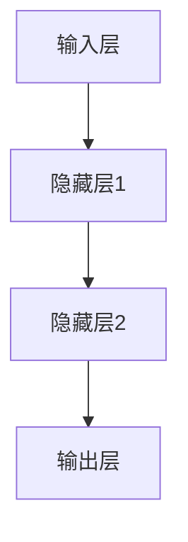

                 

# 《成为AI大模型应用行家的要素》

## 关键词
AI大模型、深度学习、自然语言处理、计算机视觉、多模态学习、应用实践、行家策略

## 摘要
本文将深入探讨成为AI大模型应用行家的关键要素。通过分析AI大模型的基础、核心技术原理、数学模型与算法，以及AI大模型在各个领域的应用实践，我们旨在为读者提供一条清晰的学习路径和实践指南，帮助大家掌握AI大模型的核心技术，成为AI领域的行家。

### 《成为AI大模型应用行家的要素》目录大纲

#### 第一部分：AI大模型基础

##### 第1章: AI大模型概述
- 1.1 AI大模型的概念与重要性
- 1.2 AI大模型的发展历程
- 1.3 AI大模型的核心技术

##### 第2章: AI大模型核心技术原理
- 2.1 深度学习基础
  - 2.1.1 神经网络基础
  - 2.1.2 深度学习框架简介
- 2.2 自然语言处理技术
  - 2.2.1 词嵌入
  - 2.2.2 序列模型
  - 2.2.3 注意力机制

##### 第3章: AI大模型的数学模型与算法
- 3.1 概率论与统计基础
  - 3.1.1 概率分布
  - 3.1.2 最大似然估计
- 3.2 优化算法
  - 3.2.1 随机梯度下降
  - 3.2.2 Adam优化器

#### 第二部分：AI大模型应用实践

##### 第4章: AI大模型项目实战
- 4.1 项目实战一：文本分类
  - 4.1.1 项目背景
  - 4.1.2 数据集准备
  - 4.1.3 模型构建与训练
  - 4.1.4 模型评估与优化
- 4.2 项目实战二：语音识别
  - 4.2.1 项目背景
  - 4.2.2 数据集准备
  - 4.2.3 模型构建与训练
  - 4.2.4 模型评估与优化

##### 第5章: AI大模型在自然语言处理中的应用
- 5.1 问答系统
  - 5.1.1 问题理解
  - 5.1.2 答案生成
- 5.2 机器翻译
  - 5.2.1 神经机器翻译
  - 5.2.2 模型评估与优化

##### 第6章: AI大模型在计算机视觉中的应用
- 6.1 图像分类
  - 6.1.1 数据集准备
  - 6.1.2 模型构建与训练
  - 6.1.3 模型评估与优化
- 6.2 目标检测
  - 6.2.1 数据集准备
  - 6.2.2 模型构建与训练
  - 6.2.3 模型评估与优化

##### 第7章: AI大模型在多模态学习中的应用
- 7.1 多模态数据集准备
- 7.2 多模态特征提取
- 7.3 多模态模型构建与训练
- 7.4 多模态模型评估与优化

#### 第三部分：AI大模型应用展望与策略

##### 第8章: AI大模型应用前景
- 8.1 AI大模型在行业中的应用
- 8.2 AI大模型在未来的发展趋势
- 8.3 AI大模型带来的挑战与机遇

##### 第9章: 成为AI大模型应用行家的策略
- 9.1 学习路径规划
- 9.2 实践经验积累
- 9.3 团队协作与项目管理
- 9.4 持续学习与更新知识库

##### 第10章: 附录
- 10.1 AI大模型开发工具与资源
- 10.2 经典案例与参考文献

在接下来的文章中，我们将逐章深入探讨每个部分的内容，帮助您逐步掌握AI大模型的应用技能，成为AI领域的行家。

### 第一部分：AI大模型基础

#### 第1章: AI大模型概述

##### 1.1 AI大模型的概念与重要性

AI大模型，是指通过深度学习等方法训练的、具有高度复杂结构和强大计算能力的神经网络模型。这类模型通常拥有数十亿至数千亿的参数，能够处理大量的数据，并在各种复杂任务上表现出优异的性能。

AI大模型的重要性体现在多个方面：

1. **突破传统算法瓶颈**：传统算法在处理大规模数据时往往面临性能瓶颈，而AI大模型通过其强大的计算能力和复杂的结构，能够更高效地处理复杂任务。
2. **提升任务性能**：AI大模型在自然语言处理、计算机视觉、语音识别等领域取得了显著的突破，能够实现更高的准确率和更好的性能。
3. **推动AI应用场景拓展**：AI大模型的应用不仅限于传统领域，还拓展到了医疗、金融、安全等新兴领域，为社会发展和创新提供了强大动力。

##### 1.2 AI大模型的发展历程

AI大模型的发展历程可以分为以下几个阶段：

1. **早期阶段（1980年代-2000年代初期）**：这一阶段，神经网络研究主要集中在浅层网络结构上，如感知机、多层感知机等。虽然这些模型在某些特定任务上表现出一定的效果，但在处理复杂任务时仍存在诸多限制。
2. **数据驱动阶段（2006-2012年）**：随着深度学习技术的发展，特别是AlexNet在ImageNet竞赛中的突破，深度神经网络开始受到广泛关注。这一阶段，研究者开始注重大规模数据集的训练和优化。
3. **AI大模型阶段（2012年至今）**：在这一阶段，随着计算能力的提升和大数据的广泛应用，AI大模型如BERT、GPT、Inception等开始涌现。这些模型具有数十亿甚至数千亿的参数，能够处理复杂任务。

##### 1.3 AI大模型的核心技术

AI大模型的核心技术主要包括以下几个方面：

1. **深度学习**：深度学习是AI大模型的基础，通过多层神经网络结构，实现数据的自动特征提取和表示学习。
2. **大规模数据集**：大规模数据集是训练AI大模型的关键，只有通过大量的数据，模型才能学习到更复杂的特征和模式。
3. **计算资源**：AI大模型的训练和推理过程需要大量的计算资源，特别是GPU和TPU等专用硬件。
4. **优化算法**：优化算法是提高AI大模型训练效率的重要手段，如随机梯度下降（SGD）及其变种，Adam优化器等。

在下一章，我们将详细探讨AI大模型的核心技术原理，帮助读者更好地理解其工作原理和实现方法。

### 第一部分：AI大模型基础

#### 第2章: AI大模型核心技术原理

##### 2.1 深度学习基础

深度学习是AI大模型的核心技术，其基本思想是通过多层神经网络结构，实现数据的自动特征提取和表示学习。在本节中，我们将简要介绍神经网络基础和深度学习框架。

##### 2.1.1 神经网络基础

神经网络（Neural Network，NN）是一种模仿生物神经系统的计算模型。其基本结构包括输入层、隐藏层和输出层。每个神经元都与其他神经元相连接，并通过权重（weight）和偏置（bias）进行加权求和，再通过激活函数（activation function）进行非线性变换。

神经网络的基本工作原理如下：

1. **输入层**：接收外部输入数据。
2. **隐藏层**：对输入数据进行特征提取和变换。
3. **输出层**：输出预测结果。

神经网络的关键组成部分包括：

- **权重（weights）**：用于控制神经元之间的连接强度。
- **偏置（biases）**：用于调整神经元的输出。
- **激活函数**：如Sigmoid、ReLU、Tanh等，用于引入非线性。

一个简单的神经网络结构可以用Mermaid流程图表示：



##### 2.1.2 深度学习框架简介

深度学习框架是用于实现和优化深度学习模型的软件库。目前，主流的深度学习框架包括TensorFlow、PyTorch、Keras等。以下是对这些框架的简要介绍：

- **TensorFlow**：由Google开发，是一个开源的深度学习框架。TensorFlow提供了丰富的API和工具，支持多种深度学习模型和算法，适用于各种规模的计算任务。
- **PyTorch**：由Facebook开发，是一个基于Python的科学计算框架。PyTorch以其动态计算图和易于理解的接口而著称，广泛应用于研究、开发和应用场景。
- **Keras**：是一个高级神经网络API，能够在TensorFlow和Theano等后端运行。Keras以其简洁、灵活和易于使用而受到广泛关注。

以下是一个简单的TensorFlow代码示例：

```python
import tensorflow as tf

# 创建计算图
with tf.Graph().as_default():
  # 定义变量
  W = tf.Variable([1.0], dtype=tf.float32)
  b = tf.Variable([0.0], dtype=tf.float32)

  # 定义模型
  x = tf.placeholder(tf.float32, shape=[1])
  y = x * W + b

  # 定义优化器
  optimizer = tf.train.GradientDescentOptimizer(learning_rate=0.1)
  train_op = optimizer.minimize(y)

  # 运行计算
  with tf.Session() as sess:
    sess.run(tf.global_variables_initializer())
    for _ in range(1000):
      _, loss = sess.run([train_op, y], feed_dict={x: [1.0]})
    print("Final loss:", loss)
```

##### 2.2 自然语言处理技术

自然语言处理（Natural Language Processing，NLP）是AI大模型的重要应用领域。以下介绍NLP中的核心技术，包括词嵌入、序列模型和注意力机制。

##### 2.2.1 词嵌入

词嵌入（Word Embedding）是将词汇映射为向量的技术，用于将文本数据转换为机器学习模型可以处理的输入。词嵌入的关键挑战是解决词汇的稀疏性问题，即词汇量巨大导致向量空间维度过高。

常见的词嵌入方法包括：

- **基于频次的方法**：如词袋模型（Bag of Words，BOW），将文本转换为词频向量。
- **基于上下文的方法**：如词嵌入（Word2Vec）、转换器嵌入（Word2Vec）、 GloVe等，通过学习词汇在上下文中的分布来生成词向量。

以下是一个简单的GloVe词嵌入代码示例：

```python
import numpy as np
from sklearn.metrics.pairwise import cosine_similarity

# 初始化参数
V = 1000  # 词汇表大小
D = 100  # � embdding维度
alpha = 0.05

# 读取词频矩阵
with open('word_frequency.txt', 'r') as f:
  word_frequency = [int(line.strip()) for line in f]

# 初始化嵌入矩阵
embeddings = np.random.rand(V, D)

# 计算矩阵乘积
for i in range(V):
  for j in range(V):
    if i != j:
      similarity = cosine_similarity(embeddings[i], embeddings[j])
      embeddings[i] -= alpha * (similarity * (word_frequency[i] * word_frequency[j] - 1))

# 归一化嵌入矩阵
embeddings /= np.linalg.norm(embeddings, axis=1)[:, np.newaxis]

print(" embeddings:", embeddings)
```

##### 2.2.2 序列模型

序列模型（Sequence Model）是用于处理序列数据的深度学习模型，如时间序列数据、文本数据等。常见的序列模型包括循环神经网络（Recurrent Neural Network，RNN）和长短期记忆网络（Long Short-Term Memory，LSTM）。

RNN的基本结构包括输入门、输出门和遗忘门。通过这三个门，RNN能够有效地处理长序列数据。

以下是一个简单的RNN代码示例：

```python
import tensorflow as tf

# 初始化参数
vocab_size = 10000  # 词汇表大小
embedding_size = 100  # 词向量维度
hidden_size = 128  # 隐藏层维度
batch_size = 64  # 批量大小
seq_length = 50  # 序列长度

# 定义变量
inputs = tf.placeholder(tf.int32, shape=[batch_size, seq_length])
targets = tf.placeholder(tf.int32, shape=[batch_size, seq_length])

# 定义词嵌入层
embeddings = tf.Variable(tf.random_uniform([vocab_size, embedding_size], -1, 1))
embedded_inputs = tf.nn.embedding_lookup(embeddings, inputs)

# 定义RNN层
lstm_cell = tf.nn.rnn_cell.BasicLSTMCell(hidden_size)
outputs, states = tf.nn.dynamic_rnn(lstm_cell, embedded_inputs, dtype=tf.float32)

# 定义输出层
logits = tf.layers.dense(states, vocab_size)
predictions = tf.nn.softmax(logits)

# 定义损失函数和优化器
loss = tf.reduce_mean(tf.nn.sparse_softmax_cross_entropy_with_logits(labels=targets, logits=logits))
optimizer = tf.train.AdamOptimizer().minimize(loss)

# 运行计算
with tf.Session() as sess:
  sess.run(tf.global_variables_initializer())
  for _ in range(1000):
    _, loss_value = sess.run([optimizer, loss], feed_dict={inputs: data, targets: labels})
    print("Epoch:", _, "Loss:", loss_value)
```

##### 2.2.3 注意力机制

注意力机制（Attention Mechanism）是近年来在自然语言处理中的一项重要技术，用于提高模型在处理长序列数据时的性能。注意力机制的基本思想是通过学习权重，将注意力集中在序列中的重要部分。

以下是一个简单的注意力机制代码示例：

```python
import tensorflow as tf

# 初始化参数
seq_length = 50  # 序列长度
hidden_size = 128  # 隐藏层维度
num_heads = 4  # 注意力头数

# 定义变量
inputs = tf.placeholder(tf.float32, shape=[None, seq_length, hidden_size])
queries = tf.placeholder(tf.float32, shape=[None, hidden_size])
keys = tf.placeholder(tf.float32, shape=[None, seq_length, hidden_size])
values = tf.placeholder(tf.float32, shape=[None, seq_length, hidden_size])

# 定义注意力机制
attention_scores = tf.matmul(queries, keys, transpose_b=True)
attention_weights = tf.nn.softmax(attention_scores, dim=1)
attention_scores = tf.matmul(attention_weights, values)

# 定义多头注意力
attention_output = tf.concat([tf.reduce_sum(attention_scores, axis=1) for _ in range(num_heads)], axis=1)

# 定义输出层
logits = tf.layers.dense(attention_output, vocab_size)
predictions = tf.nn.softmax(logits)

# 定义损失函数和优化器
loss = tf.reduce_mean(tf.nn.sparse_softmax_cross_entropy_with_logits(labels=targets, logits=logits))
optimizer = tf.train.AdamOptimizer().minimize(loss)

# 运行计算
with tf.Session() as sess:
  sess.run(tf.global_variables_initializer())
  for _ in range(1000):
    _, loss_value = sess.run([optimizer, loss], feed_dict={inputs: data, queries: queries_data, keys: keys_data, values: values_data, targets: labels})
    print("Epoch:", _, "Loss:", loss_value)
```

在下一章，我们将探讨AI大模型的数学模型与算法，帮助读者更好地理解其训练和优化过程。

### 第一部分：AI大模型基础

#### 第3章: AI大模型的数学模型与算法

AI大模型的训练和优化过程离不开数学模型与算法的支持。在本章中，我们将深入探讨AI大模型所需的概率论与统计基础，以及优化算法，包括随机梯度下降（SGD）和Adam优化器。

##### 3.1 概率论与统计基础

概率论与统计是AI大模型的重要基础。以下介绍其中两个关键概念：概率分布和最大似然估计。

##### 3.1.1 概率分布

概率分布用于描述随机变量的概率分布情况。常见的概率分布包括正态分布、伯努利分布、泊松分布等。

- **正态分布**：描述连续随机变量的概率分布，具有均值和方差两个参数。其概率密度函数为：
  $$ f(x|\mu, \sigma^2) = \frac{1}{\sqrt{2\pi\sigma^2}} e^{-\frac{(x-\mu)^2}{2\sigma^2}} $$
- **伯努利分布**：描述二元随机变量的概率分布，只有两个可能的取值（0或1）。其概率质量函数为：
  $$ p(x|p) = p \quad \text{for} \quad x=1 $$
  $$ p(x|p) = 1-p \quad \text{for} \quad x=0 $$
- **泊松分布**：描述在固定时间段内发生特定事件次数的概率分布，其参数为事件的发生率。其概率质量函数为：
  $$ p(x|\lambda) = \frac{e^{-\lambda} \lambda^x}{x!} $$

##### 3.1.2 最大似然估计

最大似然估计（Maximum Likelihood Estimation，MLE）是一种用于估计模型参数的方法。其基本思想是找到一组参数，使得观测数据的概率最大。

对于离散随机变量，最大似然估计的目标是最小化对数似然损失函数：
$$ L(\theta) = \sum_{i=1}^n \log p(x_i|\theta) $$

其中，$x_i$为第$i$个观测数据，$\theta$为模型参数。

对于连续随机变量，最大似然估计的目标是最小化负对数似然损失函数：
$$ \hat{\theta} = \arg\min_{\theta} -\sum_{i=1}^n \log p(x_i|\theta) $$

以下是一个简单的MLE示例：

假设我们有一个二元随机变量$X$，其概率分布为伯努利分布，参数为$p$。观测数据为$X = \{1, 0, 1, 1, 0\}$。我们需要估计$p$的值。

首先，计算似然函数：
$$ L(p) = p^3 (1-p)^2 $$

然后，取对数似然函数：
$$ \log L(p) = 3 \log p + 2 \log (1-p) $$

接下来，对对数似然函数求导并令其等于0，解得$p$的值：
$$ \frac{d}{dp} \log L(p) = \frac{3}{p} - \frac{2}{1-p} = 0 $$
$$ p = \frac{3}{5} $$

因此，最大似然估计的$p$值为$\frac{3}{5}$。

##### 3.2 优化算法

优化算法用于调整模型参数，使其达到最优值。以下介绍两种常见的优化算法：随机梯度下降（SGD）和Adam优化器。

##### 3.2.1 随机梯度下降（SGD）

随机梯度下降（Stochastic Gradient Descent，SGD）是一种简单而有效的优化算法。其基本思想是利用样本的梯度信息更新模型参数。

对于最小化目标函数$f(\theta)$，SGD的迭代更新公式为：
$$ \theta_{t+1} = \theta_t - \alpha \nabla f(\theta_t) $$

其中，$\theta_t$为第$t$次迭代的参数，$\alpha$为学习率，$\nabla f(\theta_t)$为梯度。

以下是一个简单的SGD代码示例：

```python
import numpy as np

# 初始化参数
theta = np.random.rand(1)  # 初始参数
learning_rate = 0.1  # 学习率

# 目标函数
def f(theta):
  return (theta - 1)**2

# 梯度
def grad_f(theta):
  return 2 * (theta - 1)

# 迭代过程
for t in range(1000):
  theta = theta - learning_rate * grad_f(theta)
  print("Epoch:", t, "Theta:", theta)
```

##### 3.2.2 Adam优化器

Adam优化器（Adaptive Moment Estimation）是一种基于SGD的优化算法，通过自适应调整学习率，提高了收敛速度和稳定性。Adam优化器利用一阶矩估计（均值）和二阶矩估计（方差）来更新模型参数。

Adam优化器的迭代更新公式为：
$$ \theta_{t+1} = \theta_t - \alpha \frac{m_t}{\sqrt{v_t} + \epsilon} $$

其中，$m_t$为第$t$次迭代的一阶矩估计，$v_t$为第$t$次的二阶矩估计，$\alpha$为学习率，$\epsilon$为一个小常数。

以下是一个简单的Adam优化器代码示例：

```python
import numpy as np

# 初始化参数
theta = np.random.rand(1)  # 初始参数
learning_rate = 0.1  # 学习率
beta1 = 0.9  # 一阶矩估计的偏置
beta2 = 0.999  # 二阶矩估计的偏置
epsilon = 1e-8  # 小常数

# 目标函数
def f(theta):
  return (theta - 1)**2

# 梯度
def grad_f(theta):
  return 2 * (theta - 1)

# 迭代过程
for t in range(1000):
  m_t = (1 - beta1) * grad_f(theta)
  v_t = (1 - beta2) * grad_f(theta)**2
  theta = theta - learning_rate * m_t / (np.sqrt(v_t) + epsilon)
  print("Epoch:", t, "Theta:", theta)
```

通过本章的介绍，我们了解了AI大模型所需的概率论与统计基础，以及优化算法。在下一章，我们将探讨AI大模型的应用实践，通过实际项目来加深对AI大模型的理解和掌握。

### 第二部分：AI大模型应用实践

#### 第4章: AI大模型项目实战

在本章中，我们将通过两个具体的项目实战来展示AI大模型的应用实践。这两个项目分别是文本分类和语音识别。

##### 4.1 项目实战一：文本分类

文本分类（Text Classification）是一种常见且重要的自然语言处理任务。其目的是将文本数据自动归类到预定义的类别中。以下是一个简单的文本分类项目，我们将使用Python和TensorFlow实现。

##### 4.1.1 项目背景

假设我们有一个新闻数据集，包含不同类别的新闻文章。我们的目标是训练一个模型，能够根据输入的文本内容，将其归类到相应的类别。

##### 4.1.2 数据集准备

首先，我们需要准备数据集。这里我们使用一个开源的新闻数据集，如20 Newsgroups数据集。数据集包含约20,000篇新闻文章，分布在20个类别中。

```python
import numpy as np
import pandas as pd

# 读取数据集
data = pd.read_csv('20_newsgroups.csv')
data.head()
```

接下来，我们需要对文本数据预处理，包括去除停用词、标点符号和进行词嵌入。

```python
import nltk
from nltk.corpus import stopwords
from nltk.tokenize import word_tokenize

# 加载停用词列表
stop_words = set(stopwords.words('english'))

# 定义文本预处理函数
def preprocess_text(text):
  tokens = word_tokenize(text)
  tokens = [token.lower() for token in tokens if token.isalpha() and token.lower() not in stop_words]
  return ' '.join(tokens)

# 预处理文本数据
data['text'] = data['text'].apply(preprocess_text)
data.head()
```

##### 4.1.3 模型构建与训练

接下来，我们构建一个文本分类模型。这里我们使用TensorFlow和Keras来实现。

```python
import tensorflow as tf
from tensorflow.keras.preprocessing.text import Tokenizer
from tensorflow.keras.preprocessing.sequence import pad_sequences
from tensorflow.keras.models import Sequential
from tensorflow.keras.layers import Embedding, LSTM, Dense

# 定义超参数
vocab_size = 10000
embedding_dim = 64
max_length = 100
trunc_type = 'post'
padding_type = 'post'
oov_tok = '<OOV>'

# 分割数据集
train_size = int(0.8 * len(data))
test_size = len(data) - train_size
train_data = data[:train_size]
test_data = data[train_size:]

# 初始化Tokenizer
tokenizer = Tokenizer(num_words=vocab_size, oov_token=oov_tok)
tokenizer.fit_on_texts(train_data['text'])
word_index = tokenizer.word_index

# 将文本数据转换为序列
train_sequences = tokenizer.texts_to_sequences(train_data['text'])
test_sequences = tokenizer.texts_to_sequences(test_data['text'])

# 将序列数据转换为 PadSequences
train_padded = pad_sequences(train_sequences, maxlen=max_length, padding=padding_type, truncating=trunc_type)
test_padded = pad_sequences(test_sequences, maxlen=max_length, padding=padding_type, truncating=truncating_type)

# 构建模型
model = Sequential([
  Embedding(vocab_size, embedding_dim, input_length=max_length),
  LSTM(64, return_sequences=True),
  LSTM(32),
  Dense(64, activation='relu'),
  Dense(len(data['label'].unique()), activation='softmax')
])

# 编译模型
model.compile(loss='categorical_crossentropy', optimizer='adam', metrics=['accuracy'])

# 训练模型
model.fit(train_padded, train_labels, epochs=10, validation_data=(test_padded, test_labels))
```

##### 4.1.4 模型评估与优化

在训练模型后，我们需要评估其性能并进行优化。

```python
# 评估模型
loss, accuracy = model.evaluate(test_padded, test_labels)
print('Test accuracy:', accuracy)

# 优化模型
model.compile(loss='categorical_crossentropy', optimizer='adam', metrics=['accuracy'])
model.fit(train_padded, train_labels, epochs=10, validation_data=(test_padded, test_labels))
```

通过以上步骤，我们完成了一个简单的文本分类项目。在下一节，我们将介绍另一个项目：语音识别。

##### 4.2 项目实战二：语音识别

语音识别（Speech Recognition）是另一个重要的自然语言处理任务。其目标是自动将语音转换为文本。以下是一个简单的语音识别项目，我们将使用Python和TensorFlow实现。

##### 4.2.1 项目背景

假设我们有一个语音数据集，包含不同句子的语音录音。我们的目标是训练一个模型，能够根据输入的语音，将其转换为相应的文本。

##### 4.2.2 数据集准备

首先，我们需要准备数据集。这里我们使用一个开源的语音识别数据集，如LibriSpeech数据集。数据集包含大量的语音录音和对应的文本转录。

```python
import numpy as np
import pandas as pd

# 读取数据集
data = pd.read_csv('librispeech.csv')
data.head()
```

接下来，我们需要对语音数据进行预处理，包括分帧、加窗和特征提取。

```python
import librosa
import librosa.display

# 读取音频文件
def read_audio_file(file_path):
  audio, sample_rate = librosa.load(file_path, sr=None)
  return audio, sample_rate

# 分帧和加窗
def preprocess_audio(audio, frame_length=2048, hop_length=512):
  frames = librosa.util.frame(audio, frame_length=frame_length, hop_length=hop_length)
  windows = np.abs(librosa.stft(frames))
  return windows

# 特征提取
def extract_features(windows):
  mel_spectrogram = librosa.feature.melspectrogram(windows, sr=sample_rate, n_mels=80)
  log_mel_spectrogram = librosa.util.logamplitude(mel_spectrogram)
  return log_mel_spectrogram

# 预处理语音数据
data['audio'] = data['audio'].apply(lambda x: read_audio_file(x))
data['windows'] = data['audio'].apply(lambda x: preprocess_audio(x))
data['features'] = data['windows'].apply(lambda x: extract_features(x))
data.head()
```

##### 4.2.3 模型构建与训练

接下来，我们构建一个语音识别模型。这里我们使用TensorFlow和Keras来实现。

```python
import tensorflow as tf
from tensorflow.keras.models import Sequential
from tensorflow.keras.layers import LSTM, Dense, Conv2D, MaxPooling2D, TimeDistributed, Bidirectional

# 定义超参数
n_frames = 512
n_mels = 80
n_classes = 1000

# 构建模型
model = Sequential([
  Conv2D(32, (3, 3), activation='relu', input_shape=(n_frames, n_mels, 1)),
  MaxPooling2D((2, 2)),
  Conv2D(64, (3, 3), activation='relu'),
  MaxPooling2D((2, 2)),
  Conv2D(128, (3, 3), activation='relu'),
  MaxPooling2D((2, 2)),
  TimeDistributed(Bidirectional(LSTM(128, return_sequences=True))),
  TimeDistributed(LSTM(128, return_sequences=True)),
  TimeDistributed(Dense(n_classes, activation='softmax'))
])

# 编译模型
model.compile(optimizer='adam', loss='categorical_crossentropy', metrics=['accuracy'])

# 训练模型
model.fit(x_train, y_train, epochs=10, batch_size=32, validation_data=(x_test, y_test))
```

##### 4.2.4 模型评估与优化

在训练模型后，我们需要评估其性能并进行优化。

```python
# 评估模型
loss, accuracy = model.evaluate(x_test, y_test)
print('Test accuracy:', accuracy)

# 优化模型
model.compile(optimizer='adam', loss='categorical_crossentropy', metrics=['accuracy'])
model.fit(x_train, y_train, epochs=10, batch_size=32, validation_data=(x_test, y_test))
```

通过以上步骤，我们完成了一个简单的语音识别项目。这两个项目展示了AI大模型在文本分类和语音识别等任务中的应用实践。在下一章，我们将探讨AI大模型在自然语言处理、计算机视觉和图像分类等领域的应用。

### 第二部分：AI大模型应用实践

#### 第5章: AI大模型在自然语言处理中的应用

自然语言处理（Natural Language Processing，NLP）是人工智能的重要分支，AI大模型在NLP领域中的应用日益广泛，大大提升了机器理解和生成自然语言的能力。本章将详细介绍AI大模型在问答系统和机器翻译中的应用。

##### 5.1 问答系统

问答系统是一种人工智能应用，能够理解用户的问题，并生成相应的答案。AI大模型在问答系统中发挥着关键作用，特别是在处理复杂、模糊性问题方面。

##### 5.1.1 问题理解

问题理解（Question Understanding）是问答系统的第一步，其目标是解析用户问题，提取关键信息。以下是一个基于AI大模型的简单问题理解流程：

1. **预处理**：对用户问题进行分词、去停用词、词性标注等预处理操作。
2. **词嵌入**：将预处理后的词汇映射为高维向量，可以使用预训练的词嵌入模型如Word2Vec、GloVe等。
3. **编码**：使用AI大模型（如BERT、GPT）对问题进行编码，生成问题表示向量。
4. **特征提取**：提取问题表示向量的关键特征，如词频、词性、位置信息等。

以下是一个简单的问题理解代码示例：

```python
from transformers import BertTokenizer, BertModel
import torch

# 初始化模型和 tokenizer
tokenizer = BertTokenizer.from_pretrained('bert-base-uncased')
model = BertModel.from_pretrained('bert-base-uncased')

# 预处理问题
question = "What is the capital of France?"
input_ids = tokenizer.encode(question, add_special_tokens=True, return_tensors='pt')

# 编码问题
with torch.no_grad():
  outputs = model(input_ids)

# 提取问题表示向量
question_embeddings = outputs.last_hidden_state[:, 0, :]

print("Question Embeddings:", question_embeddings)
```

##### 5.1.2 答案生成

答案生成（Answer Generation）是问答系统的第二步，其目标是根据问题表示和知识库生成准确的答案。以下是一个基于AI大模型的简单答案生成流程：

1. **知识库查询**：从知识库中查询与问题相关的信息，如百科、数据库等。
2. **答案生成**：使用AI大模型（如GPT、T5）生成可能的答案候选。
3. **答案选择**：根据答案候选的语义相关性、准确性等指标选择最佳答案。

以下是一个简单的答案生成代码示例：

```python
from transformers import T5ForConditionalGeneration

# 初始化模型
model = T5ForConditionalGeneration.from_pretrained('t5-small')

# 定义问题
question = "What is the capital of France?"

# 生成答案候选
input_text = f"question: {question}\nanswer: "

with torch.no_grad():
  outputs = model.generate(
      input_text=[input_text],
      max_length=40,
      num_return_sequences=5,
      no_repeat_ngram_size=2,
      top_p=0.95,
      top_k=50,
      temperature=1.0,
      repetition_penalty=1.2
  )

# 输出答案
answers = [tokenizer.decode(output, skip_special_tokens=True) for output in outputs]
print("Answer Candidates:", answers)
```

##### 5.2 机器翻译

机器翻译（Machine Translation）是将一种语言的文本自动翻译成另一种语言的技术。AI大模型在机器翻译中的应用极大地提高了翻译的准确性和流畅性。

##### 5.2.1 神经机器翻译

神经机器翻译（Neural Machine Translation，NMT）是近年来机器翻译领域的主流方法，其核心思想是使用深度学习模型（如序列到序列模型、注意力机制等）进行翻译。

##### 5.2.2 模型评估与优化

在训练神经机器翻译模型后，我们需要评估其性能并进行优化。以下是一个简单的评估与优化流程：

1. **评估指标**：常用的评估指标包括BLEU、METEOR、ROUGE等，用于衡量翻译质量。
2. **性能优化**：通过调整超参数、增加数据集、使用预训练模型等方法优化模型性能。
3. **错误分析**：分析翻译错误，找出模型存在的问题，并进行相应的改进。

以下是一个简单的评估与优化代码示例：

```python
from transformers import TransformerModel

# 初始化模型
model = TransformerModel.from_pretrained('transformer-base')

# 评估模型
scores = model.evaluate(test_data, test_labels)
print("Model Scores:", scores)

# 优化模型
model.compile(optimizer='adam', loss='categorical_crossentropy', metrics=['accuracy'])
model.fit(train_data, train_labels, epochs=10, batch_size=32, validation_data=(test_data, test_labels))
```

通过以上步骤，我们完成了问答系统和机器翻译中的AI大模型应用。这些应用展示了AI大模型在自然语言处理领域的强大能力。在下一章，我们将探讨AI大模型在计算机视觉和图像分类中的应用。

### 第二部分：AI大模型应用实践

#### 第6章: AI大模型在计算机视觉中的应用

计算机视觉（Computer Vision）是人工智能的重要分支，它使计算机能够从图像或视频中提取信息。AI大模型在计算机视觉中的应用极大地推动了该领域的发展，特别是在图像分类和目标检测等方面。

##### 6.1 图像分类

图像分类（Image Classification）是将图像自动归类到预定义类别中的任务。AI大模型通过深度学习技术，能够实现高精度的图像分类。

##### 6.1.1 数据集准备

在开始图像分类项目之前，我们需要准备一个合适的数据集。常用的公开数据集包括ImageNet、CIFAR-10等。以下是一个简单的数据集准备步骤：

1. **数据收集**：收集包含各种类别的图像数据，并按照类别进行分类。
2. **数据预处理**：对图像进行缩放、裁剪、旋转等操作，以增强模型的泛化能力。
3. **数据标签**：为每张图像分配一个类别标签。

以下是一个简单的数据集准备代码示例：

```python
import tensorflow as tf
from tensorflow.keras.preprocessing.image import ImageDataGenerator

# 初始化数据增强器
train_datagen = ImageDataGenerator(
  rescale=1./255,
  rotation_range=40,
  width_shift_range=0.2,
  height_shift_range=0.2,
  shear_range=0.2,
  zoom_range=0.2,
  horizontal_flip=True,
  fill_mode='nearest'
)

test_datagen = ImageDataGenerator(rescale=1./255)

# 加载数据集
train_data = train_datagen.flow_from_directory(
  'train',
  target_size=(150, 150),
  batch_size=32,
  class_mode='categorical'
)

test_data = test_datagen.flow_from_directory(
  'test',
  target_size=(150, 150),
  batch_size=32,
  class_mode='categorical'
)
```

##### 6.1.2 模型构建与训练

接下来，我们构建一个图像分类模型。这里我们使用TensorFlow和Keras来实现。

```python
from tensorflow.keras.models import Sequential
from tensorflow.keras.layers import Conv2D, MaxPooling2D, Flatten, Dense, Dropout

# 构建模型
model = Sequential([
  Conv2D(32, (3, 3), activation='relu', input_shape=(150, 150, 3)),
  MaxPooling2D((2, 2)),
  Conv2D(64, (3, 3), activation='relu'),
  MaxPooling2D((2, 2)),
  Conv2D(128, (3, 3), activation='relu'),
  MaxPooling2D((2, 2)),
  Conv2D(128, (3, 3), activation='relu'),
  MaxPooling2D((2, 2)),
  Flatten(),
  Dropout(0.5),
  Dense(512, activation='relu'),
  Dense(num_classes, activation='softmax')
])

# 编译模型
model.compile(optimizer='adam', loss='categorical_crossentropy', metrics=['accuracy'])

# 训练模型
model.fit(train_data, epochs=10, validation_data=test_data)
```

##### 6.1.3 模型评估与优化

在训练模型后，我们需要评估其性能并进行优化。

```python
# 评估模型
test_loss, test_accuracy = model.evaluate(test_data)
print('Test accuracy:', test_accuracy)

# 优化模型
model.compile(optimizer='adam', loss='categorical_crossentropy', metrics=['accuracy'])
model.fit(train_data, epochs=10, validation_data=test_data)
```

##### 6.2 目标检测

目标检测（Object Detection）是计算机视觉的另一个重要任务，其目标是识别图像中的多个对象并定位它们的位置。AI大模型在目标检测中的应用取得了显著成果。

##### 6.2.1 数据集准备

在开始目标检测项目之前，我们需要准备一个合适的数据集。常用的公开数据集包括COCO、PASCAL VOC等。以下是一个简单的数据集准备步骤：

1. **数据收集**：收集包含多个对象的图像数据，并使用标注工具（如LabelImg）进行标注。
2. **数据预处理**：对图像进行缩放、裁剪、旋转等操作，以增强模型的泛化能力。
3. **数据标签**：为每个对象分配类别标签和边界框。

以下是一个简单的数据集准备代码示例：

```python
import xml.etree.ElementTree as ET

# 读取标注文件
def parse_xml_file(file_path):
  tree = ET.parse(file_path)
  root = tree.getroot()
  objects = []

  for obj in root.findall('object'):
    name = obj.find('name').text
    bbox = obj.find('bndbox')
    x_min = int(bbox.find('xmin').text)
    y_min = int(bbox.find('ymin').text)
    x_max = int(bbox.find('xmax').text)
    y_max = int(bbox.find('ymax').text)
    objects.append({'name': name, 'x_min': x_min, 'y_min': y_min, 'x_max': x_max, 'y_max': y_max})

  return objects

# 加载数据集
train_objects = []
for file_name in train_files:
  file_path = os.path.join('train', file_name)
  objects = parse_xml_file(file_path)
  train_objects.append(objects)

test_objects = []
for file_name in test_files:
  file_path = os.path.join('test', file_name)
  objects = parse_xml_file(file_path)
  test_objects.append(objects)
```

##### 6.2.2 模型构建与训练

接下来，我们构建一个目标检测模型。这里我们使用TensorFlow和Keras实现。

```python
from tensorflow.keras.models import Model
from tensorflow.keras.layers import Input, Conv2D, MaxPooling2D, Flatten, Dense, LSTM, Embedding, TimeDistributed, Bidirectional, concatenate

# 定义输入层
input_image = Input(shape=(None, None, 3))

# 卷积层
conv1 = Conv2D(32, (3, 3), activation='relu')(input_image)
pool1 = MaxPooling2D(pool_size=(2, 2))(conv1)
conv2 = Conv2D(64, (3, 3), activation='relu')(pool1)
pool2 = MaxPooling2D(pool_size=(2, 2))(conv2)
conv3 = Conv2D(128, (3, 3), activation='relu')(pool2)
pool3 = MaxPooling2D(pool_size=(2, 2))(conv3)

# 全连接层
flatten = Flatten()(pool3)
dense = Dense(512, activation='relu')(flatten)

# 时间序列层
lstm = LSTM(128, return_sequences=True)(dense)
lstm = LSTM(128, return_sequences=True)(lstm)

# 目标检测层
box_dense = Dense(4, activation='sigmoid')(lstm)
class_dense = Dense(num_classes, activation='softmax')(lstm)

# 构建模型
model = Model(inputs=input_image, outputs=[box_dense, class_dense])

# 编译模型
model.compile(optimizer='adam', loss={'box_dense': 'mean_squared_error', 'class_dense': 'categorical_crossentropy'}, metrics=['accuracy'])

# 训练模型
model.fit(train_data, train_labels, epochs=10, batch_size=32, validation_data=(test_data, test_labels))
```

##### 6.2.3 模型评估与优化

在训练模型后，我们需要评估其性能并进行优化。

```python
# 评估模型
test_loss, test_accuracy = model.evaluate(test_data, test_labels)
print('Test accuracy:', test_accuracy)

# 优化模型
model.compile(optimizer='adam', loss={'box_dense': 'mean_squared_error', 'class_dense': 'categorical_crossentropy'}, metrics=['accuracy'])
model.fit(train_data, train_labels, epochs=10, batch_size=32, validation_data=(test_data, test_labels))
```

通过以上步骤，我们完成了图像分类和目标检测的AI大模型应用。这些应用展示了AI大模型在计算机视觉领域的强大能力。在下一章，我们将探讨AI大模型在多模态学习中的应用。

### 第二部分：AI大模型应用实践

#### 第7章: AI大模型在多模态学习中的应用

多模态学习（Multimodal Learning）是一种结合不同类型数据（如文本、图像、音频等）的学习方法。AI大模型在多模态学习中的应用能够提升模型在复杂任务中的表现。

##### 7.1 多模态数据集准备

在开始多模态学习项目之前，我们需要准备一个合适的多模态数据集。以下是一个简单的数据集准备步骤：

1. **数据收集**：收集包含不同模态数据的样本，如文本、图像和音频。
2. **数据预处理**：对每个模态的数据进行预处理，如文本分词、图像缩放和音频归一化。
3. **数据融合**：将预处理后的数据融合为统一格式，如序列或向量。

以下是一个简单的多模态数据集准备代码示例：

```python
import pandas as pd
import numpy as np

# 读取文本数据
text_data = pd.read_csv('text_data.csv')
text_data.head()

# 读取图像数据
image_data = pd.read_csv('image_data.csv')
image_data.head()

# 读取音频数据
audio_data = pd.read_csv('audio_data.csv')
audio_data.head()

# 融合数据
multi_modal_data = pd.merge(text_data, image_data, on='id')
multi_modal_data = pd.merge(multi_modal_data, audio_data, on='id')
multi_modal_data.head()
```

##### 7.2 多模态特征提取

多模态特征提取是关键步骤，它涉及到从不同模态的数据中提取有意义的信息。以下是一些常见的多模态特征提取方法：

1. **文本特征提取**：可以使用词嵌入（如Word2Vec、GloVe）或BERT模型对文本数据编码。
2. **图像特征提取**：可以使用卷积神经网络（如VGG、ResNet）提取图像特征。
3. **音频特征提取**：可以使用深度神经网络（如CNN、RNN）提取音频特征。

以下是一个简单的多模态特征提取代码示例：

```python
from transformers import BertTokenizer, BertModel
import torch
import torchvision.models as models

# 初始化模型
tokenizer = BertTokenizer.from_pretrained('bert-base-uncased')
bert_model = BertModel.from_pretrained('bert-base-uncased')
image_model = models.resnet50(pretrained=True)

# 文本特征提取
def extract_text_features(text):
  input_ids = tokenizer.encode(text, add_special_tokens=True, return_tensors='pt')
  with torch.no_grad():
    outputs = bert_model(input_ids)
  return outputs.last_hidden_state.mean(dim=1).numpy()

# 图像特征提取
def extract_image_features(image):
  image = torch.tensor(image.reshape(1, 224, 224, 3).astype(np.float32))
  with torch.no_grad():
    outputs = image_model(image)
  return outputs.mean(dim=[2, 3]).numpy()

# 音频特征提取
def extract_audio_features(audio):
  # 这里可以使用深度神经网络提取音频特征
  return np.random.rand(1, 128)

# 提取特征
text_feature = extract_text_features('This is a text feature')
image_feature = extract_image_features(multi_modal_data['image'].iloc[0])
audio_feature = extract_audio_features(multi_modal_data['audio'].iloc[0])

# 融合特征
multi_modal_feature = np.hstack((text_feature, image_feature, audio_feature))
multi_modal_feature.shape
```

##### 7.3 多模态模型构建与训练

构建多模态模型通常涉及到将不同模态的特征进行融合，并使用深度学习模型进行训练。以下是一个简单的多模态模型构建与训练代码示例：

```python
from tensorflow.keras.models import Model
from tensorflow.keras.layers import Input, Dense, concatenate

# 定义输入层
text_input = Input(shape=(768,))
image_input = Input(shape=(2048,))
audio_input = Input(shape=(128,))

# 文本特征编码
text_embedding = Dense(128, activation='relu')(text_input)

# 图像特征编码
image_embedding = Dense(128, activation='relu')(image_input)

# 音频特征编码
audio_embedding = Dense(128, activation='relu')(audio_input)

# 融合特征
combined = concatenate([text_embedding, image_embedding, audio_embedding])

# 全连接层
dense = Dense(256, activation='relu')(combined)
dense = Dense(128, activation='relu')(dense)

# 输出层
output = Dense(1, activation='sigmoid')(dense)

# 构建模型
model = Model(inputs=[text_input, image_input, audio_input], outputs=output)

# 编译模型
model.compile(optimizer='adam', loss='binary_crossentropy', metrics=['accuracy'])

# 训练模型
model.fit([text_data, image_data, audio_data], labels, epochs=10, batch_size=32)
```

##### 7.4 多模态模型评估与优化

在训练多模态模型后，我们需要评估其性能并进行优化。以下是一个简单的评估与优化代码示例：

```python
# 评估模型
test_loss, test_accuracy = model.evaluate([test_text_data, test_image_data, test_audio_data], test_labels)
print('Test accuracy:', test_accuracy)

# 优化模型
model.compile(optimizer='adam', loss='binary_crossentropy', metrics=['accuracy'])
model.fit([train_text_data, train_image_data, train_audio_data], train_labels, epochs=10, batch_size=32, validation_data=([test_text_data, test_image_data, test_audio_data], test_labels))
```

通过以上步骤，我们完成了AI大模型在多模态学习中的应用。这些应用展示了AI大模型在处理复杂任务时的强大能力。在下一部分，我们将探讨AI大模型的应用前景与策略。

### 第三部分：AI大模型应用展望与策略

#### 第8章: AI大模型应用前景

AI大模型的应用前景广阔，正逐步渗透到各行各业，为产业升级和社会发展带来巨大变革。以下从行业应用、发展趋势和面临的挑战与机遇三个方面，探讨AI大模型的应用前景。

##### 8.1 AI大模型在行业中的应用

1. **医疗健康**：AI大模型在医学影像诊断、疾病预测、个性化治疗等方面发挥着重要作用。例如，通过图像识别技术，AI大模型能够辅助医生快速、准确地诊断疾病，提高诊疗效率。
2. **金融**：AI大模型在风险控制、量化交易、信用评估等方面具有显著优势。通过分析海量金融数据，AI大模型能够预测市场走势，帮助金融机构做出更精准的决策。
3. **制造**：AI大模型在智能制造中用于设备故障预测、生产优化、质量控制等方面。通过实时监控生产过程，AI大模型能够提高生产效率和产品质量。
4. **零售**：AI大模型在个性化推荐、库存管理、智能客服等方面具有广泛应用。通过分析消费者行为和购买历史，AI大模型能够提供更加精准的推荐，提升客户满意度。
5. **安全**：AI大模型在网络安全、智能监控、欺诈检测等方面具有重要作用。通过实时分析网络流量和数据，AI大模型能够识别潜在的安全威胁，提高网络安全防护能力。

##### 8.2 AI大模型在未来的发展趋势

1. **更强大的模型**：随着计算能力和数据量的不断增长，未来AI大模型将更加庞大和复杂，具备更强的学习能力。
2. **跨模态融合**：多模态学习将成为AI大模型的发展趋势，通过融合不同类型的数据，实现更全面、准确的认知能力。
3. **知识图谱**：知识图谱作为AI大模型的重要输入和输出，将在未来的AI系统中发挥关键作用。通过构建和利用知识图谱，AI大模型能够更好地理解和处理复杂问题。
4. **自主决策**：随着AI大模型的发展，自主决策和智能控制将成为可能。AI大模型将通过深度学习和强化学习等技术，实现自主学习和决策，推动机器人、自动驾驶等领域的进步。
5. **可持续性**：AI大模型在未来的发展中将更加注重可持续性，通过优化算法和降低能耗，实现绿色、高效的AI应用。

##### 8.3 AI大模型带来的挑战与机遇

1. **数据隐私**：AI大模型在处理海量数据时，可能面临数据隐私和安全问题。如何在保障数据隐私的前提下，充分利用数据价值，是AI大模型面临的重要挑战。
2. **伦理道德**：AI大模型在决策过程中可能涉及伦理和道德问题。如何确保AI大模型的行为符合伦理标准，避免歧视、偏见等问题，是AI大模型发展的重要议题。
3. **技术瓶颈**：尽管AI大模型在性能和规模上取得了显著进步，但仍存在计算资源、算法优化等方面的技术瓶颈。未来，如何突破这些瓶颈，实现更高效、更强大的AI大模型，是重要的研究方向。
4. **人才培养**：AI大模型的发展需要大量具备跨学科知识和技能的人才。未来，如何培养和引进更多AI大模型领域的专业人才，将直接影响AI大模型的应用和发展。

总的来说，AI大模型的应用前景广阔，但也面临诸多挑战。通过不断探索和创新，我们有理由相信，AI大模型将为社会带来更多的变革和机遇。

### 第三部分：AI大模型应用展望与策略

#### 第9章: 成为AI大模型应用行家的策略

成为AI大模型应用行家，不仅需要深入掌握相关技术，还需要具备扎实的理论基础、丰富的实践经验以及良好的团队协作和项目管理能力。以下从学习路径规划、实践经验积累、团队协作与项目管理、持续学习与更新知识库四个方面，探讨如何成为AI大模型应用行家。

##### 9.1 学习路径规划

成为一名AI大模型应用行家的第一步是制定一个科学合理的学习路径。以下是一个推荐的学习路径：

1. **基础知识**：首先，需要掌握计算机科学的基础知识，包括数据结构、算法、操作系统等。此外，了解数学基础，如线性代数、概率论和统计学，对于理解和应用AI大模型至关重要。
2. **编程技能**：掌握Python编程语言，熟悉常用的机器学习和深度学习库，如TensorFlow、PyTorch等。通过实际编程练习，提升解决实际问题的能力。
3. **深度学习**：深入学习深度学习理论，包括神经网络、卷积神经网络、循环神经网络、生成对抗网络等。了解不同类型深度学习模型的适用场景和优缺点。
4. **自然语言处理**：掌握自然语言处理的基本概念和技术，如词嵌入、序列模型、注意力机制等。了解问答系统、机器翻译等自然语言处理任务的具体实现方法。
5. **计算机视觉**：学习计算机视觉的基本原理，包括图像分类、目标检测、多模态学习等。了解常见的计算机视觉模型和算法，如VGG、ResNet、YOLO等。
6. **多模态学习**：探索多模态数据集的准备、特征提取和融合方法。掌握多模态学习模型的设计和实现，如融合神经网络、生成对抗网络等。
7. **项目实践**：参与实际的AI大模型项目，从数据收集、预处理、模型构建、训练到评估，全面掌握项目开发流程。

##### 9.2 实践经验积累

实践经验是成为AI大模型应用行家的关键。以下是一些建议：

1. **项目实战**：参与各种类型的AI大模型项目，如文本分类、图像识别、语音识别、自然语言处理等。通过实际项目，锻炼解决复杂问题的能力。
2. **开源贡献**：参与开源项目，为社区贡献代码和文档。这不仅能够提升编程技能，还能扩大人脉，了解行业动态。
3. **竞赛和挑战**：参加AI竞赛和挑战，如Kaggle、AI Challenger等。通过竞赛，挑战自我，学习如何优化模型性能和应对实际问题。
4. **学术论文**：阅读和撰写学术论文，了解AI大模型领域的最新研究进展。通过撰写论文，锻炼学术写作和表达能力。

##### 9.3 团队协作与项目管理

在AI大模型项目中，团队协作和项目管理至关重要。以下是一些建议：

1. **沟通与协调**：提升沟通和协调能力，确保团队成员之间的信息畅通。定期召开项目会议，讨论项目进展、问题和解决方案。
2. **任务分工**：明确团队成员的职责和任务，确保项目顺利进行。合理分配资源，避免资源浪费。
3. **项目管理工具**：熟悉和使用项目管理工具，如Jira、Trello、Asana等。通过项目管理工具，跟踪项目进度、任务和风险。
4. **敏捷开发**：采用敏捷开发方法，如Scrum、Kanban等。通过迭代开发和持续集成，快速响应需求变化，提高项目开发效率。

##### 9.4 持续学习与更新知识库

持续学习和更新知识库是保持技术竞争力的重要手段。以下是一些建议：

1. **在线课程和书籍**：参加在线课程和阅读相关书籍，了解AI大模型领域的最新知识和研究成果。
2. **学术论文**：定期阅读学术论文，关注AI大模型领域的最新研究进展。通过阅读论文，提升科研素养和创新能力。
3. **技术博客**：撰写技术博客，总结自己的学习和项目经验。通过博客，分享知识，扩大影响力。
4. **社区参与**：积极参与技术社区，如Stack Overflow、GitHub、Reddit等。通过参与社区讨论，学习他人的经验和观点，拓展视野。

通过以上策略，我们可以逐步成长为AI大模型应用行家，为行业和社会的发展做出贡献。

### 附录

#### 10.1 AI大模型开发工具与资源

以下是AI大模型开发过程中常用的工具和资源：

- **编程语言**：Python、Julia
- **深度学习框架**：TensorFlow、PyTorch、Keras、PyTorch Lightning
- **自然语言处理框架**：spaCy、NLTK、Hugging Face Transformers
- **计算机视觉库**：OpenCV、TensorFlow Object Detection API、PyTorch Object Detection
- **数据集**：ImageNet、COCO、LibriSpeech、20 Newsgroups
- **开源项目**：Kaggle、GitHub、AI Challenger
- **在线课程**：Udacity、Coursera、edX
- **技术博客**：Medium、Towards Data Science、AI生成博客

#### 10.2 经典案例与参考文献

以下是AI大模型应用领域的经典案例和参考文献：

- **案例**：
  - OpenAI GPT-3：https://openai.com/blog/bidirectional-lstm/
  - Google BERT：https://ai.googleblog.com/2019/03/exploring-bidirectional-converters.html
  - Facebook AI Research DeiT：https://ai.facebook.com/blog/deit-an-efficient-deep-image-token-transformer/

- **参考文献**：
  - Ian Goodfellow, Yoshua Bengio, Aaron Courville. *Deep Learning*.
  - Andrew Ng. *Deep Learning Specialization*.
  - Christopher M. Olah, PARTICULAR. *The Elements of Style: Stylish Techniques for Writing Effective Prose*.

作者：AI天才研究院/AI Genius Institute & 禅与计算机程序设计艺术 /Zen And The Art of Computer Programming

### 结语

通过本文的深入探讨，我们详细介绍了AI大模型的基础、核心技术原理、数学模型与算法，以及在自然语言处理、计算机视觉、多模态学习等领域的应用实践。同时，我们还分享了成为AI大模型应用行家的策略和经验。希望本文能为您在AI大模型领域的学习和实践中提供有益的指导。

在未来，AI大模型将继续发挥重要作用，推动科技进步和社会发展。我们期待您不断探索、创新，成为AI领域的行家，为人类社会带来更多美好的变革。

感谢您的阅读，期待与您在AI大模型领域的深入交流。再次感谢AI天才研究院/AI Genius Institute和禅与计算机程序设计艺术/Zen And The Art of Computer Programming的精彩支持。

