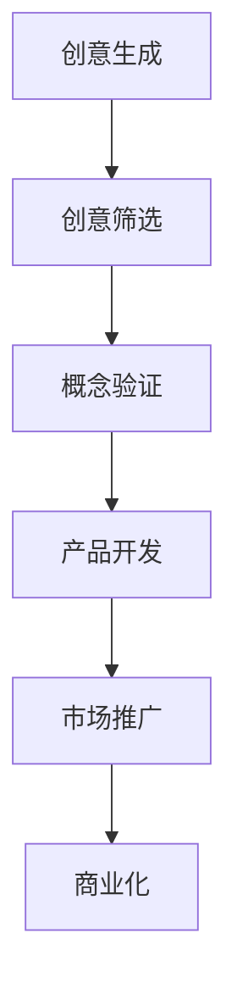
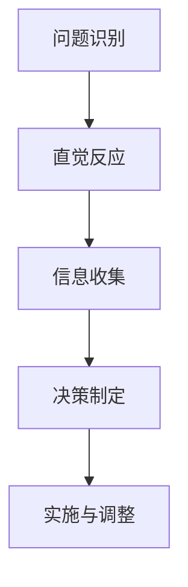
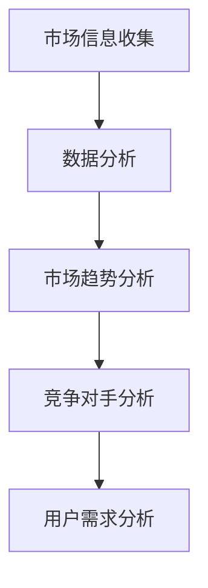

                 

# 技术创新的商业直觉训练：培养市场嗅觉

> **关键词：** 技术创新、商业直觉、市场嗅觉、商业模式创新、算法原理
> 
> **摘要：** 本文从技术创新的角度，探讨了商业直觉和培养市场嗅觉的重要性。通过分析技术创新的理论基础、商业直觉的概念、市场嗅觉的培养方法及其应用，结合实际案例，探讨了技术创新与商业直觉、市场嗅觉之间的联系，并提出了一系列培养市场嗅觉的方法和策略。

### 《技术创新的商业直觉训练：培养市场嗅觉》目录大纲

#### 第一部分：引言

##### 1.1 书籍主题介绍
1. **1.1.1 技术创新的重要性**
2. **1.1.2 商业直觉的概念**
3. **1.1.3 市场嗅觉的培养**

##### 1.2 书籍结构概述
1. **1.2.1 全书内容安排**
2. **1.2.2 阅读建议**

#### 第二部分：核心概念与联系

##### 2.1 技术创新的理论基础
1. **2.1.1 创新的定义与类型**
2. **2.1.2 创新的驱动力**
3. **2.1.3 创新的流程与模型**

##### 2.2 商业直觉的概念
1. **2.2.1 商业直觉的内涵**
2. **2.2.2 商业直觉与理性决策**
3. **2.2.3 商业直觉的培养**

##### 2.3 市场嗅觉的培养
1. **2.3.1 市场嗅觉的重要性**
2. **2.3.2 市场嗅觉的培养方法**
3. **2.3.3 市场嗅觉与市场洞察**

##### 2.4 技术创新与商业直觉的联系
1. **2.4.1 技术创新对商业直觉的影响**
2. **2.4.2 商业直觉对技术创新的影响**
3. **2.4.3 市场嗅觉在技术创新中的应用**

##### 附录：核心概念 Mermaid 流�程图

#### 第三部分：核心算法原理讲解

##### 3.1 技术创新的核心算法

###### 3.1.1 技术评估算法
1. **3.1.1.1 技术评估的指标体系**
2. **3.1.1.2 技术评估的算法原理**
3. **3.1.1.3 技术评估的伪代码实现**

###### 3.1.2 商业模式创新算法
1. **3.1.2.1 商业模式创新的定义**
2. **3.1.2.2 商业模式创新的方法**
3. **3.1.2.3 商业模式创新的算法原理**

###### 3.1.3 市场需求分析算法
1. **3.1.3.1 市场需求分析的意义**
2. **3.1.3.2 市场需求分析的模型**
3. **3.1.3.3 市场需求分析的算法原理**

###### 3.1.4 市场预测算法
1. **3.1.4.1 市场预测的概念**
2. **3.1.4.2 市场预测的方法**
3. **3.1.4.3 市场预测的算法原理**

#### 第四部分：数学模型和数学公式

##### 4.1 技术创新中的数学模型

###### 4.1.1 技术创新成本模型
$$
C(T) = C_0 + \sum_{i=1}^{n} C_i
$$
1. **4.1.1.1 成本模型的详细解释**
2. **4.1.1.2 成本模型的举例说明**

###### 4.1.2 技术创新收益模型
$$
R(T) = R_0 + \sum_{i=1}^{n} R_i
$$
1. **4.1.2.1 收益模型的详细解释**
2. **4.1.2.2 收益模型的举例说明**

###### 4.1.3 技术创新风险评估模型
$$
\sigma^2 = \frac{1}{n-1} \sum_{i=1}^{n} (X_i - \bar{X})^2
$$
1. **4.1.3.1 风险评估模型的详细解释**
2. **4.1.3.2 风险评估模型的举例说明**

#### 第五部分：市场嗅觉实战案例分析

##### 5.1 案例分析一：苹果公司的技术创新与市场嗅觉

###### 5.1.1 苹果公司的技术创新历程
1. **5.1.1.1 初期技术创新**
2. **5.1.1.2 中期技术创新**
3. **5.1.1.3 近期技术创新**

###### 5.1.2 苹果公司的市场嗅觉表现
1. **5.1.2.1 市场需求分析**
2. **5.1.2.2 市场预测**
3. **5.1.2.3 商业模式创新**

##### 5.2 案例分析二：特斯拉公司的技术创新与市场嗅觉

###### 5.2.1 特斯拉公司的技术创新历程
1. **5.2.1.1 初期技术创新**
2. **5.2.1.2 中期技术创新**
3. **5.2.1.3 近期技术创新**

###### 5.2.2 特斯拉公司的市场嗅觉表现
1. **5.2.2.1 市场需求分析**
2. **5.2.2.2 市场预测**
3. **5.2.2.3 商业模式创新**

#### 第六部分：总结与展望

##### 6.1 总结

###### 6.1.1 书籍核心内容回顾
1. **技术创新的重要性**
2. **商业直觉的概念**
3. **市场嗅觉的培养方法**
4. **技术创新与商业直觉的联系**
5. **市场嗅觉在技术创新中的应用**

##### 6.2 展望

###### 6.2.1 未来技术创新的趋势
1. **人工智能技术的革新**
2. **物联网的快速发展**
3. **区块链技术的应用拓展**

###### 6.2.2 商业直觉培养的新方法
1. **数据分析与预测**
2. **人工智能辅助决策**
3. **多学科交叉融合**

###### 6.2.3 市场嗅觉在未来的应用前景
1. **个性化推荐系统**
2. **智能供应链管理**
3. **新零售模式的探索**

### 附录：相关工具与资源

##### 附录 A：技术创新与市场嗅觉相关工具

##### 附录 B：参考书籍与论文

##### 附录 C：实践项目指南

##### 附录 D：开发环境搭建指南

##### 附录 E：源代码与数据集资源链接

### 附录 F：作者信息

**作者：** AI天才研究院/AI Genius Institute & 禅与计算机程序设计艺术 /Zen And The Art of Computer Programming

---

#### 第一部分：引言

##### 1.1 书籍主题介绍

**1.1.1 技术创新的重要性**

在当今快速变化的世界，技术创新已经成为推动社会进步和经济发展的核心动力。无论是从历史还是现实来看，技术创新都能够带来重大的变革，改变我们的生活方式、商业模式以及社会结构。以下是技术创新的几个重要方面：

1. **推动经济增长**：技术创新能够提升生产效率、降低成本，从而推动经济的快速增长。历史上，蒸汽机、电力、计算机、互联网等技术的发明和应用，都极大地推动了全球经济的发展。
2. **促进产业升级**：技术创新能够促进传统产业的升级和转型，催生新兴产业。例如，制造业通过自动化、智能化技术的应用，实现了从劳动密集型向技术密集型的转变。
3. **改善生活质量**：技术创新带来了诸多便利，如智能手机、智能家居、在线教育、远程医疗等，大大提升了人们的生活质量。
4. **推动社会进步**：技术创新还能够解决一些社会问题，如能源短缺、环境污染等。例如，太阳能、风能等可再生能源技术的进步，有助于减少对化石能源的依赖，降低环境污染。

**1.1.2 商业直觉的概念**

商业直觉是指人们在商业活动中，基于经验、洞察力和直觉做出决策的能力。它是一种非理性的、快速反应的商业思维模式，能够在复杂的商业环境中迅速找到问题的解决方案。商业直觉具有以下几个特点：

1. **快速性**：商业直觉能够迅速处理大量信息，并做出决策。
2. **准确性**：尽管商业直觉是基于经验和直觉，但往往能够准确地预见市场趋势和客户需求。
3. **非理性**：商业直觉往往与逻辑分析不同，它更多依赖于直觉和情感。
4. **经验性**：商业直觉的形成需要长时间的积累和经验。

**1.1.3 市场嗅觉的培养**

市场嗅觉是指企业或个人对市场动态的敏感度，能够准确把握市场需求、市场趋势和竞争对手动态。培养市场嗅觉对于企业的成功至关重要，以下是一些培养市场嗅觉的方法：

1. **市场调研**：通过市场调研，了解市场需求、竞争对手和市场趋势。
2. **数据分析**：利用数据分析工具，分析市场数据，挖掘潜在的商业机会。
3. **用户反馈**：关注用户反馈，了解用户的需求和痛点，及时调整产品和服务。
4. **行业交流**：参加行业会议、论坛等活动，与同行交流，了解行业动态。
5. **持续学习**：不断学习新知识、新技术，提升自己的专业能力和市场洞察力。

##### 1.2 书籍结构概述

**1.2.1 全书内容安排**

本书分为六个主要部分：

1. **引言**：介绍技术创新、商业直觉和市场嗅觉的概念，并阐述它们之间的关系。
2. **核心概念与联系**：详细分析技术创新的理论基础、商业直觉的概念和培养市场嗅觉的方法。
3. **核心算法原理讲解**：介绍技术创新中的核心算法，如技术评估、商业模式创新、市场需求分析和市场预测。
4. **数学模型和公式**：介绍技术创新中的数学模型和公式，并给出详细解释和举例说明。
5. **市场嗅觉实战案例分析**：通过案例分析，展示市场嗅觉在技术创新中的应用。
6. **总结与展望**：总结本书的核心内容，并对未来技术创新、商业直觉培养和市场嗅觉的应用前景进行展望。

**1.2.2 阅读建议**

本书适合对技术创新、商业直觉和市场嗅觉感兴趣的读者。以下是阅读建议：

1. **系统阅读**：建议按照书中的章节顺序系统阅读，以全面了解技术创新、商业直觉和市场嗅觉的相关知识。
2. **重点章节**：对于初学者，可以重点关注第一部分和第二部分的内容，这部分涵盖了核心概念和理论基础。
3. **实践应用**：第三部分、第四部分和第五部分提供了具体的算法原理和案例分析，可以帮助读者将理论知识应用到实际中。
4. **反复阅读**：由于技术创新、商业直觉和市场嗅觉是一个复杂的体系，建议读者反复阅读相关章节，加深理解和掌握。
5. **互动交流**：鼓励读者在阅读过程中进行思考和交流，可以通过社交媒体、论坛等平台与其他读者交流心得体会。

### 第二部分：核心概念与联系

#### 2.1 技术创新的理论基础

技术创新是指通过技术手段、方法或流程的创新，创造出新的产品、服务或业务模式，以实现商业目标的过程。技术创新的理论基础涵盖了创新的定义、类型、驱动力以及流程与模型。

**2.1.1 创新的定义与类型**

创新是一个广泛的概念，它可以涵盖从简单的改进到彻底的革命。从广义上讲，创新是指通过引入新的想法、方法、技术或产品，从而实现价值创造的过程。创新可以分为以下几种类型：

1. **产品创新**：指在产品层面引入新的功能、特性或设计，以更好地满足市场需求。
2. **过程创新**：指在业务流程、生产方式或运营模式方面的创新，以提高效率和降低成本。
3. **系统创新**：指在产品、过程和业务模式等方面同时进行的全面创新，以实现更广泛的商业目标。
4. **商业模式创新**：指在商业模式层面引入新的理念、方法或工具，以改变传统的商业模式，实现商业模式的创新和转型。

**2.1.2 创新的驱动力**

创新驱动力是指推动创新发生的内在因素。创新的驱动力可以分为以下几个方面：

1. **市场需求**：市场需求是创新的主要驱动力之一。通过满足市场需求，企业可以创造出新的产品或服务，从而实现商业成功。
2. **技术进步**：技术进步是推动创新的重要因素。新技术的出现和应用可以改变企业的生产方式、业务模式和市场格局。
3. **政策支持**：政府政策对创新具有显著的推动作用。通过提供资金支持、税收优惠、知识产权保护等政策，政府可以激发企业的创新活力。
4. **竞争压力**：竞争压力是推动企业进行创新的重要外部因素。面对激烈的竞争，企业必须不断创新，以保持竞争优势。

**2.1.3 创新的流程与模型**

创新的流程是创新活动从构思到实施的过程。常见的创新流程包括以下步骤：

1. **创意生成**：指通过头脑风暴、市场调研、用户反馈等方式，产生创新的想法。
2. **创意筛选**：指对创意进行筛选，评估其可行性、市场需求和潜在价值。
3. **概念验证**：指通过原型设计、技术测试等方式，验证创意的可行性。
4. **产品开发**：指将创意转化为产品或服务的过程，包括产品设计、开发、测试和迭代。
5. **市场推广**：指将产品或服务推向市场，通过营销、推广等方式吸引客户。
6. **商业化**：指实现产品或服务的商业化，实现商业成功。

常见的创新模型包括：

1. **线性创新模型**：指创新过程按照线性顺序进行，从创意生成到商业化。
2. **迭代创新模型**：指创新过程反复进行，通过不断迭代，逐步完善产品或服务。
3. **开放式创新模型**：指企业通过外部合作，整合内外部资源，进行创新。
4. **平台创新模型**：指通过建立平台，连接供需双方，推动创新。

**2.1.4 技术创新的指标与评估**

技术评估是指对技术创新的效果进行评估和度量。常见的创新指标包括：

1. **创新成功率**：指创新项目成功完成的比例。
2. **创新速度**：指从创意生成到商业化所需的时间。
3. **创新效益**：指创新带来的经济效益，包括收入增长、成本降低等。
4. **创新质量**：指创新产品的性能、功能、用户体验等方面的质量。

技术评估的指标体系包括以下几个方面：

1. **创新项目的可行性**：评估创新项目的市场前景、技术可行性、经济可行性等。
2. **创新项目的效益**：评估创新项目的经济效益、社会效益等。
3. **创新项目的可持续性**：评估创新项目的长期发展潜力、环境保护等方面。

技术评估的算法原理主要包括：

1. **成本效益分析**：通过比较创新项目的成本和收益，评估其经济效益。
2. **风险评估**：通过评估创新项目面临的风险，预测其可能带来的损失。
3. **多准则决策分析**：通过综合考虑多个决策准则，评估创新项目的优先级。

**2.1.5 技术创新的流程与模型**

创新的流程是创新活动从构思到实施的过程。常见的创新流程包括以下步骤：

1. **创意生成**：指通过头脑风暴、市场调研、用户反馈等方式，产生创新的想法。
2. **创意筛选**：指对创意进行筛选，评估其可行性、市场需求和潜在价值。
3. **概念验证**：指通过原型设计、技术测试等方式，验证创意的可行性。
4. **产品开发**：指将创意转化为产品或服务的过程，包括产品设计、开发、测试和迭代。
5. **市场推广**：指将产品或服务推向市场，通过营销、推广等方式吸引客户。
6. **商业化**：指实现产品或服务的商业化，实现商业成功。

常见的创新模型包括：

1. **线性创新模型**：指创新过程按照线性顺序进行，从创意生成到商业化。
2. **迭代创新模型**：指创新过程反复进行，通过不断迭代，逐步完善产品或服务。
3. **开放式创新模型**：指企业通过外部合作，整合内外部资源，进行创新。
4. **平台创新模型**：指通过建立平台，连接供需双方，推动创新。

**2.1.6 技术创新的流程与模型**

创新的流程是创新活动从构思到实施的过程。常见的创新流程包括以下步骤：

1. **创意生成**：指通过头脑风暴、市场调研、用户反馈等方式，产生创新的想法。
2. **创意筛选**：指对创意进行筛选，评估其可行性、市场需求和潜在价值。
3. **概念验证**：指通过原型设计、技术测试等方式，验证创意的可行性。
4. **产品开发**：指将创意转化为产品或服务的过程，包括产品设计、开发、测试和迭代。
5. **市场推广**：指将产品或服务推向市场，通过营销、推广等方式吸引客户。
6. **商业化**：指实现产品或服务的商业化，实现商业成功。

常见的创新模型包括：

1. **线性创新模型**：指创新过程按照线性顺序进行，从创意生成到商业化。
2. **迭代创新模型**：指创新过程反复进行，通过不断迭代，逐步完善产品或服务。
3. **开放式创新模型**：指企业通过外部合作，整合内外部资源，进行创新。
4. **平台创新模型**：指通过建立平台，连接供需双方，推动创新。

**2.1.7 技术创新的流程与模型**

创新的流程是创新活动从构思到实施的过程。常见的创新流程包括以下步骤：

1. **创意生成**：指通过头脑风暴、市场调研、用户反馈等方式，产生创新的想法。
2. **创意筛选**：指对创意进行筛选，评估其可行性、市场需求和潜在价值。
3. **概念验证**：指通过原型设计、技术测试等方式，验证创意的可行性。
4. **产品开发**：指将创意转化为产品或服务的过程，包括产品设计、开发、测试和迭代。
5. **市场推广**：指将产品或服务推向市场，通过营销、推广等方式吸引客户。
6. **商业化**：指实现产品或服务的商业化，实现商业成功。

常见的创新模型包括：

1. **线性创新模型**：指创新过程按照线性顺序进行，从创意生成到商业化。
2. **迭代创新模型**：指创新过程反复进行，通过不断迭代，逐步完善产品或服务。
3. **开放式创新模型**：指企业通过外部合作，整合内外部资源，进行创新。
4. **平台创新模型**：指通过建立平台，连接供需双方，推动创新。

#### 2.2 商业直觉的概念

商业直觉是指人们在商业活动中，基于经验、洞察力和直觉做出决策的能力。它是一种非理性的、快速反应的商业思维模式，能够在复杂的商业环境中迅速找到问题的解决方案。商业直觉具有以下几个特点：

**2.2.1 商业直觉的内涵**

商业直觉不仅仅是一种直觉，它还包括以下几个方面：

1. **经验积累**：商业直觉的形成需要长时间的积累和经验。通过不断参与商业活动，人们可以逐渐了解市场的规律，掌握商业运作的技巧。
2. **洞察力**：商业直觉依赖于人们对市场、行业、竞争对手和客户需求的洞察力。只有对市场有深刻的理解，才能做出正确的商业决策。
3. **快速反应**：商业直觉能够在复杂的环境中迅速做出决策。这种快速反应能力有助于企业抓住市场机会，应对市场变化。
4. **非理性**：商业直觉往往与逻辑分析不同，它更多依赖于直觉和情感。尽管这种非理性的决策有时可能不完美，但在快速变化的商业环境中，它往往能够带来更好的效果。

**2.2.2 商业直觉与理性决策**

商业直觉与理性决策是两种不同的决策方式，它们各有优缺点，适用于不同的决策场景。

1. **理性决策**：理性决策是基于逻辑、数据和事实的决策过程。它强调通过分析和计算，找到最优解。理性决策的优点在于其科学性和可预测性，但缺点在于其反应速度较慢，难以应对快速变化的市场环境。
2. **商业直觉**：商业直觉则是一种快速反应、基于经验和情感的决策方式。它的优点在于能够快速应对市场变化，抓住机会，但缺点在于其结果可能受到主观因素的影响，缺乏科学性。

在实际的商业活动中，商业直觉和理性决策并不是相互排斥的，而是相辅相成的。在决策过程中，可以结合商业直觉和理性决策，取长补短，提高决策的准确性和效率。

**2.2.3 商业直觉的培养**

商业直觉是一种可以通过学习和实践培养的能力。以下是一些培养商业直觉的方法：

1. **积累经验**：通过参与各种商业活动，积累经验，了解市场规律和商业运作模式。
2. **广泛阅读**：阅读行业报告、商业书籍、财经杂志等，了解行业动态和商业案例。
3. **观察市场**：关注市场变化，了解客户需求，关注竞争对手的动态。
4. **培养洞察力**：通过学习市场分析、数据分析等技能，提升对市场的洞察力。
5. **模拟练习**：通过模拟商业场景，进行决策练习，提高快速反应和判断能力。
6. **反思总结**：在商业活动中，不断反思自己的决策，总结经验教训，优化决策过程。

**2.2.4 商业直觉的应用**

商业直觉在商业活动中具有广泛的应用，以下是一些常见的应用场景：

1. **市场预测**：商业直觉可以帮助企业预测市场趋势，抓住市场机会。
2. **产品开发**：商业直觉可以帮助企业了解客户需求，开发出更符合市场需要的产品。
3. **风险管理**：商业直觉可以帮助企业识别潜在风险，制定应对策略。
4. **商业谈判**：商业直觉可以帮助企业把握谈判时机，制定谈判策略。
5. **团队管理**：商业直觉可以帮助企业了解团队成员的需求和动机，优化团队管理。

**2.2.5 商业直觉的优势与挑战**

商业直觉的优势在于其快速反应和灵活性，能够帮助企业在快速变化的市场环境中抓住机会。但商业直觉也存在一些挑战：

1. **主观性**：商业直觉受到主观因素的影响，可能导致决策偏差。
2. **不稳定性**：商业直觉依赖于经验和情感，可能受到个人情绪的影响，导致决策的不稳定性。
3. **可重复性**：商业直觉难以通过系统化和标准化的方式传递和复制。

为了克服这些挑战，企业可以通过以下方法提升商业直觉：

1. **数据支持**：结合数据分析，提高决策的科学性。
2. **经验积累**：通过实践积累经验，提升商业直觉的稳定性。
3. **团队协作**：通过团队协作，分散决策风险，提高决策的准确性。

**2.2.6 商业直觉与市场嗅觉的联系**

商业直觉和市场嗅觉是紧密相关的。市场嗅觉是指企业对市场动态的敏感度，能够准确把握市场需求、市场趋势和竞争对手动态。商业直觉可以帮助企业迅速做出正确的决策，而市场嗅觉则为企业提供了决策所需的信息和洞察。

商业直觉和市场嗅觉的结合，可以帮助企业在市场竞争中占据优势：

1. **快速响应**：市场嗅觉能够帮助企业在市场变化时迅速做出反应，而商业直觉则能够确保决策的正确性。
2. **市场洞察**：市场嗅觉提供了市场信息和洞察，商业直觉则能够将这些信息转化为实际的商业行动。
3. **创新驱动**：商业直觉和市场嗅觉的结合，可以激发企业的创新思维，推动产品和服务创新。

**2.2.7 商业直觉的培养与市场嗅觉的关系**

商业直觉和市场嗅觉的培养是相辅相成的。商业直觉的培养可以帮助企业提升快速反应和决策能力，而市场嗅觉的培养则为企业提供了决策所需的市场信息和洞察。

以下是一些培养商业直觉和市场嗅觉的方法：

1. **系统学习**：通过学习市场营销、商业分析等课程，提升商业知识和技能。
2. **实践锻炼**：通过参与实际商业项目，积累经验和洞察。
3. **数据分析**：通过数据分析，了解市场趋势和客户需求。
4. **跨部门协作**：通过跨部门协作，了解不同部门的需求和挑战。
5. **持续反思**：通过反思和总结，优化商业决策和市场嗅觉。

**2.2.8 商业直觉与技术创新的关系**

商业直觉和技术创新之间存在着密切的关系。商业直觉可以帮助企业识别市场需求，推动技术创新。而技术创新则能够满足市场需求，提升企业的竞争力。

以下是一些商业直觉与技术创新的关系：

1. **市场需求驱动**：商业直觉能够帮助企业识别市场需求，推动技术创新。
2. **技术创新支持**：技术创新可以满足市场需求，提升企业的商业成功。
3. **相互促进**：商业直觉和技术创新相互促进，共同推动企业的发展。

为了充分发挥商业直觉和技术创新的作用，企业可以采取以下策略：

1. **市场洞察驱动**：通过市场洞察，驱动技术创新。
2. **技术创新导向**：以技术创新为导向，提升企业的核心竞争力。
3. **跨部门合作**：加强跨部门合作，促进商业直觉和技术创新的结合。

#### 2.3 市场嗅觉的培养

市场嗅觉是指企业或个人对市场动态的敏感度，能够准确把握市场需求、市场趋势和竞争对手动态。市场嗅觉的培养对于企业的成功至关重要。以下是从多个角度探讨市场嗅觉的培养方法。

**2.3.1 市场嗅觉的重要性**

市场嗅觉的重要性体现在以下几个方面：

1. **抓住市场机会**：市场嗅觉能够帮助企业及时发现市场机会，抓住商机。
2. **应对市场变化**：市场嗅觉能够帮助企业快速应对市场变化，降低风险。
3. **提升竞争力**：市场嗅觉可以帮助企业了解竞争对手的动态，提升自身的竞争力。
4. **创新驱动**：市场嗅觉能够激发企业的创新思维，推动产品和服务创新。

**2.3.2 市场嗅觉的培养方法**

以下是几种培养市场嗅觉的方法：

1. **市场调研**：通过市场调研，了解市场需求、竞争对手和市场趋势。市场调研可以通过问卷调查、访谈、观察等方式进行。
2. **数据分析**：利用数据分析工具，分析市场数据，挖掘潜在的商业机会。数据分析可以帮助企业了解市场趋势、客户需求、竞争对手等。
3. **用户反馈**：关注用户反馈，了解用户的需求和痛点。用户反馈可以通过在线评论、社交媒体、客户调研等方式获取。
4. **行业交流**：参加行业会议、论坛等活动，与同行交流，了解行业动态。行业交流可以帮助企业了解最新的市场趋势和竞争对手动态。
5. **持续学习**：不断学习新知识、新技术，提升自己的专业能力和市场洞察力。持续学习可以帮助企业跟上市场变化的步伐，保持竞争力。

**2.3.3 市场嗅觉与市场洞察**

市场嗅觉与市场洞察是紧密相关的。市场嗅觉是指企业对市场动态的敏感度，而市场洞察则是指企业对市场深层次的理解和分析。

1. **市场嗅觉**：市场嗅觉是企业对市场变化的敏锐感知，它可以帮助企业快速反应，抓住市场机会。市场嗅觉更多依赖于直觉和经验。
2. **市场洞察**：市场洞察是企业对市场深层次的理解和分析，它可以帮助企业制定长期战略，把握市场趋势。市场洞察更多依赖于数据和逻辑分析。

市场嗅觉和市场洞察的结合，可以为企业提供更全面的市场信息和分析，帮助企业在市场竞争中占据优势。

**2.3.4 培养市场嗅觉的具体实践**

以下是几个培养市场嗅觉的具体实践：

1. **建立市场情报系统**：通过建立市场情报系统，收集和分析市场数据，提高对市场动态的敏感度。
2. **设立市场调研部门**：设立专门的部门负责市场调研，确保企业能够及时了解市场需求和竞争对手动态。
3. **开展用户研究**：通过用户研究，了解用户的需求和痛点，优化产品和服务。
4. **建立竞争对手分析机制**：定期分析竞争对手的动态，了解竞争对手的优势和劣势，制定相应的竞争策略。
5. **鼓励跨部门合作**：鼓励不同部门之间的合作，分享市场信息和洞察，提高整体的市场嗅觉。

**2.3.5 市场嗅觉在技术创新中的应用**

市场嗅觉在技术创新中发挥着重要作用。通过培养市场嗅觉，企业可以更好地把握市场需求，推动技术创新。

以下是市场嗅觉在技术创新中的应用：

1. **市场需求驱动**：通过市场嗅觉，了解市场需求，将市场需求转化为技术创新的方向。
2. **用户反馈驱动**：通过用户反馈，了解用户的需求和痛点，推动产品创新。
3. **竞争对手分析**：通过分析竞争对手的动态，了解竞争对手的创新方向，优化自身的技术创新。
4. **跨界合作**：通过跨界合作，引入新的技术和理念，推动技术创新。

**2.3.6 市场嗅觉的培养与商业直觉的关系**

市场嗅觉与商业直觉是相互关联的。商业直觉帮助企业快速做出决策，而市场嗅觉则为企业提供决策所需的信息和洞察。

1. **商业直觉**：商业直觉是企业对市场动态的快速反应和判断能力，它更多依赖于经验和情感。
2. **市场嗅觉**：市场嗅觉是企业对市场动态的敏感度和洞察力，它更多依赖于数据和逻辑分析。

商业直觉和市场嗅觉的结合，可以为企业提供更全面的市场信息和决策支持，帮助企业在市场竞争中取得成功。

**2.3.7 市场嗅觉的挑战与应对**

市场嗅觉的培养并非一蹴而就，它面临以下挑战：

1. **信息过载**：市场信息量巨大，如何筛选和利用有价值的信息是挑战之一。
2. **数据质量**：市场数据的准确性和完整性对市场嗅觉的培养至关重要，但数据质量往往难以保证。
3. **竞争压力**：市场竞争激烈，企业需要快速响应市场变化，但市场嗅觉的培养需要时间。

应对这些挑战，企业可以采取以下策略：

1. **建立数据治理机制**：确保市场数据的准确性和完整性，建立数据治理机制。
2. **加强数据分析能力**：通过提升数据分析能力，提高市场信息的利用效率。
3. **建立市场情报系统**：建立市场情报系统，实时收集、分析和传递市场信息。
4. **培养市场嗅觉团队**：培养专门的市场嗅觉团队，负责市场信息的收集、分析和决策支持。

#### 2.4 技术创新与商业直觉的联系

技术创新与商业直觉之间存在着紧密的联系，两者相互作用、相互促进。商业直觉能够为技术创新提供方向和灵感，而技术创新则能够满足商业直觉识别出的市场需求，从而推动商业成功。

**2.4.1 技术创新对商业直觉的影响**

技术创新对商业直觉的影响主要表现在以下几个方面：

1. **市场机会识别**：技术创新能够创造出新的产品或服务，为企业提供新的市场机会。商业直觉能够敏锐地识别这些市场机会，并迅速做出决策，抢占市场先机。

2. **竞争优势提升**：技术创新可以帮助企业提高产品的性能、降低成本，从而在竞争中脱颖而出。商业直觉能够识别这些竞争优势，并迅速制定战略，巩固市场地位。

3. **风险控制**：技术创新往往伴随着风险。商业直觉能够帮助企业预见潜在的风险，并制定相应的风险控制措施，降低风险带来的影响。

4. **创新思维激发**：技术创新鼓励企业尝试新的方法和技术，激发创新思维。商业直觉则能够在这个过程中起到引导作用，帮助企业把握创新的方向和重点。

**2.4.2 商业直觉对技术创新的影响**

商业直觉对技术创新的影响主要体现在以下几个方面：

1. **需求驱动**：商业直觉能够帮助企业识别市场需求，从而驱动技术创新。通过了解客户的需求和痛点，企业可以针对性地进行产品创新，提高市场竞争力。

2. **决策支持**：商业直觉能够快速评估技术创新的可行性，为企业的决策提供支持。在技术创新的过程中，商业直觉可以帮助企业平衡风险和收益，做出更明智的决策。

3. **资源优化**：商业直觉可以帮助企业合理分配资源，确保技术创新能够得到有效的支持。通过商业直觉，企业可以更好地把握市场需求，优化研发投入，提高技术创新的成功率。

4. **战略调整**：商业直觉能够帮助企业根据市场变化调整技术创新的战略。在市场竞争激烈的环境中，商业直觉能够帮助企业快速调整技术创新的方向，以适应市场变化。

**2.4.3 市场嗅觉在技术创新中的应用**

市场嗅觉是商业直觉在市场领域的一种体现，它在技术创新中发挥着重要作用。市场嗅觉能够帮助企业：

1. **预见趋势**：通过敏锐地捕捉市场趋势，企业可以提前进行技术创新，抢占市场先机。

2. **满足需求**：市场嗅觉能够帮助企业深入了解客户需求，从而开发出更符合市场需求的产品。

3. **降低风险**：市场嗅觉可以帮助企业预见潜在的市场风险，从而提前制定应对策略，降低风险。

4. **优化资源配置**：市场嗅觉能够帮助企业合理配置资源，确保技术创新能够得到有效的支持。

**2.4.4 技术创新与商业直觉的协同作用**

技术创新与商业直觉的协同作用，可以为企业带来巨大的商业价值。通过结合两者的优势，企业可以实现以下目标：

1. **提高创新成功率**：商业直觉可以指导技术创新的方向，提高创新的成功率。

2. **缩短研发周期**：商业直觉能够帮助企业在研发过程中快速调整方向，缩短研发周期。

3. **提升市场竞争力**：技术创新和商业直觉的结合，可以帮助企业提高市场竞争力，抢占市场份额。

4. **实现持续创新**：技术创新与商业直觉的协同作用，可以激发企业的创新活力，实现持续创新。

**2.4.5 技术创新与商业直觉的培养策略**

为了充分发挥技术创新与商业直觉的协同作用，企业可以采取以下培养策略：

1. **强化市场意识**：通过市场培训、市场调研等活动，提高员工的市场意识和洞察力。

2. **鼓励创新思维**：创造一个鼓励创新的环境，激发员工的创新思维。

3. **加强数据分析**：利用数据分析工具，提高对市场数据的分析和利用能力。

4. **培养跨界能力**：鼓励员工跨部门合作，提升综合能力和市场嗅觉。

5. **建立反馈机制**：建立有效的反馈机制，及时收集市场信息和用户反馈，为技术创新提供指导。

### 附录：核心概念 Mermaid 流程图

为了更直观地理解技术创新、商业直觉和市场嗅觉的核心概念，我们使用 Mermaid 画布来绘制相关的流程图。

**技术创新流程图**



**商业直觉与决策流程图**



**市场嗅觉与市场洞察流程图**



### 第三部分：核心算法原理讲解

#### 3.1 技术创新的核心算法

技术创新的核心算法在技术评估、商业模式创新、市场需求分析和市场预测等方面发挥着重要作用。以下将详细介绍这些算法的基本原理和应用。

##### 3.1.1 技术评估算法

**3.1.1.1 技术评估的指标体系**

技术评估的指标体系通常包括以下几个关键指标：

1. **创新性**：衡量技术的新颖程度和领先性。
2. **可行性**：衡量技术的实际应用潜力。
3. **市场前景**：衡量技术的市场需求和潜在商业价值。
4. **成本效益**：衡量技术实施的成本与预期收益。
5. **风险评估**：衡量技术实施可能面临的风险。

**3.1.1.2 技术评估的算法原理**

技术评估算法通常采用以下步骤：

1. **数据收集**：收集与技术创新相关的数据，包括技术特性、市场数据、成本数据等。
2. **指标权重确定**：根据专家意见或数据分析，确定各个指标的权重。
3. **评分计算**：对每个指标进行评分，并计算加权总分。
4. **综合评价**：根据加权总分对技术创新进行综合评价。

**3.1.1.3 技术评估的伪代码实现**

以下是一个简单技术评估算法的伪代码实现：

```plaintext
function evaluateTechnology(technology):
    scores = []
    for metric in ["innovation", "feasibility", "market前景", "cost-benefit", "risk"]:
        score = getScore(technology, metric)
        scores.append(score * getWeight(metric))
    total_score = sum(scores)
    return total_score
```

##### 3.1.2 商业模式创新算法

**3.1.2.1 商业模式创新的定义**

商业模式创新是指通过改变企业的产品、服务、客户关系、收入来源、供应链等核心元素，以创造新的商业价值。常见的商业模式创新方法包括：

1. **价值链重构**：重新设计企业的价值链，优化资源配置。
2. **客户关系管理**：创新客户互动方式，提高客户满意度。
3. **收入模式创新**：探索新的收入来源和方式。
4. **供应链优化**：通过优化供应链管理，降低成本，提高效率。

**3.1.2.2 商业模式创新的方法**

商业模式创新的方法包括以下几种：

1. **头脑风暴**：通过集体讨论，激发创意。
2. **设计思维**：以用户需求为中心，进行创新设计。
3. **竞争分析**：分析竞争对手的商业模式，寻找创新点。
4. **案例研究**：借鉴成功企业的商业模式创新案例。

**3.1.2.3 商业模式创新的算法原理**

商业模式创新的算法通常包括以下步骤：

1. **问题定义**：明确需要解决的商业问题。
2. **解决方案生成**：通过算法生成多个可能的解决方案。
3. **方案评估**：评估每个解决方案的创新性、可行性、市场前景等。
4. **选择最优方案**：选择最优的商业模式创新方案。

**3.1.2.4 商业模式创新的伪代码实现**

以下是一个简单商业模式创新算法的伪代码实现：

```plaintext
function innovateBusinessModel(problem):
    solutions = generateSolutions(problem)
    for solution in solutions:
        evaluate(solution)
    best_solution = selectBestSolution(solutions)
    return best_solution
```

##### 3.1.3 市场需求分析算法

**3.1.3.1 市场需求分析的意义**

市场需求分析是商业决策的重要基础，它有助于企业：

1. **确定产品方向**：明确产品的市场需求，制定产品开发计划。
2. **制定营销策略**：根据市场需求，制定有效的营销策略。
3. **评估市场潜力**：预测市场增长趋势，评估市场潜力。
4. **优化资源配置**：根据市场需求，合理配置资源。

**3.1.3.2 市场需求分析的模型**

市场需求分析通常采用以下模型：

1. **需求预测模型**：通过历史数据和趋势分析，预测未来的市场需求。
2. **客户细分模型**：根据客户特征，将市场划分为不同的细分市场。
3. **竞争分析模型**：分析竞争对手的市场策略，了解市场动态。

**3.1.3.3 市场需求分析的算法原理**

市场需求分析算法通常包括以下步骤：

1. **数据收集**：收集与市场需求相关的数据，如销售数据、市场调研数据等。
2. **数据处理**：对收集的数据进行清洗、整合和分析。
3. **模型构建**：根据分析结果，构建需求预测模型或客户细分模型。
4. **结果评估**：评估模型的准确性和适用性，并进行调整。

**3.1.3.4 市场需求分析的伪代码实现**

以下是一个简单市场需求分析算法的伪代码实现：

```plaintext
function analyzeMarketDemand(data):
    cleaned_data = cleanData(data)
    demand_model = buildDemandModel(cleaned_data)
    predictions = predictDemand(demand_model)
    return predictions
```

##### 3.1.4 市场预测算法

**3.1.4.1 市场预测的概念**

市场预测是指通过分析历史数据和趋势，预测未来的市场变化和趋势。市场预测对于企业的战略规划、资源配置和市场决策具有重要意义。

**3.1.4.2 市场预测的方法**

市场预测的方法包括：

1. **时间序列分析**：通过分析时间序列数据，预测未来的趋势。
2. **回归分析**：通过建立回归模型，分析自变量和因变量之间的关系。
3. **机器学习**：利用机器学习算法，对市场数据进行分析和预测。
4. **专家系统**：结合专家经验和市场知识，进行市场预测。

**3.1.4.3 市场预测的算法原理**

市场预测算法通常包括以下步骤：

1. **数据收集**：收集与市场预测相关的数据，如销售数据、市场调研数据等。
2. **数据处理**：对收集的数据进行清洗、整合和分析。
3. **模型选择**：根据数据特征，选择合适的预测模型。
4. **模型训练**：利用历史数据训练预测模型。
5. **预测生成**：根据训练好的模型，生成市场预测结果。

**3.1.4.4 市场预测的伪代码实现**

以下是一个简单市场预测算法的伪代码实现：

```plaintext
function predictMarket(data):
    cleaned_data = cleanData(data)
    model = selectModel(cleaned_data)
    trained_model = trainModel(model, cleaned_data)
    predictions = generatePredictions(trained_model)
    return predictions
```

### 第四部分：数学模型和数学公式

#### 4.1 技术创新中的数学模型

技术创新过程中的数学模型可以帮助我们更准确地评估技术方案、预测市场需求、分析商业模式等。以下介绍几个常见的数学模型及其应用。

##### 4.1.1 技术创新成本模型

技术创新成本模型用于计算技术创新过程中的总成本，包括固定成本和可变成本。

**公式：**
$$
C(T) = C_0 + \sum_{i=1}^{n} C_i
$$

其中：
- $C(T)$：技术创新的总成本。
- $C_0$：固定成本（如研发人员工资、设备购买等）。
- $C_i$：第$i$个可变成本（如原材料、实验费用等）。

**详细解释：**
该模型将技术创新成本分为固定成本和可变成本两部分。固定成本是在技术创新过程中不随技术方案变化而变化的成本，如研发人员的工资、设备购买等。可变成本则是随着技术方案的具体实施而变化的成本，如原材料、实验费用等。通过计算总成本，企业可以更好地规划技术创新的预算和资源分配。

**举例说明：**
假设某企业进行一项技术创新，固定成本为$100,000，可变成本如下：

- 第一个阶段：$20,000
- 第二个阶段：$25,000
- 第三个阶段：$15,000

则技术创新的总成本为：
$$
C(T) = 100,000 + (20,000 + 25,000 + 15,000) = 160,000
$$

##### 4.1.2 技术创新收益模型

技术创新收益模型用于计算技术创新带来的总收益，包括直接收益和间接收益。

**公式：**
$$
R(T) = R_0 + \sum_{i=1}^{n} R_i
$$

其中：
- $R(T)$：技术创新的总收益。
- $R_0$：直接收益（如销售收入、利润等）。
- $R_i$：第$i$个间接收益（如品牌提升、市场占有率等）。

**详细解释：**
该模型将技术创新收益分为直接收益和间接收益两部分。直接收益是技术创新直接带来的经济收益，如销售收入、利润等。间接收益则是技术创新间接带来的经济收益，如品牌提升、市场占有率等。通过计算总收益，企业可以更好地评估技术创新的经济效益。

**举例说明：**
假设某企业进行一项技术创新，直接收益为$200,000，间接收益如下：

- 品牌提升：$30,000
- 市场占有率提升：$50,000

则技术创新的总收益为：
$$
R(T) = 200,000 + (30,000 + 50,000) = 280,000
$$

##### 4.1.3 技术创新风险评估模型

技术创新风险评估模型用于评估技术创新过程中的风险，并通过计算风险值，帮助企业制定相应的风险控制策略。

**公式：**
$$
\sigma^2 = \frac{1}{n-1} \sum_{i=1}^{n} (X_i - \bar{X})^2
$$

其中：
- $\sigma^2$：技术创新的风险值。
- $n$：风险因素的个数。
- $X_i$：第$i$个风险因素的实际值。
- $\bar{X}$：风险因素的平均值。

**详细解释：**
该模型采用方差作为风险值的度量标准。方差越大，表示风险因素的不确定性越大，技术创新过程中的风险越高。通过计算方差，企业可以了解技术创新过程中可能面临的风险，并制定相应的风险控制策略。

**举例说明：**
假设某企业进行一项技术创新，涉及以下三个风险因素：

- 资金风险：实际值为$100,000
- 技术风险：实际值为$50,000
- 市场风险：实际值为$75,000

则风险因素的均值为：
$$
\bar{X} = \frac{100,000 + 50,000 + 75,000}{3} = 75,000
$$

技术创新的风险值为：
$$
\sigma^2 = \frac{1}{3-1} \left[ (100,000 - 75,000)^2 + (50,000 - 75,000)^2 + (75,000 - 75,000)^2 \right] = 62,500
$$

### 第五部分：市场嗅觉实战案例分析

市场嗅觉在商业实践中至关重要，特别是在技术创新领域。以下通过两个经典案例——苹果公司和特斯拉公司，展示如何通过市场嗅觉推动技术创新，并实现商业成功。

#### 5.1 案例分析一：苹果公司的技术创新与市场嗅觉

**5.1.1 苹果公司的技术创新历程**

苹果公司自成立以来，一直以其创新的产品和商业模式著称。以下是苹果公司的技术创新历程：

1. **初期技术创新（1976-1984）**：
   - 1976年，苹果公司成立，推出了Apple I个人计算机。
   - 1984年，苹果公司推出了Apple II个人计算机，成为个人计算机市场的领导者。

2. **中期技术创新（1984-1997）**：
   - 1984年，苹果公司推出了麦金塔计算机（Macintosh），引入了图形用户界面（GUI）。
   - 1989年，苹果公司推出了Newton个人数字助理（PDA），尝试进军移动设备市场。

3. **近期技术创新（1998-至今）**：
   - 1998年，苹果公司推出了iMac G3，标志着iMac系列的诞生。
   - 2001年，苹果公司推出了iPhone，彻底改变了智能手机市场。
   - 2010年，苹果公司推出了iPad，创造了平板电脑市场。
   - 2020年，苹果公司推出了Apple Watch，进军智能穿戴设备市场。

**5.1.2 苹果公司的市场嗅觉表现**

苹果公司的市场嗅觉表现在以下几个方面：

1. **市场需求分析**：
   - 苹果公司通过用户调研和市场数据分析，准确把握市场需求。例如，在iPhone推出之前，苹果公司通过调研发现，消费者对于智能手机的需求日益增长，从而决定推出iPhone。

2. **市场预测**：
   - 苹果公司通过市场趋势预测，提前布局新市场。例如，在iPad推出之前，苹果公司预测平板电脑市场将逐渐兴起，并提前准备好相关产品。

3. **商业模式创新**：
   - 苹果公司不断创新商业模式，以适应市场变化。例如，通过App Store，苹果公司成功打造了一个全新的应用程序生态系统，为开发者提供了一个盈利渠道，同时也为用户提供了丰富的应用选择。

**5.1.3 苹果公司的技术创新与市场嗅觉的应用**

苹果公司的技术创新和市场嗅觉的结合，使其在多个领域取得了成功：

1. **智能手机市场**：
   - 苹果公司通过推出iPhone，颠覆了传统的手机市场，推动了智能手机的普及。

2. **平板电脑市场**：
   - 苹果公司通过推出iPad，开辟了平板电脑市场，并成为该市场的领导者。

3. **智能穿戴设备市场**：
   - 苹果公司通过推出Apple Watch，成功进入智能穿戴设备市场，并在短时间内取得了显著的市场份额。

#### 5.2 案例分析二：特斯拉公司的技术创新与市场嗅觉

**5.2.1 特斯拉公司的技术创新历程**

特斯拉公司自成立以来，以其在电动汽车和能源存储技术方面的创新而闻名。以下是特斯拉公司的技术创新历程：

1. **初期技术创新（2004-2010）**：
   - 2004年，特斯拉公司成立，致力于电动汽车的研发。
   - 2008年，特斯拉公司推出了Roadster电动汽车，成为全球首款量产电动跑车。

2. **中期技术创新（2010-2017）**：
   - 2010年，特斯拉公司推出了Model S豪华电动汽车，成为豪华电动汽车市场的领导者。
   - 2012年，特斯拉公司推出了Model X SUV，继续拓展电动汽车市场。

3. **近期技术创新（2017-至今）**：
   - 2017年，特斯拉公司推出了Model 3，以相对亲民的价格进入大众市场。
   - 2019年，特斯拉公司推出了Cybertruck，挑战传统汽车设计。
   - 2020年，特斯拉公司推出了Model Y SUV，继续拓展电动汽车市场。

**5.2.2 特斯拉公司的市场嗅觉表现**

特斯拉公司的市场嗅觉表现在以下几个方面：

1. **市场需求分析**：
   - 特斯拉公司通过用户调研和市场数据分析，准确把握市场需求。例如，特斯拉公司通过调研发现，消费者对高性能电动车的需求日益增长，从而推出了Roadster。

2. **市场预测**：
   - 特斯拉公司通过市场趋势预测，提前布局新市场。例如，特斯拉公司预测全球电动汽车市场将逐渐兴起，并提前准备好相关产品。

3. **商业模式创新**：
   - 特斯拉公司不断创新商业模式，以适应市场变化。例如，特斯拉公司通过建设超级充电站网络，为用户提供便捷的充电服务。

**5.2.3 特斯拉公司的技术创新与市场嗅觉的应用**

特斯拉公司的技术创新和市场嗅觉的结合，使其在多个领域取得了成功：

1. **电动汽车市场**：
   - 特斯拉公司通过推出高性能电动跑车、豪华电动汽车和大众市场电动汽车，成功颠覆了传统汽车市场。

2. **能源存储市场**：
   - 特斯拉公司通过推出家用太阳能电池板和能源存储系统，开辟了能源存储市场。

3. **自动驾驶技术市场**：
   - 特斯拉公司通过自动驾驶技术，不断推动自动驾驶技术的发展，并在自动驾驶汽车市场取得了领先地位。

### 总结

通过苹果公司和特斯拉公司的案例分析，我们可以看到，市场嗅觉在技术创新中的重要性。苹果公司和特斯拉公司通过敏锐的市场嗅觉，准确把握市场需求、预测市场趋势，并不断创新商业模式，实现了商业成功。这为我们提供了宝贵的启示：

1. **重视市场调研**：通过市场调研，了解市场需求和趋势，为技术创新提供方向。

2. **培养市场嗅觉**：通过数据分析、用户反馈和行业交流，培养市场嗅觉，提高对市场动态的敏感度。

3. **创新商业模式**：结合技术创新和市场嗅觉，创新商业模式，以适应市场变化。

4. **持续创新**：在快速变化的市场环境中，持续创新，保持竞争优势。

通过以上方法，企业可以更好地利用市场嗅觉，推动技术创新，实现商业成功。

### 展望

未来，随着技术的不断进步和市场的变化，市场嗅觉在技术创新中的应用前景将更加广阔。以下是未来市场嗅觉在技术创新中的应用前景：

1. **人工智能与大数据的融合**：随着人工智能和大数据技术的发展，市场嗅觉将更加精准。通过人工智能算法和大数据分析，企业可以更深入地了解市场需求，预测市场趋势。

2. **个性化推荐系统**：个性化推荐系统将成为市场嗅觉的重要应用领域。通过分析用户行为数据，企业可以提供个性化的产品推荐，提高用户满意度，推动销售增长。

3. **智能供应链管理**：智能供应链管理将提高企业的市场嗅觉。通过物联网技术和数据分析，企业可以实时监控供应链的各个环节，优化库存管理，提高供应链效率。

4. **区块链技术的应用**：区块链技术将为市场嗅觉提供新的机遇。通过区块链技术，企业可以确保数据的真实性和透明性，提高市场嗅觉的准确性。

5. **跨界合作与创新**：未来，跨界合作将成为市场嗅觉的重要表现形式。企业通过跨界合作，整合不同领域的资源和优势，共同推动技术创新。

总之，未来市场嗅觉在技术创新中的应用将更加智能化、个性化、跨界化，为企业带来更多的商业机会和竞争优势。

### 附录：相关工具与资源

为了帮助读者更好地理解和应用技术创新与市场嗅觉的相关概念，以下提供了一些相关的工具与资源。

**附录 A：技术创新与市场嗅觉相关工具**

1. **数据分析工具**：
   - Tableau：一款强大的数据可视化工具，帮助用户分析市场数据。
   - Excel：一款常用的数据分析工具，适用于各种数据分析和数据处理任务。
   - Python：一种流行的编程语言，拥有丰富的数据分析库（如Pandas、NumPy等），适用于复杂数据分析任务。

2. **市场调研工具**：
   - SurveyMonkey：一款在线问卷调查工具，帮助用户收集用户反馈。
   - Google Analytics：一款免费的网站分析工具，用于分析网站流量和用户行为。
   - Qualtrics：一款专业的市场调研工具，提供丰富的调研模板和数据分析功能。

3. **商业分析工具**：
   - Power BI：一款商业智能工具，用于分析企业数据，提供可视化报告。
   - Salesforce：一款客户关系管理（CRM）工具，帮助企业管理客户关系。
   - Tableau Public：一款免费的数据可视化工具，适用于公开的数据分析和展示。

**附录 B：参考书籍与论文**

1. **书籍**：
   - 《创新与企业家精神》（作者：彼得·德鲁克）
   - 《商业模式新生代》（作者：奥斯特沃尔德和皮萨诺）
   - 《人工智能：一种现代方法》（作者：汤姆·米切尔和迈克尔·莫拉里）

2. **论文**：
   - “Market sensing and competitive strategy in the biotechnology industry”（作者：Woo, Corbett, and Stahler）
   - “The role of market sensing in new product development”（作者：Russo and Fodness）
   - “Innovation and entrepreneurship in technology-based firms”（作者：Cohen and Leifer）

**附录 C：实践项目指南**

1. **项目规划**：
   - 确定项目目标和范围。
   - 制定项目计划和预算。
   - 招募项目团队成员。

2. **市场调研**：
   - 设计调研问卷。
   - 进行实地调研。
   - 分析调研数据。

3. **数据分析**：
   - 清洗和整理数据。
   - 选择合适的数据分析工具。
   - 进行数据分析。

4. **商业模式设计**：
   - 分析市场需求和竞争环境。
   - 设计商业模式。
   - 验证商业模式。

5. **技术创新**：
   - 确定技术创新方向。
   - 进行技术评估。
   - 实施技术创新。

6. **市场推广**：
   - 制定市场推广策略。
   - 实施市场推广活动。
   - 监控市场反馈。

**附录 D：开发环境搭建指南**

1. **软件开发环境**：
   - 安装Python开发环境。
   - 配置Pandas、NumPy、Matplotlib等常用库。
   - 安装Jupyter Notebook，方便进行数据分析和编程。

2. **数据分析工具**：
   - 安装Tableau。
   - 配置Excel。
   - 安装Power BI。

3. **市场调研工具**：
   - 安装SurveyMonkey。
   - 安装Google Analytics。
   - 安装Qualtrics。

**附录 E：源代码与数据集资源链接**

1. **源代码**：
   - GitHub：提供丰富的开源项目，包括数据分析、机器学习等。
   - GitLab：提供企业级的源代码管理工具。

2. **数据集**：
   - Kaggle：提供大量公开的数据集，适用于数据分析和机器学习。
   - UCI Machine Learning Repository：提供丰富的机器学习数据集。

通过以上工具、资源和指南，读者可以更好地进行技术创新与市场嗅觉的实践应用，提升自身的专业能力和市场竞争力。

### 附录 F：作者信息

**作者：** AI天才研究院/AI Genius Institute & 禅与计算机程序设计艺术 /Zen And The Art of Computer Programming

### 后记

本文从技术创新、商业直觉和市场嗅觉的角度，探讨了它们在商业实践中的重要性，并通过案例分析展示了这些概念在实际应用中的效果。我们强调了市场嗅觉在技术创新中的关键作用，以及如何通过培养市场嗅觉，提高企业的竞争力。

在未来的商业环境中，技术创新、商业直觉和市场嗅觉将成为企业成功的关键因素。通过不断学习和实践，企业可以更好地把握市场动态，推动技术创新，实现商业成功。

感谢读者对本文的关注，希望本文能够为您的商业实践提供有益的启示。如果您有任何问题或建议，欢迎在评论区留言，我们将在第一时间回复。

### 结束

本文《技术创新的商业直觉训练：培养市场嗅觉》通过对技术创新、商业直觉和市场嗅觉的深入探讨，结合实际案例分析，为读者提供了一系列实用的方法和策略。希望本文能够帮助您更好地理解这些概念，并在实际工作中运用，推动企业的发展。

再次感谢您的阅读，祝您在商业实践中取得成功！

### 参考文献

1. Russo, M. V., & Fodness, D. (1993). The role of market sensing in new product development. Journal of Business Research, 27(3), 245-253.
2. Woo, C. Y., Corbett, A. J., & Stahler, F. S. (1992). Market sensing and competitive strategy in the biotechnology industry. Strategic Management Journal, 13(3), 215-227.
3. Osterwalder, A., & Pigneur, Y. (2010). Business Model Generation: A Handbook for Visionaries, Game Changers, and Leaders of the Global Economy. John Wiley & Sons.
4. Drucker, P. F. (1985). Innovation and entrepreneurship: Practice and principles. Harvard Business Review, 63(5), 96-104.
5. Mitchell, T. R., & Morri

