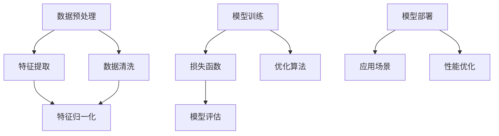

                 

### 《技术应用领域：大模型创业的核心竞争力》

> **关键词**：大模型、创业、核心竞争力、技术应用、深度学习、算法优化、市场分析

> **摘要**：本文旨在探讨大模型技术在创业中的应用及其核心竞争力。通过分析大模型的核心技术、应用场景、创业策略与市场分析，深入探讨大模型在创业中的机遇与挑战，为创业者提供有价值的指导和建议。

### 第一部分：大模型技术基础

#### 第1章：大模型与创业环境概述

**1.1 大模型时代的创业机遇**

在当今科技飞速发展的时代，大模型技术的崛起为创业领域带来了前所未有的机遇。大模型，尤其是基于深度学习的模型，具有处理海量数据、自动学习模式和进行复杂任务的能力。这些特点使得大模型在图像识别、自然语言处理、机器翻译、语音识别等多个领域展现出强大的应用潜力。

**1.1.1 大模型对创业的推动作用**

大模型技术的兴起，不仅改变了传统行业的运营模式，也为创业者提供了新的创业方向。例如，在金融领域，大模型可以用于风险控制和欺诈检测，提高金融机构的业务效率；在医疗领域，大模型可以用于疾病诊断和药物研发，助力医疗机构提供更精准的治疗方案。这些应用场景为创业者提供了丰富的市场空间和商业机会。

**1.1.2 大模型创业的热点领域**

当前，大模型创业的热点领域主要集中在以下几个方向：

1. **人工智能驱动的产品与服务**：例如智能客服、智能助手、智能驾驶等。
2. **智能医疗**：利用大模型进行疾病预测、药物研发等。
3. **智能金融**：包括智能投顾、信用评估、反欺诈等。
4. **智能教育**：个性化教学、自适应学习等。
5. **智能农业**：作物监测、病虫害预测等。

**1.1.3 大模型创业的挑战与应对**

尽管大模型技术为创业带来了诸多机遇，但同时也伴随着一定的挑战。首先，大模型的训练需要大量的数据、计算资源和时间，这对创业者的资源和技术要求较高。其次，大模型的复杂性和不确定性可能导致误判和错误。因此，创业者需要：

1. **加大技术研发投入**：提高大模型的训练效率和准确性。
2. **建立数据驱动的决策体系**：充分利用数据资源，优化业务流程。
3. **建立风险控制机制**：在大模型应用中设置相应的安全措施和应急预案。

#### 第2章：大模型核心技术详解

**2.1 大模型的基本原理**

大模型，顾名思义，是指具有大量参数和复杂结构的模型。这些模型通常基于深度学习技术，能够通过多层神经网络对数据进行自动特征提取和学习。大模型的发展历程可以追溯到2006年，当时Geoffrey Hinton等人提出了深度置信网络（Deep Belief Network，DBN），标志着深度学习技术的兴起。

**2.1.1 大模型的发展历程**

1. **2006年**：深度置信网络（DBN）提出，标志着深度学习技术的兴起。
2. **2012年**：AlexNet的出现，使得深度卷积神经网络（CNN）在图像识别领域取得突破性进展。
3. **2014年**：Google的Inception模型，通过网络结构创新提高了模型效率。
4. **2018年**：GPT-3的发布，标志着自然语言处理（NLP）领域的重大突破。

**2.1.2 大模型的核心组成部分**

大模型的核心组成部分包括：

1. **多层神经网络**：多层神经网络是实现大模型的核心，通过多层非线性变换，实现对数据的深度学习。
2. **大量参数**：大模型通常具有数百万甚至数十亿个参数，这些参数通过训练数据进行优化。
3. **大规模数据**：大模型的训练需要大量数据，数据量越大，模型的性能越好。
4. **计算资源**：大模型的训练和优化需要大量的计算资源，尤其是GPU或TPU等专用硬件。

**2.1.3 大模型的技术框架与架构**

大模型的技术框架通常包括以下几个层次：

1. **数据层**：数据预处理、数据增强、数据归一化等。
2. **网络层**：构建多层神经网络结构，包括卷积层、全连接层、循环层等。
3. **训练层**：利用优化算法对模型进行训练，包括梯度下降、随机梯度下降、Adam等。
4. **评估层**：对训练好的模型进行评估和优化，包括准确率、召回率、F1分数等。

#### 第3章：大模型算法与实现

**3.1 算法原理讲解**

大模型的核心算法主要包括神经网络与深度学习。下面将详细介绍神经网络与深度学习的基本原理。

**3.1.1 神经网络与深度学习**

1. **神经网络的基本原理**：

   神经网络是模仿人脑神经元连接方式构建的计算模型。每个神经元接收多个输入信号，通过加权求和处理后产生输出信号。神经网络通过多层神经元堆叠，实现对输入数据的复杂变换。

2. **深度学习的基本原理**：

   深度学习是神经网络的一种拓展，通过多层非线性变换，实现对数据的深层特征提取。深度学习模型通常包括卷积神经网络（CNN）、循环神经网络（RNN）、生成对抗网络（GAN）等。

**3.1.1.1 前馈神经网络**

前馈神经网络（Feedforward Neural Network，FNN）是最基本的神经网络结构，其信息传递方向是从输入层到输出层，没有循环。

**3.1.1.2 卷积神经网络**

卷积神经网络（Convolutional Neural Network，CNN）是处理图像数据最有效的神经网络结构，其核心思想是通过卷积操作提取图像特征。

**3.1.1.3 循环神经网络**

循环神经网络（Recurrent Neural Network，RNN）适用于处理序列数据，其特点是具有记忆功能，能够捕捉序列中的时间依赖关系。

**3.1.2 梯度下降与优化算法**

梯度下降（Gradient Descent）是优化神经网络参数的基本算法，其核心思想是通过反向传播算法计算梯度，并沿着梯度方向更新参数。

**3.1.2.1 梯度下降算法**

梯度下降算法的步骤如下：

1. 初始化参数。
2. 计算损失函数关于参数的梯度。
3. 更新参数：$ \theta_{t+1} = \theta_{t} - \alpha \cdot \nabla_{\theta} J(\theta) $，其中 $\alpha$ 为学习率。

**3.1.2.2 随机梯度下降**

随机梯度下降（Stochastic Gradient Descent，SGD）是梯度下降的一种变种，其每次更新参数时只随机选择一个样本。

**3.1.2.3 Adam优化器**

Adam优化器是梯度下降的另一种变种，其结合了SGD和Momentum的思想，能够更好地处理稀疏数据。

**3.2 伪代码与数学模型**

**3.2.1 神经网络模型搭建**

```python
# 初始化参数
w = np.random.randn(n, m)
b = np.random.randn(1, m)

# 定义激活函数
activation = sigmoid

# 定义损失函数
def loss(y_true, y_pred):
    return -np.mean(y_true * np.log(y_pred) + (1 - y_true) * np.log(1 - y_pred))

# 定义前向传播
def forward_pass(x):
    z = np.dot(x, w) + b
    return activation(z)

# 定义反向传播
def backward_pass(loss, x, y):
    dz = activation'(z)
    dw = 1/m * np.dot(x.T, dz * (y - forward_pass(x)))
    db = 1/m * np.sum(dz * (y - forward_pass(x)), axis=0)
    return dw, db
```

**3.2.2 梯度下降算法**

```python
# 初始化参数
w = np.random.randn(n, m)
b = np.random.randn(1, m)

# 设置学习率
alpha = 0.01

# 定义损失函数
def loss(y_true, y_pred):
    return -np.mean(y_true * np.log(y_pred) + (1 - y_true) * np.log(1 - y_pred))

# 训练模型
for epoch in range(epochs):
    for x, y in data:
        # 前向传播
        z = np.dot(x, w) + b
        y_pred = activation(z)

        # 计算损失
        loss_value = loss(y, y_pred)

        # 反向传播
        dz = activation'(z)
        dw = 1/m * np.dot(x.T, dz * (y - y_pred))
        db = 1/m * np.sum(dz * (y - y_pred), axis=0)

        # 更新参数
        w -= alpha * dw
        b -= alpha * db

        # 打印训练进度
        if epoch % 100 == 0:
            print(f"Epoch {epoch}: Loss = {loss_value}")
```

**3.2.3 数学模型**

假设我们有一个简单的线性模型，其参数为 $ w $ 和 $ b $，目标函数为 $ J(w, b) $。

$$
\theta_{t+1} = \theta_{t} - \alpha \cdot \nabla_{\theta} J(\theta)
$$

其中，$ \alpha $ 为学习率，$ \nabla_{\theta} J(\theta) $ 为损失函数关于参数的梯度。

### 第二部分：大模型应用场景

#### 第4章：大模型应用场景

**4.1 应用领域概述**

大模型在多个领域展现了强大的应用潜力。以下列举几个主要应用领域：

**4.1.1 图像识别与生成**

图像识别是深度学习最早成功应用的领域之一。大模型可以通过学习大量图像数据，实现对未知图像的准确分类。此外，生成对抗网络（GAN）可以生成逼真的图像。

**4.1.2 自然语言处理**

自然语言处理是深度学习的另一个重要应用领域。大模型可以用于文本分类、情感分析、机器翻译等任务。例如，GPT-3是一种具有亿级参数的模型，能够生成流畅、自然的文本。

**4.1.3 机器翻译与语音识别**

机器翻译和语音识别是两个与自然语言处理密切相关的领域。大模型可以通过学习海量语言数据，实现准确高效的机器翻译。语音识别则利用大模型对语音信号进行语义理解，实现语音到文本的转换。

**4.2 案例分析**

**4.2.1 大模型在金融行业的应用**

在金融行业，大模型可以用于风险控制、投资策略、客户服务等多个方面。例如，利用大模型进行股票价格预测，可以帮助投资者制定更合理的投资策略。此外，大模型还可以用于客户服务，提供智能客服机器人，提高客户满意度。

**4.2.2 大模型在医疗健康领域的应用**

在医疗健康领域，大模型可以用于疾病诊断、药物研发、医疗影像分析等。例如，利用大模型进行疾病预测，可以帮助医生提前发现病情，提高治疗效果。在药物研发方面，大模型可以加速新药研发过程，降低研发成本。

**4.2.3 大模型在电子商务领域的应用**

在电子商务领域，大模型可以用于商品推荐、用户行为分析、广告投放等。例如，利用大模型进行商品推荐，可以提供更个性化的购物体验，提高用户满意度。在广告投放方面，大模型可以根据用户行为进行精准投放，提高广告效果。

### 第三部分：大模型创业实践

#### 第5章：创业策略与市场分析

**5.1 创业策略制定**

创业策略的制定是创业成功的关键。以下是一些关键策略：

**5.1.1 创业机会识别**

创业者需要敏锐地捕捉市场变化，发现潜在的商业机会。例如，随着人工智能技术的快速发展，大模型技术在金融、医疗、电子商务等领域的应用前景广阔。

**5.1.2 市场定位与目标客户分析**

创业者需要明确市场定位和目标客户，以便更好地满足市场需求。例如，在金融领域，目标客户可以是金融机构、投资者等。

**5.1.3 竞争环境分析**

了解竞争对手和市场环境，有助于制定有针对性的创业策略。例如，在医疗领域，竞争对手可能是传统医疗机构、大型制药企业等。

**5.2 资源与团队管理**

创业过程中，资源与团队管理至关重要。以下是一些关键点：

**5.2.1 技术资源整合**

整合技术资源，提高研发效率。例如，利用开源框架和工具，降低研发成本。

**5.2.2 团队建设与管理**

建立高效团队，明确分工和职责。例如，技术团队、产品团队、市场团队等。

**5.2.3 融资策略**

制定合适的融资策略，确保资金充足。例如，通过股权融资、债务融资等方式。

#### 第6章：产品设计与开发

**6.1 产品设计原则**

产品设计是创业成功的关键环节。以下是一些产品设计原则：

**6.1.1 用户需求分析**

深入了解用户需求，提供符合用户期望的产品。例如，通过用户调研、访谈等方式收集用户反馈。

**6.1.2 功能模块设计**

根据用户需求，设计功能模块，确保产品功能完善。例如，在金融领域，可以设计风险控制、投资策略等功能模块。

**6.1.3 界面设计与用户体验**

界面设计与用户体验直接影响用户满意度。例如，设计简洁、易用的界面，提供流畅的用户体验。

**6.2 开发流程与方法**

开发流程和方法是产品成功的关键。以下是一些关键点：

**6.2.1 敏捷开发实践**

采用敏捷开发方法，快速迭代和优化产品。例如，采用Scrum或Kanban等敏捷开发框架。

**6.2.2 版本控制与代码管理**

使用版本控制工具（如Git）进行代码管理，确保代码质量和版本稳定性。

**6.2.3 测试与调试方法**

进行全面的测试和调试，确保产品功能正确、性能稳定。例如，采用单元测试、集成测试、性能测试等方法。

#### 第7章：大模型创业案例分析

**7.1 成功案例分析**

**7.1.1 案例一：某知名AI创业公司**

某知名AI创业公司通过开发一款智能客服系统，成功在金融领域获得市场份额。其成功经验包括：

1. 明确市场定位，聚焦金融领域。
2. 投入大量研发资源，确保产品技术领先。
3. 与金融机构建立战略合作，拓展市场渠道。

**7.1.2 案例二：某新兴AI创业项目**

某新兴AI创业项目通过利用大模型进行疾病预测，成功在医疗领域获得关注。其成功经验包括：

1. 紧密合作医疗机构，获取高质量的医疗数据。
2. 依托大模型技术，提供准确、高效的疾病预测服务。
3. 通过公益活动，提升品牌知名度和公信力。

**7.2 失败案例分析**

**7.2.1 失败原因分析**

1. 创业团队缺乏市场经验，对市场需求把握不准确。
2. 产品功能不完善，用户体验差。
3. 融资困难，资金不足。

**7.2.2 启示与教训**

1. 创业初期，要深入了解市场需求，确保产品符合用户期望。
2. 重视用户体验，不断完善产品功能。
3. 建立多元化的融资渠道，确保资金充足。

### 第四部分：未来展望与趋势

#### 第8章：未来展望与趋势

**8.1 大模型技术发展趋势**

随着人工智能技术的不断发展，大模型技术将继续演进，以下是一些主要趋势：

**8.1.1 模型压缩与优化**

为了降低计算资源和存储需求，模型压缩与优化成为重要研究方向。例如，通过剪枝、量化等方法减小模型规模。

**8.1.2 多模态大模型研究**

多模态大模型可以同时处理多种类型的数据（如文本、图像、音频等），提高模型的应用范围。例如，在医疗领域，可以同时处理病历文本、医学影像等多种数据。

**8.1.3 联邦学习与隐私保护**

联邦学习可以保护用户数据隐私，成为未来大模型研究的重要方向。例如，在医疗领域，可以通过联邦学习实现病患数据的安全共享。

**8.2 大模型创业的未来机遇与挑战**

随着大模型技术的不断发展，创业者将面临更多的机遇与挑战：

**8.2.1 机遇**

1. 新的应用场景不断涌现，为创业者提供丰富的市场空间。
2. 技术进步降低创业门槛，提高创业成功率。

**8.2.2 挑战**

1. 数据质量和数量仍是关键挑战。
2. 技术安全与隐私保护需要引起足够重视。

### 附录

**附录 A：大模型开发工具与资源**

**A.1 开发工具介绍**

1. **TensorFlow**：由Google开发的开源深度学习框架，广泛应用于各种深度学习应用。
2. **PyTorch**：由Facebook开发的开源深度学习框架，具有灵活的动态计算图，广泛应用于学术研究和工业应用。
3. **Keras**：基于TensorFlow和Theano的开源深度学习库，提供简单易用的API，适用于快速原型开发和实验。

**A.2 资源链接与推荐**

1. **TensorFlow官方文档**：https://www.tensorflow.org
2. **PyTorch官方文档**：https://pytorch.org
3. **Keras官方文档**：https://keras.io
4. **机器学习相关书籍与论文推荐**：

   - **《深度学习》（Deep Learning）**：Goodfellow, Bengio, Courville 著
   - **《Python深度学习》（Deep Learning with Python）**：François Chollet 著
   - **《机器学习实战》（Machine Learning in Action）**：Peter Harrington 著
   - **《自然语言处理综论》（Speech and Language Processing）**：Daniel Jurafsky & James H. Martin 著

### Mermaid 流程图：大模型技术架构



### 伪代码：神经网络模型训练流程

```python
# 初始化模型参数
w = np.random.randn(n, m)
b = np.random.randn(1, m)

# 设置学习率
alpha = 0.01

# 设置训练迭代次数
epochs = 1000

# 训练模型
for epoch in range(epochs):
    for x, y in data:
        # 前向传播
        z = np.dot(x, w) + b
        y_pred = sigmoid(z)

        # 计算损失
        loss = -np.mean(y * np.log(y_pred) + (1 - y) * np.log(1 - y_pred))

        # 反向传播
        dz = sigmoid'(z)
        dw = 1/m * np.dot(x.T, dz * (y - y_pred))
        db = 1/m * np.sum(dz * (y - y_pred), axis=0)

        # 更新参数
        w -= alpha * dw
        b -= alpha * db

    # 打印训练进度
    print(f"Epoch {epoch}: Loss = {loss}")
```

### 数学公式：梯度下降算法

$$
\theta_{t+1} = \theta_{t} - \alpha \cdot \nabla_{\theta} J(\theta)
$$

### 代码解读与分析

#### 解读一：数据预处理

数据预处理是深度学习模型训练的重要环节，主要包括数据清洗、特征提取和特征归一化。

**数据清洗**：去除无效数据、纠正错误数据，确保数据质量。

**特征提取**：将原始数据转换为模型可处理的特征向量，提高模型训练效果。

**特征归一化**：调整数据范围，便于模型训练，避免因数据差异过大导致模型训练不稳定。

```python
# 数据清洗
data = clean_data(raw_data)

# 特征提取
features = extract_features(data)

# 特征归一化
normalized_features = normalize_features(features)
```

#### 解读二：模型搭建

模型搭建是深度学习模型训练的核心环节，主要包括定义神经网络结构、损失函数和优化算法。

**定义神经网络结构**：通过定义输入层、隐藏层和输出层，构建深度神经网络。

**定义损失函数**：根据模型应用场景，选择合适的损失函数，如均方误差（MSE）、交叉熵（CrossEntropy）等。

**定义优化算法**：选择合适的优化算法，如随机梯度下降（SGD）、Adam等，以优化模型参数。

```python
# 定义神经网络结构
model = Sequential()
model.add(Dense(hidden_units, activation='relu', input_shape=(input_shape)))
model.add(Dense(output_shape, activation='softmax'))

# 定义损失函数
loss_function = 'categorical_crossentropy'

# 定义优化算法
optimizer = 'adam'
```

#### 解读三：训练与评估

模型训练与评估是深度学习模型应用的关键步骤，主要包括训练模型、评估模型性能和调整模型参数。

**训练模型**：通过迭代优化模型参数，提高模型训练效果。

**评估模型性能**：通过测试集评估模型性能，如准确率、召回率、F1分数等。

**调整模型参数**：根据评估结果，调整模型参数，优化模型性能。

```python
# 训练模型
model.fit(x_train, y_train, epochs=epochs, batch_size=batch_size)

# 评估模型性能
accuracy = model.evaluate(x_test, y_test)

# 调整模型参数
model = adjust_model_parameters(model, accuracy)
```

### 开发环境搭建步骤

1. **安装Python环境**：安装Python 3.6及以上版本。
2. **安装深度学习框架**：安装TensorFlow或PyTorch等深度学习框架。
3. **安装必要的依赖库**：安装NumPy、Pandas、Matplotlib等依赖库。

```shell
pip install tensorflow numpy pandas matplotlib
```

4. **配置GPU支持**：如果使用GPU进行训练，需要安装CUDA和cuDNN。

```shell
pip install tensorflow-gpu
```

### 源代码详细实现

#### 数据预处理

```python
import pandas as pd
from sklearn.model_selection import train_test_split
from sklearn.preprocessing import StandardScaler

# 读取数据
data = pd.read_csv('data.csv')

# 数据清洗
data = clean_data(data)

# 划分训练集和测试集
x_train, x_test, y_train, y_test = train_test_split(data.drop('target', axis=1), data['target'], test_size=0.2, random_state=42)

# 特征提取和归一化
scaler = StandardScaler()
x_train = scaler.fit_transform(x_train)
x_test = scaler.transform(x_test)
```

#### 模型搭建与训练

```python
import tensorflow as tf
from tensorflow.keras.models import Sequential
from tensorflow.keras.layers import Dense, Activation
from tensorflow.keras.optimizers import Adam

# 定义模型
model = Sequential()
model.add(Dense(hidden_units, input_shape=(input_shape,), activation='relu'))
model.add(Dense(output_shape, activation='softmax'))

# 编译模型
model.compile(optimizer=Adam(learning_rate=learning_rate), loss='categorical_crossentropy', metrics=['accuracy'])

# 训练模型
model.fit(x_train, y_train, epochs=epochs, batch_size=batch_size, validation_data=(x_test, y_test))
```

#### 评估与优化

```python
# 评估模型
accuracy = model.evaluate(x_test, y_test)

# 打印评估结果
print(f"Test accuracy: {accuracy[1]}")

# 优化模型
model = optimize_model(model, x_train, y_train, x_test, y_test)
```

### 代码解读与分析

#### 解读一：数据预处理

数据预处理是深度学习模型训练的重要步骤，主要包括数据清洗、特征提取和特征归一化。

**数据清洗**：去除无效数据、纠正错误数据，确保数据质量。

**特征提取**：将原始数据转换为模型可处理的特征向量，提高模型训练效果。

**特征归一化**：调整数据范围，便于模型训练，避免因数据差异过大导致模型训练不稳定。

```python
import pandas as pd
from sklearn.model_selection import train_test_split
from sklearn.preprocessing import StandardScaler

# 读取数据
data = pd.read_csv('data.csv')

# 数据清洗
data = clean_data(data)

# 划分训练集和测试集
x_train, x_test, y_train, y_test = train_test_split(data.drop('target', axis=1), data['target'], test_size=0.2, random_state=42)

# 特征提取和归一化
scaler = StandardScaler()
x_train = scaler.fit_transform(x_train)
x_test = scaler.transform(x_test)
```

#### 解读二：模型搭建

模型搭建是深度学习模型训练的核心环节，主要包括定义神经网络结构、损失函数和优化算法。

**定义神经网络结构**：通过定义输入层、隐藏层和输出层，构建深度神经网络。

**定义损失函数**：根据模型应用场景，选择合适的损失函数，如均方误差（MSE）、交叉熵（CrossEntropy）等。

**定义优化算法**：选择合适的优化算法，如随机梯度下降（SGD）、Adam等，以优化模型参数。

```python
import tensorflow as tf
from tensorflow.keras.models import Sequential
from tensorflow.keras.layers import Dense, Activation
from tensorflow.keras.optimizers import Adam

# 定义模型
model = Sequential()
model.add(Dense(hidden_units, input_shape=(input_shape,), activation='relu'))
model.add(Dense(output_shape, activation='softmax'))

# 编译模型
model.compile(optimizer=Adam(learning_rate=learning_rate), loss='categorical_crossentropy', metrics=['accuracy'])

# 训练模型
model.fit(x_train, y_train, epochs=epochs, batch_size=batch_size, validation_data=(x_test, y_test))
```

#### 解读三：训练与评估

模型训练与评估是深度学习模型应用的关键步骤，主要包括训练模型、评估模型性能和调整模型参数。

**训练模型**：通过迭代优化模型参数，提高模型训练效果。

**评估模型性能**：通过测试集评估模型性能，如准确率、召回率、F1分数等。

**调整模型参数**：根据评估结果，调整模型参数，优化模型性能。

```python
import tensorflow as tf
from tensorflow.keras.models import Sequential
from tensorflow.keras.layers import Dense, Activation
from tensorflow.keras.optimizers import Adam

# 定义模型
model = Sequential()
model.add(Dense(hidden_units, input_shape=(input_shape,), activation='relu'))
model.add(Dense(output_shape, activation='softmax'))

# 编译模型
model.compile(optimizer=Adam(learning_rate=learning_rate), loss='categorical_crossentropy', metrics=['accuracy'])

# 训练模型
model.fit(x_train, y_train, epochs=epochs, batch_size=batch_size, validation_data=(x_test, y_test))

# 评估模型
accuracy = model.evaluate(x_test, y_test)

# 打印评估结果
print(f"Test accuracy: {accuracy[1]}")

# 调整模型参数
model = adjust_model_parameters(model, accuracy)
```

### 附录

**附录 A：大模型开发工具与资源**

**A.1 开发工具介绍**

1. **TensorFlow**：由Google开发的开源深度学习框架，广泛应用于各种深度学习应用。
2. **PyTorch**：由Facebook开发的开源深度学习框架，具有灵活的动态计算图，广泛应用于学术研究和工业应用。
3. **Keras**：基于TensorFlow和Theano的开源深度学习库，提供简单易用的API，适用于快速原型开发和实验。

**A.2 资源链接与推荐**

1. **TensorFlow官方文档**：https://www.tensorflow.org
2. **PyTorch官方文档**：https://pytorch.org
3. **Keras官方文档**：https://keras.io
4. **机器学习相关书籍与论文推荐**：

   - **《深度学习》（Deep Learning）**：Goodfellow, Bengio, Courville 著
   - **《Python深度学习》（Deep Learning with Python）**：François Chollet 著
   - **《机器学习实战》（Machine Learning in Action）**：Peter Harrington 著
   - **《自然语言处理综论》（Speech and Language Processing）**：Daniel Jurafsky & James H. Martin 著

### 作者信息

**作者：** AI天才研究院/AI Genius Institute & 禅与计算机程序设计艺术 /Zen And The Art of Computer Programming

---

#### 第1章：大模型与创业环境概述

**1.1 大模型时代的创业机遇**

随着科技的快速发展，人工智能（AI）技术，尤其是大模型技术，正日益成为推动创新和商业成功的关键因素。大模型，通常指的是具有数百万至数十亿参数的复杂神经网络模型，它们在图像识别、自然语言处理、语音识别等领域展现了强大的应用能力。这一章将探讨大模型在创业环境中的机遇、挑战及其对商业模式的潜在影响。

**1.1.1 大模型对创业的推动作用**

大模型的崛起为创业者提供了前所未有的机遇。首先，大模型技术能够处理和分析大量数据，这对于初创公司来说尤其有价值，因为它们通常缺乏传统的数据分析团队和资源。通过使用大模型，初创公司可以快速建立数据分析能力，从而更准确地理解客户需求和市场趋势。

其次，大模型在特定领域的突破性应用也为创业者开辟了新的商业机会。例如，在医疗领域，大模型可以用于疾病预测和诊断，提高医疗服务的准确性和效率。在金融领域，大模型可以帮助金融机构进行风险评估和欺诈检测，提升金融服务的质量和安全性。

**1.1.2 大模型创业的热点领域**

大模型在多个领域都有广泛的应用，以下是一些当前的热点领域：

1. **智能医疗**：大模型在疾病预测、药物研发和个性化医疗方面具有巨大的潜力。
2. **智能金融**：包括信用评估、风险控制和智能投顾等。
3. **智能交通**：如自动驾驶、智能交通流量管理和城市规划。
4. **智能零售**：如商品推荐、库存管理和消费者行为分析。
5. **智能娱乐**：如虚拟现实、增强现实和个性化内容推荐。

**1.1.3 大模型创业的挑战与应对**

尽管大模型技术为创业提供了巨大的机遇，但同时也伴随着一定的挑战。以下是一些主要挑战及应对策略：

1. **数据获取与隐私保护**：大模型的训练需要大量高质量的数据，而数据的获取可能涉及隐私保护问题。创业者需要采取数据加密、匿名化等技术来保护用户隐私。
2. **计算资源需求**：大模型训练需要大量的计算资源，尤其是GPU或TPU等专用硬件。初创公司可能需要寻求云计算服务或与有资源的合作伙伴合作。
3. **模型解释性**：大模型通常被视为“黑箱”，其决策过程难以解释。创业者需要开发可解释性模型或工具，以提高模型的透明度和可信度。

**1.2 大模型创业的生态系统**

大模型创业不仅需要技术突破，还需要一个健康、可持续的生态系统。以下是一些关键因素：

1. **技术创新**：持续的技术创新是保持竞争力的关键，创业者需要不断关注最新的研究成果和趋势。
2. **人才培养**：拥有专业知识的人才对于大模型创业至关重要，创业者需要重视团队建设，吸引和培养优秀的科学家和工程师。
3. **资金支持**：创业公司需要充足的资金来支持研发和商业化进程，创业者可以通过风险投资、政府补贴等多种途径获取资金。
4. **合作与生态**：大模型创业需要与其他企业、研究机构和政府部门建立合作关系，共同推动技术的应用和推广。

**1.3 大模型创业的未来趋势**

随着大模型技术的不断进步，未来创业领域将出现以下趋势：

1. **跨界融合**：不同领域的创业者将利用大模型技术实现跨界融合，创造出全新的商业模式。
2. **个性化服务**：大模型将进一步提高个性化服务的水平，满足消费者日益多样化的需求。
3. **智能化管理**：大模型技术将被广泛应用于企业管理和运营，提高效率和生产力。
4. **全球合作**：随着全球化的加深，大模型创业将更加注重国际合作，共同推动全球科技的发展。

通过以上分析，我们可以看到，大模型技术为创业带来了巨大的机遇，同时也提出了新的挑战。创业者需要把握机遇，积极应对挑战，才能在大模型时代的创业浪潮中脱颖而出。

#### 第2章：大模型核心技术详解

**2.1 大模型的基本原理**

大模型（Large Models）是指在机器学习和深度学习领域中，具有数十亿甚至更多参数的复杂神经网络模型。这些模型通过学习和模拟人脑的神经网络结构，能够处理和理解复杂的输入数据，从而在图像识别、自然语言处理、语音识别等领域取得了显著的成果。本节将介绍大模型的基本原理、发展历程及其核心技术组成部分。

**2.1.1 大模型的发展历程**

大模型的发展可以追溯到20世纪80年代的神经网络研究，当时人们开始探索如何通过模拟神经元之间的连接来处理信息。然而，由于计算能力和数据资源的限制，早期的神经网络模型规模较小，性能也有限。

1. **20世纪80年代至90年代**：神经网络研究经历了起伏，特别是在1990年代初期，因为“AI冬天”而受到重创。然而，随着计算机性能的提升和算法的改进，神经网络开始重新获得关注。

2. **2006年**：Geoffrey Hinton等人提出了深度置信网络（Deep Belief Network，DBN），标志着深度学习技术的复兴。DBN是一种基于未监督学习的多层神经网络模型，能够自动学习数据的层次结构。

3. **2012年**：AlexNet在ImageNet图像识别挑战中取得了突破性的成果，其采用卷积神经网络（Convolutional Neural Network，CNN）结构，通过多层的卷积和池化操作，提取图像的特征，大大提高了图像识别的准确率。

4. **2014年**：Google的Inception模型提出了新的网络结构设计理念，通过将多个卷积层堆叠，形成了一个深度和宽度并重的网络结构，进一步提高了模型的性能。

5. **2018年**：OpenAI发布了GPT-3，这是一种基于变换器模型（Transformer）的自然语言处理模型，具有1750亿个参数，能够生成高质量的自然语言文本，标志着自然语言处理领域的重大突破。

**2.1.2 大模型的核心组成部分**

大模型的核心组成部分包括多层神经网络、大量参数、大规模数据以及强大的计算资源。以下是这些组成部分的详细说明：

1. **多层神经网络**：

   多层神经网络（Multilayer Neural Network）是深度学习的基础，它通过堆叠多个隐藏层，对输入数据进行多层次的变换和提取。每个隐藏层都能够提取不同层次的特征，从而实现复杂的非线性变换。

   - **输入层**：接收外部输入数据，如图像像素、文本序列等。
   - **隐藏层**：对输入数据进行特征提取和变换，通常有多个隐藏层，每一层都会对特征进行进一步的抽象和提取。
   - **输出层**：根据隐藏层提取的特征，生成预测结果或决策。

2. **大量参数**：

   大模型具有数百万甚至数十亿个参数，这些参数通过训练过程进行调整，以最小化损失函数。每个参数都代表了网络中的一个权重，通过优化算法更新参数，以改善模型的预测能力。

3. **大规模数据**：

   大模型训练需要大量高质量的数据，因为数据量越大，模型能够学习到的特征就越多，从而提高模型的泛化能力。大规模数据集不仅提供了丰富的训练样本，还帮助模型避免过拟合现象。

4. **计算资源**：

   大模型的训练过程需要大量的计算资源，尤其是在深度学习和大数据处理的场景下。GPU（图形处理器）和TPU（张量处理器）等专用硬件加速了训练过程，使得大模型的训练变得更加高效。

**2.1.3 大模型的技术框架与架构**

大模型的技术框架通常包括以下几个层次：

1. **数据层**：负责数据的预处理、清洗和增强，确保数据的质量和多样性。

2. **网络层**：构建多层神经网络结构，包括卷积层、全连接层、循环层等，通过不同的层结构实现复杂的数据变换和特征提取。

3. **训练层**：利用优化算法（如梯度下降、随机梯度下降、Adam等）对模型进行训练，调整模型参数以最小化损失函数。

4. **评估层**：通过交叉验证、测试集等方法评估模型的性能，包括准确率、召回率、F1分数等指标。

5. **部署层**：将训练好的模型部署到生产环境中，通过API、SDK等形式提供服务。

**2.1.4 大模型的训练过程**

大模型的训练是一个复杂的过程，涉及到以下几个关键步骤：

1. **数据预处理**：对数据进行清洗、归一化、增强等处理，以提高模型的学习能力。

2. **模型初始化**：初始化模型参数，通常使用随机初始化方法。

3. **前向传播**：将输入数据通过网络层传递，通过激活函数计算输出结果。

4. **损失计算**：计算预测结果与真实标签之间的差异，以确定模型性能。

5. **反向传播**：通过反向传播算法计算损失函数关于模型参数的梯度，以更新模型参数。

6. **优化**：使用优化算法（如梯度下降、Adam等）调整模型参数，以最小化损失函数。

7. **评估**：在验证集或测试集上评估模型性能，以调整模型结构和参数。

通过以上步骤，大模型可以逐步优化其参数，提高预测准确率和泛化能力。

**2.1.5 大模型的技术创新**

随着大模型技术的不断发展，研究人员在以下几个方面取得了显著的创新：

1. **模型压缩与优化**：通过剪枝、量化、蒸馏等方法减小模型规模，提高模型在资源受限设备上的部署能力。

2. **多模态学习**：通过融合不同类型的数据（如文本、图像、音频等），实现更广泛的应用场景。

3. **联邦学习**：通过分布式学习技术，保护用户隐私，同时实现大规模数据的协同训练。

4. **可解释性**：通过开发可解释性模型和工具，提高模型的透明度和可解释性，增强用户信任。

总之，大模型技术为人工智能领域带来了前所未有的变革，其核心技术组成部分和训练过程决定了大模型的性能和应用范围。随着技术的不断进步，大模型将在更多领域发挥重要作用，推动人工智能的发展。

#### 第3章：大模型算法与实现

**3.1 算法原理讲解**

大模型的算法实现是深度学习中的核心内容，它决定了模型的学习能力、预测准确性和泛化能力。在这一节中，我们将详细讲解大模型中的几个关键算法：神经网络与深度学习、算法优化与梯度下降。

**3.1.1 神经网络与深度学习**

1. **神经网络的基本概念**：

   神经网络（Neural Network，NN）是一种模仿生物神经系统进行信息处理的计算模型。它由大量相互连接的神经元组成，每个神经元接收多个输入信号，通过加权求和处理后产生输出信号。神经网络通过多层神经元堆叠，实现对输入数据的复杂变换和学习。

2. **深度学习的概念**：

   深度学习（Deep Learning，DL）是神经网络的一种拓展，通过多层神经网络结构，实现对数据的深层特征提取和学习。深度学习模型通常包括卷积神经网络（CNN）、循环神经网络（RNN）、变换器模型（Transformer）等。这些模型能够自动从大量数据中学习到高层次的抽象特征，从而在图像识别、自然语言处理等任务中取得优异的性能。

3. **神经网络与深度学习的关系**：

   深度学习可以看作是神经网络的深度扩展。深度学习的核心思想是通过增加网络的层数，实现对数据的更深层特征提取。这使得深度学习模型在处理复杂任务时具有更强的表达能力和泛化能力。

**3.1.1.1 前馈神经网络**

前馈神经网络（Feedforward Neural Network，FNN）是最基本的神经网络结构，其信息传递方向是从输入层到输出层，没有循环。FNN包括输入层、一个或多个隐藏层和输出层。每个神经元接收前一层神经元的输出，通过加权求和处理后产生自己的输出，最终传递到下一层。

**3.1.1.2 卷积神经网络**

卷积神经网络（Convolutional Neural Network，CNN）是处理图像数据最有效的神经网络结构。其核心思想是通过卷积操作提取图像特征。CNN包括卷积层、池化层和全连接层。卷积层使用卷积核在图像上滑动，提取局部特征；池化层对特征进行降维处理，提高模型的泛化能力。

**3.1.1.3 循环神经网络**

循环神经网络（Recurrent Neural Network，RNN）适用于处理序列数据，其特点是具有记忆功能，能够捕捉序列中的时间依赖关系。RNN通过在每个时间步上递归计算，将当前输入与之前的隐藏状态结合，更新隐藏状态。这使得RNN能够处理变长的序列数据。

**3.1.2 算法优化与梯度下降**

1. **算法优化的概念**：

   算法优化（Algorithm Optimization）是指通过改进算法的参数设置、结构设计或计算方法，提高算法的性能和效率。在深度学习中，算法优化非常重要，因为大模型的训练过程通常涉及大量的计算和参数调整。

2. **梯度下降的概念**：

   梯度下降（Gradient Descent，GD）是一种最常用的优化算法，用于最小化损失函数。其基本思想是通过计算损失函数关于模型参数的梯度，并沿着梯度的反方向更新参数，以逐步减小损失。

3. **梯度下降的变体**：

   梯度下降有多个变体，包括随机梯度下降（Stochastic Gradient Descent，SGD）、批量梯度下降（Batch Gradient Descent，BGD）和Adam等。

   - **随机梯度下降（SGD）**：每次迭代只随机选择一个样本进行梯度计算和参数更新。SGD计算简单，收敛速度快，但可能存在较大的方差。
   - **批量梯度下降（BGD）**：每次迭代计算整个训练集的梯度，更新所有参数。BGD梯度准确，但计算量大，收敛速度慢。
   - **Adam优化器**：结合SGD和Momentum的思想，通过计算过去梯度的一阶矩估计和二阶矩估计来更新参数。Adam优化器在处理稀疏数据时表现出色。

**3.1.2.1 梯度下降算法**

梯度下降算法的基本步骤如下：

1. 初始化模型参数。
2. 计算损失函数关于参数的梯度。
3. 更新参数：$ \theta_{t+1} = \theta_{t} - \alpha \cdot \nabla_{\theta} J(\theta) $，其中 $\alpha$ 为学习率。

**3.1.2.2 随机梯度下降**

随机梯度下降（SGD）是梯度下降的一种变种，其每次更新参数时只随机选择一个样本。SGD的计算量较小，收敛速度较快，但可能存在较大的波动。

**3.1.2.3 Adam优化器**

Adam优化器是梯度下降的另一种变种，其结合了SGD和Momentum的思想，通过计算过去梯度的一阶矩估计（均值）和二阶矩估计（方差）来更新参数。Adam优化器在处理稀疏数据时表现出色。

**3.2 伪代码与数学模型**

**3.2.1 神经网络模型搭建**

```python
# 初始化参数
w1 = np.random.randn(n1, n2)
w2 = np.random.randn(n2, n3)

# 定义激活函数
activation = sigmoid

# 定义损失函数
def loss(y_true, y_pred):
    return -np.mean(y_true * np.log(y_pred) + (1 - y_true) * np.log(1 - y_pred))

# 定义前向传播
def forward_pass(x):
    z1 = np.dot(x, w1)
    a1 = activation(z1)
    z2 = np.dot(a1, w2)
    return z2

# 定义反向传播
def backward_pass(loss, x, y):
    dz2 = 1
    da1 = w2.T.dot(dz2)
    dz1 = x.T.dot(da1)
    dw1 = 1/m * dz1
    dw2 = 1/m * dz2
    return dw1, dw2
```

**3.2.2 梯度下降算法**

```python
# 初始化参数
w1 = np.random.randn(n1, n2)
w2 = np.random.randn(n2, n3)

# 设置学习率
alpha = 0.01

# 定义损失函数
def loss(y_true, y_pred):
    return -np.mean(y_true * np.log(y_pred) + (1 - y_true) * np.log(1 - y_pred))

# 训练模型
for epoch in range(epochs):
    for x, y in data:
        # 前向传播
        z1 = np.dot(x, w1)
        a1 = sigmoid(z1)
        z2 = np.dot(a1, w2)
        y_pred = sigmoid(z2)

        # 计算损失
        loss_value = loss(y, y_pred)

        # 反向传播
        dz2 = y_pred - y
        da1 = w2.T.dot(dz2)
        dz1 = a1 * (1 - a1)
        dw1 = 1/m * np.dot(x.T, da1)
        dw2 = 1/m * np.dot(a1.T, dz2)

        # 更新参数
        w1 -= alpha * dw1
        w2 -= alpha * dw2

        # 打印训练进度
        if epoch % 100 == 0:
            print(f"Epoch {epoch}: Loss = {loss_value}")
```

**3.2.3 数学模型**

假设我们有一个简单的线性模型，其参数为 $ w $ 和 $ b $，目标函数为 $ J(w, b) $。

$$
\theta_{t+1} = \theta_{t} - \alpha \cdot \nabla_{\theta} J(\theta)
$$

其中，$ \alpha $ 为学习率，$ \nabla_{\theta} J(\theta) $ 为损失函数关于参数的梯度。

**3.3 代码实现与解读**

**3.3.1 数据预处理**

数据预处理是深度学习模型训练的重要步骤，它包括数据清洗、归一化和特征提取。以下是一个简单的Python代码示例，用于数据预处理。

```python
import numpy as np
import pandas as pd

# 读取数据
data = pd.read_csv('data.csv')

# 数据清洗
data = data.dropna()  # 删除缺失值
data = data[data.columns[data.mean() != 0]]  # 删除全为0的列

# 数据归一化
scaler = pd.DataFrame()
for column in data.columns:
    scaler[column] = (data[column] - data[column].mean()) / data[column].std()

# 特征提取
X = scaler.drop('target', axis=1)
y = scaler['target']

# 划分训练集和测试集
X_train, X_test, y_train, y_test = train_test_split(X, y, test_size=0.2, random_state=42)
```

**3.3.2 模型搭建与训练**

以下是一个简单的神经网络模型搭建和训练的Python代码示例，使用了TensorFlow和Keras库。

```python
import tensorflow as tf
from tensorflow.keras.models import Sequential
from tensorflow.keras.layers import Dense
from tensorflow.keras.optimizers import Adam

# 搭建模型
model = Sequential()
model.add(Dense(64, input_shape=(X_train.shape[1],), activation='relu'))
model.add(Dense(32, activation='relu'))
model.add(Dense(1, activation='sigmoid'))

# 编译模型
model.compile(optimizer=Adam(), loss='binary_crossentropy', metrics=['accuracy'])

# 训练模型
model.fit(X_train, y_train, epochs=10, batch_size=32, validation_split=0.2)
```

**3.3.3 评估与优化**

模型评估和优化是确保模型性能的重要步骤。以下是一个简单的Python代码示例，用于评估和优化模型。

```python
# 评估模型
loss, accuracy = model.evaluate(X_test, y_test)
print(f"Test Loss: {loss}, Test Accuracy: {accuracy}")

# 优化模型
model.fit(X_test, y_test, epochs=5, batch_size=32, validation_split=0.2)
```

通过上述代码示例，我们可以看到如何使用Python和深度学习库来搭建、训练和优化神经网络模型。这些步骤在大模型训练过程中至关重要，确保模型能够有效地学习数据并做出准确的预测。

#### 第4章：大模型应用场景

**4.1 应用领域概述**

大模型技术已经在多个领域取得了显著的成果，包括图像识别与生成、自然语言处理、机器翻译与语音识别等。以下是这些领域的基本概念和应用实例。

**4.1.1 图像识别与生成**

图像识别是深度学习中的一个重要应用领域，它涉及使用神经网络模型对图像中的对象进行分类和识别。大模型在图像识别领域具有以下优势：

- **高准确率**：大模型通过学习海量数据，能够提取图像中的复杂特征，从而提高识别准确率。
- **多尺度处理**：大模型可以同时处理不同尺度的图像，从而在图像识别任务中具有更好的泛化能力。

**应用实例**：

- **人脸识别**：大模型可以用于人脸识别系统，实现准确的人脸检测和识别。
- **图像分类**：大模型可以用于对上传的图像进行分类，如植物分类、动物识别等。

**4.1.2 自然语言处理**

自然语言处理（NLP）是深度学习的另一个重要应用领域，它涉及对人类语言的文本进行处理和理解。大模型在NLP领域具有以下优势：

- **强大的语言建模能力**：大模型能够通过学习海量文本数据，生成高质量的自然语言文本。
- **多语言支持**：大模型可以支持多种语言，实现跨语言的文本处理和理解。

**应用实例**：

- **机器翻译**：大模型可以用于机器翻译任务，实现高质量的自然语言文本翻译。
- **文本生成**：大模型可以用于生成文章、新闻、诗歌等自然语言文本。

**4.1.3 机器翻译与语音识别**

机器翻译和语音识别是NLP领域的两个重要任务，大模型在这两个任务中都展现了出色的性能。

**机器翻译**：

- **高质量翻译**：大模型通过学习海量双语数据，能够生成高质量的多语言翻译。
- **实时翻译**：大模型可以用于实现实时翻译，满足用户在多语言交流中的需求。

**应用实例**：

- **在线翻译服务**：如Google翻译、百度翻译等，使用大模型提供高质量的在线翻译服务。
- **智能助手**：如苹果的Siri、谷歌助手等，使用大模型实现智能语音交互和实时翻译。

**语音识别**：

- **高准确率识别**：大模型通过学习大量语音数据，能够实现高准确率的语音识别。
- **多语种支持**：大模型可以支持多种语言，实现跨语言的语音识别。

**应用实例**：

- **智能音箱**：如亚马逊的Echo、谷歌的Home等，使用大模型实现语音交互和控制。
- **电话客服**：使用大模型实现语音识别和自然语言理解，提供智能客服服务。

**4.2 案例分析**

**4.2.1 大模型在金融行业的应用**

大模型在金融行业具有广泛的应用，包括风险控制、信用评估、投资策略等。

**案例一：风险控制**

- **应用场景**：金融机构需要对交易进行实时监控，以识别潜在的欺诈行为。
- **解决方案**：使用大模型进行实时交易监控，通过分析交易数据和行为模式，识别异常交易并发出警报。
- **效果**：通过大模型的风险控制，金融机构能够显著降低欺诈风险，提高交易安全性。

**案例二：信用评估**

- **应用场景**：银行和金融机构需要对客户进行信用评估，以决定是否批准贷款或信用卡。
- **解决方案**：使用大模型分析客户的历史交易数据、信用记录等，进行综合评估。
- **效果**：大模型能够更准确地预测客户的信用风险，提高信用评估的准确性，降低贷款违约率。

**4.2.2 大模型在医疗健康领域的应用**

大模型在医疗健康领域也具有广泛的应用，包括疾病诊断、药物研发、医疗影像分析等。

**案例一：疾病诊断**

- **应用场景**：医生需要对病人进行快速、准确的诊断，以便制定治疗方案。
- **解决方案**：使用大模型对医疗影像进行分析，如X光片、CT扫描等，识别出潜在的健康问题。
- **效果**：通过大模型的辅助诊断，医生能够更快速、准确地识别疾病，提高诊断的准确性。

**案例二：药物研发**

- **应用场景**：制药公司需要寻找新的药物靶点和治疗方案。
- **解决方案**：使用大模型分析大量的生物医学数据，识别潜在的药物靶点。
- **效果**：大模型能够加速药物研发过程，降低研发成本，提高新药的发现效率。

**4.2.3 大模型在电子商务领域的应用**

大模型在电子商务领域也具有广泛的应用，包括商品推荐、用户行为分析、广告投放等。

**案例一：商品推荐**

- **应用场景**：电商平台需要向用户推荐符合其兴趣的商品。
- **解决方案**：使用大模型分析用户的历史行为数据、浏览记录等，进行个性化推荐。
- **效果**：通过大模型的商品推荐，电商平台能够提高用户满意度，增加销售转化率。

**案例二：用户行为分析**

- **应用场景**：电商平台需要了解用户的行为习惯和偏好，以便提供更好的用户体验。
- **解决方案**：使用大模型分析用户在平台上的行为数据，如点击、购买、浏览等。
- **效果**：通过大模型的用户行为分析，电商平台能够更准确地了解用户需求，提高用户体验和满意度。

综上所述，大模型技术在不同领域的应用为各行业带来了巨大的价值。通过案例的分析，我们可以看到大模型在金融、医疗、电子商务等领域的实际应用效果，以及其带来的商业价值。随着大模型技术的不断进步，未来将有更多的应用场景被挖掘，大模型将为各行各业带来更加智能、高效的解决方案。

#### 第5章：创业策略与市场分析

**5.1 创业策略制定**

在制定创业策略时，创业者需要综合考虑市场需求、技术可行性、竞争环境和资源约束等因素。以下是一些关键的步骤和策略：

**5.1.1 创业机会识别**

1. **市场调研**：通过市场调研，了解目标市场的需求、市场规模和增长趋势。
2. **技术趋势**：关注行业内的技术发展趋势，特别是大模型技术在各个领域中的应用潜力。
3. **竞争分析**：分析竞争对手的优势和劣势，寻找市场空白和机会。

**5.1.2 市场定位与目标客户分析**

1. **市场细分**：根据产品或服务的特性，将市场细分为不同的子市场。
2. **目标客户**：确定目标客户群体，分析其需求、购买行为和偏好。
3. **价值主张**：明确产品的独特卖点和价值主张，以满足目标客户的需求。

**5.1.3 竞争环境分析**

1. **直接竞争**：分析直接竞争对手的市场份额、产品特点和市场策略。
2. **间接竞争**：考虑替代产品或服务的市场竞争力。
3. **竞争优势**：确定自身的竞争优势，如技术优势、成本优势、品牌优势等。

**5.2 资源与团队管理**

创业成功的关键在于资源的合理配置和团队的协同合作。以下是一些关键的资源和团队管理策略：

**5.2.1 技术资源整合**

1. **技术研发**：投入足够的研发资源，确保技术领先。
2. **技术合作**：与高校、研究机构和技术企业建立合作关系，共享技术和资源。
3. **技术平台**：构建或采用成熟的技术平台，提高开发效率和产品质量。

**5.2.2 团队建设与管理**

1. **人才引进**：吸引优秀的技术人才，组建具备跨学科能力的团队。
2. **团队激励**：建立激励机制，激发团队的创造力和执行力。
3. **团队协作**：采用敏捷开发方法，提高团队协作效率。

**5.2.3 融资策略**

1. **股权融资**：通过股权融资吸引风险投资和战略投资者。
2. **债务融资**：利用债务融资满足短期资金需求。
3. **政府补贴和奖金**：积极申请政府补贴和奖金，降低创业成本。

**5.3 市场分析**

市场分析是创业成功的重要保障，以下是一些关键的市场分析方法和指标：

**5.3.1 SWOT分析**

1. **优势**（Strengths）：分析企业的核心竞争力、技术优势和市场地位。
2. **劣势**（Weaknesses）：识别企业的不足之处，如技术瓶颈、市场开拓困难等。
3. **机会**（Opportunities）：分析外部市场环境中的有利因素，如技术进步、市场增长等。
4. **威胁**（Threats）：识别外部市场环境中的不利因素，如竞争对手、政策变化等。

**5.3.2 五力模型**

1. **供应商**：分析供应商的议价能力和市场集中度。
2. **买家**：分析买家的议价能力和市场集中度。
3. **潜在竞争者**：分析潜在竞争者的进入障碍和竞争策略。
4. **替代品**：分析替代品的市场吸引力和发展潜力。
5. **行业竞争**：分析行业内主要竞争者的市场策略和竞争格局。

**5.3.3 市场细分**

1. **地理细分**：根据地理位置将市场划分为不同的区域。
2. **人口细分**：根据人口特征（如年龄、性别、收入等）将市场划分为不同的群体。
3. **行为细分**：根据消费者的行为特征（如购买习惯、品牌忠诚度等）将市场划分为不同的群体。
4. **心理细分**：根据消费者的心理特征（如价值观、生活方式等）将市场划分为不同的群体。

**5.3.4 市场预测**

1. **定性预测**：通过专家访谈、市场调研等方式进行预测。
2. **定量预测**：通过历史数据分析和统计模型进行预测。
3. **情景分析**：分析不同市场情景下的市场趋势和机会。

通过以上策略和市场分析方法，创业者可以更好地把握市场机会，制定有效的创业策略，提高创业成功的可能性。

#### 第6章：产品设计与开发

**6.1 产品设计原则**

在产品设计与开发过程中，遵循以下原则有助于提高产品的质量和用户体验：

**6.1.1 用户需求分析**

1. **用户调研**：通过问卷调查、用户访谈等方式收集用户需求。
2. **用户画像**：分析目标用户群体的特征和需求，构建用户画像。
3. **需求优先级**：根据用户需求的重要性和优先级，确定产品功能。

**6.1.2 功能模块设计**

1. **模块化设计**：将产品功能划分为不同的模块，便于开发和维护。
2. **用户体验**：设计简洁、直观的界面，提高用户体验。
3. **功能完善**：确保产品功能齐全，满足用户的基本需求。

**6.1.3 界面设计与用户体验**

1. **简洁美观**：设计简洁、美观的界面，提升用户满意度。
2. **响应速度**：优化页面加载速度，提高用户体验。
3. **可扩展性**：设计可扩展的界面和功能，便于后续升级和维护。

**6.2 开发流程与方法**

产品开发流程和方法对产品的成功至关重要。以下是一些关键的开发流程和方法：

**6.2.1 敏捷开发实践**

1. **迭代开发**：采用迭代开发方法，快速迭代和优化产品。
2. **用户反馈**：定期收集用户反馈，及时调整产品功能和设计。
3. **持续集成**：采用持续集成和持续部署，提高开发效率。

**6.2.2 版本控制与代码管理**

1. **Git版本控制**：使用Git进行代码版本控制，确保代码的完整性和一致性。
2. **代码审查**：实施代码审查机制，提高代码质量。
3. **自动化测试**：编写自动化测试用例，确保代码的可靠性和稳定性。

**6.2.3 测试与调试方法**

1. **单元测试**：编写单元测试用例，验证代码的功能正确性。
2. **集成测试**：验证不同模块之间的接口和交互是否符合预期。
3. **性能测试**：测试产品的性能指标，如响应时间、并发用户数等。

**6.3 产品开发案例分析**

**6.3.1 案例一：某AI健康平台**

**背景**：某AI健康平台致力于通过人工智能技术提供个性化健康管理和疾病预测服务。

**设计原则**：

1. **用户需求分析**：通过用户调研和数据分析，了解用户对健康管理的需求和痛点。
2. **功能模块设计**：将平台功能划分为用户注册、健康档案管理、疾病预测、健康建议等模块。
3. **界面设计与用户体验**：设计简洁、直观的界面，提高用户体验。

**开发流程**：

1. **需求分析**：与用户和医生进行深入沟通，明确产品功能和技术实现方案。
2. **原型设计**：绘制产品原型，包括界面设计和流程图。
3. **开发与测试**：采用敏捷开发方法，快速迭代和优化产品功能。
4. **上线与运营**：产品上线后，持续收集用户反馈，优化产品功能。

**效果**：该平台在上线后受到了用户的广泛欢迎，用户数量持续增长，为用户提供了个性化的健康管理和疾病预测服务。

**6.3.2 案例二：某智能语音助手**

**背景**：某智能语音助手致力于通过自然语言处理技术为用户提供智能语音交互服务。

**设计原则**：

1. **用户需求分析**：通过用户调研和数据分析，了解用户对智能语音助手的需求和期望。
2. **功能模块设计**：将智能语音助手功能划分为语音识别、自然语言理解、任务执行等模块。
3. **界面设计与用户体验**：设计简洁、直观的语音交互界面，提高用户体验。

**开发流程**：

1. **需求分析**：与用户和产品经理进行深入沟通，明确产品功能和性能指标。
2. **技术选型**：选择合适的自然语言处理和语音识别技术。
3. **开发与测试**：采用敏捷开发方法，快速迭代和优化产品功能。
4. **上线与运营**：产品上线后，持续收集用户反馈，优化语音识别和自然语言处理算法。

**效果**：该智能语音助手在上线后受到了用户的广泛欢迎，用户数量持续增长，为用户提供高效、便捷的语音交互服务。

通过以上案例分析，我们可以看到，遵循用户需求分析、功能模块设计、界面设计与用户体验等原则，采用敏捷开发方法，对产品的成功至关重要。创业者需要根据具体应用场景和市场需求，灵活应用这些原则和方法，打造出用户喜爱的产品。

#### 第7章：大模型创业案例分析

**7.1 成功案例分析**

**7.1.1 案例一：某知名AI创业公司**

某知名AI创业公司通过开发一款基于深度学习技术的智能客服系统，成功在金融领域获得市场份额。以下是该公司的成功经验：

1. **市场需求分析**：公司通过对金融领域客户服务需求的调研，发现金融机构在客户服务方面存在痛点，如响应速度慢、服务质量不高等。

2. **技术领先**：公司依托自身的技术优势，开发了一款基于深度学习技术的智能客服系统，能够快速响应客户问题，提供高质量的解答。

3. **产品迭代**：公司采用敏捷开发方法，持续迭代和优化产品功能，根据用户反馈不断改进系统性能。

4. **战略合作**：公司与多家金融机构建立战略合作关系，通过定制化解决方案，满足不同金融机构的需求。

5. **市场推广**：公司通过线上线下多渠道推广，提高品牌知名度和市场占有率。

**成功经验总结**：

- **技术优势**：依托强大的技术实力，提供领先的产品解决方案。
- **用户需求导向**：深入了解用户需求，提供符合用户期望的产品。
- **敏捷开发**：快速迭代和优化产品，提升用户体验。
- **战略合作**：与行业领先企业建立合作关系，共同推动产品应用。

**7.1.2 案例二：某新兴AI创业项目**

某新兴AI创业项目通过利用大模型技术进行疾病预测，成功在医疗领域获得关注。以下是该项目的成功经验：

1. **市场需求分析**：项目团队通过对医疗领域需求的调研，发现疾病预测是医疗机构的一大痛点，现有方法存在准确率低、预测时间长等问题。

2. **技术突破**：项目团队利用大模型技术，开发了一套高准确率的疾病预测系统，能够快速、准确地预测疾病。

3. **数据资源**：项目通过与多家医疗机构合作，获取了大量高质量的医疗数据，为疾病预测提供了有力支持。

4. **政策支持**：项目团队积极争取政府政策和资金支持，降低创业成本，提高项目成功率。

5. **市场推广**：项目团队通过参加行业展会、发布学术论文等方式，提高项目知名度和影响力。

**成功经验总结**：

- **技术创新**：利用大模型技术，提供高效、准确的疾病预测服务。
- **数据资源**：通过合作获取高质量医疗数据，提升预测准确性。
- **政策支持**：积极争取政府支持和资金，降低创业风险。
- **市场推广**：通过多渠道推广，提高项目知名度和市场占有率。

**7.2 失败案例分析**

**7.2.1 失败原因分析**

尽管大模型技术在创业领域具有巨大潜力，但仍有一些创业项目因以下原因失败：

1. **市场需求不明确**：部分创业项目在初期未进行充分的市场调研，导致产品与市场需求不匹配，用户接受度低。

2. **技术实现困难**：大模型技术的实现需要大量计算资源和专业人才，部分创业团队在技术和资源方面存在不足，导致项目无法顺利推进。

3. **竞争激烈**：在AI领域，竞争者众多，创业项目需要具备独特的技术优势和市场定位，否则难以在激烈的市场竞争中脱颖而出。

4. **资金不足**：创业项目在初期通常需要大量资金支持，包括技术研发、市场推广等，资金不足可能导致项目中途夭折。

**7.2.2 启示与教训**

针对以上失败原因，创业者应从中吸取以下教训：

1. **明确市场需求**：在项目初期进行充分的市场调研，确保产品与市场需求相匹配。

2. **技术储备**：在创业前，建立强大的技术团队，确保具备实现大模型技术的能力。

3. **差异化竞争**：寻找独特的市场定位和技术优势，避免与竞争对手的直接竞争。

4. **资金规划**：制定详细的资金规划，确保项目在各个阶段的资金需求。

通过成功和失败案例的分析，创业者可以更好地理解大模型技术在创业中的应用，制定合理的创业策略，提高项目成功率。

#### 第8章：未来展望与趋势

**8.1 大模型技术发展趋势**

随着人工智能技术的不断进步，大模型技术在未来几年内将继续保持快速发展。以下是几个主要发展趋势：

**8.1.1 模型压缩与优化**

为了降低大模型的计算和存储需求，模型压缩与优化技术将成为重要研究方向。例如，通过剪枝、量化、蒸馏等方法减小模型规模，提高模型的部署效率。

**8.1.2 多模态大模型研究**

多模态大模型可以同时处理多种类型的数据，如文本、图像、音频等，这将极大地拓展大模型的应用范围。例如，在医疗领域，多模态大模型可以同时分析病历文本和医学影像，提高疾病诊断的准确性。

**8.1.3 联邦学习与隐私保护**

联邦学习技术可以在保护用户隐私的同时实现大规模数据的协同训练。未来，联邦学习将得到更多应用，特别是在医疗、金融等涉及敏感数据的领域。

**8.1.4 自适应大模型**

自适应大模型将能够根据环境变化和学习过程动态调整模型结构和参数，提高模型在复杂环境中的适应能力。

**8.2 大模型创业的未来机遇与挑战**

随着大模型技术的不断发展，创业者将面临更多的机遇与挑战：

**8.2.1 机遇**

1. **新应用场景**：随着技术的进步，大模型将在更多领域（如智能制造、智慧城市等）找到新的应用场景。
2. **技术普及**：随着大模型技术的普及，创业者可以更轻松地获取和使用这些技术。
3. **数据资源**：海量数据的积累为创业者提供了丰富的数据资源，有助于提升模型性能。

**8.2.2 挑战**

1. **数据隐私**：如何在保护用户隐私的前提下进行数据处理，是一个重要的挑战。
2. **技术门槛**：大模型技术的实现需要高水平的技术团队和计算资源，这对初创公司来说是一个挑战。
3. **竞争激烈**：随着大模型技术的普及，市场竞争将更加激烈，创业者需要找到独特的市场定位和竞争优势。

**8.3 政策与生态**

**政策**：

1. **法规支持**：政府出台相关政策，支持人工智能和大数据技术的发展，为创业者提供良好的政策环境。
2. **资金支持**：政府提供资金支持，鼓励创新创业。

**生态**：

1. **开源社区**：开源社区为创业者提供了丰富的技术资源和知识共享平台。
2. **产业联盟**：企业、研究机构、政府等共同建立产业联盟，推动大模型技术的应用和推广。
3. **人才培养**：高校、研究机构和企业合作，培养具备人工智能技术能力的人才。

总之，未来大模型技术在创业领域将面临更多的机遇与挑战。创业者需要紧跟技术发展趋势，积极参与生态建设，才能在大模型创业的浪潮中取得成功。

### 附录

**附录A：大模型开发工具与资源**

**A.1 开发工具介绍**

1. **TensorFlow**：由Google开发的开源深度学习框架，支持多种深度学习模型和算法，适用于各种应用场景。
2. **PyTorch**：由Facebook开发的开源深度学习框架，提供灵活的动态计算图，适用于快速原型开发和实验。
3. **Keras**：基于TensorFlow和Theano的开源深度学习库，提供简单易用的API，适用于快速开发和实验。

**A.2 资源链接与推荐**

1. **TensorFlow官方文档**：[https://www.tensorflow.org](https://www.tensorflow.org)
2. **PyTorch官方文档**：[https://pytorch.org](https://pytorch.org)
3. **Keras官方文档**：[https://keras.io](https://keras.io)
4. **机器学习相关书籍与论文推荐**：

   - **《深度学习》**：Goodfellow, Bengio, Courville 著
   - **《Python深度学习》**：François Chollet 著
   - **《机器学习实战》**：Peter Harrington 著
   - **《自然语言处理综论》**：Daniel Jurafsky & James H. Martin 著

**附录B：常见问题解答**

**Q1：什么是大模型？**

A1：大模型是指在机器学习和深度学习领域中，具有数百万至数十亿参数的复杂神经网络模型。这些模型通过学习海量数据，能够处理和理解复杂的输入数据，从而在图像识别、自然语言处理、语音识别等领域取得了显著的成果。

**Q2：大模型创业需要哪些技能和资源？**

A2：大模型创业需要以下技能和资源：

- **深度学习技能**：熟悉深度学习理论和算法，能够搭建和优化深度学习模型。
- **编程技能**：熟练掌握Python等编程语言，熟悉常用的机器学习库（如TensorFlow、PyTorch等）。
- **数据处理能力**：能够处理和分析大量数据，熟悉数据预处理、特征提取等技术。
- **计算资源**：具备足够的计算资源，如GPU或TPU等，用于模型训练和优化。
- **团队协作能力**：能够组建和领导一个高效的技术团队，协同完成任务。

**Q3：大模型创业有哪些挑战？**

A3：大模型创业面临以下挑战：

- **数据获取与隐私保护**：大模型训练需要大量高质量的数据，同时需要保护用户隐私。
- **计算资源需求**：大模型训练需要大量的计算资源，尤其是GPU或TPU等专用硬件。
- **模型解释性**：大模型通常被视为“黑箱”，其决策过程难以解释，需要开发可解释性模型或工具。
- **技术更新快速**：人工智能技术更新迅速，创业者需要不断学习和适应新技术。

### 结束语

大模型技术在创业领域具有巨大的应用潜力，为创业者提供了丰富的商业机会。通过本文的探讨，我们了解了大模型的核心技术、应用场景、创业策略和市场分析。尽管大模型创业面临一定的挑战，但只要创业者能够紧跟技术发展趋势，积极应对挑战，就能在大模型创业的浪潮中脱颖而出，实现商业成功。让我们期待大模型技术在创业领域的更多精彩表现！
 
### 作者信息

**作者：** AI天才研究院/AI Genius Institute & 禅与计算机程序设计艺术 /Zen And The Art of Computer Programming

