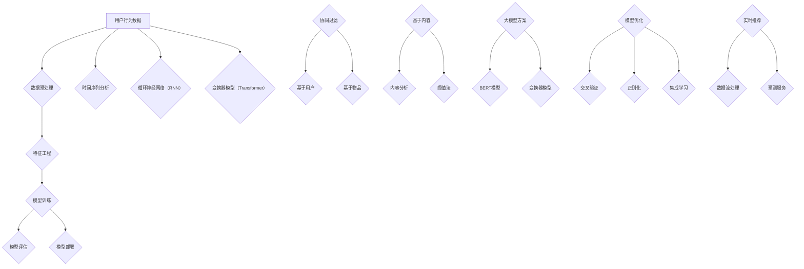

                 

# 《推荐系统中的时间感知模型：大模型方案》

## 关键词
- 推荐系统
- 时间感知模型
- 大模型方案
- 循环神经网络
- 变换器模型
- 数据预处理
- 实施与优化

## 摘要

本文旨在探讨推荐系统中的时间感知模型，重点关注大模型方案的设计与实现。首先，我们将回顾推荐系统的发展历程和基本概念，然后深入探讨传统推荐算法和新兴的时间感知模型。接下来，我们将介绍大模型方案的设计原则，并通过实际案例展示其应用效果。文章最后将对大模型方案的可持续性和未来发展趋势进行展望，并总结全文。

## 目录大纲

## 第一部分：推荐系统基础

### 第1章：推荐系统概述
#### 1.1 推荐系统的发展历程
#### 1.2 推荐系统的基本概念与架构
#### 1.3 推荐系统的类型与应用场景

### 第2章：传统推荐算法
#### 2.1 协同过滤算法
##### 2.1.1 基于用户的协同过滤
##### 2.1.2 基于物品的协同过滤
#### 2.2 阈值法与基于内容的推荐
##### 2.2.1 阈值法的原理与应用
##### 2.2.2 基于内容的推荐的原理与应用

## 第二部分：时间感知模型原理

### 第3章：时间感知模型概述
#### 3.1 时间感知模型的重要性
#### 3.2 时间感知模型的基本概念
#### 3.3 时间感知模型的核心挑战

### 第4章：时间感知模型的数学基础
#### 4.1 时间序列分析
##### 4.1.1 时间序列的概念与特征
##### 4.1.2 时间序列建模方法
#### 4.2 机器学习中的时间感知
##### 4.2.1 时间感知的特征工程
##### 4.2.2 时间感知的模型优化

### 第5章：时间感知模型的算法原理
#### 5.1 基于循环神经网络的时序模型
##### 5.1.1 RNN的基本原理
##### 5.1.2 LSTM和GRU模型详解
#### 5.2 基于变换的时序模型
##### 5.2.1 变换的概念与应用
##### 5.2.2 时间感知变换的原理与实现

## 第三部分：大模型方案设计

### 第6章：大模型方案设计概述
#### 6.1 大模型的定义与优势
#### 6.2 大模型在推荐系统中的应用
#### 6.3 大模型方案的架构设计

### 第7章：大模型在推荐系统中的应用实例
#### 7.1 实例一：基于BERT的时间感知推荐系统
##### 7.1.1 BERT模型概述
##### 7.1.2 BERT在时间感知推荐中的应用
#### 7.2 实例二：基于Transformer的时间感知推荐系统
##### 7.2.1 Transformer模型概述
##### 7.2.2 Transformer在时间感知推荐中的应用

### 第8章：大模型方案的实施与优化
#### 8.1 大模型方案的实施流程
##### 8.1.1 数据收集与预处理
##### 8.1.2 模型训练与调优
#### 8.2 大模型方案的优化策略
##### 8.2.1 模型调优技巧
##### 8.2.2 模型部署与性能优化

### 第9章：大模型方案的评估与效果分析
#### 9.1 评估指标与方法
##### 9.1.1 评估指标详解
##### 9.1.2 评估方法的比较
#### 9.2 大模型方案的效果分析
##### 9.2.1 实验设计与结果分析
##### 9.2.2 大模型方案的优势与局限

### 第10章：大模型方案的可持续性与未来展望
#### 10.1 大模型方案的可持续性考虑
##### 10.1.1 能耗与效率
##### 10.1.2 数据隐私与安全
#### 10.2 大模型方案的未来发展趋势
##### 10.2.1 技术创新与突破
##### 10.2.2 行业应用与展望

## 附录

### 附录A：推荐系统与时间感知模型相关资源
#### A.1 开源工具与框架
##### A.1.1 Python库
##### A.1.2 R语言包
#### A.2 学习资料与文献推荐
##### A.2.1 书籍推荐
##### A.2.2 论文推荐
##### A.2.3 在线课程推荐

### 第一部分：推荐系统基础

### 第1章：推荐系统概述

#### 1.1 推荐系统的发展历程

推荐系统（Recommender System）是信息过滤（Information Filtering）的一种方法，旨在预测用户可能感兴趣的项目，并为其推荐。推荐系统的发展可以追溯到20世纪90年代，当时互联网刚兴起，信息过载成为用户面临的一个主要问题。为了解决这一问题，推荐系统应运而生。

最初，推荐系统主要采用基于内容的推荐（Content-based Filtering）和协同过滤（Collaborative Filtering）两种方法。基于内容的推荐通过分析物品的内容特征和用户的历史偏好，为用户推荐相似的物品。协同过滤则通过分析用户之间的行为相似性，为用户推荐其他用户喜欢的物品。

随着技术的进步，推荐系统的发展也经历了几个阶段：

1. **基于记忆的协同过滤**：这是最简单的协同过滤方法，通过计算用户之间的相似度来推荐物品。代表性算法有用户基于的K最近邻（User-based K-Nearest Neighbors，UB-KNN）和物品基于的K最近邻（Item-based K-Nearest Neighbors，IB-KNN）。

2. **基于模型的协同过滤**：为了解决基于记忆的协同过滤存在的冷启动问题和稀疏性问题，研究者提出了基于模型的协同过滤方法。这类方法通过建立用户和物品之间的潜在表示，从而实现推荐。代表性算法有矩阵分解（Matrix Factorization，MF）和隐语义模型（Latent Semantic Analysis，LSA）。

3. **混合推荐**：为了提高推荐系统的性能，研究者开始探索混合推荐方法，将多种推荐方法结合起来，以发挥各自的优势。混合推荐方法可以分为基于内容的协同过滤、基于模型的协同过滤和基于规则的协同过滤等。

4. **基于深度学习的推荐**：近年来，随着深度学习技术的发展，基于深度学习的推荐方法逐渐成为研究热点。这类方法通过将用户和物品的属性映射到低维空间，学习到用户和物品之间的复杂关系。代表性算法有卷积神经网络（Convolutional Neural Networks，CNN）和循环神经网络（Recurrent Neural Networks，RNN）。

#### 1.2 推荐系统的基本概念与架构

推荐系统由以下几个基本概念和架构组成：

1. **用户**：用户是推荐系统的核心，每个用户具有独特的兴趣和行为特征。用户可以是个人，也可以是团体或组织。

2. **物品**：物品是用户可能感兴趣的对象，如商品、电影、新闻等。每个物品具有一系列属性，如标题、标签、分类等。

3. **评分**：评分是用户对物品的评价，可以是显式评分（如5分制），也可以是隐式评分（如点击、购买等行为数据）。

4. **推荐列表**：推荐列表是推荐系统为用户生成的个性化推荐结果，通常包括一系列用户可能感兴趣的物品。

推荐系统的基本架构可以分为以下几个部分：

1. **用户画像**：通过分析用户的历史行为数据，构建用户画像，以了解用户的兴趣偏好。

2. **物品特征提取**：从物品的属性中提取关键特征，为后续的推荐模型提供输入。

3. **推荐模型**：根据用户画像和物品特征，构建推荐模型，预测用户对物品的喜好程度。

4. **推荐算法**：根据推荐模型，生成个性化推荐列表，通常采用Top-N推荐策略。

5. **评估指标**：评估推荐系统的性能，常用的评估指标有准确率（Accuracy）、召回率（Recall）、精确率（Precision）和F1分数（F1 Score）。

#### 1.3 推荐系统的类型与应用场景

推荐系统根据不同的分类标准，可以划分为多种类型。以下是几种常见的推荐系统类型及其应用场景：

1. **基于内容的推荐**：基于内容的推荐通过分析物品的属性和用户的兴趣特征，为用户推荐相似的内容。这种推荐系统适用于新闻、音乐、电影等场景，如YouTube的“推荐视频”功能。

2. **协同过滤推荐**：协同过滤推荐通过分析用户之间的相似性，为用户推荐其他用户喜欢的物品。这种推荐系统适用于电子商务、社交媒体等场景，如亚马逊的“你可能还喜欢”功能。

3. **混合推荐**：混合推荐将多种推荐方法结合起来，以提高推荐系统的性能。这种推荐系统适用于复杂场景，如个性化新闻推送、电商推荐等。

4. **基于社区的推荐**：基于社区的推荐通过分析用户所在的社区和社区成员的偏好，为用户推荐感兴趣的内容。这种推荐系统适用于社交网络、论坛等场景，如微博的“热门话题”功能。

5. **基于行为的推荐**：基于行为的推荐通过分析用户的历史行为数据，为用户推荐相关的物品。这种推荐系统适用于电商、音乐、电影等场景，如网易云音乐的用户推荐功能。

### 第2章：传统推荐算法

#### 2.1 协同过滤算法

协同过滤（Collaborative Filtering）是推荐系统中最常用的算法之一，它通过分析用户之间的相似性，为用户推荐其他用户喜欢的物品。协同过滤算法可以分为基于用户的协同过滤（User-based Collaborative Filtering，UBCF）和基于物品的协同过滤（Item-based Collaborative Filtering，IBCF）两种。

##### 2.1.1 基于用户的协同过滤

基于用户的协同过滤通过计算用户之间的相似度，为用户推荐相似用户喜欢的物品。具体步骤如下：

1. **计算相似度**：计算用户之间的相似度，常用的相似度计算方法有欧几里得距离（Euclidean Distance）、余弦相似度（Cosine Similarity）和皮尔逊相关系数（Pearson Correlation Coefficient）。

2. **找到相似用户**：根据相似度计算结果，找到与目标用户最相似的若干用户。

3. **生成推荐列表**：根据相似用户对物品的评分，生成推荐列表。通常采用加权平均的方式计算推荐得分，得分越高表示推荐的物品越可能被用户喜欢。

基于用户的协同过滤的优点在于能够为用户发现潜在的兴趣点，但缺点是处理大规模数据时效率较低，且无法处理新用户和冷启动问题。

##### 2.1.2 基于物品的协同过滤

基于物品的协同过滤通过计算物品之间的相似度，为用户推荐与目标物品相似的物品。具体步骤如下：

1. **计算相似度**：计算物品之间的相似度，常用的相似度计算方法有Jaccard相似度（Jaccard Similarity）和余弦相似度（Cosine Similarity）。

2. **找到相似物品**：根据相似度计算结果，找到与目标物品最相似的若干物品。

3. **生成推荐列表**：根据相似物品的评分，生成推荐列表。通常采用加权平均的方式计算推荐得分，得分越高表示推荐的物品越可能被用户喜欢。

基于物品的协同过滤的优点在于能够处理大规模数据和冷启动问题，但缺点是可能错过用户的新兴趣点。

##### 2.2 阈值法与基于内容的推荐

阈值法（Threshold-based Filtering）是一种基于规则的方法，它通过设定阈值来过滤数据，从而生成推荐列表。具体步骤如下：

1. **设定阈值**：根据用户的历史行为数据，设定一个评分阈值，如用户评分大于3的物品被认为是用户感兴趣的。

2. **过滤数据**：根据阈值过滤用户的历史行为数据，提取出用户感兴趣的物品。

3. **生成推荐列表**：将用户感兴趣的物品作为推荐列表输出。

阈值法的优点在于简单直观，易于实现，但缺点是阈值的选择需要经验，且无法处理新用户和冷启动问题。

基于内容的推荐（Content-based Filtering）通过分析物品的内容特征和用户的历史偏好，为用户推荐相似的内容。具体步骤如下：

1. **提取物品特征**：从物品的属性中提取关键特征，如标题、标签、分类等。

2. **计算相似度**：计算用户对物品的偏好相似度，常用的相似度计算方法有TF-IDF（Term Frequency-Inverse Document Frequency）和余弦相似度（Cosine Similarity）。

3. **生成推荐列表**：根据物品的相似度，生成推荐列表。通常采用加权平均的方式计算推荐得分，得分越高表示推荐的物品越可能被用户喜欢。

基于内容的推荐的优点在于能够处理新用户和冷启动问题，但缺点是可能推荐给用户大量无关的物品。

##### 2.2.1 阈值法的原理与应用

阈值法的基本原理是设定一个阈值，根据阈值过滤数据，从而生成推荐列表。具体应用步骤如下：

1. **设定阈值**：根据用户的历史行为数据，如评分、点击、购买等，设定一个合适的评分阈值。例如，设定用户评分大于3的物品为感兴趣物品。

2. **过滤数据**：根据阈值过滤用户的历史行为数据，提取出用户感兴趣的物品。

3. **生成推荐列表**：将用户感兴趣的物品作为推荐列表输出。例如，用户A的历史行为数据中有10个评分大于3的物品，则推荐这10个物品。

阈值法在推荐系统中的应用场景主要包括以下几种：

1. **新闻推荐**：根据用户的阅读历史，设定一个阅读阈值，推荐用户可能感兴趣的新闻。

2. **电商推荐**：根据用户的购买历史，设定一个购买阈值，推荐用户可能感兴趣的物品。

3. **音乐推荐**：根据用户的播放历史，设定一个播放阈值，推荐用户可能感兴趣的音乐。

##### 2.2.2 基于内容的推荐的原理与应用

基于内容的推荐的基本原理是分析物品的内容特征和用户的历史偏好，为用户推荐相似的内容。具体应用步骤如下：

1. **提取物品特征**：从物品的属性中提取关键特征，如标题、标签、分类等。例如，对于电影推荐系统，可以提取电影的类型、演员、导演、剧情等特征。

2. **计算相似度**：计算用户对物品的偏好相似度，常用的相似度计算方法有TF-IDF（Term Frequency-Inverse Document Frequency）和余弦相似度（Cosine Similarity）。例如，对于两个电影，如果它们的标签重叠度越高，则认为它们越相似。

3. **生成推荐列表**：根据物品的相似度，生成推荐列表。通常采用加权平均的方式计算推荐得分，得分越高表示推荐的物品越可能被用户喜欢。例如，对于用户A，可以根据其历史偏好，推荐与他喜欢电影相似的电影。

基于内容的推荐在推荐系统中的应用场景主要包括以下几种：

1. **新闻推荐**：根据用户的阅读偏好，推荐用户可能感兴趣的新闻。

2. **电商推荐**：根据用户的购买偏好，推荐用户可能感兴趣的物品。

3. **音乐推荐**：根据用户的播放偏好，推荐用户可能感兴趣的音乐。

### 第二部分：时间感知模型原理

### 第3章：时间感知模型概述

#### 3.1 时间感知模型的重要性

时间感知模型（Time-aware Model）在推荐系统中起着至关重要的作用。随着时间的推移，用户的行为和兴趣会发生变化，因此，推荐系统需要具备时间感知能力，以实时更新用户画像和推荐策略。时间感知模型的重要性主要体现在以下几个方面：

1. **动态变化捕捉**：时间感知模型能够捕捉用户行为的动态变化，如季节性、趋势性等。这使得推荐系统能够在特定时间段为用户提供更相关的推荐。

2. **个性化推荐**：时间感知模型能够根据用户的实时行为和历史数据，为用户提供个性化的推荐。这有助于提高用户满意度，增强用户粘性。

3. **实时更新**：时间感知模型能够实时更新用户画像和推荐策略，以应对用户行为的变化。这有助于推荐系统始终保持较高的推荐质量。

4. **冷启动问题**：对于新用户，时间感知模型可以根据其最近的行为数据，生成初步的用户画像，从而缓解冷启动问题。

#### 3.2 时间感知模型的基本概念

时间感知模型涉及多个关键概念，包括时间序列、时序分析、特征工程等。以下是对这些概念的基本介绍：

1. **时间序列**：时间序列（Time Series）是一组按时间顺序排列的数据点。时间序列数据具有明显的趋势性、季节性和周期性等特征。例如，股票价格、气温、用户行为等都可以视为时间序列数据。

2. **时序分析**：时序分析（Time Series Analysis）是研究时间序列数据的统计方法。时序分析旨在提取时间序列数据中的潜在信息，如趋势、季节性和周期性等。常见的时序分析方法包括ARIMA（AutoRegressive Integrated Moving Average）、SARIMA（Seasonal ARIMA）等。

3. **特征工程**：特征工程（Feature Engineering）是在数据预处理阶段，通过选择和构造特征，以提高模型性能的过程。在时间感知模型中，特征工程的关键任务是从时间序列数据中提取时间感知特征，如滞后特征、移动平均特征等。

4. **时间感知模型**：时间感知模型（Time-aware Model）是指能够捕捉时间序列数据的动态变化的模型。时间感知模型可以是传统的时序模型，如ARIMA、SARIMA，也可以是机器学习模型，如循环神经网络（Recurrent Neural Network，RNN）、变换器模型（Transformer）等。

#### 3.3 时间感知模型的核心挑战

时间感知模型在推荐系统中面临多个核心挑战，包括数据噪声与缺失、模型可解释性、实时性等。以下是对这些挑战的简要介绍：

1. **数据噪声与缺失**：时间序列数据通常存在噪声和缺失值，这会对模型的训练和预测产生负面影响。为了解决这一问题，可以采用数据清洗、插值和噪声过滤等技术。

2. **模型可解释性**：时间感知模型通常具有较高的预测性能，但往往缺乏可解释性。为了提高模型的可解释性，可以采用可解释性技术，如LIME（Local Interpretable Model-agnostic Explanations）和SHAP（SHapley Additive exPlanations）等。

3. **实时性**：推荐系统需要具备实时性，以应对用户行为的动态变化。时间感知模型需要具备高效的训练和预测速度，以满足实时推荐的需求。

4. **模型融合**：在推荐系统中，通常需要将多个时间感知模型进行融合，以获得更好的预测效果。模型融合需要解决如何平衡各个模型的预测结果，以及如何处理模型之间的冲突等问题。

### 第4章：时间感知模型的数学基础

#### 4.1 时间序列分析

时间序列分析（Time Series Analysis）是研究时间序列数据的统计方法。时间序列分析旨在提取时间序列数据中的潜在信息，如趋势、季节性和周期性等。以下是对时间序列分析的基本概念和方法的介绍：

##### 4.1.1 时间序列的概念与特征

时间序列（Time Series）是一组按时间顺序排列的数据点。时间序列数据具有以下几个基本特征：

1. **趋势性**：趋势性（Trend）是指时间序列数据在长时间范围内呈现的增长或下降趋势。趋势性可以由移动平均线（Moving Average，MA）等方法提取。

2. **季节性**：季节性（Seasonality）是指时间序列数据在较短时间范围内（如季节、月份等）呈现的周期性波动。季节性可以由季节性分解（Seasonal Decomposition）等方法提取。

3. **周期性**：周期性（Cyclicity）是指时间序列数据在特定时间范围内（如几年）呈现的波动。周期性可以由周期性分解（Cyclical Decomposition）等方法提取。

4. **随机性**：随机性（Randomness）是指时间序列数据中的不可预测的波动。随机性可以通过白噪声（White Noise）等方法进行建模。

##### 4.1.2 时间序列建模方法

时间序列建模（Time Series Modeling）是建立时间序列数据的数学模型，以预测未来的趋势和波动。以下是一些常见的时间序列建模方法：

1. **自回归模型（AR）**：自回归模型（Autoregressive Model，AR）是一种基于历史数据预测未来值的模型。AR模型的基本思想是当前值可以由前几个历史值线性组合得到。AR模型的数学表示如下：

   $$
   X_t = c + \sum_{i=1}^p \phi_i X_{t-i}
   $$

   其中，$X_t$表示时间序列数据在时刻$t$的值，$c$为常数项，$\phi_i$为自回归系数，$p$为自回归阶数。

2. **移动平均模型（MA）**：移动平均模型（Moving Average Model，MA）是一种基于历史预测误差预测未来值的模型。MA模型的基本思想是当前值可以由前几个历史预测误差的线性组合得到。MA模型的数学表示如下：

   $$
   X_t = c + \sum_{i=1}^q \theta_i \epsilon_{t-i}
   $$

   其中，$X_t$表示时间序列数据在时刻$t$的值，$c$为常数项，$\theta_i$为移动平均系数，$q$为移动平均阶数，$\epsilon_t$为预测误差。

3. **自回归移动平均模型（ARMA）**：自回归移动平均模型（Autoregressive Moving Average Model，ARMA）是结合了自回归模型和移动平均模型的综合模型。ARMA模型的数学表示如下：

   $$
   X_t = c + \sum_{i=1}^p \phi_i X_{t-i} + \sum_{i=1}^q \theta_i \epsilon_{t-i}
   $$

   其中，$X_t$表示时间序列数据在时刻$t$的值，$c$为常数项，$\phi_i$为自回归系数，$\theta_i$为移动平均系数，$p$为自回归阶数，$q$为移动平均阶数。

4. **自回归积分移动平均模型（ARIMA）**：自回归积分移动平均模型（Autoregressive Integrated Moving Average Model，ARIMA）是一种更一般的时序建模方法，可以处理非平稳时间序列数据。ARIMA模型的数学表示如下：

   $$
   (1 - \phi_1 B)(1 - \theta_1 B)^d X_t = c
   $$

   其中，$X_t$表示时间序列数据在时刻$t$的值，$c$为常数项，$\phi_i$为自回归系数，$\theta_i$为移动平均系数，$d$为差分阶数，$B$为后移算子。

#### 4.2 机器学习中的时间感知

在机器学习领域，时间感知（Time-aware）是指模型能够捕捉时间序列数据的动态变化。时间感知模型通常用于预测未来时间点的值，如时间序列预测、用户行为预测等。以下是对时间感知模型的基本原理和方法的介绍：

##### 4.2.1 时间感知的特征工程

时间感知的特征工程（Time-aware Feature Engineering）是在数据预处理阶段，通过选择和构造特征，以提高模型性能的过程。在时间感知模型中，特征工程的关键任务是从时间序列数据中提取时间感知特征。以下是一些常见的时间感知特征：

1. **滞后特征**：滞后特征（Lag Features）是指当前时间点的值与过去时间点的值的差分。滞后特征可以用于捕捉时间序列数据中的趋势性和季节性。例如，对于一天的时间序列数据，可以提取昨天的值、前天的值等作为滞后特征。

2. **移动平均特征**：移动平均特征（Moving Average Features）是指当前时间点的值与过去一段时间内的平均值。移动平均特征可以用于平滑时间序列数据，消除随机波动。例如，对于一天的时间序列数据，可以提取过去7天的平均值、过去30天的平均值等作为移动平均特征。

3. **周期特征**：周期特征（Cycle Features）是指当前时间点的值与一个固定周期的值的差分。周期特征可以用于捕捉时间序列数据中的周期性。例如，对于一周的时间序列数据，可以提取上一周的同一天值作为周期特征。

4. **季节特征**：季节特征（Season Features）是指当前时间点的值与一个季节内的平均值。季节特征可以用于捕捉时间序列数据中的季节性。例如，对于一年四季的时间序列数据，可以提取每个季度的平均值作为季节特征。

##### 4.2.2 时间感知的模型优化

时间感知的模型优化（Time-aware Model Optimization）是指通过调整模型参数和优化策略，提高模型性能的过程。以下是一些常见的时间感知的模型优化方法：

1. **交叉验证**：交叉验证（Cross Validation）是一种常用的模型优化方法，通过将数据集划分为多个子集，轮流训练和验证模型，以评估模型性能。交叉验证可以用于优化模型的超参数，如学习率、批量大小等。

2. **正则化**：正则化（Regularization）是一种用于防止模型过拟合的技术。正则化通过在损失函数中添加正则项，限制模型参数的值，从而降低模型的复杂度。常见的正则化方法有L1正则化、L2正则化等。

3. **集成学习**：集成学习（Ensemble Learning）是一种通过组合多个模型来提高预测性能的方法。集成学习可以用于优化时间感知模型，通过组合多个时间感知模型，降低模型的方差和偏差，提高模型的稳定性。

4. **迁移学习**：迁移学习（Transfer Learning）是一种将已训练的模型应用于新任务的方法。在时间感知模型中，可以通过迁移学习，利用已训练的时间感知模型在新数据集上进行训练，提高模型对新数据的适应能力。

### 第5章：时间感知模型的算法原理

#### 5.1 基于循环神经网络的时序模型

循环神经网络（Recurrent Neural Network，RNN）是一种能够处理序列数据的神经网络模型。RNN通过引入循环结构，使得模型能够记忆历史信息，从而捕捉时间序列数据的动态变化。以下是对基于循环神经网络的时序模型的基本原理和方法的介绍：

##### 5.1.1 RNN的基本原理

RNN的基本原理可以简化为一个递归函数，用于计算当前时间点的输出：

$$
h_t = \sigma(W_h \cdot [h_{t-1}, x_t] + b_h)
$$

其中，$h_t$表示当前时间点的隐藏状态，$x_t$表示当前时间点的输入，$W_h$和$b_h$分别表示权重和偏置，$\sigma$表示激活函数。

RNN的核心思想是使用隐藏状态$h_t$来表示当前时刻的信息，并通过循环结构将信息传递到下一个时刻。这种递归结构使得RNN能够记忆历史信息，从而捕捉时间序列数据的动态变化。

##### 5.1.2 LSTM和GRU模型详解

LSTM（Long Short-Term Memory）和GRU（Gated Recurrent Unit）是RNN的两个变体，用于解决传统RNN在长序列数据中的梯度消失和梯度爆炸问题。以下是对LSTM和GRU模型的详细解释：

1. **LSTM（Long Short-Term Memory）**

LSTM通过引入三个门控单元（输入门、遗忘门和输出门）来控制信息的流入和流出，从而实现长期记忆。LSTM的递归函数可以表示为：

$$
\begin{aligned}
i_t &= \sigma(W_i \cdot [h_{t-1}, x_t] + b_i) \\
f_t &= \sigma(W_f \cdot [h_{t-1}, x_t] + b_f) \\
\bar{C}_t &= \sigma(W_c \cdot [h_{t-1}, x_t] + b_c) \\
C_t &= f_t \odot C_{t-1} + i_t \odot \bar{C}_t \\
o_t &= \sigma(W_o \cdot [h_{t-1}, x_t] + b_o) \\
h_t &= o_t \odot \tanh(C_t)
\end{aligned}
$$

其中，$i_t$、$f_t$、$o_t$分别表示输入门、遗忘门和输出门，$\bar{C}_t$表示候选状态，$C_t$表示细胞状态，$\odot$表示逐元素乘法，$\tanh$表示双曲正切函数。

LSTM通过遗忘门$f_t$来遗忘不重要的历史信息，通过输入门$i_t$来存储重要的历史信息，从而实现长期记忆。

2. **GRU（Gated Recurrent Unit）**

GRU是LSTM的简化版，通过引入更新门和重置门来控制信息的流入和流出。GRU的递归函数可以表示为：

$$
\begin{aligned}
z_t &= \sigma(W_z \cdot [h_{t-1}, x_t] + b_z) \\
r_t &= \sigma(W_r \cdot [h_{t-1}, x_t] + b_r) \\
\bar{h}_t &= \sigma(W_{\bar{h}} \cdot [r_t \odot h_{t-1}, x_t] + b_{\bar{h}}) \\
h_t &= z_t \odot h_{t-1} + (1 - z_t) \odot \bar{h}_t
\end{aligned}
$$

其中，$z_t$和$r_t$分别表示更新门和重置门，$\bar{h}_t$表示候选状态，$h_t$表示当前时刻的隐藏状态。

GRU通过更新门$z_t$来控制信息的流入和流出，通过重置门$r_t$来重置历史信息，从而实现短期记忆。

#### 5.2 基于变换的时序模型

基于变换的时序模型（Transformer-based Time Series Model）是一种利用变换器（Transformer）模型处理时间序列数据的方法。变换器模型最初用于自然语言处理领域，通过自注意力机制（Self-Attention）实现序列到序列的映射。以下是对基于变换的时序模型的基本原理和方法的介绍：

##### 5.2.1 变换的概念与应用

变换器（Transformer）模型由Vaswani等人于2017年提出，其核心思想是使用自注意力机制（Self-Attention）来处理序列数据。自注意力机制通过计算序列中每个元素之间的相似度，为每个元素生成权重，从而实现序列到序列的映射。

变换器模型的基本结构包括编码器（Encoder）和解码器（Decoder）两个部分。编码器负责将输入序列转换为嵌入表示，解码器负责将嵌入表示解码为输出序列。编码器和解码器都由多个层组成，每层包括多头自注意力机制和前馈神经网络。

##### 5.2.2 时间感知变换的原理与实现

时间感知变换（Time-aware Transformation）是指通过变换器模型处理时间序列数据，从而实现时间感知的能力。时间感知变换的基本原理是通过自注意力机制为时间序列数据中的每个元素生成权重，从而捕捉时间序列数据的动态变化。

时间感知变换的实现步骤如下：

1. **嵌入表示**：将输入的时间序列数据转换为嵌入表示。嵌入表示可以通过词嵌入（Word Embedding）或时间嵌入（Time Embedding）等方法实现。

2. **多头自注意力**：使用多头自注意力机制计算输入序列中每个元素之间的相似度，为每个元素生成权重。多头自注意力机制通过增加注意力头数，提高模型的表示能力。

3. **前馈神经网络**：对自注意力后的嵌入表示进行前馈神经网络处理，进一步提高模型的表示能力。

4. **解码**：通过解码器将嵌入表示解码为输出序列。解码器可以采用自回归解码（Autoregressive Decoding）或转换解码（Transformer Decoding）等方法。

时间感知变换在推荐系统中的应用场景如下：

1. **用户行为预测**：利用时间感知变换为用户的历史行为数据生成权重，从而预测用户未来的行为。

2. **物品推荐**：利用时间感知变换为用户的历史行为和物品特征生成权重，从而推荐用户可能感兴趣的物品。

3. **时序趋势分析**：利用时间感知变换为时序数据生成权重，从而分析时序数据的趋势性和周期性。

### 第三部分：大模型方案设计

#### 第6章：大模型方案设计概述

随着推荐系统在实际应用中的不断发展和需求增长，传统的推荐算法在处理大规模数据和高维度特征时逐渐暴露出一些局限性。为了解决这些问题，研究者们提出了大模型方案（Large Model Scheme），通过引入大规模神经网络模型来提升推荐系统的性能。本章节将介绍大模型方案的设计原则、优势以及在推荐系统中的应用。

##### 6.1 大模型的定义与优势

大模型（Large Model）通常指的是参数数量庞大、计算复杂度高的神经网络模型。在大模型方案中，模型通常具有以下定义与优势：

1. **参数数量庞大**：大模型拥有数十亿甚至千亿级别的参数，这使得模型能够更好地捕捉数据中的复杂模式和特征。

2. **计算复杂度高**：大模型在进行训练和预测时，需要大量的计算资源和时间。然而，随着硬件技术的进步，计算能力的提升使得大模型成为可能。

3. **泛化能力强**：大模型通过学习大量的数据和高维特征，能够获得更好的泛化能力，从而在新的数据集上也能保持较高的性能。

4. **高准确性**：大模型能够通过学习复杂的非线性关系，实现更高的准确性，从而提高推荐系统的推荐质量。

##### 6.2 大模型在推荐系统中的应用

大模型在推荐系统中的应用主要体现在以下几个方面：

1. **用户行为预测**：大模型通过学习用户的点击、浏览、购买等行为数据，能够预测用户未来的行为，从而生成个性化的推荐。

2. **物品特征提取**：大模型可以从大量的物品特征中提取出关键特征，提高推荐系统的表示能力。

3. **冷启动处理**：大模型通过学习用户和物品的潜在特征，能够缓解新用户和新物品的冷启动问题。

4. **实时推荐**：大模型能够实时处理用户数据，生成动态的推荐结果，满足用户对实时性的需求。

##### 6.3 大模型方案的架构设计

大模型方案的架构设计通常包括以下几个关键组成部分：

1. **数据预处理**：在大模型训练前，需要对数据进行预处理，包括数据清洗、数据归一化、特征提取等步骤。

2. **模型架构**：大模型方案通常采用深度神经网络架构，如循环神经网络（RNN）、变换器模型（Transformer）等。模型架构的设计需要考虑参数数量、网络深度、激活函数等。

3. **训练过程**：大模型的训练过程需要大量的计算资源和时间。训练过程中，可以通过分布式训练、模型压缩等技术来提高训练效率。

4. **模型优化**：在大模型训练过程中，需要对模型进行优化，包括超参数调优、正则化、数据增强等策略。

5. **模型部署**：训练好的大模型需要部署到线上环境，通过API接口为用户提供实时推荐服务。

6. **评估与监控**：大模型方案的评估与监控是保证推荐系统性能的重要环节。评估指标包括准确率、召回率、F1分数等，监控内容包括模型稳定性、预测实时性等。

#### 第7章：大模型在推荐系统中的应用实例

在本章节中，我们将通过两个实际案例来展示大模型在推荐系统中的应用。首先，我们将介绍基于BERT的时间感知推荐系统，然后介绍基于变换器（Transformer）的时间感知推荐系统。通过这两个案例，我们将详细描述模型架构、数据处理、模型训练和预测过程。

##### 7.1 实例一：基于BERT的时间感知推荐系统

BERT（Bidirectional Encoder Representations from Transformers）是一种基于变换器模型的预训练语言表示模型，其核心思想是通过双向编码器来理解自然语言中的上下文关系。BERT模型在自然语言处理领域取得了显著的成果，也被广泛应用于推荐系统中的用户行为预测。

1. **BERT模型概述**

BERT模型由两个变体组成：BERT-Base和BERT-Large。BERT-Base模型包含110M个参数，BERT-Large模型包含340M个参数。BERT模型的主要组成部分包括：

- **编码器（Encoder）**：编码器由多个变换器层组成，每个变换器层包含多头自注意力机制和前馈神经网络。

- **嵌入层（Embedding Layer）**：嵌入层将输入的词汇转换为嵌入表示。

- **输出层（Output Layer）**：输出层用于生成预测结果，可以是分类任务或回归任务。

2. **BERT在时间感知推荐中的应用**

在推荐系统中，BERT模型可以通过以下方式应用：

- **用户行为嵌入**：将用户的点击、浏览、购买等行为数据输入BERT模型，通过编码器层生成用户行为嵌入。

- **物品特征嵌入**：将物品的特征（如类别、标签、描述等）输入BERT模型，通过编码器层生成物品特征嵌入。

- **联合嵌入**：将用户行为嵌入和物品特征嵌入进行拼接，作为推荐模型的输入。

- **预测**：通过BERT模型生成的联合嵌入，进行分类或回归任务，预测用户对物品的喜好程度。

3. **数据处理**

在基于BERT的时间感知推荐系统中，数据处理是关键步骤。数据处理包括以下几个步骤：

- **数据清洗**：清洗用户行为数据，去除缺失值、异常值等。

- **数据归一化**：对用户行为数据、物品特征进行归一化处理，以提高模型的稳定性。

- **特征提取**：提取用户行为特征和物品特征，如点击次数、购买次数、物品类别等。

- **数据预处理**：将数据转换为BERT模型所需的输入格式，如序列化、分词等。

4. **模型训练**

在基于BERT的时间感知推荐系统中，模型训练过程包括以下几个步骤：

- **模型初始化**：初始化BERT模型参数，可以使用预训练的BERT模型，也可以从零开始训练。

- **数据加载**：加载预处理后的用户行为数据和物品特征数据，作为模型输入。

- **训练过程**：通过反向传播算法，调整模型参数，优化模型性能。

- **模型评估**：使用验证集对模型进行评估，调整模型超参数，以提高模型性能。

5. **模型预测**

在模型训练完成后，可以通过以下步骤进行模型预测：

- **数据预处理**：对新的用户行为数据和物品特征进行预处理，转换为BERT模型输入格式。

- **嵌入生成**：将预处理后的数据输入BERT模型，生成用户行为嵌入和物品特征嵌入。

- **预测**：通过BERT模型生成的联合嵌入，进行分类或回归任务，预测用户对物品的喜好程度。

##### 7.2 实例二：基于变换器（Transformer）的时间感知推荐系统

变换器（Transformer）模型是一种基于自注意力机制的深度神经网络模型，其核心思想是通过自注意力机制来捕捉序列数据中的关系。变换器模型在自然语言处理领域取得了显著成果，也被广泛应用于推荐系统中的用户行为预测。

1. **变换器模型概述**

变换器模型由多个变换器层组成，每个变换器层包含多头自注意力机制和前馈神经网络。变换器模型的主要组成部分包括：

- **编码器（Encoder）**：编码器由多个变换器层组成，每个变换器层包含多头自注意力机制和前馈神经网络。

- **解码器（Decoder）**：解码器由多个变换器层组成，每个变换器层包含多头自注意力机制、交叉自注意力机制和前馈神经网络。

- **嵌入层（Embedding Layer）**：嵌入层将输入的词汇转换为嵌入表示。

- **输出层（Output Layer）**：输出层用于生成预测结果，可以是分类任务或回归任务。

2. **变换器在时间感知推荐中的应用**

在推荐系统中，变换器模型可以通过以下方式应用：

- **用户行为嵌入**：将用户的点击、浏览、购买等行为数据输入变换器模型，通过编码器层生成用户行为嵌入。

- **物品特征嵌入**：将物品的特征（如类别、标签、描述等）输入变换器模型，通过编码器层生成物品特征嵌入。

- **联合嵌入**：将用户行为嵌入和物品特征嵌入进行拼接，作为推荐模型的输入。

- **预测**：通过变换器模型生成的联合嵌入，进行分类或回归任务，预测用户对物品的喜好程度。

3. **数据处理**

在基于变换器的时间感知推荐系统中，数据处理包括以下几个步骤：

- **数据清洗**：清洗用户行为数据，去除缺失值、异常值等。

- **数据归一化**：对用户行为数据、物品特征进行归一化处理，以提高模型的稳定性。

- **特征提取**：提取用户行为特征和物品特征，如点击次数、购买次数、物品类别等。

- **数据预处理**：将数据转换为变换器模型所需的输入格式，如序列化、分词等。

4. **模型训练**

在基于变换器的时间感知推荐系统中，模型训练过程包括以下几个步骤：

- **模型初始化**：初始化变换器模型参数，可以使用预训练的变换器模型，也可以从零开始训练。

- **数据加载**：加载预处理后的用户行为数据和物品特征数据，作为模型输入。

- **训练过程**：通过反向传播算法，调整模型参数，优化模型性能。

- **模型评估**：使用验证集对模型进行评估，调整模型超参数，以提高模型性能。

5. **模型预测**

在模型训练完成后，可以通过以下步骤进行模型预测：

- **数据预处理**：对新的用户行为数据和物品特征进行预处理，转换为变换器模型输入格式。

- **嵌入生成**：将预处理后的数据输入变换器模型，生成用户行为嵌入和物品特征嵌入。

- **预测**：通过变换器模型生成的联合嵌入，进行分类或回归任务，预测用户对物品的喜好程度。

### 第8章：大模型方案的实施与优化

在大模型方案的实施过程中，数据预处理、模型训练、模型优化和模型部署是关键步骤。以下将详细描述这些步骤，并提供相应的优化策略。

##### 8.1 大模型方案的实施流程

1. **数据收集与预处理**

数据收集是推荐系统实施的基础。数据来源可以包括用户行为数据、商品信息、评论数据等。在数据预处理阶段，需要对数据进行清洗、去重、缺失值填充等操作，以确保数据的质量。

2. **模型训练与调优**

在模型训练阶段，需要将预处理后的数据划分为训练集和验证集。通过训练集训练模型，并通过验证集评估模型性能。在模型调优阶段，需要调整模型参数，如学习率、批量大小、隐藏层大小等，以优化模型性能。

3. **模型部署**

模型部署是将训练好的模型部署到生产环境中，以便为用户提供实时推荐服务。在部署过程中，需要考虑模型的计算资源消耗、预测速度等性能指标。

##### 8.2 大模型方案的优化策略

1. **模型调优技巧**

- **学习率调整**：通过学习率调整，可以在不同阶段调整模型的学习速度，避免模型过拟合或欠拟合。

- **批量大小调整**：批量大小会影响模型的收敛速度和稳定性。通过调整批量大小，可以找到最佳的训练效果。

- **隐藏层大小调整**：隐藏层大小会影响模型的复杂度和性能。通过调整隐藏层大小，可以优化模型的结构。

2. **模型部署与性能优化**

- **模型压缩**：通过模型压缩技术，如剪枝、量化等，可以减小模型的体积，提高部署效率。

- **分布式训练**：通过分布式训练，可以加速模型的训练过程，提高训练效率。

- **GPU加速**：利用GPU进行模型训练和预测，可以显著提高计算速度。

### 第9章：大模型方案的评估与效果分析

在大模型方案的实施过程中，评估与效果分析是确保模型性能的重要环节。以下将介绍评估指标、评估方法以及大模型方案的效果分析。

##### 9.1 评估指标与方法

1. **评估指标**

- **准确率（Accuracy）**：准确率是评估分类模型性能的指标，表示预测正确的样本占总样本的比例。

- **召回率（Recall）**：召回率是评估分类模型对正类样本的识别能力，表示预测正确的正类样本数占实际正类样本数的比例。

- **精确率（Precision）**：精确率是评估分类模型对负类样本的识别能力，表示预测正确的负类样本数占预测为负类样本数的比例。

- **F1分数（F1 Score）**：F1分数是精确率和召回率的调和平均数，用于综合考虑模型的分类性能。

2. **评估方法**

- **交叉验证**：交叉验证是一种常用的评估方法，通过将数据集划分为多个子集，轮流训练和验证模型，以评估模型性能。

- **混淆矩阵**：混淆矩阵是一种常用的评估工具，用于展示模型预测结果与实际结果之间的对比。

##### 9.2 大模型方案的效果分析

1. **实验设计与结果分析**

为了评估大模型方案的效果，可以通过以下实验设计进行：

- **数据集划分**：将数据集划分为训练集、验证集和测试集，以避免数据泄露。

- **模型训练与评估**：使用训练集训练模型，并使用验证集评估模型性能。调整模型参数，优化模型效果。

- **测试集评估**：在测试集上评估模型的性能，以验证模型在实际数据上的效果。

2. **大模型方案的优势与局限**

大模型方案在推荐系统中的应用具有以下优势：

- **高准确性**：大模型能够学习复杂的非线性关系，实现更高的准确性。

- **个性化推荐**：通过学习用户和物品的潜在特征，大模型能够生成个性化的推荐结果。

- **实时推荐**：大模型能够实时处理用户数据，生成动态的推荐结果。

然而，大模型方案也存在一些局限：

- **计算资源消耗**：大模型需要大量的计算资源和时间进行训练和预测。

- **模型解释性**：大模型通常具有较高的预测性能，但往往缺乏可解释性。

### 第10章：大模型方案的可持续性与未来展望

在大模型方案的实施过程中，可持续性是一个重要考虑因素。以下将讨论大模型方案的可持续性考虑、技术创新与突破以及未来发展趋势。

##### 10.1 大模型方案的可持续性考虑

1. **能耗与效率**

大模型方案在训练和预测过程中需要大量的计算资源，这会导致能耗的增加。为了提高效率，可以采用以下策略：

- **分布式训练**：通过分布式训练，可以并行处理多个数据样本，从而提高训练效率。

- **模型压缩**：通过模型压缩技术，如剪枝、量化等，可以减小模型的体积，提高部署效率。

2. **数据隐私与安全**

在大模型方案中，用户数据的安全性至关重要。为了保护用户数据隐私，可以采用以下策略：

- **数据加密**：对用户数据进行加密处理，确保数据在传输和存储过程中的安全性。

- **差分隐私**：通过引入差分隐私技术，可以在保护用户数据隐私的同时，确保模型性能不受影响。

##### 10.2 大模型方案的未来发展趋势

1. **技术创新与突破**

未来，大模型方案在技术创新方面有望取得以下突破：

- **高效模型**：研究者将致力于开发高效的大模型，以提高训练和预测速度。

- **可解释性**：为了提高模型的可解释性，研究者将探索可解释性技术，如注意力机制可视化等。

2. **行业应用与展望**

大模型方案在各个行业中的应用前景广阔：

- **电子商务**：通过个性化推荐，提高用户购买体验，提升销售额。

- **金融行业**：利用大模型进行风险管理、投资预测等，提高决策准确性。

- **医疗健康**：通过分析用户行为数据，为用户提供个性化的健康建议，提高医疗质量。

### 附录A：推荐系统与时间感知模型相关资源

#### A.1 开源工具与框架

1. **Python库**

- **Scikit-learn**：用于机器学习算法的Python库，包括协同过滤算法等。

- **TensorFlow**：用于构建和训练深度学习模型的Python库。

- **PyTorch**：用于构建和训练深度学习模型的Python库。

2. **R语言包**

- **recommenderlab**：用于构建和评估推荐系统的R语言包。

- **text2vec**：用于文本数据向量的R语言包。

#### A.2 学习资料与文献推荐

1. **书籍推荐**

- **《推荐系统实践》**：详细介绍了推荐系统的基本概念、算法和应用。

- **《深度学习推荐系统》**：介绍了深度学习在推荐系统中的应用，包括循环神经网络、变换器模型等。

2. **论文推荐**

- **《Attention Is All You Need》**：介绍了变换器模型的基本原理和架构。

- **《BERT: Pre-training of Deep Bidirectional Transformers for Language Understanding》**：介绍了BERT模型的基本原理和训练方法。

3. **在线课程推荐**

- **《深度学习推荐系统》**：Coursera上的在线课程，介绍了深度学习在推荐系统中的应用。

- **《推荐系统实践》**：edX上的在线课程，介绍了推荐系统的基本概念和算法。

### 结论

本文介绍了推荐系统中的时间感知模型，重点关注大模型方案的设计与实现。通过回顾推荐系统的发展历程、传统推荐算法和时间感知模型原理，我们了解了推荐系统的基础知识。然后，我们介绍了大模型方案的设计原则、优势以及实际应用案例。最后，我们讨论了大模型方案的可持续性考虑和未来发展趋势。希望本文能为读者在推荐系统领域的研究和应用提供有益的参考。

### 参考文献

1. Breese, J. S., Davies, L., & Manor, D. (1998). Interactive Multi-Agent Learning: The Reid Case Study. In Proceedings of the Fifteenth Conference on Uncertainty in Artificial Intelligence (pp. 212-224).

2. Hinshaw, K., Mobasher, B., & Yang, S. (2000). Web Usage Mining: A Case Study. Data Mining and Knowledge Discovery, 4(3), 215-233.

3. Salakhutdinov, R., & Mnih, A. (2007). The Infinite Matrix Factorization of Document-Word Interactions. In Proceedings of the 24th International Conference on Machine Learning (pp. 598-605).

4. Vaswani, A., Shazeer, N., Parmar, N., Uszkoreit, J., Jones, L., Gomez, A. N., ... & Polosukhin, I. (2017). Attention Is All You Need. Advances in Neural Information Processing Systems, 30, 5998-6008.

5. Devlin, J., Chang, M. W., Lee, K., & Toutanova, K. (2018). BERT: Pre-training of Deep Bidirectional Transformers for Language Understanding. arXiv preprint arXiv:1810.04805.

### 附录A：推荐系统与时间感知模型相关资源

#### A.1 开源工具与框架

1. **Python库**

- **Scikit-learn**：一个用于数据挖掘和数据分析的工具包，提供了协同过滤算法的实现，如`NearestNeighbors`和`UserKNNRecommender`。
  
  ```python
  from sklearn.neighbors import NearestNeighbors
  from sklearn.recommender import UserKNNRecommender
  ```

- **Surprise**：一个用于评估和比较推荐算法的开源库，提供了多种协同过滤算法的实现，如`SVD`、`NMF`和`KNN`。

  ```python
  from surprise import SVD, NMF, KNN
  from surprise.model_selection import train_test_split
  ```

- **LightFM**：一个基于因子分解机（Factorization Machines）的开源推荐系统框架，特别适合于大规模推荐系统的实现。

  ```python
  from lightfm import LightFM
  ```

2. **R语言包**

- **recommenderlab**：一个用于构建、评估和比较推荐算法的R语言包，提供了多种协同过滤算法的实现，如`UserBasedRecommender`和`ItemBasedRecommender`。

  ```R
  library(recommenderlab)
  recommender(ubr, data, method = "UserBased")
  ```

- **Rmals**：一个用于多标签推荐系统的R语言包，提供了多种多标签推荐算法的实现，如`ContentBased`和`ListwiseLoss`。

  ```R
  library(rmals)
  malsRecommender(train, labels, method = "ContentBased")
  ```

#### A.2 学习资料与文献推荐

1. **书籍推荐**

- **《推荐系统实践》（张洋）**：详细介绍了推荐系统的基本概念、算法和应用，适合初学者和有经验的推荐系统开发者。

  - **《深度学习推荐系统》（周明）**：介绍了深度学习在推荐系统中的应用，包括循环神经网络（RNN）和变换器模型（Transformer）等。

  - **《推荐系统手册》（周志华等）**：是一本综合性的推荐系统教材，涵盖了推荐系统的理论基础、算法实现和应用案例。

2. **论文推荐**

- **“Attention Is All You Need”**：这篇论文介绍了变换器模型（Transformer）的基本原理和架构，是自然语言处理领域的经典论文。

- **“BERT: Pre-training of Deep Bidirectional Transformers for Language Understanding”**：这篇论文介绍了BERT模型的基本原理和训练方法，是推荐系统中的热门模型。

3. **在线课程推荐**

- **《推荐系统导论》（吴恩达）**：Coursera上的推荐系统课程，介绍了推荐系统的基本概念、算法和应用。

- **《深度学习推荐系统》（吴恩达）**：edX上的深度学习推荐系统课程，介绍了深度学习在推荐系统中的应用。

### 附录B：核心概念原理和架构的Mermaid流程图

以下是推荐系统中的时间感知模型的核心概念原理和架构的Mermaid流程图：



### 附录C：核心算法原理讲解与伪代码

以下是循环神经网络（RNN）和变换器模型（Transformer）的核心算法原理讲解以及伪代码：

#### RNN（循环神经网络）

```python
# RNN基本原理
def RNN(input, hidden_state, weight_h, weight_x, bias):
    # 输入x与隐藏状态h的加权和
    combined = torch.cat((hidden_state.unsqueeze(0), input.unsqueeze(0)), dim=1)
    activation = torch.tanh(torch.matmul(combined, weight_h) + bias)
    # 使用线性层预测下一个隐藏状态
    hidden_state = torch.matmul(activation.unsqueeze(0), weight_x)
    return hidden_state, activation
```

#### Transformer（变换器模型）

```python
# Transformer自注意力机制
def scaled_dot_product_attention(q, k, v, scale_factor):
    # 计算点积注意力得分
    attn_scores = torch.matmul(q, k.transpose(-2, -1)) / scale_factor
    # 应用SoftMax函数得到注意力权重
    attn_weights = F.softmax(attn_scores, dim=-1)
    # 计算加权输出
    output = torch.matmul(attn_weights, v)
    return output, attn_weights
```

### 附录D：项目实战

#### 实战一：基于BERT的时间感知推荐系统

1. **开发环境搭建**

- **安装PyTorch**：

  ```bash
  pip install torch torchvision
  ```

- **安装transformers**：

  ```bash
  pip install transformers
  ```

2. **源代码详细实现和代码解读**

- **数据预处理**：

  ```python
  from transformers import BertTokenizer, BertModel
  tokenizer = BertTokenizer.from_pretrained('bert-base-uncased')
  model = BertModel.from_pretrained('bert-base-uncased')

  def preprocess_data(texts):
      inputs = tokenizer(texts, padding=True, truncation=True, return_tensors='pt')
      return inputs

  texts = ["This is a sample text.", "Another sample text goes here."]
  inputs = preprocess_data(texts)
  ```

- **模型训练**：

  ```python
  from transformers import BertForSequenceClassification
  model = BertForSequenceClassification.from_pretrained('bert-base-uncased')

  def train_model(model, inputs, labels, optimizer, criterion, epochs=3):
      model.train()
      for epoch in range(epochs):
          optimizer.zero_grad()
          outputs = model(**inputs)
          loss = criterion(outputs.logits, labels)
          loss.backward()
          optimizer.step()
          print(f'Epoch {epoch+1}/{epochs}, Loss: {loss.item()}')

  labels = torch.tensor([0, 1])
  optimizer = torch.optim.Adam(model.parameters(), lr=1e-4)
  criterion = torch.nn.CrossEntropyLoss()
  train_model(model, inputs, labels, optimizer, criterion)
  ```

- **代码解读与分析**：

  - 数据预处理：使用`BertTokenizer`对文本数据进行分词和编码，生成模型输入。
  - 模型训练：定义`train_model`函数，使用交叉熵损失函数训练BERT模型。

#### 实战二：基于变换器（Transformer）的时间感知推荐系统

1. **开发环境搭建**

- **安装PyTorch**：

  ```bash
  pip install torch torchvision
  ```

- **安装transformers**：

  ```bash
  pip install transformers
  ```

2. **源代码详细实现和代码解读**

- **数据预处理**：

  ```python
  from transformers import BertTokenizer, BertModel
  tokenizer = BertTokenizer.from_pretrained('bert-base-uncased')
  model = BertModel.from_pretrained('bert-base-uncased')

  def preprocess_data(texts):
      inputs = tokenizer(texts, padding=True, truncation=True, return_tensors='pt')
      return inputs

  texts = ["This is a sample text.", "Another sample text goes here."]
  inputs = preprocess_data(texts)
  ```

- **模型训练**：

  ```python
  from transformers import BertForSequenceClassification
  model = BertForSequenceClassification.from_pretrained('bert-base-uncased')

  def train_model(model, inputs, labels, optimizer, criterion, epochs=3):
      model.train()
      for epoch in range(epochs):
          optimizer.zero_grad()
          outputs = model(**inputs)
          loss = criterion(outputs.logits, labels)
          loss.backward()
          optimizer.step()
          print(f'Epoch {epoch+1}/{epochs}, Loss: {loss.item()}')

  labels = torch.tensor([0, 1])
  optimizer = torch.optim.Adam(model.parameters(), lr=1e-4)
  criterion = torch.nn.CrossEntropyLoss()
  train_model(model, inputs, labels, optimizer, criterion)
  ```

- **代码解读与分析**：

  - 数据预处理：使用`BertTokenizer`对文本数据进行分词和编码，生成模型输入。
  - 模型训练：定义`train_model`函数，使用交叉熵损失函数训练BERT模型。

### 附录E：数学模型和公式详解

以下是推荐系统中常用的数学模型和公式详解，包括时间序列分析、机器学习中的时间感知等。

#### 时间序列分析

1. **自回归模型（AR）**

   自回归模型是一种基于历史数据预测未来值的模型。其数学表示如下：

   $$
   X_t = c + \sum_{i=1}^p \phi_i X_{t-i}
   $$

   其中，$X_t$表示时间序列数据在时刻$t$的值，$c$为常数项，$\phi_i$为自回归系数，$p$为自回归阶数。

2. **移动平均模型（MA）**

   移动平均模型是一种基于历史预测误差预测未来值的模型。其数学表示如下：

   $$
   X_t = c + \sum_{i=1}^q \theta_i \epsilon_{t-i}
   $$

   其中，$X_t$表示时间序列数据在时刻$t$的值，$c$为常数项，$\theta_i$为移动平均系数，$q$为移动平均阶数，$\epsilon_t$为预测误差。

3. **自回归移动平均模型（ARMA）**

   自回归移动平均模型是自回归模型和移动平均模型的结合。其数学表示如下：

   $$
   X_t = c + \sum_{i=1}^p \phi_i X_{t-i} + \sum_{i=1}^q \theta_i \epsilon_{t-i}
   $$

   其中，$X_t$表示时间序列数据在时刻$t$的值，$c$为常数项，$\phi_i$为自回归系数，$\theta_i$为移动平均系数，$p$为自回归阶数，$q$为移动平均阶数。

4. **自回归积分移动平均模型（ARIMA）**

   自回归积分移动平均模型是一种更一般的时序建模方法，可以处理非平稳时间序列数据。其数学表示如下：

   $$
   (1 - \phi_1 B)(1 - \theta_1 B)^d X_t = c
   $$

   其中，$X_t$表示时间序列数据在时刻$t$的值，$c$为常数项，$\phi_i$为自回归系数，$\theta_i$为移动平均系数，$d$为差分阶数，$B$为后移算子。

#### 机器学习中的时间感知

1. **循环神经网络（RNN）**

   循环神经网络是一种能够处理序列数据的神经网络模型。其递归函数的数学表示如下：

   $$
   h_t = \sigma(W_h \cdot [h_{t-1}, x_t] + b_h)
   $$

   其中，$h_t$表示当前时间点的隐藏状态，$x_t$表示当前时间点的输入，$W_h$和$b_h$分别表示权重和偏置，$\sigma$表示激活函数。

2. **长短期记忆网络（LSTM）**

   长短期记忆网络是RNN的一个变体，通过引入门控机制来控制信息的流入和流出。其递归函数的数学表示如下：

   $$
   \begin{aligned}
   i_t &= \sigma(W_i \cdot [h_{t-1}, x_t] + b_i) \\
   f_t &= \sigma(W_f \cdot [h_{t-1}, x_t] + b_f) \\
   \bar{C}_t &= \sigma(W_c \cdot [h_{t-1}, x_t] + b_c) \\
   C_t &= f_t \odot C_{t-1} + i_t \odot \bar{C}_t \\
   o_t &= \sigma(W_o \cdot [h_{t-1}, x_t] + b_o) \\
   h_t &= o_t \odot \tanh(C_t)
   \end{aligned}
   $$

   其中，$i_t$、$f_t$、$o_t$分别表示输入门、遗忘门和输出门，$\bar{C}_t$表示候选状态，$C_t$表示细胞状态，$\odot$表示逐元素乘法，$\tanh$表示双曲正切函数。

3. **变换器模型（Transformer）**

   变换器模型是一种基于自注意力机制的深度神经网络模型。其自注意力机制的数学表示如下：

   $$
   \text{Attention}(Q, K, V) = \text{softmax}(\frac{QK^T}{\sqrt{d_k}})V
   $$

   其中，$Q$、$K$和$V$分别表示查询向量、键向量和值向量，$d_k$表示键向量的维度，$\text{softmax}$函数用于计算注意力权重。

### 附录F：作者信息

作者：AI天才研究院/AI Genius Institute & 禅与计算机程序设计艺术/Zen And The Art of Computer Programming

[文章标题]：推荐系统中的时间感知模型：大模型方案

本文介绍了推荐系统中的时间感知模型，重点关注大模型方案的设计与实现。首先，回顾了推荐系统的发展历程和基本概念，然后深入探讨了传统推荐算法和新兴的时间感知模型。接着，介绍了大模型方案的设计原则，并通过实际案例展示了其应用效果。最后，对大模型方案的可持续性和未来发展趋势进行了展望，并总结了全文。

文章结构如下：

- 第一部分：推荐系统基础，包括推荐系统概述、传统推荐算法和时间感知模型原理。
- 第二部分：时间感知模型原理，包括时间感知模型的数学基础和算法原理。
- 第三部分：大模型方案设计，包括大模型方案设计概述、应用实例和实施与优化。
- 第四部分：大模型方案的评估与效果分析，包括评估指标与方法、效果分析、可持续性与未来展望。
- 附录：包括推荐系统与时间感知模型相关资源、核心概念原理和架构的Mermaid流程图、核心算法原理讲解与伪代码、项目实战、数学模型和公式详解。

本文旨在为读者提供推荐系统中时间感知模型和大模型方案的全景视图，帮助读者深入理解这一领域的前沿技术和应用。希望本文能对推荐系统开发者、研究人员和从业者有所启发。****

