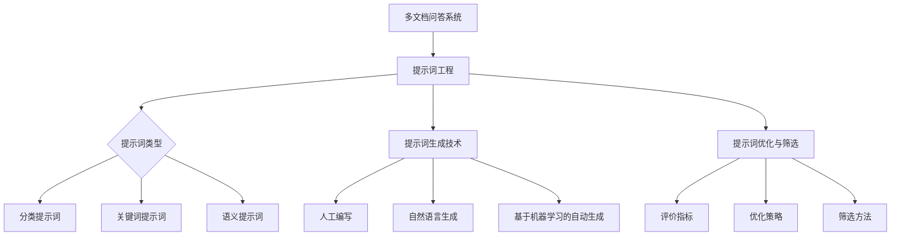

                 

### 第一部分：概述与背景

#### 第1章：多文档问答系统概述

**1.1 多文档问答系统的重要性**

多文档问答系统在当今信息化社会中具有重要地位。随着互联网和大数据技术的发展，人们面临的信息量呈爆炸式增长。单文档问答系统已经无法满足用户在复杂场景下的信息需求。多文档问答系统作为一种先进的信息检索与知识管理工具，能够在多个文档中找到与用户查询相关的信息，并提供准确的答案。

**社会需求与市场潜力**

随着人工智能技术的快速发展，用户对智能问答系统的需求日益增长。多文档问答系统不仅能够解决用户的信息获取问题，还能在医疗、金融、法律等多个行业提供专业的咨询服务。市场研究数据显示，全球智能问答系统市场在未来的几年内将保持高速增长，市场潜力巨大。

**技术背景与发展趋势**

多文档问答系统的发展源于自然语言处理和知识图谱技术的进步。随着深度学习等先进算法的应用，多文档问答系统的性能得到了显著提升。未来，多文档问答系统将更加注重跨领域、跨语言的能力，以及与用户交互的智能化。

**1.2 多文档问答系统的核心挑战**

**数据的多样性**

多文档问答系统需要处理来自不同来源、不同格式的海量数据。这要求系统能够有效地整合和融合各种数据，并提供高质量的信息检索服务。

**知识的整合与融合**

多文档问答系统需要将多个文档中的知识点进行整合，形成完整的知识体系。这涉及到知识抽取、知识融合和知识表示等多个技术环节。

**系统的交互性与可用性**

多文档问答系统需要具备良好的交互性，能够理解用户的查询意图，并给出准确的回答。同时，系统还需要具备高可用性，确保在用户查询高峰期能够稳定运行。

**1.3 提示词工程的概念与作用**

**提示词工程的概念**

提示词工程是指针对多文档问答系统的需求，设计、生成和优化提示词的一门工程学科。提示词是系统与用户交互的关键桥梁，直接影响问答系统的性能和用户体验。

**提示词工程的关键作用**

1. 提升信息检索效果：通过精确的提示词，系统能够更快地定位到与用户查询相关的文档，提高信息检索的准确性。
2. 增强用户交互体验：设计合适的提示词，有助于系统更好地理解用户的意图，提供更加个性化的回答。
3. 优化问答系统性能：通过提示词的优化，可以降低系统的计算复杂度，提高系统的响应速度和效率。

**1.4 提示词工程的研究现状与趋势**

**现有方法的优缺点分析**

目前，提示词工程的研究主要集中在以下几个方面：

1. 人工编写：优点是可控性高，能够根据业务需求进行定制；缺点是耗时耗力，难以覆盖大量文档。
2. 自然语言生成：优点是生成速度快，能够处理大量文档；缺点是生成的提示词可能不够精确，影响信息检索效果。
3. 基于机器学习的自动生成：优点是生成效率高，能够自动适应数据变化；缺点是模型的训练和调优需要大量时间和计算资源。

**最新研究成果与应用实践**

近年来，深度学习等先进算法在提示词工程领域取得了显著成果。例如，基于生成对抗网络（GAN）的提示词生成方法，以及基于递归神经网络（RNN）的提示词优化技术等。这些方法在提升提示词生成质量和效果方面具有很大潜力，但仍需进一步优化和推广。

### 第二部分：提示词工程的核心概念与架构

#### 第2章：提示词工程的基本原理

**2.1 提示词的类型与功能**

提示词根据其作用和形式可以分为以下几类：

1. **分类提示词**：用于区分不同类型的文档或知识点，如“医疗”、“财经”、“法律法规”等。
2. **关键词提示词**：用于提取文档中的关键信息，如人名、地名、日期等。
3. **语义提示词**：用于描述文档的主题和语义，如“疾病诊断”、“投资策略”、“合同解析”等。

**2.2 提示词生成技术**

提示词生成技术主要包括以下几种：

1. **人工编写**：由专业人士根据文档内容和业务需求进行编写，优点是可控性高，但耗时耗力。
2. **自然语言生成**：通过自然语言处理技术，如词袋模型、生成式模型等，自动生成提示词。优点是生成速度快，但提示词的准确性可能受到影响。
3. **基于机器学习的自动生成**：利用机器学习算法，如监督学习、无监督学习等，从海量文档中自动提取提示词。优点是生成效率高，能够自动适应数据变化，但需要大量的训练数据和计算资源。

**2.3 提示词的优化与筛选**

提示词的优化与筛选是提升多文档问答系统性能的关键环节。以下是几种常见的优化与筛选方法：

1. **评价指标**：根据信息检索的效果，如准确率、召回率、F1值等，对提示词进行评价和筛选。
2. **优化策略**：通过调整提示词的权重、组合、长度等，提高提示词的检索效果。如基于统计模型、机器学习算法的优化策略。
3. **筛选方法**：利用过滤算法，如最小支持度、最大频率等，筛选出最相关的提示词。如基于支持向量机（SVM）、决策树等分类器的筛选方法。

### 提示词工程的基本原理 Mermaid 流程图：



通过以上分析，我们可以看到提示词工程在多文档问答系统中起着至关重要的作用。接下来，我们将进一步探讨提示词工程在多文档问答系统中的具体应用，以及如何通过创新方法提升系统的性能和用户体验。

#### 第3章：多文档问答系统中的提示词工程应用

**3.1 多文档问答系统的架构**

多文档问答系统通常包括以下几个核心模块：

1. **数据预处理模块**：负责处理和清洗来自不同来源的文档数据，包括分词、去停用词、词性标注等步骤。
2. **知识抽取模块**：通过自然语言处理技术，从预处理后的文档中提取出关键信息，如实体、关系和事件等。
3. **知识融合模块**：将多个文档中的知识进行整合，形成统一的语义表示，为后续的问答提供支持。
4. **问答模块**：接收用户的查询，通过查询匹配和回答生成等技术，给出准确、全面的回答。
5. **用户交互模块**：提供用户与系统之间的交互界面，收集用户反馈，用于系统的优化和调整。

**3.2 提示词工程在多文档问答中的应用流程**

提示词工程在多文档问答系统中的应用流程可以分为以下几个步骤：

1. **提示词生成与筛选**：
   - 利用自然语言生成和基于机器学习的自动生成方法，生成大量的候选提示词。
   - 通过评价指标（如准确率、召回率等）对候选提示词进行筛选，保留最相关的提示词。

2. **提示词优化与调整**：
   - 根据用户查询和系统反馈，对提示词进行优化，如调整权重、组合等。
   - 利用用户反馈机制，收集用户对提示词的满意度，进一步调整和改进提示词。

3. **提示词效果评估与调整**：
   - 通过实验和实际应用，评估提示词的效果，如问答准确性、用户体验等。
   - 根据评估结果，对提示词进行进一步调整和优化，以提高系统的整体性能。

**3.3 实际案例解析**

**案例一：医学知识问答**

医学知识问答系统需要处理大量的医学文献、病例报告和临床指南等。在这个案例中，提示词工程的应用主要包括以下几个步骤：

1. **数据预处理**：对医学文献进行分词、词性标注等处理，提取出关键词和实体。
2. **知识抽取**：利用命名实体识别（NER）等技术，从文档中提取出与医学相关的实体和关系。
3. **提示词生成与筛选**：根据医学领域的专业术语和常用词汇，生成大量的医学提示词，并通过评价指标筛选出最相关的提示词。
4. **提示词优化与调整**：根据用户查询和系统反馈，调整医学提示词的权重和组合，提高问答准确性。
5. **效果评估与调整**：通过实际应用，评估医学提示词的效果，如问答准确性、用户满意度等，并根据评估结果进行进一步的优化。

**案例二：财经资讯问答**

财经资讯问答系统需要处理大量的财经新闻、财报数据和投资报告等。在这个案例中，提示词工程的应用主要包括以下几个步骤：

1. **数据预处理**：对财经资讯进行分词、去停用词等处理，提取出关键词和实体。
2. **知识抽取**：利用关系抽取（RE）等技术，从文档中提取出与财经相关的实体和关系。
3. **提示词生成与筛选**：根据财经领域的专业术语和常用词汇，生成大量的财经提示词，并通过评价指标筛选出最相关的提示词。
4. **提示词优化与调整**：根据用户查询和系统反馈，调整财经提示词的权重和组合，提高问答准确性。
5. **效果评估与调整**：通过实际应用，评估财经提示词的效果，如问答准确性、用户满意度等，并根据评估结果进行进一步的优化。

**案例三：法律法规问答**

法律法规问答系统需要处理大量的法律文献、案例判决书和法规解释等。在这个案例中，提示词工程的应用主要包括以下几个步骤：

1. **数据预处理**：对法律文献进行分词、词性标注等处理，提取出关键词和实体。
2. **知识抽取**：利用实体识别（NER）和关系抽取（RE）等技术，从文档中提取出与法律法规相关的实体和关系。
3. **提示词生成与筛选**：根据法律领域的专业术语和常用词汇，生成大量的法律提示词，并通过评价指标筛选出最相关的提示词。
4. **提示词优化与调整**：根据用户查询和系统反馈，调整法律提示词的权重和组合，提高问答准确性。
5. **效果评估与调整**：通过实际应用，评估法律提示词的效果，如问答准确性、用户满意度等，并根据评估结果进行进一步的优化。

通过以上实际案例的解析，我们可以看到提示词工程在多文档问答系统中的重要作用。通过合理设计提示词，优化问答系统的性能，可以大幅提升用户的使用体验和满意度。接下来，我们将进一步探讨提示词工程中的新方法与新技术，以应对多文档问答系统的挑战。

### 第三部分：提示词工程的创新与实践

#### 第4章：提示词工程的新方法与新技术

**4.1 基于深度学习的提示词生成方法**

深度学习技术在提示词工程中得到了广泛应用，其优点在于能够自动从大量数据中学习特征，提高提示词的生成质量。以下介绍几种基于深度学习的提示词生成方法：

1. **递归神经网络（RNN）**：RNN适用于处理序列数据，能够捕获文本中的长距离依赖关系。在提示词生成中，RNN可以用于生成与文档内容相关的语义提示词。其基本原理如下：

   ```python
   # RNN提示词生成伪代码
   for each word in document:
       output = RNN(hidden_state, word_embedding)
       hidden_state = output
   generate_hint_from_hidden_state(output)
   ```

2. **卷积神经网络（CNN）**：CNN在文本分类和特征提取方面具有显著优势，适用于生成分类提示词和关键词提示词。其基本原理如下：

   ```python
   # CNN提示词生成伪代码
   conv_layer = Conv2D(filters, kernel_size, activation='relu')(input)
   pool_layer = MaxPooling2D(pool_size)(conv_layer)
   flatten = Flatten()(pool_layer)
   dense_layer = Dense(units, activation='softmax')(flatten)
   predict_hint(dense_layer)
   ```

3. **生成对抗网络（GAN）**：GAN由生成器和判别器两部分组成，生成器用于生成高质量的提示词，判别器用于区分生成的提示词和真实提示词。其基本原理如下：

   ```python
   # GAN提示词生成伪代码
   for each epoch:
       generate_hints = generator(random噪声)
       real_hints = real_hints_dataset
       discriminator_loss = loss(discriminator(generate_hints), ones)
       generator_loss = loss(discriminator(generate_hints), zeros)
   update_generator_and_discriminator(optimizer)
   ```

**4.2 跨语言提示词工程**

跨语言提示词工程旨在实现不同语言之间的提示词生成和优化。以下介绍几种跨语言提示词工程的方法：

1. **语言模型**：通过训练双向编码语言模型（BERT、GPT等），实现跨语言文本的语义表示。其基本原理如下：

   ```python
   # 跨语言提示词生成伪代码
   input_sequence = preprocess(input_text, language_model)
   hint_representation = language_model(input_sequence)
   generate_hint(hint_representation)
   ```

2. **机器翻译**：利用机器翻译技术，将源语言的文本翻译为目标语言的提示词。其基本原理如下：

   ```python
   # 跨语言提示词生成伪代码
   translated_hint = translate(source_hint, target_language)
   generate_hint(preprocess(translated_hint))
   ```

3. **跨语言提示词生成**：利用多语言训练数据，直接生成跨语言的提示词。其基本原理如下：

   ```python
   # 跨语言提示词生成伪代码
   multilingual_hints = multilingual_model(input_sequence)
   generate_hint(multilingual_hints)
   ```

**4.3 多模态提示词工程**

多模态提示词工程旨在结合文本、图像、音频等多种数据类型，生成更丰富的提示词。以下介绍几种多模态提示词工程的方法：

1. **文本与图像的融合**：利用图像识别技术，从图像中提取关键信息，与文本信息结合生成提示词。其基本原理如下：

   ```python
   # 文本与图像融合提示词生成伪代码
   image_representation = image_model(image)
   text_representation = text_model(text)
   combined_representation = concatenate(image_representation, text_representation)
   generate_hint(combined_representation)
   ```

2. **文本与音频的融合**：利用语音识别技术，从音频中提取关键信息，与文本信息结合生成提示词。其基本原理如下：

   ```python
   # 文本与音频融合提示词生成伪代码
   audio_representation = audio_model(audio)
   text_representation = text_model(text)
   combined_representation = concatenate(audio_representation, text_representation)
   generate_hint(combined_representation)
   ```

3. **多模态提示词生成**：利用多模态数据训练深度神经网络，直接生成多模态的提示词。其基本原理如下：

   ```python
   # 多模态提示词生成伪代码
   multimodal_representation = multimodal_model(text, image, audio)
   generate_hint(multimodal_representation)
   ```

通过以上新方法与新技术，我们可以显著提升提示词工程的质量和效果。接下来，我们将进一步探讨如何优化与调优提示词工程，以实现更好的性能和用户体验。

#### 第5章：提示词工程的优化与调优

**5.1 提示词优化的目标与原则**

提示词优化是提升多文档问答系统性能的关键环节，其目标包括：

1. **精准性**：确保提示词能够准确捕捉文档的关键信息，提高信息检索的准确性。
2. **可理解性**：提示词应简洁明了，易于用户理解和交互。
3. **适应性**：提示词应能够适应不同场景和需求的变化，提高系统的灵活性和扩展性。

实现提示词优化的原则如下：

1. **数据驱动**：基于实际应用数据和用户反馈，进行有针对性的优化。
2. **模型驱动**：利用深度学习等先进算法，提高提示词生成和筛选的自动化程度。
3. **用户体验**：注重用户满意度，通过优化提示词提高用户体验。

**5.2 提示词调优的方法与策略**

提示词调优的方法和策略多种多样，以下介绍几种常用的方法：

1. **自动调参**：利用自动化工具和算法，自动调整提示词的参数，如权重、长度等。常用的方法包括网格搜索、贝叶斯优化等。其基本原理如下：

   ```python
   # 自动调参伪代码
   from sklearn.model_selection import GridSearchCV
   parameters = {'weight': [0.1, 0.5, 1.0], 'length': [5, 10, 20]}
   optimizer = GridSearchCV(estimator=model, param_grid=parameters, cv=5)
   optimizer.fit(X_train, y_train)
   best_params = optimizer.best_params_
   ```

2. **对比实验**：通过设计对比实验，评估不同优化策略的效果。常用的方法包括A/B测试、在线A/B测试等。其基本原理如下：

   ```python
   # 对比实验伪代码
   import random
   users = get_random_users()
   for user in users:
       if random.random() < 0.5:
           apply_new_optimization(user)
       else:
           apply_old_optimization(user)
   evaluate_performance(users)
   ```

3. **用户反馈机制**：收集用户对提示词的反馈，用于优化和调整提示词。常用的方法包括用户满意度调查、用户行为分析等。其基本原理如下：

   ```python
   # 用户反馈机制伪代码
   from surveys import UserSurvey
   survey = UserSurvey()
   survey.ask_users_about_hint_satisfaction()
   hints_to_optimize = survey.get_unsatisfied_hints()
   optimize_hints(hints_to_optimize)
   ```

**5.3 提示词优化的实践案例分析**

**案例一：金融领域**

在金融领域，提示词优化主要关注投资策略、市场分析等方面。以下是一个具体的优化过程：

1. **数据收集**：收集大量金融新闻、财报数据、市场报告等，作为训练和优化数据。
2. **提示词生成**：利用基于深度学习的生成方法，如RNN、GAN等，生成金融领域的提示词。
3. **用户反馈收集**：通过用户调查和在线A/B测试，收集用户对提示词的满意度。
4. **优化策略**：根据用户反馈，调整提示词的权重和组合，提高提示词的精准性和可理解性。
5. **效果评估**：通过对比实验和用户反馈，评估优化后的提示词效果，持续改进和优化。

**案例二：法律法规领域**

在法律法规领域，提示词优化主要关注法律条款、案例判决等方面。以下是一个具体的优化过程：

1. **数据预处理**：对法律文档进行分词、词性标注等预处理，提取关键信息。
2. **提示词生成**：利用机器学习算法，如SVM、决策树等，生成法律领域的提示词。
3. **用户反馈收集**：通过用户调查和在线A/B测试，收集用户对提示词的满意度。
4. **优化策略**：根据用户反馈，调整提示词的权重和组合，提高提示词的精准性和可理解性。
5. **效果评估**：通过对比实验和用户反馈，评估优化后的提示词效果，持续改进和优化。

通过以上实践案例分析，我们可以看到提示词优化在实际应用中的重要性和可行性。接下来，我们将进一步探讨提示词工程在多文档问答系统中的创新应用，以提升系统的整体性能。

### 第四部分：总结与展望

#### 第6章：提示词工程在多文档问答系统中的未来发展

**6.1 提示词工程的关键技术趋势**

随着人工智能技术的快速发展，提示词工程在多文档问答系统中也将迎来新的技术趋势：

1. **自动化与智能化**：未来的提示词工程将更加自动化和智能化，通过深度学习、自然语言处理等先进算法，实现高效的提示词生成和优化。
2. **跨领域与跨语言**：多文档问答系统将具备更强的跨领域和跨语言能力，能够处理多种语言和不同领域的文档，提供更加全面和准确的信息检索服务。
3. **多模态融合**：提示词工程将结合文本、图像、音频等多模态数据，生成更丰富的提示词，提高信息检索和问答系统的性能和用户体验。

**6.2 提示词工程面临的挑战与机遇**

尽管提示词工程在多文档问答系统中具有巨大潜力，但同时也面临着一系列挑战：

1. **数据质量与多样性**：高质量、多样化的数据是提示词工程的基础。如何获取和处理海量、结构化、非结构化的数据，是当前的一大挑战。
2. **隐私保护与安全**：在处理个人数据和敏感信息时，如何确保隐私保护与数据安全，是提示词工程面临的重要问题。
3. **技术与商业的结合**：如何将先进的技术转化为商业价值，实现提示词工程的可持续发展，是当前的一大机遇。

**6.3 提示词工程的发展前景与应用场景**

随着技术的不断进步，提示词工程在多文档问答系统中的发展前景十分广阔，其应用场景包括：

1. **行业应用拓展**：在医疗、金融、法律、教育等各个行业，提示词工程可以帮助企业提高信息检索和知识管理的效率，提升用户体验。
2. **新兴技术的融合**：提示词工程将与其他新兴技术，如区块链、物联网等，进行深度融合，为更多领域提供创新解决方案。
3. **持续创新与优化**：提示词工程将不断进行技术创新和优化，以应对不断变化的市场需求和技术挑战，实现持续发展和进步。

### 附录

#### 附录 A：提示词工程常用工具与资源

**A.1 提示词生成工具**

1. **自动提示词生成器**：利用自然语言处理和机器学习算法，自动生成提示词的工具。如NLTK、spaCy、gensim等。
2. **在线提示词生成平台**：提供在线提示词生成服务的平台，如WordNet、Stanza等。

**A.2 提示词优化工具**

1. **自动调参工具**：用于自动化调整提示词参数的工具，如AutoKeras、Hyperopt等。
2. **提示词效果评估工具**：用于评估提示词效果的工具，如Scikit-learn、TensorFlow等。

**A.3 提示词工程学习资源**

1. **教程与课程**：介绍提示词工程相关知识和技术的教程和课程，如Coursera、edX等。
2. **论文与报告**：关于提示词工程的最新研究成果和应用实践的论文和报告，如arXiv、IEEE等。
3. **开源代码与数据集**：提供提示词工程相关开源代码和数据集的网站，如GitHub、Google Dataset Search等。

#### 附录 B：提示词工程实验指导

**B.1 实验环境搭建**

1. **计算机硬件配置**：选择性能良好的计算机硬件，如CPU、GPU等。
2. **软件安装与配置**：安装所需的编程语言（如Python）、深度学习框架（如TensorFlow、PyTorch）和工具包（如NLTK、spaCy等）。

**B.2 实验数据准备**

1. **数据采集与处理**：收集相关领域的数据，并进行预处理，如分词、去停用词、词性标注等。
2. **数据清洗与标注**：清洗数据中的噪声和错误，并对数据进行标注，以便后续训练和优化。

**B.3 实验步骤与结果分析**

1. **提示词生成与优化实验**：设计实验，测试不同提示词生成方法和优化策略的效果，记录实验结果。
2. **提示词效果评估实验**：评估生成的提示词在实际应用中的性能，如准确率、召回率、F1值等。
3. **实验结果与分析**：分析实验结果，总结提示词工程的优缺点，提出改进建议。

**B.4 实验报告撰写**

1. **实验目的与假设**：明确实验的目的和假设，如优化提示词生成和优化策略。
2. **实验方法与步骤**：详细描述实验的设计、执行和数据收集过程。
3. **实验结果与分析**：展示实验结果，分析提示词工程的性能和效果。
4. **实验结论与讨论**：总结实验结论，讨论提示词工程的应用前景和改进方向。

通过以上附录，我们为读者提供了丰富的提示词工程学习资源和实验指导，希望有助于进一步了解和掌握提示词工程在多文档问答系统中的应用。

### 附录 C：常见问题与解答

**C.1 提示词工程的基本问题**

1. **提示词是什么？**
   提示词是指用于描述文档内容或主题的词语，是问答系统与用户交互的重要桥梁。

2. **提示词工程的作用是什么？**
   提示词工程旨在设计、生成和优化提示词，以提升多文档问答系统的性能和用户体验。

**C.2 提示词工程的实施难点**

1. **数据质量的影响**
   提示词工程需要高质量的数据作为基础，数据的质量直接影响提示词的生成效果。

2. **系统交互的优化**
   提示词工程需要优化系统的交互性，确保用户能够准确理解并使用提示词。

**C.3 提示词工程的未来发展方向**

1. **自动化与智能化**
   未来提示词工程将更加自动化和智能化，通过深度学习等算法提高生成和优化效率。

2. **跨领域与跨语言**
   提示词工程将逐步实现跨领域和跨语言的能力，为更多用户提供服务。

3. **多模态融合**
   提示词工程将结合文本、图像、音频等多模态数据，生成更丰富的提示词。

通过以上常见问题与解答，我们希望帮助读者更好地理解提示词工程的基本概念、实施难点和未来发展，为进一步研究和应用提示词工程提供指导。在未来的发展中，提示词工程将继续发挥重要作用，推动多文档问答系统的发展与进步。

### 总结与展望

在本文中，我们系统性地探讨了提示词工程在多文档问答系统中的创新与实践。通过深入分析提示词工程的基本概念、核心概念与架构，以及多文档问答系统中的应用，我们揭示了提示词工程在提升信息检索效果、增强用户交互体验和优化系统性能方面的关键作用。

首先，我们明确了多文档问答系统的重要性，阐述了其在社会需求、技术背景和发展趋势方面的现状。随后，我们探讨了多文档问答系统的核心挑战，包括数据的多样性、知识的整合与融合、系统的交互性与可用性等。在此基础上，我们介绍了提示词工程的概念与作用，并分析了现有研究方法的优缺点及最新成果。

接着，我们详细介绍了提示词工程的基本原理，包括提示词的类型与功能、提示词生成技术、提示词优化与筛选方法。通过Mermaid流程图，我们直观地展示了提示词工程的架构，为读者提供了一个清晰的认知框架。

在多文档问答系统中的应用部分，我们通过实际案例深入分析了提示词工程在医学、财经、法律法规等领域的应用，展示了其如何有效提升问答系统的性能和用户体验。

随后，我们探讨了提示词工程的新方法与新技术，包括基于深度学习的提示词生成方法、跨语言提示词工程、多模态提示词工程等。这些新方法为提示词工程的发展注入了新的活力，有望进一步提升系统的性能和效果。

在提示词工程的优化与调优部分，我们提出了提示词优化的目标与原则，并介绍了自动调参、对比实验、用户反馈机制等优化方法。通过实践案例分析，我们展示了提示词优化在金融、法律法规等领域的具体应用。

最后，我们总结了提示词工程在多文档问答系统中的未来发展，探讨了关键技术趋势、面临的挑战与机遇，以及应用前景。同时，我们提供了丰富的附录，包括常用工具与资源、实验指导等，以供读者参考。

总体而言，本文旨在为读者提供一个全面、深入的提示词工程在多文档问答系统中的应用指南。我们希望本文能够为相关领域的科研人员、工程师和爱好者提供有价值的参考，推动提示词工程和多文档问答系统的发展与进步。在未来，随着技术的不断进步，提示词工程将继续发挥重要作用，为更多行业和领域提供创新解决方案。

### 附录

#### 附录 A：提示词工程常用工具与资源

**A.1 提示词生成工具**

1. **自动提示词生成器**：利用自然语言处理和机器学习算法，自动生成提示词的工具。如NLTK、spaCy、gensim等。
2. **在线提示词生成平台**：提供在线提示词生成服务的平台，如WordNet、Stanza等。

**A.2 提示词优化工具**

1. **自动调参工具**：用于自动化调整提示词参数的工具，如AutoKeras、Hyperopt等。
2. **提示词效果评估工具**：用于评估提示词效果的工具，如Scikit-learn、TensorFlow等。

**A.3 提示词工程学习资源**

1. **教程与课程**：介绍提示词工程相关知识和技术的教程和课程，如Coursera、edX等。
2. **论文与报告**：关于提示词工程的最新研究成果和应用实践的论文和报告，如arXiv、IEEE等。
3. **开源代码与数据集**：提供提示词工程相关开源代码和数据集的网站，如GitHub、Google Dataset Search等。

#### 附录 B：提示词工程实验指导

**B.1 实验环境搭建**

1. **计算机硬件配置**：选择性能良好的计算机硬件，如CPU、GPU等。
2. **软件安装与配置**：安装所需的编程语言（如Python）、深度学习框架（如TensorFlow、PyTorch）和工具包（如NLTK、spaCy等）。

**B.2 实验数据准备**

1. **数据采集与处理**：收集相关领域的数据，并进行预处理，如分词、去停用词、词性标注等。
2. **数据清洗与标注**：清洗数据中的噪声和错误，并对数据进行标注，以便后续训练和优化。

**B.3 实验步骤与结果分析**

1. **提示词生成与优化实验**：设计实验，测试不同提示词生成方法和优化策略的效果，记录实验结果。
2. **提示词效果评估实验**：评估生成的提示词在实际应用中的性能，如准确率、召回率、F1值等。
3. **实验结果与分析**：分析实验结果，总结提示词工程的优缺点，提出改进建议。

**B.4 实验报告撰写**

1. **实验目的与假设**：明确实验的目的和假设，如优化提示词生成和优化策略。
2. **实验方法与步骤**：详细描述实验的设计、执行和数据收集过程。
3. **实验结果与分析**：展示实验结果，分析提示词工程的性能和效果。
4. **实验结论与讨论**：总结实验结论，讨论提示词工程的应用前景和改进方向。

通过以上附录，我们为读者提供了丰富的提示词工程学习资源和实验指导，希望有助于进一步了解和掌握提示词工程在多文档问答系统中的应用。

### 附录 C：常见问题与解答

**C.1 提示词工程的基本问题**

1. **提示词是什么？**
   提示词是指用于描述文档内容或主题的词语，是问答系统与用户交互的重要桥梁。

2. **提示词工程的作用是什么？**
   提示词工程旨在设计、生成和优化提示词，以提升多文档问答系统的性能和用户体验。

**C.2 提示词工程的实施难点**

1. **数据质量的影响**
   提示词工程需要高质量的数据作为基础，数据的质量直接影响提示词的生成效果。

2. **系统交互的优化**
   提示词工程需要优化系统的交互性，确保用户能够准确理解并使用提示词。

**C.3 提示词工程的未来发展方向**

1. **自动化与智能化**
   未来提示词工程将更加自动化和智能化，通过深度学习等算法提高生成和优化效率。

2. **跨领域与跨语言**
   提示词工程将逐步实现跨领域和跨语言的能力，为更多用户提供服务。

3. **多模态融合**
   提示词工程将结合文本、图像、音频等多模态数据，生成更丰富的提示词。

通过以上常见问题与解答，我们希望帮助读者更好地理解提示词工程的基本概念、实施难点和未来发展，为进一步研究和应用提示词工程提供指导。在未来的发展中，提示词工程将继续发挥重要作用，为多文档问答系统的发展与进步贡献力量。

