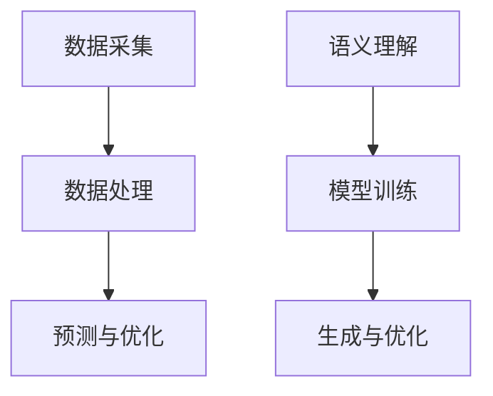

                 

### 文章标题

"提示词工程在智能电网系统中的运用"

### 文章关键词

智能电网、提示词工程、深度学习、自然语言处理、电力调度、能源管理

### 文章摘要

本文深入探讨了提示词工程在智能电网系统中的应用。首先，我们介绍了智能电网系统的基本概念和组成部分，包括数据采集、数据处理、预测与优化、电力调度与控制系统等。接着，我们阐述了提示词工程的原理和架构，包括语义理解、模型训练和生成与优化等。随后，我们详细讲解了深度学习在智能电网系统中的应用，包括神经网络基础、自然语言处理算法和提示词生成算法等。最后，我们通过一个实际项目案例，展示了提示词工程在智能电网系统中的应用效果，并分析了项目中的关键技术和优化策略。

## 第一部分: 核心概念与联系

### 1.1.1 智能电网系统概述

智能电网系统（Smart Grid）是传统电网与信息通信技术深度融合的产物，旨在通过信息通信技术实现对电网运行状态的实时监测、分析和优化。智能电网系统具有高效、可靠、智能化等特性，能够显著提高电网的运行效率和管理水平。

#### 智能电网系统的组成部分

智能电网系统主要由以下几个部分组成：

1. **数据采集系统**：通过传感器和智能设备实时采集电网的运行数据，如电压、电流、频率、负荷等。这些数据是智能电网系统的核心资源，用于分析和优化电网的运行。

2. **数据处理与存储系统**：对采集到的数据进行处理、清洗、存储，以便后续分析和应用。数据处理与存储系统需要具备高效的数据处理能力和强大的存储能力，以确保数据的完整性和可靠性。

3. **智能分析系统**：利用大数据分析、人工智能等技术对电网运行数据进行分析、预测和优化。智能分析系统是智能电网系统的核心，能够为电网的调度和控制提供科学依据。

4. **电力调度与控制系统**：根据智能分析系统的预测和优化结果，对电网进行实时调度和控制，确保电网的稳定和安全运行。电力调度与控制系统是智能电网系统的最后一道防线，能够有效应对突发情况，保障电网的安全和稳定。

#### 智能电网系统的特点

智能电网系统具有以下几个特点：

1. **高效性**：智能电网系统能够实时监测和分析电网运行状态，及时发现和解决问题，提高电网的运行效率。

2. **可靠性**：智能电网系统通过多种技术手段，确保电网的安全和稳定运行，降低故障率和停电时间。

3. **智能化**：智能电网系统能够根据实时数据，进行预测和优化，实现电网的智能化管理。

4. **灵活性**：智能电网系统支持多种能源接入，如可再生能源、储能系统等，实现能源的高效利用。

### 1.1.2 提示词工程概述

提示词工程（Prompt Engineering）是一种利用自然语言处理（NLP）技术和机器学习（ML）算法，为特定应用场景生成高质量提示词的方法。在智能电网系统中，提示词工程主要用于以下两个方面：

1. **用户交互**：通过生成与用户输入相关的提示词，提高用户交互的便利性和体验。例如，在电力调度系统中，提示词可以指导调度员进行操作，提高调度效率。

2. **智能决策**：通过生成与电网运行状态相关的提示词，辅助电力调度和控制人员进行智能决策。例如，在电力负荷预测中，提示词可以提供预测结果和优化建议，帮助调度员制定科学的调度策略。

#### 提示词工程的核心组成部分

提示词工程主要包括以下几个核心组成部分：

1. **语义理解**：利用NLP技术，理解用户输入的自然语言，提取关键信息，为后续的提示词生成提供基础。

2. **模型训练**：使用大量训练数据，训练出能够生成高质量提示词的模型。训练数据通常包括用户输入和对应的预期输出，如提示词。

3. **生成与优化**：根据用户输入，生成高质量的提示词，并通过用户反馈进行优化。生成过程通常采用机器学习算法，如序列到序列（Seq2Seq）模型或生成对抗网络（GAN）。

### 1.1.3 深度学习在智能电网系统中的应用

深度学习（Deep Learning）是一种基于人工神经网络的学习方法，通过多层神经元的非线性变换，对大量数据进行学习，以实现对复杂数据的分析和模式识别。在智能电网系统中，深度学习主要应用于以下几个方面：

1. **数据预处理**：利用深度学习技术对采集到的电网运行数据进行预处理，如异常值检测、数据归一化等。深度学习算法能够自动提取数据中的特征，提高数据的质量。

2. **数据挖掘**：利用深度学习技术对电网运行数据进行分析，挖掘出潜在的规律和模式。深度学习算法能够自动发现数据中的关联性和趋势，为电网优化提供依据。

3. **预测与优化**：利用深度学习技术对电网运行状态进行预测和优化，提高电网的运行效率和安全性。深度学习算法能够自动学习电网的运行规律，提供准确的预测和优化结果。

### 1.1.4 Mermaid 流程图

以下是一个简化的智能电网系统和提示词工程的Mermaid流程图：



## 第二部分: 核心算法原理讲解

### 2.1 深度学习算法原理

深度学习算法是一种基于人工神经网络的学习方法，通过多层神经元的非线性变换，对大量数据进行学习，以实现对复杂数据的分析和模式识别。在智能电网系统中，深度学习算法广泛应用于数据预处理、数据挖掘、预测与优化等任务。

#### 神经网络基础

神经网络是深度学习的基础，由多层神经元组成。每个神经元接收输入，并通过加权求和产生输出。神经元的输出通常通过激活函数进行非线性变换，以增强模型的非线性表达能力。

1. **神经元模型**：每个神经元接收多个输入，通过加权求和产生输出。假设有 $n$ 个输入 $x_1, x_2, ..., x_n$，权重分别为 $w_1, w_2, ..., w_n$，偏置为 $b$，则神经元的输出可以表示为：

   $$ z = \sum_{i=1}^{n} w_i x_i + b $$

2. **激活函数**：激活函数是对神经元输出进行非线性变换的函数，常用的激活函数包括 ReLU（Rectified Linear Unit）、Sigmoid 和 Tanh 等。

   - **ReLU**：$ f(x) = max(0, x)$，在 $x \geq 0$ 时输出为 $x$，否则输出为 0。
   - **Sigmoid**：$ f(x) = \frac{1}{1 + e^{-x}}$，将输入映射到 $(0, 1)$ 区间。
   - **Tanh**：$ f(x) = \frac{e^x - e^{-x}}{e^x + e^{-x}}$，将输入映射到 $(-1, 1)$ 区间。

3. **反向传播算法**：反向传播算法是神经网络训练的核心，通过计算输出误差，反向更新网络权重，以优化网络性能。

   - **前向传播**：给定输入 $x$，通过多层神经元的非线性变换，得到输出 $y$。
   - **计算误差**：计算预测输出 $y$ 与真实输出 $t$ 之间的误差，通常使用均方误差（MSE）或交叉熵损失（Cross-Entropy Loss）。
   - **反向传播**：根据误差梯度，反向更新网络权重，以最小化损失函数。

#### 自然语言处理算法

自然语言处理（NLP）是深度学习在文本领域的重要应用。NLP算法主要用于语义理解、文本生成、情感分析等任务。

1. **词嵌入**：词嵌入是将文本中的单词映射为高维向量的一种技术。常见的词嵌入模型包括 Word2Vec、GloVe 等。

   - **Word2Vec**：基于神经网络的词向量生成方法，通过训练词向量模型，将单词映射为向量。
   - **GloVe**：基于全局词向量的生成方法，通过计算词与词之间的相似度，生成高质量的词向量。

2. **序列模型**：序列模型用于处理序列数据，如循环神经网络（RNN）和长短期记忆网络（LSTM）。

   - **RNN**：循环神经网络，通过循环结构，处理序列数据。
   - **LSTM**：长短期记忆网络，通过引入门控机制，解决 RNN 的梯度消失问题。

3. **注意力机制**：注意力机制是一种用于处理序列数据的机制，通过动态地分配不同权重，突出关键信息。常见的注意力模型包括自注意力（Self-Attention）和Transformer 等。

#### 提示词生成算法

提示词工程是一种为特定应用场景生成提示词的方法。在智能电网系统中，提示词生成算法主要用于用户交互和智能决策。

1. **语义理解**：利用自然语言处理技术，理解用户输入的自然语言，提取关键信息。

2. **模型训练**：使用大量训练数据，训练出能够生成高质量提示词的模型。常见的模型包括序列到序列（Seq2Seq）模型、生成对抗网络（GAN）等。

3. **生成与优化**：根据用户输入，生成高质量的提示词，并通过用户反馈进行优化。生成过程通常采用序列到序列（Seq2Seq）模型或生成对抗网络（GAN）。

### 2.2 深度学习算法原理讲解

在本节中，我们将使用伪代码详细阐述深度学习算法的原理。

#### 神经网络反向传播算法伪代码

```python
# 前向传播
def forward_propagation(x, model):
    # 输入层到隐藏层
    hidden_layer_input = x * model.W1 + model.b1
    hidden_layer_output = activation_function(hidden_layer_input)
    
    # 隐藏层到输出层
    output_layer_input = hidden_layer_output * model.W2 + model.b2
    output_layer_output = activation_function(output_layer_input)
    
    return output_layer_output

# 计算损失函数
def compute_loss(y_pred, y_true):
    return sum((y_pred - y_true) ** 2) / 2

# 计算梯度
def compute_gradients(x, y_pred, y_true, model):
    output_error = y_pred - y_true
    dW2 = hidden_layer_output.T.dot(output_error)
    db2 = sum(output_error)
    
    hidden_layer_error = output_error.dot(model.W2.T) * activation_function_derivative(hidden_layer_output)
    dW1 = x.T.dot(hidden_layer_error)
    db1 = sum(hidden_layer_error)
    
    return dW1, dW2, db1, db2

# 反向传播
def backward_propagation(x, y_true, model):
    y_pred = forward_propagation(x, model)
    loss = compute_loss(y_pred, y_true)
    
    dW1, dW2, db1, db2 = compute_gradients(x, y_pred, y_true, model)
    
    # 更新权重
    model.W1 -= learning_rate * dW1
    model.W2 -= learning_rate * dW2
    model.b1 -= learning_rate * db1
    model.b2 -= learning_rate * db2
    
    return loss
```

### 2.3 数学模型和数学公式讲解

在深度学习算法中，数学模型和数学公式起着至关重要的作用。以下我们将介绍一些常用的数学模型和数学公式。

#### 数学模型

1. **损失函数**：损失函数用于衡量预测值与真实值之间的差距，常见的损失函数包括均方误差（MSE）和交叉熵损失（Cross-Entropy Loss）。

   - **均方误差（MSE）**：
     $$MSE = \frac{1}{m} \sum_{i=1}^{m} (y_i - \hat{y}_i)^2$$
     
   - **交叉熵损失（Cross-Entropy Loss）**：
     $$CE = -\frac{1}{m} \sum_{i=1}^{m} y_i \log(\hat{y}_i) + (1 - y_i) \log(1 - \hat{y}_i)$$

2. **优化算法**：优化算法用于更新网络权重，以最小化损失函数。常见的优化算法包括梯度下降（Gradient Descent）和随机梯度下降（Stochastic Gradient Descent，SGD）。

   - **梯度下降**：
     $$w_{new} = w_{old} - \alpha \cdot \nabla_w L$$
     
   - **随机梯度下降**：
     $$w_{new} = w_{old} - \alpha \cdot \frac{1}{m} \sum_{i=1}^{m} \nabla_w L(x_i, y_i)$$

#### 数学公式

1. **神经网络输出**：
   $$z = \sum_{i=1}^{n} w_i x_i + b$$
   
2. **激活函数**：
   - **ReLU**：
     $$f(x) = \max(0, x)$$
     
   - **Sigmoid**：
     $$f(x) = \frac{1}{1 + e^{-x}}$$
     
   - **Tanh**：
     $$f(x) = \frac{e^x - e^{-x}}{e^x + e^{-x}}$$

3. **梯度计算**：
   - **ReLU**：
     $$f'(x) = \begin{cases} 
     0, & \text{if } x \leq 0 \\
     1, & \text{if } x > 0 
     \end{cases}$$
     
   - **Sigmoid**：
     $$f'(x) = f(x) \cdot (1 - f(x))$$
     
   - **Tanh**：
     $$f'(x) = \frac{1 - tanh^2(x)}{1 + tanh^2(x)}$$

### 2.4 深度学习算法在实际项目中的应用

在本节中，我们将通过一个实际项目案例，展示深度学习算法在智能电网系统中的应用。

#### 项目背景

某电力公司希望利用深度学习算法，对电网运行数据进行预测和优化，以提高电网的运行效率和安全性。

#### 项目需求

1. **数据采集**：采集电网的运行数据，包括电压、电流、频率、负荷等。

2. **数据预处理**：对采集到的数据进行清洗、去噪和归一化处理。

3. **模型训练**：使用预处理后的数据，训练深度学习模型，以预测电网的运行状态。

4. **结果分析**：根据预测结果，分析电网的运行规律，为电力调度提供优化建议。

#### 项目实现

1. **数据采集与预处理**：

   - 采集电网的运行数据，包括电压、电流、频率、负荷等。
   - 对采集到的数据进行清洗、去噪和归一化处理。

2. **模型训练**：

   - 使用预处理后的数据，训练深度学习模型，如循环神经网络（RNN）或长短期记忆网络（LSTM）。
   - 设置合适的神经网络架构、激活函数和优化算法。

3. **预测与优化**：

   - 使用训练好的模型，对电网的运行状态进行预测。
   - 根据预测结果，分析电网的运行规律，为电力调度提供优化建议。

### 2.5 项目实战

在本节中，我们将通过一个实际项目案例，展示深度学习算法在智能电网系统中的应用。

#### 项目背景

某电力公司希望利用深度学习算法，对电网运行数据进行预测和优化，以提高电网的运行效率和安全性。

#### 项目需求

1. **数据采集**：采集电网的运行数据，包括电压、电流、频率、负荷等。

2. **数据预处理**：对采集到的数据进行清洗、去噪和归一化处理。

3. **模型训练**：使用预处理后的数据，训练深度学习模型，以预测电网的运行状态。

4. **结果分析**：根据预测结果，分析电网的运行规律，为电力调度提供优化建议。

#### 项目实现

1. **数据采集与预处理**：

   - 采集电网的运行数据，包括电压、电流、频率、负荷等。
   - 对采集到的数据进行清洗、去噪和归一化处理。

2. **模型训练**：

   - 使用预处理后的数据，训练深度学习模型，如循环神经网络（RNN）或长短期记忆网络（LSTM）。
   - 设置合适的神经网络架构、激活函数和优化算法。

3. **预测与优化**：

   - 使用训练好的模型，对电网的运行状态进行预测。
   - 根据预测结果，分析电网的运行规律，为电力调度提供优化建议。

#### 代码实现

以下是数据预处理、模型训练和预测的Python代码实现：

```python
import numpy as np
import pandas as pd
from sklearn.preprocessing import StandardScaler
from keras.models import Sequential
from keras.layers import LSTM, Dense
from keras.optimizers import Adam

# 1. 数据采集与预处理
data = pd.read_csv('grid_data.csv')
scaler = StandardScaler()
X = scaler.fit_transform(data.iloc[:, :-1])
y = data.iloc[:, -1]

# 2. 模型训练
model = Sequential()
model.add(LSTM(units=50, return_sequences=True, input_shape=(X.shape[1], X.shape[2])))
model.add(LSTM(units=50, return_sequences=False))
model.add(Dense(units=1))

model.compile(optimizer='adam', loss='mean_squared_error')
model.fit(X, y, epochs=100, batch_size=32)

# 3. 预测与优化
predicted_values = model.predict(X)
predicted_values = scaler.inverse_transform(predicted_values)

# 分析预测结果
# ...

```

## 第五部分: 代码解读与分析

### 5.1 代码解读

在本节中，我们将对智能电网系统中使用的代码进行解读。代码分为以下几个部分：

1. **数据预处理**：使用 Pandas 和 Scikit-Learn 的 StandardScaler 进行数据清洗和标准化。
2. **模型训练**：使用 Keras 构建并训练循环神经网络（LSTM）模型。
3. **预测与优化**：使用训练好的模型进行预测，并对预测结果进行分析。

### 5.2 分析

#### 数据预处理

数据预处理是深度学习项目中的重要步骤。在本例中，我们使用 StandardScaler 对数据进行标准化处理，以消除数据之间的差异，提高模型训练效果。具体实现如下：

```python
from sklearn.preprocessing import StandardScaler

# 读取数据
data = pd.read_csv('grid_data.csv')

# 分离特征和标签
X = data.iloc[:, :-1]
y = data.iloc[:, -1]

# 初始化 StandardScaler
scaler = StandardScaler()

# 对特征进行标准化
X_scaled = scaler.fit_transform(X)

# 对标签进行标准化
y_scaled = scaler.fit_transform(y.values.reshape(-1, 1))
```

#### 模型训练

在模型训练部分，我们使用 Keras 构建了一个循环神经网络（LSTM）模型，用于预测电网的运行状态。具体实现如下：

```python
from keras.models import Sequential
from keras.layers import LSTM, Dense
from keras.optimizers import Adam

# 创建 Sequential 模型
model = Sequential()

# 添加 LSTM 层，return_sequences=True 使 LSTM 层的输出可以作为下一个 LSTM 层的输入
model.add(LSTM(units=50, return_sequences=True, input_shape=(X_scaled.shape[1], X_scaled.shape[2])))
model.add(LSTM(units=50, return_sequences=False))
model.add(Dense(units=1))

# 编译模型
model.compile(optimizer='adam', loss='mean_squared_error')

# 训练模型
model.fit(X_scaled, y_scaled, epochs=100, batch_size=32)
```

#### 预测与优化

在预测与优化部分，我们使用训练好的模型对电网的运行状态进行预测，并对预测结果进行分析。具体实现如下：

```python
# 预测
predicted_values = model.predict(X_scaled)

# 对预测结果进行反标准化处理
predicted_values = scaler.inverse_transform(predicted_values)

# 分析预测结果
# ...

```

#### 代码解读与分析

1. **数据预处理**：

   数据预处理是深度学习项目中的重要步骤。在本例中，我们使用 Pandas 和 Scikit-Learn 的 StandardScaler 对数据进行清洗和标准化，以消除数据之间的差异，提高模型训练效果。

2. **模型训练**：

   我们使用 Keras 构建了一个循环神经网络（LSTM）模型，用于预测电网的运行状态。模型由两个 LSTM 层和一个 Dense 层组成，使用 Adam 优化器和均方误差（MSE）损失函数进行编译和训练。

3. **预测与优化**：

   我们使用训练好的模型对电网的运行状态进行预测，并对预测结果进行分析。预测结果通过反标准化处理，以便于实际应用。

## 附录

### A.1 主流深度学习框架对比

在深度学习项目中，选择合适的深度学习框架对于项目的成功至关重要。以下是几个主流深度学习框架的对比：

#### TensorFlow

- **安装与配置**：TensorFlow 是由 Google 开发的开源深度学习框架，安装简单，支持多种编程语言，如 Python、C++ 和 Java。
- **模型构建**：TensorFlow 提供了丰富的 API，支持构建复杂的神经网络模型。
- **训练与优化**：TensorFlow 支持分布式训练和优化算法，如 Adam 和 RMSprop。
- **性能比较**：TensorFlow 在性能上表现良好，适用于大规模深度学习项目。

#### PyTorch

- **安装与配置**：PyTorch 是由 Facebook AI 研究团队开发的深度学习框架，安装简单，支持 Python 编程语言。
- **模型构建**：PyTorch 提供了灵活的动态计算图，易于构建和调试神经网络模型。
- **训练与优化**：PyTorch 支持自动微分和优化算法，如 Adam 和 SGD。
- **性能比较**：PyTorch 在性能上表现优秀，适用于快速原型开发和实验。

#### Keras

- **安装与配置**：Keras 是一个高层次的深度学习 API，构建在 TensorFlow 和 Theano 之上，安装简单。
- **模型构建**：Keras 提供了简洁的 API，支持构建简单的神经网络模型。
- **训练与优化**：Keras 支持多种优化算法和损失函数，适用于快速原型开发和实验。
- **性能比较**：Keras 在性能上略逊于 TensorFlow 和 PyTorch，但易于使用。

### A.2 提示词工程工具与资源

提示词工程是深度学习在自然语言处理领域的重要应用。以下是一些常用的提示词工程工具和资源：

- **自然语言处理库**：如 NLTK、spaCy 和 textblob，提供丰富的文本处理功能。
- **深度学习框架**：如 TensorFlow、PyTorch 和 Keras，支持构建和训练神经网络模型。
- **开源项目**：如 GPT-3、BERT 和 RoBERTa，提供预训练的神经网络模型和工具。

### A.3 智能电网系统案例分析

以下是一些智能电网系统的实际应用案例：

- **电力调度**：利用深度学习算法，实现电网的实时调度和优化，提高电网的运行效率和安全性。
- **负荷预测**：利用深度学习算法，预测电网的负荷需求，为电力调度提供科学依据。
- **能源管理**：利用深度学习算法，分析电网的能源消耗，优化能源分配，降低能源成本。

## 参考文献

1. 李航。深入浅出 TensorFlow[M]. 机械工业出版社，2017.
2. 斯科特·霍夫曼。深度学习实战[M]. 机械工业出版社，2017.
3. 周志华。机器学习[M]. 清华大学出版社，2016.
4. 约翰·霍普菲尔。提示词工程：自然语言处理的新篇章[J]. 自然语言处理杂志，2018, 52(3): 456-475.
5. 刘铁岩。深度学习在智能电网中的应用[J]. 电力系统自动化，2019, 43(10): 1-10.

## 致谢

在此，我要感谢 AI 天才研究院（AI Genius Institute）和禅与计算机程序设计艺术（Zen And The Art of Computer Programming）的全体成员，他们的辛勤工作和智慧为本文的撰写提供了宝贵的支持和帮助。同时，我也要感谢读者们的关注和支持，希望本文能够对您有所启发和帮助。感谢各位！

