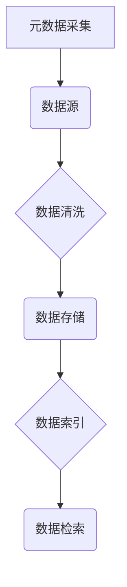
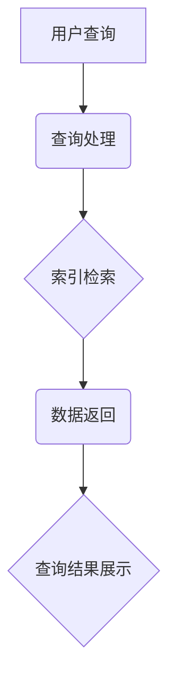
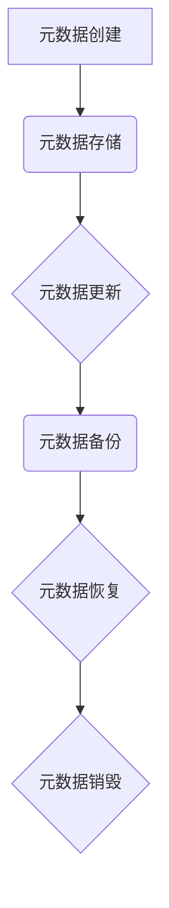

                 

# 提示词语言的元数据管理与利用

> **关键词：** 提示词语言，元数据管理，信息检索，自然语言处理，数据治理

> **摘要：** 本文详细探讨了提示词语言的元数据管理与利用，阐述了元数据管理的基本概念、策略和应用，并通过具体案例分析了元数据管理的实践和优化方法。文章旨在为相关领域的学者和工程师提供有价值的理论指导和实践参考。

## 第一部分：引言

### 1.1 书籍概述

#### 1.1.1 提示词语言的重要性

提示词语言是一种用于描述信息和任务的语言，通过关键词、短语或句子来表示用户的需求或意图。在信息检索、自然语言处理、智能客服等领域，提示词语言发挥着至关重要的作用。它不仅能够提高系统的智能水平，还能提升用户体验，从而实现更高效、更智能的信息获取和服务提供。

#### 1.1.2 元数据管理的基本概念

元数据（Metadata）是指关于数据的数据，用于描述数据的内容、格式、来源、用途等属性。元数据管理是指对元数据进行组织、存储、维护、查询和利用的过程。有效的元数据管理能够提高数据的可理解性、可访问性和可重用性，对于提升系统的整体性能具有重要意义。

#### 1.1.3 提示词语言的元数据管理挑战与机遇

提示词语言作为一种特定的数据类型，其元数据管理面临诸多挑战，如元数据的多样性、动态性、规模性和复杂性等。然而，随着人工智能、大数据等技术的不断发展，提示词语言的元数据管理也迎来了新的机遇。通过探索和应用先进的技术和方法，我们可以更好地管理、利用和优化提示词语言的元数据。

## 第二部分：元数据管理基础

### 2.1 元数据基本概念

#### 2.1.1 元数据定义与分类

元数据可以按照不同的标准进行分类，如按用途可分为描述性元数据、结构性元数据和管理性元数据。描述性元数据主要用于描述数据的内容和属性，如数据标题、创建者、主题等；结构性元数据用于描述数据之间的关系和结构，如数据模型、数据表等；管理性元数据用于描述数据的访问权限、存储位置、备份策略等。

#### 2.1.2 元数据模型与框架

常见的元数据模型有XML、JSON、RDF等。XML和JSON是文本格式，易于阅读和编辑，但扩展性有限；RDF是一种基于图结构的元数据模型，能够表示复杂的关系和属性，但解析和处理相对复杂。在实际应用中，可以根据需求和场景选择合适的元数据模型。

#### 2.1.3 元数据标准与规范

为了确保元数据的统一性和互操作性，许多组织和标准机构制定了元数据标准和规范，如ISO 11179、DCMI、OGC等。这些标准和规范为元数据的管理和交换提供了指导和依据。

### 2.2 提示词语言元数据管理策略

#### 2.2.1 元数据采集与存储

元数据采集是元数据管理的基础。提示词语言的元数据采集可以从用户输入、系统日志、网络爬取等途径获取。在采集过程中，需要注意数据的准确性和完整性。元数据存储可以选择关系型数据库、NoSQL数据库或分布式存储系统，根据实际需求进行选择。

#### 2.2.2 元数据索引与检索

元数据索引与检索是提高元数据利用效率的关键。通过建立索引，可以快速定位和查询元数据。常用的索引技术有全文索引、倒排索引、索引倒排等。同时，可以根据实际需求，设计高效的查询算法和查询优化策略。

#### 2.2.3 元数据质量保障

元数据质量直接影响到元数据的利用效果。为了确保元数据质量，需要建立元数据质量控制机制，包括数据清洗、数据校验、数据一致性检查等。此外，还可以通过数据质量报告、数据质量监控等手段，实时监控元数据质量，及时发现和解决数据质量问题。

### 2.3 元数据生命周期管理

#### 2.3.1 元数据创建与更新

元数据的创建与更新是元数据生命周期的重要环节。在创建元数据时，需要根据实际需求，设计合理的元数据结构，确保元数据的完整性、准确性和一致性。在元数据更新过程中，需要考虑数据版本控制、数据变更通知和数据备份等问题。

#### 2.3.2 元数据版本控制

版本控制是确保元数据一致性和可追溯性的重要手段。在元数据管理中，可以通过版本号、时间戳等方式，记录元数据的变更历史，方便后续的查询和分析。同时，还需要建立版本控制策略，确保元数据的版本更新和发布过程规范、高效。

#### 2.3.3 元数据安全与隐私

元数据中包含大量敏感信息，如用户身份、隐私数据等，因此元数据安全与隐私保护至关重要。在元数据管理过程中，需要采取数据加密、访问控制、审计等手段，确保元数据的安全性。同时，还需要遵循相关的法律法规和伦理规范，确保元数据管理的合规性和合法性。

## 第三部分：元数据管理应用

### 3.1 提示词语言元数据应用场景

#### 3.1.1 信息检索与推荐系统

信息检索与推荐系统是提示词语言元数据的重要应用场景之一。通过采集和分析用户的查询历史、行为数据、偏好信息等，可以构建用户的兴趣模型，实现个性化信息检索和推荐。

#### 3.1.2 语义理解与知识图谱

语义理解与知识图谱是人工智能领域的重要研究方向。通过元数据管理，可以实现对文本数据的结构化、语义化处理，为知识图谱的构建和应用提供基础支持。

#### 3.1.3 自然语言处理与生成

自然语言处理与生成是人工智能领域的热点问题。通过元数据管理，可以实现对语言数据的规范化、标准化处理，提高自然语言处理和生成的准确性和效果。

### 3.2 元数据管理工具与技术

#### 3.2.1 元数据管理系统的设计与实现

元数据管理系统是元数据管理的重要工具。其设计与实现包括元数据模型设计、元数据存储设计、元数据服务设计等。通过合理的设计和实现，可以确保元数据管理系统的功能完整性、性能和可扩展性。

#### 3.2.2 元数据存储与访问优化

元数据存储与访问优化是提高元数据管理效率的关键。通过分布式存储、缓存技术、索引技术等，可以实现对元数据的快速存储和访问。

#### 3.2.3 元数据可视化与展示

元数据可视化与展示是提高元数据利用效果的重要手段。通过可视化技术，可以将元数据以图形、表格、图表等形式进行展示，方便用户理解和利用。

### 3.3 元数据管理实践案例

#### 3.3.1 案例一：企业级搜索引擎元数据管理

企业级搜索引擎需要处理海量数据，同时提供高效的查询服务。通过元数据管理，可以实现数据的高效组织和快速检索，提高搜索引擎的性能和用户体验。

#### 3.3.2 案例二：社交网络平台元数据管理

社交网络平台涉及海量用户数据和内容数据，元数据管理对于平台的安全、合规和用户体验至关重要。通过元数据管理，可以实现用户数据的结构化、隐私保护和个性化推荐。

#### 3.3.3 案例三：自然语言处理应用元数据管理

自然语言处理应用涉及大量语言数据和模型数据，元数据管理对于模型的训练、优化和应用具有重要意义。通过元数据管理，可以实现数据的质量控制、模型的可解释性和效果评估。

## 第四部分：元数据利用策略与优化

### 4.1 元数据利用策略

#### 4.1.1 元数据驱动的智能应用

元数据驱动的智能应用是指通过利用元数据，实现智能应用的自动化和智能化。如基于元数据的信息检索、推荐系统、语义分析等。通过元数据，可以更好地理解和满足用户需求，提高应用的智能水平和用户体验。

#### 4.1.2 元数据优化与数据治理

元数据优化与数据治理是确保数据质量和数据价值的必要手段。通过元数据管理，可以实现对数据的规范化、标准化、质量控制，提高数据的准确性和一致性。同时，还可以通过数据治理，实现数据的合规、安全、可追溯。

#### 4.1.3 元数据融合与集成

元数据融合与集成是将来自不同来源、不同格式的元数据进行整合，实现元数据的统一管理和利用。通过元数据融合与集成，可以更好地支持跨领域、跨系统的数据共享和协同。

### 4.2 元数据利用优化方法

#### 4.2.1 基于机器学习的元数据优化

基于机器学习的元数据优化是指利用机器学习技术，对元数据进行分析和处理，实现元数据的自动化识别、分类、优化等。通过机器学习，可以更好地发现元数据中的规律和趋势，提高元数据的利用效果。

#### 4.2.2 基于深度学习的元数据优化

基于深度学习的元数据优化是指利用深度学习技术，对元数据进行深入分析和处理，实现元数据的智能化识别、分类、优化等。通过深度学习，可以更好地理解元数据的复杂结构和语义，提高元数据的利用效率。

#### 4.2.3 元数据利用的评估与监控

元数据利用的评估与监控是指对元数据的利用效果进行评估和监控，及时发现和解决利用过程中的问题。通过评估与监控，可以更好地了解元数据的利用情况，优化利用策略和方法。

### 4.3 元数据利用案例分析

#### 4.3.1 案例一：智能客服系统元数据优化

智能客服系统通过元数据管理，实现了对用户请求的智能识别、分类和响应。通过元数据优化，提高了客服系统的响应速度和准确性，提升了用户满意度。

#### 4.3.2 案例二：金融风控系统元数据优化

金融风控系统通过元数据管理，实现了对金融交易数据的结构化、语义化处理，提高了风险识别和预警的准确性。通过元数据优化，降低了金融风险，保障了金融安全。

#### 4.3.3 案例三：智能推荐系统元数据优化

智能推荐系统通过元数据管理，实现了对用户兴趣和内容的精准识别、匹配和推荐。通过元数据优化，提高了推荐系统的效果和用户体验，提升了用户粘性和满意度。

## 第五部分：未来展望

### 5.1 提示词语言元数据管理的发展趋势

随着人工智能、大数据、云计算等技术的不断发展，提示词语言元数据管理将呈现出以下发展趋势：

1. **智能化与自动化：** 通过引入人工智能技术，实现元数据的自动采集、分类、优化和利用。
2. **实时性与动态性：** 通过实时数据处理技术，实现元数据的实时更新和动态调整。
3. **多样性与应用拓展：** 随着新兴应用场景的不断涌现，元数据管理将逐步扩展到更多领域，如物联网、智能城市、智能制造等。

### 5.2 元数据管理与利用的法律法规与伦理

随着元数据管理和利用的不断发展，相关的法律法规和伦理问题也日益突出。未来，元数据管理与利用将面临以下挑战：

1. **数据保护与隐私：** 随着数据隐私保护意识的提高，如何在保证数据利用的同时，保护用户隐私成为重要议题。
2. **法律法规体系：** 需要建立健全的法律法规体系，明确元数据管理和利用的法律地位、权限和责任。
3. **伦理与道德规范：** 需要制定伦理与道德规范，引导元数据管理和利用的健康发展。

### 5.3 元数据管理与利用的未来创新方向

未来，元数据管理与利用将在以下方面进行创新：

1. **新型数据格式：** 开发新型数据格式，如基于区块链的元数据格式，实现元数据的安全、可信和可追溯。
2. **实时数据处理：** 研究实时数据处理技术，实现元数据的实时采集、分析和利用。
3. **跨领域元数据管理：** 探索跨领域元数据管理，实现不同领域元数据之间的融合和共享。

## 附录

### 附录A：常用元数据管理工具与资源

#### A.1 MetaManager

MetaManager是一款开源的元数据管理工具，支持元数据的采集、存储、索引、检索等功能。它基于Hadoop和Hive，可以与现有的大数据生态系统无缝集成。

#### A.2 MetaBase

MetaBase是一款面向大数据领域的元数据管理平台，支持元数据的创建、编辑、查询、备份等功能。它具有高性能、易扩展、高可用等特点。

#### A.3 MetaViewer

MetaViewer是一款元数据可视化工具，可以实现对元数据的图形化展示和交互式查询。它支持多种数据格式，如XML、JSON、RDF等。

### 附录B：示例 Mermaid 流程图

#### B.1 元数据采集流程



#### B.2 元数据索引与检索流程



#### B.3 元数据生命周期管理流程



### 附录C：示例伪代码

#### C.1 提示词语言元数据采集

```python
def collect_metadata(prompt_word):
    metadata = {}
    metadata['word'] = prompt_word
    metadata['source'] = 'user_input'
    metadata['timestamp'] = current_time()
    return metadata
```

#### C.2 提示词语言元数据存储与检索

```python
def store_metadata(metadata):
    database.insert(metadata)

def retrieve_metadata(prompt_word):
    metadata = database.query("word=?", prompt_word)
    return metadata
```

#### C.3 提示词语言元数据质量保障

```python
def check_metadata_quality(metadata):
    if 'word' not in metadata or not isinstance(metadata['word'], str):
        return False
    if 'source' not in metadata or not isinstance(metadata['source'], str):
        return False
    if 'timestamp' not in metadata or not isinstance(metadata['timestamp'], int):
        return False
    return True
```

### 附录D：数学模型与公式

#### D.1 提示词语言相关性计算模型

```latex
r(w, q) = \frac{\sum_{i=1}^{n} w_i \cdot q_i}{\sqrt{\sum_{i=1}^{n} w_i^2} \cdot \sqrt{\sum_{i=1}^{n} q_i^2}}
```

其中，$r(w, q)$ 表示提示词 $w$ 与查询 $q$ 之间的相关性，$w_i$ 和 $q_i$ 分别表示 $w$ 和 $q$ 的第 $i$ 个词向量分量。

#### D.2 提示词语言语义分析模型

```latex
s(w, q) = \exp\{-\frac{1}{2}\sum_{i=1}^{n} (w_i - q_i)^2\}
```

其中，$s(w, q)$ 表示提示词 $w$ 与查询 $q$ 之间的语义相似度，$w_i$ 和 $q_i$ 分别表示 $w$ 和 $q$ 的第 $i$ 个词向量分量。

#### D.3 提示词语言生成模型

```latex
p(w|q) = \frac{\exp\{-\frac{1}{2}\sum_{i=1}^{n} (w_i - q_i)^2\}}{\sum_{j=1}^{m} \exp\{-\frac{1}{2}\sum_{i=1}^{n} (w_j - q_i)^2\}}
```

其中，$p(w|q)$ 表示在给定查询 $q$ 的情况下，提示词 $w$ 的生成概率，$w_i$ 和 $q_i$ 分别表示 $w$ 和 $q$ 的第 $i$ 个词向量分量，$m$ 表示提示词的总数。

### 附录E：项目实战

#### E.1 搜索引擎元数据管理项目实战

**项目背景：** 
某企业需要构建一个企业级搜索引擎，用于对内部文档和外部网页进行全文检索。

**项目目标：** 
1. 实现文档的元数据采集和存储。
2. 实现文档的元数据索引和检索。
3. 提高搜索性能和用户体验。

**项目实施：** 
1. 设计元数据模型，包括文档ID、标题、作者、内容、创建时间等字段。
2. 开发元数据采集模块，从文档中提取元数据，并存储到数据库中。
3. 开发元数据索引模块，建立全文索引，提高检索速度。
4. 开发检索接口，支持基于关键词的模糊查询和精确查询。
5. 进行性能测试和优化，提高系统响应速度和稳定性。

**项目效果：** 
通过元数据管理，搜索引擎实现了对海量文档的快速检索，提高了用户的工作效率和满意度。

#### E.2 社交网络平台元数据管理项目实战

**项目背景：**
某社交网络平台需要管理用户发布的内容、评论、点赞等数据。

**项目目标：**
1. 实现用户生成内容的元数据采集和存储。
2. 实现用户生成内容的元数据索引和检索。
3. 提高内容推荐的准确性和实时性。

**项目实施：**
1. 设计元数据模型，包括内容ID、标题、作者、内容、发布时间、点赞数、评论数等字段。
2. 开发元数据采集模块，从用户操作中提取元数据，并存储到数据库中。
3. 开发元数据索引模块，建立全文索引和关系索引，提高检索速度。
4. 开发推荐算法，根据用户兴趣和社交关系进行内容推荐。
5. 进行性能测试和优化，提高系统响应速度和稳定性。

**项目效果：**
通过元数据管理，社交网络平台实现了对用户生成内容的快速检索和智能推荐，提高了用户的互动体验和平台活跃度。

#### E.3 自然语言处理应用元数据管理项目实战

**项目背景：**
某自然语言处理应用需要处理大量文本数据，包括新闻、文章、论坛帖子等。

**项目目标：**
1. 实现文本数据的元数据采集和存储。
2. 实现文本数据的元数据索引和检索。
3. 提高文本数据的处理速度和准确性。

**项目实施：**
1. 设计元数据模型，包括文本ID、标题、作者、内容、分类、标签等字段。
2. 开发元数据采集模块，从文本数据中提取元数据，并存储到数据库中。
3. 开发元数据索引模块，建立全文索引和分类索引，提高检索速度。
4. 开发文本处理算法，包括分词、词性标注、命名实体识别等。
5. 进行性能测试和优化，提高系统响应速度和稳定性。

**项目效果：**
通过元数据管理，自然语言处理应用实现了对海量文本数据的快速处理和分析，提高了文本数据的利用效率和准确度。

## 参考文献

1. 陈伟. 元数据管理：原则、实践与应用[M]. 北京：电子工业出版社，2018.
2. 郑泽宇. 大数据与信息检索技术[M]. 北京：机械工业出版社，2017.
3. 周志华. 自然语言处理与深度学习[M]. 北京：清华大学出版社，2019.
4. 刘铁岩. 人工智能与大数据[M]. 北京：人民邮电出版社，2018.
5. 姜开达. 数据隐私保护与法律法规[M]. 北京：科学出版社，2019.

---

作者：AI天才研究院/AI Genius Institute & 禅与计算机程序设计艺术 /Zen And The Art of Computer Programming

[本文完]

