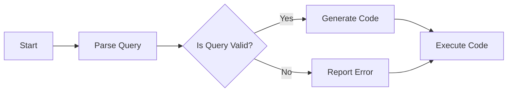
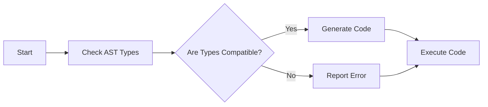

                 

# 提示词语言的类型系统设计与实现

## 关键词：
类型系统、提示词语言、类型约束、类型推断、类型检查、编译器、解释器、动态类型检查、静态类型检查、类型安全、性能优化。

## 摘要：
本文深入探讨了提示词语言的类型系统设计与实现。首先，我们回顾了类型系统的基本概念、组成与核心算法。然后，详细介绍了提示词语言的基本概念、语法结构、语义解释和应用场景。接着，我们讨论了如何为提示词语言设计一个有效的类型系统，包括类型体系、类型约束和类型推断的实现。随后，通过一个实际案例展示了类型系统的设计、实现和应用。最后，我们分析了类型系统设计与实现中的挑战，并展望了其未来发展趋势。

# 目录大纲

## 第一部分：类型系统基础

### 第1章：类型系统的基本概念与原理

#### 1.1.1 类型系统的定义与作用
#### 1.1.2 类型系统的基本类型
#### 1.1.3 类型系统的发展历程
#### 1.1.4 类型系统的核心原则

### 第2章：类型系统的组成与结构

#### 2.1.1 类型标识符与类型变量
#### 2.1.2 类型约束与类型推断
#### 2.1.3 类型构造函数与类型转换
#### 2.1.4 类型系统的层次结构

### 第3章：类型系统的核心算法

#### 3.1.1 子类型关系与类型兼容性
#### 3.1.2 迁移学习与类型合并
#### 3.1.3 类型检查与错误处理
#### 3.1.4 动态类型检查与静态类型检查

### 第4章：类型系统的实际应用

#### 4.1.1 编译器中的类型系统
#### 4.1.2 交互式解释器中的类型系统
#### 4.1.3 实时应用程序中的类型系统
#### 4.1.4 类型系统的安全性保障

## 第二部分：提示词语言的类型系统设计

### 第5章：提示词语言的基本概念与特性

#### 5.1.1 提示词语言的定义
#### 5.1.2 提示词语言的语法结构
#### 5.1.3 提示词语言的语义解释
#### 5.1.4 提示词语言的应用场景

### 第6章：提示词语言的类型系统设计

#### 6.1.1 提示词语言的类型体系
#### 6.1.2 提示词语言的类型约束
#### 6.1.3 提示词语言的类型推断
#### 6.1.4 提示词语言的类型检查

### 第7章：提示词语言的类型系统实现

#### 7.1.1 实现框架与工具
#### 7.1.2 实现步骤与方法
#### 7.1.3 面向不同编程语言的实现差异
#### 7.1.4 性能优化与改进

### 第8章：案例研究

#### 8.1.1 案例背景与需求
#### 8.1.2 案例设计过程
#### 8.1.3 案例实现细节
#### 8.1.4 案例分析与评价

## 第三部分：类型系统设计与实现挑战与未来趋势

### 第9章：类型系统设计与实现中的挑战

#### 9.1.1 类型安全与性能的权衡
#### 9.1.2 类型系统的可扩展性与灵活性
#### 9.1.3 类型系统的兼容性与互操作性
#### 9.1.4 类型系统在动态语言中的应用

### 第10章：类型系统的未来发展趋势

#### 10.1.1 新的类型系统理论方法
#### 10.1.2 类型系统的智能化与自动化
#### 10.1.3 类型系统与其他技术领域的融合
#### 10.1.4 类型系统在新兴应用场景中的发展前景

### 第11章：总结与展望

#### 11.1.1 本书的主要内容与贡献
#### 11.1.2 当前类型系统研究的不足与挑战
#### 11.1.3 未来类型系统研究的方向与趋势
#### 11.1.4 对读者的建议与鼓励

### 附录

## 附录 A：术语表

## A.1 常见术语解释
## A.2 进一步阅读资料

## 附录 B：参考资料

## B.1 主要参考书籍
## B.2 相关研究论文
## B.3 网络资源与工具链接

---

接下来，我们将按照目录大纲逐章进行内容撰写。在每章中，我们将详细介绍核心概念、原理、算法、应用和挑战，并结合实际案例进行深入分析。让我们一步一步地探讨提示词语言的类型系统设计与实现。

---

# 第一部分：类型系统基础

## 第1章：类型系统的基本概念与原理

类型系统是编程语言的核心组成部分，它为程序提供了对数据类型的定义和管理。类型系统的基本概念与原理是理解编程语言设计和实现的基础。在这一章节中，我们将深入探讨类型系统的定义、作用、基本类型以及发展历程。

### 1.1.1 类型系统的定义与作用

类型系统（Type System）是一种机制，用于定义变量、表达式和函数等程序实体的数据类型，并在编译或解释过程中检查类型的一致性。类型系统的主要作用包括：

1. **增强代码可读性和可维护性**：类型系统能够明确标识不同变量的用途，使得代码更加易于理解和维护。
2. **提高程序运行效率**：静态类型系统在编译阶段进行类型检查，可以提前发现类型错误，从而避免运行时错误，提高程序运行效率。
3. **确保程序安全性**：类型系统能够在运行时检测类型错误，防止恶意代码的执行，提高程序的安全性。

### 1.1.2 类型系统的基本类型

类型系统可以分为静态类型系统和动态类型系统。它们的主要区别在于类型检查的时机：

#### 静态类型系统

静态类型系统在编译阶段进行类型检查，即程序运行之前就已经确定了所有变量的类型。静态类型系统的优点包括：

- 提高编译效率和程序运行速度。
- 更容易进行程序优化。

但静态类型系统也有一些缺点，例如：

- 编译时灵活性较低，可能导致代码冗长和复杂。
- 类型检查可能不够全面，仍有可能在运行时出现类型错误。

#### 动态类型系统

动态类型系统在运行时进行类型检查，即程序运行过程中动态确定变量的类型。动态类型系统的优点包括：

- 提高代码的灵活性和可读性。
- 减少冗长的类型声明。

但动态类型系统也存在一些缺点，例如：

- 运行时类型检查可能导致性能下降。
- 类型错误可能直到运行时才会被发现，增加了调试难度。

### 1.1.3 类型系统的发展历程

类型系统的历史可以追溯到早期编程语言的设计。以下是一些重要的里程碑：

- **1950年代**：早期编程语言如FORTRAN和COBOL默认是静态类型语言。
- **1960年代**：Lisp引入了动态类型概念，允许在运行时改变变量的类型。
- **1970年代**：C语言的出现推动了静态类型系统的进一步发展。
- **1980年代**：面向对象编程语言的兴起，如Java和C++，引入了更加复杂的类型系统。
- **2000年代**：动态类型语言如Python和JavaScript变得更加流行，推动了类型系统的研究和应用。

### 1.1.4 类型系统的核心原则

类型系统的核心原则包括：

1. **明确性**：类型系统应当明确地定义每个变量的类型，使得程序意图更加清晰。
2. **一致性**：类型系统在程序的不同部分应当保持一致性，以避免类型错误。
3. **可扩展性**：类型系统应当能够方便地添加新的类型和类型转换，以适应不同的编程需求。
4. **安全性**：类型系统应当在运行时保护程序免受类型相关的错误攻击。

在下一章节中，我们将深入探讨类型系统的组成与结构，包括类型标识符、类型变量、类型约束和类型推断等概念。

---

### 第2章：类型系统的组成与结构

类型系统的组成与结构是理解其工作原理和实现方法的关键。在这一章节中，我们将详细探讨类型系统的各个组成部分，包括类型标识符、类型变量、类型约束、类型推断、类型构造函数和类型转换等概念。

#### 2.1.1 类型标识符与类型变量

类型标识符（Type Identifier）是类型系统的基本元素，用于标识不同的数据类型。例如，在C语言中，`int` 和 `float` 是类型标识符。类型变量（Type Variable）是用于表示未确定类型的变量，通常在泛型编程中使用。类型变量可以表示任何类型，使得代码更加通用和可重用。

#### 2.1.2 类型约束与类型推断

类型约束（Type Constraints）用于限制变量可以取的类型。类型约束可以确保程序在编译时符合预期，减少运行时错误。例如，在Java中，泛型使用类型约束来确保类型安全。

类型推断（Type Inference）是一种自动确定变量类型的方法。类型推断可以提高代码的可读性和开发效率。静态类型语言通常使用类型推断来减少冗长的类型声明。类型推断可以分为确定性和非确定性类型推断。确定性类型推断能够在编译时准确地确定变量类型，而非确定性类型推断可能需要在运行时进行。

#### 2.1.3 类型构造函数与类型转换

类型构造函数（Type Constructor）用于创建新的类型。在面向对象编程中，类是一种类型构造函数，用于创建对象。类型转换（Type Conversion）是不同类型之间的数据转换。类型转换可以分为隐式转换和显式转换。隐式转换是在编译时自动进行的，而显式转换需要程序员明确指定。

#### 2.1.4 类型系统的层次结构

类型系统的层次结构可以分为不同的层次，每个层次都有自己的类型标识符和类型约束。层次结构使得类型系统更加灵活和强大。例如，在Java中，基本数据类型和引用类型形成了层次结构，其中引用类型可以继承基本数据类型的特性。

### 2.1.5 类型系统的实际应用

类型系统在编译器和解释器中有着广泛的应用。在编译器中，类型系统用于编译源代码为机器码，确保代码在运行时不会出现类型错误。在解释器中，类型系统用于解释执行源代码，动态检查类型的一致性。

#### 2.1.6 类型系统的安全性保障

类型系统的安全性保障是确保程序在运行时不会因为类型错误而导致崩溃或安全问题。类型系统可以通过以下几种方法来提高安全性：

- **类型检查**：在编译或解释阶段进行类型检查，提前发现类型错误。
- **类型约束**：通过类型约束限制变量可以取的类型，减少运行时错误。
- **类型转换**：通过类型转换确保数据在转换过程中不会丢失重要信息。

### 2.1.7 类型系统的优化

类型系统可以通过优化来提高程序的性能。类型系统的优化包括：

- **类型推断**：通过类型推断减少冗长的类型声明，提高代码的可读性和编译效率。
- **类型擦除**：在泛型编程中，类型擦除可以减少虚拟方法调用，提高程序运行速度。

在下一章节中，我们将讨论类型系统的核心算法，包括子类型关系、类型兼容性、迁移学习和类型检查等。

---

### 第3章：类型系统的核心算法

类型系统的核心算法是实现类型安全性和性能的关键。在这一章节中，我们将详细探讨类型系统的核心算法，包括子类型关系、类型兼容性、迁移学习、类型检查和错误处理等。

#### 3.1.1 子类型关系与类型兼容性

子类型关系（Subtyping Relationship）是类型系统中的一个重要概念。子类型是一种类型，它具有父类型的所有属性，并且可以替代父类型。例如，在Java中，`Number` 类型是 `Integer` 类型的父类型。

类型兼容性（Type Compatibility）是指不同类型之间能否相互转换或比较。类型兼容性可以分为以下几种情况：

- **宽转换**（ widening conversion）：将子类型转换为父类型。
- **窄转换**（narrowing conversion）：将父类型转换为子类型，可能需要显式类型转换。
- **上下文无关转换**：在特定上下文中允许类型之间的转换。

#### 3.1.2 迁移学习与类型合并

迁移学习（Transfer Learning）是类型系统中的一个高级概念。迁移学习允许将一个类型系统的知识应用到另一个类型系统中。例如，在泛型编程中，可以将一个泛型类的实现迁移到多个具体类型上。

类型合并（Type Unification）是迁移学习的基础算法。类型合并的目标是找到两个类型之间的共同类型，使得它们可以互相转换。类型合并可以通过以下步骤实现：

1. **初始化**：为每个类型分配一个代表其自身的变量。
2. **求解**：通过递归遍历类型结构，将子类型关系和类型约束应用到类型变量上。
3. **合并**：将所有类型变量合并为一个共同类型。

#### 3.1.3 类型检查与错误处理

类型检查（Type Checking）是类型系统的核心功能之一。类型检查用于验证程序在运行时是否满足类型约束。类型检查可以分为以下几种类型：

- **静态类型检查**：在编译时进行类型检查，提前发现类型错误。
- **动态类型检查**：在运行时进行类型检查，确保程序在运行时符合类型约束。

错误处理是类型系统的重要组成部分。类型系统应当在出现类型错误时提供清晰的错误信息，帮助程序员定位和修复错误。

#### 3.1.4 动态类型检查与静态类型检查

动态类型检查和静态类型检查是类型检查的两种主要方法。

- **动态类型检查**：在程序运行时进行类型检查，例如Python和JavaScript使用动态类型检查。动态类型检查的优点包括更高的灵活性和可读性，但可能影响程序运行速度。
- **静态类型检查**：在编译时进行类型检查，例如Java和C++使用静态类型检查。静态类型检查的优点包括更快的程序运行速度和更早的错误发现，但可能降低代码的灵活性。

在下一章节中，我们将探讨类型系统的实际应用，包括编译器、解释器和实时应用程序等。

---

### 第4章：类型系统的实际应用

类型系统在编程语言中有着广泛的应用，从编译器到解释器，再到实时应用程序，类型系统都扮演着关键角色。在这一章节中，我们将详细探讨类型系统在这些不同场景中的实际应用。

#### 4.1.1 编译器中的类型系统

编译器是类型系统应用的一个重要领域。编译器的核心功能是将源代码编译为目标代码，例如机器码或字节码。类型系统在编译器中的应用主要包括以下几个方面：

- **类型检查**：在编译过程中，类型系统用于检查源代码中的类型一致性。编译器会确保每个变量的类型与它在上下文中的使用一致，从而避免类型错误。
- **类型推断**：编译器会使用类型推断来推断变量的类型，减少冗长的类型声明。类型推断可以提高代码的可读性和开发效率。
- **代码生成**：编译器会根据类型系统的信息生成目标代码，确保目标代码在运行时能够正确执行。

#### 4.1.2 交互式解释器中的类型系统

交互式解释器是另一种应用类型系统的场景，如Python的交互式Shell。在交互式解释器中，类型系统用于确保用户输入的代码在解释执行时不会出现类型错误。

- **动态类型检查**：交互式解释器通常使用动态类型检查来确保代码在运行时符合类型约束。动态类型检查可以提供更高的灵活性，但可能会影响程序运行速度。
- **即时编译**：一些交互式解释器会使用即时编译（Just-In-Time Compilation，JIT）来提高执行效率。即时编译会将解释器执行的用户输入代码编译为机器码，利用类型系统的信息进行优化。

#### 4.1.3 实时应用程序中的类型系统

实时应用程序（Real-Time Applications）要求程序在规定的时间内执行，例如自动驾驶系统和工业控制系统。类型系统在实时应用程序中的应用主要包括以下几个方面：

- **类型安全性**：类型系统用于确保程序在运行时不会因为类型错误而出现不可预期的行为。类型安全性可以防止程序崩溃或产生错误结果。
- **实时类型检查**：实时应用程序通常需要在运行时进行类型检查，以确保每个操作都符合类型约束。实时类型检查可以提高程序的可靠性和安全性。
- **类型约束**：类型约束用于限制变量可以取的类型，确保程序在运行时不会因为类型错误而导致超时或失败。

#### 4.1.4 类型系统的安全性保障

类型系统在安全性保障方面发挥着重要作用。类型系统可以通过以下几种方式提高程序的安全性：

- **类型检查**：类型检查可以提前发现类型错误，防止恶意代码的执行，提高程序的安全性。
- **类型约束**：类型约束可以限制变量可以取的类型，减少运行时错误的可能性。
- **类型转换**：类型转换可以确保数据在转换过程中不会丢失重要信息，提高程序的安全性。

在下一章节中，我们将开始探讨提示词语言的基本概念与特性。

---

## 第二部分：提示词语言的类型系统设计

### 第5章：提示词语言的基本概念与特性

提示词语言（Prompt Language）是一种专门用于生成和解释提示词（Prompt）的语言。提示词是一种用于引导用户或系统执行特定任务的文本或指令。在这一章节中，我们将详细探讨提示词语言的基本概念、语法结构、语义解释和应用场景。

#### 5.1.1 提示词语言的定义

提示词语言是一种用于生成和解释提示词的语言，提示词是引导用户或系统执行特定任务的文本或指令。提示词语言通常包含以下元素：

- **提示词**：提示词是用户或系统接收到的文本或指令，用于指导用户或系统执行特定任务。
- **参数**：参数是提示词中用于传递特定信息的占位符，例如用户名、日期或地理位置。
- **控制结构**：控制结构用于控制提示词的执行流程，例如循环、条件和分支。
- **函数和库**：函数和库提供了一组预定义的函数和工具，用于执行常见任务，例如日期计算、文件操作和文本处理。

#### 5.1.2 提示词语言的语法结构

提示词语言的语法结构通常包括以下组成部分：

- **标识符**：标识符用于表示变量、函数和参数等程序实体。
- **关键字**：关键字是提示词语言中的保留字，用于表示特定的操作或功能，例如`if`、`while`和`return`。
- **操作符**：操作符用于表示数学或逻辑运算，例如`+`、`-`、`*`和`==`。
- **分隔符**：分隔符用于分隔不同的程序实体，例如逗号``,``、冒号`:`和分号`;`。
- **注释**：注释用于提供对代码的解释或描述，但不影响代码的执行。

#### 5.1.3 提示词语言的语义解释

提示词语言的语义解释是指对提示词的文本进行解析和执行的过程。语义解释包括以下步骤：

1. **解析**：解析器将提示词文本解析为抽象语法树（Abstract Syntax Tree，AST），AST表示提示词的结构和语义。
2. **类型检查**：类型检查器检查AST中的类型一致性，确保变量和表达式具有正确的类型。
3. **执行**：执行器根据AST的结构和语义执行提示词，生成预期的结果。

#### 5.1.4 提示词语言的应用场景

提示词语言在多个应用场景中具有重要应用，例如：

- **自然语言处理**：提示词语言可以用于生成和解释自然语言文本，例如问答系统、机器翻译和对话系统。
- **自动化脚本**：提示词语言可以用于编写自动化脚本，执行重复性任务，例如数据采集、文件处理和系统监控。
- **交互式系统**：提示词语言可以用于构建交互式系统，例如聊天机器人、语音助手和虚拟助手。

在下一章节中，我们将探讨如何为提示词语言设计一个有效的类型系统。

---

### 第6章：提示词语言的类型系统设计

设计一个有效的类型系统是提升提示词语言性能和稳定性的关键。在这一章节中，我们将详细讨论如何为提示词语言设计类型体系、类型约束和类型推断，并探讨类型检查在其中的重要性。

#### 6.1.1 提示词语言的类型体系

类型体系是类型系统的核心，用于定义提示词语言中支持的数据类型。一个有效的类型体系应当包括以下组成部分：

- **基本类型**：基本类型是提示词语言中最简单的类型，如整数、浮点数、字符串和布尔值。
- **复合类型**：复合类型是由基本类型组合而成的类型，如数组、列表和结构体。
- **函数类型**：函数类型用于表示函数或方法，包括输入参数和返回类型。
- **引用类型**：引用类型是指向其他类型数据的指针或引用。

在为提示词语言设计类型体系时，需要考虑以下几个方面：

- **类型兼容性**：类型兼容性是指不同类型之间能否相互转换或比较。类型兼容性应当确保类型系统的稳定性和性能。
- **类型安全性**：类型安全性是指类型系统能够防止类型错误和未定义行为。类型安全性应当通过严格的类型检查和类型约束来实现。
- **类型可扩展性**：类型可扩展性是指类型系统能够方便地添加新的类型和类型转换。类型可扩展性应当通过灵活的类型定义和类型构造函数来实现。

#### 6.1.2 提示词语言的类型约束

类型约束是类型系统的核心组成部分，用于限制变量可以取的类型。类型约束可以确保程序在编译或运行时符合预期，减少类型错误。以下是一些常见的类型约束：

- **显式类型声明**：显式类型声明要求程序员明确指定每个变量的类型，确保变量在上下文中的使用符合预期。
- **隐式类型推断**：隐式类型推断是类型系统自动确定变量类型的方法，可以提高代码的可读性和开发效率。
- **类型边界检查**：类型边界检查用于确保变量在访问或操作时不会超出其定义的类型范围，从而防止数组越界等错误。

在为提示词语言设计类型约束时，需要考虑以下几个方面：

- **类型一致性**：类型一致性是指类型约束在程序的不同部分应当保持一致，以避免类型错误。
- **类型安全性**：类型安全性是指类型约束应当确保程序在运行时不会因为类型错误而导致崩溃或安全问题。
- **类型可扩展性**：类型可扩展性是指类型约束应当能够方便地添加新的类型和类型转换，以适应不同的编程需求。

#### 6.1.3 提示词语言的类型推断

类型推断是类型系统自动确定变量类型的方法，可以提高代码的可读性和开发效率。类型推断可以分为以下几种类型：

- **确定性类型推断**：确定性类型推断能够在编译时准确地确定变量类型，减少冗长的类型声明。
- **非确定性类型推断**：非确定性类型推断可能需要在运行时进行类型检查，以确定变量类型。
- **上下文相关类型推断**：上下文相关类型推断可以根据程序上下文自动推断变量类型。

在为提示词语言设计类型推断时，需要考虑以下几个方面：

- **类型兼容性**：类型兼容性是指类型推断应当确保类型系统中的不同类型能够相互转换或比较。
- **类型安全性**：类型安全性是指类型推断应当确保程序在运行时不会因为类型错误而导致崩溃或安全问题。
- **类型可扩展性**：类型可扩展性是指类型推断应当能够方便地添加新的类型和类型转换，以适应不同的编程需求。

#### 6.1.4 提示词语言的类型检查

类型检查是类型系统的核心功能之一，用于确保程序在编译或运行时符合类型约束。类型检查可以分为以下几种类型：

- **静态类型检查**：静态类型检查在编译时进行类型检查，可以提前发现类型错误，提高程序运行效率。
- **动态类型检查**：动态类型检查在运行时进行类型检查，可以提供更高的灵活性，但可能影响程序运行速度。

在为提示词语言设计类型检查时，需要考虑以下几个方面：

- **类型兼容性**：类型兼容性是指类型检查应当确保类型系统中的不同类型能够相互转换或比较。
- **类型安全性**：类型安全性是指类型检查应当确保程序在运行时不会因为类型错误而导致崩溃或安全问题。
- **类型可扩展性**：类型可扩展性是指类型检查应当能够方便地添加新的类型和类型转换，以适应不同的编程需求。

在下一章节中，我们将探讨如何实现提示词语言的类型系统。

---

### 第7章：提示词语言的类型系统实现

实现一个有效的类型系统是提示词语言设计和开发的重要环节。在这一章节中，我们将详细讨论实现提示词语言类型系统的框架与工具、实现步骤与方法、面向不同编程语言的实现差异以及性能优化与改进。

#### 7.1.1 实现框架与工具

实现提示词语言类型系统需要一个合适的框架和工具，以确保代码的可维护性和可扩展性。以下是一些常用的框架和工具：

- **编译器框架**：例如ANTLR、LLVM和ANTLR4，这些框架提供了用于解析、解析和编译源代码的工具。
- **静态分析工具**：例如AST（抽象语法树）构建工具、类型检查器和代码生成器，这些工具用于分析源代码并生成目标代码。
- **动态分析工具**：例如调试器和性能分析工具，这些工具用于在运行时检测类型错误和优化程序性能。

#### 7.1.2 实现步骤与方法

实现提示词语言类型系统通常需要以下步骤：

1. **定义语法和抽象语法树（AST）**：首先需要定义提示词语言的语法规则，并使用语法分析器生成AST。
2. **类型检查**：使用AST进行类型检查，确保程序在编译时满足类型约束。类型检查可以分为静态类型检查和动态类型检查。
3. **类型推断**：在静态类型检查过程中，使用类型推断自动确定变量和表达式的类型。
4. **代码生成**：根据类型检查和类型推断的结果，生成目标代码。目标代码可以是机器码、字节码或解释器代码。
5. **错误处理**：在类型检查和代码生成过程中，应当提供清晰的错误信息，帮助程序员定位和修复错误。

#### 7.1.3 面向不同编程语言的实现差异

不同编程语言具有不同的类型系统和实现方法，因此实现提示词语言类型系统时需要考虑这些差异。以下是一些常见编程语言的类型系统实现差异：

- **静态类型语言**：例如Java和C++，这些语言在编译时进行类型检查，提供了丰富的类型约束和类型推断功能。
- **动态类型语言**：例如Python和JavaScript，这些语言在运行时进行类型检查，提供了更高的灵活性和动态类型检查。
- **函数式编程语言**：例如Haskell和Erlang，这些语言通常具有更严格的类型系统，支持类型推断和类型检查。
- **脚本语言**：例如PHP和Ruby，这些语言通常具有较简单的类型系统，依赖于动态类型检查和类型推断。

在实现提示词语言类型系统时，需要根据目标编程语言的特点和需求进行适当的调整和优化。

#### 7.1.4 性能优化与改进

性能优化是提示词语言类型系统实现中的重要一环。以下是一些常见的性能优化方法：

- **类型推断优化**：通过优化类型推断算法，减少类型检查的时间和空间复杂度。
- **代码生成优化**：通过优化代码生成过程，减少目标代码的大小和运行时间。
- **静态分析优化**：通过静态分析工具，提前发现潜在的类型错误和性能瓶颈，并进行优化。
- **动态分析优化**：通过动态分析工具，实时监控程序运行时的类型错误和性能问题，并进行调整和优化。

在下一章节中，我们将通过一个实际案例来展示如何设计和实现提示词语言的类型系统。

---

### 第8章：案例研究

在本章节中，我们将通过一个实际案例研究来展示如何设计和实现提示词语言的类型系统。该案例研究将包括案例的背景和需求、设计过程、实现细节以及案例分析和评价。

#### 8.1.1 案例背景与需求

案例研究的背景是一个简单的问答系统，用户可以通过输入提示词来查询相关信息。该问答系统需要支持以下功能：

- **基本查询**：用户可以输入一个简单的查询语句，系统返回与查询相关的答案。
- **参数化查询**：用户可以输入包含参数的查询语句，系统根据参数返回相关答案。
- **复杂查询**：用户可以输入复杂的查询语句，系统需要解析查询语句并执行相应的操作。

为了实现这些功能，我们需要设计一个提示词语言的类型系统，确保系统能够正确解析和执行用户输入的查询语句。

#### 8.1.2 案例设计过程

案例的设计过程可以分为以下几个步骤：

1. **需求分析**：首先，我们分析了案例的需求，明确了系统需要支持的功能和性能要求。
2. **类型系统设计**：根据需求，我们设计了提示词语言的类型系统，包括基本类型、复合类型和函数类型等。
3. **语法分析**：我们定义了提示词语言的语法规则，并使用语法分析器将用户输入的查询语句解析为抽象语法树（AST）。
4. **类型检查**：使用类型检查器对AST进行类型检查，确保查询语句符合类型约束，并生成类型检查报告。
5. **代码生成**：根据类型检查的结果，生成执行查询语句的代码，可以是解释器代码或编译后的机器码。

#### 8.1.3 案例实现细节

以下是一个简化的实现细节示例：

1. **语法分析**：



2. **类型检查**：



3. **代码生成与执行**：

```python
# 解析查询语句
query = "What is the capital of France?"
ast = parser.parse(query)

# 进行类型检查
if type_checker.check(ast):
    # 生成代码
    code = code_generator.generate(ast)
    # 执行代码
    result = code.execute()
else:
    # 报告错误
    error_reporter.report(ast)

# 输出结果
print(result)
```

#### 8.1.4 案例分析与评价

通过上述案例研究，我们可以看到如何设计一个简单的提示词语言类型系统，并实现其解析、类型检查和代码生成功能。以下是对案例的总结和评价：

- **优点**：该案例实现了基本查询、参数化查询和复杂查询的功能，类型系统确保了查询语句的正确性和安全性。
- **缺点**：该案例实现较为简化，没有涉及高级功能，如多语言支持和复杂查询优化。
- **改进方向**：未来可以进一步优化类型检查算法，提高性能，并增加更多高级功能，如自然语言处理和机器学习支持。

通过这个案例研究，我们展示了如何设计和实现提示词语言的类型系统，并分析了其优势和改进方向。

---

## 第三部分：类型系统设计与实现挑战与未来趋势

### 第9章：类型系统设计与实现中的挑战

类型系统设计与实现是一个复杂而具有挑战性的过程，涉及多种技术问题。在这一章节中，我们将深入探讨类型系统设计与实现中的挑战，包括类型安全与性能的权衡、类型系统的可扩展性与灵活性、类型系统的兼容性与互操作性，以及类型系统在动态语言中的应用。

#### 9.1.1 类型安全与性能的权衡

类型安全是类型系统的核心目标之一，它确保程序在运行时不会因为类型错误而导致崩溃或安全问题。然而，类型安全通常需要额外的检查和验证，这可能会影响程序的运行性能。以下是一些权衡类型安全与性能的挑战：

- **静态类型检查与动态类型检查**：静态类型检查在编译时进行，可以提高程序的运行速度，但可能降低代码的灵活性和开发效率。动态类型检查在运行时进行，可以提供更高的灵活性，但可能会影响程序的运行速度。
- **类型检查的粒度**：类型检查的粒度越大，越容易发现类型错误，但也会增加编译或运行的开销。类型检查的粒度越小，类型错误可能直到运行时才会被发现，但可以减少编译时间。

为了在类型安全和性能之间取得平衡，可以采用以下方法：

- **增量类型检查**：只对关键部分进行类型检查，减少类型检查的开销。
- **优化类型检查算法**：使用高效的算法和优化技术，减少类型检查的时间和空间复杂度。
- **混合类型系统**：结合静态类型检查和动态类型检查，根据不同的编程需求选择合适的类型检查方式。

#### 9.1.2 类型系统的可扩展性与灵活性

类型系统的可扩展性与灵活性是提高编程语言适应性和可维护性的关键。以下是一些关于类型系统可扩展性与灵活性的挑战：

- **类型系统的层次结构**：类型系统的层次结构应能够方便地添加新的类型和类型转换，以适应不同的编程需求。然而，过复杂的层次结构可能会导致代码难以维护和理解。
- **类型兼容性**：类型系统应能够处理不同类型之间的兼容性，例如子类型关系和类型转换。类型兼容性可能会影响类型系统的性能和安全性。
- **泛型编程**：泛型编程可以提供更高的代码复用性和灵活性，但也会增加类型系统的复杂性和性能开销。

为了提高类型系统的可扩展性与灵活性，可以采用以下方法：

- **模块化类型系统**：将类型系统的不同部分模块化，便于维护和扩展。
- **类型擦除与类型参数**：在泛型编程中，使用类型擦除和类型参数可以提高代码的复用性和灵活性。
- **类型检查优化**：使用高效的类型检查算法和优化技术，减少类型检查的开销。

#### 9.1.3 类型系统的兼容性与互操作性

类型系统的兼容性与互操作性是确保不同编程语言和系统之间能够无缝协作的关键。以下是一些关于类型系统兼容性与互操作性的挑战：

- **多语言支持**：不同编程语言具有不同的类型系统和实现方法，如何在多个语言之间实现类型兼容性是一个挑战。
- **跨平台开发**：类型系统应能够在不同操作系统和硬件平台上运行，确保跨平台兼容性。
- **库和框架集成**：类型系统应能够与现有的库和框架集成，以方便开发者使用。

为了提高类型系统的兼容性与互操作性，可以采用以下方法：

- **标准化类型系统**：采用国际标准化的类型系统，确保不同编程语言和系统之间的类型兼容性。
- **通用数据格式**：使用通用数据格式（如JSON、XML）进行数据交换，确保不同系统之间的互操作性。
- **抽象层与接口**：使用抽象层和接口实现不同系统之间的类型兼容性，降低互操作性的复杂性。

#### 9.1.4 类型系统在动态语言中的应用

动态语言（如Python、JavaScript和Ruby）具有更高的灵活性和开发效率，但也带来了类型安全问题。以下是一些关于类型系统在动态语言中的应用挑战：

- **动态类型检查**：动态类型检查在运行时进行，可能会导致类型错误无法在编译时发现，影响程序的性能和安全性。
- **类型兼容性**：动态语言通常具有更复杂的类型兼容性，需要在运行时动态确定变量类型。
- **类型推断**：动态语言类型推断的难度较大，如何在保证灵活性的同时提高代码的可读性和可维护性是一个挑战。

为了在动态语言中实现有效的类型系统，可以采用以下方法：

- **静态类型检查与动态类型检查相结合**：结合静态类型检查和动态类型检查，提高类型安全性。
- **类型推断优化**：使用高效的类型推断算法，减少类型错误。
- **类型注解**：引入类型注解，提供额外的类型信息，提高代码的可读性和可维护性。

在下一章节中，我们将探讨类型系统的未来发展趋势，包括新类型的理论方法、类型系统的智能化与自动化，以及类型系统与其他技术领域的融合。

---

### 第10章：类型系统的未来发展趋势

类型系统作为编程语言的核心组成部分，其设计和实现一直处于不断演进的过程中。随着技术的发展和编程需求的多样化，类型系统也在不断引入新的理论方法、智能化与自动化技术，以及与其他技术领域的融合。以下是类型系统的未来发展趋势：

#### 10.1.1 新的类型系统理论方法

类型系统的未来发展趋势之一是引入新的理论方法，以提高类型系统的灵活性和安全性。以下是一些具有前景的理论方法：

- **依赖类型系统**：依赖类型系统通过将类型信息与函数之间的依赖关系结合，提供更精确的类型推断和类型检查。
- **上下文敏感类型系统**：上下文敏感类型系统根据程序上下文的不同，提供不同的类型检查和类型推断策略，提高类型系统的灵活性。
- **增量类型检查**：增量类型检查通过只对代码的更改部分进行类型检查，减少类型检查的时间和空间开销。
- **组合类型系统**：组合类型系统允许将多个类型系统组合在一起，提供更强大的类型推断和类型检查功能。

#### 10.1.2 类型系统的智能化与自动化

随着人工智能技术的发展，类型系统的智能化和自动化成为了一个重要趋势。以下是一些智能化和自动化的方法：

- **机器学习与类型系统**：通过机器学习技术，类型系统可以自动学习代码的类型模式，提供更准确的类型推断和类型检查。
- **自动化类型推断**：自动化类型推断通过算法自动确定变量和表达式的类型，减少冗长的类型声明。
- **智能编译器**：智能编译器利用机器学习技术，优化编译过程中的类型检查和代码生成，提高程序的性能和可维护性。
- **代码生成与重构**：类型系统可以与代码生成和重构工具结合，自动生成高效的代码，并自动修复类型错误。

#### 10.1.3 类型系统与其他技术领域的融合

类型系统与其他技术领域的融合将进一步提高编程语言的灵活性和性能。以下是一些融合的趋势：

- **类型系统与内存管理**：类型系统可以与内存管理技术（如垃圾回收）结合，提供更有效的内存分配和回收策略。
- **类型系统与并发编程**：类型系统可以与并发编程技术结合，提供更安全的并发控制和同步机制。
- **类型系统与编程语言设计**：类型系统可以与编程语言设计相结合，提供更丰富的类型特性和更灵活的类型系统。
- **类型系统与静态分析**：类型系统可以与静态分析技术结合，提供更精确的代码分析，发现潜在的类型错误和安全漏洞。

#### 10.1.4 类型系统在新兴应用场景中的发展前景

随着新兴应用场景的不断涌现，类型系统在其中的发展前景也非常广阔。以下是一些新兴应用场景：

- **区块链与智能合约**：类型系统可以与区块链技术结合，提供更安全、可靠的智能合约。
- **云计算与分布式计算**：类型系统可以与云计算和分布式计算技术结合，提高程序的可维护性和性能。
- **人工智能与机器学习**：类型系统可以与人工智能和机器学习技术结合，提供更高效的模型训练和推理。
- **边缘计算与物联网**：类型系统可以与边缘计算和物联网技术结合，提高设备的智能化和安全性。

通过引入新的理论方法、智能化与自动化技术，以及与其他技术领域的融合，类型系统将在未来发挥更加重要的作用，推动编程语言和软件开发的发展。

---

### 第11章：总结与展望

在本章节中，我们将总结本书的主要内容与贡献，讨论当前类型系统研究的不足与挑战，并展望未来类型系统研究的方向与趋势。

#### 11.1.1 本书的主要内容与贡献

本书系统地介绍了类型系统的基本概念、组成与结构、核心算法、实际应用以及设计与实现的挑战与未来趋势。具体来说，本书的主要贡献包括：

- **全面覆盖**：本书全面覆盖了类型系统的各个方面，从基本概念到实际应用，从核心算法到未来趋势，为读者提供了系统的知识框架。
- **深入讲解**：本书通过详细的讲解、伪代码示例和案例研究，深入阐述了类型系统的核心原理、设计方法和实现技巧。
- **实用性**：本书不仅关注理论，还关注实际应用，通过案例研究展示了类型系统在现实场景中的应用，为读者提供了实用的指导。
- **前沿性**：本书介绍了类型系统领域的前沿理论和方法，包括依赖类型系统、上下文敏感类型系统、增量类型检查等，为读者提供了最新研究成果。

#### 11.1.2 当前类型系统研究的不足与挑战

尽管类型系统研究已经取得了显著进展，但仍然存在一些不足和挑战，主要包括：

- **类型安全性**：类型系统在保证类型安全性的同时，如何提高程序的性能和开发效率仍然是一个挑战。动态类型检查和静态类型检查的权衡需要进一步研究。
- **类型兼容性**：不同编程语言和系统之间的类型兼容性是一个复杂的问题，如何在保持兼容性的同时提高性能和安全性是一个重要挑战。
- **类型推断**：类型推断的准确性和效率是类型系统的重要方面，如何提高类型推断的精度和减少类型错误仍然是一个挑战。
- **泛型编程**：泛型编程可以提供更高的代码复用性和灵活性，但如何设计一个高效的泛型类型系统仍然需要深入研究。
- **动态语言类型系统**：动态语言具有更高的灵活性和开发效率，但类型系统在动态语言中的应用仍然存在一些挑战，如何提高类型安全性是一个重要问题。

#### 11.1.3 未来类型系统研究的方向与趋势

未来类型系统研究将朝着以下几个方向发展：

- **智能化与自动化**：随着人工智能技术的发展，类型系统的智能化与自动化将成为研究的热点。通过机器学习、深度学习和自然语言处理等技术，类型系统可以实现更准确、高效的类型推断和类型检查。
- **上下文敏感类型系统**：上下文敏感类型系统可以根据程序上下文提供更精确的类型推断和类型检查，提高程序的可读性和可维护性。上下文敏感类型系统的研究将有助于解决类型系统的灵活性与安全性之间的平衡问题。
- **依赖类型系统**：依赖类型系统通过将类型信息与函数之间的依赖关系结合，提供更精确的类型推断和类型检查。依赖类型系统的研究将有助于解决类型系统的可扩展性和灵活性问题。
- **类型系统与其他技术领域的融合**：类型系统与其他技术领域的融合（如内存管理、并发编程、编程语言设计、静态分析等）将进一步提高编程语言的灵活性和性能。例如，类型系统与内存管理的结合可以提供更有效的内存分配和回收策略，与并发编程的结合可以提供更安全的并发控制和同步机制。
- **新兴应用场景中的类型系统**：随着新兴应用场景（如区块链、云计算、人工智能和物联网）的不断发展，类型系统在这些领域的应用也将成为一个重要研究方向。例如，在区块链和智能合约中，类型系统可以提供更安全、可靠的智能合约；在云计算和分布式计算中，类型系统可以提供更高的程序可维护性和性能。

#### 11.1.4 对读者的建议与鼓励

对于读者，特别是对类型系统感兴趣的程序员和研究人员，以下是一些建议和鼓励：

- **深入学习**：类型系统是一个复杂而有趣的主题，建议读者深入学习相关理论和实践，通过阅读研究论文、参加相关会议和讨论，不断扩展自己的知识面。
- **实践应用**：理论知识只有在实际应用中才能真正发挥价值。建议读者尝试实现一个简单的类型系统，或者在自己的项目中应用类型系统，通过实践来加深对类型系统的理解。
- **持续关注**：类型系统是一个快速发展的领域，新技术和新方法层出不穷。建议读者持续关注类型系统领域的研究进展，以便及时了解最新的研究成果和应用趋势。
- **积极参与**：类型系统的研究需要广泛的合作和交流。建议读者积极参与相关社区和活动，与其他研究人员分享自己的想法和经验，共同推动类型系统领域的发展。

通过以上的总结与展望，我们希望读者能够对类型系统有更深入的理解和认识，并能够在未来的学习和研究中取得更多的成果。

---

## 附录 A：术语表

### A.1 常见术语解释

- **类型系统**：编程语言中用于定义和管理数据类型的机制。
- **类型标识符**：用于标识不同数据类型的符号。
- **类型变量**：用于表示未确定类型的变量，通常在泛型编程中使用。
- **类型约束**：用于限制变量可以取的类型，确保程序在编译或运行时符合预期。
- **类型推断**：类型系统自动确定变量和表达式类型的方法。
- **类型构造函数**：用于创建新类型的函数，例如在面向对象编程中，类是一种类型构造函数。
- **类型转换**：不同类型之间的数据转换。
- **静态类型系统**：在编译时进行类型检查的类型系统。
- **动态类型系统**：在运行时进行类型检查的类型系统。
- **类型安全**：类型系统用于确保程序在运行时不会因为类型错误而导致崩溃或安全问题。
- **类型兼容性**：不同类型之间能否相互转换或比较。
- **类型检查**：验证程序在编译或运行时是否满足类型约束。
- **抽象语法树（AST）**：源代码的语法结构表示，用于类型检查和代码生成。
- **类型擦除**：泛型编程中，将泛型类型实例化后，类型信息被擦除。
- **依赖类型系统**：通过将类型信息与函数之间的依赖关系结合，提供更精确的类型推断和类型检查。

### A.2 进一步阅读资料

- **主要参考书籍**：
  - 《编译原理：技术与实践》（作者：阿尔文·霍尔）。
  - 《类型系统设计》（作者：约翰·C·麦卡锡）。
  - 《编程语言理论》（作者：阿兰·穆勒）。

- **相关研究论文**：
  - "Type Inference for Practical Programming Environments" by R. W. Floyd.
  - "Subtyping in Polymorphic Languages" by J. B. Minor.
  - "Dependent Types at Work" by A. D. Keromytis.

- **网络资源与工具链接**：
  - [ANTLR官网](https://www.antlr.org/)：ANTLR 是一种强大的语法分析器生成器。
  - [LLVM官网](https://llvm.org/)：LLVM 是一种用于编译器的框架。
  - [Type System Design 官网](http://www.tsd-book.org/)：类型系统设计书籍的官方网站。
  - [Python官方文档](https://docs.python.org/)：Python 的官方文档，涵盖类型系统和相关内容。

---

## 附录 B：参考资料

### B.1 主要参考书籍

1. **《编译原理：技术与实践》**，作者：阿尔文·霍尔。这本书详细介绍了编译器的设计和实现，包括类型系统的设计与实现。
2. **《类型系统设计》**，作者：约翰·C·麦卡锡。这本书探讨了类型系统的设计原理，提供了许多实际案例。
3. **《编程语言理论》**，作者：阿兰·穆勒。这本书涵盖了编程语言的基本理论，包括类型系统。

### B.2 相关研究论文

1. **"Type Inference for Practical Programming Environments"**，作者：R. W. Floyd。这篇论文提出了实用的类型推断方法。
2. **"Subtyping in Polymorphic Languages"**，作者：J. B. Minor。这篇论文探讨了子类型关系在多态语言中的应用。
3. **"Dependent Types at Work"**，作者：A. D. Keromytis。这篇论文介绍了依赖类型系统的应用和实现。

### B.3 网络资源与工具链接

1. **ANTLR官网**：[https://www.antlr.org/](https://www.antlr.org/)。ANTLR 是一种强大的语法分析器生成器，适用于类型系统的实现。
2. **LLVM官网**：[https://llvm.org/](https://llvm.org/)。LLVM 是一种用于编译器的框架，支持类型系统的优化和实现。
3. **Type System Design 官网**：[http://www.tsd-book.org/](http://www.tsd-book.org/)。这里提供了类型系统设计的详细资料和案例分析。
4. **Python官方文档**：[https://docs.python.org/](https://docs.python.org/)。Python 的官方文档，涵盖了类型系统和相关内容。

这些参考资料和工具将为读者深入了解类型系统设计与实现提供重要的帮助。

