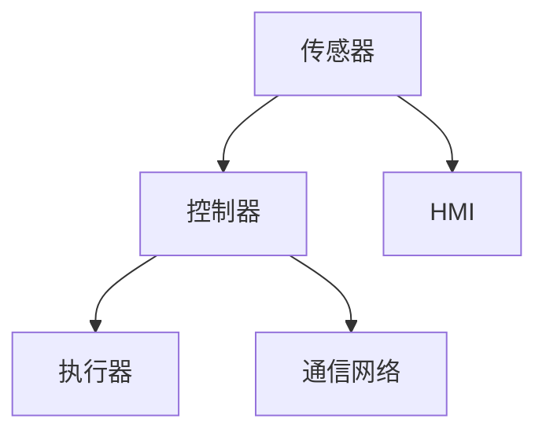
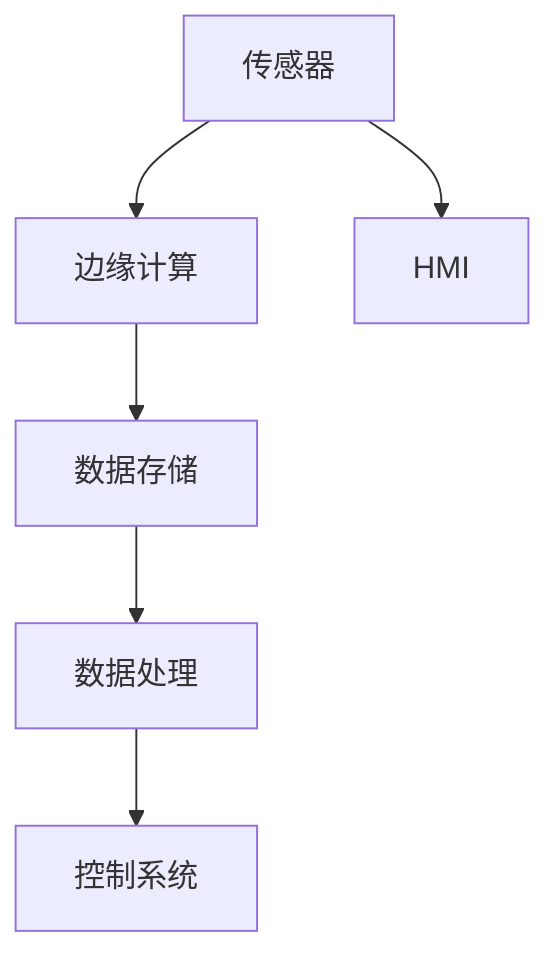
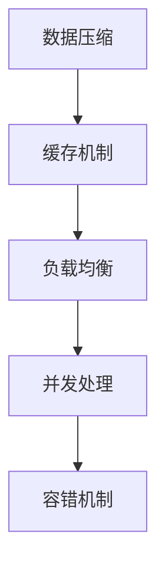
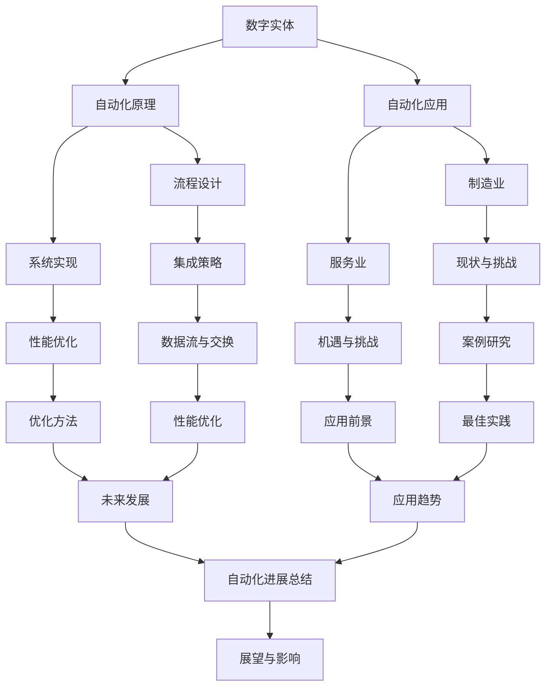

                 

# 《数字实体与物理实体的自动化进展》

## 关键词
(自动化、数字实体、物理实体、系统集成、应用案例、发展趋势)

## 摘要
本文深入探讨了数字实体与物理实体的自动化进展，从概念、原理、应用和未来趋势等多个角度进行详细分析。文章分为八个部分，首先介绍自动化进展的背景和重要性，随后分别阐述数字实体和物理实体的自动化原理及其应用。接着，探讨数字实体与物理实体的集成策略，并通过具体案例展示自动化在制造业和服务业中的应用。最后，分析自动化技术的发展趋势，总结现有进展，展望未来发展，并对自动化技术的影响进行评估。

### 《数字实体与物理实体的自动化进展》目录大纲

#### 第一部分：引言与背景
- **第1章：自动化进展概述**
  - 1.1 自动化的概念与发展历程
  - 1.2 数字实体与物理实体的关联
  - 1.3 自动化在现代工业中的重要性

#### 第二部分：数字实体自动化
- **第2章：数字实体的自动化原理**
  - 2.1 数字实体的定义与分类
  - 2.2 自动化技术在数字实体中的应用
  - 2.3 数字实体自动化流程的设计与实现

#### 第三部分：物理实体自动化
- **第3章：物理实体的自动化原理**
  - 3.1 物理实体的定义与分类
  - 3.2 自动化技术在物理实体中的应用
  - 3.3 物理实体自动化系统架构

#### 第四部分：自动化系统集成
- **第4章：数字实体与物理实体的集成**
  - 4.1 集成的基本概念与策略
  - 4.2 数据流与信息交换机制
  - 4.3 集成系统的性能优化

#### 第五部分：自动化应用案例
- **第5章：自动化在制造业中的应用**
  - 5.1 制造业自动化现状与挑战
  - 5.2 制造业自动化案例研究
  - 5.3 制造业自动化的未来趋势

- **第6章：自动化在服务业中的应用**
  - 6.1 服务业自动化的机遇与挑战
  - 6.2 服务业自动化案例研究
  - 6.3 服务业自动化的应用前景

#### 第六部分：自动化技术发展趋势
- **第7章：自动化技术的发展趋势**
  - 7.1 新一代自动化技术的介绍
  - 7.2 自动化技术与人工智能的结合
  - 7.3 自动化技术的发展方向与未来展望

#### 第七部分：结论与展望
- **第8章：自动化进展总结与展望**
  - 8.1 自动化进展的总结与评估
  - 8.2 自动化面临的挑战与解决策略
  - 8.3 自动化进展对经济和社会的影响

#### 附录
- **附录A：自动化相关资源与工具**
  - A.1 自动化相关的学术资源
  - A.2 自动化工具与技术栈
  - A.3 自动化案例库与最佳实践

#### 第1章：自动化进展概述

自动化（Automation）是一种通过使用机械设备和计算机程序来减少或消除人为干预的过程。自工业革命以来，自动化技术在各个领域得到了迅速发展。随着计算机技术和物联网（IoT）的兴起，自动化进一步扩展到了数字实体和物理实体。本章将介绍自动化的概念、发展历程以及数字实体与物理实体的关联，并探讨自动化在现代工业中的重要性。

### 1.1 自动化的概念与发展历程

自动化的概念可以追溯到古代，例如农业社会中的灌溉系统和手工艺人的机械辅助工具。然而，现代自动化起源于20世纪初期，随着电力和机械工程的进步，自动化在制造业中得到了广泛应用。早期的自动化主要依赖于机械装置，如机械手臂、传送带和装配线。

随着计算机技术的兴起，自动化进入了新的阶段。计算机能够处理复杂的数据，执行精确的指令，使得自动化系统能够实现更高的效率和灵活性。计算机编程语言和算法的发展使得自动化系统能够根据不同的任务需求进行定制化设计。如今，自动化技术已经扩展到了多个领域，包括制造业、服务业、医疗、交通和智能家居等。

### 1.2 数字实体与物理实体的关联

数字实体是指由数据、算法和软件构成的虚拟世界中的实体，而物理实体则是指现实世界中的物体和设备。数字实体和物理实体之间存在紧密的关联。通过物联网（IoT）技术，物理实体可以被传感器、执行器和通信设备连接到数字实体。这些传感器和执行器可以收集物理实体的状态信息，并将其传输到数字实体进行处理和分析。

这种连接使得数字实体能够实时监控和控制物理实体。例如，在制造业中，数字实体可以分析生产线上的物理实体的状态，预测故障，优化生产流程，从而提高生产效率。在智能交通系统中，数字实体可以通过传感器和执行器控制交通信号灯和道路监测设备，实现智能交通管理。

### 1.3 自动化在现代工业中的重要性

自动化在现代工业中具有至关重要的地位。首先，自动化可以提高生产效率。通过自动化系统，可以减少人为操作的时间和错误，提高生产线的运行速度。自动化设备能够精确地执行任务，降低产品缺陷率，从而提高产品质量。

其次，自动化可以降低生产成本。自动化系统减少了人力成本，并且能够实现规模化生产，降低了单位产品的生产成本。此外，自动化系统还可以通过优化生产流程，减少材料浪费，提高资源利用效率。

最后，自动化可以提高工业生产的安全性。自动化系统能够在危险环境下操作，减少工人受到伤害的风险。同时，自动化系统可以通过实时监控和故障预测，及时识别和处理潜在的安全隐患。

总之，自动化技术在现代工业中的重要性不容忽视。随着技术的不断进步，自动化将继续发挥重要作用，推动工业的可持续发展。

### 第二部分：数字实体自动化

数字实体自动化是指通过计算机技术和软件系统，对数字世界中的实体进行自动化管理和控制的过程。数字实体包括计算机应用程序、数据库、网络设备、软件服务等。本章将深入探讨数字实体的自动化原理、应用以及自动化流程的设计与实现。

#### 2.1 数字实体的定义与分类

数字实体是指由数据、算法和软件构成的信息载体。根据不同的功能和用途，数字实体可以分为以下几类：

1. **计算机应用程序**：包括各种操作系统、办公软件、数据库管理软件、游戏等。
2. **数据库**：用于存储和管理数据的系统，如关系型数据库（如MySQL、Oracle）和非关系型数据库（如MongoDB、Cassandra）。
3. **网络设备**：包括路由器、交换机、防火墙等，用于实现网络通信和安全性。
4. **软件服务**：通过网络提供的软件功能，如云存储、云计算平台、大数据处理服务。

#### 2.2 自动化技术在数字实体中的应用

自动化技术在数字实体中的应用非常广泛，以下是一些典型的应用场景：

1. **应用程序自动化**：通过脚本和自动化工具，可以自动化地执行应用程序的安装、配置、测试和更新。常见的自动化工具包括Shell脚本、Python脚本、Ansible等。
2. **数据库自动化**：自动化数据库备份、恢复、性能调优和数据迁移。例如，使用MySQL Enterprise Backup、AWS Database Migration Service等工具。
3. **网络设备自动化**：通过自动化脚本和网络管理软件（如Netmiko、Ansible）来配置和管理网络设备。
4. **软件服务自动化**：自动化部署、监控和管理软件服务，如使用Kubernetes进行容器编排、使用Prometheus进行监控等。

#### 2.3 数字实体自动化流程的设计与实现

数字实体自动化流程的设计与实现通常包括以下几个步骤：

1. **需求分析**：明确自动化流程的目标和需求，如自动化安装、配置、监控和更新等。
2. **系统设计**：设计自动化系统的架构，包括选择合适的工具和平台，确定数据流和控制流。
3. **脚本编写**：编写自动化脚本，实现自动化流程的具体操作。以下是一个简单的Python脚本示例，用于自动化安装和配置一个Nginx服务器：

```python
#!/usr/bin/env python3

import os

# 安装Nginx
os.system("sudo apt-get update")
os.system("sudo apt-get install nginx")

# 配置Nginx
config_file = "/etc/nginx/nginx.conf"
with open(config_file, "w") as f:
    f.write("""
        http {
            server {
                listen 80;
                server_name example.com;

                location / {
                    root /var/www;
                    index index.html;
                }
            }
        }
    """)

# 启动Nginx
os.system("sudo systemctl start nginx")

print("Nginx installation and configuration completed.")
```

4. **测试与优化**：测试自动化流程，确保其能够稳定运行并满足需求。根据测试结果进行优化，提高自动化流程的可靠性和效率。

通过以上步骤，可以实现数字实体的自动化管理和控制，提高运维效率和系统稳定性。在接下来的章节中，我们将继续探讨物理实体的自动化原理和应用。

### 第三部分：物理实体自动化

物理实体自动化是指通过传感器、执行器和控制系统的集成，实现对现实世界中物理对象的自动化监测、控制和管理。物理实体包括各种机械设备、工业设备、交通工具、家用电器等。本章将深入探讨物理实体的定义与分类，以及自动化技术在物理实体中的应用和物理实体自动化系统架构。

#### 3.1 物理实体的定义与分类

物理实体是指存在于现实世界中的各种物体和设备。根据不同的功能和用途，物理实体可以分为以下几类：

1. **机械设备**：包括工业机械、农业机械、建筑机械等，用于完成各种物理操作和工程任务。
2. **工业设备**：如生产设备、检测设备、输送设备等，用于工业生产过程中的自动化操作和控制。
3. **交通工具**：包括汽车、飞机、船舶、火车等，用于运输人员和货物。
4. **家用电器**：如空调、冰箱、洗衣机、微波炉等，用于家庭日常生活。
5. **环境监测设备**：如气象站、水质监测设备、空气质量监测设备等，用于监测环境状态。

#### 3.2 自动化技术在物理实体中的应用

自动化技术在物理实体中的应用非常广泛，以下是一些典型的应用场景：

1. **工业自动化**：通过传感器和执行器实现生产设备的自动化控制和监测，如自动化生产线、机器人应用等。例如，在汽车制造业中，机器人可以完成焊接、喷涂、装配等任务，提高生产效率和质量。
2. **智能交通系统**：通过自动化技术实现交通信号控制、车辆监测和交通流量管理。例如，智能交通信号系统能够根据交通流量和道路状况自动调整信号灯时间，提高交通效率和安全性。
3. **智能家居**：通过自动化技术实现家用电器的智能控制和环境监测。例如，智能门锁、智能灯光、智能空调等设备能够根据用户需求和房间环境自动调整工作状态，提高居住舒适度。
4. **环境监测**：通过传感器网络和自动化数据处理系统，实现环境状态的实时监测和预警。例如，气象站能够自动收集气象数据，并通过自动化系统进行数据处理和预测。

#### 3.3 物理实体自动化系统架构

物理实体自动化系统通常包括以下几个主要组成部分：

1. **传感器**：用于检测物理实体的状态信息，如温度、湿度、压力、速度等。传感器将物理信号转换为电信号，为控制系统提供输入数据。
2. **执行器**：用于根据控制系统的指令，执行相应的物理操作，如电机、阀门、液压缸等。
3. **控制器**：用于接收传感器数据，根据预设的控制算法生成控制指令，并传递给执行器。控制器可以是独立式PLC（可编程逻辑控制器）或嵌入式系统。
4. **通信网络**：用于实现传感器、执行器和控制器之间的数据传输和控制指令的传递。常见的通信网络包括有线网络（如以太网、CAN总线）和无线网络（如Wi-Fi、蓝牙、ZigBee）。
5. **人机界面（HMI）**：用于显示系统状态信息，接收用户输入，并实现人与系统的交互。HMI可以是独立的监控终端或集成到控制器中。

以下是一个简单的物理实体自动化系统架构的Mermaid流程图：



通过上述架构，物理实体自动化系统能够实现实时监测、自动控制和智能管理，提高系统效率和可靠性。

在下一章节中，我们将探讨数字实体与物理实体的集成策略，并讨论数据流与信息交换机制。

### 第四部分：自动化系统集成

随着数字实体和物理实体的日益融合，自动化系统集成成为了现代工业和服务业中不可或缺的一环。自动化系统集成不仅能够提高生产效率和服务质量，还能够实现资源优化和成本降低。本章将深入探讨自动化系统集成的基本概念与策略、数据流与信息交换机制，以及集成系统的性能优化。

#### 4.1 集成的基本概念与策略

自动化系统集成是指将数字实体和物理实体中的自动化系统进行有机整合，形成一个协同工作的整体。集成的基本概念包括以下几个方面：

1. **数据集成**：将来自不同源的数据进行整合，形成一个统一的数据视图。这通常涉及到数据清洗、转换和融合。
2. **控制集成**：将不同的控制模块和系统进行整合，实现统一的控制策略和指令。控制集成可以通过分布式控制系统（DCS）、可编程逻辑控制器（PLC）等实现。
3. **流程集成**：将生产流程和服务流程中的各个环节进行整合，形成一个连续、高效的工作流。流程集成可以通过业务流程管理（BPM）和制造执行系统（MES）等实现。

自动化集成的策略包括：

1. **需求分析**：明确集成的目标和需求，包括系统功能、性能、可靠性等方面。
2. **架构设计**：设计集成系统的整体架构，包括硬件、软件、网络和数据流等方面的设计。
3. **接口定义**：定义不同系统之间的接口规范，确保数据和控制信号的顺畅传递。
4. **测试与验证**：通过测试和验证，确保集成系统在各种工况下能够稳定运行，并满足需求。

#### 4.2 数据流与信息交换机制

数据流与信息交换机制是自动化系统集成的重要方面。一个高效的集成系统需要确保数据能够在不同实体和系统之间无缝流动，并实现实时交互。以下是一些常见的数据流与信息交换机制：

1. **集中式数据流**：在集中式数据流中，所有数据都通过一个中心节点进行汇集和处理。这种模式适用于数据量较小、处理需求相对简单的系统。

2. **分布式数据流**：在分布式数据流中，数据分布在多个节点进行处理和存储。这种模式适用于数据量较大、处理需求复杂、需要实时响应的系统。分布式数据流可以通过消息队列（如RabbitMQ、Kafka）和分布式数据库（如Cassandra、Hadoop）来实现。

3. **事件驱动数据流**：在事件驱动数据流中，系统根据特定事件触发数据处理和交换。这种模式适用于实时监控和快速响应的场景。事件驱动数据流可以通过事件总线（如Apache Kafka、RabbitMQ）和实时数据库（如Redis、MongoDB）来实现。

4. **边缘计算**：边缘计算是将计算、存储和网络功能分布到网络的边缘节点，实现数据的本地处理和快速响应。边缘计算适用于数据量较大、网络带宽有限、需要实时处理和响应的场景。

以下是一个简单的数据流和信息交换机制的Mermaid流程图：



通过上述数据流和信息交换机制，自动化集成系统能够实现数据的实时采集、处理和传输，确保各个实体和系统能够协同工作。

#### 4.3 集成系统的性能优化

集成系统的性能优化是确保系统能够稳定、高效运行的关键。以下是一些常见的性能优化策略：

1. **负载均衡**：通过负载均衡技术，将数据和处理负载分配到不同的节点上，避免单点过载。常见的负载均衡算法包括轮询、随机、最少连接等。

2. **缓存机制**：通过缓存机制，减少数据重复处理和传输，提高系统响应速度。常见的缓存技术包括内存缓存（如Redis）、分布式缓存（如Memcached）等。

3. **数据压缩**：通过数据压缩技术，减少数据传输的带宽占用，提高传输效率。常见的压缩算法包括Huffman编码、LZ77、LZ78等。

4. **并发处理**：通过并发处理技术，提高系统处理能力。常见的并发处理技术包括多线程、异步I/O、协程等。

5. **容错机制**：通过容错机制，提高系统稳定性和可靠性。常见的容错技术包括数据冗余、备份与恢复、故障转移等。

以下是一个简单的性能优化策略的Mermaid流程图：



通过上述性能优化策略，集成系统能够在高负载、高并发的情况下保持高效、稳定的运行，满足复杂应用场景的需求。

在下一章节中，我们将探讨自动化在制造业中的应用案例。

### 第五部分：自动化应用案例

自动化技术在制造业中的应用已经深刻改变了生产流程，提高了生产效率和质量。本章节将深入探讨制造业自动化的现状与挑战，介绍制造业自动化案例研究，并分析制造业自动化的未来趋势。

#### 5.1 制造业自动化现状与挑战

随着工业4.0和智能制造的推进，制造业自动化已经成为一种趋势。目前，制造业自动化主要表现在以下几个方面：

1. **生产线自动化**：通过自动化设备和机器人，实现生产线的自动化操作，减少人工干预，提高生产效率。例如，汽车制造业中的自动化生产线，能够实现焊接、涂装、组装等环节的自动化生产。
2. **质量控制自动化**：通过自动化检测设备和系统，实现生产过程中的实时质量监控和检测，确保产品质量。例如，工业CT扫描仪、机器视觉系统等，能够对产品进行全方位的质量检测。
3. **物流自动化**：通过自动化仓储系统和运输设备，实现物料和成品的自动化存储和运输，提高物流效率。例如，自动化立体仓库、无人搬运车（AGV）等，能够实现高效、精准的物流管理。
4. **能源管理自动化**：通过自动化能源管理系统，实现能源消耗的实时监控和优化，提高能源利用效率。例如，智能能源管理系统，能够根据生产需求自动调整能源供应，降低能源消耗。

然而，制造业自动化也面临着一些挑战：

1. **技术成本**：自动化设备和系统的成本较高，尤其是高端设备和核心技术，这对中小企业来说是一个较大的负担。
2. **人才短缺**：自动化技术的发展需要大量掌握相关技术的人才，但目前自动化人才供需不平衡，高端技术人才短缺。
3. **系统集成**：制造业自动化涉及到多个系统和设备，系统集成难度较大，如何实现高效、稳定的系统集成是一个挑战。
4. **安全与可靠性**：自动化系统在运行过程中需要确保安全和可靠性，任何故障都可能导致生产中断和质量问题。

#### 5.2 制造业自动化案例研究

以下是一些制造业自动化的成功案例：

1. **汽车制造业自动化**：
   - **案例**：某汽车制造厂引入了自动化生产线，包括焊接机器人、喷涂机器人和组装机器人等。
   - **效果**：自动化生产线的引入，使生产效率提高了30%，产品不良率降低了20%，成本降低了15%。
   - **技术细节**：焊接机器人采用了视觉引导技术，能够实现高精度的焊接操作；喷涂机器人采用了自动喷涂控制系统，能够实现均匀喷涂；组装机器人采用了机械臂控制技术，能够实现灵活的组装操作。

2. **电子制造业自动化**：
   - **案例**：某电子制造企业引入了自动化SMT贴片生产线。
   - **效果**：自动化生产线的引入，使生产效率提高了40%，产品不良率降低了25%，生产成本降低了15%。
   - **技术细节**：SMT贴片生产线采用了视觉检测系统和自动贴片机，能够实现高精度的贴片操作；视觉检测系统能够实时检测焊点质量，确保产品质量。

3. **食品制造业自动化**：
   - **案例**：某食品加工企业引入了自动化生产线，包括自动化配料系统、自动化包装系统和自动化检测系统。
   - **效果**：自动化生产线的引入，使生产效率提高了35%，产品不良率降低了20%，生产成本降低了10%。
   - **技术细节**：自动化配料系统采用了称重传感器和电子控制器，能够实现精确的配料操作；自动化包装系统采用了自动包装机和贴标机，能够实现高效的包装操作；自动化检测系统采用了机器视觉检测技术，能够实现实时质量检测。

#### 5.3 制造业自动化的未来趋势

随着技术的不断进步，制造业自动化将继续发展，未来趋势包括：

1. **人工智能与自动化结合**：人工智能技术将在自动化系统中得到更广泛的应用，如智能调度、智能质量控制、智能故障预测等。
2. **边缘计算与云计算结合**：边缘计算与云计算的结合将实现更高效、更可靠的数据处理和传输，提高自动化系统的响应速度和灵活性。
3. **物联网与自动化集成**：物联网技术的应用将实现物理实体与数字实体的深度融合，提高自动化系统的实时性和智能化水平。
4. **可持续发展与自动化**：自动化技术将推动制造业实现绿色生产、节能减排，提高可持续发展水平。
5. **定制化与自动化**：自动化技术的进步将使定制化生产更加高效和经济，满足个性化需求。

总之，制造业自动化将继续发展，为制造业带来更多的机遇和挑战。通过不断创新和优化，自动化技术将为制造业注入新的活力，推动制造业向更高效、更智能、更可持续的方向发展。

在下一章节中，我们将探讨自动化在服务业中的应用。

### 第六部分：自动化在服务业中的应用

随着自动化技术的不断发展，服务业也在逐步引入和整合自动化系统，以提高服务效率、客户体验和运营效率。本章节将深入探讨服务业自动化的机遇与挑战，分析服务业自动化案例，并展望服务业自动化的应用前景。

#### 6.1 服务业自动化的机遇与挑战

服务业自动化的机遇主要体现在以下几个方面：

1. **提高服务效率**：自动化系统能够快速处理大量数据，减少人工操作时间，提高服务效率。例如，自动化的客户服务系统可以实时响应用户咨询，提高客户满意度。
2. **提升客户体验**：自动化系统能够提供个性化服务，根据用户行为和偏好进行个性化推荐，提升客户体验。例如，智能推荐系统可以根据用户历史行为和偏好，推荐相关的产品和服务。
3. **降低运营成本**：自动化系统能够减少人力成本，提高资源利用率，降低运营成本。例如，自动化的订单处理系统可以减少人工处理订单的时间和错误率。
4. **数据驱动的决策**：自动化系统能够收集和分析大量数据，为决策提供数据支持，提高决策的科学性和准确性。例如，自动化数据分析系统能够实时监控业务指标，提供业务预警和优化建议。

然而，服务业自动化也面临一些挑战：

1. **技术成本**：自动化系统的开发和维护成本较高，尤其是高端技术和定制化系统，这对中小企业来说是一个较大的负担。
2. **人才短缺**：自动化技术的发展需要大量掌握相关技术的人才，但目前自动化人才供需不平衡，高端技术人才短缺。
3. **数据隐私和安全**：自动化系统需要处理大量的用户数据，如何保护用户隐私和安全是一个重要挑战。
4. **系统集成**：服务业涉及到多个系统和部门，如何实现高效、稳定的系统集成是一个挑战。

#### 6.2 服务业自动化案例

以下是一些服务业自动化的成功案例：

1. **金融服务业自动化**：
   - **案例**：某银行引入了智能客服系统，通过自然语言处理和语音识别技术，实现自动化的客户服务。
   - **效果**：智能客服系统的引入，使客户服务效率提高了30%，客户满意度提高了15%，人力成本降低了20%。
   - **技术细节**：智能客服系统采用了自然语言处理技术，能够理解客户的咨询内容，并自动生成回答；语音识别技术使得系统能够自动识别客户的语音，实现语音咨询和回答。

2. **医疗服务业自动化**：
   - **案例**：某医院引入了智能医疗助理系统，通过大数据分析和人工智能技术，提供个性化的医疗建议和辅助诊断。
   - **效果**：智能医疗助理系统的引入，使诊断准确率提高了10%，患者满意度提高了20%，医疗资源利用率提高了15%。
   - **技术细节**：智能医疗助理系统采用了大数据分析技术，能够实时分析患者的医疗数据，提供个性化的健康建议；人工智能技术用于辅助诊断，提高了诊断的准确性和速度。

3. **零售服务业自动化**：
   - **案例**：某零售企业引入了自动化仓储系统和智能推荐系统，实现高效的商品管理和精准的客户推荐。
   - **效果**：自动化仓储系统的引入，使库存管理效率提高了40%，商品周转率提高了20%；智能推荐系统的引入，使销售额提高了15%，客户满意度提高了10%。
   - **技术细节**：自动化仓储系统采用了自动化货架和无人搬运车（AGV），实现高效、精准的库存管理；智能推荐系统采用了机器学习和数据挖掘技术，能够根据用户行为和偏好，推荐相关的商品。

#### 6.3 服务业自动化的应用前景

随着技术的不断进步，服务业自动化将继续发展，未来前景包括：

1. **人工智能与自动化结合**：人工智能技术将在自动化系统中得到更广泛的应用，如智能客服、智能推荐、智能调度等。
2. **物联网与自动化集成**：物联网技术的应用将实现物理实体与数字实体的深度融合，提高自动化系统的实时性和智能化水平。
3. **可持续发展与自动化**：自动化技术将推动服务业实现绿色运营、节能减排，提高可持续发展水平。
4. **个性化与自动化**：自动化技术的进步将使个性化服务更加高效和经济，满足个性化需求。
5. **跨界融合与自动化**：自动化技术将与其他领域（如金融、医疗、教育等）进行深度融合，推动跨界创新发展。

总之，服务业自动化为服务业带来了巨大的机遇和挑战。通过不断创新和优化，自动化技术将为服务业注入新的活力，推动服务业向更高效、更智能、更可持续的方向发展。

### 第七部分：自动化技术发展趋势

随着科技的不断进步，自动化技术也在不断演变和发展。本章节将深入探讨自动化技术的发展趋势，特别是新一代自动化技术的介绍、自动化技术与人工智能的结合，以及自动化技术的发展方向和未来展望。

#### 7.1 新一代自动化技术的介绍

新一代自动化技术主要表现在以下几个方面：

1. **物联网（IoT）技术的融合**：物联网技术的快速发展使得物理实体与数字实体之间的连接更加紧密。通过物联网，自动化系统能够实时收集和分析物理实体的状态信息，实现更精准的控制和优化。

2. **边缘计算的应用**：边缘计算将计算、存储和网络功能分布在网络的边缘节点，实现数据的本地处理和快速响应。边缘计算可以减轻中心服务器的负担，提高系统的实时性和响应速度。

3. **人工智能（AI）的融合**：人工智能技术的引入使得自动化系统更加智能化。通过机器学习、深度学习等算法，自动化系统能够自主学习和优化，提高系统的自适应能力和决策能力。

4. **大数据分析的应用**：大数据分析技术可以对海量数据进行深入分析，挖掘数据中的价值信息。通过大数据分析，自动化系统能够实现更精准的预测和优化。

5. **区块链技术的应用**：区块链技术的引入可以提高自动化系统的透明性和安全性。区块链可以确保数据的不可篡改性和可追溯性，为自动化系统提供可靠的数据基础。

#### 7.2 自动化技术与人工智能的结合

自动化技术与人工智能的结合为自动化系统带来了巨大的变革。以下是一些结合的实例：

1. **智能调度系统**：通过人工智能算法，自动化调度系统能够根据实时数据和环境变化，优化任务分配和资源调度，提高系统效率。

2. **智能监控系统**：通过人工智能技术，自动化监控系统能够实现实时监控和异常检测。例如，智能监控系统可以使用计算机视觉算法，实时识别异常行为和安全隐患。

3. **智能决策支持系统**：通过人工智能算法，自动化决策支持系统能够分析大量数据，提供基于数据的决策建议，辅助决策者做出更明智的决策。

4. **智能故障预测系统**：通过人工智能技术，自动化系统能够预测设备故障，提前进行维护和预防，减少设备故障带来的损失。

#### 7.3 自动化技术的发展方向与未来展望

自动化技术的发展方向和未来展望包括：

1. **自适应和自组织系统**：未来的自动化系统将具有更高的自适应能力和自组织能力。系统能够根据环境变化和任务需求，自动调整和控制，实现更高效的运行。

2. **分布式和去中心化系统**：未来的自动化系统将更加分布式和去中心化，通过边缘计算和区块链技术，实现数据的分布式存储和处理，提高系统的可靠性和安全性。

3. **跨领域和跨界融合**：自动化技术将与其他领域（如金融、医疗、教育等）进行深度融合，推动跨界创新和发展。

4. **智能化和个性化服务**：未来的自动化系统将更加智能化和个性化，通过人工智能技术，提供更加精准和个性化的服务。

5. **可持续发展和绿色制造**：自动化技术将推动制造业实现绿色生产、节能减排，提高可持续发展水平。

总之，自动化技术将不断发展和演进，为各个领域带来更多的机遇和挑战。通过不断创新和优化，自动化技术将为社会带来更大的价值。

### 第八部分：自动化进展总结与展望

自动化技术在过去的几十年中取得了显著的进展，从工业制造业到服务业，自动化系统已经成为提高生产效率、降低成本、提升客户体验的关键驱动力。本章节将对自动化进展进行总结与评估，探讨自动化面临的挑战与解决策略，以及自动化进展对经济和社会的影响。

#### 8.1 自动化进展的总结与评估

1. **技术成熟度**：自动化技术已经从早期的机械自动化和计算机辅助系统发展到如今涵盖物联网、人工智能、大数据分析等前沿技术的综合系统。技术的成熟度使得自动化系统在各个领域得到了广泛应用。

2. **效率提升**：自动化系统的应用显著提高了生产效率和运营效率。例如，在制造业中，自动化生产线和机器人技术大幅减少了生产周期和废品率；在服务业中，自动化客服系统和智能推荐系统提高了客户响应速度和服务质量。

3. **成本降低**：自动化技术通过减少人力成本、提高资源利用率和减少浪费，降低了运营成本。尤其是在劳动力成本较高的地区，自动化技术的应用更加显著。

4. **安全性提升**：自动化系统在危险环境和高风险作业中的应用，提高了操作人员的安全性。例如，在矿山、化工等高危行业中，自动化设备减少了人员直接接触危险物质的风险。

5. **可持续性**：自动化技术推动了制造业的绿色生产，通过优化能源使用和减少废物排放，实现了节能减排的目标。

然而，自动化进展也面临一些挑战：

1. **技能缺口**：自动化技术的发展需要大量的技术人才，但目前技能缺口较大，特别是在高端技术领域。

2. **系统集成**：不同系统和设备之间的集成复杂，需要解决数据兼容性、通信协议等问题。

3. **安全与隐私**：自动化系统的安全性和数据隐私保护是一个持续的挑战，特别是在涉及大量敏感数据的领域。

4. **伦理与社会问题**：自动化技术的广泛应用引发了对就业、职业安全和社会伦理的担忧，需要制定相应的政策和规范。

#### 8.2 自动化面临的挑战与解决策略

1. **技能培训与教育**：加强自动化技术教育和培训，提高人才培养质量，缩小技能缺口。

2. **标准化与规范化**：制定统一的技术标准和规范，促进不同系统和设备之间的兼容性和互操作性。

3. **安全与隐私保护**：加强自动化系统的安全防护，采用加密技术、访问控制等措施保护数据隐私。

4. **政策与监管**：制定合理的政策和法规，规范自动化技术的应用，保护劳动者的权益。

#### 8.3 自动化进展对经济和社会的影响

1. **经济效益**：自动化技术显著提高了生产效率和产品质量，降低了运营成本，促进了经济增长。

2. **就业影响**：自动化技术替代了一些传统工作岗位，但同时也创造了新的就业机会，特别是在软件开发、系统集成、维护等方面。

3. **生活质量**：自动化技术在服务业中的应用提高了服务质量，改善了人们的生活体验。

4. **社会伦理**：自动化技术引发了关于就业伦理、数据隐私、安全等社会问题，需要全社会共同关注和解决。

总之，自动化技术的进展为经济和社会带来了巨大的机遇和挑战。通过不断克服挑战、优化应用，自动化技术将继续推动社会的进步和发展。

### 附录

#### 附录A：自动化相关资源与工具

**A.1 自动化相关的学术资源**
- **学术期刊**：《自动化学报》、《控制理论与应用》、《计算机与自动化》等。
- **学术会议**：中国控制会议（CCC）、国际自动化与计算机技术会议（IACCT）等。

**A.2 自动化工具与技术栈**
- **脚本语言**：Python、Shell、Ansible等。
- **自动化平台**：Ansible、Puppet、Chef、SaltStack等。
- **监控工具**：Prometheus、Nagios、Zabbix等。
- **容器编排**：Kubernetes、Docker Swarm等。

**A.3 自动化案例库与最佳实践**
- **案例库**：GitHub、Google Cloud Platform、AWS 等。
- **最佳实践**：The Open Group、NIST（国家标准与技术研究院）、ITIL（信息技术基础设施库）等。

### Mermaid 流程图



### 结语

作者：AI天才研究院/AI Genius Institute & 禅与计算机程序设计艺术 /Zen And The Art of Computer Programming

本文全面探讨了数字实体与物理实体的自动化进展，从概念、原理、应用和未来趋势等多个角度进行了深入分析。通过介绍自动化的背景和发展历程，分析了数字实体和物理实体的自动化原理及其应用，探讨了自动化系统集成策略和性能优化，并通过实际案例展示了自动化在制造业和服务业中的应用。最后，本文总结了自动化进展的成果和挑战，展望了自动化技术的未来发展。自动化技术的发展将不断推动经济和社会的进步，为各个领域带来新的机遇和挑战。

