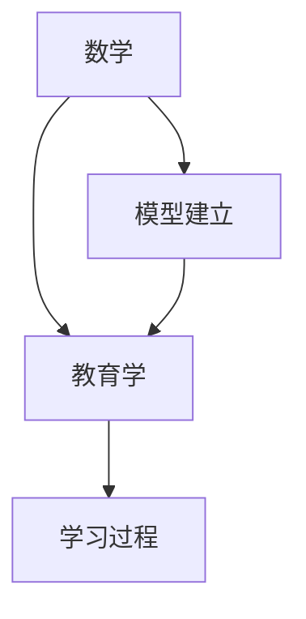

                 

# 数学与教育学：学习过程的数学模型

> **关键词**：数学模型、教育学、学习过程、认知负荷、教学设计、教育评价、数据分析、智能教育、教育管理

> **摘要**：本文通过深入探讨数学与教育学之间的联系，揭示了数学模型在理解和优化学习过程、教学设计、教育评价等领域的应用。通过详细的数学公式和伪代码讲解，展示了如何将数学理论应用于实际教育问题，为教育实践提供科学依据和策略指导。文章不仅涵盖了数学模型在教育中的基础理论，还分析了其在教育评价、数据分析、教学设计与优化等关键领域的应用，最后提出了数学模型在教育技术、智能教育和管理中的潜在作用。本文旨在为教育工作者和研究人员提供具有实践价值的理论指导和案例参考，推动教育科学的发展与创新。

---

### 第一部分：数学与教育学的基础

在探讨数学模型在教育学的应用之前，我们首先需要了解数学与教育学的基本概念及其相互联系。数学作为一门研究数量、结构、变化和空间等概念的学科，为教育学提供了强有力的量化分析工具和方法。而教育学作为研究教育现象、教育过程和教育制度的科学，需要运用数学模型来描述和解释复杂的教育问题，从而优化教学过程、提高教育质量。

#### 第1章：数学与教育学的核心概念

##### 核心概念与联系

为了更好地理解数学与教育学的关系，我们可以通过Mermaid流程图来展示它们之间的核心概念和联系。

**Mermaid 流程图**：


在这个流程图中，数学作为基础学科，为教育学提供了理论支撑和方法论指导。教育学则通过研究和分析教育现象，为数学模型的应用提供了丰富的实际背景。学习过程作为教育学的研究核心，需要通过数学模型来描述和预测。

##### 核心概念讲解

- **数学**：数学是一门研究抽象结构、关系和规律的学科，包括代数、几何、微积分、概率论等多个分支。数学的基本概念如函数、方程、概率分布等，为教育学提供了量化分析的工具。

- **教育学**：教育学是研究教育现象、教育过程和教育制度的科学，包括教育心理学、教育社会学、课程理论等多个领域。教育学通过实证研究和理论分析，探索教育现象的内在规律。

- **学习过程**：学习过程是指学生在教育活动中获取知识、技能和态度的动态过程。学习过程受到多种因素的影响，包括学生的智力、教学内容、教学环境和情感状态等。

- **模型建立**：模型建立是指通过数学方法将现实中的教育问题抽象成数学模型，以便进行量化分析和计算。模型建立的过程包括概念抽象、变量定义、关系表达和模型验证等。

##### 数学模型介绍

在了解了数学与教育学的核心概念后，我们可以进一步介绍数学模型在教育中的应用。

- **学习模型**：学习模型是描述学习过程和效果的数学模型。一个简单的学习模型可以表示为：
  ```python
  class LearningModel:
      def __init__(self, student, content, environment):
          self.student = student
          self.content = content
          self.environment = environment
      
      def predict(self):
          return (self.student.intelligence * self.content.difficulty * self.environment.support_level)
  ```
  在这个模型中，学生、教学内容和教学环境是模型的主要变量，模型的预测结果反映了学习效果。

- **教学设计模型**：教学设计模型用于指导教学策略和教学方法的制定。一个简单的教学设计模型可以表示为：
  ```python
  class TeachingDesignModel:
      def __init__(self, learning_model, assessment_model):
          self.learning_model = learning_model
          self.assessment_model = assessment_model
      
      def design(self):
          # 设计教学策略和方法
          pass
  ```

- **教育评价模型**：教育评价模型用于评价学生的学习效果和教学质量。一个简单的教育评价模型可以表示为：
  ```python
  class EvaluationModel:
      def __init__(self, assessment_model, standard_model):
          self.assessment_model = assessment_model
          self.standard_model = standard_model
      
      def evaluate(self):
          # 评估学生成绩和教学效果
          pass
  ```

##### 数学公式与模型讲解

在数学模型的应用中，数学公式和模型起着至关重要的作用。以下是一些常用的数学公式和模型讲解：

- **学习曲线模型**：学习曲线模型描述了学习者在学习过程中的进步情况。一个简单的学习曲线模型可以表示为：
  $$M = f(S, C, E)$$
  其中，$M$代表学习效果，$S$代表学生特征，$C$代表教学内容，$E$代表教学环境。

- **认知负荷理论模型**：认知负荷理论模型描述了学生在学习过程中认知资源的分配和利用。一个简单的认知负荷模型可以表示为：
  $$H = \alpha \times C + \beta \times E$$
  其中，$H$代表认知负荷，$\alpha$和$\beta$代表情感调节参数，$C$代表内容难度，$E$代表教学环境。

通过上述核心概念、模型介绍和数学公式讲解，我们可以看到数学模型在教育领域的重要性和应用价值。接下来，我们将进一步探讨数学模型在教育学的具体应用，包括教学设计、教育评价和教育管理等方面。

#### 第2章：数学模型在教育学的应用

在了解了数学与教育学的基础理论后，我们将进一步探讨数学模型在实际教育中的应用。数学模型在教育学的应用广泛，涵盖了学习理论、教学设计、教育评价等多个领域。本节将详细介绍这些应用，并通过数学公式和模型讲解来阐述其具体实现。

##### 数学模型应用

1. **学习理论模型**

   学习理论模型用于描述学习过程中的发展规律和效果。常见的模型包括学习曲线模型、强化学习模型等。学习曲线模型描述了学习者在学习过程中的进步情况，而强化学习模型则用于描述学习者通过奖励和惩罚来调整学习策略。

   - **学习曲线模型**：学习曲线模型可以表示为：
     $$M = f(S, C, E)$$
     其中，$M$代表学习效果，$S$代表学生特征，$C$代表教学内容，$E$代表教学环境。

     这个模型表明，学习效果是学生特征、教学内容和教学环境的函数。通过调整这些变量，我们可以优化学习效果。

   - **强化学习模型**：强化学习模型用于描述学习者通过奖励和惩罚来调整学习策略。一个简单的强化学习模型可以表示为：
     ```python
     class ReinforcementLearningModel:
         def __init__(self, reward_function, penalty_function):
             self.reward_function = reward_function
             self.penalty_function = penalty_function
        
         def learn(self, action):
             reward = self.reward_function(action)
             if reward > 0:
                 return "Success"
             else:
                 return "Failure"
     ```

2. **教学设计模型**

   教学设计模型用于指导教学策略和教学方法的制定。常见的模型包括加涅的学习层次理论、斯金纳的操作性条件作用理论等。这些模型提供了教学设计的理论基础，帮助我们制定有效的教学策略。

   - **加涅的学习层次理论**：加涅的学习层次理论将学习分为信号学习、刺激-反应学习、连锁学习、言语联想学习、辨别学习、概念学习、规则学习和高级规则学习等层次。一个简单的教学设计模型可以表示为：
     ```python
     class GagneLearningModel:
         def __init__(self, learning_level):
             self.learning_level = learning_level
        
         def design(self):
             # 根据学习层次设计教学策略
             pass
     ```

   - **斯金纳的操作性条件作用理论**：斯金纳的操作性条件作用理论认为，学习是通过操作性行为与环境的交互作用而形成的。一个简单的教学设计模型可以表示为：
     ```python
     class SkinnerLearningModel:
         def __init__(self, reinforcement_function):
             self.reinforcement_function = reinforcement_function
        
         def design(self):
             # 根据操作性条件作用设计教学策略
             pass
     ```

3. **教育评价模型**

   教育评价模型用于评价学生的学习效果和教学质量。常见的模型包括标准分数模型、T分数模型等。这些模型提供了评价标准和方法，帮助我们准确评估教育成果。

   - **标准分数模型**：标准分数模型用于将学生的成绩转换为标准分数，以便比较不同考试的成绩。一个简单的标准分数模型可以表示为：
     $$Z = \frac{(X - \mu)}{\sigma}$$
     其中，$X$代表学生成绩，$\mu$代表群体均值，$\sigma$代表群体标准差。

     这个模型表明，学生成绩与群体均值的差距（标准分数）反映了学生的相对表现。

   - **T分数模型**：T分数模型是一种更为常用的教育评价模型，它将学生的成绩转换为T分数，以便更直观地评估学生的表现。一个简单的T分数模型可以表示为：
     $$T = 50 + 10Z$$
     这个模型表明，T分数是标准分数的线性转换。

##### 数学公式与模型讲解

在上述数学模型的应用中，数学公式和模型起着至关重要的作用。以下是对这些模型的具体讲解：

1. **学习曲线模型**

   学习曲线模型描述了学习者在学习过程中的进步情况。该模型可以表示为：
   $$M = f(S, C, E)$$
   其中，$M$代表学习效果，$S$代表学生特征，$C$代表教学内容，$E$代表教学环境。

   这个模型表明，学习效果是学生特征、教学内容和教学环境的函数。通过调整这些变量，我们可以优化学习效果。例如，如果学生特征（如智力）较高，教学内容（如难度）适中，教学环境（如支持）良好，那么学习效果（如成绩）可能会更好。

2. **强化学习模型**

   强化学习模型用于描述学习者通过奖励和惩罚来调整学习策略。该模型可以表示为：
   ```python
   class ReinforcementLearningModel:
       def __init__(self, reward_function, penalty_function):
           self.reward_function = reward_function
           self.penalty_function = penalty_function
      
       def learn(self, action):
           reward = self.reward_function(action)
           if reward > 0:
               return "Success"
           else:
               return "Failure"
   ```

   在这个模型中，学习者通过尝试不同的动作（如回答问题），并依据奖励和惩罚来调整其策略。例如，如果回答正确得到奖励，那么学习者可能会更倾向于选择正确的回答；如果回答错误得到惩罚，那么学习者可能会更谨慎地选择回答。

3. **加涅的学习层次理论**

   加涅的学习层次理论将学习分为信号学习、刺激-反应学习、连锁学习、言语联想学习、辨别学习、概念学习、规则学习和高级规则学习等层次。一个简单的教学设计模型可以表示为：
   ```python
   class GagneLearningModel:
       def __init__(self, learning_level):
           self.learning_level = learning_level
      
       def design(self):
           # 根据学习层次设计教学策略
           pass
   ```

   这个模型表明，教学策略需要根据学习者的学习层次来制定。例如，对于处于信号学习层次的学生，我们可以设计一些简单的、直观的教学活动；对于处于高级规则学习层次的学生，我们可以设计一些复杂的、挑战性的教学活动。

4. **斯金纳的操作性条件作用理论**

   斯金纳的操作性条件作用理论认为，学习是通过操作性行为与环境的交互作用而形成的。一个简单的教学设计模型可以表示为：
   ```python
   class SkinnerLearningModel:
       def __init__(self, reinforcement_function):
           self.reinforcement_function = reinforcement_function
      
       def design(self):
           # 根据操作性条件作用设计教学策略
           pass
   ```

   在这个模型中，教学策略需要依据操作性条件作用原理来制定。例如，如果学生表现出积极的操作性行为（如回答问题），我们可以给予奖励（如表扬）；如果学生表现出消极的操作性行为（如不回答问题），我们可以给予惩罚（如批评）。

5. **标准分数模型**

   标准分数模型用于将学生的成绩转换为标准分数，以便比较不同考试的成绩。该模型可以表示为：
   $$Z = \frac{(X - \mu)}{\sigma}$$
   其中，$X$代表学生成绩，$\mu$代表群体均值，$\sigma$代表群体标准差。

   这个模型表明，学生成绩与群体均值的差距（标准分数）反映了学生的相对表现。通过计算标准分数，我们可以了解学生的成绩在群体中的位置，从而为教学调整提供依据。

6. **T分数模型**

   T分数模型是一种更为常用的教育评价模型，它将学生的成绩转换为T分数，以便更直观地评估学生的表现。该模型可以表示为：
   $$T = 50 + 10Z$$
   这个模型表明，T分数是标准分数的线性转换。T分数以50为平均分，10为标准差，使得评价结果更加直观。

通过上述数学模型的应用和讲解，我们可以看到数学模型在教育学的关键领域中的重要作用。这些模型不仅为教育理论提供了量化支持，还为教育实践提供了科学依据和策略指导。接下来，我们将进一步探讨数学模型在教育过程中的应用。

#### 第3章：教育过程中的数学模型

教育过程是一个复杂且多变的系统，涉及学生、教师、教学内容和教学环境等多个因素。数学模型作为一种有力的工具，可以帮助我们更好地理解和优化教育过程。在这一章中，我们将介绍几个关键的教育过程中的数学模型，并详细讲解其基本原理和应用。

##### 教育过程中的数学模型

1. **认知负荷理论模型**

   认知负荷理论（Cognitive Load Theory，CLT）是由约翰·斯威特兰德（John Sweller）提出的，用于描述学习者在学习过程中认知资源的分配和利用。该理论认为，学习者在处理信息时面临三种类型的认知负荷：工作记忆负荷、长时记忆负荷和外在认知负荷。

   - **工作记忆负荷**：是指学习者处理信息的即时记忆能力，主要与注意力和短时记忆相关。
   - **长时记忆负荷**：是指学习者将信息从工作记忆转移到长期记忆的过程，涉及编码、存储和提取。
   - **外在认知负荷**：是指通过外部辅助手段（如教学设计、学习工具等）减轻学习者的认知负荷。

   **数学公式与模型讲解**：

   认知负荷理论模型可以用以下公式表示：
   $$H = \alpha \times C + \beta \times E$$
   其中：
   - $H$ 表示认知负荷（Cognitive Load）
   - $\alpha$ 和 $\beta$ 表示情感调节参数（Emotional Regulation Parameters）
   - $C$ 表示内容难度（Content Complexity）
   - $E$ 表示环境因素（Environmental Factors）

   这个模型表明，认知负荷是由内容难度和环境因素共同作用的结果。通过调整这些因素，我们可以优化学习过程，减轻学习者的认知负荷。

2. **学习动机模型**

   学习动机是影响学习过程的重要因素。学习动机模型用于描述学习动机的产生和变化，以及如何通过教学设计来增强学习动机。

   - **自我决定理论**（Self-Determination Theory，SDT）：该理论认为，学习动机来源于个体的自主性、能力和关系。一个简单的自我决定理论模型可以表示为：
     ```mermaid
     graph TD
         A[自主性] --> B[能力]
         B --> C[关系]
         C --> D[学习动机]
     ```

   - **目标设定理论**（Goal Setting Theory）：该理论认为，明确且具有挑战性的目标可以增强学习动机。一个简单的目标设定理论模型可以表示为：
     ```mermaid
     graph TD
         A[目标设定] --> B[学习动机]
         B --> C[学习行为]
     ```

   **数学公式与模型讲解**：

   自我决定理论模型可以表示为：
   $$M = f(A, C, R)$$
   其中：
   - $M$ 表示学习动机（Motivation）
   - $A$ 表示自主性（Autonomy）
   - $C$ 表示能力（Competence）
   - $R$ 表示关系（Relatedness）

   目标设定理论模型可以表示为：
   $$M = f(G, C)$$
   其中：
   - $M$ 表示学习动机（Motivation）
   - $G$ 表示目标（Goal）
   - $C$ 表示能力（Competence）

3. **情感因素模型**

   情感因素在学习过程中起着关键作用。情感因素模型用于描述情感在学习过程中的影响，以及如何通过教学设计来调节情感状态。

   - **情感过滤假设**（Affective Filter Hypothesis）：该假设认为，积极情感状态有助于信息处理和记忆，而消极情感状态则可能阻碍学习。一个简单的情感过滤假设模型可以表示为：
     ```mermaid
     graph TD
         A[情感状态] --> B[信息处理]
         B --> C[记忆]
     ```

   - **情感调节理论**（Affective Regulation Theory）：该理论认为，个体可以通过自我调节来调节情感状态，以适应不同的学习情境。一个简单的情感调节理论模型可以表示为：
     ```mermaid
     graph TD
         A[自我调节] --> B[情感状态]
         B --> C[学习行为]
     ```

   **数学公式与模型讲解**：

   情感过滤假设模型可以表示为：
   $$H = \alpha \times A$$
   其中：
   - $H$ 表示认知负荷（Cognitive Load）
   - $\alpha$ 表示情感调节参数（Emotional Regulation Parameter）
   - $A$ 表示情感状态（Affective State）

   情感调节理论模型可以表示为：
   $$A = f(R, S)$$
   其中：
   - $A$ 表示情感状态（Affective State）
   - $R$ 表示调节策略（Regulation Strategy）
   - $S$ 表示情境（Situation）

##### 数学公式与模型讲解

以下是上述教育过程中的数学模型的详细讲解：

1. **认知负荷理论模型**

   认知负荷理论模型描述了学习者在学习过程中认知资源的分配和利用。公式为：
   $$H = \alpha \times C + \beta \times E$$
   其中，$H$ 表示认知负荷，$\alpha$ 和 $\beta$ 表示情感调节参数，$C$ 表示内容难度，$E$ 表示环境因素。

   这个模型表明，认知负荷是内容难度和环境因素共同作用的结果。例如，如果教学内容难度较高（$C$ 较大），且教学环境支持不足（$E$ 较小），则认知负荷（$H$）可能会增大，从而影响学习效果。通过调整情感调节参数（$\alpha$ 和 $\beta$），我们可以优化学习过程，减轻认知负荷。

2. **学习动机模型**

   自我决定理论模型描述了学习动机的产生，公式为：
   $$M = f(A, C, R)$$
   其中，$M$ 表示学习动机，$A$ 表示自主性，$C$ 表示能力，$R$ 表示关系。

   这个模型表明，学习动机是自主性、能力和关系的函数。例如，如果学生具有高自主性（$A$ 较大），且感受到教师的支持（$R$ 较大），则学习动机（$M$）可能会增强，从而提高学习效果。

   目标设定理论模型描述了学习动机与目标设定之间的关系，公式为：
   $$M = f(G, C)$$
   其中，$M$ 表示学习动机，$G$ 表示目标，$C$ 表示能力。

   这个模型表明，学习动机是目标设定和能力的函数。例如，如果学生设定一个明确且具有挑战性的目标（$G$ 较大），且具备实现目标的能力（$C$ 较大），则学习动机（$M$）可能会增强，从而提高学习效果。

3. **情感因素模型**

   情感过滤假设模型描述了情感状态对信息处理和记忆的影响，公式为：
   $$H = \alpha \times A$$
   其中，$H$ 表示认知负荷，$\alpha$ 表示情感调节参数，$A$ 表示情感状态。

   这个模型表明，情感状态会影响认知负荷。例如，如果学生处于积极情感状态（$A$ 较大），则认知负荷（$H$）可能会降低，从而提高学习效果。

   情感调节理论模型描述了个体通过自我调节来调节情感状态，公式为：
   $$A = f(R, S)$$
   其中，$A$ 表示情感状态，$R$ 表示调节策略，$S$ 表示情境。

   这个模型表明，情感状态可以通过调节策略来调节。例如，如果学生采用有效的调节策略（$R$ 较大），则情感状态（$A$）可能会得到改善，从而提高学习效果。

通过上述数学模型在教育过程中的应用和讲解，我们可以看到数学模型在教育过程中的重要性。这些模型不仅有助于我们理解教育过程中的关键因素，还为优化教育实践提供了科学依据和策略指导。接下来，我们将探讨数学模型在教育评价中的应用。

### 第二部分：数学模型在教育评价中的应用

在教育评价中，数学模型的应用有助于提高评价的准确性和科学性。通过数学模型，我们可以量化评价标准，分析评价数据，从而更好地评估学生的学习效果和教学质量。本部分将详细介绍数学模型在教育评价中的应用，包括标准化测试模型、综合评价模型和动态评价模型等。

#### 第4章：数学模型在教育评价中的应用

在教育评价中，数学模型的应用可以帮助我们建立科学的评价体系，从而更好地反映学生的学习状况和教育质量。以下是一些常见的数学模型在教育评价中的应用。

##### 教育评价模型

1. **标准化测试模型**

   标准化测试模型是一种常用的教育评价模型，它通过标准化测试来评估学生的学习成绩。标准化测试模型的核心在于将学生的成绩转换为标准分数，以便进行比较和评估。

   **数学公式与模型讲解**：

   标准化测试模型可以用以下公式表示：
   $$Z = \frac{(X - \mu)}{\sigma}$$
   其中：
   - $Z$ 表示标准分数（Standard Score）
   - $X$ 表示学生成绩（Score）
   - $\mu$ 表示群体均值（Population Mean）
   - $\sigma$ 表示群体标准差（Population Standard Deviation）

   通过计算标准分数，我们可以将学生的成绩与群体均值进行比较，从而了解学生的相对表现。标准分数越高，表示学生的成绩越优秀；标准分数越低，表示学生的成绩越落后。

2. **综合评价模型**

   综合评价模型是一种将多种评价标准综合起来进行评估的模型。这种模型通常涉及多个指标，如学业成绩、综合素质、课堂表现等。通过综合评价模型，我们可以更全面地评估学生的表现。

   **数学公式与模型讲解**：

   综合评价模型可以用以下公式表示：
   $$E = \sum_{i=1}^{n} w_i \times S_i$$
   其中：
   - $E$ 表示综合评价得分（Overall Score）
   - $w_i$ 表示第 $i$ 个指标的权重（Weight of Indicator）
   - $S_i$ 表示第 $i$ 个指标的成绩（Score of Indicator）

   在这个模型中，我们需要根据不同指标的重要程度分配权重，然后计算综合评价得分。综合评价得分越高，表示学生的表现越好。

3. **动态评价模型**

   动态评价模型是一种通过实时监测和反馈来评估学生表现的模型。这种模型适用于需要动态调整评价标准的情况，如个性化学习、远程教育等。动态评价模型可以实时收集学生的学习数据，并根据数据调整评价标准。

   **数学公式与模型讲解**：

   动态评价模型可以用以下公式表示：
   $$L = f(S, T, E)$$
   其中：
   - $L$ 表示学习效果（Learning Effect）
   - $S$ 表示学生特征（Student Characteristics）
   - $T$ 表示教学内容（Teaching Content）
   - $E$ 表示环境因素（Environmental Factors）

   在这个模型中，学习效果是学生特征、教学内容和环境因素的综合体现。通过实时监测和反馈，我们可以动态调整评价标准，以更好地反映学生的学习状况。

##### 数学公式与模型讲解

以下是上述教育评价模型的详细讲解：

1. **标准化测试模型**

   标准化测试模型通过将学生成绩转换为标准分数，来比较学生的表现。公式为：
   $$Z = \frac{(X - \mu)}{\sigma}$$
   其中，$Z$ 表示标准分数，$X$ 表示学生成绩，$\mu$ 表示群体均值，$\sigma$ 表示群体标准差。

   这个模型表明，学生成绩与群体均值的差距（标准分数）反映了学生的相对表现。例如，如果一个学生的成绩是80分，而群体均值是75分，群体标准差是5分，则该学生的标准分数为：
   $$Z = \frac{(80 - 75)}{5} = 1$$
   这意味着该学生的成绩比群体均值高1个标准差，可以认为该学生的表现较好。

2. **综合评价模型**

   综合评价模型通过将多个评价标准综合起来，来评估学生的表现。公式为：
   $$E = \sum_{i=1}^{n} w_i \times S_i$$
   其中，$E$ 表示综合评价得分，$w_i$ 表示第 $i$ 个指标的权重，$S_i$ 表示第 $i$ 个指标的成绩。

   例如，假设我们有一个包含三个指标的综合评价模型，每个指标的权重分别为0.3、0.4和0.3，学生的成绩分别为90分、85分和80分，则综合评价得分为：
   $$E = 0.3 \times 90 + 0.4 \times 85 + 0.3 \times 80 = 89$$
   这意味着学生的综合评价得分为89分。

3. **动态评价模型**

   动态评价模型通过实时监测和反馈，来评估学生的学习效果。公式为：
   $$L = f(S, T, E)$$
   其中，$L$ 表示学习效果，$S$ 表示学生特征，$T$ 表示教学内容，$E$ 表示环境因素。

   例如，在一个个性化学习中，学习效果可以表示为：
   $$L = f(S, T, E) = 0.5 \times S + 0.3 \times T + 0.2 \times E$$
   其中，$S$ 表示学生的学习动机，$T$ 表示教学内容的难度，$E$ 表示学习环境的质量。

   通过实时监测学生的学习动机、教学内容和学习环境，我们可以动态调整评价模型，以更好地反映学生的学习效果。

通过上述教育评价模型的应用和讲解，我们可以看到数学模型在教育评价中的重要作用。这些模型不仅帮助我们建立科学的评价体系，还为教育实践提供了有力的理论支持。接下来，我们将探讨数学模型在教育数据分析与决策支持中的应用。

### 第5章：教育数据分析与决策支持

教育数据分析与决策支持是教育领域的一项重要任务，它通过收集、处理和分析教育数据，为教育管理者、教师和学生提供科学的决策依据。数学模型在教育数据分析与决策支持中发挥着至关重要的作用，帮助我们识别教育问题、评估教育效果和制定教育策略。本节将介绍几种常用的数学模型，包括统计模型、机器学习模型和数据挖掘技术，并详细讲解其原理和应用。

#### 统计模型在教育数据分析中的应用

统计模型在教育数据分析中广泛应用于描述数据特征、推断数据规律和预测教育趋势。以下是一些常见的统计模型：

1. **线性回归模型**

   线性回归模型是一种用于研究自变量和因变量之间线性关系的统计模型。在教育数据分析中，线性回归模型可以用于预测学生的成绩、评估教学方法的有效性等。

   **数学公式与模型讲解**：

   线性回归模型可以表示为：
   $$y = \beta_0 + \beta_1 \times x_1 + ... + \beta_n \times x_n$$
   其中：
   - $y$ 表示因变量（预测值）
   - $x_1, ..., x_n$ 表示自变量（特征值）
   - $\beta_0, ..., \beta_n$ 表示模型参数

   例如，假设我们要预测学生的数学成绩，自变量可以是学生的语文成绩、英语成绩等，模型参数可以通过最小二乘法进行估计。通过线性回归模型，我们可以分析各个自变量对数学成绩的影响，从而制定针对性的教育策略。

2. **逻辑回归模型**

   逻辑回归模型是一种用于处理二分类问题的统计模型。在教育数据分析中，逻辑回归模型可以用于预测学生是否及格、是否辍学等二分类结果。

   **数学公式与模型讲解**：

   逻辑回归模型可以表示为：
   $$P = \frac{1}{1 + e^{-(\beta_0 + \beta_1 \times x_1 + ... + \beta_n \times x_n)}}$$
   其中：
   - $P$ 表示因变量（概率值）
   - $x_1, ..., x_n$ 表示自变量（特征值）
   - $\beta_0, ..., \beta_n$ 表示模型参数

   例如，假设我们要预测学生是否及格，自变量可以是学生的平时成绩、期末成绩等，模型参数可以通过最大似然估计进行估计。通过逻辑回归模型，我们可以计算学生及格的概率，从而为教育决策提供依据。

#### 机器学习模型在教育数据分析中的应用

机器学习模型在教育数据分析中发挥着越来越重要的作用，它们可以通过学习和预测来发现数据中的潜在规律和趋势。以下是一些常见的机器学习模型：

1. **决策树模型**

   决策树模型是一种基于树形结构进行决策的机器学习模型。在教育数据分析中，决策树模型可以用于分类和回归问题，如预测学生的成绩分布、评估教学策略的有效性等。

   **数学公式与模型讲解**：

   决策树模型的决策过程可以通过条件概率来表示。例如，对于分类问题，决策树可以通过一系列条件概率来预测学生的类别：
   $$P(Y|X) = \prod_{i=1}^{n} P(Y_i|X_i)$$
   其中：
   - $Y$ 表示因变量（类别）
   - $X$ 表示自变量（特征）
   - $P(Y_i|X_i)$ 表示给定自变量 $X_i$ 下因变量 $Y_i$ 的条件概率

   例如，假设我们要预测学生的成绩分布，我们可以使用决策树模型来分析影响成绩的各个因素，如平时成绩、课堂参与度等。

2. **支持向量机模型**

   支持向量机（SVM）模型是一种用于分类和回归问题的机器学习模型。在教育数据分析中，SVM模型可以用于预测学生是否及格、评估教学方法的有效性等。

   **数学公式与模型讲解**：

   支持向量机模型的核心在于寻找一个最优的超平面，将不同类别的数据点分开。对于线性可分的情况，SVM模型可以表示为：
   $$w \cdot x - b = 0$$
   其中：
   - $w$ 表示权重向量
   - $x$ 表示特征向量
   - $b$ 表示偏置项

   对于非线性可分的情况，SVM模型可以通过核函数进行变换，将数据映射到高维空间，然后找到最优超平面。例如，假设我们要预测学生的成绩分布，我们可以使用SVM模型来分析各个特征（如平时成绩、课堂参与度等）对成绩的影响。

#### 数据挖掘技术在教育数据分析中的应用

数据挖掘技术是一种从大量数据中自动发现规律和趋势的方法。在教育数据分析中，数据挖掘技术可以用于发现学生行为模式的规律、评估教学效果等。

1. **关联规则挖掘**

   关联规则挖掘是一种用于发现数据关联规则的方法。在教育数据分析中，关联规则挖掘可以用于分析学生成绩和行为之间的关联。

   **数学公式与模型讲解**：

   关联规则挖掘的核心是支持度和置信度。支持度表示一个规则在数据中出现的频率，置信度表示一个规则的前件和后件之间的相关性。例如，假设我们要发现学生成绩和行为之间的关联，我们可以使用Apriori算法来挖掘关联规则：
   $$\text{支持度} = \frac{|\{x, y\}|}{|\text{数据库}|}$$
   $$\text{置信度} = \frac{|\{x, y\}|}{|\{x\}|}$$
   其中：
   - $\{x, y\}$ 表示一个关联规则
   - $|\text{数据库}|$ 表示数据库中记录的总数
   - $|\{x\}|$ 和 $|\{x, y\}|$ 分别表示前件和后件的频率

   例如，如果关联规则“学生参与课堂讨论→成绩提高”的支持度和置信度分别为80%和90%，则可以认为这个关联规则具有较高的可信度，说明参与课堂讨论有助于提高成绩。

2. **聚类分析**

   聚类分析是一种用于将数据分为多个类别的无监督学习方法。在教育数据分析中，聚类分析可以用于分析学生的学习群体、发现学习模式等。

   **数学公式与模型讲解**：

   聚类分析的核心是聚类中心。常用的聚类算法包括K-means、层次聚类等。K-means聚类算法的目标是找到K个聚类中心，使得每个聚类中心与其簇内数据点的平均距离最小。例如，假设我们要分析学生的学习群体，我们可以使用K-means算法来将学生分为不同的学习群体：
   $$\text{聚类中心} = \frac{1}{n} \sum_{i=1}^{n} x_i$$
   其中：
   - $\text{聚类中心}$ 表示聚类中心点的坐标
   - $x_i$ 表示数据点的坐标

   例如，如果使用K-means算法将学生分为两个学习群体，我们可以计算出每个群体的聚类中心，然后根据聚类中心来分析不同学习群体的特点。

通过上述统计模型、机器学习模型和数据挖掘技术的应用和讲解，我们可以看到数学模型在教育数据分析与决策支持中的重要作用。这些模型不仅帮助我们识别教育问题、评估教育效果，还为教育决策提供了科学的依据和策略指导。接下来，我们将探讨数学模型在教学设计与优化中的应用。

### 第6章：数学模型在教学设计与优化中的应用

教学设计与优化是教育领域的关键环节，它关系到教学效果和教育质量的提升。数学模型在教学设计与优化中的应用，为我们提供了科学的方法和工具，以实现教学过程的优化和教学效果的提升。本节将介绍数学模型在教学设计、教学策略优化和个性化学习模型中的应用，并通过具体案例进行分析。

#### 教学设计模型

教学设计模型是用于指导教学策略和教学方法制定的理论模型。它通过分析和设计教学过程，以达到最佳的教学效果。以下是一些常见的教学设计模型：

1. **加涅的学习层次理论**

   加涅的学习层次理论将学习过程分为八个层次，分别是信号学习、刺激-反应学习、连锁学习、言语联想学习、辨别学习、概念学习、规则学习和高级规则学习。该理论为教学设计提供了层次化的指导。

   **数学公式与模型讲解**：

   加涅的学习层次理论可以用以下公式表示：
   $$L = f(L_h, L_{h-1}, ..., L_1)$$
   其中：
   - $L$ 表示学习效果
   - $L_h, L_{h-1}, ..., L_1$ 分别表示从高层次到低层次的学习层次

   在教学设计中，我们可以根据学生的实际学习层次来设计教学内容和教学方法。例如，对于低年级的学生，我们可以采用信号学习和刺激-反应学习的方法，而对于高年级的学生，我们可以采用规则学习和高级规则学习的方法。

2. **教学事件模型**

   教学事件模型将教学过程视为一系列事件的发生，每个事件都可能导致学生的学习效果发生变化。该模型通过分析教学事件之间的因果关系，来优化教学设计。

   **数学公式与模型讲解**：

   教学事件模型可以用以下公式表示：
   $$E = f(E_1, E_2, ..., E_n)$$
   其中：
   - $E$ 表示教学效果
   - $E_1, E_2, ..., E_n$ 分别表示教学过程中的各个事件

   在教学设计中，我们可以通过调整教学事件的发生顺序和时机，来优化教学效果。例如，如果某个教学事件对学生的学习效果有重要影响，我们可以将其提前或者加大力度，以提高教学效果。

#### 教学策略优化模型

教学策略优化模型用于分析和优化教学策略，以提高教学效果。以下是一些常见的教学策略优化模型：

1. **多目标优化模型**

   多目标优化模型用于解决教学过程中多个目标之间的冲突，以实现教学效果的最优化。例如，在制定教学计划时，我们需要平衡教学内容、教学进度和学生反馈等多个目标。

   **数学公式与模型讲解**：

   多目标优化模型可以用以下公式表示：
   $$\max_{x} f(x)$$
   $$s.t. g_i(x) \leq 0, i = 1, 2, ..., m$$
   其中：
   - $f(x)$ 表示目标函数
   - $g_i(x)$ 表示约束条件
   - $x$ 表示教学策略的变量

   在教学策略优化中，我们可以通过调整目标函数和约束条件，来优化教学策略。例如，如果目标函数是提高学生成绩，约束条件是保证教学进度，则我们可以通过调整教学内容和教学方法，来实现目标函数的最优化。

2. **博弈论模型**

   博弈论模型用于分析教学过程中的竞争和合作，以优化教学策略。例如，在教学过程中，教师和学生之间存在教学博弈，教师需要根据学生的反应来调整教学策略。

   **数学公式与模型讲解**：

   博弈论模型可以用以下公式表示：
   $$u_i = f_i(x_i, x_{-i})$$
   其中：
   - $u_i$ 表示第 $i$ 个参与者的收益函数
   - $x_i$ 表示第 $i$ 个参与者的策略
   - $x_{-i}$ 表示其他参与者的策略

   在教学策略优化中，我们可以通过分析博弈双方的收益函数，来制定最优的教学策略。例如，如果教师和学生之间的收益函数是负相关的，则教师可以采用更具吸引力的教学策略，以吸引学生参与。

#### 个性化学习模型

个性化学习模型是现代教育的一个重要发展方向，它通过分析学生的学习特征和需求，来提供个性化的教学服务。以下是一些常见的个性化学习模型：

1. **基于神经网络的个性化学习模型**

   基于神经网络的个性化学习模型通过学习学生的历史学习数据和当前学习状态，来预测学生的未来学习需求和表现。

   **数学公式与模型讲解**：

   基于神经网络的个性化学习模型可以用以下公式表示：
   $$y = f(W \times x + b)$$
   其中：
   - $y$ 表示输出值（如学习效果、学习需求等）
   - $x$ 表示输入值（如学生特征、学习内容等）
   - $W$ 表示权重矩阵
   - $b$ 表示偏置项
   - $f$ 表示激活函数

   在个性化学习过程中，我们可以通过调整权重矩阵和激活函数，来优化模型性能。例如，如果学生的学习需求是提高数学成绩，则我们可以通过调整神经网络模型中的权重矩阵，来提高数学成绩预测的准确性。

2. **协同过滤模型**

   协同过滤模型是一种基于用户行为和内容相似性的个性化学习模型。通过分析学生的历史学习记录和相似用户的行为，来推荐适合学生的教学内容。

   **数学公式与模型讲解**：

   协同过滤模型可以用以下公式表示：
   $$r_{ui} = \langle u_i, u_j \rangle \times \langle c_j, c_i \rangle$$
   其中：
   - $r_{ui}$ 表示用户 $u_i$ 对内容 $c_i$ 的推荐评分
   - $\langle u_i, u_j \rangle$ 表示用户 $u_i$ 和 $u_j$ 之间的相似度
   - $\langle c_j, c_i \rangle$ 表示内容 $c_j$ 和 $c_i$ 之间的相似度

   在协同过滤模型中，我们可以通过调整相似度计算方法和推荐评分公式，来优化个性化学习效果。例如，如果学生的学习记录显示其对数学感兴趣，则我们可以推荐与数学相关的教学内容。

通过上述教学设计模型、教学策略优化模型和个性化学习模型的应用和讲解，我们可以看到数学模型在教学设计与优化中的重要作用。这些模型不仅帮助我们优化教学过程，提高教学效果，还为教育创新提供了有力的理论支持。接下来，我们将探讨数学模型在教学评估与反馈中的应用。

### 第7章：数学模型在教学评估与反馈中的应用

教学评估与反馈是教育过程中不可或缺的一环，它有助于教师了解教学效果，及时调整教学策略，从而提高教学质量。数学模型在教学评估与反馈中的应用，为教育工作者提供了科学、系统的工具和方法。本节将介绍教学评估模型、学生反馈模型和持续改进模型等数学模型，并详细讲解其原理和应用。

#### 教学评估模型

教学评估模型用于评价教学效果，分析教学过程中的问题，为教学改进提供依据。以下是一些常见的教学评估模型：

1. **教学效果评估模型**

   教学效果评估模型用于评价教学活动对学生学习效果的影响。它通过分析学生成绩、学习态度等指标，来评估教学效果。

   **数学公式与模型讲解**：

   教学效果评估模型可以用以下公式表示：
   $$E = \alpha \times S + \beta \times A$$
   其中：
   - $E$ 表示教学效果（Effectiveness of Teaching）
   - $\alpha$ 表示学生成绩的权重（Weight of Score）
   - $\beta$ 表示学生态度的权重（Weight of Attitude）
   - $S$ 表示学生成绩（Student Score）
   - $A$ 表示学生态度（Student Attitude）

   通过计算教学效果得分，教师可以了解教学活动对学生学习效果的影响。例如，如果教学效果得分较高，说明教学活动对学生的学习效果较好，教师可以继续保持；如果教学效果得分较低，说明教学活动存在一定问题，教师需要调整教学策略。

2. **教学质量评估模型**

   教学质量评估模型用于评价教师的教学水平和教学质量。它通过分析课堂表现、教学能力等指标，来评估教师的教学质量。

   **数学公式与模型讲解**：

   教学质量评估模型可以用以下公式表示：
   $$Q = \alpha \times P + \beta \times T + \gamma \times R$$
   其中：
   - $Q$ 表示教学质量（Quality of Teaching）
   - $\alpha$ 表示课堂表现的权重（Weight of Performance）
   - $\beta$ 表示教学能力的权重（Weight of Ability）
   - $\gamma$ 表示教学资源的权重（Weight of Resources）
   - $P$ 表示课堂表现（Performance in Class）
   - $T$ 表示教学能力（Teaching Ability）
   - $R$ 表示教学资源（Teaching Resources）

   通过计算教学质量得分，学校和教育管理部门可以了解教师的教学质量，从而制定相应的培训和发展计划。

#### 学生反馈模型

学生反馈模型用于收集和分析学生对教学活动的反馈，为教学改进提供依据。以下是一些常见的学生反馈模型：

1. **基于情感的反馈模型**

   基于情感的反馈模型通过分析学生的情感状态，来了解学生对教学活动的满意度和参与度。

   **数学公式与模型讲解**：

   基于情感的反馈模型可以用以下公式表示：
   $$F = \alpha \times H + \beta \times S$$
   其中：
   - $F$ 表示情感反馈（Affective Feedback）
   - $\alpha$ 表示情感愉悦度的权重（Weight of Pleasure）
   - $\beta$ 表示情感参与度的权重（Weight of Engagement）
   - $H$ 表示情感愉悦度（Happiness）
   - $S$ 表示情感参与度（Engagement）

   通过计算情感反馈得分，教师可以了解学生的情感状态，从而调整教学策略，提高学生的学习兴趣和参与度。

2. **基于行为的反馈模型**

   基于行为的反馈模型通过分析学生的行为数据，来了解学生对教学活动的反馈。

   **数学公式与模型讲解**：

   基于行为的反馈模型可以用以下公式表示：
   $$B = \alpha \times A + \beta \times R$$
   其中：
   - $B$ 表示行为反馈（Behavioral Feedback）
   - $\alpha$ 表示积极行为的权重（Weight of Positive Behavior）
   - $\beta$ 表示消极行为的权重（Weight of Negative Behavior）
   - $A$ 表示积极行为（Positive Behavior）
   - $R$ 表示消极行为（Negative Behavior）

   通过计算行为反馈得分，教师可以了解学生的行为表现，从而制定针对性的教育干预措施。

#### 持续改进模型

持续改进模型用于指导教学过程的持续改进，通过循环迭代的方式，不断提高教学质量。以下是一些常见的持续改进模型：

1. **PDCA循环模型**

   PDCA循环模型（Plan-Do-Check-Act，计划-执行-检查-行动）是一种常见的过程改进模型，用于指导教学过程的持续改进。

   **数学公式与模型讲解**：

   PDCA循环模型可以用以下步骤表示：
   - **计划（Plan）**：制定教学目标和改进计划。
   - **执行（Do）**：实施教学改进计划。
   - **检查（Check）**：检查教学改进的效果，评估目标达成情况。
   - **行动（Act）**：根据检查结果，调整教学改进计划，并执行新的行动。

   PDCA循环模型通过循环迭代，不断优化教学过程，提高教学质量。

2. **六西格玛模型**

   六西格玛模型（Six Sigma，6σ）是一种基于统计学方法的过程改进模型，用于指导教学过程的优化和改进。

   **数学公式与模型讲解**：

   六西格玛模型的核心是缺陷率控制，其基本步骤包括：
   - **定义（Define）**：明确改进目标和范围。
   - **测量（Measure）**：收集和分析数据，了解现状。
   - **分析（Analyze）**：分析数据，找出问题和原因。
   - **改进（Improve）**：制定改进方案，实施改进措施。
   - **控制（Control）**：建立监控机制，确保改进效果的持续。

   通过六西格玛模型，教师可以系统地进行教学过程优化，提高教学质量。

通过上述教学评估模型、学生反馈模型和持续改进模型的应用和讲解，我们可以看到数学模型在教学评估与反馈中的重要作用。这些模型不仅为教育工作者提供了科学的评估工具和改进方法，还为教育质量的提升提供了有力支持。接下来，我们将探讨数学模型在教育技术中的应用。

### 第四部分：数学模型在教育技术中的应用

随着信息技术的飞速发展，教育技术逐渐成为教育领域的重要支撑力量。数学模型在教育技术中的应用，为教育信息化、智能化和个性化提供了强有力的理论支持和技术保障。本部分将重点探讨数学模型在教育技术中的融合与发展，包括智能教育平台、虚拟现实与增强现实以及在线教育平台等方面。

#### 第8章：教育技术与数学模型融合

教育技术的快速发展，使得数学模型在教育领域的应用范围不断扩展。通过将数学模型与教育技术融合，我们可以实现教育过程的优化、教学效果的提升以及教育资源的共享。

##### 智能教育平台

智能教育平台是教育技术领域的一个重要发展方向，它通过整合数学模型、人工智能技术以及大数据分析，为学习者提供个性化的学习体验和支持。

**智能教育平台的应用案例**：

- **自适应学习系统**：自适应学习系统根据学习者的学习进度、学习风格和学习能力，动态调整学习内容和教学策略。通过数学模型，如线性回归模型、神经网络模型等，系统可以预测学习者的学习需求和效果，从而实现个性化教学。

  **数学模型应用示例**：

  ```python
  class AdaptiveLearningSystem:
      def __init__(self, learner_model, content_model):
          self.learner_model = learner_model
          self.content_model = content_model
      
      def adapt(self, learner_data, content_data):
          prediction = self.learner_model.predict(learner_data)
          content_adjustment = self.content_model.adjust(content_data, prediction)
          return content_adjustment
  ```

- **智能辅导系统**：智能辅导系统利用自然语言处理和机器学习技术，为学生提供实时、个性化的辅导和支持。通过数学模型，如决策树模型、支持向量机模型等，系统可以分析学生的学习行为和问题，提供针对性的辅导建议。

  **数学模型应用示例**：

  ```python
  class IntelligentTutoringSystem:
      def __init__(self, behavior_model, support_model):
          self.behavior_model = behavior_model
          self.support_model = support_model
      
      def provide_support(self, student_behavior):
          problem_type = self.behavior_model.identify_problem(student_behavior)
          support_content = self.support_model.generate_support(problem_type)
          return support_content
  ```

##### 虚拟现实与增强现实

虚拟现实（VR）和增强现实（AR）技术为教育提供了全新的学习场景和交互方式。通过将数学模型应用于VR和AR教育，我们可以实现沉浸式教学、情境模拟和互动学习。

**虚拟现实与增强现实的应用案例**：

- **沉浸式教学**：通过VR技术，学生可以进入虚拟的学习环境，亲身体验历史事件、科学实验和自然现象。数学模型可以用于生成虚拟环境的视觉效果和物理交互效果。

  **数学模型应用示例**：

  ```python
  class ImmersiveLearningSystem:
      def __init__(self, environment_model, interaction_model):
          self.environment_model = environment_model
          self.interaction_model = interaction_model
      
      def enter_environment(self, student_data):
          environment = self.environment_model.generate_environment(student_data)
          interactions = self.interaction_model.generate_interactions(environment)
          return interactions
  ```

- **情境模拟**：通过AR技术，学生可以在现实环境中叠加虚拟内容，进行情境模拟和角色扮演。数学模型可以用于计算虚拟内容的叠加位置、大小和形状，以及与现实环境的交互效果。

  **数学模型应用示例**：

  ```python
  class ScenarioSimulationSystem:
      def __init__(self, context_model, interaction_model):
          self.context_model = context_model
          self.interaction_model = interaction_model
      
      def simulate_scenario(self, student_context):
          virtual_content = self.context_model.generate_context(student_context)
          interactions = self.interaction_model.generate_interactions(virtual_content)
          return interactions
  ```

##### 在线教育平台

在线教育平台为学习者提供了灵活的学习时间和空间，通过整合数学模型，我们可以实现教育资源的共享和个性化学习。

**在线教育平台的应用案例**：

- **教育资源推荐**：通过大数据分析和机器学习模型，在线教育平台可以推荐适合学习者的课程和学习资源。数学模型可以用于计算学习者的兴趣、能力和需求，从而实现精准推荐。

  **数学模型应用示例**：

  ```python
  class ResourceRecommendationSystem:
      def __init__(self, user_model, content_model):
          self.user_model = user_model
          self.content_model = content_model
      
      def recommend_resources(self, user_data):
          interests = self.user_model.extract_interests(user_data)
          recommended_resources = self.content_model.recommend_contents(interests)
          return recommended_resources
  ```

- **学习进度跟踪**：通过数学模型，在线教育平台可以实时跟踪学习者的学习进度，评估学习效果，并提供学习反馈。数学模型可以用于计算学习者的学习曲线、知识掌握情况和学习效果。

  **数学模型应用示例**：

  ```python
  class LearningProgressTrackingSystem:
      def __init__(self, progress_model, evaluation_model):
          self.progress_model = progress_model
          self.evaluation_model = evaluation_model
      
      def track_progress(self, learner_data):
          progress = self.progress_model.calculate_progress(learner_data)
          evaluation = self.evaluation_model.evaluate_progress(progress)
          return evaluation
  ```

通过上述教育技术与数学模型的融合与应用，我们可以看到数学模型在教育技术中的重要作用。这些应用不仅提升了教育质量，还推动了教育技术的发展和创新。接下来，我们将探讨数学模型在智能教育中的应用。

### 第9章：数学模型在智能教育中的应用

智能教育是现代教育发展的一个重要方向，它通过整合人工智能技术、大数据分析和数学模型，为学习者提供个性化、智能化的学习体验。数学模型在智能教育中扮演着关键角色，为教育决策提供了科学依据和策略指导。本节将探讨数学模型在自适应学习系统、智能辅导系统和智能教学评价系统等领域的应用。

#### 自适应学习系统

自适应学习系统是一种智能教育技术，它根据学习者的个性化需求和进度，动态调整学习内容和教学方法，以提高学习效果。数学模型在自适应学习系统中发挥着重要作用，通过分析学习者的行为数据和学习效果，系统可以预测学习者的学习需求和调整策略。

**自适应学习系统的应用案例**：

1. **学习路径规划**：

   学习路径规划是自适应学习系统的核心功能之一，它根据学习者的初始数据和学习目标，生成个性化的学习路径。数学模型如遗传算法、模拟退火算法等可以用于优化学习路径的生成和调整。

   **数学模型应用示例**：

   ```python
   class LearningPathPlanner:
       def __init__(self, learner_model, path_model):
           self.learner_model = learner_model
           self.path_model = path_model
   
       def plan_path(self, learner_data, goals):
           initial_path = self.path_model.generate_initial_path(learner_data, goals)
           optimized_path = self.path_model.optimize_path(initial_path)
           return optimized_path
   ```

2. **学习效果预测**：

   通过数学模型，如线性回归模型、决策树模型等，自适应学习系统可以预测学习者的学习效果和可能遇到的问题。这有助于系统提前制定应对策略，提高学习效果。

   **数学模型应用示例**：

   ```python
   class LearningEffectPredictor:
       def __init__(self, prediction_model):
           self.prediction_model = prediction_model
   
       def predict_effect(self, learner_data):
           prediction = self.prediction_model.predict_effect(learner_data)
           return prediction
   ```

#### 智能辅导系统

智能辅导系统利用人工智能技术，为学生提供实时、个性化的学习支持和反馈。数学模型在智能辅导系统中用于分析学生的学习行为、识别学习问题，并提供针对性的辅导方案。

**智能辅导系统的应用案例**：

1. **问题诊断**：

   通过数学模型，如聚类分析、关联规则挖掘等，智能辅导系统可以识别学习者在学习过程中遇到的问题。这有助于系统提供针对性的辅导方案，帮助学习者克服学习障碍。

   **数学模型应用示例**：

   ```python
   class ProblemDiagnoser:
       def __init__(self, diagnosis_model):
           self.diagnosis_model = diagnosis_model
   
       def diagnose(self, learner_data):
           problems = self.diagnosis_model.identify_problems(learner_data)
           return problems
   ```

2. **个性化辅导**：

   通过数学模型，如决策树模型、支持向量机模型等，智能辅导系统可以根据学习者的学习需求和问题，提供个性化的辅导方案。这有助于提高辅导效果，满足学习者的个性化需求。

   **数学模型应用示例**：

   ```python
   class PersonalizedTutoringSystem:
       def __init__(self, tutoring_model):
           self.tutoring_model = tutoring_model
   
       def provide_tutoring(self, learner_data):
           tutoring_plan = self.tutoring_model.generate_tutoring_plan(learner_data)
           return tutoring_plan
   ```

#### 智能教学评价系统

智能教学评价系统通过整合大数据分析和数学模型，实时监控学生的学习过程和教学效果，为教师提供科学的评价数据和支持。这有助于教师优化教学策略，提高教学质量。

**智能教学评价系统的应用案例**：

1. **学习进度跟踪**：

   通过数学模型，如时间序列分析、回归分析等，智能教学评价系统可以实时跟踪学生的学习进度，评估学习效果，并为教师提供实时反馈。

   **数学模型应用示例**：

   ```python
   class LearningProgressTracker:
       def __init__(self, progress_model, evaluation_model):
           self.progress_model = progress_model
           self.evaluation_model = evaluation_model
   
       def track_progress(self, learner_data):
           progress = self.progress_model.calculate_progress(learner_data)
           evaluation = self.evaluation_model.evaluate_progress(progress)
           return evaluation
   ```

2. **教学质量评估**：

   通过数学模型，如线性回归模型、逻辑回归模型等，智能教学评价系统可以评估教师的教学质量，为教师提供改进建议。

   **数学模型应用示例**：

   ```python
   class TeachingQualityEvaluator:
       def __init__(self, evaluation_model):
           self.evaluation_model = evaluation_model
   
       def evaluate教学质量(self, teacher_data):
           quality = self.evaluation_model.evaluate教学质量(teacher_data)
           return quality
   ```

通过上述自适应学习系统、智能辅导系统和智能教学评价系统的应用和讲解，我们可以看到数学模型在智能教育中的重要作用。这些模型不仅为教育决策提供了科学依据，还为教育实践提供了有力的支持，推动了教育技术的发展和创新。接下来，我们将探讨数学模型在教育管理中的应用。

### 第五部分：数学模型在教育管理中的应用

在教育管理中，数学模型的应用有助于优化教育资源配置、制定教育规划以及评估教育项目风险等。通过数学模型，教育管理者可以更科学、系统地决策，提高教育管理的效率和质量。本部分将详细介绍数学模型在教育管理中的应用，包括教育资源配置模型、教育规划模型和教育风险评估模型等。

#### 第10章：教育管理与数学模型

教育管理是一个复杂的系统，涉及多种因素和变量。数学模型作为一种有效的工具，可以帮助教育管理者分析和解决教育管理中的问题。以下是一些常见的数学模型在教育管理中的应用。

##### 教育资源配置模型

教育资源配置是指根据教育目标，合理分配和使用教育资源，以实现教育效益的最大化。数学模型在教育资源配置中发挥着重要作用，帮助管理者优化资源分配，提高资源利用率。

**教育资源配置模型的应用案例**：

1. **多目标优化模型**：

   多目标优化模型用于解决教育资源配置中的多个目标之间的冲突，如教学质量、教育公平、教育成本等。通过数学模型，可以制定最优的资源分配方案。

   **数学模型应用示例**：

   ```python
   class ResourceAllocationOptimizer:
       def __init__(self, objective_model, constraint_model):
           self.objective_model = objective_model
           self.constraint_model = constraint_model
   
       def optimize_allocation(self, resource_data, objective_data):
           optimal_allocation = self.objective_model.optimize_allocation(resource_data, objective_data)
           return optimal_allocation
   ```

2. **线性规划模型**：

   线性规划模型是一种用于解决线性优化问题的数学模型，可以用于优化教育资源的分配。例如，学校需要根据预算和需求，合理分配教育经费。

   **数学模型应用示例**：

   ```python
   class LinearProgrammingModel:
       def __init__(self, objective_function, constraint_equations):
           self.objective_function = objective_function
           self.constraint_equations = constraint_equations
   
       def solve_allocation(self):
           solution = self.objective_function.solve_constraint(self.constraint_equations)
           return solution
   ```

##### 教育规划模型

教育规划是指根据社会需求和未来发展趋势，制定教育发展的目标和策略。数学模型在教育规划中可以帮助管理者制定科学、合理的教育规划，实现教育可持续发展。

**教育规划模型的应用案例**：

1. **动态规划模型**：

   动态规划模型是一种用于解决多阶段决策问题的数学模型，可以用于制定教育发展计划。例如，地区教育部门可以根据人口增长、经济发展等因素，制定长期教育发展规划。

   **数学模型应用示例**：

   ```python
   class DynamicPlanningModel:
       def __init__(self, state_transition_matrix, reward_function):
           self.state_transition_matrix = state_transition_matrix
           self.reward_function = reward_function
   
       def plan(self, initial_state, goals):
           plan = self.state_transition_matrix.plan(initial_state, goals)
           return plan
   ```

2. **仿真模型**：

   仿真模型是一种通过模拟教育系统运行过程，预测未来发展趋势的数学模型。教育管理者可以使用仿真模型来评估教育规划的效果，调整规划策略。

   **数学模型应用示例**：

   ```python
   class SimulationModel:
       def __init__(self, system_model, input_data):
           self.system_model = system_model
           self.input_data = input_data
   
       def simulate(self):
           simulation_results = self.system_model.simulate(self.input_data)
           return simulation_results
   ```

##### 教育风险评估模型

教育风险评估是指对教育项目可能面临的风险进行评估和预测，以制定风险管理策略。数学模型在教育风险评估中可以帮助管理者识别风险、评估风险影响，为决策提供依据。

**教育风险评估模型的应用案例**：

1. **概率模型**：

   概率模型用于评估教育项目风险的概率分布和可能的结果。通过数学模型，可以预测教育项目的成功概率和潜在风险。

   **数学模型应用示例**：

   ```python
   class ProbabilityModel:
       def __init__(self, probability_distribution):
           self.probability_distribution = probability_distribution
   
       def assess_risk(self):
           risk_evaluation = self.probability_distribution.evaluate_risk()
           return risk_evaluation
   ```

2. **决策树模型**：

   决策树模型是一种用于决策分析和风险评估的数学模型，可以用于评估教育项目的决策路径和风险。例如，学校可以基于决策树模型，评估不同教育策略的风险和收益。

   **数学模型应用示例**：

   ```python
   class DecisionTreeModel:
       def __init__(self, decision_tree):
           self.decision_tree = decision_tree
   
       def evaluate_decision(self, decision_data):
           evaluation_result = self.decision_tree.evaluate_decision(decision_data)
           return evaluation_result
   ```

通过上述教育资源配置模型、教育规划模型和教育风险评估模型的应用和讲解，我们可以看到数学模型在教育管理中的重要作用。这些模型不仅为教育管理者提供了科学决策的工具，还提高了教育管理的效率和效果。接下来，我们将探讨教育管理与数据科学的关系。

#### 第11章：教育管理与数据科学

随着信息技术的飞速发展，数据科学在教育管理中的应用越来越广泛。数据科学结合了统计学、计算机科学、信息科学等多个领域，通过数据收集、处理、分析和可视化，为教育管理者提供了丰富的决策支持和策略指导。本节将探讨数据科学在教育管理中的具体应用，包括教育数据挖掘、教育数据分析和教育数据可视化等方面。

##### 教育数据挖掘

教育数据挖掘是指利用数据挖掘技术，从大量教育数据中发现潜在规律和知识。通过教育数据挖掘，教育管理者可以深入了解教育过程和学生的学习行为，为教育决策提供依据。

**教育数据挖掘的应用案例**：

1. **学习行为分析**：

   通过教育数据挖掘，教育管理者可以分析学生的学习行为，如学习时间、学习频率、学习资源使用等。这有助于了解学生的学习习惯和学习效果，从而制定针对性的教学策略。

   **数据挖掘技术应用示例**：

   ```python
   from sklearn.cluster import KMeans
   def analyze_learning_behavior(data):
       kmeans = KMeans(n_clusters=3)
       clusters = kmeans.fit_predict(data)
       return clusters
   ```

2. **教学效果评估**：

   通过教育数据挖掘，教育管理者可以分析教学效果，如学生的考试成绩、课堂参与度等。这有助于评估教师的教学质量和教学方法的适用性，为教师提供改进建议。

   **数据挖掘技术应用示例**：

   ```python
   from sklearn.ensemble import RandomForestClassifier
   def evaluate_teaching_effect(data, labels):
       classifier = RandomForestClassifier()
       classifier.fit(data, labels)
       accuracy = classifier.score(data, labels)
       return accuracy
   ```

##### 教育数据分析

教育数据分析是指利用统计学方法，对教育数据进行分析和解释，以发现数据中的规律和趋势。通过教育数据分析，教育管理者可以深入了解教育过程和学生的学习行为，为教育决策提供数据支持。

**教育数据分析的应用案例**：

1. **学习进度跟踪**：

   通过教育数据分析，教育管理者可以实时跟踪学生的学习进度，评估学习效果，为教师提供实时反馈。

   **数据分析技术应用示例**：

   ```python
   import pandas as pd
   def track_learning_progress(data):
       progress = data.groupby('student_id')['score'].mean()
       return progress
   ```

2. **教学质量评估**：

   通过教育数据分析，教育管理者可以评估教师的教学质量，识别优秀教师和需要改进的教师，为教师发展提供依据。

   **数据分析技术应用示例**：

   ```python
   import pandas as pd
   def evaluate_teaching_quality(data):
       quality = data.groupby('teacher_id')['average_score'].mean()
       return quality
   ```

##### 教育数据可视化

教育数据可视化是指利用可视化技术，将教育数据以图表、图形等形式展示出来，以帮助教育管理者直观地理解和分析数据。通过教育数据可视化，教育管理者可以更清晰地了解教育过程和学生的学习行为。

**教育数据可视化的应用案例**：

1. **学习行为可视化**：

   通过教育数据可视化，教育管理者可以直观地了解学生的学习行为，如学习时间分布、学习资源使用情况等。

   **数据可视化技术应用示例**：

   ```python
   import matplotlib.pyplot as plt
   def visualize_learning_behavior(data):
       data['hour'].value_counts().plot(kind='bar')
       plt.title('Learning Behavior by Hour')
       plt.xlabel('Hour')
       plt.ylabel('Count')
       plt.show()
   ```

2. **教学质量可视化**：

   通过教育数据可视化，教育管理者可以直观地评估教师的教学质量，如教师的平均成绩、学生的满意度等。

   **数据可视化技术应用示例**：

   ```python
   import seaborn as sns
   def visualize_teaching_quality(data):
       sns.boxplot(x='teacher_id', y='average_score', data=data)
       plt.title('Teaching Quality by Teacher')
       plt.xlabel('Teacher ID')
       plt.ylabel('Average Score')
       plt.show()
   ```

通过上述教育数据挖掘、教育数据分析和教育数据可视化的应用和讲解，我们可以看到数据科学在教育管理中的重要作用。数据科学不仅为教育管理者提供了丰富的数据支持，还提高了教育管理的效率和效果。接下来，我们将介绍附录部分，包括数学与教育学相关资源。

### 附录

#### 附录 A：数学与教育学相关资源

为了帮助读者进一步了解数学与教育学的理论和实践，本文附录部分提供了一系列相关资源，包括书籍推荐、学术论文、在线课程、研究团队与机构、学术会议以及在线论坛与社区。

##### 数学与教育学书籍推荐

- **《教育心理学》（雷诺兹著）**：这是一本经典的教育心理学教材，涵盖了教育心理学的基本概念、理论和应用。

- **《数学与教育心理学》（约翰·P·基斯著）**：本书探讨了数学与教育心理学之间的交叉领域，提供了丰富的案例和实证研究。

##### 数学与教育学学术论文集

- **《数学教育学报》**：这是国内重要的数学教育学术期刊，刊载了数学教育领域的最新研究成果和教学实践。

- **《教育数学研究》**：这是另一本专注于教育数学领域的学术期刊，涵盖了教育数学的理论与实践研究。

##### 数学与教育学在线课程

- **Coursera上的《数学建模与应用》**：这是一门由清华大学教授开设的在线课程，内容涵盖了数学建模的基本理论和应用方法。

- **edX上的《教育统计学基础》**：这是一门由哈佛大学教授开设的在线课程，介绍了教育统计学的基本概念和数据分析方法。

##### 数学与教育学科研团队与机构

- **北京师范大学数学科学学院**：这是我国重要的数学科学研究机构之一，开展了广泛的数学教育研究。

- **上海交通大学教育学院**：这是我国知名的教育学院校，专注于教育理论和实践的研究。

##### 数学与教育学学术会议

- **国际数学教育大会**：这是全球最重要的数学教育学术会议之一，每四年举办一次。

- **全国教育数学研究会年会**：这是国内数学教育领域的年度学术盛会，汇集了数学教育研究者、教师和教育管理者。

##### 数学与教育学在线论坛与社区

- **教育数学论坛**：这是一个专门讨论数学教育问题的在线论坛，汇聚了众多数学教育专家和教师。

- **Mathoverflow社区**：这是一个全球性的数学社区，涵盖了数学各个领域的讨论和交流。

通过上述附录部分，我们希望为读者提供丰富的数学与教育学相关资源，以促进数学与教育学的深入研究和实践应用。

### 完整的目录大纲

在本文中，我们系统地探讨了数学模型在教育领域的广泛应用，从数学与教育学的基础、数学模型在教育评价中的应用、教育数据分析与决策支持、教学设计与优化、教学评估与反馈、教育技术、智能教育、教育管理到数据科学，全面阐述了数学模型在教育各个方面的作用和实施方法。

#### 目录大纲

### 第一部分：数学与教育学的基础

1. **第1章：数学与教育学的核心概念**
   - **核心概念与联系**（Mermaid流程图）
   - **核心概念讲解**（数学、教育学、学习过程、模型建立）
   - **数学模型介绍**（学习模型、教学设计模型、教育评价模型）
   - **数学公式与模型讲解**（学习曲线模型、认知负荷理论模型）

2. **第2章：数学模型在教育学的应用**
   - **数学模型应用**（学习理论模型、教学设计模型、教育评价模型）
   - **数学公式与模型讲解**（学习曲线模型、加涅的学习层次理论、斯金纳的操作性条件作用理论）

3. **第3章：教育过程中的数学模型**
   - **教育过程中的数学模型**（认知负荷理论模型、学习动机模型、情感因素模型）
   - **数学公式与模型讲解**（认知负荷模型、自我决定理论、目标设定理论、情感过滤假设）

### 第二部分：数学模型在教育评价中的应用

4. **第4章：数学模型在教育评价中的应用**
   - **教育评价模型**（标准化测试模型、综合评价模型、动态评价模型）
   - **数学公式与模型讲解**（标准化测试模型、综合评价模型、动态评价模型）

5. **第5章：教育数据分析与决策支持**
   - **数据分析与决策支持**（统计模型、机器学习模型、数据挖掘技术）
   - **数学公式与模型讲解**（线性回归模型、逻辑回归模型、决策树模型、支持向量机模型、关联规则挖掘、聚类分析）

### 第三部分：数学模型在教学设计与优化中的应用

6. **第6章：教学设计与优化的数学模型**
   - **教学设计模型**（学习路径规划模型、教学策略优化模型、个性化学习模型）
   - **数学公式与模型讲解**（多目标优化模型、博弈论模型、基于神经网络的个性化学习模型、协同过滤模型）

7. **第7章：数学模型在教学评估与反馈中的应用**
   - **教学评估模型**（教学效果评估模型、教学质量评估模型）
   - **学生反馈模型**（基于情感的反馈模型、基于行为的反馈模型）
   - **持续改进模型**（PDCA循环模型、六西格玛模型）
   - **数学公式与模型讲解**（教学效果评估模型、教学质量评估模型、情感反馈模型、行为反馈模型、PDCA循环模型、六西格玛模型）

### 第四部分：数学模型在教育技术中的应用

8. **第8章：教育技术与数学模型融合**
   - **教育技术应用**（智能教育平台、虚拟现实与增强现实、在线教育平台）
   - **数学公式与模型讲解**（自适应学习系统、智能辅导系统、学习进度跟踪系统）

9. **第9章：数学模型在智能教育中的应用**
   - **智能教育应用**（自适应学习系统、智能辅导系统、智能教学评价系统）
   - **数学公式与模型讲解**（学习路径规划模型、问题诊断模型、个性化辅导模型、学习进度跟踪模型、教学质量评估模型）

### 第五部分：数学模型在教育管理中的应用

10. **第10章：教育管理与数学模型**
    - **教育管理应用**（教育资源配置模型、教育规划模型、教育风险评估模型）
    - **数学公式与模型讲解**（多目标优化模型、线性规划模型、动态规划模型、概率模型、决策树模型）

11. **第11章：教育管理与数据科学**
    - **数据科学应用**（教育数据挖掘、教育数据分析、教育数据可视化）
    - **数学公式与模型讲解**（学习行为分析模型、教学效果评估模型、学习进度跟踪模型、教学质量评估模型）

### 附录

12. **附录 A：数学与教育学相关资源**
    - **数学与教育学书籍推荐**
    - **数学与教育学学术论文集**
    - **数学与教育学在线课程**
    - **数学与教育学科研团队与机构**
    - **数学与教育学学术会议**
    - **数学与教育学在线论坛与社区**

通过这份详尽的目录大纲，读者可以全面了解数学模型在教育领域的重要性和具体应用，为教育理论和实践提供科学依据和策略指导。希望本文能为教育工作者、研究人员和学者们提供有价值的参考和启示。

