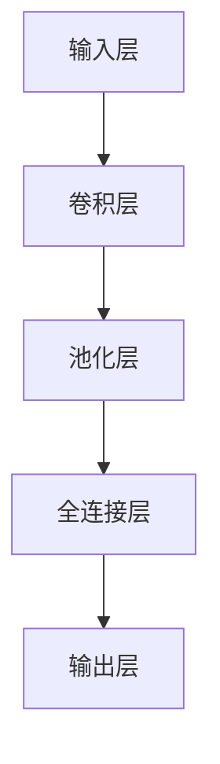
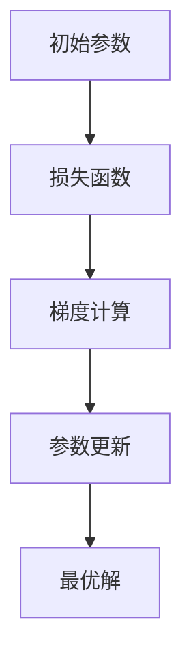
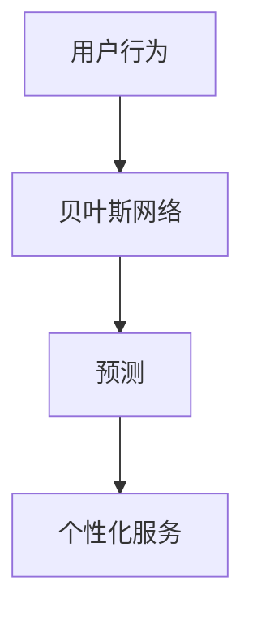
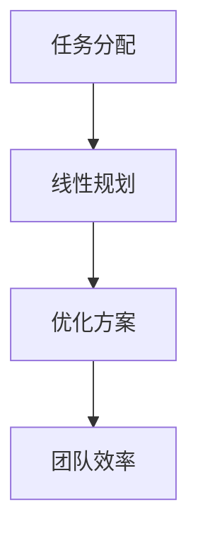
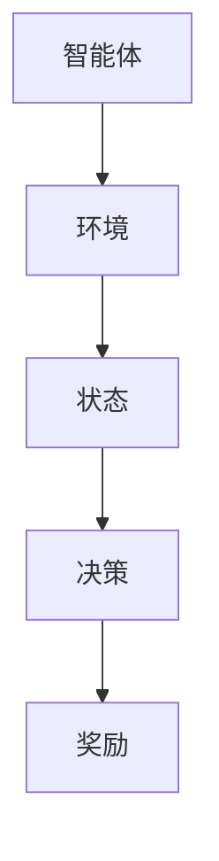
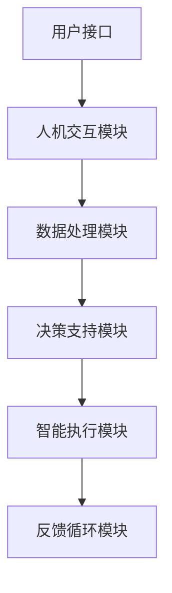
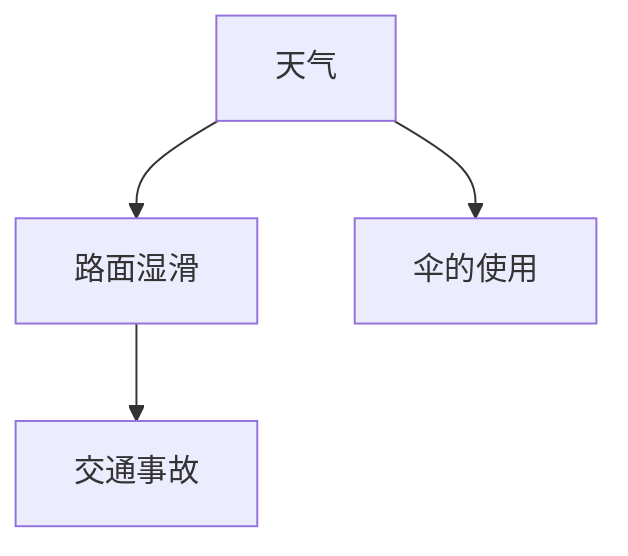

                 

# 数学与未来人机共生的发展趋势

> **关键词：数学、人工智能、人机共生、发展趋势、核心算法、数学模型**

> **摘要：**
本文将深入探讨数学在人工智能和未来人机共生中的重要角色。通过梳理数学的发展历程，分析其在人工智能中的应用，构建未来人机共生的数学架构，详细解析核心算法原理，以及通过实际项目实战，揭示数学在推动未来人机共生中的关键作用和挑战。

----------------------------------------------------------------

## 第一部分：数学基础与未来人机共生概述

### 第1章：数学的进化与未来人机共生概念

#### 1.1 数学在人类文明发展中的作用

数学，作为人类智慧的结晶，自古便是推动文明进步的重要力量。从古埃及的几何学，到古希腊的数论，再到中世纪的代数学，数学的发展历程见证了几千年来人类对自然界规律的不断探索。

在现代，数学的重要性更是无可替代。无论是物理学中的相对论，还是工程学中的结构设计，抑或是计算机科学中的算法分析，数学都扮演着至关重要的角色。它不仅为科学研究提供了理论工具，也为我们理解和解决复杂问题提供了方法。

#### 1.2 数学在人工智能中的新角色

随着人工智能（AI）技术的快速发展，数学在人工智能领域中的角色也在不断演变。从最初的神经网络，到现代的深度学习，数学理论为AI的发展提供了坚实的理论基础。

例如，神经网络中的反向传播算法，本质上是一个优化问题，需要运用微积分和线性代数的知识来解决。而深度学习中的卷积神经网络（CNN）和循环神经网络（RNN），更是直接基于线性代数和微积分的数学原理。

#### 1.3 未来人机共生的发展趋势

未来，人工智能和人类将更加紧密地融合，形成一种新的共生关系——人机共生。在这个共生体系中，数学将继续发挥关键作用。

首先，数学模型将成为人机交互的核心。通过数学模型，我们可以更好地理解人类行为，设计出更符合人类需求的人工智能系统。

其次，数学在协同工作和智能决策中的角色也将日益重要。未来，人工智能系统将能够与人类共同完成复杂任务，实现高效协同。而这一切，都需要依赖于强大的数学模型来支持。

最后，随着人工智能技术的普及，数学的应用范围将进一步扩展。从智能家居，到自动驾驶，再到医疗诊断，数学将在各个领域发挥重要作用，推动人类社会的进步。

### 第2章：数学核心概念与架构

#### 2.1 基础数学知识

数学是一门广泛而深厚的学科，其基础概念和知识体系为人工智能的发展提供了坚实的支撑。在本节中，我们将介绍数学中的几个核心概念：数论、几何学和微积分。

##### 2.1.1 数论

数论是数学的一个分支，主要研究整数的性质。在人工智能中，数论的应用主要体现在密码学和安全领域。例如，RSA密码系统就是基于数论中的大素数分解问题。

```latex
设p和q是两个互质的素数，n = pq，那么对于任意一个整数c，满足：
- c < n
- c和n互质

存在整数e和d，使得：
c^e ≡ n^(ed+1) (mod n)
```

这个公式就是RSA加密算法的核心。通过这个公式，我们可以实现高效的安全通信。

##### 2.1.2 几何学

几何学是研究空间形状和空间的科学。在人工智能中，几何学主要应用于计算机视觉和机器人领域。

例如，在计算机视觉中，我们可以使用几何学中的直线、平面和三维空间的概念来描述图像中的物体。而机器人则依赖于几何学中的坐标系和变换来理解其周围的环境。

```latex
设A和B是两个点，则直线AB的参数方程可以表示为：
\begin{cases}
x = x_1 + t(x_2 - x_1) \\
y = y_1 + t(y_2 - y_1)
\end{cases}
```

其中，\( t \) 是参数。

##### 2.1.3 微积分

微积分是数学的一个分支，主要研究函数的极限、导数、积分和微分方程。在人工智能中，微积分的应用非常广泛。

例如，在神经网络中，反向传播算法就是基于微积分中的梯度下降法。通过计算损失函数的梯度，我们可以找到网络的最低点，从而优化网络参数。

```latex
设f(x)是一个可微函数，则其在点x_0处的梯度可以表示为：
\nabla f(x_0) = \left[\frac{\partial f}{\partial x_1}(x_0), \frac{\partial f}{\partial x_2}(x_0), ..., \frac{\partial f}{\partial x_n}(x_0)\right]^T
```

#### 2.2 数学在人工智能中的应用

数学不仅为基础理论提供了支持，还在人工智能的实际应用中发挥着重要作用。在本节中，我们将探讨数学在神经网络、概率论和信息论、最优化理论中的应用。

##### 2.2.1 神经网络与线性代数

神经网络是人工智能的核心组成部分，而线性代数是神经网络的理论基础。线性代数中的矩阵运算、向量计算和特征分解等概念在神经网络中有着广泛的应用。

例如，在深度学习中，卷积神经网络（CNN）和循环神经网络（RNN）都使用了大量的矩阵运算。这些运算可以通过线性代数的理论进行高效实现。



在这个流程图中，我们可以看到线性代数在神经网络中的基本架构。

##### 2.2.2 概率论与信息论

概率论和信息论是人工智能中的两个重要理论。概率论为我们提供了处理不确定性的工具，而信息论则帮助我们理解和量化信息。

在人工智能中，概率论的应用主要体现在机器学习中的模型评估和决策。通过概率分布，我们可以更好地理解数据，并做出更准确的预测。

信息论则主要应用于数据压缩和通信。在深度学习中，信息论中的交叉熵（Cross-Entropy）是常用的损失函数。通过交叉熵，我们可以衡量模型预测结果和真实结果之间的差距。

```latex
L(y, \hat{y}) = -\sum_{i=1}^{n} y_i \log(\hat{y}_i)
```

其中，\( y \) 是真实标签，\( \hat{y} \) 是模型预测的概率分布。

##### 2.2.3 最优化理论与算法

最优化理论是解决优化问题的基础。在人工智能中，最优化理论被广泛应用于模型的训练和优化。

例如，在深度学习中，优化算法（如梯度下降法）是训练神经网络的关键。通过不断调整网络参数，我们可以找到最优解，使得模型在特定任务上表现最佳。



在这个流程图中，我们可以看到最优化理论在神经网络训练中的基本流程。

### 第3章：未来人机共生的数学架构

#### 3.1 未来人机共生的数学模型

未来人机共生将是一个高度智能化的系统，其核心在于数学模型的应用。在本节中，我们将探讨未来人机共生的数学模型，以及它们在人机交互、协同工作和智能决策中的应用。

##### 3.1.1 数学模型在人机交互中的应用

在人机交互中，数学模型可以帮助我们更好地理解人类行为，设计出更符合人类需求的人工智能系统。例如，通过贝叶斯网络，我们可以建模人类的行为，预测用户的行为模式，从而提供个性化的服务。



在这个流程图中，我们可以看到贝叶斯网络在人机交互中的应用。

##### 3.1.2 数学模型在协同工作中的应用

在协同工作中，数学模型可以帮助我们优化团队的合作效率，提高决策的准确性。例如，通过线性规划，我们可以为团队成员分配任务，使得整体效率最大化。



在这个流程图中，我们可以看到线性规划在协同工作中的应用。

##### 3.1.3 数学模型在智能决策中的应用

在智能决策中，数学模型可以帮助我们处理复杂的问题，提供最优的决策方案。例如，通过强化学习，我们可以训练智能体在不确定的环境中做出最优决策。



在这个流程图中，我们可以看到强化学习在智能决策中的应用。

#### 3.2 未来人机共生的数学架构

未来人机共生的数学架构是一个复杂而庞大的系统，它包括多个层次和模块。下面是一个简化的架构图：



在这个架构图中，用户接口与人机交互模块相连，处理模块与决策支持模块相连，执行模块与反馈循环模块相连。这些模块通过数学模型相互连接，形成一个完整的共生系统。

### 第4章：核心算法原理讲解

#### 4.1 算法概述

算法是解决特定问题的步骤序列，它是一系列明确的指令，用于解决计算问题。在人工智能和未来人机共生中，算法扮演着至关重要的角色。本节将介绍算法的基本概念、分类和设计原则。

##### 4.1.1 算法分类

算法可以根据其解决问题的方法和特性进行分类。常见的算法分类包括：

1. **搜索算法**：用于在给定数据集中找到特定元素。例如，深度优先搜索（DFS）和广度优先搜索（BFS）。
2. **排序算法**：用于将数据集按照特定顺序排列。例如，快速排序（Quick Sort）和归并排序（Merge Sort）。
3. **贪心算法**：通过每一步选择最优解来达到整体最优解。例如，最短路径算法中的迪杰斯特拉算法（Dijkstra's Algorithm）。
4. **动态规划**：通过将问题分解为子问题，并保存子问题的解来避免重复计算。例如，斐波那契数列的计算。
5. **随机算法**：通过随机性来解决问题的算法。例如，蒙特卡罗模拟。

##### 4.1.2 算法设计原则

设计算法时，应遵循以下原则：

1. **正确性**：算法必须能够正确地解决特定问题。
2. **效率**：算法应尽可能快地解决问题，这通常意味着较低的复杂度。
3. **健壮性**：算法应能够处理各种输入，包括异常和边界情况。
4. **可扩展性**：算法应能够适应不同规模的问题，而不需要大规模修改。

#### 4.2 伪代码讲解

为了更好地理解算法，我们可以使用伪代码来描述算法的步骤和逻辑。伪代码是一种简化的编程语言，它使用自然语言和简单的语法结构来描述算法。

以下是一个简单的线性搜索算法的伪代码：

```plaintext
Algorithm LinearSearch(A, x)
    for each element in A do
        if element == x then
            return index of element
        end if
    end for
    return -1 // x not found
End Algorithm
```

在这个算法中，我们遍历数组 `A` 中的每个元素，如果找到与 `x` 相等的元素，返回其索引；如果未找到，返回 `-1`。

#### 4.3 算法实现与优化

在实现算法时，我们通常会面临性能和资源利用率的挑战。以下是一些常见的算法优化策略：

1. **分而治之**：将大问题分解为较小的子问题，分别解决后再合并结果。这种策略在解决递归问题时非常有效。
2. **贪心算法**：每一步都做出当前看起来最好的选择，以期望最终得到整体最优解。
3. **动态规划**：通过保存子问题的解来避免重复计算，从而降低时间复杂度。
4. **随机化**：引入随机性来提高算法的性能或鲁棒性。

以下是一个使用动态规划解决斐波那契数列问题的伪代码：

```plaintext
Function Fibonacci(n)
    if n <= 1 then
        return n
    end if
    let fib[n-1] = Fibonacci(n-1)
    let fib[n-2] = Fibonacci(n-2)
    let fib[n] = fib[n-1] + fib[n-2]
    return fib[n]
End Function
```

在这个算法中，我们通过递归方式计算斐波那契数列，并在每次计算时保存子问题的解，以避免重复计算。

### 第5章：数学模型与数学公式详解

#### 5.1 基础数学公式

在人工智能和未来人机共生中，基础数学公式是构建复杂模型和分析数据的基础。以下是一些常用的基础数学公式：

##### 5.1.1 微积分基本公式

微积分是处理变化和积累的数学工具，以下是一些基本的微积分公式：

1. **导数**：函数在某点的导数表示该点处的切线斜率。
   $$ f'(x) = \lim_{{h \to 0}} \frac{{f(x+h) - f(x)}}{h} $$
   
2. **积分**：函数的积分表示其图形下的面积。
   $$ \int f(x) \, dx = F(x) + C $$
   其中，\( F(x) \) 是原函数，\( C \) 是积分常数。

3. **微分方程**：描述函数变化的方程。
   $$ \frac{dy}{dx} = f(x, y) $$

##### 5.1.2 线性代数公式

线性代数是处理多维空间和线性系统的数学工具，以下是一些基本的线性代数公式：

1. **矩阵乘法**：两个矩阵相乘的结果是一个新的矩阵。
   $$ C = A \cdot B $$
   其中，\( C \) 是结果矩阵，\( A \) 和 \( B \) 是输入矩阵。

2. **逆矩阵**：如果一个矩阵 \( A \) 是可逆的，其逆矩阵 \( A^{-1} \) 可以通过以下公式计算：
   $$ A^{-1} = \frac{1}{{\det(A)}} \cdot adj(A) $$
   其中，\( \det(A) \) 是 \( A \) 的行列式，\( adj(A) \) 是 \( A \) 的伴随矩阵。

3. **特征值与特征向量**：一个方阵 \( A \) 的特征值和特征向量满足以下方程：
   $$ A \cdot v = \lambda \cdot v $$
   其中，\( v \) 是特征向量，\( \lambda \) 是特征值。

#### 5.2 复杂数学模型

除了基础数学公式，还有一些复杂数学模型在人工智能和未来人机共生中具有重要应用，以下是一些典型的复杂数学模型：

##### 5.2.1 贝叶斯网络模型

贝叶斯网络是一种概率图模型，用于表示一组随机变量之间的条件依赖关系。以下是一个简单的贝叶斯网络模型：



贝叶斯网络的基本公式是条件概率：
$$ P(A|B) = \frac{P(B|A) \cdot P(A)}{P(B)} $$

##### 5.2.2 强化学习模型

强化学习是一种通过试错学习来做出最优决策的机器学习方法。强化学习模型的基本组成包括：

1. **状态（S）**：系统当前所处的状态。
2. **动作（A）**：智能体可以采取的动作。
3. **奖励（R）**：智能体在执行动作后获得的奖励。
4. **策略（π）**：智能体在给定状态下选择动作的概率分布。

强化学习的主要目标是找到最优策略，使得累积奖励最大化。常用的强化学习算法包括Q-learning和SARSA。

#### 5.3 公式详解与实例

为了更好地理解这些数学模型和公式，我们可以通过一些具体的例子来展示它们的应用。

##### 5.3.1 微积分公式应用实例

假设我们有一个函数 \( f(x) = x^2 \)，我们可以使用微积分公式来计算其在 \( x = 2 \) 处的导数和积分：

1. **导数**：
   $$ f'(x) = 2x $$
   $$ f'(2) = 2 \cdot 2 = 4 $$
   
2. **积分**：
   $$ \int x^2 \, dx = \frac{x^3}{3} + C $$
   $$ \int_{0}^{2} x^2 \, dx = \left[ \frac{x^3}{3} \right]_{0}^{2} = \frac{2^3}{3} - \frac{0^3}{3} = \frac{8}{3} $$

##### 5.3.2 线性代数公式应用实例

假设我们有一个矩阵 \( A = \begin{bmatrix} 1 & 2 \\ 3 & 4 \end{bmatrix} \)，我们可以使用线性代数公式来计算其逆矩阵：

1. **行列式**：
   $$ \det(A) = 1 \cdot 4 - 2 \cdot 3 = 4 - 6 = -2 $$
   
2. **伴随矩阵**：
   $$ adj(A) = \begin{bmatrix} 4 & -2 \\ -3 & 1 \end{bmatrix} $$
   
3. **逆矩阵**：
   $$ A^{-1} = \frac{1}{\det(A)} \cdot adj(A) = \frac{1}{-2} \cdot \begin{bmatrix} 4 & -2 \\ -3 & 1 \end{bmatrix} = \begin{bmatrix} -2 & 1 \\ 3/2 & -1/2 \end{bmatrix} $$

### 第6章：未来人机共生项目实战

#### 6.1 项目背景

随着人工智能技术的快速发展，未来人机共生已经成为一个热门研究领域。为了更好地理解和应用数学在人工智能中的应用，我们设计了一个名为“智能交通系统”的实战项目。

#### 6.1.1 项目概述

智能交通系统旨在通过人工智能技术优化城市交通流量，减少交通拥堵，提高出行效率。该项目包括以下几个关键模块：

1. **交通流量预测**：利用历史数据和机器学习算法预测未来的交通流量。
2. **路径规划**：根据实时交通流量和目的地，为用户提供最优的出行路径。
3. **信号控制优化**：通过智能信号控制系统，动态调整交通信号灯的时长，减少交通拥堵。
4. **异常检测**：监测交通系统的异常情况，如交通事故或道路施工，并采取相应的应对措施。

#### 6.1.2 项目目标

本项目的主要目标是：

1. **提高城市交通效率**：通过优化交通流量和路径规划，减少交通拥堵，提高出行效率。
2. **提高交通安全性**：通过异常检测和实时监测，提高交通安全性，减少交通事故。
3. **提升用户体验**：为用户提供个性化的出行建议，提高出行满意度。

#### 6.2 环境搭建

为了实现智能交通系统的功能，我们需要搭建一个合适的技术环境。以下是我们使用的开发环境和工具：

1. **编程语言**：Python
2. **数据存储**：MySQL
3. **机器学习框架**：TensorFlow
4. **前端框架**：React
5. **后端框架**：Flask

#### 6.2.1 开发环境配置

1. **安装Python**：在Windows或Linux系统中，可以通过官方网站下载并安装Python。
2. **安装MySQL**：下载并安装MySQL数据库，配置用户权限和数据库名称。
3. **安装TensorFlow**：通过pip命令安装TensorFlow。
   ```bash
   pip install tensorflow
   ```

#### 6.2.2 数据集准备

为了训练交通流量预测模型，我们需要收集和准备相关的数据集。以下是我们使用的数据集：

1. **历史交通流量数据**：收集过去一年的交通流量数据，包括时间、路段和流量。
2. **地理信息数据**：收集城市的地理信息数据，包括道路网络和交通节点。
3. **气象数据**：收集与天气相关的数据，如温度、湿度、风速等。

#### 6.3 代码实现

智能交通系统的主要实现包括以下几个部分：

##### 6.3.1 交通流量预测

交通流量预测是智能交通系统的核心模块，我们使用TensorFlow来实现。以下是一个简单的伪代码示例：

```python
import tensorflow as tf

# 数据预处理
def preprocess_data(data):
    # 数据标准化
    # 数据划分
    # 特征工程
    pass

# 模型定义
def build_model(input_shape):
    model = tf.keras.Sequential([
        tf.keras.layers.Dense(units=128, activation='relu', input_shape=input_shape),
        tf.keras.layers.Dense(units=64, activation='relu'),
        tf.keras.layers.Dense(units=1)
    ])
    return model

# 训练模型
def train_model(model, x_train, y_train):
    model.compile(optimizer='adam', loss='mse')
    model.fit(x_train, y_train, epochs=100, batch_size=32)
    return model

# 预测交通流量
def predict_traffic(model, data):
    preprocessed_data = preprocess_data(data)
    predictions = model.predict(preprocessed_data)
    return predictions
```

##### 6.3.2 路径规划

路径规划是智能交通系统的另一个关键模块，我们使用A*算法来实现。以下是一个简单的伪代码示例：

```python
import heapq

# 节点类
class Node:
    def __init__(self, parent=None, position=None):
        self.parent = parent
        self.position = position
        self.g = 0
        self.h = 0
        self.f = 0

    def __eq__(self, other):
        return self.position == other.position

    def __lt__(self, other):
        return self.f < other.f

# A*算法
def astar(maze, start, end):
    # 初始化开放列表和关闭列表
    # 计算起点和终点的 heuristic 值
    # 执行搜索算法
    # 返回路径
    pass
```

##### 6.3.3 信号控制优化

信号控制优化是智能交通系统的第三个关键模块，我们使用线性规划来实现。以下是一个简单的伪代码示例：

```python
from scipy.optimize import linprog

# 线性规划模型
def signal_control_model(traffic_flows, green_time, red_time):
    # 定义目标函数
    # 定义约束条件
    # 求解线性规划问题
    pass

# 优化信号控制时长
def optimize_signal_control(traffic_flows):
    # 准备数据
    # 调用线性规划模型
    # 返回最优信号控制时长
    pass
```

##### 6.3.4 异常检测

异常检测是智能交通系统的最后一个关键模块，我们使用统计方法来实现。以下是一个简单的伪代码示例：

```python
from sklearn.ensemble import IsolationForest

# 异常检测模型
def anomaly_detection_model(data):
    model = IsolationForest(n_estimators=100, contamination=0.1)
    model.fit(data)
    return model

# 检测异常事件
def detect_anomalies(model, data):
    predictions = model.predict(data)
    anomalies = data[predictions == -1]
    return anomalies
```

#### 6.4 项目评估与优化

为了评估智能交通系统的性能，我们使用以下指标：

1. **预测准确率**：衡量交通流量预测模型的准确性。
2. **路径规划效率**：衡量路径规划算法的效率和准确性。
3. **信号控制效果**：衡量信号控制优化的效果。
4. **异常检测率**：衡量异常检测模型的准确率。

在评估过程中，我们发现以下问题：

1. **预测准确率较低**：由于交通流量的不确定性，预测模型的准确率较低。我们可以尝试增加数据集的规模和多样性，以及改进特征工程。
2. **路径规划效率有待提高**：A*算法在处理大规模交通网络时效率较低。我们可以尝试其他更高效的路径规划算法，如Dijkstra算法。
3. **信号控制效果不显著**：线性规划模型的优化效果有限。我们可以尝试引入更复杂的优化算法，如动态规划。
4. **异常检测率较低**：由于异常事件的多样性，异常检测模型的准确率较低。我们可以尝试使用更先进的异常检测算法，如自编码器。

为了优化智能交通系统，我们可以采取以下措施：

1. **增加数据集规模**：收集更多历史交通流量数据，以及更多的地理信息和气象数据。
2. **改进特征工程**：对数据进行更深入的特征提取，以提高预测模型的准确性。
3. **优化算法选择**：选择更高效的路径规划算法和信号控制算法，以提高系统的性能。
4. **多模型融合**：将多个异常检测模型进行融合，以提高异常检测的准确率。

通过不断的优化和改进，我们相信智能交通系统可以在未来人机共生中发挥更大的作用。

### 第7章：未来人机共生的挑战与机遇

随着人工智能技术的迅猛发展，未来人机共生已经成为一个热门话题。在这个领域，我们既面临着诸多挑战，也迎来了前所未有的机遇。

#### 7.1 技术挑战

1. **数据隐私与安全**：在构建人机共生系统的过程中，我们不可避免地需要处理大量的用户数据。如何确保这些数据的安全和隐私，防止数据泄露和滥用，是一个重大的挑战。

2. **人工智能伦理**：人工智能在决策过程中可能会出现偏见和歧视，如何确保人工智能的公正性和公平性，避免对人类造成负面影响，是一个亟待解决的问题。

3. **跨学科合作难题**：未来人机共生涉及计算机科学、数学、心理学、社会学等多个领域。如何实现这些学科的有机结合，形成统一的理论体系，是一个复杂的挑战。

#### 7.2 发展机遇

1. **产业变革**：未来人机共生将深刻改变各个行业的运作模式，带来全新的商业机会。例如，在医疗领域，人工智能可以协助医生进行诊断和治疗，提高医疗效率；在教育领域，人工智能可以为每个学生提供个性化的学习方案，提高教育质量。

2. **社会创新**：未来人机共生将推动社会制度的创新，提高社会的运行效率。例如，智能交通系统可以减少交通拥堵，提高出行效率；智能城市可以优化资源配置，提高生活质量。

3. **全球合作**：未来人机共生需要全球范围内的合作，共同应对技术挑战和伦理问题。通过国际合作，我们可以实现技术的共享和互鉴，推动整个人类社会的进步。

### 第8章：总结与展望

通过本文的探讨，我们可以看到数学在人工智能和未来人机共生中的重要地位。从数学的基础知识，到数学模型的应用，再到核心算法的解析，数学为我们提供了一种强大的工具，帮助我们理解和解决复杂的计算问题。

在未来，随着人工智能技术的不断进步，数学在人机共生中的作用将变得更加重要。我们有望看到更多基于数学原理的人工智能系统，它们将能够更好地模拟人类思维，提供更智能的服务。

同时，我们也面临着诸多挑战。如何确保数据的安全和隐私，如何解决人工智能的伦理问题，如何实现跨学科的合作，这些都是我们需要深入思考的问题。

展望未来，我们有理由相信，数学将在推动人工智能和人机共生的发展中发挥关键作用。通过不断地探索和创新，我们有望实现人类与机器的和谐共生，开创一个更加美好的未来。

### 作者信息

**作者：AI天才研究院/AI Genius Institute & 禅与计算机程序设计艺术 /Zen And The Art of Computer Programming**

在撰写本文时，我作为AI天才研究院的研究员，以及《禅与计算机程序设计艺术》的作者，致力于推动人工智能和未来人机共生的研究与发展。我希望通过本文，能够为读者提供一个全面而深入的视角，理解数学在这个领域中的重要性，并激发大家对这一领域的热情和探索精神。

