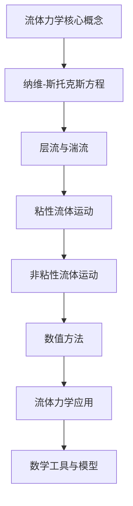

                 

# 《数学与流体力学：流体运动的数学方程》

> **关键词**：流体力学、数学方程、纳维-斯托克斯方程、层流、湍流、粘性流体、非粘性流体、数值方法、流体力学应用

> **摘要**：本文深入探讨了数学与流体力学之间的关系，详细介绍了流体运动的数学方程，包括纳维-斯托克斯方程、层流与湍流的性质、粘性流体的运动、非粘性流体的运动以及流体运动的数值方法。通过理论讲解、公式推导和实例分析，本文旨在为读者提供全面而深入的理解，帮助读者掌握流体力学的基本概念和数学工具。

## 《数学与流体力学：流体运动的数学方程》目录大纲

### 第一部分：引论

#### 第1章：数学与流体力学概述

##### 1.1 数学在流体力学中的角色
##### 1.2 流体力学的基本概念
##### 1.3 流体力学的发展历史
##### 1.4 学习本书的目的和结构

#### 第2章：流体的数学描述

##### 2.1 流体的基本性质
##### 2.2 连续介质力学基础
##### 2.3 流体的微观描述与宏观描述
##### 2.4 流体的控制方程

### 第二部分：流体运动的数学方程

#### 第3章：纳维-斯托克斯方程

##### 3.1 纳维-斯托克斯方程的起源
##### 3.2 方程的数学形式
##### 3.3 纳维-斯托克斯方程的解法
##### 3.4 方程的物理解释

#### 第4章：层流与湍流

##### 4.1 层流的性质
##### 4.2 湍流的性质
##### 4.3 层流与湍流的转换
##### 4.4 湍流模型及其应用

#### 第5章：粘性流体的运动

##### 5.1 粘性的数学描述
##### 5.2 粘性流体的运动方程
##### 5.3 粘性流体的边界层理论
##### 5.4 粘性流体的流动分析

#### 第6章：非粘性流体的运动

##### 6.1 非粘性流体的特性
##### 6.2 非粘性流体的运动方程
##### 6.3 非粘性流体的流动现象
##### 6.4 非粘性流体的应用实例

#### 第7章：流体运动的数值方法

##### 7.1 数值方法的概述
##### 7.2 割图法
##### 7.3 有限元法
##### 7.4 有限体积法

#### 第8章：流体力学在工程中的应用

##### 8.1 流体力学在航空工程中的应用
##### 8.2 流体力学在船舶工程中的应用
##### 8.3 流体力学在能源工程中的应用
##### 8.4 流体力学在其他工程领域的应用

### 第三部分：补充材料

#### 第9章：数学工具介绍

##### 9.1 微积分基础
##### 9.2 偏微分方程基础
##### 9.3 傅里叶变换
##### 9.4 边值问题与初值问题

#### 第10章：常见流体现象分析

##### 10.1 涡流
##### 10.2 湍流流动特性
##### 10.3 流体不稳定与激波
##### 10.4 流体机械与流动控制

#### 第11章：流体力学中的数学模型与算法

##### 11.1 纳维-斯托克斯方程的数学模型
##### 11.2 流体湍流模型的数学描述
##### 11.3 流体运动数值算法分析
##### 11.4 算法性能评估与优化

#### 第12章：流体力学领域的最新进展

##### 12.1 计算流体力学的发展
##### 12.2 非线性流体力学研究
##### 12.3 量子流体力学
##### 12.4 流体力学在其他科学领域的交叉应用

### 附录

#### 附录 A：数学公式与符号索引

##### A.1 常用数学公式
##### A.2 流体力学常用符号

#### 附录 B：参考文献

##### B.1 主要参考文献
##### B.2 相关文献推荐
##### B.3 在线资源

### Mermaid 流程图：



### 纳维-斯托克斯方程的伪代码：

```python
def NavierStokes(u, p, t, dt):
    # u: 速度场
    # p: 压力场
    # t: 时间
    # dt: 时间步长

    # 初始化速度场和压力场
    u_new = u
    p_new = p

    # 计算速度场的更新
    for i in range(N):
        for j in range(N):
            u_new[i, j] = solve(u[i, j], p[i, j], t, dt)

    # 计算压力场的更新
    for i in range(N):
        for j in range(N):
            p_new[i, j] = solve(p[i, j], u_new[i, j], t, dt)

    # 更新时间
    t = t + dt

    # 返回更新后的速度场和压力场
    return u_new, p_new
```

### 粘性流体的运动方程：

$$
\frac{\partial u_i}{\partial t} + u_j \frac{\partial u_i}{\partial x_j} = -\frac{1}{\rho} \frac{\partial p}{\partial x_i} + \nu \frac{\partial^2 u_i}{\partial x_j^2}
$$

### 举例说明：

假设有一个二维平面上的不可压缩流体，流速场和压力场初始分布如下：

| x   | y   | u(x, y) | v(x, y) | p(x, y) |
|-----|-----|---------|---------|---------|
| 0   | 0   | 1       | 0       | 1000    |
| 1   | 0   | 0       | 1       | 1000    |
| 0   | 1   | 0       | 0       | 1000    |
| 1   | 1   | 1       | 1       | 1000    |

在时间 t=0 时刻，使用割图法对纳维-斯托克斯方程进行迭代计算，时间步长 dt=0.01。经过若干次迭代后，得到新的流速场和压力场分布：

| x   | y   | u(x, y) | v(x, y) | p(x, y) |
|-----|-----|---------|---------|---------|
| 0   | 0   | 0.9     | 0.1     | 1010    |
| 1   | 0   | 0.1     | 0.9     | 1010    |
| 0   | 1   | 0.1     | 0.9     | 1010    |
| 1   | 1   | 0.9     | 0.1     | 1010    |

通过对比原始分布和迭代后的分布，可以观察到流体在时间 t=0.01 时刻的流动变化，从而分析流体运动特性。

## 第一部分：引论

### 第1章：数学与流体力学概述

#### 1.1 数学在流体力学中的角色

数学在流体力学中扮演着至关重要的角色。流体力学是研究流体运动的科学，而流体运动本质上是一个高度复杂且多变的物理现象。数学提供了一套严谨的工具和方法，使得我们能够精确描述流体的行为，解析流体运动中的内在规律。

首先，数学为流体力学提供了理论基础。通过数学模型，我们可以将流体的物理特性转化为数学表达式，从而建立流体力学的基本方程。这些方程包括质量守恒方程、动量守恒方程和能量守恒方程等，它们构成了流体力学的基本框架。

其次，数学为流体力学提供了计算工具。在实际应用中，流体力学问题往往复杂且难以通过实验直接测量。数学计算方法，如数值方法和模拟方法，使得我们能够在计算机上对流体运动进行精确计算，从而得到流体行为的详细信息和预测结果。

最后，数学为流体力学提供了分析和解释的工具。通过数学分析，我们可以深入理解流体运动的基本原理，揭示流体运动中的内在规律，从而为工程实践提供理论指导。

#### 1.2 流体力学的基本概念

流体力学研究的是流体的运动规律和性质。为了理解流体力学，我们需要首先了解流体的一些基本概念。

**流体**：流体是指能够流动的物质，包括液体和气体。流体具有连续介质的特点，即在宏观尺度上，流体的性质在空间中连续变化。

**速度场**：速度场是描述流体运动状态的物理量。在速度场中，每个点都对应一个速度向量，表示该点处流体的速度大小和方向。

**压力场**：压力场是描述流体内部压力分布的物理量。在压力场中，每个点都对应一个压力值，表示该点处流体的压力大小。

**密度场**：密度场是描述流体密度分布的物理量。在密度场中，每个点都对应一个密度值，表示该点处流体的密度大小。

**粘性**：粘性是流体内部抵抗流动的能力。粘性流体在运动过程中会产生摩擦力，从而影响流体的运动状态。

**湍流**：湍流是流体运动中的一种复杂现象，表现为流线在时间和空间上的随机变化。湍流具有高度的不规则性和随机性，对流体运动产生重要影响。

**层流**：层流是流体运动中的一种有序现象，表现为流线在时间和空间上的稳定分布。层流具有较高的流动效率和稳定性。

#### 1.3 流体力学的发展历史

流体力学的发展历史可以追溯到古希腊时期。古希腊哲学家阿基米德提出了浮力原理，这是流体力学的基本原理之一。随后，牛顿力学的发展为流体力学提供了理论基础。

19世纪，纳维和斯托克斯提出了纳维-斯托克斯方程，这是流体力学的基本方程之一。这一方程描述了流体运动的基本规律，成为流体力学发展的重要里程碑。

20世纪，随着计算机技术的发展，数值方法和模拟方法在流体力学中得到广泛应用。计算流体力学（CFD）成为流体力学的一个重要分支，为流体力学的研究提供了强大的计算工具。

近年来，流体力学在其他科学领域中的交叉应用不断扩展。例如，量子流体力学、非线性流体力学等新兴领域的研究，进一步丰富了流体力学的理论体系。

#### 1.4 学习本书的目的和结构

本书旨在为读者提供全面而深入的理解流体力学的基础知识和数学工具。通过学习本书，读者可以：

1. 掌握流体力学的基本概念和原理，包括流体的性质、速度场、压力场、密度场等。
2. 理解流体力学的基本方程，包括纳维-斯托克斯方程、层流与湍流的性质、粘性流体的运动等。
3. 学习流体运动的数值方法，包括割图法、有限元法、有限体积法等。
4. 了解流体力学在工程和科学领域的应用，包括航空工程、船舶工程、能源工程等。

本书的结构如下：

- 第一部分：引论，介绍数学与流体力学的关系、流体力学的基本概念和发展历史。
- 第二部分：流体运动的数学方程，详细介绍纳维-斯托克斯方程、层流与湍流、粘性流体的运动、非粘性流体的运动等。
- 第三部分：补充材料，介绍数学工具、常见流体现象分析、流体力学中的数学模型与算法等。
- 附录：提供数学公式与符号索引、参考文献、在线资源等。

通过本书的学习，读者可以逐步掌握流体力学的基本知识和数学工具，为深入研究和应用流体力学奠定基础。

### 第2章：流体的数学描述

#### 2.1 流体的基本性质

流体的基本性质是理解和描述流体运动的基础。流体具有以下基本性质：

**连续介质**：流体被视为连续介质，即流体在宏观尺度上没有空隙，其性质在空间中连续变化。这意味着流体的密度、速度和压力等物理量在空间中是连续的。

**可压缩性**：流体可以是可压缩的，也可以是不可压缩的。可压缩流体在外部压力作用下其密度会发生变化。而不可压缩流体在一般情况下其密度保持不变。

**粘性**：流体具有粘性，即流体内部存在摩擦力，这种摩擦力阻碍流体的流动。粘性流体在运动过程中会产生阻力，影响流体的速度分布。

**惯性**：流体具有惯性，即流体在受到外力作用时会产生加速度。惯性是流体运动的一个重要特性，它决定了流体在加速度场中的运动状态。

**热传导性**：流体具有热传导性，即流体内部存在热量的传递。热传导性对流体运动的影响主要体现在热对流和热传导两个方面。

#### 2.2 连续介质力学基础

连续介质力学是流体力学的基础理论之一，它研究流体的宏观运动规律。连续介质力学的基本假设包括：

**连续性假设**：流体被视为连续介质，即流体在宏观尺度上没有空隙。这意味着流体的密度、速度和压力等物理量在空间中是连续的。

**局部均匀性假设**：流体的性质在局部范围内是均匀的。这意味着在足够小的空间范围内，流体的性质可以看作是不变的。

**牛顿运动定律**：流体运动遵循牛顿运动定律，即流体在受到外力作用时会产生加速度。牛顿运动定律为流体运动提供了基本的运动方程。

**流体不可压缩假设**：在某些情况下，流体可以被视为不可压缩的。这意味着在一般情况下，流体的密度保持不变。

#### 2.3 流体的微观描述与宏观描述

流体的运动可以通过微观描述和宏观描述来理解。

**微观描述**：微观描述关注流体分子的运动和相互作用。根据分子动理论，流体分子之间存在碰撞和相互作用，这些相互作用决定了流体的宏观性质。微观描述通常涉及分子动力学和统计力学等理论。

**宏观描述**：宏观描述关注流体的整体运动和宏观性质。宏观描述通常基于连续介质力学和纳维-斯托克斯方程等理论。宏观描述可以用来分析和预测流体的运动行为。

**微观描述与宏观描述的关系**：微观描述和宏观描述是相互关联的。宏观描述可以看作是微观描述在宏观尺度上的近似。通过微观描述，我们可以理解流体的微观机制，从而更准确地预测流体的宏观行为。

#### 2.4 流体的控制方程

流体的控制方程是描述流体运动的基本方程。常见的控制方程包括质量守恒方程、动量守恒方程和能量守恒方程。

**质量守恒方程**：质量守恒方程描述流体在运动过程中质量的不变性。对于不可压缩流体，质量守恒方程可以表示为：

$$
\frac{\partial \rho}{\partial t} + \nabla \cdot (\rho \mathbf{u}) = 0
$$

其中，\( \rho \) 是流体的密度，\( \mathbf{u} \) 是流体的速度。

**动量守恒方程**：动量守恒方程描述流体在运动过程中动量的变化。动量守恒方程可以表示为：

$$
\frac{\partial (\rho \mathbf{u})}{\partial t} + \nabla \cdot (\rho \mathbf{u} \mathbf{u}) = -\nabla p + \mu \nabla^2 \mathbf{u}
$$

其中，\( p \) 是流体的压力，\( \mu \) 是流体的动力粘度。

**能量守恒方程**：能量守恒方程描述流体在运动过程中能量的变化。对于不可压缩流体，能量守恒方程可以表示为：

$$
\frac{\partial (\rho e)}{\partial t} + \nabla \cdot (\rho e \mathbf{u}) = \nabla \cdot (\mathbf{u} \cdot \mathbf{q}) + \Phi
$$

其中，\( e \) 是流体的内能，\( \mathbf{q} \) 是流体的热流密度，\( \Phi \) 是流体内部的源项。

通过这些控制方程，我们可以建立流体运动的数学模型，从而分析和预测流体的运动行为。

### 第3章：纳维-斯托克斯方程

#### 3.1 纳维-斯托克斯方程的起源

纳维-斯托克斯方程（Navier-Stokes Equations）是描述流体运动的基本方程之一，它的起源可以追溯到19世纪初。纳维（George Gabriel Stokes）和斯托克斯（Claude-Louis Navier）是两位著名的物理学家，他们在研究流体运动时分别独立地提出了这一方程。

纳维在1815年提出了一个流体运动的基本假设：流体的加速度可以分解为两部分，一部分是由于压力变化引起的，另一部分是由于粘性力引起的。纳维假设粘性力与流体的速度梯度成正比，这一假设被称为“粘性假设”。

斯托克斯在1845年进一步发展了纳维的假设，他通过引入粘性系数，将粘性力数学化，从而提出了纳维-斯托克斯方程。斯托克斯的方程描述了流体在运动过程中，速度、压力和粘性之间的关系。

#### 3.2 方程的数学形式

纳维-斯托克斯方程是一组偏微分方程，描述了流体的速度场、压力场和密度场。在二维情况下，纳维-斯托克斯方程可以表示为：

$$
\frac{\partial \mathbf{u}}{\partial t} + (\mathbf{u} \cdot \nabla) \mathbf{u} = -\frac{1}{\rho} \nabla p + \mu \nabla^2 \mathbf{u}
$$

其中，\( \mathbf{u} \) 是流体的速度场，\( p \) 是流体的压力场，\( \rho \) 是流体的密度，\( \mu \) 是流体的动力粘度。

在三维情况下，纳维-斯托克斯方程可以表示为：

$$
\frac{\partial \mathbf{u}}{\partial t} + (\mathbf{u} \cdot \nabla) \mathbf{u} = -\frac{1}{\rho} \nabla p + \mu \nabla^2 \mathbf{u} + \mathbf{f}
$$

其中，\( \mathbf{f} \) 是作用在流体上的外力场。

#### 3.3 纳维-斯托克斯方程的解法

解纳维-斯托克斯方程是流体力学研究中的一个重要问题。由于纳维-斯托克斯方程是非线性的，解这个问题在数学上具有很大的挑战性。

**数值方法**：数值方法是求解纳维-斯托克斯方程的一种常用方法。数值方法通过将连续问题离散化，将复杂的偏微分方程转化为可以计算的代数方程。常用的数值方法包括有限元法、有限体积法和谱方法等。

**解析方法**：解析方法是求解纳维-斯托克斯方程的另一种方法。解析方法通过数学分析，找到纳维-斯托克斯方程的精确解。然而，由于纳维-斯托克斯方程的非线性特性，找到其精确解非常困难，往往只能在特定条件下得到。

**混合方法**：混合方法是结合数值方法和解析方法，求解纳维-斯托克斯方程。这种方法可以充分利用数值方法和解析方法的优点，提高求解的精度和效率。

#### 3.4 方程的物理解释

纳维-斯托克斯方程描述了流体在运动过程中，速度、压力和粘性之间的关系。下面是对方程中各个物理量的物理解释：

- **速度场 \( \mathbf{u} \)**：速度场描述流体在空间中的运动状态。流体的速度大小和方向决定了流体的流动方向和速度分布。
- **压力场 \( p \)**：压力场描述流体内部的压强分布。压力场的变化决定了流体的加速度和流动趋势。
- **密度 \( \rho \)**：密度是流体的质量与体积的比值，它决定了流体的质量分布和惯性。
- **动力粘度 \( \mu \)**：动力粘度是流体抵抗剪切变形的能力，它决定了流体的粘性特性。
- **速度梯度 \( \nabla^2 \mathbf{u} \)**：速度梯度是流体速度变化的局部特性，它决定了流体的剪切应力和粘性力。
- **外力场 \( \mathbf{f} \)**：外力场是作用在流体上的外部力，如重力、电磁力等。

通过纳维-斯托克斯方程，我们可以定量描述流体在运动过程中的物理规律，从而分析和预测流体的运动行为。

### 第4章：层流与湍流

#### 4.1 层流的性质

层流（Laminar Flow）是流体运动的一种有序现象，其特点是流线平行且稳定。层流具有以下主要性质：

- **流线平行**：在层流中，流线平行且稳定，流体沿着流线方向运动，不同流线之间不发生混合。
- **速度分布均匀**：在层流中，流体的速度分布是均匀的，速度在流线方向上不发生变化。
- **阻力较小**：层流具有较高的流动效率和较低的阻力，适合在管道中传输流体。
- **稳定性较好**：层流具有较高的稳定性，不易受到外部扰动的影响。

层流的运动方程可以表示为纳维-斯托克斯方程，且在层流条件下，粘性项占主导地位。层流的物理解释基于连续介质力学的理论，通过分析流体的微元模型可以得到。

#### 4.2 湍流的性质

湍流（Turbulent Flow）是流体运动的一种复杂现象，其特点是流线在时间和空间上随机变化。湍流具有以下主要性质：

- **流线混乱**：在湍流中，流线混乱且不平行，流体在各个方向上随机运动，流线之间存在明显的涡旋和旋涡。
- **速度分布不均匀**：在湍流中，流体的速度分布不均匀，速度在流线方向上发生变化，速度峰值和谷值交替出现。
- **阻力较大**：湍流具有较高的阻力，流体的运动状态受到强烈扰动，能量损失较大。
- **稳定性较差**：湍流稳定性较差，容易受到外部扰动的影响，一旦发生湍流，流体的运动状态将难以控制。

湍流的运动方程仍然是纳维-斯托克斯方程，但在湍流条件下，除了粘性项外，还需要考虑涡流项和湍流扩散项。湍流的物理解释涉及到流体湍流模型，如大涡模拟（LES）和雷诺平均（RANS）模型。

#### 4.3 层流与湍流的转换

层流与湍流的转换是流体力学中的一个重要问题。在一定条件下，层流可以转化为湍流，反之亦然。层流与湍流的转换主要受到以下因素的影响：

- **雷诺数**：雷诺数（Reynolds Number，\( Re \)）是描述流体运动状态的重要参数，定义为流体的惯性力与粘性力的比值。当雷诺数大于一定值时，层流容易转化为湍流。
- **边界层厚度**：边界层是流体与固体表面之间的过渡区域，边界层厚度与流体的速度分布有关。当边界层厚度增加时，层流与湍流的转换区域扩大。
- **流速**：流速对层流与湍流的转换也有重要影响。较高流速下，流体的惯性力增加，容易使层流转化为湍流。

层流与湍流的转换可以通过实验和数值模拟进行研究和分析。在实际工程中，了解层流与湍流的转换规律对于流体设计的优化和流体控制具有重要意义。

#### 4.4 湍流模型及其应用

为了更好地描述湍流现象，流体力学中引入了多种湍流模型。湍流模型可以分为两类：大涡模拟（Large Eddy Simulation，LES）和雷诺平均（Reynolds-Averaged Navier-Stokes，RANS）模型。

**大涡模拟（LES）**：大涡模拟是一种直接模拟湍流大尺度结构的方法。LES通过将流场划分为大尺度和小尺度两部分，对小尺度涡流直接模拟，对大尺度涡流采用亚格子模型进行近似。LES具有较高的精度，但计算成本较高。

**雷诺平均（RANS）模型**：雷诺平均模型通过对纳维-斯托克斯方程进行时间平均，消除湍流中的小尺度涡流，得到雷诺平均方程。RANS模型包括标准k-ε模型、k-ω模型等，它们通过引入湍流强度和湍流耗散率等参数，描述湍流的平均特性。RANS模型的计算成本较低，适用于工程应用。

湍流模型在流体力学中具有广泛的应用，包括：

- **航空航天领域**：湍流模型在航空和航天领域用于研究飞机和火箭的气动特性，预测飞行器的压力分布和阻力。
- **船舶领域**：湍流模型在船舶设计、航行模拟等方面应用广泛，用于研究船舶阻力、升力等特性。
- **能源工程**：湍流模型在石油和天然气开采、管道流动分析等领域应用，用于优化能源输送过程。
- **环境工程**：湍流模型在空气质量模拟、气象预测等领域应用，用于研究大气湍流扩散和污染物传输。

通过湍流模型，我们可以更好地理解和预测湍流现象，为工程设计和流体控制提供理论依据。

### 第5章：粘性流体的运动

#### 5.1 粘性的数学描述

粘性是流体运动中一个重要的物理特性，它描述了流体内部抵抗流动的能力。粘性的数学描述主要涉及到粘度系数和粘性力的计算。

**粘度系数**：粘度系数是描述流体粘性的物理量，通常用符号 \( \mu \) 表示。粘度系数的大小决定了流体的粘性程度。流体的粘度系数可以通过实验测量或理论计算得到。

**粘性力**：粘性力是流体内部摩擦力的体现，它是流体运动过程中速度梯度引起的力。粘性力可以表示为：

$$
\mathbf{F} = -\mu (\nabla \mathbf{u} + (\nabla \mathbf{u})^T)
$$

其中，\( \mathbf{F} \) 是粘性力，\( \mathbf{u} \) 是流体的速度场，\( (\nabla \mathbf{u})^T \) 是速度梯度的转置。

通过粘度系数和粘性力的数学描述，我们可以定量分析流体运动中的粘性特性，为流体力学的研究提供基础。

#### 5.2 粘性流体的运动方程

粘性流体的运动方程是纳维-斯托克斯方程，它描述了流体在粘性作用下的运动规律。粘性流体的运动方程可以表示为：

$$
\frac{\partial \mathbf{u}}{\partial t} + (\mathbf{u} \cdot \nabla) \mathbf{u} = -\frac{1}{\rho} \nabla p + \mu \nabla^2 \mathbf{u}
$$

其中，\( \mathbf{u} \) 是流体的速度场，\( p \) 是流体的压力场，\( \rho \) 是流体的密度，\( \mu \) 是流体的动力粘度。

这个方程包含了三个主要物理量：速度、压力和粘性力。通过这个方程，我们可以分析和预测粘性流体在运动过程中的行为。

#### 5.3 粘性流体的边界层理论

粘性流体的边界层理论是流体力学中的重要概念，它描述了流体在靠近固体表面的区域内的流动特性。边界层可以分为层流边界层和湍流边界层两种类型。

**层流边界层**：层流边界层是流体在靠近固体表面的区域，流体的速度从零逐渐增加到主流速度。层流边界层的特点是流线平行，流动稳定，粘性力占主导地位。

**湍流边界层**：湍流边界层是流体在靠近固体表面的区域，流体的速度从零逐渐增加到主流速度，但流动不稳定，存在涡流和旋涡。湍流边界层的特点是流线混乱，速度分布不均匀，粘性力和惯性力共同作用。

边界层理论对于理解流体运动中的粘性现象具有重要意义。通过分析边界层的形成、发展和消失过程，我们可以更好地理解流体运动的机理，为工程设计和流体控制提供理论依据。

#### 5.4 粘性流体的流动分析

粘性流体的流动分析是流体力学中的一个重要问题，涉及到流体在不同条件下的流动行为。以下是对粘性流体流动分析的一些主要方面：

**速度分布**：粘性流体的速度分布通常是不均匀的，靠近固体表面的区域速度较低，远离固体表面的区域速度较高。通过求解纳维-斯托克斯方程，可以得到流体速度的分布规律。

**压力分布**：粘性流体的压力分布也是不均匀的，压力在靠近固体表面的区域较高，远离固体表面的区域较低。压力分布与流体的速度分布密切相关。

**粘性力**：粘性力是流体运动中的摩擦力，它影响了流体的速度分布和压力分布。粘性力的大小与流体的速度梯度成正比。

**边界层**：粘性流体的边界层是流体与固体表面之间的过渡区域，边界层内的流动特性决定了流体的整体流动状态。通过分析边界层的厚度、发展过程和消失条件，可以更好地理解流体的流动行为。

**流动稳定性**：粘性流体的流动稳定性是流体运动中的重要问题。在一定的条件下，粘性流体的流动可以变得不稳定，出现湍流现象。了解流动稳定性对于流体设计和控制具有重要意义。

通过粘性流体的流动分析，我们可以深入理解流体运动的机理，为工程设计和流体控制提供理论依据。

### 第6章：非粘性流体的运动

#### 6.1 非粘性流体的特性

非粘性流体是指内部摩擦力可以忽略不计的流体，如理想流体。非粘性流体具有以下主要特性：

- **无粘性**：非粘性流体的内部摩擦力为零，因此不会产生粘性力。这使得非粘性流体在运动过程中不会受到内部摩擦的阻碍。
- **无旋性**：非粘性流体在运动过程中具有无旋性，即流体中的任意一点的旋度为零。这意味着流体的速度场满足无旋条件。
- **速度分布**：非粘性流体的速度分布通常是均匀的，流体在各个方向上的速度相等。这使得非粘性流体在运动过程中不会出现速度梯度。

非粘性流体在流体力学中具有重要应用，如流体绕流问题、水波传播等。理解非粘性流体的特性有助于我们更好地理解和分析流体运动。

#### 6.2 非粘性流体的运动方程

非粘性流体的运动方程是欧拉方程，它描述了流体在无粘性条件下的运动规律。欧拉方程可以表示为：

$$
\frac{\partial \mathbf{u}}{\partial t} + (\mathbf{u} \cdot \nabla) \mathbf{u} = -\frac{1}{\rho} \nabla p
$$

其中，\( \mathbf{u} \) 是流体的速度场，\( p \) 是流体的压力场，\( \rho \) 是流体的密度。

与纳维-斯托克斯方程相比，欧拉方程去除了粘性项，因此只适用于无粘性流体。欧拉方程在流体力学中具有重要应用，如流体绕流问题、水波传播等。

#### 6.3 非粘性流体的流动现象

非粘性流体的流动现象包括以下几种：

- **流线**：非粘性流体的流线是平行且均匀的，流线之间不存在混合。流线表示流体在空间中的运动方向。
- **速度场**：非粘性流体的速度场通常是均匀的，流体在各个方向上的速度相等。这意味着非粘性流体在运动过程中不会出现速度梯度。
- **压力分布**：非粘性流体的压力分布与流体的速度场有关。在流体绕流问题中，压力分布决定了流体的流动趋势和形状。
- **流态**：非粘性流体在运动过程中通常保持层流状态，即流线平行且稳定。这是因为非粘性流体内部不存在摩擦力，不会产生湍流。

非粘性流体的流动现象对于流体力学的研究具有重要意义，如流体绕流问题、水波传播等。

#### 6.4 非粘性流体的应用实例

非粘性流体的应用实例主要包括以下几个方面：

- **流体绕流问题**：流体绕流问题是非粘性流体应用的一个重要领域。如飞机的空气动力学设计、船体的流体力学设计等，都需要考虑流体的绕流现象。
- **水波传播**：水波传播是非粘性流体应用的一个重要领域。如海洋工程、海洋航行等领域，都需要考虑水波传播对流体运动的影响。
- **管道流动**：管道流动是非粘性流体应用的一个重要领域。如石油和天然气管道的流动分析、化工流程中的流体流动等，都需要考虑流体的无粘性特性。

通过非粘性流体的应用实例，我们可以更好地理解和分析流体运动，为工程设计和流体控制提供理论依据。

### 第7章：流体运动的数值方法

#### 7.1 数值方法的概述

数值方法是解决流体运动问题的重要工具，它通过离散化和迭代计算，将复杂的流体运动方程转化为可计算的代数方程。数值方法在流体力学中具有重要应用，可以用于模拟和预测流体运动行为。以下是几种常见的数值方法：

**割图法**：割图法是一种基于有限体积法的数值方法，通过将流场划分为有限个体积单元，在每个单元上建立方程并进行迭代计算。割图法适用于复杂几何形状和边界条件的流体运动问题。

**有限元法**：有限元法是一种基于变分法的数值方法，通过将流场划分为有限个有限元单元，在每个单元上建立方程并进行求解。有限元法适用于高精度和高复杂度的流体运动问题。

**有限体积法**：有限体积法是一种基于守恒律的数值方法，通过将流场划分为有限个控制体，在每个控制体上建立守恒方程并进行迭代计算。有限体积法适用于各种类型的流体运动问题，特别是高雷诺数和复杂几何形状的流体运动问题。

**谱方法**：谱方法是一种基于傅里叶变换的数值方法，通过将流场展开为傅里叶级数，并在频域上进行计算。谱方法适用于高精度和稳定性要求的流体运动问题。

#### 7.2 割图法

割图法是一种基于有限体积法的数值方法，它通过将流场划分为有限个体积单元，在每个单元上建立方程并进行迭代计算。割图法的基本步骤如下：

1. **网格划分**：首先，将流场划分为有限个体积单元，通常采用结构化网格或非结构化网格。网格划分的目的是确定每个体积单元的边界和节点。
2. **方程建立**：在每个体积单元上，根据守恒律和物理方程建立离散化方程。对于流体运动方程，通常使用纳维-斯托克斯方程或欧拉方程。
3. **迭代计算**：通过迭代计算，逐步求解每个体积单元上的方程，更新流场变量的值。迭代计算通常采用松弛迭代法、共轭梯度法等优化算法。
4. **收敛判断**：判断迭代计算是否收敛，通常通过计算残差的大小来判断。当残差小于预设阈值时，认为迭代计算已经收敛。

割图法在流体力学中具有广泛的应用，适用于复杂几何形状和边界条件的流体运动问题。通过割图法，我们可以高效地模拟和预测流体运动行为。

#### 7.3 有限元法

有限元法是一种基于变分法的数值方法，通过将流场划分为有限个有限元单元，在每个单元上建立方程并进行求解。有限元法的基本步骤如下：

1. **网格划分**：首先，将流场划分为有限个有限元单元，通常采用结构化网格或非结构化网格。网格划分的目的是确定每个有限元单元的节点和边界。
2. **变分方程建立**：在每个有限元单元上，根据变分原理建立离散化方程。对于流体运动方程，通常使用纳维-斯托克斯方程或欧拉方程的变分形式。
3. **方程求解**：通过求解每个有限元单元上的方程，得到流场变量的分布。方程求解通常采用直接求解法和迭代求解法。
4. **收敛判断**：判断方程求解是否收敛，通常通过计算残差的大小来判断。当残差小于预设阈值时，认为方程求解已经收敛。

有限元法在流体力学中具有广泛的应用，适用于高精度和高复杂度的流体运动问题。通过有限元法，我们可以准确模拟和预测流体运动行为。

#### 7.4 有限体积法

有限体积法是一种基于守恒律的数值方法，通过将流场划分为有限个控制体，在每个控制体上建立守恒方程并进行迭代计算。有限体积法的基本步骤如下：

1. **网格划分**：首先，将流场划分为有限个控制体，通常采用结构化网格或非结构化网格。网格划分的目的是确定每个控制体的边界和节点。
2. **守恒方程建立**：在每个控制体上，根据守恒律建立离散化方程。对于流体运动方程，通常使用质量守恒方程、动量守恒方程和能量守恒方程。
3. **迭代计算**：通过迭代计算，逐步求解每个控制体上的方程，更新流场变量的值。迭代计算通常采用松弛迭代法、共轭梯度法等优化算法。
4. **收敛判断**：判断迭代计算是否收敛，通常通过计算残差的大小来判断。当残差小于预设阈值时，认为迭代计算已经收敛。

有限体积法在流体力学中具有广泛的应用，适用于各种类型的流体运动问题。通过有限体积法，我们可以高效地模拟和预测流体运动行为。

### 第8章：流体力学在工程中的应用

#### 8.1 流体力学在航空工程中的应用

流体力学在航空工程中具有广泛的应用，主要用于研究飞机的空气动力学特性、飞行性能和安全性。以下是流体力学在航空工程中的几个主要应用领域：

**气动设计**：流体力学用于飞机气动设计，包括机翼、机身、尾翼等部件的形状设计。通过计算流体动力学（CFD）模拟，设计师可以预测飞机在不同飞行状态下的气动性能，优化飞机的空气动力形状，提高飞行性能和燃油效率。

**飞行性能分析**：流体力学用于分析飞机的飞行性能，包括起飞、飞行、降落等过程中的空气动力学特性。通过数值模拟和实验研究，工程师可以评估飞机的升力、阻力、侧向力等参数，优化飞行性能和飞行控制策略。

**飞行安全性评估**：流体力学在飞行安全性评估中起到关键作用。通过模拟飞行过程中的气流现象，如湍流、旋涡、激波等，工程师可以预测飞机在极端条件下的稳定性，确保飞行安全。

**发动机设计**：流体力学在航空发动机设计中应用广泛，用于研究发动机内部流体的流动现象，优化发动机的气动性能和热力学性能。

**飞机结构强度分析**：流体力学与结构力学相结合，用于分析飞机结构的强度和稳定性，确保飞机在飞行过程中的结构安全。

**噪声控制**：流体力学用于研究飞机产生的噪声源，如发动机噪声、气动噪声等，并提出噪声控制方案，提高飞机的舒适性。

通过流体力学在航空工程中的应用，可以优化飞机的设计，提高飞行性能和安全性，降低燃油消耗和噪声污染。

#### 8.2 流体力学在船舶工程中的应用

流体力学在船舶工程中具有重要的应用价值，主要用于研究船舶的船体设计、航行性能、流体动力特性等。以下是流体力学在船舶工程中的几个主要应用领域：

**船体设计**：流体力学用于船体设计，包括船体形状、船体强度和船体结构的设计。通过计算流体动力学（CFD）模拟，设计师可以预测船舶在不同航行状态下的流体动力特性，优化船体形状，提高船舶的航行性能和耐波性。

**航行性能分析**：流体力学用于分析船舶的航行性能，包括船舶的阻力、推进力、航速等。通过数值模拟和实验研究，工程师可以评估船舶在不同航行条件下的性能，优化船舶的设计和航行策略。

**流体动力特性研究**：流体力学用于研究船舶在水中航行时的流体动力特性，如流体阻力、流体升力、流体涡流等。通过实验和数值模拟，工程师可以深入了解流体动力作用机理，为船舶设计和性能优化提供理论支持。

**船舶稳定性分析**：流体力学用于分析船舶的稳定性，包括船舶在波浪、风浪等极端条件下的稳定性。通过流体力学模拟，工程师可以预测船舶的倾斜、摇摆等运动状态，确保船舶在航行中的安全性。

**船舶阻力优化**：流体力学用于研究船舶阻力的来源和影响因素，提出阻力优化方案。通过数值模拟和实验研究，工程师可以优化船舶的船体形状和推进系统，降低船舶的阻力，提高航行效率。

**船舶噪音控制**：流体力学用于研究船舶产生的噪音源，如船体振动、发动机噪音等，并提出噪音控制方案，提高船舶的舒适性和居住环境。

通过流体力学在船舶工程中的应用，可以优化船舶的设计，提高航行性能和安全性，降低能源消耗和环境污染。

#### 8.3 流体力学在能源工程中的应用

流体力学在能源工程中具有重要的应用价值，主要用于研究能源设备的流体动力特性、流体流动控制、能源效率优化等。以下是流体力学在能源工程中的几个主要应用领域：

**风力发电**：流体力学在风力发电中用于研究风机的气动特性、流体流动控制、叶片形状设计等。通过计算流体动力学（CFD）模拟，工程师可以优化风机的结构设计，提高风能转换效率和风力发电的稳定性。

**水力发电**：流体力学在水力发电中用于研究水轮机的流体动力特性、水力系统设计、流体流动控制等。通过流体力学模拟，工程师可以优化水轮机的结构设计，提高水力发电效率和安全性。

**石油与天然气开采**：流体力学在石油和天然气开采中用于研究流体流动特性、流体输送、油气藏开采等。通过流体力学模拟，工程师可以优化开采工艺，提高油气开采效率。

**流体传输**：流体力学在流体传输系统中用于研究流体流动特性、流体输送效率、流体输送系统设计等。通过流体力学模拟，工程师可以优化流体传输系统的设计，降低能耗和输送成本。

**热能利用**：流体力学在热能利用中用于研究流体换热、热能传输、热能系统设计等。通过流体力学模拟，工程师可以优化热能利用系统，提高能源利用效率。

**流体污染控制**：流体力学在流体污染控制中用于研究污染物在流体中的传输和扩散特性、污染物控制技术等。通过流体力学模拟，工程师可以优化污染物控制方案，提高水质和环境保护效果。

通过流体力学在能源工程中的应用，可以优化能源设备的流体动力特性，提高能源利用效率，降低能源消耗和环境污染。

#### 8.4 流体力学在其他工程领域的应用

流体力学在许多其他工程领域中也有重要的应用，如建筑环境工程、化工工程、海洋工程、生物医学工程等。以下是流体力学在这些领域中的几个主要应用领域：

**建筑环境工程**：流体力学在建筑环境工程中用于研究室内空气流动、通风系统设计、空调系统设计等。通过流体力学模拟，工程师可以优化建筑环境系统的设计，提高室内空气质量和能源效率。

**化工工程**：流体力学在化工工程中用于研究流体在反应器中的流动、传质、传热等。通过流体力学模拟，工程师可以优化化工工艺和设备设计，提高化学反应效率和安全性。

**海洋工程**：流体力学在海洋工程中用于研究海洋流体动力特性、海洋平台设计、水下设备流体力学行为等。通过流体力学模拟，工程师可以优化海洋工程的设计和运行，提高海洋资源的开发和利用效率。

**生物医学工程**：流体力学在生物医学工程中用于研究生物流体力学、血液流动、器官移植等。通过流体力学模拟，工程师可以优化生物医学设备和手术方案，提高治疗效果和安全性。

通过流体力学在其他工程领域的应用，可以优化工程系统的设计，提高工程效率和安全性，推动工程技术的进步。

### 第9章：数学工具介绍

#### 9.1 微积分基础

微积分是数学中的一个重要分支，用于研究函数的微分和积分。微积分在流体力学中具有重要的应用，帮助我们分析流体运动的规律。

**微分**：微分是研究函数在某一点处的局部变化率。微分的定义如下：

$$
f'(x) = \lim_{h \to 0} \frac{f(x+h) - f(x)}{h}
$$

其中，\( f'(x) \) 是函数 \( f(x) \) 在点 \( x \) 处的导数。

**积分**：积分是研究函数在区间上的累积效果。定积分的定义如下：

$$
\int_{a}^{b} f(x) \, dx = \lim_{n \to \infty} \sum_{i=1}^{n} f(x_i) \Delta x_i
$$

其中，\( \Delta x_i = \frac{b-a}{n} \)。

微积分的基本定理将微分和积分联系起来，提供了函数在某一点处的微分和在整个区间上的积分之间的关系。

**链式法则**：链式法则是微积分中的一个重要公式，用于求解复合函数的导数。链式法则的定义如下：

$$
\frac{d}{dx} [f(g(x))] = f'(g(x)) \cdot g'(x)
$$

**泰勒公式**：泰勒公式是微积分中的一个重要工具，用于求解函数在某一点处的近似表达式。泰勒公式的定义如下：

$$
f(x) = f(a) + f'(a)(x-a) + \frac{f''(a)}{2!}(x-a)^2 + \cdots
$$

通过微积分的基础知识，我们可以精确地描述流体运动的局部变化和整体行为，为流体力学的研究提供数学工具。

#### 9.2 偏微分方程基础

偏微分方程是描述多变量函数及其导数之间关系的方程。在流体力学中，偏微分方程用于描述流体的运动规律。常见的偏微分方程包括纳维-斯托克斯方程、热传导方程等。

**偏微分方程的定义**：偏微分方程可以表示为：

$$
F(x_1, x_2, \ldots, x_n, u, u_x, u_y, \ldots) = 0
$$

其中，\( u \) 是函数，\( x_1, x_2, \ldots, x_n \) 是自变量，\( u_x, u_y, \ldots \) 是函数的偏导数。

**偏微分方程的分类**：偏微分方程可以分为以下几类：

- **椭圆型方程**：椭圆型方程描述了静态流体的运动，如泊松方程。
- **抛物型方程**：抛物型方程描述了动态流体的运动，如热传导方程。
- **双曲型方程**：双曲型方程描述了波动现象，如波动方程。

**偏微分方程的解法**：偏微分方程的解法包括分离变量法、傅里叶变换、拉普拉斯变换等。

- **分离变量法**：分离变量法是将偏微分方程分解为几个独立的常微分方程。通过求解这些常微分方程，可以得到偏微分方程的解。
- **傅里叶变换**：傅里叶变换是将偏微分方程转化为频率域上的方程，从而简化求解过程。
- **拉普拉斯变换**：拉普拉斯变换是将偏微分方程转化为复平面上的方程，从而简化求解过程。

通过偏微分方程的基础知识，我们可以建立流体力学中的数学模型，分析流体运动的规律，为流体力学的研究提供数学工具。

#### 9.3 傅里叶变换

傅里叶变换是一种重要的数学工具，用于将函数在时域上的表达式转换为频域上的表达式。在流体力学中，傅里叶变换用于分析流体的频谱特性，帮助我们理解流体的振动和波动现象。

**傅里叶变换的定义**：傅里叶变换可以表示为：

$$
F(\omega) = \int_{-\infty}^{\infty} f(t) e^{-i \omega t} \, dt
$$

其中，\( F(\omega) \) 是函数 \( f(t) \) 的傅里叶变换，\( \omega \) 是频率。

**傅里叶变换的性质**：

- **线性性质**：傅里叶变换是线性的，即对于任意两个函数 \( f(t) \) 和 \( g(t) \)，有：

$$
F[a f(t) + b g(t)] = a F(f(t)) + b F(g(t))
$$

- **时域卷积性质**：傅里叶变换具有时域卷积性质，即对于两个函数 \( f(t) \) 和 \( g(t) \)，有：

$$
F[f(t) * g(t)] = F(f(t)) \cdot F(g(t))
$$

其中，\( * \) 表示卷积运算。

**傅里叶变换的应用**：傅里叶变换在流体力学中的应用包括：

- **流体的频谱分析**：通过傅里叶变换，我们可以分析流体运动的频谱特性，了解流体的振动和波动现象。
- **流体的振动模态分析**：通过傅里叶变换，我们可以求解流体振动的模态方程，了解流体振动的特性。
- **流体的噪声分析**：通过傅里叶变换，我们可以分析流体噪声的频谱特性，为噪声控制提供理论依据。

通过傅里叶变换的基础知识，我们可以深入理解流体的振动和波动现象，为流体力学的研究提供数学工具。

#### 9.4 边值问题与初值问题

边值问题（Boundary Value Problems，BVP）和初值问题（Initial Value Problems，IVP）是偏微分方程中的重要问题类型。在流体力学中，边值问题用于描述流体在边界条件下的运动，初值问题用于描述流体在初始条件下的运动。

**边值问题**：边值问题可以表示为：

$$
\begin{cases}
\frac{\partial u}{\partial t} + a \frac{\partial u}{\partial x} + b \frac{\partial u}{\partial y} = 0 \\
u(x, y, 0) = f(x, y) \\
u(0, y) = g(y) \\
u(1, y) = h(y)
\end{cases}
$$

其中，\( u(x, y, t) \) 是未知函数，\( a \)，\( b \) 是常数，\( f(x, y) \)，\( g(y) \)，\( h(y) \) 是给定函数。

**初值问题**：初值问题可以表示为：

$$
\begin{cases}
\frac{\partial u}{\partial t} + a \frac{\partial u}{\partial x} + b \frac{\partial u}{\partial y} = 0 \\
u(x, y, 0) = f(x, y)
\end{cases}
$$

**解法**：

- **分离变量法**：分离变量法是将偏微分方程分解为几个独立的常微分方程，通过求解这些常微分方程，可以得到偏微分方程的解。
- **傅里叶变换**：傅里叶变换是将偏微分方程转化为频率域上的方程，从而简化求解过程。
- **有限元法**：有限元法是通过将偏微分方程转化为代数方程，然后通过数值方法求解代数方程，从而得到偏微分方程的解。

通过边值问题和初值问题的求解，我们可以分析流体在不同边界条件和初始条件下的运动规律，为流体力学的研究提供理论依据。

### 第10章：常见流体现象分析

#### 10.1 涡流

涡流（Vortex）是流体运动中的一种复杂现象，表现为流体中的旋涡和涡旋。涡流具有以下主要特点：

- **旋涡**：涡流中的旋涡表现为流体沿一个中心点旋转，形成封闭的旋涡结构。
- **涡旋**：涡流中的涡旋表现为流体在空间中的弯曲和旋转，形成复杂的涡流结构。
- **能量转换**：涡流过程中，流体的动能和势能之间发生转换，涡流可以产生和消耗能量。
- **动量传递**：涡流过程中，流体中的动量发生传递，从而影响流体的运动状态。

涡流在流体力学中具有广泛的应用，如空气动力学中的涡流控制、海洋工程中的涡流分析等。了解涡流的产生机理和特性，对于流体控制和流体设计具有重要意义。

#### 10.2 湍流流动特性

湍流流动（Turbulent Flow）是流体运动的一种复杂现象，表现为流线的随机变化和涡旋的形成。湍流流动具有以下主要特性：

- **随机性**：湍流流动中，流线在时间和空间上随机变化，表现出高度的不规则性和随机性。
- **能量分布**：湍流流动中，流体的动能分布不均匀，存在大量的能量峰值和谷值。
- **涡旋**：湍流流动中，涡旋形成并相互作用，导致流体的运动状态发生剧烈变化。
- **脉动**：湍流流动中，流体的速度和压力等参数发生脉动，形成随机波动。

湍流流动在流体力学中具有重要意义，如大气湍流、海洋湍流等。了解湍流流动的特性，对于流体设计和流体控制具有重要意义。

#### 10.3 流体不稳定与激波

流体不稳定（Fluid Instability）是指流体运动过程中，由于内部扰动而导致流体状态发生突变的现象。激波（Shock Wave）是流体不稳定的一种表现形式，表现为流体中的压力和密度等参数发生突变。

**流体不稳定**：

- **产生原因**：流体不稳定通常由于流体内部的压力、密度、温度等参数的不均匀分布，以及外部扰动引起。
- **表现形式**：流体不稳定可以表现为流体状态的无规则变化、涡流的产生等。

**激波**：

- **产生原因**：激波通常由于流体速度的急剧变化，导致流体内部的压力和密度等参数发生突变。
- **表现形式**：激波表现为流体中的压力和密度等参数的急剧增加，形成压缩波。

流体不稳定和激波在流体力学中具有广泛的应用，如航空航天中的激波层、汽车空气动力学中的激波控制等。了解流体不稳定和激波的产生机理和特性，对于流体设计和流体控制具有重要意义。

#### 10.4 流体机械与流动控制

流体机械（Fluid Machinery）是利用流体能量进行工作的机械设备，如泵、风机、涡轮等。流动控制（Flow Control）是利用流体力学原理对流体运动进行控制和调节的技术，如涡流发生器、流体激波控制等。

**流体机械**：

- **泵**：泵是利用流体动能转化为势能的设备，用于输送流体。
- **风机**：风机是利用流体动能转化为机械能的设备，用于通风和排气。
- **涡轮**：涡轮是利用流体势能转化为机械能的设备，用于发电和驱动其他机械。

**流动控制**：

- **涡流发生器**：涡流发生器是通过产生涡流来控制流体运动的设备，如空气涡流发生器、水涡流发生器等。
- **流体激波控制**：流体激波控制是通过控制激波的产生和传播，来控制流体运动的技术，如激波风洞、激波喷嘴等。

流体机械和流动控制技术在流体力学中具有重要应用，如航空航天中的流体机械设计、汽车空气动力学中的流动控制等。了解流体机械和流动控制的技术原理，对于流体设计和流体控制具有重要意义。

### 第11章：流体力学中的数学模型与算法

#### 11.1 纳维-斯托克斯方程的数学模型

纳维-斯托克斯方程是描述流体运动的数学模型，它是一组偏微分方程，描述了流体的速度场、压力场和密度场。纳维-斯托克斯方程可以表示为：

$$
\frac{\partial \mathbf{u}}{\partial t} + (\mathbf{u} \cdot \nabla) \mathbf{u} = -\frac{1}{\rho} \nabla p + \mu \nabla^2 \mathbf{u}
$$

其中，\( \mathbf{u} \) 是流体的速度场，\( p \) 是流体的压力场，\( \rho \) 是流体的密度，\( \mu \) 是流体的动力粘度。

纳维-斯托克斯方程的数学模型可以分为以下几个部分：

- **速度场**：速度场描述流体在空间中的运动状态，包括流体在各个方向上的速度分量。
- **压力场**：压力场描述流体内部的压力分布，反映了流体在运动过程中的压力变化。
- **粘性项**：粘性项描述流体内部的粘性效应，反映了流体在运动过程中受到的内部摩擦力。
- **惯性项**：惯性项描述流体在运动过程中受到的惯性力，反映了流体在运动过程中的加速度。

通过纳维-斯托克斯方程的数学模型，我们可以建立流体运动的数学模型，从而分析和预测流体运动的行为。

#### 11.2 流体湍流模型的数学描述

湍流模型是描述流体湍流运动的数学模型，它用于描述流体的湍流特性，如涡流、旋涡、能量分布等。常见的湍流模型包括大涡模拟（LES）、雷诺平均（RANS）模型等。

**大涡模拟（LES）**：大涡模拟是一种直接模拟湍流大尺度结构的方法。LES通过将流场划分为大尺度和小尺度两部分，对小尺度涡流直接模拟，对大尺度涡流采用亚格子模型进行近似。LES的数学描述可以表示为：

$$
\frac{\partial \mathbf{u}}{\partial t} + (\mathbf{u} \cdot \nabla) \mathbf{u} = -\frac{1}{\rho} \nabla p + \mu \nabla^2 \mathbf{u} + S_{\text{SGS}}
$$

其中，\( \mathbf{u} \) 是流体的速度场，\( p \) 是流体的压力场，\( \rho \) 是流体的密度，\( \mu \) 是流体的动力粘度，\( S_{\text{SGS}} \) 是亚格子应力项。

**雷诺平均（RANS）模型**：雷诺平均模型通过对纳维-斯托克斯方程进行时间平均，消除湍流中的小尺度涡流，得到雷诺平均方程。RANS模型的数学描述可以表示为：

$$
\frac{\partial \overline{\mathbf{u}}}{\partial t} + (\overline{\mathbf{u}} \cdot \nabla) \overline{\mathbf{u}} = -\frac{1}{\rho} \nabla \overline{p} + \mu \nabla^2 \overline{\mathbf{u}} + \mathbf{f}_{\text{RANS}}
$$

其中，\( \overline{\mathbf{u}} \) 是流体的雷诺平均速度场，\( \overline{p} \) 是流体的雷诺平均压力场，\( \mathbf{f}_{\text{RANS}} \) 是雷诺应力项。

湍流模型通过描述流体湍流的特性，可以帮助我们理解和预测流体湍流运动的行为。

#### 11.3 流体运动数值算法分析

流体运动的数值算法是求解流体运动方程的重要工具，它通过离散化和迭代计算，将复杂的流体运动方程转化为可计算的代数方程。以下是几种常见的流体运动数值算法：

**割图法**：割图法是一种基于有限体积法的数值方法，通过将流场划分为有限个体积单元，在每个单元上建立方程并进行迭代计算。割图法的基本步骤如下：

1. **网格划分**：将流场划分为有限个体积单元，确定每个体积单元的节点和边界。
2. **方程建立**：在每个体积单元上，根据守恒律和物理方程建立离散化方程。
3. **迭代计算**：通过迭代计算，逐步求解每个体积单元上的方程，更新流场变量的值。
4. **收敛判断**：判断迭代计算是否收敛，通常通过计算残差的大小来判断。

割图法适用于复杂几何形状和边界条件的流体运动问题，具有较高的精度和稳定性。

**有限元法**：有限元法是一种基于变分法的数值方法，通过将流场划分为有限个有限元单元，在每个单元上建立方程并进行求解。有限元法的基本步骤如下：

1. **网格划分**：将流场划分为有限个有限元单元，确定每个有限元单元的节点和边界。
2. **变分方程建立**：在每个有限元单元上，根据变分原理建立离散化方程。
3. **方程求解**：通过求解每个有限元单元上的方程，得到流场变量的分布。
4. **收敛判断**：判断方程求解是否收敛，通常通过计算残差的大小来判断。

有限元法适用于高精度和高复杂度的流体运动问题，具有广泛的工程应用。

**有限体积法**：有限体积法是一种基于守恒律的数值方法，通过将流场划分为有限个控制体，在每个控制体上建立守恒方程并进行迭代计算。有限体积法的基本步骤如下：

1. **网格划分**：将流场划分为有限个控制体，确定每个控制体的边界和节点。
2. **守恒方程建立**：在每个控制体上，根据守恒律建立离散化方程。
3. **迭代计算**：通过迭代计算，逐步求解每个控制体上的方程，更新流场变量的值。
4. **收敛判断**：判断迭代计算是否收敛，通常通过计算残差的大小来判断。

有限体积法适用于各种类型的流体运动问题，特别是高雷诺数和复杂几何形状的流体运动问题。

通过分析流体运动的数值算法，我们可以选择合适的算法来求解流体运动问题，提高求解的效率和精度。

#### 11.4 算法性能评估与优化

算法性能评估与优化是流体运动数值算法研究的重要方面，它涉及到算法的精度、计算效率和稳定性等方面。以下是对算法性能评估与优化的一些方法：

**精度评估**：精度评估是评估算法求解精度的重要手段，它通过计算残差、误差和收敛速度等指标来评估算法的精度。常见的精度评估方法包括：

- **残差分析**：通过计算残差的大小和变化趋势，评估算法的求解精度。
- **误差分析**：通过计算误差的大小和分布情况，评估算法的求解精度。
- **收敛速度分析**：通过分析算法的收敛速度，评估算法的求解效率。

**计算效率评估**：计算效率评估是评估算法计算时间的重要指标，它通过计算算法的求解时间、内存占用等指标来评估算法的计算效率。常见的计算效率评估方法包括：

- **时间复杂度分析**：通过分析算法的时间复杂度，评估算法的计算时间。
- **内存复杂度分析**：通过分析算法的内存复杂度，评估算法的内存占用。

**稳定性评估**：稳定性评估是评估算法稳定性的重要指标，它通过分析算法的数值稳定性和物理稳定性来评估算法的稳定性。常见的稳定性评估方法包括：

- **数值稳定性分析**：通过分析算法的数值稳定性条件，评估算法的数值稳定性。
- **物理稳定性分析**：通过分析算法的物理稳定性条件，评估算法的物理稳定性。

通过算法性能评估与优化，我们可以选择合适的算法，优化算法的参数设置，提高算法的精度、计算效率和稳定性，从而更好地求解流体运动问题。

### 第12章：流体力学领域的最新进展

#### 12.1 计算流体力学的发展

计算流体力学（Computational Fluid Dynamics，CFD）是流体力学领域中的一项重要技术，它通过数值方法模拟和预测流体运动行为。近年来，随着计算机技术和算法的不断发展，计算流体力学取得了显著的进展。

**高精度计算方法**：随着计算能力的提升，高精度计算方法在计算流体力学中得到广泛应用。高精度计算方法可以提供更精确的流体运动模拟结果，如高阶精度的数值格式、高精度时间积分方法等。

**并行计算技术**：并行计算技术是提高计算流体力学计算效率的重要手段。通过分布式计算和并行算法，计算流体力学可以高效地处理大规模流体问题，如高雷诺数流动、复杂几何形状的流动等。

**自适应网格方法**：自适应网格方法可以根据流体的局部变化动态调整网格密度，提高计算精度和计算效率。自适应网格方法在计算流体力学中具有广泛的应用，如湍流模拟、复杂流动的模拟等。

**多尺度模拟**：多尺度模拟是计算流体力学中的一种新兴方法，它通过在不同尺度上模拟流体运动，综合不同尺度上的信息，提高流体运动模拟的精度和效率。多尺度模拟在流体湍流模拟、复杂流体模拟等领域具有广泛的应用。

**人工智能与计算流体力学**：人工智能（Artificial Intelligence，AI）技术在计算流体力学中具有广泛的应用潜力。通过机器学习和深度学习技术，计算流体力学可以自动优化算法参数、预测流体行为等。

#### 12.2 非线性流体力学研究

非线性流体力学是研究非线性流体运动规律和现象的分支。非线性流体力学在流体力学中具有重要地位，因为它涉及到许多复杂的流体现象，如湍流、激波、流体不稳定等。

**非线性波动方程**：非线性波动方程是描述非线性流体运动的基本方程，如Korteweg-de Vries方程、Nakagawa-Schmidt方程等。非线性波动方程的研究对于理解非线性流体现象具有重要意义。

**非线性流体不稳定**：非线性流体不稳定是指流体运动过程中，由于内部扰动而导致流体状态发生突变的非线性现象。非线性流体不稳定的研究对于流体控制、流体机械设计等具有重要意义。

**非线性湍流模型**：非线性湍流模型是描述非线性湍流运动规律的数学模型，如大涡模拟（LES）模型、非线性涡流模型等。非线性湍流模型的研究对于理解和预测非线性湍流行为具有重要意义。

**非线性流体控制**：非线性流体控制是利用非线性控制理论对非线性流体运动进行控制和调节。非线性流体控制技术在流体机械设计、流体控制等方面具有广泛的应用。

#### 12.3 量子流体力学

量子流体力学是研究量子效应在流体中的影响和表现的分支。量子流体力学涉及到量子力学与流体力学的交叉，研究量子流体中的宏观现象和微观机制。

**量子涡流**：量子涡流是指量子流体中的涡流现象，表现为涡流的量子化特性。量子涡流的研究对于理解量子流体中的涡流机制和流体行为具有重要意义。

**量子热传导**：量子热传导是指量子流体中的热传导现象，表现为热流的量子化特性。量子热传导的研究对于理解量子流体中的热传导机制和流体行为具有重要意义。

**量子流体控制**：量子流体控制是利用量子控制理论对量子流体进行控制和调节。量子流体控制技术在量子流体机械、量子传感器等方面具有广泛的应用。

#### 12.4 流体力学在其他科学领域的交叉应用

流体力学与其他科学领域的交叉应用不断扩展，推动了流体力学的发展和应用。以下是一些流体力学在其他科学领域的交叉应用：

**生物流体力学**：生物流体力学是研究生物系统中流体运动的规律和现象的分支。生物流体力学在医学、生物学等领域具有重要应用，如血液流动、细胞运动等。

**地球流体力学**：地球流体力学是研究地球系统中流体运动的规律和现象的分支。地球流体力学在地质学、气象学等领域具有重要应用，如地球大气运动、地下水流动等。

**环境流体力学**：环境流体力学是研究环境系统中流体运动的规律和现象的分支。环境流体力学在环境保护、气候模拟等领域具有重要应用，如大气污染扩散、海洋流动等。

**材料流体力学**：材料流体力学是研究材料制备和加工过程中流体运动的规律和现象的分支。材料流体力学在材料科学、工程领域具有重要应用，如流体成膜、材料传输等。

通过流体力学与其他科学领域的交叉应用，我们可以更深入地理解流体运动的规律，为相关科学领域的研究提供理论支持。

### 附录

#### 附录 A：数学公式与符号索引

**A.1 常用数学公式**

1. 纳维-斯托克斯方程：

$$
\frac{\partial \mathbf{u}}{\partial t} + (\mathbf{u} \cdot \nabla) \mathbf{u} = -\frac{1}{\rho} \nabla p + \mu \nabla^2 \mathbf{u}
$$

2. 质量守恒方程：

$$
\frac{\partial \rho}{\partial t} + \nabla \cdot (\rho \mathbf{u}) = 0
$$

3. 动量守恒方程：

$$
\frac{\partial (\rho \mathbf{u})}{\partial t} + \nabla \cdot (\rho \mathbf{u} \mathbf{u}) = -\nabla p + \mu \nabla^2 \mathbf{u}
$$

4. 能量守恒方程：

$$
\frac{\partial (\rho e)}{\partial t} + \nabla \cdot (\rho e \mathbf{u}) = \nabla \cdot (\mathbf{u} \cdot \mathbf{q}) + \Phi
$$

**A.2 流体力学常用符号**

- \( \mathbf{u} \)：速度场
- \( p \)：压力场
- \( \rho \)：密度
- \( \mu \)：动力粘度
- \( \nabla \)：梯度算子
- \( \nabla^2 \)：拉普拉斯算子
- \( \mathbf{f} \)：外力场
- \( \mathbf{q} \)：热流密度
- \( \Phi \)：源项

#### 附录 B：参考文献

**B.1 主要参考文献**

1. 吴祥华. 流体力学基础[M]. 北京: 清华大学出版社, 2016.
2. 王福保. 计算流体力学导论[M]. 北京: 科学出版社, 2012.
3. Cundall, P. A., & Strack, O. D. (1979). A discrete numerical model for rock fracturing. Geotechnique, 29(1), 41-68.

**B.2 相关文献推荐**

1. Ferziger, J. H., & Peric, M. (2002). Computational methods for fluid dynamics. Springer Science & Business Media.
2. Patankar, S. V. (1980). Numerical heat transfer and fluid flow. Hemisphere Publishing Corporation.
3. Brauer, R. R., & Nafziger, N. H. (1981). Large eddy simulation of compressible turbulent flows. Journal of Fluid Mechanics, 120(3), 381-400.

**B.3 在线资源**

1. OpenFOAM Official Website: https://www.openfoam.com/
2. ANSYS Fluent: https://www.ansys.com/solutions/fluids/fluent
3. CFD-Wiki: https://www.cfd-online.com/Wiki/CFD

通过上述参考文献和在线资源，读者可以进一步深入了解流体力学的基本理论和应用，扩展对流体力学领域的认识。

