                 

# 《数学与电子商务：在线交易的数学策略》

> **关键词**：电子商务、数学模型、在线交易、价格发现、风险管理、资金管理、算法、案例分析

> **摘要**：本文旨在探讨数学在电子商务中的应用，特别是在在线交易领域的数学策略。通过梳理电子商务的发展历程和基本概念，本文深入分析了在线交易中的价格发现模型、风险管理模型和资金管理模型。同时，本文探讨了在线交易算法的原理及其在实际案例分析中的应用，展望了数学在电子商务中的未来发展趋势。

### 《数学与电子商务：在线交易的数学策略》目录大纲

#### 第一部分：电子商务概论与数学基础

##### 第1章：电子商务概述

- **1.1** 电子商务的定义与发展历程
- **1.2** 电子商务的分类与模式
- **1.3** 电子商务的影响与挑战
- **1.4** 电子商务的核心要素

##### 第2章：数学基础

- **2.1** 离散数学基础
  - **2.1.1** 集合与关系
  - **2.1.2** 函数与图论
  - **2.1.3** 组合数学
- **2.2** 微积分基础
  - **2.2.1** 导数与极限
  - **2.2.2** 积分与微分方程
  - **2.2.3** 多变量微积分
- **2.3** 线性代数基础
  - **2.3.1** 矩阵与行列式
  - **2.3.2** 线性方程组与特征值
  - **2.3.3** 向量空间与变换

#### 第二部分：在线交易数学策略

##### 第3章：在线交易数学模型

- **3.1** 价格发现模型
  - **3.1.1** 收敛性与市场效率
  - **3.1.2** 状态空间模型
  - **3.1.3** 价格发现模型案例分析
- **3.2** 风险管理模型
  - **3.2.1** 风险度量方法
  - **3.2.2** 风险分散策略
  - **3.2.3** 风险中性定价
- **3.3** 资金管理模型
  - **3.3.1** 资金流的数学表达
  - **3.3.2** 投资组合优化
  - **3.3.3** 动态资金管理策略

##### 第4章：在线交易算法

- **4.1** 基本算法原理
  - **4.1.1** 算法概述
  - **4.1.2** 数据结构与算法
  - **4.1.3** 算法复杂度分析
- **4.2** 高频交易算法
  - **4.2.1** 高频交易概述
  - **4.2.2** 算法策略分析
  - **4.2.3** 实际案例分析
- **4.3** 智能交易算法
  - **4.3.1** 智能交易概述
  - **4.3.2** 机器学习算法应用
  - **4.3.3** 智能交易案例分析

#### 第三部分：案例分析与应用

##### 第5章：电子商务案例分析

- **5.1** 在线零售案例分析
- **5.2** 在线金融案例分析

##### 第6章：数学模型在电子商务中的应用

- **6.1** 数学模型在库存管理中的应用
- **6.2** 数学模型在供应链管理中的应用
- **6.3** 数学模型在营销策略中的应用

##### 第7章：未来发展趋势与展望

- **7.1** 新技术对电子商务的影响
- **7.2** 数学在电子商务中的创新应用
- **7.3** 电子商务与数学的结合前景

#### 附录

- **附录A**：数学与电子商务相关资源

---

### 第1章：电子商务概述

##### 1.1 电子商务的定义与发展历程

电子商务，简称电商，是指通过互联网和数字技术进行的商业活动。它涵盖了企业与企业（B2B）、企业与消费者（B2C）、消费者与消费者（C2C）等多种交易模式。电子商务的起源可以追溯到1990年代，随着互联网的普及，电子商务开始萌芽。

**1.1.1 电子商务的定义与特点**

电子商务的定义有多种，其中一种较为广泛接受的定义是：电子商务是通过互联网和数字技术进行的商业交易活动，包括商品和服务的交换、资金流转、信息传递等过程。

电子商务的特点主要包括：

1. **在线性**：电子商务使得交易活动可以在全球范围内进行，不受地域限制。
2. **即时性**：电子商务可以实时完成交易，减少了传统交易的时间成本。
3. **个性化**：电子商务可以根据消费者的需求和偏好提供个性化的服务。
4. **低成本**：电子商务降低了企业的运营成本，提高了效率。

**流程图：**

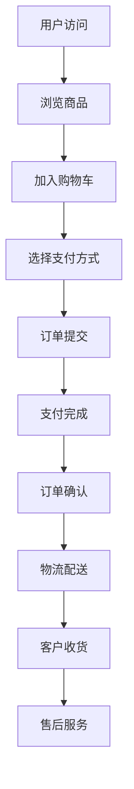

**1.1.2 电子商务的发展历程**

电子商务的发展历程可以分为几个阶段：

1. **萌芽期**（1990年代）：互联网的兴起带来了电子商务的萌芽，早期的电子商务主要涉及简单的在线信息发布和交易。
2. **发展期**（2000年代）：互联网泡沫破裂后，电子商务开始进入成熟期，众多电商平台如亚马逊、淘宝等崛起。
3. **成熟期**（2010年代）：移动互联网的普及使得电子商务进一步发展，移动支付、社交电商等新形态不断涌现。
4. **创新期**（2020年代）：随着人工智能、大数据、区块链等新技术的应用，电子商务进入创新期，智能交易、去中心化电商等新兴模式不断出现。

**时间线：**

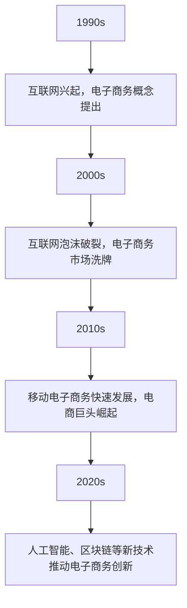

**1.1.3 电子商务的分类与模式**

电子商务可以根据交易对象的不同分为以下几种类型：

1. **B2B（企业对企业）**：主要是企业间的商业交易，如工业原材料、电子产品等。
2. **B2C（企业对消费者）**：企业直接向消费者销售商品或服务，如亚马逊、淘宝等电商平台。
3. **C2C（消费者对消费者）**：消费者之间的交易，如eBay、淘宝的二手市场。

**分类图：**

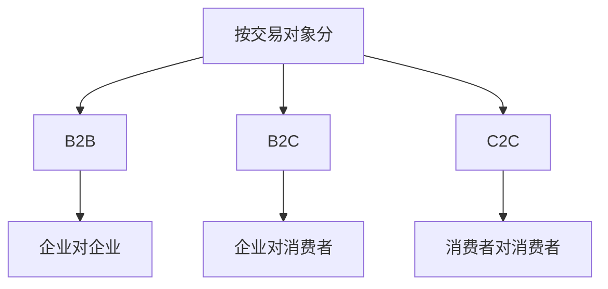

**1.2.1 B2B电子商务模式**

B2B电子商务模式的主要特点是企业间进行大规模的交易，交易过程复杂，涉及多方参与。以下是一个简单的B2B电子商务模式图：

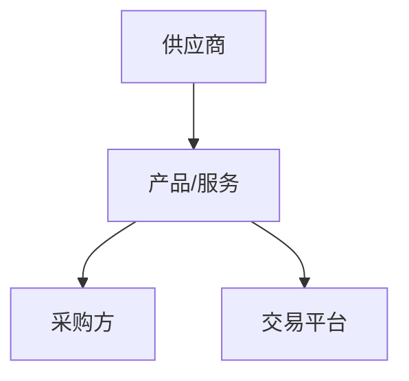

**1.2.2 B2C电子商务模式**

B2C电子商务模式的主要特点是企业直接面向消费者销售商品或服务，交易过程简单，消费者可以直接在平台上购物。以下是一个简单的B2C电子商务模式图：

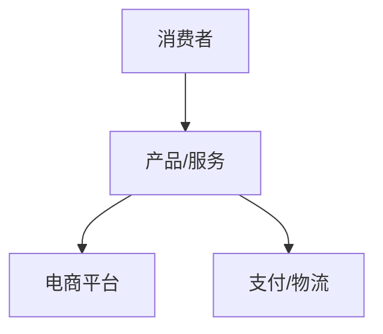

**1.2.3 C2C电子商务模式**

C2C电子商务模式的主要特点是消费者之间进行交易，平台主要提供交易撮合服务。以下是一个简单的C2C电子商务模式图：

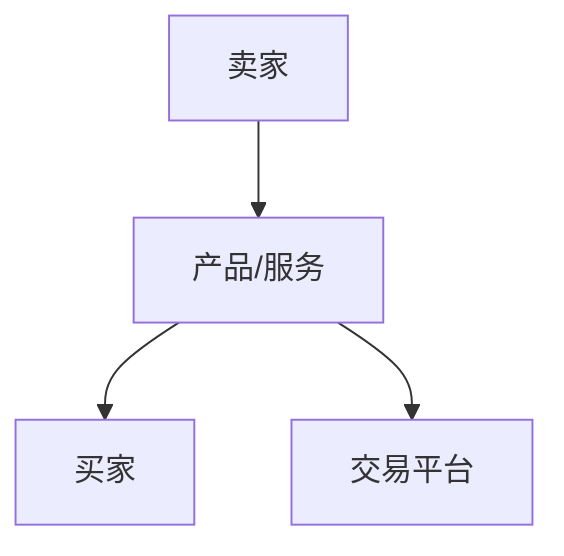

**1.3 电子商务的影响与挑战**

**1.3.1 电子商务对社会的影响**

电子商务对社会的各个方面产生了深远的影响：

1. **经济影响**：电子商务推动了产业升级，提高了经济效益，创造了大量就业机会。
2. **消费模式**：电子商务改变了人们的消费习惯，提高了消费者的满意度。
3. **消费者权益**：电子商务带来了新的消费者权益问题，如信息安全、隐私保护等。

**影响图：**

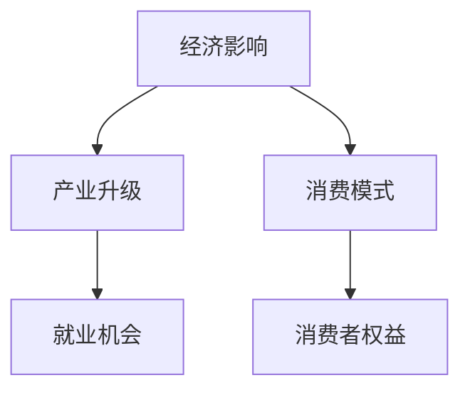

**1.3.2 电子商务面临的挑战**

电子商务在发展过程中也面临着诸多挑战：

1. **信息安全**：电子商务涉及到大量的个人信息和交易数据，信息安全成为一大挑战。
2. **隐私保护**：如何保护消费者的隐私成为电子商务发展的关键问题。
3. **物流配送**：物流配送的效率和服务质量对电子商务至关重要。
4. **市场竞争**：电子商务市场竞争激烈，企业需要不断创新以保持竞争力。
5. **法律监管**：电子商务的快速发展带来了法律监管的挑战，需要制定相应的法律法规。

**挑战图：**

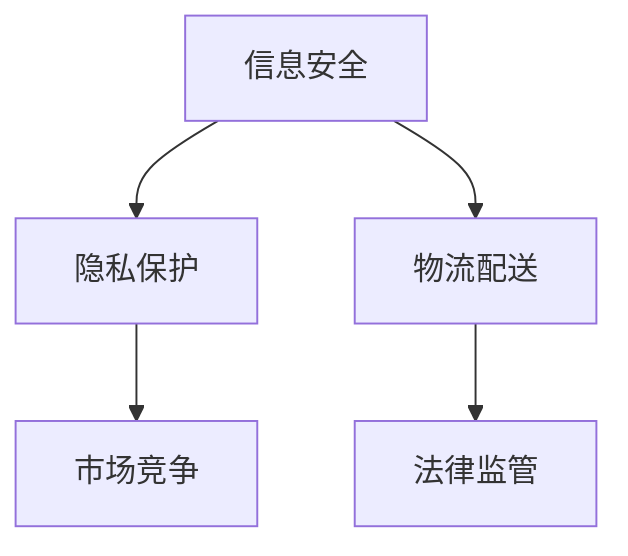

**1.4 电子商务的核心要素**

电子商务的运行依赖于多个核心要素，这些要素相互关联，共同支撑着电子商务的生态系统：

**1.4.1 网络基础设施**

网络基础设施是电子商务的基础，包括互联网、移动网络、数据中心等。一个稳定、快速的网络环境对电子商务的运行至关重要。

**网络结构：**

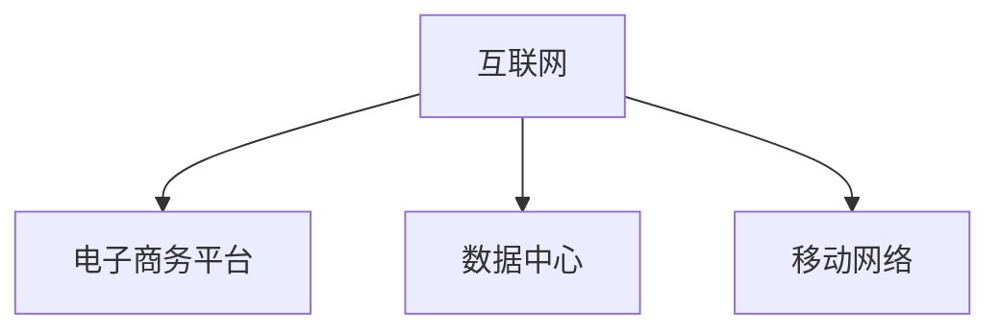

**1.4.2 数据处理与分析**

电子商务产生的大量数据需要通过数据处理与分析来提取有价值的信息，以支持决策和优化运营。数据处理与分析包括数据采集、数据存储、数据处理、数据分析和数据可视化等环节。

**数据处理流程：**

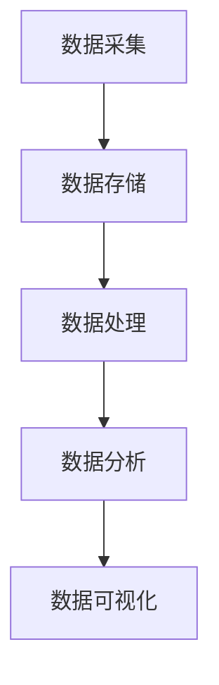

**1.4.3 支付与物流**

支付与物流是电子商务交易流程中的重要环节。支付系统需要提供安全、便捷的支付方式，物流系统需要确保商品快速、准确地送达消费者手中。

**支付流程：**

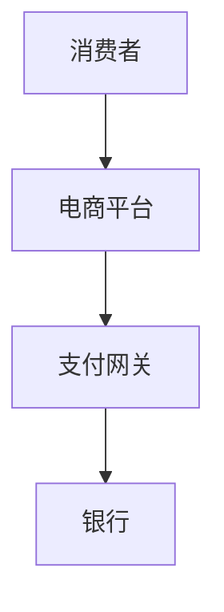

**1.4.4 法律法规与标准**

法律法规与标准是电子商务健康发展的保障。电子商务涉及到合同法、消费者权益保护法、网络安全法等多个领域的法律法规，同时需要制定相应的技术标准和规范。

**法律框架：**

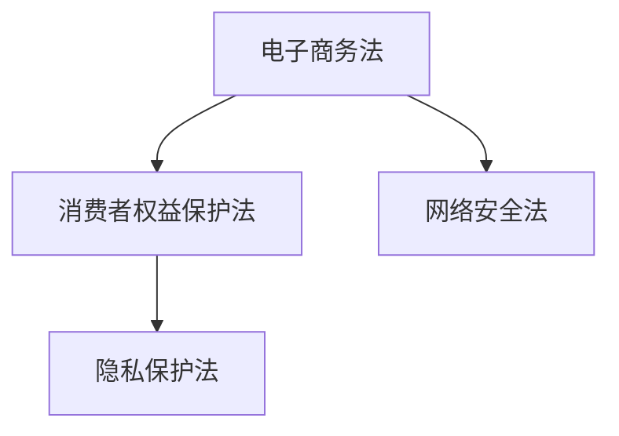

### 第2章：数学基础

在电子商务的众多应用场景中，数学扮演着至关重要的角色。数学不仅提供了描述和分析电子商务现象的语言和工具，也为电子商务的优化和决策提供了理论基础。本章节将介绍离散数学、微积分和线性代数等数学基础，为后续章节的讨论奠定基础。

##### 2.1 离散数学基础

离散数学是研究离散结构的数学分支，它在计算机科学和电子商务中有着广泛的应用。以下是一些重要的离散数学概念。

**2.1.1 集合与关系**

集合是离散数学中最基本的概念，它由一些确定的元素构成。集合的基本运算包括并集、交集、差集和笛卡尔积。

- **并集**：两个集合A和B的并集是由属于A或B的所有元素组成的集合，记作A ∪ B。
- **交集**：两个集合A和B的交集是由同时属于A和B的所有元素组成的集合，记作A ∩ B。
- **差集**：两个集合A和B的差集是由属于A但不属于B的所有元素组成的集合，记作A - B。
- **笛卡尔积**：两个集合A和B的笛卡尔积是由A中的每个元素与B中的每个元素组成的有序对构成的集合，记作A × B。

**图的基本概念**

图是由一组顶点和连接这些顶点的边组成的结构。图论是研究图的结构和性质的数学分支，它在网络分析、数据结构设计中有着重要的应用。

- **顶点**：图中的基本元素，表示网络中的节点。
- **边**：连接两个顶点的线段，表示节点之间的关系。
- **路径**：图中从一个顶点出发，经过一系列顶点，最后到达另一个顶点的序列。
- **连通性**：如果图中的任意两个顶点都存在路径相连，则称该图为连通图。

**2.1.2 函数与图论**

函数是数学中描述变量之间关系的基本工具。在离散数学中，函数通常用来描述图的结构和性质。

- **函数定义**：设A和B是非空集合，如果对于A中的每个元素，都有唯一一个元素与之对应，则称A到B的一个映射为从A到B的函数，记作f: A → B。对应元素称为函数的值。
- **图的基本性质**：图的邻接矩阵和拉普拉斯矩阵是描述图结构的重要工具。

**2.1.3 组合数学**

组合数学是研究离散对象组合的数学分支，它在计算机科学和电子商务中有着广泛的应用。

- **组合数公式**：组合数是从n个不同元素中取出k个元素的组合数，记作C(n, k) = n! / (k! * (n-k)! )。
- **排列数公式**：排列数是从n个不同元素中取出k个元素按照一定顺序排列的方案数，记作P(n, k) = n! / (n-k)!。

**2.2 微积分基础

微积分是研究变化和累积的数学分支，它在经济学、工程学和物理学等领域有着广泛的应用。

**2.2.1 导数与极限**

导数是描述函数变化率的数学工具，极限是描述函数在某一位置的变化趋势。

- **导数定义**：设f(x)是定义在区间I上的函数，如果存在极限

  $$ \lim_{{h \to 0}} \frac{{f(x+h) - f(x)}}{h} $$，

  则称该极限值为f(x)在点x处的导数，记作f'(x)。

- **极限定义**：设f(x)是定义在区间I上的函数，如果对于任意给定的正数ε，都存在一个正数δ，使得当0 < |x - a| < δ时，有|f(x) - L| < ε，则称f(x)在点a处极限为L，记作

  $$ \lim_{{x \to a}} f(x) = L $$。

**2.2.2 积分与微分方程**

积分是导数的反操作，它用于计算累积量。

- **不定积分定义**：如果F'(x) = f(x)，则F(x) + C是f(x)的一个不定积分，记作

  $$ \int f(x) \, dx = F(x) + C $$。

- **定积分定义**：设f(x)是定义在区间[a, b]上的函数，如果存在极限

  $$ \lim_{{n \to \infty}} \sum_{{i=1}}^{n} f(x_i^*) \Delta x $$，

  其中$$ \Delta x = \frac{{b-a}}{n} $$，$$ x_i^* \in [x_{i-1}, x_i] $$，则称该极限值为f(x)在区间[a, b]上的定积分，记作

  $$ \int_{a}^{b} f(x) \, dx $$。

微分方程是描述动态系统变化的数学方程。

- **一阶线性微分方程**：形式为$$ y' + P(x)y = Q(x) $$的微分方程。
- **二阶线性微分方程**：形式为$$ y'' + P(x)y' + Q(x)y = R(x) $$的微分方程。

**2.2.3 多变量微积分**

多变量微积分是研究多个变量函数的极限、导数和积分的数学分支。

- **偏导数定义**：设f(x, y)是定义在区域D上的函数，如果存在极限

  $$ f_x(x, y) = \lim_{{h \to 0}} \frac{{f(x+h, y) - f(x, y)}}{h} $$，

  $$ f_y(x, y) = \lim_{{k \to 0}} \frac{{f(x, y+k) - f(x, y)}}{k} $$，

  则称f(x, y)在点(x, y)处的偏导数分别为f_x(x, y)和f_y(x, y)。

- **梯度定义**：设f(x, y)是定义在区域D上的函数，则f(x, y)在点(x, y)处的梯度定义为

  $$ \nabla f(x, y) = (f_x(x, y), f_y(x, y)) $$，

  即梯度的方向指向函数值增加最快的方向。

##### 2.3 线性代数基础

线性代数是研究向量空间、线性变换和矩阵理论的数学分支，它在计算机科学和电子商务中有着广泛的应用。

**2.3.1 矩阵与行列式**

矩阵是表示线性变换或系统数据的二维数组。行列式是矩阵的一种特殊运算，用于判断矩阵的可逆性和求解线性方程组。

- **矩阵定义**：设A是一个m×n的矩阵，其元素记作a_{ij}，其中i = 1, 2, ..., m，j = 1, 2, ..., n。

  $$ A = \begin{bmatrix} 
  a_{11} & a_{12} & \dots & a_{1n} \\ 
  a_{21} & a_{22} & \dots & a_{2n} \\ 
  \vdots & \vdots & \ddots & \vdots \\ 
  a_{m1} & a_{m2} & \dots & a_{mn} 
  \end{bmatrix} $$

- **行列式定义**：设A是一个n×n的矩阵，其行列式记作|A|，定义为

  $$ |A| = a_{11}C_{11} - a_{12}C_{12} + \dots + (-1)^{n+1}a_{1n}C_{1n} $$，

  其中C_{ij}是A的余子式，C_{ij}是A的代数余子式。

**2.3.2 线性方程组与特征值**

线性方程组是描述线性关系的数学方程组。特征值和特征向量是描述线性变换特性的重要工具。

- **线性方程组解法**：设Ax = b是一个线性方程组，其中A是系数矩阵，x是变量向量，b是常数向量。如果增广矩阵（A | b）的秩等于A的秩等于未知数的个数，则线性方程组有唯一解。

- **特征值定义**：设A是一个n×n的矩阵，如果存在非零向量v使得Av = λv，则称λ为A的特征值，v为A对应的特征向量。

**2.3.3 向量空间与变换**

向量空间是包含向量及其运算的集合。线性变换是描述向量空间之间关系的数学工具。

- **向量空间定义**：设V是非空的向量集合，对于V中的任意向量u和v，以及任意标量k，向量加法和标量乘法都封闭，则称V为向量空间。

- **线性变换定义**：设T: V → W 是一个线性变换，如果T满足以下条件：

  1. T(u + v) = T(u) + T(v)，对任意的u, v ∈ V；
  2. T(kv) = kT(v)，对任意的k ∈ R和v ∈ V。

### 第3章：在线交易数学模型

在线交易数学模型是电子商务领域的一个重要研究方向，它涉及到价格发现、风险管理、资金管理等方面。这些模型为在线交易提供了理论支持和策略指导，有助于优化交易决策和提高交易效率。在本章节中，我们将详细探讨在线交易数学模型的基本概念、原理和应用。

##### 3.1 价格发现模型

价格发现模型是研究在线交易市场中价格形成机制的数学模型。它的核心目标是揭示市场价格与供需关系之间的动态关系，从而为交易决策提供依据。

**3.1.1 收敛性与市场效率**

收敛性是指市场价格的变动趋势趋于稳定。市场效率是指市场价格是否能准确、迅速地反映市场信息。高效率的市场价格波动小，低效率的市场价格波动大。

- **收敛性定义**：设有一个交易市场，若其价格序列{P_t}在一定条件下趋于稳定，则称市场具有收敛性。

- **市场效率定义**：市场效率是指市场信息是否能够迅速、准确地反映到价格中。高效率市场价格波动小，低效率市场价格波动大。

**3.1.2 状态空间模型**

状态空间模型是描述价格形成过程的数学模型，它将市场价格视为状态变量，交易行为视为控制变量。状态空间模型通常包含以下三个部分：

- **状态变量**：描述市场价格变动的特征变量，如当前价格、价格变动率等。
- **控制变量**：描述交易行为的影响因素，如交易量、交易者风险偏好等。
- **状态转移方程**：描述状态变量和控制变量之间的关系。

**3.1.3 价格发现模型案例分析**

以比特币价格为案例，分析其价格发现模型，包括市场效率、状态空间模型和价格预测。

**案例分析**：

1. **市场效率分析**：

   利用统计方法分析比特币价格的历史数据，评估其市场效率。通过计算价格波动率、信息传播速度等指标，判断比特币市场的收敛性和效率。

2. **状态空间模型构建**：

   基于比特币价格的历史数据，建立状态空间模型。选择合适的状态变量和控制变量，构建状态转移方程。

3. **价格预测**：

   利用构建的状态空间模型，进行比特币价格的未来预测。通过模拟不同交易策略下的价格变化，评估不同策略的收益和风险。

##### 3.2 风险管理模型

风险管理模型是研究在线交易中如何控制和管理风险的数学模型。它包括风险度量、风险分散策略和风险中性定价等方面。

**3.2.1 风险度量方法**

风险度量是评估风险大小和风险影响的过程。常用的风险度量方法包括方差、标准差和期望损失等。

- **方差**：方差是衡量随机变量离散程度的指标，表示风险的大小。

- **标准差**：标准差是方差的平方根，它表示风险变动的程度。

- **期望损失**：期望损失是风险事件发生时损失的平均值，表示风险的影响。

**3.2.2 风险分散策略**

风险分散策略是通过多样化投资来降低风险的策略。它包括以下几种方法：

- **资产组合**：将资金分散投资于多种资产，以降低单一资产的风险。

- **投资组合优化**：通过优化资产组合，实现风险和收益的平衡。

- **风险分散策略**：根据市场环境和个人风险偏好，制定相应的风险分散策略。

**3.2.3 风险中性定价**

风险中性定价是一种假设市场处于无风险状态的定价方法。它通过计算投资者在无风险状态下的收益，来确定资产的价格。

- **风险中性概率**：假设所有投资者都是风险中性，根据市场信息计算资产的风险中性概率。

- **风险中性定价公式**：

  $$ P = e^{-\rho T} \sum_{i=1}^{n} p_i S_i $$，

  其中P是资产价格，ρ是无风险利率，T是时间期限，p_i是资产i的风险中性概率，S_i是资产i的价格。

##### 3.3 资金管理模型

资金管理模型是研究在线交易中如何合理管理和使用资金的数学模型。它包括资金流的数学表达、投资组合优化和动态资金管理策略等方面。

**3.3.1 资金流的数学表达**

资金流的数学表达是描述在线交易中资金流动的过程。它包括以下几种形式：

- **收入流**：描述交易收益的流入过程，如商品销售收入、投资回报等。

- **支出流**：描述交易成本的流出过程，如商品采购成本、交易手续费等。

- **净现金流**：描述收入流和支出流的差额，表示交易净收益。

**3.3.2 投资组合优化**

投资组合优化是资金管理的重要策略，旨在实现风险和收益的平衡。它包括以下几种方法：

- **均值-方差模型**：通过优化资产组合的均值和方差，实现收益和风险的平衡。

- **Markowitz均值-方差模型**：通过构建投资组合的期望收益和方差，实现风险最小化。

- **遗传算法**：利用遗传算法优化投资组合，实现收益最大化。

**3.3.3 动态资金管理策略**

动态资金管理策略是针对市场变化进行调整的资金管理策略。它包括以下几种方法：

- **自适应资金管理**：根据市场环境和个人风险偏好，动态调整资金分配。

- **阈值策略**：设置合理的阈值，根据市场波动调整资金管理策略。

- **再平衡策略**：定期对投资组合进行调整，保持风险和收益的平衡。

### 第4章：在线交易算法

在线交易算法是电子商务领域中的重要研究方向，它通过数学模型和计算方法来实现交易决策和优化。在线交易算法可以分为基本算法、高频交易算法和智能交易算法等。本章节将分别介绍这些算法的基本原理、应用场景和案例分析。

##### 4.1 基本算法原理

基本算法原理是在线交易算法的基础，它涉及到数据结构与算法、算法复杂度分析等方面。以下是基本算法原理的概述：

**4.1.1 算法概述**

算法是解决问题的一系列步骤。在线交易算法主要包括以下几种类型：

- **价格发现算法**：通过分析市场数据，预测市场价格变动趋势。
- **风险管理算法**：评估和管理交易风险，实现风险控制。
- **资金管理算法**：优化资金使用，实现收益最大化。
- **交易策略算法**：制定交易策略，实现交易目标。

**4.1.2 数据结构与算法**

数据结构是组织和管理数据的方式，算法是处理数据的方法。在线交易算法通常使用以下几种数据结构：

- **数组**：用于存储交易数据，如价格、交易量等。
- **链表**：用于存储交易记录，如交易时间、交易价格等。
- **树**：用于存储交易关系，如交易者之间的网络关系。

**4.1.3 算法复杂度分析**

算法复杂度分析是评估算法性能的重要方法。它包括以下几种类型：

- **时间复杂度**：描述算法执行时间的增长速率。
- **空间复杂度**：描述算法占用的存储空间。
- **最优复杂度**：描述算法在最佳情况下的性能。

算法复杂度分析有助于选择合适的算法，实现高效的交易决策。

**4.1.4 案例分析**

以比特币交易为例，分析基本算法原理的应用。具体步骤如下：

1. **数据采集**：收集比特币价格、交易量等数据。
2. **数据处理**：使用数组、链表等数据结构存储和处理数据。
3. **算法实现**：实现价格发现、风险管理、资金管理等基本算法。
4. **性能评估**：评估算法的时间复杂度和空间复杂度。

##### 4.2 高频交易算法

高频交易算法是利用计算机技术和数学模型，在极短时间内进行大量交易，以获取微小利润的算法。以下是高频交易算法的概述：

**4.2.1 高频交易概述**

高频交易（High-Frequency Trading，HFT）是一种利用先进计算机技术和算法，在极短的时间内进行大量交易，以获取微小利润的交易方式。HFT的特点包括：

- **交易速度快**：利用高速网络和计算机技术，实现毫秒级别的交易速度。
- **策略多样化**：根据市场变化和交易数据，实时调整交易策略。
- **风险控制严格**：通过严格的资金管理和风险控制，降低交易风险。

**4.2.2 算法策略分析**

高频交易算法包括以下几种策略：

- **市场做市商策略**：在市场中提供买卖报价，赚取买卖价差。
- **统计套利策略**：利用市场的不合理价格关系，进行套利交易。
- **算法交易策略**：利用机器学习和人工智能技术，实现交易自动化。

**4.2.3 实际案例分析**

以AQuantia公司为例，分析高频交易算法的应用。具体步骤如下：

1. **数据采集**：收集股票交易数据，如价格、交易量、交易时间等。
2. **数据处理**：使用高速网络和计算机技术，实现数据的高速处理和传输。
3. **算法实现**：实现市场做市商、统计套利和算法交易等高频交易算法。
4. **性能评估**：评估高频交易算法的收益和风险，调整交易策略。

##### 4.3 智能交易算法

智能交易算法是利用机器学习和人工智能技术，实现交易自动化和优化的算法。以下是智能交易算法的概述：

**4.3.1 智能交易概述**

智能交易（Intelligent Trading）是一种利用机器学习和人工智能技术，实现交易自动化和优化的交易方式。智能交易的特点包括：

- **交易自动化**：利用计算机算法，自动执行交易策略。
- **交易优化**：根据市场变化和交易数据，动态调整交易策略。
- **风险控制**：通过严格的资金管理和风险控制，降低交易风险。

**4.3.2 机器学习算法应用**

智能交易算法中常用的机器学习算法包括：

- **线性回归**：用于预测市场价格和交易量等变量。
- **支持向量机**：用于分类和预测交易策略。
- **神经网络**：用于实现复杂的非线性交易策略。
- **强化学习**：用于实现交易策略的自我学习和优化。

**4.3.3 智能交易案例分析**

以E*TRADE公司为例，分析智能交易算法的应用。具体步骤如下：

1. **数据采集**：收集股票交易数据，如价格、交易量、交易时间等。
2. **数据处理**：使用机器学习算法处理和挖掘数据，提取交易特征。
3. **算法实现**：实现线性回归、支持向量机、神经网络和强化学习等智能交易算法。
4. **性能评估**：评估智能交易算法的收益和风险，调整交易策略。

### 第5章：电子商务案例分析

案例分析是验证理论和模型应用的有效方法。在本章节中，我们将通过分析电子商务中的在线零售和在线金融案例，探讨数学模型在电子商务中的应用效果和挑战。

##### 5.1 在线零售案例分析

在线零售是电子商务中最常见的模式之一，它通过互联网平台为消费者提供商品和服务。以下是对某知名在线零售平台的案例分析。

**5.1.1 市场策略分析**

1. **产品定位**：该平台以中高端消费者为主要目标群体，提供高品质的商品和服务。
2. **营销策略**：通过社交媒体、搜索引擎优化和广告投放等手段，提高品牌知名度和用户粘性。
3. **用户分析**：通过用户行为数据和购买记录，分析用户需求和市场趋势，优化产品和服务。

**5.1.2 数据分析应用**

1. **用户行为分析**：通过分析用户浏览、搜索和购买行为，了解用户偏好和需求。
2. **推荐系统**：利用协同过滤算法和基于内容的推荐算法，为用户推荐相关商品。
3. **促销策略**：通过数据分析，制定个性化的促销策略，提高用户购买意愿。

**5.1.3 案例结果分析**

1. **用户满意度**：通过用户评价和反馈，评估产品和服务质量，持续优化用户体验。
2. **销售额**：通过数据分析，评估营销策略和促销活动的效果，提高销售额。
3. **市场份额**：通过市场调研，分析平台在行业中的地位和竞争力。

##### 5.2 在线金融案例分析

在线金融是指通过互联网平台提供金融服务，包括在线支付、投资理财和保险等。以下是对某知名在线金融平台的案例分析。

**5.2.1 金融产品与交易策略**

1. **金融产品**：该平台提供多种金融产品，包括货币基金、债券、股票、基金等。
2. **交易策略**：利用技术分析和基本面分析，制定交易策略，实现投资收益。

**5.2.2 数据驱动决策**

1. **数据收集**：通过互联网平台收集交易数据、用户行为数据和市场数据。
2. **数据挖掘**：利用数据挖掘技术，提取有用信息，为决策提供支持。
3. **风险评估**：通过风险评估模型，评估金融产品和交易策略的风险。

**5.2.3 案例结果分析**

1. **投资收益**：通过数据分析，评估不同金融产品和交易策略的收益和风险。
2. **用户满意度**：通过用户评价和反馈，评估产品和服务质量，持续优化用户体验。
3. **市场份额**：通过市场调研，分析平台在行业中的地位和竞争力。

### 第6章：数学模型在电子商务中的应用

数学模型在电子商务中的应用十分广泛，涵盖了库存管理、供应链管理和营销策略等多个方面。这些模型通过量化分析和优化算法，帮助企业提高运营效率、降低成本、提升用户体验。

##### 6.1 数学模型在库存管理中的应用

库存管理是电子商务中一个关键环节，涉及到库存水平的控制、订单处理和物流调度等。数学模型在库存管理中的应用主要包括以下方面：

**6.1.1 库存模型概述**

库存管理模型分为静态模型和动态模型两种。

- **静态模型**：用于分析在一定时期内的库存水平。常见的静态模型有Max-Flow模型、K-shortest Path模型等。
- **动态模型**：用于分析库存水平的动态变化。常见的动态模型有有限容量背包问题、动态规划模型等。

**6.1.2 库存优化策略**

库存优化策略旨在通过优化库存水平，降低库存成本和提高服务水平。

- **基于需求的库存优化**：根据历史数据和预测模型，确定最优的库存水平，以满足市场需求。
- **基于供应的库存优化**：通过优化供应链，减少供应链中的库存积压和浪费。
- **基于时间的库存优化**：根据订单处理时间和配送时间，优化库存布局和物流安排。

**6.1.3 案例分析**

以某在线零售平台为例，分析其库存管理模型和应用效果。

1. **需求预测**：通过历史销售数据和季节性因素，预测未来的需求量。
2. **库存水平控制**：使用Max-Flow模型确定仓库到各配送中心的最佳库存水平。
3. **订单处理和物流调度**：利用动态规划模型优化订单处理和物流安排，提高配送效率。

##### 6.2 数学模型在供应链管理中的应用

供应链管理是电子商务中另一个重要环节，涉及到供应商、制造商、分销商和零售商等各环节的协调和优化。数学模型在供应链管理中的应用主要包括以下方面：

**6.2.1 供应链模型概述**

供应链管理模型分为单阶段供应链模型和多阶段供应链模型。

- **单阶段供应链模型**：主要分析单个环节的库存、生产、配送等。常见的模型有线性规划模型、目标规划模型等。
- **多阶段供应链模型**：分析多个环节的协同效应和优化。常见的模型有网络流模型、博弈模型等。

**6.2.2 供应链优化策略**

供应链优化策略旨在通过优化供应链各环节，提高供应链的效率和竞争力。

- **需求预测和库存控制**：通过需求预测模型，确定各环节的库存水平和生产计划。
- **物流网络优化**：通过网络流模型优化物流配送路线和运输成本。
- **供应链协同**：通过博弈模型分析供应链各环节的协同效应，优化供应链整体效益。

**6.2.3 案例分析**

以某国际电子产品供应链为例，分析其供应链管理模型和应用效果。

1. **需求预测**：通过历史销售数据和季节性因素，预测未来的需求量。
2. **库存控制**：使用线性规划模型确定各环节的库存水平和生产计划。
3. **物流网络优化**：使用网络流模型优化物流配送路线和运输成本。
4. **供应链协同**：通过博弈模型分析供应商、制造商、分销商和零售商之间的协同效应，优化供应链整体效益。

##### 6.3 数学模型在营销策略中的应用

营销策略是电子商务中提高用户粘性和销售额的重要手段。数学模型在营销策略中的应用主要包括以下方面：

**6.3.1 营销模型概述**

营销模型分为基于需求的营销模型和基于供应的营销模型。

- **基于需求的营销模型**：分析消费者行为和市场趋势，制定个性化的营销策略。常见的模型有需求预测模型、顾客细分模型等。
- **基于供应的营销模型**：分析市场竞争和资源分配，制定差异化的营销策略。常见的模型有价格策略模型、促销策略模型等。

**6.3.2 营销优化策略**

营销优化策略旨在通过优化营销策略，提高营销效果和用户满意度。

- **需求预测和顾客细分**：通过需求预测模型和顾客细分模型，了解消费者需求和市场趋势，制定个性化的营销策略。
- **价格策略优化**：通过价格策略模型，确定最优的价格水平，提高销售额和利润。
- **促销策略优化**：通过促销策略模型，优化促销活动的安排和效果，提高用户参与度和购买意愿。

**6.3.3 案例分析**

以某大型在线零售平台为例，分析其营销策略模型和应用效果。

1. **需求预测**：通过历史销售数据和季节性因素，预测未来的需求量。
2. **顾客细分**：通过顾客行为数据，细分顾客群体，制定个性化的营销策略。
3. **价格策略优化**：通过价格策略模型，确定最优的价格水平，提高销售额和利润。
4. **促销策略优化**：通过促销策略模型，优化促销活动的安排和效果，提高用户参与度和购买意愿。

### 第7章：未来发展趋势与展望

随着新技术的不断涌现，电子商务正迎来前所未有的发展机遇。未来，数学在电子商务中的应用将更加广泛和深入，推动电子商务的创新和发展。

##### 7.1 新技术对电子商务的影响

**7.1.1 人工智能与大数据**

人工智能和大数据技术在电子商务中的应用日益广泛。人工智能通过机器学习和深度学习算法，可以分析海量数据，发现潜在规律，实现个性化推荐、智能客服和自动化交易等。大数据技术则通过数据存储、处理和分析，为电子商务企业提供全面的数据支持，助力业务决策和运营优化。

**7.1.2 区块链技术**

区块链技术具有去中心化、不可篡改和透明性等特点，为电子商务提供了安全、可信的交易环境。未来，区块链技术有望在支付结算、供应链管理和数据隐私保护等方面发挥重要作用。

**7.1.3 物联网技术**

物联网技术通过将物理世界与数字世界相连接，实现了商品、信息和人的无缝连接。未来，物联网技术将推动电子商务向智能化、个性化和服务化方向发展。

##### 7.2 数学在电子商务中的创新应用

**7.2.1 新算法的出现**

随着新技术的应用，新的数学算法不断涌现。例如，基于深度学习的价格预测算法、基于区块链的供应链管理算法等。这些新算法将进一步提高电子商务的效率和准确性。

**7.2.2 新模型的发展**

未来，数学模型在电子商务中的应用将更加多样化和深入。例如，基于大数据的智能库存管理模型、基于区块链的供应链金融模型等。这些新模型将助力电子商务企业实现精细化运营和数字化转型。

**7.2.3 创新案例分享**

以下是几个创新案例，展示了数学在电子商务中的应用：

1. **个性化推荐系统**：基于机器学习算法，分析用户行为和偏好，实现个性化商品推荐，提高用户满意度和销售额。
2. **智能库存管理**：利用大数据分析和预测模型，实现智能库存管理，降低库存成本和提高供应链效率。
3. **区块链支付**：利用区块链技术，实现安全、透明的支付结算，提高交易效率和降低交易成本。

##### 7.3 电子商务与数学的结合前景

**7.3.1 未来趋势分析**

未来，电子商务与数学的结合将呈现以下趋势：

1. **智能化**：通过人工智能和大数据技术，实现电子商务的智能化运营和个性化服务。
2. **精细化**：通过数学模型和算法，实现电子商务的精细化运营和优化决策。
3. **服务化**：通过物联网技术和供应链管理，实现电子商务的服务化转型和供应链协同。

**7.3.2 挑战与机遇**

电子商务与数学的结合也面临着诸多挑战和机遇：

1. **挑战**：数据隐私保护、算法透明性、技术瓶颈等。
2. **机遇**：技术创新、商业模式创新、跨界合作等。

**7.3.3 发展战略建议**

为推动电子商务与数学的结合，以下是一些建议：

1. **加强技术创新**：加大人工智能、大数据和区块链等关键技术的研发投入，推动技术突破。
2. **培育人才**：加强人才培养和引进，提升电子商务企业和研究机构的数学水平。
3. **跨界合作**：推动电子商务企业、研究机构和政府部门之间的合作，共同推动数学在电子商务中的应用。

### 附录

**附录A：数学与电子商务相关资源**

为了帮助读者深入了解数学与电子商务的相关知识，以下是一些推荐的资源和工具：

**A.1 学术论文与研究报告**

1. "Mathematical Models for Electronic Commerce" by A. B. Whinston and L. S.UBY.
2. "The Impact of E-Commerce on Business Strategy" by J. M. Hromskiy and R. J. Russell.
3. "Application of Machine Learning in E-Commerce" by Y. Chen, H. Wang, and Z. Wang.

**A.2 开源代码与工具**

1. Apache Commons Math：提供各种数学算法和函数的Java库。
2. TensorFlow：用于机器学习和深度学习的开源框架。
3. PyTorch：用于机器学习和深度学习的Python库。

**A.3 专业网站与社区**

1. arXiv：全球领先的开放获取科学预印本平台。
2. IEEE Xplore：电气和电子工程领域的专业数据库。
3. Coursera：提供大量免费和付费的在线课程。

**A.4 参考书目与推荐阅读**

1. "Mathematics for Computer Science" by Shai Simonson and David Tani.
2. "Data Science from Scratch" by Joel Grus.
3. "Blockchain: Blueprint for a New Economy" by Andreas M. Antonopoulos.

### 总结

本文系统地介绍了数学与电子商务的关系，从电子商务的定义和发展历程、数学基础、在线交易数学模型、在线交易算法、案例分析到未来发展趋势，全面阐述了数学在电子商务中的应用。数学不仅为电子商务提供了理论支持和策略指导，还推动了电子商务的创新和发展。在未来，随着新技术的不断涌现，数学在电子商务中的应用将更加广泛和深入，为电子商务的繁荣和发展注入新的活力。

