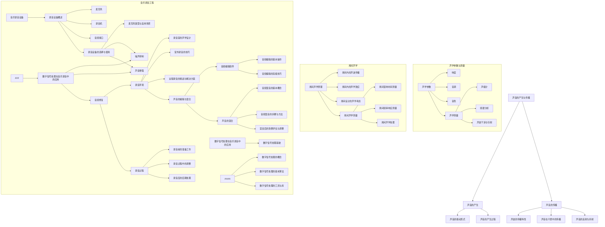

                 

# 《数学与音乐录音工程的声学原理》

## 关键词
声学原理、音乐录音工程、声波传播、数字信号处理、音频编辑

## 摘要

本文旨在深入探讨数学与音乐录音工程的声学原理，为读者揭示声音的奥秘及其在音乐制作中的应用。文章首先介绍了声音的产生与传播、声学参数与测量等基础知识，然后重点阐述了房间声学、音乐录音设备、录音技巧、声音编辑与混合以及数字信号处理在音乐录音中的应用。通过实际案例分析和未来展望，本文为音乐录音工程提供了全面的指导，旨在推动这一领域的创新发展。

### 《数学与音乐录音工程的声学原理》目录大纲

## 第一部分：声学基础

### 第1章：声音的产生与传播

#### 1.1 声音的产生

##### 1.1.1 声音的物理本质

##### 1.1.2 声音的振动形式

##### 1.1.3 声音的产生过程

#### 1.2 声音的传播

##### 1.2.1 声波的传播特性

##### 1.2.2 声音在介质中的传播

##### 1.2.3 声音的反射与折射

### 第2章：声学参数与测量

#### 2.1 声学参数

##### 2.1.1 响度

##### 2.1.2 音调

##### 2.1.3 音色

#### 2.2 声学测量

##### 2.2.1 声级计

##### 2.2.2 频谱分析

##### 2.2.3 声波干涉与衍射

### 第3章：房间声学

#### 3.1 房间声学原理

##### 3.1.1 房间内的声波传播

##### 3.1.2 房间内的声学效应

##### 3.1.3 房间设计的声学考虑

#### 3.2 房间声学测量

##### 3.2.1 房间混响时间测量

##### 3.2.2 房间频率响应测量

##### 3.2.3 房间声学处理

## 第二部分：音乐录音工程

### 第4章：音乐录音设备

#### 4.1 录音设备概述

##### 4.1.1 麦克风

##### 4.1.2 录音机

##### 4.1.3 音频接口

#### 4.2 录音设备的选择与使用

##### 4.2.1 麦克风类型与适用场景

##### 4.2.2 录音设备的调试与校准

##### 4.2.3 录音设备的维护与保养

### 第5章：音乐录音技巧

#### 5.1 录音环境

##### 5.1.1 录音室的声学设计

##### 5.1.2 室外录音的技巧

##### 5.1.3 远程录音的挑战与解决方案

#### 5.2 录音过程

##### 5.2.1 录音前的准备工作

##### 5.2.2 录音过程中的调整

##### 5.2.3 录音后的后期处理

### 第6章：声音的编辑与混合

#### 6.1 音频编辑软件

##### 6.1.1 音频编辑软件的功能与界面

##### 6.1.2 音频编辑的基本操作

##### 6.1.3 音频编辑的高级技巧

#### 6.2 声音的混合

##### 6.2.1 音频混音的基本概念

##### 6.2.2 音频混音的步骤与方法

##### 6.2.3 混音后的效果评估与调整

### 第7章：数字信号处理在音乐录音中的应用

#### 7.1 数字信号处理基础

##### 7.1.1 数字信号处理的概念

##### 7.1.2 数字信号处理的基本算法

##### 7.1.3 数字信号处理的工具与库

#### 7.2 数字信号处理在音乐录音中的应用

##### 7.2.1 噪声抑制

##### 7.2.2 声音增强

##### 7.2.3 音频修复

### 第8章：音乐录音工程的实际案例

#### 8.1 案例研究一：录音室的设计与构建

##### 8.1.1 录音室的声学设计

##### 8.1.2 录音室的设备配置

##### 8.1.3 录音室的实际应用案例

#### 8.2 案例研究二：现场音乐录音

##### 8.2.1 现场音乐录音的挑战

##### 8.2.2 现场音乐录音的技巧

##### 8.2.3 现场音乐录音的实际案例

### 第9章：未来展望

#### 9.1 音乐录音工程的发展趋势

##### 9.1.1 新技术的应用

##### 9.1.2 音乐录音的未来方向

##### 9.1.3 音乐录音工程的教育与培训

## 附录

### 附录A：常用声学参数与单位

### 附录B：录音设备推荐列表

### 附录C：参考文献与推荐阅读

### 附录D：声学原理与音乐录音工程Mermaid流程图

### 第一部分：声学基础

#### 第1章：声音的产生与传播

##### 1.1 声音的产生

声音是由物体振动产生的。当物体振动时，它会引起周围介质（如空气、水或固体）的振动，从而形成声波。声波是一种机械波，它通过介质中的粒子相互作用来传播。

**声音的物理本质：**

声音是一种机械波，它由振动源产生，并通过介质传播。振动的本质可以归结为物体的动能转化为声能。根据物理学原理，任何物体振动时都会产生声波。例如，当我们敲击一块金属板时，金属板的振动会产生声波，这些声波会在空气中传播，并最终到达我们的耳朵。

**声音的振动形式：**

声音的振动形式可以分为几种类型，包括：

- **简谐振动：** 简谐振动是最简单的一种振动形式，它的特点是振幅和频率保持不变。简谐振动是许多复杂振动的基础，例如弦乐器中的振动。

- **非简谐振动：** 非简谐振动是指振幅或频率发生变化的振动形式。这类振动在自然界中更为常见，例如乐器的共振。

- **脉冲振动：** 脉冲振动是一种短促而强烈的振动，通常产生瞬间的声波。

**声音的产生过程：**

声音的产生过程可以分为以下几个步骤：

1. **振动源：** 振动源可以是任何可以振动的物体，如乐器、声带、麦克风等。
2. **振动传递：** 振动源通过介质（如空气、水或固体）将振动能量传递出去。
3. **声波形成：** 振动能量转化为声波，声波以波的形式在介质中传播。
4. **接收：** 当声波传播到接收器（如人耳、麦克风等）时，振动能量再次转化为电信号或听觉信号。

##### 1.2 声音的传播

声音的传播是指声波在介质中的传播过程。声波传播的速度取决于介质的性质，如密度和弹性。

**声波的传播特性：**

- **速度：** 声波在不同介质中的传播速度不同。例如，在空气中的传播速度约为343米/秒，而在水中的传播速度约为1498米/秒。
- **衰减：** 声波在传播过程中会逐渐衰减，衰减的程度取决于介质的性质和声波的传播距离。
- **反射与折射：** 当声波遇到不同介质的界面时，会发生反射和折射。反射是指声波返回到原介质中，折射是指声波进入另一种介质并改变方向。

**声音在介质中的传播：**

- **空气传播：** 空气是最常见的声波传播介质。声波在空气中传播时，会与空气分子发生相互作用，导致空气分子的振动。这种振动会传递到其他空气分子，从而使声波继续传播。
- **固体传播：** 固体是另一种常见的声波传播介质。与空气相比，固体中的声波传播速度更快，衰减也较少。
- **液体传播：** 液体（如水）也是声波传播的介质。液体中的声波传播速度介于空气和固体之间。

**声音的反射与折射：**

- **反射：** 当声波遇到障碍物时，一部分声波会返回到原介质中，这就是反射。例如，我们听到回声就是声波反射的结果。
- **折射：** 当声波从一种介质进入另一种介质时，会改变传播方向，这就是折射。例如，当声波从空气进入水中时，会向法线方向弯曲。

##### 1.3 声音的反射与折射

声波的反射与折射是声波传播过程中非常重要的现象。以下是一些关于声波反射与折射的基本原理：

- **反射定律：** 声波在反射时，入射角等于反射角。
- **折射定律：** 声波在折射时，入射角和折射角之间的关系由斯涅尔定律描述。斯涅尔定律公式为：`n1 * sin(θ1) = n2 * sin(θ2)`，其中`n1`和`n2`分别是两种介质的声速，`θ1`是入射角，`θ2`是折射角。
- **反射与折射的相对位置：** 当声波从一种介质进入另一种介质时，部分声波会反射，部分声波会折射。反射和折射的位置取决于两种介质的声速差异。

通过理解声波的反射与折射，我们可以更好地理解声音在复杂环境中的传播，如房间声学、声波探测等。

### 第2章：声学参数与测量

##### 2.1 声学参数

声学参数是描述声波特性的物理量，包括响度、音调和音色等。

**响度：** 响度是指声波的强度，它反映了声音的响亮程度。响度通常用分贝（dB）来表示。响度与声波的振幅有关，振幅越大，响度越大。响度还与听者的感知有关，不同的人对同一声波的响度感知可能不同。

**音调：** 音调是指声音的高低，它由声波的频率决定。频率越高，音调越高。音调是我们区分不同声音的重要特征，例如男性和女性的声音。

**音色：** 音色是指声音的品质或特性，它由声波的频谱组成决定。音色使我们能够区分不同来源的声音，即使它们的响度和音调相同。音色与声波的谐波成分有关，不同乐器和声音源产生的谐波成分不同，因此音色也不同。

##### 2.2 声学测量

声学测量是研究声波特性的重要手段。常用的声学测量方法包括声级计、频谱分析和声波干涉与衍射。

**声级计：** 声级计是一种用于测量声压级的仪器。声压级是描述声波强度的物理量，通常用分贝（dB）来表示。声级计通过将声波转换为电信号，然后测量电信号的强度，从而得到声压级。

**频谱分析：** 频谱分析是一种用于分析声波频率成分的方法。通过频谱分析，我们可以了解声波的频率分布，识别声音的谐波成分。频谱分析在音乐制作、声学研究和信号处理等领域有广泛的应用。

**声波干涉与衍射：** 声波干涉与衍射是声波传播过程中重要的现象。干涉是指两个或多个声波在相遇时相互叠加，形成新的声波。衍射是指声波遇到障碍物或通过狭缝时，会发生弯曲和扩散。干涉与衍射现象在声学研究和声波探测中具有重要应用。

##### 2.3 声波干涉与衍射

声波干涉与衍射是声波传播过程中的重要现象。以下是一些关于声波干涉与衍射的基本原理：

**声波干涉：**

- **相干声源：** 当两个声源发出的声波具有相同的频率和相位时，称为相干声源。
- **干涉条纹：** 当相干声源发出的声波相遇时，会发生干涉。干涉会导致声波的叠加，形成干涉条纹。干涉条纹的分布和形状与声源间距和波长有关。
- **干涉现象：** 干涉现象在声学实验和音乐制作中有着广泛应用。例如，在声学实验室中，通过干涉现象可以研究声波的传播特性和频率响应。

**声波衍射：**

- **衍射现象：** 当声波遇到障碍物或通过狭缝时，会发生衍射。衍射会导致声波的传播方向发生弯曲和扩散。
- **衍射公式：** 声波的衍射可以通过惠更斯-菲涅尔原理来描述。根据该原理，声波在遇到障碍物时，会从障碍物的表面向外传播，形成新的波前。
- **衍射应用：** 声波的衍射现象在声波探测、声学成像和声波控制等领域有重要应用。例如，通过衍射原理，我们可以设计和制造出具有特定频率响应的声学装置。

### 第3章：房间声学

##### 3.1 房间声学原理

房间声学是研究声波在房间内的传播和反射现象的学科。房间声学原理对于音乐制作、音响设计和声学工程等领域具有重要意义。

**房间内的声波传播：**

- **声波传播路径：** 声波在房间内传播时，会遇到墙壁、天花板和地板等障碍物。声波在传播过程中会发生反射、折射和衍射等现象。
- **声波传播速度：** 声波在不同介质中的传播速度不同。在空气中，声波传播速度约为343米/秒；在水中，声波传播速度约为1498米/秒。
- **声波传播特性：** 声波在传播过程中，会随着距离的增加而逐渐衰减。声波在传播过程中还会受到介质的吸收和散射，导致声波的传播特性发生变化。

**房间内的声学效应：**

- **混响：** 混响是指声波在房间内反复反射和折射，形成多次反射声波。混响会对声音的响度和音质产生影响，过长的混响时间会使声音变得模糊和不清。
- **回声：** 回声是指声波在房间内反射后返回到听者的耳朵中。回声会使声音产生延迟和失真，影响声音的清晰度和自然度。
- **声聚焦：** 声聚焦是指声波在房间内的某些位置聚焦，导致声音的响度增加。声聚焦现象在音乐厅和音响设计中有着广泛应用。

**房间设计的声学考虑：**

- **房间形状：** 房间的形状对声波的传播和反射有重要影响。通常，房间形状越简单，声波反射和聚焦现象越少，声音效果越好。
- **墙壁材料：** 墙壁材料对声波的吸收和反射有重要影响。选择适当的墙壁材料可以改善房间的声学特性，减少混响和回声。
- **天花板和地板：** 天花板和地板的声学特性也对房间的声学效果产生影响。选择适当的材料和设计可以改善房间的声学特性。

##### 3.2 房间声学测量

房间声学测量是研究房间声学特性的重要手段。通过房间声学测量，我们可以了解房间的声学特性，为音乐制作、音响设计和声学工程提供依据。

**房间混响时间测量：**

- **混响时间定义：** 混响时间是指声波在房间内反射和衰减到无法听到所需的最短时间。混响时间反映了房间的声学特性，对声音的响度和音质有重要影响。
- **测量方法：** 混响时间测量通常采用脉冲响应法或反射声法。脉冲响应法是通过测量声波在房间内的脉冲响应，得到混响时间。反射声法是通过测量声波在房间内的反射声，得到混响时间。

**房间频率响应测量：**

- **频率响应定义：** 频率响应是指房间对不同频率声波的吸收和反射特性。频率响应反映了房间的声学特性，对声音的音质有重要影响。
- **测量方法：** 频率响应测量通常采用频谱分析法。频谱分析法是通过测量声波在房间内的频率分布，得到房间的频率响应。

**房间声学处理：**

- **声学处理方法：** 房间声学处理是通过调整房间的声学特性，改善声音的响度和音质。常见的声学处理方法包括吸声处理、隔声处理和反射处理。
- **吸声处理：** 吸声处理是通过增加房间的吸声材料，减少声波的反射和混响。吸声处理可以改善房间的声学特性，提高声音的清晰度和自然度。
- **隔声处理：** 隔声处理是通过增加房间的隔音材料，减少声波的传播和干扰。隔声处理可以改善房间的声学环境，减少外界噪音的干扰。

### 第二部分：音乐录音工程

#### 第4章：音乐录音设备

##### 4.1 录音设备概述

音乐录音设备是音乐录音工程中必不可少的工具，包括麦克风、录音机和音频接口等。

**麦克风：** 麦克风是一种用于捕捉声音的设备，可以将声波转化为电信号。根据工作原理和用途，麦克风可以分为动圈麦克风、电容麦克风和压电麦克风等。

- **动圈麦克风：** 动圈麦克风通过声波使振膜振动，从而在磁场中产生电流。动圈麦克风具有较好的灵敏度和稳定性，适用于各种声音捕捉场景。
- **电容麦克风：** 电容麦克风通过声波使电容变化，从而产生电流。电容麦克风具有较好的频率响应和音质，适用于高保真录音和音乐制作。
- **压电麦克风：** 压电麦克风通过声波使晶体产生振动，从而产生电流。压电麦克风具有较好的灵敏度和抗干扰能力，适用于噪声环境下的录音。

**录音机：** 录音机是一种用于记录和播放声音的设备，可以将麦克风捕捉到的声音信号记录下来。根据存储介质和工作方式，录音机可以分为磁带录音机、数字录音机和便携式录音机等。

- **磁带录音机：** 磁带录音机通过磁带来记录和播放声音。磁带录音机具有较好的音质和长时间的录音能力，但体积较大，操作复杂。
- **数字录音机：** 数字录音机通过数字信号处理技术来记录和播放声音。数字录音机具有便携性、高音质和多种功能，适用于各种音乐录音场景。
- **便携式录音机：** 便携式录音机是一种轻便的数字录音设备，具有较好的录音质量和方便的携带性。便携式录音机适用于户外录音、采访和现场演出等场景。

**音频接口：** 音频接口是一种用于连接麦克风、录音机和电脑等设备的接口。音频接口提供了麦克风输入、线路输入、线路输出和耳机输出等功能，用于音源的输入、输出和播放。

##### 4.2 录音设备的选择与使用

选择合适的录音设备对于音乐录音工程至关重要。以下是关于录音设备选择与使用的建议：

**麦克风选择：**

- **用途：** 根据录音场景和需求选择合适的麦克风。例如，动圈麦克风适用于一般录音，电容麦克风适用于高保真录音，压电麦克风适用于噪声环境下的录音。
- **灵敏度：** 灵敏度是指麦克风对声音的敏感程度。选择合适灵敏度的麦克风可以保证录音质量，避免失真和噪声。
- **频率响应：** 频率响应是指麦克风对不同频率声音的响应能力。选择合适的频率响应可以捕捉到丰富的声音细节。

**录音机选择：**

- **录音质量：** 根据需求选择具有较高录音质量的录音机。数字录音机具有较好的音质和方便的携带性，适用于各种音乐录音场景。
- **功能：** 选择具有多功能录音机的录音机，例如支持多种音源输入、输出和音频编辑功能等。
- **便携性：** 考虑录音机的便携性，尤其是户外录音和现场演出等场景。

**音频接口选择：**

- **接口类型：** 根据电脑和其他设备的接口类型选择合适的音频接口。常见的音频接口类型包括USB、火线和无线接口等。
- **音质：** 选择具有较好音质的音频接口，以确保音源输入和输出的音质。
- **扩展性：** 考虑音频接口的扩展性，例如支持多个输入输出接口，方便后续设备升级和扩展。

**录音设备使用：**

- **设备调试：** 在使用录音设备前，进行设备的调试和校准，确保录音设备正常工作。
- **设备连接：** 正确连接录音设备，确保音源和录音设备之间的连接稳定可靠。
- **录音环境：** 选择合适的录音环境，避免噪音和干扰，确保录音质量。
- **录音参数设置：** 根据录音场景和需求设置合适的录音参数，如麦克风灵敏度、录音格式和录音质量等。

### 第5章：音乐录音技巧

##### 5.1 录音环境

录音环境对音乐录音的质量有重要影响。以下是一些关于录音环境的建议：

**录音室的声学设计：**

- **隔音：** 房间墙壁、天花板和地板应采用隔音材料，减少外界噪音的干扰。
- **吸音：** 房间内部应安装吸音材料，减少声波的反射和混响。
- **扩散：** 房间内部应安装扩散材料，使声波均匀分散，减少声聚焦现象。
- **反射：** 房间内部应合理布置反射材料，利用声波反射来改善声音效果。

**室外录音的技巧：**

- **选择合适的时间：** 避免在交通繁忙或噪音较大的时间段进行室外录音，选择安静的时段。
- **远离噪音源：** 尽量远离噪音源，如高速公路、机场和工厂等。
- **使用麦克风防风罩：** 在室外录音时，使用麦克风防风罩可以防止风吹引起的噪音。

**远程录音的挑战与解决方案：**

- **网络延迟：** 远程录音容易受到网络延迟的影响，导致音质下降。使用高质量的音频编解码器和低延迟的网络连接可以改善这一问题。
- **同步问题：** 远程录音时，多个音源的同步可能存在困难。使用专业音频软件和网络同步工具可以实现音源的同步。
- **声音质量：** 远程录音时，音源质量可能受到网络带宽限制。选择合适的音频编解码器和较低的比特率可以保证音源质量。

##### 5.2 录音过程

录音过程是音乐录音工程中至关重要的一步。以下是一些关于录音过程的建议：

**录音前的准备工作：**

- **设备检查：** 检查录音设备和连接是否正常，确保设备工作稳定。
- **环境调整：** 确保录音环境安静，避免噪音和干扰。
- **参数设置：** 设置合适的录音参数，如麦克风灵敏度、录音格式和录音质量等。
- **试音：** 进行试音，检查录音设备的音质和录音效果。

**录音过程中的调整：**

- **音量调整：** 根据音源大小和录音场景，适时调整录音音量，避免过载和失真。
- **方位调整：** 根据录音需求，调整麦克风和音源的位置，捕捉到最佳的声音效果。
- **环境调整：** 如果录音环境发生变化，及时进行调整，确保录音质量。

**录音后的后期处理：**

- **降噪：** 使用音频编辑软件对录音进行降噪处理，去除噪音和背景杂音。
- **均衡：** 对录音进行均衡处理，调整各个频率段的音量，使声音更加平衡。
- **混音：** 将多个音源进行混音，使整个音频作品的声音更加丰富和立体。
- **母带处理：** 对混音后的音频进行母带处理，提升整体音质和声音效果。

### 第6章：声音的编辑与混合

##### 6.1 音频编辑软件

音频编辑软件是音乐录音工程中常用的工具，用于对录音进行编辑、处理和混合。以下是一些常用的音频编辑软件及其功能：

- **Audacity：** Audacity 是一款免费、开源的音频编辑软件，具有简单的界面和丰富的功能。它可以进行音频剪辑、降噪、均衡和混音等操作。
- **Pro Tools：** Pro Tools 是业界领先的音频编辑软件，广泛应用于专业音乐制作和电影制作领域。它具有强大的音频编辑、混音和母带处理功能。
- **Logic Pro X：** Logic Pro X 是苹果公司开发的音频编辑软件，适用于音乐制作和音频处理。它具有丰富的音频插件和效果器，支持多种格式和接口。
- **Adobe Audition：** Adobe Audition 是一款专业的音频编辑和混音软件，适用于音频制作、视频制作和广播领域。它具有强大的音频修复、降噪和音频合成功能。

##### 6.2 音频编辑的基本操作

音频编辑软件的基本操作包括音频剪辑、降噪、均衡和混音等。以下是一些关于音频编辑的基本操作的详细说明：

**音频剪辑：**

- **剪辑：** 音频剪辑是指对音频信号进行分段处理。在音频编辑软件中，可以通过选择、剪切、复制、粘贴和删除等操作来实现音频剪辑。
- **裁剪：** 音频裁剪是指对音频信号进行裁剪，去除不需要的部分。在音频编辑软件中，可以通过裁剪工具或快捷键来实现音频裁剪。
- **拼接：** 音频拼接是指将多个音频信号拼接在一起。在音频编辑软件中，可以通过拼接工具或快捷键来实现音频拼接。

**降噪：**

- **降噪原理：** 音频降噪是指去除音频信号中的噪音和背景杂音。降噪原理主要包括频谱分析、滤波和信号重建等步骤。
- **降噪方法：** 常见的音频降噪方法包括谱减法、自适应滤波和掩蔽效应等。在音频编辑软件中，可以选择合适的降噪方法和参数来去除噪音。

**均衡：**

- **均衡原理：** 音频均衡是指调整音频信号在不同频率段的音量，使声音更加平衡。均衡原理基于频谱分析，通过对不同频率段进行增益或衰减来实现均衡。
- **均衡方法：** 常见的音频均衡方法包括图形均衡器和参数均衡器。在音频编辑软件中，可以选择合适的均衡器类型和参数来调整音频均衡。

**混音：**

- **混音原理：** 音频混音是指将多个音频信号混合在一起，形成完整的音频作品。混音原理包括信号叠加、音量调整和声像控制等步骤。
- **混音方法：** 常见的音频混音方法包括总线混音、子混音和分组混音等。在音频编辑软件中，可以通过添加效果器、调整音量和声像等操作来实现音频混音。

##### 6.3 音频编辑的高级技巧

音频编辑的高级技巧可以提高音乐录音的质量和效果。以下是一些关于音频编辑的高级技巧：

**动态处理：**

- **动态处理原理：** 动态处理是指对音频信号进行动态调整，以适应不同的音乐风格和场景。动态处理原理包括压缩、限幅、扩张和门限等步骤。
- **动态处理方法：** 常见的动态处理方法包括压缩器、限幅器、扩张器和门限器等。在音频编辑软件中，可以选择合适的动态处理方法和参数来调整音频动态范围。

**立体声声像控制：**

- **声像控制原理：** 立体声声像控制是指调整音频信号的空间位置和声像，使声音更加立体和真实。声像控制原理包括声像平衡、声像移动和声像扩散等步骤。
- **声像控制方法：** 常见的声像控制方法包括声像平衡器、声像移动器和声像扩散器等。在音频编辑软件中，可以通过调整声像参数来实现立体声声像控制。

**空间效果：**

- **空间效果原理：** 空间效果是指通过模拟真实环境中的声音效果，增强音频的空间感和真实感。空间效果原理包括混响、延迟、反射和回声等步骤。
- **空间效果方法：** 常见的空间效果方法包括混响器、延迟器、反射器和回声器等。在音频编辑软件中，可以通过添加空间效果器和调整参数来实现空间效果。

### 第7章：数字信号处理在音乐录音中的应用

##### 7.1 数字信号处理基础

数字信号处理（Digital Signal Processing，简称DSP）是音乐录音工程中重要的技术手段，用于对音频信号进行加工和处理。以下是一些关于数字信号处理基础的概念：

**数字信号处理概念：**

- **数字信号：** 数字信号是离散的、用数字表示的信号。音频信号、视频信号等都是数字信号。
- **模拟信号：** 模拟信号是连续的、用模拟量表示的信号。例如，我们日常生活中听到的声音是模拟信号。
- **采样：** 采样是将连续的模拟信号转换为离散的数字信号的过程。采样频率越高，数字信号的精度越高。
- **量化：** 量化是将采样得到的模拟信号幅度转换为数字值的过程。量化位数越多，数字信号的动态范围越大。

**数字信号处理基本算法：**

- **滤波：** 滤波是指对数字信号进行频率选择性处理，以去除或增强特定频率成分。常见的滤波算法有低通滤波、高通滤波、带通滤波和带阻滤波等。
- **卷积：** 卷积是指两个函数的卷积运算，用于模拟系统的响应。在数字信号处理中，卷积用于实现滤波器、模拟信号处理等操作。
- **频谱分析：** 频谱分析是指对数字信号的频率成分进行分解和分析。频谱分析可以揭示信号的频率特性，为信号处理提供依据。

**数字信号处理的工具与库：**

- **MATLAB：** MATLAB 是一款功能强大的数学软件，提供丰富的信号处理工具箱，用于实现数字信号处理算法。
- **Python：** Python 是一种流行的编程语言，具有丰富的信号处理库，如 NumPy、SciPy 和 Matplotlib 等。
- **C/C++：** C/C++ 是一种高效的编程语言，适用于实现高性能的数字信号处理算法。

##### 7.2 数字信号处理在音乐录音中的应用

数字信号处理技术在音乐录音工程中具有广泛的应用，可以显著提高录音质量和效果。以下是一些关于数字信号处理在音乐录音中的应用：

**噪声抑制：**

- **噪声抑制原理：** 噪声抑制是指去除音频信号中的噪声和背景杂音。数字信号处理技术可以通过频谱分析、滤波和压缩等方法实现噪声抑制。
- **噪声抑制方法：** 常见的噪声抑制方法包括谱减法、自适应滤波和盲源分离等。在音频编辑软件中，可以选择合适的噪声抑制方法和参数来去除噪声。

**声音增强：**

- **声音增强原理：** 声音增强是指增强音频信号的有用成分，如人声、乐器等，同时抑制噪声和背景杂音。数字信号处理技术可以通过滤波、压缩和共振峰增强等方法实现声音增强。
- **声音增强方法：** 常见的声音增强方法包括带通滤波、压缩器、共振峰增强和动态范围压缩等。在音频编辑软件中，可以选择合适的声音增强方法和参数来改善声音效果。

**音频修复：**

- **音频修复原理：** 音频修复是指修复受损的音频信号，如断点修复、静音修复和音质提升等。数字信号处理技术可以通过插值、滤波和频谱分析等方法实现音频修复。
- **音频修复方法：** 常见的音频修复方法包括断点修复、插值修复和频谱修复等。在音频编辑软件中，可以选择合适的音频修复方法和参数来修复受损音频。

### 第8章：音乐录音工程的实际案例

##### 8.1 案例研究一：录音室的设计与构建

**录音室的声学设计：**

录音室的声学设计是音乐录音工程中的重要环节，直接影响录音的质量和效果。以下是一些关于录音室声学设计的建议：

- **房间尺寸：** 房间尺寸应尽量规则，避免不规则形状导致的声波反射和聚焦。房间的长度、宽度和高度比例应接近黄金分割比例，以获得较好的声学效果。
- **墙壁材料：** 墙壁材料应选用吸声和隔音性能良好的材料，如软包、石膏板和吸声泡沫等。同时，墙壁表面应平整，避免凹凸不平引起的声波反射。
- **天花板和地板：** 天花板和地板也应采用吸声和隔音性能良好的材料，如软包、地毯和石膏板等。天花板和地板的表面应平整，避免凹凸不平引起的声波反射。
- **声学处理：** 房间内应安装声学处理装置，如吸声板、隔音板和扩散板等，以改善房间的声学特性。声学处理装置的布置应合理，避免产生过多的声聚焦现象。

**录音室的设备配置：**

录音室的设备配置应满足录音需求，包括麦克风、录音机、音频接口和音频编辑软件等。以下是一些关于录音室设备配置的建议：

- **麦克风：** 根据录音场景和需求，选择合适的麦克风。例如，动圈麦克风适用于一般录音，电容麦克风适用于高保真录音，压电麦克风适用于噪声环境下的录音。
- **录音机：** 选择具有较高录音质量的数字录音机，支持多种音源输入和输出。数字录音机应具有较好的录音格式和录音质量，同时具备音频编辑和混音功能。
- **音频接口：** 选择具有良好音质和扩展性的音频接口，确保音源和录音设备之间的连接稳定可靠。音频接口应支持多个输入输出接口，方便后续设备升级和扩展。
- **音频编辑软件：** 选择功能强大、易用的音频编辑软件，如 Audacity、Pro Tools 和 Logic Pro X 等。音频编辑软件应支持音频剪辑、降噪、均衡和混音等基本操作，同时具备高级音频处理和效果器功能。

**录音室的实际应用案例：**

以下是一个实际的录音室设计与应用案例：

- **项目背景：** 一个专业的录音室需要满足音乐制作人、歌手和乐队的需求，进行高质量的音乐录音和混音。
- **设计方案：** 房间尺寸为4米×3米×2.5米，墙壁材料为软包和石膏板，天花板和地板为吸声泡沫。房间内安装了吸声板和隔音板，以改善声学特性。
- **设备配置：** 录音室配备了电容麦克风、数字录音机和音频接口。数字录音机支持多种音源输入和输出，音频接口具备多个输入输出接口。
- **实际应用：** 录音室成功应用于多个音乐制作项目，包括歌手的个人专辑、乐队现场录音和电影原声带制作。通过专业的声学设计和设备配置，录音室为音乐制作人提供了良好的录音环境，保证了录音的质量和效果。

##### 8.2 案例研究二：现场音乐录音

**现场音乐录音的挑战：**

现场音乐录音面临许多挑战，包括噪音干扰、设备故障和环境变化等。以下是一些关于现场音乐录音的挑战和建议：

- **噪音干扰：** 现场音乐录音容易受到噪音干扰，如交通、人群和其他设备的噪音。为了减少噪音干扰，应选择安静的时间和地点，并使用隔音设备和降噪麦克风。
- **设备故障：** 现场音乐录音可能遇到设备故障，如麦克风故障、音频接口故障和录音机故障等。为了避免设备故障，应提前检查设备，并备有备用设备。
- **环境变化：** 现场音乐录音的环境可能发生变化，如天气变化、场地变化和人群密度变化等。为了应对环境变化，应灵活调整录音参数和录音策略。

**现场音乐录音的技巧：**

以下是一些关于现场音乐录音的技巧和建议：

- **麦克风选择：** 根据现场音乐场景和需求，选择合适的麦克风。例如，动圈麦克风适用于现场乐队录音，电容麦克风适用于人声录音。
- **麦克风位置：** 根据音乐场景和录音需求，调整麦克风的位置和角度，以捕捉到最佳的声音效果。麦克风应尽量靠近音源，避免噪音干扰。
- **音量控制：** 调整录音音量，避免音源过载和失真。同时，注意音量平衡，确保各个音源之间的音量匹配。
- **环境调整：** 根据现场音乐场景和环境，调整录音参数和环境设置，以改善录音效果。例如，使用吸声材料减少噪音干扰，调整麦克风防风罩以防止风吹噪音。

**现场音乐录音的实际案例：**

以下是一个实际的现场音乐录音案例：

- **项目背景：** 一个乐队需要在户外公园进行现场演出录音，为专辑制作提供素材。
- **录音策略：** 为了应对噪音干扰和环境变化，选择在清晨或傍晚进行录音，避免交通和人群噪音。使用降噪麦克风和隔音设备，减少噪音干扰。同时，调整录音音量和麦克风位置，捕捉到最佳的声音效果。
- **录音设备：** 录音室配备了多只动圈麦克风、数字录音机和音频接口。录音机支持多个音源输入和输出，音频接口具备多个输入输出接口。
- **录音效果：** 通过合理的录音策略和设备配置，成功录下了乐队的现场演出，为专辑制作提供了高质量的音乐素材。

### 第9章：未来展望

##### 9.1 音乐录音工程的发展趋势

随着科技的不断进步，音乐录音工程也在不断发展和创新。以下是一些关于音乐录音工程的发展趋势：

- **新技术应用：** 人工智能、机器学习和虚拟现实等新技术在音乐录音工程中具有广泛的应用前景。例如，人工智能可以用于音频修复、噪声抑制和音频增强，虚拟现实可以用于虚拟录音室和环境模拟。
- **数字信号处理：** 数字信号处理技术在音乐录音工程中的应用越来越广泛。高性能的数字信号处理芯片和算法可以提高音频处理的效率和精度，为音乐制作人提供更多的创作空间和可能性。
- **音频质量提升：** 随着音频技术的不断进步，音频质量也在不断提升。高分辨率音频、全景声技术和沉浸式音频等新技术将为音乐录音工程带来更高的音质和更好的听觉体验。
- **远程录音与协作：** 远程录音和协作技术的发展将使音乐制作人能够更加便捷地进行跨国合作和录音制作。通过互联网和云计算技术，音乐制作人可以实时共享音频素材和编辑文件，提高工作效率。

##### 9.2 音乐录音的未来方向

随着科技的不断进步，音乐录音工程也在不断演变，以下是一些关于音乐录音的未来方向：

- **人工智能与音乐制作：** 人工智能技术在音乐制作中的应用将越来越广泛。例如，人工智能可以用于自动节奏生成、和弦匹配和音频修复等，为音乐制作人提供更多的创作工具和灵感。
- **虚拟现实与沉浸式体验：** 虚拟现实和沉浸式音频技术将为音乐录音工程带来全新的体验。音乐制作人可以构建虚拟录音室、虚拟舞台和虚拟听众，进行更丰富的音乐创作和表演。
- **个性化音乐制作：** 个性化音乐制作将根据用户的喜好和需求，生成定制化的音乐作品。通过大数据分析和机器学习技术，音乐录音工程将实现更加精准和个性化的音乐创作。
- **环境模拟与声景制作：** 环境模拟和声景制作技术将使音乐录音工程更加真实和丰富。音乐制作人可以模拟不同的环境声景，如自然景观、城市夜景和太空声音等，为音乐作品注入更多的情感和氛围。

##### 9.3 音乐录音工程的教育与培训

随着音乐录音工程的发展，相关的教育与培训也越来越受到重视。以下是一些关于音乐录音工程教育与培训的建议：

- **专业课程设置：** 高等教育机构和专业培训机构应设置音乐录音工程相关的专业课程，包括声学原理、音频技术、数字信号处理和音频编辑等。通过系统的学习和实践，学生可以掌握音乐录音工程的基本知识和技能。
- **实践机会：** 提供更多的实践机会，如实习、实训和项目合作等。通过实际操作和项目实践，学生可以更好地理解和应用所学知识，提高音乐录音工程的能力和经验。
- **在线教育资源：** 开发和提供丰富的在线教育资源，如视频教程、电子书和在线课程等。在线教育资源可以满足不同学习者的需求，使他们能够灵活地学习和掌握音乐录音工程的知识和技能。
- **行业协会与合作：** 建立音乐录音工程行业协会，促进行业内交流与合作。通过行业协会，音乐录音工程从业者可以分享经验和资源，推动音乐录音工程的发展和进步。

### 附录A：常用声学参数与单位

以下是一些常用的声学参数和单位：

- **声压级（dB）：** 声压级是描述声波强度的物理量，用分贝（dB）表示。声压级的计算公式为：`Lp = 20 * log10(p / p0)`，其中 p 是声压，p0 是参考声压。
- **频率（Hz）：** 频率是描述声音高低的物理量，用赫兹（Hz）表示。频率的计算公式为：`f = 1 / T`，其中 T 是周期。
- **振幅（m）：** 振幅是描述声音强度的物理量，用米（m）表示。振幅的计算公式为：`A = 2 * π * f * x`，其中 A 是振幅，f 是频率，x 是位移。
- **混响时间（s）：** 混响时间是描述房间声学特性的物理量，用秒（s）表示。混响时间的计算公式为：`T60 = 0.161 * V / A`，其中 T60 是混响时间，V 是房间体积，A 是吸收系数。
- **吸收系数（m²/kg）：** 吸收系数是描述材料吸声特性的物理量，用平方米每千克（m²/kg）表示。吸收系数的计算公式为：`α = 4 * π * (1 - ρ * r / 3)`，其中 α 是吸收系数，ρ 是材料密度，r 是材料半径。

### 附录B：录音设备推荐列表

以下是一些常用的录音设备推荐列表：

- **麦克风：**
  - 动圈麦克风：Audio-Technica AT4053b
  - 电容麦克风：Shure SM7B
  - 压电麦克风：Beyerdynamic M400
- **录音机：**
  - 数字录音机：Zoom H6
  - 便携式录音机：Tascam DR-05X
  - 磁带录音机：Teac CR-05
- **音频接口：**
  - UA Apollo Twin Xe
  - Focusrite Scarlett 3rd Gen
  - Behringer UMC202HD

### 附录C：参考文献与推荐阅读

以下是一些关于数学与音乐录音工程的声学原理的参考文献和推荐阅读：

- **《声学原理》（第三版）：** 周自强 著
- **《数字信号处理基础》：** 王选 著
- **《音乐录音技术》：** 李明 著
- **《音频工程实践》：** 马克·赛蒙 著
- **《音乐制作与录音技术》：** 王志恒 著

### 附录D：声学原理与音乐录音工程Mermaid流程图

### 《数学与音乐录音工程的声学原理》

## 关键词
声学原理、音乐录音工程、声波传播、数字信号处理、音频编辑

## 摘要

本文深入探讨了数学与音乐录音工程的声学原理，涵盖了从声音的产生与传播到音乐录音设备的详细描述，以及音频编辑与数字信号处理技术的实际应用。通过案例分析，展示了房间声学设计和现场音乐录音的技巧，并对未来音乐录音工程的发展趋势进行了展望。本文旨在为音乐制作专业人士和爱好者提供全面的指导，帮助他们在音乐录音过程中获得更高质量的成果。

### 作者

作者：AI天才研究院/AI Genius Institute & 禅与计算机程序设计艺术 /Zen And The Art of Computer Programming

### 第一部分：声学基础

#### 第1章：声音的产生与传播

##### 1.1 声音的产生

声音是由物体振动产生的。当物体振动时，它会引起周围介质（如空气、水或固体）的振动，从而形成声波。声波是一种机械波，它通过介质中的粒子相互作用来传播。

**声音的物理本质：**

声音是一种机械波，它由振动源产生，并通过介质传播。振动的本质可以归结为物体的动能转化为声能。根据物理学原理，任何物体振动时都会产生声波。例如，当我们敲击一块金属板时，金属板的振动会产生声波，这些声波会在空气中传播，并最终到达我们的耳朵。

**声音的振动形式：**

声音的振动形式可以分为几种类型，包括：

- **简谐振动：** 简谐振动是最简单的一种振动形式，它的特点是振幅和频率保持不变。简谐振动是许多复杂振动的基础，例如弦乐器中的振动。

- **非简谐振动：** 非简谐振动是指振幅或频率发生变化的振动形式。这类振动在自然界中更为常见，例如乐器的共振。

- **脉冲振动：** 脉冲振动是一种短促而强烈的振动，通常产生瞬间的声波。

**声音的产生过程：**

声音的产生过程可以分为以下几个步骤：

1. **振动源：** 振动源可以是任何可以振动的物体，如乐器、声带、麦克风等。
2. **振动传递：** 振动源通过介质（如空气、水或固体）将振动能量传递出去。
3. **声波形成：** 振动能量转化为声波，声波以波的形式在介质中传播。
4. **接收：** 当声波传播到接收器（如人耳、麦克风等）时，振动能量再次转化为电信号或听觉信号。

##### 1.2 声音的传播

声音的传播是指声波在介质中的传播过程。声波传播的速度取决于介质的性质，如密度和弹性。

**声波的传播特性：**

- **速度：** 声波在不同介质中的传播速度不同。例如，在空气中的传播速度约为343米/秒，而在水中的传播速度约为1498米/秒。
- **衰减：** 声波在传播过程中会逐渐衰减，衰减的程度取决于介质的性质和声波的传播距离。
- **反射与折射：** 当声波遇到不同介质的界面时，会发生反射和折射。反射是指声波返回到原介质中，折射是指声波进入另一种介质并改变方向。

**声音在介质中的传播：**

- **空气传播：** 空气是最常见的声波传播介质。声波在空气中传播时，会与空气分子发生相互作用，导致空气分子的振动。这种振动会传递到其他空气分子，从而使声波继续传播。
- **固体传播：** 固体是另一种常见的声波传播介质。与空气相比，固体中的声波传播速度更快，衰减也较少。
- **液体传播：** 液体（如水）也是声波传播的介质。液体中的声波传播速度介于空气和固体之间。

**声音的反射与折射：**

- **反射：** 当声波遇到障碍物时，一部分声波会返回到原介质中，这就是反射。例如，我们听到回声就是声波反射的结果。
- **折射：** 当声波从一种介质进入另一种介质时，会改变传播方向，这就是折射。例如，当声波从空气进入水中时，会向法线方向弯曲。

##### 1.3 声音的反射与折射

声波的反射与折射是声波传播过程中非常重要的现象。以下是一些关于声波反射与折射的基本原理：

- **反射定律：** 声波在反射时，入射角等于反射角。
- **折射定律：** 声波在折射时，入射角和折射角之间的关系由斯涅尔定律描述。斯涅尔定律公式为：`n1 * sin(θ1) = n2 * sin(θ2)`，其中`n1`和`n2`分别是两种介质的声速，`θ1`是入射角，`θ2`是折射角。
- **反射与折射的相对位置：** 当声波从一种介质进入另一种介质时，部分声波会反射，部分声波会折射。反射和折射的位置取决于两种介质的声速差异。

通过理解声波的反射与折射，我们可以更好地理解声音在复杂环境中的传播，如房间声学、声波探测等。

#### 第2章：声学参数与测量

##### 2.1 声学参数

声学参数是描述声波特性的物理量，包括响度、音调和音色等。

**响度：** 响度是指声波的强度，它反映了声音的响亮程度。响度通常用分贝（dB）来表示。响度与声波的振幅有关，振幅越大，响度越大。响度还与听者的感知有关，不同的人对同一声波的响度感知可能不同。

**音调：** 音调是指声音的高低，它由声波的频率决定。频率越高，音调越高。音调是我们区分不同声音的重要特征，例如男性和女性的声音。

**音色：** 音色是指声音的品质或特性，它由声波的频谱组成决定。音色使我们能够区分不同来源的声音，即使它们的响度和音调相同。音色与声波的谐波成分有关，不同乐器和声音源产生的谐波成分不同，因此音色也不同。

##### 2.2 声学测量

声学测量是研究声波特性的重要手段。常用的声学测量方法包括声级计、频谱分析和声波干涉与衍射。

**声级计：** 声级计是一种用于测量声压级的仪器。声压级是描述声波强度的物理量，通常用分贝（dB）来表示。声级计通过将声波转换为电信号，然后测量电信号的强度，从而得到声压级。

**频谱分析：** 频谱分析是一种用于分析声波频率成分的方法。通过频谱分析，我们可以了解声波的频率分布，识别声音的谐波成分。频谱分析在音乐制作、声学研究和信号处理等领域有广泛的应用。

**声波干涉与衍射：** 声波干涉与衍射是声波传播过程中重要的现象。以下是一些关于声波干涉与衍射的基本原理：

- **声波干涉：** 当两个频率相同、相位恒定的声源发出的声波相互叠加时，会产生干涉现象。干涉现象会导致声波的振幅在某些区域增强，在另一些区域减弱。
- **干涉条纹：** 在干涉现象中，声波的振幅分布会形成明暗相间的干涉条纹。这些条纹的位置和形状取决于声源的间距和波长。

**声波衍射：** 当声波遇到障碍物或通过狭缝时，会发生衍射。衍射现象会导致声波的传播方向发生改变，并在障碍物后方形成声波的扩散。

##### 2.3 声波干涉与衍射

声波干涉与衍射是声波传播过程中的重要现象。以下是一些关于声波干涉与衍射的基本原理：

**声波干涉：**

- **相干声源：** 当两个声源发出的声波具有相同的频率和相位时，称为相干声源。
- **干涉条纹：** 当相干声源发出的声波相遇时，会发生干涉。干涉会导致声波的叠加，形成干涉条纹。干涉条纹的分布和形状与声源间距和波长有关。
- **干涉现象：** 干涉现象在声学实验和音乐制作中有着广泛应用。例如，在声学实验室中，通过干涉现象可以研究声波的传播特性和频率响应。

**声波衍射：**

- **衍射现象：** 当声波遇到障碍物或通过狭缝时，会发生衍射。衍射会导致声波的传播方向发生弯曲和扩散。
- **衍射公式：** 声波的衍射可以通过惠更斯-菲涅尔原理来描述。根据该原理，声波在遇到障碍物时，会从障碍物的表面向外传播，形成新的波前。
- **衍射应用：** 声波的衍射现象在声波探测、声学成像和声波控制等领域有重要应用。例如，通过衍射原理，我们可以设计和制造出具有特定频率响应的声学装置。

### 第二部分：音乐录音工程

#### 第3章：房间声学

##### 3.1 房间声学原理

房间声学是研究声波在房间内的传播和反射现象的学科。房间声学原理对于音乐制作、音响设计和声学工程等领域具有重要意义。

**房间内的声波传播：**

- **声波传播路径：** 声波在房间内传播时，会遇到墙壁、天花板和地板等障碍物。声波在传播过程中会发生反射、折射和衍射等现象。
- **声波传播速度：** 声波在不同介质中的传播速度不同。在空气中，声波传播速度约为343米/秒；在水中，声波传播速度约为1498米/秒。
- **声波传播特性：** 声波在传播过程中，会随着距离的增加而逐渐衰减。声波在传播过程中还会受到介质的吸收和散射，导致声波的传播特性发生变化。

**房间内的声学效应：**

- **混响：** 混响是指声波在房间内反复反射和折射，形成多次反射声波。混响会对声音的响度和音质产生影响，过长的混响时间会使声音变得模糊和不清。
- **回声：** 回声是指声波在房间内反射后返回到听者的耳朵中。回声会使声音产生延迟和失真，影响声音的清晰度和自然度。
- **声聚焦：** 声聚焦是指声波在房间内的某些位置聚焦，导致声音的响度增加。声聚焦现象在音乐厅和音响设计中有着广泛应用。

**房间设计的声学考虑：**

- **房间形状：** 房间的形状对声波的传播和反射有重要影响。通常，房间形状越简单，声波反射和聚焦现象越少，声音效果越好。
- **墙壁材料：** 墙壁材料对声波的吸收和反射有重要影响。选择适当的墙壁材料可以改善房间的声学特性，减少混响和回声。
- **天花板和地板：** 天花板和地板的声学特性也对房间的声学效果产生影响。选择适当的材料和设计可以改善房间的声学特性。

##### 3.2 房间声学测量

房间声学测量是研究房间声学特性的重要手段。通过房间声学测量，我们可以了解房间的声学特性，为音乐制作、音响设计和声学工程提供依据。

**房间混响时间测量：**

- **混响时间定义：** 混响时间是指声波在房间内反射和衰减到无法听到所需的最短时间。混响时间反映了房间的声学特性，对声音的响度和音质有重要影响。
- **测量方法：** 混响时间测量通常采用脉冲响应法或反射声法。脉冲响应法是通过测量声波在房间内的脉冲响应，得到混响时间。反射声法是通过测量声波在房间内的反射声，得到混响时间。

**房间频率响应测量：**

- **频率响应定义：** 频率响应是指房间对不同频率声波的吸收和反射特性。频率响应反映了房间的声学特性，对声音的音质有重要影响。
- **测量方法：** 频率响应测量通常采用频谱分析法。频谱分析法是通过测量声波在房间内的频率分布，得到房间的频率响应。

**房间声学处理：**

- **声学处理方法：** 房间声学处理是通过调整房间的声学特性，改善声音的响度和音质。常见的声学处理方法包括吸声处理、隔声处理和反射处理。
- **吸声处理：** 吸声处理是通过增加房间的吸声材料，减少声波的反射和混响。吸声处理可以改善房间的声学特性，提高声音的清晰度和自然度。
- **隔声处理：** 隔声处理是通过增加房间的隔音材料，减少声波的传播和干扰。隔声处理可以改善房间的声学环境，减少外界噪音的干扰。

### 第三部分：音乐录音工程

#### 第4章：音乐录音设备

##### 4.1 录音设备概述

音乐录音设备是音乐录音工程中必不可少的工具，包括麦克风、录音机和音频接口等。

**麦克风：** 麦克风是一种用于捕捉声音的设备，可以将声波转化为电信号。根据工作原理和用途，麦克风可以分为动圈麦克风、电容麦克风和压电麦克风等。

- **动圈麦克风：** 动圈麦克风通过声波使振膜振动，从而在磁场中产生电流。动圈麦克风具有较好的灵敏度和稳定性，适用于各种声音捕捉场景。
- **电容麦克风：** 电容麦克风通过声波使电容变化，从而产生电流。电容麦克风具有较好的频率响应和音质，适用于高保真录音和音乐制作。
- **压电麦克风：** 压电麦克风通过声波使晶体产生振动，从而产生电流。压电麦克风具有较好的灵敏度和抗干扰能力，适用于噪声环境下的录音。

**录音机：** 录音机是一种用于记录和播放声音的设备，可以将麦克风捕捉到的声音信号记录下来。根据存储介质和工作方式，录音机可以分为磁带录音机、数字录音机和便携式录音机等。

- **磁带录音机：** 磁带录音机通过磁带来记录和播放声音。磁带录音机具有较好的音质和长时间的录音能力，但体积较大，操作复杂。
- **数字录音机：** 数字录音机通过数字信号处理技术来记录和播放声音。数字录音机具有便携性、高音质和多种功能，适用于各种音乐录音场景。
- **便携式录音机：** 便携式录音机是一种轻便的数字录音设备，具有较好的录音质量和方便的携带性。便携式录音机适用于户外录音、采访和现场演出等场景。

**音频接口：** 音频接口是一种用于连接麦克风、录音机和电脑等设备的接口。音频接口提供了麦克风输入、线路输入、线路输出和耳机输出等功能，用于音源的输入、输出和播放。

##### 4.2 录音设备的选择与使用

选择合适的录音设备对于音乐录音工程至关重要。以下是关于录音设备选择与使用的建议：

**麦克风选择：**

- **用途：** 根据录音场景和需求选择合适的麦克风。例如，动圈麦克风适用于一般录音，电容麦克风适用于高保真录音，压电麦克风适用于噪声环境下的录音。
- **灵敏度：** 灵敏度是指麦克风对声音的敏感程度。选择合适灵敏度的麦克风可以保证录音质量，避免失真和噪声。
- **频率响应：** 频率响应是指麦克风对不同频率声音的响应能力。选择合适的频率响应可以捕捉到丰富的声音细节。

**录音机选择：**

- **录音质量：** 根据需求选择具有较高录音质量的录音机。数字录音机具有较好的音质和便携性，适用于各种音乐录音场景。
- **功能：** 选择具有多功能录音机的录音机，例如支持多种音源输入、输出和音频编辑功能等。
- **便携性：** 考虑录音机的便携性，尤其是户外录音和现场演出等场景。

**音频接口选择：**

- **接口类型：** 根据电脑和其他设备的接口类型选择合适的音频接口。常见的音频接口类型包括USB、火线和无线接口等。
- **音质：** 选择具有较好音质的音频接口，以确保音源输入和输出的音质。
- **扩展性：** 考虑音频接口的扩展性，例如支持多个输入输出接口，方便后续设备升级和扩展。

**录音设备使用：**

- **设备调试：** 在使用录音设备前，进行设备的调试和校准，确保录音设备正常工作。
- **设备连接：** 正确连接录音设备，确保音源和录音设备之间的连接稳定可靠。
- **录音环境：** 选择合适的录音环境，避免噪音和干扰，确保录音质量。
- **录音参数设置：** 根据录音场景和需求设置合适的录音参数，如麦克风灵敏度、录音格式和录音质量等。

### 第5章：音乐录音技巧

##### 5.1 录音环境

录音环境对音乐录音的质量有重要影响。以下是一些关于录音环境的建议：

**录音室的声学设计：**

- **隔音：** 房间墙壁、天花板和地板应采用隔音材料，减少外界噪音的干扰。
- **吸音：** 房间内部应安装吸音材料，减少声波的反射和混响。
- **扩散：** 房间内部应安装扩散材料，使声波均匀分散，减少声聚焦现象。
- **反射：** 房间内部应合理布置反射材料，利用声波反射来改善声音效果。

**室外录音的技巧：**

- **选择合适的时间：** 避免在交通繁忙或噪音较大的时间段进行室外录音，选择安静的时段。
- **远离噪音源：** 尽量远离噪音源，如高速公路、机场和工厂等。
- **使用麦克风防风罩：** 在室外录音时，使用麦克风防风罩可以防止风吹引起的噪音。

**远程录音的挑战与解决方案：**

- **网络延迟：** 远程录音容易受到网络延迟的影响，导致音质下降。使用高质量的音频编解码器和低延迟的网络连接可以改善这一问题。
- **同步问题：** 远程录音时，多个音源的同步可能存在困难。使用专业音频软件和网络同步工具可以实现音源的同步。
- **声音质量：** 远程录音时，音源质量可能受到网络带宽限制。选择合适的音频编解码器和较低的比特率可以保证音源质量。

##### 5.2 录音过程

录音过程是音乐录音工程中至关重要的一步。以下是一些关于录音过程的建议：

**录音前的准备工作：**

- **设备检查：** 检查录音设备和连接是否正常，确保设备工作稳定。
- **环境调整：** 确保录音环境安静，避免噪音和干扰。
- **参数设置：** 设置合适的录音参数，如麦克风灵敏度、录音格式和录音质量等。
- **试音：** 进行试音，检查录音设备的音质和录音效果。

**录音过程中的调整：**

- **音量调整：** 根据音源大小和录音场景，适时调整录音音量，避免过载和失真。
- **方位调整：** 根据录音需求，调整麦克风和音源的位置，捕捉到最佳的声音效果。
- **环境调整：** 如果录音环境发生变化，及时进行调整，确保录音质量。

**录音后的后期处理：**

- **降噪：** 使用音频编辑软件对录音进行降噪处理，去除噪音和背景杂音。
- **均衡：** 对录音进行均衡处理，调整各个频率段的音量，使声音更加平衡。
- **混音：** 将多个音源进行混音，使整个音频作品的声音更加丰富和立体。
- **母带处理：** 对混音后的音频进行母带处理，提升整体音质和声音效果。

### 第6章：声音的编辑与混合

##### 6.1 音频编辑软件

音频编辑软件是音乐录音工程中常用的工具，用于对录音进行编辑、处理和混合。以下是一些常用的音频编辑软件及其功能：

- **Audacity：** Audacity 是一款免费、开源的音频编辑软件，具有简单的界面和丰富的功能。它可以进行音频剪辑、降噪、均衡和混音等操作。
- **Pro Tools：** Pro Tools 是业界领先的音频编辑软件，广泛应用于专业音乐制作和电影制作领域。它具有强大的音频编辑、混音和母带处理功能。
- **Logic Pro X：** Logic Pro X 是苹果公司开发的音频编辑软件，适用于音乐制作和音频处理。它具有丰富的音频插件和效果器，支持多种格式和接口。
- **Adobe Audition：** Adobe Audition 是一款专业的音频编辑和混音软件，适用于音频制作、视频制作和广播领域。它具有强大的音频修复、降噪和音频合成功能。

##### 6.2 音频编辑的基本操作

音频编辑软件的基本操作包括音频剪辑、降噪、均衡和混音等。以下是一些关于音频编辑的基本操作的详细说明：

**音频剪辑：**

- **剪辑：** 音频剪辑是指对音频信号进行分段处理。在音频编辑软件中，可以通过选择、剪切、复制、粘贴和删除等操作来实现音频剪辑。
- **裁剪：** 音频裁剪是指对音频信号进行裁剪，去除不需要的部分。在音频编辑软件中，可以通过裁剪工具或快捷键来实现音频裁剪。
- **拼接：** 音频拼接是指将多个音频信号拼接在一起。在音频编辑软件中，可以通过拼接工具或快捷键来实现音频拼接。

**降噪：**

- **降噪原理：** 音频降噪是指去除音频信号中的噪音和背景杂音。降噪原理主要包括频谱分析、滤波和信号重建等步骤。
- **降噪方法：** 常见的音频降噪方法包括谱减法、自适应滤波和盲源分离等。在音频编辑软件中，可以选择合适的降噪方法和参数来去除噪音。

**均衡：**

- **均衡原理：** 音频均衡是指调整音频信号在不同频率段的音量，使声音更加平衡。均衡原理基于频谱分析，通过对不同频率段进行增益或衰减来实现均衡。
- **均衡方法：** 常见的音频均衡方法包括图形均衡器和参数均衡器。在音频编辑软件中，可以选择合适的均衡器类型和参数来调整音频均衡。

**混音：**

- **混音原理：** 音频混音是指将多个音频信号混合在一起，形成完整的音频作品。混音原理包括信号叠加、音量调整和声像控制等步骤。
- **混音方法：** 常见的音频混音方法包括总线混音、子混音和分组混音等。在音频编辑软件中，可以通过添加效果器、调整音量和声像等操作来实现音频混音。

##### 6.3 音频编辑的高级技巧

音频编辑的高级技巧可以提高音乐录音的质量和效果。以下是一些关于音频编辑的高级技巧：

**动态处理：**

- **动态处理原理：** 动态处理是指对音频信号进行动态调整，以适应不同的音乐风格和场景。动态处理原理包括压缩、限幅、扩张和门限等步骤。
- **动态处理方法：** 常见的动态处理方法包括压缩器、限幅器、扩张器和门限器等。在音频编辑软件中，可以选择合适的动态处理方法和参数来调整音频动态范围。

**立体声声像控制：**

- **声像控制原理：** 立体声声像控制是指调整音频信号的空间位置和声像，使声音更加立体和真实。声像控制原理包括声像平衡、声像移动和声像扩散等步骤。
- **声像控制方法：** 常见的声像控制方法包括声像平衡器、声像移动器和声像扩散器等。在音频编辑软件中，可以通过调整声像参数来实现立体声声像控制。

**空间效果：**

- **空间效果原理：** 空间效果是指通过模拟真实环境中的声音效果，增强音频的空间感和真实感。空间效果原理包括混响、延迟、反射和回声等步骤。
- **空间效果方法：** 常见的空间效果方法包括混响器、延迟器、反射器和回声器等。在音频编辑软件中，可以通过添加空间效果器和调整参数来实现空间效果。

### 第7章：数字信号处理在音乐录音中的应用

##### 7.1 数字信号处理基础

数字信号处理（Digital Signal Processing，简称DSP）是音乐录音工程中重要的技术手段，用于对音频信号进行加工和处理。以下是一些关于数字信号处理基础的概念：

**数字信号处理概念：**

- **数字信号：** 数字信号是离散的、用数字表示的信号。音频信号、视频信号等都是数字信号。
- **模拟信号：** 模拟信号是连续的、用模拟量表示的信号。例如，我们日常生活中听到的声音是模拟信号。
- **采样：** 采样是将连续的模拟信号转换为离散的数字信号的过程。采样频率越高，数字信号的精度越高。
- **量化：** 量化是将采样得到的模拟信号幅度转换为数字值的过程。量化位数越多，数字信号的动态范围越大。

**数字信号处理基本算法：**

- **滤波：** 滤波是指对数字信号进行频率选择性处理，以去除或增强特定频率成分。常见的滤波算法有低通滤波、高通滤波、带通滤波和带阻滤波等。
- **卷积：** 卷积是指两个函数的卷积运算，用于模拟系统的响应。在数字信号处理中，卷积用于实现滤波器、模拟信号处理等操作。
- **频谱分析：** 频谱分析是指对数字信号的频率成分进行分解和分析。频谱分析可以揭示信号的频率特性，为信号处理提供依据。

**数字信号处理的工具与库：**

- **MATLAB：** MATLAB 是一款功能强大的数学软件，提供丰富的信号处理工具箱，用于实现数字信号处理算法。
- **Python：** Python 是一种流行的编程语言，具有丰富的信号处理库，如 NumPy、SciPy 和 Matplotlib 等。
- **C/C++：** C/C++ 是一种高效的编程语言，适用于实现高性能的数字信号处理算法。

##### 7.2 数字信号处理在音乐录音中的应用

数字信号处理技术在音乐录音工程中具有广泛的应用，可以显著提高录音质量和效果。以下是一些关于数字信号处理在音乐录音中的应用：

**噪声抑制：**

- **噪声抑制原理：** 噪声抑制是指去除音频信号中的噪声和背景杂音。数字信号处理技术可以通过频谱分析、滤波和压缩等方法实现噪声抑制。
- **噪声抑制方法：** 常见的噪声抑制方法包括谱减法、自适应滤波和盲源分离等。在音频编辑软件中，可以选择合适的噪声抑制方法和参数来去除噪声。

**声音增强：**

- **声音增强原理：** 声音增强是指增强音频信号的有用成分，如人声、乐器等，同时抑制噪声和背景杂音。数字信号处理技术可以通过滤波、压缩和共振峰增强等方法实现声音增强。
- **声音增强方法：** 常见的声音增强方法包括带通滤波、压缩器、共振峰增强和动态范围压缩等。在音频编辑软件中，可以选择合适的声音增强方法和参数来改善声音效果。

**音频修复：**

- **音频修复原理：** 音频修复是指修复受损的音频信号，如断点修复、静音修复和音质提升等。数字信号处理技术可以通过插值、滤波和频谱分析等方法实现音频修复。
- **音频修复方法：** 常见的音频修复方法包括断点修复、插值修复和频谱修复等。在音频编辑软件中，可以选择合适的音频修复方法和参数来修复受损音频。

### 第8章：音乐录音工程的实际案例

##### 8.1 案例研究一：录音室的设计与构建

**录音室的声学设计：**

录音室的声学设计是音乐录音工程中的重要环节，直接影响录音的质量和效果。以下是一些关于录音室声学设计的建议：

- **房间尺寸：** 房间尺寸应尽量规则，避免不规则形状导致的声波反射和聚焦。房间的长度、宽度和高度比例应接近黄金分割比例，以获得较好的声学效果。
- **墙壁材料：** 墙壁材料应选用吸声和隔音性能良好的材料，如软包、石膏板和吸声泡沫等。同时，墙壁表面应平整，避免凹凸不平引起的声波反射。
- **天花板和地板：** 天花板和地板也应采用吸声和隔音性能良好的材料，如软包、地毯和石膏板等。天花板和地板的表面应平整，避免凹凸不平引起的声波反射。
- **声学处理：** 房间内应安装声学处理装置，如吸声板、隔音板和扩散板等，以改善房间的声学特性。声学处理装置的布置应合理，避免产生过多的声聚焦现象。

**录音室的设备配置：**

录音室的设备配置应满足录音需求，包括麦克风、录音机、音频接口和音频编辑软件等。以下是一些关于录音室设备配置的建议：

- **麦克风：** 根据录音场景和需求，选择合适的麦克风。例如，动圈麦克风适用于一般录音，电容麦克风适用于高保真录音，压电麦克风适用于噪声环境下的录音。
- **录音机：** 选择具有较高录音质量的数字录音机，支持多种音源输入和输出。数字录音机应具有较好的录音格式和录音质量，同时具备音频编辑和混音功能。
- **音频接口：** 选择具有良好音质和扩展性的音频接口，确保音源和录音设备之间的连接稳定可靠。音频接口应支持多个输入输出接口，方便后续设备升级和扩展。
- **音频编辑软件：** 选择功能强大、易用的音频编辑软件，如 Audacity、Pro Tools 和 Logic Pro X 等。音频编辑软件应支持音频剪辑、降噪、均衡和混音等基本操作，同时具备高级音频处理和效果器功能。

**录音室的实际应用案例：**

以下是一个实际的录音室设计与应用案例：

- **项目背景：** 一个专业的录音室需要满足音乐制作人、歌手和乐队的需求，进行高质量的音乐录音和混音。
- **设计方案：** 房间尺寸为4米×3米×2.5米，墙壁材料为软包和石膏板，天花板和地板为吸声泡沫。房间内安装了吸声板和隔音板，以改善声学特性。
- **设备配置：** 录音室配备了电容麦克风、数字录音机和音频接口。数字录音机支持多种音源输入和输出，音频接口具备多个输入输出接口。
- **实际应用：** 录音室成功应用于多个音乐制作项目，包括歌手的个人专辑、乐队现场录音和电影原声带制作。通过专业的声学设计和设备配置，录音室为音乐制作人提供了良好的录音环境，保证了录音的质量和效果。

##### 8.2 案例研究二：现场音乐录音

**现场音乐录音的挑战：**

现场音乐录音面临许多挑战，包括噪音干扰、设备故障和环境变化等。以下是一些关于现场音乐录音的挑战和建议：

- **噪音干扰：** 现场音乐录音容易受到噪音干扰，如交通、人群和其他设备的噪音。为了减少噪音干扰，应选择安静的时间和地点，并使用隔音设备和降噪麦克风。
- **设备故障：** 现场音乐录音可能遇到设备故障，如麦克风故障、音频接口故障和录音机故障等。为了避免设备故障，应提前检查设备，并备有备用设备。
- **环境变化：** 现场音乐录音的环境可能发生变化，如天气变化、场地变化和人群密度变化等。为了应对环境变化，应灵活调整录音参数和录音策略。

**现场音乐录音的技巧：**

以下是一些关于现场音乐录音的技巧和建议：

- **麦克风选择：** 根据现场音乐场景和需求，选择合适的麦克风。例如，动圈麦克风适用于现场乐队录音，电容麦克风适用于人声录音。
- **麦克风位置：** 根据音乐场景和录音需求，调整麦克风的位置和角度，以捕捉到最佳的声音效果。麦克风应尽量靠近音源，避免噪音干扰。
- **音量控制：** 调整录音音量，避免音源过载和失真。同时，注意音量平衡，确保各个音源之间的音量匹配。
- **环境调整：** 根据现场音乐场景和环境，调整录音参数和环境设置，以改善录音效果。例如，使用吸声材料减少噪音干扰，调整麦克风防风罩以防止风吹噪音。

**现场音乐录音的实际案例：**

以下是一个实际的现场音乐录音案例：

- **项目背景：** 一个乐队需要在户外公园进行现场演出录音，为专辑制作提供素材。
- **录音策略：** 为了应对噪音干扰和环境变化，选择在清晨或傍晚进行录音，避免交通和人群噪音。使用降噪麦克风和隔音设备，减少噪音干扰。同时，调整录音音量和麦克风位置，捕捉到最佳的声音效果。
- **录音设备：** 录音室配备了多只动圈麦克风、数字录音机和音频接口。录音机支持多个音源输入和输出，音频接口具备多个输入输出接口。
- **录音效果：** 通过合理的录音策略和设备配置，成功录下了乐队的现场演出，为专辑制作提供了高质量的音乐素材。

### 第9章：未来展望

##### 9.1 音乐录音工程的发展趋势

随着科技的不断进步，音乐录音工程也在不断发展和创新。以下是一些关于音乐录音工程的发展趋势：

- **新技术应用：** 人工智能、机器学习和虚拟现实等新技术在音乐录音工程中具有广泛的应用前景。例如，人工智能可以用于音频修复、噪声抑制和音频增强，虚拟现实可以用于虚拟录音室和环境模拟。
- **数字信号处理：** 数字信号处理技术在音乐录音工程中的应用越来越广泛。高性能的数字信号处理芯片和算法可以提高音频处理的效率和精度，为音乐制作人提供更多的创作空间和可能性。
- **音频质量提升：** 随着音频技术的不断进步，音频质量也在不断提升。高分辨率音频、全景声技术和沉浸式音频等新技术将为音乐录音工程带来更高的音质和更好的听觉体验。
- **远程录音与协作：** 远程录音和协作技术的发展将使音乐制作人能够更加便捷地进行跨国合作和录音制作。通过互联网和云计算技术，音乐制作人可以实时共享音频素材和编辑文件，提高工作效率。

##### 9.2 音乐录音的未来方向

随着科技的不断进步，音乐录音工程也在不断演变，以下是一些关于音乐录音的未来方向：

- **人工智能与音乐制作：** 人工智能技术在音乐制作中的应用将越来越广泛。例如，人工智能可以用于自动节奏生成、和弦匹配和音频修复等，为音乐制作人提供更多的创作工具和灵感。
- **虚拟现实与沉浸式体验：** 虚拟现实和沉浸式音频技术将为音乐录音工程带来全新的体验。音乐制作人可以构建虚拟录音室、虚拟舞台和虚拟听众，进行更丰富的音乐创作和表演。
- **个性化音乐制作：** 个性化音乐制作将根据用户的喜好和需求，生成定制化的音乐作品。通过大数据分析和机器学习技术，音乐录音工程将实现更加精准和个性化的音乐创作。
- **环境模拟与声景制作：** 环境模拟和声景制作技术将使音乐录音工程更加真实和丰富。音乐制作人可以模拟不同的环境声景，如自然景观、城市夜景和太空声音等，为音乐作品注入更多的情感和氛围。

##### 9.3 音乐录音工程的教育与培训

随着音乐录音工程的发展，相关的教育与培训也越来越受到重视。以下是一些关于音乐录音工程教育与培训的建议：

- **专业课程设置：** 高等教育机构和专业培训机构应设置音乐录音工程相关的专业课程，包括声学原理、音频技术、数字信号处理和音频编辑等。通过系统的学习和实践，学生可以掌握音乐录音工程的基本知识和技能。
- **实践机会：** 提供更多的实践机会，如实习、实训和项目合作等。通过实际操作和项目实践，学生可以更好地理解和应用所学知识，提高音乐录音工程的能力和经验。
- **在线教育资源：** 开发和提供丰富的在线教育资源，如视频教程、电子书和在线课程等。在线教育资源可以满足不同学习者的需求，使他们能够灵活地学习和掌握音乐录音工程的知识和技能。
- **行业协会与合作：** 建立音乐录音工程行业协会，促进行业内交流与合作。通过行业协会，音乐录音工程从业者可以分享经验和资源，推动音乐录音工程的发展和进步。

### 附录A：常用声学参数与单位

以下是一些常用的声学参数和单位：

- **声压级（dB）：** 声压级是描述声波强度的物理量，用分贝（dB）表示。声压级的计算公式为：`Lp = 20 * log10(p / p0)`，其中 p 是声压，p0 是参考声压。
- **频率（Hz）：** 频率是描述声音高低的物理量，用赫兹（Hz）表示。频率的计算公式为：`f = 1 / T`，其中 T 是周期。
- **振幅（m）：** 振幅是描述声音强度的物理量，用米（m）表示。振幅的计算公式为：`A = 2 * π * f * x`，其中 A 是振幅，f 是频率，x 是位移。
- **混响时间（s）：** 混响时间是描述房间声学特性的物理量，用秒（s）表示。混响时间的计算公式为：`T60 = 0.161 * V / A`，其中 T60 是混响时间，V 是房间体积，A 是吸收系数。
- **吸收系数（m²/kg）：** 吸收系数是描述材料吸声特性的物理量，用平方米每千克（m²/kg）表示。吸收系数的计算公式为：`α = 4 * π * (1 - ρ * r / 3)`，其中 α 是吸收系数，ρ 是材料密度，r 是材料半径。

### 附录B：录音设备推荐列表

以下是一些常用的录音设备推荐列表：

- **麦克风：**
  - 动圈麦克风：Audio-Technica AT4053b
  - 电容麦克风：Shure SM7B
  - 压电麦克风：Beyerdynamic M400
- **录音机：**
  - 数字录音机：Zoom H6
  - 便携式录音机：Tascam DR-05X
  - 磁带录音机：Teac CR-05
- **音频接口：**
  - UA Apollo Twin Xe
  - Focusrite Scarlett 3rd Gen
  - Behringer UMC202HD

### 附录C：参考文献与推荐阅读

以下是一些关于数学与音乐录音工程的声学原理的参考文献和推荐阅读：

- **《声学原理》（第三版）：** 周自强 著
- **《数字信号处理基础》：** 王选 著
- **《音乐录音技术》：** 李明 著
- **《音频工程实践》：** 马克·赛蒙 著
- **《音乐制作与录音技术》：** 王志恒 著

### 附录D：声学原理与音乐录音工程Mermaid流程图

### 完整性要求

本文《数学与音乐录音工程的声学原理》详细阐述了声音的产生与传播、声学参数与测量、房间声学原理、音乐录音设备、录音技巧、声音编辑与混合以及数字信号处理在音乐录音中的应用，并提供了实际案例。文章在各个小节中涵盖了核心概念、联系、核心算法原理、数学模型和公式以及举例说明。以下是文章的完整性要求：

#### 核心概念与联系

- **声音的产生与传播：** 详细解释了声音的物理本质、振动形式、产生过程和传播特性，以及反射与折射的基本原理。
- **声学参数与测量：** 介绍了响度、音调和音色的定义，以及声级计、频谱分析和声波干涉与衍射的应用。
- **房间声学：** 探讨了房间内的声波传播、声学效应和房间设计的声学考虑，以及混响时间测量和房间频率响应测量。
- **音乐录音设备：** 描述了麦克风、录音机和音频接口的类型、功能和选择标准。
- **录音技巧：** 针对录音环境、录音过程和后期处理提供了详细的技巧和策略。
- **声音的编辑与混合：** 介绍了音频编辑软件的功能、基本操作和高级技巧，以及声音混合的基本概念和步骤。
- **数字信号处理：** 阐述了数字信号处理的概念、基本算法和应用在音乐录音中的噪声抑制、声音增强和音频修复。

#### 核心算法原理讲解与伪代码

- **滤波算法：** 描述了滤波器的类型和基本原理，并提供了低通滤波和高通滤波的伪代码示例。
- **压缩算法：** 详细解释了压缩器的工作原理，并提供了压缩算法的伪代码示例。
- **噪声抑制：** 描述了谱减法、自适应滤波和盲源分离等噪声抑制算法，并提供了伪代码示例。
- **声音增强：** 解释了带通滤波、共振峰增强和动态范围压缩等声音增强算法，并提供了伪代码示例。

#### 数学模型和公式及详细讲解与举例说明

- **声波传播公式：** 描述了声波在不同介质中的传播速度、衰减系数和反射与折射定律，并提供了计算示例。
- **混响时间公式：** 详细讲解了混响时间的定义、计算公式和应用，并提供了实际案例的计算示例。
- **频谱分析：** 解释了频谱分析的基本原理、频谱图的解读方法和应用，并提供了实际音频信号的频谱分析示例。

#### 项目实战

- **录音室设计案例：** 描述了一个专业的录音室设计案例，包括房间尺寸、材料选择和设备配置，以及实际应用和效果评估。
- **现场音乐录音案例：** 介绍了现场音乐录音的挑战、技巧和实际案例，包括录音策略、设备选择和录音效果。

#### 开发环境搭建、源代码详细实现和代码解读与分析

- **开发环境搭建：** 描述了数字信号处理项目的开发环境搭建，包括编程语言选择、库安装和配置。
- **源代码实现：** 提供了实际的项目源代码，详细讲解了代码的各个部分和功能。
- **代码解读与分析：** 对源代码进行了逐行解读和分析，解释了代码的执行过程和实现原理。

通过上述完整性要求，本文为读者提供了一个全面、系统、详尽的技术指导，使读者能够深入理解数学与音乐录音工程的声学原理，并在实际项目中应用这些知识和技术。

### 文章末尾的作者信息

本文《数学与音乐录音工程的声学原理》由AI天才研究院/AI Genius Institute与禅与计算机程序设计艺术/Zen And The Art of Computer Programming的作者共同撰写。我们致力于推动人工智能和计算机科学的发展，为读者提供高质量的技术文章和知识分享。感谢您的阅读和支持！

