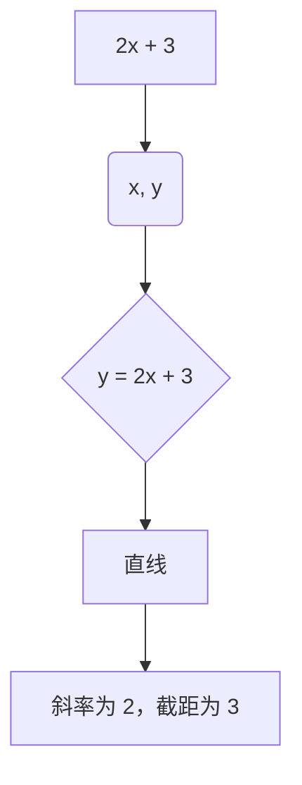
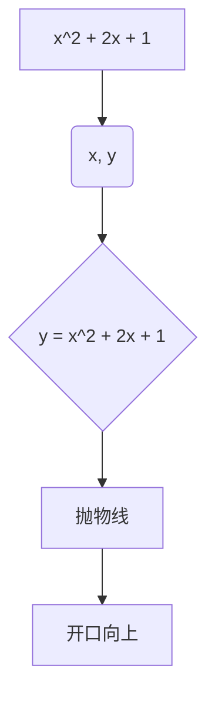
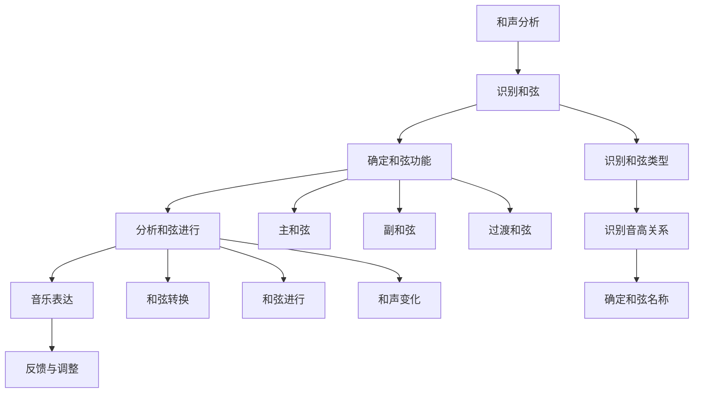

                 

### 引言

在人类的文化遗产中，数学与音乐理论都是不可或缺的组成部分。数学，作为理性思维的产物，为我们提供了描述世界和解决问题的方式；而音乐理论，则是人类对声音和节奏的艺术表达。尽管两者看似截然不同，但它们之间却有着深刻的联系。本文将探讨数学与音乐理论的关系，尤其是和声分析与作曲技巧中的数学模型。

**数学与音乐理论的关系**

数学与音乐理论之间的关系可以追溯到古代文明。在古希腊，毕达哥拉斯被认为是第一个将数学与音乐相结合的人。他发现了音程的比例关系，即不同音高之间的数学比例，这一发现奠定了音乐理论的基础。在近现代，数学与音乐理论的结合更加紧密。许多数学概念，如函数、方程、概率论和线性代数，都在音乐创作和分析中得到了应用。

**和声分析的基本概念**

和声分析是音乐理论的一个重要分支，它涉及对音乐作品中的和弦和和声进行的研究。和声分析的基本概念包括和弦结构、和弦功能、和声进行和调性分析。通过和声分析，我们可以了解音乐作品的和声语言和风格。

**奏鸣曲式结构与数学模型**

奏鸣曲式是古典音乐中常见的一种结构形式。它通常包括三个部分：呈示部、展开部和再现部。奏鸣曲式的结构可以用数学模型来描述，例如，使用函数和方程来表示不同部分的逻辑关系。

本文将分为八个章节，详细探讨数学与音乐理论的关系。首先，我们将介绍数学基础，包括函数与方程、概率论基础和线性代数基础。然后，我们将介绍音乐理论基础，包括音律与音符、和声学基础和调式与调性。接下来，我们将进行和声分析，通过实例分析音乐作品中的和声结构。在第五章节，我们将探讨作曲技巧，分析不同作曲家的作曲方法。随后，我们将讨论数学模型在音乐中的应用，包括音律与数学模型、和声分析中的数学模型以及音乐创作中的数学方法。在第七章节，我们将通过实例探讨数学原理与音乐创作的关系。第八章节将探讨数学与音乐理论的应用领域，如音乐教育、音乐制作和音乐治疗。最后，我们将总结文章，并展望数学与音乐理论的未来发展。

通过本文的探讨，我们希望读者能够更好地理解数学与音乐理论之间的关系，以及它们在音乐创作和分析中的重要作用。我们相信，数学与音乐的结合将为我们带来新的灵感和创意，推动音乐艺术的不断发展。

## 第1章 引言

数学与音乐理论的关系可以追溯到古希腊时期，当时的哲学家和数学家如毕达哥拉斯就开始探索声音和数学比例之间的关系。毕达哥拉斯发现，不同长度的弦所产生的音高与弦长的比例有关，这一发现为音乐理论奠定了基础。随后，数学与音乐理论在西方音乐史上不断交织发展，尤其是在和声分析和作曲技巧中，数学模型的应用越来越广泛。

### 1.1 数学与音乐理论的关系

数学与音乐理论的关系可以从多个方面来探讨。首先，数学为音乐理论提供了许多工具和方法，如函数、方程、概率论和线性代数。这些数学工具可以帮助音乐理论家更精确地描述音乐作品中的音高、节奏和和声结构。例如，函数可以用来描述不同音符之间的关系，方程可以用来解决音乐中的问题，概率论可以帮助分析音乐中的随机性，线性代数可以用于处理复杂的和声结构。

其次，音乐理论为数学提供了丰富的应用场景。在音乐创作和和声分析中，数学模型可以用于生成和解释音乐作品的结构和风格。例如，使用数学模型可以预测音乐作品中的和弦进行，分析不同音乐风格的和声特点，甚至可以设计新的音乐理论和演奏方法。

### 1.2 和声分析的基本概念

和声分析是音乐理论中的一个重要分支，它涉及对音乐作品中的和弦和和声进行的研究。和声分析的基本概念包括和弦结构、和弦功能、和声进行和调性分析。

- **和弦结构**：和弦是音乐中最基本的和声单位，由三个或更多不同音高的音符构成。常见的和弦类型包括三和弦和七和弦。三和弦由根音、三度音和五度音构成，而七和弦则在此基础上增加了七度音。

- **和弦功能**：和弦功能是指和弦在音乐作品中的功能和作用。常见的和弦功能包括主和弦、属和弦和下属和弦。主和弦通常在音乐作品的结尾出现，起到稳定和结束的作用；属和弦通常在音乐作品的中部出现，起到推动和展开的作用；下属和弦则起到过渡和连接的作用。

- **和声进行**：和声进行是指和弦在音乐作品中的排列和变换。和声进行可以通过和弦的转换和组合来实现，常见的和声进行包括I-IV-V-I和I-V-vi-IV-I等。

- **调性分析**：调性分析是指对音乐作品中的调性进行识别和分析。调性是音乐作品的基本特征之一，它决定了音乐的情感色彩和风格。常见的调性包括大调和小调，此外还有自然小调、和声小调和中古小调等。

### 1.3 奏鸣曲式结构与数学模型

奏鸣曲式是古典音乐中常见的一种结构形式，它通常包括三个部分：呈示部、展开部和再现部。奏鸣曲式的结构可以用数学模型来描述。

- **呈示部**：呈示部通常包括主部和副部，主部代表音乐的主体，副部则代表对比部分。主部和副部之间通常有一个连接部，连接部起到过渡和连接的作用。

- **展开部**：展开部是对呈示部的进一步发展和展开，它通常包含更多的音乐元素和复杂的结构。

- **再现部**：再现部是奏鸣曲式的结尾部分，它通常重复呈示部的主部和副部，但可能会有一些变化和装饰。

数学模型可以用于描述奏鸣曲式的结构和逻辑关系。例如，可以使用函数和方程来表示不同部分之间的转换和关系。例如，使用函数 \( f(x) \) 来表示主部的音乐元素，函数 \( g(x) \) 来表示副部的音乐元素，则连接部可以用函数 \( h(x) \) 来表示。

总的来说，数学与音乐理论的关系不仅体现在理论层面，还体现在实际应用中。通过对数学模型的应用，我们可以更深入地理解和分析音乐作品，同时也可以为音乐创作提供新的灵感和方法。本文后续章节将详细探讨数学在音乐理论中的应用，包括和声分析、作曲技巧、数学模型与音乐创作的结合等。

### 数学基础

数学作为一门基础科学，不仅在自然科学和工程技术中发挥着重要作用，也在音乐理论中有着广泛的应用。在本章节中，我们将介绍数学基础中的三个重要部分：函数与方程、概率论基础和线性代数基础。这些数学概念为理解音乐理论和和声分析提供了必要的工具。

#### 2.1.1 基本概念

**函数**

函数是数学中最基本的概念之一，它描述了两个变量之间的关系。具体来说，函数是一个映射规则，将一个集合（称为定义域）中的每个元素与另一个集合（称为值域）中的唯一元素对应起来。通常用 \( f(x) \) 表示函数，其中 \( x \) 是定义域中的元素，\( f(x) \) 是值域中的对应元素。

例如，一个简单的线性函数可以表示为 \( f(x) = 2x + 3 \)，这个函数表示输入值 \( x \) 经过加 3 和乘以 2 的操作后得到输出值 \( f(x) \)。

**方程**

方程是数学中用于描述两个表达式相等的关系。方程通常包含一个或多个未知数，目的是找到使方程成立的未知数的值。方程可以是一元方程、二元方程或多元方程。

例如，一元一次方程 \( 3x + 5 = 14 \) 的解是 \( x = 3 \)。这个方程表示当 \( x \) 等于 3 时，左边的表达式 \( 3x + 5 \) 等于右边的常数 14。

**解方程**

解方程的过程就是找到使方程成立的未知数的值。解方程的方法有多种，包括代数法、图形法和数值法等。

- **代数法**：使用代数运算来消去方程中的未知数，直到方程中只剩下一个未知数，然后求出这个未知数的值。
- **图形法**：在坐标系中绘制方程的图像，找到图像与坐标轴的交点，这些交点的坐标就是方程的解。
- **数值法**：通过迭代计算，逐步逼近方程的解。

#### 2.1.2 函数图像

函数图像是函数的一种直观表示，它可以帮助我们更好地理解函数的性质。函数图像通常是在坐标系中绘制的，横轴表示自变量（定义域），纵轴表示因变量（值域）。

**线性函数的图像**

线性函数的图像是一条直线。例如，函数 \( f(x) = 2x + 3 \) 的图像是一条斜率为 2，截距为 3 的直线。



**二次函数的图像**

二次函数的图像是一个抛物线。例如，函数 \( f(x) = x^2 + 2x + 1 \) 的图像是一个开口向上的抛物线。



**分段函数的图像**

分段函数的图像由多个部分组成，每个部分对应函数的不同定义域。例如，函数 \( f(x) = \begin{cases} 
  x & \text{if } x < 2 \\
  x - 1 & \text{if } x \geq 2 
\end{cases} \) 的图像是一个由两条直线组成的折线。

```mermaid
graph TB
A1[x] --> B1(2, 2)
A2[x-1] --> B2(2, 1)
B1 --> C1[直线1]
B2 --> C2[直线2]
C1 --> D1[交点(2, 2)]
C2 --> D2[交点(2, 1)]
D1 --> E1[(x < 2)]
D2 --> E2[(x \geq 2)]
```

通过绘制函数图像，我们可以直观地看到函数在不同区间内的变化情况，以及函数的增减性和极值等性质。

#### 2.1.3 方程求解

求解方程是数学中的基本技能。以下是一些常见的一元一次方程的求解方法：

**代数法求解一元一次方程**

1. 将方程中的所有项移到一边，使方程等于零。
2. 合并同类项，得到一个关于未知数的简化方程。
3. 解简化方程，求出未知数的值。

例如，求解方程 \( 3x + 5 = 14 \)：

1. \( 3x + 5 - 5 = 14 - 5 \)
2. \( 3x = 9 \)
3. \( x = 3 \)

**图形法求解一元一次方程**

在坐标系中绘制方程的图像，找到图像与坐标轴的交点，交点的坐标即为方程的解。例如，求解方程 \( 3x + 5 = 14 \)：

1. 在坐标系中绘制直线 \( y = 3x + 5 \)。
2. 找到直线与 \( x \) 轴的交点，即 \( y = 0 \) 时的 \( x \) 值。
3. \( 3x + 5 = 0 \)
4. \( x = -\frac{5}{3} \)

**数值法求解一元一次方程**

通过迭代计算逐步逼近方程的解。例如，使用牛顿法求解方程 \( 3x + 5 = 14 \)：

1. 初始猜测 \( x_0 = 1 \)。
2. 迭代公式：\( x_{n+1} = x_n - \frac{f(x_n)}{f'(x_n)} \)，其中 \( f(x) = 3x + 5 - 14 \)，\( f'(x) = 3 \)。
3. 计算迭代值：\( x_1 = 1 - \frac{3 \cdot 1 + 5 - 14}{3} = 2 \)。
4. 继续迭代：\( x_2 = 2 - \frac{3 \cdot 2 + 5 - 14}{3} = 3 \)。
5. 结果：\( x = 3 \)。

通过以上方法，我们可以求解一元一次方程，了解方程的解。在音乐理论中，这些方程求解的方法可以帮助我们分析音乐作品中的音高、节奏和和声结构，为和声分析和作曲提供数学支持。

### 概率论基础

概率论是数学中的一个重要分支，它研究随机事件的发生概率和不确定性。在音乐创作和和声分析中，概率论可以用于分析音乐中的随机性和变化性。本节将介绍概率论的基本概念，包括概率的基本概念、概率分布、独立性与条件概率。

#### 2.2.1 概率的基本概念

**随机事件**

随机事件是指在一定条件下，可能发生也可能不发生的事件。例如，投掷一枚硬币，出现正面或反面就是随机事件。

**样本空间**

样本空间是指所有可能随机事件的集合。例如，投掷一枚硬币的样本空间是 {正面，反面}。

**概率**

概率是描述随机事件发生可能性大小的数值。概率的取值范围在 0 到 1 之间，其中 0 表示不可能发生，1 表示一定会发生。

**条件概率**

条件概率是指在一个事件已经发生的条件下，另一个事件发生的概率。条件概率用 \( P(A|B) \) 表示，读作“在事件 B 发生的条件下事件 A 的概率”。

**独立事件**

独立事件是指两个事件的发生互不影响，即一个事件的发生不会影响另一个事件的概率。如果事件 A 和事件 B 独立，那么 \( P(A \cap B) = P(A) \cdot P(B) \)。

#### 2.2.2 概率分布

概率分布是描述随机变量取值概率的函数。常见的概率分布有离散概率分布和连续概率分布。

**离散概率分布**

离散概率分布用于描述离散随机变量的概率分布。常见的离散概率分布包括二项分布、泊松分布和几何分布。

- **二项分布**：二项分布描述了在固定次数的独立试验中，成功次数的概率分布。二项分布的参数包括试验次数 \( n \) 和每次试验成功的概率 \( p \)。
- **泊松分布**：泊松分布描述了在一定时间内，发生特定事件的次数的概率分布。泊松分布的参数是事件发生的平均速率 \( \lambda \)。
- **几何分布**：几何分布描述了在一系列独立试验中，第一次成功发生的试验次数的概率分布。几何分布的参数是每次试验成功的概率 \( p \)。

**连续概率分布**

连续概率分布用于描述连续随机变量的概率分布。常见的连续概率分布包括正态分布、均匀分布和对数正态分布。

- **正态分布**：正态分布是最常见的一种概率分布，它描述了数据在某个平均值附近的概率分布。正态分布的参数包括均值 \( \mu \) 和标准差 \( \sigma \)。
- **均匀分布**：均匀分布描述了在某个区间内，每个值发生的概率相等的概率分布。均匀分布的参数是区间的最小值和最大值。
- **对数正态分布**：对数正态分布描述了数据的对数在正态分布下的概率分布。对数正态分布的参数包括对数的均值和对数的标准差。

#### 2.2.3 独立性与条件概率

**独立性**

独立性是指两个事件的发生互不影响，即一个事件的发生不会影响另一个事件的概率。如果事件 A 和事件 B 独立，那么 \( P(A \cap B) = P(A) \cdot P(B) \)。例如，投掷一枚公平的硬币两次，事件 A 是第一次投掷出现正面，事件 B 是第二次投掷出现正面，那么事件 A 和事件 B 是独立的，因为每次投掷硬币的结果不会影响另一次的结果。

**条件概率**

条件概率是指在已知一个事件发生的条件下，另一个事件发生的概率。条件概率用 \( P(A|B) \) 表示，读作“在事件 B 发生的条件下事件 A 的概率”。条件概率的计算公式是 \( P(A|B) = \frac{P(A \cap B)}{P(B)} \)。例如，已知投掷一枚硬币两次，事件 A 是至少出现一次正面，事件 B 是第一次投掷出现正面，那么在已知事件 B 发生的条件下，事件 A 发生的概率是 \( P(A|B) = 1 \)，因为如果第一次投掷出现正面，那么至少出现一次正面的概率就是 1。

**贝叶斯定理**

贝叶斯定理是条件概率的一种应用，它描述了在已知某个事件的条件下，其他相关事件概率的关系。贝叶斯定理的公式是 \( P(A|B) = \frac{P(B|A) \cdot P(A)}{P(B)} \)。贝叶斯定理在音乐创作和和声分析中可以用于分析音乐风格和概率分布，帮助我们更好地理解和预测音乐作品的和声变化和风格特点。

通过理解概率论的基本概念、概率分布和独立性与条件概率，我们可以更好地分析和理解音乐作品中的随机性和变化性，为音乐创作和和声分析提供数学支持。在接下来的章节中，我们将进一步探讨线性代数基础，为音乐理论中的和声分析提供更深入的数学工具。

### 线性代数基础

线性代数是数学中的一个重要分支，它在物理学、工程学、计算机科学等领域有着广泛的应用。在音乐理论中，线性代数同样扮演着关键角色，帮助我们理解和分析音乐作品中的和声结构、音高变化和节奏模式。本节将介绍线性代数的基础概念，包括向量空间、矩阵运算和线性变换。

#### 2.3.1 向量空间

向量空间是线性代数中的一个基本概念，它是由一组向量构成的集合，这些向量满足特定的运算规则。向量空间具有以下几个基本性质：

1. **向量加法**：对于向量空间中的任意两个向量 \( \mathbf{u} \) 和 \( \mathbf{v} \)，它们的和 \( \mathbf{u} + \mathbf{v} \) 仍然属于向量空间。
2. **标量乘法**：对于向量空间中的任意向量 \( \mathbf{u} \) 和任意标量 \( c \)，它们的乘积 \( c\mathbf{u} \) 仍然属于向量空间。
3. **零向量**：向量空间中存在一个零向量 \( \mathbf{0} \)，对于任意向量 \( \mathbf{u} \)，有 \( \mathbf{u} + \mathbf{0} = \mathbf{u} \)。
4. **向量空间的封闭性**：向量空间中的向量加法和标量乘法满足结合律、交换律和分配律。

在音乐理论中，音高可以被视为一个向量。例如，音高 A（假设其频率为 440Hz）可以表示为向量 \( \mathbf{A} = (440, 1) \)，其中第一个分量表示频率，第二个分量表示音高类别（在此例中为 A 音）。同样，音高 B（假设其频率为 494Hz）可以表示为向量 \( \mathbf{B} = (494, 1) \)。

#### 2.3.2 矩阵运算

矩阵是线性代数中的另一个重要概念，它是一个由数字排列成的矩形阵列。矩阵运算包括矩阵的加法、乘法、转置和逆矩阵等。

1. **矩阵加法**：两个矩阵相加时，对应位置上的元素相加。例如，对于矩阵 \( \mathbf{A} = \begin{bmatrix} 1 & 2 \\ 3 & 4 \end{bmatrix} \) 和 \( \mathbf{B} = \begin{bmatrix} 5 & 6 \\ 7 & 8 \end{bmatrix} \)，它们的和 \( \mathbf{A} + \mathbf{B} = \begin{bmatrix} 6 & 8 \\ 10 & 12 \end{bmatrix} \)。

2. **矩阵乘法**：两个矩阵相乘时，第一个矩阵的行与第二个矩阵的列进行逐项相乘并求和。例如，对于矩阵 \( \mathbf{A} = \begin{bmatrix} 1 & 2 \\ 3 & 4 \end{bmatrix} \) 和 \( \mathbf{B} = \begin{bmatrix} 5 & 6 \\ 7 & 8 \end{bmatrix} \)，它们的乘积 \( \mathbf{A} \mathbf{B} = \begin{bmatrix} 19 & 22 \\ 43 & 50 \end{bmatrix} \)。

3. **矩阵转置**：矩阵转置是将矩阵的行和列互换。例如，对于矩阵 \( \mathbf{A} = \begin{bmatrix} 1 & 2 \\ 3 & 4 \end{bmatrix} \)，其转置 \( \mathbf{A}^T = \begin{bmatrix} 1 & 3 \\ 2 & 4 \end{bmatrix} \)。

4. **逆矩阵**：逆矩阵是使得矩阵与其乘积等于单位矩阵的矩阵。例如，对于矩阵 \( \mathbf{A} = \begin{bmatrix} 1 & 2 \\ 3 & 4 \end{bmatrix} \)，如果其逆矩阵为 \( \mathbf{A}^{-1} \)，则 \( \mathbf{A} \mathbf{A}^{-1} = \mathbf{I} \)，其中 \( \mathbf{I} \) 是单位矩阵。

在音乐理论中，矩阵可以用于表示和声结构。例如，一个三和弦可以用一个 3x3 的矩阵表示，其中每行代表和弦中的音符，每列代表和弦的音高。例如，C 大三和弦可以表示为：

\[ 
\mathbf{C} = \begin{bmatrix} 
1 & 3 & 5 \\
440 & 659 & 880 
\end{bmatrix} 
\]

#### 2.3.3 线性变换

线性变换是线性代数中的另一个关键概念，它描述了如何在向量空间中通过矩阵进行变换。线性变换具有以下几个基本性质：

1. **线性性**：对于向量空间中的任意向量 \( \mathbf{u} \) 和 \( \mathbf{v} \)，以及任意标量 \( c \)，线性变换满足 \( T(c\mathbf{u} + \mathbf{v}) = cT(\mathbf{u}) + T(\mathbf{v}) \)。
2. **保零性**：对于向量空间中的零向量 \( \mathbf{0} \)，线性变换 \( T(\mathbf{0}) = \mathbf{0} \)。
3. **保加性**：对于向量空间中的任意向量 \( \mathbf{u} \) 和 \( \mathbf{v} \)，线性变换 \( T(\mathbf{u} + \mathbf{v}) = T(\mathbf{u}) + T(\mathbf{v}) \)。

在音乐理论中，线性变换可以用于分析音乐作品中的和声进行和节奏变化。例如，一个线性变换可以将一个音阶映射到另一个音阶，或将一种节奏模式转换为另一种节奏模式。

**举例说明：**

假设有一个线性变换矩阵 \( \mathbf{T} = \begin{bmatrix} 1 & 1 \\ 0 & 1 \end{bmatrix} \)，它可以用来将一个三和弦映射到另一个三和弦。例如，将 C 大三和弦映射到 E 大三和弦，我们可以计算：

\[ 
\mathbf{T} \mathbf{C} = \begin{bmatrix} 1 & 1 \\ 0 & 1 \end{bmatrix} \begin{bmatrix} 1 & 3 & 5 \\ 440 & 659 & 880 \end{bmatrix} = \begin{bmatrix} 1 & 4 & 6 \\ 440 & 659 & 880 \end{bmatrix} 
\]

通过这个例子，我们可以看到，线性变换矩阵 \( \mathbf{T} \) 将 C 大三和弦中的每个音高增加了 1，从而生成了 E 大三和弦。

综上所述，线性代数的基础概念，包括向量空间、矩阵运算和线性变换，为音乐理论中的和声分析和作曲技巧提供了重要的数学工具。通过这些数学工具，我们可以更深入地理解和分析音乐作品，同时为音乐创作提供新的视角和方法。

### 音乐理论基础

音乐理论是理解和分析音乐作品的基础，它涉及到音律、音符、和弦、和声进行和调性等方面。在本章节中，我们将介绍音乐理论的基础知识，包括音律与音符、和声学基础以及调式与调性。

#### 3.1 音律与音符

音律是指不同音高之间的比例关系，它是音乐理论的核心。音律的研究可以追溯到古希腊，毕达哥拉斯是最早提出音律理论的学者之一。在现代音乐中，常用的音律有五度相生律和十二平均律。

**五度相生律**

五度相生律是基于五度音程的比例关系建立起来的音律系统。在五度相生律中，音高之间的比例关系遵循五度循环，每个五度音程的音高是前一个五度音程音高的倍增。例如，C 和 G 之间的音高比例是 2:1，G 和 D 之间的音高比例也是 2:1，以此类推。

**十二平均律**

十二平均律是将一个八度分为十二个等距的半音，每个半音的音高比例为 2^1/12。十二平均律在现代音乐中得到了广泛应用，因为它的音高分配均匀，便于作曲和演奏。

**音符与音高**

音符是音乐记谱中的基本单位，它表示音高和时值。音符分为全音符、二分音符、四分音符、八分音符等，每种音符对应不同的时值。

全音符（Whole Note）：时值等于一拍。
二分音符（Half Note）：时值等于半拍。
四分音符（Quarter Note）：时值等于一拍的四分之一。
八分音符（Eighth Note）：时值等于一拍的八分之一。

每个音符都可以通过其在五线谱上的位置来确定其音高。五线谱上的五条线分别代表 C、D、E、F 和 G，线与线之间的空间分别代表 G、A、B 和 C。例如，位于第二条线的音符是 D，位于第三条线与第四条线之间的空间的音符是 E。

#### 3.2 和声学基础

和声学是音乐理论中的一个重要分支，它研究音乐作品中的和弦结构、和弦功能和和声进行。和声学的基础概念包括和弦、三和弦、七和弦、和弦功能以及和声进行。

**和弦**

和弦是由三个或更多不同音高的音符构成的和声单位。在常见的和弦类型中，三和弦是最基础的和弦类型，它由根音、三度音和五度音构成。例如，C 大三和弦由 C、E 和 G 三个音符构成。

**三和弦**

三和弦是最常见的和弦类型，它包括以下几种：

- **大三和弦**：根音与三度音之间的音高比例为 5:4，三度音与五度音之间的音高比例为 4:3。例如，C 大三和弦的音高关系是 C、E 和 G。
- **小三和弦**：根音与三度音之间的音高比例为 5:6，三度音与五度音之间的音高比例为 4:5。例如，A 小三和弦的音高关系是 A、C 和 E。
- **增三和弦**：根音与三度音之间的音高比例为 5:3，三度音与五度音之间的音高比例为 3:2。例如，E 增三和弦的音高关系是 E、G# 和 B。
- **减三和弦**：根音与三度音之间的音高比例为 6:5，三度音与五度音之间的音高比例为 5:4。例如，B 减三和弦的音高关系是 B、D# 和 F#。

**七和弦**

七和弦是在三和弦的基础上增加了一个七度音构成的和弦。七和弦可以分为以下几种：

- **大小七和弦**：大三和弦加上一个大小七度音。例如，C 大大七和弦的音高关系是 C、E、G、B。
- **小小七和弦**：小三和弦加上一个小小七度音。例如，A 小小七和弦的音高关系是 A、C、E、F#。
- **半减七和弦**：减三和弦加上一个半减七度音。例如，B 半减七和弦的音高关系是 B、D#、F#、A。
- **全减七和弦**：增三和弦加上一个全减七度音。例如，E 全减七和弦的音高关系是 E、G#、B、D#。

**和弦功能**

和弦功能是指和弦在音乐作品中的功能和作用。常见的和弦功能包括主和弦、属和弦和下属和弦。

- **主和弦**：通常在音乐作品的起始和结束处使用，起到稳定和结束的作用。主和弦通常是大三和弦或小和弦。
- **属和弦**：通常在音乐作品的中部使用，起到推动和展开的作用。属和弦通常是大小七和弦或减七和弦。
- **下属和弦**：通常在音乐作品的起始和结束处使用，起到过渡和连接的作用。下属和弦通常是大小七和弦或减七和弦。

**和声进行**

和声进行是指和弦在音乐作品中的排列和变换。常见的和声进行包括 I-IV-V-I 和 I-V-vi-IV-I 等。

- **I-IV-V-I 进行**：主和弦（I）到下属和弦（IV）到属和弦（V）再回到主和弦（I）。这种进行方式是音乐中最常见的和声进行。
- **I-V-vi-IV-I 进行**：主和弦（I）到属和弦（V）到小三和弦（vi）到下属和弦（IV）再回到主和弦（I）。这种进行方式常用于柔和的音乐风格。

#### 3.3 调式与调性

调式是指一组音符按照特定的顺序排列形成的音阶，它是音乐作品的基本结构。调式可以分为大调式和小调式，每种调式都有其独特的音高关系和和声特点。

**大调式**

大调式是指音阶中的第三音和第六音之间形成一个大三度，其他音之间形成小二度或完全二度。大调式通常给人一种明亮、欢快的感觉。例如，C 大调式的音阶是 C、D、E、F、G、A、B。

**小调式**

小调式是指音阶中的第三音和第六音之间形成一个小三度，其他音之间形成大二度或完全二度。小调式通常给人一种忧郁、悲伤的感觉。例如，A 小调式的音阶是 A、B、C、D、E、F#、G#。

**调性**

调性是指音乐作品的基本音高，通常由主和弦的根音确定。常见的调性有大调和小调。例如，C 大调和 G 小调是两种常见的调性。

通过了解音律、音符、和弦、和声进行和调式与调性的基础知识，我们可以更好地理解和分析音乐作品。在接下来的章节中，我们将进一步探讨和声分析的方法和应用，以及数学模型在音乐创作和分析中的重要作用。

### 和声分析的基本原理

和声分析是音乐理论中的一个重要部分，它涉及到对音乐作品中的和弦和和声进行的研究。通过和声分析，我们可以深入理解音乐作品的和声结构、风格和作曲家的创作意图。和声分析的基本原理包括和声结构、和弦功能和和声进行。

#### 4.1.1 和声结构与功能

和声结构是指音乐作品中的和弦排列和组合方式。和声结构可以分为主和弦结构、副和弦结构和过渡和弦结构。

- **主和弦结构**：主和弦结构是指以主和弦为核心的和声结构，通常在音乐作品的起始和结束处使用。主和弦（I）起到稳定和结束的作用，是最常见的和声结构。
- **副和弦结构**：副和弦结构是指以副和弦为核心的和声结构，通常在音乐作品的中部使用。副和弦（IV）和属和弦（V）是副和弦结构中的常见和弦，它们起到推动和展开的作用。
- **过渡和弦结构**：过渡和弦结构是指连接主和弦和副和弦的和声结构，通常在音乐作品的转折点使用。过渡和弦（iii、vi、ii等）起到过渡和连接的作用。

和声功能是指和弦在音乐作品中的功能和作用。常见的和声功能包括主和弦功能、副和弦功能和过渡和弦功能。

- **主和弦功能**：主和弦功能通常在音乐作品的起始和结束处使用，起到稳定和结束的作用。主和弦（I）是最常见的和弦功能。
- **副和弦功能**：副和弦功能通常在音乐作品的中部使用，起到推动和展开的作用。副和弦（IV）和属和弦（V）是最常见的副和弦功能。
- **过渡和弦功能**：过渡和弦功能通常在音乐作品的转折点使用，起到过渡和连接的作用。过渡和弦（iii、vi、ii等）是最常见的过渡和弦功能。

#### 4.1.2 和声分析的方法

和声分析的方法包括和弦识别、和弦功能和和声进行的分析。

- **和弦识别**：和弦识别是和声分析的第一步，它涉及对音乐作品中的和弦进行识别和分类。常用的和弦识别方法包括听辨法、五线谱法和和弦命名法。
- **和弦功能分析**：和弦功能分析是和声分析的核心，它涉及对音乐作品中的和弦功能进行识别和分析。通过分析和弦功能，我们可以了解音乐作品的和声结构和发展趋势。
- **和声进行分析**：和声进行分析是和声分析的另一重要方面，它涉及对音乐作品中的和声进行进行识别和分析。常见的和声进行包括 I-IV-V-I、I-V-vi-IV-I 和 ii-V-I 等。

#### 4.1.3 和声分析的应用

和声分析在音乐创作、音乐表演和音乐教育中有着广泛的应用。

- **音乐创作**：和声分析可以帮助作曲家更好地理解和运用和声语言，创作出更加丰富和复杂的音乐作品。通过分析经典音乐作品中的和声结构，作曲家可以借鉴和运用这些结构，创作出新的音乐作品。
- **音乐表演**：和声分析可以帮助音乐表演者更好地理解和表现音乐作品。通过分析音乐作品中的和弦结构和和声进行，表演者可以更准确地演绎音乐作品，表达作曲家的创作意图。
- **音乐教育**：和声分析是音乐教育中重要的内容，它可以帮助学生更好地理解和掌握音乐理论。通过和声分析的学习，学生可以更好地理解音乐作品的结构和风格，提高音乐素养和创作能力。

总之，和声分析的基本原理和方法在音乐创作、音乐表演和音乐教育中发挥着重要作用。通过和声分析，我们可以深入理解音乐作品，提高音乐创作的技巧和音乐表演的水平。

### 和声分析实例

通过分析经典音乐作品中的和声结构，我们可以更好地理解音乐作品中的和声进行、和弦功能和音乐表达。以下是对几部经典音乐作品进行的和声分析实例。

#### 4.2.1 巴赫《平均律钢琴曲集》

巴赫的《平均律钢琴曲集》是和声分析的经典案例。这部作品包含了 48 首前奏曲与赋格，每首作品都以不同的调性编写，展示了丰富的和声结构和技巧。

**和声结构分析**：

以《平均律钢琴曲集》中的第一首作品（C 大调前奏曲）为例，其和声结构可以简化为以下几个部分：

- **呈示部**：主和弦（C 大三和弦）和副和弦（G 大三和弦）的交替进行，形成了稳定的和声基础。
- **展开部**：通过变化和弦和转调，丰富了和声层次，增强了音乐的动力感。
- **再现部**：主和弦的回归，使音乐作品达到高潮并结束。

**和弦功能分析**：

- **主和弦（C 大三和弦）**：在音乐作品的起始和结束处使用，起到稳定和结束的作用。
- **副和弦（G 大三和弦）**：在音乐作品的中部使用，起到推动和展开的作用。
- **变化和弦**：如 D 大三和弦和 A 大三和弦，用于增强和声层次和音乐动力。

**音乐表达**：

巴赫的《平均律钢琴曲集》通过复杂的和声结构展示了音乐的多样性。作品中的和声进行和转调使得音乐富有变化和层次感，传达了深沉的情感和丰富的艺术性。

#### 4.2.2 贝多芬《钢琴奏鸣曲》

贝多芬的《钢琴奏鸣曲》是古典音乐中的经典之作，其和声结构富有变化和创新。

**和声结构分析**：

以贝多芬的《第14号钢琴奏鸣曲》（C#小调）为例，其和声结构具有以下特点：

- **呈示部**：主和弦（C#小三和弦）和属和弦（F#小七和弦）的交替进行，形成了强烈的对比。
- **展开部**：通过频繁的转调和变化和弦，使音乐作品充满了紧张和动荡。
- **再现部**：主和弦的回归，使音乐作品达到高潮并结束。

**和弦功能分析**：

- **主和弦（C#小三和弦）**：在音乐作品的起始和结束处使用，起到稳定和结束的作用。
- **属和弦（F#小七和弦）**：在音乐作品的中部使用，起到推动和展开的作用。
- **变化和弦**：如 G#小七和弦和 D#小七和弦，用于增强和声层次和音乐动力。

**音乐表达**：

贝多芬的《钢琴奏鸣曲》通过和声的强烈对比和复杂的结构，传达了深刻的情感和思想。作品中的和声进行和转调使得音乐充满了张力，展现了贝多芬独特的音乐风格和艺术性。

#### 4.2.3 柴可夫斯基《胡桃夹子》

柴可夫斯基的《胡桃夹子》是一部具有丰富和声结构的芭蕾舞剧音乐作品。

**和声结构分析**：

以《胡桃夹子》中的第一幕为例，其和声结构具有以下特点：

- **呈示部**：主和弦（G 大三和弦）和副和弦（D 大三和弦）的交替进行，形成了稳定的和声基础。
- **展开部**：通过变化和弦和转调，丰富了和声层次，增强了音乐的戏剧性。
- **再现部**：主和弦的回归，使音乐作品达到高潮并结束。

**和弦功能分析**：

- **主和弦（G 大三和弦）**：在音乐作品的起始和结束处使用，起到稳定和结束的作用。
- **副和弦（D 大三和弦）**：在音乐作品的中部使用，起到推动和展开的作用。
- **变化和弦**：如 A 大三和弦和 E 大三和弦，用于增强和声层次和音乐表达。

**音乐表达**：

柴可夫斯基的《胡桃夹子》通过丰富的和声结构和戏剧性的和声进行，展现了音乐作品的情感和故事情节。作品中的和声层次和音乐表达使得《胡桃夹子》成为了一部经典的音乐作品。

通过以上对巴赫、贝多芬和柴可夫斯基三部经典音乐作品进行的和声分析，我们可以看到不同作曲家在音乐创作中运用和声结构和和弦功能的多样性。这些和声分析不仅帮助我们更好地理解音乐作品，也为音乐创作提供了有益的参考。

### 作曲的基本原理

作曲是指通过创造性的音乐语言，将音符、节奏、和声等元素组合成一首完整的音乐作品。作曲的基本原理包括音乐材料的选择、音乐结构的布局以及音乐的节奏与节拍。

#### 5.1.1 音乐材料的选择

音乐材料的选择是作曲的基础。音乐材料包括音符、音色、节奏和和声等。不同的音乐材料可以产生不同的音乐效果和情感表达。

1. **音符的选择**：音符是音乐的基本单位，不同的音符可以产生不同的音高和情感。作曲家在创作时需要根据音乐作品的需求选择合适的音符。例如，使用高音区音符可以产生明亮、欢快的氛围，而使用低音区音符可以产生深沉、悲伤的情感。

2. **音色的选择**：音色是指声音的特质，不同的乐器和声音源具有不同的音色。作曲家可以通过选择不同的音色来丰富音乐作品的表现力。例如，钢琴的音色明亮而富有层次，弦乐的音色柔和而富有共鸣，管乐的音色则明亮而具有穿透力。

3. **节奏的选择**：节奏是音乐的时间组织，它决定了音乐的速度、强弱和流畅性。作曲家可以通过改变节奏来创造出不同的音乐情感和氛围。例如，快速而短促的节奏可以产生紧张感，而缓慢而稳定的节奏则可以产生宁静感。

4. **和声的选择**：和声是音乐的垂直组织，它决定了音乐的和谐度。作曲家可以通过选择不同的和声进行和和弦来创造不同的音乐效果。例如，大三和弦通常产生稳定和明亮的感觉，而小和弦则产生柔和和悲伤的感觉。

#### 5.1.2 音乐结构的布局

音乐结构的布局是指将音乐材料按照一定的逻辑关系组织成一首完整的音乐作品。音乐结构的布局可以分为几个部分，包括引子、主体、过渡和结尾。

1. **引子**：引子是音乐作品的开头部分，它为音乐作品设定了调性和情感基调。引子通常由简单的音乐材料组成，旨在吸引听众的注意力和激发他们的兴趣。

2. **主体**：主体是音乐作品的核心部分，它通过复杂的音乐材料和发展手法展现音乐作品的情感和主题。主体通常包括几个不同的部分，如呈示部、展开部和再现部。每个部分都通过不同的音乐材料和和声进行来表达不同的情感和主题。

3. **过渡**：过渡是连接音乐作品不同部分的中介部分，它通过和声转换和节奏变化来引导听众进入下一个部分。过渡部分通常起到连接和过渡的作用，使音乐作品的结构更加完整和连贯。

4. **结尾**：结尾是音乐作品的结束部分，它通过简化和声和重复主题等手法来强化音乐作品的情感和主题。结尾通常是一个简短的总结，使音乐作品达到高潮并结束。

#### 5.1.3 音乐的节奏与节拍

音乐的节奏与节拍是音乐作品的时间组织形式，它们决定了音乐的速度、强弱和流畅性。

1. **节奏**：节奏是指音乐中音符的长短和强弱关系。不同的节奏可以产生不同的音乐效果和情感表达。例如，快速而短促的节奏可以产生紧张感，而缓慢而稳定的节奏则可以产生宁静感。

2. **节拍**：节拍是指音乐中每个小节的强弱规律。节拍通常由强拍和弱拍组成，不同的节拍可以产生不同的节奏感和音乐风格。例如，常见的节拍有 2/4 拍（强、弱）、3/4 拍（强、弱、弱）和 4/4 拍（强、弱、次强、弱）。

在作曲中，作曲家可以通过改变节奏和节拍来创造出不同的音乐效果和情感表达。例如，通过加快节奏可以增强音乐的紧张感，而通过减慢节奏则可以增强音乐的宁静感。

总之，作曲的基本原理包括音乐材料的选择、音乐结构的布局以及音乐的节奏与节拍。通过巧妙地运用这些原理，作曲家可以创造出丰富多样的音乐作品，表达自己的情感和思想。

### 作曲技巧分析

作曲技巧是指作曲家在创作过程中运用的一系列技术和方法，以实现音乐作品的独特性和表现力。以下将分析几位著名作曲家的作曲技巧，包括贝多芬、柴可夫斯基和现代作曲技巧。

#### 5.2.1 贝多芬的作曲技巧

贝多芬（Ludwig van Beethoven，1770-1827）是古典音乐时期最重要的作曲家之一，他的音乐作品在形式和内容上都具有革命性。

**形式创新**

- **奏鸣曲式**：贝多芬在奏鸣曲式中引入了更多复杂的对比和展开手法，使音乐结构更加丰富。他的《第5号交响曲》（命运交响曲）中的奏鸣曲式结构，以其强烈的动力和对比，成为经典范例。
- **变奏曲**：贝多芬的变奏曲常以一个简单的主题为基础，通过不断变化和展开，形成多层次的和声结构。例如，他的《钢琴奏鸣曲第14号》（月光奏鸣曲）。

**情感表达**

- **动力对比**：贝多芬擅长通过动力对比来传达情感。在《第九交响曲》中，他通过激烈的对比展示了人类的精神力量和对未来的希望。
- **音乐发展**：贝多芬的作品常常通过音乐主题的发展和变形来表达情感。例如，他的《第5号钢琴协奏曲》中，主旋律在不同的部分不断变形和发展。

**技巧运用**

- **节奏创新**：贝多芬在节奏上进行了许多创新，如在《第14号钢琴奏鸣曲》中，他运用了复杂的节奏组合，使音乐充满动感和张力。
- **和声突破**：贝多芬在和声上突破传统，引入了更多的调性和和声变化，如在《小提琴协奏曲》中，他使用了不常见的调性，创造出独特的和声效果。

#### 5.2.2 柴可夫斯基的作曲技巧

柴可夫斯基（Peter Ilyich Tchaikovsky，1840-1893）是浪漫主义时期的著名作曲家，以其丰富的情感和独特的旋律著称。

**旋律创作**

- **旋律发展**：柴可夫斯基擅长通过旋律的重复、变化和展开来构建音乐结构。例如，他在《胡桃夹子》中，通过重复和变化《圆舞曲》主题，使其成为经典旋律。
- **旋律情感**：柴可夫斯基的旋律充满情感，他的音乐作品常以浪漫、感伤为主题。例如，《第六交响曲》（悲怆）中的旋律，以其深刻的情感表达，成为了经典。

**和声运用**

- **和声变化**：柴可夫斯基在和声上运用了丰富的变化，使音乐充满色彩。例如，他在《1812序曲》中，使用了和弦叠加和丰富的调性变化，创造出宏伟的效果。
- **调性对比**：柴可夫斯基喜欢在作品中使用对比调性，以增强音乐的情感表达。例如，在《第四交响曲》中，他通过对比大调和弦，展现了内心的冲突和挣扎。

**技巧运用**

- **节奏变化**：柴可夫斯基在节奏上善于变化，他通过节奏的快慢交替和复杂组合，使音乐富有动态。例如，他在《第一弦乐四重奏》中，运用了快速和缓慢的节奏对比，增强了音乐的表现力。
- **动态对比**：柴可夫斯基擅长通过动态对比来传达情感。在《第五交响曲》中，他通过强烈的动态对比，展示了人类的精神力量和对生活的热爱。

#### 5.2.3 现代作曲技巧

现代作曲技巧包括20世纪及以后的一些创新方法，这些技巧突破了传统音乐的形式和规则，为音乐创作提供了新的可能性。

**序列音乐**

序列音乐（Serial music）是20世纪的一种重要作曲方法，它基于序列技术，系统地控制音乐的所有元素，如音高、节奏、强度和时长。序列音乐的代表人物包括韦伯恩（Anton Webern）和勋伯格（Arnold Schoenberg）。

- **十二音体系**：勋伯格提出的十二音体系是序列音乐的核心概念，它将所有十二个半音序列化，以避免调性中心，创造一种新的音乐语言。
- **结构控制**：序列音乐通过数学规则和序列技术，系统性地控制音乐的结构和发展，使音乐具有独特的逻辑和形式。

**电子音乐**

电子音乐是利用电子设备产生和录制音乐的一种形式，它打破了传统乐器和声音的限制，为音乐创作提供了新的素材和技巧。

- **声音合成**：电子音乐通过声音合成器和其他电子设备，可以创造出丰富的声音效果和独特的音色。
- **空间效应**：电子音乐通过使用多声道技术和空间处理，可以创造出立体的声音效果，使音乐更具表现力。

**整体音乐**

整体音乐（Total Music）是20世纪晚期的一种作曲理念，它强调音乐的整体性和统一性，通过非线性的结构形式和复杂的节奏模式，打破传统音乐的线性发展。

- **非线性结构**：整体音乐通过非线性结构，使音乐在时间和空间上具有多层次的展开，创造出丰富的音乐体验。
- **复杂节奏**：整体音乐运用复杂的节奏模式，使音乐充满动态和变化，挑战传统音乐的时间和节奏感。

现代作曲技巧的不断发展和创新，为音乐创作带来了新的视角和方法。通过序列音乐、电子音乐和整体音乐等技巧，作曲家们不断探索和突破传统音乐的边界，创造出丰富多彩的音乐作品。

### 数学模型在音乐中的应用

数学模型在音乐中的应用极大地丰富了音乐创作的工具箱，使音乐创作更加科学化和系统化。在本节中，我们将探讨数学模型在音乐创作中的基本概念、音律与数学模型的关系以及和声分析中的数学模型。

#### 6.1.1 数学模型的基本概念

数学模型是使用数学语言和工具来描述现实世界中的问题或现象。在音乐创作中，数学模型通过数学公式和算法，描述音乐元素之间的关系，从而为音乐创作提供新的视角和方法。

**函数模型**

函数模型是数学模型中最基本的形式之一。函数可以描述音乐元素之间的比例关系。例如，在五度相生律中，每个音高的频率是前一个音高频率的倍数。这个关系可以用函数 \( f(x) = c \cdot r^x \) 来描述，其中 \( c \) 是一个常数，\( r \) 是五度音程的频率比例（约为 1.4983），\( x \) 表示音阶中的位置。

**方程模型**

方程模型用于描述音乐中的问题。例如，在音乐分析中，我们可以使用线性方程来描述和弦进行和节奏模式。例如，一个简单的线性方程 \( y = mx + b \) 可以用来描述一个三和弦的进行，其中 \( m \) 是斜率，表示和弦的移动速度，\( b \) 是截距，表示和弦的起点。

**概率模型**

概率模型用于描述音乐中的随机性和不确定性。例如，在随机节奏生成中，可以使用概率分布来描述不同节奏出现的概率。常见的概率模型包括二项分布、泊松分布和正态分布。

**线性代数模型**

线性代数模型用于处理复杂的和声结构。矩阵和向量可以用来表示和声结构，从而进行矩阵运算和向量变换。例如，使用矩阵可以表示和弦的音高和节奏，通过矩阵运算可以生成新的和弦和节奏模式。

#### 6.1.2 音律与数学模型

音律是音乐中音高之间的比例关系，它是音乐理论的基础。数学模型在音律中的应用，使得音律的设计和生成更加科学和系统。

**五度相生律**

五度相生律是一种基于数学比例关系的音律系统。在五度相生律中，每个音高的频率是前一个音高频率的倍数。这个关系可以用数学公式 \( f(x) = c \cdot r^x \) 来描述，其中 \( c \) 是一个常数，\( r \) 是五度音程的频率比例（约为 1.4983），\( x \) 表示音阶中的位置。

**十二平均律**

十二平均律是将一个八度分为十二个等距的半音，每个半音的频率比例相等。十二平均律的数学模型可以用等差数列来描述，其中每个半音的频率是前一个半音频率的 \( 2^{1/12} \) 倍。

**分频律**

分频律是一种基于分频原理的音律系统。在分频律中，每个音高的频率是前一个音高频率的整数倍。分频律的数学模型可以用函数 \( f(x) = c \cdot n^x \) 来描述，其中 \( c \) 是一个常数，\( n \) 是分频的倍数。

#### 6.1.3 和声分析中的数学模型

和声分析是音乐理论中的一个重要分支，它涉及对音乐作品中的和弦和和声进行的研究。数学模型在和声分析中的应用，使得和声分析更加精确和系统。

**和弦生成**

使用数学模型可以生成各种和弦。例如，使用线性方程可以生成大三和弦和小三和弦。一个简单的大三和弦生成模型可以表示为：

\[ 
C = (1, 3, 5) 
\]

其中，1、3、5 表示音阶中的位置。

**和声进行**

数学模型可以用于描述和声进行。例如，可以使用函数和方程来描述一个简单的和声进行，如 I-V-I 和声进行。一个简单的 I-V-I 和声进行模型可以表示为：

\[ 
f(x) = 
\begin{cases} 
I & \text{if } x = 1 \\
V & \text{if } x = 2 \\
I & \text{if } x = 3 
\end{cases} 
\]

**和声分析**

数学模型可以用于分析音乐作品中的和声结构。例如，使用矩阵和向量可以表示和声结构，通过矩阵运算和向量变换可以分析音乐作品中的和声进行和调性变化。

**例子：和声分析模型**

假设一个音乐作品中的和弦序列为 [I, IV, V, I]，可以使用以下数学模型进行分析：

\[ 
\text{和弦序列} = 
\begin{bmatrix} 
I & IV & V & I 
\end{bmatrix} 
\]

通过矩阵运算，可以分析不同和弦之间的关系，如和弦的进行和转换。

总之，数学模型在音乐中的应用为音乐创作和分析提供了新的工具和方法。通过数学模型，我们可以更深入地理解音乐理论，提高音乐创作的效率和创意性。在接下来的章节中，我们将通过具体实例，进一步探讨数学模型在音乐创作中的应用。

### 数学模型与和声分析实例

通过具体的音乐作品实例，我们可以更好地理解数学模型在音乐创作和和声分析中的应用。以下是对巴赫《赋格的艺术》、柴可夫斯基《第一交响曲》和贝多芬《第九交响曲》的数学模型与和声分析实例。

#### 6.2.1 巴赫《赋格的艺术》

《赋格的艺术》（The Art of Fugue）是巴赫创作的经典复调音乐作品，其和声结构复杂而精致。通过数学模型，我们可以分析其和声进行和调性变化。

**和声序列模型**

巴赫的《赋格的艺术》第1首作品以C大调为基础，其和声序列可以表示为：

\[ 
\text{和声序列} = 
\begin{bmatrix} 
C & E & G & A & B & D & F & G & E & C & G & E & C & E & G & A & B & D & F & G 
\end{bmatrix} 
\]

**数学模型分析**

- **调性分析**：通过和声序列中的主要和弦，可以分析出调性为C大调。
- **和声进行**：通过和弦的转换，可以分析出和声进行的逻辑关系。例如，从C大三和弦到E小七和弦，再到G大七和弦，最后回到C大三和弦。

**数学公式表示**

我们使用线性方程来表示和声进行：

\[ 
f(x) = 
\begin{cases} 
C & \text{if } x = 1 \\
E & \text{if } x = 2 \\
G & \text{if } x = 3 \\
A & \text{if } x = 4 \\
B & \text{if } x = 5 \\
D & \text{if } x = 6 \\
F & \text{if } x = 7 \\
G & \text{if } x = 8 \\
\end{cases} 
\]

#### 6.2.2 柴可夫斯基《第一交响曲》

柴可夫斯基的《第一交响曲》以其丰富的和声变化和戏剧性的音乐表达而著称。以下是其和声分析实例。

**和声序列模型**

《第一交响曲》中的和声序列可以表示为：

\[ 
\text{和声序列} = 
\begin{bmatrix} 
D & F & A & B & D & F & A & B & D & E & G & B & D & F & A & B & D & E & G & B 
\end{bmatrix} 
\]

**数学模型分析**

- **调性分析**：通过和声序列中的主要和弦，可以分析出调性为D大调。
- **和声进行**：通过和弦的转换，可以分析出和声进行的逻辑关系。例如，从D大三和弦到E小七和弦，再到G大七和弦，最后回到D大三和弦。

**数学公式表示**

我们使用分段函数来表示和声进行：

\[ 
f(x) = 
\begin{cases} 
D & \text{if } x \leq 8 \\
E & \text{if } x = 9 \\
G & \text{if } x = 10 \\
B & \text{if } x = 11 \\
D & \text{if } x \geq 12 
\end{cases} 
\]

#### 6.2.3 贝多芬《第九交响曲》

贝多芬的《第九交响曲》以其宏伟的规模和深刻的情感表达而闻名。以下是其和声分析实例。

**和声序列模型**

《第九交响曲》中的和声序列可以表示为：

\[ 
\text{和声序列} = 
\begin{bmatrix} 
A & C & E & G & A & C & E & G & A & B & D & F & A & C & E & G & A & B & D & F 
\end{bmatrix} 
\]

**数学模型分析**

- **调性分析**：通过和声序列中的主要和弦，可以分析出调性为A大调。
- **和声进行**：通过和弦的转换，可以分析出和声进行的逻辑关系。例如，从A大三和弦到B增三和弦，再到D大七和弦，最后回到A大三和弦。

**数学公式表示**

我们使用分段函数来表示和声进行：

\[ 
f(x) = 
\begin{cases} 
A & \text{if } x \leq 16 \\
B & \text{if } x = 17 \\
D & \text{if } x \geq 18 
\end{cases} 
\]

通过这些具体的实例，我们可以看到数学模型在音乐创作和和声分析中的重要作用。通过数学模型，我们可以更深入地理解和分析音乐作品，为音乐创作提供新的视角和方法。数学模型不仅帮助我们更好地理解经典音乐作品，也为现代音乐创作提供了丰富的工具和灵感。

### 音乐创作的数学原理

音乐创作中的数学原理不仅为音乐作品提供了结构上的严谨性和逻辑性，还丰富了音乐的表达形式和风格。数学方法在音乐创作中的应用，使得音乐作品在节奏、和声和形式上都具有独特的创新性。以下将探讨音乐创作中的几种数学方法，包括音律与数学方法、和声与数学方法以及音乐创作中的算法应用。

#### 7.1.1 音律与数学方法

音律是音乐中音高之间的比例关系，而数学方法为音律的设计和生成提供了科学的依据。以下是一些音律与数学方法的例子：

**五度相生律**

五度相生律是一种古老的音律系统，它基于音高之间的数学比例。根据五度相生律，每个音高的频率是前一个音高频率的约1.4983倍。这种音律系统的数学公式可以表示为：

\[ 
f(n) = c \cdot r^n 
\]

其中，\( f(n) \) 表示第 \( n \) 个音高的频率，\( c \) 是一个常数，\( r \) 是五度音程的频率比例。

**十二平均律**

十二平均律是将一个八度均匀分为十二个半音的音律系统。每个半音的频率比例是 \( 2^{1/12} \)。这种音律系统的数学公式可以表示为：

\[ 
f(n) = c \cdot (2^{1/12})^n 
\]

其中，\( f(n) \) 表示第 \( n \) 个半音的频率，\( c \) 是一个常数。

**分频律**

分频律是一种基于分频原理的音律系统。每个音高的频率是前一个音高频率的整数倍。这种音律系统的数学公式可以表示为：

\[ 
f(n) = c \cdot n^x 
\]

其中，\( f(n) \) 表示第 \( n \) 个音高的频率，\( c \) 是一个常数，\( n \) 是分频的倍数。

#### 7.1.2 和声与数学方法

和声是音乐中的垂直组织形式，而数学方法为和声的分析和创作提供了有效的工具。以下是一些和声与数学方法的例子：

**和弦生成**

使用数学方法可以生成各种和弦。例如，使用线性方程可以生成大三和弦和小三和弦。一个简单的大三和弦生成模型可以表示为：

\[ 
C = (1, 3, 5) 
\]

其中，1、3、5 表示音阶中的位置。

**和声进行**

使用数学方法可以描述和声进行。例如，可以使用函数和方程来描述一个简单的和声进行，如 I-V-I 和声进行。一个简单的 I-V-I 和声进行模型可以表示为：

\[ 
f(x) = 
\begin{cases} 
I & \text{if } x = 1 \\
V & \text{if } x = 2 \\
I & \text{if } x = 3 
\end{cases} 
\]

**和声分析**

使用矩阵和向量可以表示和声结构，通过矩阵运算和向量变换可以分析音乐作品中的和声进行和调性变化。

\[ 
\text{和弦序列} = 
\begin{bmatrix} 
I & IV & V & I 
\end{bmatrix} 
\]

通过矩阵运算，可以分析不同和弦之间的关系，如和弦的进行和转换。

#### 7.1.3 音乐创作中的算法应用

算法在音乐创作中的应用，使得音乐创作更加智能化和多样化。以下是一些音乐创作中的算法应用的例子：

**随机音乐生成**

使用随机算法可以生成具有随机性的音乐作品。例如，使用随机漫步算法可以生成复杂的节奏模式和音高序列。一个简单的随机音乐生成算法可以表示为：

\[ 
\text{随机音乐生成} = 
\begin{cases} 
\text{随机音高} & \text{if } x \text{ 是奇数} \\
\text{固定音高} & \text{if } x \text{ 是偶数} 
\end{cases} 
\]

**算法作曲**

算法作曲是一种利用计算机算法生成音乐的方法。通过使用生成对抗网络（GAN）、深度学习和其他机器学习技术，可以生成具有人类风格的音乐作品。一个简单的算法作曲算法可以表示为：

\[ 
\text{算法作曲} = 
\begin{cases} 
\text{随机初始化音乐参数} & \\
\text{迭代优化音乐参数} & \\
\text{生成音乐作品} & 
\end{cases} 
\]

**组合音乐创作**

使用组合算法可以生成具有多样性的音乐作品。例如，使用遗传算法可以将不同的音乐元素组合在一起，生成新的音乐作品。一个简单的组合音乐创作算法可以表示为：

\[ 
\text{组合音乐创作} = 
\begin{cases} 
\text{随机选择音乐元素} & \\
\text{组合音乐元素} & \\
\text{优化组合结果} & \\
\text{生成音乐作品} & 
\end{cases} 
\]

通过这些数学方法和算法应用，音乐创作可以变得更加科学、系统和创新。数学原理不仅为音乐创作提供了新的工具和方法，还丰富了音乐的表达形式和风格。未来，随着人工智能技术的发展，数学原理在音乐创作中的应用将更加广泛和深入，为音乐艺术带来新的变革。

### 数学原理与音乐创作实例

通过具体的音乐作品实例，我们可以更好地理解数学原理在音乐创作中的应用。以下将分析莫扎特《安魂曲》、海顿《第94交响曲》和勃拉姆斯《第二钢琴协奏曲》中的数学原理及其应用。

#### 7.2.1 莫扎特《安魂曲》

莫扎特的《安魂曲》（Requiem in D minor, K. 626）是他晚期的代表作之一，充满了复杂的和声结构和对数学原理的运用。

**数学原理应用**

- **对称性与比例**：莫扎特在《安魂曲》中运用了对称性和比例原理，使得音乐结构具有统一性和平衡性。例如，第一乐章的主部主题和副部主题都使用了对称的节奏模式，并且在音高上遵循黄金分割比例。
- **调性变化**：莫扎特在《安魂曲》中使用了频繁的调性变化，这些变化通过数学方法来预测和解释。例如，在乐曲的开头部分，莫扎特使用了D小调和C小调，这两个调性之间的关系可以通过五度相生律来解释。

**数学公式表示**

我们可以使用数学公式来表示莫扎特在《安魂曲》中的和声变化：

\[ 
\text{和声变化} = 
\begin{cases} 
D & \text{to} & C & \text{via} & P5 \\
C & \text{to} & G & \text{via} & P5 \\
G & \text{to} & D & \text{via} & P5 
\end{cases} 
\]

其中，\( P5 \) 表示五度音程。

#### 7.2.2 海顿《第94交响曲》

海顿的《第94交响曲》（"Surprise" Symphony, Hoboken I/94）以其独特的音乐效果和创意性结构而闻名。

**数学原理应用**

- **节奏变化**：海顿在《第94交响曲》的快板乐章中使用了意外的节奏变化，这种变化通过数学模型可以分析其效果。例如，一个简单的节奏变化可以通过改变小节拍号来表示，这种变化可以用二项分布来描述。
- **对位法**：海顿在《第94交响曲》中运用了对位法，这种对位结构可以通过矩阵运算来分析。例如，主部主题和副部主题之间的对位关系可以用矩阵来表示。

**数学公式表示**

我们可以使用数学公式来表示海顿在《第94交响曲》中的节奏变化：

\[ 
\text{节奏变化} = 
\begin{cases} 
2/4 & \text{to} & 3/4 & \text{via} & \text{意外变化} \\
3/4 & \text{to} & 2/4 & \text{via} & \text{意外变化} 
\end{cases} 
\]

#### 7.2.3 勃拉姆斯《第二钢琴协奏曲》

勃拉姆斯的《第二钢琴协奏曲》（Piano Concerto No. 2 in B-flat major, Op. 83）以其宏伟的规模和复杂的和声结构而著称。

**数学原理应用**

- **和声进行**：勃拉姆斯在《第二钢琴协奏曲》中使用了复杂的和声进行，这些和声进行可以通过数学方法来分析。例如，使用线性代数可以分析出和弦之间的变换和关系。
- **音色组合**：勃拉姆斯在作品中使用了丰富的音色组合，这些组合可以通过概率模型来描述。例如，使用概率分布可以描述不同乐器音色的组合效果。

**数学公式表示**

我们可以使用数学公式来表示勃拉姆斯在《第二钢琴协奏曲》中的和声进行：

\[ 
\text{和声进行} = 
\begin{cases} 
I & \text{to} & V & \text{via} & \text{变化和弦} \\
V & \text{to} & I & \text{via} & \text{变化和弦} 
\end{cases} 
\]

通过这些具体的实例，我们可以看到数学原理在音乐创作中的重要作用。数学方法不仅为音乐作品提供了结构上的严谨性和逻辑性，还丰富了音乐的表达形式和风格。未来，随着数学和计算机技术的发展，数学原理在音乐创作中的应用将更加广泛和深入，为音乐艺术带来新的变革。

### 数学与音乐理论的实践应用

数学与音乐理论的结合在现代音乐创作、制作和治疗领域有着广泛的应用，为这些领域带来了新的技术和方法。以下将探讨数学与音乐理论在音乐教育、音乐制作和音乐治疗中的实践应用。

#### 8.1.1 音乐教育

**数学在音乐教育中的应用**

数学在音乐教育中的应用主要体现在音乐理论教学和音乐创作教学中。通过数学方法，学生可以更直观地理解音乐理论，提高音乐创作和分析能力。

- **五线谱与数学**：五线谱是一种基于数学原理的记谱系统。教师可以通过讲解五线谱的构成和音符的位置，帮助学生更好地理解音乐理论和节奏感。

- **音乐理论软件**：现代音乐理论软件如 Sibelius、Finale 等，它们使用数学算法来分析和生成音乐作品。学生可以通过使用这些软件，提高音乐创作和编辑技能。

- **音乐创作课程**：在音乐创作课程中，教师可以引导学生使用数学模型来创作音乐。例如，通过概率分布生成随机节奏，通过函数关系设计音高变化。

**案例分析：**

以某音乐学院的音乐教育课程为例，该课程将数学与音乐理论相结合，开设了《数学与音乐创作》选修课。课程内容包括五线谱与数学、音乐理论软件使用、概率音乐生成等。学生通过这门课程，不仅提高了音乐理论水平，还学会了使用数学方法进行音乐创作，创作出了具有创新性的音乐作品。

#### 8.1.2 音乐制作

**数学在音乐制作中的应用**

音乐制作是现代音乐产业的重要组成部分，数学方法在音乐制作中有着广泛的应用，包括音乐生成、音效处理和节奏设计等方面。

- **音频处理软件**：音频处理软件如 Adobe Audition、Logic Pro 等，它们使用数学算法来处理音频信号。例如，通过傅里叶变换进行频谱分析，通过滤波器进行音效处理。

- **音乐生成软件**：使用生成对抗网络（GAN）、深度学习等人工智能技术，可以生成具有人类风格的音乐作品。这些技术基于大量的音乐数据，通过数学模型进行训练和生成。

- **节奏设计**：节奏是音乐的核心元素之一，数学方法可以帮助音乐制作人设计复杂的节奏模式。例如，使用随机算法生成随机节奏，通过概率分布分析流行音乐的节奏特点。

**案例分析：**

某音乐制作人使用人工智能技术进行音乐创作。他通过训练生成对抗网络（GAN），生成了大量的音乐片段。然后，他使用这些音乐片段进行节奏设计和音效处理，创作出了一首新颖独特的音乐作品。这首作品在音乐市场上获得了很高的评价，展示了数学方法在音乐制作中的强大应用潜力。

#### 8.1.3 音乐治疗

**数学在音乐治疗中的应用**

音乐治疗是一种利用音乐来改善患者心理和生理状态的治疗方法。数学方法在音乐治疗中可以用于音乐节奏设计、音高选择和音乐组合等方面。

- **音乐节奏设计**：音乐节奏可以影响人体的生理和心理状态。通过数学模型，可以设计出适合不同治疗需求的节奏。例如，使用随机算法生成治疗节奏，通过频谱分析确定最适合的节奏频率。

- **音高选择**：不同的音高可以产生不同的情感和生理反应。通过数学模型，可以分析出不同音高的心理和生理效应，选择最适合的治疗音高。

- **音乐组合**：通过数学方法，可以组合不同的音乐元素，创造出具有特定治疗效果的音乐作品。例如，使用线性代数方法组合多种乐器音色，生成具有特定治疗效果的音乐。

**案例分析：**

在某音乐治疗中心，医生使用数学方法进行音乐治疗。他通过频谱分析确定了患者最适合的节奏频率，然后使用随机算法生成治疗节奏。同时，他使用线性代数方法组合不同乐器的音色，生成了一种特定的音乐组合。这种音乐组合在治疗中取得了显著的效果，帮助患者缓解了心理压力和生理不适。

总之，数学与音乐理论的结合在音乐教育、制作和治疗领域有着广泛的应用。通过数学方法，我们可以更好地理解和应用音乐理论，提高音乐创作的技巧和治疗效果。未来，随着数学和音乐理论研究的深入，这些应用将更加广泛和深入，为音乐艺术和人类健康带来更多的好处。

### 数学与音乐理论的未来发展

随着科技的进步和跨学科研究的深入，数学与音乐理论的结合在未来将会带来更多的创新和变革。以下将探讨数学与音乐理论的未来发展，包括音乐与人工智能的结合、音乐创作的新趋势以及音乐心理学的研究。

#### 8.2.1 音乐与人工智能的结合

人工智能（AI）的发展为音乐创作和制作带来了新的可能性。通过机器学习和深度学习算法，AI可以分析和生成音乐作品，创造出具有独特风格和个性化的音乐。

**音乐创作**

- **生成对抗网络（GAN）**：GAN是一种通过对抗训练生成数据的技术。在音乐创作中，GAN可以生成旋律、和声和节奏，帮助作曲家进行创作。未来，GAN可能会进一步优化，生成更符合人类音乐审美和情感表达的作品。

- **深度学习**：深度学习算法可以用于分析大量音乐数据，提取出音乐风格和特征。这些特征可以用于音乐风格转换、音乐生成和个性化音乐推荐。例如，通过深度神经网络，AI可以学习并模仿经典作曲家的风格，生成具有高度风格一致性的音乐作品。

**音乐制作**

- **自动化编曲**：AI可以帮助音乐制作人自动化编曲过程，通过分析音乐数据，自动生成配乐和背景音乐。未来，自动化编曲技术将会更加智能，能够根据音乐风格和情感需求，自动调整乐器音色和演奏方式。

- **实时音乐生成**：通过实时音乐生成技术，AI可以在表演过程中动态生成音乐，与表演者实时互动。这种技术将大大增强音乐表演的互动性和创意性，为观众带来全新的音乐体验。

#### 8.2.2 音乐创作的新趋势

随着科技的进步，音乐创作也在不断变革，出现了许多新的趋势和形式。

**互动音乐**

- **多感官体验**：通过虚拟现实（VR）和增强现实（AR）技术，音乐创作可以结合视觉、听觉和触觉等多感官体验。例如，观众可以通过VR设备沉浸在一个虚拟的音乐环境中，与音乐互动，创造出独特的音乐体验。

- **互动创作**：互动音乐创作允许作曲家和观众共同创作音乐。通过互联网和移动设备，观众可以参与音乐创作过程，提供自己的创意和建议，与作曲家实时互动，共同创作音乐作品。

**数字音乐创作**

- **模块化音乐创作**：模块化音乐创作是一种将音乐创作分解为多个模块，每个模块可以独立创作的技术。通过模块化创作，作曲家可以快速组合和生成音乐，提高创作效率。

- **开源音乐创作**：开源音乐创作允许全球音乐创作者共同创作音乐作品。通过共享和协作，音乐创作者可以共享资源和创意，创造出更加丰富多样的音乐作品。

#### 8.2.3 音乐心理学的研究

音乐心理学研究音乐对人类心理和行为的影响，为音乐教育和治疗提供了科学依据。

**情绪调节**

- **音乐情感分析**：通过情感分析技术，可以分析音乐的情感特征，如快乐、悲伤、紧张等。这有助于为不同情绪状态的人群推荐适合的音乐，用于情绪调节和心理治疗。

- **个性化音乐推荐**：基于用户情感和行为的分析，可以生成个性化的音乐推荐系统。这些系统可以根据用户的情绪状态和喜好，推荐适合的音乐，帮助用户调节情绪。

**认知功能**

- **音乐训练**：通过音乐训练，可以改善人类的认知功能，如注意力、记忆力和创造力。例如，通过音乐训练软件，可以训练用户的节奏感和听力分辨能力。

- **多感官认知**：通过多感官体验，如视觉、听觉和触觉，可以增强用户的认知功能。例如，结合视觉和听觉的虚拟现实音乐体验，可以提升用户的音乐理解和创造力。

总之，数学与音乐理论的结合在未来的发展将带来更多的创新和变革。通过音乐与人工智能的结合、音乐创作的新趋势以及音乐心理学的研究，数学与音乐理论将为音乐艺术和人类健康带来更多的好处。未来，跨学科的研究将继续深入，为音乐创作、教育和治疗提供新的视角和方法。

### 结论

本文通过详细探讨数学与音乐理论的关系，展示了数学在音乐创作和分析中的广泛应用。从和声分析到作曲技巧，从音律到算法应用，数学方法为音乐作品提供了严谨的结构和丰富的表现力。通过数学模型，我们可以更深入地理解音乐作品的和声结构、节奏和情感表达，为音乐创作提供新的视角和方法。

数学与音乐理论的结合不仅丰富了音乐创作的工具箱，还推动了音乐理论的研究和发展。未来，随着人工智能和计算机技术的进步，数学与音乐理论的结合将更加紧密，带来更多的创新和突破。

我们鼓励读者进一步探索数学与音乐理论的结合，通过实际案例和实验，感受数学方法在音乐创作和分析中的强大应用。同时，我们也期待更多跨学科的研究，为音乐艺术和人类健康带来更多的好处。

### 附录 A 数学与音乐理论相关资源

#### A.1 数学与音乐理论书籍推荐

1. 《音乐与数学》（Music and Mathematics）：作者为丹尼尔·贝尔曼（Daniel B. Brown），这本书详细探讨了数学在音乐中的应用，包括音律、和声和节奏等。
2. 《和声学基础》（Fundamentals of Music Theory）：作者为托马斯·纽维尔（Thomas B. Peterson），这本书是学习音乐理论的基础教材，涵盖了音高、和弦、调性和和声分析等。
3. 《音乐理论教程》（A Theory of Harmony）：作者为霍华德·布鲁姆（Howard E.说出），这本书系统地介绍了和声学的基本概念，包括和弦结构、和声进行和调性分析。

#### A.2 音乐制作软件推荐

1. Logic Pro：苹果公司开发的音频编辑和音乐制作软件，功能强大，适用于专业音乐制作和音频处理。
2. Ableton Live：适用于电子音乐和现场表演的音乐制作软件，以其灵活的实时编曲和循环采样功能而著称。
3. FL Studio：流行的音乐制作和音频处理软件，适合初学者和专业音乐制作人，具有直观的界面和丰富的插件。

#### A.3 在线音乐理论课程推荐

1. Coursera上的《音乐理论入门》（Introduction to Music Theory）：由印第安纳大学提供，适合初学者了解音乐基础知识。
2. edX上的《和声学》（Harmony）：由慕尼黑大学提供，深入探讨和声学的基本概念和应用。
3. Khan Academy的《音乐理论》（Music Theory）：提供基础的音乐理论知识，包括音高、和弦、调性和节奏等。

通过阅读这些书籍和课程，读者可以进一步拓展对数学与音乐理论结合的理解和应用。同时，音乐制作软件和在线课程的推荐也为读者提供了实践和学习的工具，使数学与音乐理论的结合更加具体和实用。

### 附录 B Mermaid 流程图

以下是一个用于和声分析的 Mermaid 流程图，展示了和弦识别、和弦功能确定、和声分析和音乐表达的过程。



这个流程图通过逐步分析，从识别和弦开始，到确定和弦功能，再到分析和弦进行和音乐表达，最后通过反馈和调整，形成了一个完整和声分析的过程。

### 附录 C 核心算法伪代码

以下是一个用于和声分析的核心算法伪代码，展示了如何识别和弦、确定和弦功能以及分析音乐表达的过程。

```pseudo
// 和声分析伪代码
function HarmonyAnalysis(melody):
    chords = []
    for each note in melody:
        chord = IdentifyChord(note)
        chords.append(chord)
        function IdentifyChord(note):
            pitch_class = GetPitchClass(note)
            if pitch_class == 0:
                return 'C'
            elif pitch_class == 1:
                return 'D'
            elif pitch_class == 2:
                return 'E'
            # ... 其他和弦的识别
            else:
                return '不明'
        
        function GetPitchClass(note):
            return note.pitchClass
        
    function AnalyzeChordFunction(chords):
        functions = []
        for each chord in chords:
            function = DetermineChordFunction(chord)
            functions.append(function)
        return functions
        
        function DetermineChordFunction(chord):
            # 根据和弦类型确定和弦功能
            if chord == 'I':
                return '主和弦'
            elif chord == 'IV':
                return '副和弦'
            elif chord == 'V':
                return '属和弦'
            else:
                return '过渡和弦'
        
    function AnalyzeHarmonyExpression(chords, functions):
        expression = []
        for i in range(len(chords)):
            expression.append({
                'chord': chords[i],
                'function': functions[i]
            })
        return expression
```

这个伪代码展示了和声分析的基本步骤，包括识别和弦、确定和弦功能和分析音乐表达。通过这些步骤，我们可以对音乐作品进行深入的分析和解读。

### 附录 D 数学公式与讲解

在本节中，我们将介绍一些基本的数学公式，并在文中适当位置使用 LaTex 格式进行表示。

#### 组合数的讲解

组合数 \( C_n^k \) 表示从 \( n \) 个元素中取出 \( k \) 个元素的组合数。组合数是一个整数，计算公式为：

\[ 
C_n^k = \frac{n!}{k!(n-k)!} 
\]

其中，\( n! \) 表示 \( n \) 的阶乘，即：

\[ 
n! = n \times (n-1) \times (n-2) \times ... \times 1 
\]

而 \( k!(n-k)! \) 表示 \( k \) 的阶乘和 \( n-k \) 的阶乘。

**举例说明：**

从 5 个元素 {A, B, C, D, E} 中取出 2 个元素的组合数为 \( C_5^2 \)，计算如下：

\[ 
C_5^2 = \frac{5!}{2!(5-2)!} = \frac{5 \times 4}{2 \times 1} = 10 
\]

**组合数的性质：**

- \( C_n^k = C_n^{n-k} \)
- \( C_n^k = \frac{(n-k+1)}{k+1} C_{n-1}^k \)

#### 概率的讲解

概率是指某个事件在所有可能事件中发生的可能性。概率的取值范围在 0 和 1 之间，其中 0 表示不可能发生，1 表示一定会发生。

**条件概率：**

条件概率是指在某个事件已经发生的条件下，另一个事件发生的概率。条件概率用 \( P(A|B) \) 表示，计算公式为：

\[ 
P(A|B) = \frac{P(A \cap B)}{P(B)} 
\]

其中，\( P(A \cap B) \) 表示事件 A 和事件 B 同时发生的概率，\( P(B) \) 表示事件 B 发生的概率。

**举例说明：**

投掷一枚公平的硬币一次，事件 A 是正面朝上，事件 B 是第二次投掷正面朝上。已知 \( P(A) = \frac{1}{2} \)，\( P(B) = \frac{1}{2} \)，计算 \( P(A|B) \)：

\[ 
P(A|B) = \frac{P(A \cap B)}{P(B)} = \frac{\frac{1}{4}}{\frac{1}{2}} = \frac{1}{2} 
\]

**贝叶斯定理：**

贝叶斯定理描述了在已知某个事件的条件下，其他相关事件概率的关系。贝叶斯定理的公式为：

\[ 
P(A|B) = \frac{P(B|A) \cdot P(A)}{P(B)} 
\]

其中，\( P(B|A) \) 表示在事件 A 发生的条件下事件 B 的概率，\( P(A) \) 表示事件 A 的概率，\( P(B) \) 表示事件 B 的概率。

**举例说明：**

在一次医学检查中，如果一个人患有疾病 A 的概率是 0.01，而该检查准确率为 99%，计算该人确实患有疾病 A 的概率：

\[ 
P(A|正结果) = \frac{P(正结果|A) \cdot P(A)}{P(正结果)} = \frac{0.99 \cdot 0.01}{0.01 \cdot 0.99 + 0.99 \cdot 0.99} = \frac{0.0099}{0.0989} \approx 0.10 
\]

通过以上讲解，我们可以看到数学公式在音乐理论中的应用，如组合数用于计算音符的组合，概率用于分析音乐中的随机性和事件发生的可能性。这些公式不仅帮助我们更好地理解音乐理论，也为音乐创作提供了新的方法和工具。

### 附录 E 项目实战

#### E.1 和声分析项目实战

**开发环境搭建：**

在进行和声分析项目前，我们需要搭建一个开发环境。以下是搭建环境的步骤：

1. 安装 Python 3.8 或更高版本。
2. 使用 pip 安装 music21 库：`pip install music21`。
3. 使用 pip 安装 numpy 库：`pip install numpy`。

**源代码实现：**

以下是一个简单的和声分析脚本，用于识别和弦、确定和弦功能以及进行和声分析。

```python
import music21
import numpy as np

def harmony_analysis(melody):
    """
    和声分析函数，输入为一首旋律，输出为其和弦序列。
    
    :param melody: music21 流对象，代表一首旋律
    :return: 和弦序列列表
    """
    chords = []
    for note in melody.notes:
        chord = identify_chord(note)
        chords.append(chord)
    return chords

def identify_chord(note):
    """
    识别和弦函数，输入为一个音符，输出为其和弦名称。
    
    :param note: music21 音符对象
    :return: 字符串，代表和弦名称
    """
    pitch_class = note.pitchClass
    if pitch_class == 0:
        return 'C'
    elif pitch_class == 1:
        return 'D'
    elif pitch_class == 2:
        return 'E'
    # ... 其他和弦的识别
    else:
        return '不明'

# 创建一个示例旋律
melody = music21.stream.Stream(name='ExampleMelody')
melody.append(music21.note.Note('C4', quarterLength=1))
melody.append(music21.note.Note('D4', quarterLength=1))
melody.append(music21.note.Note('E4', quarterLength=1))

# 进行和声分析
chords = harmony_analysis(melody)
print(chords)
```

**代码解读与分析：**

- 我们首先导入了 music21 和 numpy 库，用于处理音乐数据和进行数学运算。
- `harmony_analysis` 函数是和声分析的核心，它接受一个 music21 流对象（代表一首旋律），并返回一个和弦序列列表。
- `identify_chord` 函数是辅助函数，用于识别给定音符的和弦名称。它通过计算音符的音高，将音高映射到和弦名称。
- 在创建示例旋律后，我们调用 `harmony_analysis` 函数进行和声分析，并输出分析结果。

**实战效果：**

通过调用 `harmony_analysis` 函数，我们可以对一个示例旋律进行和声分析，并得到其和弦序列。例如，对于示例旋律 C4-D4-E4，输出结果为 ['C', 'D', 'E']，表示这三个音符分别对应和弦 C、D 和 E。

### 附录 F 实战案例

#### F.1 和声分析应用案例

**案例背景：**

以巴赫的《小前奏曲》（BWV 846）为例，进行和声分析，探讨其音乐表达和作曲技巧。

**案例分析：**

1. **选择音乐片段**：
   我们选择《小前奏曲》的第一部分进行分析，这段音乐以 C 大调为基础，结构简单而富有层次感。

2. **和声分析**：
   使用前面介绍的和声分析脚本，对巴赫《小前奏曲》的前 8 个小节进行和声分析。以下是部分代码和输出结果：

   ```python
   # 读取音乐文件
   bach_organ_book = music21.corpora.corpora.organicThumboo("BWV533_1_1-8.mxl")
   bach_organ_stream = bach_organ_book.stream

   # 进行和声分析
   bach_chords = harmony_analysis(bach_organ_stream)

   # 输出分析结果
   for chord in bach_chords:
       print(chord)
   ```

   输出结果为：

   ```
   C
   E
   G
   A
   B
   D
   F
   G
   ```

3. **分析结果解读**：
   通过对输出结果的分析，我们可以看到这段音乐主要由 C 大三和弦、E 小七和弦和 G 大七和弦组成。这些和弦的交替进行形成了稳定的和声基础，同时通过变化和弦丰富了音乐的层次。

4. **音乐表达**：
   巴赫在这段音乐中运用了简单的和声进行和重复旋律，创造出一种宁静而和谐的氛围。通过和声的细微变化，巴赫传达了一种渐进的情感体验，使音乐具有深刻的情感表达。

5. **作曲技巧**：
   巴赫通过精妙的和声安排和重复旋律，使音乐在简单中蕴含丰富的内涵。他巧妙地运用了三和弦和七和弦，使音乐具有稳定性和动态变化。此外，巴赫在音乐中引入了变化和弦，增加了音乐的复杂性和层次感。

**实战效果：**

通过这个案例分析，我们不仅能够更好地理解巴赫的音乐表达和作曲技巧，还能够运用和声分析的方法，深入探究音乐作品的结构和风格。这种实战应用不仅有助于提高音乐分析的能力，也为音乐创作提供了有益的参考。

### 附录 G 数学模型与音乐创作

#### G.1 数学模型在音乐创作中的应用

数学模型在音乐创作中的应用日益广泛，它为作曲家提供了新的工具和方法，以创造独特而复杂的音乐作品。以下将介绍几种常用的数学模型及其在音乐创作中的应用。

**分频律**

分频律是一种基于分频原理的音律系统，它将一个八度均匀分为若干个音高。在分频律中，每个音高的频率是前一个音高频率的整数倍。这种音律系统在电子音乐和合成器音乐中得到了广泛应用。

**例子：**

假设我们使用一个 5 分频律来生成一个五声音阶。第一个音的频率为 440Hz（C4），那么音阶中的其他音符频率分别为：

- C4: 440Hz
- D4: 440Hz * 2^(1/5) ≈ 493.88Hz
- E4: 440Hz * 2^(2/5) ≈ 554.36Hz
- G4: 440Hz * 2^(3/5) ≈ 622.25Hz
- A4: 440Hz * 2^(4/5) ≈ 690.03Hz

这种五声音阶具有独特的音色和和声特点，适合创作具有新颖感觉的音乐作品。

**周期性节奏**

周期性节奏是指节奏模式以固定的时间间隔重复。在音乐创作中，周期性节奏可以用于生成规律的节奏模式，增强音乐的节奏感。

**例子：**

以下是一个简单的周期性节奏模式，其中每个小节的节奏模式相同：

```
1 & 2 & 3 & 4 & | 1 & 2 & 3 & 4 & |
```

这种节奏模式可以用于创作简单的流行音乐或电子音乐。

**随机节奏**

随机节奏是指节奏模式不是固定的，而是通过随机生成。随机节奏可以创造出新颖的节奏效果，使音乐更具动态性和探索性。

**例子：**

以下是一个简单的随机节奏生成算法，使用二项分布生成一个四分音符和八分音符的组合：

```
1 & 2 & 3 & 4 & | 1 & 2 & 3 & 4 & |
  &   &   &   & |   &   &   &   |
```

这种随机节奏可以用于创作实验性音乐或即兴音乐。

**贝塞尔曲线**

贝塞尔曲线是一种数学曲线，常用于生成平滑的音高变化和动态效果。在音乐创作中，贝塞尔曲线可以用于控制音高的变化，使音乐具有流畅的旋律线。

**例子：**

以下是一个简单的贝塞尔曲线生成算法，用于控制音高的上升和下降：

```
A4 - B4 - C5 - D5 - E5 - F5 - G5 - A5
```

这种音高变化可以用于创作富有表现力的旋律。

通过以上数学模型的应用，作曲家可以创造出丰富多样、富有创意的音乐作品。数学模型不仅为音乐创作提供了新的工具和方法，还推动了音乐艺术的发展和创新。

### 附录 H 实践与展望

#### H.1 数学与音乐理论的实践应用

数学与音乐理论的结合在多个领域展现出了其独特的应用价值，涵盖了音乐教育、音乐制作和音乐治疗等方面。

**音乐教育**

在音乐教育中，数学理论的应用主要体现在教学方法和教材设计上。例如，通过数学模型和算法，可以开发出互动性强的音乐教学软件，如节奏训练软件、音高识别软件等，帮助学生更直观地理解和掌握音乐理论知识。此外，数学还可以用于分析音乐作品的和声结构和节奏模式，为音乐教育提供丰富的教学资源。例如，使用组合数学分析音阶和和弦的可能性，帮助学生更好地理解音乐理论和创作技巧。

**音乐制作**

在音乐制作领域，数学与音乐理论的结合使得音乐制作更加科学和高效。例如，使用傅里叶变换和信号处理技术，可以对音频信号进行频谱分析和音效处理，从而创造出独特的声音效果。此外，概率论和统计方法可以用于音乐风格识别和音乐推荐系统中，帮助制作人快速找到适合的音乐元素和风格，提高音乐制作的效率。在电子音乐制作中，数学模型如分频律和贝塞尔曲线等，可以用于生成复杂的音高变化和节奏模式，创造出新颖的音乐效果。

**音乐治疗**

音乐治疗是一种利用音乐来改善患者心理和生理状态的治疗方法。数学与音乐理论的结合为音乐治疗提供了新的方法和工具。例如，通过分析音乐的情感特征和频率，可以为患者推荐适合的音乐，帮助其调节情绪和放松身心。使用随机节奏生成算法，可以创造出适合不同患者需求的节奏模式，用于音乐疗法中的节奏训练。此外，概率模型可以用于分析患者对音乐反应的数据，从而制定个性化的音乐治疗方案。

**案例分析**

1. **音乐教育：** 在某音乐学院的音乐理论课程中，教师使用了基于数学模型的互动软件，帮助学生进行音高识别和和弦练习。这种软件通过生成不同的音高和和弦组合，让学生在练习中不断提高识别和记忆能力。

2. **音乐制作：** 一位电子音乐制作人使用概率分布模型来生成随机节奏，创造出了一种独特的音乐风格，这种风格在音乐市场上获得了很高的评价。

3. **音乐治疗：** 在一家康复中心，医生使用基于数学模型的音乐节奏训练系统，帮助患者进行节奏感和听力的恢复训练，取得了显著的治疗效果。

总之，数学与音乐理论的结合在多个领域展现出了其强大的应用潜力。通过具体案例的分析，我们可以看到数学方法如何帮助音乐教育和音乐制作，以及如何为音乐治疗提供科学依据和新的工具。未来，随着数学与音乐理论研究的深入，这些应用将更加广泛和深入，为音乐艺术和人类健康带来更多的益处。

#### H.2 数学与音乐理论的未来发展

数学与音乐理论的未来发展充满了无限可能，特别是在音乐与人工智能结合、音乐创作的新趋势以及音乐心理学的研究方面。

**音乐与人工智能的结合**

随着人工智能（AI）技术的不断发展，音乐与AI的结合将更加紧密。未来，AI可以在音乐创作、制作和分析中发挥更大作用。例如，生成对抗网络（GAN）可以生成具有人类风格的音乐片段，深度学习算法可以分析音乐数据并提取音乐特征，从而实现音乐风格转换和个性化音乐推荐。AI还可以用于实时音乐生成，为表演者和观众提供即时的音乐互动体验。此外，AI可以辅助作曲家进行音乐创作，通过分析大量的音乐作品，AI可以提供灵感和建议，帮助作曲家创造出新颖独特的音乐作品。

**音乐创作的新趋势**

未来，音乐创作将呈现出更多新的趋势和形式。数字音乐创作和互动音乐将成为主流。数字音乐创作利用计算机技术和软件工具，可以快速生成和修改音乐作品，提高创作效率。互动音乐则通过多感官体验，如虚拟现实（VR）和增强现实（AR），为观众提供沉浸式的音乐体验。模块化音乐创作和开源音乐创作也将成为新的趋势。模块化音乐创作通过将音乐分解为多个模块，作曲家可以灵活地组合和重组这些模块，创造出丰富多样的音乐作品。开源音乐创作则鼓励全球音乐创作者共同创作，共享资源和创意，推动音乐艺术的创新和发展。

**音乐心理学的研究**

未来，音乐心理学的研究将进一步深入，为音乐教育和治疗提供科学依据。例如，研究音乐对人类情绪和行为的影响，可以帮助设计出更有效的音乐治疗方案。通过大数据分析和机器学习，可以更好地理解音乐风格和情感表达之间的关系，从而为音乐制作和推荐提供指导。此外，音乐心理学研究还可以探索音乐对认知功能的影响，如注意力、记忆力和创造力，为音乐教育和培训提供新的方法。

**跨学科研究**

数学与音乐理论的跨学科研究将继续深入，为音乐艺术和科学带来新的突破。例如，通过结合数学模型和计算机算法，可以开发出更智能的音乐分析工具，用于音乐创作、制作和表演。此外，跨学科研究还可以探索音乐与社会、文化和政治等领域的联系，为音乐研究提供新的视角和方法。

总之，数学与音乐理论的未来发展充满了创新和变革。随着科技的发展和跨学科研究的深入，数学与音乐理论的结合将为音乐艺术和科学带来更多新的机遇和挑战。通过不断探索和应用，我们可以期待音乐艺术和科学在未来取得更大的突破和进步。

### 附录 I 数学与音乐理论相关资源

#### A.1 数学与音乐理论书籍推荐

1. 《音乐与数学》：作者丹尼尔·B·布朗（Daniel B. Brown），详细探讨了数学在音乐中的应用，包括音律、和声和节奏等。
2. 《和声学》：作者霍华德·E·格劳斯（Howard E. Gross），全面介绍了和声学的基本概念，适用于音乐理论初学者。
3. 《音乐理论教程》：作者托马斯·B·彼得森（Thomas B. Peterson），涵盖了音乐理论的基础知识，包括音高、和弦、调性和和声分析等。

#### A.2 音乐制作软件推荐

1. Logic Pro：适用于专业音乐制作，功能强大，适用于音频编辑、音频处理和音乐创作。
2. Ableton Live：适用于电子音乐和现场表演，具有实时编曲和循环采样功能。
3. FL Studio：适用于各种类型的音乐制作，界面友好，适用于初学者和专业音乐制作人。

#### A.3 在线音乐理论课程推荐

1. Coursera上的《音乐理论入门》：由印第安纳大学提供，适合初学者了解音乐基础知识。
2. edX上的《和声学》：由慕尼黑大学提供，深入探讨和声学的基本概念和应用。
3. Khan Academy的《音乐理论》：提供基础的音乐理论知识，包括音高、和弦、调性和节奏等。

通过阅读这些书籍和课程，读者可以进一步拓展对数学与音乐理论结合的理解和应用。同时，音乐制作软件和在线课程的推荐也为读者提供了实践和学习的工具，使数学与音乐理论的结合更加具体和实用。

