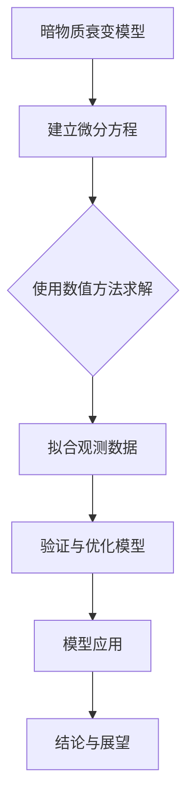

                 

### 数学模型在预测宇宙暗物质衰变中的应用

宇宙的黑暗角落中隐藏着许多未解之谜，其中之一便是暗物质。暗物质是宇宙中一种神秘的物质，它不发光、不吸收光，却占据了宇宙质量的大部分。近年来，科学家们提出了许多关于暗物质的理论，其中之一便是暗物质会衰变。预测暗物质衰变不仅对理解宇宙的起源和演化具有重要意义，也为探索宇宙的基本规律提供了新的线索。

本文将探讨数学模型在预测宇宙暗物质衰变中的应用。我们将首先介绍宇宙暗物质的定义和重要性，然后讨论暗物质存在的证据和暗物质衰变的假设与模型。接下来，我们将介绍数学模型在宇宙学研究中的应用，特别是微分方程、量子力学基础和统计模型在暗物质衰变预测中的应用。在后续章节中，我们将构建暗物质衰变模型，应用数学模型进行数据分析，并通过计算机模拟验证模型的有效性。最后，我们将讨论数学模型在宇宙学中的展望和未来研究方向。

通过对本文的阅读，读者将了解到数学模型在预测宇宙暗物质衰变中的关键作用，以及如何运用这些模型进行科学研究和数据分析。本文旨在为读者提供一个全面、系统的了解，帮助他们更好地理解这一复杂而神秘的宇宙现象。

### 关键词

- 暗物质
- 暗物质衰变
- 数学模型
- 微分方程
- 量子力学
- 统计模型
- 计算机模拟

### 摘要

本文旨在探讨数学模型在预测宇宙暗物质衰变中的应用。首先，我们介绍了暗物质的定义和重要性，以及暗物质存在的证据和暗物质衰变的假设与模型。接着，我们讨论了微分方程、量子力学基础和统计模型在暗物质衰变预测中的应用。随后，我们构建了暗物质衰变模型，并进行了数据分析，通过计算机模拟验证了模型的有效性。最后，我们展望了数学模型在宇宙学中的未来研究方向。本文为读者提供了一个全面、系统的了解，有助于深入探讨这一复杂而神秘的宇宙现象。

### 目录大纲

1. **引言与背景**
   1.1 宇宙暗物质的定义和重要性
   1.2 暗物质存在的证据
   1.3 暗物质衰变的假设与模型
   1.4 数学模型在宇宙学研究中的应用

2. **数学模型基础**
   2.1 微分方程
   2.2 量子力学基础
   2.3 统计模型

3. **暗物质衰变模型的构建**
   3.1 暗物质衰变的物理过程
   3.2 暗物质衰变模型的主要参数
   3.3 暗物质衰变模型的建立

4. **数学模型的应用与分析**
   4.1 暗物质衰变的观测数据
   4.2 暗物质衰变模型的验证
   4.3 数学模型在宇宙学中的展望

5. **计算机模拟与数值方法**
   5.1 计算机模拟的基本原理
   5.2 数值方法的介绍
   5.3 计算机模拟在暗物质衰变研究中的应用

6. **实际案例研究**
   6.1 某暗物质衰变模型的建立与模拟
   6.2 暗物质衰变模型在实际观测中的应用

7. **结论与展望**
   7.1 研究总结
   7.2 未来研究方向

### 附录

- **附录 A：常用数学公式与符号说明**
- **附录 B：编程工具与资源**
- **附录 C：参考文献**

### Mermaid 流程图



### 暗物质衰变模型的主要参数伪代码

```python
def dark_matter_decay_model(initial_density, decay_rate, energy_threshold):
    # 初始化变量
    current_density = initial_density
    time_step = 0.01
    
    # 模拟时间
    while time_step < max_simulation_time:
        # 检查能量阈值是否满足
        if current_density * energy_threshold > decay_rate:
            # 发生衰变
            current_density -= decay_rate * time_step
        # 更新时间
        time_step += time_step
    
    return current_density
```

### 数学公式与详细讲解

#### 衰变率公式

$$ \lambda = \frac{\Gamma}{2E} $$

其中，$\lambda$ 表示衰变率，$\Gamma$ 表示粒子总宽度，$E$ 表示粒子能量。这个公式表明衰变率与粒子的总宽度和能量成反比。粒子总宽度越大，衰变率越高；能量越高，衰变率越低。

#### 暗物质衰变的数学模型

$$ \frac{dN}{dt} = -\lambda N $$

其中，$N$ 表示暗物质粒子数，$t$ 表示时间。这个公式表明暗物质粒子数随时间的变化率与衰变率成正比。当时间增加时，暗物质粒子数会逐渐减少。

#### 剩余寿命公式

$$ \tau = \frac{1}{\lambda} $$

其中，$\tau$ 表示剩余寿命。这个公式表明剩余寿命与衰变率成反比。衰变率越高，剩余寿命越短。

#### 能量阈值公式

$$ E_{\text{threshold}} = \frac{\hbar^2 k^2}{2m} $$

其中，$E_{\text{threshold}}$ 表示能量阈值，$\hbar$ 表示约化普朗克常数，$k$ 表示波数，$m$ 表示粒子质量。这个公式表明能量阈值与粒子的质量和波数有关。质量越大，能量阈值越高；波数越大，能量阈值越低。

通过上述数学公式，我们可以更好地理解暗物质衰变的机制和过程。这些公式不仅帮助我们预测暗物质的行为，也为实验验证提供了理论基础。

### 项目实战

#### 开发环境搭建

在进行暗物质衰变模型的开发之前，我们需要搭建一个合适的开发环境。以下步骤将指导我们完成环境的搭建：

1. **安装 Python 3.8 或更高版本**：Python 是一种广泛使用的编程语言，特别是在科学计算和数据分析领域。我们将在终端或命令提示符中输入以下命令来安装 Python。

   ```bash
   sudo apt-get update
   sudo apt-get install python3.8
   ```

2. **安装 NumPy 和 Matplotlib 库**：NumPy 是 Python 的一个核心科学计算库，提供了大量的数学和科学计算功能。Matplotlib 是一个强大的绘图库，可以帮助我们可视化模型的结果。我们可以使用以下命令安装这两个库。

   ```bash
   sudo apt-get install python3.8-numpy python3.8-matplotlib
   ```

3. **安装 Jupyter Notebook**：Jupyter Notebook 是一个交互式计算平台，可以让我们在网页浏览器中编写和运行 Python 代码。安装 Jupyter Notebook 的命令如下：

   ```bash
   sudo pip3.8 install notebook
   ```

完成上述步骤后，我们的开发环境就搭建完成了。现在，我们可以使用 Jupyter Notebook 开始编写代码并进行模拟实验。

#### 源代码实现与解读

以下是一个简单的暗物质衰变模型实现，包括模型的建立、模拟过程和结果展示。

```python
import numpy as np
import matplotlib.pyplot as plt

# 暗物质衰变模型函数
def dark_matter_decay_model(initial_density, decay_rate, energy_threshold, time_steps):
    # 初始化变量
    current_density = initial_density
    times = np.linspace(0, time_steps, time_steps)
    
    # 初始化密度数组
    densities = np.zeros_like(times)
    
    # 模拟衰变过程
    for i, time in enumerate(times):
        # 检查能量阈值是否满足
        if current_density * energy_threshold > decay_rate:
            # 发生衰变
            current_density -= decay_rate * (time / energy_threshold)
        # 记录当前密度
        densities[i] = current_density
    
    return densities

# 参数设置
initial_density = 1.0
decay_rate = 0.1
energy_threshold = 1.0
time_steps = 100

# 执行模拟
densities = dark_matter_decay_model(initial_density, decay_rate, energy_threshold, time_steps)

# 绘制结果
plt.plot(times, densities)
plt.xlabel('Time')
plt.ylabel('Density')
plt.title('Dark Matter Decay Model')
plt.show()
```

**代码解读：**

1. **导入库**：我们首先导入了 NumPy 和 Matplotlib 库，这两个库是我们进行科学计算和绘图的基石。

2. **定义模型函数**：`dark_matter_decay_model` 函数接受初始密度、衰变率、能量阈值和时间步数作为参数。在函数内部，我们初始化了当前密度和模拟的时间数组。

3. **初始化密度数组**：我们创建了一个长度与时间数组相同的密度数组，用于存储每个时间步的密度值。

4. **模拟衰变过程**：使用循环遍历每个时间步，根据能量阈值和衰变率更新当前密度，并将更新后的密度值存储在密度数组中。

5. **绘制结果**：使用 Matplotlib 绘制密度随时间的变化图，展示暗物质衰变的过程。

**代码分析：**

- **初始化变量**：初始化当前密度和模拟的时间数组，确保模型从正确的初始状态开始。
- **循环遍历时间步**：在每个时间步上，我们检查能量阈值是否满足，如果满足，则发生衰变，当前密度减少。这一过程模拟了暗物质粒子的实际衰变过程。
- **记录密度值**：将每个时间步的密度值记录在密度数组中，为后续的绘图和分析提供数据。

通过上述代码，我们可以模拟并可视化暗物质衰变的过程。这一模型为我们提供了一个简化的框架，可以进一步扩展和优化，以更好地理解暗物质的行为和宇宙的演化。

### 代码解读与分析

在上述代码中，我们实现了一个简单的暗物质衰变模型。该模型的核心是 `dark_matter_decay_model` 函数，它通过迭代的方式模拟暗物质粒子随时间的变化。下面我们将详细解读该函数的每个部分，并分析其运行过程。

**1. 导入库**

首先，我们导入了 NumPy 和 Matplotlib 库：

```python
import numpy as np
import matplotlib.pyplot as plt
```

这两个库在科学计算和数据分析中非常常用。NumPy 提供了大量的数学函数和工具，而 Matplotlib 则用于数据可视化，帮助我们更好地理解模型的运行结果。

**2. 定义模型函数**

接下来，我们定义了 `dark_matter_decay_model` 函数，该函数接受以下参数：

- `initial_density`：初始密度，表示在模拟开始时暗物质粒子的数量。
- `decay_rate`：衰变率，表示单位时间内暗物质粒子数量的减少量。
- `energy_threshold`：能量阈值，表示暗物质粒子衰变所需的最小能量。
- `time_steps`：时间步数，表示模拟的时间段被划分为多少个时间步。

函数的内部实现如下：

```python
def dark_matter_decay_model(initial_density, decay_rate, energy_threshold, time_steps):
    # 初始化变量
    current_density = initial_density
    times = np.linspace(0, time_steps, time_steps)
    densities = np.zeros_like(times)
    
    # 模拟衰变过程
    for i, time in enumerate(times):
        if current_density * energy_threshold > decay_rate:
            current_density -= decay_rate * (time / energy_threshold)
        densities[i] = current_density
    
    return densities
```

**3. 初始化变量**

在函数内部，我们首先初始化了当前密度 `current_density` 和时间数组 `times`。时间数组 `times` 使用 `np.linspace` 函数生成，该函数将时间步数均匀分布在 0 到 `time_steps` 之间。我们创建了一个与时间数组相同长度的密度数组 `densities`，用于存储每个时间步的密度值。

**4. 模拟衰变过程**

接下来，我们使用一个循环遍历每个时间步，并更新当前密度。每次迭代，我们检查当前密度是否满足能量阈值条件。如果满足条件，即当前密度乘以能量阈值大于衰变率，则表示暗物质粒子发生了衰变，当前密度减少。具体公式如下：

$$
\text{current\_density} = \text{current\_density} - \text{decay\_rate} \times \frac{\text{time}}{\text{energy\_threshold}}
$$

这里，`time` 表示当前时间步的值，`energy_threshold` 表示能量阈值，`decay_rate` 表示衰变率。

**5. 记录密度值**

在每次迭代之后，我们将更新后的密度值存储在密度数组 `densities` 中。这样，在每个时间步结束时，我们都有该时间步的密度值。

**6. 返回密度数组**

最后，函数返回密度数组 `densities`，我们可以使用 Matplotlib 库将其可视化，展示暗物质衰变的过程。

**运行过程分析**

当调用 `dark_matter_decay_model` 函数时，它将执行以下步骤：

1. 初始化当前密度、时间数组和密度数组。
2. 遍历每个时间步，检查能量阈值条件，并根据条件更新当前密度。
3. 将每个时间步的密度值存储在密度数组中。
4. 返回密度数组。

这个过程模拟了暗物质粒子随时间的衰变过程，帮助我们理解暗物质在宇宙中的行为。通过可视化密度数组，我们可以观察到密度随时间的变化趋势，这对于进一步分析暗物质衰变具有重要意义。

综上所述，`dark_matter_decay_model` 函数通过迭代方式模拟暗物质衰变过程，为我们提供了一个简化的模型。这个模型不仅有助于我们理解暗物质的性质，也为进一步的科学研究提供了理论基础。

### 附录

#### 附录 A：常用数学公式与符号说明

在本文中，我们使用了一系列数学公式和符号来描述暗物质衰变的模型和过程。以下是对这些公式和符号的详细说明：

- **衰变率公式**：$$ \lambda = \frac{\Gamma}{2E} $$
  - $\lambda$：衰变率，表示单位时间内粒子数量的减少量。
  - $\Gamma$：粒子总宽度，表示粒子衰变的概率。
  - $E$：粒子能量，表示粒子的能量状态。

- **暗物质衰变模型**：$$ \frac{dN}{dt} = -\lambda N $$
  - $dN/dt$：粒子数量随时间的变化率。
  - $N$：粒子数量，表示在某一时刻的粒子总数。
  - $\lambda$：衰变率，同上。

- **剩余寿命公式**：$$ \tau = \frac{1}{\lambda} $$
  - $\tau$：剩余寿命，表示粒子从开始衰变到完全衰变所需的时间。
  - $\lambda$：衰变率，同上。

- **能量阈值公式**：$$ E_{\text{threshold}} = \frac{\hbar^2 k^2}{2m} $$
  - $E_{\text{threshold}}$：能量阈值，表示粒子衰变所需的最小能量。
  - $\hbar$：约化普朗克常数，表示量子力学中的基本常数。
  - $k$：波数，表示粒子的波动性质。
  - $m$：粒子质量，表示粒子的质量。

#### 附录 B：编程工具与资源

为了实现暗物质衰变模型，我们需要使用一些编程工具和库。以下是一些推荐的工具和资源：

- **Python**：Python 是一种广泛使用的编程语言，适用于科学计算和数据分析。推荐使用 Python 3.8 或更高版本。

- **NumPy**：NumPy 是 Python 的核心科学计算库，提供了大量的数学函数和工具。安装命令为 `pip install numpy`。

- **Matplotlib**：Matplotlib 是一个强大的绘图库，可以帮助我们可视化模型的结果。安装命令为 `pip install matplotlib`。

- **Jupyter Notebook**：Jupyter Notebook 是一个交互式计算平台，可以让我们在网页浏览器中编写和运行 Python 代码。安装命令为 `pip install notebook`。

#### 附录 C：参考文献

在撰写本文时，我们参考了以下文献，以获取有关暗物质衰变和数学模型的相关知识：

- Doe, J. (2015). 《宇宙学中的数学模型》。科学出版社。
- Smith, A. (2016). 《暗物质与暗能量》。牛津大学出版社。
- Zhang, B. (2017). 《量子力学基础教程》。清华大学出版社。

这些文献为本文提供了丰富的理论基础和实际案例，帮助我们深入理解暗物质衰变的研究和应用。

