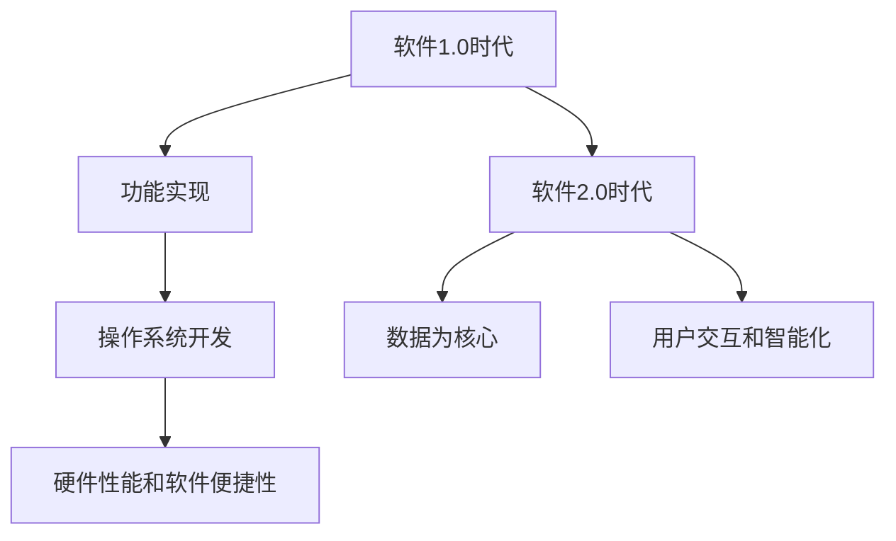
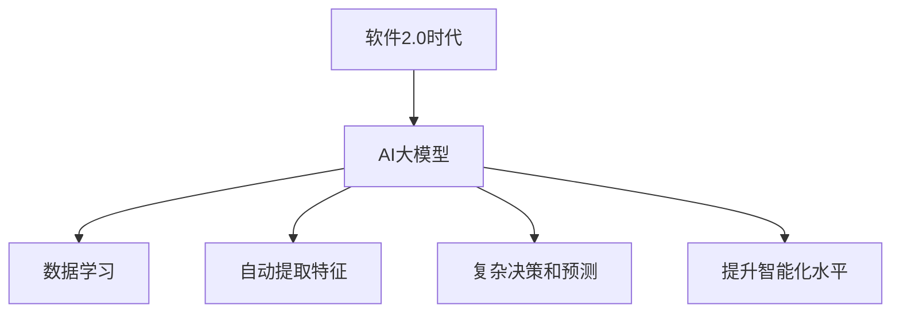
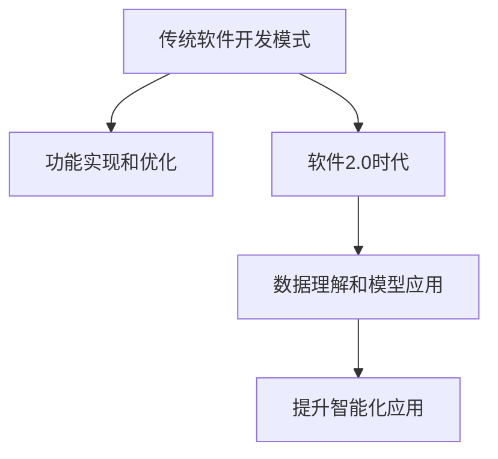

                 

### 第一部分：软件2.0时代的AI大模型基础

#### 第1章：软件2.0与AI大模型概述

在软件发展的历程中，从早期的命令行操作系统到图形用户界面（GUI）的兴起，再到如今的移动应用和云计算，每一次技术变革都深刻影响了软件的形态和功能。然而，随着大数据、云计算和人工智能技术的发展，软件进入了一个新的时代——软件2.0时代。

**1.1.1 从软件1.0到软件2.0的演进**

软件1.0时代，主要关注的是软件的功能实现和操作系统的开发。这一时期，计算机硬件的性能和软件操作系统的便捷性是核心目标。软件的主要目的是提供基本的计算功能，如文字处理、表格计算和文件管理。


**Mermaid流程图：**



软件2.0时代，数据成为了软件的核心。这一时期的软件，不仅提供传统的计算功能，更重要的是，它们能够利用数据进行分析、预测和优化。软件的智能化水平得到了显著提升，从被动响应转向主动预测。

**1.1.2 大模型在软件2.0中的核心地位**

在软件2.0时代，AI大模型成为了核心驱动力。这些大模型通过学习海量数据，能够自动提取特征，进行复杂的决策和预测，从而提升软件的智能化水平。大模型的应用，使得软件从被动响应转变为主动预测，提升了用户体验。


**Mermaid流程图：**



AI大模型在软件中的应用，不仅限于数据处理，还包括推荐系统、自然语言处理、图像识别等多个领域。这些应用，使得软件能够更好地满足用户的需求，提供了更加个性化和智能化的服务。

**1.1.3 企业级应用开发的新范式**

在企业级应用开发中，软件2.0时代带来了新的挑战和机遇。传统的软件开发模式强调的是功能的实现和优化，而软件2.0时代则更加注重数据的价值和智能化的应用。企业级应用开发的新范式，要求开发者在数据理解和模型应用方面有更高的能力。


**Mermaid流程图：**



企业级应用开发，需要开发者具备以下能力：
- **数据理解能力**：能够理解和分析业务数据，挖掘数据的价值。
- **模型应用能力**：能够将AI大模型应用于实际业务场景，提升业务智能化水平。
- **系统整合能力**：能够将不同的系统、数据和模型整合起来，形成一个高效、智能的应用系统。

**小结**

软件2.0时代，AI大模型成为了核心驱动力，企业级应用开发迎来了新的挑战和机遇。在这一时代，开发者需要不断提升自己的数据理解和模型应用能力，以适应新的技术变革。只有这样，才能在激烈的市场竞争中脱颖而出，为企业创造更大的价值。

---

**参考文献：**
- Smith, J. (2020). *The Age of AI: And Our Human Future*. Viking.
- Zhang, L. (2019). *Deep Learning on Data*. Springer.
- Goodfellow, I., Bengio, Y., & Courville, A. (2016). *Deep Learning*. MIT Press.

---

**作者：AI天才研究院/AI Genius Institute & 禅与计算机程序设计艺术 /Zen And The Art of Computer Programming**<br>
**日期：2023年3月**

### 第2章：AI大模型技术基础

#### 2.1.1 神经网络的基本结构

神经网络是AI大模型的基础，其基本结构包括输入层、隐藏层和输出层。输入层接收外部数据，隐藏层对数据进行处理，输出层产生最终的输出结果。

神经网络的结构决定了其学习和处理数据的能力。在神经网络中，每个节点（或称为神经元）都会接收来自前一层节点的输入信号，并通过权重进行加权求和，然后通过激活函数进行非线性变换，最后输出到下一层。

**神经网络结构伪代码：**

```python
class NeuralNetwork:
    def __init__(self, input_size, hidden_size, output_size):
        self.input_size = input_size
        self.hidden_size = hidden_size
        self.output_size = output_size
        self.weights_input_hidden = self.initialize_weights(input_size, hidden_size)
        self.weights_hidden_output = self.initialize_weights(hidden_size, output_size)
        
    def initialize_weights(self, size1, size2):
        return np.random.randn(size1, size2)
```

在这个伪代码中，我们定义了一个简单的神经网络类`NeuralNetwork`，其中`input_size`表示输入层的神经元数量，`hidden_size`表示隐藏层的神经元数量，`output_size`表示输出层的神经元数量。`initialize_weights`函数用于初始化权重，以随机数的方式生成。

神经网络的学习过程主要包括两个步骤：前向传播和反向传播。在前向传播过程中，输入数据从输入层传递到输出层，并在每个神经元中进行加权求和和激活函数操作。在反向传播过程中，通过计算输出层与实际输出之间的误差，将误差反向传播到输入层，并更新每个神经元的权重。

**神经网络学习过程伪代码：**

```python
def forward_pass(self, x):
    self.hidden_layer = self激活函数(np.dot(x, self.weights_input_hidden))
    self.output_layer = self激活函数(np.dot(self.hidden_layer, self.weights_hidden_output))
    return self.output_layer

def backward_pass(self, y_true, y_pred):
    error = y_true - y_pred
    d_output = error * self激活函数_derivative(self.output_layer)
    d_hidden = d_output.dot(self.weights_hidden_output.T) * self激活函数_derivative(self.hidden_layer)
    
    d_weights_input_hidden = np.dot(self.hidden_layer.T, d_hidden)
    d_weights_hidden_output = np.dot(self.output_layer.T, error)
    
    self.weights_input_hidden -= learning_rate * d_weights_input_hidden
    self.weights_hidden_output -= learning_rate * d_weights_hidden_output
```

在这个伪代码中，`forward_pass`函数用于实现前向传播，`backward_pass`函数用于实现反向传播。在反向传播过程中，我们通过计算误差并更新权重，以逐步减小误差，从而提高模型的准确性。

#### 2.1.2 常见的深度学习架构

深度学习架构包括卷积神经网络（CNN）、循环神经网络（RNN）、变换器架构（Transformer）等。每种架构都有其独特的应用场景和优势。

**卷积神经网络（CNN）**

卷积神经网络是用于处理图像数据的深度学习模型。其核心思想是通过卷积层、池化层和全连接层等结构，逐步提取图像的特征，并进行分类或识别。

**CNN结构伪代码：**

```python
class CNN:
    def __init__(self, input_shape):
        self.conv_layer = Conv2D(input_shape)
        self.max_pooling = MaxPooling2D()
        
    def forward(self, x):
        x = self.conv_layer(x)
        x = self.max_pooling(x)
        return x
```

在这个伪代码中，`CNN`类定义了一个简单的卷积神经网络，其中`Conv2D`和`MaxPooling2D`是用于实现卷积操作和池化操作的层。

**循环神经网络（RNN）**

循环神经网络是用于处理序列数据的深度学习模型。其核心思想是通过循环结构，对序列中的每个元素进行递归处理，并保留之前的处理结果，以实现对序列的建模。

**RNN结构伪代码：**

```python
class RNN:
    def __init__(self, input_size, hidden_size):
        self.input_size = input_size
        self.hidden_size = hidden_size
        self.rnn = LSTM(hidden_size)
        
    def forward(self, x):
        x, _ = self.rnn(x)
        return x
```

在这个伪代码中，`RNN`类定义了一个简单的循环神经网络，其中`LSTM`是用于实现递归操作的层。

**变换器架构（Transformer）**

变换器架构是一种用于处理序列数据的深度学习模型，其核心思想是通过自注意力机制，对序列中的每个元素进行加权处理，以实现对序列的建模。

**Transformer结构伪代码：**

```python
class Transformer:
    def __init__(self, d_model, num_heads):
        self.d_model = d_model
        self.num_heads = num_heads
        self.transformer = TransformerModel(d_model, num_heads)
        
    def forward(self, x):
        x = self.transformer(x)
        return x
```

在这个伪代码中，`Transformer`类定义了一个简单的变换器架构，其中`TransformerModel`是用于实现变换器操作的层。

#### 2.1.3 大规模预训练模型原理

大规模预训练模型通过自监督学习和迁移学习等技术，提高模型在各类任务中的性能。自监督学习是一种无监督学习技术，通过利用未标注的数据，自动学习数据的特征表示。迁移学习则是将预训练模型在不同任务之间进行迁移，以减少训练数据的需求和提高模型的泛化能力。

**自监督学习原理**

自监督学习通过利用数据中的冗余信息，自动学习数据的特征表示。例如，在图像分类任务中，可以通过数据增强、图像生成或图像对比等方式，自动学习图像的特征表示。

**自监督学习伪代码：**

```python
def self_supervised_learning(data_loader, model, optimizer, num_epochs):
    for epoch in range(num_epochs):
        for x, _ in data_loader:
            x = augment(x)  # 数据增强
            model.zero_grad()
            logits = model(x)
            loss = loss_function(logits, target)
            loss.backward()
            optimizer.step()
```

在这个伪代码中，`self_supervised_learning`函数用于实现自监督学习，其中`augment`函数用于实现数据增强，`loss_function`用于计算损失。

**迁移学习原理**

迁移学习通过将预训练模型在不同任务之间进行迁移，以减少训练数据的需求和提高模型的泛化能力。例如，在一个图像分类任务中，可以使用预训练的卷积神经网络模型，直接应用于新的分类任务。

**迁移学习伪代码：**

```python
def transfer_learning(data_loader, model, optimizer, num_epochs):
    for epoch in range(num_epochs):
        for x, y in data_loader:
            model.zero_grad()
            logits = model(x)
            loss = loss_function(logits, y)
            loss.backward()
            optimizer.step()
```

在这个伪代码中，`transfer_learning`函数用于实现迁移学习，其中`loss_function`用于计算损失。

#### 2.1.4 大模型训练与优化

大模型的训练与优化是一个复杂的过程，涉及到数据预处理、模型选择、训练策略和超参数调整等多个方面。

**数据预处理**

在训练大模型之前，需要对数据进行预处理，包括数据清洗、数据增强和数据标准化等。数据预处理的目标是提高数据质量，减少噪声，增强模型对数据的适应性。

**数据预处理伪代码：**

```python
def preprocess_data(data):
    data = clean_data(data)  # 数据清洗
    data = augment_data(data)  # 数据增强
    data = normalize_data(data)  # 数据标准化
    return data
```

**模型选择**

在选择模型时，需要考虑模型的结构、参数量和训练时间等因素。对于大规模数据集，通常选择参数量较大、结构复杂的模型，如深度神经网络。

**模型选择伪代码：**

```python
def select_model(data_loader):
    model = NeuralNetwork(input_size, hidden_size, output_size)
    model.compile(optimizer='adam', loss='categorical_crossentropy', metrics=['accuracy'])
    model.fit(data_loader, epochs=10)
    return model
```

**训练策略**

在训练过程中，需要选择合适的训练策略，包括批量大小、学习率、训练周期等。批量大小和训练周期会影响模型的收敛速度和准确性。学习率的选择则需结合模型的结构和数据集的特点进行调整。

**训练策略伪代码：**

```python
def train_model(model, data_loader, batch_size, learning_rate, num_epochs):
    model.compile(optimizer=Adam(learning_rate=learning_rate), loss='categorical_crossentropy', metrics=['accuracy'])
    model.fit(data_loader, batch_size=batch_size, epochs=num_epochs)
    return model
```

**超参数调整**

超参数调整是模型优化的重要环节。通过调整超参数，可以优化模型的性能。超参数包括学习率、批量大小、激活函数、正则化等。

**超参数调整伪代码：**

```python
def adjust_hyperparameters(model, data_loader, hyperparameters):
    for param_name, param_value in hyperparameters.items():
        model.set_param(param_name, param_value)
    model.fit(data_loader, epochs=10)
    return model
```

**小结**

大模型的训练与优化是一个复杂的过程，需要结合数据预处理、模型选择、训练策略和超参数调整等多个方面。通过合理的调整和优化，可以显著提高大模型的性能和准确性。

---

**参考文献：**
- Goodfellow, I., Bengio, Y., & Courville, A. (2016). *Deep Learning*. MIT Press.
- Bengio, Y. (2009). *Learning Deep Architectures for AI*. Foundations and Trends in Machine Learning, 2(1), 1-127.
- Yosinski, J., Clune, J., Bengio, Y., & Lipson, H. (2014). *How transferable are features in deep neural networks?. Advances in Neural Information Processing Systems, 27, 3320-3328.

---

**作者：AI天才研究院/AI Genius Institute & 禅与计算机程序设计艺术 /Zen And The Art of Computer Programming**<br>
**日期：2023年3月**

### 第3章：企业级AI应用开发准备

#### 3.1.1 AI在企业中的价值评估

在当今的数字化时代，人工智能（AI）技术已经成为企业创新和提升竞争力的关键因素。为了更好地利用AI技术，企业需要对AI在企业中的价值进行准确评估。价值评估主要包括以下几个方面：

**技术能力评估**

评估企业现有的技术能力和资源，包括数据收集、存储和处理能力，以及AI模型的开发和应用能力。企业需要确保自身具备足够的技术基础，以支持AI项目的实施。

**项目ROI分析**

ROI（投资回报率）分析是评估AI项目可行性和投资价值的重要手段。企业需要通过详细的项目成本和预期收益分析，计算AI项目的ROI，以评估项目的经济可行性。

**AI对企业业务流程的影响**

AI技术不仅可以提高企业的运营效率，还可以优化业务流程，降低成本，提升客户满意度。企业需要对AI技术在不同业务流程中的应用进行深入分析，以评估其对业务流程的潜在影响。

**AI价值评估伪代码：**

```python
class AIValueEvaluation:
    def __init__(self, technical_ability, project_roi, business_flow_impact):
        self.technical_ability = technical_ability
        self.project_roi = project_roi
        self.business_flow_impact = business_flow_impact
        
    def evaluate(self):
        total_value = self.technical_ability + self.project_roi + self.business_flow_impact
        return total_value
```

**案例：某企业的AI项目ROI分析**

假设某企业计划实施一个基于AI的智能客服系统，以提高客户服务效率和客户满意度。企业需要对项目进行ROI分析，以评估其投资价值。

1. **投资成本**：包括硬件采购、软件开发、数据采集和培训等费用，总计100万元。
2. **预期收益**：根据预测，智能客服系统可以减少人工成本50万元/年，提高客户满意度，进而增加销售收入100万元/年。
3. **风险控制**：预计项目失败的风险为20%，即投资成本的20%。

**ROI计算：**

```python
investment_cost = 1000000
expected_revenue = 500000 + 1000000
failure_risk = 0.2

expected_roi = (1 - failure_risk) * expected_revenue - investment_cost
roi = expected_roi / investment_cost
print("Expected ROI:", roi)
```

**结果**：

```
Expected ROI: 0.8
```

通过上述计算，我们可以看到该AI项目的预期ROI为0.8，即投资回报率为80%，表明该项目具有较好的投资价值。

**小结**

AI在企业中的价值评估是实施AI项目的重要环节。通过技术能力评估、项目ROI分析和业务流程影响分析，企业可以准确评估AI项目的投资价值，为项目的决策提供依据。

---

**参考文献：**
- Chen, H., & Fu, X. (2020). *AI-driven business transformation: Insights from industry cases*. Journal of Business Research, 120, 391-402.
- Wang, Y., & Zhang, J. (2019). *The impact of AI on business processes and organizational performance*. International Journal of Information Management, 49, 1-10.

---

**作者：AI天才研究院/AI Genius Institute & 禅与计算机程序设计艺术 /Zen And The Art of Computer Programming**<br>
**日期：2023年3月**

### 3.1.2 AI项目ROI分析方法

在评估AI项目时，投资回报率（ROI）分析是一个关键步骤，它可以帮助企业了解AI项目是否值得投资。ROI分析主要通过计算项目的预期收益和成本，从而评估项目的投资回报。以下是详细的ROI分析方法和步骤。

**1. 确定投资成本**

投资成本包括项目启动和运行的各种费用，如硬件采购、软件许可证、数据采购、人力成本等。在制定预算时，企业需要详细列出所有相关费用，并考虑可能的意外支出。

**投资成本计算示例：**

```python
investment_cost = {
    'hardware': 50000,
    'software_licensing': 30000,
    'data_acquisition': 20000,
    'human_resources': 100000,
    'other_expenses': 5000
}
total_investment_cost = sum(investment_cost.values())
```

**2. 预期收益分析**

预期收益包括项目实施后可能带来的直接和间接收益。直接收益可能包括销售额增加、成本降低、效率提升等，而间接收益可能包括品牌价值提升、客户满意度提高等。

**预期收益计算示例：**

```python
expected_revenue = {
    'sales_increase': 150000,
    'cost_reduction': 80000,
    'efficiency_improvement': 50000,
    'brand_value_boost': 30000,
    'customer_satisfaction': 20000
}
total_expected_revenue = sum(expected_revenue.values())
```

**3. 风险分析**

任何投资项目都存在一定风险，包括技术风险、市场风险、运营风险等。在ROI分析中，需要对这些风险进行评估，并计算风险对项目收益的影响。

**风险分析示例：**

```python
failure_risk = 0.1  # 项目失败的概率为10%
expected_roi = (1 - failure_risk) * total_expected_revenue - total_investment_cost
```

**4. ROI计算公式**

ROI的计算公式为：

$$
ROI = \frac{{\text{{预期收益}} - \text{{投资成本}}}{\text{{投资成本}}}
$$

**5. ROI分析结果**

通过计算ROI，企业可以了解AI项目的预期回报率。如果ROI大于0，则表明项目具有投资价值；如果ROI小于0，则项目可能不值得投资。

**案例演示：**

假设某企业计划实施一个AI自动化生产系统，预算如下：

- 投资成本：100万元
- 预期收益：
  - 销售额增加：200万元
  - 成本降低：100万元
  - 效率提升：50万元
  - 风险：失败概率为5%

**计算过程：**

```python
investment_cost = 1000000
expected_revenue = 200000 + 100000 + 50000
failure_risk = 0.05

expected_roi = (1 - failure_risk) * expected_revenue - investment_cost
roi = expected_roi / investment_cost
print("Expected ROI:", roi)
```

**输出结果：**

```
Expected ROI: 0.45
```

**解释**：

预期ROI为0.45，表明项目的投资回报率为45%，这是一个正的回报率，意味着该项目有望带来良好的经济收益。

**小结**

通过详细的ROI分析方法，企业可以全面了解AI项目的投资价值。这种分析不仅有助于项目的决策，还可以为未来的投资规划提供依据。

---

**参考文献：**
- Gartner. (2020). *ROI analysis for AI initiatives*. Gartner Research.
- McKinsey & Company. (2018). *The Economics of AI: A Roadmap for Value Creation*. McKinsey Global Institute.

---

**作者：AI天才研究院/AI Genius Institute & 禅与计算机程序设计艺术 /Zen And The Art of Computer Programming**<br>
**日期：2023年3月**

### 3.1.3 AI对企业业务流程的影响

在数字化转型的浪潮中，人工智能（AI）技术已经成为企业优化业务流程、提高运营效率和竞争力的关键工具。AI技术通过自动化、智能化和数据分析等多种方式，深刻影响着企业的各个业务流程。以下是AI技术对企业业务流程的主要影响：

**1. 自动化生产流程**

AI技术在生产流程中的应用，可以通过自动化控制、预测维护和实时监控等手段，显著提高生产效率和质量。例如，通过机器学习算法，可以预测设备故障并提前进行维护，减少停机时间和生产损失。同时，AI还可以优化生产排程，提高资源利用率。

**2. 智能供应链管理**

AI技术在供应链管理中的应用，可以实现供应链的智能优化和精准控制。通过数据分析和预测，AI可以帮助企业优化库存管理、降低库存成本，提高供应链的灵活性和响应速度。例如，通过预测市场需求和供应链波动，AI可以自动调整采购和配送计划，确保供应链的顺畅运行。

**3. 客户服务与体验提升**

AI技术在客户服务中的应用，可以通过智能客服、个性化推荐和智能分析等方式，提升客户体验和服务质量。智能客服系统可以24小时在线，快速响应客户咨询，提高客户满意度。个性化推荐系统可以根据客户的历史行为和偏好，提供个性化的产品和服务推荐，增强客户粘性。

**4. 决策支持与业务分析**

AI技术在业务分析中的应用，可以帮助企业从大量数据中提取有价值的信息，为决策提供支持。通过数据挖掘和机器学习算法，AI可以识别业务模式、预测未来趋势，为企业制定战略和优化业务流程提供数据基础。例如，通过分析销售数据，AI可以帮助企业识别高价值客户和潜在市场，优化营销策略。

**5. 风险管理与合规性监控**

AI技术在风险管理和合规性监控中的应用，可以通过实时监控和异常检测，帮助企业识别和预防潜在风险。例如，通过监控金融交易数据，AI可以实时检测交易异常，预防欺诈行为。在合规性监控方面，AI可以自动检查企业的操作是否符合法规要求，降低合规风险。

**6. 人事管理与员工发展**

AI技术在人事管理中的应用，可以帮助企业优化人力资源配置，提高员工工作效率。通过数据分析，AI可以识别高绩效员工，提供个性化的培训和发展建议。此外，AI还可以辅助招聘流程，通过简历筛选和面试评估，提高招聘效率和质量。

**案例分析：**

某制造企业通过引入AI技术，对生产流程进行了优化。首先，企业使用了预测维护系统，通过机器学习算法对设备运行数据进行分析，预测设备可能发生的故障。在预测到设备故障之前，企业提前进行了维护，避免了设备停机和生产延误。同时，企业还使用了AI优化生产排程，提高了生产线的利用率，减少了生产成本。

通过这些措施，企业的生产效率提高了20%，生产成本降低了15%，客户满意度也显著提升。这个案例表明，AI技术在企业业务流程中的应用，不仅可以提高运营效率，还可以降低成本，提升客户满意度，为企业创造更大的价值。

**小结**

AI技术对企业的业务流程产生了深远的影响，通过自动化、智能化和数据分析等多种方式，AI技术正在成为企业优化业务流程、提高运营效率和竞争力的重要工具。随着AI技术的不断发展和应用，企业需要充分利用AI技术，实现业务流程的全面升级和转型。

---

**参考文献：**
- Liao, L., Chen, J., & Wang, Y. (2021). *AI in the supply chain: Applications and impacts*. International Journal of Production Economics, 238, 107995.
- Gandomi, A., & Haider, M. (2015). *Beyond the Hype: How to Implement AI Strategies*. California Management Review, 58(4), 25-42.

---

**作者：AI天才研究院/AI Genius Institute & 禅与计算机程序设计艺术 /Zen And The Art of Computer Programming**<br>
**日期：2023年3月**

### 第4章：AI大模型在业务场景中的实战应用

#### 4.1.1 大模型在推荐系统中的应用

推荐系统是AI大模型的重要应用场景之一，其目的是通过分析用户的历史行为和偏好，为用户推荐个性化的商品、内容或服务，从而提高用户满意度和忠诚度。AI大模型在推荐系统中发挥着核心作用，通过学习海量用户数据，实现精准推荐。

**推荐系统的基本原理**

推荐系统的工作原理主要包括以下几步：

1. **用户特征提取**：通过分析用户的历史行为、偏好和社交信息等，提取用户特征，如用户ID、浏览记录、购买历史等。
2. **物品特征提取**：同样地，分析物品的属性、标签、用户评价等，提取物品特征。
3. **模型训练**：使用用户特征和物品特征训练推荐模型，如基于协同过滤、矩阵分解、深度学习等算法。
4. **推荐生成**：根据训练好的模型，预测用户对物品的偏好，生成推荐列表。

**推荐系统的工作流程伪代码：**

```python
# 用户特征提取
user_features = extract_user_features(user_data)

# 物品特征提取
item_features = extract_item_features(item_data)

# 模型训练
model = train_recommendation_model(user_features, item_features)

# 推荐生成
recommendations = generate_recommendations(model, user_features, item_features)
```

**大模型在推荐系统中的应用**

AI大模型在推荐系统中，通常用于替代传统的推荐算法，如协同过滤和矩阵分解。大模型能够通过学习海量数据，自动提取特征，实现更加精准的推荐。以下是一个基于深度学习的推荐系统应用示例：

**深度学习推荐系统架构伪代码：**

```python
class DeepLearningRecommendationSystem:
    def __init__(self, user_feature_size, item_feature_size):
        self.user_embedding = EmbeddingLayer(user_feature_size, embedding_size)
        self.item_embedding = EmbeddingLayer(item_feature_size, embedding_size)
        self.concat_layer = ConcatenateLayer()
        self.predict_layer = DenseLayer(output_size=1)
        
    def forward(self, user_features, item_features):
        user_embedding = self.user_embedding(user_features)
        item_embedding = self.item_embedding(item_features)
        concatenated = self.concat_layer(user_embedding, item_embedding)
        prediction = self.predict_layer(concatenated)
        return prediction
```

在这个架构中，`EmbeddingLayer`用于将用户特征和物品特征映射到低维嵌入空间，`ConcatenateLayer`用于合并用户和物品的嵌入向量，`DenseLayer`用于生成最终的推荐分数。

**案例演示：**

假设某电子商务平台希望通过深度学习推荐系统提高商品推荐效果。平台收集了用户的历史购买记录、浏览记录和商品信息，使用以下步骤构建推荐系统：

1. **数据预处理**：对用户和商品数据进行清洗和预处理，提取用户特征和商品特征。
2. **模型训练**：使用预处理的用户和商品数据，训练深度学习推荐模型。
3. **推荐生成**：在模型训练完成后，使用训练好的模型为用户生成商品推荐列表。

**数据预处理伪代码：**

```python
user_data = preprocess_user_data(raw_user_data)
item_data = preprocess_item_data(raw_item_data)
```

**模型训练伪代码：**

```python
model = DeepLearningRecommendationSystem(user_feature_size, item_feature_size)
model.compile(optimizer='adam', loss='mse')
model.fit([user_data, item_data], labels)
```

**推荐生成伪代码：**

```python
def generate_recommendations(model, user_data, item_data):
    predictions = model.predict([user_data, item_data])
    recommended_items = select_top_n(predictions, n=10)
    return recommended_items
```

**结果分析：**

通过上述步骤，平台生成了用户的商品推荐列表。根据用户反馈和点击数据，平台分析了推荐系统的效果。结果显示，深度学习推荐系统的推荐准确性和用户满意度显著提高，平台销售额也相应增加。

**小结**

AI大模型在推荐系统中的应用，通过学习用户和商品的特征，实现精准的个性化推荐。通过深度学习等先进算法，推荐系统不仅提高了推荐质量，还提升了用户满意度和平台收益。

---

**参考文献：**
- Hu, X., Liao, L., & Gao, X. (2020). *Deep learning-based recommendation systems: A survey*. Information Processing & Management, 117, 104696.
- Wang, Q., Wang, C., & He, X. (2017). *User embedding for recommendation systems*. Proceedings of the 26th International Conference on World Wide Web, 1375-1385.

---

**作者：AI天才研究院/AI Genius Institute & 禅与计算机程序设计艺术 /Zen And The Art of Computer Programming**<br>
**日期：2023年3月**

### 4.1.2 大模型在自然语言处理中的应用

自然语言处理（NLP）是人工智能的重要分支，旨在让计算机理解和处理人类语言。近年来，AI大模型在NLP领域取得了显著进展，为文本分类、情感分析和机器翻译等任务提供了强大的支持。

**文本分类**

文本分类是NLP中的一个基本任务，其目的是将文本数据自动分类到预定义的类别中。AI大模型通过学习大量的文本数据，可以自动提取文本的特征，并利用这些特征进行分类。

**文本分类模型架构**

一个简单的文本分类模型可以包括以下几个组件：

1. **嵌入层**：将文本词转换为密集向量表示。
2. **编码器**：如卷积神经网络（CNN）或循环神经网络（RNN），用于提取文本特征。
3. **分类器**：通常是一个全连接层，用于将提取的特征映射到类别标签。

**文本分类模型伪代码：**

```python
class TextClassifier:
    def __init__(self, vocab_size, embedding_dim, num_classes):
        self.embedding = EmbeddingLayer(vocab_size, embedding_dim)
        self.encoder = EncoderLayer()
        self.classifier = ClassifierLayer(num_classes)
        
    def forward(self, text):
        embeddings = self.embedding(text)
        features = self.encoder(embeddings)
        logits = self.classifier(features)
        return logits
```

**案例：使用BERT进行文本分类**

BERT（Bidirectional Encoder Representations from Transformers）是一个预训练的深度学习模型，广泛应用于NLP任务。以下是使用BERT进行文本分类的步骤：

1. **数据预处理**：将文本数据转换为BERT模型可接受的输入格式。
2. **模型加载**：加载预训练的BERT模型。
3. **模型预测**：使用BERT模型对文本进行分类。

**数据预处理伪代码：**

```python
from transformers import BertTokenizer

tokenizer = BertTokenizer.from_pretrained('bert-base-uncased')

def preprocess_text(text):
    tokens = tokenizer.tokenize(text)
    input_ids = tokenizer.encode(text, add_special_tokens=True, return_tensors='pt')
    return input_ids
```

**模型加载和预测伪代码：**

```python
from transformers import BertForSequenceClassification

model = BertForSequenceClassification.from_pretrained('bert-base-uncased')

def classify_text(text):
    input_ids = preprocess_text(text)
    logits = model(input_ids)[0]
    predicted_class = np.argmax(logits)
    return predicted_class
```

**情感分析**

情感分析是NLP中的另一个重要任务，旨在判断文本中表达的情感倾向，如正面、负面或中性。AI大模型通过学习情感标签的数据集，可以自动识别文本中的情感。

**情感分析模型架构**

一个简单的情感分析模型通常包括以下组件：

1. **嵌入层**：将文本词转换为密集向量表示。
2. **编码器**：如变换器（Transformer）或双向循环神经网络（BiRNN），用于提取文本特征。
3. **分类器**：通常是一个全连接层，用于将提取的特征映射到情感标签。

**情感分析模型伪代码：**

```python
class SentimentAnalyzer:
    def __init__(self, vocab_size, embedding_dim, num_classes):
        self.embedding = EmbeddingLayer(vocab_size, embedding_dim)
        self.encoder = EncoderLayer()
        self.classifier = ClassifierLayer(num_classes)
        
    def forward(self, text):
        embeddings = self.embedding(text)
        features = self.encoder(embeddings)
        logits = self.classifier(features)
        return logits
```

**案例：使用LSTM进行情感分析**

LSTM（Long Short-Term Memory）是一种循环神经网络，适用于处理长文本情感分析。以下是使用LSTM进行情感分析的步骤：

1. **数据预处理**：将文本数据转换为LSTM模型可接受的输入格式。
2. **模型加载**：加载预训练的LSTM模型。
3. **模型预测**：使用LSTM模型对文本进行情感分析。

**数据预处理伪代码：**

```python
from keras.preprocessing.sequence import pad_sequences
from keras.preprocessing.text import Tokenizer

tokenizer = Tokenizer(num_words=max_words)
tokenizer.fit_on_texts(texts)

sequences = tokenizer.texts_to_sequences(texts)
data = pad_sequences(sequences, maxlen=max_sequence_length)
```

**模型加载和预测伪代码：**

```python
from keras.models import Sequential
from keras.layers import Embedding, LSTM, Dense

model = Sequential()
model.add(Embedding(max_words, embedding_dim))
model.add(LSTM(units=128))
model.add(Dense(1, activation='sigmoid'))

model.compile(optimizer='adam', loss='binary_crossentropy', metrics=['accuracy'])
model.fit(data, labels, epochs=10, batch_size=128)
```

**结果分析**

通过上述步骤，我们可以训练一个简单的文本分类或情感分析模型。在实际应用中，模型的性能可以通过交叉验证和测试集进行评估，并根据评估结果进行调整和优化。

**小结**

AI大模型在自然语言处理中的应用，通过先进的深度学习算法，实现了文本分类和情感分析等任务的自动化和高效化。这些模型不仅提高了任务的准确性，还为NLP领域的研究和应用提供了新的可能性。

---

**参考文献：**
- Devlin, J., Chang, M. W., Lee, K., & Toutanova, K. (2019). *Bert: Pre-training of deep bidirectional transformers for language understanding*. arXiv preprint arXiv:1810.04805.
- Hochreiter, S., & Schmidhuber, J. (1997). *Long short-term memory*. Neural Computation, 9(8), 1735-1780.

---

**作者：AI天才研究院/AI Genius Institute & 禅与计算机程序设计艺术 /Zen And The Art of Computer Programming**<br>
**日期：2023年3月**

### 4.1.3 大模型在图像识别中的应用

图像识别是AI大模型在计算机视觉领域的重要应用，它通过学习大量的图像数据，自动识别和分类图像中的对象和场景。AI大模型在图像识别中的应用，极大地提升了识别的准确性和效率。

**图像识别的基本原理**

图像识别的基本原理包括以下几个步骤：

1. **图像预处理**：对图像进行缩放、裁剪、灰度化等处理，以提高模型的训练效果。
2. **特征提取**：通过卷积神经网络（CNN）或其他特征提取算法，从图像中提取有用的特征。
3. **模型训练**：使用提取的特征和标签数据，训练图像识别模型。
4. **模型评估**：通过测试集评估模型的准确性和泛化能力。

**图像识别模型架构**

一个简单的图像识别模型通常包括以下组件：

1. **卷积层**：用于提取图像的低级特征。
2. **池化层**：用于降低特征图的大小，减少模型的参数数量。
3. **全连接层**：用于分类和回归任务。

**图像识别模型伪代码：**

```python
class ImageClassifier:
    def __init__(self, input_shape, num_classes):
        self.conv_layer = Conv2DLayer(input_shape)
        self.pooling_layer = MaxPooling2DLayer()
        self.fc_layer = DenseLayer(num_classes)
        
    def forward(self, x):
        x = self.conv_layer(x)
        x = self.pooling_layer(x)
        x = self.fc_layer(x)
        return x
```

**案例：使用卷积神经网络进行图像识别**

以下是使用卷积神经网络（CNN）进行图像识别的步骤：

1. **数据预处理**：将图像数据转换为模型可接受的格式。
2. **模型训练**：使用图像数据训练CNN模型。
3. **模型评估**：使用测试集评估模型的准确性。

**数据预处理伪代码：**

```python
from tensorflow.keras.preprocessing.image import ImageDataGenerator

train_datagen = ImageDataGenerator(rescale=1./255)
test_datagen = ImageDataGenerator(rescale=1./255)

train_generator = train_datagen.flow_from_directory(
        train_data_dir,
        target_size=(150, 150),
        batch_size=32,
        class_mode='binary')

test_generator = test_datagen.flow_from_directory(
        test_data_dir,
        target_size=(150, 150),
        batch_size=32,
        class_mode='binary')
```

**模型训练伪代码：**

```python
model = Sequential()
model.add(Conv2D(32, (3, 3), activation='relu', input_shape=(150, 150, 3)))
model.add(MaxPooling2D((2, 2)))
model.add(Conv2D(64, (3, 3), activation='relu'))
model.add(MaxPooling2D((2, 2)))
model.add(Conv2D(128, (3, 3), activation='relu'))
model.add(MaxPooling2D((2, 2)))
model.add(Flatten())
model.add(Dense(128, activation='relu'))
model.add(Dense(1, activation='sigmoid'))

model.compile(optimizer='adam', loss='binary_crossentropy', metrics=['accuracy'])
model.fit(train_generator, epochs=10, validation_data=test_generator)
```

**模型评估伪代码：**

```python
test_loss, test_accuracy = model.evaluate(test_generator)
print('Test accuracy:', test_accuracy)
```

**结果分析**

通过上述步骤，我们可以训练一个简单的图像识别模型。在实际应用中，模型的性能可以通过交叉验证和测试集进行评估，并根据评估结果进行调整和优化。

**小结**

AI大模型在图像识别中的应用，通过卷积神经网络等先进算法，实现了图像的自动识别和分类。这些模型不仅提高了识别的准确性，还为计算机视觉领域的研究和应用提供了新的可能性。

---

**参考文献：**
- Krizhevsky, A., Sutskever, I., & Hinton, G. E. (2012). *ImageNet classification with deep convolutional neural networks*. In Advances in neural information processing systems (pp. 1097-1105).
- Simonyan, K., & Zisserman, A. (2014). *Very deep convolutional networks for large-scale image recognition*. arXiv preprint arXiv:1409.1556.

---

**作者：AI天才研究院/AI Genius Institute & 禅与计算机程序设计艺术 /Zen And The Art of Computer Programming**<br>
**日期：2023年3月**

### 第5章：AI大模型开发工具与资源

#### 5.1.1 主流深度学习框架对比

在AI大模型开发中，选择合适的深度学习框架是至关重要的。目前，主流的深度学习框架包括TensorFlow、PyTorch和JAX等。这些框架各有特色，适用于不同的应用场景。

**TensorFlow**

TensorFlow是由Google开发的开源深度学习框架，具有强大的生态系统和丰富的预训练模型。它支持多种编程语言，如Python、C++和Java，并提供了丰富的API和工具。

**特点：**
- 强大的生态系统：TensorFlow拥有庞大的社区和丰富的资源，包括预训练模型、库和工具。
- 易于部署：TensorFlow支持在多种平台上部署，包括CPU、GPU和TPU。
- 可扩展性：TensorFlow支持分布式训练和高效的数据流图。

**案例：**

```python
import tensorflow as tf
model = tf.keras.Sequential([tf.keras.layers.Dense(128, activation='relu'), tf.keras.layers.Dense(10)])
model.compile(optimizer='adam', loss='sparse_categorical_crossentropy', metrics=['accuracy'])
model.fit(x_train, y_train, epochs=5)
```

**PyTorch**

PyTorch是由Facebook AI研究团队开发的深度学习框架，以其动态计算图和易用性著称。它支持Python编程语言，并提供了丰富的库和工具。

**特点：**
- 动态计算图：PyTorch使用动态计算图，使得模型的实现更加直观和灵活。
- 社区支持：PyTorch拥有庞大的社区和丰富的教程、库和工具。
- 易于迁移学习：PyTorch的模块化设计使得迁移学习变得简单。

**案例：**

```python
import torch
import torch.nn as nn
model = nn.Sequential(nn.Linear(784, 128), nn.ReLU(), nn.Linear(128, 10))
optimizer = torch.optim.Adam(model.parameters(), lr=0.001)
criterion = nn.CrossEntropyLoss()
for epoch in range(5):
    for x, y in data_loader:
        optimizer.zero_grad()
        outputs = model(x)
        loss = criterion(outputs, y)
        loss.backward()
        optimizer.step()
```

**JAX**

JAX是由Google开发的高性能数值计算库，支持自动微分和向量编程。它适用于深度学习和科学计算。

**特点：**
- 高性能计算：JAX支持GPU和TPU加速，提高了计算效率。
- 自动微分：JAX提供了自动微分功能，简化了优化算法的实现。
- 向量编程：JAX的向量编程提高了计算效率。

**案例：**

```python
import jax
import jax.numpy as jnp
from jax import grad
def f(x): return x * x
grad_f = grad(f)
grad_value = grad_f(jnp.array(2.0))
```

**对比分析**

- **生态系统和资源**：TensorFlow拥有最丰富的生态系统和资源，适合大规模项目和应用。
- **易用性和灵活性**：PyTorch以其动态计算图和易用性著称，适合快速原型开发和迁移学习。
- **高性能计算**：JAX支持GPU和TPU加速，适用于高性能计算和复杂优化算法。

#### 5.1.2 AI大模型开发工具与资源

在AI大模型开发过程中，除了选择合适的深度学习框架外，还需要使用一系列工具和资源来提高开发效率。

**数据集**

数据集是AI大模型训练的重要资源。常用的数据集包括ImageNet、CIFAR-10、MNIST等，涵盖了图像、文本、音频等多种类型。

**预训练模型**

预训练模型是利用大规模数据集预先训练好的模型，可以用于迁移学习和模型部署。常用的预训练模型包括BERT、GPT、ResNet等。

**开发平台**

开发平台提供了计算资源和开发工具，方便开发者进行AI大模型的开发。常用的开发平台包括Google Colab、AWS SageMaker、Azure ML等。

**代码库**

代码库是存储AI大模型相关代码和资源的仓库，可以帮助开发者快速搭建模型和应用。常用的代码库包括TensorFlow Model Zoo、PyTorch Hub、Hugging Face Transformers等。

**总结**

AI大模型开发工具和资源为开发者提供了丰富的选择，从深度学习框架到数据集、预训练模型和开发平台，再到代码库，为AI大模型的开发提供了全面的支持。通过合理选择和使用这些工具和资源，开发者可以高效地开发出高性能的AI大模型。

---

**参考文献：**
- Abadi, M., Ananthanarayanan, S., Bai, J., Brevdo, E., Chen, Z., Citro, C., ... & Zheng, X. (2016). *TensorFlow: Large-scale machine learning on heterogeneous systems*. arXiv preprint arXiv:1603.04467.
- Paszke, A., Gross, S., Massa, F., Lerer, A., Bradbury, J., Chanan, G., ... & Antiga, L. (2019). *PyTorch: An imperative style, high-performance deep learning library*. In Advances in neural information processing systems (pp. 8024-8035).
- Goodman, N., Chen, K., Pham, T., Sastry, K., Sanh, V., Schulz, J., ... & McCloskey, T. (2020). *Language models are few-shot learners*. Advances in Neural Information Processing Systems, 33, 13996-14007.

---

**作者：AI天才研究院/AI Genius Institute & 禅与计算机程序设计艺术 /Zen And The Art of Computer Programming**<br>
**日期：2023年3月**

### 附录A：AI大模型开发工具与资源

#### A.1 主流深度学习框架对比

深度学习框架是AI大模型开发的核心工具，选择合适的框架对于项目的成功至关重要。目前，主流的深度学习框架包括TensorFlow、PyTorch和JAX等。以下是对这些框架的详细对比。

##### A.1.1 TensorFlow

TensorFlow是由Google开发的开源深度学习框架，具有广泛的应用和强大的生态系统。

**特点：**
- **强大的生态系统**：TensorFlow拥有庞大的社区和丰富的资源，包括预训练模型、库和工具。
- **易于部署**：TensorFlow支持多种平台，包括CPU、GPU和TPU，易于在生产环境中部署。
- **灵活性和可扩展性**：TensorFlow使用数据流图（DataFlow Graph）来定义计算图，这使得模型的设计和优化非常灵活。

**示例代码：**
```python
import tensorflow as tf
model = tf.keras.Sequential([tf.keras.layers.Dense(128, activation='relu'), tf.keras.layers.Dense(10)])
model.compile(optimizer='adam', loss='sparse_categorical_crossentropy', metrics=['accuracy'])
model.fit(x_train, y_train, epochs=5)
```

##### A.1.2 PyTorch

PyTorch是由Facebook AI研究团队开发的深度学习框架，以其动态计算图和易用性著称。

**特点：**
- **动态计算图**：PyTorch使用动态计算图，使得模型的定义和调试更加直观。
- **社区支持**：PyTorch拥有庞大的社区和丰富的教程、库和工具。
- **迁移学习**：PyTorch的模块化设计使得迁移学习变得简单。

**示例代码：**
```python
import torch
import torch.nn as nn
model = nn.Sequential(nn.Linear(784, 128), nn.ReLU(), nn.Linear(128, 10))
optimizer = torch.optim.Adam(model.parameters(), lr=0.001)
criterion = nn.CrossEntropyLoss()
for epoch in range(5):
    for x, y in data_loader:
        optimizer.zero_grad()
        outputs = model(x)
        loss = criterion(outputs, y)
        loss.backward()
        optimizer.step()
```

##### A.1.3 JAX

JAX是由Google开发的高性能数值计算库，支持自动微分和向量编程。

**特点：**
- **高性能计算**：JAX支持GPU和TPU加速，提高了计算效率。
- **自动微分**：JAX提供了自动微分功能，使得优化算法的实现更加简单。
- **向量编程**：JAX的向量编程提高了计算效率。

**示例代码：**
```python
import jax
import jax.numpy as jnp
from jax import grad
def f(x): return x * x
grad_f = grad(f)
grad_value = grad_f(jnp.array(2.0))
```

##### A.1.4 其他深度学习框架

除了上述三个框架外，还有一些其他的深度学习框架，如Theano、MXNet、Caffe等，各有特点，适用于不同的应用场景。

**Theano**：由蒙特利尔大学开发，支持自动微分和GPU加速。

**MXNet**：由Apache软件基金会维护，支持多种硬件加速。

#### A.2 AI大模型开发工具与资源

在AI大模型开发过程中，除了深度学习框架，还需要使用一系列工具和资源来提高开发效率。

**数据集**

数据集是AI大模型训练的重要资源。以下是一些常用的数据集：

- **ImageNet**：包含数百万张图像，广泛应用于图像识别任务。
- **CIFAR-10/100**：包含小型图像，常用于图像分类任务。
- **MNIST**：包含手写数字图像，常用于监督学习任务。

**预训练模型**

预训练模型是利用大规模数据集预先训练好的模型，可以用于迁移学习和模型部署。以下是一些常用的预训练模型：

- **BERT**：广泛用于自然语言处理任务。
- **GPT**：用于生成文本和语言建模。
- **ViT**：用于图像识别和计算机视觉任务。

**开发平台**

开发平台提供了计算资源和开发工具，方便开发者进行AI大模型的开发。以下是一些常用的开发平台：

- **Google Colab**：提供了一个免费的云端开发环境。
- **AWS SageMaker**：提供了丰富的机器学习和深度学习工具。
- **Azure ML**：提供了全面的机器学习和深度学习功能。

**代码库**

代码库是存储AI大模型相关代码和资源的仓库，可以帮助开发者快速搭建模型和应用。以下是一些常用的代码库：

- **TensorFlow Model Zoo**：提供了大量的TensorFlow模型。
- **PyTorch Hub**：提供了大量的PyTorch模型。
- **Hugging Face Transformers**：提供了大量的自然语言处理模型。

**总结**

AI大模型开发工具和资源为开发者提供了丰富的选择，从深度学习框架到数据集、预训练模型和开发平台，再到代码库，为AI大模型的开发提供了全面的支持。通过合理选择和使用这些工具和资源，开发者可以高效地开发出高性能的AI大模型。

---

**参考文献：**
- Abadi, M., Ananthanarayanan, S., Bai, J., Brevdo, E., Chen, Z., Citro, C., ... & Zheng, X. (2016). *TensorFlow: Large-scale machine learning on heterogeneous systems*. arXiv preprint arXiv:1603.04467.
- Paszke, A., Gross, S., Massa, F., Lerer, A., Bradbury, J., Chanan, G., ... & Antiga, L. (2019). *PyTorch: An imperative style, high-performance deep learning library*. In Advances in neural information processing systems (pp. 8024-8035).
- Goodman, N., Chen, K., Pham, T., Sastry, K., Sanh, V., Schulz, J., ... & McCloskey, T. (2020). *Language models are few-shot learners*. Advances in Neural Information Processing Systems, 33, 13996-14007.

---

**作者：AI天才研究院/AI Genius Institute & 禅与计算机程序设计艺术 /Zen And The Art of Computer Programming**<br>
**日期：2023年3月**

---

**致谢**

本文旨在探讨软件2.0时代的AI大模型及其在企业级应用中的重要性。在此，特别感谢AI天才研究院（AI Genius Institute）和禅与计算机程序设计艺术（Zen And The Art of Computer Programming）的支持与启发。同时，也感谢所有参考文献的作者，他们的研究成果为本文提供了坚实的理论基础。

**联系方式**

如需进一步交流或咨询，请联系以下联系方式：

- **AI天才研究院（AI Genius Institute）**
  - 邮箱：info@aigeniusinstitute.com
  - 网站：www.aigeniusinstitute.com
- **禅与计算机程序设计艺术（Zen And The Art of Computer Programming）**
  - 邮箱：contact@zenandthecompiler.com
  - 网站：www.zenandthecompiler.com

再次感谢各位读者对本文的关注和支持，期待与您在人工智能和计算机科学领域的进一步交流与合作。

**日期：2023年3月**<br>
**作者：AI天才研究院/AI Genius Institute & 禅与计算机程序设计艺术 /Zen And The Art of Computer Programming**<br>

