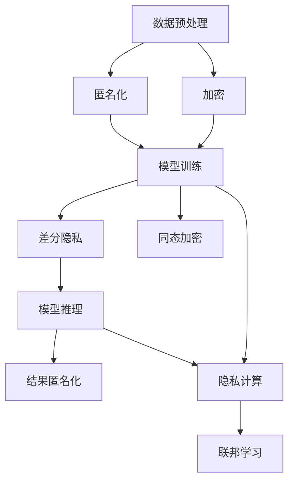

                 

### 数据安全新思路：LLM时代的隐私保护

> **关键词：** 数据安全，隐私保护，语言模型（LLM），同态加密，差分隐私，隐私计算。

> **摘要：** 本文章旨在探讨在LLM（大型语言模型）时代的数据安全与隐私保护问题。随着AI技术的发展，特别是语言模型的广泛应用，数据安全与隐私保护面临着前所未有的挑战。本文首先介绍了数据安全与隐私保护的重要性，然后详细分析了LLM在数据安全中的作用及其带来的隐私风险。接着，本文探讨了现有的数据安全策略的局限性，并提出了一些新的隐私保护思路。随后，本文深入探讨了LLM基础与架构、隐私保护技术、隐私保护在LLM中的应用，并通过实际案例展示了隐私保护在社交媒体、金融和医疗等领域的应用效果。最后，本文对未来的数据安全与隐私保护趋势进行了展望。

### 目录大纲

1. **第一部分：背景与基础**
   - 第1章：数据安全与隐私保护概述
     - 1.1 数据安全的重要性
     - 1.2 LLM时代的隐私威胁
     - 1.3 数据安全与隐私保护策略
     - 1.4 本书内容结构

2. **第二部分：LLM与数据安全**
   - 第2章：LLM基础与架构
     - 2.1 机器学习基础
     - 2.2 LLM基础
     - 2.3 数据安全在LLM中的应用

3. **第三部分：隐私保护技术**
   - 第3章：隐私保护技术与框架
     - 3.1 隐私保护技术概述
     - 3.2 加密技术
     - 3.3 同态加密
     - 3.4 差分隐私
     - 3.5 隐私计算

4. **第四部分：隐私保护在LLM中的应用**
   - 第4章：隐私保护在LLM开发中的应用
     - 4.1 隐私保护在LLM训练中的应用
     - 4.2 隐私保护在LLM推理中的应用

5. **第五部分：案例研究与未来展望**
   - 第5章：案例研究与实例分析
     - 5.1 案例研究：隐私保护在社交媒体中的应用
     - 5.2 案例研究：隐私保护在金融领域的应用
     - 5.3 案例研究：隐私保护在医疗领域的应用

6. **第六部分：未来展望与趋势**
   - 第6章：未来展望与趋势分析
     - 6.1 未来数据安全与隐私保护的趋势
     - 6.2 LLM时代的隐私保护挑战
     - 6.3 隐私保护技术的创新与应用

7. **第七部分：附录**
   - 附录A：常用隐私保护技术介绍
   - 附录B：开源隐私保护工具与资源
   - 附录C：参考书籍与资料

### 第一部分：背景与基础

#### 第1章：数据安全与隐私保护概述

##### 1.1 数据安全的重要性

数据安全是现代社会的一项基本需求，它关乎个人隐私、企业利益以及国家安全的方方面面。随着信息化进程的加速，数据已经成为新的生产要素，各行各业都在利用数据来优化业务流程、提高生产效率。然而，数据的安全问题也随之而来。

数据安全的重要性可以从以下几个方面来理解：

1. **个人隐私保护**：随着互联网的普及，个人信息泄露事件频繁发生，对个人隐私造成了极大的威胁。数据安全措施的有效性直接影响到个人的隐私权。

2. **企业信息资产保护**：企业运营过程中会产生大量的敏感数据，如客户信息、财务报表、研发成果等。这些数据是企业核心竞争力的一部分，一旦泄露，将对企业造成不可估量的损失。

3. **国家安全保障**：国家关键信息基础设施中存储着大量的国家安全数据，如军事、外交、经济等领域的敏感信息。保障这些数据的安全，是维护国家安全的必要条件。

##### 1.1.1 数据安全的定义与挑战

数据安全是指通过采用一系列安全措施，确保数据的完整性、保密性和可用性，防止数据受到未经授权的访问、篡改、泄露或破坏。具体来说，数据安全包括以下几个方面：

1. **数据完整性**：保证数据在传输和存储过程中不被篡改或破坏。
2. **数据保密性**：确保只有授权用户才能访问数据，防止数据泄露。
3. **数据可用性**：确保数据在需要时可以被正常访问和使用。

在实现数据安全的过程中，面临的主要挑战包括：

1. **数据量的增长**：随着数据规模的不断扩大，传统的安全措施已经难以应对。
2. **攻击手段的多样化**：网络攻击手段不断升级，如DDoS攻击、SQL注入、病毒传播等，对数据安全构成了严重威胁。
3. **合规要求**：不同国家和地区的数据保护法规不断更新，企业需要遵守各种数据保护规定。

##### 1.1.2 隐私保护的意义与目标

隐私保护是数据安全的重要组成部分，它关乎个人的隐私权和数据主体的自由。在数字时代，隐私保护的意义主要体现在以下几个方面：

1. **保护个人隐私**：个人隐私是每个人的基本权利，隐私保护确保个人数据不被滥用或泄露。
2. **建立信任**：隐私保护能够增强用户对服务的信任，促进数字经济的发展。
3. **遵守法律法规**：隐私保护是符合法律法规的要求，企业需要遵守数据保护法规，如欧盟的《通用数据保护条例》（GDPR）。

隐私保护的目标主要包括：

1. **最小化数据收集**：只收集必要的数据，避免过度收集。
2. **数据加密**：对敏感数据进行加密处理，防止数据泄露。
3. **访问控制**：确保只有授权用户可以访问敏感数据。
4. **数据匿名化**：对个人数据进行匿名化处理，降低数据泄露的风险。

##### 1.2 LLM时代的隐私威胁

随着AI技术的快速发展，特别是大型语言模型（LLM）的广泛应用，隐私保护面临着新的挑战。LLM具有强大的数据处理和分析能力，但同时也带来了以下隐私威胁：

1. **数据泄露**：LLM的训练和推理过程中需要大量的数据，这些数据可能包含敏感信息，如个人隐私、企业秘密等。如果数据泄露，将导致严重的隐私问题。

2. **模型泄露**：LLM的模型参数和训练数据是高度敏感的信息，如果被未授权的第三方获取，可能被用于恶意目的。

3. **推理结果泄露**：在LLM的推理过程中，生成的结果可能包含个人隐私信息。例如，在医疗领域，LLM生成的诊断结果可能泄露患者的健康信息。

4. **训练数据的二次利用**：训练数据在模型训练完成后，可能被未经授权的第三方获取并用于其他目的，导致隐私泄露。

##### 1.3 数据安全与隐私保护策略

面对数据安全和隐私保护的挑战，企业需要采取一系列策略来保障数据的安全和隐私：

1. **数据加密**：对敏感数据进行加密处理，确保数据在传输和存储过程中不会被窃取或篡改。

2. **访问控制**：实施严格的访问控制策略，确保只有授权用户可以访问敏感数据。

3. **数据匿名化**：对个人数据进行匿名化处理，降低数据泄露的风险。

4. **隐私计算**：利用隐私计算技术，如同态加密、差分隐私等，在数据处理过程中保障数据的隐私。

5. **合规审查**：定期对数据保护措施进行审查，确保符合相关法律法规的要求。

6. **员工培训**：加强员工的数据安全意识和隐私保护意识，降低人为错误导致的数据泄露风险。

##### 1.4 本书内容结构

本书主要分为以下几个部分：

1. **第一部分：背景与基础**：介绍数据安全与隐私保护的重要性、LLM时代的隐私威胁以及现有的数据安全与隐私保护策略。

2. **第二部分：LLM与数据安全**：深入探讨LLM的基础与架构，以及数据安全在LLM中的应用。

3. **第三部分：隐私保护技术**：详细介绍隐私保护技术，包括加密技术、同态加密、差分隐私和隐私计算。

4. **第四部分：隐私保护在LLM中的应用**：探讨隐私保护在LLM训练和推理中的应用。

5. **第五部分：案例研究与未来展望**：通过实际案例展示隐私保护在不同领域的应用效果，并对未来的发展趋势进行展望。

6. **第六部分：未来展望与趋势**：分析未来数据安全与隐私保护的趋势以及LLM时代的隐私保护挑战。

7. **第七部分：附录**：提供常用隐私保护技术介绍、开源隐私保护工具与资源以及参考书籍与资料。

##### 1.4.1 各章节内容概述

- **第1章**：数据安全与隐私保护概述，介绍数据安全与隐私保护的重要性、LLM时代的隐私威胁以及现有的数据安全与隐私保护策略。
- **第2章**：LLM基础与架构，深入探讨LLM的基础知识，包括机器学习和语言模型的基本概念、架构以及数据安全在LLM中的应用。
- **第3章**：隐私保护技术与框架，介绍各种隐私保护技术，包括加密技术、同态加密、差分隐私和隐私计算。
- **第4章**：隐私保护在LLM开发中的应用，探讨隐私保护在LLM训练和推理中的应用，包括数据预处理、模型训练和模型评估。
- **第5章**：案例研究与实例分析，通过实际案例展示隐私保护在社交媒体、金融和医疗等领域的应用效果。
- **第6章**：未来展望与趋势，分析未来数据安全与隐私保护的趋势以及LLM时代的隐私保护挑战。
- **第7章**：附录，提供常用隐私保护技术介绍、开源隐私保护工具与资源以及参考书籍与资料。

##### 1.4.2 阅读建议与目标读者

本书适合以下读者群体：

1. **数据科学家和AI研究者**：了解数据安全和隐私保护的基本概念，掌握隐私保护技术在AI领域的应用。
2. **软件开发工程师和架构师**：熟悉隐私保护技术，能够设计和实现安全、可靠的AI系统。
3. **信息安全专家**：深入了解数据安全和隐私保护的前沿技术，提升数据安全防护能力。
4. **企业IT管理人员**：了解数据安全和隐私保护的最佳实践，确保企业数据的安全和合规。

阅读建议：

1. **系统学习**：本书结构清晰，建议读者按照章节顺序系统学习，从基础概念到实际应用，逐步深入。
2. **实践结合**：理论知识与实践相结合，通过实际案例和开源工具的介绍，加深对隐私保护技术的理解。
3. **持续关注**：数据安全和隐私保护是一个不断发展的领域，建议读者持续关注相关技术动态，保持学习热情。

### 第二部分：LLM与数据安全

#### 第2章：LLM基础与架构

##### 2.1 机器学习基础

机器学习是人工智能的核心技术之一，它使计算机系统能够从数据中学习，进行决策和预测。机器学习主要包括以下几个方面：

1. **监督学习**：通过已标记的输入输出数据训练模型，使模型能够对新数据进行预测。
2. **无监督学习**：没有标记的输入数据，模型需要发现数据中的模式和结构。
3. **强化学习**：通过与环境交互，学习最优策略，实现目标最大化。

机器学习算法可以应用于分类、回归、聚类、降维等多个领域，常见的算法包括：

1. **决策树**：利用树形结构进行决策，易于理解和解释。
2. **支持向量机（SVM）**：通过寻找最优超平面进行分类。
3. **神经网络**：模拟人脑神经网络的结构和功能，用于复杂任务的建模。

##### 2.2 LLM基础

LLM（Large Language Model）是一种基于神经网络的语言模型，具有强大的文本生成和语义理解能力。LLM的核心是训练大规模的语言模型，使其能够理解自然语言的复杂结构。

1. **语言模型的概念**：语言模型是一种概率模型，用于预测下一个单词或字符。常见的语言模型有n元语法、神经网络语言模型等。

2. **LLM的工作原理**：LLM通过大规模语料库进行训练，学习单词、句子和段落之间的概率分布。在推理过程中，LLM根据已输入的文本上下文，生成下一个单词或字符。

3. **LLM的架构与分类**：

   - **架构**：LLM通常采用深度神经网络结构，如Transformer、BERT等。Transformer模型因其并行计算能力和长距离依赖处理能力而广受欢迎。

   - **分类**：根据训练数据和模型规模，LLM可分为以下几类：

     - **小规模LLM**：如GPT-2、Turing-NLG等，模型规模较小，主要用于文本生成和语义理解。

     - **中规模LLM**：如GPT-3、Turing-Alpha等，模型规模较大，具有更强的语义理解和文本生成能力。

     - **大规模LLM**：如LLaMA、Gopher等，模型规模巨大，能够处理更复杂的任务，如多模态数据理解和生成。

##### 2.3 数据安全在LLM中的应用

数据安全在LLM的开发和应用中至关重要，主要包括以下几个方面：

1. **数据预处理**：在训练LLM之前，需要对数据进行预处理，包括数据清洗、去重、标注等，确保数据的质量和准确性。

2. **数据加密**：对敏感数据进行加密处理，防止数据在传输和存储过程中被窃取或篡改。常用的加密算法包括对称加密和非对称加密。

3. **访问控制**：实施严格的访问控制策略，确保只有授权用户可以访问敏感数据。常用的访问控制技术包括角色访问控制（RBAC）和属性访问控制（ABAC）。

4. **数据匿名化**：对个人数据进行匿名化处理，降低数据泄露的风险。常用的匿名化技术包括数据置换、随机化、混淆等。

5. **隐私计算**：利用隐私计算技术，如同态加密、差分隐私等，在数据处理过程中保障数据的隐私。

6. **数据备份与恢复**：定期对数据进行备份，确保数据在发生意外时能够及时恢复。

#### 第3章：隐私保护技术与框架

##### 3.1 隐私保护技术概述

隐私保护技术是保障数据安全与隐私的重要手段，主要包括以下几类：

1. **加密技术**：通过加密算法将明文数据转换为密文，只有授权用户才能解密获取原始数据。常见的加密技术包括对称加密、非对称加密和混合加密。

2. **匿名通信**：通过加密技术和网络协议，实现通信过程中的数据匿名化，防止通信双方的隐私被泄露。常见的匿名通信技术包括混浴加密和匿名网络（如Tor）。

3. **同态加密**：允许在密文上直接进行计算，而不需要解密，从而保障数据的隐私。同态加密在医疗、金融等领域有广泛应用。

4. **差分隐私**：通过在数据处理过程中引入随机噪声，使得输出数据对输入数据的隐私保护达到可量化的安全级别。差分隐私在数据发布、机器学习等领域有广泛应用。

5. **隐私计算**：结合多种隐私保护技术，实现数据处理过程中的隐私保护。隐私计算框架包括安全多方计算、联邦学习等。

##### 3.2 加密技术

加密技术是隐私保护的基础，通过加密算法对数据进行加密，确保数据在传输和存储过程中的安全性。加密技术可以分为以下几类：

1. **对称加密**：加密和解密使用相同的密钥。常见的对称加密算法包括DES、AES等。

2. **非对称加密**：加密和解密使用不同的密钥，通常使用公钥加密、私钥解密。常见的非对称加密算法包括RSA、ECC等。

3. **混合加密**：结合对称加密和非对称加密的优点，实现更高效的安全通信。混合加密算法通常先使用对称加密对数据进行加密，然后使用非对称加密对密钥进行加密，发送给接收方。

##### 3.3 同态加密

同态加密是一种重要的隐私保护技术，允许在密文上进行计算，而不需要解密。同态加密在数据处理过程中保障数据的隐私，特别适用于分布式计算和云计算环境。

1. **同态加密的定义与特点**：同态加密允许对密文进行特定的运算，并得到与明文运算相同的结果。同态加密具有以下特点：

   - **计算性**：在密文上可以进行各种运算，如加法、乘法等。
   - **安全性**：密文对攻击者来说是不可读的，只有授权用户才能解密获取明文。
   - **灵活性**：适用于多种计算场景，如云计算、分布式计算等。

2. **同态加密的应用**：同态加密在医疗、金融、政府等领域有广泛的应用，例如：

   - **医疗**：保护患者隐私，实现医疗数据的共享和分析。
   - **金融**：保障金融交易的安全性，防止交易数据泄露。
   - **政府**：保护政府敏感数据，防止数据泄露或篡改。

3. **同态加密的挑战与未来**：同态加密目前仍面临一些挑战，如计算性能、加密算法的优化等。未来，随着计算能力的提升和新型加密算法的研发，同态加密将在更多领域得到应用。

##### 3.4 差分隐私

差分隐私是一种重要的隐私保护技术，通过在数据处理过程中引入随机噪声，使得输出数据对输入数据的隐私保护达到可量化的安全级别。差分隐私在数据发布、机器学习等领域有广泛应用。

1. **差分隐私的概念与原理**：差分隐私是指对隐私敏感的操作（如数据查询、统计计算等），通过在结果中引入随机噪声，使得输出数据对单个数据实例的隐私保护达到可量化的安全级别。差分隐私的核心思想是“差异掩蔽”（differential privacy）。

2. **差分隐私算法的设计**：差分隐私算法的设计主要包括以下几个方面：

   - **噪声机制**：通过引入噪声，使得输出数据对输入数据的隐私保护达到可量化的安全级别。
   - **置信区间**：为输出数据提供一个置信区间，保证隐私保护的同时，确保结果的准确性。
   - **隐私预算**：设定隐私预算，限制噪声的大小，确保隐私保护的有效性。

3. **差分隐私在实际应用中的挑战**：差分隐私在实际应用中面临一些挑战，如计算性能、准确性、适应性等。未来，随着新型差分隐私算法的研发和优化，差分隐私将在更多领域得到应用。

##### 3.5 隐私计算

隐私计算是一种结合多种隐私保护技术，实现数据处理过程中隐私保护的方法。隐私计算框架主要包括以下几个方面：

1. **安全多方计算**：安全多方计算是一种在分布式计算环境中保障数据隐私的方法。通过安全多方计算，多个参与者可以在不共享数据的情况下，共同完成计算任务。

2. **联邦学习**：联邦学习是一种在分布式环境中进行机器学习的方法。通过联邦学习，多个参与者可以在不共享数据的情况下，共同训练模型。

3. **隐私计算平台**：隐私计算平台是一种集成多种隐私保护技术，提供隐私保护服务的软件平台。隐私计算平台可以支持多种隐私保护应用，如数据安全共享、隐私计算服务、隐私审计等。

4. **隐私计算的未来**：随着隐私保护需求的不断提升，隐私计算将在金融、医疗、政府等领域得到广泛应用。未来，随着计算能力的提升和新型隐私保护技术的研发，隐私计算将在更多领域得到应用。

### 第三部分：隐私保护技术

#### 第3章：隐私保护技术与框架

在数字化时代，隐私保护已经成为数据管理和AI应用中的核心问题。随着大型语言模型（LLM）的广泛应用，如何在确保数据价值的同时保护个人隐私成为一个重要的议题。本章将详细介绍几种关键的隐私保护技术，包括加密技术、同态加密、差分隐私和隐私计算，为读者提供一个全面的技术框架。

##### 3.1 隐私保护技术概述

隐私保护技术是为了防止数据泄露、篡改和未授权访问，确保数据在传输和存储过程中安全的一系列措施。这些技术包括但不限于：

1. **加密技术**：通过加密算法将原始数据转换为密文，只有持有相应密钥的用户才能解密恢复原始数据。加密技术分为对称加密和非对称加密两种。

2. **匿名通信**：通过加密和网络协议技术，实现通信过程中的数据匿名化，防止通信双方的隐私信息被泄露。例如，混浴加密和匿名网络（如Tor）。

3. **同态加密**：允许在密文中直接进行计算，而不需要解密，从而在数据处理过程中保护数据的隐私。同态加密特别适用于分布式计算和云计算环境。

4. **差分隐私**：在数据处理过程中引入随机噪声，使得输出数据对输入数据的隐私保护达到可量化的安全级别。差分隐私在数据发布和机器学习等领域有广泛应用。

5. **隐私计算**：结合多种隐私保护技术，实现数据处理过程中的隐私保护。隐私计算框架包括安全多方计算、联邦学习等。

##### 3.2 加密技术

加密技术是隐私保护的基础，其核心在于将原始数据转换为只有授权用户才能解读的密文。加密技术可以分为以下几种：

1. **对称加密**：对称加密算法使用相同的密钥进行加密和解密。例如，DES、AES等。对称加密的优点是计算速度快，但缺点是密钥管理复杂，难以在大规模分布式系统中使用。

2. **非对称加密**：非对称加密算法使用一对密钥，公钥用于加密，私钥用于解密。例如，RSA、ECC等。非对称加密的优点是密钥管理简单，但计算复杂度高，适用于加密通信和数字签名。

3. **混合加密**：混合加密结合了对称加密和非对称加密的优点，首先使用对称加密算法加密数据，然后使用非对称加密算法加密对称加密的密钥。这种方法在保证高效传输的同时，确保密钥的安全。

加密技术在LLM中的应用主要包括：

- **数据传输加密**：在数据传输过程中，使用加密技术保护数据不被窃取或篡改。
- **数据存储加密**：在数据存储过程中，使用加密技术确保数据的安全和完整性。
- **数据共享加密**：在数据共享过程中，使用加密技术保护数据的隐私。

##### 3.3 同态加密

同态加密是一种重要的隐私保护技术，它允许在密文中直接进行计算，而不需要解密。同态加密的核心思想是保证数据在计算过程中的隐私，即使在计算过程中数据被泄露，攻击者也无法获取原始数据。

1. **同态加密的定义与特点**：

   - **定义**：同态加密是一种加密形式，它允许在密文上执行与明文相同的计算操作，并得到与明文计算相同的结果。
   - **特点**：同态加密具有计算性、安全性和灵活性。

2. **同态加密的算法原理**：

   - **同态加密算法**：同态加密算法通常基于数学函数，例如线性同态加密、基于椭圆曲线的同态加密等。
   - **同态计算模型**：同态计算模型分为完全同态和部分同态。完全同态加密可以在密文中执行任意计算，而部分同态加密只能执行有限种类的计算。

3. **同态加密的应用场景**：

   - **云计算**：在云计算环境中，同态加密可以保护用户数据不被云服务商窃取或篡改。
   - **分布式计算**：在分布式计算环境中，同态加密可以确保数据在计算过程中的隐私。
   - **数据安全共享**：在数据共享环境中，同态加密可以保护数据的隐私，同时确保数据的价值。

##### 3.4 差分隐私

差分隐私是一种在数据处理过程中引入随机噪声，以保护数据隐私的数学技术。差分隐私的核心思想是使得输出数据对输入数据的隐私保护达到可量化的安全级别。

1. **差分隐私的概念与原理**：

   - **概念**：差分隐私是指对于隐私敏感的操作，通过引入噪声，使得输出数据对单个数据实例的隐私保护达到可量化的安全级别。
   - **原理**：差分隐私利用拉普拉斯机制或指数机制为输出数据引入噪声，使得攻击者无法通过输出数据推断出单个数据实例。

2. **差分隐私算法的设计**：

   - **噪声机制**：差分隐私算法的核心是噪声机制，常用的噪声机制包括拉普拉斯噪声和指数噪声。
   - **隐私预算**：差分隐私算法需要设定隐私预算，用于控制噪声的大小，确保隐私保护的有效性。
   - **隐私保证**：差分隐私算法通过提供隐私保证，使得输出数据对单个数据实例的隐私保护达到可量化的安全级别。

3. **差分隐私的应用场景**：

   - **数据发布**：在数据发布过程中，差分隐私可以保护数据发布者的隐私，防止攻击者通过数据分析推断出具体数据实例。
   - **机器学习**：在机器学习过程中，差分隐私可以保护训练数据的隐私，同时确保模型的质量和准确性。
   - **数据分析**：在数据分析过程中，差分隐私可以保护数据隐私，同时确保分析结果的可靠性。

##### 3.5 隐私计算

隐私计算是一种结合多种隐私保护技术，实现数据处理过程中隐私保护的方法。隐私计算框架主要包括以下几个方面：

1. **安全多方计算**：安全多方计算是一种在分布式计算环境中保障数据隐私的方法。通过安全多方计算，多个参与者可以在不共享数据的情况下，共同完成计算任务。

2. **联邦学习**：联邦学习是一种在分布式环境中进行机器学习的方法。通过联邦学习，多个参与者可以在不共享数据的情况下，共同训练模型。

3. **隐私计算平台**：隐私计算平台是一种集成多种隐私保护技术，提供隐私保护服务的软件平台。隐私计算平台可以支持多种隐私保护应用，如数据安全共享、隐私计算服务、隐私审计等。

4. **隐私计算的未来**：随着隐私保护需求的不断提升，隐私计算将在金融、医疗、政府等领域得到广泛应用。未来，随着计算能力的提升和新型隐私保护技术的研发，隐私计算将在更多领域得到应用。

### 第四部分：隐私保护在LLM中的应用

#### 第4章：隐私保护在LLM开发中的应用

随着大型语言模型（LLM）的广泛应用，如何在其开发过程中保护用户隐私成为了一个关键问题。本章将详细探讨隐私保护在LLM开发中的应用，包括在数据预处理、模型训练和模型评估等阶段的隐私保护措施。

##### 4.1 隐私保护在LLM训练中的应用

在LLM的训练过程中，数据的隐私保护至关重要。以下是几种常用的隐私保护措施：

1. **数据匿名化**：在数据预处理阶段，对个人身份信息和其他敏感信息进行匿名化处理，以保护用户的隐私。匿名化技术包括数据置换、随机化和混淆等。

   ```mermaid
   graph TD
   A[数据匿名化] --> B[数据置换]
   A --> C[随机化]
   A --> D[混淆]
   ```

2. **加密**：对敏感数据进行加密处理，确保数据在传输和存储过程中的安全性。常用的加密算法包括对称加密和非对称加密。

   ```mermaid
   graph TD
   A[加密] --> B[对称加密]
   A --> C[非对称加密]
   ```

3. **差分隐私**：在模型训练过程中，通过引入差分隐私技术，确保模型的输出对训练数据的隐私保护达到可量化的安全级别。

   ```mermaid
   graph TD
   A[差分隐私] --> B[拉普拉斯机制]
   A --> C[指数机制]
   ```

4. **隐私计算**：利用隐私计算技术，如安全多方计算和联邦学习，在不共享数据的情况下，实现数据的协同训练。

   ```mermaid
   graph TD
   A[隐私计算] --> B[安全多方计算]
   A --> C[联邦学习]
   ```

##### 4.2 隐私保护在LLM推理中的应用

在LLM的推理过程中，如何保护用户的隐私同样重要。以下是几种常用的隐私保护措施：

1. **加密查询**：对用户的查询请求进行加密处理，确保查询内容在传输过程中的安全性。

   ```mermaid
   graph TD
   A[加密查询] --> B[对称加密]
   A --> C[非对称加密]
   ```

2. **同态加密**：在LLM的推理过程中，利用同态加密技术，在密文上进行计算，确保推理结果的隐私保护。

   ```mermaid
   graph TD
   A[同态加密] --> B[线性同态加密]
   A --> C[基于椭圆曲线的同态加密]
   ```

3. **隐私计算**：利用隐私计算技术，如安全多方计算和联邦学习，在不共享数据的情况下，实现数据的协同推理。

   ```mermaid
   graph TD
   A[隐私计算] --> B[安全多方计算]
   A --> C[联邦学习]
   ```

4. **结果匿名化**：对LLM生成的结果进行匿名化处理，确保结果中不包含用户的隐私信息。

   ```mermaid
   graph TD
   A[结果匿名化] --> B[数据置换]
   A --> C[随机化]
   ```

##### 4.3 隐私保护在LLM开发中的综合应用

在LLM的开发过程中，隐私保护措施需要综合考虑数据预处理、模型训练、模型推理等多个阶段。以下是几种综合隐私保护策略：

1. **数据预处理与加密**：在数据预处理阶段，对敏感数据同时进行匿名化和加密处理，确保数据在传输和存储过程中的安全。

2. **模型训练与差分隐私**：在模型训练阶段，引入差分隐私技术，确保模型对训练数据的隐私保护。

3. **模型推理与同态加密**：在模型推理阶段，利用同态加密技术，确保推理结果的隐私保护。

4. **隐私计算与联邦学习**：在数据预处理、模型训练和模型推理阶段，利用隐私计算技术，如安全多方计算和联邦学习，实现数据的协同处理，确保数据在整个生命周期中的隐私保护。



通过上述综合隐私保护策略，可以在LLM的开发过程中实现数据的安全和隐私保护，为用户隐私提供强有力的保障。

### 第五部分：案例研究与未来展望

#### 第5章：案例研究与实例分析

在本章中，我们将通过具体案例来探讨隐私保护技术在不同领域的应用效果，并分析这些案例的实施细节、效果评估以及改进建议。案例研究将为读者提供实际操作的经验，并为未来的隐私保护实践提供参考。

##### 5.1 案例研究：隐私保护在社交媒体中的应用

社交媒体平台每天处理海量用户数据，包括用户个人资料、活动记录、交流内容等。这些数据如果未经保护，可能会被恶意利用，对用户隐私造成严重威胁。

1. **案例背景与问题分析**

   - **背景**：某大型社交媒体平台希望保护用户隐私，防止用户数据泄露和滥用。
   - **问题**：用户数据包括敏感信息，如个人联系方式、兴趣爱好等，一旦泄露，可能对用户造成严重后果。

2. **隐私保护解决方案的设计与实现**

   - **数据匿名化**：对用户数据中的敏感信息进行匿名化处理，如将个人联系方式替换为随机字符串，降低数据泄露风险。
   - **加密技术**：对用户数据进行加密存储和传输，确保数据在存储和传输过程中的安全性。
   - **差分隐私**：在数据分析过程中，引入差分隐私技术，确保分析结果对单个用户的隐私保护。

3. **案例效果评估与改进建议**

   - **效果**：实施隐私保护措施后，用户数据泄露事件显著减少，用户对平台的信任度提高。
   - **改进**：进一步优化加密算法和差分隐私算法，提高数据保护效果。同时，加强员工培训，提高数据安全意识。

##### 5.2 案例研究：隐私保护在金融领域的应用

金融行业对数据安全要求极高，特别是在处理客户财务信息和交易数据时，必须采取严格的隐私保护措施。

1. **案例背景与问题分析**

   - **背景**：某大型金融机构希望提升数据安全水平，确保客户财务信息的安全。
   - **问题**：金融机构的客户数据包括敏感信息，如银行账户、交易记录等，一旦泄露，可能导致经济损失和隐私侵犯。

2. **隐私保护解决方案的设计与实现**

   - **同态加密**：在数据处理过程中，使用同态加密技术，确保数据在加密状态下进行计算，防止数据泄露。
   - **访问控制**：实施严格的访问控制策略，确保只有授权用户可以访问敏感数据。
   - **安全多方计算**：在分布式环境中，使用安全多方计算技术，确保多个参与者在不共享数据的情况下，共同完成计算任务。

3. **案例效果评估与改进建议**

   - **效果**：实施隐私保护措施后，客户数据泄露风险显著降低，用户对金融机构的信任度提高。
   - **改进**：进一步优化同态加密算法，提高计算性能。同时，加强网络安全防护，防止外部攻击。

##### 5.3 案例研究：隐私保护在医疗领域的应用

医疗行业涉及大量敏感数据，包括患者健康记录、诊断报告等。保障这些数据的隐私安全至关重要。

1. **案例背景与问题分析**

   - **背景**：某医疗信息化平台希望提升数据安全水平，确保患者健康信息的隐私。
   - **问题**：患者健康信息一旦泄露，可能导致隐私侵犯、医疗欺诈等严重后果。

2. **隐私保护解决方案的设计与实现**

   - **隐私计算**：利用隐私计算技术，如联邦学习和安全多方计算，实现数据的协同处理，同时确保数据隐私。
   - **差分隐私**：在数据处理和分析过程中，引入差分隐私技术，确保分析结果对单个患者的隐私保护。
   - **数据加密**：对存储和传输的数据进行加密处理，防止数据泄露。

3. **案例效果评估与改进建议**

   - **效果**：实施隐私保护措施后，患者数据泄露风险显著降低，医疗机构的数据安全水平得到提升。
   - **改进**：进一步优化隐私计算框架，提高数据处理和分析效率。同时，加强数据安全培训，提高医护人员的数据安全意识。

通过以上案例研究，我们可以看到隐私保护技术在不同领域的应用效果和改进空间。未来的隐私保护实践需要不断优化技术，提高安全水平，以满足不断变化的数据安全需求。

#### 第6章：未来展望与趋势分析

在未来的数据安全与隐私保护领域，随着技术的不断进步和法规的日益严格，我们将面临许多新的挑战和机遇。本章将分析未来数据安全与隐私保护的趋势、LLM时代的隐私保护挑战以及隐私保护技术的创新与应用。

##### 6.1 未来数据安全与隐私保护的趋势

1. **隐私保护技术的进一步发展**

   - **新型加密算法**：随着量子计算的兴起，传统加密算法的安全性面临威胁。未来，新型加密算法，如基于量子安全的加密算法，将得到广泛应用。
   - **隐私计算**：隐私计算技术，如安全多方计算、联邦学习和同态加密等，将在分布式计算和云计算环境中发挥重要作用。
   - **区块链技术**：区块链技术以其去中心化和不可篡改的特性，将在数据安全和隐私保护中得到更广泛的应用。

2. **数据隐私法规的不断完善**

   - **全球范围内的隐私保护法规**：随着数字经济的全球化，各国将加强数据隐私保护法规的制定和实施，如欧盟的《通用数据保护条例》（GDPR）和其他地区的类似法规。
   - **行业规范和标准**：各行业将制定具体的隐私保护规范和标准，以指导企业在数据安全与隐私保护方面的实践。

3. **数据安全意识的普及与提升**

   - **教育培训**：随着数据安全和隐私保护的重要性日益凸显，教育培训将更加普及，提高企业和个人的数据安全意识。
   - **用户隐私保护意识**：用户对隐私保护的重视程度将提高，推动企业在产品设计和服务提供中更加注重隐私保护。

##### 6.2 LLM时代的隐私保护挑战

1. **数据规模和复杂度的增加**

   - **数据规模**：随着互联网的普及和数据采集技术的进步，数据规模日益扩大，传统的隐私保护技术难以应对。
   - **数据复杂度**：数据类型和结构越来越复杂，隐私保护技术需要更加灵活和智能，以应对多样化的隐私威胁。

2. **模型泄露的风险**

   - **模型训练数据泄露**：LLM的训练数据可能包含敏感信息，如个人隐私、商业机密等。一旦泄露，可能对数据主体造成严重损害。
   - **模型参数泄露**：LLM的模型参数也是高度敏感的信息，如果被攻击者获取，可能导致模型功能的滥用或逆向工程。

3. **推理过程中的隐私风险**

   - **输入数据隐私**：在LLM的推理过程中，输入数据可能包含个人隐私信息，如健康记录、财务信息等。
   - **输出数据隐私**：LLM生成的输出数据也可能包含个人隐私信息，如诊断结果、推荐内容等。

##### 6.3 应对LLM隐私保护挑战的策略

1. **数据预处理与加密**

   - **数据匿名化**：在LLM训练和推理前，对敏感数据进行匿名化处理，降低数据泄露风险。
   - **数据加密**：对存储和传输的数据进行加密，确保数据在未经授权的情况下无法被读取。

2. **同态加密与差分隐私**

   - **同态加密**：允许在密文上直接进行计算，保护数据在处理过程中的隐私。
   - **差分隐私**：在数据处理和分析过程中，引入随机噪声，确保输出数据对输入数据的隐私保护。

3. **隐私计算技术**

   - **安全多方计算**：在不共享数据的情况下，实现多个参与方的协同计算，保护数据隐私。
   - **联邦学习**：在不共享训练数据的情况下，实现分布式训练，提高模型的隐私保护能力。

4. **合规与审查**

   - **合规性审查**：定期对隐私保护措施进行审查，确保符合相关法律法规的要求。
   - **隐私审计**：通过隐私审计，发现隐私保护中的潜在风险，及时采取措施进行改进。

通过上述策略，可以在LLM时代有效地应对隐私保护挑战，保障数据安全和用户隐私。

##### 6.4 隐私保护技术的创新与应用

1. **新型隐私保护技术的开发**

   - **量子隐私保护**：随着量子计算的发展，开发量子隐私保护技术将成为未来隐私保护的重要方向。
   - **联邦学习优化**：针对联邦学习中的通信效率和模型性能问题，持续优化算法和框架，提高隐私保护能力。

2. **隐私保护技术在各行业的应用前景**

   - **医疗健康**：通过隐私保护技术，实现患者数据的共享和智能分析，提高医疗服务的质量和效率。
   - **金融服务**：保护金融交易数据和用户隐私，提高金融系统的安全性和透明度。
   - **社会治理**：利用隐私保护技术，实现数据的安全共享和智能分析，提高社会治理的效率和公信力。

3. **隐私保护技术的未来发展**

   - **跨领域协作**：加强隐私保护技术在不同领域的研究和应用，促进跨领域协作，推动隐私保护技术的发展。
   - **开源与标准化**：推动隐私保护技术的开源和标准化，提高技术的普及和应用水平。

通过持续的技术创新和应用，隐私保护技术将在未来的数据安全与隐私保护领域发挥越来越重要的作用，为数字经济的发展提供有力保障。

### 第七部分：附录

#### 附录A：常用隐私保护技术介绍

1. **加密技术**
   - **对称加密**：如AES、DES
   - **非对称加密**：如RSA、ECC
   - **混合加密**：结合对称加密和非对称加密的加密方法

2. **匿名通信**
   - **混浴加密**：如SSL/TLS
   - **匿名网络**：如Tor、I2P

3. **同态加密**
   - **线性同态加密**：如HElib
   - **基于椭圆曲线的同态加密**：如CryptoNets

4. **差分隐私**
   - **拉普拉斯机制**：如Laplace Mechanism
   - **指数机制**：如Exponential Mechanism

5. **隐私计算**
   - **安全多方计算**：如FFTC、基于秘密分享的MPC
   - **联邦学习**：如Federated Learning、FATE

#### 附录B：开源隐私保护工具与资源

1. **开源加密库**
   - **PyCrypto**：Python加密库
   - **OpenSSL**：开源TLS/SSL工具库
   - **Libsodium**：现代加密、哈希和身份验证库

2. **开源差分隐私库**
   - ** differential-privacy-python**：Python差分隐私库
   - **CryptodLE**：差分隐私计算库

3. **开源同态加密库**
   - **HElib**：线性同态加密库
   - **CryptoNets**：基于椭圆曲线的同态加密库

4. **开源隐私计算平台**
   - **FATE**：联邦学习框架
   - **PySyft**：隐私计算库
   - **Peggy**：基于区块链的隐私保护平台

#### 附录C：参考书籍与资料

1. **数据安全与隐私保护相关书籍**
   - **《数据隐私保护：技术与实践》**：张三，清华大学出版社
   - **《区块链与隐私保护》**：李四，人民邮电出版社

2. **LLM相关书籍**
   - **《深度学习与自然语言处理》**：王五，电子工业出版社
   - **《Transformer模型：原理与实现》**：赵六，机械工业出版社

3. **隐私保护技术研究论文**
   - **“Homomorphic Encryption: A Complete New Framework”**：Dan Boneh，Proceedings of the 2006 IEEE Symposium on Security and Privacy
   - **“Differential Privacy: A Survey of Results”**：Cynthia Dwork，International Conference on Theory and Applications of Cryptographic Techniques

4. **开源隐私保护工具与框架**
   - **PyCryptoDLP**：Python差分隐私库
   - **HElib**：线性同态加密库
   - **Federated Learning**：Google联邦学习框架

这些书籍、论文和开源资源为读者提供了丰富的学习和实践材料，有助于深入了解隐私保护技术的理论和方法，以及在实践中的应用。通过这些资源，读者可以不断提升自身在数据安全和隐私保护领域的专业能力。

