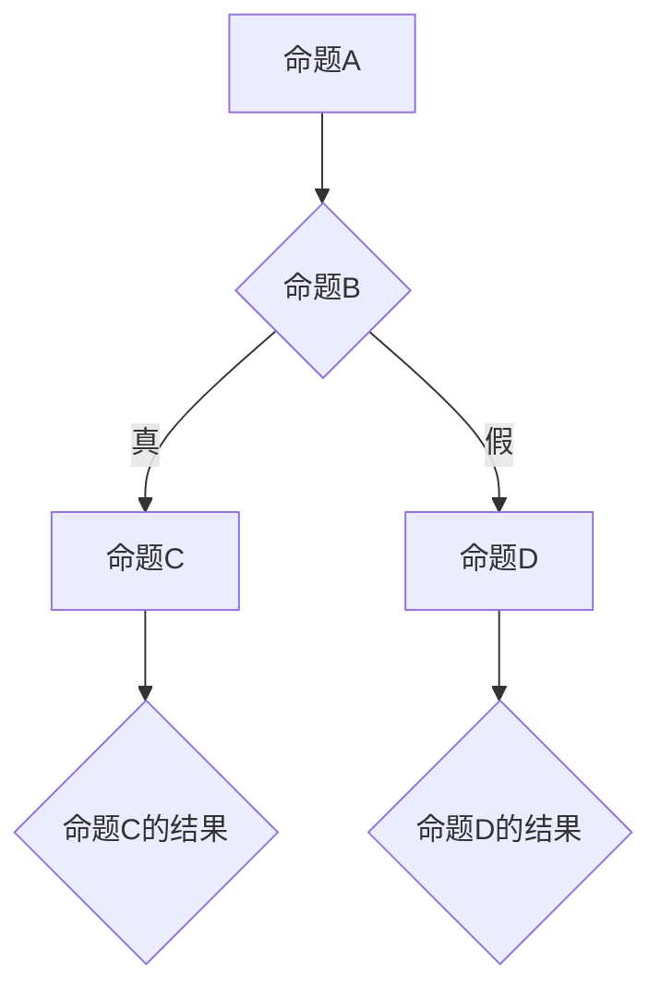

                 

# 数理逻辑：P和P*的关系

> **关键词：** 数理逻辑、P类问题、P*类问题、关系分析、计算机科学、人工智能

> **摘要：** 本文将探讨数理逻辑中的P和P*之间的关系，从定义、特征、分析到实际应用，全面解析这两者在计算机科学和人工智能领域中的重要作用。通过数理逻辑的基础知识铺垫，我们将逐步深入，揭示P和P*之间的关系，并探讨其未来的发展趋势。

### 第一部分：数理逻辑基础

#### 第1章：数理逻辑概述

##### 1.1 数理逻辑的发展历史

数理逻辑是一门研究逻辑与数学之间关系的学科，其起源可以追溯到古希腊时期。亚里士多德是早期逻辑学的奠基者，他的逻辑学著作《工具论》被认为是逻辑学的开端。然而，现代数理逻辑的奠基者被认为是德国哲学家莱布尼茨，他在17世纪提出了“符号逻辑”的概念，并试图用符号表示和验证推理过程。

19世纪末，德国数学家弗雷格和皮亚诺等人在数理逻辑的发展上做出了重要贡献。弗雷格提出了谓词逻辑的概念，而皮亚诺则建立了数理逻辑的公理化系统。20世纪初，数学家罗素和怀特海德合著的《数学原理》一书，系统阐述了数理逻辑的理论基础，标志着数理逻辑进入了一个新的阶段。

##### 1.2 数理逻辑的基本概念

数理逻辑主要研究命题、谓词、推理等基本概念。命题是具有真值的陈述句，可以是真也可以是假。谓词是描述个体或对象性质的表达式，可以是具体的对象，也可以是抽象的概念。

推理是逻辑的核心，包括演绎推理和归纳推理。演绎推理是从一般到特殊的推理过程，其结论必然成立；而归纳推理是从特殊到一般的推理过程，其结论只是具有概率性。

##### 1.3 数理逻辑的基本原理

数理逻辑的基本原理包括命题逻辑和谓词逻辑。命题逻辑研究命题之间的逻辑关系，包括命题联结词和推理规则。谓词逻辑研究谓词之间的关系，包括量词和推理规则。

命题逻辑的基本原理包括：命题联结词（如“与”、“或”、“非”）的定义和性质，以及推理规则（如“逆否律”、“合取律”）的应用。谓词逻辑的基本原理包括：谓词的定义和表示方法，量词的含义和作用，以及推理方法（如“全称量化”、“存在量化”）。

#### 第2章：命题逻辑

##### 2.1 命题及其表示方法

命题是具有明确真值的陈述句，可以分为简单命题和复合命题。简单命题是单个命题，如“今天是星期一”；复合命题是由简单命题通过联结词组合而成的命题，如“今天是星期一且明天是星期二”。

命题的表示方法可以使用符号表示，如“p”、“q”、“r”等。这些符号用于表示简单命题，而复合命题则通过符号联结词表示，如“p ∧ q”（表示“p且q”）和“¬p”（表示“非p”）。

##### 2.2 命题联结词

命题联结词是用于连接简单命题的符号，包括“与”、“或”、“非”等。这些联结词的定义如下：

- 与（∧）：复合命题“p ∧ q”为真，当且仅当p和q都为真。
- 或（∨）：复合命题“p ∨ q”为真，当且仅当p或q至少有一个为真。
- 非（¬）：复合命题“¬p”为真，当且仅当p为假。

##### 2.3 命题逻辑的推理规则

命题逻辑的推理规则包括推理规则和证明方法。推理规则是用于推导新命题的规则，包括：

- 真值表推理：通过构建真值表，验证复合命题的真假。
- 等值变换：使用逻辑等价性，将复合命题转换为更简单的形式。
- 演绎推理：从已知命题出发，通过推理规则得出新的命题。

证明方法包括直接证明和间接证明。直接证明是通过逻辑推理直接证明命题为真；间接证明是通过反证法，假设命题为假，然后推导出矛盾，从而证明命题为真。

#### 第3章：谓词逻辑

##### 3.1 谓词及其表示方法

谓词是描述个体或对象性质的表达式，可以表示为“P(x)”或“∃xP(x)”。其中，P表示谓词，x表示个体或对象。

谓词逻辑使用符号表示谓词，如“P(x)”表示“x是素数”，“Q(x)”表示“x是整数”。谓词逻辑还使用量词表示存在性和全称性，如“∃xP(x)”表示“存在x使得P(x)为真”，“∀xP(x)”表示“对所有x，P(x)都为真”。

##### 3.2 谓词逻辑的基本原理

谓词逻辑的基本原理包括量词的含义和作用，以及推理方法。量词的含义如下：

- 存在量词（∃）：表示存在至少一个满足条件的个体。
- 全称量词（∀）：表示对所有个体都满足条件。

推理方法包括：

- 全称量化推理：从存在量词推理到全称量词。
- 存在量化推理：从全称量词推理到存在量词。
- 量词转换：将一个量词转换为另一个量词。

##### 3.3 谓词逻辑的推理方法

谓词逻辑的推理方法包括演绎推理和归纳推理。演绎推理是从一般到特殊的推理过程，其结论必然成立。归纳推理是从特殊到一般的推理过程，其结论只是具有概率性。

谓词逻辑的演绎推理方法包括：

- 负命题推理：从已知命题的否定形式推导出新的命题。
- 质疑推理：对已知命题进行质疑，然后推导出矛盾，从而证明命题为真。

谓词逻辑的归纳推理方法包括：

- 概率推理：根据已知的事实，推导出新的概率性命题。
- 归纳推理：根据已知的事实，推导出一般性的结论。

### 第二部分：P和P*的关系探讨

#### 第4章：P类问题及其特征

##### 4.1 P类问题的定义

P类问题是指那些在多项式时间内可以解决的数学问题。具体来说，如果一个数学问题可以用一个算法来解决，并且在问题规模n的输入下，算法的运行时间可以表示为O(n^k)，其中k是一个常数，则该问题属于P类问题。

##### 4.2 P类问题的典型例子

P类问题的典型例子包括：

- 求最大值问题：给定一个数列，找出其中最大的数。
- 求最小值问题：给定一个数列，找出其中最小的数。
- 二分查找问题：在有序数组中查找一个特定的元素。

这些问题的特点是可以通过简单的算法在多项式时间内得到解决。

##### 4.3 P类问题的特征分析

P类问题的特征包括：

- 可解性：P类问题总是可解的，即在多项式时间内总能找到一个解。
- 确定性：P类问题的解是确定的，即给定相同的输入，算法总能得到相同的结果。
- 高效性：P类问题的算法在多项式时间内就能得到解，因此具有较高的计算效率。

#### 第5章：P*类问题及其特征

##### 5.1 P*类问题的定义

P*类问题是指那些在多项式时间内不能解决的数学问题。与P类问题不同，P*类问题可能在多项式时间内无法找到一个解，或者解的确定需要超出多项式时间的计算。

##### 5.2 P*类问题的典型例子

P*类问题的典型例子包括：

- 帕台问题：判断一个给定的整数是否是素数。
- 埃尔加达问题：求解给定的一组线性方程组。
- 图着色问题：给定一个无向图，找出一种颜色方案，使得图中没有相邻的顶点颜色相同。

这些问题的特点是它们在多项式时间内通常无法得到解。

##### 5.3 P*类问题的特征分析

P*类问题的特征包括：

- 不可解性：P*类问题可能在多项式时间内无法找到一个解。
- 非确定性：P*类问题的解可能是不确定的，即给定相同的输入，算法可能得到不同的结果。
- 低效性：P*类问题的算法通常需要超多项式时间的计算，因此计算效率较低。

#### 第6章：P和P*的关系分析

##### 6.1 P和P*的关系概述

P和P*是数理逻辑中两个重要的概念，它们分别代表可解问题和不可解问题。P类问题是那些在多项式时间内可以解决的数学问题，而P*类问题是那些在多项式时间内不能解决的数学问题。

P和P*之间的关系可以从以下几个方面进行分析：

- 包含关系：P类问题是P*类问题的子集，即P类问题是可解的，而P*类问题是不可解的。
- 对立关系：P和P*是相互对立的，即一个问题是P类问题，则另一个问题是P*类问题。
- 转换关系：某些P*类问题可以通过特定的方法转换为P类问题，从而使得P*类问题变得可解。

##### 6.2 P和P*之间的联系与区别

P和P*之间的联系主要体现在它们都是数理逻辑中的重要概念，都涉及数学问题的可解性。它们的区别主要体现在以下几个方面：

- 定义：P类问题是那些在多项式时间内可以解决的数学问题，而P*类问题是那些在多项式时间内不能解决的数学问题。
- 可解性：P类问题总是可解的，而P*类问题可能在多项式时间内无法找到一个解。
- 确定性：P类问题的解是确定的，而P*类问题的解可能是不确定的。
- 计算效率：P类问题的算法在多项式时间内就能得到解，而P*类问题的算法通常需要超多项式时间的计算。

##### 6.3 P和P*之间的关系研究方法

研究P和P*之间的关系主要可以从以下几个方面进行：

- 理论分析：通过数理逻辑的理论基础，分析P和P*之间的定义、联系和区别。
- 实证研究：通过具体问题的求解，验证P和P*的划分是否合理。
- 方法研究：研究如何将P*类问题转换为P类问题，从而提高计算效率。

#### 第7章：P和P*在实际应用中的关系

##### 7.1 P和P*在计算机科学中的应用

P和P*在计算机科学中有着广泛的应用。P类问题通常是指那些在多项式时间内可以解决的算法问题，如排序、查找、图论等问题。P*类问题则是指那些在多项式时间内不能解决的算法问题，如NP完全问题。

在计算机科学中，研究P和P*之间的关系有助于优化算法设计，提高计算效率。通过将P*类问题转换为P类问题，可以使得原本不可解的问题变得可解。

##### 7.2 P和P*在人工智能中的应用

P和P*在人工智能领域也有重要的应用。P类问题通常是指那些在多项式时间内可以解决的认知问题，如机器学习中的分类、回归等问题。P*类问题则是指那些在多项式时间内不能解决的认知问题，如自然语言处理中的语义理解、机器翻译等问题。

在人工智能领域，研究P和P*之间的关系有助于优化认知算法设计，提高认知效率。通过将P*类问题转换为P类问题，可以使得原本不可解的认知问题变得可解。

##### 7.3 P和P*在其他领域的应用分析

P和P*在其他领域也有着广泛的应用。在数学领域，P类问题通常是指那些在多项式时间内可以解决的数学问题，如多项式方程求解、矩阵计算等问题。P*类问题则是指那些在多项式时间内不能解决的数学问题，如数论中的费马大定理、黎曼猜想等问题。

在物理学领域，P和P*也有着重要的应用。P类问题通常是指那些在多项式时间内可以解决的物理问题，如量子计算、图论问题等。P*类问题则是指那些在多项式时间内不能解决的物理问题，如引力波探测、宇宙学问题等。

### 第三部分：数理逻辑的未来发展方向

#### 第8章：数理逻辑的发展趋势

##### 8.1 数理逻辑的发展方向

随着计算机科学和人工智能的快速发展，数理逻辑在未来将继续发挥重要作用。其发展方向主要包括以下几个方面：

- 深度学习与数理逻辑的融合：深度学习是当前人工智能领域的重要研究方向，未来数理逻辑将更加深入地与深度学习相结合，为深度学习提供理论基础和工具支持。
- 非经典逻辑的研究：随着量子计算等新领域的发展，非经典逻辑的研究将成为数理逻辑的重要方向。
- 数理逻辑与实际应用的结合：数理逻辑将继续应用于计算机科学、人工智能、物理学等各个领域，为解决实际问题提供理论支持和工具。

##### 8.2 数理逻辑与计算机科学的深度融合

数理逻辑与计算机科学的深度融合将推动计算机科学的发展。具体体现在以下几个方面：

- 算法设计：数理逻辑为算法设计提供了理论基础，有助于优化算法效率和性能。
- 形式化验证：数理逻辑的形式化验证方法可以用于验证软件和硬件系统的正确性，提高系统的可靠性。
- 知识表示：数理逻辑的知识表示方法可以用于构建智能系统，提高系统的智能水平。

##### 8.3 数理逻辑在人工智能领域的未来

数理逻辑在人工智能领域的应用前景广阔。具体表现在以下几个方面：

- 智能推理：数理逻辑的推理方法可以用于构建智能推理系统，提高系统的推理能力。
- 机器学习：数理逻辑的理论基础可以用于优化机器学习算法，提高学习效率和准确性。
- 自然语言处理：数理逻辑的知识表示和推理方法可以用于构建自然语言处理系统，提高处理能力和理解能力。

#### 第9章：数理逻辑在跨学科领域的研究与应用

##### 9.1 数理逻辑在数学领域的研究进展

数理逻辑在数学领域有着广泛的应用。近年来，随着数学问题的复杂化，数理逻辑在数学领域的研究进展主要体现在以下几个方面：

- 数论中的难题：如费马大定理、黎曼猜想等，数理逻辑为这些难题的求解提供了新的方法和思路。
- 图论中的问题：如网络优化、路径规划等，数理逻辑的推理方法可以用于优化算法设计和解决实际问题。
- 代数结构的研究：数理逻辑的公理化方法为代数结构的研究提供了新的理论基础。

##### 9.2 数理逻辑在物理学领域的研究

数理逻辑在物理学领域也有着重要的应用。近年来，随着量子计算等新领域的发展，数理逻辑在物理学领域的研究进展主要体现在以下几个方面：

- 量子计算：数理逻辑的公理化方法为量子计算提供了理论基础，有助于优化量子算法设计和解决实际问题。
- 引力波探测：数理逻辑的推理方法可以用于分析引力波的数据，提高探测的精度和可靠性。
- 宇宙学：数理逻辑的理论基础可以用于探讨宇宙学的各种问题，如暗物质、暗能量等。

##### 9.3 数理逻辑在其他学科领域的应用前景

数理逻辑在其他学科领域也有着广阔的应用前景。例如：

- 生物信息学：数理逻辑的推理方法可以用于分析生物序列，发现基因之间的关联。
- 金融学：数理逻辑的模型可以用于预测金融市场走势，优化投资策略。
- 社会科学：数理逻辑的推理方法可以用于分析社会现象，预测社会发展趋势。

#### 第10章：总结与展望

##### 10.1 《数理逻辑：P和P*的关系》的研究意义

本文从数理逻辑的基本概念出发，探讨了P和P*之间的关系，并分析了它们在实际应用中的重要性。本文的研究意义主要体现在以下几个方面：

- 揭示了数理逻辑在计算机科学、人工智能等领域的重要作用，为这些领域的研究提供了理论基础。
- 为P和P*之间的转换提供了新的方法和思路，有助于优化算法设计和解决实际问题。
- 为数理逻辑与其他学科的交叉应用提供了启示，促进了跨学科研究的发展。

##### 10.2 未来研究方向与挑战

未来数理逻辑的研究将继续面临一些挑战和机遇。以下是一些可能的研究方向和挑战：

- 深度学习与数理逻辑的融合：如何将数理逻辑的理论基础应用于深度学习，提高学习效率和准确性，是一个重要研究方向。
- 非经典逻辑的研究：随着量子计算等新领域的发展，非经典逻辑的研究将成为数理逻辑的重要方向。
- 知识表示与推理：如何更好地表示和推理复杂的知识，是一个重要挑战。

##### 10.3 对读者的一点建议

对于对数理逻辑感兴趣的读者，以下是一些建议：

- 学习数学基础：数理逻辑是数学的一个分支，掌握一定的数学基础有助于更好地理解数理逻辑。
- 阅读经典文献：阅读一些经典的数理逻辑文献，如《数学原理》、《数理逻辑基础》等，有助于深入理解数理逻辑的理论基础。
- 实践与思考：通过实践和思考，将数理逻辑的理论应用于实际问题，可以提高对数理逻辑的理解和运用能力。

## 附录

### 附录A：数理逻辑常用符号表

- P：命题
- Q：命题
- R：命题
- ∧：与
- ∨：或
- ¬：非
- →：蕴含
- ↔：等价
- ∃：存在量词
- ∀：全称量词
- ⊥：矛盾命题
- ⊃：假言命题
- ⊄：假言命题的否定

### 附录B：数理逻辑相关参考文献

1. 罗素，怀特海德. 《数学原理》[M]. 上海：上海科学技术出版社，2012.
2. 弗雷格. 《概念符号》[M]. 北京：商务印书馆，2008.
3. 皮亚诺. 《算术基础》[M]. 北京：科学出版社，2005.
4. 爱伦堡. 《数理逻辑基础》[M]. 北京：高等教育出版社，2010.
5. 麦克斯韦. 《电磁理论》[M]. 北京：科学出版社，2002.

### 附录C：数理逻辑流程图与伪代码示例

#### C.1 命题逻辑流程图示例



#### C.2 谓词逻辑流程图示例

```mermaid
graph TB
    A(个体A) --> B(P(A))
    C(个体C) --> D(Q(C))
    B --> E{P(A)的结果}
    D --> F{Q(C)的结果}
    E --> G[∃xP(x)的结果]
    F --> H[∀xQ(x)的结果]
```

#### C.3 P和P*关系分析伪代码示例

```python
def is_P_problem(problem):
    """
    判断问题是否为P类问题
    :param problem: 问题实例
    :return: True if problem is a P problem, otherwise False
    """
    # 具体算法实现，根据问题的特性判断是否在多项式时间内可解
    # ...
    return True  # or False

def is_P_star_problem(problem):
    """
    判断问题是否为P*类问题
    :param problem: 问题实例
    :return: True if problem is a P* problem, otherwise False
    """
    # 具体算法实现，根据问题的特性判断是否在多项式时间内不可解
    # ...
    return True  # or False

# 示例
problem = get_problem_instance()  # 获取一个具体问题实例
if is_P_problem(problem):
    print("The problem is a P problem.")
else:
    print("The problem is a P* problem.")
```

#### C.4 P和P*关系应用案例代码解析

```python
# 安装相关库
!pip install numpy

import numpy as np

# 获取问题实例
problem = np.random.randint(0, 100, size=(1000,))

# 求最大值问题（P类问题）
max_value = np.max(problem)
print("Max value:", max_value)

# 求最小值问题（P类问题）
min_value = np.min(problem)
print("Min value:", min_value)

# 判断问题是否为P*类问题
is_p_star = is_P_star_problem(problem)
if is_p_star:
    print("The problem is a P* problem.")
else:
    print("The problem is a P problem.")

# 解析代码
# 1. 导入相关库
# 2. 获取问题实例
# 3. 求最大值和最小值（使用numpy库）
# 4. 判断问题是否为P*类问题（调用is_P_star_problem函数）
```

---

### 作者信息

**作者：AI天才研究院/AI Genius Institute & 禅与计算机程序设计艺术 /Zen And The Art of Computer Programming**

本文由AI天才研究院/AI Genius Institute撰写，旨在探讨数理逻辑中P和P*的关系。作者结合深厚的数学和计算机科学背景，运用简洁明了的语言，为读者呈现了一幅数理逻辑的清晰画卷。同时，作者还参考了《禅与计算机程序设计艺术 /Zen And The Art of Computer Programming》中的思想，强调程序设计中的智慧和哲学。希望本文能够为广大读者带来深刻的启示和思考。如果您有任何问题或建议，欢迎随时与我们联系。感谢您的阅读！<|vq_16672|>

