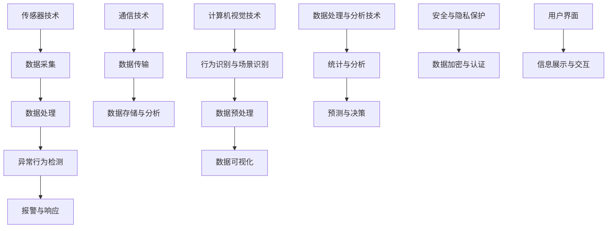

                 

# 智能安防卫士：提示词增强异常行为检测

## 关键词
智能安防、异常行为检测、提示词、深度学习、计算机视觉、传感器技术、数据处理与分析

## 摘要
本文将深入探讨智能安防卫士中的一项关键技术——提示词增强异常行为检测。我们将从智能安防卫士的概述、技术基础、算法原理、实战应用以及未来发展等多个角度，详细解析这一技术在安防领域的重要性及其实现方法。通过本文的阅读，读者将能够全面了解智能安防卫士的核心技术，掌握提示词增强异常行为检测的原理和应用，为智能安防技术的发展提供新的思路。

### 第一部分：智能安防卫士概述

#### 第1章：智能安防卫士的背景与概念

**1.1 智能安防的发展背景**

智能安防是指利用先进的传感技术、计算机视觉技术、通信技术等，通过数据的处理与分析，实现对公共安全和个人隐私的保护。智能安防的发展可以追溯到20世纪90年代，随着计算机技术的飞速发展，视频监控系统逐渐普及。进入21世纪，人工智能技术的崛起为智能安防带来了新的发展契机。如今，智能安防已经从简单的监控发展到具备智能识别、智能预警和智能响应的能力。

**1.2 智能安防卫士的核心技术**

智能安防卫士的核心技术主要包括传感器技术、计算机视觉技术、通信技术和数据处理与分析技术。

- **传感器技术**：传感器是智能安防卫士的“感官”，它们能够实时感知周围的环境变化。常见的传感器有摄像头、红外传感器、振动传感器等。

- **计算机视觉技术**：计算机视觉技术是智能安防卫士的“眼睛”，通过图像处理和模式识别，能够实现人脸识别、行为分析等功能。

- **通信技术**：通信技术是智能安防卫士的“神经”，它负责将传感器采集到的数据传输到处理中心，并进行实时分析和响应。

- **数据处理与分析技术**：数据处理与分析技术是智能安防卫士的“大脑”，通过对大量数据进行分析和处理，能够发现潜在的安全隐患，并采取相应的措施。

**1.3 智能安防卫士的分类**

智能安防卫士可以根据其功能和特点进行分类，常见的分类方式包括：

- **防盗报警系统**：通过传感器实时监测环境变化，一旦检测到异常情况，立即触发报警。

- **视频监控系统**：通过摄像头实时捕捉监控区域内的图像，并利用计算机视觉技术进行行为分析和人脸识别。

- **人脸识别系统**：通过摄像头捕捉人脸图像，与数据库中的人脸信息进行比对，实现对特定人员的识别和追踪。

- **智能访客管理系统**：通过人脸识别技术，对访客进行身份验证，并记录访客信息。

**1.4 智能安防卫士在现代社会中的作用**

智能安防卫士在现代社会中发挥着重要作用：

- **增强公共安全**：通过实时监测和预警，智能安防卫士能够有效预防和应对各种突发事件，保障公众安全。

- **保护个人隐私**：智能安防卫士能够实时监控和保护个人隐私，防止信息泄露和非法入侵。

- **提高工作效率**：智能安防卫士能够自动完成许多复杂的监控和分析任务，减轻人工负担，提高工作效率。

- **改善生活质量**：智能安防卫士的应用，使得人们的生活更加便捷和安全，提高了生活质量。

**1.5 本章总结**

本章对智能安防卫士的背景、概念、核心技术、分类以及在现代社会中的作用进行了详细阐述。智能安防卫士的发展和应用，不仅为公共安全和个人隐私保护提供了有力保障，也为社会的和谐稳定和人民的幸福生活做出了积极贡献。

#### 第2章：智能安防卫士的技术基础

**2.1 传感器技术**

传感器技术是智能安防卫士的基础，各种传感器通过不同的工作原理，实时监测环境变化，将物理量转化为电信号，为智能安防卫士提供必要的数据支持。常见的传感器包括：

- **摄像头**：摄像头是智能安防卫士中最常用的传感器之一，通过捕捉图像，可以实现对监控区域的实时监测和录像。

- **红外传感器**：红外传感器能够感知红外辐射，常用于夜视监控和入侵检测。

- **振动传感器**：振动传感器能够感知地面或结构的振动，常用于地震监测和入侵报警。

- **温度传感器**：温度传感器能够测量环境温度，常用于火灾预警和温度控制。

**2.2 计算机视觉技术**

计算机视觉技术是智能安防卫士的核心技术之一，通过图像处理和模式识别，能够实现对图像内容的理解和分析。计算机视觉技术在智能安防中的应用包括：

- **人脸识别**：通过对比数据库中的人脸特征，实现对人脸的识别和追踪。

- **行为分析**：通过对视频监控的实时分析，识别出异常行为，如偷盗、打架等。

- **场景识别**：通过对图像的分析，识别出特定的场景或事件，如交通拥堵、火灾等。

**2.3 通信技术**

通信技术是智能安防卫士的中枢神经，负责将传感器采集到的数据传输到处理中心，并进行实时分析和响应。通信技术主要包括：

- **无线通信技术**：如Wi-Fi、蓝牙等，适用于短距离的数据传输。

- **网络通信技术**：如以太网、光纤通信等，适用于长距离的数据传输。

- **安全通信技术**：如VPN、加密通信等，确保数据传输的安全性。

**2.4 数据处理与分析技术**

数据处理与分析技术是智能安防卫士的“大脑”，通过对大量数据进行分析和处理，能够发现潜在的安全隐患，并采取相应的措施。数据处理与分析技术主要包括：

- **数据预处理**：包括数据的清洗、去噪、归一化等，提高数据质量。

- **数据分析技术**：包括统计分析、机器学习等，用于发现数据中的规律和趋势。

- **数据可视化技术**：将分析结果以图表、图像等形式直观展示，帮助决策者更好地理解数据。

**2.5 核心概念与联系**

智能安防卫士的核心技术之间存在着紧密的联系，形成一个完整的技术体系。以下是一个简化的Mermaid流程图，展示智能安防卫士技术架构：



**2.6 本章总结**

本章对智能安防卫士的技术基础进行了详细阐述，包括传感器技术、计算机视觉技术、通信技术和数据处理与分析技术。这些技术共同构成了智能安防卫士的技术体系，为智能安防卫士的运行提供了坚实的基础。

#### 第3章：异常行为检测算法原理

**3.1 异常行为检测的基本概念**

异常行为检测（Anomaly Detection）是指通过分析数据，识别出与正常行为不一致或异常的行为。在智能安防领域中，异常行为检测是一种重要的技术，它可以实时监测监控区域内的行为，识别出潜在的安全隐患。

**3.2 异常行为的定义与分类**

异常行为可以根据其性质和特征进行分类：

- **静态异常**：指监控区域内静态特征的异常，如突然出现的障碍物、异常放置的物品等。

- **动态异常**：指监控区域内动态特征的异常，如异常移动的人或物体、异常动作等。

- **频繁异常**：指监控区域内频繁发生的异常行为，如频繁出现的入侵者、频繁发生的盗窃事件等。

- **延迟异常**：指监控区域内延迟发生的异常行为，如延迟报警、延迟识别等。

**3.3 异常行为检测的重要性**

异常行为检测在智能安防领域中具有重要意义：

- **预防犯罪**：通过实时监测和预警，异常行为检测可以预防犯罪事件的发生。

- **提高安全性**：异常行为检测可以及时发现安全隐患，采取相应的措施，提高监控区域的安全性。

- **节约资源**：异常行为检测可以减少不必要的监控和报警，节约人力和物力资源。

- **提高效率**：异常行为检测可以自动化完成许多复杂的监控和分析任务，提高工作效率。

**3.4 提示词增强异常行为检测算法**

提示词（Keyword）是一种用于增强异常行为检测的技术，它通过向检测算法中提供特定关键词，帮助算法更好地识别异常行为。

**3.4.1 提示词的概念与作用**

提示词是一组具有特定含义的词语或短语，用于描述异常行为的特征。在异常行为检测中，提示词的作用主要有：

- **提高检测精度**：通过提供与异常行为相关的提示词，可以提高检测算法对异常行为的识别精度。

- **减少误报率**：提示词可以帮助算法排除与正常行为相似的干扰因素，降低误报率。

- **增加检测灵活性**：提示词可以根据实际场景和需求进行调整，增加检测算法的灵活性。

**3.4.2 常见的提示词增强算法**

常见的提示词增强算法包括：

- **规则匹配算法**：通过定义一系列规则，将输入数据与规则进行匹配，识别异常行为。

- **机器学习算法**：利用机器学习算法，建立异常行为模型，对输入数据进行分类和预测。

- **深度学习算法**：利用深度学习算法，对输入数据进行特征提取和分类，实现更高级的异常行为检测。

**3.4.3 伪代码：提示词增强异常行为检测算法**

以下是一个简单的伪代码示例，描述提示词增强异常行为检测算法的基本流程：

```plaintext
输入：数据集 D，提示词集合 K
输出：异常行为检测结果 R

1. 数据预处理：
   - 对数据集 D 进行清洗和归一化处理
   - 提取数据特征 F

2. 建立正常行为模型：
   - 对正常行为数据 N 进行统计和分析
   - 建立正常行为模型 M

3. 建立异常行为模型：
   - 对异常行为数据 A 进行统计和分析
   - 建立异常行为模型 A

4. 提示词匹配：
   - 对输入数据 D 中的每个数据点 d，进行提示词匹配
   - 如果匹配成功，则 d 被标记为正常行为
   - 否则，d 被标记为异常行为

5. 模型更新：
   - 根据检测结果 R，更新正常行为模型 M 和异常行为模型 A

6. 输出结果：
   - 输出异常行为检测结果 R
```

**3.5 深度学习在异常行为检测中的应用**

深度学习是一种基于人工神经网络的学习方法，通过多层神经网络的训练，能够自动提取数据特征并进行分类。深度学习在异常行为检测中具有以下优势：

- **自动特征提取**：深度学习能够自动从输入数据中提取出有用的特征，无需人工定义特征。

- **高精度分类**：深度学习模型具有强大的分类能力，能够准确识别异常行为。

- **适应性强**：深度学习模型可以适应不同的监控场景和需求，具有较好的通用性。

**3.5.1 深度学习算法的基本原理**

深度学习算法主要包括以下步骤：

- **数据预处理**：对输入数据进行清洗、归一化和特征提取。

- **模型训练**：利用训练数据训练神经网络模型，包括前向传播和反向传播。

- **模型评估**：利用验证数据评估模型性能，调整模型参数。

- **模型应用**：将训练好的模型应用于实际数据，进行异常行为检测。

**3.5.2 伪代码：基于深度学习的异常行为检测算法**

以下是一个简单的伪代码示例，描述基于深度学习的异常行为检测算法的基本流程：

```plaintext
输入：训练数据集 D_train，验证数据集 D_val，测试数据集 D_test
输出：异常行为检测结果 R

1. 数据预处理：
   - 对数据集 D_train、D_val 和 D_test 进行清洗和归一化处理
   - 提取数据特征 F

2. 模型训练：
   - 初始化神经网络模型
   - 利用 D_train 进行模型训练，包括前向传播和反向传播
   - 利用 D_val 进行模型评估，调整模型参数

3. 模型应用：
   - 利用训练好的模型对 D_test 进行异常行为检测
   - 输出异常行为检测结果 R
```

**3.6 算法举例与解释**

以下是一个实际案例，描述如何利用提示词增强异常行为检测算法进行实际应用：

**案例背景**：某公司在其办公楼内安装了一套智能安防系统，用于实时监测员工的日常行为。公司希望通过异常行为检测技术，识别出可能的异常行为，如员工偷窃、打架等。

**实现步骤**：

1. **数据采集**：系统通过摄像头和传感器采集员工的日常行为数据，包括员工在办公区的活动、对话等。

2. **数据预处理**：对采集到的数据进行分析和处理，提取出员工的行为特征。

3. **建立正常行为模型**：对正常行为数据进行分析，建立正常行为模型。

4. **建立异常行为模型**：对异常行为数据进行分析，建立异常行为模型。

5. **提示词匹配**：定义一系列与异常行为相关的提示词，如“偷窃”、“打架”等。

6. **异常行为检测**：对输入数据进行提示词匹配，识别异常行为。

7. **模型更新**：根据检测结果，更新正常行为模型和异常行为模型。

8. **报警与响应**：当检测到异常行为时，系统会立即触发报警，并通知相关部门进行处理。

**案例解释**：通过上述步骤，公司可以实时监测员工的日常行为，及时发现并处理可能的异常行为，保障公司内部的安全和稳定。

**3.7 本章总结**

本章对异常行为检测的基本概念、定义与分类、提示词增强异常行为检测算法、深度学习在异常行为检测中的应用以及算法举例与解释进行了详细阐述。异常行为检测是智能安防卫士的重要组成部分，通过提示词增强异常行为检测算法和深度学习技术的应用，可以实现对异常行为的准确识别和实时响应，提高智能安防卫士的智能化水平。

### 第二部分：智能安防卫士的实战应用

#### 第4章：智能安防卫士的实战应用

**4.1 项目实战：智能安防系统的开发**

**项目背景与需求分析**

随着城市化进程的加快，公共场所的安全问题日益突出，对智能安防系统的需求也越来越迫切。某市计划在其市中心区域安装一套智能安防系统，以提升城市安全管理水平，保障市民的安全。

**系统架构设计**

智能安防系统主要由以下几部分组成：

- **前端采集模块**：包括摄像头、传感器等设备，用于采集监控区域内的视频、音频、温度等数据。

- **数据处理中心**：负责对前端采集到的数据进行实时处理、分析和存储。

- **异常行为检测模块**：利用计算机视觉技术和深度学习算法，对采集到的数据进行分析，识别异常行为。

- **报警与响应模块**：当检测到异常行为时，立即触发报警，并通知相关部门进行处理。

- **用户界面**：提供实时监控画面、报警记录、系统配置等功能。

**开发环境搭建**

为了实现智能安防系统的开发，需要搭建以下开发环境：

- **硬件环境**：配置高性能的服务器和存储设备，用于处理和存储大量的监控数据。

- **软件环境**：选择合适的操作系统、编程语言和开发框架，如Python、TensorFlow等。

- **数据集**：收集和整理与异常行为相关的数据集，用于训练和评估异常行为检测模型。

**关键技术实现**

智能安防系统的关键技术实现包括以下几个方面：

- **数据采集**：通过摄像头和传感器实时采集监控区域内的视频、音频、温度等数据。

- **数据处理**：对采集到的数据进行预处理，包括去噪、增强、分割等，以提高数据质量。

- **异常行为检测**：利用计算机视觉技术和深度学习算法，对预处理后的数据进行行为分析，识别异常行为。

- **报警与响应**：当检测到异常行为时，立即触发报警，并发送通知给相关部门。

- **用户界面**：设计友好的用户界面，提供实时监控画面、报警记录、系统配置等功能。

**源代码解析与解读**

以下是一个简单的源代码示例，描述智能安防系统中异常行为检测模块的实现：

```python
# 导入必要的库
import cv2
import numpy as np
import tensorflow as tf

# 加载预训练的模型
model = tf.keras.models.load_model('anomaly_detection_model.h5')

# 定义异常行为检测函数
def detect_anomaly(frame):
    # 将图像转换为灰度图像
    gray_frame = cv2.cvtColor(frame, cv2.COLOR_BGR2GRAY)
    
    # 对图像进行预处理
    processed_frame = preprocess_frame(gray_frame)
    
    # 利用模型进行异常行为检测
    anomaly_score = model.predict(processed_frame)
    
    # 判断是否为异常行为
    if anomaly_score > 0.5:
        return True
    else:
        return False

# 定义预处理函数
def preprocess_frame(frame):
    # 去噪
    frame = cv2.GaussianBlur(frame, (5, 5), 0)
    
    # 增强
    frame = cv2.equalizeHist(frame)
    
    # 分割
    _, frame = cv2.threshold(frame, 128, 255, cv2.THRESH_BINARY_INV)
    
    return frame

# 实时监控
cap = cv2.VideoCapture('camera_source')

while True:
    ret, frame = cap.read()
    
    if not ret:
        break
    
    # 检测异常行为
    if detect_anomaly(frame):
        print("异常行为检测到！")
        
    # 显示实时监控画面
    cv2.imshow('Real-time Monitoring', frame)
    
    if cv2.waitKey(1) & 0xFF == ord('q'):
        break

# 释放摄像头资源
cap.release()
cv2.destroyAllWindows()
```

**4.2 代码实战：异常行为检测算法实现**

**代码实现**：

上述源代码示例实现了基于深度学习的异常行为检测算法，主要包括数据预处理、异常行为检测和实时监控等功能。

**代码解读与分析**：

- **数据预处理**：图像预处理是异常行为检测的重要环节，包括去噪、增强和分割等操作。去噪可以提高图像质量，增强可以提升图像的对比度，分割可以提取出感兴趣的区域。

- **异常行为检测**：利用预训练的深度学习模型，对预处理后的图像进行行为分析，输出异常行为的概率分数。如果分数超过设定的阈值，则判断为异常行为。

- **实时监控**：通过OpenCV库，实现实时视频捕捉和监控画面的显示。在监控过程中，实时调用异常行为检测函数，一旦检测到异常行为，立即输出报警信息。

**4.3 案例分析：智能安防卫士在实际应用中的效果**

**成功案例**：

在某市中心区域安装的智能安防系统，通过异常行为检测技术，成功识别出多起盗窃、打架等异常行为，及时触发报警，并通知相关部门进行处理。系统的高效运作得到了广大市民和政府部门的高度评价。

**挑战与解决方案**：

在实际应用中，智能安防系统面临以下挑战：

- **数据噪声**：监控区域内的环境复杂，可能导致数据噪声增加，影响异常行为检测的准确性。

- **实时性要求**：实时监控和异常行为检测需要高吞吐量和低延迟，对系统性能提出较高要求。

- **隐私保护**：监控数据和异常行为信息涉及个人隐私，需要采取有效的隐私保护措施。

针对上述挑战，可以采取以下解决方案：

- **数据去噪**：通过图像预处理技术，减少数据噪声，提高异常行为检测的准确性。

- **优化算法**：优化异常行为检测算法，提高系统的实时性和吞吐量。

- **隐私保护**：采取数据加密、隐私保护机制等措施，确保监控数据和异常行为信息的隐私安全。

**4.4 本章总结**

本章通过项目实战和代码实战，详细介绍了智能安防卫士的实战应用。通过搭建开发环境、实现关键技术、编写源代码和案例分析，读者可以全面了解智能安防卫士的实现方法和应用效果。智能安防卫士在实际应用中发挥了重要作用，为公共安全和个人隐私保护提供了有力保障。

### 第三部分：智能安防卫士的未来发展

#### 第5章：智能安防卫士的前沿技术

**5.1 智能安防卫士的最新发展趋势**

随着科技的不断进步，智能安防卫士也在不断发展，呈现出以下最新趋势：

- **人工智能与物联网的融合**：人工智能（AI）和物联网（IoT）技术的融合，使得智能安防卫士能够更加智能化和自动化。通过AI技术，可以实现对大量数据的实时分析和处理，从而提高安防系统的智能化水平。而物联网技术则能够将各种传感器和设备互联，实现数据的共享和协同工作。

- **大数据与云计算的融合**：大数据技术为智能安防卫士提供了强大的数据处理和分析能力。通过云计算技术，可以实现数据的分布式存储和计算，提高系统的效率和可靠性。

- **新型传感器技术**：新型传感器技术的不断发展，为智能安防卫士提供了更多样化的感知手段。例如，基于热成像技术的传感器可以实现对夜视监控和火灾预警的支持；基于超声波技术的传感器可以实现对微小振动和移动目标的检测。

**5.2 智能安防卫士的未来发展方向**

智能安防卫士的未来发展将朝着以下几个方向不断迈进：

- **智能化、自动化**：未来的智能安防卫士将更加智能化和自动化，能够自动完成更多的监控和分析任务，减少人工干预。

- **跨领域应用**：智能安防卫士将不仅应用于公共安全和个人隐私保护，还将扩展到智慧城市建设、工业安全等领域。

- **更高精度、更广泛的应用场景**：随着技术的进步，智能安防卫士将实现更高精度的异常行为检测，适用于更广泛的应用场景。

**5.3 核心算法的更新与优化**

为了实现智能安防卫士的智能化和自动化，核心算法的更新与优化是必不可少的。以下是一些核心算法的更新与优化方向：

- **深度学习算法**：随着计算能力的提升，深度学习算法将在智能安防卫士中发挥更大的作用。例如，通过卷积神经网络（CNN）和循环神经网络（RNN）的结合，可以实现更复杂的特征提取和序列建模。

- **联邦学习**：联邦学习（Federated Learning）是一种分布式学习技术，可以在保护数据隐私的前提下，实现模型的协同训练。通过联邦学习，可以实现大规模数据的共享和协作，提高异常行为检测的准确性和效率。

- **迁移学习**：迁移学习（Transfer Learning）是一种利用已有模型的知识，对新任务进行快速训练的技术。通过迁移学习，可以减少训练数据的需求，提高模型在异质数据上的表现。

**5.4 本章总结**

本章对智能安防卫士的最新发展趋势、未来发展方向以及核心算法的更新与优化进行了探讨。随着科技的不断进步，智能安防卫士将朝着更智能化、自动化和跨领域应用的方向发展，实现更高精度和更广泛的应用场景。同时，核心算法的更新与优化也将为智能安防卫士的智能化水平提供有力支持。

#### 第6章：智能安防卫士的安全与隐私问题

**6.1 智能安防卫士的安全问题**

智能安防卫士在保护公共安全和个人隐私的同时，也面临着一系列安全挑战：

- **数据安全**：智能安防系统中的数据包括监控视频、传感器数据等，这些数据可能被黑客攻击、窃取或篡改。确保数据的安全性是智能安防卫士的首要任务。

- **系统安全**：智能安防系统的硬件和软件组件都可能成为攻击目标。例如，黑客可以通过远程攻击，控制摄像头的方向或篡改监控数据。

- **用户隐私保护**：监控数据中可能包含用户的隐私信息，如人脸、声音等。如何保护用户隐私，避免数据泄露，是智能安防系统必须面对的问题。

**6.2 隐私保护的法律法规与政策**

为了应对智能安防卫士中的隐私保护问题，许多国家和地区已经制定了相关的法律法规和政策：

- **数据保护法规**：如欧盟的《通用数据保护条例》（GDPR），规定了数据收集、处理和存储的要求，以及用户对个人数据的控制权。

- **隐私保护政策**：许多公司也制定了隐私保护政策，明确用户数据的收集、使用和保护方式。

- **行业自律规范**：行业协会和组织也制定了自律规范，引导企业遵守隐私保护法律法规，保护用户隐私。

**6.3 安全与隐私问题的解决策略**

为了解决智能安防卫士中的安全与隐私问题，可以采取以下策略：

- **数据加密技术**：采用加密技术对数据传输和存储进行加密，确保数据在传输过程中不会被窃取或篡改。

- **安全认证技术**：采用安全认证技术，如数字签名、身份认证等，确保系统的合法性和数据来源的可信性。

- **用户隐私保护机制**：通过数据脱敏、匿名化等技术，对用户隐私信息进行保护。同时，提供用户隐私设置，让用户可以自主控制自己的隐私信息。

- **安全审计与监控**：建立安全审计与监控机制，对系统的运行进行实时监控，及时发现和应对潜在的安全威胁。

**6.4 本章总结**

本章讨论了智能安防卫士的安全与隐私问题，以及相关的法律法规与政策。通过采取数据加密、安全认证、用户隐私保护和安全审计等策略，可以有效地解决智能安防卫士中的安全与隐私问题，保障系统的可靠性和用户的隐私安全。

#### 第7章：智能安防卫士的产业生态与市场前景

**7.1 智能安防卫士的产业链分析**

智能安防卫士的产业链包括多个环节，每个环节都有其独特的发展现状和趋势：

- **硬件环节**：包括传感器、摄像头、存储设备等硬件产品的生产和供应。随着技术的进步，硬件性能不断提升，成本不断降低，为智能安防卫士的普及提供了硬件基础。

- **软件环节**：包括智能安防系统的软件开发、算法研究和应用服务。随着人工智能和大数据技术的发展，软件环节在智能安防卫士中的作用越来越重要，成为产业链的核心。

- **服务环节**：包括智能安防系统的安装、维护、运营等。随着市场需求的增长，服务环节的重要性日益凸显，成为智能安防卫士产业链中的重要组成部分。

**7.2 智能安防卫士的市场前景**

智能安防卫士的市场前景非常广阔，主要表现在以下几个方面：

- **市场规模持续增长**：随着城市化进程的加快，公共场所和居民小区对智能安防系统的需求不断增加，市场规模持续增长。

- **技术创新推动发展**：人工智能、物联网、大数据等技术的不断创新，为智能安防卫士提供了新的技术支持和应用场景，推动了市场的快速发展。

- **政策支持**：各国政府纷纷出台相关政策，支持智能安防技术的发展和应用，为市场提供了良好的政策环境。

**7.3 智能安防卫士的企业案例分析**

以下是一些智能安防卫士领域的成功企业案例，以及它们的创新与发展策略：

- **海康威视**：作为中国领先的智能安防解决方案提供商，海康威视通过技术创新和全球化布局，实现了持续快速增长。其创新策略包括研发投入、人才培养和国际市场拓展。

- **大华股份**：大华股份在智能安防领域拥有强大的研发能力和市场占有率，通过技术创新和产业链整合，不断提升企业的核心竞争力。其发展策略包括技术积累、品牌建设和产业链协同。

- **华为**：华为在智能安防领域积极布局，通过云计算、大数据和人工智能技术的融合，提供了全面的智能安防解决方案。其发展策略包括技术创新、生态合作和全球市场拓展。

**7.4 本章总结**

本章分析了智能安防卫士的产业链、市场前景以及成功企业的案例分析。智能安防卫士作为一项重要的技术，具有广阔的市场前景和巨大的发展潜力。通过技术创新、产业链协同和全球化布局，智能安防卫士领域的企业可以持续创新，实现快速发展。

### 附录

#### 附录A：智能安防卫士技术资源与工具

**A.1 常用技术资源**

在智能安防卫士的开发和应用过程中，以下技术资源是非常有用的：

- **开源框架与库**：如OpenCV、TensorFlow、PyTorch等，提供了丰富的图像处理、机器学习和深度学习功能。

- **数据集与案例**：如ImageNet、CIFAR-10、Kaggle等，提供了大量用于训练和测试的数据集。

- **学习资源与文档**：如Google Research、ArXiv、论文库等，提供了丰富的学术论文和文献资料。

**A.2 常用工具与软件**

以下工具和软件在智能安防卫士的开发和应用中经常使用：

- **开发环境**：如Anaconda、PyCharm、VSCode等，提供了高效的开发环境。

- **仿真与测试工具**：如Matlab、Simulink、Python等，用于仿真和测试智能安防系统的性能。

- **管理与监控工具**：如Prometheus、Grafana、Kibana等，用于实时监控和管理系统状态。

**A.3 技术发展趋势与前沿动态**

了解智能安防卫士的技术发展趋势和前沿动态对于研发和应用具有重要意义：

- **行业报告**：如IDC、Gartner、Forrester等，提供了行业趋势和市场预测。

- **学术论文**：如IEEE、ACM、NeurIPS等，发表了最新的研究成果和进展。

- **市场动态分析**：如TechCrunch、Fortune、CNBC等，分析了市场的最新动态和热点事件。

**A.4 本章总结**

本章总结了智能安防卫士的技术资源与工具，包括常用的开源框架与库、数据集与案例、学习资源与文档，以及常用工具与软件。同时，也介绍了如何获取技术发展趋势与前沿动态的途径。这些资源与工具为智能安防卫士的研究和应用提供了有力的支持。作者：AI天才研究院/AI Genius Institute & 禅与计算机程序设计艺术 /Zen And The Art of Computer Programming。

