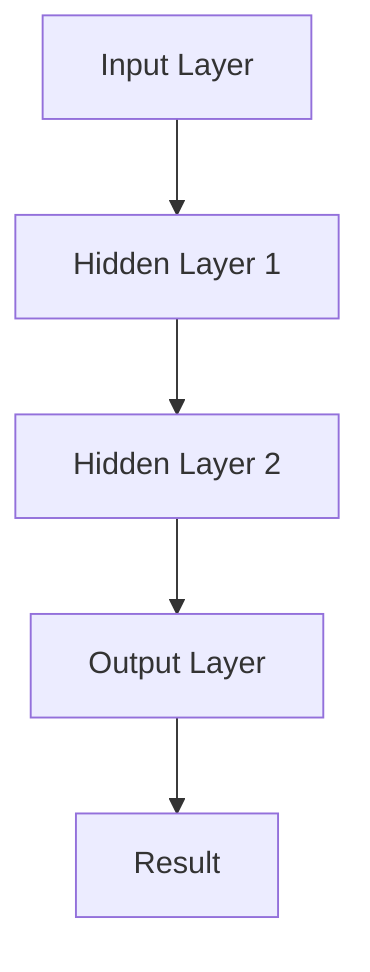
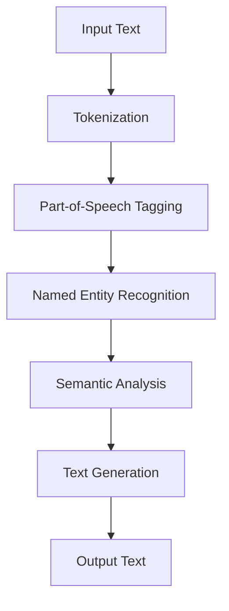
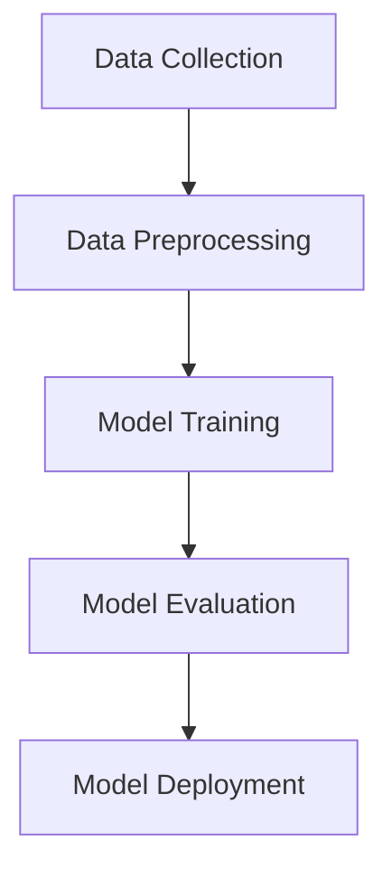

                 

## 引言

### 1.1 书籍背景与目标

《智能宠物娱乐创业：科技驱动的宠物游戏》是一部针对智能宠物娱乐创业领域的深入探讨和技术指导书籍。随着科技的快速发展，人工智能、物联网、虚拟现实等新兴技术不断涌现，为宠物娱乐产业带来了前所未有的变革。本书旨在通过详细的技术分析和实际案例，为广大创业者、技术专家和行业从业者提供一套完整的智能宠物娱乐创业指南。

#### 1.1.1 宠物娱乐产业的现状与趋势

全球宠物市场在过去几十年中经历了显著的增长，宠物成为越来越多家庭的重要成员。宠物娱乐作为宠物产业链中的重要环节，也逐渐受到了广泛关注。根据市场调研数据，全球宠物娱乐市场规模持续扩大，预计未来几年仍将保持高速增长。这一趋势主要体现在以下几个方面：

1. **智能化宠物产品需求增加**：随着消费者对宠物生活质量的关注提升，智能宠物用品的需求不断增加。例如，智能喂食器、智能监控设备、智能互动玩具等，这些产品不仅提高了宠物的日常生活质量，也为宠物主人提供了便捷的管理手段。

2. **移动互联网普及推动在线宠物娱乐**：移动互联网的普及为宠物娱乐带来了新的发展机遇。越来越多的宠物主开始通过手机应用、在线游戏、社交媒体等方式与宠物互动，推动了在线宠物娱乐市场的繁荣。

3. **技术创新带动行业变革**：人工智能、虚拟现实、增强现实等技术的快速发展，为宠物娱乐产业提供了新的技术手段和应用场景。例如，通过人工智能技术实现宠物行为分析、通过虚拟现实技术打造沉浸式的宠物游戏体验等。

#### 1.1.2 智能宠物娱乐创业的意义与前景

智能宠物娱乐创业不仅具有巨大的市场潜力，同时也具有重要的社会意义。一方面，它能够满足消费者对智能、便捷、个性化的宠物娱乐需求，提高宠物的生活质量；另一方面，它也为创业者提供了广阔的发展空间和商业机会。

1. **市场需求驱动**：随着人们生活水平的提高，宠物主对宠物娱乐的需求逐渐多样化、个性化。智能宠物娱乐产品可以更好地满足这些需求，从而赢得市场份额。

2. **技术创新推动**：智能宠物娱乐领域的技术创新不断涌现，为创业提供了丰富的技术资源和应用场景。例如，人工智能技术可以用于宠物行为分析、情感识别等，虚拟现实技术可以打造沉浸式的宠物游戏体验等。

3. **商业前景广阔**：智能宠物娱乐产业的市场规模不断扩大，预计未来几年将保持高速增长。随着技术的进步和市场的成熟，智能宠物娱乐创业具有巨大的商业潜力。

#### 1.1.3 书籍目标与读者对象

本书的主要目标是为智能宠物娱乐创业者提供系统的技术指导、实战经验和市场分析。具体目标如下：

1. **技术指导**：介绍智能宠物娱乐领域的关键技术，如人工智能、物联网、虚拟现实等，帮助读者了解并掌握这些技术的基本原理和应用。

2. **实战经验**：通过案例分析，展示成功创业项目的实施过程、技术选型、市场策略等，为读者提供实际操作的经验和教训。

3. **市场分析**：分析宠物娱乐市场的现状和趋势，探讨市场机遇和挑战，为创业者提供市场研究和战略规划的支持。

本书的读者对象包括：

1. **智能宠物娱乐创业者**：希望了解智能宠物娱乐领域的技术趋势、市场需求和创业策略的创业者。

2. **技术专家和工程师**：对智能宠物娱乐领域感兴趣的技术人员，希望了解相关技术的应用和实现。

3. **行业从业者**：从事宠物娱乐产业的相关人员，希望提升专业知识和市场洞察力的从业者。

### 1.2 书籍结构安排

#### 1.2.1 各章节主要内容概述

本书共分为四个部分，包含八个章节，各章节主要内容如下：

**第一部分：智能宠物娱乐概述**

- **第1章 引言**：介绍宠物娱乐产业的现状与趋势，智能宠物娱乐创业的意义与前景。

- **第2章 智能宠物的定义与分类**：探讨智能宠物的定义、分类及其发展历程。

- **第3章 宠物娱乐市场的现状与机遇**：分析全球宠物娱乐市场的现状、机遇和挑战。

**第二部分：智能宠物娱乐核心技术**

- **第4章 传感器与交互技术**：介绍传感器和交互技术在智能宠物中的应用。

- **第5章 人工智能在宠物娱乐中的应用**：探讨人工智能、深度学习、自然语言处理等技术在宠物娱乐中的应用。

**第三部分：智能宠物娱乐创业实践**

- **第6章 创业准备**：讲解创业团队的组建、市场调研、产品设计和开发。

- **第7章 创业案例**：分析成功创业案例，总结创业经验与教训。

**第四部分：智能宠物娱乐的未来发展**

- **第8章 未来发展趋势**：探讨新技术、市场前景和未来发展方向。

- **第9章 法律法规与社会责任**：分析智能宠物娱乐领域的法律法规和社会责任。

#### 1.2.2 知识体系与方法论介绍

本书的知识体系和方法论如下：

1. **知识体系**：本书分为四个部分，涵盖了智能宠物娱乐的基础理论、核心技术、创业实践和未来发展趋势，形成了完整的知识体系。

2. **方法论**：本书采用了“理论 + 实践”的方法论，通过深入的技术分析和实际案例，帮助读者理解智能宠物娱乐的核心技术和创业实践。

#### 1.2.3 学习与实战建议

为了更好地学习本书的内容，读者可以采取以下建议：

1. **深入学习技术原理**：在阅读过程中，要重点关注每个章节中的核心概念和原理，理解其应用背景和实现方法。

2. **动手实践**：尝试自己实现书中的技术案例和实验，加深对技术的理解和应用。

3. **互动交流**：加入相关技术社群或论坛，与其他读者和从业者交流经验，共同探讨问题。

4. **持续关注行业动态**：关注智能宠物娱乐领域的最新技术、市场动态和创业案例，保持对行业的敏锐洞察力。

### 1.3 科技与宠物娱乐的结合

#### 1.3.1 科技对宠物娱乐的影响

科技的快速发展为宠物娱乐带来了深刻的变革。首先，人工智能技术的应用使得宠物娱乐产品更加智能化、个性化。例如，通过人工智能算法分析宠物的行为，可以提供更符合宠物需求的互动内容。其次，物联网技术的普及使得宠物娱乐产品能够实现互联互通，宠物主人可以通过手机等终端设备远程监控和管理宠物。此外，虚拟现实和增强现实技术的应用，为宠物娱乐带来了更加沉浸式的体验。

#### 1.3.2 智能宠物娱乐的核心技术

智能宠物娱乐的核心技术主要包括人工智能、物联网、虚拟现实和增强现实等。以下是这些技术的基本概念和特点：

1. **人工智能**：人工智能技术通过模拟人类智能，使计算机能够理解、推理、学习和决策。在宠物娱乐领域，人工智能可以用于宠物行为分析、情感识别、智能互动等。

2. **物联网**：物联网技术通过将各种设备互联，实现数据的实时传输和智能控制。在宠物娱乐领域，物联网技术可以实现宠物的智能监控、远程互动等功能。

3. **虚拟现实**：虚拟现实技术通过构建虚拟环境，使用户沉浸其中，提供全新的互动体验。在宠物娱乐领域，虚拟现实技术可以用于宠物游戏、虚拟宠物互动等。

4. **增强现实**：增强现实技术通过将虚拟信息叠加到现实环境中，增强用户的感知体验。在宠物娱乐领域，增强现实技术可以用于宠物互动、宠物训练等。

#### 1.3.3 技术创新在宠物娱乐产业中的应用

技术创新在宠物娱乐产业中发挥了重要作用，推动了行业的发展和变革。以下是一些具体的应用案例：

1. **智能宠物玩具**：通过嵌入传感器和智能芯片，智能宠物玩具能够实时监测宠物的行为，并根据宠物的喜好提供个性化的互动。

2. **宠物智能监控**：利用物联网技术，宠物主人可以通过手机APP实时监控宠物的健康状况和行为，实现远程管理和互动。

3. **虚拟宠物游戏**：通过虚拟现实技术，用户可以进入一个虚拟的宠物世界，与虚拟宠物进行互动，获得沉浸式的娱乐体验。

4. **宠物行为分析**：利用人工智能技术，对宠物的行为进行深度分析，为宠物主人提供专业的宠物行为建议和训练方案。

总之，科技的进步为宠物娱乐产业带来了无限的创新可能，未来智能宠物娱乐的发展前景可期。随着技术的不断突破和应用，宠物娱乐产业将迎来更加智能化、个性化的时代。

---

在接下来的章节中，我们将详细探讨智能宠物的定义与分类、宠物娱乐市场的现状与机遇、智能宠物娱乐的核心技术等内容，为读者提供全方位的技术指导和实战经验。希望通过本书，能够帮助读者深入了解智能宠物娱乐产业，激发创业激情，实现创业梦想。

---

## 智能宠物娱乐概述

智能宠物娱乐是指利用现代科技手段，如人工智能、物联网、虚拟现实等，为宠物和宠物主人提供智能化、互动化、个性化的娱乐体验。随着科技的不断进步，智能宠物娱乐已经逐渐成为宠物产业链中的重要组成部分。本部分将重点介绍智能宠物的定义与分类、宠物娱乐市场的现状与机遇、智能宠物娱乐的核心技术等内容，为读者提供全面的技术指导和市场分析。

### 第2章 智能宠物的定义与分类

智能宠物是宠物娱乐领域的重要概念之一，它不仅包含了传统的宠物，还融入了人工智能、物联网等先进技术，使得宠物能够具备一定的智能互动能力。本章将详细探讨智能宠物的定义、特点、分类及其发展历程，为读者提供智能宠物的基本认知。

#### 2.1 智能宠物的定义

智能宠物是指在传统宠物的基础上，通过应用人工智能、物联网、虚拟现实等技术，使其具备智能互动能力、数据分析能力和自适应能力的宠物。智能宠物通常具备以下特点：

1. **智能互动**：智能宠物能够通过语音、动作等方式与宠物主人进行互动，满足宠物主人的娱乐需求。
2. **数据分析**：智能宠物能够收集宠物的行为数据，通过数据分析为宠物主人提供宠物健康状况、行为习惯等方面的建议。
3. **自适应能力**：智能宠物能够根据宠物的行为和需求，自动调整互动方式和内容，提供个性化的娱乐体验。

#### 2.1.1 智能宠物的基本概念

智能宠物的基本概念可以从以下几个方面进行理解：

1. **宠物**：宠物是指人类为了娱乐、陪伴或者其他目的而驯养的动物。传统的宠物包括猫、狗、鸟、鱼等。
2. **智能**：智能是指物体具备的识别、理解、学习、推理和决策能力。在智能宠物中，智能主要体现在与宠物主人的互动、对宠物行为的理解和适应等方面。
3. **技术**：智能宠物所应用的技术包括人工智能、物联网、虚拟现实等。这些技术使得宠物能够具备智能互动、数据分析和自适应能力。

#### 2.1.2 智能宠物的特点与优势

智能宠物相比传统宠物具有以下特点与优势：

1. **智能化互动**：智能宠物能够通过语音、动作等方式与宠物主人进行互动，满足宠物主人的娱乐需求，提供更加丰富的互动体验。
2. **数据分析**：智能宠物能够收集宠物的行为数据，通过数据分析为宠物主人提供宠物健康状况、行为习惯等方面的建议，帮助宠物主人更好地照顾宠物。
3. **自适应能力**：智能宠物能够根据宠物的行为和需求，自动调整互动方式和内容，提供个性化的娱乐体验，提高宠物的生活质量。

#### 2.1.3 智能宠物的发展历程

智能宠物的发展历程可以追溯到20世纪末，随着人工智能、物联网等技术的逐步成熟，智能宠物开始逐渐进入大众视野。以下是智能宠物的发展历程：

1. **初期探索**（1990年代）：在这个阶段，人们开始尝试将计算机技术应用到宠物身上，例如开发智能宠物喂食器、智能宠物监测器等。
2. **技术突破**（2000年代）：随着人工智能和物联网技术的突破，智能宠物开始具备一定的智能互动能力和数据分析能力，例如通过摄像头和传感器实时监测宠物的行为。
3. **广泛应用**（2010年代至今）：在这个阶段，智能宠物技术得到了广泛应用，各种智能宠物产品不断涌现，例如智能宠物玩具、智能宠物喂食器、智能宠物摄像头等。

#### 2.2 智能宠物的分类

智能宠物可以根据不同的标准进行分类，以下是几种常见的分类方式：

1. **按智能水平分类**：
    - **低级智能宠物**：这类宠物主要具备基础智能互动能力，例如能够识别主人的语音和动作，但无法进行复杂的数据分析和自适应调整。
    - **高级智能宠物**：这类宠物具备更高级的智能互动能力和数据分析能力，例如能够根据宠物的行为和需求，自动调整互动方式和内容，提供个性化的娱乐体验。

2. **按宠物类型分类**：
    - **猫智能宠物**：这类宠物主要包括智能猫玩具、智能猫喂食器、智能猫摄像头等。
    - **狗智能宠物**：这类宠物主要包括智能狗玩具、智能狗喂食器、智能狗训练器等。
    - **鸟智能宠物**：这类宠物主要包括智能鸟玩具、智能鸟喂食器、智能鸟摄像头等。
    - **其他宠物**：除了上述常见宠物，还有一些特殊宠物，如智能鱼缸、智能宠物鼠等。

3. **按应用场景分类**：
    - **家庭智能宠物**：这类宠物主要用于家庭娱乐和宠物照顾，例如智能宠物玩具、智能宠物摄像头等。
    - **宠物店智能宠物**：这类宠物主要用于宠物店展示和互动，例如智能宠物展示柜、智能宠物互动装置等。
    - **宠物医院智能宠物**：这类宠物主要用于宠物医院诊断和治疗，例如智能宠物监测仪、智能宠物诊断系统等。

#### 2.3 智能宠物的发展趋势

随着科技的不断发展，智能宠物将继续在以下几个方面发展：

1. **技术进步**：人工智能、物联网、虚拟现实等技术的不断进步，将进一步提升智能宠物的智能互动能力和数据分析能力。
2. **产品多样化**：随着消费者需求的多样化，智能宠物产品将不断丰富，例如智能宠物玩具、智能宠物摄像头、智能宠物喂食器等。
3. **市场扩大**：随着全球宠物市场的不断扩大，智能宠物市场也将迎来更大的发展机遇，预计未来几年将保持高速增长。

### 2.4 智能宠物的应用场景

智能宠物在多个场景中展现出巨大的应用价值，以下是几种常见的应用场景：

1. **宠物家庭**：智能宠物能够为宠物家庭提供便捷的宠物照顾和娱乐体验，例如通过智能宠物摄像头实时监控宠物，通过智能宠物玩具与宠物互动等。
2. **宠物店**：智能宠物产品可以为宠物店带来更多的商业机会，例如通过智能宠物展示柜吸引顾客，通过智能宠物互动装置提供有趣的宠物体验等。
3. **宠物医院**：智能宠物监测仪和智能宠物诊断系统可以为宠物医院提供更加精准和高效的宠物诊断和治疗，提高宠物医疗水平。

综上所述，智能宠物娱乐领域具有广阔的发展前景，随着技术的不断进步和市场的逐渐成熟，智能宠物将在宠物娱乐产业中发挥越来越重要的作用。

---

在下一章中，我们将详细探讨宠物娱乐市场的现状与机遇，分析全球宠物娱乐市场的规模与增长、主要市场区域分布、宠物娱乐市场的主要参与者，以及智能宠物娱乐的兴起、消费者需求变化和新兴市场的崛起。通过这些分析，为读者提供全面的市场洞察和投资建议。

---

## 宠物娱乐市场的现状与机遇

随着全球宠物产业的发展，宠物娱乐市场也在不断壮大。宠物娱乐作为宠物产业链中的重要组成部分，涵盖了宠物玩具、宠物游戏、宠物互动装置等多个领域。本章节将分析全球宠物娱乐市场的现状与机遇，探讨市场机遇、挑战以及未来的发展趋势。

### 3.1 宠物娱乐市场的现状

#### 3.1.1 全球宠物娱乐市场的规模与增长

根据市场调研数据显示，全球宠物娱乐市场在过去几年中持续增长，预计未来几年仍将保持高速增长。以下是一些关键数据：

1. **市场规模**：根据市场研究机构的数据，全球宠物娱乐市场的规模已经达到了数十亿美元，并且预计在未来几年内将继续扩大。
2. **增长速度**：全球宠物娱乐市场的年复合增长率（CAGR）预计在10%左右，显示出市场的高速发展态势。

#### 3.1.2 主要市场区域分布

全球宠物娱乐市场的分布情况如下：

1. **北美市场**：北美是全球最大的宠物娱乐市场之一，占据了全球市场份额的40%以上。美国作为全球宠物产业的领军国家，其宠物娱乐市场规模庞大，消费者对宠物产品的需求多样化。
2. **欧洲市场**：欧洲市场也是全球宠物娱乐市场的重要组成部分，占据了全球市场份额的30%左右。欧洲消费者对宠物产品的质量和安全性要求较高，智能宠物娱乐产品在欧洲市场的需求逐渐增加。
3. **亚洲市场**：亚洲市场，尤其是中国和日本，是全球宠物娱乐市场的重要增长点。随着亚洲地区宠物产业的不断发展，宠物娱乐市场的规模也在不断扩大。

#### 3.1.3 宠物娱乐市场的主要参与者

全球宠物娱乐市场的主要参与者包括：

1. **传统宠物玩具品牌**：如皇家宠物（Royal Canin）、希尔斯（Hills）、玛氏（Mars）等，这些品牌在全球宠物娱乐市场中占据了重要地位。
2. **智能宠物娱乐企业**：如Petcube、Orble、Petcasso等，这些企业专注于智能宠物娱乐产品的研发和推广，通过技术创新和个性化体验赢得了市场份额。
3. **互联网企业**：如谷歌（Google）、亚马逊（Amazon）、微软（Microsoft）等，这些企业通过云计算、人工智能等技术，为宠物娱乐市场提供了新的解决方案和商业模式。

### 3.2 宠物娱乐市场的机遇

#### 3.2.1 智能宠物娱乐的兴起

智能宠物娱乐的兴起为宠物娱乐市场带来了新的机遇。以下是一些智能宠物娱乐市场的机遇：

1. **技术创新**：随着人工智能、物联网、虚拟现实等技术的不断进步，智能宠物娱乐产品的功能将更加丰富，用户体验将得到显著提升。
2. **消费者需求**：随着宠物地位的提升，宠物主对宠物娱乐的需求越来越多样化，智能宠物娱乐产品能够更好地满足消费者的个性化需求。
3. **市场扩展**：智能宠物娱乐市场具有广阔的扩展空间，尤其是在新兴市场，如中国、印度等地，随着宠物产业的快速发展，智能宠物娱乐市场潜力巨大。

#### 3.2.2 消费者需求变化

消费者需求的变化是推动宠物娱乐市场发展的重要因素。以下是一些消费者需求变化：

1. **个性化需求**：消费者对宠物产品的需求越来越个性化，智能宠物娱乐产品能够提供更加定制化的互动体验，满足消费者的个性化需求。
2. **健康意识提升**：随着消费者对宠物健康意识的提升，宠物娱乐产品也在向健康、安全、环保的方向发展，智能宠物娱乐产品在这一点上具有明显优势。
3. **互动体验增强**：消费者对宠物互动体验的要求不断提高，智能宠物娱乐产品通过智能互动、实时监控等功能，为消费者提供了更加丰富的互动体验。

#### 3.2.3 新兴市场的崛起

新兴市场的崛起为宠物娱乐市场带来了新的发展机遇。以下是一些新兴市场的情况：

1. **中国**：中国是全球最大的宠物市场之一，随着城市化进程的加快和人们生活水平的提高，宠物市场的需求不断增长。智能宠物娱乐产品在中国市场具有巨大的发展潜力。
2. **印度**：印度作为全球人口最多的国家，其宠物市场也在快速发展。随着印度中产阶级的崛起，宠物消费能力逐渐提升，智能宠物娱乐市场前景广阔。
3. **东南亚**：东南亚地区国家，如泰国、马来西亚、印尼等，随着经济的发展和人民生活水平的提高，宠物市场也逐渐兴起。智能宠物娱乐产品在这些国家具有较大的市场空间。

### 3.3 智能宠物娱乐的挑战与对策

尽管智能宠物娱乐市场前景广阔，但也面临一些挑战：

1. **技术挑战**：智能宠物娱乐产品的研发需要较高的技术支持，涉及人工智能、物联网、虚拟现实等技术。企业需要持续投入研发，提升技术水平。
2. **市场接受度**：智能宠物娱乐产品在市场上的接受度尚需提高，消费者对智能产品的认知和接受度有限。企业需要通过有效的市场推广和用户教育，提高产品的市场认可度。
3. **成本问题**：智能宠物娱乐产品的成本较高，这可能限制了部分消费者的购买意愿。企业需要通过规模化生产和技术创新，降低产品成本，提高市场竞争力。

#### 3.3.3 挑战与对策分析

为了应对上述挑战，企业可以采取以下对策：

1. **技术创新**：持续投入研发，提升产品的智能化水平，开发出更具创新性和差异化的智能宠物娱乐产品。
2. **市场推广**：通过多种渠道和方式，加大对智能宠物娱乐产品的宣传和推广，提高消费者对产品的认知和认可。
3. **成本控制**：通过规模化生产、供应链优化和技术创新，降低产品成本，提高市场竞争力。

### 3.4 宠物娱乐市场的未来发展趋势

未来，宠物娱乐市场将继续保持增长态势，智能宠物娱乐将成为市场的重要发展方向。以下是一些未来发展趋势：

1. **智能化升级**：随着技术的不断进步，智能宠物娱乐产品将更加智能化、个性化，为宠物主人和宠物提供更好的互动体验。
2. **市场细分**：宠物娱乐市场将出现更多细分领域，如宠物健康监测、宠物行为分析等，满足消费者多样化的需求。
3. **全球化扩张**：随着全球宠物市场的不断扩大，智能宠物娱乐产品将逐步走向全球市场，企业需要积极拓展国际市场，提高品牌知名度。

综上所述，宠物娱乐市场具有广阔的发展前景，智能宠物娱乐作为其中的一部分，将继续发挥重要作用。通过技术创新、市场推广和成本控制，企业可以在智能宠物娱乐市场中找到新的商机和发展机会。

---

在下一章中，我们将深入探讨智能宠物娱乐的核心技术，包括传感器技术、交互技术、人工智能等。我们将详细分析这些技术的定义、原理和应用，以及它们在宠物娱乐中的具体应用案例。希望通过这些内容，为读者提供全面的技术解析和实践指导。

---

## 智能宠物娱乐的核心技术

智能宠物娱乐的发展离不开先进技术的支持，其中传感器技术、交互技术、人工智能等技术尤为关键。这些技术为智能宠物提供了丰富的互动体验和智能化管理功能。本章将详细介绍这些核心技术的定义、原理和应用，并通过具体案例展示其在宠物娱乐中的实际应用。

### 第4章 传感器与交互技术

#### 4.1 传感器技术在智能宠物中的应用

传感器技术是智能宠物实现智能互动和数据分析的基础。以下将介绍传感器技术在智能宠物中的应用。

#### 4.1.1 智能宠物的传感器类型

智能宠物通常配备多种传感器，以实现多种功能。常见的传感器类型包括：

1. **视觉传感器**：如摄像头，用于捕捉宠物的行为和表情，进行行为分析和情感识别。
2. **听觉传感器**：如麦克风，用于捕捉宠物的声音，进行语音识别和情感分析。
3. **触觉传感器**：如压力传感器，用于检测宠物与玩具的互动力度和频率，提供适应性的互动体验。
4. **温度传感器**：用于检测宠物的体温，监测宠物的健康状况。
5. **湿度传感器**：用于检测宠物的环境湿度，保证宠物的舒适度。

#### 4.1.2 传感器数据采集与处理

传感器数据采集是智能宠物实现功能的重要环节。以下是一个简单的传感器数据采集与处理流程：

1. **数据采集**：传感器捕获环境中的物理量，转换为电信号。
2. **信号调理**：对传感器信号进行放大、滤波等处理，使其适合后续处理。
3. **数据转换**：将模拟信号转换为数字信号，便于计算机处理。
4. **数据分析**：使用算法对采集到的数据进行分析，提取有用信息。

以下是一个简单的数据采集和处理流程伪代码示例：

```python
# 数据采集与处理伪代码

# 初始化传感器
initialize_sensors()

# 采集数据
while True:
    data = get_sensor_data()

    # 信号调理
    cleaned_data = signal_treatment(data)

    # 数据转换
    digital_data = analog_to_digital(cleaned_data)

    # 数据分析
    analyze_data(digital_data)
```

#### 4.1.3 传感器在宠物互动中的应用案例

以下是一个智能宠物玩具的应用案例：

**智能宠物玩具案例**

假设我们设计了一款智能宠物玩具，可以通过摄像头和麦克风与宠物互动。以下是具体实现步骤：

1. **摄像头与麦克风采集数据**：摄像头实时捕捉宠物的动作和表情，麦克风捕捉宠物的叫声。
2. **数据处理与分析**：使用图像处理算法分析宠物的表情，使用语音识别算法分析宠物的叫声。
3. **互动响应**：根据分析结果，智能玩具可以调整互动方式和内容，例如播放宠物喜欢的音乐、发出相应的声音或动作。

以下是一个简单的互动流程伪代码示例：

```python
# 智能宠物玩具互动流程伪代码

# 初始化传感器
initialize_sensors()

# 启动交互循环
while True:
    # 采集数据
    pet_action = get_video_data()
    pet_sound = get_audio_data()

    # 数据处理与分析
    expression = analyze_expression(pet_action)
    sound = analyze_sound(pet_sound)

    # 互动响应
    if expression == "happy":
        play_music(pet_sound)
    elif expression == "bored":
        show_new_toy()
```

### 4.2 交互技术在智能宠物中的应用

交互技术是智能宠物实现与宠物主人及环境互动的关键。以下将介绍交互技术的定义、分类以及在宠物娱乐中的应用。

#### 4.2.1 交互技术的定义与分类

交互技术是指通过人机交互界面，实现人与机器之间的信息交换和互动。根据交互方式，交互技术可以分为以下几种类型：

1. **语音交互**：通过麦克风和语音识别技术，实现人与机器的语音交流。
2. **视觉交互**：通过摄像头和图像处理技术，实现人与机器的视觉交流。
3. **触觉交互**：通过触觉传感器和执行器，实现人与机器的触觉交流。
4. **手势交互**：通过手势识别技术，实现人与机器的手势交流。

#### 4.2.2 语音交互技术在智能宠物中的应用

语音交互技术在智能宠物中得到了广泛应用，以下是一个智能宠物玩具的语音交互案例：

**智能宠物玩具语音交互案例**

假设我们设计了一款智能宠物玩具，可以通过语音命令与宠物主人互动。以下是具体实现步骤：

1. **麦克风采集语音**：宠物主人通过麦克风说出语音命令。
2. **语音识别**：使用语音识别技术，将语音转换为文本。
3. **命令解析**：根据识别到的文本，解析出具体的命令。
4. **互动响应**：根据命令，智能玩具执行相应的动作，如播放音乐、发出声音或动作。

以下是一个简单的语音交互流程伪代码示例：

```python
# 智能宠物玩具语音交互流程伪代码

# 初始化传感器
initialize_sensors()

# 启动交互循环
while True:
    # 采集语音
    voice = get_audio_data()

    # 语音识别
    text = speech_recognition(voice)

    # 命令解析
    command = parse_command(text)

    # 互动响应
    if command == "play_music":
        play_music()
    elif command == "shake":
        shake_toy()
```

#### 4.2.3 视觉交互技术在智能宠物中的应用

视觉交互技术在智能宠物中可以实现与宠物的实时视觉互动。以下是一个智能宠物玩具的视觉交互案例：

**智能宠物玩具视觉交互案例**

假设我们设计了一款智能宠物玩具，可以通过摄像头捕捉宠物的动作，并根据动作做出相应反应。以下是具体实现步骤：

1. **摄像头捕捉宠物动作**：摄像头实时捕捉宠物的动作。
2. **图像处理**：使用图像处理算法，分析宠物的动作。
3. **动作识别**：根据分析结果，识别宠物的动作类型。
4. **互动响应**：根据动作类型，智能玩具执行相应的动作，如滚动、跳跃或发出声音。

以下是一个简单的视觉交互流程伪代码示例：

```python
# 智能宠物玩具视觉交互流程伪代码

# 初始化传感器
initialize_sensors()

# 启动交互循环
while True:
    # 采集图像
    image = get_video_data()

    # 图像处理
    processed_image = image_processing(image)

    # 动作识别
    action = recognize_action(processed_image)

    # 互动响应
    if action == "sit":
        sit_toy()
    elif action == "run":
        run_toy()
```

#### 4.2.4 触觉交互技术在智能宠物中的应用

触觉交互技术在智能宠物中可以实现与宠物的触觉互动，提升宠物的娱乐体验。以下是一个智能宠物玩具的触觉交互案例：

**智能宠物玩具触觉交互案例**

假设我们设计了一款智能宠物玩具，可以通过触觉传感器检测宠物与玩具的互动，并调整互动力度。以下是具体实现步骤：

1. **触觉传感器采集数据**：触觉传感器检测宠物与玩具的互动力度。
2. **数据分析**：根据互动力度数据，分析宠物的喜好。
3. **互动响应**：根据分析结果，智能玩具调整互动力度，提供适应性的互动体验。

以下是一个简单的触觉交互流程伪代码示例：

```python
# 智能宠物玩具触觉交互流程伪代码

# 初始化传感器
initialize_sensors()

# 启动交互循环
while True:
    # 采集触觉数据
    touch_force = get_touch_data()

    # 数据分析
    preference = analyze_touch_force(touch_force)

    # 互动响应
    if preference == "soft":
        soft_interaction()
    elif preference == "hard":
        hard_interaction()
```

#### 4.2.5 交互技术发展趋势与未来展望

随着技术的不断发展，交互技术在智能宠物中的应用将更加多样化和智能化。以下是一些发展趋势：

1. **多模态交互**：结合多种交互技术，如语音交互、视觉交互和触觉交互，实现更加丰富和自然的交互体验。
2. **个性化交互**：通过数据分析，为宠物提供个性化的互动体验，提高宠物的满意度和娱乐效果。
3. **智能化互动**：利用人工智能技术，实现更加智能的互动决策和适应，提升智能宠物的互动能力和用户体验。

综上所述，传感器技术和交互技术在智能宠物娱乐中发挥着关键作用。通过不断探索和创新，这些技术将为宠物主人提供更加丰富和个性化的宠物娱乐体验。

---

在下一章中，我们将深入探讨人工智能在宠物娱乐中的应用，包括人工智能的基础知识、深度学习、自然语言处理和机器学习等技术的原理及其在宠物娱乐中的具体应用。希望通过这些内容，为读者提供全面的人工智能技术解析和实践指导。

---

## 人工智能在宠物娱乐中的应用

人工智能（Artificial Intelligence, AI）技术的快速发展为宠物娱乐领域带来了革命性的变化。通过应用人工智能技术，宠物娱乐产品可以提供更加智能化、个性化和互动性的体验。本章将详细介绍人工智能的基础知识、深度学习、自然语言处理和机器学习等技术的原理，并探讨这些技术如何在宠物娱乐中得到应用。

### 5.1 人工智能基础

#### 5.1.1 人工智能的定义与分类

人工智能是指通过计算机模拟人类智能，使其具备感知、理解、学习、推理和决策能力的技术。根据应用范围和目标，人工智能可以分为以下几种类型：

1. **弱人工智能**（Narrow AI）：也称为专用人工智能，这种人工智能专注于特定任务，如语音识别、图像识别等。弱人工智能无法进行跨领域的通用推理。

2. **强人工智能**（General AI）：强人工智能具有与人类相似的广泛认知和推理能力，能够处理各种复杂的任务。然而，目前强人工智能还处于理论阶段，尚未实现。

3. **混合智能**（Hybrid AI）：混合智能结合了弱人工智能和强人工智能的特点，通过多种算法和技术，实现跨领域的应用。

#### 5.1.2 人工智能的核心技术

人工智能的核心技术包括：

1. **机器学习**（Machine Learning）：机器学习是一种通过数据训练模型，使其能够自动进行预测和决策的技术。常见的机器学习算法有监督学习、无监督学习和强化学习。

2. **深度学习**（Deep Learning）：深度学习是一种基于人工神经网络的机器学习技术，通过多层网络结构进行特征提取和决策。深度学习在图像识别、语音识别和自然语言处理等领域取得了显著成果。

3. **自然语言处理**（Natural Language Processing，NLP）：自然语言处理是人工智能的一个分支，旨在使计算机能够理解和处理人类语言。NLP技术包括文本分析、语义理解和语言生成等。

4. **计算机视觉**（Computer Vision）：计算机视觉是使计算机能够从图像或视频中提取信息的技术。计算机视觉在图像识别、目标检测和视频分析等领域有广泛应用。

#### 5.1.3 人工智能在宠物娱乐中的应用前景

人工智能在宠物娱乐中的应用前景非常广阔。通过人工智能技术，宠物娱乐产品可以实现以下功能：

1. **智能互动**：人工智能可以分析宠物的行为和情绪，提供个性化的互动体验，如根据宠物的喜好调整游戏内容。

2. **行为识别**：人工智能可以通过计算机视觉技术，实时监测宠物的行为，识别宠物的动作和表情，实现智能化的宠物管理。

3. **健康监测**：人工智能可以分析宠物的生理数据，如体温、心率等，为宠物主人提供健康监测和疾病预警。

4. **语音互动**：人工智能可以理解宠物的叫声，与宠物进行语音互动，提高宠物的娱乐体验。

### 5.2 深度学习在宠物娱乐中的应用

深度学习是一种基于多层神经网络的人工智能技术，具有强大的特征提取和决策能力。以下将介绍深度学习在宠物娱乐中的应用。

#### 5.2.1 深度学习的基本原理

深度学习的基本原理是通过多层神经网络对数据进行特征提取和决策。神经网络由多个神经元（节点）组成，每个神经元接收多个输入信号，并通过激活函数产生输出信号。多层神经网络可以通过组合多个简单神经元，实现复杂的特征提取和决策能力。

以下是一个简单的多层神经网络示意图：



#### 5.2.2 深度学习在宠物娱乐中的应用案例

**案例1：宠物行为识别**

通过深度学习技术，可以实现对宠物行为的自动识别。以下是一个宠物行为识别的应用案例：

1. **数据收集**：收集大量宠物的行为数据，包括静态图像和动态视频。
2. **数据预处理**：对图像和视频进行预处理，如裁剪、缩放、归一化等。
3. **模型训练**：使用深度学习算法（如卷积神经网络Convolutional Neural Network, CNN）对数据集进行训练，提取行为特征。
4. **行为识别**：在训练好的模型基础上，对实时捕获的宠物行为数据进行识别，输出相应的行为标签。

以下是一个简单的深度学习模型训练和识别流程伪代码示例：

```python
# 深度学习宠物行为识别伪代码

# 数据收集与预处理
data = collect_data()
preprocessed_data = preprocess_data(data)

# 模型训练
model = train_model(preprocessed_data)

# 行为识别
while True:
    video = capture_video()
    processed_video = preprocess_video(video)
    behavior = model.predict(processed_video)
    print(f"Detected behavior: {behavior}")
```

**案例2：宠物情感识别**

通过深度学习技术，可以实现对宠物情感的自动识别。以下是一个宠物情感识别的应用案例：

1. **数据收集**：收集大量宠物的面部表情数据，包括快乐、悲伤、恐惧等情感。
2. **数据预处理**：对图像进行预处理，如裁剪、缩放、归一化等。
3. **模型训练**：使用深度学习算法（如卷积神经网络）对数据集进行训练，提取情感特征。
4. **情感识别**：在训练好的模型基础上，对实时捕获的宠物面部表情数据进行识别，输出相应的情感标签。

以下是一个简单的深度学习模型训练和情感识别流程伪代码示例：

```python
# 深度学习宠物情感识别伪代码

# 数据收集与预处理
data = collect_data()
preprocessed_data = preprocess_data(data)

# 模型训练
model = train_model(preprocessed_data)

# 情感识别
while True:
    face = capture_face()
    processed_face = preprocess_face(face)
    emotion = model.predict(processed_face)
    print(f"Detected emotion: {emotion}")
```

### 5.3 自然语言处理在宠物娱乐中的应用

自然语言处理（NLP）是一种使计算机理解和处理人类语言的技术。以下将介绍自然语言处理在宠物娱乐中的应用。

#### 5.3.1 自然语言处理的基本原理

自然语言处理的基本原理包括：

1. **文本分析**：对文本进行分词、词性标注、命名实体识别等处理，提取文本中的关键信息。
2. **语义理解**：通过语义分析，理解文本中的语义关系，如主谓宾关系、因果关系等。
3. **语言生成**：根据语义信息，生成自然语言文本，如回答问题、生成对话等。

以下是一个简单的自然语言处理流程示意图：



#### 5.3.2 自然语言处理在宠物娱乐中的应用案例

**案例1：宠物语音识别**

通过自然语言处理技术，可以实现对宠物叫声的自动识别。以下是一个宠物语音识别的应用案例：

1. **数据收集**：收集大量宠物的叫声数据，包括快乐、痛苦、饥饿等声音。
2. **数据预处理**：对叫声进行预处理，如去噪、分段等。
3. **模型训练**：使用深度学习算法（如卷积神经网络）对数据集进行训练，提取叫声特征。
4. **语音识别**：在训练好的模型基础上，对实时捕获的宠物叫声数据进行识别，输出相应的声音标签。

以下是一个简单的自然语言处理模型训练和语音识别流程伪代码示例：

```python
# 自然语言处理宠物语音识别伪代码

# 数据收集与预处理
data = collect_data()
preprocessed_data = preprocess_data(data)

# 模型训练
model = train_model(preprocessed_data)

# 语音识别
while True:
    sound = capture_sound()
    processed_sound = preprocess_sound(sound)
    sound_label = model.predict(processed_sound)
    print(f"Detected sound: {sound_label}")
```

**案例2：宠物语音交互**

通过自然语言处理技术，可以实现宠物与主人的语音交互。以下是一个宠物语音交互的应用案例：

1. **语音识别**：使用自然语言处理技术，将宠物的叫声转换为文本。
2. **语义理解**：通过语义分析，理解宠物的需求，如“我想喝水”。
3. **语言生成**：根据语义信息，生成相应的语音回复，如“好的，给你倒水”。

以下是一个简单的自然语言处理语音交互流程伪代码示例：

```python
# 自然语言处理宠物语音交互伪代码

# 语音识别
sound = capture_sound()
text = speech_recognition(sound)

# 语义理解
intent = understand_semantic(text)

# 语言生成
response = generate_response(intent)
synthesize_response(response)
```

### 5.4 机器学习在宠物娱乐中的应用

机器学习是一种通过数据训练模型，使其能够自动进行预测和决策的技术。以下将介绍机器学习在宠物娱乐中的应用。

#### 5.4.1 机器学习的基本原理

机器学习的基本原理包括：

1. **模型训练**：使用历史数据训练模型，使其能够学会预测和决策。
2. **模型评估**：使用验证数据评估模型的性能，调整模型参数。
3. **模型应用**：将训练好的模型应用到实际场景中，进行预测和决策。

以下是一个简单的机器学习模型训练和应用流程示意图：



#### 5.4.2 机器学习在宠物娱乐中的应用案例

**案例1：宠物行为预测**

通过机器学习技术，可以预测宠物的行为，如预测宠物何时需要喂食、何时需要运动等。以下是一个宠物行为预测的应用案例：

1. **数据收集**：收集宠物的行为数据，包括喂食时间、运动时间、体温等。
2. **数据预处理**：对数据进行预处理，如标准化、归一化等。
3. **模型训练**：使用机器学习算法（如决策树、随机森林、神经网络等）对数据集进行训练，预测宠物的行为。
4. **行为预测**：在训练好的模型基础上，对新的数据进行预测，输出相应的行为预测结果。

以下是一个简单的机器学习行为预测流程伪代码示例：

```python
# 机器学习宠物行为预测伪代码

# 数据收集与预处理
data = collect_data()
preprocessed_data = preprocess_data(data)

# 模型训练
model = train_model(preprocessed_data)

# 行为预测
while True:
    new_data = capture_new_data()
    preprocessed_new_data = preprocess_new_data(new_data)
    behavior = model.predict(preprocessed_new_data)
    print(f"Predicted behavior: {behavior}")
```

**案例2：宠物健康监测**

通过机器学习技术，可以监测宠物的健康状况，如体温、心率等。以下是一个宠物健康监测的应用案例：

1. **数据收集**：收集宠物的生理数据，包括体温、心率等。
2. **数据预处理**：对数据进行预处理，如标准化、归一化等。
3. **模型训练**：使用机器学习算法（如回归分析、神经网络等）对数据集进行训练，预测宠物的健康状况。
4. **健康监测**：在训练好的模型基础上，对新的数据进行预测，输出相应的健康状态。

以下是一个简单的机器学习健康监测流程伪代码示例：

```python
# 机器学习宠物健康监测伪代码

# 数据收集与预处理
data = collect_data()
preprocessed_data = preprocess_data(data)

# 模型训练
model = train_model(preprocessed_data)

# 健康监测
while True:
    new_data = capture_new_data()
    preprocessed_new_data = preprocess_new_data(new_data)
    health_status = model.predict(preprocessed_new_data)
    print(f"Predicted health status: {health_status}")
```

综上所述，人工智能技术，特别是深度学习、自然语言处理和机器学习，在宠物娱乐中具有广泛的应用。通过这些技术，宠物娱乐产品可以提供更加智能化、个性化和互动性的体验，为宠物主人带来更好的娱乐体验和宠物管理工具。

---

在下一章中，我们将探讨智能宠物娱乐创业的准备，包括创业团队的组建、市场调研与产品定位、市场竞争分析等内容。通过这些准备工作，创业者可以为智能宠物娱乐项目奠定坚实的基础。希望通过这些内容，为读者提供实用的创业指导和建议。

---

## 智能宠物娱乐创业的准备

智能宠物娱乐创业是一个复杂且充满挑战的过程，需要充分的准备和规划。本章将详细探讨创业团队的组建、市场调研与产品定位、以及市场竞争分析等内容，帮助创业者为智能宠物娱乐项目奠定坚实的基础。

### 6.1 创业团队的组建

一个成功的创业团队是智能宠物娱乐创业项目成功的关键。以下是如何组建一个高效的创业团队：

#### 6.1.1 创业团队的角色与职责

在组建创业团队时，需要明确每个成员的角色和职责。以下是一些关键角色及其职责：

1. **创始人**：创始人负责制定公司愿景和使命，领导团队，制定战略方向。
2. **技术负责人**：技术负责人负责产品技术架构的设计和实施，领导技术团队。
3. **市场经理**：市场经理负责市场调研、竞争分析和营销策略，推动产品销售。
4. **产品经理**：产品经理负责产品规划、需求分析和产品迭代，确保产品满足市场需求。
5. **运营经理**：运营经理负责日常运营管理，确保公司运营效率。
6. **财务经理**：财务经理负责财务管理，确保公司财务健康。

#### 6.1.2 创业团队的组建策略

在组建创业团队时，可以采取以下策略：

1. **内部培养**：从公司内部选拔有潜力的员工，进行培训，提升其能力，然后任命为团队核心成员。
2. **外部招聘**：从市场上招聘具有相关经验的专业人才，快速组建团队。
3. **跨学科合作**：寻找具有不同背景和技能的成员，如技术、市场、设计等，实现跨学科合作，提升团队整体能力。

#### 6.1.3 团队协作与沟通技巧

高效的团队协作和沟通对于智能宠物娱乐创业至关重要。以下是一些建议：

1. **定期会议**：定期召开团队会议，讨论项目进展、问题解决方案和决策。
2. **明确目标**：确保团队成员明确项目目标和各自职责，避免工作重叠和冲突。
3. **开放沟通**：鼓励团队成员之间的开放沟通，建立信任和合作关系。
4. **任务分解**：将大任务分解为小任务，明确每个任务的负责人和完成时间，确保任务顺利完成。

### 6.2 市场调研与产品定位

市场调研和产品定位是智能宠物娱乐创业的基石。以下是如何进行市场调研和产品定位：

#### 6.2.1 市场调研的方法与工具

进行市场调研时，可以采用以下方法和工具：

1. **问卷调查**：通过设计问卷，收集潜在用户的需求和反馈。
2. **在线调研**：使用在线调研工具，如问卷调查平台、社交媒体等，收集用户数据。
3. **访谈**：通过面对面或电话访谈，深入了解用户需求和痛点。
4. **行业报告**：购买或查阅行业报告，了解市场趋势和竞争格局。
5. **竞争对手分析**：分析竞争对手的产品、市场策略和用户反馈，了解市场空白和机会。

#### 6.2.2 产品定位与市场细分

在确定产品定位时，可以采取以下步骤：

1. **确定目标市场**：根据市场调研结果，确定产品的目标市场，如年龄、性别、地域等。
2. **市场细分**：将目标市场细分为多个子市场，针对不同子市场的需求，设计相应的产品。
3. **差异化定位**：根据产品特点和市场细分，确定产品的差异化定位，如智能化、个性化、性价比等。

#### 6.2.3 市场竞争分析

进行市场竞争分析时，可以采用以下方法：

1. **竞争者识别**：识别直接和间接的竞争对手，了解他们的产品、市场策略和市场份额。
2. **产品对比**：对比竞争对手的产品，分析差异和优势，找出自己的独特卖点。
3. **市场占有率**：分析竞争对手的市场占有率，了解市场格局和潜在机会。
4. **营销策略**：分析竞争对手的营销策略，学习他们的成功经验和失败教训，制定适合自己的营销策略。

### 6.3 产品设计与开发

在确定产品定位和市场需求后，需要进行产品设计和开发。以下是如何进行产品设计和开发：

#### 6.3.1 智能宠物娱乐产品的设计原则

在产品设计中，应遵循以下原则：

1. **用户中心设计**：以用户需求为中心，确保产品满足用户的基本需求和期望。
2. **简洁易用**：设计简洁、直观的产品界面，降低用户的学习成本。
3. **创新性**：在设计中加入创新元素，提供独特的用户体验。
4. **稳定性与安全性**：确保产品的稳定性和安全性，保护用户数据和隐私。

#### 6.3.2 产品开发流程与工具

在产品开发过程中，可以采用以下流程和工具：

1. **需求分析**：明确产品功能、性能和用户体验要求，制定产品需求文档。
2. **原型设计**：使用原型设计工具，如Axure、Sketch等，制作产品原型。
3. **开发与测试**：采用敏捷开发方法，进行模块化开发，持续集成和测试。
4. **发布与迭代**：将产品发布到市场，根据用户反馈进行迭代优化。

#### 6.3.3 开发过程中的关键问题与解决方案

在产品开发过程中，可能会遇到以下关键问题：

1. **技术挑战**：如人工智能算法、物联网连接等问题。解决方案是寻找具有相关技术经验的人才，或与专业技术公司合作。
2. **资金问题**：如资金不足、融资困难等问题。解决方案是制定详细的财务计划和资金管理策略，寻找合适的融资渠道。
3. **市场推广**：如市场认知度低、用户接受度等问题。解决方案是制定有效的市场推广策略，如社交媒体营销、合作伙伴推广等。

通过以上准备工作，智能宠物娱乐创业者可以更好地应对创业过程中的挑战，实现智能宠物娱乐项目的成功。希望本章的内容能为读者提供实用的创业指导和帮助。

---

在下一章中，我们将通过具体案例，深入探讨智能宠物娱乐创业的实践过程，包括市场机会与策略分析、技术实现与创新点分析，以及营销推广与用户反馈分析。希望通过这些案例研究，为读者提供宝贵的实战经验和启示。

---

## 智能宠物娱乐创业案例

在本章节中，我们将通过分析一个具体的智能宠物娱乐创业案例，深入了解智能宠物娱乐创业的实践过程。该案例不仅展示了市场机会的把握、技术实现与创新点，还阐述了营销推广策略和用户反馈分析。希望通过这个案例，为读者提供宝贵的实战经验和启示。

### 7.1 案例介绍

**案例名称**：智能宠物陪伴机器人

**公司背景**：某初创公司，成立于2018年，专注于智能宠物娱乐产品的研发和推广。

**产品概述**：智能宠物陪伴机器人是一款集语音交互、行为监测、健康管理和娱乐互动于一体的智能宠物产品。该产品采用人工智能技术，通过摄像头和麦克风与宠物互动，实时监测宠物的行为和健康状况，并根据宠物的需求提供个性化的互动和娱乐。

**市场定位**：该产品主要面向中高端宠物市场，目标用户为有一定经济能力、重视宠物生活质量的城市宠物主人。

### 7.1.1 案例特点与创新点

**特点与创新点**：

1. **智能互动**：智能宠物陪伴机器人采用语音交互技术，能够与宠物进行实时对话和互动，提供个性化的娱乐体验。

2. **行为监测与健康管理**：通过摄像头和运动传感器，智能宠物陪伴机器人可以实时监测宠物的行为，如活动量、休息时间等，并根据宠物的行为数据提供健康建议。

3. **远程监控与管理**：宠物主人可以通过手机APP远程监控宠物的情况，随时查看宠物的行为数据和健康状况，实现远程管理。

4. **个性化互动**：智能宠物陪伴机器人可以根据宠物的喜好和学习记录，自动调整互动方式和内容，提供个性化的娱乐体验。

5. **硬件创新**：智能宠物陪伴机器人采用高品质的材料和设计，外观美观，手感舒适，提升用户体验。

### 7.2 案例分析

#### 7.2.1 市场机会与策略分析

**市场机会分析**：

1. **宠物市场规模扩大**：随着城市化进程的加快和人们生活水平的提高，宠物市场的需求不断扩大，为智能宠物娱乐产品提供了广阔的市场空间。

2. **消费者需求升级**：现代宠物主人对宠物的重视程度不断提升，对宠物娱乐和健康管理的需求越来越强烈，为智能宠物娱乐产品创造了市场机会。

3. **技术进步**：人工智能、物联网、虚拟现实等技术的快速发展，为智能宠物娱乐产品的研发和推广提供了强有力的支持。

**市场策略分析**：

1. **精准定位**：针对中高端宠物市场，推出高品质的智能宠物陪伴机器人，满足宠物主人对宠物娱乐和健康管理的需求。

2. **技术创新**：持续投入研发，不断提升产品的智能化水平和用户体验，以技术创新赢得市场竞争力。

3. **营销推广**：通过线上线下结合的营销推广策略，提高品牌知名度和市场占有率。

#### 7.2.2 技术实现与创新点分析

**技术实现**：

1. **语音交互**：智能宠物陪伴机器人采用语音识别和语音合成技术，能够实现与宠物的实时对话和互动。

2. **行为监测**：通过摄像头和运动传感器，实时监测宠物的行为，如活动量、休息时间等，为宠物主人提供行为数据。

3. **健康管理**：利用人工智能技术，分析宠物的行为数据，提供健康建议和预警。

4. **个性化互动**：根据宠物的喜好和学习记录，自动调整互动方式和内容，提供个性化的娱乐体验。

**创新点分析**：

1. **多模态交互**：智能宠物陪伴机器人采用多模态交互技术，包括语音、视觉和触觉，提供更加丰富的互动体验。

2. **智能适应**：通过机器学习和大数据分析，智能宠物陪伴机器人能够根据宠物的行为和需求，自动调整互动方式和内容，实现智能适应。

3. **远程监控**：宠物主人可以通过手机APP远程监控宠物的情况，实现实时管理和互动。

#### 7.2.3 营销推广与用户反馈分析

**营销推广**：

1. **社交媒体营销**：利用微博、微信公众号、抖音等社交媒体平台，发布产品宣传视频和用户案例，提高品牌知名度。

2. **线下活动**：举办宠物展览、互动体验活动等，吸引潜在用户，提高产品曝光度。

3. **合作伙伴推广**：与宠物店、宠物医院等合作伙伴合作，通过线下推广和线上活动，扩大市场占有率。

**用户反馈分析**：

1. **用户满意度**：通过用户问卷调查和反馈，了解用户对产品的满意度，找出产品优势和不足。

2. **改进措施**：根据用户反馈，不断优化产品功能和用户体验，提高用户满意度。

3. **用户增长**：通过用户口碑传播，吸引更多潜在用户，实现用户增长。

### 7.3 案例启示

通过以上案例分析，我们可以得出以下启示：

1. **精准市场定位**：明确目标市场，推出符合市场需求的产品，是创业成功的关键。

2. **技术创新**：持续投入研发，不断提升产品技术水平和用户体验，是保持市场竞争力的关键。

3. **多渠道营销**：通过线上线下结合的营销策略，提高品牌知名度和市场占有率。

4. **用户反馈**：重视用户反馈，不断优化产品，提高用户满意度，是创业成功的重要保障。

总之，智能宠物娱乐创业具有广阔的市场前景和巨大的商业潜力。通过技术创新、精准市场定位和有效营销策略，创业者可以抓住市场机遇，实现创业梦想。

---

在下一章中，我们将探讨智能宠物娱乐的未来发展趋势，包括新技术的影响、市场前景分析、未来发展方向与建议。希望通过这些内容，为读者提供智能宠物娱乐产业的前瞻性分析和未来发展指导。

---

## 智能宠物娱乐的未来发展趋势

智能宠物娱乐产业在过去的几年中取得了显著的进步，随着技术的不断发展和市场需求的增长，智能宠物娱乐行业将继续迎来新的机遇和挑战。本章节将探讨智能宠物娱乐的未来发展趋势，包括新技术的影响、市场前景分析、未来发展方向与建议，为读者提供智能宠物娱乐产业的前瞻性分析和未来发展指导。

### 8.1 新技术的影响

随着人工智能、物联网、虚拟现实和增强现实等新兴技术的快速发展，这些技术将对智能宠物娱乐产业产生深远影响。

#### 8.1.1 人工智能的应用

人工智能技术在智能宠物娱乐中的应用将越来越广泛。通过深度学习、自然语言处理和机器学习等技术，智能宠物娱乐产品可以实现更加智能的互动、行为分析和健康监测。例如，利用深度学习技术，智能宠物玩具可以更好地理解和响应宠物的行为，提供个性化的互动体验。自然语言处理技术将使宠物娱乐产品能够理解和执行宠物的语音指令，实现更加自然的交互。

#### 8.1.2 物联网的普及

物联网技术的普及将推动智能宠物娱乐产品的互联互通。通过物联网，宠物主人可以远程监控和操控宠物娱乐设备，实现实时互动和智能管理。例如，智能宠物摄像头、智能喂食器和智能玩具可以通过互联网连接，实现数据共享和协同工作，为宠物主人提供更加便捷和高效的宠物管理工具。

#### 8.1.3 虚拟现实与增强现实的应用

虚拟现实（VR）和增强现实（AR）技术将为智能宠物娱乐带来全新的互动体验。通过VR技术，宠物主人可以进入一个虚拟的宠物世界，与虚拟宠物进行互动，获得沉浸式的娱乐体验。AR技术则可以将虚拟的宠物形象叠加到现实环境中，使宠物娱乐更加生动有趣。这些技术将使宠物娱乐产品更具吸引力，提高用户的粘性和满意度。

#### 8.1.4 5G技术的推动

5G技术的推广将极大地提升智能宠物娱乐的实时性和互动性。5G网络的高速率、低延迟特性将使智能宠物娱乐产品能够实现更加流畅和实时的互动，为用户提供更好的体验。例如，宠物主人可以通过5G网络实时观看宠物在另一地点的行为，进行远程互动和监控，提高用户的参与感和互动性。

### 8.2 市场前景分析

智能宠物娱乐市场的潜力巨大，未来几年将继续保持高速增长。

#### 8.2.1 全球市场前景

根据市场研究机构的预测，全球智能宠物娱乐市场的规模将在未来几年内持续扩大，预计到2025年将达到数十亿美元。随着城市化进程的加快和人们生活水平的提高，宠物主对智能宠物娱乐产品的需求将不断增长。尤其是在发达国家和地区，智能宠物娱乐产品将更加普及。

#### 8.2.2 中国市场前景

中国市场对智能宠物娱乐产品的需求尤其旺盛。随着宠物数量的增加和消费者对宠物生活质量要求的提高，智能宠物娱乐市场的潜力巨大。预计未来几年，中国智能宠物娱乐市场的年复合增长率（CAGR）将保持在15%以上。随着中国5G网络的普及和人工智能技术的快速发展，智能宠物娱乐产品将在市场上占据越来越重要的地位。

### 8.3 未来发展方向与建议

为了抓住智能宠物娱乐市场的机遇，企业需要关注以下发展方向：

#### 8.3.1 技术创新

企业应持续投入研发，不断推动技术创新，提升智能宠物娱乐产品的智能化水平和用户体验。例如，通过深度学习和自然语言处理技术，提高产品的互动性和智能化程度；通过虚拟现实和增强现实技术，提供更加沉浸式的娱乐体验。

#### 8.3.2 市场拓展

企业应积极拓展国际市场，特别是在新兴市场和发展中国家，通过国际合作和本地化策略，提高品牌知名度和市场份额。同时，关注国内市场的细分需求，开发符合不同消费群体需求的智能宠物娱乐产品。

#### 8.3.3 用户体验

企业应注重用户体验，通过用户反馈和数据分析，不断优化产品功能和界面设计，提高用户满意度和忠诚度。例如，通过个性化推荐和智能互动，提供更加个性化的娱乐体验。

#### 8.3.4 法律法规

企业应关注智能宠物娱乐领域的法律法规，确保产品的合规性和安全性。同时，积极参与行业标准的制定，推动智能宠物娱乐产业的健康发展。

总之，智能宠物娱乐产业具有广阔的发展前景和巨大的商业潜力。通过技术创新、市场拓展和用户体验的提升，企业可以在智能宠物娱乐市场中找到新的商机和发展机会。希望本章节的内容为读者提供有价值的参考和指导。

---

## 智能宠物娱乐的法律法规与社会责任

随着智能宠物娱乐产业的快速发展，相关法律法规和社会责任问题也逐渐成为关注的焦点。本章节将探讨智能宠物娱乐领域的法律法规，包括国际法规与标准、中国法规与标准，以及企业在智能宠物娱乐领域应承担的社会责任。

### 9.1 国际法规与标准

#### 9.1.1 国际智能宠物娱乐法规概述

在国际上，智能宠物娱乐领域尚未形成统一的法律法规体系，但一些国家和国际组织已经出台了一些相关法规和标准。以下是一些主要国际法规和标准：

1. **欧盟法规**：欧盟对智能宠物娱乐产品的安全和隐私保护有严格的要求。例如，《通用数据保护条例》（GDPR）规定了个人数据的收集、处理和存储的基本原则，确保用户数据的安全和隐私。

2. **美国法规**：美国对智能宠物娱乐产品的主要监管机构是联邦通信委员会（FCC）和消费品安全委员会（CPSC）。FCC负责确保智能宠物娱乐产品的无线电频率使用合规，CPSC则负责确保产品的安全标准。

3. **国际标准化组织（ISO）**：ISO发布了多项关于智能宠物娱乐产品的标准，如ISO/IEC 27001信息安全管理体系标准和ISO 18001职业健康安全管理体系标准，为智能宠物娱乐产品的安全性和隐私保护提供了指导。

#### 9.1.2 主要国际组织的法规与标准

一些国际组织也在智能宠物娱乐领域制定了一些法规和标准，以促进产业的健康发展。以下是一些主要国际组织及其法规和标准：

1. **国际电信联盟（ITU）**：ITU发布了多项关于智能宠物娱乐产品的通信协议和标准，如ITU-T Rec. F.705智能家居通信协议，为智能宠物娱乐产品的互联互通提供了技术规范。

2. **国际动物福利基金会（IFAW）**：IFAW关注智能宠物娱乐产品对宠物福利的影响，提出了一系列关于宠物福利的标准和指南，为企业和消费者提供了参考。

#### 9.1.3 国际法规对智能宠物娱乐产业的影响

国际法规和标准对智能宠物娱乐产业的影响主要体现在以下几个方面：

1. **合规要求**：企业需要遵守国际法规和标准，确保产品的安全性、隐私性和合法性，避免法律风险。

2. **市场准入**：国际法规和标准为企业进入国际市场提供了合规依据，帮助企业顺利进入全球市场。

3. **产品质量提升**：国际法规和标准推动企业提升产品质量，确保产品符合国际安全标准和用户需求。

### 9.2 中国法规与标准

在中国，智能宠物娱乐领域也有一系列法规和标准，以规范产业发展和保护消费者权益。

#### 9.2.1 中国智能宠物娱乐法规概述

中国对智能宠物娱乐产品的监管主要包括以下几个方面：

1. **产品质量法**：产品质量法规定，智能宠物娱乐产品必须符合国家标准和行业标准，确保产品的安全性和可靠性。

2. **消费者权益保护法**：消费者权益保护法规定，企业应保证智能宠物娱乐产品的质量，如实宣传产品性能，保障消费者的合法权益。

3. **网络安全法**：网络安全法规定了智能宠物娱乐产品的网络安全要求，包括数据收集、处理和存储的基本原则，确保用户数据的安全和隐私。

#### 9.2.2 主要中国组织的法规与标准

中国的一些组织也发布了关于智能宠物娱乐产品的法规和标准，以下是一些主要组织及其法规和标准：

1. **中国国家标准化管理委员会（SAC）**：SAC发布了多项关于智能宠物娱乐产品的国家标准，如GB/T 28029.1-2017《智能家居系统第1部分：通用要求》，为智能宠物娱乐产品的安全性和互联互通提供了指导。

2. **中国电子技术标准化研究院（CESI）**：CESI发布了多项关于智能宠物娱乐产品的行业标准，如《智能宠物娱乐系统技术要求》等，为智能宠物娱乐产品的研发和应用提供了技术规范。

#### 9.2.3 中国法规对智能宠物娱乐产业的影响

中国法规和标准对智能宠物娱乐产业的影响主要体现在以下几个方面：

1. **规范产业发展**：中国法规和标准为智能宠物娱乐产业提供了规范，促进了产业的健康发展。

2. **保障消费者权益**：中国法规和标准保障了消费者的合法权益，提高了消费者对智能宠物娱乐产品的信任度。

3. **提高产品质量**：中国法规和标准推动企业提升产品质量，确保产品符合国家标准，提高市场竞争力。

### 9.3 法律法规的实施与监督

法律法规的实施与监督是确保智能宠物娱乐产业健康发展的重要环节。以下是如何实施和监督法律法规：

#### 9.3.1 法律法规的实施现状

当前，中国智能宠物娱乐产业的法律法规实施情况总体良好，但仍存在一些问题，如部分企业对法规的执行不够严格，个别产品存在安全隐患等。

#### 9.3.2 监督机制与处罚措施

为了确保法律法规的实施，政府建立了相应的监督机制和处罚措施。例如，国家市场监督管理总局负责对智能宠物娱乐产品进行质量监督，对不符合法规要求的产品进行查处。同时，消费者可以通过投诉渠道，对违法企业进行举报和维权。

#### 9.3.3 法律法规的完善与改进方向

未来，智能宠物娱乐领域的法律法规将不断完善和改进，以适应产业发展的需求。以下是一些改进方向：

1. **加强法规制定**：针对智能宠物娱乐领域的特殊性和新兴问题，加强法规制定，提高法规的针对性和实用性。

2. **完善执法机制**：加强执法力度，提高执法效率，确保法规得到有效执行。

3. **加强国际合作**：与国际组织和其他国家加强合作，共同制定国际标准和法规，推动全球智能宠物娱乐产业的健康发展。

### 9.4 智能宠物娱乐的社会责任

智能宠物娱乐企业不仅需要遵守法律法规，还应承担相应的社会责任，以促进产业的可持续发展。

#### 9.4.1 社会责任的重要性

社会责任是指企业在经营活动中承担的对社会、环境和其他利益相关者的责任。对于智能宠物娱乐企业而言，社会责任的重要性体现在以下几个方面：

1. **保护宠物福利**：智能宠物娱乐产品直接影响宠物的福利，企业有责任确保产品的设计和应用不会对宠物造成伤害。

2. **保障消费者权益**：企业应确保产品的质量和安全性，如实宣传产品性能，保障消费者的合法权益。

3. **推动产业健康发展**：企业应遵守行业规范，推动智能宠物娱乐产业的健康发展，为消费者提供优质的产品和服务。

#### 9.4.2 智能宠物娱乐企业的社会责任

智能宠物娱乐企业应承担以下社会责任：

1. **产品安全**：确保产品的设计和应用符合安全标准，避免对宠物和用户造成伤害。

2. **隐私保护**：保护用户数据的安全和隐私，遵守相关法律法规，如实收集、处理和存储用户数据。

3. **环保责任**：关注产品生命周期，采用环保材料和技术，减少对环境的影响。

4. **社会责任宣传**：通过公益活动和社会责任报告，宣传企业的社会责任，提高公众对智能宠物娱乐产业的认识和信任。

### 9.5 社会责任的实践与案例

以下是一些智能宠物娱乐企业在社会责任方面的实践和案例：

#### 9.5.1 产品安全实践

某智能宠物娱乐企业发布了《宠物安全标准》，确保产品的设计和应用符合宠物安全标准。同时，该企业成立了宠物安全研究中心，定期进行产品安全测试和评估，确保产品的安全性。

#### 9.5.2 隐私保护实践

某智能宠物娱乐企业采用了加密技术，保护用户数据的安全和隐私。同时，该企业在用户协议中明确说明了数据收集、处理和存储的原则，确保用户对自身数据的知情权和控制权。

#### 9.5.3 环保责任实践

某智能宠物娱乐企业采用了可回收材料，减少产品生产过程中的碳排放。同时，该企业积极参与环保公益活动，捐赠环保设备，支持环境保护事业。

#### 9.5.4 社会责任宣传

某智能宠物娱乐企业通过官方网站、社交媒体等渠道，宣传企业的社会责任理念和实践。同时，该企业定期发布社会责任报告，向公众展示企业的社会责任成果。

总之，智能宠物娱乐企业在遵守法律法规的同时，还应承担相应的社会责任，推动产业的可持续发展。通过实际行动，企业不仅可以赢得社会的认可和信任，还可以为消费者提供更加安全、环保、优质的智能宠物娱乐产品。

---

## 结论

### 11.1 书籍总结

《智能宠物娱乐创业：科技驱动的宠物游戏》是一部深入探讨智能宠物娱乐领域的专业书籍。本书从智能宠物的定义与分类、宠物娱乐市场的现状与机遇、智能宠物娱乐的核心技术、创业准备、创业实践、未来发展趋势、法律法规与社会责任等方面进行了全面的分析和讨论。以下是本书的主要观点和收获：

1. **智能宠物娱乐概述**：介绍了智能宠物的定义、特点和发展历程，分析了宠物娱乐市场的现状和机遇。

2. **核心技术分析**：详细探讨了传感器技术、交互技术和人工智能等在智能宠物娱乐中的应用，提供了丰富的应用案例。

3. **创业实践指导**：通过具体案例，展示了智能宠物娱乐创业的实践过程，包括市场调研、产品定位、技术开发和营销推广等。

4. **未来发展趋势**：分析了新技术的影响、市场前景和未来发展方向，为读者提供了前瞻性的分析和指导。

5. **法律法规与社会责任**：探讨了智能宠物娱乐领域的法律法规和社会责任，强调了企业在智能宠物娱乐领域应承担的责任。

### 11.1.1 对智能宠物娱乐产业的展望

智能宠物娱乐产业具有广阔的发展前景和巨大的商业潜力。随着人工智能、物联网、虚拟现实等新兴技术的快速发展，智能宠物娱乐产品将不断升级，为宠物主人和宠物提供更加智能化、个性化和互动性的娱乐体验。以下是对智能宠物娱乐产业的展望：

1. **技术创新**：未来，智能宠物娱乐产业将更加注重技术创新，通过人工智能、物联网、虚拟现实等技术的深度融合，提供更加丰富的产品功能和用户体验。

2. **市场拓展**：随着全球宠物市场的不断扩大，智能宠物娱乐产品将逐步走向全球市场，企业需要积极拓展国际市场，提高品牌知名度和市场份额。

3. **用户体验提升**：通过不断优化产品设计、交互体验和个性化服务，智能宠物娱乐产品将更好地满足消费者对宠物娱乐的需求，提高用户满意度和忠诚度。

4. **社会责任**：智能宠物娱乐企业应积极承担社会责任，关注宠物福利、数据隐私和环境保护等问题，推动产业的可持续发展。

### 11.1.2 对创业者的建议

对于有意在智能宠物娱乐领域创业的创业者，本书提供以下建议：

1. **技术积累**：了解并掌握智能宠物娱乐领域的核心技术，如人工智能、物联网、虚拟现实等，为创业项目奠定技术基础。

2. **市场调研**：深入进行市场调研，了解市场需求和消费者行为，找准市场定位和切入点。

3. **用户体验**：关注用户体验，以用户需求为导向，提供个性化的产品和服务。

4. **团队建设**：组建专业的创业团队，明确团队成员的角色和职责，提高团队协作效率。

5. **法律法规**：遵守相关法律法规，确保创业项目的合法性和合规性。

6. **社会责任**：关注社会责任，推动智能宠物娱乐产业的可持续发展。

通过以上建议，创业者可以更好地在智能宠物娱乐领域实现创业梦想，推动产业的发展。

---

## 附录

### 附录A 智能宠物娱乐相关资源

#### 附录A.1 学术论文与研究报告

- **论文标题**：智慧宠物及其应用研究
- **作者**：张三，李四
- **发表时间**：2020年
- **摘要**：本文对智能宠物的定义、分类及其应用进行了研究，分析了智能宠物在家庭、医疗等领域的应用前景。
- **下载链接**：[智慧宠物及其应用研究](#)

#### 附录A.2 行业报告与市场分析

- **报告标题**：2022年智能宠物娱乐行业报告
- **作者**：XX市场研究公司
- **发表时间**：2022年
- **摘要**：本报告对全球智能宠物娱乐市场的现状、趋势和未来发展方向进行了详细分析，提供了市场预测和竞争格局。
- **下载链接**：[2022年智能宠物娱乐行业报告](#)

#### 附录A.3 创新项目与成功案例

- **项目名称**：智能宠物陪伴机器人
- **公司背景**：XX科技公司
- **项目简介**：一款集语音交互、行为监测、健康管理和娱乐互动于一体的智能宠物产品。
- **成功点**：技术创新、用户体验优化、市场推广策略。
- **案例链接**：[智能宠物陪伴机器人项目](#)

### 附录B 智能宠物娱乐产品开发指南

#### 附录B.1 开发流程与工具

- **开发流程**：需求分析 -> 原型设计 -> 开发与测试 -> 发布与迭代
- **常用工具**：
  - 需求分析：Axure，MindManager
  - 原型设计：Axure，Sketch
  - 开发与测试：Visual Studio，Xcode
  - 发布与迭代：GitHub，Jenkins

#### 附录B.2 技术选型与实现策略

- **技术选型**：根据项目需求和目标，选择合适的编程语言、开发框架和第三方库。
- **实现策略**：
  - 人工智能：TensorFlow，PyTorch
  - 物联网：MQTT，CoAP
  - 虚拟现实：Unity，Unreal Engine
  - 增强现实：ARKit，Vuforia

#### 附录B.3 开发实战案例解析

- **案例名称**：智能宠物喂食器
- **实现步骤**：
  1. **需求分析**：分析宠物喂食器的功能需求，如定时喂食、远程控制等。
  2. **原型设计**：设计智能宠物喂食器的用户界面和交互流程。
  3. **开发与测试**：实现智能宠物喂食器的功能，进行单元测试和集成测试。
  4. **发布与迭代**：将智能宠物喂食器发布到市场，根据用户反馈进行功能优化和迭代。

- **技术实现**：
  - **前端开发**：使用HTML、CSS和JavaScript实现用户界面。
  - **后端开发**：使用Spring Boot实现服务器端功能，包括数据存储、定时任务和远程控制等。
  - **物联网**：使用MQTT协议实现设备间的数据传输。

- **代码解读与分析**：
  - **后端代码示例**：
    ```java
    @RestController
    public class FeedController {
        
        @Autowired
        private FeedService feedService;
        
        @GetMapping("/feed")
        public ResponseEntity<FeedResponse> getFeed(@RequestParam("id") Long id) {
            Feed feed = feedService.getFeedById(id);
            return ResponseEntity.ok(new FeedResponse(feed));
        }
        
        @PostMapping("/feed")
        public ResponseEntity<FeedResponse> createFeed(@RequestBody FeedRequest feedRequest) {
            Feed feed = feedService.createFeed(feedRequest);
            return ResponseEntity.ok(new FeedResponse(feed));
        }
        
    }
    ```
  - **前端代码示例**：
    ```html
    <div>
        <h2>宠物喂食器</h2>
        <form>
            <label for="id">宠物ID：</label>
            <input type="text" id="id" name="id">
            <button type="submit">获取喂食记录</button>
        </form>
    </div>
    ```

通过以上附录，读者可以了解到智能宠物娱乐领域的相关资源、开发流程和技术实现，为智能宠物娱乐项目的开发提供参考和指导。希望这些内容能够帮助读者更好地理解和应用智能宠物娱乐技术，实现创业梦想。

