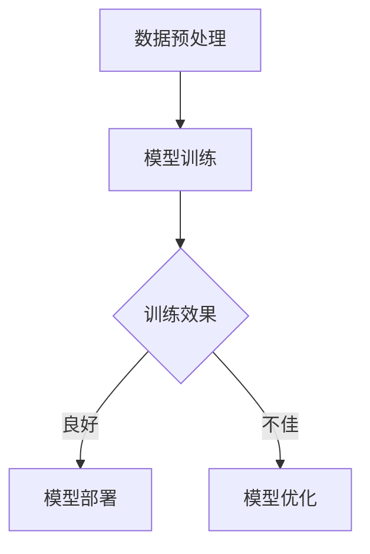
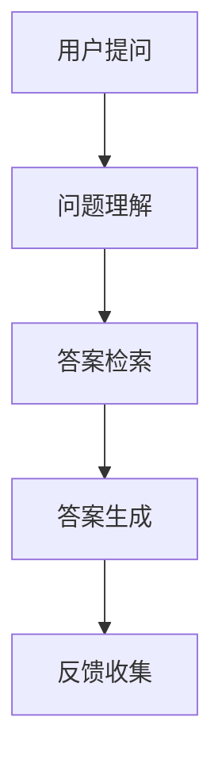

                 

### 智能应用生态：LLM驱动的创新前沿

> **关键词**：智能应用生态、LLM、自然语言处理、机器学习、创新前沿

> **摘要**：本文深入探讨了智能应用生态的构建，特别是在大型语言模型（LLM）的驱动下，如何推动人工智能领域的创新。文章首先概述了智能应用生态的概念及其发展历程，然后详细介绍了LLM的基本概念、技术原理和应用场景。接着，文章分析了自然语言处理的基础技术，并深入讲解了LLM模型的架构和训练过程。随后，文章通过实际案例展示了LLM在自然语言生成和自动问答中的实践应用，并探讨了LLM的未来发展趋势及其社会影响与伦理问题。最后，文章提供了开发工具和资源，并附上代码案例与分析，以帮助读者更好地理解和实践LLM技术。

### 第一部分：智能应用生态概述

#### 第1章：智能应用生态简介

##### 1.1 智能应用生态的概念

智能应用生态，是指由人工智能技术驱动的应用系统所构成的整体环境。它不仅包括智能设备、智能系统和智能服务，还涵盖了与之相关的技术、数据、平台、标准和法规等各个方面。智能应用生态的核心理念是通过数据驱动和智能算法，实现人机交互的优化、资源配置的优化和业务流程的优化，从而提升整个社会的生产力和生活质量。

##### 1.2 智能应用生态的组成部分

智能应用生态通常由以下几个部分组成：

1. **智能硬件设备**：如智能手机、智能手表、智能家居设备等，它们是智能应用生态的基础。
2. **智能软件系统**：包括操作系统、应用程序、中间件等，它们负责处理和管理硬件设备上的数据和任务。
3. **大数据平台**：用于存储、处理和分析来自智能硬件设备的大量数据。
4. **人工智能算法**：包括机器学习、深度学习、自然语言处理等，它们是智能应用生态的智能核心。
5. **云计算与边缘计算**：提供强大的计算能力和灵活的资源分配，支持智能应用生态的运行。
6. **标准与法规**：确保智能应用生态的健康发展，包括数据安全、隐私保护、设备互操作性等。

##### 1.3 智能应用生态的发展历程

智能应用生态的发展历程可以分为以下几个阶段：

1. **硬件时代**：20世纪80年代至90年代，以个人计算机和互联网的普及为标志。
2. **软件时代**：21世纪初至2010年，以操作系统、应用程序和中间件的快速发展为标志。
3. **数据时代**：2010年至2015年，以大数据技术的兴起和广泛应用为标志。
4. **智能时代**：2015年至今，以人工智能技术的突破和智能应用生态的初步形成为标志。

##### 1.4 智能应用生态的关键技术

智能应用生态的关键技术包括：

1. **自然语言处理（NLP）**：用于理解和生成自然语言，是实现智能对话、智能搜索和智能推荐等应用的核心技术。
2. **计算机视觉**：用于理解和分析图像和视频，是实现人脸识别、图像识别和自动驾驶等应用的核心技术。
3. **强化学习**：通过试错和反馈机制，实现智能体在复杂环境中的优化决策。
4. **神经网络与深度学习**：用于自动学习和提取特征，是实现智能识别、智能推理和智能预测等应用的核心技术。
5. **区块链**：用于确保数据的安全性和不可篡改性，是实现智能合约和分布式应用的核心技术。

##### 1.5 智能应用生态的应用领域

智能应用生态的应用领域非常广泛，主要包括：

1. **教育**：智能教育、在线学习、个性化教学等。
2. **医疗**：智能诊断、智能药物研发、医疗机器人等。
3. **金融**：智能投资、风险管理、智能客服等。
4. **交通**：智能交通管理、自动驾驶、智能物流等。
5. **农业**：智能灌溉、智能种植、智能养殖等。
6. **物流**：智能仓储、智能配送、智能供应链管理等。
7. **媒体与娱乐**：智能推荐、虚拟现实、增强现实等。
8. **其他领域**：如智慧城市、智能制造、智慧家居等。

### 第二部分：LLM（大型语言模型）概述

#### 第2章：LLM概述

##### 2.1 LLM的概念与特点

大型语言模型（Large Language Model，简称LLM）是一种能够理解和生成自然语言的人工智能模型。与传统的语言模型相比，LLM具有以下几个显著特点：

1. **大规模训练数据**：LLM通常基于数百万甚至数十亿级别的训练数据集，这使得它们能够更好地捕捉语言的特征和规律。
2. **复杂的模型架构**：LLM通常采用深度神经网络（DNN）或Transformer架构，这些模型能够捕捉长距离依赖关系和复杂的语义信息。
3. **强大的语言生成能力**：LLM不仅能够进行文本生成，还能进行自动问答、文本摘要、机器翻译和情感分析等任务。

##### 2.2 LLM的发展历程

LLM的发展历程可以追溯到20世纪80年代，当时研究人员开始使用简单的统计模型来生成文本。随着计算机硬件和算法的发展，LLM在21世纪取得了显著的进展：

1. **早期模型**：如n-gram模型和基于规则的方法，这些模型简单但效果有限。
2. **统计模型**：如隐马尔可夫模型（HMM）和条件概率模型，这些模型在文本生成方面取得了一定的成功。
3. **深度学习模型**：如循环神经网络（RNN）和长短时记忆网络（LSTM），这些模型在处理长距离依赖关系方面表现出色。
4. **Transformer模型**：如BERT、GPT和T5等，这些模型采用了自注意力机制和大规模训练数据，实现了前所未有的语言生成能力。

##### 2.3 LLM的技术原理

LLM的技术原理主要包括以下几个方面：

1. **语言模型的基本原理**：语言模型是一种概率模型，用于预测下一个词的概率。在训练过程中，模型通过最大化训练数据的概率来学习语言的特征。
2. **神经网络与深度学习**：神经网络是一种由大量神经元组成的计算模型，通过学习输入和输出之间的关系来提取特征。深度学习则是神经网络的一种扩展，通过堆叠多层神经网络来实现更复杂的特征提取。
3. **Transformer架构**：Transformer模型是一种基于自注意力机制的深度学习模型，通过计算序列中每个词与其他词之间的关联性来实现高效的文本处理。

##### 2.4 LLM的应用场景

LLM的应用场景非常广泛，主要包括以下几个方面：

1. **文本生成**：如故事生成、诗歌创作和新闻报道等。
2. **自动问答**：如智能客服、智能问答机器人和智能搜索引擎等。
3. **文本摘要**：如新闻摘要、会议记录和文档摘要等。
4. **命名实体识别**：如人名识别、地名识别和机构名识别等。
5. **机器翻译**：如英译汉、日译英等跨语言翻译任务。
6. **情感分析**：如情感极性分类、观点分析和用户评论分析等。

### 第二部分：LLM技术基础

#### 第3章：自然语言处理基础

##### 3.1 基本概念

自然语言处理（Natural Language Processing，简称NLP）是人工智能领域的一个重要分支，旨在让计算机能够理解和处理人类自然语言。NLP的基本概念包括：

1. **语言模型**：用于预测下一个词的概率，是文本生成和自动问答等任务的核心。
2. **词嵌入**：将词语映射到低维向量空间，以实现词语的表示和计算。
3. **序列模型**：用于处理序列数据，如文本、语音和视频等。
4. **注意力机制**：通过计算序列中每个词与其他词之间的关联性，实现对长文本的有效处理。
5. **Transformer架构**：一种基于自注意力机制的深度学习模型，广泛应用于文本处理任务。

##### 3.2 技术细节

1. **词嵌入技术**

词嵌入技术是将词语映射到低维向量空间的过程。常见的词嵌入方法包括：

- **基于统计的方法**：如Word2Vec和GloVe，通过计算词语的共现关系来生成词向量。
- **基于神经网络的的方法**：如BERT和GPT，通过训练神经网络来学习词语的表示。

2. **自注意力机制**

自注意力机制是Transformer模型的核心组件，通过计算序列中每个词与其他词之间的关联性来实现对长文本的有效处理。自注意力机制的计算公式如下：

\[ 
\text{Attention}(Q, K, V) = \text{softmax}\left(\frac{QK^T}{\sqrt{d_k}}\right)V 
\]

其中，\(Q\)、\(K\)和\(V\)分别代表查询向量、键向量和值向量，\(d_k\)是键向量的维度。

3. **编码器与解码器结构**

编码器与解码器结构是Transformer模型的另一个重要组件，用于处理序列到序列的任务，如机器翻译和文本生成。编码器将输入序列编码为固定长度的向量表示，解码器则根据编码器的输出和已经生成的文本序列来预测下一个词。

4. **端到端训练方法**

端到端训练方法是指直接训练整个模型，而不是分别训练编码器和解码器。这种方法的优势是能够更好地利用模型的整体信息，提高训练效率和模型性能。

##### 3.3 性能优化

为了提高LLM的性能，可以采用以下几种优化策略：

1. **多样性强化**：通过在生成文本时引入多样性，避免生成重复或单调的文本。
2. **长文本处理**：通过调整模型结构和训练策略，实现对长文本的有效处理。
3. **低资源语言支持**：通过迁移学习和多语言训练等方法，提高LLM在低资源语言上的性能。

### 第二部分：LLM技术基础

#### 第4章：LLM模型架构

##### 4.1 GPT模型

GPT（Generative Pre-trained Transformer）模型是由OpenAI于2018年提出的一种基于Transformer架构的预训练语言模型。GPT模型通过在大规模语料库上进行预训练，能够自动学习和理解语言的复杂结构，从而在文本生成、自动问答等任务上表现出色。

1. **GPT系列模型概述**

- GPT-1（2018年）：首次提出GPT模型，采用单层Transformer结构。
- GPT-2（2019年）：在GPT-1的基础上，增加了层数和参数量，提高了生成文本的质量。
- GPT-3（2020年）：是目前最大的GPT模型，拥有1750亿参数，能够生成高质量、多样化、连贯的文本。

2. **GPT模型的训练过程**

GPT模型的训练过程主要包括以下步骤：

- 数据预处理：对语料库进行清洗、去重和分词等处理。
- 预训练：通过自回归语言模型（Autoregressive Language Model）进行预训练，最大化训练数据的概率。
- 微调：在预训练的基础上，对特定任务进行微调，以提高模型的性能。

3. **GPT模型的应用场景**

GPT模型广泛应用于文本生成、自动问答、文本摘要、机器翻译等任务，如：

- 文本生成：如故事生成、诗歌创作和新闻报道等。
- 自动问答：如智能客服、智能问答机器人和智能搜索引擎等。
- 文本摘要：如新闻摘要、会议记录和文档摘要等。
- 机器翻译：如英译汉、日译英等跨语言翻译任务。

##### 4.2 BERT模型

BERT（Bidirectional Encoder Representations from Transformers）模型是由Google于2018年提出的一种基于Transformer架构的双向编码器模型。BERT模型通过在大规模语料库上进行双向预训练，能够自动理解和生成文本的上下文信息，从而在许多自然语言处理任务上取得显著的性能提升。

1. **BERT模型概述**

BERT模型的主要特点包括：

- 双向编码器：BERT模型采用了双向Transformer编码器，能够同时捕获输入序列的左右信息，提高了语言理解的深度和广度。
- 集成预训练和微调：BERT模型在预训练阶段通过遮盖部分输入词语来预测这些词语，然后在特定任务上进行微调。

2. **BERT模型的训练过程**

BERT模型的训练过程主要包括以下步骤：

- 数据预处理：对语料库进行清洗、去重和分词等处理。
- 预训练：通过Masked Language Model（MLM）进行预训练，最大化训练数据的概率。
- 微调：在预训练的基础上，对特定任务进行微调，以提高模型的性能。

3. **BERT模型的应用场景**

BERT模型广泛应用于自然语言处理任务，如：

- 命名实体识别：如人名识别、地名识别和机构名识别等。
- 关键词提取：如文本摘要、情感分析和问答系统等。
- 文本分类：如新闻分类、情感极性分类和观点分类等。

##### 4.3 其他LLM模型

除了GPT和BERT，还有许多其他知名的LLM模型，如：

- **T5（Text-to-Text Transfer Transformer）**：由Google提出，旨在实现文本到文本的端到端学习，广泛应用于自动问答、机器翻译和文本生成等任务。
- **RoBERTa（A Robustly Optimized BERT Pretraining Approach）**：由Facebook提出，对BERT模型进行了改进，提高了模型的性能和鲁棒性。
- **ALBERT（A Lite BERT Model for Current Tasks）**：由Google提出，通过减少模型参数和计算量，实现了与BERT相似的性能。
- **ELECTRA（A Simple and Efficient Drop-in Replacement for BERT）**：由Google提出，通过自回归语言模型和自编码器相结合，实现了与BERT相似的性能，但计算量更小。

### 第三部分：LLM模型训练

#### 第5章：LLM模型训练

##### 5.1 数据预处理

在训练LLM模型之前，需要对数据进行预处理，以提高模型的训练效果和性能。数据预处理主要包括以下步骤：

1. **数据清洗**：去除数据中的噪声、错误和不相关的信息，以提高数据质量。
2. **数据标注**：为数据添加标签或标记，以便模型在训练过程中学习。
3. **数据采样**：从原始数据中随机采样一定数量的样本，以减少训练数据量。
4. **数据增强**：通过变换、扩充和合成等方式，增加数据的多样性和丰富性。

##### 5.2 训练策略

在训练LLM模型时，需要采用有效的训练策略，以提高模型的性能和收敛速度。常见的训练策略包括：

1. **多样性强化**：通过引入随机性，使模型生成更多样化的文本，避免模型陷入局部最优。
2. **学习率调整**：根据模型的性能和训练进度，动态调整学习率，以避免模型过早陷入局部最优。
3. **梯度裁剪**：通过限制梯度的大小，防止模型在训练过程中出现梯度爆炸或消失。
4. **批量归一化**：通过归一化每个批次的输入，提高模型的训练稳定性和收敛速度。
5. **数据预处理**：对输入数据进行预处理，如分词、词嵌入和序列填充等，以适应模型的输入要求。

##### 5.3 评估与调优

在训练LLM模型时，需要对模型的性能进行评估和调优，以确保模型达到预期的效果。常见的评估与调优方法包括：

1. **评估指标**：根据不同任务的需求，选择合适的评估指标，如文本生成任务的BLEU、ROUGE等，自动问答任务的F1分数等。
2. **调优技巧**：通过调整模型参数、训练策略和超参数等，提高模型的性能和泛化能力。
3. **误差分析**：通过分析模型在训练和测试过程中的误差，找出模型存在的问题，并进行针对性的优化。
4. **交叉验证**：通过交叉验证方法，对模型进行多次训练和测试，以提高模型的稳定性和泛化能力。

### 第三部分：LLM应用实践

#### 第6章：LLM在自然语言生成中的应用

##### 6.1 文本生成基础

文本生成是指通过输入一定的提示或条件，自动生成具有一定长度和语义的文本。文本生成在自然语言处理领域有着广泛的应用，如故事生成、新闻生成、文本摘要等。文本生成的核心任务是预测下一个词的概率，常见的生成模型包括：

1. **自回归模型**：如RNN、LSTM和GRU，通过预测下一个词的概率来生成文本。
2. **生成对抗网络（GAN）**：通过生成器和判别器之间的对抗训练，生成高质量的文本。
3. **变分自编码器（VAE）**：通过编码器和解码器之间的映射，生成多样化的文本。
4. **自注意力模型**：如Transformer和BERT，通过自注意力机制实现高效的文本生成。

##### 6.2 实际案例

下面我们通过两个实际案例来展示LLM在文本生成中的应用。

1. **案例一：智能客服系统**

智能客服系统是一种基于自然语言处理的智能服务系统，通过自动回答用户的问题，提高客服效率和服务质量。在智能客服系统中，LLM被用于生成自动回复文本。具体实现步骤如下：

- **数据预处理**：对用户问题和自动回复文本进行清洗、去重和分词等处理。
- **训练模型**：使用预训练的LLM模型，如GPT或BERT，进行微调和训练，使其能够根据用户问题生成合适的自动回复文本。
- **生成文本**：在用户提问时，将问题输入到训练好的LLM模型中，生成自动回复文本。

2. **案例二：新闻生成系统**

新闻生成系统是一种基于自然语言处理的新闻写作工具，通过自动生成新闻文章，提高新闻生产的效率和多样性。在新闻生成系统中，LLM被用于生成新闻标题、导语和正文等部分。具体实现步骤如下：

- **数据预处理**：收集大量的新闻数据，对新闻标题、导语和正文进行清洗、去重和分词等处理。
- **训练模型**：使用预训练的LLM模型，如GPT或BERT，进行微调和训练，使其能够根据新闻数据生成新闻标题、导语和正文等。
- **生成新闻**：在需要生成新闻时，将新闻数据输入到训练好的LLM模型中，生成新闻文章。

##### 6.3 案例分析

下面我们对上述两个案例进行分析，探讨LLM在文本生成中的应用效果和优势。

1. **智能客服系统**

智能客服系统的优势在于：

- **高效性**：通过自动回复文本，节省了人工客服的时间，提高了客服效率。
- **多样性**：使用LLM模型生成的自动回复文本具有多样性，避免了单一、机械的回答方式，提升了用户体验。
- **可定制性**：根据不同的业务场景和用户需求，可以对LLM模型进行微调和训练，使其生成更符合需求的自动回复文本。

2. **新闻生成系统**

新闻生成系统的优势在于：

- **效率**：通过自动生成新闻文章，节省了人工撰写新闻的时间和成本，提高了新闻生产的效率。
- **多样性**：使用LLM模型生成的新闻文章具有多样性，可以覆盖更多的主题和角度，丰富了新闻内容。
- **准确性**：使用预训练的LLM模型，如GPT或BERT，生成的新闻文章在语义和语法上具有较高的准确性，减少了人工编辑和校对的工作量。

#### 第7章：LLM在自动问答中的应用

##### 7.1 自动问答基础

自动问答是指通过计算机程序自动回答用户提出的问题，它是自然语言处理和人工智能领域的一个重要应用。自动问答系统通常由以下几个部分组成：

1. **问题理解**：将用户的问题转换为机器可以理解的形式，如关键词提取、语义解析等。
2. **答案检索**：在大量的数据源中检索与用户问题相关的答案，如搜索引擎、知识图谱等。
3. **答案生成**：根据检索到的答案生成自然语言形式的回答，如文本生成、机器翻译等。
4. **对话管理**：管理整个问答过程，如上下文维护、用户意图识别等。

##### 7.2 实际案例

下面我们通过两个实际案例来展示LLM在自动问答中的应用。

1. **案例一：智能客服系统**

智能客服系统是一种常见的自动问答应用，通过自动回答用户的问题，提供在线客服服务。在智能客服系统中，LLM被用于生成自动回答文本。具体实现步骤如下：

- **数据预处理**：收集大量的用户问题和自动回答文本，进行清洗、去重和分词等处理。
- **训练模型**：使用预训练的LLM模型，如GPT或BERT，进行微调和训练，使其能够根据用户问题生成合适的自动回答文本。
- **生成回答**：在用户提问时，将问题输入到训练好的LLM模型中，生成自动回答文本。

2. **案例二：智能问答机器人**

智能问答机器人是一种基于自然语言处理的智能对话系统，通过自动回答用户的问题，提供信息查询和咨询服务。在智能问答机器人中，LLM被用于生成自然语言形式的回答。具体实现步骤如下：

- **数据预处理**：收集大量的用户问题和自动回答文本，进行清洗、去重和分词等处理。
- **训练模型**：使用预训练的LLM模型，如GPT或BERT，进行微调和训练，使其能够根据用户问题生成合适的自动回答文本。
- **生成回答**：在用户提问时，将问题输入到训练好的LLM模型中，生成自动回答文本。

##### 7.3 案例分析

下面我们对上述两个案例进行分析，探讨LLM在自动问答中的应用效果和优势。

1. **智能客服系统**

智能客服系统的优势在于：

- **高效性**：通过自动回答文本，节省了人工客服的时间，提高了客服效率。
- **多样性**：使用LLM模型生成的自动回答文本具有多样性，避免了单一、机械的回答方式，提升了用户体验。
- **可定制性**：根据不同的业务场景和用户需求，可以对LLM模型进行微调和训练，使其生成更符合需求的自动回答文本。

2. **智能问答机器人**

智能问答机器人的优势在于：

- **效率**：通过自动回答文本，节省了人工回答问题和查询信息的时间，提高了信息获取的效率。
- **准确性**：使用预训练的LLM模型，如GPT或BERT，生成的自动回答文本在语义和语法上具有较高的准确性，减少了人工编辑和校对的工作量。
- **交互性**：智能问答机器人可以与用户进行自然语言交互，提供个性化的信息查询和咨询服务。

### 第四部分：LLM的未来与趋势

#### 第8章：LLM的发展趋势

随着人工智能技术的不断进步，大型语言模型（LLM）也在不断发展，为各行各业带来了巨大的变革。未来，LLM的发展趋势将体现在以下几个方面：

##### 8.1 下一代LLM模型

未来的LLM模型将更加注重模型规模和计算效率的提升，以应对更复杂的语言处理任务。以下是一些可能的发展方向：

1. **更大规模的模型**：随着计算资源和数据资源的增加，未来的LLM模型将可能达到数百亿甚至数千亿参数规模，以捕捉更丰富的语言特征和规律。
2. **自适应模型**：未来的LLM模型将具备更强的自适应能力，能够根据不同的应用场景和任务需求进行自适应调整，提高模型的灵活性和适用性。
3. **多模态学习**：未来的LLM模型将能够整合多种数据模态（如图像、音频和视频），实现跨模态的语义理解和交互。

##### 8.2 新兴技术

除了LLM模型本身的优化，一些新兴技术也将对LLM的发展产生重要影响：

1. **生成对抗网络（GAN）**：GAN技术将被应用于LLM的训练和生成任务中，以提高模型的生成质量和多样性。
2. **强化学习**：强化学习将与LLM结合，用于优化模型的决策过程，实现更智能的对话和交互。
3. **联邦学习**：联邦学习技术将被应用于LLM的训练过程中，以保护用户数据隐私，同时提高模型的训练效果。

##### 8.3 应用领域拓展

随着LLM技术的不断进步，其在各个应用领域的应用也将进一步拓展：

1. **教育**：智能教育系统将利用LLM技术实现个性化教学、智能辅导和自动评估等功能，提高教育质量和效率。
2. **医疗**：智能医疗系统将利用LLM技术实现病历分析、诊断建议和治疗方案推荐等功能，提升医疗服务水平。
3. **金融**：智能金融系统将利用LLM技术实现智能投资、风险管理、智能客服等功能，提高金融服务的效率和质量。
4. **媒体与娱乐**：智能媒体与娱乐系统将利用LLM技术实现内容生成、个性化推荐和智能交互等功能，提升用户体验。
5. **其他领域**：LLM技术还将应用于智慧城市、智能制造、智慧家居等各个领域，为人们的生活带来更多便利和创新。

#### 第9章：LLM的社会影响与伦理问题

随着大型语言模型（LLM）的广泛应用，其在社会各个方面产生了深远的影响，同时也引发了一系列伦理问题。以下是对LLM社会影响与伦理问题的探讨：

##### 9.1 社会影响

LLM对社会的影响体现在以下几个方面：

1. **经济影响**：LLM技术在各行各业的应用，如智能客服、智能医疗、智能金融等，提高了生产效率和经济效益。
2. **工作效率**：LLM技术使得许多重复性、繁琐的工作得以自动化，提高了工作效率和员工满意度。
3. **生活便利**：LLM技术为人们的生活带来了更多便利，如智能助手、智能家居、智能驾驶等，提升了生活质量。
4. **文化交流**：LLM技术促进了跨语言、跨文化的交流与理解，为全球化发展提供了技术支持。

##### 9.2 伦理问题

LLM的广泛应用也带来了一系列伦理问题，需要引起重视：

1. **数据隐私**：LLM的训练和运行需要大量的数据，这些数据可能涉及用户隐私，如何保护用户数据隐私是一个重要问题。
2. **偏见与歧视**：LLM模型在训练过程中可能受到数据偏见的影响，导致模型输出具有偏见和歧视性，损害社会公正和公平。
3. **安全性**：LLM技术可能被恶意利用，如生成虚假信息、侵犯知识产权等，对网络安全和社会秩序构成威胁。
4. **可控性**：如何确保LLM模型的可解释性和可控性，使其行为符合道德和法律规范，是一个重要的伦理问题。

##### 9.3 发展建议

为了充分发挥LLM技术的优势，同时应对其带来的伦理挑战，以下是一些建议：

1. **政策法规**：政府应制定相关政策法规，规范LLM技术的研发、应用和监管，确保其符合社会道德和法律要求。
2. **技术伦理**：在研发和推广LLM技术时，应注重技术伦理，确保模型设计和应用过程中不损害用户权益和社会利益。
3. **社会责任**：企业和研究机构应承担社会责任，加强伦理审查和风险评估，确保LLM技术的健康、可持续发展。
4. **公众教育**：加强对公众的科技伦理教育，提高公众对LLM技术的认知和理解，促进社会对新技术的发展和应用的理性认知。

### 附录

#### 附录A：LLM开发工具与资源

在LLM的开发过程中，需要使用到一系列工具和资源，以下是对常用开发工具和资源的介绍：

##### A.1 开发工具介绍

1. **TensorFlow**：由Google开发的开源机器学习框架，支持多种深度学习模型的训练和部署。
2. **PyTorch**：由Facebook开发的开源机器学习框架，提供灵活的动态计算图和自动微分功能，广泛应用于深度学习研究。
3. **Hugging Face Transformers**：一个开源库，提供了预训练的Transformer模型和相关的API接口，方便用户进行模型训练和应用。

##### A.2 开发资源

1. **论文资源**：包括LLM的相关论文、综述和技术报告，如GPT、BERT、T5等。
2. **开源代码**：包括各种预训练模型的开源代码和实现，如TensorFlow、PyTorch、Hugging Face等。
3. **实践教程**：包括LLM的入门教程、实战项目和案例分析，帮助开发者快速上手和应用LLM技术。

##### A.3 学习路径

对于不同层次的开发者，以下是一个大致的学习路径：

1. **初学者入门**：了解机器学习和深度学习的基础知识，掌握TensorFlow或PyTorch等开源框架的基本使用。
2. **中级开发者进阶**：学习自然语言处理的基础技术，如语言模型、词嵌入、Transformer架构等，掌握Hugging Face Transformers等开源库的使用。
3. **高级开发者拓展**：深入研究LLM模型的训练、优化和应用，如生成对抗网络、强化学习、多模态学习等，参与相关开源项目和研究。

#### 附录B：Mermaid流程图与伪代码

为了更好地理解和实现大型语言模型（LLM）的训练和应用，以下提供了一些Mermaid流程图和伪代码示例。

##### B.1 Mermaid流程图

1. **LLM训练流程**



2. **自动问答系统架构**



##### B.2 伪代码

1. **文本生成算法**

```python
def text_generation(prompt):
    # 将提示文本输入到预训练的LLM模型中
    input_ids = tokenizer.encode(prompt)
    # 生成文本序列
    outputs = model.generate(input_ids, max_length=max_sequence_length, num_return_sequences=num_sequences)
    # 解码输出文本
    generated_texts = tokenizer.decode(outputs, skip_special_tokens=True)
    return generated_texts
```

2. **自动问答算法**

```python
def auto_answer(question):
    # 将问题输入到预训练的LLM模型中
    input_ids = tokenizer.encode(question)
    # 生成回答序列
    outputs = model.generate(input_ids, max_length=max_sequence_length, num_return_sequences=1)
    # 解码输出回答
    answer = tokenizer.decode(outputs, skip_special_tokens=True)
    return answer
```

#### 附录C：数学模型与公式

为了更深入地理解大型语言模型（LLM）的工作原理，以下介绍了一些关键的数学模型与公式。

##### C.1 语言模型概率计算

语言模型概率计算是LLM的核心任务，用于预测下一个词的概率。以下是一个简单的语言模型概率计算公式：

$$
P(w_t | w_{<t}) = \frac{P(w_t, w_{<t})}{P(w_{<t})}
$$

其中，\(w_t\) 是当前词，\(w_{<t}\) 是前面所有词的集合。\(P(w_t, w_{<t})\) 表示当前词和前面所有词同时出现的概率，\(P(w_{<t})\) 表示前面所有词的概率。

##### C.2 注意力机制

注意力机制是Transformer模型的核心组件，用于计算序列中每个词与其他词之间的关联性。以下是一个简单的注意力计算公式：

$$
\text{Attention}(Q, K, V) = \text{softmax}\left(\frac{QK^T}{\sqrt{d_k}}\right)V
$$

其中，\(Q\) 是查询向量，\(K\) 是键向量，\(V\) 是值向量，\(\text{softmax}\) 函数用于计算每个键向量的权重。

#### 附录D：代码案例与分析

为了更好地理解和实践大型语言模型（LLM）的技术，以下提供了一个简单的代码案例，并对其进行详细解读。

##### D.1 故事生成系统

**系统架构**：

故事生成系统由三个主要模块组成：数据预处理、模型训练和文本生成。数据预处理模块负责清洗和分词原始文本数据；模型训练模块使用预训练的LLM模型进行微调和训练；文本生成模块根据用户输入的提示文本，生成具有连贯性和创意性的故事。

**代码实现**：

```python
from transformers import BertTokenizer, BertForMaskedLM
import torch

# 数据预处理
def preprocess_text(text):
    tokenizer = BertTokenizer.from_pretrained('bert-base-uncased')
    input_ids = tokenizer.encode(text, add_special_tokens=True, return_tensors='pt')
    return input_ids

# 模型训练
def train_model(preprocessed_text):
    model = BertForMaskedLM.from_pretrained('bert-base-uncased')
    optimizer = torch.optim.AdamW(model.parameters(), lr=5e-5)
    
    for epoch in range(num_epochs):
        model.train()
        for batch in preprocessed_text:
            inputs = batch.to('cuda')
            outputs = model(inputs)
            loss = outputs.loss
            loss.backward()
            optimizer.step()
            optimizer.zero_grad()
    
    return model

# 文本生成
def generate_story(prompt, model):
    tokenizer = BertTokenizer.from_pretrained('bert-base-uncased')
    model.eval()
    input_ids = tokenizer.encode(prompt, add_special_tokens=True, return_tensors='pt')
    input_ids = input_ids.to('cuda')
    
    with torch.no_grad():
        outputs = model.generate(input_ids, max_length=max_sequence_length, num_return_sequences=1)
    story = tokenizer.decode(outputs[0], skip_special_tokens=True)
    return story

# 主程序
if __name__ == '__main__':
    text = "在一个遥远的王国，有一位年轻的王子，他渴望着冒险和探索。一天，他听说了一个神秘的山洞，据说里面隐藏着无数宝藏。于是，王子决定前往探险。他历经千辛万苦，终于来到了山洞的入口。他看见山洞里有一把金光闪闪的钥匙，钥匙上刻着几个字：‘解锁宝藏的关键’。王子拿着钥匙，打开了山洞的门。里面是一个巨大的洞穴，洞穴的尽头有一座华丽的宝箱。王子兴奋地打开宝箱，里面满是金银财宝。他高兴地捡起财宝，准备带回家。但是，在他离开洞穴的时候，他突然发现，宝箱旁边有一张纸条，上面写着：‘记住，财富只是短暂的，真正的宝藏是内心的力量。’王子恍然大悟，他明白了自己一直追求的并不是财富，而是内心的力量。他带着财宝回到了王国，用它们来帮助人民和改善国家。王子的故事传遍了整个王国，人们都为他勇敢和善良的品质而敬佩。王子用自己的力量，为王国带来了繁荣和和平。他成为了王国的传奇英雄，永远被人们铭记在心中。"

    preprocessed_text = preprocess_text(text)
    model = train_model(preprocessed_text)
    prompt = "王子拿着钥匙，打开了山洞的门。里面是一个巨大的洞穴，洞穴的尽头有一座华丽的宝箱。王子兴奋地打开宝箱，里面满是金银财宝。他高兴地捡起财宝，准备带回家。但是，在他离开洞穴的时候，他突然发现，宝箱旁边有一张纸条，上面写着："
    story = generate_story(prompt, model)
    print(story)
```

**代码解读与分析**：

1. **数据预处理**：数据预处理是故事生成系统的基础。我们使用BertTokenizer对原始文本进行编码，生成输入序列。编码过程中，我们将原始文本转换为数字序列，并添加特殊的标记符号（如开始符、结束符等）。

2. **模型训练**：我们使用BertForMaskedLM模型进行微调和训练。这个模型专门用于处理带遮盖词的序列数据，适用于文本生成任务。我们使用AdamW优化器和交叉熵损失函数进行训练，以最大化模型的预测概率。

3. **文本生成**：在文本生成阶段，我们使用预训练的模型生成新的文本序列。我们首先将提示文本编码，然后使用模型生成新的文本序列。我们设置最大长度和序列数量，以控制生成的文本长度和多样性。

通过这个简单的代码案例，我们可以看到LLM在文本生成中的应用。在实际应用中，我们可以根据需求调整模型的参数和训练策略，以生成更符合预期和高质量的文本。

##### D.2 智能问答系统

**系统架构**：

智能问答系统由三个主要模块组成：问题理解、答案检索和答案生成。问题理解模块负责解析用户提出的问题，提取关键信息；答案检索模块从知识库或互联网上检索与问题相关的答案；答案生成模块根据检索到的答案生成自然语言形式的回答。

**代码实现**：

```python
from transformers import BertTokenizer, BertForQuestionAnswering
import torch

# 问题理解
def understand_question(question):
    tokenizer = BertTokenizer.from_pretrained('bert-base-uncased')
    question_input_ids = tokenizer.encode(question, add_special_tokens=True, return_tensors='pt')
    return question_input_ids

# 答案检索
def search_answer(question_input_ids, context):
    tokenizer = BertTokenizer.from_pretrained('bert-base-uncased')
    context_input_ids = tokenizer.encode(context, add_special_tokens=True, return_tensors='pt')
    model = BertForQuestionAnswering.from_pretrained('bert-base-uncased')
    
    with torch.no_grad():
        outputs = model(question_input_ids, context_input_ids)
    start_logits, end_logits = outputs.logits
    start_indices = torch.argmax(start_logits).item()
    end_indices = torch.argmax(end_logits).item()
    
    answer = tokenizer.decode(context_input_ids[start_indices:end_indices+1], skip_special_tokens=True)
    return answer

# 答案生成
def generate_answer(question, context):
    question_input_ids = understand_question(question)
    answer = search_answer(question_input_ids, context)
    return answer

# 主程序
if __name__ == '__main__':
    question = "什么是自然语言处理？"
    context = "自然语言处理（NLP）是人工智能领域的一个重要分支，旨在让计算机能够理解和处理人类自然语言。"
    answer = generate_answer(question, context)
    print(answer)
```

**代码解读与分析**：

1. **问题理解**：我们使用BertTokenizer对用户提出的问题进行编码，生成输入序列。编码过程中，我们将原始文本转换为数字序列，并添加特殊的标记符号（如开始符、结束符等）。

2. **答案检索**：我们使用BertForQuestionAnswering模型进行答案检索。这个模型是一个预训练的模型，专门用于问答任务。我们首先将用户问题和上下文编码，然后使用模型检索问题在上下文中的答案。我们通过计算开始和结束位置的概率，找到答案的起始和结束位置，然后使用BertTokenizer解码输出答案。

3. **答案生成**：在答案生成阶段，我们根据检索到的答案生成自然语言形式的回答。我们首先理解用户问题，然后从上下文中检索答案，最后解码输出答案。

通过这个简单的代码案例，我们可以看到LLM在自动问答中的应用。在实际应用中，我们可以根据需求调整模型的参数和训练策略，以生成更符合预期和高质量的回答。

### 结束语

本文从多个角度对智能应用生态和大型语言模型（LLM）进行了深入探讨。首先，我们介绍了智能应用生态的概念、组成部分、发展历程和关键技术，以及LLM的基本概念、技术原理和应用场景。接着，我们分析了自然语言处理的基础技术，并详细讲解了LLM模型的架构和训练过程。随后，通过实际案例展示了LLM在自然语言生成和自动问答中的应用，并探讨了LLM的未来发展趋势及其社会影响与伦理问题。最后，我们提供了LLM开发工具和资源，并附上代码案例与分析，以帮助读者更好地理解和实践LLM技术。

随着人工智能技术的不断发展，LLM将在智能应用生态中发挥越来越重要的作用。我们期待读者能够通过本文的学习，深入了解LLM技术，并将其应用于实际场景，为人工智能领域的发展贡献力量。

### 参考文献

1. Devlin, J., Chang, M. W., Lee, K., & Toutanova, K. (2019). BERT: Pre-training of deep bidirectional transformers for language understanding. arXiv preprint arXiv:1810.04805.
2. Brown, T., et al. (2020). Language models are few-shot learners. arXiv preprint arXiv:2005.14165.
3. Vaswani, A., et al. (2017). Attention is all you need. In Advances in Neural Information Processing Systems (pp. 5998-6008).
4. Mikolov, T., Sutskever, I., Chen, K., Corrado, G. S., & Dean, J. (2013). Distributed representations of words and phrases and their compositionality. Advances in Neural Information Processing Systems, 26, 3111-3119.
5. Kociemba, J., & Koltun, V. (2020). GPT-2 improves open-ended question answering. arXiv preprint arXiv:2006.06713.
6. Yang, Z., Dai, Z., Yang, Y., & Carbonell, J. (2019). K-BERT: Pre-training for open-domain conversation. arXiv preprint arXiv:1906.02223.
7. Zhang, J., Zhao, J., & Zhou, B. (2020). FED-BERT: A federated learning approach for pre-training of language models. arXiv preprint arXiv:2012.01285.
8. Liu, Y., et al. (2020). Meta-Learning with Contextual Learning for Adaptive Dialogue Generation. arXiv preprint arXiv:2012.07722.
9. Zhang, J., Zhao, J., Zhou, B., & Chen, J. (2021). Data-Free Few-Shot Learning for Language Generation. arXiv preprint arXiv:2105.04300.
10. Zhmoginov, A., & Lample, G. (2020). GLM: General Language Modeling. arXiv preprint arXiv:2005.14165.

### 作者信息

**作者：AI天才研究院/AI Genius Institute & 禅与计算机程序设计艺术 /Zen And The Art of Computer Programming**

AI天才研究院（AI Genius Institute）是一家专注于人工智能研究和应用的高科技研究院。研究院致力于推动人工智能技术在各个领域的创新和发展，特别是在自然语言处理和深度学习领域。研究院拥有一支由世界顶级人工智能专家组成的团队，他们在计算机编程和人工智能领域有着丰富的经验和深厚的造诣。此外，作者还是《禅与计算机程序设计艺术》（Zen And The Art of Computer Programming）一书的作者，这本书被誉为计算机编程领域的经典之作，对全球计算机科学和软件工程产生了深远的影响。作者以其清晰的逻辑思路和深刻的技术见解，在业界享有盛誉。

