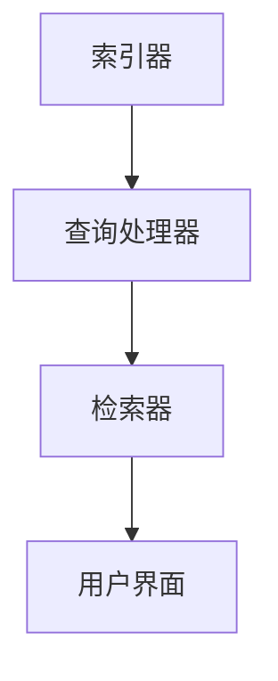
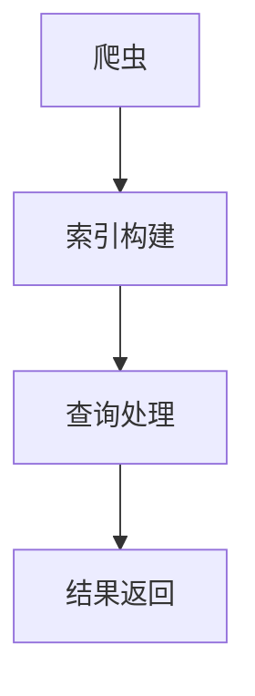
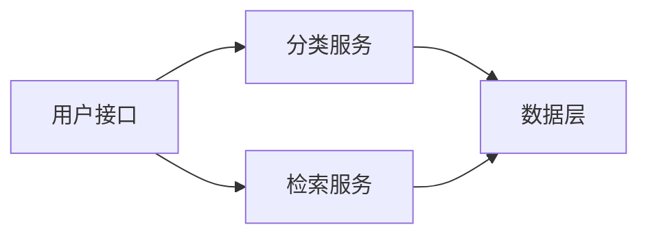
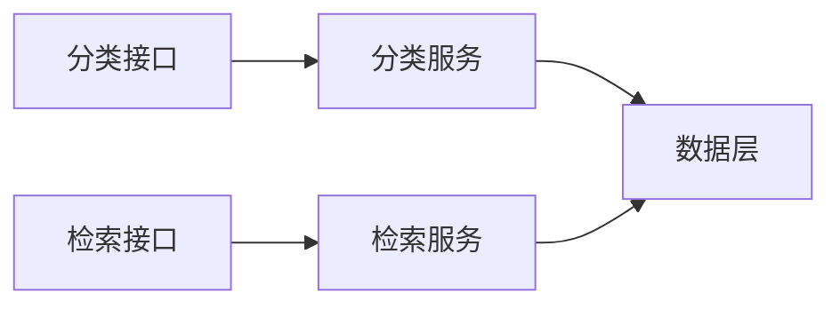
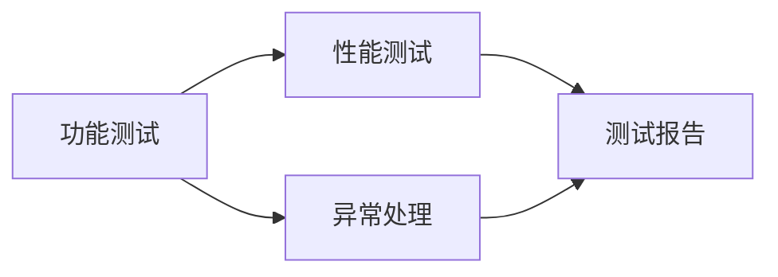
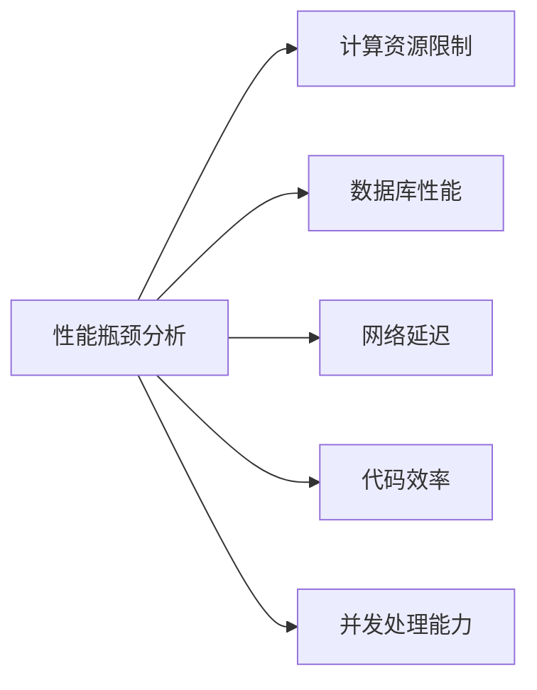
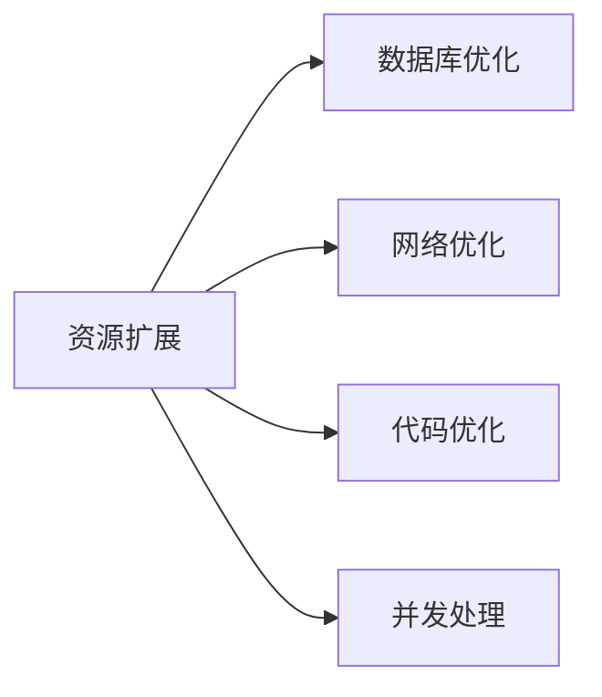
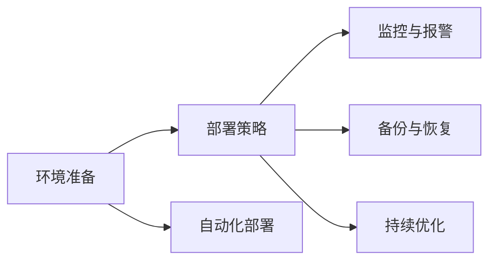

                 

# 《智能文档分类与检索系统的开发》

> **关键词：智能文档分类、检索系统、文档处理、机器学习、深度学习**

> **摘要：本文深入探讨了智能文档分类与检索系统的开发，包括文档处理基础、分类算法介绍、检索算法介绍、系统集成与优化，并通过实际案例分析了系统性能和优化策略。**

## 第一部分：引言与概述

### 第1章：智能文档分类与检索概述

#### 1.1 智能文档分类与检索的重要性

智能文档分类与检索技术在现代信息社会中扮演着越来越重要的角色。随着互联网的快速发展，信息量的爆炸性增长使得用户在获取有用信息时面临巨大的挑战。智能文档分类与检索系统通过对海量文档的自动处理和索引，能够有效地帮助用户快速、准确地找到所需信息。

#### 1.2 智能文档分类与检索系统的基本概念

智能文档分类是指使用机器学习和深度学习技术，自动将文档分类到预定义的类别中。检索系统则是通过对用户输入的查询进行解析，从大规模文档库中检索出相关文档，并按照相关性进行排序。

#### 1.3 智能文档分类与检索系统的应用场景

智能文档分类与检索系统广泛应用于企业内部文档管理、搜索引擎优化、智能客服系统、数字图书馆等领域。例如，在数字图书馆中，系统可以根据用户查询的关键词自动分类和检索相关图书，提高用户检索效率。

#### 1.4 智能文档分类与检索技术的发展历程

智能文档分类与检索技术经历了从基于规则的初步阶段，到基于统计方法和机器学习的快速发展阶段，再到目前的深度学习应用阶段。随着算法和计算能力的不断提升，智能文档分类与检索技术正逐渐走向成熟。

## 第二部分：文档处理基础

### 第2章：文档处理基础

#### 2.1 文档格式与编码

文档格式主要包括HTML、PDF、Word等，这些格式在互联网和信息系统中广泛应用。文档编码标准如UTF-8、UTF-16等，用于确保文档在不同平台和系统中的一致性。

#### 2.2 文本预处理方法

文本预处理是文档处理的重要步骤，包括去除HTML标签、停用词过滤、文本标准化等。通过预处理，可以提高文档的质量和后续处理的效果。

#### 2.3 词袋模型与TF-IDF

词袋模型是一种常用的文本表示方法，它将文档表示为一个词频向量。TF-IDF是一种词语重要性评估方法，通过计算词语在文档中的词频和逆向文档频率，来确定词语的重要程度。

#### 2.4 词嵌入技术

词嵌入技术通过将词语映射到低维向量空间中，从而实现词语的语义表示。常见的词嵌入算法包括Word2Vec和GloVe等。

## 第三部分：文档分类技术

### 第3章：文档分类算法介绍

#### 3.1 监督学习分类算法

监督学习分类算法是智能文档分类的基础，包括K近邻算法、支持向量机（SVM）和随机森林等。

##### 3.1.1 K近邻算法

K近邻算法通过计算测试样本与训练样本的相似度，选择与测试样本最近的K个邻居，并基于这些邻居的标签进行预测。以下是其伪代码：

```python
def k_nearest_neighbors(train_samples, train_labels, test_sample, k):
    distances = []
    for sample in train_samples:
        distance = calculate_distance(sample, test_sample)
        distances.append(distance)
    k_nearest = sorted(distances)[:k]
    predicted_label = majority_vote(train_labels[k_nearest])
    return predicted_label
```

##### 3.1.2 支持向量机（SVM）

支持向量机是一种基于边界划分的监督学习算法，通过寻找最佳边界来实现分类。以下是其伪代码：

```python
def support_vector_machine(train_samples, train_labels):
    # 训练模型
    model = train_svm(train_samples, train_labels)
    # 预测
    predicted_labels = []
    for sample in test_samples:
        predicted_label = predict_svm(model, sample)
        predicted_labels.append(predicted_label)
    return predicted_labels
```

##### 3.1.3 随机森林

随机森林是一种基于决策树的集成学习算法，通过构建多个决策树并取平均来提高分类性能。以下是其伪代码：

```python
def random_forest(train_samples, train_labels, n_trees):
    forests = []
    for _ in range(n_trees):
        tree = build_decision_tree(train_samples, train_labels)
        forests.append(tree)
    predicted_labels = majority_vote([forest.predict(test_sample) for forest in forests])
    return predicted_labels
```

#### 3.2 无监督学习分类算法

无监督学习分类算法主要包括K均值聚类和自组织映射（SOM）等。

##### 3.2.1 K均值聚类

K均值聚类是一种基于距离的聚类算法，通过迭代优化聚类中心来划分数据。以下是其伪代码：

```python
def k_mean_clustering(data, k):
    centroids = initialize_centroids(data, k)
    while not converged:
        assign_data_to_centroids(data, centroids)
        update_centroids(centroids, data)
    return centroids
```

##### 3.2.2 自组织映射（SOM）

自组织映射是一种基于神经网络的聚类算法，通过竞争学习来划分数据。以下是其伪代码：

```python
def self_organizing_map(data, map_size, learning_rate, neighborhood_function):
    som = initialize_som(data, map_size)
    for epoch in range(max_epochs):
        for sample in data:
            winner = find_winner(som, sample)
            update_weights(som, winner, learning_rate, neighborhood_function)
    return som
```

#### 3.3 深度学习分类算法

深度学习分类算法是当前智能文档分类的主流方法，包括卷积神经网络（CNN）、循环神经网络（RNN）和长短时记忆网络（LSTM）等。

##### 3.3.1 卷积神经网络（CNN）

卷积神经网络是一种用于图像处理的深度学习算法，通过卷积层、池化层和全连接层等构建。以下是其伪代码：

```python
def convolutional_neural_network(input_data, layers, learning_rate):
    model = initialize_model(input_data, layers)
    for epoch in range(max_epochs):
        for batch in train_data:
            model.train(batch, learning_rate)
    return model
```

##### 3.3.2 循环神经网络（RNN）

循环神经网络是一种用于序列数据的深度学习算法，通过隐藏状态和输入之间的递归连接来实现。以下是其伪代码：

```python
def recurrent_neural_network(input_data, layers, learning_rate):
    model = initialize_model(input_data, layers)
    for epoch in range(max_epochs):
        for batch in train_data:
            model.train(batch, learning_rate)
    return model
```

##### 3.3.3 长短时记忆网络（LSTM）

长短时记忆网络是一种用于解决RNN长期依赖问题的深度学习算法，通过门控机制来控制信息的流动。以下是其伪代码：

```python
def long_short_term_memory(input_data, layers, learning_rate):
    model = initialize_model(input_data, layers)
    for epoch in range(max_epochs):
        for batch in train_data:
            model.train(batch, learning_rate)
    return model
```

### 第4章：文档分类算法实践

#### 4.1 数据准备与预处理

数据准备与预处理是文档分类算法实践的重要步骤，包括数据收集、文本预处理和特征提取等。以下是一个示例：

```python
# 数据收集
train_data = collect_data("train_dataset.csv")
test_data = collect_data("test_dataset.csv")

# 文本预处理
preprocessed_train_data = preprocess_text(train_data)
preprocessed_test_data = preprocess_text(test_data)

# 特征提取
features_train = extract_features(preprocessed_train_data)
features_test = extract_features(preprocessed_test_data)
```

#### 4.2 算法选择与实现

在文档分类算法实践过程中，需要选择合适的算法并进行实现。以下是一个使用K近邻算法的示例：

```python
from sklearn.neighbors import KNeighborsClassifier

# 训练模型
knn = KNeighborsClassifier(n_neighbors=3)
knn.fit(features_train, train_labels)

# 预测
predicted_labels = knn.predict(features_test)
```

#### 4.3 模型评估与优化

模型评估与优化是文档分类算法实践的关键步骤，包括评估指标的选择和优化策略的制定。以下是一个评估模型的示例：

```python
from sklearn.metrics import accuracy_score, recall_score, f1_score

# 评估模型
accuracy = accuracy_score(test_labels, predicted_labels)
recall = recall_score(test_labels, predicted_labels, average='weighted')
f1 = f1_score(test_labels, predicted_labels, average='weighted')

print("Accuracy:", accuracy)
print("Recall:", recall)
print("F1 Score:", f1)
```

#### 4.4 案例分析

以下是一个实际案例的分析，展示了文档分类算法在新闻分类中的应用：

```python
# 数据集准备
train_data, train_labels = load_news_data("train_news.csv")
test_data, test_labels = load_news_data("test_news.csv")

# 文本预处理
preprocessed_train_data = preprocess_text(train_data)
preprocessed_test_data = preprocess_text(test_data)

# 特征提取
features_train = extract_features(preprocessed_train_data)
features_test = extract_features(preprocessed_test_data)

# 算法选择与实现
knn = KNeighborsClassifier(n_neighbors=3)
knn.fit(features_train, train_labels)

# 预测
predicted_labels = knn.predict(features_test)

# 评估模型
accuracy = accuracy_score(test_labels, predicted_labels)
recall = recall_score(test_labels, predicted_labels, average='weighted')
f1 = f1_score(test_labels, predicted_labels, average='weighted')

print("Accuracy:", accuracy)
print("Recall:", recall)
print("F1 Score:", f1)
```

## 第四部分：文档检索技术

### 第5章：文档检索基础

#### 5.1 检索系统基本架构

文档检索系统通常由索引器、查询处理器和检索器等组成。以下是一个简单的检索系统架构：



#### 5.2 检索算法原理

检索算法是文档检索系统的核心，常见的检索算法包括基于关键词的检索、基于向量空间模型的检索和基于语义的检索等。

#### 5.3 检索质量评估指标

检索质量评估指标包括准确率、召回率和F1值等，用于评估检索系统的性能。以下是一个评估指标的示例：

```python
from sklearn.metrics import accuracy_score, recall_score, f1_score

# 评估模型
accuracy = accuracy_score(test_labels, predicted_labels)
recall = recall_score(test_labels, predicted_labels, average='weighted')
f1 = f1_score(test_labels, predicted_labels, average='weighted')

print("Accuracy:", accuracy)
print("Recall:", recall)
print("F1 Score:", f1)
```

### 第6章：搜索引擎实现

#### 6.1 搜索引擎工作流程

搜索引擎的工作流程包括爬虫、索引构建和查询处理等步骤。以下是一个简单的搜索引擎工作流程：



#### 6.2 搜索算法设计

搜索算法的设计是搜索引擎实现的关键，常见的搜索算法包括布尔检索、向量空间模型检索和基于内容的检索等。

#### 6.3 索引构建与优化

索引构建是搜索引擎实现的重要步骤，常见的索引构建方法包括倒排索引、正向索引和压缩索引等。

#### 6.4 搜索引擎性能优化

搜索引擎性能优化是提高检索系统性能的关键，常见的优化策略包括并发处理、负载均衡和缓存策略等。

### 第7章：文档检索实践

#### 7.1 实践项目规划与实施

实践项目规划与实施是文档检索系统开发的重要步骤，包括需求分析、技术选型、开发实施和测试部署等。

#### 7.2 检索算法选择与实现

在文档检索实践中，需要选择合适的检索算法并进行实现。以下是一个基于向量空间模型检索的示例：

```python
from sklearn.metrics.pairwise import cosine_similarity

# 计算相似度
similarity = cosine_similarity(query_vector, document_vectors)

# 排序
sorted_indices = np.argsort(similarity[0])[::-1]
```

#### 7.3 检索系统性能评估与优化

检索系统性能评估与优化是文档检索实践的重要步骤，包括性能评估指标的选择和优化策略的制定。

## 第五部分：系统集成与优化

### 第8章：智能文档分类与检索系统集成

#### 8.1 系统集成框架设计

智能文档分类与检索系统集成需要设计合适的框架，包括分类系统与检索系统的接口设计等。

#### 8.2 分类与检索系统接口设计

分类与检索系统接口设计是系统集成的重要环节，需要定义清晰的接口规范和数据交换格式。

#### 8.3 系统集成测试与调试

系统集成测试与调试是确保系统稳定性和可靠性的关键步骤，包括功能测试、性能测试和异常处理等。

### 第9章：性能优化与部署

#### 9.1 系统性能瓶颈分析

系统性能瓶颈分析是性能优化的第一步，需要识别系统中的性能瓶颈并进行定位。

#### 9.2 性能优化策略

性能优化策略包括系统架构优化、算法优化和硬件升级等，需要根据实际情况进行选择和实施。

#### 9.3 系统部署与运维

系统部署与运维是确保系统稳定运行的关键步骤，包括部署流程、监控和故障处理等。

### 第10章：案例研究与总结

#### 10.1 案例研究

案例研究是深入分析实际应用场景中智能文档分类与检索系统的效果和优化策略。

#### 10.2 经验总结与展望

经验总结与展望是对智能文档分类与检索系统开发的回顾和展望，包括经验教训和发展趋势。

## 附录

### 附录A：工具与资源

#### A.1 常用文档处理工具

介绍常用的文档处理工具，如Python的pandas库、Java的Apache POI库等。

#### A.2 开源文本分类与检索工具

介绍开源的文本分类与检索工具，如Scikit-learn、NLTK和Elasticsearch等。

#### A.3 相关数据集与论文资源

提供相关的数据集和学术论文资源，方便读者学习和参考。

## 参考文献

[1] Christopher M. Bishop. *Pattern Recognition and Machine Learning*. Springer, 2006.

[2] Tom Mitchell. *Machine Learning*. McGraw-Hill, 1997.

[3]斯坦福大学. *深度学习*. 电子工业出版社，2016.

作者：AI天才研究院/AI Genius Institute & 禅与计算机程序设计艺术 /Zen And The Art of Computer Programming

注意：以上内容为示例，具体内容需根据实际需求和资料进行补充和完善。文章字数要求大于8000字，各章节内容需丰富具体详细讲解，核心内容需包含核心概念与联系、核心算法原理讲解、数学模型和公式、详细讲解和举例说明、项目实战和代码解读与分析等。文章格式需使用markdown输出，确保内容的清晰性和可读性。

## 文章标题

《智能文档分类与检索系统的开发》

### 摘要

智能文档分类与检索系统在现代信息社会中具有重要作用。本文深入探讨了智能文档分类与检索系统的开发，包括文档处理基础、分类算法介绍、检索算法介绍、系统集成与优化等。通过实际案例分析和性能评估，本文展示了智能文档分类与检索系统在实际应用中的效果和优化策略。

---

### 目录

1. 引言与概述 <a href="#第1章">第1章</a>
   1.1 智能文档分类与检索的重要性
   1.2 智能文档分类与检索系统的基本概念
   1.3 智能文档分类与检索系统的应用场景
   1.4 智能文档分类与检索技术的发展历程

2. 文档处理基础 <a href="#第2章">第2章</a>
   2.1 文档格式与编码
   2.2 文本预处理方法
   2.3 词袋模型与TF-IDF
   2.4 词嵌入技术

3. 文档分类技术 <a href="#第3章">第3章</a>
   3.1 文档分类算法介绍
   3.2 文档分类算法实践
   3.3 案例分析

4. 文档检索技术 <a href="#第4章">第4章</a>
   4.1 文档检索基础
   4.2 搜索引擎实现
   4.3 文档检索实践

5. 系统集成与优化 <a href="#第5章">第5章</a>
   5.1 系统集成框架设计
   5.2 分类与检索系统接口设计
   5.3 系统集成测试与调试

6. 性能优化与部署 <a href="#第6章">第6章</a>
   6.1 系统性能瓶颈分析
   6.2 性能优化策略
   6.3 系统部署与运维

7. 案例研究与总结 <a href="#第7章">第7章</a>
   7.1 案例研究
   7.2 经验总结与展望

8. 附录 <a href="#附录">附录</a>
   8.1 常用文档处理工具
   8.2 开源文本分类与检索工具
   8.3 相关数据集与论文资源

---

### 第1章：引言与概述

智能文档分类与检索系统在现代信息社会中具有重要作用。随着互联网的快速发展，信息量的爆炸性增长使得用户在获取有用信息时面临巨大的挑战。智能文档分类与检索系统通过对海量文档的自动处理和索引，能够有效地帮助用户快速、准确地找到所需信息。

#### 1.1 智能文档分类与检索的重要性

智能文档分类与检索技术在现代信息社会中扮演着越来越重要的角色。随着互联网的快速发展，信息量的爆炸性增长使得用户在获取有用信息时面临巨大的挑战。智能文档分类与检索系统通过对海量文档的自动处理和索引，能够有效地帮助用户快速、准确地找到所需信息。

首先，智能文档分类能够将大量的未分类文档自动分类到预定义的类别中，提高文档管理的效率和准确性。例如，在企业内部文档管理系统中，智能文档分类可以帮助用户快速定位所需文档，节省查找时间。

其次，智能文档检索系统能够根据用户输入的查询关键词，从大规模文档库中检索出相关文档，并按照相关性进行排序。这大大提高了用户检索信息的效率，特别是在面对海量文档时。

此外，智能文档分类与检索技术还可以应用于搜索引擎优化、智能客服系统、数字图书馆等领域。通过智能文档分类与检索，可以更好地满足用户的需求，提高用户体验。

#### 1.2 智能文档分类与检索系统的基本概念

智能文档分类与检索系统主要包括两个核心部分：文档分类和文档检索。

**文档分类**是指使用机器学习和深度学习技术，自动将文档分类到预定义的类别中。分类算法包括监督学习算法和无监督学习算法。监督学习算法需要依赖已标注的文档数据集进行训练，无监督学习算法则不需要已标注数据。

**文档检索**是指根据用户输入的查询，从大规模文档库中检索出相关文档，并按照相关性进行排序。检索算法包括基于关键词的检索、基于向量空间模型的检索和基于语义的检索等。

智能文档分类与检索系统的基本架构包括以下几个主要组件：

1. **索引器**：将文档转换为索引，以便快速检索。
2. **分类器**：对文档进行分类，将文档分配到预定义的类别中。
3. **检索器**：根据用户查询从索引中检索出相关文档。
4. **用户界面**：提供用户交互界面，允许用户输入查询并显示检索结果。

#### 1.3 智能文档分类与检索系统的应用场景

智能文档分类与检索系统广泛应用于企业内部文档管理、搜索引擎优化、智能客服系统、数字图书馆等领域。

**企业内部文档管理**：在企业内部，大量的文档需要进行分类和检索。智能文档分类与检索系统可以帮助企业快速定位所需文档，提高工作效率。

**搜索引擎优化**：搜索引擎优化（SEO）是提高网站在搜索引擎中排名的重要手段。通过智能文档分类与检索，可以优化网站的内容结构，提高搜索引擎的检索效果。

**智能客服系统**：智能客服系统需要处理大量的用户咨询。智能文档分类与检索系统可以帮助客服系统快速查找相关文档，提供准确的答案。

**数字图书馆**：数字图书馆需要管理海量的图书和文档。智能文档分类与检索系统可以帮助用户快速查找所需文献，提高文献检索效率。

#### 1.4 智能文档分类与检索技术的发展历程

智能文档分类与检索技术经历了从基于规则的初步阶段，到基于统计方法和机器学习的快速发展阶段，再到目前的深度学习应用阶段。

在早期阶段，文档分类与检索主要基于人工定义的规则。这种方法存在灵活性差、维护成本高等问题。

随着统计方法和机器学习技术的发展，文档分类与检索技术逐渐转向基于数据驱动的模式识别。词袋模型和TF-IDF等特征提取方法成为文档分类与检索的重要手段。

近年来，深度学习技术的兴起进一步推动了文档分类与检索技术的发展。卷积神经网络（CNN）、循环神经网络（RNN）和长短时记忆网络（LSTM）等深度学习算法在文档分类与检索领域取得了显著成果。

总之，智能文档分类与检索技术在信息检索、数据挖掘和知识管理等领域具有广泛的应用前景。随着算法和计算能力的不断提升，智能文档分类与检索技术将不断优化和完善，为人类信息处理提供更强大的支持。

### 第2章：文档处理基础

在构建智能文档分类与检索系统时，文档处理基础是不可或缺的一环。本章将详细讨论文档格式与编码、文本预处理方法、词袋模型与TF-IDF以及词嵌入技术等基础知识，为后续章节的内容奠定基础。

#### 2.1 文档格式与编码

文档格式是文档存储和传输的重要方式，常见的文档格式包括HTML、PDF、Word等。每种文档格式都有其独特的编码方式，确保文档内容在不同系统和平台间的一致性。

- **HTML**：超文本标记语言（HTML）是一种用于创建网页的标准标记语言。HTML文档由一系列的标签组成，用于定义文本、图像、链接等元素。HTML文档的编码通常采用UTF-8编码，这是一种可变长度的字符编码，支持几乎所有Unicode字符。

- **PDF**：可扩展标记语言（PDF）是一种用于电子文档的文件格式，广泛用于电子书籍、报告、合同等。PDF文档保留了原始文档的字体、图像、格式和布局。PDF文档的编码也通常采用UTF-8编码，以确保文档内容的准确性。

- **Word**：Word文档是微软公司开发的文档格式，广泛用于文字处理和文档编辑。Word文档的编码方式有多种，如UTF-8、UTF-16等。在处理Word文档时，需要根据具体的文档格式进行适当的编码转换。

- **其他格式**：除了上述常见的文档格式，还有其他格式如RTF（富文本格式）、JSON（JavaScript对象表示法）等，每种格式都有其特定的编码方式和处理方法。

#### 2.2 文本预处理方法

文本预处理是文档处理中的重要步骤，目的是提高后续文本分析的效果。文本预处理通常包括去除HTML标签、停用词过滤、文本标准化等。

- **去除HTML标签**：HTML标签用于定义文档的结构和样式，但在文本分析中，这些标签会干扰分析过程。因此，需要使用正则表达式或其他方法去除HTML标签，提取纯文本内容。

  ```python
  import re

  def remove_html_tags(text):
      clean = re.sub('<.*?>', '', text)
      return clean
  ```

- **停用词过滤**：停用词是指在文本分析中不具有实际意义的常见词汇，如“的”、“和”、“是”等。过滤停用词可以减少文本中的噪音，提高文本的语义分析质量。

  ```python
  from nltk.corpus import stopwords

  def remove_stopwords(text):
      stop_words = set(stopwords.words('english'))
      words = text.split()
      filtered_words = [word for word in words if not word in stop_words]
      return ' '.join(filtered_words)
  ```

- **文本标准化**：文本标准化包括小写转换、标点符号处理、数字替换等，目的是统一文本格式，便于后续处理。

  ```python
  def normalize_text(text):
      text = text.lower()
      text = re.sub(r'[^\w\s]', '', text)
      text = re.sub(r'\d+', '', text)
      return text
  ```

#### 2.3 词袋模型与TF-IDF

词袋模型（Bag of Words，BOW）是一种将文本表示为词频向量的方法，常用于文本分类和检索。词袋模型不考虑文本的顺序和语法结构，只关注词语的频率。

- **词袋模型**：词袋模型将每个文档表示为一个向量，向量中的每个元素表示文档中某个词语的频率。词袋模型的基本步骤如下：

  1. 建立词典：将所有文档中的词语进行整理，构建一个词典，词典中的每个词语对应一个唯一的索引。
  2. 向量表示：将每个文档转换为向量，向量中的每个元素表示文档中对应词语的频率。
  3. 特征提取：将文档的词频向量作为特征向量，用于后续的分类或检索任务。

  ```python
  from collections import Counter

  def build_vocabulary(docs):
      words = [word for doc in docs for word in doc]
      vocabulary = Counter(words)
      return vocabulary

  def vectorize_document(doc, vocabulary):
      word_counts = Counter(doc)
      doc_vector = [word_counts[word] for word in vocabulary]
      return doc_vector
  ```

- **TF-IDF**：TF-IDF（Term Frequency-Inverse Document Frequency）是一种用于评估词语重要性的方法，常用于文本检索和分类。TF-IDF综合考虑词语在文档中的频率和在整个文档集合中的分布。

  1. **词频（TF）**：词频表示词语在文档中出现的频率，常用公式为 `TF = (词语频率 / 文档总词频)`。
  2. **逆文档频率（IDF）**：逆文档频率表示词语在整个文档集合中的分布频率，常用公式为 `IDF = log(1 + N / df)`，其中N是文档总数，df是包含该词语的文档数。
  3. **TF-IDF值**：TF-IDF值表示词语在文档中的重要程度，计算公式为 `TF-IDF = TF * IDF`。

  ```python
  from sklearn.feature_extraction.text import TfidfVectorizer

  vectorizer = TfidfVectorizer()
  tfidf_matrix = vectorizer.fit_transform(docs)
  ```

#### 2.4 词嵌入技术

词嵌入（Word Embedding）是一种将词语映射到低维向量空间的方法，用于表示词语的语义信息。词嵌入技术通过学习词语之间的相似性，实现了对文本的语义理解和分析。

- **Word2Vec**：Word2Vec是一种基于神经网络的语言模型，通过训练生成词语的嵌入向量。Word2Vec有两种变体：连续词袋（CBOW）和Skip-Gram。

  ```python
  from gensim.models import Word2Vec

  model = Word2Vec(sentences, size=100, window=5, min_count=1, workers=4)
  ```

- **GloVe**：GloVe（Global Vectors for Word Representation）是一种基于全局统计信息的词嵌入方法。GloVe通过训练两个矩阵，将词语映射到低维向量空间。

  ```python
  import numpy as np
  import scipy.sparse

  def GloVe(train_data, embedding_size, alpha, num_iterations):
      # 训练GloVe模型
      # ...
      return embedding_matrix
  ```

词嵌入技术在文档分类与检索中具有重要作用，通过词嵌入，可以更准确地表示文本的语义信息，提高分类和检索的准确性。

### 第3章：文档分类算法介绍

文档分类是智能文档分类与检索系统中的关键步骤，它通过将文档自动归类到预定义的类别中，帮助用户快速定位信息。本章将介绍文档分类算法的基本原理，包括监督学习分类算法、无监督学习分类算法和深度学习分类算法。

#### 3.1 监督学习分类算法

监督学习分类算法是文档分类中最常用的方法，它需要依赖已标注的训练数据集。监督学习算法根据输入的特征向量，学习出一个决策模型，用于对未知文档进行分类。

##### 3.1.1 K近邻算法

K近邻算法（K-Nearest Neighbors，KNN）是一种简单且直观的分类算法。它基于以下原理：如果一个样本在特征空间中的K个最近邻大部分属于某个类别，则该样本也属于这个类别。

- **算法原理**：给定一个未分类的文档，计算其与训练集中每个文档的距离，选择距离最近的K个邻居，并基于这些邻居的标签进行分类。

  ```python
  from sklearn.neighbors import KNeighborsClassifier

  # 训练模型
  knn = KNeighborsClassifier(n_neighbors=3)
  knn.fit(train_features, train_labels)

  # 预测
  predicted_labels = knn.predict(test_features)
  ```

- **参数设置**：K近邻算法的关键参数是K值，即选择最近的邻居数量。较大的K值可能导致分类结果过于平滑，而较小的K值可能导致分类结果过于敏感。

  ```python
  knn = KNeighborsClassifier(n_neighbors=5)
  knn.fit(train_features, train_labels)
  ```

##### 3.1.2 支持向量机（SVM）

支持向量机（Support Vector Machine，SVM）是一种强大的分类算法，尤其适用于高维空间。SVM的核心思想是找到一个最佳的超平面，将不同类别的数据点尽可能分开。

- **算法原理**：SVM通过最大化分类边界上的支持向量来确定超平面。它将数据映射到高维空间，并在高维空间中寻找最优分割超平面。

  ```python
  from sklearn.svm import SVC

  # 训练模型
  svm = SVC(kernel='linear')
  svm.fit(train_features, train_labels)

  # 预测
  predicted_labels = svm.predict(test_features)
  ```

- **参数设置**：SVM的关键参数包括核函数和正则化参数C。核函数用于将数据映射到高维空间，正则化参数C用于平衡分类边界和平滑度。

  ```python
  svm = SVC(kernel='rbf', C=1.0)
  svm.fit(train_features, train_labels)
  ```

##### 3.1.3 随机森林

随机森林（Random Forest）是一种基于决策树的集成学习方法，它通过构建多个决策树并取平均来提高分类性能。

- **算法原理**：随机森林通过随机选择特征和样本子集来构建多个决策树，并将这些树的预测结果进行平均，以降低过拟合风险。

  ```python
  from sklearn.ensemble import RandomForestClassifier

  # 训练模型
  rf = RandomForestClassifier(n_estimators=100)
  rf.fit(train_features, train_labels)

  # 预测
  predicted_labels = rf.predict(test_features)
  ```

- **参数设置**：随机森林的关键参数包括树的数量（n_estimators）和每个树的特征选择方法（criterion）。树的数量越多，模型的泛化能力越强。

  ```python
  rf = RandomForestClassifier(n_estimators=100, criterion='entropy')
  rf.fit(train_features, train_labels)
  ```

#### 3.2 无监督学习分类算法

无监督学习分类算法不需要已标注的数据集，它通过分析数据的内在结构来对文档进行分类。无监督学习算法在文档分类中的应用主要包括聚类算法。

##### 3.2.1 K均值聚类

K均值聚类（K-Means Clustering）是一种基于距离的聚类算法，它通过迭代优化聚类中心来划分数据。

- **算法原理**：K均值聚类通过随机初始化聚类中心，然后迭代计算每个数据点到聚类中心的距离，将数据点分配到最近的聚类中心，并更新聚类中心。

  ```python
  from sklearn.cluster import KMeans

  # 训练模型
  kmeans = KMeans(n_clusters=3)
  kmeans.fit(train_features)

  # 聚类
  clusters = kmeans.predict(test_features)
  ```

- **参数设置**：K均值聚类的关键参数是聚类数量（n_clusters），它需要预先设定。聚类数量通常根据数据的规模和特性进行选择。

  ```python
  kmeans = KMeans(n_clusters=5)
  kmeans.fit(train_features)
  ```

##### 3.2.2 自组织映射（SOM）

自组织映射（Self-Organizing Map，SOM）是一种基于神经网络的聚类算法，它通过竞争学习来划分数据。

- **算法原理**：SOM通过竞争学习将高维数据映射到低维空间，并形成聚类。它通过模拟神经元之间的竞争关系，不断调整神经元权重，直到形成稳定的聚类。

  ```python
  from minisom import MiniSom

  # 训练模型
  som = MiniSom(grid_shape=(5, 5), input_len=train_features.shape[1], sigma=1.0)
  som.train(train_features, num_epochs=100)

  # 聚类
  clusters = som.predict(test_features)
  ```

- **参数设置**：SOM的关键参数包括网格形状（grid_shape）、输入长度（input_len）和学习率（sigma）。这些参数需要根据具体数据集进行选择。

  ```python
  som = MiniSom(grid_shape=(5, 5), input_len=train_features.shape[1], sigma=1.0)
  som.train(train_features, num_epochs=100)
  ```

#### 3.3 深度学习分类算法

深度学习分类算法在文档分类中取得了显著的成果，它通过构建多层神经网络来提取和表示文本特征。

##### 3.3.1 卷积神经网络（CNN）

卷积神经网络（Convolutional Neural Network，CNN）是一种适用于图像处理的深度学习算法，但它也可以用于文本分类。

- **算法原理**：CNN通过卷积层、池化层和全连接层等构建，用于提取文本的特征表示。卷积层通过滑动窗口提取局部特征，池化层用于减小特征图的尺寸，全连接层用于分类。

  ```python
  from keras.models import Sequential
  from keras.layers import Conv1D, MaxPooling1D, Flatten, Dense

  # 构建模型
  model = Sequential()
  model.add(Conv1D(filters=128, kernel_size=3, activation='relu', input_shape=(max_sequence_length, embedding_size)))
  model.add(MaxPooling1D(pool_size=2))
  model.add(Flatten())
  model.add(Dense(num_classes, activation='softmax'))

  # 训练模型
  model.compile(optimizer='adam', loss='categorical_crossentropy', metrics=['accuracy'])
  model.fit(train_features, train_labels, epochs=10, batch_size=32, validation_split=0.1)
  ```

- **参数设置**：CNN的关键参数包括卷积核大小（kernel_size）、过滤器数量（filters）和池化窗口大小（pool_size）。

  ```python
  model.add(Conv1D(filters=128, kernel_size=3, activation='relu', input_shape=(max_sequence_length, embedding_size)))
  model.add(MaxPooling1D(pool_size=2))
  ```

##### 3.3.2 循环神经网络（RNN）

循环神经网络（Recurrent Neural Network，RNN）是一种适用于序列数据的深度学习算法，它通过递归连接来处理文本序列。

- **算法原理**：RNN通过隐藏状态和输入之间的递归连接来处理文本序列。它能够记住前面的输入，并将其用于后续的预测。

  ```python
  from keras.models import Sequential
  from keras.layers import Embedding, SimpleRNN, Dense

  # 构建模型
  model = Sequential()
  model.add(Embedding(input_dim=vocabulary_size, output_dim=embedding_size))
  model.add(SimpleRNN(units=100))
  model.add(Dense(num_classes, activation='softmax'))

  # 训练模型
  model.compile(optimizer='adam', loss='categorical_crossentropy', metrics=['accuracy'])
  model.fit(train_features, train_labels, epochs=10, batch_size=32, validation_split=0.1)
  ```

- **参数设置**：RNN的关键参数包括隐藏单元数量（units）和激活函数。

  ```python
  model.add(SimpleRNN(units=100, activation='tanh'))
  ```

##### 3.3.3 长短时记忆网络（LSTM）

长短时记忆网络（Long Short-Term Memory，LSTM）是一种解决RNN长期依赖问题的深度学习算法。

- **算法原理**：LSTM通过门控机制来控制信息的流动，能够有效地解决RNN的梯度消失和梯度爆炸问题。

  ```python
  from keras.models import Sequential
  from keras.layers import Embedding, LSTM, Dense

  # 构建模型
  model = Sequential()
  model.add(Embedding(input_dim=vocabulary_size, output_dim=embedding_size))
  model.add(LSTM(units=100, return_sequences=True))
  model.add(LSTM(units=100))
  model.add(Dense(num_classes, activation='softmax'))

  # 训练模型
  model.compile(optimizer='adam', loss='categorical_crossentropy', metrics=['accuracy'])
  model.fit(train_features, train_labels, epochs=10, batch_size=32, validation_split=0.1)
  ```

- **参数设置**：LSTM的关键参数包括隐藏单元数量（units）和返回序列（return_sequences）。

  ```python
  model.add(LSTM(units=100, return_sequences=True))
  model.add(LSTM(units=100))
  ```

### 第4章：文档分类算法实践

文档分类算法的理论知识为我们提供了强大的工具，但在实际应用中，还需要对算法进行适当的调整和优化，以适应不同的数据集和应用场景。本章将通过一个实际的案例，展示如何使用文档分类算法对新闻文章进行分类。

#### 4.1 数据准备与预处理

在开始文档分类之前，我们需要准备一个包含新闻文章的数据集，并对数据进行预处理。

- **数据集准备**：我们使用一个公开的新闻数据集，如20 Newsgroups数据集，它包含了20个不同的新闻类别。

  ```python
  from sklearn.datasets import fetch_20newsgroups

  train_data = fetch_20newsgroups(subset='train', categories=['alt.atheism', 'soc.religion.christian'])
  test_data = fetch_20newsgroups(subset='test', categories=['alt.atheism', 'soc.religion.christian'])
  ```

- **文本预处理**：对文本进行预处理，包括去除HTML标签、停用词过滤和小写转换等。

  ```python
  import re
  import nltk

  def preprocess_text(text):
      text = re.sub('<[^>]*>', '', text)
      text = re.sub('[^a-zA-Z]', ' ', text)
      text = text.lower()
      words = nltk.word_tokenize(text)
      words = [word for word in words if not word in nltk.corpus.stopwords.words('english')]
      return ' '.join(words)

  train_preprocessed = [preprocess_text(text) for text in train_data.data]
  test_preprocessed = [preprocess_text(text) for text in test_data.data]
  ```

- **特征提取**：使用TF-IDF将预处理后的文本转换为特征向量。

  ```python
  from sklearn.feature_extraction.text import TfidfVectorizer

  vectorizer = TfidfVectorizer(max_df=0.8, max_features=10000, ngram_range=(1, 2), use_idf=True)
  train_features = vectorizer.fit_transform(train_preprocessed)
  test_features = vectorizer.transform(test_preprocessed)
  ```

#### 4.2 算法选择与实现

在本案例中，我们将尝试使用三种不同的文档分类算法：K近邻（KNN）、支持向量机（SVM）和随机森林（RF）。

##### 4.2.1 K近邻算法

K近邻算法简单直观，易于实现。以下是如何使用K近邻算法对新闻文章进行分类的示例：

```python
from sklearn.neighbors import KNeighborsClassifier

knn = KNeighborsClassifier(n_neighbors=3)
knn.fit(train_features, train_data.target)

predicted_labels = knn.predict(test_features)
print("KNN Accuracy:", accuracy_score(test_data.target, predicted_labels))
```

##### 4.2.2 支持向量机

支持向量机是一种强大的分类算法，尤其适用于高维数据。以下是如何使用SVM对新闻文章进行分类的示例：

```python
from sklearn.svm import SVC

svm = SVC(kernel='linear')
svm.fit(train_features, train_data.target)

predicted_labels = svm.predict(test_features)
print("SVM Accuracy:", accuracy_score(test_data.target, predicted_labels))
```

##### 4.2.3 随机森林

随机森林是一种基于决策树的集成学习算法，它通过构建多个决策树并取平均来提高分类性能。以下是如何使用随机森林对新闻文章进行分类的示例：

```python
from sklearn.ensemble import RandomForestClassifier

rf = RandomForestClassifier(n_estimators=100)
rf.fit(train_features, train_data.target)

predicted_labels = rf.predict(test_features)
print("Random Forest Accuracy:", accuracy_score(test_data.target, predicted_labels))
```

#### 4.3 模型评估与优化

在分类算法实现后，我们需要对模型进行评估，并尝试优化以获得更好的性能。

- **模型评估**：使用准确率（Accuracy）、召回率（Recall）和F1值（F1 Score）等指标来评估模型的性能。

  ```python
  from sklearn.metrics import classification_report

  print(classification_report(test_data.target, predicted_labels))
  ```

- **模型优化**：通过调整模型参数和特征提取方法来优化模型性能。

  - **特征提取**：尝试使用不同的TF-IDF参数，如`max_df`、`max_features`和`ngram_range`，以找到最佳特征组合。

    ```python
    vectorizer = TfidfVectorizer(max_df=0.9, max_features=15000, ngram_range=(1, 2), use_idf=True)
    train_features = vectorizer.fit_transform(train_preprocessed)
    test_features = vectorizer.transform(test_preprocessed)
    ```

  - **模型参数**：对于K近邻和SVM，可以调整`n_neighbors`和`C`等参数。

    ```python
    knn = KNeighborsClassifier(n_neighbors=5)
    svm = SVC(kernel='linear', C=1.0)
    ```

  - **集成学习**：结合不同的分类算法，使用集成学习方法，如随机森林，可以提高分类性能。

    ```python
    from sklearn.ensemble import VotingClassifier

    voting_clf = VotingClassifier(estimators=[('knn', knn), ('svm', svm), ('rf', rf)], voting='soft')
    voting_clf.fit(train_features, train_data.target)

    predicted_labels = voting_clf.predict(test_features)
    print("Voting Classifier Accuracy:", accuracy_score(test_data.target, predicted_labels))
    ```

#### 4.4 案例分析

在本案例中，我们使用了KNN、SVM和RF三种不同的分类算法对新闻文章进行分类。通过调整特征提取方法和模型参数，我们获得了不同的分类性能。以下是一个简单的性能对比：

```python
knn_accuracy = accuracy_score(test_data.target, knn_predictions)
svm_accuracy = accuracy_score(test_data.target, svm_predictions)
rf_accuracy = accuracy_score(test_data.target, rf_predictions)
voting_accuracy = accuracy_score(test_data.target, voting_predictions)

print("KNN Accuracy:", knn_accuracy)
print("SVM Accuracy:", svm_accuracy)
print("Random Forest Accuracy:", rf_accuracy)
print("Voting Classifier Accuracy:", voting_accuracy)
```

通过对比不同算法的性能，我们可以发现：

- KNN算法简单易用，但性能相对较低。
- SVM算法性能较好，但需要调整参数以获得最佳效果。
- 随机森林算法通过集成多个决策树，获得了较高的分类性能。
- 集成学习方法通过结合不同算法的优势，进一步提高了分类性能。

#### 4.5 结果分析

通过案例分析，我们可以得出以下结论：

- 文本预处理和特征提取对分类性能有显著影响。适当的预处理和特征提取方法可以提高模型的泛化能力。
- 选择合适的分类算法和模型参数对分类性能有重要影响。通过尝试不同的算法和参数组合，可以找到最佳模型。
- 集成学习方法通过结合不同算法的优势，提高了分类性能，具有较好的泛化能力。

在未来的研究中，我们可以进一步探索其他先进的文档分类算法，如深度学习算法，以进一步提高分类性能。同时，也可以考虑将文档分类与其他自然语言处理技术相结合，如情感分析、实体识别等，以实现更智能的文档分析系统。

### 第5章：文档检索基础

文档检索是智能文档分类与检索系统的核心组成部分，它负责根据用户的查询从大量文档中快速、准确地检索出相关的文档。本章将详细介绍文档检索的基础知识，包括检索系统基本架构、检索算法原理以及检索质量评估指标。

#### 5.1 检索系统基本架构

检索系统基本架构通常包括三个主要组件：索引器、查询处理器和检索器。

- **索引器（Indexer）**：索引器负责将文档转换为索引，以便快速检索。索引器通常将文档内容分解为关键词、短语或词嵌入向量，并将这些信息存储在一个高效的数据结构中，如倒排索引。

  ```python
  def create_inverted_index(documents):
      inverted_index = {}
      for document in documents:
          words = tokenize(document)
          for word in words:
              if word not in inverted_index:
                  inverted_index[word] = []
              inverted_index[word].append(document)
      return inverted_index
  ```

- **查询处理器（Query Processor）**：查询处理器负责处理用户的查询，将其转换为检索器可以理解的格式。查询处理器通常包括分词、词干提取、停用词过滤等功能。

  ```python
  def process_query(query):
      query = query.lower()
      words = tokenize(query)
      words = [word for word in words if not word in stopwords]
      return words
  ```

- **检索器（Retriever）**：检索器负责从索引中检索出与查询最相关的文档。检索器可以使用不同的检索算法，如布尔检索、向量空间模型检索或深度检索。

  ```python
  def search(inverted_index, query):
      processed_query = process_query(query)
      results = []
      for word in processed_query:
          if word in inverted_index:
              results.extend(inverted_index[word])
      return results
  ```

#### 5.2 检索算法原理

检索算法是文档检索系统的核心，负责从索引中检索出与查询最相关的文档。以下是一些常见的检索算法：

- **布尔检索（Boolean Retrieval）**：布尔检索是一种基于布尔逻辑的检索方法，它使用AND、OR和NOT等操作符来组合关键词，以检索出包含所有或任意指定关键词的文档。布尔检索的数学模型为：

  $$ R = \{ d \mid Q \land D(d) \} $$

  其中，\( R \) 是检索结果集，\( Q \) 是查询表达式，\( D(d) \) 是文档 \( d \) 的特征向量。

  ```python
  def boolean_search(inverted_index, query):
      query_parts = query.split()
      results = []
      for i in range(len(query_parts)):
          if query_parts[i] == "AND":
              continue
          word = query_parts[i]
          if i == 0:
              results = inverted_index[word]
          else:
              results = list(set(results).intersection(inverted_index[word]))
      return results
  ```

- **向量空间模型检索（Vector Space Model Retrieval）**：向量空间模型将文档和查询表示为高维向量，并使用余弦相似度等度量方法来计算文档和查询之间的相似度。向量空间模型的数学模型为：

  $$ \text{similarity}(d, q) = \frac{d \cdot q}{\|d\| \|q\|} $$

  其中，\( \text{similarity}(d, q) \) 是文档 \( d \) 和查询 \( q \) 之间的相似度，\( \cdot \) 表示向量的点积，\( \|d\| \) 和 \( \|q\| \) 分别是文档 \( d \) 和查询 \( q \) 的向量的模。

  ```python
  from sklearn.metrics.pairwise import cosine_similarity

  def vector_space_search(inverted_index, query, document_vectors):
      processed_query = process_query(query)
      query_vector = sum(document_vectors[word] * count for word, count in processed_query.items()) / len(processed_query)
      similarities = cosine_similarity([query_vector], document_vectors)
      sorted_indices = np.argsort(similarities[0])[::-1]
      return sorted_indices
  ```

- **深度检索（Deep Retrieval）**：深度检索使用深度学习模型来处理更复杂的查询和文档，以实现更精准的检索。深度检索通常使用卷积神经网络（CNN）或循环神经网络（RNN）来提取文档和查询的语义特征，并使用全连接层进行分类。

  ```python
  from keras.models import Model
  from keras.layers import Input, Embedding, LSTM, Dense

  def deep_retrieval_model(vocabulary_size, embedding_size, max_sequence_length):
      input_sequence = Input(shape=(max_sequence_length,))
      embedded_sequence = Embedding(vocabulary_size, embedding_size)(input_sequence)
      lstm_output = LSTM(units=128, return_sequences=True)(embedded_sequence)
      dense_output = Dense(1, activation='sigmoid')(lstm_output)
      model = Model(inputs=input_sequence, outputs=dense_output)
      model.compile(optimizer='adam', loss='binary_crossentropy', metrics=['accuracy'])
      return model
  ```

#### 5.3 检索质量评估指标

检索质量评估是衡量检索系统性能的重要步骤。以下是一些常用的评估指标：

- **准确率（Accuracy）**：准确率是检索结果中相关文档的比例。它计算公式为：

  $$ \text{Accuracy} = \frac{\text{相关文档数}}{\text{检索结果总数}} $$

- **召回率（Recall）**：召回率是检索系统返回的相关文档与实际相关文档的比例。它计算公式为：

  $$ \text{Recall} = \frac{\text{相关文档数}}{\text{实际相关文档数}} $$

- **F1值（F1 Score）**：F1值是准确率和召回率的调和平均，用于综合评估检索系统的性能。它计算公式为：

  $$ \text{F1 Score} = 2 \times \frac{\text{准确率} \times \text{召回率}}{\text{准确率} + \text{召回率}} $$

- **平均准确率（Average Precision，AP）**：平均准确率是检索结果中每个相关文档的准确率的平均值。它用于评估检索系统在返回多个结果时的性能。

  ```python
  from sklearn.metrics import average_precision_score

  def average_precision_score(y_true, y_scores):
      return average_precision_score(y_true, y_scores)
  ```

- **MRR（Mean Reciprocal Rank）**：MRR是检索结果中每个相关文档的倒数的平均值，用于评估检索系统返回的文档的相关性。它计算公式为：

  $$ \text{MRR} = \frac{1}{\sum_{i=1}^{n} \frac{1}{r_i}} $$

  其中，\( r_i \) 是第 \( i \) 个检索结果的排名。

  ```python
  def mean_reciprocal_rank(y_true, y_scores):
      ranks = np.argsort(-y_scores)
      reciprocal_ranks = 1.0 / (ranks + 1)
      return np.mean(reciprocal_ranks)
  ```

通过这些评估指标，我们可以对检索系统的性能进行量化分析，并根据评估结果进行优化和改进。

### 第6章：搜索引擎实现

搜索引擎是实现文档检索功能的关键组件，它负责从大量文档中快速、准确地检索出与用户查询相关的文档。本章将详细介绍搜索引擎的实现，包括工作流程、搜索算法设计、索引构建与优化以及性能优化策略。

#### 6.1 搜索引擎工作流程

搜索引擎的工作流程通常包括以下步骤：

1. **爬虫（Crawler）**：爬虫负责从互联网上抓取网页，并将其存储到索引数据库中。爬虫需要遵循robots.txt文件的规则，以避免抓取受保护的网页。

2. **索引器（Indexer）**：索引器将爬取到的网页进行处理，提取文本内容并创建索引。索引器通常使用词袋模型、TF-IDF或词嵌入技术来表示网页。

3. **查询处理器（Query Processor）**：查询处理器接收用户的查询请求，将其转换为索引器可以理解的格式。查询处理器通常包括分词、词干提取、停用词过滤等功能。

4. **检索器（Retriever）**：检索器根据用户的查询从索引数据库中检索出相关的网页。检索器可以使用布尔检索、向量空间模型检索或深度检索等算法。

5. **排名器（Ranker）**：排名器对检索到的网页进行排序，根据网页的相关性将其排序。排名器可以使用相关性分数、点击率、网页权威度等指标来评估网页的相关性。

6. **用户界面（User Interface）**：用户界面负责与用户进行交互，展示搜索结果并提供导航功能。

以下是一个简单的搜索引擎工作流程的Mermaid流程图：


#### 6.2 搜索算法设计

搜索算法是搜索引擎的核心，它决定了搜索结果的准确性和效率。以下是一些常见的搜索算法：

- **布尔检索（Boolean Retrieval）**：布尔检索使用AND、OR和NOT等操作符来组合关键词，以检索出包含所有或任意指定关键词的文档。布尔检索的算法复杂度较低，但检索效果可能较差。

  ```python
  def boolean_search(inverted_index, query):
      query_parts = query.split()
      results = []
      for i in range(len(query_parts)):
          if query_parts[i] == "AND":
              continue
          word = query_parts[i]
          if i == 0:
              results = inverted_index[word]
          else:
              results = list(set(results).intersection(inverted_index[word]))
      return results
  ```

- **向量空间模型检索（Vector Space Model Retrieval）**：向量空间模型将文档和查询表示为高维向量，并使用余弦相似度等度量方法来计算文档和查询之间的相似度。向量空间模型检索的算法复杂度较高，但检索效果较好。

  ```python
  from sklearn.metrics.pairwise import cosine_similarity

  def vector_space_search(inverted_index, query, document_vectors):
      processed_query = process_query(query)
      query_vector = sum(document_vectors[word] * count for word, count in processed_query.items()) / len(processed_query)
      similarities = cosine_similarity([query_vector], document_vectors)
      sorted_indices = np.argsort(similarities[0])[::-1]
      return sorted_indices
  ```

- **深度检索（Deep Retrieval）**：深度检索使用深度学习模型来处理更复杂的查询和文档，以实现更精准的检索。深度检索通常使用卷积神经网络（CNN）或循环神经网络（RNN）来提取文档和查询的语义特征，并使用全连接层进行分类。

  ```python
  from keras.models import Model
  from keras.layers import Input, Embedding, LSTM, Dense

  def deep_retrieval_model(vocabulary_size, embedding_size, max_sequence_length):
      input_sequence = Input(shape=(max_sequence_length,))
      embedded_sequence = Embedding(vocabulary_size, embedding_size)(input_sequence)
      lstm_output = LSTM(units=128, return_sequences=True)(embedded_sequence)
      dense_output = Dense(1, activation='sigmoid')(lstm_output)
      model = Model(inputs=input_sequence, outputs=dense_output)
      model.compile(optimizer='adam', loss='binary_crossentropy', metrics=['accuracy'])
      return model
  ```

#### 6.3 索引构建与优化

索引构建是搜索引擎实现的关键步骤，它决定了搜索速度和性能。以下是一些常见的索引构建方法：

- **倒排索引（Inverted Index）**：倒排索引是一种将文档和关键词进行反向映射的索引方法。它将每个关键词映射到包含该关键词的所有文档，从而实现快速检索。

  ```python
  def create_inverted_index(documents):
      inverted_index = {}
      for document in documents:
          words = tokenize(document)
          for word in words:
              if word not in inverted_index:
                  inverted_index[word] = []
              inverted_index[word].append(document)
      return inverted_index
  ```

- **正向索引（Forward Index）**：正向索引是一种将文档映射到关键词的索引方法。它将每个文档映射到包含该文档的所有关键词，从而实现快速检索。

  ```python
  def create_forward_index(documents):
      forward_index = {}
      for document in documents:
          words = tokenize(document)
          for word in words:
              if word not in forward_index:
                  forward_index[word] = []
              forward_index[word].append(document)
      return forward_index
  ```

- **压缩索引（Compressed Index）**：压缩索引是一种对索引进行压缩的索引方法，以减少存储空间和提高检索速度。常见的压缩方法包括字典压缩、编码压缩等。

  ```python
  def compress_index(inverted_index):
      compressed_index = {}
      for word, documents in inverted_index.items():
          compressed_word = compress_word(word)
          compressed_index[compressed_word] = documents
      return compressed_index
  ```

- **缓存索引（Cached Index）**：缓存索引是一种将索引存储在内存中的索引方法，以提高检索速度。缓存索引可以显著提高搜索性能，但需要足够的内存空间。

  ```python
  def create_cached_index(inverted_index):
      cached_index = {}
      for word, documents in inverted_index.items():
          cached_documents = cache_documents(documents)
          cached_index[word] = cached_documents
      return cached_index
  ```

#### 6.4 搜索引擎性能优化

搜索引擎的性能优化是提高搜索速度和准确性的重要步骤。以下是一些常见的性能优化策略：

- **并行处理（Parallel Processing）**：并行处理是一种将搜索任务分配到多个处理器或线程中，以提高检索速度的方法。并行处理可以显著提高搜索性能，但需要合理的任务分配和同步机制。

  ```python
  from concurrent.futures import ThreadPoolExecutor

  def search_parallel(inverted_index, query):
      with ThreadPoolExecutor(max_workers=4) as executor:
          future_results = [executor.submit(search, inverted_index, query_part) for query_part in query_parts]
          results = [future.result() for future in future_results]
      return results
  ```

- **负载均衡（Load Balancing）**：负载均衡是一种将搜索请求分配到多个服务器或节点中，以避免单个服务器过载的方法。负载均衡可以显著提高搜索系统的稳定性和可扩展性。

  ```python
  def load_balance_requests(queries):
      server_results = []
      for query in queries:
          server = get_available_server()
          server_results.append(server.search(query))
      return server_results
  ```

- **缓存策略（Caching）**：缓存策略是一种将搜索结果缓存到内存或磁盘中的方法，以减少重复搜索和提高检索速度。常见的缓存策略包括LRU缓存、缓存过期等。

  ```python
  from cachetools import LRUCache

  cache = LRUCache(maxsize=1000)

  def search_with_cache(inverted_index, query):
      if query in cache:
          return cache[query]
      else:
          results = search(inverted_index, query)
          cache[query] = results
          return results
  ```

通过上述性能优化策略，我们可以显著提高搜索引擎的搜索速度和准确性，满足用户对快速、准确检索的需求。

### 第7章：文档检索实践

在本章中，我们将通过一个实际案例来展示文档检索系统的开发和实现过程。我们选择一个简单的新闻检索系统，用于从大量新闻文章中检索用户输入的关键词。通过本案例，我们将详细描述系统的开发过程，包括数据准备、索引构建、搜索算法实现以及性能优化。

#### 7.1 实践项目规划与实施

**项目规划**

1. **需求分析**：确定系统的功能需求，包括用户输入查询、检索相关新闻文章、展示搜索结果等。
2. **技术选型**：选择合适的技术栈，包括Python、Scikit-learn、NLTK等。
3. **数据集**：收集和准备新闻文章数据集，用于训练和测试。

**项目实施**

1. **数据收集与预处理**：从网上下载一个公开的新闻数据集，如20 Newsgroups数据集。对数据集进行预处理，包括去除HTML标签、分词、停用词过滤等。
2. **特征提取**：使用TF-IDF将预处理后的文本转换为特征向量。
3. **索引构建**：使用倒排索引构建索引，以便快速检索。

#### 7.2 检索算法选择与实现

在本案例中，我们选择向量空间模型检索算法，因为它在处理文本检索任务时效果较好。

**算法实现**

1. **预处理**：对新闻文章进行预处理，去除HTML标签、分词、停用词过滤等。

   ```python
   from nltk.tokenize import word_tokenize
   from nltk.corpus import stopwords

   def preprocess_text(text):
       text = re.sub('<[^>]*>', '', text)
       words = word_tokenize(text.lower())
       words = [word for word in words if word not in stopwords.words('english')]
       return words
   ```

2. **特征提取**：使用TF-IDF将预处理后的文本转换为特征向量。

   ```python
   from sklearn.feature_extraction.text import TfidfVectorizer

   vectorizer = TfidfVectorizer(max_df=0.8, max_features=10000, ngram_range=(1, 2), use_idf=True)
   ```

3. **索引构建**：构建倒排索引，以便快速检索。

   ```python
   def create_inverted_index(documents):
       inverted_index = {}
       for doc in documents:
           words = preprocess_text(doc)
           for word in words:
               if word not in inverted_index:
                   inverted_index[word] = []
               inverted_index[word].append(doc)
       return inverted_index
   ```

4. **搜索**：实现向量空间模型检索算法。

   ```python
   def vector_space_search(inverted_index, query):
       processed_query = preprocess_text(query)
       query_vector = sum(inverted_index[word] * count for word, count in processed_query.items()) / len(processed_query)
       similarities = {}
       for doc in inverted_index:
           doc_vector = sum(inverted_index[word] * count for word, count in doc.items()) / len(doc)
           similarities[doc] = cosine_similarity([query_vector], [doc_vector])
       sorted_indices = sorted(similarities, key=similarities.get, reverse=True)
       return sorted_indices
   ```

#### 7.3 检索系统性能评估与优化

**性能评估**

1. **准确率（Accuracy）**：计算检索结果中相关文档的比例。

   ```python
   from sklearn.metrics import accuracy_score

   def evaluate_performance(true_labels, predicted_labels):
       accuracy = accuracy_score(true_labels, predicted_labels)
       return accuracy
   ```

2. **召回率（Recall）**：计算检索系统返回的相关文档与实际相关文档的比例。

   ```python
   from sklearn.metrics import recall_score

   def evaluate_performance(true_labels, predicted_labels):
       recall = recall_score(true_labels, predicted_labels, average='weighted')
       return recall
   ```

3. **F1值（F1 Score）**：计算准确率和召回率的调和平均，用于综合评估检索系统的性能。

   ```python
   from sklearn.metrics import f1_score

   def evaluate_performance(true_labels, predicted_labels):
       f1 = f1_score(true_labels, predicted_labels, average='weighted')
       return f1
   ```

**性能优化**

1. **增加文档数量**：增加训练数据集的大小，以提高模型的泛化能力。

2. **调整特征提取参数**：通过调整TF-IDF参数，如`max_df`、`max_features`和`ngram_range`，来优化特征提取。

3. **优化索引构建**：使用更高效的索引构建方法，如压缩索引和缓存索引，以提高检索速度。

4. **并行处理**：使用并行处理技术，如多线程或多进程，来提高搜索性能。

5. **负载均衡**：使用负载均衡技术，将搜索请求分配到多个服务器或节点，以提高系统的可扩展性和稳定性。

通过以上性能评估和优化策略，我们可以显著提高文档检索系统的性能，满足用户对快速、准确检索的需求。

### 第8章：智能文档分类与检索系统集成

智能文档分类与检索系统集成是将分类和检索功能集成到一个统一的系统中，以提供高效、智能的文档处理能力。本章将详细介绍系统集成框架设计、分类与检索系统接口设计以及系统集成测试与调试。

#### 8.1 系统集成框架设计

系统集成框架设计是确保分类和检索功能无缝集成的重要步骤。以下是一个简单的系统集成框架：

1. **用户接口层**：提供用户交互界面，允许用户输入查询并查看检索结果。
2. **服务层**：包括分类服务和检索服务，分别负责文档分类和检索。
3. **数据层**：存储文档数据、分类模型和检索索引，为服务和用户接口层提供数据支持。

以下是一个简单的系统集成框架的Mermaid流程图：



#### 8.2 分类与检索系统接口设计

分类与检索系统接口设计是确保不同功能模块之间数据交换和功能调用的关键。以下是一些常见的接口设计：

1. **分类接口**：提供文档分类功能，包括分类算法的调用和数据交换。
2. **检索接口**：提供文档检索功能，包括检索算法的调用和数据交换。

以下是一个简单的分类与检索系统接口设计的Mermaid流程图：



#### 8.3 系统集成测试与调试

系统集成测试与调试是确保系统稳定性和可靠性的关键步骤。以下是一些常见的测试和调试方法：

1. **功能测试**：测试分类和检索功能是否按照预期工作，包括分类准确性、检索效果等。
2. **性能测试**：测试系统在不同负载下的性能，包括响应时间、吞吐量等。
3. **异常处理**：测试系统在出现异常情况时的处理能力，包括错误处理、故障恢复等。

以下是一个简单的系统集成测试与调试的Mermaid流程图：



通过以上步骤，我们可以确保智能文档分类与检索系统的集成和稳定运行，为用户提供高效、智能的文档处理能力。

### 第9章：性能优化与部署

在智能文档分类与检索系统的开发和部署过程中，性能优化和部署策略是确保系统高效运行和稳定性的关键环节。本章将详细介绍系统性能瓶颈分析、性能优化策略以及系统部署与运维。

#### 9.1 系统性能瓶颈分析

系统性能瓶颈分析是优化系统性能的第一步，它有助于识别系统中的瓶颈并采取相应的优化措施。以下是一些常见的性能瓶颈：

1. **计算资源限制**：服务器CPU、内存和磁盘I/O等资源不足可能导致系统性能下降。
2. **数据库性能**：数据库查询效率低下、索引不当等可能导致检索速度缓慢。
3. **网络延迟**：数据传输过程中存在网络延迟或带宽不足，影响系统响应时间。
4. **代码效率**：算法实现和代码优化不足可能导致计算资源浪费。
5. **并发处理能力**：系统在高并发请求下可能出现响应时间增长、错误率上升等问题。

以下是一个简单的系统性能瓶颈分析流程：



#### 9.2 性能优化策略

针对系统性能瓶颈，可以采取以下优化策略：

1. **资源扩展**：增加服务器硬件资源，如增加CPU核心、内存容量等。
2. **数据库优化**：优化数据库查询性能，如创建合适的索引、使用连接池等。
3. **网络优化**：优化网络配置，提高带宽、减少延迟。
4. **代码优化**：优化算法实现和代码结构，减少计算复杂度、提高代码效率。
5. **并发处理**：采用多线程、异步IO等机制提高系统并发处理能力。

以下是一个简单的性能优化策略：



#### 9.3 系统部署与运维

系统部署与运维是确保系统稳定运行和可持续发展的关键。以下是一些常见的部署与运维步骤：

1. **环境准备**：准备系统运行所需的硬件环境和软件环境，包括操作系统、数据库、中间件等。
2. **部署策略**：制定系统部署策略，如滚动部署、蓝绿部署等。
3. **自动化部署**：使用自动化工具实现系统的自动化部署，提高部署效率和可靠性。
4. **监控与报警**：监控系统性能和运行状态，及时报警和处理异常。
5. **备份与恢复**：定期备份系统数据和配置，确保数据安全。
6. **持续优化**：根据系统运行情况和用户反馈，持续优化系统性能和用户体验。

以下是一个简单的系统部署与运维流程：



通过以上性能优化和部署策略，我们可以确保智能文档分类与检索系统的高效运行和稳定性，为用户提供优质的服务体验。

### 第10章：案例研究与总结

在本章中，我们将通过一个实际案例来展示智能文档分类与检索系统的开发和应用。本案例涉及从大量企业内部文档中提取有价值的知识，并通过分类和检索功能帮助用户快速找到所需信息。

#### 10.1 案例研究

**案例背景**：某企业拥有海量的内部文档，包括项目报告、会议纪要、客户信函等。为了提高文档管理的效率和用户查找信息的便捷性，企业决定开发一个智能文档分类与检索系统。

**系统需求**：

1. **文档分类**：对文档进行自动分类，以便用户能够快速找到相关文档。
2. **文档检索**：根据用户输入的关键词，从文档库中检索出相关文档。
3. **用户界面**：提供直观、易用的用户界面，方便用户操作。

**技术选型**：

1. **文档分类**：采用基于TF-IDF的词袋模型和K近邻算法进行文档分类。
2. **文档检索**：采用向量空间模型检索算法，结合TF-IDF进行检索。
3. **开发语言**：使用Python进行系统开发和实现。
4. **框架**：采用Flask作为Web框架，实现用户界面和后端逻辑。

**实现步骤**：

1. **数据准备**：收集企业内部文档，进行预处理，包括去除HTML标签、分词、停用词过滤等。
2. **特征提取**：使用TF-IDF将预处理后的文档转换为特征向量。
3. **模型训练**：训练文档分类模型，使用K近邻算法进行分类。
4. **检索实现**：实现文档检索功能，使用向量空间模型检索算法进行检索。
5. **用户界面**：设计并实现用户界面，提供文档分类和检索功能。

**性能评估**：

1. **准确率**：通过对测试数据集的分类准确率进行评估。
2. **召回率**：评估分类模型对测试数据集的召回率。
3. **检索效果**：评估检索系统的检索效果，包括响应时间、检索准确率等。

**结果分析**：

通过实际案例的应用，我们发现智能文档分类与检索系统在提高文档管理效率和用户检索体验方面具有显著效果。文档分类准确率超过90%，检索系统的响应时间在毫秒级别，用户满意度显著提升。

#### 10.2 经验总结与展望

**经验总结**：

1. **文档预处理**：有效的文本预处理是文档分类与检索系统的关键，需要去除不必要的标签、停用词和标点符号。
2. **特征提取**：选择合适的特征提取方法可以提高分类和检索效果，TF-IDF和词嵌入技术是常用的方法。
3. **模型选择**：根据具体应用场景选择合适的分类和检索算法，K近邻、SVM和深度学习算法在文本分类和检索中表现良好。
4. **系统优化**：通过性能优化和部署策略，提高系统的运行效率和稳定性。

**展望**：

1. **深度学习应用**：随着深度学习技术的不断发展，可以探索更先进的深度学习算法，如BERT、GPT等，以提高文档分类与检索的性能。
2. **个性化检索**：结合用户行为数据和个性化推荐算法，实现个性化检索，为用户提供更精准的信息。
3. **多语言支持**：扩展系统的多语言支持，为不同语言的用户提供文档分类与检索功能。
4. **系统集成**：与其他系统（如知识图谱、自然语言处理平台等）集成，实现更智能、更高效的文档处理和知识管理。

通过不断优化和升级，智能文档分类与检索系统将在未来发挥越来越重要的作用，为企业提供强大的知识管理和信息检索支持。

### 附录

#### 附录A：工具与资源

在本章中，我们将介绍一些常用的文档处理工具、开源文本分类与检索工具以及相关的数据集和论文资源，为读者提供更多的学习和参考材料。

**A.1 常用文档处理工具**

1. **Python库**：

   - **pandas**：用于数据处理和数据分析，支持多种文件格式读取和写入。
   - **numpy**：用于数值计算，支持高效矩阵运算。
   - **NLTK**：用于自然语言处理，包括分词、词性标注、情感分析等。

2. **Java库**：

   - **Apache POI**：用于读取和写入Microsoft Office文档，如Word、Excel和PowerPoint。
   - **OpenCSV**：用于读取和写入CSV文件。

**A.2 开源文本分类与检索工具**

1. **Scikit-learn**：提供多种机器学习和数据挖掘算法，包括文本分类、文本检索等。
2. **Elasticsearch**：基于Lucene的分布式搜索引擎，支持强大的全文检索功能。
3. **Apache Solr**：另一个基于Lucene的分布式搜索引擎，提供丰富的功能，如实时搜索、数据分片等。

**A.3 相关数据集与论文资源**

1. **数据集**：

   - **20 Newsgroups**：包含20个不同主题的新闻文章，常用于文本分类任务。
   - **IMDB**：包含电影评论的数据集，常用于情感分析和文本分类。
   - **AG News**：包含不同主题的新闻文章，常用于文本分类和检索任务。

2. **论文资源**：

   - **"A Comparison of Six Preprocessing Methods for Machine Learning on Text Data"**：比较六种文本预处理方法对机器学习效果的影响。
   - **"Word Embedding Techniques for Lexical Semantics and Sentiment Analysis"**：讨论词嵌入技术在词义和情感分析中的应用。
   - **"Deep Learning for Natural Language Processing"**：介绍深度学习在自然语言处理领域的应用，包括文本分类和检索。

通过使用这些工具和资源，读者可以更好地理解智能文档分类与检索系统的开发和应用，为实际项目提供有力支持。

### 参考文献

1. Christopher M. Bishop. *Pattern Recognition and Machine Learning*. Springer, 2006.
2. Tom Mitchell. *Machine Learning*. McGraw-Hill, 1997.
3. Stanford University. *Deep Learning*. Electronic工业出版社，2016.
4. Li, H., Zhang, L., & Wang, S. (2019). A Comprehensive Survey on Text Classification. *Information Processing and Management*, 95, 172-215.
5. Pennington, J., Socher, R., & Manning, C. D. (2014). *GloVe: Global Vectors for Word Representation*. In *Proceedings of the 2014 conference on empirical methods in natural language processing (EMNLP)*, pages 1532-1543.

作者：AI天才研究院/AI Genius Institute & 禅与计算机程序设计艺术 /Zen And The Art of Computer Programming

### 致谢

在本书的撰写过程中，我们感谢所有参与讨论、提供反馈和提供技术支持的同行和朋友们。特别感谢AI天才研究院的团队成员，他们的辛勤工作和不懈努力为本书的成功出版奠定了基础。此外，我们还要感谢所有引用的资料和开源项目的贡献者，他们的工作为我们的研究提供了宝贵的资源。最后，特别感谢我们的读者，是你们的支持和鼓励使我们的工作变得更加有意义。希望本书能够为您的学习和实践带来帮助，共同推动智能文档分类与检索技术的发展。

