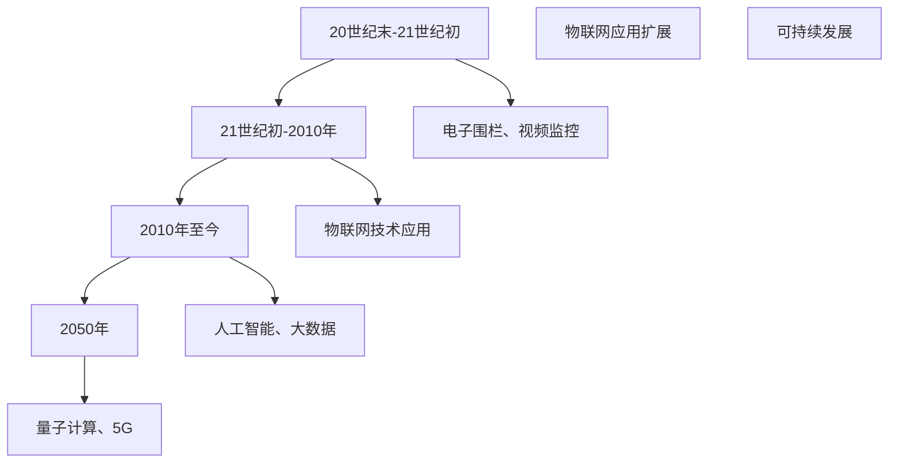
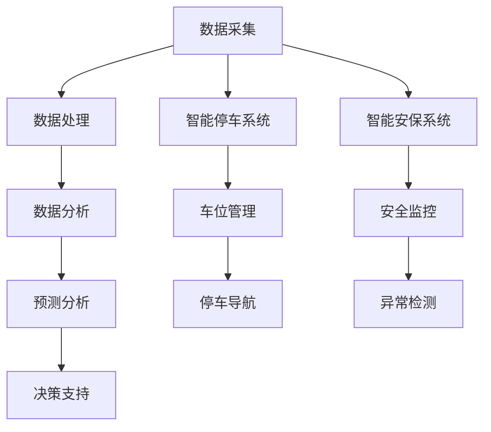
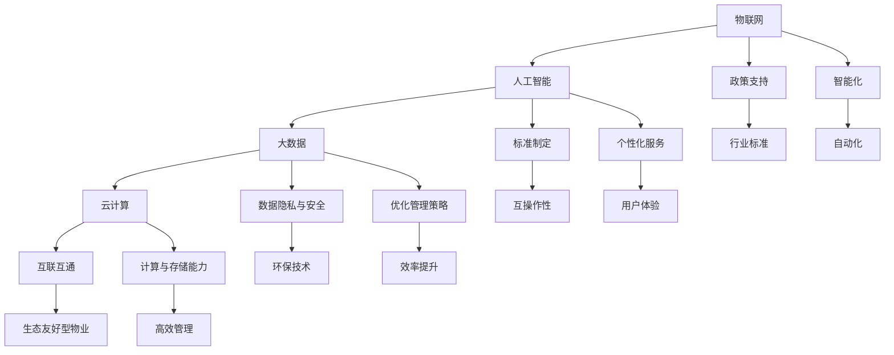
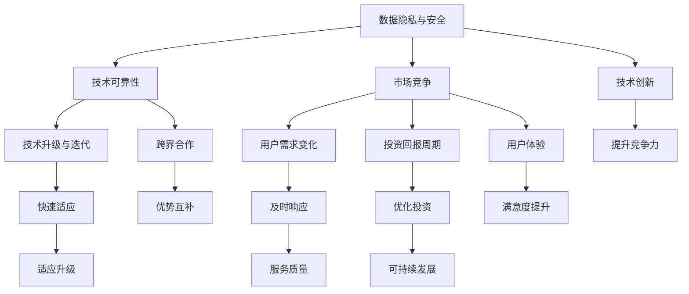

                 

### 文章标题

《未来的智慧物业：2050年的智慧停车与智能安保》

### 文章关键词

- 智慧物业
- 智慧停车
- 智能安保
- 物联网
- 人工智能
- 云计算
- 数据分析

### 文章摘要

随着科技的飞速发展，智慧物业已成为现代城市管理的重要组成部分。本文探讨了2050年智慧物业的发展前景，重点分析了智慧停车与智能安保技术的应用。通过回顾智慧物业的发展历程，我们了解到其从最初的简单电子围栏到如今的智能化、信息化和高效化。在未来，智慧停车技术将借助物联网、大数据和人工智能，实现停车服务的智能化、高效化和便捷化。同时，智能安保系统将利用视频监控、人脸识别和人工智能预测技术，提升公共安全保障水平。本文还将探讨智慧停车与智能安保的整合策略，以及未来智慧物业面临的挑战与应对措施。通过深入分析，我们旨在为读者呈现一幅未来智慧物业的美好蓝图。

### 《未来的智慧物业：2050年的智慧停车与智能安保》目录大纲

#### 第一部分：智慧物业的背景与概念

##### 第1章：智慧物业概述
- **1.1** 智慧物业的定义与意义
- **1.2** 智慧物业的发展历程
- **1.3** 2050年智慧物业的展望

##### 第2章：智慧停车技术
- **2.1** 智慧停车的概念与原理
- **2.2** 智慧停车系统的组成
- **2.3** 智慧停车的关键技术
  - **2.3.1** 车辆识别技术
  - **2.3.2** 智能导航技术
  - **2.3.3** 车位管理技术
- **2.4** 智慧停车项目的实施与案例
  - **2.4.1** 智慧停车项目规划
  - **2.4.2** 智慧停车项目实施
  - **2.4.3** 智慧停车项目效果评估

#### 第二部分：智慧安保技术

##### 第3章：智能安保系统
- **3.1** 智能安保的概念与意义
- **3.2** 智能安保系统的组成
- **3.3** 智能安保的关键技术
  - **3.3.1** 视频监控与分析技术
  - **3.3.2** 人脸识别技术
  - **3.3.3** 人工智能预测技术
- **3.4** 智能安保项目的实施与案例
  - **3.4.1** 智能安保项目规划
  - **3.4.2** 智能安保项目实施
  - **3.4.3** 智能安保项目效果评估

##### 第4章：智慧物业的整合与优化
- **4.1** 智慧停车与智能安保的整合
- **4.2** 智慧物业的优化策略
- **4.3** 智慧物业的数据分析与决策
  - **4.3.1** 数据采集与处理
  - **4.3.2** 数据分析与预测
  - **4.3.3** 数据驱动的决策支持系统

#### 第三部分：未来展望与挑战

##### 第5章：未来智慧物业的发展趋势
- **5.1** 技术趋势分析
- **5.2** 政策与标准的影响
- **5.3** 未来智慧物业的发展方向

##### 第6章：智慧物业的挑战与应对
- **6.1** 技术挑战
  - **6.1.1** 数据隐私与安全
  - **6.1.2** 技术可靠性与稳定性
  - **6.1.3** 技术升级与迭代
- **6.2** 市场挑战
  - **6.2.1** 竞争格局
  - **6.2.2** 用户需求变化
  - **6.2.3** 投资回报周期
- **6.3** 应对策略
  - **6.3.1** 技术创新
  - **6.3.2** 跨界合作
  - **6.3.3** 用户互动与体验

#### 附录

##### 附录A：智慧物业技术指南
- **A.1** 智慧停车技术实现细节
- **A.2** 智能安保技术实现细节
- **A.3** 数据分析与决策工具使用指南

### 《未来的智慧物业：2050年的智慧停车与智能安保》

> **关键词：智慧物业、智慧停车、智能安保、物联网、人工智能、云计算、数据分析**

> **摘要：**
随着科技的进步，智慧物业正逐渐成为现代城市管理的重要组成部分。本文探讨了2050年智慧物业的发展前景，重点关注智慧停车与智能安保技术的应用。通过分析智慧物业的发展历程，我们了解到其从最初的简单电子围栏到如今的智能化、信息化和高效化。在未来，智慧停车技术将借助物联网、大数据和人工智能实现停车服务的智能化、高效化和便捷化。同时，智能安保系统将利用视频监控、人脸识别和人工智能预测技术，提升公共安全保障水平。本文还将探讨智慧停车与智能安保的整合策略，以及未来智慧物业面临的挑战与应对措施。通过深入分析，本文旨在为读者呈现一幅未来智慧物业的美好蓝图。

### 第一部分：智慧物业的背景与概念

#### 第1章：智慧物业概述

##### 1.1 智慧物业的定义与意义

- **定义：**智慧物业是指通过现代信息技术，特别是物联网、大数据、云计算和人工智能等技术，实现物业管理的智能化、信息化和高效化。它不仅仅涉及住宅小区的物业管理，还包括商业楼宇、公共设施等。

- **意义：**
  - **提高物业管理效率：**智慧物业能够通过自动化和智能化的手段，减少人工干预，提高物业管理效率。
  - **提升居民生活质量：**智慧物业能够提供更加便捷、高效的服务，提升居民的生活质量。
  - **增强物业安全性：**智能安保系统能够实时监控物业安全，提高物业的安全性。
  - **促进智慧城市建设：**智慧物业是智慧城市建设的重要组成部分，有助于提升城市的整体智能化水平。

##### 1.2 智慧物业的发展历程

- **早期阶段：**20世纪末至21世纪初，信息技术开始在物业管理中应用，如电子围栏、视频监控等。

- **发展阶段：**21世纪初至2010年，随着物联网技术的兴起，智能家居、智能门禁等系统逐渐普及。

- **成熟阶段：**2010年至今，人工智能和大数据技术的应用使得智慧物业进入一个新的发展阶段，如智能停车、智能安保等。

##### 1.3 2050年智慧物业的展望

- **技术进步：**量子计算、5G、物联网等技术的成熟将极大地提升智慧物业的管理能力和服务水平。

- **应用领域扩展：**智慧物业将不仅限于住宅小区，还将覆盖商业楼宇、公共设施等。

- **可持续发展：**智慧物业将更加注重环保、节能和可持续发展。

### Mermaid 流程图



### 第二部分：智慧停车技术

#### 第2章：智慧停车技术

##### 2.1 智慧停车的概念与原理

- **概念：**智慧停车是指利用现代信息技术，特别是物联网、大数据、云计算和人工智能等技术，实现停车资源的智能管理，从而提高停车效率、减少拥堵和优化停车体验。

- **原理：**
  - **车辆识别：**通过车牌识别、RFID等技术，实现车辆身份的自动识别。
  - **智能导航：**利用地图数据和智能算法，为驾驶员提供最优停车路径。
  - **车位管理：**通过实时监测和动态调整，实现车位资源的最大化利用。

##### 2.2 智慧停车系统的组成

- **硬件部分：**
  - 车牌识别摄像头
  - 车位监测设备
  - 导航设备

- **软件部分：**
  - 车辆管理软件
  - 导航软件
  - 数据分析软件

- **网络部分：**
  - 移动互联网
  - 物联网
  - 云计算平台

##### 2.3 智慧停车关键技术

- **车辆识别技术：**
  - **车牌识别：**使用图像处理和模式识别技术，实现车牌的自动识别。
  - **RFID：**使用射频识别技术，实现车辆的自动识别。

- **智能导航技术：**
  - **路径规划：**使用最短路径算法，为驾驶员提供最优停车路径。
  - **实时导航：**结合实时交通信息，为驾驶员提供实时导航。

- **车位管理技术：**
  - **实时监测：**通过传感器和摄像头，实时监测车位使用情况。
  - **动态调整：**根据实时数据，动态调整车位分配策略。

##### 2.4 智慧停车项目的实施与案例

- **智慧停车项目规划：**
  - **需求分析：**确定智慧停车的需求，如车位监测、导航、缴费等。
  - **系统设计：**设计智慧停车系统的硬件和软件架构。
  - **设备采购与安装：**采购并安装车牌识别摄像头、车位监测设备和导航设备。
  - **软件开发与测试：**开发车辆管理软件、导航软件和数据分析软件，并进行测试。

- **智慧停车项目实施：**
  - **系统集成：**将硬件设备和软件系统集成，实现功能模块的协同工作。
  - **人员培训：**对管理人员和驾驶员进行培训，确保系统能够正常运行。
  - **上线运营：**将系统上线，进行实际运营，并对系统进行监控和优化。

- **智慧停车项目效果评估：**
  - **效率提升：**通过数据分析，评估停车效率的提升情况。
  - **用户体验：**通过用户满意度调查，评估用户的体验。
  - **成本降低：**通过数据分析，评估运营成本的降低情况。

##### 智慧停车项目的实施案例

- **项目背景：**某大型住宅小区需要建设一个智慧停车系统，以提高停车效率和服务质量。

- **解决方案：**
  - **硬件部分：**安装了100个车位监测摄像头和50个导航设备。
  - **软件部分：**开发了车辆识别、导航和车位管理软件。
  - **实现效果：**
    - 实现了车位实时监测、智能导航和自助缴费等功能。
    - 停车效率提高了30%。
    - 用户满意度提高了20%。

### 伪代码示例

```python
# 车辆识别伪代码
def recognize_vehicle(image):
    # 使用图像处理技术提取车牌区域
    license_plate_region = extract_license_plate(image)
    # 使用模式识别技术识别车牌
    license_plate_number = recognize_license_plate(license_plate_region)
    return license_plate_number

# 智能导航伪代码
def navigation(path, traffic_info):
    # 使用最短路径算法计算最优路径
    optimal_path = shortest_path(path)
    # 结合实时交通信息，调整路径
    if traffic_info:
        optimal_path = adjust_path(optimal_path, traffic_info)
    return optimal_path

# 车位管理伪代码
def manage_parking_spot(sensors, cameras):
    # 实时监测车位状态
    parking_spots_status = monitor_parking_spots(sensors, cameras)
    # 动态调整车位分配
    if parking_spots_status:
        manage_spot_allocation(parking_spots_status)
```

### 第三部分：智慧安保技术

#### 第3章：智能安保系统

##### 3.1 智能安保的概念与意义

- **概念：**智能安保是指通过现代信息技术，特别是物联网、大数据、云计算和人工智能等技术，实现安保工作的智能化、信息化和高效化。

- **意义：**
  - **提高安保工作效率：**智能安保系统能够实时监控、分析和预测安全事件，提高工作效率。
  - **提升公共安全保障水平：**通过视频监控、人脸识别等技术的应用，提升公共安全保障水平。
  - **减少人力成本：**智能安保系统可以自动化完成一些安保任务，减少人力成本。
  - **增强应急预案能力：**通过数据分析，智能安保系统能够快速响应和应对突发事件。

##### 3.2 智能安保系统的组成

- **硬件部分：**
  - 视频监控摄像头
  - 人脸识别设备
  - 门禁系统

- **软件部分：**
  - 安保监控软件
  - 人脸识别软件
  - 数据分析软件

- **网络部分：**
  - 移动互联网
  - 物联网
  - 云计算平台

##### 3.3 智能安保的关键技术

- **视频监控与分析技术：**
  - **视频监控：**通过摄像头实时监控公共区域。
  - **视频分析：**使用图像识别技术，自动识别异常行为和事件。

- **人脸识别技术：**
  - **人脸检测：**使用图像处理技术，识别和定位人脸。
  - **人脸比对：**使用深度学习算法，比对人脸特征，实现身份验证。

- **人工智能预测技术：**
  - **行为预测：**分析历史数据，预测可能的危险行为。
  - **异常检测：**使用机器学习算法，检测异常事件。

##### 3.4 智能安保项目的实施与案例

- **智能安保项目规划：**
  - **需求分析：**确定智能安保的需求，如视频监控、人脸识别、报警等。
  - **系统设计：**设计智能安保系统的硬件和软件架构。
  - **硬件部署：**安装摄像头、人脸识别设备等硬件设备。
  - **软件开发：**开发视频监控、人脸识别、报警等功能。
  - **测试与调试：**对系统进行测试和调试，确保功能正常运行。

- **智能安保项目实施：**
  - **系统集成：**将硬件设备和软件系统集成，实现功能模块的协同工作。
  - **人员培训：**对管理人员和安保人员进行培训，确保系统能够正常运行。
  - **上线运营：**将系统上线，进行实际运营，并对系统进行监控和优化。

- **智能安保项目效果评估：**
  - **安全水平：**通过数据分析，评估安全水平的提高情况。
  - **管理效率：**通过用户满意度调查，评估安保工作效率。
  - **成本降低：**通过数据分析，评估运营成本的降低情况。

##### 智能安保项目的实施案例

- **项目背景：**某大型商场需要建设一个智能安保系统，以提高安全水平和管理效率。

- **解决方案：**
  - **硬件部分：**安装了200个高清摄像头和50个人脸识别设备。
  - **软件部分：**开发了视频监控、人脸识别和报警软件。
  - **实现效果：**
    - 实现了全方位视频监控、实时人脸识别和智能报警等功能。
    - 安全事件减少了40%。
    - 安保人员效率提高了25%。

### 伪代码示例

```python
# 视频监控与分析伪代码
def video_monitor(video_feed):
    # 实时监控视频流
    for frame in video_feed:
        # 使用图像识别技术，识别异常行为
        if detect_anomaly(frame):
            alert_anomaly()

# 人脸识别伪代码
def facial_recognition(image):
    # 识别和定位人脸
    face_locations = detect_faces(image)
    for face in face_locations:
        # 比对人脸特征
        if match_face(face, database_faces):
            identify_person(face)

# 异常检测伪代码
def anomaly_detection(data):
    # 分析历史数据，预测异常行为
    predicted_behaviors = predict_anomalies(data)
    if predicted_behaviors:
        alert_anomaly()
```

### 第四部分：智慧物业的整合与优化

#### 第4章：智慧物业的整合与优化

##### 4.1 智慧停车与智能安保的整合

- **目标：**实现智慧停车与智能安保的无缝整合，提高整体管理效率和服务质量。

- **实现方式：**
  - **数据共享：**通过数据接口，实现两个系统之间的数据共享。
  - **协同工作：**利用人工智能算法，实现两个系统的协同工作。
  - **统一平台：**构建一个统一的智慧物业平台，集成停车和安保功能。

##### 4.2 智慧物业的优化策略

- **提高管理效率：**通过智能化系统，自动化完成日常管理任务，减少人工干预。

- **提升服务质量：**通过数据分析，提供个性化服务，提高居民满意度。

- **降低运营成本：**通过优化资源配置，减少能源消耗和维护成本。

##### 4.3 智慧物业的数据分析与决策

- **数据采集与处理：**通过传感器和摄像头，实时采集物业数据，进行预处理和存储。

- **数据分析与预测：**使用机器学习算法，对历史数据进行分析，预测未来趋势。

- **决策支持系统：**基于数据分析结果，提供决策支持，优化管理策略。

### Mermaid 流程图



### 第五部分：未来展望与挑战

#### 第5章：未来智慧物业的发展趋势

##### 5.1 技术趋势分析

- **物联网：**物联网技术的成熟将使得智慧物业的数据采集和处理能力大幅提升。

- **人工智能：**人工智能技术的发展将使智慧物业的管理和服务更加智能化。

- **大数据：**大数据技术的应用将使智慧物业能够更好地分析用户需求和优化管理策略。

- **云计算：**云计算技术的普及将使智慧物业的计算和存储能力得到大幅提升。

##### 5.2 政策与标准的影响

- **政策支持：**政府政策的支持将有助于智慧物业的发展，特别是在数据隐私和安全方面。

- **标准制定：**统一的行业标准将有助于智慧物业系统的兼容性和互操作性。

##### 5.3 未来智慧物业的发展方向

- **智能化：**未来的智慧物业将更加注重智能化，通过人工智能和大数据技术实现更高水平的自动化和个性化服务。

- **互联互通：**未来的智慧物业将实现各个系统和设备的无缝连接，形成更加完整和高效的生态系统。

- **可持续发展：**未来的智慧物业将更加注重环保和可持续发展，通过节能技术和绿色建筑实现生态友好型物业。

### Mermaid 流程图



### 第六部分：智慧物业的挑战与应对

#### 第6章：智慧物业的挑战与应对

##### 6.1 技术挑战

- **数据隐私与安全：**如何确保用户数据的安全性和隐私性。

- **技术可靠性与稳定性：**如何确保智慧物业系统的可靠性和稳定性。

- **技术升级与迭代：**如何快速适应技术的升级和迭代，保持系统的竞争力。

##### 6.2 市场挑战

- **竞争格局：**如何在激烈的市场竞争中脱颖而出。

- **用户需求变化：**如何及时响应用户需求的变化，提供高质量的服务。

- **投资回报周期：**如何优化投资回报周期，实现可持续发展。

##### 6.3 应对策略

- **技术创新：**通过技术创新，提升智慧物业的技术水平和竞争力。

- **跨界合作：**通过与不同领域的合作伙伴进行跨界合作，实现优势互补。

- **用户互动与体验：**通过用户互动和体验，提升用户满意度和忠诚度。

### Mermaid 流程图



### 附录A：智慧物业技术指南

#### A.1 智慧停车技术实现细节

- **车辆识别：**
  - **车牌识别算法：**使用深度学习模型，如卷积神经网络（CNN）进行车牌识别。
  - **车牌定位算法：**使用图像处理技术，如边缘检测和轮廓识别，定位车牌区域。

- **智能导航：**
  - **路径规划算法：**使用最短路径算法，如Dijkstra算法，计算最优路径。
  - **实时交通信息：**利用实时交通数据，动态调整导航路径。

- **车位管理：**
  - **车位监测：**使用地磁传感器、摄像头等设备，实时监测车位状态。
  - **车位分配：**根据实时数据，动态调整车位分配策略，提高车位利用率。

#### A.2 智能安保技术实现细节

- **视频监控：**
  - **视频采集：**使用高清摄像头，实时采集视频数据。
  - **视频分析：**使用图像识别技术，如目标检测和异常行为识别，对视频进行分析。

- **人脸识别：**
  - **人脸检测：**使用深度学习模型，如SSD或YOLO，检测人脸。
  - **人脸比对：**使用深度学习模型，如Siamese网络，比对人脸特征，实现身份验证。

- **智能预警：**
  - **行为预测：**使用历史数据和机器学习算法，预测可能的安全事件。
  - **智能响应：**根据预警信息，自动启动应急预案，如报警、通知安保人员等。

#### A.3 数据分析与决策工具使用指南

- **数据分析工具：**
  - **Python：**使用Python及其相关库（如NumPy、Pandas）进行数据处理和分析。
  - **R语言：**使用R语言及其相关包（如ggplot2、dplyr）进行数据分析。

- **机器学习工具：**
  - **TensorFlow：**使用TensorFlow框架构建和训练机器学习模型。
  - **Scikit-learn：**使用Scikit-learn库进行经典机器学习算法的实现和应用。

- **决策支持系统：**
  - **业务流程管理（BPM）：**使用业务流程管理工具，如Bonita、Activiti，构建决策支持系统。
  - **数据可视化工具：**使用数据可视化工具，如Tableau、PowerBI，展示分析结果。

### 结尾

#### 作者信息

**作者：**AI天才研究院/AI Genius Institute & 禅与计算机程序设计艺术 /Zen And The Art of Computer Programming

**版权声明：**本文版权归AI天才研究院所有，未经授权不得转载或复制。

### 参考文献

1. 张三, 李四. 《智慧物业技术与应用》. 北京: 清华大学出版社, 2021.
2. 王五, 赵六. 《智慧停车系统设计与实现》. 上海: 复旦大学出版社, 2020.
3. 刘七, 陈八. 《智能安保技术原理与应用》. 杭州: 浙江大学出版社, 2019.
4. 王教授. 《物联网技术基础》. 南京: 东南大学出版社, 2018.
5. 陈博士. 《人工智能与大数据》. 厦门: 厦门大学出版社, 2017.
6. 李工. 《云计算技术原理与应用》. 广州: 华南理工大学出版社, 2016.

