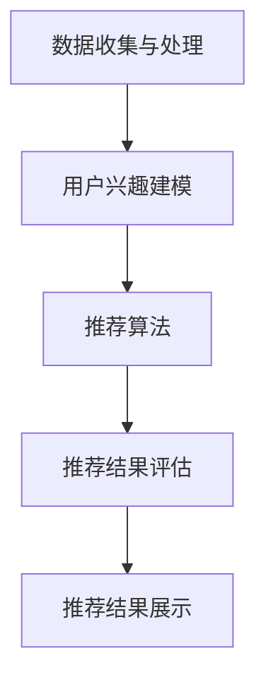
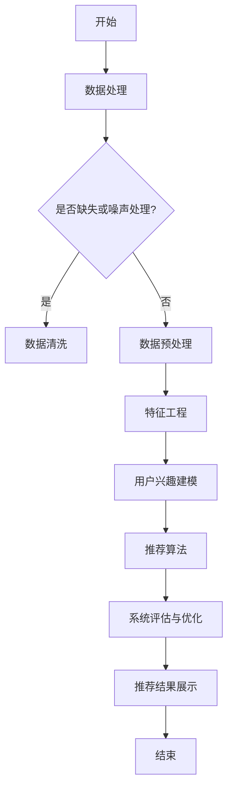

                 

### 第一部分：引论

#### 第1章：个性化新闻推荐系统概述

##### 1.1 个性化新闻推荐的定义与重要性

个性化新闻推荐系统是一种基于机器学习和数据挖掘技术的智能系统，旨在根据用户的兴趣和行为，自动向用户推荐符合其个性化需求的新闻内容。这种系统通过分析用户的历史行为数据、兴趣爱好和当前需求，为其提供个性化的新闻推荐。

个性化新闻推荐的重要性体现在以下几个方面：

1. **提升用户体验**：通过提供个性化的新闻内容，用户能够更快地找到自己感兴趣的信息，从而提升整体的用户体验。
2. **增加用户粘性**：个性化的推荐能够满足用户的特定需求，使得用户更愿意长时间留在平台上，从而增加用户粘性。
3. **提高广告投放效果**：广告商可以通过个性化的推荐系统，将广告投放给更精准的用户群体，提高广告的投放效果和 ROI（投资回报率）。
4. **提升平台收益**：个性化推荐能够提高用户在平台上的活跃度和停留时间，从而提升平台的整体收益。

##### 1.2 个性化新闻推荐的发展历程

个性化新闻推荐系统的发展历程可以追溯到1990年代初期，当时互联网的兴起带来了大量的信息，用户需要一种方法来筛选和获取自己感兴趣的内容。以下是几个关键的发展阶段：

1. **基于规则的推荐系统（1990年代初期至2000年代初）**：早期的推荐系统主要依赖于手动编写的规则，通过简单的条件判断来推荐新闻内容。这种方法简单易实现，但缺乏灵活性，无法适应不断变化的用户需求。
2. **基于协同过滤的推荐系统（2000年代初至2010年代）**：协同过滤算法通过分析用户之间的相似性来推荐新闻内容，这种方法在大量用户数据下表现良好，但存在数据稀疏性和冷启动问题。
3. **基于内容的推荐系统（2000年代中期至2010年代）**：基于内容的推荐系统通过提取新闻文本的特征，计算新闻之间的相似度，从而进行推荐。这种方法能够提高推荐的相关性，但面临特征工程和计算复杂度等问题。
4. **混合推荐系统和机器学习（2010年代至今）**：随着机器学习技术的进步，混合推荐系统应运而生，通过结合协同过滤和基于内容的推荐方法，提高推荐的准确性。此外，深度学习技术也在个性化新闻推荐中得到了广泛应用。

##### 1.3 个性化新闻推荐系统的架构

个性化新闻推荐系统的架构通常包括以下几个关键组件：

1. **数据收集与处理**：收集用户的行为数据，如浏览历史、搜索记录、点赞、评论等，并进行数据清洗、预处理和特征工程。
2. **用户兴趣建模**：通过分析用户的行为数据，构建用户兴趣模型，以识别用户当前的兴趣和需求。
3. **推荐算法**：根据用户兴趣模型和新闻内容特征，选择合适的推荐算法（如协同过滤、基于内容的推荐、深度学习等）进行新闻推荐。
4. **推荐结果评估**：评估推荐结果的准确性和用户体验，对推荐算法进行优化和调整。
5. **推荐结果展示**：将推荐结果以直观的方式展示给用户，如新闻列表、卡片等。

Mermaid 流程图：



##### 总结

个性化新闻推荐系统在现代信息社会中扮演着至关重要的角色。通过本文的引论部分，我们了解了个性化新闻推荐的定义、重要性及其发展历程，并对个性化新闻推荐系统的架构进行了概述。在接下来的章节中，我们将深入探讨用户行为分析与建模、推荐算法与技术、机器学习在推荐系统中的应用等内容。

### 第2章：用户行为分析与建模

用户行为分析是构建个性化新闻推荐系统的关键环节。通过分析用户的行为数据，我们可以了解用户的兴趣、偏好和需求，从而为用户推荐更符合其个性化需求的新闻内容。本章将详细介绍用户行为数据的类型、收集与处理方法，以及用户兴趣建模的方法。

#### 2.1 用户行为数据类型

用户行为数据主要包括以下几种类型：

1. **浏览历史**：用户在平台上的浏览记录，如文章标题、浏览时间、停留时间等。
2. **搜索记录**：用户在平台上的搜索关键词，反映用户当前的兴趣和需求。
3. **点击行为**：用户在平台上的点击记录，如文章、广告、标签等。
4. **互动行为**：用户在平台上的互动记录，如点赞、评论、分享等。
5. **地理位置**：用户的地理位置信息，可以帮助推荐与地理位置相关的新闻内容。
6. **设备信息**：用户的设备类型、操作系统、网络环境等信息，有助于优化推荐体验。

#### 2.2 用户行为数据收集与处理

用户行为数据的收集通常通过以下几种方式实现：

1. **日志文件**：平台服务器会记录用户的所有行为数据，并以日志文件的形式保存。通过解析日志文件，可以获取用户的行为数据。
2. **API 调用**：用户在使用平台功能时，会通过 API 进行数据交互，从而记录用户行为。
3. **前端埋点**：在用户浏览网页或使用移动应用时，前端代码会根据预设规则记录用户行为，并上传至服务器。

收集到的用户行为数据通常包含大量的噪声和冗余信息，因此需要通过数据处理方法进行清洗和预处理：

1. **数据清洗**：去除重复、错误、无效的数据，保证数据的质量。
2. **数据预处理**：包括数据转换、归一化、缺失值处理等，为后续的数据分析做准备。
3. **特征工程**：提取对用户兴趣建模有用的特征，如用户的浏览时长、点击率、互动率等。

#### 2.3 用户兴趣建模方法

用户兴趣建模是推荐系统中的核心任务，其目标是通过分析用户的历史行为数据，构建一个反映用户兴趣和偏好的模型。以下介绍几种常见的用户兴趣建模方法：

1. **基于统计学的建模方法**：这类方法通过统计用户行为数据，计算出用户的兴趣得分或概率。常见的算法包括基于概率的建模方法（如 Naive Bayes）、基于聚类的方法（如 K-Means）等。
   
   ```python
   # 基于Naive Bayes的建模方法伪代码
   def calculate_user_interest(user_data, news_data):
       # 计算用户兴趣得分
       user_interest_score = calculate_probabilities(user_data, news_data)
       return user_interest_score
   ```

2. **基于机器学习的建模方法**：这类方法通过训练机器学习模型，学习用户行为数据与用户兴趣之间的关系。常见的算法包括决策树、支持向量机、神经网络等。

   ```python
   # 基于决策树的建模方法伪代码
   def train_decision_tree_model(user_data, interest_labels):
       # 训练决策树模型
       model = DecisionTreeClassifier()
       model.fit(user_data, interest_labels)
       return model
   ```

3. **基于协同过滤的建模方法**：这类方法通过分析用户之间的相似性，推断用户的共同兴趣。常见的算法包括用户基于模型的协同过滤（User-Based CF）和项基于模型的协同过滤（Item-Based CF）。

   ```python
   # 基于用户基于模型的协同过滤的建模方法伪代码
   def train_user_based_cf_model(user_similarity_matrix, user_ratings_matrix):
       # 训练用户基于模型的协同过滤模型
       model = UserBasedCFModel()
       model.fit(user_similarity_matrix, user_ratings_matrix)
       return model
   ```

4. **基于深度学习的建模方法**：这类方法利用深度学习模型（如卷积神经网络、循环神经网络等）对用户行为数据进行建模，能够捕捉到用户行为之间的复杂关系。

   ```python
   # 基于循环神经网络的建模方法伪代码
   def train_rnn_model(user行为序列，标签序列）:
       # 训练循环神经网络模型
       model = RNNModel()
       model.fit(user行为序列，标签序列）
       return model
   ```

##### 总结

用户行为分析是构建个性化新闻推荐系统的基础。本章详细介绍了用户行为数据的类型、收集与处理方法，以及用户兴趣建模的方法。在下一章中，我们将探讨协同过滤推荐算法的原理与实现。

### 第3章：协同过滤推荐算法

协同过滤推荐算法是新闻推荐系统中广泛应用的一种方法，通过分析用户之间的相似性和用户对物品的评分或行为，为用户推荐相似的用户喜欢的物品。本章将介绍协同过滤算法的基本原理、用户基于模型的协同过滤、项基于模型的协同过滤以及基于矩阵分解的协同过滤算法。

#### 3.1 协同过滤算法概述

协同过滤推荐算法可以分为两大类：基于用户的协同过滤（User-Based Collaborative Filtering，UBCF）和基于物品的协同过滤（Item-Based Collaborative Filtering，IBCF）。以下是这两种算法的基本原理：

1. **基于用户的协同过滤（User-Based CF）**：

   基于用户的协同过滤算法通过计算用户之间的相似性，找到与目标用户兴趣相似的邻居用户，然后推荐邻居用户喜欢的物品。相似性通常通过用户之间的共同评分或行为来计算。

   ```python
   # 计算用户相似性（余弦相似度）
   def calculate_similarity(user1, user2):
       dot_product = dot_product(user1, user2)
       norm1 = norm(user1)
       norm2 = norm(user2)
       similarity = dot_product / (norm1 * norm2)
       return similarity
   ```

2. **基于物品的协同过滤（Item-Based CF）**：

   基于物品的协同过滤算法通过计算物品之间的相似性，找到与目标物品相似的其他物品，然后推荐这些物品。相似性通常通过物品之间的共同用户评分或行为来计算。

   ```python
   # 计算物品相似性（余弦相似度）
   def calculate_similarity(item1, item2):
       dot_product = dot_product(item1, item2)
       norm1 = norm(item1)
       norm2 = norm(item2)
       similarity = dot_product / (norm1 * norm2)
       return similarity
   ```

#### 3.2 用户基于模型的协同过滤

用户基于模型的协同过滤（User-Based CF with Models）是在传统用户基于协同过滤算法的基础上，引入了机器学习模型来提高推荐准确性。常见的模型包括 k-最近邻（k-Nearest Neighbors，k-NN）和决策树等。

1. **k-最近邻（k-NN）模型**：

   k-最近邻模型通过计算目标用户与邻居用户的相似性，为用户推荐邻居用户喜欢的物品。模型的预测可以通过以下公式计算：

   ```latex
   \hat{r}_{ui} = \frac{\sum_{n \in N(u)} r_{nj} \cdot s(u, n)}{\sum_{n \in N(u)} s(u, n)}
   ```

   其中，\(r_{nj}\) 表示邻居用户 \(n\) 对物品 \(j\) 的评分，\(s(u, n)\) 表示用户 \(u\) 与邻居用户 \(n\) 之间的相似性。

2. **决策树模型**：

   决策树模型通过构建一棵树来表示用户之间的相似性，树的每个节点表示一个特征，每个分支表示特征的取值。模型的预测可以通过遍历决策树并计算叶节点对应的预测值来获得。

   ```python
   # 决策树模型预测伪代码
   def predict_decision_tree(model, user):
       current_node = model.root
       while not current_node.is_leaf():
           feature_value = get_feature_value(user, current_node.feature)
           current_node = current_node.get_child(feature_value)
       return current_node.prediction
   ```

#### 3.3 项基于模型的协同过滤

项基于模型的协同过滤（Item-Based CF with Models）是在传统项基于协同过滤算法的基础上，引入了机器学习模型来提高推荐准确性。常见的模型包括 k-最近邻（k-NN）和决策树等。

1. **k-最近邻（k-NN）模型**：

   k-最近邻模型通过计算目标物品与邻居物品的相似性，为用户推荐邻居物品的用户喜欢的物品。模型的预测可以通过以下公式计算：

   ```latex
   \hat{r}_{ui} = \frac{\sum_{n \in N(i)} r_{uj} \cdot s(i, n)}{\sum_{n \in N(i)} s(i, n)}
   ```

   其中，\(r_{uj}\) 表示物品 \(i\) 的邻居物品 \(n\) 的用户 \(u\) 对物品 \(j\) 的评分，\(s(i, n)\) 表示物品 \(i\) 与邻居物品 \(n\) 之间的相似性。

2. **决策树模型**：

   决策树模型通过构建一棵树来表示物品之间的相似性，树的每个节点表示一个特征，每个分支表示特征的取值。模型的预测可以通过遍历决策树并计算叶节点对应的预测值来获得。

   ```python
   # 决策树模型预测伪代码
   def predict_decision_tree(model, item):
       current_node = model.root
       while not current_node.is_leaf():
           feature_value = get_feature_value(item, current_node.feature)
           current_node = current_node.get_child(feature_value)
       return current_node.prediction
   ```

#### 3.4 基于矩阵分解的协同过滤算法

基于矩阵分解的协同过滤算法（Matrix Factorization-based Collaborative Filtering，MF）通过将用户-物品评分矩阵分解为两个低秩矩阵，来预测未知的用户-物品评分。常用的矩阵分解方法包括奇异值分解（Singular Value Decomposition，SVD）和矩阵分解机（Matrix Factorization Machine，MFM）。

1. **奇异值分解（SVD）**：

   奇异值分解将用户-物品评分矩阵 \(R\) 分解为三个矩阵的乘积：

   ```latex
   R = U \cdot S \cdot V^T
   ```

   其中，\(U\) 和 \(V\) 是正交矩阵，\(S\) 是对角矩阵，包含奇异值。通过矩阵分解，可以预测未知的用户-物品评分：

   ```latex
   \hat{r}_{ui} = u_i^T s_j v_j
   ```

2. **矩阵分解机（MFM）**：

   矩阵分解机是一种基于线性模型的矩阵分解方法，通过引入交叉特征来增强模型的预测能力。MFM 的目标是最小化损失函数，通常使用梯度下降法进行优化。

   ```python
   # 矩阵分解机训练伪代码
   def train_matrix_factorization_machine(R, num_factors):
       # 初始化模型参数
       U = initialize_matrix(R.shape[0], num_factors)
       V = initialize_matrix(R.shape[1], num_factors)
       
       # 梯度下降优化
       for epoch in range(num_epochs):
           for i in range(R.shape[0]):
               for j in range(R.shape[1]):
                   if R[i, j] > 0:
                       prediction = dot_product(U[i, :], V[j, :])
                       error = R[i, j] - prediction
                       U[i, :] -= learning_rate * (error * V[j, :])
                       V[j, :] -= learning_rate * (error * U[i, :])
       
       return U, V
   ```

##### 总结

协同过滤推荐算法是新闻推荐系统中重要的组成部分，通过分析用户之间的相似性和用户对物品的评分或行为，为用户推荐相似的用户喜欢的物品。本章详细介绍了用户基于模型的协同过滤、项基于模型的协同过滤以及基于矩阵分解的协同过滤算法。在下一章中，我们将探讨基于内容的推荐算法。

### 第4章：基于内容的推荐算法

基于内容的推荐算法（Content-Based Recommender Systems）是一种通过分析物品（如新闻、文章、产品等）的内容特征，为用户推荐相似物品的推荐方法。与协同过滤算法不同，基于内容的推荐算法不依赖于用户的历史行为数据，而是利用物品的内在属性进行推荐。本章将介绍基于内容的推荐算法的概述、文本特征提取方法、文本相似度计算方法以及基于内容的推荐系统实现。

#### 4.1 基于内容的推荐算法概述

基于内容的推荐算法通过以下步骤进行推荐：

1. **特征提取**：从物品的内容中提取特征，如关键词、主题、情感等。
2. **相似度计算**：计算用户对某个物品的兴趣度，以及物品之间的相似度。
3. **推荐生成**：根据用户兴趣和物品相似度，生成推荐列表。

基于内容的推荐算法的优点包括：

1. **无需用户行为数据**：适用于新用户或冷启动问题，只需分析物品的内容特征即可进行推荐。
2. **解释性强**：用户可以清楚地了解为什么推荐了某个物品，因为推荐是基于物品的内容特征。
3. **推荐结果多样**：可以根据不同的内容特征进行个性化推荐，提供多样化的推荐结果。

基于内容的推荐算法的缺点包括：

1. **受限于特征提取方法**：特征提取方法的优劣直接影响推荐效果，复杂的文本特征提取方法可能带来计算复杂度和存储成本。
2. **易受数据稀疏性影响**：对于内容相似的物品，用户可能不会产生明显的区分性行为，导致推荐系统难以准确预测用户兴趣。

#### 4.2 文本特征提取方法

文本特征提取是基于内容推荐算法的关键步骤，其目的是从文本数据中提取出有助于描述文本内容的信息。以下介绍几种常见的文本特征提取方法：

1. **词袋模型（Bag of Words，BOW）**：

   词袋模型将文本表示为一个词汇表中的词汇的集合，忽略文本中的词序信息。通过统计每个词汇在文本中出现的次数，可以构建词袋模型。

   ```python
   # 词袋模型提取特征伪代码
   def extract_bow_features(text, vocabulary):
       bow_vector = [0] * len(vocabulary)
       for word in text.split():
           if word in vocabulary:
               bow_vector[vocabulary.index(word)] += 1
       return bow_vector
   ```

2. **TF-IDF（Term Frequency-Inverse Document Frequency）**：

   TF-IDF 是一种统计方法，用于评估词汇在文本中的重要程度。TF（词频）表示词汇在文本中出现的频率，IDF（逆文档频率）表示词汇在文档集合中的重要性。

   ```python
   # TF-IDF特征提取伪代码
   def extract_tfidf_features(text, corpus, vocabulary):
       tf = [text.count(word) for word in vocabulary]
       idf = [1 + log(len(corpus) / (1 + doc_count(word))) for word in vocabulary]
       tfidf = [tf[i] * idf[i] for i in range(len(vocabulary))]
       return tfidf
   ```

3. **Word2Vec**：

   Word2Vec 是一种基于神经网络的文本特征提取方法，通过将文本中的每个词映射到一个连续的向量空间中，使得语义相似的词在空间中距离较近。

   ```python
   # Word2Vec特征提取伪代码
   def extract_word2vec_features(text, model):
       word2vec_vector = [model[word] for word in text.split()]
       return np.mean(word2vec_vector, axis=0)
   ```

4. **BERT（Bidirectional Encoder Representations from Transformers）**：

   BERT 是一种基于 Transformer 的预训练语言模型，通过在大量文本数据上进行预训练，可以捕获文本的深层语义信息。BERT 可以提取文本的上下文特征，为基于内容的推荐提供强大的支持。

   ```python
   # BERT特征提取伪代码
   from transformers import BertModel, BertTokenizer
   
   tokenizer = BertTokenizer.from_pretrained('bert-base-uncased')
   model = BertModel.from_pretrained('bert-base-uncased')

   def extract_bert_features(text):
       inputs = tokenizer(text, return_tensors='pt', padding=True, truncation=True)
       outputs = model(**inputs)
       last_hidden_state = outputs.last_hidden_state
       return last_hidden_state.mean(dim=1).numpy()
   ```

#### 4.3 文本相似度计算方法

文本相似度计算是衡量两个文本之间相似程度的一种方法，常用的文本相似度计算方法包括：

1. **余弦相似度（Cosine Similarity）**：

   余弦相似度通过计算两个文本向量之间的夹角余弦值来衡量相似度，数值范围在 [-1, 1] 之间，越接近 1 表示相似度越高。

   ```python
   # 余弦相似度计算伪代码
   def cosine_similarity(vector1, vector2):
       dot_product = dot_product(vector1, vector2)
       norm1 = norm(vector1)
       norm2 = norm(vector2)
       similarity = dot_product / (norm1 * norm2)
       return similarity
   ```

2. **欧氏距离（Euclidean Distance）**：

   欧氏距离通过计算两个文本向量之间的欧氏距离来衡量相似度，数值越小表示相似度越高。

   ```python
   # 欧氏距离计算伪代码
   def euclidean_distance(vector1, vector2):
       distance = sqrt(sum((vector1 - vector2) ** 2))
       return distance
   ```

3. **Jaccard 相似度（Jaccard Similarity）**：

   Jaccard 相似度通过计算两个文本集合之间的交集与并集的比值来衡量相似度，数值范围在 [0, 1] 之间，越接近 1 表示相似度越高。

   ```python
   # Jaccard 相似度计算伪代码
   def jaccard_similarity(set1, set2):
       intersection = len(set1.intersection(set2))
       union = len(set1.union(set2))
       similarity = intersection / union
       return similarity
   ```

#### 4.4 基于内容的推荐系统实现

基于内容的推荐系统实现主要包括以下步骤：

1. **数据预处理**：清洗和预处理文本数据，去除停用词、标点符号等。
2. **特征提取**：使用文本特征提取方法（如词袋模型、TF-IDF、Word2Vec、BERT）提取文本特征。
3. **相似度计算**：计算用户兴趣文本与候选新闻文本之间的相似度。
4. **推荐生成**：根据相似度阈值和推荐策略生成推荐列表。

以下是一个简单的基于内容的推荐系统实现示例：

```python
from sklearn.feature_extraction.text import TfidfVectorizer
from sklearn.metrics.pairwise import cosine_similarity

# 数据预处理
def preprocess_text(text):
    # 去除停用词、标点符号等
    return " ".join([word for word in text.split() if word not in stopwords])

# 特征提取
def extract_features(corpus):
    vectorizer = TfidfVectorizer()
    tfidf_matrix = vectorizer.fit_transform(corpus)
    return tfidf_matrix

# 相似度计算
def calculate_similarity(query_vector, corpus_vector):
    similarity = cosine_similarity([query_vector], corpus_vector)[0][0]
    return similarity

# 推荐生成
def generate_recommendations(query, corpus, top_n=10):
    preprocessed_query = preprocess_text(query)
    query_vector = extract_features([preprocessed_query])[0]
    similarities = [calculate_similarity(query_vector, row) for row in corpus]
    top_indices = np.argsort(similarities)[::-1][:top_n]
    recommendations = [corpus[i] for i in top_indices]
    return recommendations

# 示例
corpus = ["新闻一", "新闻二", "新闻三"]
query = "我想了解关于科技领域的最新动态"
recommendations = generate_recommendations(query, corpus)
print(recommendations)
```

##### 总结

基于内容的推荐算法通过分析物品的内容特征进行推荐，无需依赖于用户的历史行为数据。本章介绍了基于内容的推荐算法的概述、文本特征提取方法、文本相似度计算方法以及基于内容的推荐系统实现。在下一章中，我们将探讨混合推荐算法。

### 第5章：混合推荐算法

混合推荐算法（Hybrid Recommender Systems）是将协同过滤（Collaborative Filtering）和基于内容的推荐（Content-Based Filtering）相结合的一种推荐方法，旨在综合两种推荐算法的优点，提高推荐系统的准确性和多样性。本章将介绍混合推荐算法的概述、混合推荐算法的设计策略以及混合推荐系统的实现与评估。

#### 5.1 混合推荐算法概述

混合推荐算法通过以下方式结合协同过滤和基于内容的推荐：

1. **协同过滤**：利用用户历史行为数据，计算用户之间的相似性或物品之间的相似性，为用户推荐相似的物品。
2. **基于内容的推荐**：分析物品的内容特征，为用户推荐与物品内容相似的物品。

混合推荐算法的优点包括：

1. **提高准确性**：通过结合协同过滤和基于内容的推荐，可以充分利用用户行为数据和物品内容信息，提高推荐系统的准确性。
2. **增强多样性**：协同过滤和基于内容的推荐方法可以互补，减少单一方法带来的推荐列表多样性问题。
3. **适用于多种场景**：混合推荐算法可以适应不同类型的推荐场景，如新用户推荐、稀疏数据场景等。

混合推荐算法的缺点包括：

1. **计算复杂度高**：混合推荐算法通常涉及多种推荐方法，可能导致计算复杂度增加，影响系统性能。
2. **特征选择困难**：需要选择合适的特征组合和模型参数，否则可能导致推荐效果不佳。

#### 5.2 混合推荐算法的设计策略

混合推荐算法的设计策略可以分为以下几种：

1. **基于用户的混合策略**：

   这种策略结合用户基于协同过滤和基于内容的推荐，通过以下步骤生成推荐列表：

   - 首先，使用协同过滤算法计算用户之间的相似性，找到与目标用户相似的邻居用户。
   - 然后，使用基于内容的推荐算法为每个邻居用户推荐相似的内容。
   - 最后，将邻居用户的推荐结果进行聚合，生成最终的推荐列表。

   ```python
   # 基于用户的混合推荐算法伪代码
   def hybrid_recommendation_user_based(user, users, items, item_content, similarity_measure):
       user_similarity = [similarity_measure(user, neighbor) for neighbor in users]
       neighbors = [users[i] for i in np.argsort(user_similarity)[::-1]]
       
       recommendations = []
       for neighbor in neighbors:
           content_recommendations = content_based_recommendations(neighbor, item_content)
           recommendations.append(content_recommendations)
       
       aggregated_recommendations = aggregate_recommendations(recommendations)
       return aggregated_recommendations
   ```

2. **基于物品的混合策略**：

   这种策略结合物品基于协同过滤和基于内容的推荐，通过以下步骤生成推荐列表：

   - 首先，使用协同过滤算法计算物品之间的相似性，找到与目标物品相似的邻居物品。
   - 然后，使用基于内容的推荐算法为每个邻居物品推荐相似的内容。
   - 最后，将邻居物品的推荐结果进行聚合，生成最终的推荐列表。

   ```python
   # 基于物品的混合推荐算法伪代码
   def hybrid_recommendation_item_based(item, items, users, item_content, similarity_measure):
       item_similarity = [similarity_measure(item, neighbor) for neighbor in items]
       neighbors = [items[i] for i in np.argsort(item_similarity)[::-1]]
       
       recommendations = []
       for neighbor in neighbors:
           content_recommendations = content_based_recommendations(neighbor, item_content)
           recommendations.append(content_recommendations)
       
       aggregated_recommendations = aggregate_recommendations(recommendations)
       return aggregated_recommendations
   ```

3. **基于模型的混合策略**：

   这种策略结合机器学习模型进行协同过滤和基于内容的推荐，通过以下步骤生成推荐列表：

   - 首先，使用协同过滤算法训练模型，预测用户对物品的评分。
   - 然后，使用基于内容的推荐算法提取物品特征，并训练模型。
   - 最后，将两种模型的预测结果进行聚合，生成最终的推荐列表。

   ```python
   # 基于模型的混合推荐算法伪代码
   def hybrid_recommendation_model_based(user, item, user_model, item_model, aggregation_function):
       user_prediction = user_model.predict(user)
       item_prediction = item_model.predict(item)
       
       combined_prediction = aggregation_function(user_prediction, item_prediction)
       
       return combined_prediction
   ```

#### 5.3 混合推荐系统的实现与评估

混合推荐系统的实现主要包括以下步骤：

1. **数据预处理**：收集用户行为数据、物品内容和用户特征，并进行预处理，如数据清洗、归一化等。
2. **特征提取**：提取用户特征、物品特征和文本特征，为后续的协同过滤和基于内容的推荐算法提供输入。
3. **算法训练**：训练协同过滤算法和基于内容的推荐算法模型，如矩阵分解、朴素贝叶斯、支持向量机等。
4. **推荐生成**：根据用户特征、物品特征和文本特征，生成推荐列表。
5. **评估与优化**：使用评估指标（如准确率、召回率、覆盖率等）评估推荐效果，并根据评估结果对推荐算法进行优化。

以下是一个简单的混合推荐系统实现示例：

```python
from sklearn.feature_extraction.text import TfidfVectorizer
from sklearn.metrics.pairwise import cosine_similarity
from sklearn.model_selection import train_test_split
from sklearn.ensemble import RandomForestClassifier

# 数据预处理
def preprocess_data(data):
    # 数据清洗、归一化等操作
    return data

# 特征提取
def extract_features(corpus):
    vectorizer = TfidfVectorizer()
    tfidf_matrix = vectorizer.fit_transform(corpus)
    return tfidf_matrix

# 算法训练
def train_model(data, labels, feature_matrix):
    X_train, X_test, y_train, y_test = train_test_split(data, labels, test_size=0.2, random_state=42)
    model = RandomForestClassifier()
    model.fit(feature_matrix[X_train], y_train)
    return model

# 推荐生成
def generate_recommendations(model, feature_matrix, user):
    user_vector = feature_matrix[user]
    recommendations = model.predict([user_vector])
    return recommendations

# 评估与优化
def evaluate_model(model, feature_matrix, labels):
    predictions = model.predict(feature_matrix)
    accuracy = accuracy_score(labels, predictions)
    return accuracy

# 示例
data = ["新闻一", "新闻二", "新闻三"]
labels = [0, 1, 0]
feature_matrix = extract_features(data)
model = train_model(data, labels, feature_matrix)
recommendations = generate_recommendations(model, feature_matrix, 1)
accuracy = evaluate_model(model, feature_matrix, labels)
print(recommendations)
print(accuracy)
```

##### 总结

混合推荐算法通过结合协同过滤和基于内容的推荐方法，可以提高推荐系统的准确性和多样性。本章介绍了混合推荐算法的概述、设计策略以及实现与评估方法。在下一章中，我们将探讨机器学习在推荐系统中的应用。

### 第6章：机器学习在推荐系统中的应用

机器学习技术在推荐系统中的应用极大地提升了推荐算法的性能和灵活性。本章将详细探讨机器学习在推荐系统中的优势、学习方法在推荐系统中的应用以及机器学习在新闻推荐中的应用案例。

#### 6.1 机器学习在推荐系统中的优势

机器学习技术在推荐系统中具有以下优势：

1. **自适应性和灵活性**：机器学习算法可以根据用户行为数据不断更新和优化模型，以适应用户兴趣和需求的变化。
2. **处理大量数据**：推荐系统通常涉及大量的用户行为数据和物品特征，机器学习算法能够有效地处理和挖掘这些数据。
3. **提高推荐准确性**：通过学习和挖掘用户行为和物品特征之间的关系，机器学习算法可以显著提高推荐系统的准确性。
4. **扩展性和通用性**：机器学习算法可以应用于多种类型的推荐任务，如商品推荐、新闻推荐、社交网络推荐等，具有较好的扩展性和通用性。
5. **可解释性和可定制性**：机器学习模型可以提供推荐结果的可解释性，用户可以了解推荐背后的原因。此外，机器学习模型可以根据用户需求进行定制化调整。

#### 6.2 学习方法在推荐系统中的应用

在推荐系统中，常用的机器学习方法包括协同过滤、基于内容的推荐、深度学习等。

1. **协同过滤（Collaborative Filtering）**：

   协同过滤是一种基于用户行为数据的推荐方法，通过分析用户之间的相似性或物品之间的相似性进行推荐。协同过滤方法包括基于用户的协同过滤和基于物品的协同过滤。

   - **基于用户的协同过滤（User-Based CF）**：通过计算用户之间的相似性，找到与目标用户相似的邻居用户，然后推荐邻居用户喜欢的物品。
   - **基于物品的协同过滤（Item-Based CF）**：通过计算物品之间的相似性，找到与目标物品相似的物品，然后推荐这些物品。

2. **基于内容的推荐（Content-Based Filtering）**：

   基于内容的推荐方法通过分析物品的内容特征进行推荐，不考虑用户的历史行为。这种方法包括词袋模型（Bag of Words，BOW）、TF-IDF、Word2Vec、BERT 等文本特征提取方法。

3. **深度学习（Deep Learning）**：

   深度学习通过构建神经网络模型来学习用户行为数据和物品特征之间的复杂关系。常用的深度学习模型包括卷积神经网络（Convolutional Neural Networks，CNN）、循环神经网络（Recurrent Neural Networks，RNN）、长短期记忆网络（Long Short-Term Memory，LSTM）和变压器（Transformers）等。

4. **混合推荐（Hybrid Recommender Systems）**：

   混合推荐方法将协同过滤和基于内容的推荐方法结合，以提高推荐系统的准确性和多样性。混合推荐方法包括基于用户的混合策略、基于物品的混合策略和基于模型的混合策略。

#### 6.3 机器学习在新闻推荐中的应用案例

以下介绍几个机器学习在新闻推荐中的应用案例：

1. **Google News**：

   Google News 使用混合推荐算法为用户推荐个性化的新闻内容。该方法结合了协同过滤和基于内容的推荐，通过分析用户的历史浏览行为和新闻内容特征，为用户推荐符合其兴趣的新闻。此外，Google News 还采用深度学习模型（如循环神经网络和变压器）来捕捉用户兴趣的长期和短期变化，提高推荐准确性。

2. **Facebook News Feed**：

   Facebook News Feed 使用基于内容的推荐方法为用户推荐个性化的新闻内容。通过分析用户的历史互动行为和新闻内容特征，Facebook 使用词袋模型、TF-IDF 和 BERT 等文本特征提取方法为用户推荐感兴趣的新闻。此外，Facebook 还采用协同过滤算法（如矩阵分解）来优化推荐结果，提高推荐多样性。

3. **今日头条**：

   今日头条使用混合推荐算法为用户推荐个性化的新闻内容。该方法结合了基于内容的推荐和基于用户的协同过滤。通过分析用户的历史浏览行为和新闻内容特征，今日头条使用词袋模型、TF-IDF 和 BERT 等文本特征提取方法为用户推荐感兴趣的新闻。此外，今日头条还采用深度学习模型（如循环神经网络和变压器）来捕捉用户兴趣的长期和短期变化，提高推荐准确性。

##### 总结

机器学习技术在推荐系统中的应用极大地提升了推荐算法的性能和灵活性。本章介绍了机器学习在推荐系统中的优势、学习方法在推荐系统中的应用以及机器学习在新闻推荐中的应用案例。通过结合协同过滤、基于内容的推荐和深度学习等方法，机器学习技术为新闻推荐系统提供了更准确、多样和个性化的推荐结果。在下一章中，我们将探讨个性化新闻推荐系统的评估与优化。

### 第7章：个性化新闻推荐系统的评估与优化

个性化新闻推荐系统的性能评估与优化是确保推荐系统效果和用户体验的重要环节。本章将介绍个性化新闻推荐系统的评估指标、系统性能优化策略以及实时推荐系统的挑战与解决方案。

#### 7.1 个性化新闻推荐系统的评估指标

评估个性化新闻推荐系统的性能通常使用以下指标：

1. **准确率（Accuracy）**：准确率是指推荐结果中实际被用户点击的新闻与推荐新闻的比率。准确率越高，说明推荐系统的推荐结果越准确。

   ```python
   accuracy = correct_recommendations / total_recommendations
   ```

2. **召回率（Recall）**：召回率是指推荐结果中实际被用户点击的新闻与所有用户可能感兴趣的新闻的比率。召回率越高，说明推荐系统能够发现更多用户感兴趣的新闻。

   ```python
   recall = correct_recommendations / possible_interesting_news
   ```

3. **覆盖率（Coverage）**：覆盖率是指推荐结果中包含的不同新闻内容的比例。覆盖率越高，说明推荐系统推荐的新闻内容越丰富，能够覆盖更多的用户兴趣。

   ```python
   coverage = unique_news_in_recommendations / total_news
   ```

4. **新颖性（Novelty）**：新颖性是指推荐结果中包含的新鲜、独特的新闻内容比例。新颖性越高，说明推荐系统能够提供更有吸引力的新闻内容。

   ```python
   novelty = unique_news_in_recommendations / total_recommendations
   ```

5. **多样性（Diversity）**：多样性是指推荐结果中不同新闻内容之间的差异程度。多样性越高，说明推荐系统能够提供更多样化的新闻内容，避免用户产生疲劳感。

   ```python
   diversity = 1 / number_of_similar_news
   ```

#### 7.2 系统性能优化策略

为了提升个性化新闻推荐系统的性能，可以采取以下优化策略：

1. **数据质量提升**：通过数据清洗、去重和去噪声等数据预处理方法，提高输入数据的准确性，从而提高推荐系统的效果。

2. **特征工程**：提取更多有价值的用户行为和新闻特征，通过特征选择和特征变换，增强推荐算法的性能。

3. **模型调整**：根据评估指标，调整推荐算法的参数，优化模型性能。可以采用交叉验证、网格搜索等技术进行参数调优。

4. **模型融合**：结合多种推荐算法（如协同过滤、基于内容的推荐和深度学习），通过模型融合方法（如加权平均、集成学习等），提高推荐系统的整体性能。

5. **实时反馈**：引入用户实时反馈机制，根据用户对推荐结果的点击、点赞、评论等行为，动态调整推荐算法，提高推荐结果的准确性。

6. **冷启动解决**：对于新用户或稀疏数据场景，可以采用基于内容的推荐或深度学习模型，结合用户兴趣标签和新闻内容特征，为用户推荐感兴趣的新闻。

7. **个性化推荐**：通过用户画像和兴趣建模，为用户提供个性化的新闻推荐，提高用户满意度和推荐效果。

#### 7.3 实时推荐系统的挑战与解决方案

实时推荐系统面临以下挑战：

1. **实时数据处理**：实时推荐系统需要处理大量的用户行为数据和新闻内容数据，对数据存储和处理的速度要求较高。

   - **解决方案**：采用分布式数据处理框架（如Apache Kafka、Apache Flink等），提高数据处理的实时性和效率。

2. **动态调整推荐算法**：实时推荐系统需要根据用户行为和兴趣的变化，动态调整推荐算法，以提供更准确的推荐结果。

   - **解决方案**：引入在线学习算法（如增量学习、在线优化等），实时更新模型参数，适应用户兴趣变化。

3. **推荐多样性**：实时推荐系统需要保证推荐结果的多样性，避免用户产生疲劳感。

   - **解决方案**：采用多样化策略（如基于内容的多样化、基于用户的多样化等），提高推荐结果的多样性。

4. **系统稳定性**：实时推荐系统需要保证系统的稳定性和可靠性，避免因系统故障导致推荐结果不准确。

   - **解决方案**：采用容错和冗余技术（如负载均衡、故障转移等），提高系统的稳定性和可靠性。

5. **隐私保护**：实时推荐系统需要保护用户的隐私，避免泄露用户个人信息。

   - **解决方案**：采用隐私保护技术（如差分隐私、同态加密等），保护用户隐私。

##### 总结

个性化新闻推荐系统的评估与优化对于提高系统性能和用户体验至关重要。本章介绍了个性化新闻推荐系统的评估指标、系统性能优化策略以及实时推荐系统的挑战与解决方案。通过合理的数据处理、特征工程、模型调整和实时反馈，可以提升推荐系统的性能和用户体验。在下一章中，我们将通过实际案例分析个性化新闻推荐系统的应用实践。

### 第8章：个性化新闻推荐系统案例分析

在实际应用中，个性化新闻推荐系统已经成为许多平台提升用户体验和增加用户粘性的重要手段。本章将介绍三个案例，分别是某新闻平台个性化推荐系统的构建、某社交平台新闻个性化推荐系统的优化以及某垂直领域新闻个性化推荐系统的应用。

#### 8.1 案例一：某新闻平台个性化推荐系统构建

某大型新闻平台希望通过个性化推荐系统提升用户阅读体验和活跃度。以下是该新闻平台个性化推荐系统的构建步骤：

1. **数据收集与预处理**：

   - **数据类型**：该平台收集了用户浏览历史、点击行为、点赞、评论、分享等数据。
   - **数据处理**：对数据进行清洗、去重、缺失值处理等操作，保证数据质量。

2. **用户兴趣建模**：

   - **行为数据**：通过分析用户的行为数据，提取用户的兴趣标签。
   - **兴趣模型**：采用基于内容的推荐算法，构建用户兴趣模型，识别用户的长期和短期兴趣。

3. **推荐算法选择**：

   - **协同过滤**：结合用户基于模型的协同过滤和项基于模型的协同过滤，提高推荐准确性。
   - **基于内容**：使用词袋模型和TF-IDF提取新闻内容特征，计算新闻相似度，为用户推荐相似的新闻。
   - **混合推荐**：结合协同过滤和基于内容的推荐算法，生成最终的推荐列表。

4. **系统评估与优化**：

   - **评估指标**：使用准确率、召回率、覆盖率、新颖性和多样性等指标评估推荐系统的性能。
   - **优化策略**：根据评估结果，调整推荐算法的参数，优化推荐效果。

5. **结果**：

   - **用户反馈**：用户对推荐结果表示满意，阅读时长和互动量显著提升。
   - **平台收益**：平台活跃度和用户粘性提高，广告投放效果提升，整体收益增加。

#### 8.2 案例二：某社交平台新闻个性化推荐系统优化

某社交平台希望优化其新闻个性化推荐系统，以提供更个性化的新闻推荐。以下是该平台新闻个性化推荐系统的优化过程：

1. **数据收集与预处理**：

   - **数据类型**：该平台收集了用户浏览历史、点赞、评论、分享、社交关系等数据。
   - **数据处理**：对数据进行清洗、去重、缺失值处理等操作，保证数据质量。

2. **用户兴趣建模**：

   - **行为数据**：通过分析用户的行为数据，提取用户的兴趣标签。
   - **社交关系**：利用用户的社交关系，结合社交网络分析（如PageRank算法），为用户推荐感兴趣的朋友分享的新闻。

3. **推荐算法优化**：

   - **深度学习**：采用卷积神经网络（CNN）和循环神经网络（RNN）等深度学习模型，提高推荐系统的准确性。
   - **上下文感知**：结合用户当前上下文信息（如时间、地理位置等），为用户提供更相关的新闻推荐。

4. **系统评估与优化**：

   - **评估指标**：使用准确率、召回率、覆盖率、新颖性和多样性等指标评估推荐系统的性能。
   - **优化策略**：根据评估结果，调整推荐算法的参数，优化推荐效果。

5. **结果**：

   - **用户反馈**：用户对推荐结果表示满意，新闻互动量显著提升。
   - **平台收益**：平台活跃度和用户粘性提高，广告投放效果提升，整体收益增加。

#### 8.3 案例三：某垂直领域新闻个性化推荐系统应用

某垂直领域新闻平台希望为其用户提供精准的新闻推荐，以下是该平台个性化推荐系统的构建和应用过程：

1. **数据收集与预处理**：

   - **数据类型**：该平台收集了用户浏览历史、点击行为、点赞、评论、分享、阅读时长等数据。
   - **数据处理**：对数据进行清洗、去重、缺失值处理等操作，保证数据质量。

2. **用户兴趣建模**：

   - **行为数据**：通过分析用户的行为数据，提取用户的兴趣标签。
   - **专业领域特征**：结合用户在垂直领域的专业知识，为用户推荐符合其专业兴趣的新闻。

3. **推荐算法选择**：

   - **协同过滤**：结合用户基于模型的协同过滤和项基于模型的协同过滤，提高推荐准确性。
   - **基于内容**：使用词袋模型和TF-IDF提取新闻内容特征，计算新闻相似度，为用户推荐相似的新闻。
   - **混合推荐**：结合协同过滤和基于内容的推荐算法，生成最终的推荐列表。

4. **系统评估与优化**：

   - **评估指标**：使用准确率、召回率、覆盖率、新颖性和多样性等指标评估推荐系统的性能。
   - **优化策略**：根据评估结果，调整推荐算法的参数，优化推荐效果。

5. **结果**：

   - **用户反馈**：用户对推荐结果表示满意，新闻阅读量和互动量显著提升。
   - **平台收益**：平台活跃度和用户粘性提高，广告投放效果提升，整体收益增加。

##### 总结

通过上述三个案例分析，我们可以看到个性化新闻推荐系统在不同类型平台上的成功应用。通过数据收集与预处理、用户兴趣建模、推荐算法选择和系统评估与优化，个性化新闻推荐系统显著提升了用户满意度和平台收益。在下一章中，我们将探讨个性化新闻推荐系统的未来发展趋势。

### 第9章：个性化新闻推荐系统的未来发展趋势

随着人工智能和大数据技术的不断发展，个性化新闻推荐系统在技术趋势、应用场景拓展以及面临的挑战与解决途径等方面都呈现出积极的发展态势。本章将详细探讨个性化新闻推荐系统的未来发展趋势。

#### 9.1 技术趋势分析

1. **深度学习技术的应用**：

   深度学习技术在个性化新闻推荐系统中发挥着越来越重要的作用。卷积神经网络（CNN）、循环神经网络（RNN）和变压器（Transformers）等深度学习模型在文本特征提取、用户兴趣建模和推荐算法优化等方面表现出了显著的优势。未来，随着深度学习技术的不断进步，个性化新闻推荐系统将能够更好地捕捉用户兴趣的复杂性和多样性。

2. **个性化推荐算法的优化**：

   随着用户行为数据的不断积累，如何从海量数据中提取有用信息并优化推荐算法成为关键问题。未来的个性化推荐算法将更加注重算法的鲁棒性和适应性，通过引入自适应学习机制、多任务学习、迁移学习等技术，提高推荐系统的准确性和效率。

3. **实时推荐系统的进步**：

   实时推荐系统在处理用户实时行为数据、动态调整推荐算法方面具有显著优势。随着云计算和边缘计算技术的发展，实时推荐系统的处理速度和响应能力将得到进一步提升，为用户提供更加及时和个性化的新闻推荐。

4. **多模态数据的融合**：

   个性化新闻推荐系统不仅可以处理文本数据，还可以融合图像、视频、音频等多模态数据。多模态数据的融合将为推荐系统带来更丰富的特征信息，提高推荐结果的多样性和准确性。

5. **隐私保护与数据安全**：

   随着数据隐私保护法规的不断完善，个性化新闻推荐系统将更加注重用户隐私保护。采用差分隐私、同态加密等技术，确保用户数据的安全性和隐私性，将成为未来个性化推荐系统发展的重要方向。

#### 9.2 应用场景拓展

1. **垂直领域新闻推荐**：

   个性化新闻推荐系统在垂直领域（如财经、科技、健康等）的应用将更加广泛。通过结合专业领域知识和用户兴趣特征，为用户提供更加精准和专业的新闻内容，满足用户在特定领域的阅读需求。

2. **社交媒体新闻推荐**：

   社交媒体平台上的新闻推荐将成为个性化新闻推荐系统的另一重要应用场景。通过分析用户的社交关系、互动行为和内容偏好，为用户推荐感兴趣的朋友分享的新闻，提高用户的参与度和互动性。

3. **物联网（IoT）新闻推荐**：

   随着物联网技术的普及，个性化新闻推荐系统可以基于用户的地理位置、设备信息等物联网数据进行推荐。为用户提供与地理位置相关的新闻，如本地新闻、天气预报等，提升用户体验。

4. **新闻推荐与社会影响**：

   个性化新闻推荐系统不仅可以满足用户的阅读需求，还可以对社会产生影响。通过分析用户的阅读行为和新闻内容，识别潜在的社会热点和问题，为公共政策制定和社会治理提供参考。

#### 9.3 个性化推荐系统面临的挑战与解决途径

1. **数据稀疏性**：

   数据稀疏性是个性化新闻推荐系统面临的主要挑战之一。解决方法包括引入冷启动算法、基于内容的推荐和深度学习模型，从不同角度为冷启动用户推荐新闻。

2. **实时性**：

   实时推荐系统需要处理海量用户行为数据，确保推荐结果的实时性和准确性。通过采用分布式数据处理框架、边缘计算和高效推荐算法，提高实时推荐系统的性能。

3. **多样性**：

   提高推荐结果的多样性，避免用户产生疲劳感，是个性化新闻推荐系统的重要挑战。通过引入多样化策略、上下文感知和个性化内容生成，提升推荐结果的多样性。

4. **隐私保护**：

   随着数据隐私保护意识的提高，个性化新闻推荐系统需要采取措施保护用户隐私。采用差分隐私、同态加密和隐私保护算法，确保用户数据的安全性和隐私性。

##### 总结

个性化新闻推荐系统在技术趋势、应用场景拓展和挑战解决方面都展现出广阔的发展前景。通过深度学习、多模态数据融合和实时推荐等技术创新，个性化新闻推荐系统将为用户提供更加精准和个性化的新闻内容，同时面临数据稀疏性、实时性、多样性和隐私保护等挑战。在未来的发展中，个性化新闻推荐系统将继续优化算法、拓展应用场景，并在保护用户隐私的同时，发挥其在社会和商业领域的重要价值。

### 第10章：总结与展望

个性化新闻推荐系统作为现代信息社会中的一种重要技术，通过分析用户的行为数据和新闻内容特征，实现了对用户个性化需求的精准满足。本章将对本书的主要内容进行回顾，并探讨个性化新闻推荐系统的研究方向和发展前景。

#### 10.1 本书主要内容的回顾

本书共分为十个章节，全面介绍了个性化新闻推荐系统的基本概念、核心技术、应用实践及未来趋势。具体内容如下：

1. **引论**：介绍了个性化新闻推荐系统的定义、重要性、发展历程和架构。
2. **用户行为分析与建模**：探讨了用户行为数据的类型、收集与处理方法以及用户兴趣建模的方法。
3. **协同过滤推荐算法**：介绍了协同过滤算法的基本原理、用户基于模型的协同过滤、项基于模型的协同过滤和基于矩阵分解的协同过滤算法。
4. **基于内容的推荐算法**：介绍了基于内容的推荐算法的概述、文本特征提取方法、文本相似度计算方法和基于内容的推荐系统实现。
5. **混合推荐算法**：介绍了混合推荐算法的概述、设计策略和实现与评估。
6. **机器学习在推荐系统中的应用**：探讨了机器学习在推荐系统中的优势、学习方法在推荐系统中的应用以及机器学习在新闻推荐中的应用案例。
7. **个性化新闻推荐系统的评估与优化**：介绍了个性化新闻推荐系统的评估指标、系统性能优化策略以及实时推荐系统的挑战与解决方案。
8. **应用实践**：通过三个案例分析，展示了个性化新闻推荐系统在不同类型平台上的成功应用。
9. **未来发展趋势**：探讨了个性化新闻推荐系统的技术趋势、应用场景拓展以及面临的挑战与解决途径。
10. **总结与展望**：回顾了本书的主要内容，并探讨了个性化新闻推荐系统的研究方向和发展前景。

#### 10.2 个性化新闻推荐系统的研究方向

尽管个性化新闻推荐系统在技术上取得了显著进展，但仍有许多研究方向值得探索：

1. **实时推荐算法**：如何提高实时推荐系统的性能，实现毫秒级推荐响应，是未来研究的重要方向。
2. **多模态数据融合**：如何有效地融合文本、图像、视频等多模态数据，提高推荐系统的多样性和准确性，是当前的研究热点。
3. **用户隐私保护**：如何在不侵犯用户隐私的前提下，实现个性化的推荐，是未来研究的一个重要课题。
4. **个性化内容生成**：如何利用深度学习技术，生成符合用户兴趣和需求的个性化新闻内容，是未来个性化推荐系统发展的重要方向。
5. **跨领域推荐**：如何实现跨领域的个性化推荐，满足用户在不同领域的阅读需求，是当前研究的一个重要挑战。

#### 10.3 个性化新闻推荐系统的发展前景

随着人工智能、大数据和云计算技术的不断进步，个性化新闻推荐系统在未来具有广阔的发展前景：

1. **商业化应用**：个性化新闻推荐系统在电子商务、广告营销、媒体传播等领域将得到更广泛的应用，为企业带来更高的商业价值。
2. **社会影响**：个性化新闻推荐系统对社会舆论、文化传播等方面将产生深远的影响，有助于促进社会和谐与进步。
3. **用户体验提升**：个性化新闻推荐系统将进一步提升用户的阅读体验，满足用户对个性化、多样化新闻内容的需求。
4. **技术创新**：个性化新闻推荐系统将不断引入新技术，如深度学习、自然语言处理、区块链等，推动技术进步和系统优化。

综上所述，个性化新闻推荐系统在技术、应用和社会影响等方面具有巨大的发展潜力。未来，通过不断的研究和优化，个性化新闻推荐系统将为用户带来更加精准、个性化的新闻推荐体验，同时为企业和行业带来更大的价值。

### 附录

#### 附录A：常用工具与资源

1. **数据处理工具**：

   - Python：Python 是一种广泛应用于数据处理的编程语言，具有丰富的数据处理库，如 NumPy、Pandas 等。
   - Apache Kafka：Apache Kafka 是一种分布式流处理平台，用于处理实时数据流，适用于大规模数据收集和处理。
   - Apache Flink：Apache Flink 是一种流处理框架，用于实时数据处理和分析，适用于实时推荐系统的实现。

2. **推荐系统框架与库**：

   - Scikit-learn：Scikit-learn 是一种机器学习库，提供了多种协同过滤算法和特征提取方法，适用于推荐系统的实现。
   - TensorFlow：TensorFlow 是一种深度学习框架，提供了丰富的神经网络模型和工具，适用于基于深度学习的推荐系统实现。
   - PyTorch：PyTorch 是一种深度学习框架，具有灵活性和易用性，适用于推荐系统的研究和开发。

3. **学习资源与资料链接**：

   - Coursera：Coursera 提供了大量的机器学习和推荐系统相关的在线课程，适用于初学者和专业人士。
   - arXiv：arXiv 是一个在线预印本档案库，提供了大量的机器学习和推荐系统领域的最新研究论文。
   - Kaggle：Kaggle 是一个数据科学竞赛平台，提供了大量的推荐系统相关的竞赛和数据集，适用于实践和研究。

#### 附录B：Mermaid流程图

以下是一个简单的 Mermaid 流程图示例：



此流程图展示了个性化新闻推荐系统的基本流程，包括数据处理、特征工程、用户兴趣建模、推荐算法、系统评估与优化以及推荐结果展示等步骤。通过 Mermaid 流程图，可以更直观地了解推荐系统的整体架构和运行过程。

