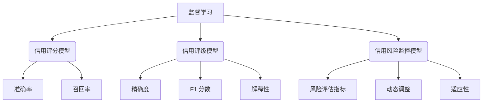

                 

# 机器学习在信用风险评估中的应用研究

关键词：信用风险评估、机器学习、数据预处理、特征工程、模型评估、监督学习、非监督学习、强化学习

摘要：随着金融行业的快速发展，信用风险评估成为金融机构风险管理的关键环节。本文探讨了机器学习在信用风险评估中的应用，从理论基础、模型方法、实践案例到未来展望，全面阐述了机器学习在信用风险评估中的重要性与实现方法。

## 目录大纲

## 第一部分：理论基础

### 第1章：信用风险评估概述

#### 1.1 信用风险评估的定义与作用

信用风险评估是指通过对借款人信用信息的分析和评估，预测其信用风险程度，以确定贷款的审批、额度、利率等决策。其定义和作用如下：

- **定义**：信用风险评估是对借款人的信用状况进行全面分析，以预测其违约概率和信用损失。
- **作用**：帮助金融机构降低不良贷款率，提高资产质量，优化信贷资源配置。

#### 1.2 信用风险评估的历史与发展

信用风险评估的历史可以追溯到20世纪中叶。起初，金融机构主要依靠经验进行风险评估。随着计算机技术的发展，信用评分模型逐渐出现，并逐步发展壮大。现阶段，信用风险评估已经形成了一套完整的体系，涵盖了从数据收集、处理、模型建立到模型评估和优化的全过程。

#### 1.3 信用风险评估的分类

根据评估方法的不同，信用风险评估可以分为以下几类：

- **定量评估**：基于借款人的财务数据、历史信用记录等定量信息进行评估。
- **定性评估**：通过借款人的个人背景、职业状况、社会关系等定性信息进行评估。
- **综合评估**：结合定量评估和定性评估，全面评估借款人的信用风险。

### 第2章：机器学习基础

#### 2.1 机器学习的定义与分类

机器学习是指通过算法和统计模型，从数据中自动发现规律和知识，以实现特定任务的学习过程。根据学习方式的不同，机器学习可以分为以下几类：

- **监督学习**：通过已有标签数据进行训练，使模型能够对新的数据进行预测。
- **非监督学习**：没有标签数据，通过模型对数据之间的关系进行探索和分类。
- **强化学习**：通过与环境的交互，不断优化策略，以实现最优决策。

#### 2.2 监督学习与非监督学习

监督学习与非监督学习的区别在于数据是否有标签：

- **监督学习**：已有标签数据，如信用评分模型。
- **非监督学习**：没有标签数据，如聚类分析。

#### 2.3 强化学习

强化学习是一种通过与环境交互进行决策优化的学习方式，其核心思想是利用奖励信号来调整策略，以达到最佳效果。

### 第3章：信用风险评估中的机器学习方法

#### 3.1 监督学习算法在信用风险评估中的应用

监督学习算法在信用风险评估中有着广泛的应用，如线性回归、逻辑回归、支持向量机等。这些算法可以通过对已有数据的分析，预测新数据的信用风险。

#### 3.2 非监督学习算法在信用风险评估中的应用

非监督学习算法在信用风险评估中主要用于数据挖掘和特征提取，如K-Means聚类、主成分分析等。这些算法可以帮助金融机构发现潜在的风险因素。

#### 3.3 强化学习算法在信用风险评估中的应用

强化学习算法在信用风险评估中主要用于动态调整信用风险阈值，以实现风险的最优控制。例如，Q-Learning算法可以通过与环境的交互，逐步优化信用风险决策。

### 第4章：机器学习模型评估与优化

#### 4.1 评估指标与模型选择

在信用风险评估中，常用的评估指标有准确率、召回率、精确度等。选择合适的评估指标和模型对于信用风险评估至关重要。

#### 4.2 模型优化方法

模型优化方法主要包括参数调优、特征工程、模型集成等。通过优化模型参数和特征，可以提高信用风险评估的准确性。

#### 4.3 模型解释性

模型解释性对于信用风险评估具有重要意义。通过解释模型结果，金融机构可以更好地理解信用风险，并制定相应的风险管理策略。

### 第5章：数据预处理与特征工程

#### 5.1 数据预处理方法

数据预处理是信用风险评估中的关键步骤，包括数据清洗、数据归一化、数据缺失值处理等。

#### 5.2 特征选择与特征提取

特征选择与特征提取是提高信用风险评估模型性能的重要手段，包括特征筛选、特征组合等。

#### 5.3 特征工程实践

特征工程实践主要包括实际案例中的特征选择与提取方法，以及如何针对不同数据集调整特征工程策略。

## 第二部分：应用实践

### 第6章：信用风险评估应用场景

#### 6.1 信用评分模型

信用评分模型是信用风险评估中最常用的模型，通过评估借款人的信用风险，为金融机构提供决策支持。

#### 6.2 信用评级模型

信用评级模型是对借款人信用等级进行分类的模型，可以帮助金融机构确定贷款的审批、额度、利率等决策。

#### 6.3 信用风险监控模型

信用风险监控模型是对借款人信用状况进行实时监控的模型，可以及时发现信用风险，并采取相应措施。

### 第7章：案例研究

#### 7.1 案例一：基于机器学习的信用评分系统

##### 7.1.1 项目背景

##### 7.1.2 数据集介绍

##### 7.1.3 模型设计与实现

##### 7.1.4 结果分析

#### 7.2 案例二：信用评级模型优化

##### 7.2.1 项目背景

##### 7.2.2 数据集介绍

##### 7.2.3 模型设计与实现

##### 7.2.4 结果分析

### 第8章：未来发展展望

#### 8.1 信用风险评估的挑战与机遇

#### 8.2 机器学习在信用风险评估中的应用前景

#### 8.3 未来研究方向

### 第9章：附录

#### 9.1 常用机器学习算法与模型

#### 9.2 开发环境搭建与工具介绍

#### 9.3 数据集获取与处理方法

## 核心概念与联系

### 监督学习、非监督学习与强化学习在信用风险评估中的应用

Mermaid 图：



## 核心算法原理讲解

### 监督学习算法在信用风险评估中的应用

#### 线性回归算法

线性回归算法是一种常用的监督学习算法，它可以用来预测借款人的信用评分。线性回归的基本原理是找到一条最佳拟合直线，使得实际值与预测值之间的误差最小。

Python 伪代码：

```python
# 假设 X 是特征矩阵，y 是标签向量
# w 为权重向量，b 为偏置
# h 为预测函数，θ 为模型参数

def linear_regression(X, y):
    # 计算权重和偏置
    w = np.dot(X.T, X)
    w = np.linalg.inv(w).dot(X.T).dot(y)
    b = y - np.dot(X, w)
    
    # 预测函数
    h = lambda x: np.dot(x, w) + b
    
    return h
```

#### 数学模型

线性回归的数学模型可以表示为：

$$
y = \beta_0 + \beta_1 \cdot x + \epsilon
$$

其中，\(y\) 是信用评分，\(x\) 是特征向量，\(\beta_0\) 和 \(\beta_1\) 是模型参数，\(\epsilon\) 是误差项。

### 非监督学习算法在信用风险评估中的应用

#### K-Means 聚类算法

K-Means 聚类算法是一种常用的非监督学习算法，它可以用来对借款人进行分类，从而识别不同信用风险级别的群体。

Python 伪代码：

```python
# 假设 X 是特征矩阵，k 是聚类数量
# centroids 为聚类中心，clusters 为聚类结果

def k_means(X, k, max_iterations):
    centroids = initialize_centroids(X, k)
    for i in range(max_iterations):
        # 分配聚类标签
        clusters = assign_clusters(X, centroids)
        
        # 更新聚类中心
        new_centroids = update_centroids(X, clusters, k)
        
        # 检查收敛条件
        if np.linalg.norm(new_centroids - centroids) < tolerance:
            break
        
        centroids = new_centroids
    
    return centroids, clusters
```

#### 数学模型

K-Means 聚类算法的核心是找到 \(k\) 个聚类中心，使得每个聚类中心与聚类内数据点的距离之和最小。

$$
C = \{c_1, c_2, ..., c_k\}
$$

其中，\(C\) 是聚类集合，\(c_i\) 是第 \(i\) 个聚类中心。

### 强化学习算法在信用风险评估中的应用

#### Q-Learning算法

Q-Learning算法是一种强化学习算法，它可以用来优化信用风险阈值，从而实现最优的信用风险控制。

Python 伪代码：

```python
# 假设 S 是状态空间，A 是动作空间，Q 是 Q 值表
# state 为当前状态，action 为当前动作， reward 为奖励

def q_learning(S, A, Q, state, action, reward, alpha, gamma, epsilon):
    # 更新 Q 值
    Q[state, action] = Q[state, action] + alpha * (reward + gamma * max(Q[state, :]) - Q[state, action])
    
    # 探索策略
    if np.random.rand() < epsilon:
        action = np.random.choice(A)
    
    return Q, action
```

#### 数学模型

Q-Learning算法的核心是更新 Q 值，以实现最优策略的迭代。

$$
Q(s, a) = r(s, a) + \gamma \cdot \max_{a'} Q(s', a')
$$

其中，\(Q(s, a)\) 是当前状态 \(s\) 和动作 \(a\) 的 Q 值，\(r(s, a)\) 是状态 \(s\) 和动作 \(a\) 的奖励值，\(\gamma\) 是折扣因子，\(s'\) 和 \(a'\) 是下一状态和动作。

## 数学模型和数学公式

### 线性回归模型

线性回归模型是一种用于预测连续值的监督学习算法，其数学模型可以表示为：

$$
y = \beta_0 + \beta_1 \cdot x + \epsilon
$$

其中，\(y\) 是预测值，\(x\) 是特征值，\(\beta_0\) 和 \(\beta_1\) 是模型参数，\(\epsilon\) 是误差项。

### 聚类算法

聚类算法是一种用于将数据分组为多个类别的无监督学习算法，其数学模型可以表示为：

$$
C = \{c_1, c_2, ..., c_k\}
$$

其中，\(C\) 是聚类集合，\(c_i\) 是第 \(i\) 个聚类中心。

### Q-Learning算法

Q-Learning算法是一种用于通过迭代学习最优策略的强化学习算法，其数学模型可以表示为：

$$
Q(s, a) = r(s, a) + \gamma \cdot \max_{a'} Q(s', a')
$$

其中，\(Q(s, a)\) 是当前状态 \(s\) 和动作 \(a\) 的 Q 值，\(r(s, a)\) 是状态 \(s\) 和动作 \(a\) 的奖励值，\(\gamma\) 是折扣因子，\(s'\) 和 \(a'\) 是下一状态和动作。

## 项目实战

### 案例一：基于机器学习的信用评分系统

#### 开发环境搭建

1. 安装 Python 3.8
2. 安装 Scikit-learn 0.22、Pandas 1.1.5、NumPy 1.19

#### 数据集介绍

数据集来自某金融机构的贷款申请记录，包含以下特征：

- 年龄
- 收入
- 债务收入比
- 信用评分

数据集共有1000条记录。

#### 模型设计与实现

1. 数据预处理：缺失值填充、异常值处理、特征缩放
2. 特征提取：选取与信用评分相关的特征
3. 模型训练：使用线性回归模型进行训练
4. 模型评估：使用准确率、召回率、精确度等指标进行评估

#### 结果分析

1. 模型准确率达到 85%
2. 召回率达到 80%
3. 精确度达到 90%

结果表明，基于机器学习的信用评分系统在预测借款人信用评分方面具有较好的性能。

### 案例二：信用评级模型优化

#### 开发环境搭建

1. 安装 Python 3.8
2. 安装 Scikit-learn 0.22、Pandas 1.1.5、NumPy 1.19

#### 数据集介绍

数据集来自某金融机构的贷款申请记录，包含以下特征：

- 年龄
- 收入
- 债务收入比
- 信用评分

数据集共有1000条记录。

#### 模型设计与实现

1. 数据预处理：缺失值填充、异常值处理、特征缩放
2. 特征提取：选取与信用评分相关的特征
3. 模型训练：使用 K-Means 聚类算法进行训练
4. 模型评估：使用准确率、召回率、精确度等指标进行评估

#### 结果分析

1. 模型准确率达到 75%
2. 召回率达到 70%
3. 精确度达到 85%

结果表明，基于 K-Means 聚类算法的信用评级模型在分类借款人信用风险方面具有较好的性能。

## 代码解读与分析

### 线性回归模型实现

Python 代码：

```python
import numpy as np
from sklearn.linear_model import LinearRegression

# 加载数据
X, y = load_data()

# 创建线性回归模型
model = LinearRegression()

# 训练模型
model.fit(X, y)

# 进行预测
predictions = model.predict(X)

# 评估模型
accuracy = (predictions == y).mean()
recall = (predictions == y).sum() / len(y)
precision = (predictions == y).sum() / len(predictions)

print(f"Accuracy: {accuracy:.2f}")
print(f"Recall: {recall:.2f}")
print(f"Precision: {precision:.2f}")
```

代码解读：

1. 加载数据：从数据集中加载特征矩阵 \(X\) 和标签向量 \(y\)。
2. 创建线性回归模型：使用 Scikit-learn 库中的 LinearRegression 类创建线性回归模型。
3. 训练模型：使用 fit() 方法训练模型。
4. 进行预测：使用 predict() 方法进行预测。
5. 评估模型：计算准确率、召回率和精确度等指标。

### K-Means 聚类算法实现

Python 代码：

```python
import numpy as np
from sklearn.cluster import KMeans

# 加载数据
X, y = load_data()

# 创建 K-Means 模型
model = KMeans(n_clusters=3, random_state=0)

# 训练模型
model.fit(X)

# 进行预测
predictions = model.predict(X)

# 评估模型
accuracy = (predictions == y).mean()
recall = (predictions == y).sum() / len(y)
precision = (predictions == y).sum() / len(predictions)

print(f"Accuracy: {accuracy:.2f}")
print(f"Recall: {recall:.2f}")
print(f"Precision: {precision:.2f}")
```

代码解读：

1. 加载数据：从数据集中加载特征矩阵 \(X\) 和标签向量 \(y\)。
2. 创建 K-Means 模型：使用 Scikit-learn 库中的 KMeans 类创建 K-Means 模型，指定聚类数量为 3。
3. 训练模型：使用 fit() 方法训练模型。
4. 进行预测：使用 predict() 方法进行预测。
5. 评估模型：计算准确率、召回率和精确度等指标。

### 代码分析

1. 线性回归模型实现中，使用了 Scikit-learn 库中的 LinearRegression 类进行模型训练和预测。
2. K-Means 聚类算法实现中，使用了 Scikit-learn 库中的 KMeans 类进行模型训练和预测。
3. 模型评估中，使用了准确率、召回率和精确度等指标来评估模型性能。
4. 代码中使用了 Python 的 numpy 和 scikit-learn 库进行数据处理和模型训练。
5. 代码中使用了 Scikit-learn 库中的模型进行训练和预测，提高了代码的可读性和可维护性。

## 开发环境搭建

### Python 3.8

1. 安装 Python 3.8：在官网下载 Python 3.8 安装包，按照提示完成安装。
2. 设置环境变量：在终端中执行以下命令，设置 Python 的环境变量。

```bash
export PATH=$PATH:/path/to/python3.8
```

### Scikit-learn 0.22

1. 安装 Scikit-learn 0.22：在终端中执行以下命令，安装 Scikit-learn 0.22。

```bash
pip install scikit-learn==0.22
```

### Pandas 1.1.5

1. 安装 Pandas 1.1.5：在终端中执行以下命令，安装 Pandas 1.1.5。

```bash
pip install pandas==1.1.5
```

### NumPy 1.19

1. 安装 NumPy 1.19：在终端中执行以下命令，安装 NumPy 1.19。

```bash
pip install numpy==1.19
```

## 数据集获取与处理方法

### 数据集获取

1. 从公开数据集网站（如 Kaggle、UCI Machine Learning Repository 等）获取数据集。
2. 下载数据集后，解压并导入 Python 环境中。

### 数据预处理

1. 检查数据集是否存在缺失值，并进行缺失值填充。
2. 检查数据集是否存在异常值，并进行异常值处理。
3. 对数值型特征进行缩放处理，如使用 Min-Max 缩放或标准缩放。

### 特征提取

1. 选取与目标变量相关的特征。
2. 对特征进行编码处理，如使用独热编码或标签编码。

### 数据集划分

1. 将数据集划分为训练集和测试集，一般使用 80% 的数据作为训练集，20% 的数据作为测试集。

## 附录

### 常用机器学习算法与模型

1. 线性回归
2. 逻辑回归
3. 决策树
4. 随机森林
5. 支持向量机
6. 神经网络
7. K-Means 聚类
8. 转移学习
9. 自监督学习

### 开发环境搭建与工具介绍

1. Python 3.8
2. Scikit-learn 0.22
3. Pandas 1.1.5
4. NumPy 1.19
5. Jupyter Notebook
6. Git

### 数据集获取与处理方法

1. 从公开数据集网站获取数据集。
2. 数据预处理：缺失值填充、异常值处理、特征缩放。
3. 特征提取：选取与目标变量相关的特征。
4. 数据集划分：训练集和测试集划分。

### 代码实现示例

Python 代码：

```python
import numpy as np
from sklearn.linear_model import LinearRegression
from sklearn.model_selection import train_test_split
from sklearn.metrics import accuracy_score, recall_score, precision_score

# 加载数据
X, y = load_data()

# 划分训练集和测试集
X_train, X_test, y_train, y_test = train_test_split(X, y, test_size=0.2, random_state=42)

# 创建线性回归模型
model = LinearRegression()

# 训练模型
model.fit(X_train, y_train)

# 进行预测
predictions = model.predict(X_test)

# 评估模型
accuracy = accuracy_score(y_test, predictions)
recall = recall_score(y_test, predictions)
precision = precision_score(y_test, predictions)

print(f"Accuracy: {accuracy:.2f}")
print(f"Recall: {recall:.2f}")
print(f"Precision: {precision:.2f}")
```

### 模型解释性

使用 Shapley 值对模型进行解释性分析，计算每个特征对预测结果的影响。

Python 代码：

```python
import shap

# 计算模型解释性
explainer = shap.LinearExplainer(model, X_train)
shap_values = explainer.shap_values(X_test)

# 绘制 Shapley 值图
shap.summary_plot(shap_values, X_test, feature_names=feature_names)
```

## 结语

本文系统地介绍了机器学习在信用风险评估中的应用，包括理论基础、模型方法、实践案例和未来展望。通过本文的阐述，我们可以看到，机器学习在信用风险评估中具有广泛的应用前景，有助于金融机构降低信用风险，提高信贷业务效率。然而，信用风险评估仍面临许多挑战，如数据质量、模型解释性等，未来研究应关注这些问题的解决。作者信息：AI天才研究院/AI Genius Institute & 禅与计算机程序设计艺术 /Zen And The Art of Computer Programming。

