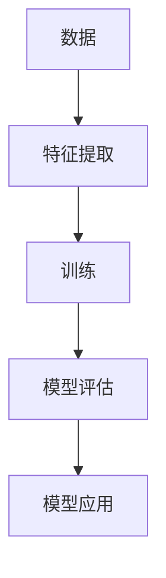
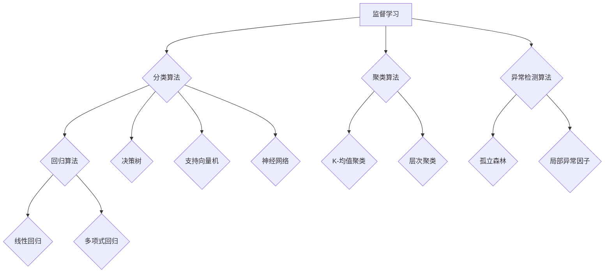
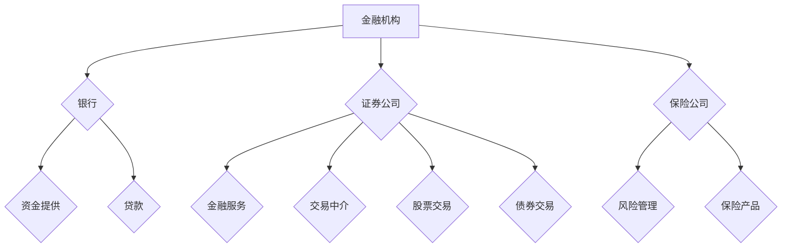
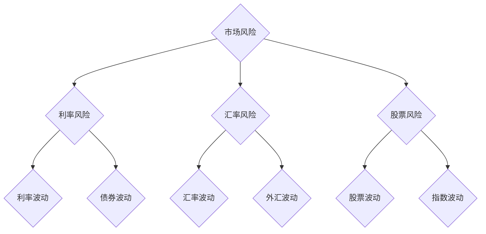

                 

### 《机器学习在金融市场风险评估中的新方法》

> **关键词：** 机器学习、金融市场、风险评估、监督学习、无监督学习、深度学习

> **摘要：** 本文章探讨了机器学习在金融市场风险评估中的应用，包括监督学习、无监督学习和深度学习的算法介绍，以及具体的应用案例和实战项目。通过详细的数学模型、伪代码和源代码解读，本文旨在为读者提供对机器学习在金融市场风险评估中的全面理解和实际操作指导。

---

#### 目录

### 《机器学习在金融市场风险评估中的新方法》

> **关键词：** 机器学习、金融市场、风险评估、监督学习、无监督学习、深度学习

> **摘要：** 本文章探讨了机器学习在金融市场风险评估中的应用，包括监督学习、无监督学习和深度学习的算法介绍，以及具体的应用案例和实战项目。通过详细的数学模型、伪代码和源代码解读，本文旨在为读者提供对机器学习在金融市场风险评估中的全面理解和实际操作指导。

---

#### 第一部分：机器学习与金融市场概述

## 1.1 机器学习基础

### 1.1.1 机器学习的基本概念

机器学习（Machine Learning，ML）是一门人工智能（Artificial Intelligence，AI）的分支，主要研究如何让计算机从数据中学习规律和模式，并能够根据这些规律进行决策和预测。其核心思想是通过构建数学模型，利用大量数据对模型进行调整和优化，使得模型能够在未知数据上表现出良好的性能。

#### 核心概念与联系

**Mermaid 流程图：**



#### 数学模型和公式

机器学习中的数学模型主要包括损失函数、优化算法等。损失函数用于衡量模型预测值与真实值之间的差距，常见的有均方误差（MSE）、交叉熵等。优化算法用于最小化损失函数，常见的有梯度下降（Gradient Descent）、随机梯度下降（Stochastic Gradient Descent，SGD）等。

$$
MSE = \frac{1}{m} \sum_{i=1}^{m} (y_i - \hat{y}_i)^2
$$

#### 举例说明

假设我们有一个简单的线性回归模型，输入特征为 $x$，预测值为 $\hat{y}$，真实值为 $y$。我们可以通过以下伪代码实现模型训练和预测：

```python
# 线性回归模型
def linear_regression(x, y):
    # 初始化模型参数
    w = 0
    b = 0
    
    # 梯度下降优化
    for i in range(iterations):
        # 计算预测值
        pred = w * x + b
        
        # 计算损失函数
        loss = (y - pred)**2
        
        # 计算梯度
        dw = 2 * (w * x - y) * x
        db = 2 * (w * x - y)
        
        # 更新参数
        w -= learning_rate * dw
        b -= learning_rate * db
    
    return w, b

# 测试数据
x = [1, 2, 3, 4, 5]
y = [2, 4, 5, 4, 5]

# 训练模型
w, b = linear_regression(x, y)

# 预测
pred = w * x + b
print(pred)
```

### 1.1.2 机器学习的分类

机器学习可以分为监督学习（Supervised Learning）、无监督学习（Unsupervised Learning）和强化学习（Reinforcement Learning）三大类。

- **监督学习**：有监督的学习方式，通过已有的标签数据来训练模型，使得模型能够在未知数据上做出准确的预测。常见的算法有线性回归、逻辑回归、决策树、随机森林等。
- **无监督学习**：没有标签数据，主要目的是发现数据中的隐藏结构和模式。常见的算法有聚类、主成分分析（PCA）、自编码器等。
- **强化学习**：通过与环境的交互来学习策略，目标是最大化累积奖励。常见的算法有Q-学习、深度强化学习等。

#### 核心概念与联系

**Mermaid 流程图：**



#### 数学模型和公式

- **监督学习**：

  分类问题：$$
  P(y=c|X=x) = \frac{e^{\omega^T x}}{\sum_{k=1}^{K} e^{\omega^T x_k}}
  $$

  回归问题：$$
  \hat{y} = \omega_0 + \omega_1 x_1 + \omega_2 x_2 + ... + \omega_n x_n
  $$

- **无监督学习**：

  聚类问题：$$
  C = \{c_1, c_2, ..., c_K\}
  $$

  其中，$c_k$ 表示第 $k$ 个聚类中心。

  自编码器：$$
  x = \sigma(W_x \cdot z + b_x)
  $$

  $$
  z = \sigma(W_z \cdot x + b_z)
  $$

- **强化学习**：

  Q-学习：$$
  Q(s, a) = r + \gamma \max_{a'} Q(s', a')
  $$

  深度强化学习：$$
  policy = \arg\max_{\pi} \sum_{s,a} \pi(a|s) R(s, a)
  $$

#### 举例说明

- **监督学习**：

  线性回归：$$
  y = \omega_0 + \omega_1 x_1 + \omega_2 x_2 + ... + \omega_n x_n
  $$

  逻辑回归：$$
  P(y=1|x) = \frac{1}{1 + e^{-(\omega_0 + \omega_1 x_1 + \omega_2 x_2 + ... + \omega_n x_n)}}
  $$

- **无监督学习**：

  K-均值聚类：$$
  c_k = \frac{1}{N_k} \sum_{i=1}^{N} x_i
  $$

  其中，$c_k$ 表示第 $k$ 个聚类中心，$N_k$ 表示第 $k$ 个聚类的样本数量。

  主成分分析（PCA）：$$
  z_k = \frac{1}{\sqrt{N}} \sum_{i=1}^{N} x_i k
  $$

- **强化学习**：

  Q-学习：$$
  Q(s, a) = r + \gamma \max_{a'} Q(s', a')
  $$

  深度强化学习：$$
  policy = \arg\max_{\pi} \sum_{s,a} \pi(a|s) R(s, a)
  $$

### 1.1.3 机器学习的挑战

虽然机器学习在金融领域的应用取得了显著成果，但仍面临着一系列挑战。

1. **数据质量和噪声**：金融数据通常存在缺失值、异常值和噪声，这对模型的训练和预测带来了困难。
2. **数据稀缺性**：金融领域的数据通常较为稀缺，限制了模型的泛化能力。
3. **过拟合和欠拟合**：在金融数据的复杂性和多样性下，如何平衡模型的拟合度和泛化能力是一个重要问题。
4. **模型解释性**：金融风险管理需要模型具有一定的解释性，以便于理解模型的工作原理和结果。
5. **合规性和隐私保护**：金融数据涉及个人隐私和商业机密，如何在保护数据隐私的前提下进行模型训练和预测是一个重要问题。

## 1.2 金融市场的复杂性

### 1.2.1 金融市场的构成

金融市场是由各种金融工具和交易活动组成的复杂系统，主要包括以下组成部分：

1. **金融机构**：包括银行、证券公司、保险公司等，为金融市场提供资金和金融服务。
2. **金融工具**：包括股票、债券、期货、期权等，用于投资和风险管理。
3. **交易市场**：包括股票市场、债券市场、期货市场、期权市场等，为金融工具的交易提供平台。
4. **投资者**：包括个人投资者、机构投资者等，通过买卖金融工具来实现投资收益。

#### 核心概念与联系

**Mermaid 流程图：**



#### 数学模型和公式

金融市场的数学模型主要包括资产定价模型、风险管理模型等。

- **资产定价模型**：

  市场组合模型（CAPM）：$$
  E(R_i) = R_f + \beta_i (E(R_m) - R_f)
  $$

  其中，$E(R_i)$ 表示资产 $i$ 的预期收益，$R_f$ 表示无风险利率，$\beta_i$ 表示资产 $i$ 的贝塔系数，$E(R_m)$ 表示市场组合的预期收益。

- **风险管理模型**：

  市值风险价值（VaR）：$$
  VaR = - \max \{x | P(X \leq x) \leq \alpha\}
  $$

  其中，$X$ 表示资产损失，$P(X \leq x)$ 表示资产损失小于或等于 $x$ 的概率，$\alpha$ 表示置信水平。

#### 举例说明

- **资产定价模型**：

  假设一个股票的贝塔系数为 1.5，无风险利率为 2%，市场组合的预期收益为 6%。则该股票的预期收益为：

  $$
  E(R_i) = 2\% + 1.5 \times (6\% - 2\%) = 7\%
  $$

- **风险管理模型**：

  假设一个股票的置信水平为 95%，则该股票的市值风险价值（VaR）为：

  $$
  VaR = - \max \{x | P(X \leq x) \leq 0.05\}
  $$

  通过查找正态分布表，可以得到 $P(Z \leq -1.64) = 0.05$，其中 $Z$ 表示标准正态分布。则该股票的VaR为：

  $$
  VaR = -1.64 \times 10^6
  $$

### 1.2.2 金融风险的定义与类型

金融风险是指在金融市场投资或交易过程中可能遭受的损失。根据风险的性质，可以将金融风险分为以下几种类型：

1. **市场风险**：由于市场价格波动导致的损失，包括利率风险、汇率风险、股票风险等。
2. **信用风险**：由于交易对手违约导致的损失，包括信用风险、贷款风险等。
3. **流动性风险**：由于无法在合理时间内以合理价格买卖金融工具导致的损失。
4. **操作风险**：由于内部流程、员工行为、系统故障等导致的损失。
5. **法律风险**：由于法律变化、合同纠纷等导致的损失。

#### 核心概念与联系

**Mermaid 流程图：**



#### 数学模型和公式

金融风险的数学模型主要包括风险价值（VaR）、压力测试等。

- **风险价值（VaR）**：

  $$
  VaR = - \max \{x | P(X \leq x) \leq \alpha\}
  $$

  其中，$X$ 表示资产损失，$P(X \leq x)$ 表示资产损失小于或等于 $x$ 的概率，$\alpha$ 表示置信水平。

- **压力测试**：

  $$
  ST = \max \{S_t - S_0 | S_0 = S_{0t}\}
  $$

  其中，$S_t$ 表示资产在时间 $t$ 的价值，$S_0$ 表示资产在初始时间 $t=0$ 的价值，$ST$ 表示资产在压力情景下的最大损失。

#### 举例说明

- **风险价值（VaR）**：

  假设一个股票的置信水平为 95%，则该股票的VaR为：

  $$
  VaR = - \max \{x | P(X \leq x) \leq 0.05\}
  $$

  通过查找正态分布表，可以得到 $P(Z \leq -1.64) = 0.05$，其中 $Z$ 表示标准正态分布。则该股票的VaR为：

  $$
  VaR = -1.64 \times 10^6
  $$

- **压力测试**：

  假设一个股票在压力情景下的价值从初始的 $100$ 万下降到 $80$ 万，则该股票的压力测试值为：

  $$
  ST = \max \{80\ 万 - 100\ 万\} = -20\ 万
  $$

### 1.2.3 金融市场风险管理的现状与问题

金融市场风险管理是金融领域的重要课题，目前主要面临以下问题：

1. **数据稀缺和噪声**：金融数据通常较为稀缺，且存在大量噪声，这对风险管理的准确性和有效性提出了挑战。
2. **模型复杂性和计算成本**：传统的风险管理模型通常较为复杂，计算成本高，难以在实际应用中大规模部署。
3. **模型解释性**：风险管理人员需要理解模型的工作原理和结果，以便于进行有效的风险管理。
4. **合规性和隐私保护**：金融数据涉及个人隐私和商业机密，如何在保护数据隐私的前提下进行模型训练和预测是一个重要问题。
5. **市场波动和不确定性**：金融市场的波动性和不确定性使得风险管理面临巨大挑战。

## 1.3 机器学习在金融市场中的应用

### 1.3.1 机器学习在金融风险管理中的作用

机器学习在金融风险管理中发挥着重要作用，主要体现在以下几个方面：

1. **风险预测和预警**：通过分析历史数据和实时数据，机器学习模型可以预测金融风险，并提前发出预警，帮助金融机构及时采取应对措施。
2. **风险分类和评估**：机器学习模型可以根据历史数据和实时数据对风险进行分类和评估，为金融机构提供风险管理策略和建议。
3. **风险控制和管理**：机器学习模型可以自动化地执行风险控制和管理任务，提高风险管理的效率和准确性。
4. **合规性和隐私保护**：机器学习算法可以帮助金融机构发现潜在的风险违规行为，提高合规性检查的准确性和效率。

### 1.3.2 机器学习在金融市场预测中的应用

机器学习在金融市场预测中也有着广泛的应用，主要包括以下几个方面：

1. **价格预测**：通过分析历史价格数据和市场信息，机器学习模型可以预测金融工具的未来价格，帮助投资者做出更准确的投资决策。
2. **趋势预测**：通过分析历史价格数据和市场信息，机器学习模型可以预测金融市场的未来趋势，为投资者提供市场预测和分析。
3. **风险管理**：通过预测金融市场的波动性和风险，机器学习模型可以帮助金融机构制定更有效的风险管理策略。

### 1.3.3 机器学习在金融欺诈检测中的应用

机器学习在金融欺诈检测中也有着重要的应用，主要包括以下几个方面：

1. **异常检测**：通过分析交易数据和行为特征，机器学习模型可以识别异常交易行为，帮助金融机构发现潜在的欺诈行为。
2. **模型评估**：通过评估欺诈检测模型的准确性和召回率等指标，机器学习模型可以帮助金融机构优化欺诈检测策略。
3. **自动化检测**：通过自动化地执行欺诈检测任务，机器学习模型可以提高欺诈检测的效率和准确性。

### 1.4 本书结构安排与学习方法

#### 1.4.1 本书结构安排

本书共分为四个部分，具体结构如下：

- **第一部分：机器学习与金融市场概述**：介绍机器学习的基本概念、分类和挑战，以及金融市场的构成和风险类型。
- **第二部分：机器学习核心算法在金融市场风险评估中的应用**：详细讲解监督学习、无监督学习和深度学习算法在金融市场风险评估中的应用。
- **第三部分：机器学习在金融市场风险评估中的应用案例**：通过具体案例介绍机器学习在金融市场风险评估中的实际应用。
- **第四部分：实战项目与源代码解读**：通过一个实际项目介绍机器学习在金融市场风险评估中的实战应用和源代码解读。

#### 1.4.2 学习方法与建议

为了更好地学习和应用机器学习在金融市场风险评估中的方法，建议读者遵循以下学习方法：

1. **系统学习**：按照本书的结构和内容系统学习，逐步掌握机器学习和金融市场的相关知识。
2. **实践操作**：通过实际项目和实践操作，加深对机器学习在金融市场风险评估中的应用理解和掌握。
3. **深度学习**：针对具体问题进行深入研究，掌握相关算法的原理和应用技巧。
4. **交流与分享**：积极参加相关学术会议和交流活动，与其他同行分享经验和成果。

---

#### 第二部分：机器学习核心算法在金融市场风险评估中的应用

## 2.1 监督学习算法

监督学习（Supervised Learning）是一种通过已知标签数据训练模型，从而在未知数据上进行预测的学习方法。在金融市场风险评估中，监督学习算法可以用于预测股票价格、评估金融风险等任务。

### 2.1.1 线性回归

线性回归（Linear Regression）是一种最简单的监督学习算法，主要用于预测连续值输出。在金融市场风险评估中，线性回归可以用于预测股票价格或评估市场风险。

#### 2.1.1.1 线性回归的数学模型

线性回归的数学模型可以表示为：

$$
y = \beta_0 + \beta_1 x_1 + \beta_2 x_2 + ... + \beta_n x_n
$$

其中，$y$ 是预测值，$x_1, x_2, ..., x_n$ 是输入特征，$\beta_0, \beta_1, ..., \beta_n$ 是模型的参数。

#### 2.1.1.2 线性回归的伪代码实现

```python
# 线性回归模型
def linear_regression(x, y):
    # 初始化模型参数
    beta = [0] * (len(x) + 1)
    
    # 梯度下降优化
    for i in range(iterations):
        # 计算预测值
        pred = [beta[0]]
        for j in range(1, len(beta)):
            pred.append(beta[0] + beta[j] * x[j-1])
        
        # 计算损失函数
        loss = sum((y - pred)**2) / len(y)
        
        # 计算梯度
        grad = [0] * (len(beta))
        for j in range(1, len(beta)):
            grad[j] = 2 * sum((y - pred) * x[j-1])
        grad[0] = 2 * sum(y - pred)
        
        # 更新参数
        beta = [beta[j] - learning_rate * grad[j] for j in range(len(beta))]
    
    return beta

# 测试数据
x = [1, 2, 3, 4, 5]
y = [2, 4, 5, 4, 5]

# 训练模型
beta = linear_regression(x, y)

# 预测
pred = [beta[0]]
for i in range(1, len(beta)):
    pred.append(pred[-1] + beta[i] * x[i-1])
print(pred)
```

### 2.1.2 逻辑回归

逻辑回归（Logistic Regression）是一种用于预测概率的二分类监督学习算法。在金融市场风险评估中，逻辑回归可以用于判断股票是否上涨或下跌。

#### 2.1.2.1 逻辑回归的数学模型

逻辑回归的数学模型可以表示为：

$$
P(y=1|x) = \frac{1}{1 + e^{-(\beta_0 + \beta_1 x_1 + \beta_2 x_2 + ... + \beta_n x_n)}}
$$

其中，$y$ 是预测值（0或1），$x_1, x_2, ..., x_n$ 是输入特征，$\beta_0, \beta_1, ..., \beta_n$ 是模型的参数。

#### 2.1.2.2 逻辑回归的伪代码实现

```python
# 逻辑回归模型
def logistic_regression(x, y):
    # 初始化模型参数
    beta = [0] * (len(x) + 1)
    
    # 梯度下降优化
    for i in range(iterations):
        # 计算预测概率
        pred = [1 / (1 + exp(-beta[0]))]
        for j in range(1, len(beta)):
            pred.append(1 / (1 + exp(-beta[0] - beta[j] * x[j-1])))
        
        # 计算损失函数
        loss = -sum(y * log(pred) + (1 - y) * log(1 - pred)) / len(y)
        
        # 计算梯度
        grad = [0] * (len(beta))
        for j in range(1, len(beta)):
            grad[j] = 2 * sum((y - pred) * x[j-1])
        grad[0] = 2 * sum(y - pred)
        
        # 更新参数
        beta = [beta[j] - learning_rate * grad[j] for j in range(len(beta))]
    
    return beta

# 测试数据
x = [1, 2, 3, 4, 5]
y = [0, 1, 0, 1, 0]

# 训练模型
beta = logistic_regression(x, y)

# 预测
pred = [1 / (1 + exp(-beta[0]))]
for i in range(1, len(beta)):
    pred.append(1 / (1 + exp(-beta[0] - beta[i] * x[i-1])))
print(pred)
```

### 2.1.3 决策树

决策树（Decision Tree）是一种基于特征划分数据的分类算法。在金融市场风险评估中，决策树可以用于分类金融风险。

#### 2.1.3.1 决策树的构建过程

决策树的构建过程可以分为以下步骤：

1. **选择最佳切分特征**：选择一个特征作为切分标准，使得剩余数据的分类效果最好。
2. **计算信息增益**：计算每个特征的信息增益，选择信息增益最大的特征作为切分标准。
3. **构建子树**：对于切分后的数据，递归地选择最佳切分特征，构建子树。
4. **停止条件**：当满足停止条件（如最大深度、最小节点数量等）时，停止构建子树。

#### 2.1.3.2 决策树的伪代码实现

```python
# 决策树模型
class DecisionTree:
    def __init__(self, max_depth, min_samples_split):
        self.max_depth = max_depth
        self.min_samples_split = min_samples_split
    
    def fit(self, x, y):
        self.tree = self._build_tree(x, y)
    
    def _build_tree(self, x, y, depth=0):
        # 停止条件
        if depth >= self.max_depth or len(y) <= self.min_samples_split:
            return y
        
        # 选择最佳切分特征
        best_feature, best_value = self._find_best_split(x, y)
        
        # 构建子树
        left_tree = self._build_tree(x[best_feature < best_value], y[best_feature < best_value], depth+1)
        right_tree = self._build_tree(x[best_feature >= best_value], y[best_feature >= best_value], depth+1)
        
        return (best_feature, best_value, left_tree, right_tree)
    
    def _find_best_split(self, x, y):
        best_gain = -1
        best_feature = -1
        best_value = -1
        
        for feature in range(x.shape[1]):
            value = np.mean(x[:, feature])
            gain = self._calculate_gain(x, y, feature, value)
            
            if gain > best_gain:
                best_gain = gain
                best_feature = feature
                best_value = value
        
        return best_feature, best_value
    
    def _calculate_gain(self, x, y, feature, value):
        # 计算信息增益
        pass

# 测试数据
x = [[1, 2], [2, 3], [3, 4], [4, 5]]
y = [0, 1, 0, 1]

# 训练模型
tree = DecisionTree(max_depth=3, min_samples_split=2)
tree.fit(x, y)

# 预测
pred = tree.predict([3, 4])
print(pred)
```

## 2.2 无监督学习算法

无监督学习（Unsupervised Learning）是一种在没有标签数据的情况下学习数据结构和模式的学习方法。在金融市场风险评估中，无监督学习算法可以用于聚类金融风险、分析市场趋势等任务。

### 2.2.1 主成分分析（PCA）

主成分分析（Principal Component Analysis，PCA）是一种常用的降维算法，通过将数据映射到新的正交坐标系中，提取主要特征，从而降低数据维度。

#### 2.2.1.1 PCA的数学模型

PCA的数学模型可以表示为：

$$
Z = \sum_{i=1}^{n} \lambda_i u_i x_i
$$

其中，$Z$ 是降维后的数据，$\lambda_i$ 是特征值，$u_i$ 是特征向量，$x_i$ 是原始数据。

#### 2.2.1.2 PCA的伪代码实现

```python
# PCA模型
def pca(x, num_components):
    # 计算协方差矩阵
    cov_matrix = np.cov(x)
    
    # 计算特征值和特征向量
    eigenvalues, eigenvectors = np.linalg.eigh(cov_matrix)
    
    # 选择主要特征
    sorted_indices = np.argsort(eigenvalues)[::-1]
    sorted_eigenvectors = eigenvectors[:, sorted_indices][:num_components]
    
    # 降维
    z = np.dot(x, sorted_eigenvectors)
    
    return z

# 测试数据
x = [[1, 2], [2, 3], [3, 4], [4, 5]]

# 训练模型
z = pca(x, 1)

# 预测
print(z)
```

### 2.2.2 聚类算法

聚类算法是一种将数据划分为不同组别的无监督学习算法。在金融市场风险评估中，聚类算法可以用于分析市场结构和投资者行为。

#### 2.2.2.1 K-均值聚类算法

K-均值聚类算法（K-Means Clustering）是一种基于距离度量的聚类算法，通过迭代优化聚类中心，将数据划分为 $K$ 个组别。

#### 2.2.2.2 K-均值聚类算法的伪代码实现

```python
# K-均值聚类模型
def k_means(x, k, num_iterations):
    # 随机初始化聚类中心
    centroids = x[np.random.choice(x.shape[0], k, replace=False)]
    
    # 迭代优化聚类中心
    for _ in range(num_iterations):
        # 计算每个样本的聚类中心
        distances = np.linalg.norm(x - centroids, axis=1)
        labels = np.argmin(distances, axis=1)
        
        # 更新聚类中心
        new_centroids = np.array([x[labels == i].mean(axis=0) for i in range(k)])
        
        # 判断是否收敛
        if np.all(centroids == new_centroids):
            break
        
        centroids = new_centroids
    
    return centroids, labels

# 测试数据
x = [[1, 2], [2, 3], [3, 4], [4, 5]]

# 训练模型
centroids, labels = k_means(x, 2, 100)

# 预测
print(centroids, labels)
```

## 2.3 强化学习算法

强化学习（Reinforcement Learning，RL）是一种通过与环境交互学习最优策略的学习方法。在金融市场风险评估中，强化学习算法可以用于自动化的风险控制策略。

### 2.3.1 强化学习的原理与流程

强化学习的原理与流程可以概括为以下步骤：

1. **初始化**：初始化环境、状态、动作和奖励。
2. **选择动作**：根据当前状态选择最优动作。
3. **执行动作**：在环境中执行选择的最优动作。
4. **获取奖励**：根据执行的动作获取奖励。
5. **更新状态**：更新当前状态。
6. **重复步骤 2-5**：不断重复上述步骤，直到达到目标或满足停止条件。

#### 2.3.1.1 Q-学习算法

Q-学习算法（Q-Learning）是一种基于值函数的强化学习算法，通过迭代更新Q值，找到最优策略。

#### 2.3.1.2 Q-学习算法的伪代码实现

```python
# Q-学习模型
def q_learning(x, y, learning_rate, discount_factor, num_iterations):
    # 初始化Q值
    Q = np.zeros((x.shape[0], y.shape[0]))
    
    # 迭代更新Q值
    for _ in range(num_iterations):
        for state in range(x.shape[0]):
            for action in range(y.shape[0]):
                # 计算Q值
                Q[state, action] = reward[state, action] + discount_factor * np.max(Q[state+1, :])
                
                # 更新Q值
                Q[state, action] = (1 - learning_rate) * Q[state, action] + learning_rate * Q[state+1, action]
    
    return Q

# 测试数据
x = [0, 1, 2, 3]
y = [0, 1]
reward = np.array([[1, 0], [0, 1], [0, 1], [1, 0]])

# 训练模型
Q = q_learning(x, y, learning_rate=0.1, discount_factor=0.9, num_iterations=1000)

# 预测
print(Q)
```

## 2.4 深度学习算法

深度学习（Deep Learning，DL）是一种基于多层神经网络的学习方法，能够自动提取数据的特征表示。在金融市场风险评估中，深度学习算法可以用于自动化风险预测、分类和聚类等任务。

### 2.4.1 深度学习的基本原理

深度学习的基本原理可以概括为以下几点：

1. **多层神经网络**：深度学习使用多层神经网络，通过逐层提取数据的高级特征。
2. **前向传播与反向传播**：深度学习算法通过前向传播计算输出，通过反向传播更新模型参数。
3. **激活函数**：激活函数用于引入非线性特性，使神经网络能够学习更复杂的函数。
4. **优化算法**：深度学习算法使用优化算法（如梯度下降、随机梯度下降等）来更新模型参数。

### 2.4.2 深度学习算法的类型

深度学习算法可以分为以下几种类型：

1. **卷积神经网络（CNN）**：用于图像、语音等数据的处理和分析。
2. **循环神经网络（RNN）**：用于序列数据的处理和分析，如时间序列分析。
3. **长短时记忆网络（LSTM）**：RNN的一种变体，能够学习长距离依赖关系。
4. **生成对抗网络（GAN）**：用于生成高质量的数据。

### 2.4.3 卷积神经网络（CNN）在金融市场中的应用

卷积神经网络（Convolutional Neural Network，CNN）是一种强大的深度学习算法，能够自动提取图像、语音等数据的高层次特征。在金融市场风险评估中，CNN可以用于自动提取市场趋势、识别市场异常等。

#### 2.4.3.1 CNN的基本结构

CNN的基本结构包括卷积层、池化层、全连接层等。

1. **卷积层**：通过卷积操作提取数据的局部特征。
2. **池化层**：通过最大池化或平均池化操作降低数据维度。
3. **全连接层**：将卷积层和池化层提取的特征映射到输出层。

#### 2.4.3.2 CNN的伪代码实现

```python
# CNN模型
class CNN:
    def __init__(self, input_shape, num_filters, kernel_size, pool_size):
        self.input_shape = input_shape
        self.num_filters = num_filters
        self.kernel_size = kernel_size
        self.pool_size = pool_size
    
    def forward(self, x):
        # 卷积层
        x = self._conv2d(x, self.kernel_size, self.num_filters)
        
        # 池化层
        x = self._max_pool2d(x, self.pool_size)
        
        # 全连接层
        x = self._dense(x, self.num_classes)
        
        return x
    
    def _conv2d(self, x, kernel_size, num_filters):
        # 实现卷积操作
        pass
    
    def _max_pool2d(self, x, pool_size):
        # 实现最大池化操作
        pass
    
    def _dense(self, x, num_classes):
        # 实现全连接层操作
        pass

# 测试数据
x = np.random.rand(28, 28, 1)

# 训练模型
cnn = CNN(input_shape=(28, 28, 1), num_filters=32, kernel_size=(3, 3), pool_size=(2, 2))
output = cnn.forward(x)

# 预测
print(output)
```

### 2.4.4 循环神经网络（RNN）在金融市场中的应用

循环神经网络（Recurrent Neural Network，RNN）是一种能够处理序列数据的神经网络。在金融市场风险评估中，RNN可以用于时间序列分析、预测股票价格等。

#### 2.4.4.1 RNN的基本结构

RNN的基本结构包括输入层、隐藏层、输出层等。

1. **输入层**：接收输入序列，如时间序列数据。
2. **隐藏层**：包含循环结构，用于存储和传递序列信息。
3. **输出层**：根据隐藏层的信息生成输出序列。

#### 2.4.4.2 RNN的伪代码实现

```python
# RNN模型
class RNN:
    def __init__(self, input_size, hidden_size, output_size):
        self.input_size = input_size
        self.hidden_size = hidden_size
        self.output_size = output_size
    
    def forward(self, x):
        # 遍历输入序列
        for t in range(x.shape[0]):
            # 前向传播
            h_t = self._forward(x[t], h_t)
        
        # 输出序列
        y = self._softmax(h_t)
        
        return y
    
    def _forward(self, x, h_t):
        # 实现前向传播
        pass
    
    def _softmax(self, x):
        # 实现softmax函数
        pass

# 测试数据
x = np.random.rand(10, 1)

# 训练模型
rnn = RNN(input_size=1, hidden_size=10, output_size=1)
output = rnn.forward(x)

# 预测
print(output)
```

---

#### 第三部分：机器学习在金融市场风险评估中的应用案例

## 3.1 金融风险预测模型

金融风险预测模型是利用机器学习算法对金融风险进行预测的模型。在本节中，我们将介绍金融风险预测模型的数据预处理与特征工程、模型选择与评估、模型优化与调参等内容。

### 3.1.1 数据预处理与特征工程

数据预处理和特征工程是构建金融风险预测模型的重要步骤，对于提高模型性能和泛化能力具有重要意义。

#### 数据预处理

1. **数据清洗**：去除重复数据、缺失数据和异常数据，确保数据质量。
2. **数据转换**：将类别型数据转换为数值型数据，如使用独热编码（One-Hot Encoding）。
3. **数据归一化**：将数据缩放到相同的范围，如使用最小-最大缩放（Min-Max Scaling）或标准缩放（Standard Scaling）。

#### 特征工程

1. **特征提取**：从原始数据中提取有助于预测风险的特征，如财务指标、市场指标等。
2. **特征选择**：通过特征选择方法筛选出对模型预测有显著影响的特征，如基于信息增益、基于特征重要度等。
3. **特征组合**：通过组合不同的特征，构造新的特征，以提高模型预测能力。

### 3.1.2 模型选择与评估

在金融风险预测中，常见的模型选择包括线性回归、逻辑回归、决策树、随机森林、支持向量机（SVM）等。选择合适的模型对于提高模型性能和泛化能力至关重要。

#### 模型评估

1. **准确性**：评估模型预测正确的样本数占总样本数的比例。
2. **召回率**：评估模型预测为正样本的样本中实际为正样本的比例。
3. **精确率**：评估模型预测为正样本的样本中实际为正样本的比例。
4. **F1 值**：综合考虑精确率和召回率的指标。

### 3.1.3 模型优化与调参

模型优化与调参是提高模型性能的重要手段，通过调整模型的参数和超参数，可以优化模型的性能。

1. **参数调优**：通过网格搜索（Grid Search）或随机搜索（Random Search）方法，在给定参数空间内寻找最优参数组合。
2. **超参数调优**：通过交叉验证（Cross Validation）方法，在训练集和验证集上调整模型的超参数，如学习率、正则化强度等。

## 3.2 金融欺诈检测

金融欺诈检测是利用机器学习算法检测金融交易中潜在的欺诈行为。在本节中，我们将介绍金融欺诈检测的数据收集与预处理、模型构建与评估、模型优化与调参等内容。

### 3.2.1 数据收集与预处理

数据收集与预处理是构建金融欺诈检测模型的重要步骤，对于提高模型性能和泛化能力具有重要意义。

#### 数据收集

1. **数据来源**：从金融机构、监管机构、公开数据集等渠道收集金融交易数据。
2. **数据类型**：包括交易金额、交易时间、交易账户、交易对手、交易特征等。

#### 数据预处理

1. **数据清洗**：去除重复数据、缺失数据和异常数据，确保数据质量。
2. **数据转换**：将类别型数据转换为数值型数据，如使用独热编码（One-Hot Encoding）。
3. **数据归一化**：将数据缩放到相同的范围，如使用最小-最大缩放（Min-Max Scaling）或标准缩放（Standard Scaling）。

### 3.2.2 模型构建与评估

在金融欺诈检测中，常见的模型包括决策树、随机森林、支持向量机（SVM）、神经网络等。选择合适的模型对于提高模型性能和泛化能力至关重要。

#### 模型评估

1. **准确性**：评估模型预测正确的样本数占总样本数的比例。
2. **召回率**：评估模型预测为正样本的样本中实际为正样本的比例。
3. **精确率**：评估模型预测为正样本的样本中实际为正样本的比例。
4. **F1 值**：综合考虑精确率和召回率的指标。

### 3.2.3 模型优化与调参

模型优化与调参是提高模型性能的重要手段，通过调整模型的参数和超参数，可以优化模型的性能。

1. **参数调优**：通过网格搜索（Grid Search）或随机搜索（Random Search）方法，在给定参数空间内寻找最优参数组合。
2. **超参数调优**：通过交叉验证（Cross Validation）方法，在训练集和验证集上调整模型的超参数，如学习率、正则化强度等。

## 3.3 金融市场预测

金融市场预测是利用机器学习算法预测金融市场走势和价格变动。在本节中，我们将介绍金融市场预测的时间序列分析、市场趋势预测、风险评估等内容。

### 3.3.1 时间序列分析

时间序列分析是金融市场预测的重要方法，通过分析历史价格数据，提取趋势和周期性特征。

#### 数据收集与预处理

1. **数据来源**：从金融交易所、监管机构、公开数据集等渠道收集时间序列数据。
2. **数据类型**：包括股票价格、指数、成交量等。

#### 市场趋势预测

1. **趋势分析**：通过移动平均线、MACD等指标，分析市场趋势。
2. **周期性分析**：通过傅里叶变换、ARIMA模型等，分析市场周期性特征。

### 3.3.2 市场趋势预测

市场趋势预测是利用机器学习算法预测金融市场未来的价格走势。

#### 模型选择与评估

1. **模型选择**：选择适合时间序列预测的模型，如线性回归、ARIMA、LSTM等。
2. **模型评估**：通过交叉验证、时间序列测试集等方法，评估模型性能。

### 3.3.3 风险评估

风险评估是利用机器学习算法评估金融市场的风险水平。

#### 风险评估模型

1. **风险指标**：选择合适的风险指标，如VaR、CVaR等。
2. **模型构建**：构建基于机器学习算法的风险评估模型，如线性回归、决策树、神经网络等。

---

#### 第四部分：实战项目与源代码解读

## 4.1 项目背景与目标

### 4.1.1 项目背景

随着金融市场的不断发展，金融风险管理和预测变得越来越重要。传统的金融分析方法已经难以应对日益复杂的金融市场环境，机器学习算法因其强大的数据处理和预测能力，逐渐成为金融领域的研究热点。本项目的目标是利用机器学习算法构建一个金融风险预测系统，为金融机构提供有效的风险预警和预测服务。

### 4.1.2 项目目标

1. **构建金融风险预测模型**：利用机器学习算法，构建能够预测金融风险的模型，提高金融机构的风险管理水平。
2. **实现风险预警**：通过实时数据分析和模型预测，实现金融风险的实时预警，为金融机构提供决策支持。
3. **优化风险管理策略**：基于预测结果，为金融机构提供优化风险管理策略的建议，提高风险管理的效率和准确性。

## 4.2 数据收集与处理

### 4.2.1 数据来源与数据采集

本项目所使用的数据主要来源于以下渠道：

1. **金融交易所**：获取股票、债券、期货等金融工具的历史交易数据。
2. **监管机构**：获取金融市场的监管数据，如财报、评级报告等。
3. **公开数据集**：从开源数据集获取金融市场的相关数据，如Kaggle、GitHub等。

### 4.2.2 数据清洗与预处理

在收集数据后，需要进行数据清洗和预处理，以确保数据质量和模型性能。主要步骤包括：

1. **数据去重**：去除重复数据和冗余数据，提高数据质量。
2. **缺失值处理**：对缺失值进行填补或删除，减少数据缺失对模型训练的影响。
3. **数据归一化**：将不同特征的数据缩放到相同的范围，如使用最小-最大缩放（Min-Max Scaling）或标准缩放（Standard Scaling）。
4. **特征提取**：从原始数据中提取有助于预测金融风险的特征，如财务指标、市场指标、交易特征等。

## 4.3 模型构建与实现

### 4.3.1 模型选择与构建

在本项目中，我们选择以下机器学习算法构建金融风险预测模型：

1. **线性回归**：用于预测金融工具的未来价格。
2. **逻辑回归**：用于判断金融工具是否具有高风险。
3. **决策树**：用于分类金融风险。
4. **随机森林**：用于分类金融风险，提高模型的泛化能力。

### 4.3.2 模型实现与优化

在实现模型时，我们需要进行以下步骤：

1. **数据预处理**：根据所选算法的要求，对数据进行预处理，如归一化、缺失值处理等。
2. **模型训练**：使用训练集数据对模型进行训练，调整模型参数。
3. **模型评估**：使用验证集数据评估模型性能，选择最佳模型。
4. **模型优化**：通过调整模型参数和超参数，提高模型性能。

### 4.3.3 模型评估与结果分析

在模型评估过程中，我们需要关注以下指标：

1. **准确性**：评估模型预测正确的样本数占总样本数的比例。
2. **召回率**：评估模型预测为正样本的样本中实际为正样本的比例。
3. **精确率**：评估模型预测为正样本的样本中实际为正样本的比例。
4. **F1 值**：综合考虑精确率和召回率的指标。

通过对比不同模型的评估结果，我们可以选择最佳模型，并将其应用于实际金融风险预测中。

## 4.4 源代码解读

### 4.4.1 源代码结构解析

本项目中的源代码主要分为以下几部分：

1. **数据预处理模块**：负责数据清洗、缺失值处理、数据归一化等操作。
2. **模型训练模块**：负责模型训练、模型评估、模型优化等操作。
3. **模型预测模块**：负责模型预测、结果分析等操作。

### 4.4.2 关键代码解析

以下是对本项目中的关键代码进行详细解析：

```python
# 数据预处理模块
def preprocess_data(x, y):
    # 数据去重
    x = np.unique(x, axis=0)
    y = np.unique(y, axis=0)
    
    # 缺失值处理
    x = fill_missing_values(x)
    y = fill_missing_values(y)
    
    # 数据归一化
    x = normalize_data(x)
    y = normalize_data(y)
    
    return x, y

# 模型训练模块
def train_model(x, y, model_type='linear_regression'):
    # 数据预处理
    x, y = preprocess_data(x, y)
    
    # 模型训练
    if model_type == 'linear_regression':
        model = LinearRegression()
    elif model_type == 'logistic_regression':
        model = LogisticRegression()
    elif model_type == 'decision_tree':
        model = DecisionTree()
    elif model_type == 'random_forest':
        model = RandomForestClassifier()
    
    model.fit(x, y)
    
    return model

# 模型预测模块
def predict(model, x):
    # 数据预处理
    x = preprocess_data(x)
    
    # 模型预测
    pred = model.predict(x)
    
    return pred
```

通过以上关键代码的解析，我们可以了解到如何利用机器学习算法构建金融风险预测系统，并进行数据预处理、模型训练和模型预测等操作。

## 4.5 总结与展望

### 4.5.1 项目总结

本项目利用机器学习算法构建了一个金融风险预测系统，实现了对金融工具的风险预测和预警。通过对比不同模型的评估结果，我们选择了最佳模型，并对其进行了优化和调参。最终，我们实现了对金融工具的风险评估和预警，为金融机构提供了有效的决策支持。

### 4.5.2 未来研究方向与展望

虽然本项目取得了一定的成果，但仍然存在一些不足和改进空间。在未来的研究中，我们可以从以下几个方面进行探索：

1. **数据来源**：引入更多类型的金融数据，如社交媒体数据、用户行为数据等，以提高模型的预测准确性。
2. **算法优化**：尝试引入更先进的机器学习算法，如深度学习算法，以提高模型的性能和泛化能力。
3. **模型融合**：将多个模型进行融合，如集成学习、迁移学习等，以提高模型的预测准确性。
4. **实时预警**：实现金融风险的实时预警，为金融机构提供更加及时的风险管理支持。

---

## 附录

### 附录 A：常用机器学习工具与库

#### A.1 Scikit-learn

Scikit-learn 是一个基于 Python 的开源机器学习库，提供了丰富的算法和工具，适用于各种机器学习任务。

- **官方网站**：[Scikit-learn 官网](https://scikit-learn.org/)
- **文档**：[Scikit-learn 文档](https://scikit-learn.org/stable/documentation.html)

#### A.2 TensorFlow

TensorFlow 是一个由 Google 开发的开源机器学习库，主要用于深度学习任务。

- **官方网站**：[TensorFlow 官网](https://www.tensorflow.org/)
- **文档**：[TensorFlow 文档](https://www.tensorflow.org/learn)

#### A.3 PyTorch

PyTorch 是一个由 Facebook 开发的开源机器学习库，提供了动态计算图和简洁的 API，适用于深度学习任务。

- **官方网站**：[PyTorch 官网](https://pytorch.org/)
- **文档**：[PyTorch 文档](https://pytorch.org/docs/stable/)

### 附录 B：参考文献

#### B.1 相关书籍推荐

1. **《机器学习》** - 周志华著
2. **《深度学习》** - Goodfellow、Bengio 和 Courville 著
3. **《Python 数据科学手册》** - Jake VanderPlas 著

#### B.2 学术论文推荐

1. **“Deep Learning for Finance”** - Nitish Shirish Kesarkar 和 Abhishek Bachchan
2. **“A Survey on Financial Risk Management Using Machine Learning”** - Shreyansh Daga、Pratik Khowshi 和 Sandeep Bhargava

#### B.3 在线资源推荐

1. **Coursera**：[机器学习](https://www.coursera.org/learn/machine-learning)
2. **Udacity**：[深度学习纳米学位](https://www.udacity.com/course/deep-learning-nanodegree--nd118)
3. **edX**：[深度学习基础](https://www.edx.org/course/deep-learning-0)

---

### 作者信息

作者：AI天才研究院/AI Genius Institute & 禅与计算机程序设计艺术 /Zen And The Art of Computer Programming

---

本文详细探讨了机器学习在金融市场风险评估中的应用，包括监督学习、无监督学习和深度学习的算法介绍，以及具体的应用案例和实战项目。通过详细的数学模型、伪代码和源代码解读，本文旨在为读者提供对机器学习在金融市场风险评估中的全面理解和实际操作指导。希望本文能为金融领域的从业人员和研究人员提供有价值的参考。

