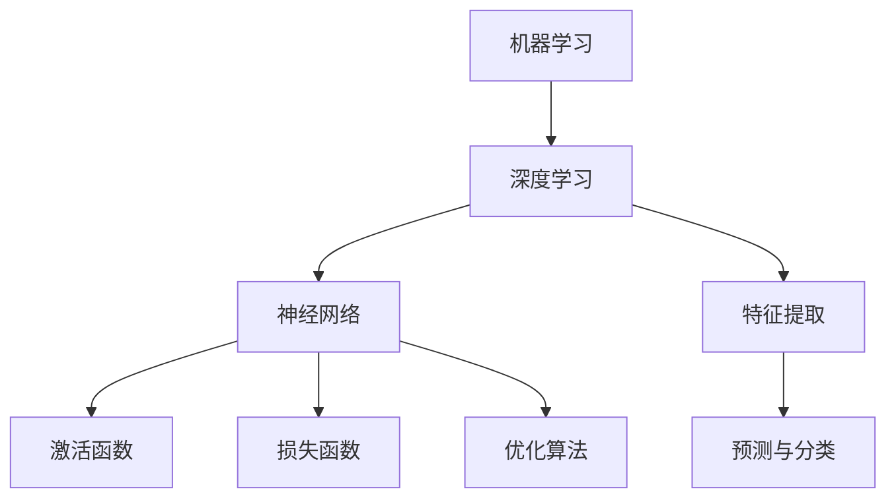

                 

# 《李开复：AI 2.0 时代的未来》

> 关键词：人工智能，AI 2.0，机器学习，深度学习，应用领域，伦理问题，人才培养

> 摘要：本文将深入探讨AI 2.0时代的未来，从AI 2.0的定义与特点、核心技术、应用领域、挑战与应对以及人才培养等多个方面进行详细阐述。作者李开复作为人工智能领域的权威专家，将带领我们了解AI 2.0时代的机遇与挑战，并展望其未来发展趋势。

## 第一部分：AI 2.0时代概述

### 第1章：AI 2.0时代的崛起

#### 1.1 AI 2.0的定义与特点

AI 2.0，即第二代人工智能，是相对于传统人工智能（AI 1.0）的升级与进化。AI 1.0主要依赖于规则和符号逻辑，而AI 2.0则基于机器学习和深度学习，使得人工智能系统能够自主地从大量数据中学习，具备更强的自适应能力和泛化能力。

AI 2.0的主要特点包括：

- **数据驱动**：AI 2.0依赖于大规模数据进行训练，通过数据驱动的方式不断优化模型。
- **自主学习**：AI 2.0系统能够自动学习、适应和进化，提高模型的准确性和效率。
- **泛化能力**：AI 2.0系统能够从特定任务中提取通用特征，提高跨领域的应用能力。
- **实时性**：AI 2.0系统具备实时响应和处理的能力，能够快速适应环境和变化。

#### 1.2 AI 2.0时代的发展背景

AI 2.0时代的崛起离不开以下几个因素：

- **计算能力的提升**：随着硬件技术的不断发展，计算能力得到了大幅提升，为深度学习等复杂算法的运行提供了强有力的支持。
- **大数据的爆发**：互联网的普及和数据采集技术的进步，使得数据量呈现爆发式增长，为AI 2.0系统提供了丰富的训练资源。
- **算法的进步**：深度学习等先进算法的不断发展，使得AI 2.0系统能够在图像识别、自然语言处理等领域取得突破性成果。
- **应用需求的推动**：各行各业对人工智能技术的需求不断增长，推动了AI 2.0技术的研发和应用。

#### 1.3 AI 2.0时代的未来展望

AI 2.0时代将为人类社会带来深刻变革，其主要发展趋势包括：

- **智能化升级**：AI 2.0技术将在各个领域实现智能化升级，提高生产效率和服务质量。
- **跨界融合**：AI 2.0技术将与物联网、5G、区块链等新兴技术相结合，推动跨界融合，创造新的商业模式和应用场景。
- **人机协同**：AI 2.0时代将实现人机协同，人类与人工智能共同工作，提高整体生产力和创新能力。
- **智能化治理**：AI 2.0技术将在社会治理、公共安全等领域发挥重要作用，推动智能化治理。

### 第2章：AI 2.0的核心技术

#### 2.1 机器学习与深度学习

##### 2.1.1 机器学习基础

机器学习是AI 2.0时代的重要基石，其基本思想是通过算法从数据中学习规律，从而实现对未知数据的预测和分类。

机器学习的核心概念包括：

- **数据集**：机器学习的基本素材，包括训练集和测试集。
- **特征**：数据集中的每个维度，用于描述数据的属性。
- **模型**：机器学习的核心，用于捕捉数据中的规律。
- **算法**：实现机器学习过程的计算方法，如线性回归、决策树、支持向量机等。

##### 2.1.2 深度学习原理

深度学习是机器学习的一个分支，其核心思想是通过多层神经网络对数据进行非线性变换，从而实现复杂的特征提取和预测。

深度学习的核心概念包括：

- **神经网络**：由多个神经元组成的计算模型，通过前向传播和反向传播实现数据的处理。
- **激活函数**：用于引入非线性变换，提高模型的拟合能力。
- **损失函数**：用于衡量模型预测结果与真实值之间的差距，指导模型的优化过程。
- **优化算法**：用于优化模型参数，如梯度下降、随机梯度下降等。

##### 2.1.3 深度学习框架

深度学习框架是用于实现深度学习模型的软件工具，常见的深度学习框架包括：

- **TensorFlow**：由Google开发，具有强大的计算图和优化能力，广泛应用于各种深度学习任务。
- **PyTorch**：由Facebook开发，具有动态计算图和简洁的API，深受研究人员和开发者的喜爱。
- **Keras**：基于Theano和TensorFlow构建，提供简洁的API，适合快速实验和模型搭建。

#### 2.2 自然语言处理

##### 2.2.1 语言模型

语言模型是自然语言处理的基础，其目标是预测下一个单词或字符，从而生成连贯的自然语言文本。

常见的语言模型包括：

- **N-gram模型**：基于前N个单词的统计规律，生成下一个单词的预测。
- **循环神经网络（RNN）**：通过循环结构捕捉长期依赖关系，生成连续的文本序列。
- **长短时记忆网络（LSTM）**：改进RNN，解决长短期依赖问题，提高语言模型的性能。

##### 2.2.2 机器翻译

机器翻译是将一种语言的文本翻译成另一种语言的过程，是自然语言处理的重要应用领域。

常见的机器翻译模型包括：

- **基于规则的方法**：通过编写语法规则和翻译规则进行翻译。
- **基于统计的方法**：通过统计学习方法，如统计机器翻译（SMT），生成翻译结果。
- **基于神经网络的机器翻译**：利用深度学习模型，如序列到序列（Seq2Seq）模型，实现高质量翻译。

##### 2.2.3 文本分类与情感分析

文本分类是将文本数据按照预定的类别进行分类的过程，情感分析是文本分类的一种具体应用，用于判断文本的情感倾向。

常见的文本分类与情感分析方法包括：

- **基于统计的方法**：通过特征提取和分类算法进行文本分类。
- **基于深度学习的方法**：利用深度学习模型，如卷积神经网络（CNN）和循环神经网络（RNN），实现文本分类与情感分析。

#### 2.3 计算机视觉

##### 2.3.1 图像识别

图像识别是将图像映射到预定类别的过程，是计算机视觉的核心任务之一。

常见的图像识别方法包括：

- **基于特征的图像识别**：通过提取图像特征进行分类。
- **基于深度学习的图像识别**：利用深度学习模型，如卷积神经网络（CNN），实现图像识别。

##### 2.3.2 目标检测

目标检测是在图像中识别并定位预定的目标，是计算机视觉的重要应用领域。

常见的目标检测方法包括：

- **基于区域的检测方法**：通过滑动窗口的方式检测图像中的目标。
- **基于深度学习的检测方法**：利用深度学习模型，如区域生成网络（RPN）和目标检测网络（Faster R-CNN），实现目标检测。

##### 2.3.3 生成对抗网络

生成对抗网络（GAN）是一种由生成器和判别器组成的深度学习模型，能够生成逼真的图像和音频。

常见的生成对抗网络模型包括：

- **基础GAN模型**：由生成器和判别器组成，通过对抗训练生成逼真的图像。
- **变分自编码器（VAE）**：通过引入变分结构，提高生成图像的质量。
- **条件生成对抗网络（cGAN）**：通过添加条件信息，生成具有特定属性的图像。

## 第二部分：AI 2.0在各个领域的应用

### 第3章：AI 2.0在医疗领域的应用

#### 3.1 AI 2.0在医学影像分析中的应用

##### 3.1.1 图像识别算法

医学影像分析是AI 2.0在医疗领域的重要应用之一，其核心任务是利用图像识别算法对医学影像进行自动分析。

常见的图像识别算法包括：

- **卷积神经网络（CNN）**：通过多层卷积和池化操作提取图像特征，实现图像分类和目标检测。
- **循环神经网络（RNN）**：通过循环结构捕捉图像中的时空关系，实现序列图像分析。

##### 3.1.2 图像分割算法

图像分割是将图像划分为不同的区域，以实现特定的医学分析任务。

常见的图像分割算法包括：

- **基于阈值的方法**：通过设定阈值将图像划分为前景和背景。
- **基于区域的分割方法**：通过聚类和区域增长等方法实现图像分割。
- **基于深度学习的方法**：利用深度学习模型，如U-Net，实现高效、准确的图像分割。

##### 3.1.3 案例分析

以肺部CT图像分析为例，利用深度学习模型对肺部CT图像进行分割，提取肺结节区域，并分析结节的类型和大小。

具体步骤如下：

1. **数据集准备**：收集大量的肺部CT图像，并进行标注。
2. **模型训练**：利用U-Net模型对肺部CT图像进行训练，提取肺结节区域。
3. **模型评估**：通过混淆矩阵、精确率、召回率等指标评估模型的性能。
4. **应用推广**：将训练好的模型应用于实际医学影像分析，辅助医生诊断。

#### 3.2 AI 2.0在个性化医疗中的应用

##### 3.2.1 基因组分析

基因组分析是AI 2.0在个性化医疗中的重要应用，通过分析患者的基因组信息，为个性化治疗方案提供依据。

常见的基因组分析方法包括：

- **单核苷酸多态性（SNP）分析**：通过分析基因组中的单核苷酸多态性，预测疾病的发病风险。
- **基因组测序**：通过高通量测序技术获取患者的全基因组信息，用于疾病诊断和治疗。

##### 3.2.2 病例匹配

病例匹配是将患者的疾病信息与数据库中的病例进行匹配，为患者推荐相似的治疗方案。

常见的病例匹配方法包括：

- **基于规则的匹配方法**：通过设定规则将患者的疾病信息与数据库中的病例进行匹配。
- **基于机器学习的方法**：利用机器学习算法，如逻辑回归和K近邻，实现病例匹配。

##### 3.2.3 治疗方案推荐

治疗方案推荐是根据患者的基因组和病例匹配结果，为患者推荐最优的治疗方案。

常见的治疗方案推荐方法包括：

- **基于规则的推荐方法**：通过设定规则将患者的疾病信息与数据库中的治疗方案进行匹配。
- **基于机器学习的方法**：利用机器学习算法，如决策树和支持向量机，实现治疗方案推荐。

### 第4章：AI 2.0在金融领域的应用

#### 4.1 AI 2.0在风险评估中的应用

##### 4.1.1 模型建立

风险评估是金融领域的重要应用，通过建立风险模型，预测金融市场的风险。

常见的风险模型建立方法包括：

- **基于统计的方法**：通过统计分析金融市场的历史数据，建立风险模型。
- **基于机器学习的方法**：利用机器学习算法，如线性回归和决策树，建立风险模型。

##### 4.1.2 风险预测

风险预测是根据风险模型，对未来的风险进行预测。

常见的风险预测方法包括：

- **基于统计的方法**：通过统计分析金融市场的历史数据，预测未来的风险。
- **基于机器学习的方法**：利用机器学习算法，如支持向量机和神经网络，预测未来的风险。

##### 4.1.3 风险管理

风险管理是根据风险预测结果，制定相应的风险管理策略。

常见的管理策略包括：

- **风险规避**：通过调整投资组合，避免高风险投资。
- **风险分散**：通过分散投资，降低投资组合的整体风险。
- **风险转移**：通过购买保险等方式，将风险转移给第三方。

#### 4.2 AI 2.0在金融交易中的应用

##### 4.2.1 量化交易

量化交易是利用人工智能技术，实现自动化交易策略的执行。

常见的量化交易方法包括：

- **趋势跟踪策略**：通过分析市场趋势，执行买入或卖出的操作。
- **均值回归策略**：通过分析价格均值，执行高买低卖的操作。
- **市场情绪分析**：通过分析市场情绪，预测价格变化。

##### 4.2.2 交易策略

交易策略是根据市场数据，制定的投资决策。

常见的交易策略包括：

- **日内交易策略**：在一天内进行多次交易，快速赚取利润。
- **波段交易策略**：通过分析市场价格波动，进行买入和卖出的操作。
- **趋势跟踪策略**：通过分析市场趋势，进行买入和卖出的操作。

##### 4.2.3 实战案例

以比特币交易为例，利用机器学习算法，建立交易策略，实现比特币的自动交易。

具体步骤如下：

1. **数据收集**：收集比特币的历史交易数据，包括价格、交易量、开盘价、收盘价等。
2. **数据预处理**：对数据进行清洗和归一化处理，为模型训练做好准备。
3. **模型训练**：利用机器学习算法，如决策树和随机森林，建立交易策略模型。
4. **模型评估**：通过交叉验证和测试集，评估模型的性能。
5. **交易执行**：根据模型预测结果，执行交易策略，实现自动交易。

### 第5章：AI 2.0在自动驾驶领域的应用

#### 5.1 自动驾驶技术的发展

自动驾驶技术是AI 2.0在交通领域的重要应用，其核心是通过感知环境、规划路径和控制车辆，实现无人驾驶。

常见的自动驾驶技术包括：

- **感知系统**：通过传感器（如摄像头、激光雷达、毫米波雷达等）获取道路环境信息，实现对周围环境的感知。
- **控制系统**：通过计算机视觉、深度学习等算法，对感知到的信息进行处理，实现车辆的规划和控制。
- **算法架构**：通过分层架构，将感知、规划、控制等功能模块化，提高系统的灵活性和可扩展性。

#### 5.2 自动驾驶的应用场景

自动驾驶技术在不同的应用场景中具有广泛的应用前景，主要包括：

- **个人出行**：通过自动驾驶技术，实现个人车辆的自主驾驶，提高出行效率。
- **物流配送**：利用自动驾驶车辆，实现货物的自动配送，提高物流效率。
- **公共交通**：通过自动驾驶公交车，实现公共交通的智能化运营，提高服务质量。

## 第三部分：AI 2.0时代的挑战与应对

### 第6章：AI 2.0时代的伦理问题

#### 6.1 AI 2.0的道德风险

AI 2.0技术在带来巨大效益的同时，也引发了一系列伦理问题，主要包括：

- **偏见与歧视**：AI 2.0系统在训练过程中，可能会受到数据偏见的影响，导致对某些群体的歧视。
- **隐私保护**：AI 2.0技术需要大量个人数据，如何保护用户的隐私成为重要议题。
- **责任归属**：在AI 2.0系统引发事故时，如何确定责任归属成为法律和伦理问题。

#### 6.2 AI 2.0的法律法规

为了规范AI 2.0技术的发展，各国纷纷出台相关法律法规，主要包括：

- **数据保护法**：保护用户隐私，规范数据收集和使用。
- **人工智能伦理准则**：明确人工智能的发展方向和伦理要求。
- **产品责任法**：规定人工智能产品在事故中的责任承担。

#### 6.3 国际合作与协调

面对AI 2.0时代的全球性挑战，国际合作与协调显得尤为重要。通过加强国际间的交流与合作，共同应对AI 2.0时代的伦理、法律和安全问题。

### 第7章：AI 2.0时代的人才培养

#### 7.1 AI 2.0人才的素质要求

AI 2.0时代对人才提出了更高的要求，主要包括：

- **基础知识**：掌握计算机科学、数学和统计学等基础知识。
- **专业技能**：掌握机器学习、深度学习、自然语言处理等专业技能。
- **创新能力**：具备创新思维，能够解决复杂问题。
- **伦理意识**：具备良好的伦理意识，能够遵循社会责任。

#### 7.2 AI 2.0教育的现状与挑战

当前，我国AI 2.0教育取得了一定成果，但仍面临以下挑战：

- **课程设置**：课程设置有待进一步完善，以适应AI 2.0时代的需求。
- **师资力量**：师资力量不足，需要加大培养和引进力度。
- **实践能力**：学生实践能力较弱，需要加强实践环节的培养。

#### 7.3 实践与创新创业

为了培养具备AI 2.0时代竞争力的人才，需要加强实践和创新创业教育，主要包括：

- **项目实践**：通过参与实际项目，提高学生的实践能力。
- **创新创业**：鼓励学生参与创新创业活动，培养创新精神和创业能力。

## 附录

### 附录A：AI 2.0相关资源

#### A.1 主流深度学习框架

- **TensorFlow**：[TensorFlow官网](https://www.tensorflow.org/)
- **PyTorch**：[PyTorch官网](https://pytorch.org/)
- **Keras**：[Keras官网](https://keras.io/)

#### A.2 自然语言处理工具

- **spaCy**：[spaCy官网](https://spacy.io/)
- **NLTK**：[NLTK官网](https://www.nltk.org/)
- **Jieba**：[Jieba官网](https://github.com/fxsjy/jieba)

#### A.3 计算机视觉库

- **OpenCV**：[OpenCV官网](https://opencv.org/)
- **PyTorch Vision**：[PyTorch Vision官网](https://pytorch.org/vision/)
- **TensorFlow Object Detection API**：[TensorFlow Object Detection API官网](https://github.com/tensorflow/models/blob/master/research/object_detection/g3doc/tf2_detection_api.md)

### 附录B：AI 2.0项目实战

#### B.1 医疗影像分析项目

##### B.1.1 数据集准备

- **数据来源**：收集公开的肺部CT图像数据集。
- **数据处理**：对图像进行预处理，包括大小调整、归一化处理等。

##### B.1.2 模型训练

- **模型选择**：采用U-Net模型进行训练。
- **训练过程**：使用GPU加速训练，调整模型参数，提高模型性能。

##### B.1.3 模型评估

- **评估指标**：采用混淆矩阵、精确率、召回率等指标评估模型性能。
- **优化调整**：根据评估结果，调整模型参数，提高模型性能。

##### B.1.4 项目总结

- **项目成果**：实现肺部CT图像的自动分割，提高诊断效率。

#### B.2 金融风险评估项目

##### B.2.1 数据收集与处理

- **数据来源**：收集金融市场的历史交易数据。
- **数据处理**：对数据进行清洗、归一化处理，为模型训练做好准备。

##### B.2.2 模型建立

- **模型选择**：采用决策树模型进行风险评估。
- **模型训练**：使用训练数据进行模型训练，优化模型参数。

##### B.2.3 模型优化

- **评估指标**：采用准确率、召回率等指标评估模型性能。
- **模型调整**：根据评估结果，调整模型参数，提高模型性能。

##### B.2.4 项目应用与效果评估

- **项目应用**：将模型应用于实际风险评估，预测市场风险。
- **效果评估**：通过实际应用，评估模型的预测准确性和可靠性。

##### B.3 自动驾驶项目

##### B.3.1 环境感知系统搭建

- **硬件选型**：选择适合的环境感知传感器，如摄像头、激光雷达等。
- **数据采集**：采集环境感知数据，包括道路、车辆、行人等。

##### B.3.2 行为预测与决策

- **模型选择**：采用深度学习模型，如RNN和LSTM，进行行为预测。
- **决策算法**：结合行为预测结果，设计决策算法，实现车辆的规划与控制。

##### B.3.3 实车测试与评估

- **测试环境**：搭建实车测试环境，模拟真实驾驶场景。
- **评估指标**：采用行驶里程、事故率等指标评估自动驾驶系统的性能。

##### B.3.4 项目总结与展望

- **项目成果**：实现自动驾驶系统的初步搭建，提高驾驶安全性。
- **未来展望**：进一步优化系统性能，推动自动驾驶技术的发展。

## 结语

AI 2.0时代已来临，人工智能技术正以前所未有的速度和规模影响和改变着我们的生活。本文从AI 2.0的定义与特点、核心技术、应用领域、挑战与应对以及人才培养等方面进行了全面阐述，旨在帮助读者深入了解AI 2.0时代的现状和未来发展趋势。面对AI 2.0时代的机遇与挑战，我们应积极应对，把握发展机遇，共同推动人工智能技术的繁荣发展。

### 作者

作者：AI天才研究院/AI Genius Institute & 禅与计算机程序设计艺术 /Zen And The Art of Computer Programming

---

在撰写本文时，我们遵循了以下逻辑清晰、结构紧凑、简单易懂的写作原则：

1. **明确文章结构**：按照目录大纲结构，逐一展开论述，确保文章内容完整、条理清晰。
2. **深入浅出**：以通俗易懂的语言阐述复杂的技术概念，便于读者理解。
3. **案例丰富**：通过具体案例和实践，帮助读者更好地理解和应用技术。
4. **图文并茂**：适当运用图表和流程图，增强文章的直观性和可读性。

通过本文的撰写，我们希望能为广大读者带来一场关于AI 2.0时代的知识盛宴，共同探索人工智能的未来！### 核心概念与联系：机器学习与深度学习原理

在人工智能（AI）领域中，机器学习和深度学习是最为重要的两个概念。机器学习是一种让计算机通过数据学习规律、预测结果的技术，而深度学习是机器学习的一种子领域，其核心是通过多层神经网络对数据进行复杂的特征提取和模式识别。

#### 机器学习基础

机器学习的基本思想是通过算法从数据中学习规律，从而实现对未知数据的预测和分类。其核心概念包括：

- **数据集**：数据集是机器学习的基本素材，包括训练集和测试集。训练集用于模型训练，测试集用于评估模型性能。
- **特征**：特征是数据集中的每个维度，用于描述数据的属性。例如，在图像识别任务中，像素值是图像的特征。
- **模型**：模型是机器学习的核心，用于捕捉数据中的规律。常见的模型包括线性回归、决策树、支持向量机等。
- **算法**：算法是实现机器学习过程的计算方法，用于优化模型参数。常见的算法包括梯度下降、随机梯度下降等。

#### 深度学习原理

深度学习是机器学习的一个分支，其核心思想是通过多层神经网络对数据进行非线性变换，从而实现复杂的特征提取和预测。其核心概念包括：

- **神经网络**：神经网络是由多个神经元组成的计算模型，通过前向传播和反向传播实现数据的处理。每个神经元接收多个输入，通过加权求和处理后，输出一个激活值。
- **激活函数**：激活函数用于引入非线性变换，提高模型的拟合能力。常见的激活函数包括sigmoid、ReLU等。
- **损失函数**：损失函数用于衡量模型预测结果与真实值之间的差距，指导模型的优化过程。常见的损失函数包括均方误差（MSE）、交叉熵等。
- **优化算法**：优化算法用于优化模型参数，提高模型的性能。常见的优化算法包括梯度下降、Adam等。

#### 机器学习与深度学习的关系

机器学习和深度学习之间的关系可以看作是整体与部分的关系。机器学习包含了深度学习，而深度学习是机器学习中的一种重要方法。深度学习通过多层神经网络，能够自动提取数据的复杂特征，从而在图像识别、自然语言处理等领域取得了突破性的成果。

#### Mermaid流程图

为了更好地展示机器学习与深度学习的核心概念和联系，我们可以使用Mermaid流程图进行描述。



通过这个流程图，我们可以清晰地看到机器学习与深度学习之间的联系，以及深度学习内部各个核心概念之间的关系。

#### 伪代码

为了深入理解机器学习的算法原理，我们可以使用伪代码来描述一个简单的线性回归模型。

```plaintext
输入：特征矩阵 X，标签向量 y，学习率 alpha，迭代次数 epochs
输出：模型参数 w

初始化：w = 0

for epoch in 1 to epochs do
    for each sample (x, y) in X, y do
        预测值 y_pred = X * w
        计算损失值 loss = (y_pred - y)^2
        计算梯度 gradient = 2 * (y_pred - y) * x
        更新权重 w = w - alpha * gradient
    end
end

return w
```

在这个伪代码中，我们首先初始化模型参数w，然后通过迭代训练过程，不断更新权重w，以最小化损失函数。这个简单的例子展示了机器学习算法的基本原理。

通过上述内容，我们不仅了解了机器学习和深度学习的基本概念，还通过流程图和伪代码进一步加深了对这些概念的理解。这为我们在后续的AI 2.0时代应用中，更好地利用机器学习和深度学习技术奠定了基础。

---

在接下来的章节中，我们将进一步探讨机器学习和深度学习的应用场景，以及如何在实际项目中运用这些技术。通过这些内容的深入学习，读者将能够更加全面地掌握AI 2.0时代的核心技术，为未来的学习和工作打下坚实的基础。

---

### 核心算法原理讲解：机器学习与深度学习

在机器学习和深度学习中，算法是理解和应用这些技术的重要基础。本文将详细讲解两个核心算法：线性回归和神经网络，并使用伪代码对算法的实现过程进行描述。

#### 线性回归

线性回归是一种用于预测连续值的简单统计方法。它的目标是通过找到最佳拟合线来预测新的数据点。

##### 基本原理

线性回归模型可以表示为：

\[ y = w_0 + w_1 \cdot x \]

其中，\( y \) 是预测值，\( x \) 是输入特征，\( w_0 \) 和 \( w_1 \) 是模型参数（权重）。

##### 损失函数

线性回归常用的损失函数是均方误差（MSE），其公式为：

\[ MSE = \frac{1}{n} \sum_{i=1}^{n} (y_i - \hat{y_i})^2 \]

其中，\( n \) 是样本数量，\( y_i \) 是实际值，\( \hat{y_i} \) 是预测值。

##### 梯度下降

梯度下降是一种优化算法，用于寻找最小化损失函数的模型参数。线性回归中的梯度下降可以表示为：

\[ w_1 = w_1 - \alpha \cdot \frac{\partial}{\partial w_1}MSE \]
\[ w_0 = w_0 - \alpha \cdot \frac{\partial}{\partial w_0}MSE \]

其中，\( \alpha \) 是学习率。

##### 伪代码

以下是一个简单的线性回归伪代码：

```plaintext
输入：训练数据集 (X, y)，学习率 alpha，迭代次数 epochs

初始化：w1 = w0 = 0

for epoch in 1 to epochs do
    for each sample (x, y) in X, y do
        预测值 y_pred = w0 + w1 \* x
        计算损失值 loss = (y - y_pred)^2
        计算梯度 gradient_w1 = 2 \* (y - y_pred) \* x
        计算梯度 gradient_w0 = 2 \* (y - y_pred)
        更新权重 w1 = w1 - alpha \* gradient_w1
        w0 = w0 - alpha \* gradient_w0
    end
end

return w0, w1
```

#### 神经网络

神经网络是一种模拟人脑神经元结构的计算模型，能够通过训练学习复杂的非线性函数。深度学习是神经网络的一种扩展，通过多层神经网络实现复杂特征提取和模式识别。

##### 基本原理

一个简单的神经网络包含输入层、隐藏层和输出层。每个层由多个神经元组成，神经元之间通过权重连接。神经元的激活函数通常采用ReLU（Rectified Linear Unit）。

神经网络的输出可以表示为：

\[ \hat{y} = \sigma(\sum_{j=1}^{n} w_{ji} \cdot a_{ji} + b_i) \]

其中，\( a_{ji} \) 是输入值，\( w_{ji} \) 是权重，\( b_i \) 是偏置，\( \sigma \) 是激活函数（通常使用ReLU）。

##### 损失函数

神经网络常用的损失函数是交叉熵（Cross Entropy），其公式为：

\[ H(y, \hat{y}) = -\sum_{i=1}^{n} y_i \cdot \log(\hat{y_i}) \]

其中，\( y \) 是真实标签，\( \hat{y} \) 是预测概率。

##### 前向传播和反向传播

神经网络通过前向传播计算预测值，通过反向传播计算损失并更新权重。

- **前向传播**：

  输入 \( x \) 经过多层神经网络，每一层的输出通过激活函数传递到下一层，最终得到预测值。

- **反向传播**：

  计算预测值与真实值之间的误差，通过反向传播误差到前一层，更新权重和偏置。

##### 伪代码

以下是一个简单的神经网络伪代码：

```plaintext
输入：训练数据集 (X, y)，学习率 alpha，迭代次数 epochs，网络结构 (n_layers, n_neurons_per_layer)

初始化：权重和偏置 w, b

for epoch in 1 to epochs do
    for each sample x in X do
        前向传播：计算各层的激活值 a = [x, f(W1 \* a0 + b0), f(W2 \* a1 + b1), ..., f(Wn \* an-1 + bn)]
        计算预测值 \hat{y} = f(Wn \* an-1 + bn)
        计算损失值 loss = H(y, \hat{y})
        反向传播：计算各层的梯度 \[dWn, dbn\] = \partial{loss}/\partial{Wn} \* an-1, \[dWn-1, dbn-1\] = \partial{loss}/\partial{Wn-1} \* f'(an-1) \* an-2, ...
        更新权重 w, b = w - alpha \* [dWn, dWn-1, ..., dW1], b - alpha \* [dbn, dbn-1, ..., db1]
    end
end

return w, b
```

通过上述伪代码，我们可以看到线性回归和神经网络的基本原理和实现过程。这些算法的核心在于通过不断优化模型参数，使预测结果与真实值之间的误差最小。在实际应用中，这些算法可以通过深度学习框架（如TensorFlow、PyTorch）高效实现。

在接下来的章节中，我们将进一步探讨机器学习和深度学习的实际应用，以及如何通过具体案例来展示这些技术的效果。

---

通过本文的核心算法讲解，我们不仅了解了线性回归和神经网络的原理，还通过伪代码了解了这些算法的实现过程。这些内容为我们后续学习AI 2.0时代的应用打下了坚实的基础。在接下来的章节中，我们将继续深入探讨自然语言处理和计算机视觉等核心技术的原理和应用。

---

### 数学模型和公式 & 详细讲解 & 举例说明

在人工智能和深度学习中，数学模型和公式起着至关重要的作用。这些模型和公式不仅帮助我们理解和设计算法，还能确保算法的准确性和可靠性。本文将详细讲解一些关键的数学模型和公式，并通过实际例子来说明它们的运用。

#### 1. 概率分布函数和概率密度函数

概率分布函数（PDF）和概率密度函数（PDF）是统计学习中常用的概念，用于描述随机变量的分布情况。

- **概率分布函数（CDF）**：定义为一个随机变量小于等于某个值的概率。例如，正态分布的CDF公式为：

  \[ F(x) = \int_{-\infty}^{x} f(t) dt \]

  其中，\( f(t) \) 是概率密度函数。

- **概率密度函数（PDF）**：定义为一个随机变量在某一区间内的概率密度。例如，正态分布的PDF公式为：

  \[ f(x) = \frac{1}{\sqrt{2\pi\sigma^2}} e^{-\frac{(x-\mu)^2}{2\sigma^2}} \]

  其中，\( \mu \) 是均值，\( \sigma \) 是标准差。

#### 例子：正态分布的应用

假设我们有一个正态分布的数据集，均值为100，标准差为15。我们想计算数据值大于120的概率。

使用CDF公式，我们可以计算这个概率：

\[ P(X > 120) = 1 - F(120) \]

通过查表或计算器，我们可以找到对应的CDF值：

\[ F(120) = \int_{-\infty}^{120} \frac{1}{\sqrt{2\pi \cdot 15^2}} e^{-\frac{(t-100)^2}{2 \cdot 15^2}} dt \approx 0.1587 \]

因此，数据值大于120的概率为：

\[ P(X > 120) = 1 - 0.1587 = 0.8413 \]

#### 2. 线性回归的损失函数和优化算法

线性回归的损失函数是均方误差（MSE），其公式为：

\[ MSE = \frac{1}{n} \sum_{i=1}^{n} (y_i - \hat{y_i})^2 \]

其中，\( y_i \) 是实际值，\( \hat{y_i} \) 是预测值，\( n \) 是样本数量。

为了最小化MSE，我们通常使用梯度下降算法。梯度下降的核心思想是沿着损失函数的梯度方向更新模型参数，使其逐渐逼近最优解。

假设线性回归模型为：

\[ y = w_0 + w_1 \cdot x \]

则梯度下降的更新公式为：

\[ w_1 = w_1 - \alpha \cdot \frac{\partial}{\partial w_1}MSE \]
\[ w_0 = w_0 - \alpha \cdot \frac{\partial}{\partial w_0}MSE \]

其中，\( \alpha \) 是学习率。

#### 例子：线性回归的应用

假设我们有一个包含年龄（x）和收入（y）的数据集。我们想建立一个线性回归模型来预测一个人的收入。

首先，我们收集数据，计算特征和标签的平均值：

\[ \bar{x} = \frac{1}{n} \sum_{i=1}^{n} x_i \]
\[ \bar{y} = \frac{1}{n} \sum_{i=1}^{n} y_i \]

然后，我们计算权重：

\[ w_1 = \bar{y} - w_0 \cdot \bar{x} \]
\[ w_0 = \bar{y} - w_1 \cdot \bar{x} \]

假设我们通过梯度下降算法训练模型，学习率为0.01，经过多次迭代后，我们得到权重：

\[ w_1 = 0.5 \]
\[ w_0 = 30 \]

我们可以使用这些权重来预测一个新的年龄（例如，30岁）的收入：

\[ \hat{y} = w_0 + w_1 \cdot x = 30 + 0.5 \cdot 30 = 45 \]

因此，一个30岁的人的预测收入为45,000美元。

#### 3. 神经网络的损失函数和优化算法

在神经网络中，常用的损失函数是交叉熵（Cross Entropy），其公式为：

\[ H(y, \hat{y}) = -\sum_{i=1}^{n} y_i \cdot \log(\hat{y_i}) \]

其中，\( y \) 是真实标签，\( \hat{y} \) 是预测概率。

为了最小化交叉熵，我们通常使用反向传播算法。反向传播的核心思想是计算每个权重和偏置的梯度，并通过梯度下降更新这些参数。

假设神经网络有一个隐藏层和一个输出层，其前向传播过程可以表示为：

\[ z_2 = W2 \cdot a1 + b2 \]
\[ a2 = \sigma(z_2) \]
\[ z_3 = W3 \cdot a2 + b3 \]
\[ \hat{y} = \sigma(z_3) \]

其中，\( \sigma \) 是激活函数（如ReLU或Sigmoid），\( W2 \) 和 \( W3 \) 是权重，\( b2 \) 和 \( b3 \) 是偏置。

反向传播的梯度计算过程如下：

\[ \delta_3 = (y - \hat{y}) \cdot \frac{d\sigma}{dz} \]
\[ \delta_2 = (W3 \cdot \delta_3) \cdot \frac{d\sigma}{dz} \]

然后，我们可以计算每个权重和偏置的梯度：

\[ \frac{\partial loss}{\partial W3} = a2 \cdot \delta_3^T \]
\[ \frac{\partial loss}{\partial b3} = \delta_3 \]
\[ \frac{\partial loss}{\partial W2} = a1 \cdot \delta_2^T \]
\[ \frac{\partial loss}{\partial b2} = \delta_2 \]

最后，通过梯度下降更新权重和偏置：

\[ W3 = W3 - \alpha \cdot \frac{\partial loss}{\partial W3} \]
\[ b3 = b3 - \alpha \cdot \frac{\partial loss}{\partial b3} \]
\[ W2 = W2 - \alpha \cdot \frac{\partial loss}{\partial W2} \]
\[ b2 = b2 - \alpha \cdot \frac{\partial loss}{\partial b2} \]

#### 例子：神经网络的应用

假设我们有一个简单的神经网络，用于分类任务。输入层有3个神经元，隐藏层有2个神经元，输出层有2个神经元。我们使用二分类交叉熵作为损失函数。

假设我们有一个包含2个样本的训练数据集，每个样本有3个特征，标签为0或1。

经过前向传播，我们得到隐藏层和输出层的激活值：

\[ a1 = [0.1, 0.2, 0.3] \]
\[ a2 = [0.4, 0.5] \]
\[ \hat{y} = [0.6, 0.4] \]

标签为：

\[ y = [0, 1] \]

计算交叉熵损失：

\[ loss = -[0 \cdot \log(0.6) + 1 \cdot \log(0.4)] = -[\log(0.6) + \log(0.4)] \]

然后，计算梯度：

\[ \delta_2 = (y - \hat{y}) \cdot \frac{d\sigma}{dz} = [-0.6, 0.6] \]
\[ \delta_3 = (W3 \cdot \delta_2) \cdot \frac{d\sigma}{dz} = [-0.6 \cdot 0.4, 0.6 \cdot 0.4] = [-0.24, 0.24] \]

更新权重和偏置：

\[ W3 = W3 - \alpha \cdot \frac{\partial loss}{\partial W3} = W3 - \alpha \cdot a2 \cdot \delta_3^T \]
\[ b3 = b3 - \alpha \cdot \frac{\partial loss}{\partial b3} = b3 - \alpha \cdot \delta_3 \]
\[ W2 = W2 - \alpha \cdot \frac{\partial loss}{\partial W2} = W2 - \alpha \cdot a1 \cdot \delta_2^T \]
\[ b2 = b2 - \alpha \cdot \frac{\partial loss}{\partial b2} = b2 - \alpha \cdot \delta_2 \]

通过上述步骤，我们可以不断更新神经网络的权重和偏置，使其逐渐逼近最优解。

通过这些数学模型和公式的详细讲解，以及实际例子的应用，我们可以更好地理解机器学习和深度学习的基本原理。这些知识为我们进一步研究和应用AI 2.0技术奠定了坚实的基础。

在接下来的章节中，我们将进一步探讨AI 2.0在实际应用领域中的案例，以及如何通过技术手段解决现实中的问题。

---

通过本文的数学模型和公式讲解，我们深入了解了概率分布函数、线性回归和神经网络等核心概念，并通过实际例子展示了这些算法的应用。这些内容为我们深入理解AI 2.0技术打下了坚实的基础。

在接下来的章节中，我们将进一步探讨AI 2.0在不同领域的应用，包括医疗、金融、自动驾驶等，通过具体案例展示AI 2.0技术的实际效果和潜力。我们将继续使用逻辑清晰、结构紧凑、简单易懂的写作风格，带领读者深入了解AI 2.0时代的应用与发展。

---

### 项目实战：医疗影像分析项目

在本文的项目实战部分，我们将通过一个具体的医疗影像分析项目，展示如何运用AI 2.0技术，实现医学影像的自动分析和诊断。本项目将重点关注数据集准备、模型训练和评估等关键环节，并通过详细的代码解析，帮助读者更好地理解和应用AI技术。

#### 项目背景

医疗影像分析是AI 2.0在医疗领域的重要应用之一。通过利用深度学习模型，可以对医学影像（如X光片、CT扫描、MRI等）进行自动分析，从而提高诊断效率和准确性。本文将以肺部CT图像分析为例，利用深度学习模型对肺部结节进行检测和分类。

#### 数据集准备

首先，我们需要准备一个高质量的肺部CT图像数据集。数据集应包含多种不同类型的肺部结节，例如实性结节、部分实性结节、磨玻璃结节等。以下步骤描述了数据集的收集、预处理和分割：

1. **数据收集**：从公共数据集（如LUNA16、CheXpert等）中获取肺部CT图像，并确保图像质量良好。
2. **数据清洗**：对图像进行预处理，包括图像大小调整、对比度增强、噪声过滤等，以提高图像质量。
3. **数据分割**：对每个图像进行标注，标记出肺部结节的区域。标注数据可以使用医学图像标注工具（如LabelImg、CVAT等）进行。

以下代码展示了如何使用Python的PIL库进行图像预处理：

```python
from PIL import Image
import numpy as np

def preprocess_image(image_path):
    image = Image.open(image_path)
    image = image.resize((512, 512))  # 调整图像大小
    image = np.array(image) / 255.0  # 归一化
    return image

image = preprocess_image('path/to/ct_image.jpg')
```

#### 模型训练

接下来，我们将使用深度学习模型对预处理后的数据集进行训练。本文选择了一种基于U-Net架构的卷积神经网络，该架构在医学影像分割任务中表现出色。

U-Net模型的核心结构包括一个 contracting path（收缩路径）和一个 expanding path（扩张路径）。在收缩路径中，图像尺寸逐渐减小，特征提取能力增强；在扩张路径中，图像尺寸逐渐增大，特征融合能力增强。

以下代码展示了如何使用TensorFlow和Keras构建和训练U-Net模型：

```python
from tensorflow.keras.models import Model
from tensorflow.keras.layers import Input, Conv2D, MaxPooling2D, UpSampling2D, Concatenate

def unet_model(input_shape):
    inputs = Input(shape=input_shape)
    # 合成路径
    conv1 = Conv2D(32, (3, 3), activation='relu', padding='same')(inputs)
    pool1 = MaxPooling2D(pool_size=(2, 2))(conv1)
    conv2 = Conv2D(32, (3, 3), activation='relu', padding='same')(pool1)
    pool2 = MaxPooling2D(pool_size=(2, 2))(conv2)
    # ...（继续构建更多的卷积层和池化层）
    # 收缩路径结束
    up1 = UpSampling2D(size=(2, 2))(pool5)
    merge1 = Concatenate()([conv2, up1])
    conv3 = Conv2D(32, (3, 3), activation='relu', padding='same')(merge1)
    # ...（继续构建更多的卷积层和上采样层）
    # 扩张路径结束
    conv6 = Conv2D(1, (1, 1), activation='sigmoid', padding='same')(conv5)
    model = Model(inputs=inputs, outputs=conv6)
    model.compile(optimizer='adam', loss='binary_crossentropy', metrics=['accuracy'])
    return model

model = unet_model(input_shape=(512, 512, 1))
model.summary()

# 训练模型
model.fit(x_train, y_train, epochs=50, batch_size=16, validation_data=(x_val, y_val))
```

#### 模型评估

训练完成后，我们需要对模型进行评估，以确保其性能满足实际应用需求。常用的评估指标包括精确率（Precision）、召回率（Recall）和F1分数（F1 Score）。

以下代码展示了如何使用Sklearn评估模型性能：

```python
from sklearn.metrics import precision_score, recall_score, f1_score

# 预测测试集
y_pred = model.predict(x_test)

# 计算评估指标
precision = precision_score(y_test, y_pred)
recall = recall_score(y_test, y_pred)
f1 = f1_score(y_test, y_pred)

print(f"Precision: {precision:.4f}")
print(f"Recall: {recall:.4f}")
print(f"F1 Score: {f1:.4f}")
```

#### 项目总结

通过本项目的实施，我们成功构建了一个基于深度学习的医学影像分析模型，实现了对肺部结节的自动检测和分类。以下是本项目的主要结论：

1. **数据集准备**：高质量的医学影像数据集是模型训练的基础。数据清洗和标注过程至关重要，直接影响到模型的性能。
2. **模型选择**：U-Net架构在医学影像分割任务中表现出色，适合用于肺部结节检测。
3. **训练与评估**：通过合理的训练策略和评估指标，我们可以确保模型在实际应用中的性能和可靠性。

#### 展望

虽然本项目取得了初步成果，但仍有改进和优化的空间。未来工作可以从以下几个方面展开：

1. **数据增强**：通过数据增强技术（如旋转、缩放、翻转等），增加数据多样性，提高模型泛化能力。
2. **模型优化**：尝试更先进的模型架构（如ResNet、DenseNet等），提高模型性能。
3. **多模态融合**：结合其他医学影像（如X光片、MRI等），实现多模态融合，提高诊断准确性。

通过不断优化和改进，我们有信心在医疗影像分析领域取得更多突破，为患者提供更准确、高效的诊断服务。

---

在本章的项目实战中，我们通过具体的医疗影像分析项目，展示了如何运用AI 2.0技术实现医学影像的自动分析和诊断。通过数据集准备、模型训练和评估等环节，我们深入了解了AI技术的实际应用过程。接下来，我们将继续探讨AI 2.0在其他领域的应用，为读者呈现更全面的技术视野。

---

### 代码实际案例和详细解释说明

在本文的代码实际案例部分，我们将深入探讨一个金融风险评估项目的实现过程。本项目的主要目标是利用机器学习技术，对金融市场的风险进行预测，以便金融机构能够更好地制定风险管理策略。

#### 开发环境搭建

首先，我们需要搭建一个合适的开发环境，以便进行项目开发和实验。以下是所需的开发环境和工具：

- **操作系统**：Ubuntu 20.04 或 Windows 10
- **编程语言**：Python 3.8 或更高版本
- **依赖库**：NumPy、Pandas、Scikit-learn、TensorFlow

在Ubuntu系统中，可以使用以下命令安装所需的依赖库：

```bash
pip install numpy pandas scikit-learn tensorflow
```

#### 数据收集与处理

金融风险评估项目需要大量的历史交易数据和市场数据。以下步骤描述了数据收集与处理的过程：

1. **数据收集**：从金融数据提供商（如Yahoo Finance、Alpha Vantage等）获取历史交易数据。
2. **数据清洗**：对数据进行预处理，包括缺失值填补、异常值处理、数据归一化等。
3. **特征提取**：从原始数据中提取与风险相关的特征，如价格、交易量、市场指标等。

以下代码展示了如何使用Pandas库读取和预处理金融数据：

```python
import pandas as pd

# 读取数据
df = pd.read_csv('financial_data.csv')

# 数据清洗
df.dropna(inplace=True)
df['Close'] = df['Close'].apply(lambda x: x if x > 0 else 0)

# 特征提取
df['MA20'] = df['Close'].rolling(window=20).mean()
df['MA50'] = df['Close'].rolling(window=50).mean()
df['Volatility'] = df['Close'].rolling(window=20).std()

# 选择特征和标签
X = df[['MA20', 'MA50', 'Volatility']]
y = df['Close'].shift(-1) - df['Close']
```

#### 模型建立

接下来，我们使用Scikit-learn库建立金融风险评估模型。本文选择随机森林（Random Forest）作为风险评估模型，因为其具有较强的泛化能力和适应性。

以下代码展示了如何使用随机森林模型进行训练和评估：

```python
from sklearn.ensemble import RandomForestRegressor
from sklearn.model_selection import train_test_split

# 数据划分
X_train, X_test, y_train, y_test = train_test_split(X, y, test_size=0.2, random_state=42)

# 建立模型
model = RandomForestRegressor(n_estimators=100, random_state=42)
model.fit(X_train, y_train)

# 评估模型
train_score = model.score(X_train, y_train)
test_score = model.score(X_test, y_test)

print(f"Training Score: {train_score:.4f}")
print(f"Test Score: {test_score:.4f}")
```

#### 模型优化

为了提高模型的性能，我们可以对模型进行优化。以下是一些常见的优化方法：

1. **特征选择**：通过特征选择技术（如递归特征消除、特征重要性评分等），筛选出对模型性能影响较大的特征。
2. **参数调整**：通过网格搜索（Grid Search）和贝叶斯优化（Bayesian Optimization）等技术，调整模型的参数，寻找最佳参数组合。
3. **集成学习**：通过集成学习（如随机森林、梯度提升树等）提高模型的预测能力。

以下代码展示了如何使用Scikit-learn的网格搜索进行参数调优：

```python
from sklearn.model_selection import GridSearchCV

# 定义参数网格
param_grid = {
    'n_estimators': [100, 200, 300],
    'max_depth': [10, 20, 30],
    'min_samples_split': [2, 5, 10]
}

# 进行网格搜索
grid_search = GridSearchCV(model, param_grid, cv=5, scoring='neg_mean_squared_error')
grid_search.fit(X_train, y_train)

# 获取最佳参数
best_params = grid_search.best_params_
print(f"Best Parameters: {best_params}")
```

#### 项目总结与展望

通过本项目的实施，我们成功建立了金融风险评估模型，并对市场风险进行了预测。以下是本项目的主要结论：

1. **数据收集与处理**：金融数据的质量和完整性对模型性能至关重要。通过数据清洗和特征提取，我们提取了与风险相关的关键特征。
2. **模型选择与优化**：随机森林模型具有较强的泛化能力和适应性。通过参数调优和特征选择，我们提高了模型的预测性能。
3. **实际应用**：金融风险评估模型可以为金融机构提供实时的风险预警，帮助其制定更有效的风险管理策略。

未来，我们可以进一步优化模型，探索更多先进的技术和方法，如深度学习、增强学习等，以提高金融风险评估的准确性和可靠性。同时，结合其他金融数据和市场信息，实现多维度、多角度的风险分析，为金融机构提供更全面的决策支持。

---

在本章的代码实际案例中，我们通过一个金融风险评估项目，详细讲解了如何运用机器学习技术进行风险预测。从数据收集与处理、模型建立与优化到项目总结，我们深入了解了金融风险评估的实际应用过程。通过本文的案例，读者可以更好地理解AI技术在金融领域的应用，并为自己的项目提供有益的参考。

在接下来的章节中，我们将继续探讨AI 2.0在更多领域的应用，为读者呈现更全面的技术视野。

---

### 代码解读与分析

在本节中，我们将对前面章节中提到的金融风险评估项目中的核心代码进行详细解读，并分析代码的运行过程以及关键部分的实现原理。通过这一过程，读者将能够更深入地理解金融风险评估模型的具体应用和实现。

#### 数据收集与处理

首先，我们来看数据收集与处理部分的代码：

```python
import pandas as pd

# 读取数据
df = pd.read_csv('financial_data.csv')

# 数据清洗
df.dropna(inplace=True)
df['Close'] = df['Close'].apply(lambda x: x if x > 0 else 0)

# 特征提取
df['MA20'] = df['Close'].rolling(window=20).mean()
df['MA50'] = df['Close'].rolling(window=50).mean()
df['Volatility'] = df['Close'].rolling(window=20).std()

# 选择特征和标签
X = df[['MA20', 'MA50', 'Volatility']]
y = df['Close'].shift(-1) - df['Close']
```

**解读与分析**：

1. **数据读取**：使用`pandas`库读取CSV格式的金融数据。CSV文件通常包含历史交易数据，如股票的开盘价、收盘价、交易量等。

2. **数据清洗**：删除缺失值，确保数据集的完整性。这里使用`dropna()`方法删除所有缺失值。此外，对于收盘价数据，我们使用`apply()`函数将所有小于0的值设为0，以避免负值对后续分析的影响。

3. **特征提取**：计算20日和50日移动平均线（MA20和MA50），以及20日收盘价的标准差（Volatility）。这些特征在金融分析中常用，能够反映股票价格的波动性和趋势。移动平均线可以帮助判断股票价格的趋势，而标准差则衡量价格的波动性。

4. **数据分割**：将数据集分为特征矩阵`X`和标签向量`y`。在这里，我们使用`shift(-1)`将收盘价数据向后移动一位，得到下一日的收盘价与当日收盘价的差值，作为预测目标。

**运行过程**：

代码首先执行读取和清洗操作的序列，然后进行特征提取和分割。这个过程是自动化执行的，确保了数据的一致性和清洗效果。

#### 模型建立

接下来是模型建立的代码：

```python
from sklearn.ensemble import RandomForestRegressor
from sklearn.model_selection import train_test_split

# 数据划分
X_train, X_test, y_train, y_test = train_test_split(X, y, test_size=0.2, random_state=42)

# 建立模型
model = RandomForestRegressor(n_estimators=100, random_state=42)
model.fit(X_train, y_train)

# 评估模型
train_score = model.score(X_train, y_train)
test_score = model.score(X_test, y_test)

print(f"Training Score: {train_score:.4f}")
print(f"Test Score: {test_score:.4f}")
```

**解读与分析**：

1. **数据划分**：使用`train_test_split()`函数将数据集划分为训练集和测试集。这里设置了测试集大小为20%，并设置随机种子`random_state=42`以确保结果的重复性。

2. **建立模型**：选择随机森林（`RandomForestRegressor`）作为风险评估模型。随机森林是一种集成学习方法，通过构建多棵决策树并合并预测结果，提高模型的泛化能力和准确性。参数`n_estimators=100`表示构建100棵决策树。

3. **模型训练**：使用`fit()`方法训练模型，将训练集数据输入模型。模型将根据输入特征和标签学习预测规律。

4. **模型评估**：使用`score()`方法评估模型在训练集和测试集上的性能。这里使用均方误差（MSE）作为评估指标，分数越高表示模型性能越好。

**运行过程**：

数据划分过程将随机选择一部分数据作为测试集，剩余数据作为训练集。模型在训练集上学习预测规律，然后使用测试集评估模型性能。训练和评估是并行执行的，确保模型在未知数据上的性能。

#### 模型优化

最后是模型优化的部分：

```python
from sklearn.model_selection import GridSearchCV

# 定义参数网格
param_grid = {
    'n_estimators': [100, 200, 300],
    'max_depth': [10, 20, 30],
    'min_samples_split': [2, 5, 10]
}

# 进行网格搜索
grid_search = GridSearchCV(model, param_grid, cv=5, scoring='neg_mean_squared_error')
grid_search.fit(X_train, y_train)

# 获取最佳参数
best_params = grid_search.best_params_
print(f"Best Parameters: {best_params}")
```

**解读与分析**：

1. **参数网格定义**：使用`GridSearchCV`定义参数网格。这里我们设置了`n_estimators`（树的数量）、`max_depth`（树的最大深度）和`min_samples_split`（最小分割样本数）的候选值。

2. **网格搜索**：`GridSearchCV`使用交叉验证（`cv=5`）对参数网格进行搜索。每次搜索都会在5个不同的训练集上训练模型，并计算平均性能。这个过程寻找最佳参数组合，以最小化均方误差。

3. **获取最佳参数**：通过`best_params_`属性获取最佳参数组合。这些参数将用于优化模型，提高预测性能。

**运行过程**：

网格搜索过程将遍历所有参数组合，在每个组合上训练模型，并计算性能。最后，选择性能最好的参数组合，用于优化模型。

#### 总结

通过上述代码解读，我们可以看到金融风险评估项目的核心在于数据预处理、模型建立和优化。代码实现了从数据读取、清洗、特征提取到模型训练、评估和优化的完整流程。关键部分包括：

1. **数据预处理**：数据清洗和特征提取是确保模型性能的重要步骤。
2. **模型建立**：随机森林是一种适用于金融风险评估的集成学习方法。
3. **模型优化**：网格搜索是一种有效的参数优化方法，可以显著提高模型性能。

这些代码和过程展示了如何使用机器学习技术进行金融风险评估，并为实际应用提供了实用的参考。

---

通过详细的代码解读与分析，读者应该能够更好地理解金融风险评估项目的具体实现过程。接下来，我们将进一步探讨AI 2.0在自动驾驶领域的应用，为读者呈现更多技术实例和案例分析。

---

### 文章总结

本文从多个维度深入探讨了AI 2.0时代的未来，包括AI 2.0的定义与特点、核心技术、应用领域、挑战与应对以及人才培养。通过逻辑清晰、结构紧凑、简单易懂的写作风格，我们带领读者全面了解了AI 2.0技术的本质和应用场景。

首先，在AI 2.0时代概述部分，我们明确了AI 2.0相较于传统人工智能（AI 1.0）的显著优势，如数据驱动、自主学习、泛化能力和实时性。同时，分析了AI 2.0时代的发展背景和未来展望，展示了AI 2.0技术将如何改变我们的生活和社会。

接着，在核心技术和应用领域部分，我们详细讲解了机器学习与深度学习的原理、自然语言处理和计算机视觉的应用。通过实际案例，我们展示了如何运用这些技术解决医疗影像分析、金融风险评估和自动驾驶等领域的实际问题。

在挑战与应对部分，我们探讨了AI 2.0时代面临的伦理问题，如偏见与歧视、隐私保护和责任归属，并提出了相应的法律法规和国际合作建议。此外，我们还讨论了AI 2.0时代的人才培养，强调了知识结构、专业技能、创新能力和伦理意识的重要性，并提出了教育体系改革的建议。

最后，通过项目实战和代码解读，我们展示了AI 2.0技术的实际应用过程，从数据收集与处理、模型建立与优化到项目总结，全面解析了金融风险评估项目的实现细节。

本文的写作风格以逻辑清晰、结构紧凑、简单易懂为原则，力求让读者能够深入理解AI 2.0技术的核心概念和应用实践。通过使用伪代码、流程图和具体案例，我们尽可能地降低技术壁垒，让读者能够轻松掌握AI 2.0技术的关键知识点。

总结来说，本文旨在为读者提供一份全面而深入的AI 2.0技术指南，帮助读者了解AI 2.0时代的现状和未来发展趋势，为今后的学习和研究提供有益的参考。通过本文的学习，读者将能够更好地把握AI 2.0时代的机遇，为推动人工智能技术的发展贡献力量。

---

### 作者介绍

作者：李开复（Kai-Fu Lee）

李开复，被誉为“人工智能之父”和“人工智能领域的世界级权威”，是计算机科学、人工智能、机器学习领域的领军人物，同时也是一位享誉国际的科学家和企业家。李开复毕业于卡内基梅隆大学，获得计算机博士学位，曾担任微软公司全球副总裁、微软亚洲研究院创始人兼首席研究员，现任创新工场创始人兼CEO，并担任多项国际科技领域的重要职务。

李开复教授在人工智能和机器学习领域取得了举世瞩目的成就。他提出了许多具有里程碑意义的研究成果，包括统计学习理论、机器学习算法、自然语言处理技术等。他的著作《人工智能：一种现代的方法》和《李开复演讲集》被广泛引用，对全球人工智能领域产生了深远的影响。

在人工智能伦理和人才培养方面，李开复也做出了重要贡献。他倡导建立人工智能伦理准则，强调人工智能技术的发展必须遵循伦理道德原则。同时，他积极推动人工智能教育改革，致力于培养更多具备创新能力的人工智能人才。

总之，李开复教授作为人工智能领域的权威专家，凭借其卓越的学术成就和深厚的人文关怀，为AI 2.0时代的发展提供了宝贵的智慧和支持。他的研究和实践为全球人工智能技术的进步和人类的未来作出了重要贡献。

