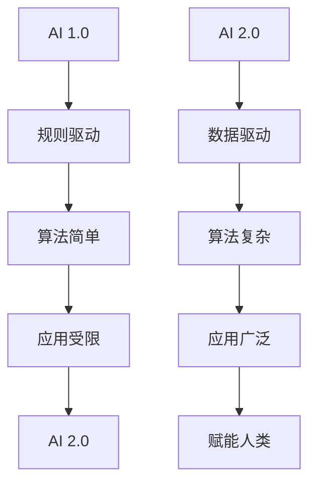
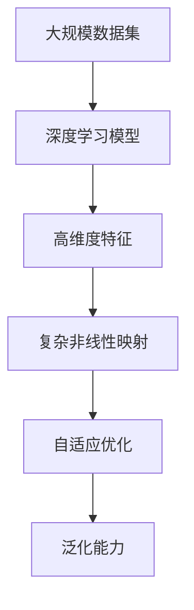
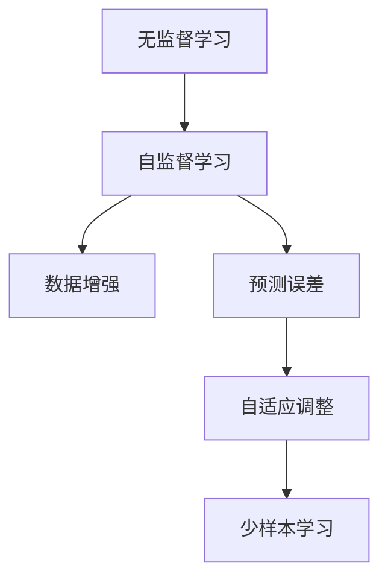
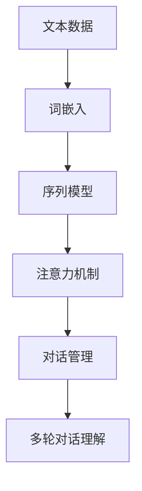

                 

### 第1章: AI 2.0的定义与特点

#### 1.1 AI 2.0的概念

AI 2.0，也称为人工智能的第二代，是相对于第一代人工智能（AI 1.0）而言的。AI 1.0主要依赖于明确的规则和预先编程的算法，而AI 2.0则更加依赖数据和机器学习算法，特别是深度学习的应用。

##### 1.1.1 AI 1.0与AI 2.0的区别

AI 1.0和AI 2.0之间有显著的差异：

- **规则驱动 vs 数据驱动**：AI 1.0依赖于明确的规则和编程逻辑，而AI 2.0则利用大量的数据进行学习和决策。
- **算法简单 vs 算法复杂**：AI 1.0的算法相对简单，而AI 2.0则利用复杂的深度学习模型和算法。
- **应用受限 vs 应用广泛**：AI 1.0的应用范围较窄，主要集中在特定任务上，而AI 2.0则可以应用于更广泛的领域，如自动驾驶、智能医疗、金融分析等。
- **赋能人类 vs 人类辅助**：AI 1.0主要是为了完成特定的任务，而AI 2.0则更多是作为人类的助手和伙伴，提高生产力和生活质量。

下面是一个Mermaid流程图，展示了AI 1.0与AI 2.0的主要区别：

#### 1.2 AI 2.0的核心特点

AI 2.0具有以下几个核心特点：

##### 1.2.1 大规模深度学习模型

AI 2.0依赖于大规模深度学习模型，这些模型能够处理大量数据，并自动学习数据中的模式和规律。以下是一个Mermaid流程图，展示了大规模深度学习模型的基本原理：

##### 1.2.2 自监督学习

自监督学习是AI 2.0的一个重要特点，它允许模型在没有明确标注的数据上进行训练。以下是一个Mermaid流程图，展示了自监督学习的基本原理：

##### 1.2.3 聊天机器人与自然语言理解

AI 2.0在自然语言处理方面取得了重大进展，特别是在聊天机器人和自然语言理解方面。以下是一个Mermaid流程图，展示了聊天机器人和自然语言理解的基本架构：

#### 1.3 AI 2.0的应用前景

AI 2.0的应用前景非常广阔，它将在多个领域带来变革：

##### 1.3.1 在金融领域的应用

AI 2.0在金融领域具有广泛的应用前景，包括：

- **智能投顾**：利用AI进行投资决策，提供个性化的投资建议。
- **风险管理**：通过分析历史数据和实时数据，预测和评估风险。
- **量化交易**：利用算法进行高频交易，实现自动化交易策略。
- **金融欺诈检测**：利用机器学习模型检测欺诈行为。

##### 1.3.2 在医疗健康领域的应用

AI 2.0在医疗健康领域的应用同样具有重要意义：

- **疾病诊断**：利用深度学习模型进行疾病预测和诊断。
- **个性化治疗**：根据患者的基因信息和生活习惯，提供个性化的治疗方案。
- **药物研发**：通过机器学习预测药物的疗效和副作用，加速新药研发。
- **健康管理**：利用可穿戴设备和大数据分析，提供个性化的健康管理服务。

##### 1.3.3 在教育领域的应用

AI 2.0在教育领域的应用也正在逐步展开：

- **个性化教育**：根据学生的学习习惯和成绩，提供个性化的学习资源和辅导。
- **智能辅导**：利用自然语言处理技术，提供在线辅导和解答学生问题。
- **课程设计**：通过分析学生的学习数据和教学反馈，优化课程内容和教学方法。
- **教育评估**：利用AI进行学生学习效果评估，提供实时反馈。

##### 1.3.4 在自动驾驶领域的应用

AI 2.0在自动驾驶领域具有巨大的潜力：

- **环境感知**：通过传感器和计算机视觉技术，实时感知周围环境。
- **路径规划**：利用机器学习算法，规划安全的行驶路径。
- **决策控制**：根据环境感知和路径规划，做出实时决策。
- **车辆协同**：利用车联网技术，实现多辆自动驾驶车辆的协同驾驶。

##### 1.4 AI 2.0的挑战与机遇

AI 2.0的发展面临着一系列挑战和机遇：

- **挑战**：
  - **数据隐私与安全**：AI 2.0依赖大量数据，数据隐私和安全是一个重要问题。
  - **伦理道德问题**：AI 2.0的决策可能涉及道德和伦理问题，需要制定相应的规范。
  - **法律法规**：AI 2.0的发展需要相应的法律法规支持，确保其合法合规。
  - **技术瓶颈**：AI 2.0的技术发展仍然面临一些瓶颈，需要进一步突破。

- **机遇**：
  - **经济增长**：AI 2.0将推动新一轮经济增长，创造大量就业机会。
  - **创新驱动**：AI 2.0将推动技术创新，引领产业发展。
  - **社会进步**：AI 2.0将改善人类生活质量，推动社会进步。
  - **新就业机会**：AI 2.0将创造新的就业机会，促进职业转型。

### 1.5 总结

AI 2.0是人工智能发展的新阶段，它依赖于大规模深度学习模型、自监督学习和自然语言处理等核心技术。AI 2.0在金融、医疗、教育和自动驾驶等领域具有广泛的应用前景，同时也面临着一系列挑战。然而，随着技术的不断进步和政策的支持，AI 2.0有望在未来带来巨大的社会和经济价值。接下来，我们将进一步探讨AI 2.0的核心算法原理和应用实践。

