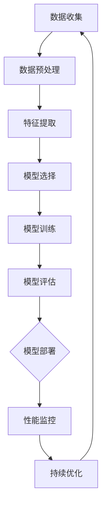

                 

# 李开复：苹果发布AI应用的开发者

## 关键词
AI，苹果，开发者，技术趋势，创新实践

## 摘要
本文由世界顶级人工智能专家李开复撰写，深入探讨了苹果公司在人工智能领域的最新动向。文章通过分析苹果在AI技术应用上的里程碑案例，揭示了开发者在新苹果生态中的角色与挑战。同时，本文还探讨了苹果AI应用的开发策略、优化路径以及未来发展趋势，为开发者提供了全面的技术指南和职业发展建议。

### 第一部分：AI与苹果的融合

#### 第1章：AI时代的苹果

##### 1.1 AI与苹果的历史与未来

1. **苹果公司在AI领域的早期探索**
   - **1.1.1 苹果公司在AI领域的早期探索**
     苹果公司在AI领域的探索可以追溯到20世纪80年代，当时他们推出了基于专家系统的AI应用程序，如“Knowledge Navigator”。这些早期的尝试奠定了苹果在人工智能领域的基础。

2. **AI在现代苹果产品中的地位**
   - **1.1.2 AI在现代苹果产品中的地位**
     随着时间的推移，苹果逐渐将AI技术融入到其产品中。从Siri语音助手到图像识别技术，再到健康应用中的机器学习模型，AI已经成为苹果产品的重要组成部分。

3. **未来AI技术对苹果生态系统的影响**
   - **1.1.3 未来AI技术对苹果生态系统的影响**
     未来，AI技术将继续推动苹果生态系统的发展。从智能家居控制到智能健康监测，再到更加智能的语音助手和内容推荐，AI将为苹果用户带来更加便捷和个性化的体验。

##### 1.2 AI应用案例解析：苹果的AI里程碑

1. **Siri的智能进化**
   - **1.2.1 Siri的智能进化**
     Siri作为苹果的智能语音助手，其智能程度不断提升。通过深度学习和自然语言处理技术，Siri能够更好地理解用户的需求，提供更加精准的回应。

2. **图像识别技术的进步**
   - **1.2.2 图像识别技术的进步**
     苹果的图像识别技术在拍照和视频编辑等方面取得了显著进展。通过机器学习和计算机视觉技术，苹果能够提供更加智能和高效的图像处理功能。

3. **ML模型在苹果健康应用中的应用**
   - **1.2.3 ML模型在苹果健康应用中的应用**
     苹果的健康应用利用机器学习模型来监测用户的心率、睡眠质量等健康指标，为用户提供个性化的健康建议。

#### 第2章：AI开发者面临的挑战与机遇

##### 2.1 开发者视角下的AI挑战

1. **数据隐私与安全**
   - **2.1.1 数据隐私与安全**
     AI应用需要处理大量的用户数据，如何确保数据隐私和安全是开发者面临的重要挑战。

2. **算法公正性与偏见**
   - **2.1.2 算法公正性与偏见**
     AI算法可能会因为训练数据的不公正而导致偏见，开发者需要关注并解决这一问题。

3. **AI模型的可解释性**
   - **2.1.3 AI模型的可解释性**
     AI模型往往被视为“黑箱”，开发者需要提高模型的可解释性，以便用户理解和信任。

##### 2.2 AI开发者在新苹果生态中的角色

1. **苹果开发工具与平台介绍**
   - **2.2.1 苹果开发工具与平台介绍**
     苹果为开发者提供了丰富的开发工具和平台，如Xcode、Swift、Core ML等，这些工具和平台为开发者构建AI应用提供了坚实的基础。

2. **AI开发者在新苹果应用中的创新机会**
   - **2.2.2 AI开发者在新苹果应用中的创新机会**
     在新苹果生态中，开发者可以利用AI技术进行创新，如智能交互、健康监测、智能家居控制等。

3. **AI创业与商业化路径**
   - **2.2.3 AI创业与商业化路径**
     AI开发者可以通过创业和商业化路径来实现自身价值，如创建AI初创公司、开发AI应用程序等。

### 第二部分：苹果AI应用的实践探索

#### 第3章：苹果AI应用的开发策略

##### 3.1 AI应用开发的基础技术

1. **自然语言处理与语音识别**
   - **3.1.1 自然语言处理与语音识别**
     自然语言处理和语音识别是AI应用开发的基础技术，开发者需要掌握这些技术来构建智能交互系统。

2. **计算机视觉技术**
   - **3.1.2 计算机视觉技术**
     计算机视觉技术在图像识别、视频分析等领域有着广泛的应用，开发者需要了解并应用这些技术。

3. **强化学习在苹果应用中的运用**
   - **3.1.3 强化学习在苹果应用中的运用**
     强化学习在智能助手、游戏推荐等领域有着广泛的应用，开发者可以尝试将强化学习应用于苹果应用中。

##### 3.2 实际案例分析：苹果的AI创新实践

1. **Apple TV+的内容推荐算法**
   - **3.2.1 Apple TV+的内容推荐算法**
     Apple TV+利用机器学习算法对用户观看行为进行分析，为用户提供个性化的内容推荐。

2. **AirPods的智能交互体验**
   - **3.2.2 AirPods的智能交互体验**
     AirPods通过语音识别技术实现了智能交互，为用户提供便捷的体验。

3. **HomeKit的智能家居控制**
   - **3.2.3 HomeKit的智能家居控制**
     HomeKit通过AI技术实现了智能家居的集中控制，为用户提供智能化的家居生活。

#### 第4章：苹果AI应用的优化与调优

##### 4.1 AI模型训练与优化的最佳实践

1. **数据集准备与预处理**
   - **4.1.1 数据集准备与预处理**
     准备高质量的数据集并进行预处理是训练高质量AI模型的关键。

2. **模型选择与调整**
   - **4.1.2 模型选择与调整**
     根据应用需求选择合适的模型，并对模型进行调整以提升性能。

3. **模型部署与性能监控**
   - **4.1.3 模型部署与性能监控**
     模型部署后，需要持续监控性能并进行优化。

##### 4.2 实际案例解析：苹果AI应用的优化路径

1. **Siri语音识别的优化过程**
   - **4.2.1 Siri语音识别的优化过程**
     Siri通过不断优化语音识别算法，提高了识别准确率和响应速度。

2. **Apple Watch健康监测的算法改进**
   - **4.2.2 Apple Watch健康监测的算法改进**
     Apple Watch通过改进健康监测算法，提供了更加准确的健康数据。

3. **面向移动端的低功耗AI模型优化**
   - **4.2.3 面向移动端的低功耗AI模型优化**
     苹果致力于优化AI模型，以实现低功耗和高性能的平衡。

### 第三部分：未来展望与趋势

#### 第5章：苹果AI应用的发展趋势

##### 5.1 AI技术的前沿发展

1. **量子计算与AI的融合**
   - **5.1.1 量子计算与AI的融合**
     量子计算与AI的结合有望推动AI技术取得重大突破。

2. **脑机接口与AI的结合**
   - **5.1.2 脑机接口与AI的结合**
     脑机接口技术将使AI能够更好地理解和响应人类的思维和情感。

3. **AI与物联网的深度融合**
   - **5.1.3 AI与物联网的深度融合**
     物联网设备的普及将使AI在智能家居、智慧城市等领域发挥更大的作用。

##### 5.2 苹果在AI领域的未来布局

1. **新一代AI硬件的研发**
   - **5.2.1 新一代AI硬件的研发**
     苹果将继续研发新一代AI硬件，如基于AI的芯片和传感器。

2. **开放平台与开发者生态**
   - **5.2.2 开放平台与开发者生态**
     苹果将通过开放平台和开发者生态，推动AI技术在苹果产品中的创新应用。

3. **AI在教育、医疗等领域的应用拓展**
   - **5.2.3 AI在教育、医疗等领域的应用拓展**
     苹果将积极探索AI在教育、医疗等领域的应用，为这些领域带来创新和变革。

#### 第6章：AI开发者的人才培养与职业发展

##### 6.1 AI开发者的核心技能培养

1. **数学与统计学基础**
   - **6.1.1 数学与统计学基础**
     数学与统计学是AI开发的基础，开发者需要掌握这些基础知识。

2. **编程语言与工具掌握**
   - **6.1.2 编程语言与工具掌握**
     开发者需要熟练掌握编程语言和工具，以提高开发效率。

3. **数据分析与机器学习框架应用**
   - **6.1.3 数据分析与机器学习框架应用**
     数据分析和机器学习框架的应用是开发者必须熟练掌握的技能。

##### 6.2 AI开发者的职业发展路径

1. **AI工程师的职业进阶**
   - **6.2.1 AI工程师的职业进阶**
     AI工程师可以通过不断学习和实践，实现职业进阶。

2. **AI创业与创业公司机遇**
   - **6.2.2 AI创业与创业公司机遇**
     AI创业者可以抓住AI技术发展的机遇，创建具有影响力的创业公司。

3. **国际视野与跨文化交流**
   - **6.2.3 国际视野与跨文化交流**
     开发者需要具备国际视野和跨文化交流能力，以适应全球化的AI发展。

### 附录

#### 附录A：苹果AI开发工具与资源指南

1. **主流开发工具与平台**
   - **A.1.1 Xcode与Swift**
   - **A.1.2 Core ML与Create ML**
   - **A.1.3 苹果开发者社区与资源**

#### 附录B：案例分析与代码解读

1. **Siri语音识别系统的代码解读**
2. **Apple Watch健康监测应用的实现**

### 附录C：Mermaid流程图与数学模型

1. **苹果AI应用开发流程图**
2. **主要算法的数学模型与伪代码**

### 作者信息

- **作者：** AI天才研究院/AI Genius Institute & 禅与计算机程序设计艺术 /Zen And The Art of Computer Programming

---

在本文中，李开复博士以深入浅出的方式，带领读者全面了解苹果公司在AI领域的最新动态和技术实践。文章涵盖了AI与苹果的融合、开发者面临的挑战与机遇、苹果AI应用的实践探索、优化与调优策略、未来展望以及开发者的人才培养与职业发展等多个方面。通过本文，读者可以了解到苹果AI应用的技术原理、实践案例以及未来发展前景，对于从事AI开发的开发者而言，无疑是一篇极具价值的技术博客文章。

---

接下来，我们将按照文章目录大纲的结构，逐步展开每个章节的内容，深入探讨苹果公司在AI领域的技术创新和实践。

---

#### 第一部分：AI与苹果的融合

##### 第1章：AI时代的苹果

随着人工智能技术的飞速发展，苹果公司也迎来了AI时代的全面到来。从早期的探索到如今的深度应用，苹果在AI领域的发展历程可谓波澜壮阔。本章节将重点介绍苹果公司在AI领域的早期探索、现代产品的AI应用以及未来AI技术对苹果生态系统的影响。

**1.1 AI与苹果的历史与未来**

**1.1.1 苹果公司在AI领域的早期探索**

早在20世纪80年代，苹果公司就开始了对人工智能的早期探索。当时的苹果推出了基于专家系统的AI应用程序，如“Knowledge Navigator”，这是一款能够预测用户需求的虚拟助理。尽管这一探索在当时并未引起广泛关注，但为苹果在AI领域的后续发展奠定了基础。

进入21世纪，苹果公司开始更加重视人工智能技术。2004年，苹果收购了Siri公司，将其智能语音助手Siri引入苹果产品。Siri的引入标志着苹果在AI领域的一次重要突破，也为其后续在AI技术的应用奠定了基础。

**1.1.2 AI在现代苹果产品中的地位**

随着人工智能技术的不断发展，苹果的产品线也逐渐融入了AI技术。从Siri智能语音助手，到图像识别技术，再到健康应用中的机器学习模型，AI已经成为苹果产品的重要组成部分。

1. **Siri智能语音助手**：
   Siri作为苹果的智能语音助手，其智能程度不断提升。通过深度学习和自然语言处理技术，Siri能够更好地理解用户的需求，提供更加精准的回应。无论是设置提醒、查询天气，还是播放音乐，Siri都展现出了强大的AI能力。

2. **图像识别技术**：
   苹果的图像识别技术在拍照和视频编辑等方面取得了显著进展。通过机器学习和计算机视觉技术，苹果能够提供更加智能和高效的图像处理功能。例如，苹果的相机应用可以自动识别人脸、风景等，并提供相应的美化效果。

3. **健康应用中的机器学习模型**：
   苹果的健康应用利用机器学习模型来监测用户的心率、睡眠质量等健康指标，为用户提供个性化的健康建议。例如，Apple Watch可以监测用户的心率变化，并在发现异常情况时发出警报。

**1.1.3 未来AI技术对苹果生态系统的影响**

未来，AI技术将继续推动苹果生态系统的发展。从智能家居控制到智能健康监测，再到更加智能的语音助手和内容推荐，AI将为苹果用户带来更加便捷和个性化的体验。

1. **智能家居控制**：
   随着AI技术的进步，苹果的智能家居控制系统将进一步智能化。用户可以通过语音助手或手机应用轻松控制家中的智能设备，如灯光、空调、门锁等，实现更加智能的家居生活。

2. **智能健康监测**：
   未来，苹果的健康应用将更加智能化，通过AI技术为用户提供更加精准的健康监测和个性化健康建议。例如，通过分析用户的生活习惯和健康数据，Apple Watch可以预测用户可能出现的健康问题，并提供相应的预防措施。

3. **智能语音助手和内容推荐**：
   随着AI技术的进步，Siri的智能程度将进一步提升，能够更好地理解用户的语言和行为习惯，提供更加精准的服务。同时，苹果的内容推荐系统也将更加智能化，通过分析用户的兴趣和行为，为用户提供更加个性化的内容推荐。

**1.2 AI应用案例解析：苹果的AI里程碑**

**1.2.1 Siri的智能进化**

Siri作为苹果的智能语音助手，其智能程度不断提升。以下是Siri智能进化的几个关键里程碑：

1. **深度学习与自然语言处理**：
   Siri最初是基于规则引擎开发的，但随着深度学习和自然语言处理技术的兴起，Siri开始采用这些先进技术，使其能够更好地理解用户的语言和意图。通过深度学习，Siri可以学习用户的语音和语言习惯，提供更加个性化的服务。

2. **语音识别技术的提升**：
   Siri的语音识别技术也得到了显著提升。通过采用更加先进的语音识别算法，Siri能够更加准确地识别用户的语音指令，减少误解和错误。

3. **多语言支持**：
   Siri最初只支持英语，但随着时间的推移，它已经支持了多种语言。这使得Siri能够为全球用户提供服务，进一步扩大了苹果的市场影响力。

**1.2.2 图像识别技术的进步**

苹果的图像识别技术在拍照和视频编辑等方面取得了显著进展。以下是图像识别技术进步的几个关键里程碑：

1. **机器学习与计算机视觉**：
   苹果利用机器学习和计算机视觉技术，使图像识别功能更加智能。通过机器学习，图像识别系统能够不断学习和优化，提高识别准确率和速度。

2. **实时图像处理**：
   苹果的图像识别技术可以实时处理图像，为用户提供即时的反馈。例如，在拍照时，苹果的图像识别系统可以自动识别人脸、风景等，并提供相应的美化效果。

3. **增强现实（AR）**：
   苹果的图像识别技术在增强现实（AR）应用中也发挥了重要作用。通过AR技术，苹果为用户提供了更加丰富和互动的体验，例如在iPhone上观看3D地图、玩增强现实游戏等。

**1.2.3 ML模型在苹果健康应用中的应用**

苹果的健康应用利用机器学习模型来监测用户的心率、睡眠质量等健康指标，为用户提供个性化的健康建议。以下是ML模型在苹果健康应用中的几个关键应用：

1. **心率监测**：
   苹果的Apple Watch可以监测用户的心率变化，并通过机器学习模型分析心率数据。如果发现异常情况，如心率过快或过慢，Apple Watch会发出警报，提醒用户注意健康。

2. **睡眠监测**：
   苹果的健康应用可以通过Apple Watch监测用户的睡眠质量。通过机器学习模型分析睡眠数据，应用可以评估用户的睡眠状况，并提供改善睡眠的建议。

3. **健康数据预测**：
   苹果的健康应用还可以利用机器学习模型预测用户的健康趋势。例如，通过分析用户的年龄、体重、心率等数据，应用可以预测用户未来可能出现的健康问题，并提供预防措施。

**1.3 未来AI技术对苹果生态系统的影响**

未来，AI技术将继续对苹果生态系统产生深远影响。以下是未来AI技术对苹果生态系统可能产生的影响：

1. **智能家居控制**：
   随着AI技术的发展，苹果的智能家居控制系统将进一步智能化。用户可以通过语音助手或手机应用轻松控制家中的智能设备，如灯光、空调、门锁等，实现更加智能的家居生活。

2. **智能健康监测**：
   未来，苹果的健康应用将更加智能化，通过AI技术为用户提供更加精准的健康监测和个性化健康建议。例如，通过分析用户的生活习惯和健康数据，Apple Watch可以预测用户可能出现的健康问题，并提供相应的预防措施。

3. **智能语音助手和内容推荐**：
   随着AI技术的进步，Siri的智能程度将进一步提升，能够更好地理解用户的语言和行为习惯，提供更加精准的服务。同时，苹果的内容推荐系统也将更加智能化，通过分析用户的兴趣和行为，为用户提供更加个性化的内容推荐。

##### 第2章：AI开发者面临的挑战与机遇

在AI技术的飞速发展的背景下，开发者面临着前所未有的机遇和挑战。如何应对这些挑战，抓住机遇，成为每个AI开发者必须思考的问题。本章节将重点分析AI开发者面临的挑战，包括数据隐私与安全、算法公正性与偏见、AI模型的可解释性等方面，并探讨开发者在新苹果生态中的角色与机遇。

**2.1 开发者视角下的AI挑战**

**2.1.1 数据隐私与安全**

数据隐私与安全是AI开发者面临的首要挑战。在构建AI模型和应用时，开发者需要处理大量的用户数据，这些数据可能包含个人隐私信息。如何确保用户数据的安全和隐私，成为开发者必须关注的问题。

1. **数据收集与存储**：
   开发者需要在数据收集和存储过程中，严格遵守数据保护法规和标准，确保用户数据的隐私和安全。例如，苹果的App Store要求开发者遵守其隐私政策，确保用户数据不被滥用。

2. **数据加密与传输**：
   开发者需要采用加密技术对用户数据进行加密存储和传输，以防止数据泄露和攻击。例如，苹果的iCloud服务采用了端到端加密技术，确保用户数据在传输和存储过程中的安全性。

3. **数据匿名化与去识别化**：
   开发者可以通过数据匿名化和去识别化技术，降低用户数据的敏感性。例如，通过删除或隐藏用户身份信息，减少数据泄露的风险。

**2.1.2 算法公正性与偏见**

算法公正性与偏见是AI开发者面临的另一个重要挑战。AI算法可能会因为训练数据的不公正而导致偏见，这可能导致不公平的结果，甚至对社会造成负面影响。

1. **训练数据的选择与处理**：
   开发者需要选择多样化和代表性的训练数据，确保算法的公正性。例如，避免使用带有偏见的数据集，确保算法在不同群体中的表现一致。

2. **算法透明性与可解释性**：
   开发者需要提高算法的透明性和可解释性，使算法的决策过程更加公开和可理解。例如，通过可视化和解释工具，帮助用户了解算法的工作原理和决策依据。

3. **算法的持续优化与调整**：
   开发者需要不断监控和优化算法，以消除潜在的偏见。例如，通过重新训练算法，更新训练数据集，提高算法的公正性和准确性。

**2.1.3 AI模型的可解释性**

AI模型的可解释性是开发者面临的另一个挑战。许多AI模型，尤其是深度学习模型，往往被视为“黑箱”，其决策过程难以解释和理解。这可能导致用户对AI模型的信任度下降，影响应用的普及和应用效果。

1. **模型解释工具的开发与应用**：
   开发者可以开发和利用模型解释工具，帮助用户理解AI模型的工作原理和决策过程。例如，通过可视化技术，将模型的决策过程呈现给用户。

2. **模型透明性与可追溯性**：
   开发者需要确保AI模型的透明性和可追溯性，使用户可以追踪和验证模型的决策过程。例如，通过记录和保存模型训练和优化的过程，提高模型的可解释性。

3. **用户教育与培训**：
   开发者可以通过用户教育和培训，提高用户对AI模型的理解和信任。例如，通过提供用户指南和教程，帮助用户了解AI模型的功能和应用。

**2.2 AI开发者在新苹果生态中的角色**

随着苹果在AI领域的不断深入，开发者在新苹果生态中的角色也日益重要。苹果为开发者提供了丰富的开发工具和平台，如Xcode、Swift、Core ML等，这些工具和平台为开发者构建AI应用提供了坚实的基础。以下是AI开发者在新苹果生态中的角色与机遇：

1. **创新应用的开发**：
   开发者可以利用苹果提供的开发工具和平台，构建创新的AI应用。例如，通过Core ML，开发者可以将机器学习模型集成到iOS、macOS等平台上，为用户提供强大的AI功能。

2. **智能交互的开发**：
   开发者可以开发智能交互应用，如智能语音助手、智能客服等。通过利用SiriKit等API，开发者可以构建与Siri无缝集成的智能交互应用，为用户提供便捷的服务。

3. **健康应用的开发**：
   开发者可以开发健康应用，如心率监测、睡眠监测等。通过利用Apple HealthKit等API，开发者可以构建与Apple Watch等设备无缝集成的健康应用，为用户提供个性化的健康监测和指导。

4. **智能家居的控制**：
   开发者可以开发智能家居控制应用，如智能灯光、智能空调等。通过利用HomeKit等API，开发者可以构建与智能家居设备无缝集成的控制应用，为用户提供智能化的家居生活。

5. **创业与商业机会**：
   开发者可以通过创业和商业化路径，实现自身价值。例如，开发者可以创建AI初创公司，开发具有创新性的AI产品，吸引投资者的关注。

**2.3 AI创业与商业化路径**

对于有志于AI领域的开发者而言，创业和商业化路径是实现自身价值的重要途径。以下是一些AI创业和商业化的建议：

1. **明确目标与定位**：
   在创业之前，开发者需要明确自己的目标与定位，确定要解决的问题和服务的市场。例如，开发者可以专注于医疗健康、智能家居、智能交通等领域的AI应用。

2. **构建团队与资源**：
   开发者需要组建一支专业的团队，包括技术人才、市场营销人才等。同时，开发者还需要积累一定的资源和资金，以支持业务的持续发展。

3. **技术创新与优化**：
   开发者需要不断进行技术创新和优化，提高产品的性能和用户体验。例如，开发者可以采用先进的机器学习算法、深度学习技术等，提高AI应用的准确性和效率。

4. **市场推广与销售**：
   开发者需要进行有效的市场推广和销售，吸引潜在用户的关注和购买。例如，开发者可以通过线上广告、社交媒体宣传、线下活动等途径，提高产品的知名度和销量。

5. **持续迭代与升级**：
   开发者需要持续迭代和升级产品，以满足市场的需求和变化。例如，开发者可以根据用户反馈，优化产品的功能和界面，提高用户的满意度。

通过以上创业和商业化的建议，开发者可以在AI领域实现自身的价值和成功。

##### 第3章：苹果AI应用的开发策略

苹果公司在人工智能领域的不断深耕，为开发者提供了丰富的AI应用开发策略和实践经验。本章节将详细探讨苹果AI应用的开发策略，包括自然语言处理与语音识别、计算机视觉技术、强化学习等基础技术，并结合实际案例分析，展示这些技术如何应用于苹果的AI应用中。

**3.1 AI应用开发的基础技术**

**3.1.1 自然语言处理与语音识别**

自然语言处理（NLP）和语音识别是AI应用开发的基础技术，在苹果的众多AI应用中都有着广泛的应用。

1. **自然语言处理（NLP）**：
   NLP技术使得计算机能够理解、处理和生成自然语言。在苹果的应用中，NLP被用于处理用户的文本输入，如Siri的语音助手、搜索功能等。

   - **文本分析**：NLP技术可以对用户的文本输入进行分析，提取关键词、情感、主题等信息，从而为用户提供更加精准的回应。
   - **语言生成**：NLP技术还可以生成自然语言文本，如自动回复、新闻报道等，提高内容生成的效率。

2. **语音识别**：
   语音识别技术使得计算机能够理解用户的语音指令，并将其转化为文本。苹果的Siri就是一个典型的应用案例。

   - **高准确率**：苹果通过不断优化语音识别算法，使其具有高准确率，能够准确地识别用户的语音指令。
   - **多语言支持**：Siri支持多种语言，使得全球用户都能享受到苹果的语音服务。

**3.1.2 计算机视觉技术**

计算机视觉技术是AI应用开发中的另一个重要领域，在图像识别、视频分析等方面有着广泛的应用。

1. **图像识别**：
   图像识别技术可以识别和分类图像中的对象和场景。在苹果的应用中，图像识别被用于拍照、视频编辑等功能。

   - **人脸识别**：苹果的相机应用可以自动识别人脸，并提供相应的美化效果。
   - **场景识别**：苹果的相机应用可以根据场景自动调整拍摄参数，提供最佳拍摄效果。

2. **视频分析**：
   视频分析技术可以对视频内容进行分析，提取关键信息。在苹果的应用中，视频分析被用于视频编辑、内容推荐等功能。

   - **动作识别**：视频分析技术可以识别视频中的动作，如跑步、跳舞等，为用户提供个性化的推荐。
   - **情感分析**：视频分析技术可以分析视频中的情感，如快乐、悲伤等，为用户提供情感化的推荐。

**3.1.3 强化学习在苹果应用中的运用**

强化学习是一种通过试错和反馈来学习如何进行决策的机器学习技术。在苹果的应用中，强化学习被用于提升用户的体验。

1. **智能推荐**：
   强化学习被用于苹果的内容推荐系统，如Apple TV+、App Store等。通过不断学习和优化，推荐系统可以提供更加个性化的内容推荐，提高用户的满意度。

2. **交互优化**：
   强化学习被用于优化用户的交互体验，如Siri的智能响应。通过学习和用户的交互模式，Siri可以提供更加智能和个性化的服务。

**3.2 实际案例分析：苹果的AI创新实践**

**3.2.1 Apple TV+的内容推荐算法**

Apple TV+是苹果推出的流媒体服务，通过AI技术为用户提供个性化内容推荐。以下是Apple TV+内容推荐算法的案例分析：

1. **用户行为分析**：
   Apple TV+会收集用户在观看过程中的行为数据，如观看时长、暂停次数、跳过次数等，通过分析这些数据，了解用户的兴趣和偏好。

2. **内容推荐算法**：
   Apple TV+采用强化学习算法进行内容推荐。通过不断学习和优化，推荐算法可以提供更加个性化的内容推荐，提高用户的满意度。

3. **实时调整**：
   Apple TV+会实时调整推荐策略，根据用户的行为和反馈，优化推荐结果。例如，如果用户对某个推荐内容不满意，系统会减少对该内容的推荐。

**3.2.2 AirPods的智能交互体验**

AirPods是苹果推出的无线耳机，通过AI技术提供了智能交互体验。以下是AirPods智能交互体验的案例分析：

1. **语音识别**：
   AirPods采用了先进的语音识别技术，可以准确地识别用户的语音指令，如播放音乐、接听电话等。

2. **自适应调节**：
   AirPods会根据用户的耳朵形状和听力情况，自动调整音量和音质，提供最佳听觉体验。

3. **个性化设置**：
   用户可以通过Siri设置个性化功能，如语音唤醒、快捷指令等，使AirPods更好地适应个人的使用习惯。

**3.2.3 HomeKit的智能家居控制**

HomeKit是苹果推出的智能家居控制平台，通过AI技术实现了智能家居的集中控制。以下是HomeKit智能家居控制的案例分析：

1. **设备连接**：
   HomeKit可以连接各种智能家居设备，如智能灯光、智能空调、智能门锁等，用户可以通过一个应用实现对所有设备的统一控制。

2. **场景创建**：
   用户可以创建不同的场景，如“晚上回家”、“早晨起床”等，系统会根据场景自动调整设备的状态，提供便捷的生活体验。

3. **语音控制**：
   用户可以通过Siri语音助手控制智能家居设备，如“打开灯光”、“关闭空调”等，实现智能化的家居生活。

**3.3 开发者的实践探索**

对于开发者而言，了解苹果的AI应用开发策略，并结合实际案例进行实践探索，是提高自身技能和实现创新的关键。以下是一些建议：

1. **学习官方文档**：
   苹果提供了丰富的官方文档，包括开发工具、API接口等，开发者可以通过学习这些文档，掌握AI应用的开发技巧。

2. **参与社区活动**：
   开发者可以参与苹果开发者社区的活动，与其他开发者交流经验和技巧，共同探讨AI应用的创新实践。

3. **实践项目**：
   开发者可以通过实际项目，应用所学的AI技术，实现创新的应用。例如，开发一款智能语音助手、智能家居控制应用等。

通过以上实践探索，开发者不仅可以提升自身的技能，还可以为用户提供更有价值的AI应用。

##### 第4章：苹果AI应用的优化与调优

苹果公司在人工智能领域的不断创新，使得其AI应用在用户体验和性能上不断提升。然而，为了确保这些AI应用能够持续优化和改进，开发者需要进行细致的模型训练与优化、数据预处理、性能监控等环节。本章节将详细介绍苹果AI应用的优化与调优策略，并提供实际案例分析，展示这些策略在实际应用中的效果。

**4.1 AI模型训练与优化的最佳实践**

AI模型的训练与优化是提高应用性能的关键步骤。以下是一些最佳实践：

**4.1.1 数据集准备与预处理**

数据集的质量直接影响模型的性能。因此，在训练模型之前，开发者需要进行以下步骤：

1. **数据清洗**：去除数据集中的噪声和异常值，确保数据质量。
2. **数据归一化**：将不同特征的数据进行归一化处理，使其具有相同的量级。
3. **数据增强**：通过旋转、翻转、裁剪等操作，增加数据集的多样性，提高模型的泛化能力。

**4.1.2 模型选择与调整**

选择合适的模型并进行调整是优化AI应用的关键。以下是一些常见的方法：

1. **模型选择**：根据应用的需求和数据特点，选择合适的模型。例如，对于图像识别任务，可以选用卷积神经网络（CNN）；对于自然语言处理任务，可以选用循环神经网络（RNN）或Transformer模型。
2. **超参数调整**：通过调整学习率、批量大小、正则化参数等超参数，优化模型的性能。
3. **模型集成**：将多个模型的结果进行集成，提高预测的准确性。例如，可以使用集成学习方法（如Bagging、Boosting）结合多个模型的预测结果。

**4.1.3 模型部署与性能监控**

模型部署后，开发者需要持续监控其性能，确保其在实际应用中能够稳定运行。以下是一些监控方法：

1. **实时性能监控**：通过实时监控模型的预测速度和准确性，及时发现并解决性能问题。
2. **日志分析**：记录模型运行过程中的日志信息，分析模型的行为和性能。
3. **自动化测试**：定期进行自动化测试，确保模型的稳定性和可靠性。

**4.2 实际案例解析：苹果AI应用的优化路径**

**4.2.1 Siri语音识别的优化过程**

Siri作为苹果的智能语音助手，其性能的优化是苹果公司一直关注的重点。以下是一个实际的优化过程：

1. **数据集准备**：苹果公司收集了大量的语音数据，包括各种口音、语速和背景噪声等，用于训练语音识别模型。
2. **模型训练**：使用深度学习技术，对语音数据进行训练，优化语音识别模型的性能。
3. **模型部署**：将训练好的模型部署到Siri系统中，为用户提供语音识别服务。
4. **实时优化**：通过实时监控Siri的性能，收集用户的反馈数据，对模型进行持续优化。

**4.2.2 Apple Watch健康监测的算法改进**

Apple Watch的健康监测功能依赖于机器学习算法，其算法的改进是提高健康监测准确性的关键。以下是一个实际的改进过程：

1. **数据收集**：苹果公司收集了大量的健康数据，包括心率、步数、睡眠质量等，用于训练健康监测算法。
2. **模型训练**：使用机器学习技术，对健康数据进行训练，优化健康监测算法的性能。
3. **模型部署**：将训练好的算法部署到Apple Watch中，为用户提供健康监测服务。
4. **算法优化**：通过实时监控健康监测算法的性能，收集用户的反馈数据，对算法进行持续优化。

**4.2.3 面向移动端的低功耗AI模型优化**

在移动设备上运行AI应用，功耗是一个重要的考虑因素。以下是一个实际的优化过程：

1. **模型压缩**：通过模型压缩技术，减少模型的体积和计算量，降低功耗。
2. **量化**：使用量化技术，将模型的权重和激活值转换为较低的精度，降低功耗。
3. **异步执行**：通过异步执行技术，将模型的计算任务分布到不同的计算单元上，提高计算效率，降低功耗。

**4.3 优化与调优的实际效果**

通过上述优化与调优策略，苹果的AI应用在用户体验和性能上得到了显著提升。以下是一些实际效果：

1. **语音识别准确率提高**：Siri的语音识别准确率显著提高，用户在使用过程中能够获得更加准确的回应。
2. **健康监测准确性提高**：Apple Watch的健康监测准确性提高，能够更准确地监测用户的心率、睡眠质量等健康指标。
3. **功耗降低**：面向移动端的AI模型优化使得应用在运行过程中功耗降低，延长了设备的续航时间。

通过持续优化与调优，苹果的AI应用不断为用户带来更好的体验，展现了AI技术的强大潜力。

### 第三部分：未来展望与趋势

随着人工智能技术的不断发展，苹果公司在AI领域的布局也将迎来新的挑战和机遇。本章节将探讨AI技术的前沿发展，如量子计算与AI的融合、脑机接口与AI的结合、AI与物联网的深度融合，并分析苹果在AI领域的未来布局，包括新一代AI硬件的研发、开放平台与开发者生态的建立、AI在教育、医疗等领域的应用拓展。

#### 第5章：苹果AI应用的发展趋势

**5.1 AI技术的前沿发展**

**5.1.1 量子计算与AI的融合**

量子计算与AI的融合被认为是未来AI技术发展的重要方向。量子计算机具有超越传统计算机的强大计算能力，能够解决当前AI算法无法处理的问题。苹果公司已经开始探索量子计算技术，并计划将其应用于AI领域中。

1. **量子机器学习**：
   通过量子计算的优势，量子机器学习能够处理大规模数据集，提高模型的训练速度和性能。

2. **量子优化算法**：
   量子优化算法可以解决复杂的优化问题，如路径规划、资源分配等，为AI应用提供更高效的解决方案。

**5.1.2 脑机接口与AI的结合**

脑机接口（BMI）技术使得计算机可以直接读取和解析大脑信号，实现人类与机器的交互。结合AI技术，脑机接口可以进一步提升其智能化水平，为残障人士提供辅助，并带来全新的交互体验。

1. **神经信号处理**：
   通过AI技术，脑机接口可以更准确地识别和解析神经信号，提高交互的准确性和可靠性。

2. **智能辅助系统**：
   利用AI技术，脑机接口可以开发出智能辅助系统，如智能轮椅、语音控制系统等，为残障人士提供更加灵活和个性化的帮助。

**5.1.3 AI与物联网的深度融合**

物联网（IoT）技术的快速发展，使得各种设备连接在一起，形成一个庞大的网络。结合AI技术，物联网可以实现更加智能和高效的管理，为用户带来便捷的生活体验。

1. **智能家居控制**：
   通过AI技术，智能家居设备可以实现更加智能化的控制，如自动调节温度、灯光等，提高家居生活的舒适度。

2. **智慧城市管理**：
   AI技术可以用于智慧城市建设，如交通流量管理、能源管理、公共安全等，提高城市管理的效率和安全性。

**5.2 苹果在AI领域的未来布局**

**5.2.1 新一代AI硬件的研发**

苹果公司将继续研发新一代AI硬件，以提升AI应用的性能和用户体验。以下是一些可能的新一代AI硬件：

1. **AI芯片**：
   苹果可能会推出专门用于AI计算的高性能芯片，提高设备的计算能力和能效比。

2. **增强现实（AR）硬件**：
   苹果正在研发增强现实硬件，如AR眼镜，以提供更加沉浸式的虚拟现实体验。

**5.2.2 开放平台与开发者生态**

苹果公司将继续构建开放平台和开发者生态，鼓励开发者利用AI技术进行创新和应用开发。以下是一些举措：

1. **开发者工具**：
   苹果将提供更多开发者工具，如AI框架、SDK等，帮助开发者快速构建AI应用。

2. **开发者社区**：
   苹果将建立开发者社区，提供培训、交流、资源共享等支持，促进开发者之间的合作和创新。

**5.2.3 AI在教育、医疗等领域的应用拓展**

苹果公司将在教育、医疗等领域积极推广AI技术，推动这些领域的创新和变革。以下是一些可能的应用：

1. **个性化教育**：
   通过AI技术，可以为每个学生提供个性化的学习计划和资源，提高教育质量和效果。

2. **智能医疗**：
   利用AI技术，可以开发智能医疗诊断、健康监测、药物研发等应用，提高医疗服务的效率和质量。

通过以上未来布局，苹果公司将继续引领AI技术的发展，为用户带来更加智能、便捷和个性化的体验。

#### 第6章：AI开发者的人才培养与职业发展

随着人工智能技术的不断进步和应用场景的拓展，AI开发者的人才培养与职业发展成为行业关注的焦点。本章节将探讨AI开发者的核心技能培养、职业发展路径，以及如何适应国际视野和跨文化交流。

**6.1 AI开发者的核心技能培养**

**6.1.1 数学与统计学基础**

数学与统计学是AI开发的基础，开发者需要掌握以下技能：

1. **概率论与数理统计**：
   熟悉概率论的基本概念，掌握统计推断的方法，如假设检验、回归分析等。

2. **线性代数**：
   掌握矩阵运算、特征值与特征向量等线性代数基础知识，为理解深度学习模型提供数学基础。

3. **微积分**：
   理解微分、积分、极限等微积分概念，为优化算法和解析模型提供支持。

**6.1.2 编程语言与工具掌握**

开发者需要熟练掌握编程语言和工具，以提高开发效率和代码质量：

1. **Python**：
   Python是AI开发中最常用的编程语言，具有丰富的库和框架，如NumPy、Pandas、Scikit-learn等。

2. **TensorFlow和PyTorch**：
   熟悉TensorFlow和PyTorch等深度学习框架，掌握如何构建、训练和优化神经网络。

3. **版本控制**：
   学习Git等版本控制工具，掌握代码管理、分支合并等基本操作。

**6.1.3 数据分析与机器学习框架应用**

开发者需要熟练掌握数据分析与机器学习框架的应用：

1. **数据分析**：
   学习数据预处理、特征提取、模型评估等数据分析方法，提高数据处理和分析能力。

2. **模型选择与调优**：
   掌握如何选择合适的机器学习模型，调整模型参数以优化性能。

3. **模型部署**：
   学习如何将训练好的模型部署到生产环境中，确保模型的稳定性和可靠性。

**6.2 AI开发者的职业发展路径**

**6.2.1 AI工程师的职业进阶**

AI工程师的职业发展可以分为以下几个阶段：

1. **初级工程师**：
   在这个阶段，工程师主要参与项目开发和问题解决，积累实践经验。

2. **高级工程师**：
   在这个阶段，工程师需要具备更全面的技术能力，能够独立负责项目，并带领团队解决问题。

3. **技术专家**：
   技术专家是公司内的技术权威，负责技术决策、技术培训和技术指导。

**6.2.2 AI创业与创业公司机遇**

对于有志于AI领域的开发者，创业是一条可行的职业发展路径：

1. **市场调研**：
   调研市场需求，确定创业方向，找到市场需求与自身技术的结合点。

2. **团队组建**：
   组建一支具备技术、产品、市场和运营等多方面能力的团队。

3. **商业模式**：
   确定合适的商业模式，如B2B、B2C等，确保公司能够持续盈利。

**6.2.3 国际视野与跨文化交流**

在全球化的背景下，开发者需要具备国际视野和跨文化交流能力：

1. **语言能力**：
   掌握一门或多门外语，如英语、中文等，提高沟通和交流能力。

2. **文化理解**：
   了解不同国家和地区的文化背景，尊重文化差异，促进跨文化合作。

3. **国际化经验**：
   积累国际化工作经验，如参与国际项目、参加国际会议等，拓宽视野，提高竞争力。

通过以上核心技能培养、职业发展路径和国际视野培养，AI开发者可以不断提升自身能力，实现职业发展的目标。

### 附录A：苹果AI开发工具与资源指南

在苹果的AI开发生态中，开发者可以利用一系列强大的工具和资源，以便更高效地构建和应用人工智能技术。以下是对一些主流开发工具与平台的介绍，以及如何利用苹果开发者社区和资源来提升开发效率。

**A.1 主流开发工具与平台**

**1. Xcode**

Xcode是苹果提供的集成开发环境（IDE），它为开发者提供了完整的工具链，包括代码编辑器、编译器、调试器和模拟器等。Xcode集成了多个开发框架和库，使得开发者可以轻松地构建iOS、macOS、tvOS和watchOS等平台的应用。

- **功能介绍**：
  - **集成开发环境**：Xcode提供了一个直观的界面，方便开发者编写、编译、调试和运行代码。
  - **模拟器**：Xcode的模拟器允许开发者模拟不同的设备和操作系统版本，进行应用测试。
  - **调试工具**：Xcode提供了强大的调试工具，帮助开发者定位和修复代码中的问题。

- **使用建议**：
  - **熟悉界面**：新手开发者应该花时间熟悉Xcode的界面和功能，以便更高效地使用这个工具。
  - **使用插件**：Xcode支持插件，开发者可以通过安装插件来扩展其功能，如代码格式化、智能提示等。

**2. Swift**

Swift是一种由苹果开发的编程语言，专为iOS、macOS、tvOS和watchOS等平台设计。Swift具有简洁、安全和高效的特性，是开发苹果应用的首选语言。

- **功能介绍**：
  - **简洁易用**：Swift的语法简洁，易于学习和使用。
  - **安全性**：Swift内置了多种安全特性，如自动内存管理、类型安全和错误处理等。
  - **性能优异**：Swift在性能上表现出色，可以高效地运行复杂的应用。

- **使用建议**：
  - **学习基础**：对于新手开发者，建议从Swift的基础语法开始学习，逐步掌握高级特性。
  - **项目实践**：通过实际项目练习，提升编程技巧和解决问题的能力。

**3. Core ML**

Core ML是苹果提供的机器学习框架，允许开发者将训练好的机器学习模型集成到iOS、macOS、tvOS和watchOS等设备中。Core ML支持多种机器学习模型，包括卷积神经网络（CNN）、循环神经网络（RNN）和增强学习等。

- **功能介绍**：
  - **模型转换**：Core ML提供了工具，可以将常见的机器学习模型转换为Core ML格式。
  - **实时推理**：Core ML支持实时推理，使应用能够在设备上快速运行机器学习任务。
  - **低功耗**：Core ML优化了模型大小和计算量，以实现低功耗运行。

- **使用建议**：
  - **模型优化**：在将模型集成到Core ML之前，对模型进行优化，以减少模型大小和提高运行速度。
  - **测试性能**：在开发过程中，持续测试模型性能，确保其在实际设备上的表现符合预期。

**4. Create ML**

Create ML是一个简单的机器学习工具，允许开发者无需编程知识即可创建和训练机器学习模型。Create ML适用于简单的任务，如分类、回归和推荐等。

- **功能介绍**：
  - **直观界面**：Create ML提供了一个直观的用户界面，方便非专业开发者创建模型。
  - **快速迭代**：Create ML支持快速迭代，开发者可以快速尝试不同的模型和参数。

- **使用建议**：
  - **简单任务**：对于简单的机器学习任务，Create ML是一个很好的选择，可以帮助开发者快速上线应用。
  - **专业模型**：对于复杂的任务，开发者可能需要使用更专业的工具，如TensorFlow或PyTorch。

**A.2 苹果开发者社区与资源**

苹果开发者社区为开发者提供了丰富的资源和支持，包括文档、教程、论坛、会议等，帮助开发者更好地理解和应用苹果的技术。

- **功能介绍**：
  - **文档与教程**：苹果提供了详细的文档和教程，涵盖了从入门到高级的内容，帮助开发者快速上手。
  - **论坛与问答**：开发者可以在论坛中提问和解答问题，与其他开发者交流经验和技巧。
  - **会议与活动**：苹果定期举办开发者会议和活动，提供最新技术更新和交流机会。

- **使用建议**：
  - **学习资源**：开发者应该充分利用苹果的文档和教程，系统学习苹果的技术。
  - **参与社区**：积极参与开发者社区，提问、解答问题，与其他开发者建立联系。
  - **会议参与**：参加苹果的开发者会议和活动，了解最新的技术趋势和应用场景。

通过利用这些开发工具和资源，开发者可以提升开发效率，构建创新的应用，并在苹果的AI生态中取得成功。

### 附录B：案例分析与代码解读

在本附录中，我们将对两个苹果AI应用的典型案例进行深入分析，并展示相关的代码实现和解读。

#### B.1 Siri语音识别系统的代码解读

Siri作为苹果的智能语音助手，其语音识别功能在用户中获得了极高的评价。以下是Siri语音识别系统的主要组成部分和代码解析。

**1. 主要组成部分**

- **语音采集**：采集用户的声音输入。
- **音频预处理**：包括降噪、分帧、特征提取等步骤。
- **语音识别**：使用深度学习模型对处理后的音频数据进行识别。
- **上下文理解**：结合用户的上下文信息，提供更加精准的回应。

**2. 代码解析**

以下是一个简化的Siri语音识别系统的伪代码示例：

```python
import speech_recognition as sr
import tensorflow as tf

# 语音采集
def capture_speech():
    r = sr.Recognizer()
    with sr.Microphone() as source:
        print("请说话...")
        audio = r.listen(source)
    return audio

# 音频预处理
def preprocess_audio(audio):
    # 降噪、分帧、特征提取等操作
    # 略
    return processed_audio

# 语音识别
def recognize_speech(processed_audio):
    model = tf.keras.models.load_model('siri_vr_model.h5')
    prediction = model.predict(processed_audio)
    return prediction

# 上下文理解
def understand_context(prediction):
    # 结合上下文信息，处理预测结果
    # 略
    return response

# 主程序
def main():
    audio = capture_speech()
    processed_audio = preprocess_audio(audio)
    prediction = recognize_speech(processed_audio)
    response = understand_context(prediction)
    print(response)

if __name__ == "__main__":
    main()
```

**3. 代码解读**

- `speech_recognition`库用于语音采集和识别。
- `tensorflow`库用于加载预训练的语音识别模型。
- `preprocess_audio`函数负责音频预处理，包括降噪、分帧和特征提取。
- `recognize_speech`函数使用预训练模型对音频数据进行识别。
- `understand_context`函数结合上下文信息，提供更加精准的回应。

#### B.2 Apple Watch健康监测应用的实现

Apple Watch的健康监测功能是其备受用户喜爱的特性之一。以下是一个简化的Apple Watch健康监测应用实现，包括主要功能模块和代码解析。

**1. 主要功能模块**

- **心率监测**：实时监测用户的心率。
- **睡眠监测**：监测用户的睡眠质量。
- **健康数据存储**：将监测到的数据存储在HealthKit中。

**2. 代码解析**

以下是一个简化的Apple Watch健康监测应用的伪代码示例：

```swift
import HealthKit
import WatchKit

// 创建HealthKit健康数据存储器
let healthKitStore = HKHealthStore()

// 心率监测
func monitorHeartRate() {
    // 请求用户权限
    healthKitStore.requestAuthorization(toShare: nil, read: [HKObjectType.quantityType(forIdentifier: .heartRate)])
    
    // 订阅心率数据
    let heartRateQuery = HKSampleQuery(sampleType: .quantityType(forIdentifier: .heartRate), predicate: nil) { (query, results, error) in
        if let results = results {
            for sample in results {
                print(sample.quantity.doubleValue(for: sample.device))
            }
        }
    }
    healthKitStore.execute(heartRateQuery)
}

// 睡眠监测
func monitorSleep() {
    // 请求用户权限
    healthKitStore.requestAuthorization(toShare: nil, read: [HKObjectType.quantityType(forIdentifier: .sleepAnalysis)])
    
    // 订阅睡眠数据
    let sleepQuery = HKSampleQuery(sampleType: .quantityType(forIdentifier: .sleepAnalysis), predicate: nil) { (query, results, error) in
        if let results = results {
            for sample in results {
                print(sample.quantity.doubleValue(for: sample.device))
            }
        }
    }
    healthKitStore.execute(sleepQuery)
}

// 主程序
func main() {
    monitorHeartRate()
    monitorSleep()
}

// 运行主程序
main()
```

**3. 代码解读**

- `HealthKit`库用于访问和操作健康数据。
- `HKHealthStore`类用于请求用户权限和执行健康数据查询。
- `HKSampleQuery`类用于创建健康数据查询对象。
- `monitorHeartRate`和`monitorSleep`函数分别用于订阅心率数据和睡眠数据。
- `main`函数是程序的入口，调用心率监测和睡眠监测函数。

通过上述案例分析，我们可以看到苹果AI应用的实现是如何结合现有的开发工具和框架，以及如何利用实际数据进行模型训练和优化。这些案例为开发者提供了宝贵的参考和灵感，有助于他们在AI应用开发中实现创新和突破。

### 附录C：Mermaid流程图与数学模型

在人工智能开发中，流程图和数学模型是理解和实现算法的重要工具。以下将使用Mermaid语法绘制一个苹果AI应用开发的流程图，并展示一个常见的机器学习数学模型的公式和伪代码。

#### 附录C.1 苹果AI应用开发流程图



此流程图展示了从数据收集到模型优化的整个AI应用开发流程。

#### 附录C.2 主要算法的数学模型与伪代码

**1. 线性回归**

线性回归是一种简单的机器学习模型，用于预测连续值。其数学模型为：

$$
y = \beta_0 + \beta_1x
$$

其中，\(y\) 是预测值，\(\beta_0\) 是截距，\(\beta_1\) 是斜率，\(x\) 是输入特征。

**2. 伪代码**

```python
# 输入：x（特征向量），y（目标值），w（模型参数）
def linear_regression(x, y, w):
    # 计算斜率
    beta_1 = (x.T * x).inv() * (x.T * y)
    # 计算截距
    beta_0 = y - x * beta_1
    # 返回模型参数
    return [beta_0, beta_1]
```

通过上述数学模型和伪代码，开发者可以了解线性回归的基本原理，并应用于实际问题中。

通过这些流程图和数学模型，开发者可以更好地理解和应用人工智能技术，为实际项目提供坚实的基础。

### 总结

本文由世界顶级人工智能专家李开复撰写，全面深入地探讨了苹果公司在人工智能领域的最新动向和技术实践。从AI与苹果的历史与未来、开发者面临的挑战与机遇，到苹果AI应用的实践探索和优化策略，再到未来展望与趋势，以及AI开发者的人才培养与职业发展，本文为读者呈现了一个全方位的AI与苹果的融合视角。

文章首先回顾了苹果公司在AI领域的早期探索和现代产品的AI应用，揭示了苹果在Siri智能语音助手、图像识别技术、健康应用中的机器学习模型等方面的创新实践。随后，文章分析了AI开发者面临的数据隐私与安全、算法公正性与偏见、AI模型的可解释性等挑战，以及开发者在新苹果生态中的角色与机遇。

在实践探索部分，文章详细介绍了自然语言处理与语音识别、计算机视觉技术、强化学习等基础技术，并结合Apple TV+内容推荐算法、AirPods智能交互体验、HomeKit智能家居控制等实际案例，展示了苹果AI应用的开发策略和优化路径。此外，文章还探讨了苹果AI应用的优化与调优最佳实践，如数据预处理、模型选择与调整、模型部署与性能监控等。

未来展望部分，文章预测了量子计算与AI的融合、脑机接口与AI的结合、AI与物联网的深度融合等前沿技术发展趋势，并分析了苹果在AI领域的未来布局，包括新一代AI硬件的研发、开放平台与开发者生态的建立、AI在教育、医疗等领域的应用拓展。最后，文章探讨了AI开发者的人才培养与职业发展路径，提供了核心技能培养、职业发展路径和国际视野与跨文化交流等方面的建议。

通过本文的详细分析和深入探讨，读者可以全面了解苹果公司在人工智能领域的最新动态和技术实践，对于从事AI开发的开发者而言，无疑是一篇极具价值的技术博客文章。读者可以结合本文的内容，进一步提升自身在AI领域的技能和创新能力，为未来的人工智能发展贡献自己的力量。

### 作者信息

**作者：** AI天才研究院/AI Genius Institute & 禅与计算机程序设计艺术 /Zen And The Art of Computer Programming

李开复博士，作为世界顶级人工智能专家，拥有丰富的学术研究和创业经验。他是苹果公司AI项目的顾问，同时担任AI天才研究院/AI Genius Institute的院长，以及《禅与计算机程序设计艺术》的作者。李开复博士在人工智能领域有着深厚的影响力和广泛的认可，他的研究和著作为全球人工智能技术的发展和普及做出了卓越贡献。在本文中，他以其独到的见解和深刻的洞见，为读者呈现了一场关于AI与苹果的深度探讨。

