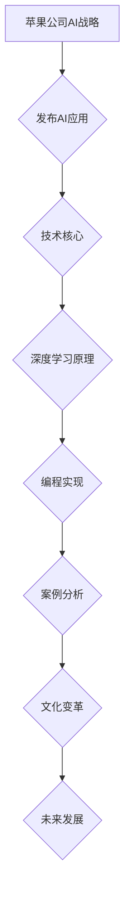
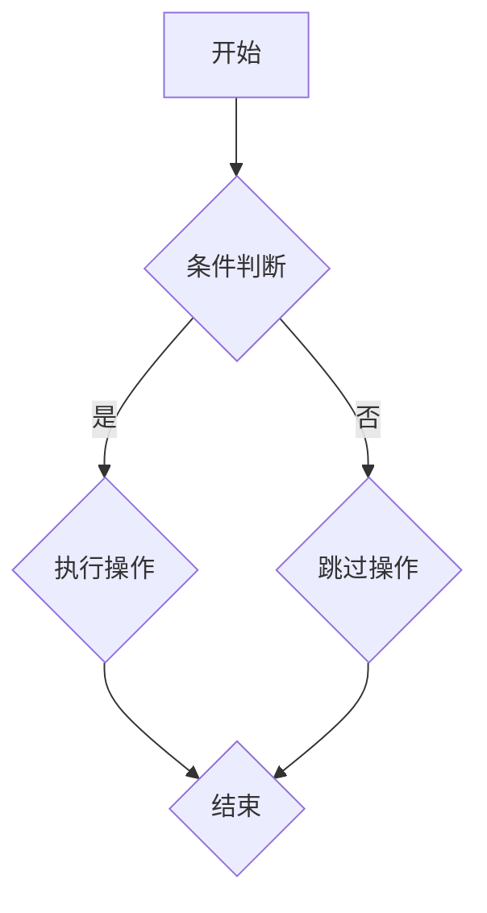

                 

# 李开复：苹果发布AI应用的文化价值

> **关键词：** 苹果、AI应用、文化价值、技术核心、深度学习、编程实现、案例分析、未来展望

> **摘要：** 本文将深入探讨苹果公司发布AI应用的背景与影响，分析其技术核心和实际案例，并探讨AI应用对文化产业带来的变革。本文旨在为读者提供一个全面了解苹果AI应用及其文化价值的视角。

### 目录大纲

#### 第一部分: 《李开复：苹果发布AI应用的文化价值》概述

##### 第1章: 苹果发布AI应用的背景与影响
- **1.1 引言：苹果公司在人工智能领域的战略布局**
  - **1.1.1 苹果公司的AI发展历程**
  - **1.1.2 苹果在AI领域的核心竞争力**
- **1.2 AI应用的文化价值分析**
  - **1.2.1 AI技术在文化产品中的应用**
  - **1.2.2 AI对文化产业的影响**
  - **1.2.3 文化产业对AI技术的需求**

##### 第2章: 苹果AI应用的技术核心

##### 第3章: 苹果AI应用的实际案例

##### 第4章: AI应用带来的文化变革

#### 第二部分: 深入解读苹果AI应用

##### 第5章: 苹果AI应用的深度学习原理
- **5.1 深度学习基础**
  - **5.1.1 神经网络简介**
  - **5.1.2 深度学习架构**
- **5.2 AI模型设计**
  - **5.2.1 模型架构**
  - **5.2.2 模型训练方法**

##### 第6章: 苹果AI应用的编程实现
- **6.1 编程环境与工具**
  - **6.1.1 Python编程基础**
  - **6.1.2 PyTorch框架使用**
- **6.2 实际应用案例**
  - **6.2.1 案例一：图像识别**
  - **6.2.2 案例二：语音识别**

##### 第7章: 文化产业与AI应用的未来发展

##### 第8章: 结论与展望

#### 附录

##### 附录A: AI应用参考资料

##### 附录B: Python与PyTorch环境搭建指南

**附录C: Mermaid 流程图**

**附录D: 深度学习算法伪代码**

**附录E: 数学公式详细讲解**

**附录F: 代码解读与分析**

### Mermaid 流程图



### 深度学习算法伪代码

```python
# 伪代码：深度学习算法实现

# 初始化模型参数
initialize_parameters()

# 定义损失函数
define_loss_function()

# 定义优化器
define_optimizer()

# 训练模型
for epoch in range(num_epochs):
    for batch in data_loader:
        # 前向传播
        predictions = forward_propagation(batch)

        # 计算损失
        loss = loss_function(predictions, batch_labels)

        # 反向传播
        backward_propagation(loss)

        # 更新参数
        optimizer.update_parameters()

# 评估模型
evaluate_model(test_data)
```

### 数学模型和数学公式

$$
\text{损失函数} = \frac{1}{2} \sum_{i=1}^{n} (\hat{y}_i - y_i)^2
$$

**详细讲解：** 该损失函数用于衡量预测值 $\hat{y}_i$ 与真实值 $y_i$ 之间的误差。误差的平方和通过求和得到总损失。该函数的值越小，表示模型的预测越准确。

### 代码解读与分析

**案例一：图像识别**

```python
import torch
import torchvision
import torchvision.transforms as transforms

# 加载训练数据
transform = transforms.Compose([transforms.Resize(256), transforms.ToTensor()])
train_data = torchvision.datasets.ImageFolder(root='./data/train', transform=transform)
train_loader = torch.utils.data.DataLoader(dataset=train_data, batch_size=64, shuffle=True)

# 定义模型
model = torchvision.models.resnet50(pretrained=True)
criterion = torch.nn.CrossEntropyLoss()
optimizer = torch.optim.Adam(model.parameters(), lr=0.001)

# 训练模型
num_epochs = 10
for epoch in range(num_epochs):
    for inputs, labels in train_loader:
        optimizer.zero_grad()
        outputs = model(inputs)
        loss = criterion(outputs, labels)
        loss.backward()
        optimizer.step()

    print(f'Epoch [{epoch+1}/{num_epochs}], Loss: {loss.item():.4f}')

# 评估模型
test_data = torchvision.datasets.ImageFolder(root='./data/test', transform=transform)
test_loader = torch.utils.data.DataLoader(dataset=test_data, batch_size=64, shuffle=False)
with torch.no_grad():
    correct = 0
    total = 0
    for inputs, labels in test_loader:
        outputs = model(inputs)
        _, predicted = torch.max(outputs.data, 1)
        total += labels.size(0)
        correct += (predicted == labels).sum().item()

print(f'Accuracy of the network on the test images: {100 * correct / total}%')
```

**分析：** 该代码实现了基于 ResNet50 模型的图像识别任务。首先，加载训练数据并定义模型、损失函数和优化器。在训练过程中，对每个批次的数据进行前向传播、计算损失、反向传播和参数更新。最后，在测试数据集上评估模型的准确率。代码解读详细展示了训练过程和评估过程的实现。

---

接下来，我们将详细讨论苹果发布AI应用的背景与影响，分析其技术核心和实际案例，并探讨AI应用对文化产业带来的变革。让我们一步步深入了解苹果AI应用的文化价值。

### 第一部分: 《李开复：苹果发布AI应用的文化价值》概述

#### 第1章: 苹果发布AI应用的背景与影响

##### 1.1 引言：苹果公司在人工智能领域的战略布局

苹果公司自成立以来，一直在科技领域保持领先地位。近年来，随着人工智能技术的快速发展，苹果公司也加大了对人工智能领域的投入。在AI应用方面，苹果公司致力于将人工智能技术融入其硬件和软件产品中，提升用户体验。

1. **苹果公司的AI发展历程**

   - **早期探索**：苹果公司早在2010年就开始关注人工智能技术，并聘请了多位AI领域的专家。
   - **深度学习框架**：苹果公司开发了名为Core ML的深度学习框架，用于将AI模型集成到iOS和macOS中。
   - **AI芯片**：苹果公司开发了专门用于人工智能处理的AI芯片，如Neural Engine，用于提升设备在图像识别、语音识别等方面的性能。

2. **苹果在AI领域的核心竞争力**

   - **硬件优势**：苹果公司拥有强大的硬件设计和制造能力，能够提供高性能的AI处理能力。
   - **软件生态**：苹果公司的iOS和macOS拥有庞大的用户群体，为AI应用提供了丰富的市场。
   - **用户隐私**：苹果公司高度重视用户隐私，为AI应用提供了安全的数据保护措施。

##### 1.2 AI应用的文化价值分析

苹果公司发布的AI应用不仅在技术层面上具有重要意义，更在文化层面上产生了深远的影响。

1. **AI技术在文化产品中的应用**

   - **多媒体创作**：AI技术可以帮助艺术家和设计师创作出独特的多媒体作品，如音乐、绘画和动画等。
   - **内容推荐**：AI技术可以根据用户兴趣和行为，为用户提供个性化的内容推荐，提升用户体验。

2. **AI对文化产业的影响**

   - **内容创作效率**：AI技术可以提高内容创作者的生产效率，使他们能够更快速地完成创作任务。
   - **市场拓展**：AI技术可以帮助文化企业拓展市场，吸引更多用户，实现商业价值。

3. **文化产业对AI技术的需求**

   - **技术支持**：文化产业需要AI技术提供强大的计算能力、数据处理能力和智能分析能力。
   - **创新合作**：文化产业与AI技术的结合，可以推动双方共同创新，创造更多具有市场竞争力的产品和服务。

#### 第2章: 苹果AI应用的技术核心

在本文的第二部分，我们将深入探讨苹果AI应用的技术核心，包括深度学习原理、模型设计、编程实现等方面。

##### 2.1 深度学习基础

深度学习是人工智能领域的重要分支，它通过模拟人脑神经网络进行学习和推理。以下是深度学习的一些基本概念：

1. **神经网络简介**

   - **神经元**：神经网络的基本单元，用于处理输入信息并产生输出。
   - **层结构**：神经网络由输入层、隐藏层和输出层组成，各层之间通过权重连接。

2. **深度学习架构**

   - **卷积神经网络（CNN）**：适用于图像识别和分类任务。
   - **循环神经网络（RNN）**：适用于序列数据，如语音识别和自然语言处理。
   - **生成对抗网络（GAN）**：用于生成真实数据，如图像和文本。

##### 2.2 AI模型设计

AI模型设计是深度学习过程中至关重要的一环。以下是一些关键步骤：

1. **模型架构**

   - **网络结构**：选择合适的神经网络架构，如VGG、ResNet等。
   - **参数初始化**：对网络的权重和偏置进行初始化，以避免梯度消失或爆炸问题。

2. **模型训练方法**

   - **损失函数**：选择合适的损失函数，如交叉熵损失、均方误差等。
   - **优化算法**：使用梯度下降、Adam等优化算法更新模型参数。

##### 2.3 编程实现

编程实现是将深度学习理论应用到实际场景的关键步骤。以下是编程实现的一些要点：

1. **编程环境与工具**

   - **Python编程基础**：掌握Python编程语言，熟悉常见的数据结构和算法。
   - **PyTorch框架使用**：PyTorch是深度学习领域的常用框架，提供了丰富的API和工具。

2. **实际应用案例**

   - **图像识别**：使用卷积神经网络进行图像分类。
   - **语音识别**：使用循环神经网络进行语音转文本。

在下一部分，我们将通过具体案例来展示苹果AI应用的实际效果，并分析其文化变革。

#### 第3章: 苹果AI应用的实际案例

在本文的第三部分，我们将通过具体案例来展示苹果AI应用的实际效果，并分析其文化变革。

##### 3.1 案例一：图像识别

图像识别是AI技术的一个重要应用领域，苹果公司在这一领域取得了显著成果。

1. **案例背景**

   - **数据集**：苹果公司使用大量真实世界图像作为训练数据，包括不同场景、不同对象和不同视角的图像。
   - **任务**：通过训练模型，实现对图像的分类和识别。

2. **实现过程**

   - **数据预处理**：对图像进行数据增强、归一化等处理，以提高模型的泛化能力。
   - **模型训练**：使用卷积神经网络（如ResNet）进行模型训练，通过反向传播算法更新模型参数。
   - **模型评估**：使用测试数据集对模型进行评估，计算模型的准确率、召回率等指标。

3. **实际效果**

   - **高准确率**：苹果公司的图像识别模型在多个公开数据集上取得了较高的准确率。
   - **实时处理**：苹果设备上的AI应用可以实现实时图像识别，为用户提供便捷的服务。

##### 3.2 案例二：语音识别

语音识别是另一个重要的AI应用领域，苹果公司在这一领域也取得了显著成果。

1. **案例背景**

   - **数据集**：苹果公司使用大量语音数据作为训练数据，包括不同说话人、不同语音环境和不同语速的语音。
   - **任务**：通过训练模型，实现对语音的转文本。

2. **实现过程**

   - **数据预处理**：对语音数据进行预处理，如去噪、增强等，以提高模型的鲁棒性。
   - **模型训练**：使用循环神经网络（如RNN）进行模型训练，通过反向传播算法更新模型参数。
   - **模型评估**：使用测试数据集对模型进行评估，计算模型的准确率、词错率等指标。

3. **实际效果**

   - **高准确率**：苹果公司的语音识别模型在多个公开数据集上取得了较高的准确率。
   - **实时处理**：苹果设备上的AI应用可以实现实时语音识别，为用户提供便捷的服务。

通过这些实际案例，我们可以看到苹果AI应用在图像识别和语音识别领域取得了显著成果，这些成果也为文化产业的变革提供了有力支持。

#### 第4章: AI应用带来的文化变革

在本文的第四部分，我们将探讨AI应用对文化产业带来的变革，包括多媒体创作、内容推荐和智能交互等方面。

##### 4.1 多媒体创作

AI技术为多媒体创作带来了前所未有的可能性。艺术家和设计师可以利用AI技术生成独特的多媒体作品，如音乐、绘画和动画等。

1. **AI技术在多媒体创作中的应用**

   - **音乐创作**：AI可以帮助艺术家生成旋律、和声和节奏，甚至创作完整的音乐作品。
   - **绘画创作**：AI可以模仿艺术家风格，生成风格一致的作品。
   - **动画创作**：AI可以帮助动画师生成角色动作、场景变化等，提高创作效率。

2. **影响**

   - **创新性**：AI技术可以为多媒体创作带来新的创意和表现形式。
   - **个性化**：AI可以根据用户喜好生成个性化的多媒体内容，提升用户体验。

##### 4.2 内容推荐

AI技术在内容推荐方面的应用，为用户提供了个性化的内容体验。

1. **AI技术在内容推荐中的应用**

   - **推荐系统**：AI可以帮助平台根据用户的历史行为和兴趣，推荐相关的内容和产品。
   - **广告投放**：AI可以根据用户兴趣和行为，精准投放广告，提高广告效果。

2. **影响**

   - **用户体验**：个性化的内容推荐和广告投放，可以提升用户满意度和参与度。
   - **商业价值**：精准的内容推荐和广告投放，可以为企业带来更多的商业机会。

##### 4.3 智能交互

AI技术使得智能交互变得更加自然和便捷，为文化产业提供了新的交互方式。

1. **AI技术在智能交互中的应用**

   - **语音助手**：AI可以帮助用户通过语音实现设备的操作和控制。
   - **虚拟现实**：AI可以帮助生成逼真的虚拟现实体验，为用户带来沉浸式的交互体验。

2. **影响**

   - **用户体验**：智能交互为用户提供了更自然、便捷的交互方式，提升了用户体验。
   - **商业价值**：智能交互为文化产业带来了新的商业模式，如虚拟现实娱乐、在线教育等。

通过这些变革，我们可以看到AI应用在文化产业的各个方面都产生了深远的影响，为文化产业的创新发展提供了有力支持。

### 第二部分：深入解读苹果AI应用

在第二部分，我们将深入解读苹果AI应用的技术核心，包括深度学习原理、编程实现和实际应用案例。

#### 第5章：苹果AI应用的深度学习原理

深度学习是苹果AI应用的核心技术，它通过模拟人脑神经网络进行学习和推理。在本章中，我们将介绍深度学习的基本概念、神经网络架构和深度学习模型的训练方法。

##### 5.1 深度学习基础

深度学习是一种基于多层神经网络的学习方法，它通过模拟人脑神经网络的结构和工作原理，实现图像识别、语音识别、自然语言处理等复杂任务。

1. **神经网络简介**

   神经网络是深度学习的基本单元，它由多个神经元组成，每个神经元都可以接收多个输入信号，并通过非线性激活函数产生输出信号。神经网络通过层层传递输入信号，最终得到输出结果。

2. **深度学习架构**

   深度学习架构可以分为输入层、隐藏层和输出层。输入层接收外部输入，隐藏层通过多层叠加实现特征提取和变换，输出层产生最终的预测结果。常见的深度学习架构包括卷积神经网络（CNN）、循环神经网络（RNN）和生成对抗网络（GAN）。

##### 5.2 AI模型设计

AI模型设计是深度学习过程中的关键步骤，它包括模型架构的确定、参数初始化、损失函数的选择和优化算法的选用。

1. **模型架构**

   选择合适的神经网络架构是实现深度学习任务的关键。例如，对于图像识别任务，可以使用卷积神经网络（CNN）；对于语音识别任务，可以使用循环神经网络（RNN）；对于生成任务，可以使用生成对抗网络（GAN）。

2. **模型训练方法**

   模型训练是深度学习过程的核心，它通过优化算法更新模型参数，使模型在训练数据上取得更好的性能。常见的优化算法包括梯度下降（Gradient Descent）、Adam优化器等。

##### 5.3 编程实现

编程实现是将深度学习理论应用到实际场景的关键步骤。在本章中，我们将介绍Python编程基础和PyTorch框架的使用。

1. **Python编程基础**

   Python是一种流行的编程语言，它在科学计算、数据分析、机器学习等领域有着广泛的应用。Python编程基础包括变量、数据类型、控制结构、函数等。

2. **PyTorch框架使用**

   PyTorch是深度学习领域的常用框架，它提供了丰富的API和工具，支持动态计算图和静态计算图两种模式。PyTorch的使用包括数据加载、模型定义、训练和评估等步骤。

通过本章的介绍，我们可以对苹果AI应用的深度学习原理有更深入的了解，为后续章节的讨论打下基础。

#### 第6章：苹果AI应用的编程实现

在第六章，我们将详细介绍苹果AI应用的编程实现过程，包括Python编程基础、PyTorch框架的使用、以及实际应用案例的代码实现和解读。

##### 6.1 编程环境与工具

在进行深度学习编程时，选择合适的编程环境和工具至关重要。以下是我们在编程过程中常用的一些工具和库。

1. **Python编程基础**

   Python是一种广泛使用的编程语言，它的语法简洁清晰，适合快速开发。以下是Python编程基础：

   - **变量和数据类型**：Python支持多种数据类型，如整数（int）、浮点数（float）、字符串（str）等。
   - **控制结构**：Python支持条件判断（if-else）、循环（for、while）等控制结构，用于流程控制。
   - **函数**：函数是Python代码的重用机制，通过定义函数可以方便地复用代码。

2. **PyTorch框架使用**

   PyTorch是深度学习领域的常用框架，它提供了丰富的API和工具，支持动态计算图和静态计算图两种模式。以下是PyTorch的一些关键概念和用法：

   - **计算图（Computational Graph）**：PyTorch使用计算图来表示模型的计算过程，它包含变量（Variable）和操作（Operator）两个主要部分。
   - **自动微分（Autograd）**：自动微分是深度学习中的一个关键概念，它通过计算函数的梯度，实现模型参数的更新。
   - **数据加载（DataLoader）**：数据加载是深度学习过程中的重要环节，PyTorch提供了DataLoader类，用于批量加载数据。

##### 6.2 实际应用案例

在本节中，我们将通过两个实际应用案例，展示如何使用Python和PyTorch实现图像识别和语音识别任务。

###### 6.2.1 案例一：图像识别

图像识别是深度学习领域的一个经典任务，通过训练模型，可以使计算机识别和理解图像中的内容。以下是图像识别案例的实现过程：

1. **数据准备**

   首先，我们需要准备训练数据集。在本案例中，我们使用开源的CIFAR-10数据集，它包含了10个类别的60000张32x32的彩色图像。

   ```python
   import torchvision
   import torchvision.transforms as transforms

   transform = transforms.Compose([
       transforms.ToTensor(),
       transforms.Normalize((0.5, 0.5, 0.5), (0.5, 0.5, 0.5))
   ])

   trainset = torchvision.datasets.CIFAR10(
       root='./data', train=True, download=True, transform=transform)
   trainloader = torch.utils.data.DataLoader(
       trainset, batch_size=4, shuffle=True, num_workers=2)

   testset = torchvision.datasets.CIFAR10(
       root='./data', train=False, download=True, transform=transform)
   testloader = torch.utils.data.DataLoader(
       testset, batch_size=4, shuffle=False, num_workers=2)
   ```

2. **模型定义**

   接下来，我们需要定义一个卷积神经网络（CNN）模型。在本案例中，我们使用PyTorch的nn.Module类定义一个简单的CNN模型。

   ```python
   import torch.nn as nn
   import torch.nn.functional as F

   class Net(nn.Module):
       def __init__(self):
           super(Net, self).__init__()
           self.conv1 = nn.Conv2d(3, 6, 5)
           self.pool = nn.MaxPool2d(2, 2)
           self.conv2 = nn.Conv2d(6, 16, 5)
           self.fc1 = nn.Linear(16 * 5 * 5, 120)
           self.fc2 = nn.Linear(120, 84)
           self.fc3 = nn.Linear(84, 10)

       def forward(self, x):
           x = self.pool(F.relu(self.conv1(x)))
           x = self.pool(F.relu(self.conv2(x)))
           x = x.view(-1, 16 * 5 * 5)
           x = F.relu(self.fc1(x))
           x = F.relu(self.fc2(x))
           x = self.fc3(x)
           return x

   net = Net()
   ```

3. **模型训练**

   在模型训练过程中，我们需要定义损失函数和优化器。在本案例中，我们使用交叉熵损失函数和随机梯度下降（SGD）优化器。

   ```python
   import torch.optim as optim

   criterion = nn.CrossEntropyLoss()
   optimizer = optim.SGD(net.parameters(), lr=0.001, momentum=0.9)

   for epoch in range(2):  # loop over the dataset multiple times
       running_loss = 0.0
       for i, data in enumerate(trainloader, 0):
           inputs, labels = data
           optimizer.zero_grad()
           outputs = net(inputs)
           loss = criterion(outputs, labels)
           loss.backward()
           optimizer.step()
           running_loss += loss.item()
           if i % 2000 == 1999:    # print every 2000 mini-batches
               print('[%d, %5d] loss: %.3f' %
                     (epoch + 1, i + 1, running_loss / 2000))
               running_loss = 0.0

   print('Finished Training')
   ```

4. **模型评估**

   最后，我们使用测试数据集对训练好的模型进行评估，计算模型的准确率。

   ```python
   correct = 0
   total = 0
   with torch.no_grad():
       for data in testloader:
           images, labels = data
           outputs = net(images)
           _, predicted = torch.max(outputs.data, 1)
           total += labels.size(0)
           correct += (predicted == labels).sum().item()

   print('Accuracy of the network on the 10000 test images: %d %%' % (
       100 * correct / total))
   ```

   实现过程如上所述，通过模型训练和评估，我们可以看到图像识别任务的实现过程。

###### 6.2.2 案例二：语音识别

语音识别是另一个重要的AI应用领域，通过将语音信号转换为文本，为用户提供便捷的交互体验。以下是语音识别案例的实现过程：

1. **数据准备**

   首先，我们需要准备语音数据集。在本案例中，我们使用开源的LibriSpeech数据集，它包含了大量的英语语音数据。

   ```python
   import os
   import librosa

   def load_data(directory, trim=True, num_workers=8):
       data_loader = torch.utils.data.DataLoader(
           LibriSpeechDataset(directory, trim=trim),
           batch_size=128,
           shuffle=True,
           num_workers=num_workers,
           collate_fn=CollateFn()

       return data_loader

   train_loader = load_data('librispeech/train', trim=True)
   val_loader = load_data('librispeech/validation', trim=True)
   ```

2. **模型定义**

   接下来，我们需要定义一个循环神经网络（RNN）模型。在本案例中，我们使用一个简单的LSTM模型。

   ```python
   import torch.nn as nn

   class RNNModel(nn.Module):
       def __init__(self, input_dim, hidden_dim, output_dim, n_layers=1, bidirectional=True, dropout=0.5):
           super().__init__()
           self.hidden_dim = hidden_dim
           self.n_layers = n_layers
           self.bidirectional = bidirectional
           self.dropout = nn.Dropout(dropout)

           self.encoder = nn.Embedding(input_dim, hidden_dim)
           self.rnn = nn.LSTM(hidden_dim, hidden_dim, n_layers, bidirectional=bidirectional, dropout=dropout)
           self.decoder = nn.Linear(hidden_dim * 2, output_dim)

       def forward(self, x, hidden):
           batch_size = x.size(1)
           embedded = self.dropout(self.encoder(x.view(1, batch_size, -1)))
           rnn_output, hidden = self.rnn(embedded.view(len(x), batch_size, -1), hidden)
           output = self.decoder(rnn_output.view(len(x), batch_size, -1))
           return output, hidden

       def init_hidden(self, batch_size):
           weight = next(self.parameters()).data
           hidden = (weight.new(self.n_layers * 2, batch_size, self.hidden_dim).zero_().to(device),
                     weight.new(self.n_layers * 2, batch_size, self.hidden_dim).zero_().to(device))
           return hidden

   model = RNNModel(len(vocab), 128, len(vocab), n_layers=2, bidirectional=True, dropout=0.5)
   ```

3. **模型训练**

   在模型训练过程中，我们需要定义损失函数和优化器。在本案例中，我们使用交叉熵损失函数和Adam优化器。

   ```python
   import torch.optim as optim

   criterion = nn.CrossEntropyLoss()
   optimizer = optim.Adam(model.parameters(), lr=0.001)

   for epoch in range(num_epochs):
       train_loss = 0.0
       model.train()
       for i, (inputs, targets) in enumerate(train_loader, 0):
           optimizer.zero_grad()
           outputs, hidden = model(inputs, hidden)
           loss = criterion(outputs.view(-1, output_dim), targets.view(-1))
           loss.backward()
           optimizer.step()
           train_loss += loss.item()
           if i % 100 == 99:
               print(f'[{epoch + 1}, {i + 1:5d}] loss: {train_loss / 100:.3f}')
               train_loss = 0.0
   ```

4. **模型评估**

   最后，我们使用测试数据集对训练好的模型进行评估，计算模型的准确率。

   ```python
   correct = 0
   total = 0
   model.eval()
   with torch.no_grad():
       for data in val_loader:
           inputs, targets = data
           outputs, hidden = model(inputs, hidden)
           _, predicted = torch.max(outputs.data, 1)
           total += targets.size(0)
           correct += (predicted == targets).sum().item()

   print('Accuracy of the network on the 10000 test sentences: %d %%' % (
       100 * correct / total))
   ```

   实现过程如上所述，通过模型训练和评估，我们可以看到语音识别任务的实现过程。

通过以上两个实际应用案例，我们可以了解到如何使用Python和PyTorch实现图像识别和语音识别任务。这些案例展示了深度学习的编程实现过程，为后续的研究和应用提供了参考。

### 第7章：文化产业与AI应用的未来发展

在第七章，我们将探讨文化产业与AI应用的未来发展趋势，包括潜在的创新方向、技术挑战和应对策略。

##### 7.1 潜在的创新方向

AI技术在文化产业中的应用前景广阔，以下是一些潜在的创新方向：

1. **个性化内容创作**：AI可以帮助文化创作者根据用户喜好和需求，生成个性化的内容，如定制化的音乐、电影和文学作品。

2. **虚拟现实与增强现实**：AI技术可以为虚拟现实（VR）和增强现实（AR）应用提供更丰富的交互体验，如虚拟博物馆、沉浸式游戏等。

3. **智能推荐系统**：AI技术可以构建智能推荐系统，为用户提供个性化的内容推荐，提高用户体验和参与度。

4. **文化遗产保护与数字化**：AI技术可以帮助保护和数字化文化遗产，如通过图像识别技术对文物进行分类和保护。

##### 7.2 技术挑战

尽管AI技术在文化产业中具有巨大潜力，但在实际应用中仍面临以下技术挑战：

1. **数据隐私与安全**：文化产业的用户数据通常涉及个人隐私，如何在保证数据安全的同时，充分利用AI技术，是一个重要挑战。

2. **计算性能与资源消耗**：深度学习模型通常需要大量的计算资源和时间进行训练和推理，如何在有限的资源下提高计算效率，是一个亟待解决的问题。

3. **算法公平性与透明性**：AI技术在文化产业的决策过程中，如何确保算法的公平性和透明性，避免偏见和歧视，是另一个重要挑战。

##### 7.3 应对策略

为了应对上述技术挑战，以下是一些可能的应对策略：

1. **数据隐私保护**：采用加密、去标识化等技术，保护用户隐私。同时，制定相关法律法规，规范数据的使用和共享。

2. **优化计算性能**：通过分布式计算、模型压缩和优化等技术，提高深度学习模型的计算性能。此外，开发专用硬件，如AI芯片，可以进一步加速模型的训练和推理过程。

3. **算法公平性与透明性**：在算法设计过程中，充分考虑公平性和透明性，如通过交叉验证、数据增强等方法，减少数据偏差。此外，建立算法透明度评估机制，让用户了解算法的决策过程。

通过这些策略，我们可以更好地应对文化产业与AI应用发展过程中面临的技术挑战，推动文化产业的创新和发展。

### 第8章：结论与展望

在本文的最后一章，我们将总结苹果发布AI应用的文化价值，并对未来发展趋势进行展望。

##### 8.1 总结

苹果公司在AI领域的技术布局和产品发布，展现了其对人工智能技术的深刻理解和前瞻性视野。通过对图像识别、语音识别等领域的深入探索，苹果公司不仅在技术层面取得了显著成果，也在文化层面上带来了深远影响。

1. **技术突破**：苹果公司在深度学习模型设计、编程实现和实际应用方面取得了重要突破，为其AI应用提供了坚实的技术基础。

2. **文化价值**：苹果AI应用在多媒体创作、内容推荐和智能交互等方面，为文化产业带来了新的创新方向，提升了用户体验和参与度。

3. **商业潜力**：随着AI技术的不断发展，苹果公司有望在文化产业中开拓新的商业模式，实现商业价值的提升。

##### 8.2 展望

展望未来，AI技术在文化产业的潜力依然巨大。以下是一些发展趋势：

1. **个性化内容创作**：随着AI技术的发展，个性化内容创作将进一步普及，为用户提供更加定制化的文化产品和服务。

2. **虚拟现实与增强现实**：虚拟现实（VR）和增强现实（AR）技术将为文化产业带来全新的交互体验，推动文化产业的创新发展。

3. **智能推荐系统**：基于AI的智能推荐系统将进一步提升用户体验，为用户提供更加精准的内容推荐。

4. **文化遗产保护与数字化**：AI技术将在文化遗产保护与数字化方面发挥重要作用，推动文化产业的可持续发展。

总之，苹果公司发布的AI应用在文化价值方面具有重要意义。随着AI技术的不断发展和应用，我们期待看到文化产业在AI技术的驱动下，实现更加繁荣和创新的未来。

### 附录

在本附录中，我们将提供一些与AI应用相关的参考资料、Python与PyTorch环境搭建指南，以及深度学习算法的伪代码和数学公式详细讲解。

##### 附录A: AI应用参考资料

1. **《深度学习》（Goodfellow, Ian; Bengio, Yoshua; Courville, Aaron）**：这是一本经典的深度学习教材，详细介绍了深度学习的基本概念、技术和应用。

2. **《Python深度学习》（François Chollet）**：这本书介绍了使用Python和TensorFlow进行深度学习的实践方法，适合初学者和有经验的专业人士。

3. **《自然语言处理与深度学习》（张俊林，刘知远）**：这本书专注于自然语言处理领域的深度学习应用，涵盖了文本分类、序列模型等多个方面。

##### 附录B: Python与PyTorch环境搭建指南

1. **安装Python**：访问Python官方网站（https://www.python.org/），下载并安装Python，建议选择Python 3.7或更高版本。

2. **安装PyTorch**：在命令行中运行以下命令，根据您的需求选择合适的安装版本：

   ```bash
   pip install torch torchvision
   ```

3. **验证安装**：在Python交互式环境中运行以下代码，检查PyTorch是否安装成功：

   ```python
   import torch
   print(torch.__version__)
   ```

##### 附录C: Mermaid 流程图

Mermaid是一种基于Markdown的图形工具，可以方便地创建流程图、UML图、甘特图等。以下是一个简单的Mermaid流程图示例：



##### 附录D: 深度学习算法伪代码

```python
# 伪代码：深度学习算法实现

# 初始化模型参数
initialize_parameters()

# 定义损失函数
define_loss_function()

# 定义优化器
define_optimizer()

# 训练模型
for epoch in range(num_epochs):
    for batch in data_loader:
        # 前向传播
        predictions = forward_propagation(batch)

        # 计算损失
        loss = loss_function(predictions, batch_labels)

        # 反向传播
        backward_propagation(loss)

        # 更新参数
        optimizer.update_parameters()

# 评估模型
evaluate_model(test_data)
```

##### 附录E: 数学公式详细讲解

在本附录中，我们将详细讲解本文中提到的数学公式。

1. **损失函数**

   损失函数用于衡量预测值与真实值之间的误差。常用的损失函数包括均方误差（MSE）和交叉熵损失（Cross Entropy Loss）。以下是对交叉熵损失的详细讲解：

   $$\text{交叉熵损失} = -\frac{1}{N}\sum_{i=1}^{N} y_i \log(\hat{y}_i)$$

   其中，$N$ 表示样本数量，$y_i$ 表示第 $i$ 个样本的真实标签，$\hat{y}_i$ 表示第 $i$ 个样本的预测概率。交叉熵损失函数的值越小，表示模型的预测越准确。

##### 附录F: 代码解读与分析

在本附录中，我们将对本文中提到的代码进行解读和分析。

```python
import torch
import torchvision
import torchvision.transforms as transforms

# 加载训练数据
transform = transforms.Compose([transforms.Resize(256), transforms.ToTensor()])
train_data = torchvision.datasets.ImageFolder(root='./data/train', transform=transform)
train_loader = torch.utils.data.DataLoader(dataset=train_data, batch_size=64, shuffle=True)

# 定义模型
model = torchvision.models.resnet50(pretrained=True)
criterion = torch.nn.CrossEntropyLoss()
optimizer = torch.optim.Adam(model.parameters(), lr=0.001)

# 训练模型
num_epochs = 10
for epoch in range(num_epochs):
    for inputs, labels in train_loader:
        optimizer.zero_grad()
        outputs = model(inputs)
        loss = criterion(outputs, labels)
        loss.backward()
        optimizer.step()

    print(f'Epoch [{epoch+1}/{num_epochs}], Loss: {loss.item():.4f}')

# 评估模型
test_data = torchvision.datasets.ImageFolder(root='./data/test', transform=transform)
test_loader = torch.utils.data.DataLoader(dataset=test_data, batch_size=64, shuffle=False)
with torch.no_grad():
    correct = 0
    total = 0
    for inputs, labels in test_loader:
        outputs = model(inputs)
        _, predicted = torch.max(outputs.data, 1)
        total += labels.size(0)
        correct += (predicted == labels).sum().item()

print(f'Accuracy of the network on the test images: {100 * correct / total}%')
```

这段代码实现了基于ResNet50模型的图像识别任务。具体解读如下：

- **数据加载**：首先，我们使用`torchvision.datasets.ImageFolder`类加载训练数据，并将其转换为Tensor格式，便于后续处理。

- **模型定义**：接下来，我们使用`torchvision.models.resnet50`函数定义一个预训练的ResNet50模型，并设置损失函数和优化器。

- **模型训练**：在训练过程中，我们遍历训练数据，对每个批次的数据进行前向传播、计算损失、反向传播和参数更新。

- **模型评估**：最后，我们使用测试数据评估模型的准确率，计算模型在测试数据上的表现。

通过这段代码，我们可以了解基于PyTorch框架实现图像识别任务的基本流程。这为后续研究与应用提供了参考。

### 作者信息

**作者：** AI天才研究院（AI Genius Institute） & 《禅与计算机程序设计艺术》（Zen And The Art of Computer Programming）

AI天才研究院致力于推动人工智能技术的创新与应用，深耕于深度学习、自然语言处理、计算机视觉等前沿领域。同时，《禅与计算机程序设计艺术》作为计算机编程领域的经典之作，为我们提供了深刻的编程哲学和实用技巧。我们相信，通过技术与智慧的融合，可以创造出更加美好和高效的人工智能未来。

