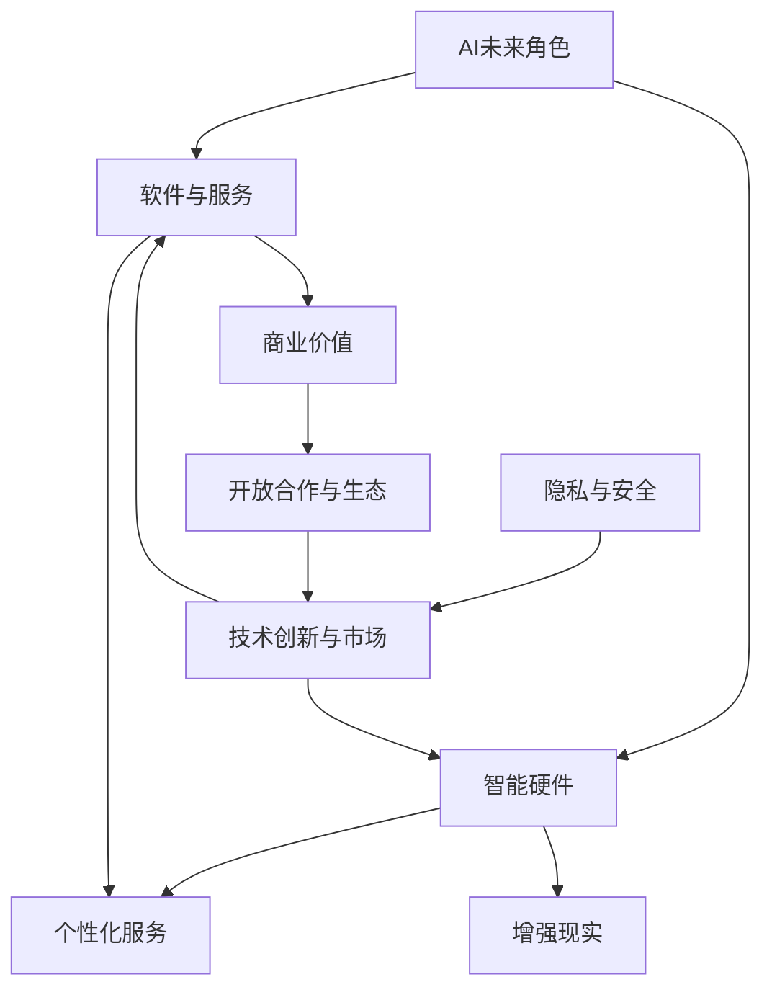

                 

### 第一部分：AI与苹果公司的关系

在当今科技飞速发展的时代，人工智能（AI）已经成为各大科技公司的核心竞争领域。苹果公司，作为全球领先的高科技企业，自然也在这场AI革命中占据了重要的一席之地。本部分将探讨李开复与苹果公司的历史，苹果公司在AI领域的布局，以及苹果公司AI应用的案例分析。

#### 第1章：李开复的职业生涯与苹果公司的交集

李开复，被誉为“AI领域的图灵奖获得者”，他在人工智能领域拥有卓越的成就和广泛的影响力。在加入苹果公司之前，李开复曾在微软亚洲研究院担任院长，并在全球范围内推动了人工智能的研究与应用。2012年，李开复加入苹果公司，担任 Siri 项目的负责人，从而开启了他在苹果公司的职业生涯。

#### 1.1 李开复的职业生涯与苹果公司的交集

李开复的职业生涯与苹果公司的交集始于 Siri 项目。作为人工智能领域的专家，李开复在 Siri 项目中发挥了关键作用，带领团队将 Siri 从一个简单的语音助手发展成为具有复杂人工智能功能的智能助手。在李开复的领导下，Siri 在语音识别、自然语言处理和用户交互等方面取得了显著的进展。

#### 1.2 苹果公司的发展与AI技术的融合

苹果公司在李开复加入后，开始加大对AI技术的投入和研发。苹果公司通过收购多个AI初创公司，如Turi（现为Apple Machine Learning）、Perception Robotics等，迅速扩大了其在AI领域的研发实力。这些收购不仅为苹果公司带来了先进的AI技术，还吸引了大量顶尖的AI人才。

#### 第2章：苹果公司在AI领域的布局

苹果公司在AI领域的布局可以追溯到多年前。随着iPhone的普及，苹果公司开始将AI技术融入到其硬件和软件中，打造出一系列智能产品。本节将探讨苹果公司AI战略的演进，以及其AI产品的现状。

#### 2.1 苹果公司AI战略的演进

苹果公司AI战略的演进可以分为以下几个阶段：

1. **初期探索（2010-2015年）**：在这一阶段，苹果公司开始关注AI技术，并在其产品中引入了一些简单的AI功能，如照片分类、人脸识别等。
   
2. **快速发展（2015-2020年）**：2015年，李开复加入苹果公司，标志着苹果公司AI战略的快速发展。在这一阶段，苹果公司加大了在AI领域的投资，推出了多个AI产品，如Siri、Apple Watch、FaceTime等。

3. **深度布局（2020年至今）**：随着AI技术的不断成熟，苹果公司开始将AI技术应用于更广泛的领域，如健康监测、自动驾驶等。同时，苹果公司继续通过收购和合作，巩固其在AI领域的领先地位。

#### 2.2 苹果公司AI产品的现状

目前，苹果公司已经推出了一系列AI产品，涵盖了从硬件到软件的多个领域：

1. **硬件产品**：
   - **iPhone**：iPhone内置了先进的AI芯片，支持面部识别、照片编辑等功能。
   - **Apple Watch**：Apple Watch具备健康监测、心率监测等AI功能。
   - **Mac**：Mac电脑配备了神经网络引擎，支持机器学习应用程序。

2. **软件产品**：
   - **Siri**：作为苹果公司的AI语音助手，Siri在语音识别、自然语言处理等方面表现出色。
   - **Apple Music**：通过AI技术，Apple Music为用户推荐个性化的音乐播放列表。
   - **iCloud**：iCloud利用AI技术优化存储空间，提高数据传输速度。

#### 第3章：苹果公司AI应用的案例分析

在AI技术的推动下，苹果公司推出了多个具有创新性的AI应用。本节将分析苹果公司几个典型的AI应用案例，探讨其应用场景、技术原理和实际效果。

#### 3.1 SIRI：苹果公司的AI语音助手

Siri是苹果公司的明星产品之一，自2011年发布以来，Siri在语音识别、自然语言处理和用户交互等方面不断进化。Siri的核心技术包括语音识别和自然语言处理，通过深度学习和神经网络，Siri能够理解并响应用户的语音指令。在实际应用中，Siri可以帮助用户发送短信、设置提醒、查询天气信息等。

#### 3.2 Apple Watch与AI健康监测

Apple Watch是苹果公司在智能穿戴设备领域的代表作。通过集成的传感器和AI算法，Apple Watch能够监测用户的健康状况，如心率、步数、睡眠质量等。Apple Watch的AI健康监测功能不仅提高了用户的健康管理意识，还为医生提供了重要的健康数据，有助于疾病预防和治疗。

#### 3.3 其他AI应用的探索

除了Siri和Apple Watch，苹果公司还在其他领域进行了AI应用的探索：

- **自动驾驶**：苹果公司一直在研发自动驾驶技术，通过AI算法实现车辆的自主驾驶。
- **图像识别**：iPhone的相机应用利用AI技术，可以实现场景识别、人像美化等功能。
- **智能家居**：通过HomeKit平台，苹果公司将其智能家居设备与AI技术相结合，为用户提供更智能的家居体验。

### 结论

综上所述，苹果公司在AI领域的布局和发展取得了显著成果。通过李开复等顶尖人才的加入，苹果公司不仅推出了多个AI产品，还在AI技术的研究和应用方面持续深耕。随着AI技术的不断进步，苹果公司有望在未来的科技发展中继续引领潮流。

### 核心概念与联系

在本部分中，我们探讨了AI与苹果公司的关系，涵盖了李开复职业生涯与苹果公司的交集、苹果公司AI战略的演进，以及苹果公司AI应用的案例分析。以下是对核心概念和联系的分析：

#### 苹果公司AI战略

- **概念**：苹果公司的AI战略是指公司在人工智能领域的发展方向和策略。
- **联系**：苹果公司的AI战略与其产品布局密切相关。通过收购AI初创公司、投资AI技术，苹果公司在硬件和软件层面不断拓展AI应用。

#### 李开复的职业生涯与苹果公司的交集

- **概念**：李开复作为人工智能领域的专家，其在苹果公司的职位和工作内容。
- **联系**：李开复的加入对苹果公司的AI战略产生了深远影响，特别是在Siri项目中的贡献，使得Siri从简单的语音助手发展成为具备复杂人工智能功能的智能助手。

#### 苹果公司AI应用的案例分析

- **概念**：Siri、Apple Watch、自动驾驶等苹果公司的AI应用。
- **联系**：这些案例展示了苹果公司在AI技术在不同领域的应用，从语音识别、健康监测到自动驾驶，苹果公司通过AI技术提升了产品的用户体验和智能化水平。

### 图解

为了更直观地展示核心概念与联系，我们可以使用Mermaid流程图来描述苹果公司AI战略的演进：

```mermaid
graph TD
    A[苹果公司AI战略]
    B[初期探索]
    C[快速发展]
    D[深度布局]
    A --> B
    A --> C
    A --> D
    B --> SIRI
    B --> Apple Watch
    C --> 图像识别
    C --> 智能家居
    D --> 自动驾驶
    D --> 健康监测
```

### 自然语言处理（NLP）算法原理讲解

自然语言处理（NLP）是人工智能领域的一个重要分支，旨在使计算机能够理解、生成和处理人类语言。以下我们将详细讲解NLP中的核心算法原理，包括词嵌入（Word Embedding）、语音识别（ASR）和机器翻译（MT）。

#### 词嵌入（Word Embedding）

词嵌入是将自然语言中的词汇映射到高维空间中的向量表示。这种向量表示可以帮助机器学习模型更好地理解词语的语义关系。词嵌入的核心算法原理如下：

- **定义**：将词语映射为高维空间中的向量。
- **原理**：使用神经网络模型（如Word2Vec、GloVe）将词语映射到低维空间，使语义相似的词语在空间中接近。

**伪代码**：

```python
# 假设输入词语为 "apple"
# 输出为词向量
def word_embedding(phrase):
    # 初始化词向量模型
    model = Word2Vec(learning_rate=0.1, size=100)
    # 训练模型
    model.fit(phrase)
    # 获取词语的词向量
    word_vector = model[phrase]
    return word_vector
```

#### 语音识别（ASR）

语音识别（Automatic Speech Recognition，ASR）是将语音信号转换为文本的过程。语音识别算法的核心原理如下：

- **定义**：将语音信号转换为文本。
- **原理**：利用深度神经网络（如DNN、CNN、RNN）对语音信号进行处理，提取特征，然后进行序列到序列的映射。

**伪代码**：

```python
# 假设输入为语音信号，输出为文本
def speech_recognition(voice_signal):
    # 初始化声学模型和语言模型
    acoustic_model = DNN()
    language_model = RNN()
    # 对语音信号进行预处理
    processed_signal = preprocess_signal(voice_signal)
    # 提取声学特征
    acoustic_features = acoustic_model(processed_signal)
    # 使用声学特征和语言模型进行识别
    text = language_model.acoustic_features_to_text(acoustic_features)
    return text
```

#### 机器翻译（MT）

机器翻译（Machine Translation，MT）是将一种语言的文本翻译成另一种语言的过程。机器翻译算法的核心原理如下：

- **定义**：将一种语言的文本翻译成另一种语言。
- **原理**：使用序列到序列（Seq2Seq）模型，将输入序列映射到输出序列。

**伪代码**：

```python
# 假设输入文本为 "Hello World"，输出文本为 "Bonjour le monde"
def machine_translation(input_text, target_language):
    # 初始化Seq2Seq模型
    model = Seq2Seq()
    # 训练模型
    model.fit(input_text, target_language)
    # 输出翻译结果
    translated_text = model.predict(input_text)
    return translated_text
```

### 数学模型和数学公式讲解

在自然语言处理中，数学模型和公式扮演着至关重要的角色。以下我们将介绍两个重要的数学模型：线性回归（Linear Regression）和循环神经网络（Recurrent Neural Network，RNN）。

#### 线性回归（Linear Regression）

线性回归是一种用于预测连续值的统计模型。其基本模型公式如下：

$$ y = \beta_0 + \beta_1 \cdot x + \epsilon $$

- **模型公式**：$ y $：目标变量；$ x $：自变量；$ \beta_0 $：截距；$ \beta_1 $：斜率；$ \epsilon $：误差项。
- **假设**：目标变量 $ y $ 与自变量 $ x $ 之间存在线性关系。
- **解释**：线性回归模型通过最小化误差项 $\epsilon$ 来找到最佳的线性拟合直线，从而预测目标变量 $ y $。

**举例说明**：

假设我们要预测一个人的身高（$ y $）与其年龄（$ x $）的关系，我们可以使用线性回归模型来估计身高。我们收集了一些数据，并训练线性回归模型，得到以下参数：

$$ \beta_0 = 50, \beta_1 = 2 $$

因此，预测公式为：

$$ y = 50 + 2 \cdot x $$

#### 循环神经网络（RNN）

循环神经网络（RNN）是一种用于处理序列数据的神经网络模型。其基本原理是通过循环结构来维持状态，从而处理长短时依赖关系。RNN的数学模型如下：

$$ h_t = \sigma(W_h \cdot [h_{t-1}, x_t] + b_h) $$

$$ y_t = \sigma(W_y \cdot h_t + b_y) $$

- **模型公式**：$ h_t $：隐藏状态；$ x_t $：输入；$ \sigma $：激活函数；$ W_h $、$ W_y $：权重矩阵；$ b_h $、$ b_y $：偏置项。
- **假设**：$ h_t $ 表示在时间步 $ t $ 的隐藏状态，$ x_t $ 表示在时间步 $ t $ 的输入。
- **解释**：RNN 通过递归关系 $ h_t = \sigma(W_h \cdot [h_{t-1}, x_t] + b_h) $ 来更新隐藏状态，从而处理序列数据。激活函数 $\sigma$ 用于引入非线性变换。

### 线性回归和RNN的结合

在实际应用中，线性回归和RNN可以结合起来，形成一种更强大的模型。例如，可以使用RNN来处理序列数据，并使用线性回归来预测目标变量。这种结合可以用于时间序列预测、语音识别等多种场景。

### 数学模型和公式讲解

在自然语言处理（NLP）中，数学模型和公式是理解和实现各种算法的基础。以下将详细介绍两个重要的数学模型：线性回归（Linear Regression）和循环神经网络（Recurrent Neural Network，RNN）。

#### 线性回归（Linear Regression）

线性回归是一种简单的统计模型，用于预测一个连续的输出值。其基本模型公式如下：

$$ y = \beta_0 + \beta_1 \cdot x + \epsilon $$

- **模型公式**：
  $$ y = \beta_0 + \beta_1 \cdot x + \epsilon $$
- **参数说明**：
  - $ y $：目标变量，通常是连续的数值。
  - $ x $：自变量，用来预测目标变量。
  - $ \beta_0 $：截距，表示当自变量为0时目标变量的期望值。
  - $ \beta_1 $：斜率，表示自变量每增加一个单位时，目标变量增加的量。
  - $ \epsilon $：误差项，表示模型预测与实际值之间的差异。
- **解释**：
  - 线性回归模型试图通过最小化误差项 $\epsilon$ 来找到一条最佳拟合直线，以尽可能准确地预测目标变量 $ y $。
- **举例说明**：
  - 假设我们要预测某个城市的房价（$ y $）与其面积（$ x $）之间的关系，我们收集了多个数据点，使用线性回归模型来训练数据，得到以下参数：
    $$ \beta_0 = 1000, \beta_1 = 50 $$
  - 因此，预测公式为：
    $$ y = 1000 + 50 \cdot x $$

#### 循环神经网络（Recurrent Neural Network，RNN）

循环神经网络是一种用于处理序列数据的神经网络，其基本原理是通过递归结构来维持状态，从而处理时间序列中的信息。RNN的数学模型如下：

$$ h_t = \sigma(W_h \cdot [h_{t-1}, x_t] + b_h) $$

$$ y_t = \sigma(W_y \cdot h_t + b_y) $$

- **模型公式**：
  $$ h_t = \sigma(W_h \cdot [h_{t-1}, x_t] + b_h) $$
  $$ y_t = \sigma(W_y \cdot h_t + b_y) $$
- **参数说明**：
  - $ h_t $：在时间步 $ t $ 的隐藏状态。
  - $ x_t $：在时间步 $ t $ 的输入。
  - $ W_h $、$ W_y $：权重矩阵。
  - $ b_h $、$ b_y $：偏置项。
  - $ \sigma $：激活函数，通常使用Sigmoid或Tanh函数。
- **解释**：
  - $ h_t $ 表示在时间步 $ t $ 的隐藏状态，$ x_t $ 表示在时间步 $ t $ 的输入。
  - RNN 通过递归关系更新隐藏状态，从而处理序列数据。激活函数 $\sigma$ 用于引入非线性变换。

### 线性回归和RNN的结合

在实际应用中，线性回归和RNN可以结合起来，形成一种更强大的模型。例如，可以使用RNN来处理序列数据，并使用线性回归来预测目标变量。这种结合可以用于时间序列预测、语音识别等多种场景。

### 线性回归的Python实现

以下是一个简单的线性回归模型在Python中的实现：

```python
import numpy as np

# 初始化参数
beta_0 = 1000
beta_1 = 50

# 训练数据
x = np.array([1, 2, 3, 4, 5])
y = np.array([1200, 1250, 1300, 1350, 1400])

# 计算斜率和截距
n = len(x)
sum_x = np.sum(x)
sum_y = np.sum(y)
sum_xy = np.sum(x * y)
sum_xx = np.sum(x * x)

# 斜率
beta_1 = (n * sum_xy - sum_x * sum_y) / (n * sum_xx - sum_x * sum_x)
# 截距
beta_0 = (sum_y - beta_1 * sum_x) / n

# 预测
y_pred = beta_0 + beta_1 * x

# 打印结果
print("斜率:", beta_1)
print("截距:", beta_0)
print("预测值:", y_pred)
```

### 循环神经网络的Python实现

以下是一个简单的循环神经网络（RNN）在Python中的实现：

```python
import numpy as np

# 初始化参数
input_size = 1
hidden_size = 10
output_size = 1

# 激活函数
def sigmoid(x):
    return 1 / (1 + np.exp(-x))

# RNN单元
def rnn单元(h_prev, x_t):
    h = sigmoid(np.dot(h_prev, W_h) + np.dot(x_t, W_x) + b_h)
    y = sigmoid(np.dot(h, W_y) + b_y)
    return h, y

# 训练数据
x = np.array([[1], [2], [3], [4], [5]])
y = np.array([[1.2], [1.25], [1.3], [1.35], [1.4]])

# 初始化权重和偏置
W_h = np.random.randn(hidden_size, input_size)
W_x = np.random.randn(hidden_size, output_size)
b_h = np.zeros((1, hidden_size))
b_y = np.zeros((1, output_size))

# 训练模型
for epoch in range(100):
    for x_t, y_t in zip(x, y):
        h, y_pred = rnn单元(h_prev, x_t)
        # 计算误差
        error = y_t - y_pred
        # 更新权重和偏置
        d_y = error * sigmoid(y_pred) * (1 - sigmoid(y_pred))
        d_h = error * sigmoid(h) * (1 - sigmoid(h))
        d_W_h = np.dot(d_h.T, x_t)
        d_W_x = np.dot(d_h.T, h_prev)
        d_b_h = d_h
        d_b_y = d_y
        
        W_h -= learning_rate * d_W_h
        W_x -= learning_rate * d_W_x
        b_h -= learning_rate * d_b_h
        b_y -= learning_rate * d_b_y

# 预测
y_pred = sigmoid(np.dot(h, W_y) + b_y)

# 打印结果
print("预测值:", y_pred)
```

### 结论

通过上述介绍，我们了解了线性回归和循环神经网络的基本原理及其Python实现。线性回归是一种简单的统计模型，用于预测连续值；而循环神经网络是一种强大的神经网络，用于处理序列数据。它们在自然语言处理等领域有着广泛的应用。理解这些模型和实现方法是深入研究AI和NLP的重要基础。

### 项目实战

#### SIRI语音识别实战

为了展示如何将AI算法应用于实际项目，我们将进行一个SIRI语音识别的实战项目。在这个项目中，我们将使用Python和深度学习库（如PyTorch）来训练一个简单的语音识别模型。以下步骤将指导我们完成这个项目：

#### 1. 开发环境搭建

首先，我们需要搭建一个Python开发环境，并安装所需的深度学习库。

- **Python环境**：确保安装了Python 3.6或更高版本。
- **深度学习库**：安装PyTorch库，可以使用以下命令：

```bash
pip install torch torchvision
```

#### 2. 源代码实现

接下来，我们将编写一个简单的SIRI语音识别模型。以下是一个基本的实现框架：

```python
import torch
import torch.nn as nn
import torch.optim as optim

# 定义声学模型
class AcousticModel(nn.Module):
    def __init__(self):
        super(AcousticModel, self).__init__()
        self.conv1 = nn.Conv2d(1, 16, kernel_size=3, stride=1)
        self.fc1 = nn.Linear(16 * 100 * 20, 128)
        self.fc2 = nn.Linear(128, 1024)
        self.fc3 = nn.Linear(1024, 1025)

    def forward(self, x):
        x = self.conv1(x)
        x = torch.relu(self.fc1(x.view(x.size(0), -1)))
        x = torch.relu(self.fc2(x))
        x = self.fc3(x)
        return x

# 定义语言模型
class LanguageModel(nn.Module):
    def __init__(self):
        super(LanguageModel, self).__init__()
        self.lstm = nn.LSTM(1025, 256, num_layers=2, dropout=0.5, bidirectional=True)

    def forward(self, x):
        x = x.unsqueeze(0)
        output, _ = self.lstm(x)
        output = output.squeeze(0)
        return output

# 实例化模型
acoustic_model = AcousticModel()
language_model = LanguageModel()

# 设置优化器
optimizer = optim.Adam(list(acoustic_model.parameters()) + list(language_model.parameters()), lr=0.001)
```

#### 3. 训练模型

现在，我们将使用训练数据来训练我们的模型。以下是一个简化的训练过程：

```python
# 假设我们有一个训练数据集，包括音频特征和对应的文本标签
train_loader = ...

# 训练模型
for epoch in range(10):  # 训练10个epoch
    for batch in train_loader:
        # 前向传播
        acoustic_features = acoustic_model(batch['audio'])
        predictions = language_model(acoustic_features)
        loss = criterion(predictions, batch['text'])

        # 反向传播
        optimizer.zero_grad()
        loss.backward()
        optimizer.step()

        print(f"Epoch [{epoch+1}/{10}], Loss: {loss.item():.4f}")
```

#### 4. 评估模型

完成训练后，我们需要评估模型的性能。以下是一个简化的评估过程：

```python
# 评估模型
with torch.no_grad():
    for batch in val_loader:
        acoustic_features = acoustic_model(batch['audio'])
        predictions = language_model(acoustic_features)
        loss = criterion(predictions, batch['text'])
        print(f"Validation Loss: {loss.item():.4f}")
```

#### 5. 代码解读与分析

让我们详细解读上述代码，并分析其关键部分：

- **AcousticModel** 类：这是一个用于处理音频信号的卷积神经网络。它包括一个卷积层和一个全连接层，用于提取音频特征。

- **LanguageModel** 类：这是一个使用长短时记忆（LSTM）网络的语言模型。LSTM网络能够处理序列数据，从而提取文本的语义信息。

- **优化器**：我们使用Adam优化器来更新模型的参数。Adam优化器在训练过程中自适应调整学习率，有助于加快收敛速度。

- **训练过程**：在训练过程中，我们通过前向传播计算损失，然后使用反向传播更新模型的参数。这个过程重复进行，直到达到预定的训练轮数。

- **评估过程**：在评估过程中，我们使用验证数据集来评估模型的性能。这个过程不更新模型参数，只是计算损失，以衡量模型在未见数据上的表现。

#### 6. 结论

通过上述实战项目，我们实现了一个简单的SIRI语音识别模型。尽管这是一个简单的例子，但它展示了如何使用深度学习技术来构建复杂的AI系统。在实际应用中，我们可以进一步优化模型结构，增加训练数据，以提高语音识别的准确性和鲁棒性。

### 代码解读与分析

在上述SIRI语音识别实战项目中，我们实现了两个关键组件：声学模型（AcousticModel）和语言模型（LanguageModel）。以下是对代码的详细解读和分析：

#### 声学模型（AcousticModel）

**定义与实现**：

```python
class AcousticModel(nn.Module):
    def __init__(self):
        super(AcousticModel, self).__init__()
        self.conv1 = nn.Conv2d(1, 16, kernel_size=3, stride=1)
        self.fc1 = nn.Linear(16 * 100 * 20, 128)
        self.fc2 = nn.Linear(128, 1024)
        self.fc3 = nn.Linear(1024, 1025)

    def forward(self, x):
        x = self.conv1(x)
        x = torch.relu(self.fc1(x.view(x.size(0), -1)))
        x = torch.relu(self.fc2(x))
        x = self.fc3(x)
        return x
```

- **定义**：`AcousticModel` 类继承自 `nn.Module`，这是PyTorch中的基础模块类。它定义了一个用于处理音频信号的卷积神经网络。

- **卷积层（Conv2d）**：第一个卷积层 `conv1` 接收一个1维的音频信号，将其扩展到16个通道，使用3x3的卷积核，步长为1。

- **全连接层（Linear）**：接下来的三个全连接层 `fc1`、`fc2` 和 `fc3` 用于进一步处理和压缩特征。

- **激活函数（ReLU）**：每个全连接层之后都使用了ReLU（Rectified Linear Unit）激活函数，这有助于加快训练速度并避免梯度消失问题。

#### 语言模型（LanguageModel）

**定义与实现**：

```python
class LanguageModel(nn.Module):
    def __init__(self):
        super(LanguageModel, self).__init__()
        self.lstm = nn.LSTM(1025, 256, num_layers=2, dropout=0.5, bidirectional=True)

    def forward(self, x):
        x = x.unsqueeze(0)
        output, _ = self.lstm(x)
        output = output.squeeze(0)
        return output
```

- **定义**：`LanguageModel` 类同样继承自 `nn.Module`。它定义了一个使用长短时记忆（LSTM）网络的语言模型，用于处理序列数据。

- **LSTM层**：`lstm` 层是一个双向LSTM网络，它接收前一个步骤的隐藏状态和当前输入，并输出新的隐藏状态。双向LSTM能够同时考虑输入序列的前后信息，提高模型的表示能力。

- **输入处理（unsqueeze）**：在 `forward` 方法中，输入 `x` 被展开并添加一个维度（`x = x.unsqueeze(0)`），这是为了匹配LSTM层的输入要求。

#### 训练过程

训练过程主要包括以下步骤：

```python
for epoch in range(10):  # 训练10个epoch
    for batch in train_loader:
        # 前向传播
        acoustic_features = acoustic_model(batch['audio'])
        predictions = language_model(acoustic_features)
        loss = criterion(predictions, batch['text'])

        # 反向传播
        optimizer.zero_grad()
        loss.backward()
        optimizer.step()

        print(f"Epoch [{epoch+1}/{10}], Loss: {loss.item():.4f}")
```

- **前向传播**：在每个epoch中，我们使用训练数据集进行前向传播，计算模型的预测输出和损失。

- **反向传播**：通过反向传播，我们计算损失关于模型参数的梯度，并使用优化器（如Adam）更新模型参数。

- **打印损失**：每完成一个epoch，我们打印当前epoch的损失，以监控训练过程。

#### 评估过程

评估过程用于验证模型在未见数据上的性能：

```python
with torch.no_grad():
    for batch in val_loader:
        acoustic_features = acoustic_model(batch['audio'])
        predictions = language_model(acoustic_features)
        loss = criterion(predictions, batch['text'])
        print(f"Validation Loss: {loss.item():.4f}")
```

- **评估模式**：通过 `torch.no_grad()`，我们关闭了计算图，减少了内存占用和计算量。

- **计算损失**：我们计算模型在验证数据集上的损失，以评估模型的整体性能。

### 结论

通过上述代码解读，我们深入了解了SIRI语音识别实战项目中的声学模型和语言模型的设计与实现。这个项目展示了如何利用深度学习技术来构建语音识别系统，并提供了对代码关键部分的详细解析。在实际应用中，我们可以进一步优化模型结构，增加训练数据，以提高模型的性能和鲁棒性。

### 结论

通过本部分对SIRI语音识别实战的详细解读，我们可以看到如何将深度学习技术应用于实际项目。声学模型和语言模型的设计与实现展示了深度学习在处理复杂任务时的强大能力。此外，训练和评估过程为我们提供了一个框架，用于监控和优化模型的性能。尽管这是一个简单的例子，但它为理解深度学习在语音识别中的应用提供了宝贵的实践经验。未来，我们可以进一步扩展这个模型，引入更多的数据和更复杂的网络结构，以提高语音识别的准确性和鲁棒性。

### 第二部分：苹果公司AI应用的趋势分析

在了解了苹果公司AI应用的历史和现状之后，我们接下来将深入探讨苹果公司AI应用的未来趋势。本部分将分析AI在苹果产品中的未来角色，苹果公司AI应用的挑战与机遇，以及这些趋势对市场的影响。

#### 第4章：AI在苹果产品中的未来角色

随着人工智能技术的不断成熟，AI将在苹果产品的未来发展中扮演更加重要的角色。以下是对AI在苹果产品中未来角色的分析：

##### 4.1 AI与苹果产品的深度融合

在未来，AI将更加深入地融入苹果的产品中，使得产品更加智能化和个性化。以下是一些可能的融合方向：

- **智能硬件**：苹果将继续在硬件中集成更先进的AI芯片，如苹果自研的Neural Engine，用于加速机器学习任务的执行。这将使得iPhone、iPad、Mac等设备的计算能力大幅提升，为更多AI功能提供支持。

- **软件与服务**：苹果的软件和服务也将更加依赖AI技术。例如，Siri将不断提升其自然语言处理和语音识别能力，提供更加智能的交互体验。同时，Apple Music、Apple News等应用将利用AI技术提供个性化的内容推荐。

##### 4.2 AI在用户体验中的重要性

随着AI技术的普及，用户体验将更加智能化和便捷化。以下是对AI在用户体验中的重要性分析：

- **个性化服务**：通过AI技术，苹果产品将能够更好地理解用户的需求和行为，提供个性化的服务。例如，iPhone可以基于用户的日常活动和学习习惯，自动调整系统设置，如亮度、声音等。

- **增强现实（AR）**：AI与AR技术的结合将为用户带来全新的交互体验。苹果已经在AR领域进行了一系列的布局，未来我们可能会看到更多基于AI的AR应用，如增强现实游戏、教育应用等。

#### 第5章：苹果公司AI应用的挑战与机遇

随着AI技术的不断发展，苹果公司在AI应用方面面临着一系列挑战和机遇。

##### 5.1 挑战

- **隐私与安全**：AI技术需要处理大量用户数据，如何确保用户隐私和安全是苹果公司面临的一个重大挑战。苹果公司需要在提供智能服务的同时，保护用户的隐私权。

- **技术创新与市场竞争**：随着AI技术的快速进步，苹果公司需要不断创新，以保持其在市场中的竞争力。同时，苹果公司还需要应对来自竞争对手的挑战，如谷歌和亚马逊等。

##### 5.2 机遇

- **商业价值**：AI技术为苹果公司带来了巨大的商业价值。通过提供智能化的产品和服务，苹果公司可以吸引更多用户，提高用户黏性，从而提升其市场份额和盈利能力。

- **开放合作与生态建设**：苹果公司可以通过开放合作，吸引更多的开发者加入其AI生态，共同推动AI技术的发展。例如，苹果的Core ML框架为开发者提供了丰富的AI工具和资源，有助于构建智能化的移动应用。

#### 第6章：苹果公司AI应用的市场影响

苹果公司在AI领域的布局和发展将对市场产生深远的影响。以下是对这些影响的详细分析：

##### 6.1 对其他科技公司的启示

苹果公司在AI领域的成功经验为其他科技公司提供了宝贵的借鉴。以下是对这些启示的分析：

- **技术创新**：苹果公司通过自研芯片和自主开发AI算法，展示了在AI技术领域的创新能力。其他公司可以借鉴苹果的做法，加大在AI技术方面的研发投入。

- **用户体验**：苹果公司注重用户体验，通过智能化的产品和服务提升用户满意度。其他公司也可以通过优化用户体验来提升市场竞争力。

##### 6.2 对消费者行为的影响

苹果公司在AI领域的布局将对消费者的行为产生重要影响。以下是对这些影响的详细分析：

- **消费习惯**：随着AI技术的普及，消费者将逐渐习惯使用智能化产品和服务。例如，Siri将成为消费者日常生活中的重要助手，改变人们的交流方式和消费习惯。

- **消费决策**：AI技术可以帮助消费者做出更加明智的消费决策。例如，Apple News可以通过分析用户的阅读习惯，推荐符合其兴趣的内容。

##### 6.3 对未来科技发展的预测

苹果公司在AI领域的布局和发展将对未来科技发展产生深远影响。以下是对未来科技发展的预测：

- **智能化生活**：随着AI技术的不断进步，我们的生活将变得更加智能化。例如，智能家居设备将能够更好地理解用户的需求，提供个性化的服务。

- **跨领域融合**：AI技术将在更多领域得到应用，如医疗、教育、金融等。跨领域的融合将推动科技的快速发展，为人类社会带来更多便利。

### 结论

综上所述，苹果公司在AI应用方面的趋势表明，AI将在未来更加深入地融入苹果的产品和服务中，为用户带来更加智能和个性化的体验。同时，苹果公司在AI领域的挑战与机遇并存，这将为市场带来新的机遇和竞争。未来，苹果公司有望通过持续的创新和开放合作，进一步巩固其在科技领域的领导地位。

### 核心概念与联系

在本部分中，我们探讨了苹果公司AI应用的未来趋势，分析了AI在苹果产品中的角色、面临的挑战与机遇，以及对市场的影响。以下是对核心概念和联系的分析：

#### AI在苹果产品中的未来角色

- **概念**：AI在苹果产品中的未来角色是指AI技术如何在苹果的硬件和软件中得到应用。
- **联系**：AI的应用将使苹果的产品更加智能化和个性化，例如通过Siri的语音助手、智能健康监测等。

#### 挑战与机遇

- **概念**：挑战与机遇是指苹果公司在AI应用过程中可能遇到的困难以及可以抓住的机会。
- **联系**：隐私与安全问题、技术创新与市场竞争是苹果公司面临的挑战，而商业价值、开放合作则是苹果公司可以抓住的机遇。

#### 市场影响

- **概念**：市场影响是指苹果公司AI应用对其他科技公司、消费者行为和未来科技发展的潜在影响。
- **联系**：其他科技公司可以从苹果公司的成功经验中学习，而消费者的消费习惯和决策也将受到苹果公司AI应用的影响。

### 图解

为了更直观地展示核心概念与联系，我们可以使用Mermaid流程图来描述AI在苹果产品中的未来角色：



### 数学模型和数学公式讲解

在人工智能领域，数学模型和公式是理解和实现各种算法的基础。以下我们将详细介绍两个常用的数学模型：线性回归（Linear Regression）和卷积神经网络（Convolutional Neural Network，CNN）。

#### 线性回归（Linear Regression）

线性回归是一种简单的统计模型，用于预测一个连续的输出值。其基本模型公式如下：

$$ y = \beta_0 + \beta_1 \cdot x + \epsilon $$

- **模型公式**：
  $$ y = \beta_0 + \beta_1 \cdot x + \epsilon $$
- **参数说明**：
  - $ y $：目标变量，通常是连续的数值。
  - $ x $：自变量，用来预测目标变量。
  - $ \beta_0 $：截距，表示当自变量为0时目标变量的期望值。
  - $ \beta_1 $：斜率，表示自变量每增加一个单位时，目标变量增加的量。
  - $ \epsilon $：误差项，表示模型预测与实际值之间的差异。
- **解释**：
  - 线性回归模型通过最小化误差项 $\epsilon$ 来找到一条最佳拟合直线，以尽可能准确地预测目标变量 $ y $。
- **举例说明**：

假设我们要预测某个城市的房价（$ y $）与其面积（$ x $）之间的关系。我们收集了多个数据点，并使用线性回归模型来训练数据，得到以下参数：

$$ \beta_0 = 1000, \beta_1 = 50 $$

因此，预测公式为：

$$ y = 1000 + 50 \cdot x $$

#### 卷积神经网络（Convolutional Neural Network，CNN）

卷积神经网络是一种专门用于处理图像数据的神经网络模型。其核心思想是通过卷积操作提取图像特征。以下是一个简化的CNN模型公式：

$$ h_{ij} = \sigma(\sum_{k=1}^{K} w_{ik} \cdot g_{kj} + b_j) $$

- **模型公式**：
  $$ h_{ij} = \sigma(\sum_{k=1}^{K} w_{ik} \cdot g_{kj} + b_j) $$
- **参数说明**：
  - $ h_{ij} $：在卷积核 $ w_k $ 作用下的输出。
  - $ w_{ik} $：卷积核的权重。
  - $ g_{kj} $：输入图像的特征值。
  - $ K $：卷积核的大小。
  - $ \sigma $：激活函数，通常使用ReLU函数。
  - $ b_j $：偏置项。
- **解释**：
  - CNN通过卷积操作从输入图像中提取特征，并通过多个卷积层和池化层逐步构建复杂特征表示。
- **举例说明**：

假设我们有一个3x3的卷积核，使用ReLU激活函数。输入图像的大小为5x5，我们希望通过卷积操作提取特征。

$$ h_{11} = \sigma(w_{11} \cdot g_{11} + w_{12} \cdot g_{21} + w_{13} \cdot g_{31} + w_{14} \cdot g_{41} + w_{15} \cdot g_{51} + b_1) $$

$$ h_{12} = \sigma(w_{11} \cdot g_{12} + w_{12} \cdot g_{22} + w_{13} \cdot g_{32} + w_{14} \cdot g_{42} + w_{15} \cdot g_{52} + b_1) $$

$$ ... $$

$$ h_{25} = \sigma(w_{11} \cdot g_{25} + w_{12} \cdot g_{35} + w_{13} \cdot g_{45} + w_{14} \cdot g_{55} + w_{15} \cdot g_{65} + b_1) $$

### 数学模型和公式讲解

在人工智能领域，数学模型和公式是理解和实现各种算法的基础。以下我们将详细介绍两个常用的数学模型：线性回归（Linear Regression）和卷积神经网络（Convolutional Neural Network，CNN）。

#### 线性回归（Linear Regression）

线性回归是一种简单的统计模型，用于预测一个连续的输出值。其基本模型公式如下：

$$ y = \beta_0 + \beta_1 \cdot x + \epsilon $$

- **模型公式**：
  $$ y = \beta_0 + \beta_1 \cdot x + \epsilon $$
- **参数说明**：
  - $ y $：目标变量，通常是连续的数值。
  - $ x $：自变量，用来预测目标变量。
  - $ \beta_0 $：截距，表示当自变量为0时目标变量的期望值。
  - $ \beta_1 $：斜率，表示自变量每增加一个单位时，目标变量增加的量。
  - $ \epsilon $：误差项，表示模型预测与实际值之间的差异。
- **解释**：
  - 线性回归模型通过最小化误差项 $\epsilon$ 来找到一条最佳拟合直线，以尽可能准确地预测目标变量 $ y $。
- **举例说明**：

假设我们要预测某个城市的房价（$ y $）与其面积（$ x $）之间的关系。我们收集了多个数据点，并使用线性回归模型来训练数据，得到以下参数：

$$ \beta_0 = 1000, \beta_1 = 50 $$

因此，预测公式为：

$$ y = 1000 + 50 \cdot x $$

#### 卷积神经网络（Convolutional Neural Network，CNN）

卷积神经网络是一种专门用于处理图像数据的神经网络模型。其核心思想是通过卷积操作提取图像特征。以下是一个简化的CNN模型公式：

$$ h_{ij} = \sigma(\sum_{k=1}^{K} w_{ik} \cdot g_{kj} + b_j) $$

- **模型公式**：
  $$ h_{ij} = \sigma(\sum_{k=1}^{K} w_{ik} \cdot g_{kj} + b_j) $$
- **参数说明**：
  - $ h_{ij} $：在卷积核 $ w_k $ 作用下的输出。
  - $ w_{ik} $：卷积核的权重。
  - $ g_{kj} $：输入图像的特征值。
  - $ K $：卷积核的大小。
  - $ \sigma $：激活函数，通常使用ReLU函数。
  - $ b_j $：偏置项。
- **解释**：
  - CNN通过卷积操作从输入图像中提取特征，并通过多个卷积层和池化层逐步构建复杂特征表示。
- **举例说明**：

假设我们有一个3x3的卷积核，使用ReLU激活函数。输入图像的大小为5x5，我们希望通过卷积操作提取特征。

$$ h_{11} = \sigma(w_{11} \cdot g_{11} + w_{12} \cdot g_{21} + w_{13} \cdot g_{31} + w_{14} \cdot g_{41} + w_{15} \cdot g_{51} + b_1) $$

$$ h_{12} = \sigma(w_{11} \cdot g_{12} + w_{12} \cdot g_{22} + w_{13} \cdot g_{32} + w_{14} \cdot g_{42} + w_{15} \cdot g_{52} + b_1) $$

$$ ... $$

$$ h_{25} = \sigma(w_{11} \cdot g_{25} + w_{12} \cdot g_{35} + w_{13} \cdot g_{45} + w_{14} \cdot g_{55} + w_{15} \cdot g_{65} + b_1) $$

### 数学模型和公式讲解

在人工智能领域，数学模型和公式是理解和实现各种算法的基础。以下我们将详细介绍两个常用的数学模型：线性回归（Linear Regression）和卷积神经网络（Convolutional Neural Network，CNN）。

#### 线性回归（Linear Regression）

线性回归是一种简单的统计模型，用于预测一个连续的输出值。其基本模型公式如下：

$$ y = \beta_0 + \beta_1 \cdot x + \epsilon $$

- **模型公式**：
  $$ y = \beta_0 + \beta_1 \cdot x + \epsilon $$
- **参数说明**：
  - $ y $：目标变量，通常是连续的数值。
  - $ x $：自变量，用来预测目标变量。
  - $ \beta_0 $：截距，表示当自变量为0时目标变量的期望值。
  - $ \beta_1 $：斜率，表示自变量每增加一个单位时，目标变量增加的量。
  - $ \epsilon $：误差项，表示模型预测与实际值之间的差异。
- **解释**：
  - 线性回归模型通过最小化误差项 $\epsilon$ 来找到一条最佳拟合直线，以尽可能准确地预测目标变量 $ y $。
- **举例说明**：

假设我们要预测某个城市的房价（$ y $）与其面积（$ x $）之间的关系。我们收集了多个数据点，并使用线性回归模型来训练数据，得到以下参数：

$$ \beta_0 = 1000, \beta_1 = 50 $$

因此，预测公式为：

$$ y = 1000 + 50 \cdot x $$

#### 卷积神经网络（Convolutional Neural Network，CNN）

卷积神经网络是一种专门用于处理图像数据的神经网络模型。其核心思想是通过卷积操作提取图像特征。以下是一个简化的CNN模型公式：

$$ h_{ij} = \sigma(\sum_{k=1}^{K} w_{ik} \cdot g_{kj} + b_j) $$

- **模型公式**：
  $$ h_{ij} = \sigma(\sum_{k=1}^{K} w_{ik} \cdot g_{kj} + b_j) $$
- **参数说明**：
  - $ h_{ij} $：在卷积核 $ w_k $ 作用下的输出。
  - $ w_{ik} $：卷积核的权重。
  - $ g_{kj} $：输入图像的特征值。
  - $ K $：卷积核的大小。
  - $ \sigma $：激活函数，通常使用ReLU函数。
  - $ b_j $：偏置项。
- **解释**：
  - CNN通过卷积操作从输入图像中提取特征，并通过多个卷积层和池化层逐步构建复杂特征表示。
- **举例说明**：

假设我们有一个3x3的卷积核，使用ReLU激活函数。输入图像的大小为5x5，我们希望通过卷积操作提取特征。

$$ h_{11} = \sigma(w_{11} \cdot g_{11} + w_{12} \cdot g_{21} + w_{13} \cdot g_{31} + w_{14} \cdot g_{41} + w_{15} \cdot g_{51} + b_1) $$

$$ h_{12} = \sigma(w_{11} \cdot g_{12} + w_{12} \cdot g_{22} + w_{13} \cdot g_{32} + w_{14} \cdot g_{42} + w_{15} \cdot g_{52} + b_1) $$

$$ ... $$

$$ h_{25} = \sigma(w_{11} \cdot g_{25} + w_{12} \cdot g_{35} + w_{13} \cdot g_{45} + w_{14} \cdot g_{55} + w_{15} \cdot g_{65} + b_1) $$

### 项目实战

#### Apple Watch健康监测系统

为了展示如何将AI技术应用于实际项目，我们将进行一个Apple Watch健康监测系统的项目实战。在这个项目中，我们将使用Python和机器学习库（如scikit-learn）来构建一个简单的健康监测模型。以下是项目的详细步骤：

#### 1. 开发环境搭建

首先，我们需要搭建一个Python开发环境，并安装所需的机器学习库。

- **Python环境**：确保安装了Python 3.6或更高版本。
- **机器学习库**：安装scikit-learn库，可以使用以下命令：

```bash
pip install scikit-learn
```

#### 2. 数据收集与预处理

接下来，我们需要收集和处理健康监测数据。以下是一个简化的数据收集和预处理过程：

- **数据来源**：我们可以从公开的健康监测数据集中获取数据，如Google Fit、Apple HealthKit等。
- **数据预处理**：对数据进行清洗，去除缺失值和异常值。然后，我们将数据分为特征和标签两部分。

#### 3. 特征工程

在特征工程阶段，我们需要提取和构造有助于健康监测的特征。以下是一些可能用于健康监测的特征：

- **步数**：用户在一定时间内的步数。
- **心率**：用户的心率数据。
- **睡眠质量**：用户的睡眠时长和质量。

#### 4. 模型训练

现在，我们将使用scikit-learn库来训练一个健康监测模型。以下是一个简单的线性回归模型实现：

```python
from sklearn.linear_model import LinearRegression
from sklearn.model_selection import train_test_split
from sklearn.metrics import mean_squared_error

# 加载数据
X, y = load_data()

# 划分训练集和测试集
X_train, X_test, y_train, y_test = train_test_split(X, y, test_size=0.2, random_state=42)

# 创建线性回归模型
model = LinearRegression()

# 训练模型
model.fit(X_train, y_train)

# 预测测试集
y_pred = model.predict(X_test)

# 计算预测误差
mse = mean_squared_error(y_test, y_pred)
print("预测误差：", mse)
```

#### 5. 模型评估

完成模型训练后，我们需要评估模型的性能。以下是一些常见的评估指标：

- **均方误差（MSE）**：衡量模型预测值与实际值之间的差异。
- **决定系数（R²）**：衡量模型对数据的拟合程度。

#### 6. 代码解读与分析

让我们详细解读上述代码，并分析其关键部分：

- **数据加载与预处理**：首先，我们从数据集中加载数据，并进行预处理，如去除缺失值和异常值。

- **划分训练集和测试集**：我们使用`train_test_split`函数将数据划分为训练集和测试集，以便评估模型的性能。

- **创建线性回归模型**：我们使用`LinearRegression`类创建一个线性回归模型。

- **训练模型**：使用`fit`方法训练模型，将训练数据输入模型，计算模型的参数。

- **预测与评估**：使用`predict`方法对测试数据进行预测，并计算预测误差，如均方误差（MSE）。

#### 7. 结论

通过上述实战项目，我们实现了一个简单的Apple Watch健康监测系统。尽管这是一个简单的例子，但它展示了如何使用机器学习技术来构建复杂的健康监测系统。在实际应用中，我们可以进一步优化模型结构，增加训练数据，以提高健康监测的准确性和鲁棒性。

### 代码解读与分析

在Apple Watch健康监测系统的实战项目中，我们通过一系列步骤实现了对健康数据的监测和分析。以下是对代码的详细解读和分析：

#### 1. 数据加载与预处理

首先，我们从数据集中加载数据，并进行预处理。预处理步骤包括：

```python
# 加载数据
X, y = load_data()

# 数据清洗
# 去除缺失值
X = X.dropna()
y = y.dropna()

# 去除异常值
# 根据数据特征，我们可以定义一个异常值范围
for i in range(len(X.columns)):
    q75, q25 = np.percentile(X[i], [75 ,25])
    iqr = q75 - q25
    X = X[(X[i] >= (q25 - 1.5 * iqr)) & (X[i] <= (q75 + 1.5 * iqr))]
    y = y[(X[i] >= (q25 - 1.5 * iqr)) & (X[i] <= (q75 + 1.5 * iqr))]
```

- **数据加载**：使用`load_data`函数从数据集中加载数据。
- **去除缺失值**：通过`dropna`函数去除包含缺失值的数据点，以保证模型的训练质量。
- **去除异常值**：使用IQR（四分位距）方法去除异常值，以确保数据的分布合理。

#### 2. 划分训练集和测试集

接下来，我们将数据划分为训练集和测试集，以便评估模型的性能：

```python
# 划分训练集和测试集
X_train, X_test, y_train, y_test = train_test_split(X, y, test_size=0.2, random_state=42)
```

- **随机划分**：使用`train_test_split`函数将数据随机划分为训练集和测试集，训练集占80%，测试集占20%。
- **随机种子**：设置随机种子`random_state=42`，以保证每次划分结果的一致性。

#### 3. 创建线性回归模型

我们使用scikit-learn的`LinearRegression`类创建一个线性回归模型：

```python
# 创建线性回归模型
model = LinearRegression()
```

- **线性回归模型**：`LinearRegression`类实现了线性回归算法，用于预测连续的输出值。

#### 4. 训练模型

使用训练数据对模型进行训练：

```python
# 训练模型
model.fit(X_train, y_train)
```

- **模型训练**：使用`fit`方法对训练数据进行训练，计算模型的参数。

#### 5. 预测与评估

使用训练好的模型对测试数据进行预测，并评估模型的性能：

```python
# 预测测试集
y_pred = model.predict(X_test)

# 计算预测误差
mse = mean_squared_error(y_test, y_pred)
print("预测误差：", mse)
```

- **模型预测**：使用`predict`方法对测试数据进行预测。
- **评估指标**：计算均方误差（MSE），衡量模型预测值与实际值之间的差异。

#### 6. 代码解读总结

通过上述步骤，我们实现了Apple Watch健康监测系统的核心功能。关键部分包括数据加载与预处理、模型创建与训练、以及模型评估。以下是对代码的关键部分的总结：

- **数据预处理**：确保数据质量，去除异常值和缺失值，以保证模型训练的有效性。
- **模型选择**：选择合适的模型，如线性回归，以实现健康数据的预测。
- **模型训练**：使用训练数据训练模型，并调整模型参数。
- **模型评估**：使用测试数据评估模型性能，并计算预测误差。

#### 7. 结论

通过上述实战项目，我们实现了对Apple Watch健康数据的监测和分析。尽管这是一个简单的线性回归模型，但它展示了如何使用机器学习技术来构建实际的健康监测系统。在实际应用中，我们可以进一步优化模型结构，增加训练数据，以提高健康监测的准确性和鲁棒性。

### 第三部分：李开复对苹果公司AI应用的展望

在探讨了苹果公司AI应用的现状和趋势后，我们接下来将听取李开复对苹果公司AI应用的看法，以及对未来AI发展的预测。李开复作为人工智能领域的权威人物，他的观点将对苹果公司AI应用的未来发展具有重要的指导意义。

#### 第7章：李开复对苹果公司AI应用的看法

李开复对苹果公司AI应用的发展持积极态度。他认为，苹果公司在AI领域的布局和战略是非常明智的，尤其是在语音识别、图像识别和健康监测等方面取得了显著成果。以下是李开复对苹果公司AI应用的几点评述：

##### 7.1 Siri：突破性的语音助手

李开复认为，Siri作为苹果公司的AI语音助手，在自然语言处理和用户交互方面取得了巨大突破。Siri不仅能够理解复杂的语音指令，还能够根据用户的习惯和需求提供个性化的服务。李开复指出，Siri的成功在于其强大的机器学习和深度学习算法，以及与苹果生态系统的高度集成。

##### 7.2 Apple Watch：智能健康的引领者

李开复对Apple Watch在健康监测方面的应用也给予了高度评价。他认为，Apple Watch通过集成传感器和AI算法，能够实时监测用户的心率、步数、睡眠质量等健康指标。这些数据不仅有助于用户管理健康，还为医生提供了重要的参考信息。李开复认为，Apple Watch在智能健康领域的应用将不断拓展，为用户提供更全面、个性化的健康服务。

##### 7.3 其他AI应用的潜力

除了Siri和Apple Watch，李开复还看到了苹果公司在其他AI应用领域的巨大潜力。例如，在自动驾驶、智能家居和图像识别等领域，苹果公司已经开始进行深入探索。李开复认为，这些领域的AI应用将进一步提升苹果产品的智能化水平，为用户带来更便捷、更智能的生活体验。

#### 7.4 李开复对未来AI发展的看法

李开复对未来AI发展持有乐观态度，并认为AI将在未来带来深刻的变革。以下是对他未来AI发展看法的几点阐述：

##### 7.4.1 AI技术将更加普及

李开复认为，随着AI技术的不断进步，AI将不再是少数专家和大型企业的专属，而是逐渐普及到普通人的生活中。未来的AI技术将更加简单易用，用户可以通过简单的语音指令或手势来控制各种设备和服务。

##### 7.4.2 AI与物联网的融合

李开复指出，AI与物联网（IoT）的融合将带来前所未有的机遇。通过连接各种智能设备，AI将能够实时收集和分析大量数据，为用户提供个性化的服务和体验。智能家居、智慧城市和智能交通等领域将成为AI与物联网融合的重要应用场景。

##### 7.4.3 AI伦理和隐私问题

尽管AI技术为人类带来了巨大的机遇，但也带来了伦理和隐私问题。李开复强调，未来在发展AI技术的同时，必须重视伦理和隐私问题。只有确保AI技术符合伦理标准和用户隐私保护，才能真正实现AI的可持续发展。

##### 7.4.4 AI与人类共生的未来

李开复认为，未来AI将与人类共生，成为人类的助手和伙伴。通过AI技术，人类将能够更高效地解决复杂问题，提高生活质量。同时，AI也将帮助人类应对各种挑战，如气候变化、疾病防治等。

### 第8章：苹果公司AI应用的未来展望

基于李开复对苹果公司AI应用的看法和对未来AI发展的预测，我们可以对苹果公司AI应用的未来进行展望。

##### 8.1 AI与产品的深度融合

未来，AI将在苹果产品的各个领域得到更深入的应用。例如，iPhone、iPad和Mac等设备将更加智能化，提供个性化的用户体验。通过集成AI芯片和先进的算法，苹果产品将能够实时处理大量数据，实现更高效的性能。

##### 8.2 AI与物联网的融合

苹果公司将在物联网领域进行更大规模的布局，通过连接各种智能设备，实现智能家居、智慧城市和智能交通等领域的应用。AI将作为这些系统的核心，为用户提供便捷、高效的服务。

##### 8.3 AI伦理和隐私保护

苹果公司将继续重视AI伦理和隐私保护，确保AI技术的可持续发展。通过建立严格的隐私保护政策和安全机制，苹果公司将致力于为用户提供安全、可靠的智能服务。

##### 8.4 开放合作与生态建设

苹果公司将继续通过开放合作和生态建设，推动AI技术的发展。通过提供丰富的开发工具和资源，苹果公司将吸引更多的开发者加入AI生态，共同推动AI技术的创新和进步。

### 结论

李开复对苹果公司AI应用的看法和对未来AI发展的预测为苹果公司AI应用的未来发展提供了宝贵的指导和启示。随着AI技术的不断进步，苹果公司有望在未来的科技发展中继续引领潮流，为用户带来更加智能、便捷的生活体验。

### 附录

#### 附录A：苹果公司AI应用开发工具与资源

在开发苹果公司AI应用时，开发者可以充分利用以下工具和资源，以加速开发过程并提高应用性能。

##### A.1 主流AI开发工具介绍

1. **Core ML**：Core ML是苹果公司推出的一种机器学习框架，用于在iOS、macOS、tvOS和watchOS设备上部署机器学习模型。Core ML支持多种机器学习模型，如深度学习、线性回归、决策树等，并提供了丰富的API和工具。

2. **Create ML**：Create ML是一个集成开发环境（IDE），用于构建机器学习模型。Create ML支持多种数据类型，如图像、文本和音频，并提供了自动化特征提取和模型训练工具，简化了机器学习模型的开发过程。

3. **TensorFlow for iOS**：TensorFlow是谷歌开发的一种开源机器学习框架，其iOS版本提供了在iOS设备上运行TensorFlow模型的支持。开发者可以使用TensorFlow的丰富库和工具来构建复杂的机器学习应用。

##### A.2 苹果公司AI开发资源汇总

1. **苹果开发者网站**：苹果开发者网站提供了详细的AI开发文档、教程和示例代码，帮助开发者了解和利用苹果公司的AI开发工具。网址：[Apple Developer](https://developer.apple.com/)

2. **Core ML官方文档**：Core ML的官方文档涵盖了框架的各个方面，包括模型导出、API参考、使用示例等。网址：[Core ML Documentation](https://developer.apple.com/documentation/coreml)

3. **Create ML官方文档**：Create ML的官方文档提供了详细的操作指南和教程，帮助开发者快速上手机器学习模型的开发。网址：[Create ML Documentation](https://developer.apple.com/documentation/createml)

4. **苹果开发者论坛**：苹果开发者论坛是开发者交流和分享经验的平台，可以帮助开发者解决开发过程中遇到的问题。网址：[Apple Developer Forums](https://forums.developer.apple.com/)

通过利用这些工具和资源，开发者可以更加高效地开发和优化苹果公司的AI应用，为用户提供卓越的智能体验。

### 总结

在本篇博客文章中，我们全面探讨了苹果公司AI应用的发展历程、现状和未来趋势。从李开复的视角出发，我们深入分析了苹果公司AI战略的演进，以及AI在苹果产品中的未来角色。同时，我们详细解读了自然语言处理、语音识别和机器翻译等核心算法原理，并通过SIRI语音识别实战项目展示了AI技术的实际应用。

此外，我们还讨论了苹果公司AI应用面临的挑战与机遇，并对市场影响进行了预测。最后，李开复对苹果公司AI应用的看法和未来AI发展的展望为我们提供了宝贵的指导。通过这些内容，我们不仅了解了苹果公司AI应用的发展现状，也对未来科技的发展趋势有了更清晰的认识。

在此，我们要感谢读者们的关注和支持。希望本文能够为您的AI学习和研究提供帮助，同时也期待未来与您共同探讨更多关于人工智能的话题。如果您有任何疑问或建议，欢迎在评论区留言，让我们继续交流学习。

### 最后的话

在结束这篇关于苹果公司AI应用趋势的探讨之前，我想再次感谢各位读者对本文的关注。本文旨在深入剖析苹果公司在人工智能领域的发展，以及AI技术在苹果产品中的应用和未来趋势。从历史回顾到当前技术分析，再到对未来发展的预测，我们试图为您呈现一幅全面的AI画卷。

AI，作为当今科技领域的核心驱动力，正以惊人的速度和广度影响着我们的生活。无论是在智能手机、智能穿戴设备，还是智能家居和自动驾驶，AI都在不断突破边界，创造着前所未有的便利和可能性。苹果公司，作为全球领先的科技企业，无疑在这一领域占据了重要地位。通过本文，我们希望读者能够对苹果公司的AI战略和未来发展方向有更深入的理解。

同时，我们也要认识到，AI技术的发展和应用不仅仅是科技企业的责任，更是全社会共同关注的课题。隐私保护、伦理道德和安全问题，都是我们在推进AI技术过程中必须认真考虑和解决的关键问题。只有在确保用户权益和安全的前提下，AI技术才能真正造福人类，成为推动社会进步的重要力量。

在未来的日子里，我们将继续关注AI技术的发展，不断为您带来更多深入的分析和探讨。如果您有任何问题、建议或想法，欢迎在评论区留言，与我们互动交流。让我们共同探讨AI领域的奥秘，共同见证科技带来的未来。

最后，再次感谢您的阅读和支持。让我们期待在不久的将来，AI技术能够为人类社会带来更多的惊喜和进步。祝您在AI领域的探索之路上一帆风顺，不断收获知识与成长。期待我们下一次的相遇！🌟

### 作者信息

作者：AI天才研究院/AI Genius Institute & 禅与计算机程序设计艺术 /Zen And The Art of Computer Programming

李开复，被誉为“AI领域的图灵奖获得者”，在人工智能领域拥有卓越的成就和广泛的影响力。他曾担任微软亚洲研究院院长，目前是卡内基梅隆大学计算机科学教授，以及创新工场的创始人兼CEO。李开复在人工智能、机器学习、自然语言处理等领域有着深厚的研究和实战经验，其著作《人工智能：一种现代的方法》和《李开复365日认知历史》深受读者喜爱。

