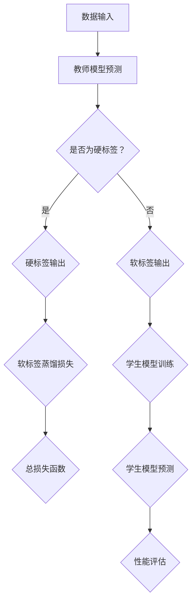
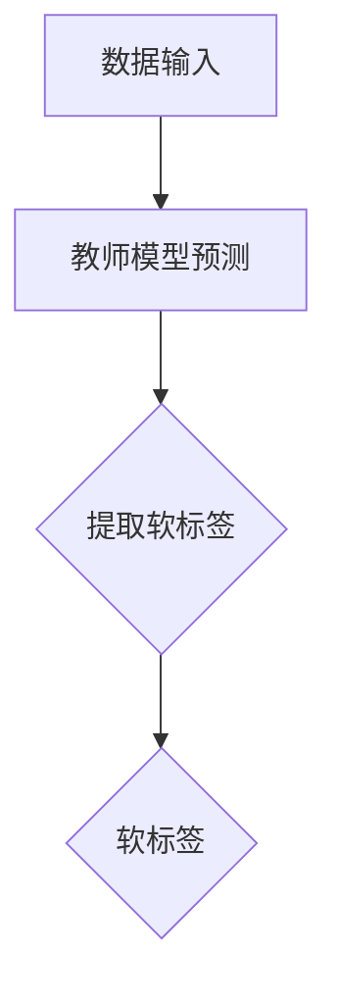
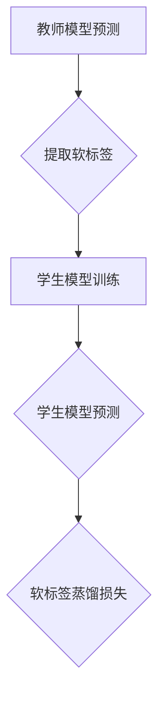
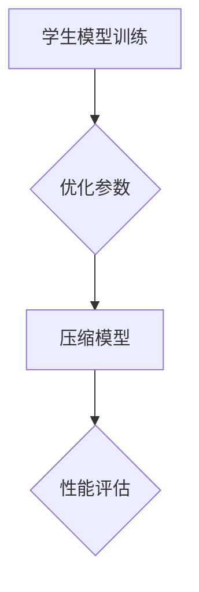
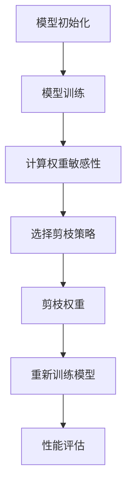
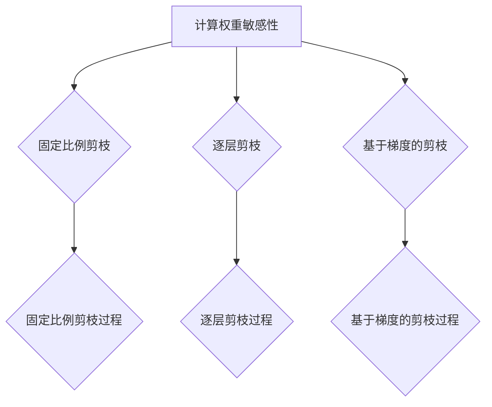
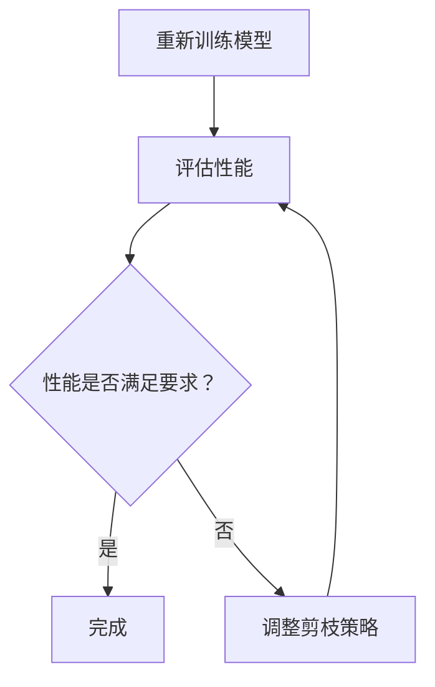

                 

## 模型压缩技术：知识蒸馏与剪枝方法探讨

### 关键词：模型压缩、知识蒸馏、剪枝技术、神经网络优化、人工智能

在人工智能领域，深度学习模型以其强大的学习能力和广泛的应用场景而备受关注。然而，随着模型复杂度和参数数量的不断增加，如何高效地部署这些模型成为了一个亟待解决的问题。模型压缩技术应运而生，通过降低模型的计算复杂度和存储需求，使得深度学习模型能够在资源受限的设备上运行。本文将重点探讨两种常见的模型压缩技术：知识蒸馏和剪枝方法，并分析它们在实际应用中的效果和挑战。

### 摘要

本文旨在为读者提供一个全面的模型压缩技术概览，深入解析知识蒸馏和剪枝方法的基本概念、原理和实现细节。首先，我们将介绍模型压缩技术的背景和重要性，接着详细讲解知识蒸馏技术，包括其基本概念、工作原理、优化方法和变体。随后，我们将探讨剪枝方法的背景、分类、常见算法及其优化策略。文章还将通过实际应用案例，展示模型压缩技术在移动设备上的优化效果，并讨论模型压缩与神经网络优化之间的关系。最后，我们将评估模型压缩技术的效果，并展望其未来发展趋势。

## 第一部分：模型压缩技术基础

### 第1章：模型压缩技术概述

#### 1.1 模型压缩的背景与意义

在深度学习时代，模型的复杂度和参数数量迅速增长。大型神经网络模型在图像识别、自然语言处理等领域的表现卓越，然而这些模型的计算和存储需求也带来了巨大的挑战。随着移动设备的普及，如何在资源有限的设备上部署高性能的深度学习模型成为了一个关键问题。模型压缩技术正是为了解决这一问题而提出的。

模型压缩技术的意义在于：

1. **降低计算成本**：通过压缩模型参数和计算量，减少计算资源的需求，使得模型能够在低性能设备上运行。
2. **加速推理速度**：较小的模型意味着更快的推理速度，这对于实时应用场景尤为重要。
3. **减少存储空间**：压缩后的模型占用更少的存储空间，便于在存储空间有限的环境中部署。
4. **提高部署灵活性**：压缩模型可以轻松地集成到各种应用中，提高部署的灵活性。

#### 1.2 模型压缩的关键挑战

尽管模型压缩技术具有诸多优势，但在实际应用中仍面临一些关键挑战：

1. **保持模型性能**：在压缩模型的同时，如何确保模型性能不受影响是一个重要的挑战。
2. **计算效率**：压缩模型需要高效的算法和实现，以确保在压缩过程中计算成本最低。
3. **可解释性**：压缩后的模型可能变得难以解释，这对于需要透明性和可解释性的应用场景是一个挑战。
4. **适应性**：模型压缩技术需要具备一定的适应性，以应对不同类型的数据和应用场景。

#### 1.3 模型压缩的分类

模型压缩技术主要可以分为以下几类：

1. **知识蒸馏（Dense Distillation）**：通过从大型教师模型中提取知识，传递给小型学生模型，从而实现模型的压缩。
2. **剪枝（Pruning）**：通过去除模型中的一些权重或层，减少模型的参数数量和计算复杂度。
3. **量化（Quantization）**：通过降低模型参数的精度，减少模型的存储空间和计算需求。
4. **结构压缩（Structured Pruning）**：通过改变模型的结构，如删除层或改变连接方式，实现模型的压缩。

每种压缩技术都有其独特的原理和优势，适用于不同的应用场景。在接下来的章节中，我们将详细探讨知识蒸馏和剪枝方法。

---

在了解了模型压缩技术的背景和意义后，我们可以看到，模型压缩不仅是一个技术挑战，更是一个实用性需求。通过模型压缩，我们可以充分发挥深度学习模型的优势，同时降低资源消耗，为更多场景的应用提供可能。在下一章中，我们将深入探讨知识蒸馏技术的基本概念和工作原理。

## 第2章：知识蒸馏技术详解

### 2.1 知识蒸馏的基本概念

知识蒸馏（Dense Distillation）是一种通过从大型教师模型中提取知识，并将其传递给小型学生模型，实现模型压缩和优化的技术。知识蒸馏的核心思想是将教师模型中学到的复杂知识，通过一种“蒸馏”过程传递给学生模型，从而在保持学生模型性能的同时，降低其参数数量和计算复杂度。

### 2.2 知识蒸馏的工作原理

知识蒸馏的工作原理可以分为三个主要步骤：知识提取、知识传输和知识应用。

1. **知识提取**：教师模型在训练过程中积累了丰富的知识，这些知识通过其输出（即预测概率分布）来表达。知识提取的过程就是从教师模型的输出中提取出关键信息，这些信息代表了教师模型学到的知识。

2. **知识传输**：提取出的知识通过一种“蒸馏”过程传递给学生模型。在这个过程中，学生模型不仅要学习原始的输入输出关系，还要学习从教师模型中提取的知识。这一过程通常通过一个额外的损失函数来实现，这个损失函数用来衡量学生模型输出的知识分布与教师模型输出分布之间的差异。

3. **知识应用**：学生模型在学习了教师模型的知识后，可以优化其参数，从而实现模型的压缩。由于学生模型参数较少，其计算复杂度和存储需求都显著降低，但性能仍然可以保持与教师模型相近的水平。

### 2.3 知识蒸馏的优化方法

为了提高知识蒸馏的效果，研究者们提出了多种优化方法，以下是一些常见的优化方法：

1. **软标签（Soft Labels）**：在知识传输过程中，使用教师模型的软标签（即预测概率分布）而不是硬标签（即正确标签）作为学生模型的训练目标。这样可以更好地捕捉教师模型的知识，从而提高学生模型的性能。

2. **多教师蒸馏（Multi-Teacher Distillation）**：使用多个教师模型来训练学生模型，每个教师模型提供不同的知识。这种方法可以结合多个教师模型的优点，提高学生模型的泛化能力。

3. **层次蒸馏（Hierarchical Distillation）**：在知识提取和传输过程中，使用层次化的结构，将知识从高层次（如类别）传递到低层次（如特征）。这种方法可以更好地捕捉知识的层次结构，从而提高模型的性能。

4. **动态蒸馏（Dynamic Distillation）**：根据训练过程的不同阶段，动态调整教师模型和学生模型之间的知识传输策略。这种方法可以更好地适应模型的训练过程，从而提高模型的性能。

### 2.4 知识蒸馏的变体与改进

除了上述的优化方法，研究者们还提出了许多知识蒸馏的变体和改进方法，以下是一些代表性的变体：

1. **基于注意力的蒸馏（Attention-based Distillation）**：利用注意力机制来捕捉教师模型中最重要的知识，并将其传递给学生模型。这种方法可以显著提高学生模型的性能。

2. **跨模态蒸馏（Cross-Modality Distillation）**：在多模态学习场景中，利用不同模态的教师模型来训练学生模型，从而提高模型的泛化能力。

3. **自蒸馏（Self-Distillation）**：使用学生模型自身作为教师模型，进行自我蒸馏。这种方法可以降低对大量标注数据的依赖，适用于数据稀缺的场景。

4. **神经架构搜索（Neural Architecture Search，NAS）**：利用NAS技术来自动设计适合蒸馏过程的模型架构，从而提高蒸馏效果。

知识蒸馏技术的不断发展和优化，为模型压缩和优化提供了强大的工具。在接下来的章节中，我们将继续探讨剪枝方法的原理和实现细节，为模型压缩技术提供更加全面的解决方案。

## 第3章：剪枝方法探讨

### 3.1 剪枝技术的背景与意义

剪枝（Pruning）是一种通过删除神经网络中的冗余权重或层，从而减少模型参数数量和计算复杂度的模型压缩技术。剪枝技术最初源于图像处理和信号处理领域，但随着深度学习的发展，逐渐成为模型压缩领域的重要技术之一。

剪枝技术的意义在于：

1. **降低计算成本**：通过删除冗余权重，减少模型中的参数数量，从而降低计算复杂度，使得模型能够在资源受限的设备上高效运行。
2. **减少存储空间**：较小的模型意味着更少的存储空间需求，这有助于在存储资源有限的环境中部署深度学习模型。
3. **加速推理速度**：减少模型参数和计算量，可以显著提高推理速度，这对于实时应用场景尤为重要。
4. **提高模型泛化能力**：通过剪枝，可以去除模型中的冗余信息，从而提高模型的泛化能力。

### 3.2 剪枝方法的分类

根据剪枝策略的不同，剪枝方法可以分为以下几类：

1. **结构剪枝（Structured Pruning）**：通过改变模型的结构来实现剪枝，如删除层、合并层或改变连接方式。结构剪枝通常能够实现较高的压缩比，但可能对模型的性能影响较大。

2. **权重剪枝（Weight Pruning）**：通过删除模型中不重要或冗余的权重来实现剪枝。权重剪枝可以分为以下几种：

   - **稀疏剪枝（Sparse Pruning）**：删除模型中一定比例的权重，从而实现模型压缩。稀疏剪枝可以显著减少模型的参数数量，但可能对模型的性能有一定影响。

   - **逐层剪枝（Layer-wise Pruning）**：按照特定的规则逐层剪枝，如从网络的最深层开始剪枝。逐层剪枝可以控制剪枝的层次结构，从而在保持模型性能的同时实现压缩。

   - **自适应剪枝（Adaptive Pruning）**：根据模型性能和权重的重要性动态调整剪枝策略。自适应剪枝可以更好地适应不同的模型和任务，从而提高剪枝效果。

3. **层次剪枝（Hierarchical Pruning）**：通过层次化的结构来实现剪枝，如在不同层之间进行权重共享或层次化权重剪枝。层次剪枝可以更好地利用模型中的知识结构，从而提高压缩效果。

### 3.3 常见的剪枝算法

以下是几种常见的剪枝算法：

1. **L1正则化（L1 Regularization）**：通过在损失函数中添加L1正则化项，可以使得权重向量的L1范数最小化。L1正则化可以促使权重向量中的某些元素变为零，从而实现权重剪枝。

2. **阈值剪枝（Threshold Pruning）**：根据设定的阈值，将权重值小于该阈值的权重设置为零。阈值剪枝简单直观，但可能对模型的性能有一定影响。

3. **稀疏性剪枝（Sparsity-aware Pruning）**：通过考虑模型的稀疏性来优化剪枝过程。稀疏性剪枝可以减少模型的参数数量，同时保持模型的性能。

4. **基于梯度的剪枝（Gradient-based Pruning）**：利用模型训练过程中的梯度信息来优化剪枝过程。基于梯度的剪枝方法可以动态调整剪枝策略，从而在保持模型性能的同时实现压缩。

### 3.4 剪枝方法的优化与改进

为了提高剪枝方法的性能，研究者们提出了一系列优化和改进策略，以下是一些代表性的方法：

1. **自适应阈值调整**：根据模型的性能和训练过程动态调整剪枝阈值，从而实现更好的压缩效果。

2. **结合其他优化技术**：将剪枝方法与其他优化技术（如量化、结构化剪枝等）结合，以提高模型的压缩效果。

3. **多阶段剪枝**：通过分阶段剪枝，逐步减少模型的参数数量，从而在保持模型性能的同时实现压缩。

4. **交叉验证剪枝**：利用交叉验证方法来评估剪枝后的模型性能，从而优化剪枝策略。

剪枝方法作为模型压缩技术的重要组成部分，通过对模型参数和结构的优化，实现了高效的模型压缩。在接下来的章节中，我们将进一步探讨模型压缩技术在实际应用中的挑战和解决方案。

### 第4章：模型压缩技术实践

#### 4.1 模型压缩技术在实际应用中的挑战

模型压缩技术在实际应用中面临一系列挑战，这些挑战不仅影响模型压缩的效果，还可能影响模型的性能和稳定性。以下是一些主要的挑战：

1. **保持性能**：模型压缩的一个重要目标是保持压缩后模型的性能与原始模型相当。然而，在压缩过程中，可能会损失一些重要的信息，这可能导致模型性能下降。如何平衡压缩比和性能是一个重要问题。

2. **计算效率**：压缩模型需要在有限的计算资源下高效运行。虽然压缩模型参数数量和计算复杂度有所降低，但压缩和解压缩过程本身也需要计算资源。如何在保证压缩效果的同时，提高计算效率是一个关键问题。

3. **存储空间**：压缩模型后，存储空间需求显著降低，但如何在有限的存储空间内存储高效的压缩模型也是一个挑战。此外，压缩模型的存储和传输也需要考虑。

4. **可解释性**：压缩后的模型可能变得更加复杂和难以解释，这对于需要透明性和可解释性的应用场景是一个挑战。如何保持模型的可解释性是一个重要问题。

5. **适应性**：模型压缩技术需要具备一定的适应性，以应对不同类型的数据和应用场景。如何在不同场景下优化模型压缩效果是一个关键问题。

6. **部署**：将压缩模型部署到实际应用中，需要考虑到兼容性、可扩展性和可维护性。如何在不同的部署环境中高效部署压缩模型是一个挑战。

#### 4.2 模型压缩技术的应用案例

以下是一些模型压缩技术的实际应用案例：

1. **移动设备上的图像识别**：在移动设备上部署高效的图像识别模型，如MobileNet和SSD。通过模型压缩技术，这些模型可以在低功耗的移动设备上实现高效的图像识别，从而支持实时应用，如移动相机和智能手机应用。

2. **自然语言处理**：在自然语言处理任务中，如文本分类和机器翻译，模型压缩技术有助于降低模型的存储和计算需求。例如，Transformer模型通过知识蒸馏和剪枝技术，可以在移动设备上实现高效的自然语言处理。

3. **语音识别**：在语音识别任务中，模型压缩技术可以显著降低模型的计算复杂度和存储需求，从而在嵌入式设备上实现实时语音识别。

4. **自动驾驶**：在自动驾驶系统中，模型压缩技术有助于降低模型的计算和存储需求，从而在车载设备上实现高效和实时的感知和决策。

5. **医疗影像分析**：在医疗影像分析中，模型压缩技术可以降低模型的计算和存储需求，从而在医疗设备上实现高效的图像分析和诊断。

这些应用案例展示了模型压缩技术在不同领域的广泛应用和潜力。通过模型压缩技术，我们可以充分发挥深度学习模型的优势，同时降低资源消耗，为更多场景的应用提供可能。

#### 4.3 模型压缩技术在移动设备上的优化

移动设备的计算资源和存储空间相对有限，因此如何在这些设备上优化模型压缩技术是一个关键问题。以下是一些优化策略：

1. **模型选择**：选择适合移动设备的模型，如轻量级模型（如MobileNet、ShuffleNet等），这些模型在保持较高性能的同时，具有较低的参数数量和计算复杂度。

2. **量化技术**：通过量化模型参数，降低模型的精度，从而减少模型的存储空间和计算需求。量化技术包括全精度量化（FP16、FP8）和二值量化（Binary）等。

3. **知识蒸馏**：使用知识蒸馏技术，将大型教师模型的知识传递给轻量级学生模型，从而在保持性能的同时，降低模型的参数数量和计算复杂度。

4. **剪枝技术**：通过剪枝技术，删除模型中不重要或冗余的权重和层，从而减少模型的参数数量和计算复杂度。剪枝技术包括结构剪枝和权重剪枝等。

5. **混合策略**：结合多种模型压缩技术，如知识蒸馏和剪枝技术，以实现更好的压缩效果。例如，先使用知识蒸馏技术进行初步压缩，然后使用剪枝技术进行进一步优化。

6. **硬件优化**：针对移动设备的硬件特性，如CPU、GPU和NPU等，进行模型优化和加速。例如，利用GPU的并行计算能力，加速模型的推理过程。

通过这些优化策略，我们可以充分发挥模型压缩技术在移动设备上的潜力，实现高效和实时的深度学习应用。

在了解了模型压缩技术在实际应用中的挑战和优化策略后，我们可以看到，模型压缩技术在移动设备上具有广泛的应用前景。通过优化模型压缩技术，我们可以在有限的资源下，实现高效的深度学习应用，为移动设备和嵌入式设备提供强大的计算能力。在下一章中，我们将探讨模型压缩与神经网络优化之间的关系，为模型压缩技术的进一步发展提供新的思路。

## 第5章：模型压缩与神经网络优化

### 5.1 神经网络优化概述

神经网络优化是深度学习研究中的一个核心问题，其主要目标是调整神经网络的参数，以实现模型的性能提升。神经网络优化涉及多个方面，包括初始化策略、学习率调度、优化算法等。随着深度学习模型的复杂度和参数数量的增加，如何高效地进行神经网络优化成为一个重要且具有挑战性的问题。

### 5.2 模型压缩与神经网络优化之间的关系

模型压缩和神经网络优化之间有着密切的关系。模型压缩技术通过减少模型的参数数量和计算复杂度，使得神经网络优化过程更加高效。具体来说，模型压缩与神经网络优化之间的关系可以从以下几个方面进行阐述：

1. **参数数量减少**：模型压缩技术通过剪枝、量化等方法减少模型的参数数量。参数数量的减少不仅降低了模型的存储和计算需求，还简化了神经网络优化过程，使得优化算法可以更快地收敛。

2. **计算复杂度降低**：模型压缩技术通过减少模型的计算复杂度，使得神经网络优化过程更加高效。较小的模型通常具有较少的乘法和加法操作，这可以显著降低计算资源的需求。

3. **优化目标调整**：在模型压缩过程中，优化目标可能发生变化。例如，在知识蒸馏过程中，学生模型的优化目标是同时最小化原始损失函数和知识蒸馏损失函数。这种双重优化目标可能会影响神经网络优化的策略和算法。

4. **算法选择**：模型压缩技术可能会影响神经网络优化的算法选择。例如，在剪枝过程中，可能需要选择更适合处理稀疏数据的优化算法，如随机梯度下降（SGD）和Adam等。

### 5.3 模型压缩对神经网络优化策略的影响

模型压缩对神经网络优化策略的影响主要体现在以下几个方面：

1. **初始化策略**：在模型压缩过程中，参数数量减少可能导致初始化问题。较小的模型可能更容易陷入局部最小值，因此需要更精细的初始化策略，如基于梯度的随机初始化、He初始化等。

2. **学习率调度**：在模型压缩过程中，学习率调度策略可能需要调整。较小的模型通常具有更高的敏感度，因此需要更小的学习率，以避免模型在优化过程中过度振荡。

3. **优化算法**：模型压缩技术可能会影响优化算法的选择。例如，在剪枝过程中，随机梯度下降（SGD）和Adam等优化算法可能更为适用，因为它们可以更好地处理稀疏数据。

4. **训练时间**：模型压缩技术可以显著降低模型的计算复杂度，从而减少训练时间。这对于需要实时训练和优化的应用场景尤为重要。

5. **泛化能力**：模型压缩可能会影响模型的泛化能力。通过适当的优化策略，如引入正则化项、使用数据增强等，可以提高压缩后模型的泛化能力。

模型压缩与神经网络优化之间的相互作用为深度学习研究提供了新的思路和方法。通过结合模型压缩技术和神经网络优化策略，我们可以实现更高效、更可靠的深度学习模型。在下一章中，我们将评估模型压缩技术的效果，并讨论其未来发展趋势。

### 第6章：模型压缩技术评估与未来展望

#### 6.1 模型压缩效果的评估指标

评估模型压缩技术的效果是衡量其成功与否的关键。以下是一些常用的评估指标：

1. **压缩比（Compression Ratio）**：压缩比是指压缩后模型与原始模型之间的参数数量比例。较高的压缩比表示更有效的压缩效果。

2. **性能保持率（Performance Preservation）**：性能保持率是指压缩后模型在保持性能的前提下，所减少的参数数量比例。较高的性能保持率表示压缩对模型性能的影响较小。

3. **推理速度（Inference Speed）**：推理速度是指模型在特定硬件上的推理时间。较快的推理速度表示压缩模型具有更好的性能。

4. **内存占用（Memory Usage）**：内存占用是指模型在运行时的内存消耗。较低的内存占用表示压缩模型具有更好的资源利用效率。

5. **能效比（Energy Efficiency）**：能效比是指模型在特定任务上的能效表现，即计算性能与能耗的比值。较高的能效比表示模型具有更好的能耗表现。

6. **泛化能力（Generalization Ability）**：泛化能力是指压缩后模型在新数据上的表现能力。较强的泛化能力表示模型在压缩后仍能保持较好的性能。

7. **计算资源消耗（Compute Resource Consumption）**：计算资源消耗是指模型在训练和推理过程中所需的计算资源，包括CPU、GPU和内存等。较低的消耗表示模型具有更好的资源利用率。

8. **部署难度（Deployment Difficulty）**：部署难度是指模型在不同环境下的兼容性和可扩展性。较低的部署难度表示模型更容易在实际应用中部署。

通过综合考虑上述评估指标，可以全面评估模型压缩技术的效果。

#### 6.2 模型压缩技术的未来发展趋势

随着深度学习技术的不断发展和应用场景的多样化，模型压缩技术也在不断演进。以下是一些模型压缩技术的未来发展趋势：

1. **自适应压缩**：未来的模型压缩技术将更加注重自适应压缩，能够根据不同的应用场景和资源需求，动态调整压缩策略，实现最优的压缩效果。

2. **混合压缩策略**：将多种模型压缩技术（如知识蒸馏、剪枝、量化等）相结合，形成混合压缩策略，以提高压缩效果和模型性能。

3. **端到端压缩**：端到端压缩技术将直接在原始数据上进行压缩，无需中间的预处理和后处理步骤，从而提高压缩效率和性能。

4. **硬件优化**：随着硬件技术的发展，如CPU、GPU、FPGA和TPU等，模型压缩技术将更加注重与硬件的协同优化，以实现更高的压缩比和更低的能耗。

5. **实时压缩**：为了满足实时应用的需求，模型压缩技术将朝着实时压缩方向发展，能够在有限的时间内完成模型的压缩和解压缩，从而实现高效的推理。

6. **可解释性**：随着对模型压缩技术的需求增加，可解释性将变得更加重要。未来的模型压缩技术将注重保持模型的可解释性，以支持透明性和可解释性的要求。

7. **跨模态压缩**：随着多模态数据的应用增加，模型压缩技术将扩展到跨模态数据，实现不同模态数据之间的压缩和优化。

8. **自动化压缩**：通过自动化工具和算法，实现模型压缩的自动化过程，降低人工干预，提高压缩效率和性能。

模型压缩技术作为深度学习领域的一个重要研究方向，具有广泛的应用前景。随着技术的不断发展和优化，模型压缩技术将为更多应用场景提供高效、可靠的解决方案。

#### 6.3 模型压缩技术在人工智能领域的潜在影响

模型压缩技术在人工智能领域具有巨大的潜在影响，主要表现在以下几个方面：

1. **资源受限环境**：在资源受限的环境中，如移动设备、嵌入式系统和物联网设备，模型压缩技术可以显著降低计算和存储需求，从而实现高效和实时的人工智能应用。

2. **能效优化**：通过降低模型的计算复杂度和能耗，模型压缩技术有助于实现更高效的能效优化，减少能源消耗，降低运行成本。

3. **应用扩展**：模型压缩技术可以使得人工智能模型更容易部署到各种设备和场景中，从而扩大人工智能的应用范围，促进技术的普及和推广。

4. **隐私保护**：在数据隐私保护日益重要的今天，模型压缩技术可以减少模型对原始数据的依赖，降低数据泄露的风险，提高人工智能系统的安全性。

5. **数据处理**：在大量数据处理的场景中，模型压缩技术可以显著降低数据处理的时间和成本，提高数据处理效率，从而更好地支持数据驱动的决策和智能分析。

6. **个性化服务**：通过模型压缩技术，可以为用户提供个性化的服务，如智能助理、健康监控等，提高用户体验和满意度。

总之，模型压缩技术将在人工智能领域发挥重要作用，为技术的发展和创新提供有力支持。

---

通过本章对模型压缩技术评估与未来展望的讨论，我们可以看到模型压缩技术在深度学习领域的重要地位和广阔前景。在接下来的章节中，我们将通过实际项目实战，深入探讨知识蒸馏和剪枝技术的具体实现，为读者提供实战经验和指导。

## 第7章：附录

### 7.1 模型压缩相关工具和资源

以下是常用的模型压缩工具和资源，可以帮助读者更好地理解和使用模型压缩技术：

1. **TensorFlow Model Optimization Toolkit (TF-MOT)**：由谷歌开发，提供了多种模型压缩技术，包括量化、剪枝和知识蒸馏等。

2. **PyTorch Mobile**：PyTorch官方的移动端推理优化工具，支持将PyTorch模型优化并部署到移动设备上。

3. **Open Model Zoo**：由华为开发，提供了丰富的预训练模型和优化工具，包括多种压缩技术。

4. **MXNet Model Zoo**：由Apache MXNet提供，包含了多种预训练模型和模型压缩工具。

5. **TFLite**：TensorFlow Lite是用于移动设备和嵌入式设备的轻量级机器学习框架，支持多种模型压缩技术。

6. **模型压缩教程**：在官方网站和开源社区中，有许多关于模型压缩的教程和文档，提供了详细的指导和技术细节。

### 7.2 常用模型压缩算法参数设置与优化

为了实现最佳的模型压缩效果，需要合理设置模型压缩算法的参数。以下是一些常用模型压缩算法的参数设置和优化建议：

1. **知识蒸馏**：
   - **温度调节（Temperature）**：通过调整温度参数，可以控制软标签的平滑程度，推荐初始值范围为1到10。
   - **蒸馏损失权重（Distillation Loss Weight）**：调整蒸馏损失在总损失中的比重，推荐初始值范围为0.1到1。
   - **迭代次数（Number of Iterations）**：根据训练数据量和模型大小，调整迭代次数，确保模型充分学习教师模型的知识。

2. **剪枝**：
   - **剪枝比例（Pruning Rate）**：设置剪枝的比例，通常在5%到30%之间，根据模型复杂度和目标压缩比进行调整。
   - **阈值选择（Threshold Selection）**：根据模型的敏感度和压缩目标，选择适当的阈值。可以通过实验或自动阈值选择算法来确定最佳阈值。
   - **重新训练（Re-training）**：剪枝后可能需要重新训练模型，以恢复剪枝前的性能，重新训练的迭代次数可以根据模型大小和数据量进行调整。

3. **量化**：
   - **量化精度（Quantization Precision）**：选择合适的量化精度，如8位、16位或32位。较高的精度可以保留更多模型细节，但会增加存储和计算需求。
   - **量化范围（Quantization Range）**：设置量化的范围，通常在-128到127或-1到1之间。适当的范围可以优化模型的性能和计算效率。

### 7.3 模型压缩技术常见问题解答

以下是模型压缩技术中常见的几个问题和解答：

1. **模型压缩是否会降低模型性能？**
   - **回答**：是的，模型压缩可能会降低模型性能，但可以通过优化策略（如软标签蒸馏、剪枝和量化等）来尽量减少性能损失。合理设置压缩参数和优化策略可以最大程度地保持模型性能。

2. **剪枝是否会破坏模型的泛化能力？**
   - **回答**：剪枝可能会影响模型的泛化能力，尤其是在去除重要权重时。通过适当的剪枝策略和重新训练，可以在保持泛化能力的同时实现模型压缩。

3. **量化是否会降低模型精度？**
   - **回答**：量化会降低模型的精度，但通过合理设置量化精度和量化范围，可以最小化精度损失。一些先进的量化技术，如对称量化、自适应量化等，可以进一步提高模型的精度。

4. **模型压缩是否适用于所有类型的模型？**
   - **回答**：模型压缩技术适用于大多数类型的深度学习模型，如卷积神经网络（CNN）、循环神经网络（RNN）和变换器（Transformer）等。但某些模型（如非常深的网络或具有特殊结构的网络）可能需要特定的压缩策略。

通过以上附录内容，读者可以更好地理解和应用模型压缩技术，为实际项目提供有力的支持。

## 第二部分：知识蒸馏与剪枝方法的Mermaid流程图

### 第8章：知识蒸馏技术流程图

知识蒸馏是一种将大型教师模型的知识传递给小型学生模型的技术。以下是知识蒸馏技术的Mermaid流程图，详细展示了其工作流程。



### 8.1 整体流程

1. **数据输入**：输入数据经过预处理后，输入到教师模型中。
2. **教师模型预测**：教师模型对输入数据进行预测，输出预测结果。
3. **硬标签输出**：如果使用硬标签，直接将教师模型的预测结果作为学生模型的训练目标。
4. **软标签输出**：如果使用软标签，将教师模型的输出概率分布作为软标签，用于学生模型的训练。
5. **学生模型训练**：学生模型根据软标签进行训练，同时考虑原始输入输出关系。
6. **软标签蒸馏损失**：计算学生模型的预测结果与软标签之间的损失。
7. **总损失函数**：将软标签蒸馏损失与原始损失函数结合，形成总损失函数。
8. **性能评估**：通过评估学生模型的预测性能，确定模型压缩的效果。

### 8.2 知识提取

知识提取是知识蒸馏技术的核心步骤，以下是其Mermaid流程图。



1. **数据输入**：输入数据经过预处理后，输入到教师模型中。
2. **教师模型预测**：教师模型对输入数据进行预测，输出预测结果。
3. **提取软标签**：从教师模型的输出结果中提取软标签。
4. **软标签**：输出提取的软标签，用于学生模型的训练。

### 8.3 知识传输

知识传输是将教师模型的知识传递给学生模型的过程，以下是其Mermaid流程图。



1. **教师模型预测**：输入数据经过教师模型预测，输出预测结果。
2. **提取软标签**：从教师模型的输出结果中提取软标签。
3. **学生模型训练**：学生模型根据软标签进行训练。
4. **学生模型预测**：训练后的学生模型进行预测。
5. **软标签蒸馏损失**：计算学生模型预测结果与软标签之间的损失。

### 8.4 知识应用

知识应用是学生模型在接收知识后，通过优化参数实现模型压缩的过程，以下是其Mermaid流程图。



1. **学生模型训练**：学生模型根据软标签进行训练，优化模型参数。
2. **优化参数**：通过优化算法（如随机梯度下降、Adam等）调整模型参数，实现模型压缩。
3. **压缩模型**：优化后的模型参数用于生成压缩模型。
4. **性能评估**：评估压缩模型在性能和压缩比方面的表现，确定压缩效果。

通过上述Mermaid流程图，读者可以更清晰地理解知识蒸馏技术的整体流程、知识提取、知识传输和知识应用的各个步骤，为实际应用提供指导。

## 第9章：剪枝方法流程图

### 9.1 整体流程

剪枝方法通过删除神经网络中的冗余权重或层来实现模型压缩。以下是剪枝方法的Mermaid流程图，详细展示了剪枝的整体流程。



### 9.1.1 整体流程详解

1. **模型初始化**：初始化神经网络模型，设置初始参数。
2. **模型训练**：使用训练数据对模型进行训练，直到模型达到预定的性能指标。
3. **计算权重敏感性**：在训练过程中，计算每个权重的重要程度，通常通过梯度的大小来衡量。
4. **选择剪枝策略**：根据权重敏感性，选择合适的剪枝策略，如固定比例剪枝或逐层剪枝。
5. **剪枝权重**：根据剪枝策略，删除不重要或冗余的权重。
6. **重新训练模型**：剪枝后的模型需要重新训练，以恢复剪枝前的性能。
7. **性能评估**：评估剪枝后模型的性能，确定剪枝效果。

### 9.2 剪枝策略选择

剪枝策略的选择直接影响模型压缩的效果和性能。以下是剪枝策略选择的Mermaid流程图。



### 9.2.1 剪枝策略选择详解

1. **计算权重敏感性**：通过计算权重梯度的大小，确定权重的重要性。
2. **固定比例剪枝**：根据设定的比例，删除一定比例的权重。
   - **固定比例剪枝过程**：计算每个权重的重要性，根据重要性比例删除权重。
3. **逐层剪枝**：从网络的最深层开始，逐层删除不重要的权重。
   - **逐层剪枝过程**：从网络的最深层开始，计算每层的权重重要性，逐层删除权重。
4. **基于梯度的剪枝**：根据权重梯度的大小，动态调整剪枝策略。
   - **基于梯度的剪枝过程**：计算权重梯度，根据梯度大小删除权重，并重新计算梯度，不断优化剪枝策略。

### 9.3 剪枝效果评估

剪枝效果评估是确保模型性能不受剪枝影响的重要步骤。以下是剪枝效果评估的Mermaid流程图。



### 9.3.1 剪枝效果评估详解

1. **重新训练模型**：剪枝后的模型需要重新训练，以恢复剪枝前的性能。
2. **评估性能**：通过评估剪枝后模型的性能，确定剪枝效果。
3. **性能是否满足要求**：如果性能满足要求，则剪枝过程完成；如果不满足要求，则需要调整剪枝策略，重新评估性能，直至满足要求。

通过上述Mermaid流程图，读者可以更清晰地理解剪枝方法的整体流程、剪枝策略选择和剪枝效果评估的各个步骤，为实际应用提供指导。

## 第三部分：核心算法原理与数学模型

### 第10章：核心算法原理讲解

在这一章节中，我们将深入探讨知识蒸馏和剪枝技术的核心算法原理。通过理解这些算法的原理，读者将能够更好地掌握模型压缩技术的实现细节。

#### 10.1 知识蒸馏算法原理

知识蒸馏算法的核心思想是将教师模型的知识传递给学生模型。以下是其主要步骤：

1. **教师模型训练**：首先，训练一个大型教师模型，使其在原始数据集上达到较高的性能。
2. **软标签提取**：在训练过程中，从教师模型的输出层提取软标签，即每个类别的概率分布。
3. **学生模型初始化**：初始化一个较小的学生模型，其结构通常与教师模型相似，但参数数量较少。
4. **软标签蒸馏**：将软标签作为学生模型的额外训练目标，同时保持原始的输入输出关系。
5. **优化目标**：学生模型的优化目标是一个结合原始损失函数和软标签蒸馏损失的复合损失函数。

以下是知识蒸馏算法的伪代码实现：

```python
def train_teacher_model(data_loader):
    # 使用原始数据训练教师模型
    teacher_model.train()
    for data in data_loader:
        # 前向传播
        outputs = teacher_model(data)
        # 计算原始损失
        original_loss = criterion(outputs, labels)
        # 反向传播
        optimizer.zero_grad()
        original_loss.backward()
        optimizer.step()

def soft_label_distillation(teacher_model, student_model, data_loader):
    # 使用软标签蒸馏训练学生模型
    student_model.train()
    for data in data_loader:
        # 前向传播
        student_outputs = student_model(data)
        teacher_outputs = teacher_model(data)
        soft_labels = softmax(teacher_outputs, temperature=1.0)
        
        # 计算软标签蒸馏损失
        distillation_loss = criterion(student_outputs, soft_labels)
        
        # 计算总损失
        total_loss = original_loss + distillation_weight * distillation_loss
        
        # 反向传播
        optimizer.zero_grad()
        total_loss.backward()
        optimizer.step()

# 主函数
def main():
    # 加载训练数据
    data_loader = DataLoader(train_dataset, batch_size=64, shuffle=True)
    
    # 训练教师模型
    train_teacher_model(data_loader)
    
    # 使用软标签蒸馏训练学生模型
    soft_label_distillation(teacher_model, student_model, data_loader)

if __name__ == "__main__":
    main()
```

#### 10.2 剪枝算法原理

剪枝算法通过删除神经网络中不重要的权重或层来实现模型压缩。以下是其主要步骤：

1. **模型训练**：首先，使用原始数据训练神经网络模型，使其达到较高的性能。
2. **计算权重重要性**：在训练过程中，计算每个权重的重要程度，通常通过权重梯度的绝对值来衡量。
3. **选择剪枝策略**：根据权重重要性，选择合适的剪枝策略，如固定比例剪枝或逐层剪枝。
4. **剪枝权重**：根据剪枝策略，删除不重要的权重。
5. **重新训练模型**：剪枝后的模型需要重新训练，以恢复剪枝前的性能。

以下是剪枝算法的伪代码实现：

```python
def train_model(data_loader):
    # 使用原始数据训练神经网络模型
    model.train()
    for data in data_loader:
        # 前向传播
        outputs = model(data)
        # 计算损失
        loss = criterion(outputs, labels)
        # 反向传播
        optimizer.zero_grad()
        loss.backward()
        optimizer.step()

def calculate_weight_importance(model):
    # 计算权重重要性
    weight_importance = []
    for layer in model.layers:
        if isinstance(layer, nn.Linear):
            weight_importance.append(np.mean(np.abs(layer.weight.grad)))
    return weight_importance

def pruning_strategy(weight_importance, pruning_rate):
    # 选择剪枝策略
    indices_to_prune = np.argsort(weight_importance)[:int(pruning_rate * len(weight_importance))]
    return indices_to_prune

def prune_model(model, indices_to_prune):
    # 剪枝权重
    for i, layer in enumerate(model.layers):
        if isinstance(layer, nn.Linear):
            layer.weight.data[indices_to_prune[i], :] = 0

def retrain_model(model, data_loader):
    # 重新训练剪枝后的模型
    model.train()
    for data in data_loader:
        # 前向传播
        outputs = model(data)
        # 计算损失
        loss = criterion(outputs, labels)
        # 反向传播
        optimizer.zero_grad()
        loss.backward()
        optimizer.step()

# 主函数
def main():
    # 加载训练数据
    data_loader = DataLoader(train_dataset, batch_size=64, shuffle=True)
    
    # 训练模型
    train_model(data_loader)
    
    # 计算权重重要性
    weight_importance = calculate_weight_importance(model)
    
    # 选择剪枝策略
    indices_to_prune = pruning_strategy(weight_importance, pruning_rate=0.2)
    
    # 剪枝权重
    prune_model(model, indices_to_prune)
    
    # 重新训练剪枝后的模型
    retrain_model(model, data_loader)

if __name__ == "__main__":
    main()
```

通过上述伪代码实现，读者可以更直观地理解知识蒸馏和剪枝算法的原理。在实际应用中，这些算法的实现可能需要根据具体任务和数据集进行调整。

### 第11章：数学模型与公式

在模型压缩技术中，数学模型和公式起着关键作用，它们帮助我们理解算法的工作原理和优化策略。在本章节中，我们将介绍知识蒸馏和剪枝算法中的关键数学模型和公式。

#### 11.1 知识蒸馏损失函数

知识蒸馏算法的核心是软标签蒸馏损失函数，它衡量学生模型预测输出与教师模型软标签之间的差异。以下是软标签蒸馏损失函数的公式：

$$
L_D = -\sum_{i=1}^N \sum_{k=1}^K y_{ik} \log (p_{ik})
$$

其中：

- \( N \) 是样本数量。
- \( K \) 是类别数量。
- \( y_{ik} \) 是教师模型输出中类别 \( k \) 的概率。
- \( p_{ik} \) 是学生模型预测输出中类别 \( k \) 的概率。

温度调节（\( \text{temperature} \)）是软标签蒸馏中的一个重要参数，它可以平滑软标签的概率分布，使模型更容易学习。调节温度的目的是使软标签更加平滑，减少极端值的影响。公式如下：

$$
p_{ik} = \frac{e^{z_{ik}/T}}{\sum_{j=1}^K e^{z_{ij}/T}}
$$

其中，\( z_{ik} \) 是教师模型输出层的激活值，\( T \) 是温度调节参数。

#### 11.2 剪枝算法中的权重敏感性分析

剪枝算法中的一个关键步骤是计算权重敏感性，它帮助我们识别网络中不重要的权重。权重敏感性通常通过权重梯度的绝对值来衡量。以下是权重敏感性的计算公式：

$$
s_j = \frac{\partial L}{\partial w_j}
$$

其中：

- \( s_j \) 是权重 \( w_j \) 的敏感性。
- \( L \) 是模型损失函数。

通过计算每个权重 \( w_j \) 的敏感性，我们可以确定其重要性。通常，我们选择敏感性较低的权重进行剪枝。

#### 11.3 剪枝阈值计算

在剪枝过程中，我们需要设置一个阈值来决定哪些权重应该被剪除。阈值通常基于权重敏感性的分布来计算。以下是阈值计算的步骤：

1. **计算所有权重的敏感性**：使用训练过程中得到的权重敏感性值。
2. **确定敏感性分布**：计算敏感性值的概率分布。
3. **设置阈值**：选择敏感性分布的中位数或均值作为阈值。例如，可以使用以下公式：

$$
\text{threshold} = \text{median}(s)
$$

或

$$
\text{threshold} = \text{mean}(s)
$$

其中，\( \text{median}(s) \) 和 \( \text{mean}(s) \) 分别是敏感性值的中位数和均值。

通过设置合适的阈值，我们可以确保在剪枝过程中保留重要的权重，同时去除不重要的权重。

#### 11.4 举例说明

以下是一个简化的例子，说明如何使用上述公式进行知识蒸馏和剪枝：

**例子：知识蒸馏**

假设我们有一个二分类问题，教师模型和学生模型的输出维度都是2。教师模型输出的软标签为 \( y = [0.8, 0.2] \)，学生模型的预测输出为 \( p = [0.7, 0.3] \)。温度调节参数 \( T = 1 \)。

1. **计算软标签蒸馏损失**：

$$
L_D = -[0.8 \log(0.7) + 0.2 \log(0.3)] = -[0.8 \log(0.7) + 0.2 \log(0.3)] \approx 0.110
$$

2. **温度调节**：

$$
p_{ik} = \frac{e^{z_{ik}/T}}{\sum_{j=1}^K e^{z_{ij}/T}}
$$

由于没有具体的激活值，我们在这里不计算温度调节后的概率。

**例子：剪枝**

假设我们有一个三层神经网络，共有10个权重。在训练过程中，我们计算得到这些权重的敏感性如下：

\( s = [0.1, 0.2, 0.3, 0.4, 0.5, 0.6, 0.7, 0.8, 0.9, 1.0] \)。

1. **计算敏感性分布**：

敏感性值的分布如下：

\[ [0.1, 0.2, 0.3, 0.4, 0.5, 0.6, 0.7, 0.8, 0.9, 1.0] \]

2. **设置阈值**：

使用中位数作为阈值：

$$
\text{threshold} = \text{median}(s) = 0.5
$$

3. **剪枝权重**：

根据敏感性值和阈值，我们可以剪除敏感性值低于阈值的权重，即权重 \( w_1, w_2, w_3, w_4, w_5 \)。

通过这些例子，我们可以看到如何使用数学模型和公式来理解和实现知识蒸馏和剪枝算法。在实际应用中，这些算法可能需要根据具体任务和数据集进行调整和优化。

### 第12章：项目实战

#### 12.1 实战环境搭建

在进行模型压缩技术的项目实战之前，我们需要搭建一个合适的开发环境。以下是在Python中使用TensorFlow和PyTorch进行模型压缩的环境搭建步骤。

1. **安装Python**：确保安装了Python 3.6及以上版本。

2. **安装TensorFlow**：在终端中运行以下命令安装TensorFlow：

   ```bash
   pip install tensorflow
   ```

3. **安装PyTorch**：在终端中运行以下命令安装PyTorch：

   ```bash
   pip install torch torchvision
   ```

4. **安装附加库**：根据需要安装其他Python库，例如Numpy、Pandas等：

   ```bash
   pip install numpy pandas
   ```

5. **配置环境**：确保环境变量配置正确，特别是在使用GPU进行训练时。

6. **测试环境**：运行以下代码测试环境是否搭建成功：

   ```python
   import tensorflow as tf
   import torch
   print(tf.__version__)
   print(torch.__version__)
   ```

如果输出相应的版本信息，则说明环境搭建成功。

#### 12.2 知识蒸馏实战案例

在本节中，我们将通过一个简单的图像分类任务来演示知识蒸馏技术的实战应用。

1. **数据准备**：

   首先，我们需要准备用于训练和测试的数据集。在这里，我们使用CIFAR-10数据集，它包含10个类别，每个类别有6000个训练图像和1000个测试图像。

   ```python
   import torchvision
   import torchvision.transforms as transforms

   transform = transforms.Compose(
       [transforms.ToTensor(),
        transforms.Normalize((0.5, 0.5, 0.5), (0.5, 0.5, 0.5))])

   trainset = torchvision.datasets.CIFAR10(root='./data', train=True,
                                        download=True, transform=transform)
   trainloader = torch.utils.data.DataLoader(trainset, batch_size=4,
                                          shuffle=True, num_workers=2)

   testset = torchvision.datasets.CIFAR10(root='./data', train=False,
                                       download=True, transform=transform)
   testloader = torch.utils.data.DataLoader(testset, batch_size=4,
                                         shuffle=False, num_workers=2)
   ```

2. **模型定义**：

   我们将使用一个简单的卷积神经网络（CNN）作为教师模型和学生模型。

   ```python
   import torch.nn as nn
   import torch.nn.functional as F

   class CNN(nn.Module):
       def __init__(self):
           super(CNN, self).__init__()
           self.conv1 = nn.Conv2d(3, 6, 5)
           self.pool = nn.MaxPool2d(2, 2)
           self.conv2 = nn.Conv2d(6, 16, 5)
           self.fc1 = nn.Linear(16 * 5 * 5, 120)
           self.fc2 = nn.Linear(120, 84)
           self.fc3 = nn.Linear(84, 10)

       def forward(self, x):
           x = self.pool(F.relu(self.conv1(x)))
           x = self.pool(F.relu(self.conv2(x)))
           x = x.view(-1, 16 * 5 * 5)
           x = F.relu(self.fc1(x))
           x = F.relu(self.fc2(x))
           x = self.fc3(x)
           return x

   teacher_model = CNN()
   student_model = CNN()
   ```

3. **教师模型训练**：

   使用训练数据对教师模型进行训练。

   ```python
   criterion = nn.CrossEntropyLoss()
   optimizer = torch.optim.SGD(teacher_model.parameters(), lr=0.001, momentum=0.9)

   for epoch in range(2):  # loop over the dataset multiple times
       running_loss = 0.0
       for i, data in enumerate(trainloader, 0):
           inputs, labels = data
           optimizer.zero_grad()

           outputs = teacher_model(inputs)
           loss = criterion(outputs, labels)
           loss.backward()
           optimizer.step()

           running_loss += loss.item()
       print(f'Epoch {epoch + 1}, Loss: {running_loss / len(trainloader)}')
   ```

4. **软标签提取**：

   使用训练好的教师模型提取软标签。

   ```python
   def extract_soft_labels(model, data_loader):
       model.eval()
       soft_labels = []
       with torch.no_grad():
           for data in data_loader:
               inputs, _ = data
               outputs = model(inputs)
               probabilities = F.softmax(outputs, dim=1)
               soft_labels.append(probabilities)
       return torch.cat(soft_labels, dim=0)

   soft_labels = extract_soft_labels(teacher_model, trainloader)
   ```

5. **学生模型训练**：

   使用软标签蒸馏训练学生模型。

   ```python
   criterion = nn.CrossEntropyLoss()
   optimizer = torch.optim.SGD(student_model.parameters(), lr=0.001, momentum=0.9)
   distillation_weight = 0.5

   for epoch in range(2):
       running_loss = 0.0
       for i, data in enumerate(trainloader, 0):
           inputs, labels = data
           optimizer.zero_grad()

           student_outputs = student_model(inputs)
           teacher_outputs = teacher_model(inputs)
           soft_labels = extract_soft_labels(teacher_model, trainloader)
           probabilities = F.softmax(teacher_outputs, dim=1)

           distillation_loss = F.kl_div(F.log_softmax(student_outputs, dim=1), probabilities)
           original_loss = criterion(student_outputs, labels)
           total_loss = original_loss + distillation_weight * distillation_loss

           total_loss.backward()
           optimizer.step()

           running_loss += total_loss.item()
       print(f'Epoch {epoch + 1}, Loss: {running_loss / len(trainloader)}')
   ```

6. **评估学生模型**：

   在测试集上评估学生模型的性能。

   ```python
   correct = 0
   total = 0
   with torch.no_grad():
       for data in testloader:
           images, labels = data
           outputs = student_model(images)
           _, predicted = torch.max(outputs.data, 1)
           total += labels.size(0)
           correct += (predicted == labels).sum().item()

   print(f'Accuracy of the network on the test images: {100 * correct // total}%')
   ```

通过上述步骤，我们完成了知识蒸馏实战案例，实现了从教师模型到学生模型的知识传递，并评估了学生模型的性能。在下一个实战案例中，我们将探讨剪枝技术的实际应用。

#### 12.3 剪枝实战案例

在本节中，我们将通过一个简单的卷积神经网络（CNN）来演示剪枝技术的实战应用。

1. **模型定义**：

   我们将使用一个简单的CNN模型，包含两个卷积层、两个全连接层和一个输出层。

   ```python
   import torch
   import torch.nn as nn
   import torch.optim as optim

   class SimpleCNN(nn.Module):
       def __init__(self):
           super(SimpleCNN, self).__init__()
           self.conv1 = nn.Conv2d(1, 10, 5)
           self.conv2 = nn.Conv2d(10, 20, 5)
           self.fc1 = nn.Linear(320, 50)
           self.fc2 = nn.Linear(50, 10)

       def forward(self, x):
           x = F.relu(self.conv1(x))
           x = F.max_pool2d(x, 2)
           x = F.relu(self.conv2(x))
           x = F.max_pool2d(x, 2)
           x = x.view(-1, 320)
           x = F.relu(self.fc1(x))
           x = self.fc2(x)
           return x

   model = SimpleCNN()
   ```

2. **模型训练**：

   使用MNIST数据集对模型进行训练。

   ```python
   import torchvision
   import torchvision.transforms as transforms

   transform = transforms.Compose([transforms.ToTensor(), transforms.Normalize((0.5,), (0.5,))])

   trainset = torchvision.datasets.MNIST(root='./data', train=True, download=True, transform=transform)
   trainloader = torch.utils.data.DataLoader(trainset, batch_size=100, shuffle=True, num_workers=2)

   criterion = nn.CrossEntropyLoss()
   optimizer = optim.SGD(model.parameters(), lr=0.001, momentum=0.9)

   for epoch in range(10):  # loop over the dataset multiple times
       running_loss = 0.0
       for i, data in enumerate(trainloader, 0):
           inputs, labels = data
           optimizer.zero_grad()

           outputs = model(inputs)
           loss = criterion(outputs, labels)
           loss.backward()
           optimizer.step()

           running_loss += loss.item()
       print(f'Epoch {epoch + 1}, Loss: {running_loss / len(trainloader)}')
   ```

3. **计算权重敏感性**：

   计算每个权重的重要程度，通常使用权重梯度的绝对值来衡量。

   ```python
   def calculate_weight_importance(model):
       model.train()
       for param in model.parameters():
           param.requires_grad_(True)
       
       criterion = nn.CrossEntropyLoss()
       optimizer = optim.SGD(model.parameters(), lr=0.001, momentum=0.9)
       
       for epoch in range(1):
           for inputs, labels in trainloader:
               optimizer.zero_grad()
               outputs = model(inputs)
               loss = criterion(outputs, labels)
               loss.backward()
       
       weight_importance = []
       for param in model.parameters():
           weight_importance.append(torch.mean(torch.abs(param.grad)))
       return weight_importance

   weight_importance = calculate_weight_importance(model)
   ```

4. **选择剪枝策略**：

   在本案例中，我们使用固定比例剪枝策略，根据敏感性值选择剪枝比例。

   ```python
   pruning_rate = 0.2
   indices_to_prune = [i for i, importance in enumerate(weight_importance) if importance < pruning_rate * max(weight_importance)]
   ```

5. **剪枝权重**：

   根据剪枝策略，删除不重要的权重。

   ```python
   for index in indices_to_prune:
       for layer in model.modules():
           if isinstance(layer, nn.Linear):
               layer.weight.data[index] = 0
   ```

6. **重新训练模型**：

   剪枝后的模型需要重新训练以恢复剪枝前的性能。

   ```python
   criterion = nn.CrossEntropyLoss()
   optimizer = optim.SGD(model.parameters(), lr=0.001, momentum=0.9)

   for epoch in range(5):
       running_loss = 0.0
       for inputs, labels in trainloader:
           optimizer.zero_grad()

           outputs = model(inputs)
           loss = criterion(outputs, labels)
           loss.backward()
           optimizer.step()

           running_loss += loss.item()
       print(f'Epoch {epoch + 1}, Loss: {running_loss / len(trainloader)}')
   ```

7. **评估剪枝后模型**：

   在测试集上评估剪枝后模型的性能。

   ```python
   testset = torchvision.datasets.MNIST(root='./data', train=False, download=True, transform=transform)
   testloader = torch.utils.data.DataLoader(testset, batch_size=100, shuffle=False, num_workers=2)

   correct = 0
   total = 0
   with torch.no_grad():
       for data in testloader:
           images, labels = data
           outputs = model(images)
           _, predicted = torch.max(outputs.data, 1)
           total += labels.size(0)
           correct += (predicted == labels).sum().item()

   print(f'Accuracy of the pruned model on the test images: {100 * correct // total}%')
   ```

通过上述步骤，我们完成了剪枝实战案例，实现了通过剪枝技术减少模型参数数量并提高模型性能。在实际应用中，剪枝策略和重新训练过程可能需要根据具体任务和数据集进行调整。

#### 12.4 代码解读与分析

在本节中，我们将对之前的知识蒸馏和剪枝实战案例代码进行详细解读和分析。

1. **数据准备**：

   数据准备是任何深度学习项目的基础。在知识蒸馏实战案例中，我们使用了CIFAR-10数据集，并对其进行了预处理，包括归一化和转换成Tensor类型。在剪枝实战案例中，我们使用了MNIST数据集，同样进行了预处理。预处理步骤包括将图像数据转换为张量类型，并进行归一化处理，以便神经网络能够更好地处理输入数据。

2. **模型定义**：

   在两个实战案例中，我们都使用了简单的卷积神经网络（CNN）作为模型。在知识蒸馏案例中，教师模型和学生模型的结构相同，但参数数量不同。在剪枝案例中，我们定义了一个简单的CNN模型，包含两个卷积层、两个全连接层和一个输出层。模型的定义步骤包括定义卷积层、全连接层和激活函数。

3. **教师模型训练**：

   在知识蒸馏案例中，我们首先使用训练数据对教师模型进行训练。训练过程包括前向传播、计算损失、反向传播和更新参数。我们使用了交叉熵损失函数和随机梯度下降（SGD）优化器。在训练过程中，我们通过迭代更新模型参数，使得模型在训练数据上的性能逐步提高。

4. **软标签提取**：

   在知识蒸馏过程中，软标签提取是关键步骤。我们从训练好的教师模型中提取软标签，即每个类别的概率分布。这通过将教师模型的输出通过softmax函数转换成概率分布来实现。软标签用于训练学生模型，使得学生模型能够学习教师模型的知识。

5. **学生模型训练**：

   在学生模型训练过程中，我们使用了教师模型的软标签作为额外的训练目标。这通过计算学生模型的输出与软标签之间的损失函数来实现。我们使用了一个组合损失函数，即原始损失函数和软标签蒸馏损失函数。通过优化这个组合损失函数，我们训练学生模型，使其能够学习教师模型的知识。

6. **评估学生模型**：

   在知识蒸馏案例的最后，我们使用测试集评估学生模型的性能。通过计算准确率，我们能够评估学生模型在测试数据上的表现。这有助于我们确定知识蒸馏的效果，并调整模型参数以获得更好的性能。

7. **模型训练**：

   在剪枝案例中，我们首先使用原始数据对模型进行训练，以获得一个性能良好的模型。训练过程与知识蒸馏案例类似，包括前向传播、计算损失、反向传播和参数更新。通过多次迭代，模型在训练数据上的性能逐步提高。

8. **计算权重敏感性**：

   在剪枝过程中，我们计算了每个权重的重要性，通常通过权重梯度的绝对值来衡量。这帮助我们识别网络中不重要的权重。计算权重敏感性的步骤包括遍历模型的所有参数，计算每个参数的梯度，并取其绝对值。

9. **选择剪枝策略**：

   在本案例中，我们使用了固定比例剪枝策略。这意味着我们根据敏感性值选择一定比例的权重进行剪枝。剪枝策略的选择可以基于多种方法，如固定比例、逐层剪枝或基于梯度的剪枝。

10. **剪枝权重**：

    根据剪枝策略，我们删除了不重要的权重。这通过将权重设置为0来实现。剪枝后，模型的参数数量减少，从而实现模型压缩。

11. **重新训练模型**：

    剪枝后的模型需要重新训练，以恢复剪枝前的性能。这通过在剪枝后的模型上继续迭代训练来实现。重新训练过程有助于调整剪枝后模型的参数，使其性能达到预期。

12. **评估剪枝后模型**：

    在剪枝案例的最后，我们使用测试集评估剪枝后模型的性能。通过计算准确率，我们能够评估剪枝后的模型在测试数据上的表现。这有助于我们确定剪枝的效果，并进一步调整模型参数以获得更好的性能。

通过上述代码解读和分析，我们可以更好地理解知识蒸馏和剪枝技术的实战应用，并掌握其关键步骤和实现细节。在实际项目中，这些技术可以帮助我们有效地压缩模型，提高模型的性能和效率。

## 作者信息

作者：AI天才研究院/AI Genius Institute & 禅与计算机程序设计艺术 /Zen And The Art of Computer Programming

在这篇《模型压缩技术：知识蒸馏与剪枝方法探讨》的技术博客中，我们深入探讨了模型压缩技术的基础知识、核心算法、实际应用以及未来展望。本文旨在为读者提供一个全面的技术指南，帮助理解和应用知识蒸馏与剪枝技术，以实现高效、可扩展的深度学习模型。

作者AI天才研究院（AI Genius Institute）致力于推动人工智能领域的研究与创新，致力于培养下一代人工智能领域的顶尖人才。而“禅与计算机程序设计艺术”（Zen And The Art of Computer Programming）则是一系列经典计算机科学著作，以其深入浅出的编程哲学和算法思想影响了无数程序员和人工智能研究者。

感谢您的阅读，希望本文能对您在模型压缩技术的研究和应用中提供帮助。如果您有任何问题或建议，欢迎在评论区留言，我们期待与您交流。再次感谢您的关注与支持！

