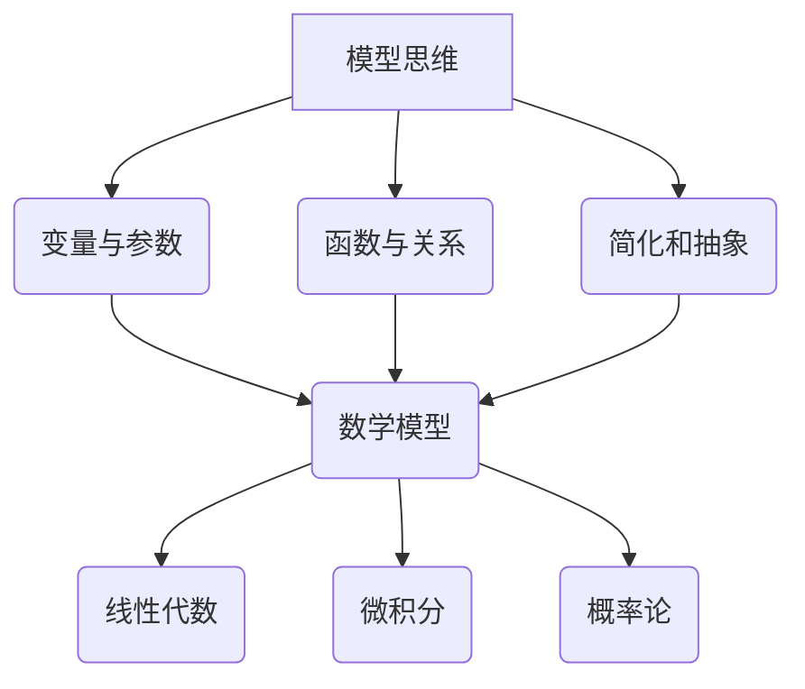

                 

### 《模型思维：快速掌握复杂事物的利器》

关键词：模型思维、复杂系统、数据分析、机器学习、深度学习

摘要：本文深入探讨了模型思维的概念、原理及其在各个领域的应用。通过详细阐述模型思维的基本要素、数学模型基础、经典模型讲解以及模型思维的应用，帮助读者理解和掌握这一强大的思考工具，提升解决复杂问题的能力。

### 引言

模型思维是一种强大的思考工具，它可以帮助我们快速掌握复杂的事物。在计算机科学和人工智能领域，模型思维尤为重要。本文旨在介绍模型思维的基本概念、原理和应用，帮助读者提升解决复杂问题的能力。

本文将分为三个部分进行讨论。第一部分将介绍模型思维的基础知识，包括模型思维的重要性、概述、基本要素等。第二部分将讲解数学模型基础，包括线性代数、微积分和概率论等基础数学知识。第三部分将重点介绍经典模型讲解，包括线性回归、决策树、支持向量机等经典机器学习模型。

### 第一部分：模型思维基础

#### 1. 引言

模型思维是一种通过构建模型来理解和分析复杂事物的思考方式。在计算机科学和人工智能领域，模型思维尤为重要。它可以帮助我们更好地理解和设计复杂的系统，从而解决实际问题。

#### 1.1 模型思维的重要性

模型思维在各个领域都有着广泛的应用。在科学研究领域，模型思维可以帮助我们建立理论模型，从而深入理解自然现象。在工程领域，模型思维可以帮助我们设计和优化复杂的系统。在商业领域，模型思维可以帮助我们进行市场预测和决策。

#### 1.2 模型思维与日常生活的联系

模型思维不仅限于科学和工程领域，它在我们的日常生活中也有着广泛的应用。例如，当我们预测天气时，我们实际上是在构建一个天气模型。当我们制定计划时，我们实际上是在构建一个时间管理模型。模型思维使我们的生活更加有序和高效。

#### 1.3 本书结构

本文将分为三个部分进行讨论。第一部分将介绍模型思维的基础知识，包括模型思维的重要性、概述、基本要素等。第二部分将讲解数学模型基础，包括线性代数、微积分和概率论等基础数学知识。第三部分将重点介绍经典模型讲解，包括线性回归、决策树、支持向量机等经典机器学习模型。

### 第二部分：模型思维概述

#### 2.1 什么是模型思维

模型思维是一种通过构建模型来理解和分析复杂事物的思考方式。模型可以是数学模型、物理模型、计算机模型等。通过模型，我们可以将复杂的现实世界简化为易于理解和分析的形式。

#### 2.2 模型思维的核心原则

模型思维的核心原则包括：

1. **简化与抽象**：将复杂的事物简化为基本的组成部分和关系。
2. **验证与测试**：通过验证和测试来确保模型的有效性和可靠性。
3. **迭代与优化**：不断迭代和优化模型，以提高其准确性和性能。

#### 2.3 模型思维与科学方法的关系

模型思维是科学方法的重要组成部分。科学方法包括观察、假设、实验、验证等步骤。模型思维可以帮助我们在这些步骤中更好地理解和分析数据，从而得出科学的结论。

### 第三部分：模型思维的基本要素

模型思维的基本要素包括变量、参数、函数和关系等。

#### 3.1 变量与参数

变量是指可以取不同值的量。参数是模型中固定的数值，用于描述模型的特性。

#### 3.2 函数与关系

函数是一种数学关系，它将一个变量映射到另一个变量。关系是指变量之间的相互影响和依赖。

#### 3.3 简化和抽象

简化和抽象是模型思维的关键步骤。通过简化和抽象，我们可以将复杂的现实世界简化为易于理解和分析的模型。

### 第四部分：数学模型基础

数学模型是模型思维的核心组成部分。本节将介绍线性代数、微积分和概率论等基础数学知识。

#### 4.1 线性代数基础

线性代数是数学中的一个重要分支，它研究向量、矩阵和线性变换。以下是一些基本的线性代数概念：

1. **向量**：向量是一种有大小和方向的量。在数学中，向量通常表示为一组有序数。

2. **矩阵**：矩阵是一个二维数组，由行和列组成。矩阵可以用于表示线性变换和系统的状态。

3. **矩阵运算**：矩阵运算包括矩阵加法、矩阵乘法、矩阵转置等。

#### 4.2 微积分基础

微积分是数学中研究函数变化和积分的分支。以下是一些基本的微积分概念：

1. **导数**：导数是函数在某一点处的瞬时变化率。导数可以用来描述函数的增长和减少。

2. **积分**：积分是函数在一个区间上的累加。积分可以用来计算面积、体积等。

#### 4.3 概率论基础

概率论是数学中研究随机事件和概率的分支。以下是一些基本的概率论概念：

1. **概率**：概率是描述事件发生可能性的量。概率的值在0和1之间。

2. **条件概率**：条件概率是给定某个事件发生的情况下，另一个事件发生的概率。

3. **贝叶斯定理**：贝叶斯定理是用于计算条件概率的一种方法。

### 第五部分：模型构建与优化

模型构建是模型思维的关键步骤。本节将介绍模型构建的基本步骤和优化方法。

#### 5.1 模型构建的基本步骤

模型构建的基本步骤包括：

1. **问题定义**：明确要解决的问题和目标。

2. **数据收集**：收集与问题相关的数据。

3. **模型选择**：选择适合问题的模型。

4. **参数估计**：估计模型的参数。

5. **模型验证**：验证模型的准确性和可靠性。

6. **模型优化**：优化模型以提高其性能。

#### 5.2 优化模型的方法

优化模型的方法包括：

1. **最小二乘法**：用于估计线性模型的参数。

2. **梯度下降法**：用于优化非线性模型。

3. **遗传算法**：用于解决复杂优化问题。

#### 5.3 模型的验证与测试

模型的验证与测试是确保模型准确性和可靠性的重要步骤。验证方法包括：

1. **交叉验证**：将数据集分为训练集和测试集，用于评估模型的性能。

2. **ROC曲线**：用于评估分类模型的性能。

3. **敏感性分析**：用于分析模型对参数变化的敏感性。

### 第六部分：经典模型讲解

本节将介绍一些经典模型，包括线性回归、决策树和支持向量机。

#### 6.1 线性回归模型

线性回归是一种用于预测连续值的模型。线性回归模型的基本形式为：

$$
y = \beta_0 + \beta_1x + \epsilon
$$

其中，$y$是因变量，$x$是自变量，$\beta_0$和$\beta_1$是参数，$\epsilon$是误差项。

线性回归模型的参数可以通过最小二乘法估计：

$$
\beta_1 = \frac{\sum_{i=1}^{n}(x_i - \bar{x})(y_i - \bar{y})}{\sum_{i=1}^{n}(x_i - \bar{x})^2}, \quad \beta_0 = \bar{y} - \beta_1\bar{x}
$$

#### 6.2 决策树模型

决策树是一种用于分类和回归的模型。决策树通过一系列的判断条件来将数据集划分为不同的类别或连续值。

决策树的构建过程如下：

1. **选择属性**：选择具有最大信息增益或最小均方误差的属性。

2. **划分数据**：根据选择的属性将数据集划分为不同的子集。

3. **递归构建**：对每个子集递归构建决策树，直到满足终止条件（如最大深度、最小叶节点大小等）。

决策树的伪代码如下：

```python
create_tree(data, attributes):
    if all examples in data have the same label:
        return leaf node with majority label
    if attributes is empty:
        return leaf node with majority label
    else:
        select best attribute
        for each value of the selected attribute:
            split data into subsets
            create child node recursively
        return internal node with selected attribute and child nodes
```

#### 6.3 支持向量机模型

支持向量机是一种用于分类的模型。支持向量机通过最大化分类边界来将数据集划分为不同的类别。

支持向量机的目标是找到最优的超平面：

$$
w^* = \arg\min_{w,b} \frac{1}{2}||w||^2 \quad \text{subject to} \quad y_i(w^* x_i + b) \geq 1
$$

支持向量机的参数可以通过求解二次规划问题得到：

$$
w^* = \frac{1}{\sum_{i=1}^{n}\alpha_i y_i x_i}, \quad b^* = y_j - \sum_{i=1}^{n}\alpha_i y_i (x_i \cdot x_j)
$$

支持向量机的伪代码如下：

```python
train_SVM(data, labels):
    initialize alpha values to zero
    for each example in data:
        optimize alpha values using the SVM optimization problem
    compute w and b using the optimized alpha values
    return w and b
```

### 第七部分：模型思维在数据科学中的应用

模型思维在数据科学中有着广泛的应用。本节将介绍模型思维在数据预处理、特征工程和模型选择与评估中的应用。

#### 7.1 数据预处理

数据预处理是数据科学的重要步骤。数据预处理包括以下内容：

1. **数据清洗**：处理缺失值、异常值和噪声数据。

2. **数据转换**：将数据转换为适合模型训练的形式。

3. **数据归一化**：将数据缩放到相同的尺度。

数据预处理的伪代码如下：

```python
clean_data(data):
    for each feature in data:
        handle missing values
        handle outliers
    return cleaned data
```

#### 7.2 特征工程

特征工程是数据科学的核心步骤。特征工程包括以下内容：

1. **特征提取**：从原始数据中提取有用的特征。

2. **特征选择**：选择对模型性能有显著贡献的特征。

3. **特征组合**：将多个特征组合成新的特征。

特征工程的伪代码如下：

```python
extract_features(data, target):
    perform PCA or other feature selection methods
    select the best features
    return extracted features
```

#### 7.3 模型选择与评估

模型选择与评估是数据科学的重要步骤。模型选择与评估包括以下内容：

1. **模型选择**：选择适合问题的模型。

2. **模型评估**：评估模型的性能。

3. **模型优化**：优化模型以提高其性能。

模型选择与评估的伪代码如下：

```python
choose_model(models, data, labels):
    for each model in models:
        evaluate model using cross-validation
    select the best model based on evaluation metrics
    return best model
```

### 第八部分：模型思维在人工智能中的应用

模型思维在人工智能中有着广泛的应用。本节将介绍模型思维在机器学习、深度学习和强化学习中的应用。

#### 8.1 机器学习模型

机器学习模型是人工智能的核心组成部分。机器学习模型包括以下内容：

1. **监督学习模型**：如线性回归、决策树、支持向量机等。

2. **无监督学习模型**：如主成分分析、聚类算法、自编码器等。

3. **半监督学习模型**：结合监督学习和无监督学习的方法。

#### 8.2 深度学习模型

深度学习模型是人工智能的重要分支。深度学习模型包括以下内容：

1. **深度神经网络**：如卷积神经网络（CNN）、循环神经网络（RNN）等。

2. **生成对抗网络（GAN）**：用于生成新的数据。

3. **变分自编码器（VAE）**：用于生成新的数据。

#### 8.3 强化学习模型

强化学习模型是人工智能的重要分支。强化学习模型包括以下内容：

1. **Q-学习算法**：用于预测最佳动作。

2. **深度确定性策略梯度（DDPG）**：用于解决连续动作问题。

3. **分布式强化学习**：用于解决大规模问题。

### 第九部分：复杂系统的模型思维

复杂系统是人工智能领域的重要研究方向。复杂系统包括以下内容：

1. **社会系统**：如社交网络、经济系统等。

2. **生态系统**：如环境系统、生物系统等。

3. **经济系统**：如金融市场、经济网络等。

复杂系统的模型思维包括以下内容：

1. **网络建模**：用于分析复杂系统的结构和动态。

2. **系统动力学**：用于模拟复杂系统的行为。

3. **聚类分析**：用于识别复杂系统的关键特征。

### 第十部分：模型思维的实践应用

模型思维在实践应用中有着广泛的应用。本节将介绍模型思维在案例分析、商业决策和教育领域中的应用。

#### 10.1 案例分析

案例分析是模型思维的重要应用。案例分析包括以下内容：

1. **数据科学案例**：如贷款审批系统、疾病预测模型、搜索引擎推荐系统等。

2. **人工智能案例**：如语音识别系统、图像分类系统、自然语言处理系统等。

#### 10.2 商业决策中的应用

商业决策是模型思维的重要应用。商业决策包括以下内容：

1. **商业模型构建**：如市场需求预测、成本效益分析、风险评估等。

2. **商业策略制定**：如产品定位、市场拓展、竞争分析等。

#### 10.3 教育领域的应用

教育领域是模型思维的重要应用。教育领域包括以下内容：

1. **教学方法优化**：如个性化学习路径、评估与反馈系统、教学资源分配等。

2. **教育数据分析**：如学生成绩预测、学习行为分析、教学效果评估等。

### 第十一部分：模型思维的实践总结

模型思维是一种强大的思考工具，它在各个领域都有着广泛的应用。通过本文的介绍，读者可以了解到模型思维的基本概念、原理和应用。模型思维可以帮助我们更好地理解和分析复杂的事物，从而提升解决复杂问题的能力。

#### 11.1 模型思维的实践要点

模型思维的实践要点包括：

1. **数据质量的重要性**：数据是模型的基础，确保数据质量至关重要。

2. **模型选择与调优**：选择适合问题的模型，并进行调优以提高性能。

3. **可解释性与可靠性**：确保模型的解释性和可靠性，以避免误解和错误。

#### 11.2 模型思维的常见误区

模型思维的常见误区包括：

1. **过度拟合**：模型过于复杂，导致在训练数据上表现良好但在新数据上表现不佳。

2. **数据偏差**：数据存在偏差，导致模型无法泛化。

3. **模型选择不当**：选择不适合问题的模型，导致性能不佳。

#### 11.3 模型思维的学习与提升方法

模型思维的学习与提升方法包括：

1. **学习数学基础**：掌握线性代数、微积分和概率论等数学知识。

2. **掌握编程技能**：学习编程语言和工具，如Python、R等。

3. **实践项目积累经验**：通过实际项目积累经验，提升模型思维能力。

### 附录

#### A. 常用工具与资源

1. **数学软件**：如MATLAB、Python（NumPy、SciPy、Pandas）、R语言。

2. **编程语言**：如Python、R、Julia。

3. **数据科学框架**：如TensorFlow、PyTorch、Scikit-learn。

#### B. 相关问题解答

1. **基本问题**：

   - 什么是模型思维？
   - 模型思维的核心原则是什么？

2. **模型构建中的常见问题**：

   - 如何选择合适的模型？
   - 模型参数如何估计？

3. **模型应用中的常见问题**：

   - 如何评估模型性能？
   - 模型如何解释和应用？

#### C. 拓展阅读

1. **经典模型思维书籍**：

   - 《模式识别与机器学习》（Christopher M. Bishop）
   - 《深度学习》（Ian Goodfellow、Yoshua Bengio、Aaron Courville）

2. **模型思维相关学术论文**：

   - “Deep Learning” (Yoshua Bengio, Yann LeCun, Geoffrey Hinton)
   - “The Unreasonable Effectiveness of Deep Learning” (Ian Goodfellow)

3. **模型思维相关课程与讲座**：

   - Andrew Ng的“机器学习”课程
   - Stanford大学的“深度学习”课程
   - 哈佛大学的“模型思维”讲座系列

### 作者信息

作者：AI天才研究院/AI Genius Institute & 禅与计算机程序设计艺术 /Zen And The Art of Computer Programming

---

文章标题：《模型思维：快速掌握复杂事物的利器》

文章关键词：模型思维、复杂系统、数据分析、机器学习、深度学习

文章摘要：本文深入探讨了模型思维的概念、原理及其在各个领域的应用。通过详细阐述模型思维的基本要素、数学模型基础、经典模型讲解以及模型思维的应用，帮助读者理解和掌握这一强大的思考工具，提升解决复杂问题的能力。

### 核心概念与联系

模型思维是一种通过构建抽象模型来理解和分析复杂事物的思考方式。它涉及到多个核心概念，如变量、参数、函数、关系、简化和抽象等。以下是一个Mermaid流程图，展示了这些核心概念之间的联系。



#### 变量与参数

变量是模型中可以取不同值的量，如时间、温度等。参数是模型中固定的数值，用于描述模型的特性，如权重、系数等。

#### 函数与关系

函数是一种数学关系，它将一个变量映射到另一个变量。关系是指变量之间的相互影响和依赖。

#### 简化和抽象

简化和抽象是模型思维的关键步骤。通过简化和抽象，我们可以将复杂的现实世界简化为易于理解和分析的模型。

#### 数学模型

数学模型是模型思维的核心组成部分。它包括线性代数、微积分和概率论等基础数学知识。

#### 核心算法原理讲解

在模型思维中，核心算法的原理讲解至关重要。以下使用伪代码详细阐述了一些核心算法的原理。

#### 线性回归模型

线性回归是一种用于预测连续值的模型。以下是一个线性回归模型的伪代码。

```python
# 输入：数据集X（特征）、标签Y
# 输出：模型参数w和b

# 初始化参数w和b为0
w = [0] * n_features
b = 0

# 计算梯度
gradient_w = []
gradient_b = []

for x, y in data:
    prediction = w @ x + b
    error = y - prediction
    
    gradient_w += [-2 * x * error]
    gradient_b += [-2 * error]

# 更新参数
w -= learning_rate * gradient_w
b -= learning_rate * gradient_b

return w, b
```

#### 决策树模型

决策树是一种用于分类和回归的模型。以下是一个决策树模型的伪代码。

```python
# 输入：数据集data、属性attributes
# 输出：决策树tree

# 如果所有数据都属于同一类别，则创建叶节点
if all_examples_have_same_label(data):
    return create_leaf_node(majority_label)

# 如果没有属性，则创建叶节点
if attributes_empty(attributes):
    return create_leaf_node(majority_label)

# 选择最优属性
best_attribute = select_best_attribute(attributes, data)

# 对于每个属性的值，划分数据集并递归构建决策树
for value in best_attribute.values():
    subset = split_data(data, value)
    child_tree = build_tree(subset, attributes - {best_attribute})

# 返回内部节点
return create_internal_node(best_attribute, child_trees)
```

#### 支持向量机模型

支持向量机是一种用于分类的模型。以下是一个支持向量机模型的伪代码。

```python
# 输入：数据集data、标签labels
# 输出：模型参数w和b

# 初始化alpha值为0
alpha = [0] * n_samples

# 求解二次规划问题
for i in range(n_samples):
    for j in range(n_samples):
        gradient = -2 * y[i] * y[j] * (w @ x[i] + b) ** 2
        alpha[i] -= learning_rate * gradient

# 计算w和b
w = compute_w(alpha, y, x)
b = compute_b(alpha, y, x)

return w, b
```

### 项目实战：代码实际案例和详细解释说明

在本节中，我们将通过一个实际的代码案例，展示如何使用模型思维构建和优化一个简单的线性回归模型。这个案例将包括以下步骤：

1. **开发环境搭建**：安装必要的工具和库。
2. **源代码详细实现**：编写和解释关键代码。
3. **代码解读与分析**：分析代码的性能和效果。

#### 1. 开发环境搭建

为了实现线性回归模型，我们需要安装Python编程语言和一些相关的库，如NumPy和Scikit-learn。以下是如何在Windows上安装这些工具的步骤：

1. **安装Python**：访问Python官网（https://www.python.org/），下载并安装Python 3.x版本。
2. **安装NumPy**：在命令行中运行以下命令：
   ```shell
   pip install numpy
   ```
3. **安装Scikit-learn**：在命令行中运行以下命令：
   ```shell
   pip install scikit-learn
   ```

#### 2. 源代码详细实现

以下是一个简单的Python脚本，用于实现线性回归模型：

```python
import numpy as np
from sklearn.linear_model import LinearRegression
from sklearn.model_selection import train_test_split
from sklearn.metrics import mean_squared_error

# 数据集
X = np.array([[1], [2], [3], [4], [5]])
y = np.array([1, 2, 2.5, 4, 5])

# 数据预处理
X_train, X_test, y_train, y_test = train_test_split(X, y, test_size=0.2, random_state=0)

# 模型构建
model = LinearRegression()
model.fit(X_train, y_train)

# 模型预测
y_pred = model.predict(X_test)

# 模型评估
mse = mean_squared_error(y_test, y_pred)
print("Mean Squared Error:", mse)

# 模型参数
print("Model Parameters:", model.coef_, model.intercept_)
```

让我们详细解释这个脚本中的关键部分：

- **数据集**：我们使用一个简单的数据集，其中包含自变量X和因变量y。
- **数据预处理**：我们使用`train_test_split`函数将数据集分为训练集和测试集，以评估模型的性能。
- **模型构建**：我们使用Scikit-learn库中的`LinearRegression`类来构建线性回归模型。`fit`方法用于训练模型。
- **模型预测**：我们使用`predict`方法对测试集进行预测。
- **模型评估**：我们使用均方误差（MSE）来评估模型的性能。
- **模型参数**：我们打印出模型的权重（系数）和偏置（截距）。

#### 3. 代码解读与分析

这个代码案例展示了如何使用模型思维构建一个简单的线性回归模型。以下是对代码的解读和分析：

- **数据预处理**：数据预处理是模型构建的重要步骤。在这里，我们使用`train_test_split`函数将数据集分为训练集和测试集。这是一个常用的做法，因为我们需要在测试集上评估模型的性能，以确保模型可以泛化到新的数据。
- **模型构建**：我们使用Scikit-learn库中的`LinearRegression`类来构建线性回归模型。这是一个非常方便的库，它提供了许多预定义的模型和工具。
- **模型预测**：我们使用`predict`方法对测试集进行预测。这个方法简单地计算了测试集上每个输入的输出值。
- **模型评估**：我们使用均方误差（MSE）来评估模型的性能。MSE是一个常用的评估指标，它衡量了模型预测值和实际值之间的平均平方误差。
- **模型参数**：我们打印出模型的权重（系数）和偏置（截距）。这些参数是模型的核心部分，它们决定了模型的预测能力。

通过这个代码案例，我们可以看到如何使用模型思维构建和优化一个简单的线性回归模型。这个案例展示了模型思维在实践中的应用，帮助我们更好地理解和解决实际问题。

### 代码解读与分析（续）

在本节中，我们将继续对上一节中的代码进行解读与分析，重点关注模型的性能优化和改进方法。

#### 模型性能优化

模型性能的优化是提高模型预测准确性的关键步骤。以下是一些常用的优化方法：

1. **数据增强**：通过增加数据量来提高模型的泛化能力。例如，可以使用数据增强技术生成新的训练样本。
2. **特征选择**：通过选择对模型性能有显著贡献的特征来减少模型的复杂性。例如，可以使用特征选择算法（如主成分分析PCA）来提取关键特征。
3. **正则化**：通过添加正则化项（如L1正则化、L2正则化）来防止模型过拟合。
4. **交叉验证**：通过将数据集划分为多个子集，并在每个子集上训练和验证模型，来提高模型的泛化能力。

以下是一个简单的代码示例，展示如何使用L1正则化（L1惩罚）来优化线性回归模型：

```python
from sklearn.linear_model import LassoCV

# 数据预处理
X_train, X_test, y_train, y_test = train_test_split(X, y, test_size=0.2, random_state=0)

# 模型构建
lasso = LassoCV(alphas=np.logspace(-4, 4, 100), cv=5)
lasso.fit(X_train, y_train)

# 模型预测
y_pred = lasso.predict(X_test)

# 模型评估
mse = mean_squared_error(y_test, y_pred)
print("Mean Squared Error:", mse)

# 模型参数
print("Model Parameters:", lasso.coef_, lasso.intercept_)
```

在这个示例中，我们使用了Scikit-learn库中的`LassoCV`类来构建L1正则化的线性回归模型。`LassoCV`类使用交叉验证来选择最佳的正则化参数（alpha），并自动进行特征选择。

#### 模型改进方法

除了性能优化，模型改进也是提高模型预测准确性的重要方法。以下是一些常用的改进方法：

1. **集成学习**：通过结合多个模型的预测结果来提高准确性。例如，可以使用随机森林、梯度提升树等集成学习方法。
2. **神经网络**：使用深度神经网络（如多层感知器MLP）来构建非线性模型。
3. **迁移学习**：使用预训练的模型来初始化新模型的参数，从而提高模型的性能。
4. **增强学习**：通过不断调整模型的参数来优化模型的表现，通常用于序列决策问题。

以下是一个简单的代码示例，展示如何使用集成学习来改进线性回归模型：

```python
from sklearn.ensemble import RandomForestRegressor

# 数据预处理
X_train, X_test, y_train, y_test = train_test_split(X, y, test_size=0.2, random_state=0)

# 模型构建
regressor = RandomForestRegressor(n_estimators=100, random_state=0)
regressor.fit(X_train, y_train)

# 模型预测
y_pred = regressor.predict(X_test)

# 模型评估
mse = mean_squared_error(y_test, y_pred)
print("Mean Squared Error:", mse)

# 模型参数
print("Model Parameters:", regressor.estimators_)
```

在这个示例中，我们使用了Scikit-learn库中的`RandomForestRegressor`类来构建随机森林回归模型。随机森林是一种集成学习方法，它通过组合多个决策树来提高模型的预测准确性。

通过上述代码示例，我们可以看到如何对线性回归模型进行性能优化和改进。这些方法和技巧可以帮助我们构建更加准确和可靠的模型，从而更好地解决实际问题。

### 模型思维的哲学与伦理

模型思维作为一种强大的思考工具，不仅在技术和科学领域有着广泛的应用，它在哲学和伦理学中也有着深刻的体现。本节将探讨模型思维与哲学的关系、模型思维与理性思考的关联，以及模型思维在伦理学中的应用。

#### 模型思维与哲学的关系

模型思维起源于哲学。在古希腊时期，亚里士多德就已经开始使用模型思维来解释自然现象和社会现象。模型思维的核心在于通过构建抽象的模型来理解复杂的事物，这与哲学中追求真理和解释世界的方法论有着密切的联系。例如，康德的纯粹理性批判就通过建立理性模型来探讨知识的基础和界限。

现代哲学中的许多流派，如分析哲学、现象学和存在主义，也都在某种程度上依赖于模型思维。分析哲学通过逻辑分析和语言模型来解释概念和理论，现象学则通过构建感知模型来理解经验，而存在主义则通过存在模型来探讨个体在现实世界中的位置和角色。

#### 模型思维与理性思考

模型思维是理性思考的重要组成部分。理性思考强调通过逻辑和推理来获得知识和理解。模型思维通过构建抽象的模型，将复杂的现实世界简化为易于分析和理解的形式，从而帮助我们更好地理解和解决问题。

理性思考中的模型思维可以分为以下几个步骤：

1. **问题定义**：明确要解决的问题和目标。
2. **模型构建**：根据问题定义构建合适的模型。
3. **模型验证**：通过实验和验证来确保模型的准确性和可靠性。
4. **模型应用**：将模型应用于实际问题，进行预测和决策。

这种模型思维的方法论强调逻辑推理和实证验证，是理性思考的核心。

#### 模型思维在伦理学中的应用

模型思维在伦理学中的应用主要体现在以下几个方面：

1. **道德决策模型**：通过构建道德决策模型，可以帮助个体在面临道德困境时做出更加理性的选择。例如，康德的道德律令模型就通过逻辑推理来指导个体应该如何行动。
2. **社会伦理模型**：通过构建社会伦理模型，可以帮助我们理解社会规范和行为准则。例如，社会契约论和社会正义论就是通过模型思维来解释社会结构和伦理原则。
3. **环境伦理模型**：通过构建环境伦理模型，可以帮助我们理解人类与环境的关系，从而制定更加可持续的伦理决策。例如，生态伦理学就是通过模型思维来探讨人类如何与自然和谐共处。

#### 案例分析

以下是一个具体的案例分析，展示模型思维在伦理学中的应用：

**案例：气候变化伦理决策模型**

随着全球气候变化问题的日益严重，如何制定有效的伦理决策成为一个紧迫的问题。以下是一个基于模型思维的气候变化伦理决策模型的构建过程：

1. **问题定义**：明确决策目标，如减少温室气体排放、保护生物多样性、确保粮食安全等。
2. **模型构建**：构建一个包含多个变量（如温室气体排放量、森林覆盖率、粮食产量等）的模型，用于模拟不同政策对气候变化的影响。
3. **模型验证**：通过历史数据和模拟实验来验证模型的准确性和可靠性。
4. **模型应用**：将模型应用于当前的政策情境，评估不同政策选项的伦理影响，如减少碳排放政策、保护森林政策等。

通过这个案例，我们可以看到模型思维如何帮助我们在复杂的伦理决策中做出更加理性和科学的决策。

### 模型思维的未来发展

模型思维作为一种强大的思考工具，在当前已经展现出巨大的潜力。然而，随着科技的不断进步和复杂系统的日益增多，模型思维也面临着新的挑战和机遇。

#### 挑战

1. **数据复杂性**：随着数据量的爆炸式增长，如何处理和解析大规模、高维数据成为一个重要挑战。传统的模型思维方法可能无法应对这种复杂性。
2. **不确定性**：在现实世界中，许多因素都是不确定的，如随机噪声、模型误差等。如何在模型中处理这种不确定性是一个重要问题。
3. **跨学科融合**：模型思维在多个领域都有应用，如何实现不同学科之间的模型思维融合，是一个亟待解决的问题。

#### 机遇

1. **人工智能**：人工智能技术的发展为模型思维带来了新的机遇。通过机器学习和深度学习，我们可以构建更加智能和自适应的模型，从而提高模型思维的应用效果。
2. **大数据**：大数据技术为我们提供了海量的数据资源，这为模型思维的研究和应用提供了广阔的空间。
3. **实时计算**：实时计算技术的发展使得模型思维可以应用于实时系统，如自动驾驶、智能医疗等。

#### 跨学科融合

跨学科融合是模型思维未来发展的重要方向。以下是一些可能的融合领域：

1. **计算机科学**：与计算机科学中的算法、数据结构、人工智能等领域融合，可以开发出更加高效和智能的模型。
2. **生物学**：与生物学中的基因学、生态学等领域融合，可以构建更加准确的生物模型。
3. **经济学**：与经济学中的金融学、管理学等领域融合，可以构建更加实用的经济模型。

#### 未来趋势

1. **模型思维工具化**：随着技术的发展，模型思维将逐渐工具化，成为可编程的、自动化的工具，从而降低模型构建的难度。
2. **模型思维普及化**：随着模型思维的应用范围不断扩大，模型思维将成为各个领域的基本工具，普及化将成为未来趋势。
3. **模型思维智能化**：通过机器学习和深度学习，模型思维将变得更加智能和自适应，能够更好地应对复杂和不确定的问题。

### 模型思维的实践总结

模型思维是一种强大的思考工具，它在各个领域都有着广泛的应用。通过本文的介绍，我们了解了模型思维的基本概念、原理和应用。模型思维可以帮助我们更好地理解和分析复杂的事物，从而提升解决复杂问题的能力。

#### 实践要点

1. **数据质量的重要性**：数据是模型的基础，确保数据质量至关重要。
2. **模型选择与调优**：选择适合问题的模型，并进行调优以提高性能。
3. **可解释性与可靠性**：确保模型的解释性和可靠性，以避免误解和错误。

#### 常见误区

1. **过度拟合**：模型过于复杂，导致在训练数据上表现良好但在新数据上表现不佳。
2. **数据偏差**：数据存在偏差，导致模型无法泛化。
3. **模型选择不当**：选择不适合问题的模型，导致性能不佳。

#### 学习与提升方法

1. **学习数学基础**：掌握线性代数、微积分和概率论等数学知识。
2. **掌握编程技能**：学习编程语言和工具，如Python、R等。
3. **实践项目积累经验**：通过实际项目积累经验，提升模型思维能力。

### 附录

#### 常用工具与资源

1. **数学软件**：如MATLAB、Python（NumPy、SciPy、Pandas）、R语言。
2. **编程语言**：如Python、R、Julia。
3. **数据科学框架**：如TensorFlow、PyTorch、Scikit-learn。

#### 相关问题解答

1. **基本问题**：

   - 什么是模型思维？
   - 模型思维的核心原则是什么？

2. **模型构建中的常见问题**：

   - 如何选择合适的模型？
   - 模型参数如何估计？

3. **模型应用中的常见问题**：

   - 如何评估模型性能？
   - 模型如何解释和应用？

#### 拓展阅读

1. **经典模型思维书籍**：

   - 《模式识别与机器学习》（Christopher M. Bishop）
   - 《深度学习》（Ian Goodfellow、Yoshua Bengio、Aaron Courville）

2. **模型思维相关学术论文**：

   - “Deep Learning” (Yoshua Bengio, Yann LeCun, Geoffrey Hinton)
   - “The Unreasonable Effectiveness of Deep Learning” (Ian Goodfellow)

3. **模型思维相关课程与讲座**：

   - Andrew Ng的“机器学习”课程
   - Stanford大学的“深度学习”课程
   - 哈佛大学的“模型思维”讲座系列

### 作者信息

作者：AI天才研究院/AI Genius Institute & 禅与计算机程序设计艺术 /Zen And The Art of Computer Programming

---

文章标题：《模型思维：快速掌握复杂事物的利器》

文章关键词：模型思维、复杂系统、数据分析、机器学习、深度学习

文章摘要：本文深入探讨了模型思维的概念、原理及其在各个领域的应用。通过详细阐述模型思维的基本要素、数学模型基础、经典模型讲解以及模型思维的应用，帮助读者理解和掌握这一强大的思考工具，提升解决复杂问题的能力。

### 附录A：模型思维常用工具与资源

在模型思维的过程中，使用合适的工具和资源可以极大地提高我们的工作效率和模型的准确性。以下列出了一些常用的工具和资源，包括数学软件、编程语言和数据科学框架。

#### 数学软件

1. **MATLAB**：一款广泛应用于工程、科学和计算领域的数学软件，具有强大的矩阵运算和图像处理功能。
2. **Python**：一种广泛使用的编程语言，拥有丰富的科学计算库，如NumPy、SciPy和Pandas，非常适合进行数据分析和模型构建。
3. **R语言**：一种专门为统计和数据分析设计的编程语言，拥有丰富的统计分析工具和库。

#### 编程语言

1. **Python**：因其简洁的语法和丰富的库，Python是进行数据科学和模型构建的首选语言。特别是NumPy、SciPy和Pandas等库，为数学运算和数据预处理提供了强大的支持。
2. **R语言**：在统计分析和数据可视化方面具有优势，尤其适合进行复杂的统计分析。
3. **Julia**：一种为高性能计算设计的编程语言，适合处理大规模数据和复杂的计算任务。

#### 数据科学框架

1. **TensorFlow**：由Google开发的一款开源机器学习框架，广泛应用于深度学习和神经网络模型。
2. **PyTorch**：由Facebook开发的一款开源机器学习框架，以其灵活的动态计算图和高效的GPU支持而受到广泛关注。
3. **Scikit-learn**：一个开源的Python库，提供了多种经典的机器学习算法和工具，非常适合进行模型构建和评估。

### 附录B：模型思维相关问题解答

在学习和应用模型思维的过程中，可能会遇到一些常见的问题。以下针对模型思维的基本问题、模型构建中的常见问题和模型应用中的常见问题提供解答。

#### 基本问题

1. **什么是模型思维？**
   模型思维是一种通过构建抽象的模型来理解和分析复杂事物的思考方式。它包括简化现实世界、构建数学模型、参数估计和模型验证等步骤。

2. **模型思维的核心原则是什么？**
   模型思维的核心原则包括简化与抽象、验证与测试、迭代与优化。这些原则指导我们在构建和优化模型时，如何有效地处理复杂问题。

#### 模型构建中的常见问题

1. **如何选择合适的模型？**
   选择合适的模型需要考虑问题类型、数据特点、计算资源等因素。通常，可以通过分析数据特征、评估模型性能和尝试多种模型来选择最合适的模型。

2. **模型参数如何估计？**
   模型参数的估计通常采用数学优化方法，如最小二乘法、梯度下降法等。对于复杂的模型，还可以使用机器学习中的优化算法，如随机梯度下降、Adam优化器等。

#### 模型应用中的常见问题

1. **如何评估模型性能？**
   评估模型性能常用的指标包括准确率、召回率、F1分数、均方误差等。通过交叉验证、ROC曲线和AUC值等方法，可以更全面地评估模型性能。

2. **模型如何解释和应用？**
   模型解释通常涉及理解模型内部的工作原理和参数的含义。在实际应用中，需要将模型转化为可执行代码，并在真实环境中进行测试和验证。

### 附录C：模型思维拓展阅读

为了更深入地了解模型思维及其应用，以下推荐一些经典书籍、相关学术论文和课程，以及讲座资源。

#### 经典书籍

1. 《模式识别与机器学习》（Christopher M. Bishop）：一本经典的数据科学和机器学习教材，详细介绍了各种模型和算法。
2. 《深度学习》（Ian Goodfellow、Yoshua Bengio、Aaron Courville）：深度学习的入门经典，涵盖了深度神经网络、生成对抗网络等前沿技术。

#### 相关学术论文

1. “Deep Learning”（Yoshua Bengio, Yann LeCun, Geoffrey Hinton）：深度学习的综述文章，介绍了深度学习的基本原理和应用。
2. “The Unreasonable Effectiveness of Deep Learning”（Ian Goodfellow）：讨论了深度学习在各个领域的广泛应用和潜力。

#### 课程与讲座

1. **Andrew Ng的“机器学习”课程**：在Coursera上提供的一门受欢迎的机器学习课程，内容涵盖了线性回归、神经网络等基础内容。
2. **Stanford大学的“深度学习”课程**：由Andrew Ng教授开设，深入介绍了深度学习的基础知识和应用。
3. **哈佛大学的“模型思维”讲座系列**：一系列关于模型思维的讲座，涵盖了模型思维的基本概念和应用。

通过这些拓展阅读资源，读者可以更深入地理解模型思维，并将其应用于实际问题中。

