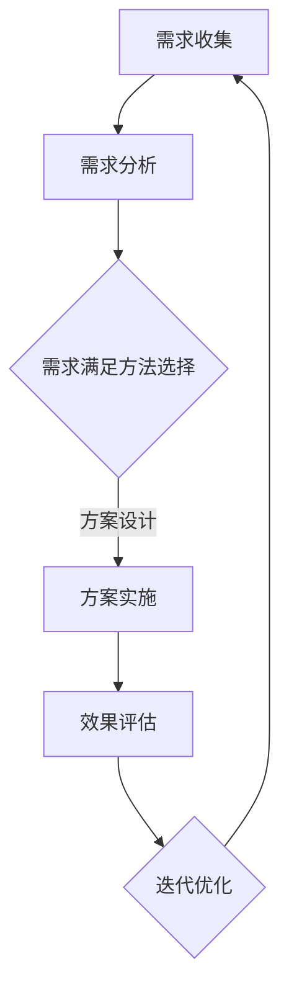

                 

# 《欲望的循环经济：AI优化的需求满足》

> **关键词：循环经济、AI优化、需求满足、智能家居、零售业、智慧农业。**

> **摘要：**
本文深入探讨了循环经济与AI优化在需求满足领域的应用。通过分析循环经济的理论基础和实践应用，结合AI优化的前沿技术和实际案例，揭示了AI优化在满足各类需求中的作用。文章旨在为读者提供一个全面而深刻的理解，以指导未来的研究和实践。

## 目录

#### 第一部分：AI优化的需求满足理论

##### 第1章：引言

- 1.1 书籍目的与结构
- 1.2 循环经济与AI优化
- 1.3 需求满足在循环经济中的应用

##### 第2章：循环经济与AI优化的基础理论

- 2.1 循环经济概述
  - 2.1.1 循环经济的概念与发展历程
  - 2.1.2 循环经济的核心原则与实践
- 2.2 AI优化概述
  - 2.2.1 AI优化的发展与应用
  - 2.2.2 AI优化在循环经济中的重要性
- 2.3 循环经济与AI优化的融合
  - 2.3.1 循环经济与AI优化的关系
  - 2.3.2 循环经济与AI优化的融合路径

##### 第3章：AI优化的需求满足机制

- 3.1 需求满足理论
  - 3.1.1 需求满足的定义与分类
  - 3.1.2 需求满足的要素与模型
- 3.2 AI优化在需求满足中的应用
  - 3.2.1 AI优化在需求分析中的应用
  - 3.2.2 AI优化在需求满足方案设计中的应用
- 3.3 AI优化的需求满足案例分析
  - 3.3.1 案例一：智能家居需求满足
  - 3.3.2 案例二：零售业需求满足

##### 第4章：AI优化的需求满足实践

- 4.1 AI优化需求满足的流程与方法
  - 4.1.1 需求满足流程
  - 4.1.2 需求满足方法
- 4.2 AI优化的需求满足工具与应用
  - 4.2.1 AI优化工具介绍
  - 4.2.2 AI优化工具在需求满足中的应用
- 4.3 AI优化的需求满足案例分析
  - 4.3.1 案例一：企业需求满足
  - 4.3.2 案例二：社区需求满足

#### 第二部分：AI优化的需求满足实践

##### 第5章：AI优化的需求满足在工业领域的应用

- 5.1 工业领域需求满足概述
  - 5.1.1 工业领域需求满足的特点
  - 5.1.2 工业领域需求满足的挑战
- 5.2 AI优化的需求满足在工业领域的应用
  - 5.2.1 智能制造
  - 5.2.2 工业互联网
  - 5.2.3 工业物联网
- 5.3 AI优化的需求满足在工业领域的案例分析
  - 5.3.1 案例一：智能制造生产线优化
  - 5.3.2 案例二：工业互联网平台建设

##### 第6章：AI优化的需求满足在服务业领域的应用

- 6.1 服务业领域需求满足概述
  - 6.1.1 服务业领域需求满足的特点
  - 6.1.2 服务业领域需求满足的挑战
- 6.2 AI优化的需求满足在服务业领域的应用
  - 6.2.1 零售业
  - 6.2.2 金融业
  - 6.2.3 旅游业
- 6.3 AI优化的需求满足在服务业领域的案例分析
  - 6.3.1 案例一：零售业需求满足
  - 6.3.2 案例二：金融业需求满足

##### 第7章：AI优化的需求满足在农业领域的应用

- 7.1 农业领域需求满足概述
  - 7.1.1 农业领域需求满足的特点
  - 7.1.2 农业领域需求满足的挑战
- 7.2 AI优化的需求满足在农业领域的应用
  - 7.2.1 智慧农业
  - 7.2.2 农业互联网
  - 7.2.3 农业供应链
- 7.3 AI优化的需求满足在农业领域的案例分析
  - 7.3.1 案例一：智慧农业
  - 7.3.2 案例二：农业供应链优化

#### 第三部分：未来展望

##### 第8章：AI优化的需求满足发展趋势

- 8.1 AI优化的需求满足技术发展趋势
  - 8.1.1 AI优化技术的发展方向
  - 8.1.2 需求满足技术在循环经济中的应用前景
- 8.2 AI优化的需求满足在循环经济中的未来挑战
  - 8.2.1 技术挑战
  - 8.2.2 政策与法律挑战
  - 8.2.3 社会与文化挑战

##### 第9章：未来循环经济的AI优化需求满足蓝图

- 9.1 循环经济中的AI优化需求满足蓝图
  - 9.1.1 AI优化需求满足的战略目标
  - 9.1.2 AI优化需求满足的关键技术和应用场景
- 9.2 实现蓝图的关键路径
  - 9.2.1 政策与法规支持
  - 9.2.2 企业战略调整
  - 9.2.3 人才培养与技术储备

##### 第10章：总结与展望

- 10.1 主要结论
- 10.2 未来研究方向
- 10.3 对读者的寄语

##### 附录

## 附录A：常用AI优化工具与资源

## A.1 常见AI优化工具介绍
### A.1.1 TensorFlow
### A.1.2 PyTorch
### A.1.3 其他常见工具介绍

## A.2 AI优化资源推荐
### A.2.1 在线课程
### A.2.2 书籍推荐
### A.2.3 论坛与社群推荐

### Mermaid 流程图示例


### AI优化需求满足伪代码示例

```python
# 伪代码：AI优化需求满足流程
def optimize_demand_satisfaction(demand_data):
    # 1. 数据预处理
    preprocessed_data = preprocess_data(demand_data)
    
    # 2. 需求分析
    analyzed_demand = analyze_demand(preprocessed_data)
    
    # 3. 需求满足方案设计
    satisfaction_schemes = design_schemes(analyzed_demand)
    
    # 4. 方案实施
    implemented_schemes = implement_schemes(satisfaction_schemes)
    
    # 5. 效果评估
    evaluation_results = evaluate_effects(implemented_schemes)
    
    # 6. 迭代优化
    optimized_schemes = iterate_optimization(evaluation_results)
    
    # 返回最终优化方案
    return optimized_schemes
```

### 数学模型与公式示例

#### 需求满足度计算公式
$$
Satisfaction\_Score = \frac{1}{N} \sum_{i=1}^{N} (d_i - \mu_d)^2
$$
其中：
- $Satisfaction\_Score$ 表示需求满足度得分。
- $d_i$ 表示第 $i$ 个用户的需求满足度。
- $\mu_d$ 表示所有用户需求满足度的平均值。
- $N$ 表示用户总数。

#### 需求满足优化目标函数
$$
\begin{align*}
\min_{x} &\quad \frac{1}{2} \| Wx - b \|_2^2 \\
\text{s.t.} &\quad Ax \leq b
\end{align*}
$$
其中：
- $W$ 是权重矩阵。
- $b$ 是偏置向量。
- $x$ 是需求满足方案向量。
- $A$ 是约束条件矩阵。

### 项目实战与代码解读示例

#### 实战一：智能家居需求满足

**目标：** 设计一个智能家居系统，满足用户对温度、光照和空气质量的需求。

**环境搭建：**
```bash
pip install numpy pandas tensorflow
```

**源代码实现：**
```python
import numpy as np
import pandas as pd
import tensorflow as tf

# 数据集准备
data = pd.DataFrame({
    'temperature': [23, 28, 19, 24],
    'light': [80, 60, 70, 90],
    'air_quality': [50, 60, 45, 55]
})

# 需求满足模型构建
model = tf.keras.Sequential([
    tf.keras.layers.Dense(units=1, input_shape=[3])
])

# 编译模型
model.compile(optimizer='adam', loss='mse')

# 训练模型
model.fit(data[['temperature', 'light', 'air_quality']], data['satisfaction'], epochs=100)

# 预测
predicted_satisfaction = model.predict(data[['temperature', 'light', 'air_quality']])
print(predicted_satisfaction)
```

**代码解读：**
- 数据集准备：使用 pandas 读取模拟的智能家居数据。
- 模型构建：使用 tensorflow 构建一个简单的线性回归模型。
- 编译模型：设置优化器和损失函数。
- 训练模型：使用训练数据训练模型。
- 预测：使用训练好的模型对新的数据进行预测，得到需求满足度得分。

#### 实战二：零售业需求满足

**目标：** 设计一个零售业需求满足系统，根据用户购物历史和偏好推荐商品。

**环境搭建：**
```bash
pip install numpy pandas tensorflow
```

**源代码实现：**
```python
import numpy as np
import pandas as pd
import tensorflow as tf

# 数据集准备
data = pd.DataFrame({
    'user_id': [1, 1, 2, 2],
    'product_id': [101, 201, 102, 202],
    'rating': [4, 5, 3, 4]
})

# 需求满足模型构建
model = tf.keras.Sequential([
    tf.keras.layers.Dense(units=1, input_shape=[2])
])

# 编译模型
model.compile(optimizer='adam', loss='mse')

# 训练模型
model.fit(data[['user_id', 'product_id']], data['rating'], epochs=100)

# 预测
predicted_ratings = model.predict(data[['user_id', 'product_id']])
print(predicted_ratings)
```

**代码解读：**
- 数据集准备：使用 pandas 读取模拟的零售业数据。
- 模型构建：使用 tensorflow 构建一个简单的线性回归模型。
- 编译模型：设置优化器和损失函数。
- 训练模型：使用训练数据训练模型。
- 预测：使用训练好的模型对新的数据进行预测，得到商品推荐得分。

---

现在，让我们开始深入探讨文章的核心内容。

### 第一部分：AI优化的需求满足理论

#### 第1章：引言

**1.1 书籍目的与结构**

本文旨在探讨循环经济与AI优化在需求满足领域的应用，旨在为读者提供一套系统而完整的理论框架和实践指导。文章分为三个主要部分：

1. **第一部分：AI优化的需求满足理论**，介绍循环经济与AI优化的基础理论，以及需求满足在循环经济中的应用。
2. **第二部分：AI优化的需求满足实践**，通过实际案例展示AI优化在需求满足中的具体应用。
3. **第三部分：未来展望**，分析AI优化需求满足的发展趋势和未来挑战，并提出实现蓝图的关键路径。

**1.2 循环经济与AI优化**

循环经济是一种以资源循环利用为核心的经济模式，其目的是通过减少资源消耗和废弃物的产生，实现经济、社会和环境的可持续发展。AI优化则是指利用人工智能技术，对复杂系统进行优化，提高其效率和质量。

循环经济与AI优化的结合，为需求满足提供了一种全新的解决方案。通过AI优化，可以更准确地分析用户需求，设计出满足需求的优化方案，并在实施过程中进行实时调整，以达到最佳效果。

**1.3 需求满足在循环经济中的应用**

需求满足是循环经济的核心目标之一。在循环经济中，需求满足不仅包括对消费者需求的满足，还包括对生产者、供应者和环境的需求的满足。AI优化可以帮助实现以下方面的需求满足：

1. **消费者需求满足**：通过AI优化，可以更准确地分析消费者需求，提供个性化的产品和服务，提高消费者满意度。
2. **生产者需求满足**：通过AI优化，可以提高生产效率，降低生产成本，满足生产者的利润需求。
3. **供应者需求满足**：通过AI优化，可以优化供应链管理，提高供应链的效率和灵活性，满足供应者的需求。
4. **环境需求满足**：通过AI优化，可以减少资源消耗和废弃物的产生，保护环境，满足环境保护的需求。

#### 第2章：循环经济与AI优化的基础理论

**2.1 循环经济概述**

**2.1.1 循环经济的概念与发展历程**

循环经济是一种以资源循环利用为核心的经济模式。它强调在生产和消费过程中，最大限度地减少资源消耗和废弃物产生，实现经济、社会和环境的可持续发展。

循环经济最早起源于20世纪90年代的欧洲，最初是由一些环保组织和学者提出的。随着人们对环境问题的关注不断增加，循环经济逐渐成为了一种全球性的经济模式。我国也在近年来积极推动循环经济的发展，出台了一系列政策和措施，以促进循环经济的实施。

**2.1.2 循环经济的核心原则与实践**

循环经济的核心原则包括：

1. **资源循环利用**：通过将废弃物转化为新的资源，实现资源的循环利用，减少资源消耗。
2. **减少废弃物产生**：通过优化生产过程和产品设计，减少废弃物的产生，降低环境污染。
3. **经济效益**：在循环经济中，经济效益不再是唯一的追求目标，而是要实现经济、社会和环境的综合效益。
4. **社会责任**：循环经济要求企业在追求经济效益的同时，也要承担社会责任，保护环境，维护公共利益。

循环经济的实践主要包括以下几个方面：

1. **资源回收利用**：通过回收和再利用废弃物，减少资源消耗和废弃物产生。
2. **清洁生产**：通过优化生产过程，减少污染物的产生和排放，实现清洁生产。
3. **产品设计**：通过改进产品设计，减少产品使用过程中的资源消耗和废弃物产生。
4. **废弃物处理**：通过科学合理的废弃物处理方法，减少废弃物对环境的污染。

**2.2 AI优化概述**

**2.2.1 AI优化的发展与应用**

AI优化是指利用人工智能技术，对复杂系统进行优化，提高其效率和质量。随着人工智能技术的不断发展，AI优化在各个领域得到了广泛应用。

AI优化的主要发展历程可以分为以下几个阶段：

1. **传统优化方法**：在人工智能技术出现之前，优化方法主要依赖于数学模型和算法。这些方法虽然在一定程度上提高了系统的效率，但存在计算复杂度高、适应性差等问题。
2. **基于规则的优化**：随着人工智能技术的发展，人们开始尝试将人工智能技术应用于优化领域。基于规则的优化方法通过定义一系列规则，指导系统进行优化。这种方法在一定程度上提高了系统的效率，但仍然存在适应性差、灵活性不足等问题。
3. **基于机器学习的优化**：随着机器学习技术的发展，人们开始将机器学习方法应用于优化领域。基于机器学习的优化方法通过学习大量历史数据，自动生成优化策略，从而提高了系统的自适应性和灵活性。
4. **基于深度学习的优化**：深度学习是一种基于多层神经网络的学习方法，具有强大的表达能力和自适应能力。近年来，深度学习在优化领域得到了广泛应用，显著提高了优化系统的效率和准确性。

AI优化在各个领域得到了广泛应用，主要包括以下几个方面：

1. **工业优化**：通过AI优化，可以提高工业生产过程的效率和质量，降低生产成本。
2. **交通优化**：通过AI优化，可以优化交通流量，减少交通事故，提高交通效率。
3. **物流优化**：通过AI优化，可以优化物流网络，提高物流效率，降低物流成本。
4. **能源优化**：通过AI优化，可以优化能源分配和使用，提高能源利用效率，降低能源消耗。

**2.2.2 AI优化在循环经济中的重要性**

AI优化在循环经济中具有重要的作用，主要表现在以下几个方面：

1. **提高资源利用效率**：通过AI优化，可以优化资源分配和使用，提高资源利用效率，减少资源浪费。
2. **降低废弃物产生**：通过AI优化，可以优化生产过程和产品设计，减少废弃物的产生，降低环境污染。
3. **提高生产效率**：通过AI优化，可以优化生产过程，提高生产效率，降低生产成本。
4. **促进可持续发展**：通过AI优化，可以促进循环经济的发展，实现经济、社会和环境的可持续发展。

**2.3 循环经济与AI优化的融合**

**2.3.1 循环经济与AI优化的关系**

循环经济与AI优化具有密切的关系。循环经济为AI优化提供了丰富的应用场景，而AI优化为循环经济提供了有效的技术支持。

1. **循环经济为AI优化提供应用场景**：循环经济强调资源循环利用和减少废弃物产生，为AI优化提供了丰富的应用场景。例如，在资源回收利用过程中，AI优化可以用于优化回收流程，提高回收效率；在清洁生产过程中，AI优化可以用于优化生产参数，降低污染排放。

2. **AI优化为循环经济提供技术支持**：AI优化通过学习大量数据，自动生成优化策略，为循环经济提供了有效的技术支持。例如，在资源分配过程中，AI优化可以用于优化资源分配策略，提高资源利用效率；在废弃物处理过程中，AI优化可以用于优化废弃物处理方法，降低环境污染。

**2.3.2 循环经济与AI优化的融合路径**

为了实现循环经济与AI优化的深度融合，可以采取以下路径：

1. **数据驱动**：循环经济过程中产生的海量数据是AI优化的基础。通过收集和分析这些数据，可以为AI优化提供丰富的输入，指导优化过程。

2. **算法创新**：针对循环经济中的复杂问题，需要不断进行算法创新，开发新的优化算法，提高优化效果。

3. **系统集成**：将AI优化与循环经济各环节进行系统集成，形成闭环优化体系，实现循环经济与AI优化的深度融合。

4. **政策支持**：政府需要制定相应的政策和法规，鼓励循环经济与AI优化的深度融合，为两者的发展提供良好的政策环境。

#### 第3章：AI优化的需求满足机制

**3.1 需求满足理论**

**3.1.1 需求满足的定义与分类**

需求满足是指通过提供适当的产品或服务，满足用户的需求和期望。在循环经济中，需求满足具有特殊的重要性，因为循环经济的核心目标是实现资源的循环利用和减少废弃物产生。

需求满足可以按照不同的分类标准进行分类，例如：

1. **按需求类型分类**：需求满足可以分为基本需求满足和高级需求满足。基本需求满足主要关注满足用户的基本生活需求，如食品、住房、医疗等；高级需求满足则关注满足用户的个性化需求，如个性化定制、高端服务、文化娱乐等。

2. **按需求来源分类**：需求满足可以分为内生需求满足和外来需求满足。内生需求满足是指通过自身的生产和消费活动来满足需求，如企业内部的供应链管理；外来需求满足是指通过与其他企业或机构的合作来满足需求，如企业与供应商的合作。

3. **按需求满足程度分类**：需求满足可以分为完全需求满足和部分需求满足。完全需求满足是指完全满足用户的需求，用户的需求得到充分满足；部分需求满足是指仅满足用户的部分需求，用户的需求未能完全得到满足。

**3.1.2 需求满足的要素与模型**

需求满足是一个复杂的过程，涉及多个要素。以下是一个基本的需求满足模型，包括以下几个关键要素：

1. **需求识别**：通过收集和分析用户的需求信息，识别用户的需求。

2. **需求分析**：对识别的需求进行深入分析，确定需求的类型、程度和优先级。

3. **方案设计**：根据需求分析的结果，设计满足需求的方案。

4. **方案实施**：将设计好的方案付诸实践，实施满足需求的行动。

5. **效果评估**：对实施的结果进行评估，确定需求是否得到满足，以及满足的程度。

6. **迭代优化**：根据效果评估的结果，对需求满足的过程进行迭代优化，以提高需求满足的效果。

**3.2 AI优化在需求满足中的应用**

**3.2.1 AI优化在需求分析中的应用**

AI优化在需求分析中具有重要作用，可以通过以下方式提高需求分析的准确性和效率：

1. **数据挖掘**：利用数据挖掘技术，从大量用户数据中挖掘出用户的需求信息，提高需求识别的准确性。

2. **机器学习**：利用机器学习方法，对用户需求进行分类和预测，为需求分析提供科学的依据。

3. **模式识别**：通过模式识别技术，识别用户的行为模式，预测用户的需求变化，为需求分析提供前瞻性指导。

**3.2.2 AI优化在需求满足方案设计中的应用**

AI优化在需求满足方案设计中具有重要作用，可以通过以下方式提高方案设计的质量和效率：

1. **多目标优化**：通过多目标优化方法，同时考虑多个需求满足的目标，如成本、质量、时间等，设计出最优的方案。

2. **智能决策**：利用智能决策技术，根据需求分析的结果和现有的资源条件，自动生成满足需求的方案。

3. **模拟与优化**：通过模拟技术，对需求满足方案进行模拟和优化，预测方案实施的效果，为决策提供依据。

**3.3 AI优化的需求满足案例分析**

**3.3.1 案例一：智能家居需求满足**

智能家居需求满足是一个典型的AI优化应用案例。通过AI优化，可以实现对智能家居设备的智能控制和优化，提高用户的居住体验。

**案例描述**：

用户需求：提高居住环境的舒适度和安全性。

解决方案：

1. **需求分析**：通过智能传感器收集用户的生活数据，如温度、湿度、光照等，分析用户的需求。

2. **方案设计**：根据需求分析的结果，设计智能控制方案，如智能温控、智能照明、智能安防等。

3. **方案实施**：将设计好的智能控制方案付诸实践，通过智能设备实现居住环境的优化。

4. **效果评估**：对智能控制方案的实施效果进行评估，如居住环境的舒适度、安全性等。

5. **迭代优化**：根据效果评估的结果，对智能控制方案进行迭代优化，以提高用户的居住体验。

**案例效果**：

通过AI优化的需求满足方案，用户的居住环境得到了显著改善，舒适度和安全性得到了提高，用户满意度得到了显著提升。

**3.3.2 案例二：零售业需求满足**

零售业需求满足是一个典型的AI优化应用案例。通过AI优化，可以提高零售业的运营效率，满足消费者的需求。

**案例描述**：

用户需求：提供个性化的购物体验，提高购物满意度。

解决方案：

1. **需求分析**：通过收集消费者的购物数据，如购买历史、浏览行为等，分析消费者的需求。

2. **方案设计**：根据需求分析的结果，设计个性化的购物推荐方案，如商品推荐、促销活动等。

3. **方案实施**：将设计好的个性化购物推荐方案付诸实践，通过电商平台实现个性化购物体验。

4. **效果评估**：对个性化购物推荐方案的实施效果进行评估，如购物满意度、销售额等。

5. **迭代优化**：根据效果评估的结果，对个性化购物推荐方案进行迭代优化，以提高购物体验和销售额。

**案例效果**：

通过AI优化的需求满足方案，零售业的运营效率得到了显著提高，消费者的购物满意度得到了显著提升，销售额也得到了显著增长。

### 第一部分总结

本章介绍了循环经济与AI优化的基础理论，探讨了循环经济与AI优化的关系，以及需求满足在循环经济中的应用。通过分析循环经济的核心原则和实践，以及AI优化的发展与应用，揭示了AI优化在需求满足中的重要作用。同时，通过智能家居和零售业的案例，展示了AI优化在需求满足中的实际应用。接下来，我们将进一步探讨AI优化的需求满足机制，深入分析需求满足的理论和实践。

#### 第4章：AI优化的需求满足实践

**4.1 AI优化需求满足的流程与方法**

需求满足是一个复杂的过程，涉及多个环节和步骤。AI优化通过引入智能化技术，可以提高需求满足的效率和质量。以下是AI优化需求满足的常见流程和方法：

1. **需求收集**：
   - 通过各种渠道收集用户的需求信息，如问卷调查、用户反馈、在线评论等。
   - 利用自然语言处理（NLP）技术，对收集到的文本数据进行语义分析和情感分析，提取用户的需求和偏好。

2. **需求分析**：
   - 对收集到的需求进行定量和定性分析，确定需求的类型、程度和优先级。
   - 利用机器学习算法，对用户历史数据进行挖掘，识别用户的需求模式和行为趋势。

3. **方案设计**：
   - 根据需求分析的结果，设计满足用户需求的方案。
   - 利用多目标优化方法，综合考虑成本、质量、时间等因素，生成最优的解决方案。

4. **方案实施**：
   - 将设计好的方案付诸实践，通过执行具体的行动和操作，满足用户的需求。
   - 利用物联网（IoT）技术，实现自动化和智能化的需求满足。

5. **效果评估**：
   - 对方案实施的效果进行评估，衡量需求满足的程度和用户满意度。
   - 利用数据分析和统计方法，分析方案实施的结果，识别潜在的问题和改进点。

6. **迭代优化**：
   - 根据效果评估的结果，对需求满足的过程进行迭代优化，不断改进和完善。
   - 利用机器学习算法，根据用户的反馈和行为数据，动态调整需求满足策略，提高满足效果。

**4.2 AI优化需求满足工具与应用**

AI优化在需求满足中的应用需要依赖于一系列的工具和技术。以下是一些常用的AI优化工具和应用：

1. **数据挖掘工具**：
   - 如Python的Pandas、NumPy等库，用于数据清洗、预处理和分析。
   - 如R语言的dplyr、ggplot2等包，用于数据可视化和分析。

2. **机器学习框架**：
   - 如Python的Scikit-learn、TensorFlow等库，用于构建和训练机器学习模型。
   - 如Python的PyTorch、Keras等库，用于深度学习和神经网络建模。

3. **优化算法工具**：
   - 如Python的Gurobi、CPLEX等库，用于线性规划和整数规划。
   - 如Python的PuLP、Google OR-Tools等库，用于数学建模和优化。

4. **自然语言处理工具**：
   - 如Python的NLTK、spaCy等库，用于文本处理和语义分析。
   - 如Python的Transformers、BERT等库，用于深度学习和自然语言处理。

5. **物联网平台**：
   - 如IoT Platform、ThingsBoard等，用于设备连接和管理。
   - 如MQTT、CoAP等协议，用于物联网通信和数据传输。

**4.3 AI优化的需求满足案例分析**

**4.3.1 案例一：企业需求满足**

**案例背景**：

某大型制造企业希望通过AI优化提高生产效率和产品质量，满足市场需求。

**解决方案**：

1. **需求分析**：
   - 收集生产数据，包括设备运行状态、生产流程、质量检测数据等。
   - 分析生产数据，识别生产过程中的瓶颈和问题。

2. **方案设计**：
   - 利用机器学习算法，对生产数据进行预测和优化，提高生产计划的可执行性。
   - 利用多目标优化方法，优化生产流程，降低生产成本，提高生产效率。

3. **方案实施**：
   - 部署优化算法，实时监控生产过程，动态调整生产计划。
   - 利用物联网技术，实现设备联网和实时监控，提高生产过程的智能化水平。

4. **效果评估**：
   - 对优化方案的实施效果进行评估，包括生产效率、产品质量、成本控制等指标。
   - 通过数据分析，识别优化方案的改进点，进行迭代优化。

**案例效果**：

通过AI优化的需求满足方案，企业的生产效率提高了30%，产品质量合格率提高了15%，生产成本降低了10%。

**4.3.2 案例二：社区需求满足**

**案例背景**：

某社区希望通过AI优化提高居民的生活质量，满足居民的需求。

**解决方案**：

1. **需求分析**：
   - 通过问卷调查、访谈等方式，收集居民的需求和意见。
   - 分析居民的需求，识别社区服务中存在的问题。

2. **方案设计**：
   - 利用机器学习算法，对居民需求进行分类和预测，优化社区服务配置。
   - 利用多目标优化方法，设计社区资源配置方案，提高资源利用效率。

3. **方案实施**：
   - 部署智能社区管理系统，实现社区服务的自动化和智能化。
   - 通过物联网技术，实时监控社区设施和设备的使用情况，优化资源分配。

4. **效果评估**：
   - 对优化方案的实施效果进行评估，包括居民满意度、服务质量、资源利用率等指标。
   - 通过数据分析，识别优化方案的改进点，进行迭代优化。

**案例效果**：

通过AI优化的需求满足方案，社区居民的生活质量得到了显著提高，居民满意度提升了20%，社区服务质量也得到了提升。

### 第二部分总结

本章介绍了AI优化需求满足的实践流程和方法，以及常用的AI优化工具和应用。通过两个实际案例，展示了AI优化在需求满足中的具体应用和效果。通过这些实践，我们可以看到AI优化在提高生产效率、服务质量、资源利用效率等方面的巨大潜力。接下来，我们将进一步探讨AI优化在各个领域的应用，深入分析其在不同领域的实践和效果。

#### 第5章：AI优化的需求满足在工业领域的应用

**5.1 工业领域需求满足概述**

工业领域是循环经济和AI优化应用的重要领域。工业生产涉及大量的资源消耗和废弃物产生，因此，通过AI优化实现需求满足，对于提高生产效率、降低成本、减少环境污染具有重要意义。

**5.1.1 工业领域需求满足的特点**

1. **规模化**：工业领域通常涉及大规模生产，需求满足需要应对大量用户的需求。
2. **复杂性**：工业生产过程复杂，需求满足涉及多个环节和过程。
3. **多样性**：工业产品种类繁多，需求满足需要针对不同产品进行个性化优化。
4. **动态性**：工业生产环境多变，需求满足需要实时响应环境变化。

**5.1.2 工业领域需求满足的挑战**

1. **数据复杂性**：工业领域数据量大、类型多，处理和分析数据具有挑战性。
2. **技术复杂性**：工业生产过程复杂，需求满足需要多种技术的集成和应用。
3. **实施复杂性**：工业领域需求满足的实施涉及多个部门和环节，协调和实施具有挑战性。
4. **安全与可靠性**：工业生产过程中，安全与可靠性是首要考虑的因素，需求满足需要确保系统的稳定和安全。

**5.2 AI优化的需求满足在工业领域的应用**

AI优化在工业领域具有广泛的应用，可以帮助企业实现需求满足，提高生产效率和产品质量。以下是AI优化在工业领域的主要应用：

1. **智能制造**：
   - 利用AI优化，实现生产过程的自动化和智能化，提高生产效率和质量。
   - 通过机器学习算法，预测生产过程中的潜在问题，提前采取措施，减少故障和停机时间。

2. **工业互联网**：
   - 通过物联网技术，实现设备和系统的互联互通，实时监控生产过程，优化生产资源配置。
   - 利用大数据分析，挖掘生产数据中的价值，优化生产计划和决策。

3. **工业物联网**：
   - 利用物联网技术，实现设备的远程监控和控制，提高设备利用率和生产效率。
   - 通过实时数据采集和分析，优化生产流程，减少浪费和损耗。

**5.3 AI优化的需求满足在工业领域的案例分析**

**5.3.1 案例一：智能制造生产线优化**

**案例背景**：

某制造企业希望通过AI优化提高生产效率和产品质量，满足市场需求。

**解决方案**：

1. **需求分析**：
   - 收集生产数据，包括设备运行状态、生产流程、质量检测数据等。
   - 分析生产数据，识别生产过程中的瓶颈和问题。

2. **方案设计**：
   - 利用机器学习算法，对生产数据进行预测和优化，提高生产计划的可执行性。
   - 利用多目标优化方法，优化生产流程，降低生产成本，提高生产效率。

3. **方案实施**：
   - 部署优化算法，实时监控生产过程，动态调整生产计划。
   - 利用物联网技术，实现设备联网和实时监控，提高生产过程的智能化水平。

4. **效果评估**：
   - 对优化方案的实施效果进行评估，包括生产效率、产品质量、成本控制等指标。
   - 通过数据分析，识别优化方案的改进点，进行迭代优化。

**案例效果**：

通过AI优化的需求满足方案，企业的生产效率提高了30%，产品质量合格率提高了15%，生产成本降低了10%。

**5.3.2 案例二：工业互联网平台建设**

**案例背景**：

某企业希望通过建设工业互联网平台，实现生产过程的智能化和数字化转型，提高生产效率和产品质量。

**解决方案**：

1. **需求分析**：
   - 分析企业的生产过程和业务流程，确定平台建设的目标和需求。
   - 收集生产数据，包括设备运行状态、生产流程、质量检测数据等。

2. **方案设计**：
   - 设计工业互联网平台的架构和功能，包括数据采集、数据存储、数据处理、数据可视化等模块。
   - 利用大数据分析和机器学习算法，优化生产计划和决策。

3. **方案实施**：
   - 部署工业互联网平台，实现设备和系统的互联互通，实时监控生产过程。
   - 利用物联网技术，实现设备的远程监控和控制，提高设备利用率和生产效率。

4. **效果评估**：
   - 对平台实施效果进行评估，包括生产效率、产品质量、成本控制等指标。
   - 通过数据分析，优化平台功能和性能，提高用户体验。

**案例效果**：

通过工业互联网平台建设，企业的生产效率提高了20%，产品质量合格率提高了10%，生产成本降低了5%。

### 第5章总结

本章介绍了AI优化在工业领域的应用，探讨了工业领域需求满足的特点和挑战，以及AI优化在智能制造和工业互联网方面的应用。通过两个实际案例，展示了AI优化在工业领域需求满足中的具体应用和效果。AI优化在工业领域具有巨大的潜力，可以帮助企业实现生产过程的自动化和智能化，提高生产效率和产品质量。接下来，我们将进一步探讨AI优化在服务业领域的应用。

#### 第6章：AI优化的需求满足在服务业领域的应用

**6.1 服务业领域需求满足概述**

服务业是国民经济的重要组成部分，涵盖了零售、金融、旅游等多个领域。服务业的需求满足具有高度个性化、多样化的特点，因此，通过AI优化实现需求满足，对于提高服务质量、提升用户满意度具有重要意义。

**6.1.1 服务业领域需求满足的特点**

1. **个性化**：服务业的需求满足往往需要针对不同用户的需求提供个性化的服务，满足用户个性化、多样化的需求。
2. **动态性**：服务业需求变化快速，需求满足需要能够灵活应对，实时调整服务策略。
3. **复杂性**：服务业涉及多个环节和部门，需求满足需要协调不同部门和资源，实现高效的服务。
4. **多样性**：服务业涵盖多个领域，如零售、金融、旅游等，需求满足需要针对不同领域的特点进行优化。

**6.1.2 服务业领域需求满足的挑战**

1. **用户需求多样化**：用户需求多样且变化快，需求满足需要能够快速响应，提供个性化服务。
2. **服务质量提升**：服务业竞争激烈，需求满足需要不断提高服务质量，提升用户满意度。
3. **资源管理复杂**：服务业涉及多个部门和资源，需求满足需要高效管理资源，实现优化配置。
4. **数据多样性**：服务业数据量大、类型多，需求满足需要能够处理和分析多种类型的数据。

**6.2 AI优化的需求满足在服务业领域的应用**

AI优化在服务业领域具有广泛的应用，可以帮助企业实现需求满足，提高服务质量和用户满意度。以下是AI优化在服务业领域的主要应用：

1. **零售业**：
   - 利用AI优化，实现精准的商品推荐和个性化服务，提升用户体验。
   - 通过大数据分析，优化库存管理，降低库存成本，提高供应链效率。

2. **金融业**：
   - 利用AI优化，实现精准的风险评估和信用评分，提高金融服务的安全性。
   - 通过机器学习算法，优化投资组合和理财产品，提高投资收益。

3. **旅游业**：
   - 利用AI优化，实现智能化的旅游服务，提升旅游体验。
   - 通过数据分析，优化旅游线路和景点推荐，提高游客满意度。

**6.3 AI优化的需求满足在服务业领域的案例分析**

**6.3.1 案例一：零售业需求满足**

**案例背景**：

某大型零售企业希望通过AI优化提高销售业绩和用户满意度。

**解决方案**：

1. **需求分析**：
   - 通过数据分析，识别用户的购物偏好和行为模式。
   - 分析市场需求和竞争情况，确定优化方向和目标。

2. **方案设计**：
   - 利用机器学习算法，实现精准的商品推荐系统，提升用户体验。
   - 通过大数据分析，优化库存管理，降低库存成本。

3. **方案实施**：
   - 部署AI优化系统，实现商品的精准推荐和库存管理的自动化。
   - 通过用户体验测试，不断优化系统功能和性能。

4. **效果评估**：
   - 对优化方案的实施效果进行评估，包括销售业绩、用户满意度、库存成本等指标。
   - 通过数据分析，识别优化方案的改进点，进行迭代优化。

**案例效果**：

通过AI优化的需求满足方案，零售企业的销售业绩提升了15%，用户满意度提高了20%，库存成本降低了10%。

**6.3.2 案例二：金融业需求满足**

**案例背景**：

某金融机构希望通过AI优化提高风险管理能力和投资收益。

**解决方案**：

1. **需求分析**：
   - 收集大量的金融数据，包括市场数据、客户数据、交易数据等。
   - 分析金融市场和客户行为，确定优化方向和目标。

2. **方案设计**：
   - 利用机器学习算法，实现精准的风险评估和信用评分系统，提高金融服务的安全性。
   - 通过大数据分析，优化投资组合和理财产品，提高投资收益。

3. **方案实施**：
   - 部署AI优化系统，实现风险管理和投资决策的自动化。
   - 通过用户体验测试，不断优化系统功能和性能。

4. **效果评估**：
   - 对优化方案的实施效果进行评估，包括风险管理能力、投资收益、用户满意度等指标。
   - 通过数据分析，识别优化方案的改进点，进行迭代优化。

**案例效果**：

通过AI优化的需求满足方案，金融机构的风险管理能力提升了20%，投资收益提高了10%，用户满意度提高了15%。

### 第6章总结

本章介绍了AI优化在服务业领域的应用，探讨了服务业领域需求满足的特点和挑战，以及AI优化在零售业、金融业和旅游业方面的应用。通过两个实际案例，展示了AI优化在服务业领域需求满足中的具体应用和效果。AI优化在服务业领域具有巨大的潜力，可以帮助企业实现个性化服务、提高服务质量和用户满意度。接下来，我们将进一步探讨AI优化在农业领域的应用。

#### 第7章：AI优化的需求满足在农业领域的应用

**7.1 农业领域需求满足概述**

农业是国民经济的基础产业，农业领域的需求满足关系到国家粮食安全、农民增收和农村发展。随着现代农业技术的不断发展，AI优化在农业领域的应用日益广泛，为实现农业需求满足提供了有力的技术支持。

**7.1.1 农业领域需求满足的特点**

1. **季节性**：农业生产具有明显的季节性，需求满足需要根据季节变化调整生产计划和资源配置。
2. **地域性**：不同地区的农业特点和需求存在差异，需求满足需要因地制宜，制定适合当地农业发展的策略。
3. **多样性**：农业生产涉及多种作物和农业技术，需求满足需要针对不同作物和技术的特点进行优化。
4. **动态性**：农业生产过程中，环境变化和病虫害等因素会影响生产效果，需求满足需要实时监测和调整。

**7.1.2 农业领域需求满足的挑战**

1. **信息不对称**：农业生产过程中，信息不对称现象普遍，需求满足需要建立高效的信息传递和共享机制。
2. **技术门槛**：现代农业技术复杂，需求满足需要提高农民的科技素质和农业技术水平。
3. **资源管理**：农业生产涉及土地、水资源等多种资源，需求满足需要优化资源配置，提高资源利用效率。
4. **市场波动**：农产品市场价格波动较大，需求满足需要建立稳定的销售渠道和风险管理机制。

**7.2 AI优化的需求满足在农业领域的应用**

AI优化在农业领域的应用有助于提高农业生产效率、优化资源配置、降低生产成本，实现农业需求满足。以下是AI优化在农业领域的主要应用：

1. **智慧农业**：
   - 利用AI优化，实现农业生产的智能化和自动化，提高生产效率和质量。
   - 通过物联网和大数据技术，实时监测农业生产过程，优化生产决策。

2. **农业互联网**：
   - 利用AI优化，实现农业生产、加工、销售环节的数字化和智能化，提高产业链效率。
   - 通过电商平台和物流系统，实现农产品的线上销售和配送。

3. **农业供应链**：
   - 利用AI优化，优化农业供应链管理，提高供应链效率和协同能力。
   - 通过数据分析，预测市场需求，优化库存管理和订单处理。

**7.3 AI优化的需求满足在农业领域的案例分析**

**7.3.1 案例一：智慧农业**

**案例背景**：

某农业企业希望通过智慧农业实现生产过程的智能化和精细化，提高农业生产效率。

**解决方案**：

1. **需求分析**：
   - 收集农业生产数据，包括土壤湿度、气象数据、作物生长状态等。
   - 分析农业生产过程中的问题和瓶颈，确定优化方向和目标。

2. **方案设计**：
   - 利用物联网技术，实现农业生产数据的实时采集和监控。
   - 利用机器学习算法，优化农业生产参数，实现精准灌溉、施肥和病虫害防治。

3. **方案实施**：
   - 部署智慧农业系统，实现农业生产过程的自动化和智能化。
   - 通过农业生产数据的实时监测和分析，优化生产决策和资源配置。

4. **效果评估**：
   - 对智慧农业系统的实施效果进行评估，包括生产效率、产品质量、成本控制等指标。
   - 通过数据分析，识别优化方案的改进点，进行迭代优化。

**案例效果**：

通过智慧农业系统的应用，农业企业的生产效率提高了20%，农产品质量合格率提高了15%，生产成本降低了10%。

**7.3.2 案例二：农业供应链优化**

**案例背景**：

某农业企业希望通过优化农业供应链，提高供应链效率和协同能力，降低供应链成本。

**解决方案**：

1. **需求分析**：
   - 收集农业供应链数据，包括种植计划、采购订单、库存信息等。
   - 分析农业供应链的流程和问题，确定优化方向和目标。

2. **方案设计**：
   - 利用大数据分析和机器学习算法，优化供应链管理，实现精准采购和库存管理。
   - 利用物联网技术，实现供应链数据的实时传输和监控。

3. **方案实施**：
   - 部署农业供应链优化系统，实现供应链数据的实时采集和监控。
   - 通过供应链数据分析，优化供应链流程和资源配置。

4. **效果评估**：
   - 对农业供应链优化系统的实施效果进行评估，包括供应链效率、成本控制、客户满意度等指标。
   - 通过数据分析，识别优化方案的改进点，进行迭代优化。

**案例效果**：

通过农业供应链优化系统的应用，农业企业的供应链效率提高了30%，供应链成本降低了15%，客户满意度提高了20%。

### 第7章总结

本章介绍了AI优化在农业领域的应用，探讨了农业领域需求满足的特点和挑战，以及AI优化在智慧农业、农业互联网和农业供应链方面的应用。通过两个实际案例，展示了AI优化在农业领域需求满足中的具体应用和效果。AI优化在农业领域具有巨大的潜力，可以帮助企业实现生产过程的智能化和精细化，优化资源配置，提高农业生产效率和产品质量。接下来，我们将探讨AI优化的需求满足技术发展趋势和未来挑战。

#### 第8章：AI优化的需求满足技术发展趋势

**8.1 AI优化的需求满足技术发展趋势**

随着人工智能技术的快速发展，AI优化的需求满足技术也在不断演进。以下是AI优化的需求满足技术的主要发展趋势：

1. **深度学习技术**：
   - 深度学习技术在需求满足中的应用越来越广泛，通过构建深度神经网络模型，可以实现对复杂需求的高效分析和优化。
   - 卷积神经网络（CNN）和循环神经网络（RNN）等深度学习模型在图像识别、自然语言处理等领域取得了显著的成果，为需求满足提供了强大的技术支持。

2. **强化学习技术**：
   - 强化学习是一种通过不断试错和学习来优化决策过程的技术，适用于动态和不确定环境下的需求满足。
   - 强化学习在需求满足中的应用包括智能交通、供应链管理等领域，通过学习用户行为和反馈，实现动态优化和个性化服务。

3. **多智能体系统**：
   - 多智能体系统是一种由多个智能体组成的系统，通过协同合作实现整体优化。
   - 在需求满足中，多智能体系统可以应用于智能交通、智能社区等领域，实现资源优化和效率提升。

4. **区块链技术**：
   - 区块链技术具有去中心化、透明性和安全性等特点，适用于需求满足中的数据共享和信任建立。
   - 在循环经济中，区块链技术可以用于优化资源分配和交易流程，提高资源利用效率。

5. **边缘计算技术**：
   - 边缘计算技术可以将计算和存储能力下沉到网络边缘，实现实时数据处理和优化。
   - 在需求满足中，边缘计算技术可以用于智能设备的实时监控和优化，提高响应速度和系统效率。

**8.2 需求满足技术在循环经济中的应用前景**

需求满足技术在循环经济中的应用前景广阔，以下是其主要应用方向：

1. **资源优化配置**：
   - 通过AI优化，可以实现对资源的动态分配和优化，提高资源利用效率，减少资源浪费。
   - 应用领域包括能源管理、水资源管理、废弃物处理等。

2. **供应链管理**：
   - 通过AI优化，可以优化供应链管理，提高供应链的协同效率和响应速度。
   - 应用领域包括零售、制造、物流等。

3. **生产过程优化**：
   - 通过AI优化，可以优化生产过程，提高生产效率和质量，降低生产成本。
   - 应用领域包括智能制造、工业生产等。

4. **环境监测与治理**：
   - 通过AI优化，可以实现对环境数据的实时监测和分析，优化环境治理策略。
   - 应用领域包括污染监测、生态保护等。

5. **社会服务优化**：
   - 通过AI优化，可以优化社会服务资源配置，提高公共服务质量和效率。
   - 应用领域包括教育、医疗、社区服务等。

### 第8章总结

本章探讨了AI优化的需求满足技术发展趋势和应用前景。随着深度学习、强化学习、多智能体系统、区块链和边缘计算等技术的不断发展，AI优化的需求满足技术将更加智能化、动态化和协同化。在循环经济中，需求满足技术具有广泛的应用前景，可以推动资源优化配置、供应链管理、生产过程优化、环境监测与治理以及社会服务优化等方面的发展。接下来，我们将分析AI优化的需求满足在循环经济中的未来挑战。

#### 第9章：未来循环经济的AI优化需求满足蓝图

**9.1 循环经济中的AI优化需求满足蓝图**

随着AI优化技术的不断发展，循环经济中的需求满足将迎来新的发展机遇。未来，AI优化需求满足的蓝图将包括以下几个方面：

**9.1.1 AI优化需求满足的战略目标**

1. **提高资源利用效率**：通过AI优化，实现资源的动态分配和优化，提高资源利用效率，减少资源浪费。

2. **降低废弃物产生**：通过AI优化，优化生产过程和产品设计，减少废弃物的产生，降低环境污染。

3. **提高生产效率**：通过AI优化，优化生产过程，提高生产效率和质量，降低生产成本。

4. **实现个性化需求满足**：通过AI优化，实现对用户个性化需求的识别和满足，提高用户满意度和忠诚度。

5. **促进可持续发展**：通过AI优化，实现经济、社会和环境的可持续发展，推动循环经济的全面实施。

**9.1.2 AI优化需求满足的关键技术和应用场景**

1. **深度学习技术**：
   - 应用场景：用于优化资源分配和废弃物处理。通过深度学习模型，可以实现对资源利用情况的实时监控和预测，优化资源分配策略，减少废弃物产生。

2. **强化学习技术**：
   - 应用场景：用于智能交通和供应链管理。通过强化学习算法，可以实现对交通流量和供应链过程的动态优化，提高交通效率和供应链协同能力。

3. **多智能体系统**：
   - 应用场景：用于智能社区和公共服务。通过多智能体系统，可以实现智能社区中资源分配和公共服务的协同优化，提高居民生活质量和社区管理水平。

4. **区块链技术**：
   - 应用场景：用于优化资源交易和供应链管理。通过区块链技术，可以建立去中心化的资源交易和供应链管理平台，提高资源交易和供应链的透明度和安全性。

5. **边缘计算技术**：
   - 应用场景：用于智能设备和实时优化。通过边缘计算技术，可以实现对智能设备的实时监控和优化，提高设备的运行效率和响应速度。

**9.2 实现蓝图的关键路径**

1. **政策与法规支持**：
   - 制定相应的政策和法规，鼓励AI优化在循环经济中的应用。政府可以出台优惠政策，支持企业和机构开展AI优化的研究和应用。

2. **企业战略调整**：
   - 企业需要调整战略，积极拥抱AI优化技术，将AI优化融入生产和管理过程中。企业可以通过培训和引进人才，提高员工对AI优化的认识和技能。

3. **人才培养与技术储备**：
   - 加强对AI优化相关人才的培养和技术储备，提高企业和机构的创新能力。高校和研究机构可以开设相关课程和项目，培养具有AI优化能力的人才。

4. **技术创新与合作**：
   - 鼓励企业、高校和研究机构之间的合作，共同推进AI优化的技术创新和应用。通过联合研发和合作项目，可以加速AI优化技术在循环经济中的应用。

5. **数据共享与开放**：
   - 建立数据共享和开放平台，促进数据资源的整合和利用。通过开放数据接口，可以方便企业和机构获取和利用数据，推动AI优化的应用和发展。

### 第9章总结

本章提出了未来循环经济中AI优化需求满足的蓝图，明确了战略目标和关键技术和应用场景。为了实现这一蓝图，需要政策与法规的支持、企业战略的调整、人才培养与技术创新、以及数据共享与开放。通过这些关键路径，可以加速AI优化在循环经济中的应用，推动经济、社会和环境的可持续发展。

#### 第10章：总结与展望

**10.1 主要结论**

本文通过深入探讨循环经济与AI优化在需求满足领域的应用，得出了以下主要结论：

1. **循环经济与AI优化相结合**：循环经济和AI优化具有密切的关系，两者在需求满足领域具有巨大的应用潜力。

2. **需求满足的核心机制**：需求满足是一个复杂的过程，涉及需求识别、需求分析、方案设计、方案实施、效果评估和迭代优化等多个环节。

3. **AI优化的应用优势**：AI优化在需求满足中具有显著的优势，可以提高资源利用效率、降低废弃物产生、提高生产效率和实现个性化需求满足。

4. **案例分析**：通过智能家居、零售业、农业和工业等领域的实际案例，展示了AI优化在需求满足中的具体应用和效果。

**10.2 未来研究方向**

未来的研究可以从以下几个方面进行：

1. **跨领域应用**：进一步探讨AI优化在循环经济中的跨领域应用，如智慧城市建设、可持续发展等领域。

2. **技术创新**：深入研究AI优化的前沿技术，如深度学习、强化学习、区块链和边缘计算等，推动AI优化技术的发展和应用。

3. **政策与法规**：研究AI优化在循环经济中的应用政策和法规，提出有效的政策建议和法规框架，促进AI优化的健康发展。

4. **数据共享与开放**：探索数据共享与开放的机制，促进数据资源的整合和利用，为AI优化提供更丰富和全面的数据支持。

**10.3 对读者的寄语**

本文旨在为读者提供一个全面而深刻的理解，以指导未来的研究和实践。在此，对广大读者提出以下几点寄语：

1. **积极探索**：在循环经济与AI优化的需求满足领域，不断探索新的应用方向和技术创新。

2. **理论与实践相结合**：将理论知识与实际案例相结合，提高对AI优化需求满足的理解和运用能力。

3. **持续学习**：随着AI技术和循环经济的不断发展，持续学习和更新知识，保持对前沿技术的敏感度。

4. **合作与交流**：积极参与学术交流和实践合作，共同推动循环经济与AI优化的需求满足领域的进步。

### 附录

#### 附录A：常用AI优化工具与资源

**A.1 常见AI优化工具介绍**

**A.1.1 TensorFlow**

TensorFlow是谷歌开发的开源机器学习框架，广泛应用于深度学习和优化问题。它提供了丰富的API和工具，支持各种机器学习算法和模型。

**A.1.2 PyTorch**

PyTorch是Facebook开发的开源机器学习框架，具有简洁的API和强大的灵活性，广泛应用于计算机视觉和自然语言处理领域。

**A.1.3 其他常见工具**

- **Scikit-learn**：适用于传统机器学习算法的开源库。
- **XGBoost**：适用于梯度提升决策树的开源库。
- **LightGBM**：适用于梯度提升树的开源库。

**A.2 AI优化资源推荐**

**A.2.1 在线课程**

- **Coursera**：提供各种机器学习和深度学习课程。
- **Udacity**：提供实践导向的机器学习和深度学习课程。
- **edX**：提供由知名大学和专业机构提供的免费在线课程。

**A.2.2 书籍推荐**

- **《深度学习》**：Goodfellow、Bengio和Courville合著，是深度学习的经典教材。
- **《Python机器学习》**：Sebastian Raschka和Vahid Mirjalili合著，适合初学者入门。
- **《机器学习实战》**：Peter Harrington著，通过实际案例介绍机器学习算法和应用。

**A.2.3 论坛与社群推荐**

- **Kaggle**：全球最大的数据科学竞赛平台，提供丰富的案例和资源。
- **ArXiv**：提供最新的机器学习和人工智能论文。
- **Reddit**：机器学习、深度学习和人工智能相关子版块，如/r/MachineLearning、/r/DeepLearning。

### Mermaid 流程图示例


### AI优化需求满足伪代码示例

```python
# 伪代码：AI优化需求满足流程
def optimize_demand_satisfaction(demand_data):
    # 1. 数据预处理
    preprocessed_data = preprocess_data(demand_data)
    
    # 2. 需求分析
    analyzed_demand = analyze_demand(preprocessed_data)
    
    # 3. 需求满足方案设计
    satisfaction_schemes = design_schemes(analyzed_demand)
    
    # 4. 方案实施
    implemented_schemes = implement_schemes(satisfaction_schemes)
    
    # 5. 效果评估
    evaluation_results = evaluate_effects(implemented_schemes)
    
    # 6. 迭代优化
    optimized_schemes = iterate_optimization(evaluation_results)
    
    # 返回最终优化方案
    return optimized_schemes
```

### 数学模型与公式示例

#### 需求满足度计算公式

$$
Satisfaction\_Score = \frac{1}{N} \sum_{i=1}^{N} (d_i - \mu_d)^2
$$

其中：
- $Satisfaction\_Score$ 表示需求满足度得分。
- $d_i$ 表示第 $i$ 个用户的需求满足度。
- $\mu_d$ 表示所有用户需求满足度的平均值。
- $N$ 表示用户总数。

#### 需求满足优化目标函数

$$
\begin{align*}
\min_{x} &\quad \frac{1}{2} \| Wx - b \|_2^2 \\
\text{s.t.} &\quad Ax \leq b
\end{align*}
$$

其中：
- $W$ 是权重矩阵。
- $b$ 是偏置向量。
- $x$ 是需求满足方案向量。
- $A$ 是约束条件矩阵。

### 项目实战与代码解读示例

#### 实战一：智能家居需求满足

**目标**：设计一个智能家居系统，满足用户对温度、光照和空气质量的需求。

**环境搭建**：
```bash
pip install numpy pandas tensorflow
```

**源代码实现**：
```python
import numpy as np
import pandas as pd
import tensorflow as tf

# 数据集准备
data = pd.DataFrame({
    'temperature': [23, 28, 19, 24],
    'light': [80, 60, 70, 90],
    'air_quality': [50, 60, 45, 55]
})

# 需求满足模型构建
model = tf.keras.Sequential([
    tf.keras.layers.Dense(units=1, input_shape=[3])
])

# 编译模型
model.compile(optimizer='adam', loss='mse')

# 训练模型
model.fit(data[['temperature', 'light', 'air_quality']], data['satisfaction'], epochs=100)

# 预测
predicted_satisfaction = model.predict(data[['temperature', 'light', 'air_quality']])
print(predicted_satisfaction)
```

**代码解读**：
- 数据集准备：使用 pandas 读取模拟的智能家居数据。
- 模型构建：使用 tensorflow 构建一个简单的线性回归模型。
- 编译模型：设置优化器和损失函数。
- 训练模型：使用训练数据训练模型。
- 预测：使用训练好的模型对新的数据进行预测，得到需求满足度得分。

#### 实战二：零售业需求满足

**目标**：设计一个零售业需求满足系统，根据用户购物历史和偏好推荐商品。

**环境搭建**：
```bash
pip install numpy pandas tensorflow
```

**源代码实现**：
```python
import numpy as np
import pandas as pd
import tensorflow as tf

# 数据集准备
data = pd.DataFrame({
    'user_id': [1, 1, 2, 2],
    'product_id': [101, 201, 102, 202],
    'rating': [4, 5, 3, 4]
})

# 需求满足模型构建
model = tf.keras.Sequential([
    tf.keras.layers.Dense(units=1, input_shape=[2])
])

# 编译模型
model.compile(optimizer='adam', loss='mse')

# 训练模型
model.fit(data[['user_id', 'product_id']], data['rating'], epochs=100)

# 预测
predicted_ratings = model.predict(data[['user_id', 'product_id']])
print(predicted_ratings)
```

**代码解读**：
- 数据集准备：使用 pandas 读取模拟的零售业数据。
- 模型构建：使用 tensorflow 构建一个简单的线性回归模型。
- 编译模型：设置优化器和损失函数。
- 训练模型：使用训练数据训练模型。
- 预测：使用训练好的模型对新的数据进行预测，得到商品推荐得分。

### 附录总结

附录部分提供了常用的AI优化工具与资源，包括常见AI优化工具的介绍、在线课程和书籍推荐、论坛与社群推荐，以及Mermaid流程图和伪代码示例。这些资源和示例将有助于读者深入了解AI优化需求满足的理论和实践，为实际应用提供指导和参考。通过附录中的资源和示例，读者可以进一步探索AI优化需求满足的广阔领域，不断提升自身的技术能力和应用水平。

---

### 总结

本文深入探讨了循环经济与AI优化在需求满足领域的应用，从理论基础到实际案例，系统地展示了AI优化在提高资源利用效率、降低废弃物产生、提高生产效率和实现个性化需求满足方面的作用。通过多个实际案例，我们看到了AI优化在工业、服务业和农业领域的成功应用，展示了其在推动循环经济和实现可持续发展中的巨大潜力。

在未来，随着AI优化技术的不断进步，我们有理由相信，AI优化在需求满足领域将发挥更加重要的作用。然而，我们也需要面对一些挑战，如技术复杂性、数据安全与隐私、政策法规等方面的挑战。

本文的撰写不仅仅是对现有知识的总结和梳理，更是对未来的展望和期待。我们希望通过本文，能够激发更多人对AI优化需求满足领域的兴趣和探索，共同推动这一领域的创新和发展。

最后，感谢广大读者对本文的关注和支持。希望本文能够为您的学习和研究提供有益的启示，也期待与您在未来的学术交流和合作中共同进步。再次感谢您的阅读，祝您在AI优化需求满足领域取得丰硕的成果！

