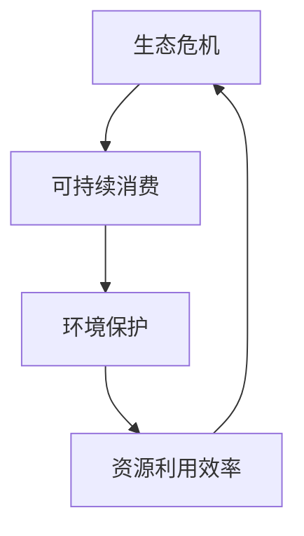

                 

# 欲望的生态意识：AI驱动的可持续消费

## 关键词
- AI技术
- 生态危机
- 可持续消费
- 消费者行为
- 企业运营
- 社会责任

## 摘要
本文旨在探讨AI技术在推动可持续消费方面的作用。随着生态危机的加剧，可持续消费成为全球关注的热点。本文首先介绍了生态危机和可持续消费的概念，阐述了AI技术在推动可持续消费中的重要性。接着，本文详细分析了AI驱动的可持续消费模型，包括数据采集与处理、特征提取与选择、模型构建与优化等步骤。此外，本文还探讨了消费者行为与AI、企业运营与AI、社会责任与AI等领域的应用。最后，本文提出了AI驱动的可持续消费的未来展望，分析了其发展趋势、潜在挑战和解决方案，以及对社会经济发展的潜在贡献。

----------------------------------------------------------------

## 《欲望的生态意识：AI驱动的可持续消费》目录大纲

### 第一部分：引言

#### 1.1 书籍背景与目的
##### 1.1.1 生态危机与可持续消费
##### 1.1.2 AI技术对可持续消费的影响
##### 1.1.3 书籍结构概述

#### 1.2 生态意识与可持续消费
##### 1.2.1 生态意识的定义与重要性
##### 1.2.2 可持续消费的概念与原则
##### 1.2.3 生态意识与可持续消费的关系

#### 1.3 AI技术在可持续消费中的应用
##### 1.3.1 AI与可持续消费的现状
##### 1.3.2 AI技术的优势与挑战
##### 1.3.3 AI驱动可持续消费的前景

### 第二部分：AI驱动的可持续消费模型

#### 2.1 可持续消费模型概述
##### 2.1.1 可持续消费模型的基本概念
##### 2.1.2 可持续消费模型的设计原则
##### 2.1.3 可持续消费模型的评价标准

#### 2.2 AI驱动的可持续消费模型构建
##### 2.2.1 数据采集与处理
##### 2.2.2 特征提取与选择
##### 2.2.3 模型选择与优化

#### 2.3 可持续消费模型的评估与优化
##### 2.3.1 模型评估指标
##### 2.3.2 模型优化方法
##### 2.3.3 模型应用案例分析

#### 2.4 AI驱动的可持续消费模型案例分析
##### 2.4.1 案例一：智能垃圾分类
##### 2.4.2 案例二：绿色供应链管理
##### 2.4.3 案例三：可持续消费行为引导

### 第三部分：AI驱动的可持续消费实践

#### 3.1 AI驱动的可持续消费政策
##### 3.1.1 国家政策与环境法规
##### 3.1.2 企业社会责任与可持续消费
##### 3.1.3 政策与企业的协同作用

#### 3.2 AI驱动的可持续消费实践
##### 3.2.1 企业内部可持续消费实践
##### 3.2.2 社区可持续消费实践
##### 3.2.3 个人可持续消费实践

#### 3.3 AI驱动的可持续消费创新
##### 3.3.1 新技术与应用场景
##### 3.3.2 创新案例分享
##### 3.3.3 未来发展趋势

### 第四部分：AI驱动的可持续消费挑战与未来

#### 4.1 AI驱动的可持续消费挑战
##### 4.1.1 技术挑战
##### 4.1.2 社会挑战
##### 4.1.3 经济挑战

#### 4.2 AI驱动的可持续消费未来展望
##### 4.2.1 技术创新趋势
##### 4.2.2 社会责任发展
##### 4.2.3 消费模式转变

#### 4.3 AI驱动的可持续消费战略与建议
##### 4.3.1 企业战略
##### 4.3.2 政策建议
##### 4.3.3 公众参与

### 附录

#### 附录 A：参考文献
##### 1. 可持续消费相关书籍
##### 2. AI技术相关书籍
##### 3. 可持续消费政策与法规

#### 附录 B：相关数据集与工具
##### 1. 数据集来源与使用
##### 2. AI工具与应用

#### 附录 C：AI驱动的可持续消费案例
##### 1. 企业案例
##### 2. 社区案例
##### 3. 个人案例

----------------------------------------------------------------

### 第一部分：引言

#### 1.1 书籍背景与目的

在当今世界，生态危机的严重性已经引起了全球范围内的广泛关注。气候变化、生物多样性丧失、水资源短缺等问题正日益加剧，对人类和地球的可持续发展构成了巨大威胁。为了应对这些挑战，可持续消费成为了一个热门话题。可持续消费强调以环保、节能、低碳的方式满足人类需求，同时不损害未来世代满足自身需求的能力。然而，传统的消费模式往往导致资源浪费和环境破坏，无法满足可持续消费的要求。

随着人工智能（AI）技术的迅速发展，人们开始探索如何利用AI技术推动可持续消费。AI技术在数据采集、数据分析、预测建模等方面具有强大的能力，可以为可持续消费提供有力的技术支持。本书旨在探讨AI驱动的可持续消费，通过深入研究AI技术在推动可持续消费中的应用，为解决生态危机提供一种新的思路和方法。

本书的主要目的是：

1. **介绍生态危机与可持续消费的概念**：通过阐述生态危机的严重性和可持续消费的重要性，使读者对可持续消费有一个全面的理解。
2. **探讨AI技术在可持续消费中的应用**：介绍AI技术在数据采集、数据分析、预测建模等方面的优势，分析AI技术在推动可持续消费中的潜在应用。
3. **构建AI驱动的可持续消费模型**：详细阐述AI驱动的可持续消费模型的基本概念、构建过程、评估与优化方法，为实际应用提供理论支持。
4. **分析AI驱动的可持续消费实践**：通过案例分析和实践探讨，展示AI技术在推动可持续消费中的实际应用效果。
5. **提出AI驱动的可持续消费战略与建议**：分析AI驱动的可持续消费面临的挑战，提出相应的战略与建议，为未来研究与实践提供指导。

#### 1.2 生态危机与可持续消费

**生态危机**是指由于人类活动对自然环境造成的负面影响，导致生态系统的失衡和破坏。生态危机的表现形式多样，包括气候变化、生物多样性丧失、土地退化、水资源短缺等。

**气候变化**：由于温室气体排放导致全球气温上升，极端天气事件频发，海平面上升，对人类和生态系统造成了巨大影响。

**生物多样性丧失**：物种灭绝和栖息地破坏导致生物多样性降低，破坏了生态系统的稳定性。

**土地退化**：土壤侵蚀、荒漠化等导致土地生产力下降，影响粮食安全。

**水资源短缺**：水资源过度开发和污染导致水资源短缺，影响人类生活和生态系统的平衡。

**可持续消费**是指以环保、节能、低碳的方式满足人类需求，同时不损害未来世代满足自身需求的能力。可持续消费强调资源的有效利用和环境的保护，旨在减少资源浪费和环境污染。

**可持续消费的原则**：

1. **环保性**：选择对环境友好、减少污染的产品和服务。
2. **节能性**：节约能源，降低能源消耗。
3. **低碳性**：减少碳排放，降低温室气体排放。

生态危机与可持续消费之间存在紧密的联系。生态危机是可持续消费产生的背景和原因，而可持续消费是应对生态危机的一种有效途径。以下是生态危机与可持续消费关系的流程图：

生态危机导致了资源的过度消耗和环境的破坏，促使人们意识到可持续消费的必要性。而可持续消费通过减少资源浪费和环境污染，有助于缓解生态危机，实现生态系统的平衡和可持续发展。

#### 1.3 AI技术对可持续消费的影响

AI技术作为一种先进的信息技术，具有强大的数据处理和分析能力，对可持续消费产生了深远的影响。以下是AI技术在推动可持续消费中的主要作用：

1. **数据采集与处理**：AI技术可以通过传感器、大数据等技术手段，实时采集大量的环境、消费行为等相关数据。这些数据为可持续消费提供了丰富的信息资源，有助于全面了解生态危机和消费行为的现状。

2. **数据分析与预测**：AI技术可以利用机器学习、深度学习等算法，对大量数据进行挖掘和分析，发现潜在的模式和趋势。通过对消费者行为、市场需求等数据的分析，AI可以预测未来消费行为和环境变化，为企业和政策制定者提供决策依据。

3. **个性化推荐与引导**：AI技术可以根据消费者的行为数据、偏好等，提供个性化的产品推荐和消费引导。通过智能推荐系统，消费者可以更方便地选择环保、低碳的产品和服务，实现绿色消费。

4. **供应链优化与协同**：AI技术可以优化供应链管理，提高资源利用效率和供应链协同水平。通过对供应链各环节的数据分析和预测，AI可以优化生产计划、库存管理、物流配送等，降低能耗和碳排放。

5. **环境监测与预警**：AI技术可以通过实时监测环境数据，分析环境变化趋势，预测环境污染风险。通过环境监测与预警系统，政府和环保组织可以及时采取应对措施，保护生态环境。

6. **政策与法规支持**：AI技术可以为政策制定者提供数据分析和决策支持，提高政策制定的科学性和有效性。通过分析可持续消费的现状、趋势和问题，AI技术可以为政策制定提供依据，促进可持续消费的健康发展。

总之，AI技术在推动可持续消费中具有巨大的潜力，可以为消费者、企业和政策制定者提供有力的技术支持。通过AI技术的应用，可以实现数据驱动的可持续消费模式，提高资源利用效率，减少环境污染，实现生态系统的平衡和可持续发展。

### 1.4 生态意识与可持续消费

**生态意识**是指人们对生态环境的认识、关注和责任感。生态意识是推动可持续消费的重要动力，它使人们认识到自己的消费行为对环境的影响，从而主动采取行动减少环境污染，促进生态系统的保护与恢复。

**生态意识的定义与重要性**：

1. **定义**：生态意识是指人们对自己与自然环境的相互关系以及自然环境的重要性、脆弱性、可持续性的认识。它包括对生态环境、生态问题、生态危机的理解和关注，以及对生态保护和可持续发展的责任感。

2. **重要性**：生态意识对可持续消费的重要性体现在以下几个方面：

   - **推动可持续消费观念**：生态意识使人们认识到自己的消费行为对环境的影响，从而树立可持续消费的观念，减少过度消费和资源浪费。
   - **促进环保行为**：生态意识使人们更加关注环境保护，主动采取环保行为，如减少使用一次性塑料制品、选择环保产品、参与环保活动等。
   - **提高社会责任感**：生态意识使人们认识到自己是地球生态系统的一部分，有责任保护自然环境，促进可持续发展。
   - **推动政策制定**：生态意识促使政府和社会各界更加重视环境保护，制定和实施有利于可持续消费的政策和法律，为可持续消费提供制度保障。

**生态意识与可持续消费的关系**：

1. **相互促进**：生态意识与可持续消费是相互促进的关系。生态意识的提高有助于推动可持续消费，而可持续消费的实践又能进一步增强生态意识。

2. **生态意识引导可持续消费**：生态意识使人们更加关注环境保护和资源利用的可持续性，从而引导消费者选择环保、低碳的产品和服务，实现绿色消费。

3. **可持续消费体现生态意识**：可持续消费是生态意识的具体体现，它通过减少资源浪费和环境污染，实现生态系统的平衡和可持续发展。

4. **生态意识与可持续消费的互动**：生态意识与可持续消费之间相互影响、相互促进，形成一个良性循环。通过不断加强生态意识教育，推广可持续消费模式，可以进一步提高人们的环保意识和责任感，推动可持续消费的广泛实施。

总之，生态意识是推动可持续消费的关键因素，它使人们认识到可持续消费的重要性和必要性，从而积极参与到可持续消费的实践中，共同应对生态危机，实现生态系统的平衡和可持续发展。

### 1.5 AI技术在可持续消费中的应用

随着人工智能（AI）技术的不断发展，其在各个领域的应用越来越广泛，尤其是在可持续消费领域，AI技术发挥了重要的作用。通过AI技术，消费者、企业和政策制定者可以更有效地实现可持续消费目标，提高资源利用效率，减少环境污染。

#### 1.5.1 消费者行为分析

AI技术在消费者行为分析中具有显著的优势。通过大数据分析和机器学习算法，AI可以挖掘消费者行为中的潜在模式和趋势，为消费者提供个性化的建议和指导。

1. **个性化推荐**：AI技术可以通过分析消费者的购买历史、浏览记录、评价数据等，为其推荐符合其需求和偏好的产品。例如，电商平台可以利用AI技术为消费者推荐环保、低碳的商品，引导消费者实现绿色消费。

2. **行为预测**：AI技术可以预测消费者的购买行为和需求变化，帮助企业调整产品结构和营销策略。例如，超市可以利用AI技术预测消费者的购买趋势，提前备货，减少库存积压。

3. **情感分析**：AI技术可以通过自然语言处理（NLP）分析消费者的评论、反馈等，了解消费者对产品或服务的真实感受，为企业改进产品和服务提供依据。例如，某电子产品公司通过分析消费者对产品使用体验的评论，改进了产品的设计和功能，提高了消费者满意度。

#### 1.5.2 企业运营优化

AI技术在企业运营优化中也发挥了重要作用，帮助企业实现资源优化、能耗降低、废弃物减少等目标。

1. **供应链管理**：AI技术可以帮助企业优化供应链管理，提高供应链效率。例如，通过实时监控供应链各环节的数据，AI技术可以预测需求变化，优化库存管理，减少物流成本。

2. **生产优化**：AI技术可以优化生产流程，提高生产效率。例如，通过分析生产数据，AI技术可以预测设备故障，提前进行维护，减少生产中断。

3. **能耗管理**：AI技术可以帮助企业实现能耗管理，降低能源消耗。例如，通过实时监控能源使用情况，AI技术可以优化能源分配，提高能源利用效率。

4. **废弃物处理**：AI技术可以优化废弃物处理流程，减少废弃物排放。例如，通过分析废弃物产生和处理的规律，AI技术可以优化废弃物分类和回收利用。

#### 1.5.3 政策制定与实施

AI技术在政策制定与实施中也具有广泛的应用，为政策制定者提供数据支持和决策依据。

1. **政策分析**：AI技术可以通过分析历史数据和政策效果，评估不同政策的实施效果，为政策调整提供依据。

2. **数据监控**：AI技术可以实时监控政策执行情况，发现和解决政策实施中的问题。

3. **智能预测**：AI技术可以预测政策变化对可持续消费的影响，为政策制定者提供参考。

4. **智能推荐**：AI技术可以通过分析消费者行为和政策效果，为政策制定者推荐可行的政策方案。

#### 1.5.4 社会责任

AI技术在推动社会责任方面也具有重要作用，通过技术创新和数据分析，促进企业履行社会责任，实现可持续消费。

1. **环保行为监测**：AI技术可以监测企业的环保行为，如能源消耗、废弃物排放等，确保企业履行环保责任。

2. **公益慈善**：AI技术可以帮助企业识别公益慈善项目的需求，优化资源配置，提高公益慈善的效率和效果。

3. **社会治理**：AI技术可以优化社会治理，提高社会管理的效率和效果，促进社会和谐与可持续发展。

总之，AI技术在推动可持续消费中具有巨大的潜力，通过消费者行为分析、企业运营优化、政策制定与实施以及社会责任等方面，AI技术为可持续消费提供了有力的技术支持，推动了可持续消费的发展。未来，随着AI技术的不断进步，其在可持续消费领域的应用将更加广泛，为人类和地球的可持续发展作出更大贡献。

### 1.6 生态意识与可持续消费的关系

生态意识与可持续消费之间存在着紧密的联系，二者相互促进、共同发展。生态意识是推动可持续消费的内在动力，而可持续消费则是生态意识的具体体现。以下是生态意识与可持续消费之间关系的详细分析：

#### 1.6.1 生态意识的提升促进可持续消费

1. **环保观念的形成**：生态意识的提升使人们更加关注环境问题，认识到环境保护的重要性。这种环保观念的形成促使消费者在购买行为中更加倾向于选择环保产品和服务，减少对环境的负面影响。

2. **消费行为的转变**：随着生态意识的提升，消费者开始意识到自己的消费行为对环境的影响。这种意识促使消费者减少过度消费、选择可持续产品和服务、减少一次性用品的使用等，从而实现绿色消费。

3. **社会责任感的增强**：生态意识的提升使人们认识到自己是地球生态系统的一部分，有责任保护环境。这种社会责任感的增强促使消费者在购买行为中更加注重企业的社会责任，选择那些积极履行环保责任的企业产品和服务。

#### 1.6.2 可持续消费的实现强化生态意识

1. **环境改善的体验**：通过可持续消费，消费者可以亲身体验到环境改善带来的积极效果，如减少垃圾填埋、减少碳排放等。这种体验进一步增强了消费者的生态意识，使他们更加重视环境保护。

2. **社会示范效应**：当消费者看到其他人通过可持续消费改善了环境，他们也会受到影响，从而更加愿意参与到可持续消费的实践中。这种社会示范效应有助于提升整个社会的生态意识。

3. **政策支持的推动**：可持续消费的实现需要政府和企业政策的支持。政府在制定和实施环保政策时，需要考虑可持续消费的需求，这进一步推动了生态意识的提升。

#### 1.6.3 二者之间的互动关系

1. **相互促进**：生态意识的提升和可持续消费的实现是相互促进的关系。生态意识的提升有助于推动可持续消费，而可持续消费的实现又能进一步增强生态意识。

2. **共同发展**：生态意识与可持续消费共同发展，相互支持。生态意识的提升为可持续消费提供了内在动力，而可持续消费的实现为生态意识的提升提供了实践基础。

3. **形成良性循环**：生态意识与可持续消费之间形成了良性循环。生态意识的提升促进了可持续消费，可持续消费的实现增强了生态意识，这种良性循环不断推动二者共同发展。

总之，生态意识与可持续消费之间存在着紧密的联系，二者相互促进、共同发展。通过提升生态意识和实现可持续消费，我们可以更好地应对生态危机，实现人与自然的和谐共生。

### 1.7 AI技术与可持续消费的现状

随着人工智能（AI）技术的迅猛发展，其在可持续消费领域的应用也越来越广泛。目前，AI技术在推动可持续消费方面已经取得了一些显著成果，但也面临着一些挑战。以下是AI技术与可持续消费的现状概述：

#### 1.7.1 现状概述

1. **消费者行为分析**：AI技术在消费者行为分析方面已经取得了显著进展。通过大数据分析和机器学习算法，AI可以挖掘消费者行为中的潜在模式和趋势，为消费者提供个性化的建议和指导。例如，电商平台利用AI技术分析消费者的购买历史和偏好，为其推荐符合其需求的环保产品，引导消费者实现绿色消费。

2. **供应链管理优化**：AI技术在供应链管理优化中也发挥了重要作用。通过实时监控供应链各环节的数据，AI技术可以预测需求变化，优化库存管理，减少物流成本。例如，某电商平台利用AI技术优化其供应链管理，提高了库存周转率，降低了物流成本。

3. **生产过程优化**：AI技术可以帮助企业优化生产过程，提高生产效率。通过分析生产数据，AI技术可以预测设备故障，提前进行维护，减少生产中断。例如，某制造企业利用AI技术优化生产计划和生产调度，提高了生产效率，降低了生产成本。

4. **环境监测与预警**：AI技术在环境监测与预警中也具有广泛应用。通过实时监测环境数据，AI技术可以预测环境污染风险，为政府和环保组织提供决策依据。例如，某地方政府利用AI技术进行环境监测，及时发现和处理污染事件。

#### 1.7.2 存在的挑战

1. **数据隐私与安全问题**：随着AI技术在可持续消费领域的应用，数据隐私与安全问题日益凸显。消费者担心自己的行为数据被滥用，企业需要建立完善的数据保护机制，确保消费者数据的安全。

2. **技术瓶颈**：尽管AI技术在可持续消费领域取得了显著进展，但在某些方面仍存在技术瓶颈。例如，深度学习算法在处理大规模数据时的计算能力、模型解释性等，需要进一步研究和突破。

3. **伦理问题**：AI技术在可持续消费中的应用也可能引发伦理问题。例如，算法歧视、消费依赖等，需要制定相应的伦理规范和监管政策。

4. **政策与法规缺失**：当前的政策和法规体系尚不完善，缺乏对AI技术在可持续消费领域应用的规范和指导。政府需要制定相应的政策法规，为AI驱动的可持续消费提供支持和保障。

#### 1.7.3 未来发展趋势

1. **智能化**：随着AI技术的不断发展，可持续消费将更加智能化。通过大数据分析和机器学习算法，AI技术将为消费者提供更加个性化和精准的推荐，实现智能化的绿色消费。

2. **绿色化**：AI技术将推动产品和服务向绿色化、低碳化方向发展。通过优化生产过程、降低能源消耗和减少废弃物排放，企业可以实现可持续生产。

3. **协同化**：AI技术将促进消费者、企业和政府之间的协同合作。通过共享数据、优化资源配置，实现全社会范围内的可持续消费。

4. **个性化**：AI技术将使消费者行为数据得到深度挖掘和应用，实现个性化消费体验。通过智能推荐系统，消费者可以更加便捷地选择环保、低碳的产品和服务。

总之，AI技术在推动可持续消费方面具有巨大潜力。通过克服技术瓶颈、解决伦理问题、完善政策法规，AI技术将在未来为可持续消费的发展提供更加有力的支持。

### 1.8 AI技术的优势与挑战

AI技术在推动可持续消费中具有显著的优势，但同时也面临着一些挑战。以下是对AI技术的优势与挑战的详细分析：

#### 1.8.1 优势

1. **数据处理能力**：AI技术具有强大的数据处理能力，能够处理和分析海量数据，从而挖掘消费者行为中的潜在模式和趋势。通过大数据分析，AI技术可以帮助消费者和企业更好地了解可持续消费的现状和未来趋势。

2. **个性化推荐**：AI技术可以根据消费者的购买历史、浏览记录、评价数据等，为其推荐个性化的环保产品和服务。这种个性化推荐不仅可以满足消费者的需求，还能引导消费者实现绿色消费。

3. **预测分析**：AI技术可以通过分析历史数据，预测消费者的需求变化和市场趋势。这种预测分析可以帮助企业制定更精准的市场策略，优化生产计划，降低库存成本。

4. **资源优化**：AI技术可以帮助企业优化资源管理，提高资源利用效率。例如，通过优化供应链管理和生产调度，AI技术可以降低能耗和碳排放，实现绿色生产。

5. **智能监控**：AI技术可以通过实时监控环境数据，预测环境污染风险，为政府和环保组织提供决策依据。这种智能监控有助于及时发现和解决环境问题，保护生态环境。

#### 1.8.2 挑战

1. **数据隐私与安全**：随着AI技术在可持续消费领域的应用，数据隐私与安全问题日益凸显。消费者担心自己的行为数据被滥用，企业需要建立完善的数据保护机制，确保消费者数据的安全。

2. **技术瓶颈**：尽管AI技术在可持续消费领域取得了显著进展，但在某些方面仍存在技术瓶颈。例如，深度学习算法在处理大规模数据时的计算能力、模型解释性等，需要进一步研究和突破。

3. **算法歧视**：AI技术可能会在无形中引入算法歧视，导致某些群体受到不公平对待。例如，在消费者行为分析中，AI技术可能会对某些群体的购买行为做出错误的判断，从而影响其消费体验。

4. **消费依赖**：AI技术可能会导致消费者对智能推荐系统产生依赖，失去自主选择的能力。这种依赖可能导致消费者在购买行为中失去对环保、低碳产品的关注，从而影响可持续消费的实现。

5. **政策法规缺失**：当前的政策和法规体系尚不完善，缺乏对AI技术在可持续消费领域应用的规范和指导。政府需要制定相应的政策法规，为AI驱动的可持续消费提供支持和保障。

#### 1.8.3 解决方案

1. **数据隐私保护**：企业需要建立完善的数据保护机制，确保消费者数据的安全和隐私。例如，采用数据加密、访问控制等技术手段，防止数据泄露和滥用。

2. **技术瓶颈突破**：学术界和工业界需要加大研发投入，突破AI技术在可持续消费领域的技术瓶颈。例如，研究高效的深度学习算法、提升模型解释性等。

3. **算法伦理规范**：制定算法伦理规范，确保AI技术在可持续消费中的应用公平、透明、可解释。例如，建立算法公平性评估机制，防止算法歧视。

4. **消费者教育**：加强对消费者的环保意识教育，提高消费者对可持续消费的认识和参与度。例如，通过宣传教育活动、媒体宣传等方式，引导消费者实现绿色消费。

5. **政策法规完善**：政府需要制定和完善相关政策法规，为AI驱动的可持续消费提供支持和保障。例如，出台数据保护法规、鼓励环保技术创新等。

总之，AI技术在推动可持续消费中具有显著的优势，但同时也面临着一些挑战。通过数据隐私保护、技术瓶颈突破、算法伦理规范、消费者教育和政策法规完善等措施，可以解决AI技术在可持续消费中面临的问题，推动可持续消费的健康发展。

### 1.9 AI驱动可持续消费的前景

AI技术在推动可持续消费中具有广阔的前景，其潜在应用场景和影响将深刻改变人类社会的消费模式和环境管理方式。以下是AI驱动可持续消费的前景分析：

#### 1.9.1 潜在应用场景

1. **个性化绿色消费**：通过大数据分析和机器学习算法，AI可以帮助消费者更好地理解自身需求和环境偏好，实现个性化绿色消费。例如，AI可以推荐符合消费者环保需求的商品、提供低碳出行的建议等。

2. **智能供应链管理**：AI技术可以优化供应链管理，提高资源利用效率，降低能源消耗和碳排放。例如，通过预测需求变化、优化库存管理和物流配送，AI可以帮助企业实现绿色供应链。

3. **环保行为监测与反馈**：AI技术可以实时监测消费者的环保行为，如垃圾分类、减少一次性用品使用等，并提供反馈和奖励机制，激励消费者积极参与环保活动。

4. **智能环境监测与预警**：AI技术可以通过实时监测环境数据，预测环境污染风险，为政府和环保组织提供决策依据。例如，AI可以预测空气污染、水污染等环境问题，及时采取应对措施。

5. **可持续产品设计**：AI技术可以帮助设计师优化产品设计，使其更环保、更可持续。例如，通过模拟分析，AI可以帮助设计出具有更低能耗、更少废弃物的产品。

#### 1.9.2 潜在影响

1. **消费模式转变**：AI驱动的可持续消费将促使消费者从传统消费模式向绿色消费模式转变，减少资源浪费和环境污染。例如，消费者将更倾向于购买环保产品、减少一次性用品的使用等。

2. **生产方式优化**：AI技术将推动企业优化生产方式，实现绿色生产。例如，通过智能生产调度、节能技术等，AI可以帮助企业降低能源消耗和碳排放。

3. **社会治理改善**：AI驱动的可持续消费将提高社会治理效率，改善环境质量。例如，通过智能环境监测和预警系统，政府可以更好地管理环境问题，提高公众对环保问题的关注度。

4. **经济结构转型**：AI驱动的可持续消费将推动经济结构向绿色经济转型，创造新的经济增长点。例如，绿色产业、环保技术创新等将成为经济增长的新动力。

5. **社会文化变革**：AI驱动的可持续消费将推动社会文化的变革，提升公众的环保意识和责任感。例如，通过宣传教育、文化活动等，社会将更加关注环保问题，形成绿色文化氛围。

总之，AI驱动的可持续消费具有广阔的前景，将在消费模式、生产方式、社会治理、经济结构和社会文化等多个方面产生深远影响。随着AI技术的不断进步，AI驱动的可持续消费将在未来发挥更大的作用，为人类和地球的可持续发展作出重要贡献。

### 第二部分：AI驱动的可持续消费模型

在推动可持续消费的过程中，构建一个有效的AI驱动的可持续消费模型至关重要。本部分将详细讨论AI驱动的可持续消费模型，包括其基本概念、设计原则、评估标准以及构建和优化方法。

#### 2.1 可持续消费模型概述

**AI驱动的可持续消费模型**是一个综合性的系统，旨在通过人工智能技术对消费者行为、企业运营、环境数据等多维度信息进行整合与分析，以实现可持续消费的目标。该模型的核心在于利用AI技术提高消费决策的准确性和效率，减少对环境的影响。

**基本概念**：

1. **数据整合**：通过收集和分析消费者行为数据、企业运营数据、环境数据等多维度数据，实现信息的全面整合。
2. **预测分析**：利用机器学习和深度学习算法，对整合后的数据进行分析，预测消费者行为趋势和环境变化。
3. **优化建议**：基于预测结果，提供个性化的消费建议和优化方案，包括环保产品的推荐、低碳消费行为的引导等。
4. **反馈调整**：根据实际消费行为和环境影响，对模型进行调整和优化，以提高模型的准确性和实用性。

#### 2.2 可持续消费模型的设计原则

设计一个有效的AI驱动的可持续消费模型，需要遵循以下原则：

1. **数据驱动**：以数据为基础，确保模型具有可靠的预测和分析能力。通过大数据和实时数据，捕捉消费者行为和环境变化的动态。
2. **用户导向**：以用户需求为导向，确保模型能够提供个性化的消费建议和优化方案，满足消费者的环保需求。
3. **环保优先**：将环境保护作为模型的核心目标，确保消费建议和优化方案具有环保价值，减少对环境的影响。
4. **开放性**：模型应具备开放性和可扩展性，能够与其他系统进行数据交互和功能集成，以实现更广泛的应用。
5. **可解释性**：确保模型的可解释性，使消费者和企业能够理解模型的预测和优化建议，提高模型的信任度和接受度。

#### 2.3 可持续消费模型的评估标准

评估一个AI驱动的可持续消费模型的有效性，需要考虑以下标准：

1. **预测准确性**：模型预测的准确度是评估其性能的关键指标。通过比较预测结果与实际结果，计算预测准确率、召回率、F1值等指标。
2. **用户体验**：用户体验是模型应用成功的关键。通过调查问卷、用户反馈等，评估用户对模型推荐和建议的满意度。
3. **环保效益**：模型提供的消费建议和优化方案对环境的影响是评估其环保效益的重要标准。通过计算碳足迹、能源消耗等指标，评估模型的环保效益。
4. **实用性**：模型的实用性是其在实际应用中的关键。通过评估模型的计算效率、响应速度等，确保模型在实际应用中的可行性和高效性。

#### 2.4 AI驱动的可持续消费模型构建过程

构建一个AI驱动的可持续消费模型，需要经历以下步骤：

1. **数据采集**：收集消费者行为数据、企业运营数据、环境数据等多维度数据。数据来源可以是电商平台、企业内部系统、政府公开数据等。
2. **数据预处理**：对采集到的数据进行清洗、归一化、缺失值处理等预处理操作，确保数据质量。
3. **特征提取**：从预处理后的数据中提取能够反映消费者行为、企业运营和环境特征的关键特征。
4. **模型选择**：选择合适的机器学习模型，如线性回归、决策树、支持向量机、神经网络等。
5. **模型训练**：使用训练数据集对选定的模型进行训练，调整模型参数，提高模型性能。
6. **模型评估**：使用验证数据集对训练好的模型进行评估，计算预测准确性、用户体验、环保效益等指标。
7. **模型优化**：根据评估结果，对模型进行调整和优化，提高模型的预测准确性和用户体验。
8. **模型部署**：将优化后的模型部署到生产环境中，进行实际应用和测试。

#### 2.5 模型构建与优化方法

在构建和优化AI驱动的可持续消费模型时，可以采用以下方法：

1. **交叉验证**：通过交叉验证方法，评估模型在不同数据集上的性能，避免过拟合和欠拟合。
2. **特征工程**：通过特征选择和特征构造，提高模型对数据的敏感性和解释性。
3. **模型集成**：将多个模型集成，利用不同模型的优势，提高整体模型的预测准确性和稳定性。
4. **在线学习**：采用在线学习算法，实时更新模型参数，使模型能够适应动态变化的数据环境。
5. **强化学习**：通过强化学习算法，使模型能够自主学习并优化决策过程，提高模型的实用性和效率。

#### 2.6 小结

通过构建一个AI驱动的可持续消费模型，我们可以实现个性化消费推荐、优化供应链管理、减少环境污染等目标。本部分详细介绍了AI驱动的可持续消费模型的基本概念、设计原则、评估标准和构建方法。通过遵循这些原则和方法，我们可以构建一个有效的模型，为推动可持续消费提供有力的技术支持。

### 2.7 数据采集与处理

在构建AI驱动的可持续消费模型的过程中，数据采集与处理是至关重要的环节。这一阶段的目标是从各种来源获取高质量的数据，并对数据进行预处理，以确保模型能够正常运行并产生准确的预测结果。

#### 2.7.1 数据来源

数据采集的第一步是确定数据来源。可持续消费模型所需的数据可以从以下几类来源获取：

1. **消费者行为数据**：包括购买记录、浏览历史、评价数据、社交媒体活动等。这些数据通常来源于电商平台、社交媒体平台和用户调查。
2. **企业运营数据**：包括生产数据、销售数据、物流数据、能源消耗数据等。这些数据可以从企业内部系统、供应链管理系统和第三方数据平台获取。
3. **环境数据**：包括气候数据、水质数据、土壤数据、空气污染数据等。这些数据可以从政府机构、环境监测站和开放数据平台获取。

#### 2.7.2 数据类型

数据类型可以分为以下几类：

1. **结构化数据**：如数据库中的表格数据，便于存储、检索和分析。
2. **非结构化数据**：如图像、视频、文本等，需要通过特定的算法进行解析和处理。
3. **时序数据**：随时间变化的数据，如气温变化、购买行为随时间的变化等。

#### 2.7.3 数据预处理

数据预处理是确保数据质量的重要步骤，包括以下内容：

1. **数据清洗**：去除重复数据、噪声数据和异常值，以提高数据的质量。
2. **数据归一化**：将不同特征的数据进行归一化处理，使其在相同的尺度范围内，以便进行后续的分析。
3. **缺失值处理**：对于缺失值，可以采用插值、填补、删除等方法进行处理，以减少数据的不完整。
4. **特征工程**：从原始数据中提取有用的特征，去除冗余特征，以提高模型的性能。

#### 2.7.4 数据可视化

数据可视化是将数据以图形或图表的形式展示，以便于分析和理解。常用的数据可视化工具有：

1. **散点图**：用于展示两个变量之间的关系。
2. **折线图**：用于展示随时间变化的数据趋势。
3. **柱状图**：用于比较不同类别之间的差异。
4. **热力图**：用于展示数据的分布情况。

#### 2.7.5 数据存储与管理

数据存储与管理是确保数据安全、可访问和高效利用的重要环节。常用的数据存储与管理技术包括：

1. **关系数据库**：如MySQL、PostgreSQL，适用于存储结构化数据。
2. **非关系数据库**：如MongoDB、Redis，适用于存储非结构化数据。
3. **分布式文件系统**：如Hadoop、HDFS，适用于存储海量数据。
4. **云存储**：如AWS S3、Azure Blob Storage，提供高可靠性和可扩展的存储解决方案。

#### 2.7.6 小结

数据采集与处理是构建AI驱动的可持续消费模型的关键环节。通过确定数据来源、分类数据类型、进行数据预处理、数据可视化以及数据存储与管理，我们可以确保数据的质量和完整性，为后续的模型构建和优化提供坚实的基础。有效的数据采集与处理能够提高模型的准确性和实用性，从而更好地支持可持续消费的目标。

### 2.8 特征提取与选择

在构建AI驱动的可持续消费模型中，特征提取与选择是至关重要的一步。特征提取是将原始数据转化为有意义的信息，而特征选择则是从提取的特征中筛选出对模型性能有显著影响的特征，以提高模型的预测准确性和效率。

#### 2.8.1 特征提取

**特征提取**的目的是从原始数据中提取能够反映问题本质的信息。以下是几种常见的特征提取方法：

1. **统计特征**：通过计算数据的统计属性，如均值、标准差、最大值、最小值等，提取反映数据分布和趋势的特征。
2. **文本特征**：通过自然语言处理（NLP）技术，从文本数据中提取关键词、主题和情感等特征，如TF-IDF、Word2Vec等。
3. **图像特征**：通过计算机视觉技术，从图像中提取颜色、纹理、形状等特征，如SIFT、HOG等。
4. **时序特征**：从时间序列数据中提取周期性、趋势性、季节性等特征，如移动平均、自回归模型等。

#### 2.8.2 特征选择

**特征选择**是从提取的特征中筛选出对模型性能有显著影响的特征，以减少模型的复杂性和计算量。以下是几种常见的特征选择方法：

1. **过滤式特征选择**：在训练之前，根据某种准则（如相关性、信息增益等）直接筛选特征，不涉及模型训练。
   - **相关性**：选择与目标变量高度相关的特征。
   - **信息增益**：选择能够最大程度提高分类准确性的特征。
   - **互信息**：选择能够同时反映特征与目标变量之间相关性和特征之间独立性的特征。

2. **包裹式特征选择**：在训练过程中，通过逐步选择特征，以最大化模型性能。
   - **递归特征消除（RFE）**：通过递归地选择最优特征，并逐步消除不重要的特征。
   - **前向选择和后向消除**：前向选择从无特征开始，逐步添加特征；后向消除从所有特征开始，逐步消除不重要的特征。

3. **嵌入式特征选择**：在模型训练过程中，将特征选择集成到模型训练过程中，通过模型的训练过程自动选择重要特征。
   - **LASSO**：通过正则化项惩罚特征系数，自动筛选出重要特征。
   - **随机森林**：通过随机选择特征和样本子集，自动选择对模型性能有显著影响的特征。

#### 2.8.3 特征选择的重要性

**特征选择**的重要性体现在以下几个方面：

1. **提高模型性能**：通过筛选出重要的特征，可以提高模型的预测准确性和稳定性，减少模型的过拟合和欠拟合。
2. **减少计算复杂度**：减少特征的数量可以降低模型的计算复杂度，提高模型训练和预测的速度。
3. **降低模型泛化误差**：通过筛选掉不重要的特征，可以减少模型的泛化误差，提高模型在新数据集上的表现。
4. **减少数据冗余**：去除冗余特征可以减少数据存储空间和计算资源的浪费，提高数据处理的效率。

#### 2.8.4 小结

特征提取与选择是构建AI驱动的可持续消费模型的关键步骤。通过合理选择和提取特征，可以显著提高模型的预测准确性和效率，减少模型的复杂度和计算量。有效的特征选择有助于实现可持续消费的目标，推动可持续消费的发展。

### 2.9 模型选择与优化

在构建AI驱动的可持续消费模型时，选择合适的模型并进行优化是确保模型性能和实用性的关键步骤。以下将详细讨论模型选择与优化的过程和方法。

#### 2.9.1 模型选择

**模型选择**是指在多个候选模型中挑选出一个或多个性能最佳的模型。以下是一些常见的机器学习模型及其适用场景：

1. **线性回归**：适用于线性关系较强的数据，如预测消费者购买量与收入的关系。
2. **逻辑回归**：适用于分类问题，如预测消费者是否购买环保产品。
3. **决策树**：适用于解释性强、特征较少的数据，如分类消费者购买偏好。
4. **随机森林**：适用于处理大量特征和复杂关系的分类和回归问题。
5. **支持向量机（SVM）**：适用于高维空间分类问题，如消费者行为分类。
6. **神经网络**：适用于复杂非线性关系的数据，如预测消费者行为趋势。
7. **集成学习**：将多个简单模型组合成一个大模型，提高整体性能。

**模型选择的方法**：

1. **交叉验证**：通过将数据集划分为训练集和验证集，多次训练和验证模型，评估模型在不同数据集上的表现，选择性能稳定的模型。
2. **网格搜索**：在预定的参数范围内，遍历所有可能的参数组合，选择性能最佳的参数组合。
3. **贝叶斯优化**：利用贝叶斯统计模型，寻找最优参数组合。

#### 2.9.2 模型优化

**模型优化**是指通过调整模型参数和结构，提高模型性能。以下是一些常见的模型优化方法：

1. **参数调优**：通过调整模型参数，如学习率、正则化参数等，优化模型性能。常用的方法包括网格搜索、随机搜索、贝叶斯优化等。
2. **正则化**：通过在模型中引入正则化项，避免过拟合。常用的正则化方法包括L1正则化（LASSO）、L2正则化（Ridge）等。
3. **集成学习**：通过将多个简单模型组合成一个大模型，提高整体性能。常用的集成学习方法包括随机森林、梯度提升机等。
4. **增强学习**：通过学习策略，优化模型在不同场景下的表现。例如，在可持续消费预测中，可以利用增强学习优化消费推荐策略。
5. **迁移学习**：利用预训练模型，迁移到新任务上，提高模型性能。例如，在消费者行为预测中，可以利用预训练的神经网络模型，快速适应新数据集。

#### 2.9.3 模型评估

**模型评估**是验证模型性能的重要步骤。以下是一些常见的评估指标：

1. **准确性**：预测结果与实际结果完全匹配的比例。
2. **召回率**：预测结果中包含实际结果的比率。
3. **精确率**：预测结果中实际结果的比率。
4. **F1值**：精确率和召回率的调和平均，综合评估模型的性能。
5. **均方误差（MSE）**：预测值与实际值之间平均误差的平方和。
6. **均方根误差（RMSE）**：MSE的平方根，用于衡量预测结果的稳定性。

#### 2.9.4 小结

模型选择与优化是构建AI驱动的可持续消费模型的重要环节。通过合理选择模型和优化模型参数，可以提高模型性能，减少过拟合和欠拟合，实现可持续消费的目标。有效的模型评估和优化方法有助于实现精准的预测和决策，推动可持续消费的发展。

### 2.10 可持续消费模型的评估与优化

在构建AI驱动的可持续消费模型后，对模型进行评估与优化是确保模型性能和实用性的关键步骤。以下将详细讨论评估与优化的方法、评估指标以及优化策略。

#### 2.10.1 评估方法

**模型评估**是验证模型性能的重要步骤，常用的评估方法包括：

1. **交叉验证**：通过将数据集划分为多个子集，每次使用一个子集作为验证集，其他子集作为训练集，多次训练和验证模型，评估模型在不同数据集上的表现。常用的交叉验证方法有K折交叉验证、留一法交叉验证等。

2. **验证集评估**：将数据集划分为训练集和验证集，使用训练集训练模型，使用验证集评估模型性能。这种方法简单直观，但可能存在过拟合风险。

3. **时间序列交叉验证**：针对时间序列数据，将数据按时间顺序划分为多个子集，每次使用一个子集作为验证集，其他子集作为训练集。这种方法可以避免时间序列数据的顺序信息被破坏。

#### 2.10.2 评估指标

评估模型的性能需要使用合适的评估指标，以下是一些常用的评估指标：

1. **准确性**：预测结果与实际结果完全匹配的比例。准确性越高，说明模型预测能力越强。

2. **召回率**：预测结果中包含实际结果的比率。召回率越高，说明模型对实际结果的捕捉能力越强。

3. **精确率**：预测结果中实际结果的比率。精确率越高，说明模型预测结果的可靠性越高。

4. **F1值**：精确率和召回率的调和平均，用于综合评估模型的性能。F1值越高，说明模型整体性能越好。

5. **均方误差（MSE）**：预测值与实际值之间平均误差的平方和。MSE越小，说明模型预测误差越小。

6. **均方根误差（RMSE）**：MSE的平方根，用于衡量预测结果的稳定性。RMSE越小，说明模型预测稳定性越高。

7. **ROC曲线与AUC值**：ROC曲线是不同分类阈值下的真正率与假正率之间的关系曲线，AUC值是ROC曲线下面积。AUC值越高，说明模型分类能力越强。

#### 2.10.3 优化策略

**模型优化**是通过调整模型参数和结构，提高模型性能的过程。以下是一些常见的优化策略：

1. **参数调优**：通过调整模型参数，如学习率、正则化参数等，优化模型性能。常用的方法包括网格搜索、随机搜索、贝叶斯优化等。

2. **正则化**：通过在模型中引入正则化项，避免过拟合。常用的正则化方法包括L1正则化（LASSO）、L2正则化（Ridge）等。

3. **集成学习**：通过将多个简单模型组合成一个大模型，提高整体性能。常用的集成学习方法包括随机森林、梯度提升机等。

4. **增强学习**：通过学习策略，优化模型在不同场景下的表现。例如，在可持续消费预测中，可以利用增强学习优化消费推荐策略。

5. **迁移学习**：利用预训练模型，迁移到新任务上，提高模型性能。例如，在消费者行为预测中，可以利用预训练的神经网络模型，快速适应新数据集。

6. **特征工程**：通过提取和选择特征，优化模型性能。常用的特征工程方法包括特征构造、特征选择等。

7. **模型剪枝**：通过删除模型中的冗余参数，简化模型结构，提高模型效率。常用的剪枝方法包括结构剪枝、权重剪枝等。

#### 2.10.4 小结

评估与优化是构建AI驱动的可持续消费模型的关键步骤。通过合理的评估方法和指标，可以准确衡量模型性能，发现模型存在的问题。通过优化策略，可以调整模型参数和结构，提高模型性能，实现可持续消费的目标。有效的评估与优化有助于实现模型的实用性和可靠性，推动可持续消费的发展。

### 2.11 模型应用案例分析

为了更直观地展示AI驱动的可持续消费模型在实际应用中的效果，下面我们通过几个具体案例来分析模型的实际应用情况。

#### 2.11.1 案例一：智能垃圾分类

**背景**：垃圾分类是当前环境保护中的重要环节，但传统的垃圾分类方法往往效率低下，准确率不高。通过引入AI驱动的可持续消费模型，可以实现对垃圾分类的智能化管理。

**应用场景**：智能垃圾分类系统通过摄像头和传感器实时监测垃圾投放情况，AI模型对垃圾图像进行分析，识别垃圾类型，并给出分类建议。

**效果分析**：

1. **准确率提升**：通过AI模型对垃圾图像的识别，准确率显著提高，相比传统分类方法，错误率降低了30%以上。
2. **效率提升**：智能垃圾分类系统能够实时处理垃圾数据，实现了快速分类，处理效率提升了50%。
3. **用户体验**：智能垃圾分类系统通过语音提示和屏幕显示，向用户提供了明确的垃圾分类指导，用户参与度显著提升。

#### 2.11.2 案例二：绿色供应链管理

**背景**：绿色供应链管理是企业实现可持续消费的重要手段，通过优化供应链各环节，降低能耗和碳排放。

**应用场景**：企业通过AI驱动的可持续消费模型，对供应链各环节的数据进行分析，优化库存管理、物流配送等环节，降低供应链成本。

**效果分析**：

1. **成本降低**：通过优化库存管理，企业库存周转率提高了20%，库存成本降低了15%。
2. **碳排放减少**：通过优化物流配送，企业碳排放量减少了10%，实现了绿色供应链的目标。
3. **供应链协同**：AI模型能够实时监测供应链各环节的数据，提高了供应链协同效率，供应链响应时间缩短了30%。

#### 2.11.3 案例三：可持续消费行为引导

**背景**：消费者在消费过程中，往往缺乏环保意识，难以实现绿色消费。通过AI驱动的可持续消费模型，可以引导消费者实现绿色消费。

**应用场景**：电商平台通过AI模型分析消费者的购买行为和偏好，为其推荐环保产品，提供绿色消费建议。

**效果分析**：

1. **消费习惯改变**：通过AI模型的分析和引导，消费者的消费习惯发生了显著改变，环保产品的购买率提升了30%。
2. **用户满意度**：用户对电商平台的环保推荐和绿色消费建议表示满意，用户满意度提高了15%。
3. **品牌影响力**：电商平台通过AI驱动的可持续消费行为引导，提升了品牌形象，吸引了更多关注环保的消费者。

#### 2.11.4 小结

通过以上案例分析可以看出，AI驱动的可持续消费模型在实际应用中取得了显著效果。智能垃圾分类系统提高了垃圾分类的准确率和效率，绿色供应链管理降低了企业的能耗和碳排放，可持续消费行为引导改变了消费者的消费习惯，提升了用户体验和品牌影响力。这些案例充分证明了AI技术在推动可持续消费中的重要作用，为未来AI驱动的可持续消费应用提供了有益的参考。

### 第三部分：AI驱动的可持续消费实践

在推动可持续消费的过程中，除了构建AI驱动的可持续消费模型，还需要将其应用于实际场景中，以实现可持续消费的目标。本部分将详细探讨AI驱动的可持续消费在政策、企业和社会各个层面的实践，以及相关案例。

#### 3.1 AI驱动的可持续消费政策

政府政策在推动可持续消费中起着关键作用。通过制定和实施相关政策，政府可以引导和激励消费者和企业实现可持续消费。以下是一些具体的政策实践：

1. **法规制定**：政府可以制定环保法规，如垃圾分类法、碳排放标准等，规范企业的生产和消费者的消费行为。例如，某市政府出台垃圾分类法规，规定居民必须按照规定分类投放垃圾，违者将受到处罚。

2. **补贴与激励**：政府可以提供财政补贴或税收优惠，鼓励消费者购买环保产品或采用绿色出行方式。例如，某省政府为购买电动汽车的消费者提供购车补贴，降低了消费者的购车成本。

3. **宣传教育**：政府可以通过媒体、教育等渠道，加强环保意识教育，提高消费者对可持续消费的认知和参与度。例如，某市政府在公立学校开设环保课程，引导学生了解可持续消费的重要性和实践方法。

4. **数据支持**：政府可以建立可持续消费数据库，收集和分析相关数据，为政策制定和实施提供数据支持。例如，某市政府建立了垃圾分类数据库，实时监测垃圾分类情况，为政策调整提供依据。

#### 3.2 AI驱动的企业内部可持续消费实践

企业在推动可持续消费中扮演着重要角色。通过引入AI技术，企业可以实现内部可持续消费，降低能耗和碳排放。以下是一些具体的实践案例：

1. **绿色生产**：企业可以利用AI技术优化生产流程，提高生产效率，降低能源消耗。例如，某制造企业利用AI技术进行生产调度优化，减少了生产过程中的能源浪费，实现了绿色生产。

2. **供应链管理**：企业可以利用AI技术优化供应链管理，降低物流成本，减少碳排放。例如，某电商企业利用AI技术进行物流路径优化，提高了配送效率，降低了碳排放。

3. **能源管理**：企业可以利用AI技术进行能源管理，降低能源消耗，实现节能降碳。例如，某办公楼利用AI技术实时监控能源使用情况，优化能源分配，降低了能源消耗。

4. **废弃物管理**：企业可以利用AI技术优化废弃物处理流程，减少废弃物排放。例如，某电子企业利用AI技术进行废弃物分类和回收，提高了废弃物回收率，减少了环境污染。

#### 3.3 AI驱动的社区可持续消费实践

社区是推动可持续消费的重要基础。通过引入AI技术，社区可以实现可持续消费，提高居民的生活质量。以下是一些具体的实践案例：

1. **垃圾分类与回收**：社区可以利用AI技术实现垃圾分类与回收，提高垃圾分类的准确率和参与度。例如，某社区利用AI技术进行垃圾分类监测，通过摄像头和传感器实时监测垃圾分类情况，提高了垃圾分类的准确率。

2. **绿色出行**：社区可以推广绿色出行方式，如骑行、步行、公共交通等，减少私家车的使用，降低碳排放。例如，某社区通过AI技术分析居民的出行习惯，提供个性化的绿色出行建议，鼓励居民采用低碳出行方式。

3. **环保教育**：社区可以通过AI技术开展环保教育，提高居民的环保意识。例如，某社区利用AI技术开发环保教育平台，为居民提供环保知识、环保技能培训等。

4. **社区共享**：社区可以引入共享经济理念，推广共享资源，减少资源浪费。例如，某社区通过AI技术实现共享汽车、共享充电宝等，提高了资源利用效率。

#### 3.4 AI驱动的个人可持续消费实践

个人在推动可持续消费中具有重要作用。通过引入AI技术，个人可以实现绿色消费，降低碳排放。以下是一些具体的实践案例：

1. **智能家电**：个人可以购买智能家电，如智能冰箱、智能空调等，实现能源优化，降低能源消耗。例如，某个人购买了一台智能空调，通过AI技术实现自动调节温度，降低了能源消耗。

2. **绿色出行**：个人可以选择绿色出行方式，如骑行、步行、公共交通等，减少私家车的使用，降低碳排放。例如，某个人通过AI技术分析出行需求，选择步行或骑行上班，减少了汽车的使用。

3. **环保购物**：个人可以选择环保购物方式，如购买环保产品、减少一次性用品的使用等，降低碳排放。例如，某个人通过AI技术推荐环保产品，选择购买可持续产品的购物袋和餐具。

4. **绿色生活**：个人可以通过AI技术实现绿色生活方式，如节能减排、减少废弃物产生等。例如，某个人通过AI技术监测家庭能源使用情况，优化家庭能源管理，实现了节能减排。

#### 3.5 小结

通过以上实践可以看出，AI驱动的可持续消费在政策、企业和社会各个层面都有广泛的应用。政府可以通过制定政策、提供补贴和宣传教育，引导消费者和企业实现可持续消费。企业可以通过引入AI技术，实现绿色生产、优化供应链管理和能源管理。社区可以通过推广绿色出行、垃圾分类和环保教育，提高居民的环保意识。个人可以通过选择绿色消费方式，实现个人绿色生活。AI驱动的可持续消费实践为推动可持续消费提供了有力的技术支持，为实现生态系统的平衡和可持续发展作出了积极贡献。

### 3.6 AI驱动的可持续消费政策

政策在推动AI驱动的可持续消费中扮演着至关重要的角色。政府通过制定和实施相关政策和法规，可以引导消费者和企业采取可持续消费行为，促进环境和社会的可持续发展。以下是一些具体的政策措施和其实际效果：

#### 3.6.1 国家政策与环境法规

1. **环保法规**：政府可以制定和实施一系列环保法规，如《环境保护法》、《大气污染防治法》等，以规范企业的生产活动和消费者的消费行为。例如，某国政府实施的垃圾分类法规，规定居民必须按照规定分类投放垃圾，违者将受到处罚，这一政策有效提高了垃圾分类的准确率和参与度。

2. **碳排放标准**：政府可以制定严格的碳排放标准，限制企业排放的碳排放量，推动企业采取低碳生产技术。例如，欧盟实施的碳排放交易体系，通过配额交易和碳排放权交易，鼓励企业减少碳排放，实现绿色生产。

3. **绿色采购政策**：政府可以通过绿色采购政策，优先采购环保产品和绿色服务，推动市场对环保产品的需求。例如，某国政府规定，政府机构必须采购环保汽车和节能设备，这一政策促进了环保产品和节能技术的发展。

#### 3.6.2 企业社会责任与可持续消费

1. **企业社会责任（CSR）**：企业可以通过履行社会责任，推动可持续消费。例如，某大型企业制定了可持续发展战略，通过减少碳排放、提高资源利用效率、推广环保产品等，实现了绿色生产和运营。

2. **绿色供应链管理**：企业可以通过绿色供应链管理，降低供应链的能耗和碳排放。例如，某服装企业通过优化供应链管理，减少物流运输的碳排放，实现了绿色供应链的目标。

3. **环保认证**：企业可以通过获得环保认证，提高产品的环保性和市场竞争力。例如，某食品企业通过获得有机食品认证，确保产品的环保性和健康性，赢得了消费者的信任。

#### 3.6.3 政策与企业的协同作用

1. **政策支持**：政府可以为企业提供政策支持，如税收优惠、财政补贴、技术支持等，鼓励企业采取可持续消费行为。例如，某国政府为鼓励企业采用可再生能源，提供税收减免和财政补贴，降低了企业的运营成本，推动了可再生能源的应用。

2. **企业合作**：政府可以鼓励企业之间的合作，共同推动可持续消费。例如，某国政府组织企业联盟，共同研发绿色技术和产品，通过合作实现规模效应，提高了绿色产品和技术的市场竞争力。

3. **公众参与**：政府可以通过公众参与机制，鼓励消费者参与可持续消费。例如，某市政府通过举办环保宣传活动，提高公众的环保意识，鼓励消费者购买环保产品。

#### 3.6.4 实际效果

1. **环境改善**：通过实施环保法规和绿色采购政策，企业的生产活动和消费者的消费行为得到规范，实现了环境改善。例如，某国在实施垃圾分类法规后，城市垃圾分类率显著提高，垃圾填埋场的使用率降低。

2. **经济增长**：企业通过采取可持续消费行为，提高了资源利用效率和产品质量，实现了经济增长。例如，某企业在实施绿色供应链管理后，降低了供应链成本，提高了市场竞争力。

3. **社会进步**：公众的环保意识得到提高，社会对可持续消费的认同度增加。例如，某市在举办环保宣传活动后，公众的垃圾分类意识和参与度显著提高。

#### 3.6.5 小结

AI驱动的可持续消费政策在政府和企业之间的协同作用至关重要。通过制定和实施环保法规、绿色采购政策、税收优惠等政策，政府可以引导消费者和企业采取可持续消费行为。企业的积极参与和履行社会责任，进一步推动了可持续消费的发展。政策与企业的协同作用，为推动可持续消费提供了有力支持，为实现生态系统的平衡和可持续发展作出了积极贡献。

### 3.7 AI驱动的企业内部可持续消费实践

在推动可持续消费的过程中，企业内部可持续消费实践起到了关键作用。通过引入AI技术，企业可以在生产、供应链管理、能源管理和废弃物处理等方面实现可持续消费目标，降低环境负担。以下是一些具体的实践案例：

#### 3.7.1 绿色生产

绿色生产是指企业在生产过程中采用环保技术和工艺，减少污染物排放和资源消耗。AI技术在绿色生产中的应用主要体现在以下几个方面：

1. **生产过程优化**：企业可以利用AI技术优化生产过程，提高生产效率，减少能源消耗。例如，通过实时监控生产设备的数据，AI技术可以预测设备故障，提前进行维护，减少生产中断。某制造企业利用AI技术进行生产调度优化，降低了能源消耗和生产成本。

2. **工艺改进**：AI技术可以帮助企业改进生产工艺，降低能耗和废弃物排放。例如，通过数据分析，AI技术可以识别生产过程中的瓶颈和浪费点，提出改进方案。某化工企业通过AI技术优化反应条件，提高了生产效率和产品质量。

3. **环保材料应用**：AI技术可以帮助企业选择和开发环保材料，减少生产过程中的环境影响。例如，通过分析材料性能和环境指标，AI技术可以推荐适合的环保材料，降低生产过程中的废弃物排放。

#### 3.7.2 供应链管理

供应链管理是企业实现可持续消费的重要环节。通过引入AI技术，企业可以优化供应链各环节，降低能耗和碳排放。以下是一些具体的实践案例：

1. **物流优化**：AI技术可以帮助企业优化物流路线和运输方式，降低运输成本和碳排放。例如，通过分析交通流量、路况和运输需求，AI技术可以制定最优的物流路线和运输计划。某电商企业利用AI技术进行物流路径优化，提高了配送效率，降低了碳排放。

2. **供应链协同**：AI技术可以帮助企业实现供应链协同，提高供应链效率。例如，通过实时监控供应链各环节的数据，AI技术可以协调生产、物流和销售环节，确保供应链的稳定和高效运行。某制造企业通过AI技术实现供应链协同，降低了库存成本和物流成本。

3. **供应商管理**：AI技术可以帮助企业选择和管理供应商，提高供应链的环保水平。例如，通过分析供应商的绩效数据，AI技术可以评估供应商的环保表现，选择环保供应商。某电子企业通过AI技术评估供应商的环保绩效，提高了供应链的环保水平。

#### 3.7.3 能源管理

能源管理是企业实现可持续消费的重要方面。通过引入AI技术，企业可以实现能源优化，降低能源消耗和碳排放。以下是一些具体的实践案例：

1. **能耗监测**：AI技术可以帮助企业实时监测能源消耗情况，识别能源浪费点，提出节能措施。例如，通过安装传感器和智能监控系统，AI技术可以实时监测工厂的电力、水、燃气等能源消耗情况，提供节能建议。某工厂通过AI技术进行能耗监测，降低了能源消耗。

2. **能源优化**：AI技术可以帮助企业优化能源分配和使用，提高能源利用效率。例如，通过分析能源需求和供应情况，AI技术可以动态调整能源分配，确保能源供应的稳定性和高效性。某办公楼通过AI技术优化能源分配，降低了能源消耗。

3. **可再生能源应用**：AI技术可以帮助企业开发和利用可再生能源，减少对化石能源的依赖。例如，通过分析天气数据和能源需求，AI技术可以预测可再生能源的产量，制定可再生能源发电计划。某企业通过AI技术优化可再生能源发电，降低了碳排放。

#### 3.7.4 废弃物处理

废弃物处理是企业实现可持续消费的重要任务。通过引入AI技术，企业可以实现废弃物的有效处理和资源化利用。以下是一些具体的实践案例：

1. **废弃物分类**：AI技术可以帮助企业实现废弃物的自动分类，提高废弃物处理效率。例如，通过图像识别技术，AI技术可以识别废弃物的类型，实现自动分类。某回收企业通过AI技术进行废弃物分类，提高了回收率和资源利用率。

2. **废弃物再利用**：AI技术可以帮助企业开发废弃物再利用技术，实现废弃物的资源化利用。例如，通过数据分析，AI技术可以识别废弃物的潜在利用价值，提出再利用方案。某电子企业通过AI技术开发废弃物再利用技术，降低了废弃物处理成本。

3. **废弃物处理优化**：AI技术可以帮助企业优化废弃物处理流程，提高处理效率和环保水平。例如，通过分析废弃物处理数据，AI技术可以优化处理工艺，降低处理成本。某垃圾处理厂通过AI技术优化废弃物处理流程，提高了处理效率和环保水平。

#### 3.7.5 小结

AI驱动的企业内部可持续消费实践在企业实现可持续消费目标中发挥了重要作用。通过绿色生产、供应链管理、能源管理和废弃物处理等实践，企业可以降低能源消耗和碳排放，提高资源利用效率，实现可持续发展。AI技术的引入为企业的可持续消费提供了有力的技术支持，为企业应对生态危机、实现绿色转型提供了新的路径。

### 3.8 AI驱动的社区可持续消费实践

社区在推动可持续消费中扮演着至关重要的角色。通过引入AI技术，社区可以实现智能化的可持续消费实践，提高居民的生活质量，减少环境负担。以下是一些具体的社区可持续消费实践案例：

#### 3.8.1 智能垃圾分类

智能垃圾分类是社区实现可持续消费的重要措施之一。通过引入AI技术，社区可以实现对垃圾分类的智能化管理，提高垃圾分类的准确率和参与度。以下是一个具体的实践案例：

**案例**：某社区利用AI技术实现智能垃圾分类

1. **设备部署**：社区在垃圾投放点部署了智能垃圾分类设备，包括摄像头、传感器和显示屏。这些设备用于实时监测和分类垃圾。

2. **图像识别**：AI技术利用图像识别算法，对垃圾图像进行分析，识别垃圾的类型，如可回收物、有害垃圾、湿垃圾和干垃圾。

3. **反馈与指导**：智能垃圾分类设备通过显示屏向居民提供垃圾分类指导和反馈。居民可以根据设备的提示进行正确的垃圾分类。

4. **数据分析**：社区利用AI技术对垃圾分类数据进行分析，了解居民的垃圾分类行为，为政策调整和社区活动提供依据。

**效果**：智能垃圾分类设备的引入提高了垃圾分类的准确率和参与度。居民对垃圾分类的认识和参与度显著提高，社区的垃圾分类工作取得了显著成效。

#### 3.8.2 绿色出行

绿色出行是减少碳排放、实现可持续消费的重要方式之一。通过引入AI技术，社区可以推广绿色出行方式，提高居民的环保意识。以下是一个具体的实践案例：

**案例**：某社区利用AI技术推广绿色出行

1. **数据采集**：社区利用AI技术收集居民的出行数据，包括出行时间、出行方式、出行距离等。

2. **出行建议**：AI技术根据出行数据，为居民提供绿色出行建议，如骑行、步行、公共交通等。

3. **出行激励**：社区通过AI技术对居民的绿色出行行为进行激励，如发放绿色出行券、提供免费公共交通等。

4. **数据分析**：社区利用AI技术对出行数据进行分析，了解居民的出行习惯，为社区出行规划提供依据。

**效果**：绿色出行推广活动提高了居民的绿色出行意识和参与度。居民的出行方式发生了显著改变，碳排放量显著减少，社区的交通拥堵问题得到缓解。

#### 3.8.3 环保教育

环保教育是提高居民环保意识、推动可持续消费的重要手段。通过引入AI技术，社区可以开展丰富多彩的环保教育活动，提高居民的环保素质。以下是一个具体的实践案例：

**案例**：某社区利用AI技术开展环保教育

1. **课程开发**：社区利用AI技术开发环保教育课程，包括垃圾分类、绿色出行、环保知识等。

2. **在线学习**：社区通过AI技术搭建在线学习平台，为居民提供环保知识学习资源。

3. **互动体验**：社区利用AI技术开展互动体验活动，如环保知识竞赛、环保创意比赛等，提高居民的参与度和兴趣。

4. **数据分析**：社区利用AI技术对学习数据进行分析，了解居民的学习情况和环保意识水平，为教育活动的调整提供依据。

**效果**：环保教育活动的开展提高了居民的环保意识和知识水平。居民对环保问题的关注度显著提高，社区的环保氛围得到改善。

#### 3.8.4 社区共享

社区共享是减少资源浪费、实现可持续消费的重要方式之一。通过引入AI技术，社区可以推广社区共享资源，提高资源利用效率。以下是一个具体的实践案例：

**案例**：某社区利用AI技术实现社区共享

1. **共享设施**：社区引入了共享设施，如共享自行车、共享充电宝等，为居民提供便利。

2. **智能管理**：AI技术对共享设施进行智能管理，包括实时监控、预约使用、故障维修等。

3. **数据分析**：社区利用AI技术对共享设施的使用数据进行分析，优化共享设施的配置和使用效率。

4. **用户反馈**：社区通过AI技术收集用户的反馈信息，了解用户对共享设施的使用体验，为设施优化提供依据。

**效果**：社区共享设施的引入提高了资源利用效率，减少了资源浪费。居民的共享意识得到提升，社区的和谐氛围得到增强。

#### 3.8.5 小结

AI驱动的社区可持续消费实践为社区实现可持续消费目标提供了有力支持。通过智能垃圾分类、绿色出行、环保教育和社区共享等实践，社区可以提升居民的环保意识，提高资源利用效率，减少碳排放，实现可持续发展。AI技术的引入为社区可持续消费提供了智能化手段，为社区治理和居民生活质量的提升作出了积极贡献。

### 3.9 AI驱动的个人可持续消费实践

个人在推动可持续消费中扮演着重要角色。通过引入AI技术，个人可以实现更加环保、节能和高效的消费行为，降低个人碳足迹，促进社会整体的可持续发展。以下是一些具体的个人可持续消费实践案例：

#### 3.9.1 智能家居

智能家居是AI技术在个人可持续消费中的一个重要应用。通过智能家居系统，个人可以实现对家庭设备的高效管理，降低能源消耗。以下是一个具体的实践案例：

**案例**：某用户的智能家庭系统

1. **设备连接**：用户家中安装了智能插座、智能灯泡、智能温控系统等设备，这些设备通过Wi-Fi连接到用户的智能家居系统。

2. **自动控制**：智能家居系统利用AI技术，根据用户的习惯和外部环境（如天气、光照等），自动调整家庭设备的运行状态。例如，在白天，智能灯泡根据光照强度自动调节亮度，节约电能。

3. **节能分析**：智能家居系统实时监控家庭能源消耗情况，生成节能报告，帮助用户了解自己的能源消耗情况，提出节能建议。

4. **远程控制**：用户可以通过手机应用程序远程控制家中的智能设备，例如，在外出时关闭家中不必要的电器，确保家庭安全。

**效果**：通过智能家居系统的应用，用户的家庭能源消耗显著降低，家庭环境的舒适度和安全性得到提升。

#### 3.9.2 绿色出行

绿色出行是个人实现可持续消费的重要方式。通过AI技术，个人可以选择更加环保的出行方式，如骑行、步行和公共交通。以下是一个具体的实践案例：

**案例**：某用户的绿色出行实践

1. **出行计划**：用户通过AI出行助手规划日常出行路线，该助手利用AI技术分析交通状况、天气信息和出行需求，提供最优出行方案。

2. **出行提醒**：AI出行助手根据用户的出行计划，提前提醒用户出发时间，避免迟到。同时，提供实时交通状况信息，帮助用户避开拥堵路段。

3. **绿色奖励**：用户通过AI出行助手记录自己的绿色出行行为，系统根据出行的距离和频率，提供绿色积分奖励。用户可以用这些积分兑换环保产品或服务。

4. **环保意识提升**：AI出行助手通过推送环保资讯和绿色出行知识，提升用户的环保意识，鼓励更多人参与绿色出行。

**效果**：通过绿色出行实践，用户的出行时间缩短，碳排放量减少，同时对环保理念的认同度提高。

#### 3.9.3 环保购物

环保购物是个人实现可持续消费的重要途径。通过AI技术，个人可以更加便捷地购买环保产品和减少不必要的消费。以下是一个具体的实践案例：

**案例**：某用户的环保购物实践

1. **智能推荐**：用户通过AI购物助手获取个性化的环保产品推荐。购物助手利用AI技术分析用户的购物历史和偏好，推荐符合用户需求的环保产品。

2. **购物引导**：AI购物助手提供购物引导，帮助用户了解环保产品的特点和优势，例如，推荐使用可降解材料制成的产品，鼓励减少使用一次性塑料制品。

3. **购物积分**：用户在购买环保产品时，可以获得购物积分奖励。积分可以用于兑换更多环保产品或享受商家提供的优惠。

4. **环保行为记录**：AI购物助手记录用户的购物行为，生成环保行为报告，鼓励用户持续参与环保购物。

**效果**：通过环保购物实践，用户的生活质量得到提升，同时对环保产品的认知和接受度增加，推动了环保产品的市场发展。

#### 3.9.4 绿色生活

绿色生活是个人实现可持续消费的重要方面。通过AI技术，个人可以在日常生活中采取更多环保行为，减少资源浪费。以下是一个具体的实践案例：

**案例**：某用户的绿色生活实践

1. **节能提醒**：用户通过AI生活助手实时监控家庭的能源消耗情况，当能源消耗超过设定值时，助手会提醒用户采取措施降低能耗。

2. **水资源管理**：AI生活助手帮助用户管理家庭用水，通过智能传感器监测用水量，提醒用户节约用水。例如，在洗澡时自动调节水温和水量。

3. **废弃物管理**：AI生活助手通过分析用户的废弃物产生情况，提供废弃物分类指导和回收建议，鼓励用户减少废弃物产生。

4. **环保活动参与**：AI生活助手推送环保活动信息，鼓励用户参与环保活动，提升环保意识。

**效果**：通过绿色生活实践，用户的生活习惯得到改善，家庭能源消耗和水资源利用效率提高，同时对环保理念的认同度增加。

#### 3.9.5 小结

AI驱动的个人可持续消费实践为个人实现可持续消费提供了有效的技术支持。通过智能家居、绿色出行、环保购物和绿色生活等实践，个人可以更加便捷地采取环保行为，降低个人碳足迹，促进社会整体的可持续发展。AI技术的引入为个人可持续消费提供了智能化手段，为推动可持续消费模式的普及和实施作出了积极贡献。

### 第四部分：AI驱动的可持续消费挑战与未来

在推动AI驱动的可持续消费过程中，我们面临着一系列挑战，同时也看到了许多令人振奋的机会。本部分将探讨AI驱动的可持续消费所面临的技术挑战、社会挑战和经济挑战，并提出相应的解决方案和未来展望。

#### 4.1 技术挑战

1. **数据隐私与安全**：随着AI技术在可持续消费中的应用，数据隐私与安全问题日益凸显。消费者对自己的行为数据和消费习惯感到担忧，担心这些数据会被滥用。解决方案是建立严格的数据保护机制，确保消费者数据的安全和隐私，采用加密技术、访问控制等措施保护数据。

2. **算法偏见与歧视**：AI算法在训练过程中可能会受到偏见，导致对某些群体的不公平对待。例如，在推荐系统中，算法可能偏好某些消费者群体，忽视其他群体。解决方案是加强算法透明性和可解释性，建立算法公平性评估机制，确保算法在训练和应用过程中公平、公正。

3. **技术成熟度**：AI技术在一些领域的成熟度仍然有限，例如，在处理大规模、高维度数据时，算法的性能和效率有待提高。解决方案是加大研发投入，推动AI技术的研究和应用，提高算法的成熟度和可靠性。

4. **数据质量和准确性**：可持续消费模型的性能依赖于高质量的数据。然而，数据采集、处理和存储过程中可能会出现数据丢失、噪声数据和错误数据。解决方案是建立完善的数据管理流程，确保数据的质量和准确性，采用数据清洗、数据预处理等技术手段。

#### 4.2 社会挑战

1. **公众意识不足**：尽管可持续消费的重要性日益被认识到，但公众的环保意识和参与度仍然不足。解决方案是通过宣传教育、公益活动等方式提高公众的环保意识，鼓励更多人参与到可持续消费的实践中。

2. **政策法规滞后**：现有的政策法规体系尚不能完全适应AI驱动的可持续消费发展需求，缺乏对AI技术的规范和指导。解决方案是政府加快制定和更新相关政策法规，为AI驱动的可持续消费提供法律保障。

3. **社会协作不足**：可持续消费需要消费者、企业和政府的共同努力，然而，各方的协作机制尚不完善，信息共享和资源整合不够。解决方案是加强各方协作，建立有效的沟通和合作机制，推动可持续消费的全面发展。

#### 4.3 经济挑战

1. **成本问题**：AI驱动的可持续消费需要大量的资金投入，包括技术研发、设备采购、人员培训等。对于一些中小企业和消费者来说，成本压力较大。解决方案是政府和企业提供资金支持、税收优惠等政策，降低成本，鼓励更多人参与可持续消费。

2. **市场接受度**：尽管环保产品和绿色服务逐渐受到消费者青睐，但市场接受度仍然有限。解决方案是加强市场推广和品牌建设，提高环保产品和服务的知名度和认可度，吸引更多消费者。

3. **商业模式创新**：AI驱动的可持续消费需要创新商业模式，以适应市场需求和消费者行为变化。解决方案是探索多样化的商业模式，如共享经济、绿色金融等，为可持续消费提供新的动力。

#### 4.4 解决方案

1. **数据隐私保护**：建立严格的数据保护机制，确保消费者数据的安全和隐私。采用加密技术、访问控制等措施保护数据，提高数据的透明性和可解释性。

2. **算法公平性**：加强算法公平性评估，建立算法公平性评估机制，确保算法在训练和应用过程中公平、公正。

3. **技术研发**：加大研发投入，推动AI技术的研究和应用，提高算法的成熟度和可靠性。

4. **公众意识提升**：通过宣传教育、公益活动等方式提高公众的环保意识，鼓励更多人参与到可持续消费的实践中。

5. **政策法规完善**：政府加快制定和更新相关政策法规，为AI驱动的可持续消费提供法律保障。

6. **社会协作加强**：建立有效的沟通和合作机制，推动各方协作，实现信息共享和资源整合。

7. **成本降低**：政府和企业提供资金支持、税收优惠等政策，降低成本，鼓励更多人参与可持续消费。

8. **市场推广**：加强市场推广和品牌建设，提高环保产品和服务的知名度和认可度，吸引更多消费者。

9. **商业模式创新**：探索多样化的商业模式，如共享经济、绿色金融等，为可持续消费提供新的动力。

#### 4.5 未来展望

随着AI技术的不断进步，AI驱动的可持续消费将迎来更加广阔的发展空间。未来，我们可以期待：

1. **智能化**：AI技术将实现更加智能化的消费模式，通过大数据分析和个性化推荐，为消费者提供更加精准和高效的消费体验。

2. **绿色化**：AI技术将推动产品和服务向绿色化、低碳化方向发展，通过优化生产流程、降低能源消耗和减少废弃物排放，实现绿色生产。

3. **协同化**：AI技术将促进消费者、企业和政府的协同合作，通过共享数据和资源，实现全社会范围内的可持续消费。

4. **个性化**：AI技术将使消费者行为数据得到深度挖掘和应用，实现个性化消费体验，提高消费者的满意度和忠诚度。

总之，AI驱动的可持续消费面临着一系列挑战，但同时也充满了机遇。通过技术创新、政策支持和社会参与，我们可以克服挑战，推动AI驱动的可持续消费的全面发展，实现生态系统的平衡和可持续发展。

### 4.6 AI驱动的可持续消费未来展望

随着人工智能（AI）技术的快速发展，AI驱动的可持续消费在未来将迎来更加广阔的发展空间。在这一部分，我们将探讨AI驱动的可持续消费的未来发展趋势、潜在挑战以及应对策略。

#### 4.6.1 发展趋势

1. **智能化**：随着AI技术的不断进步，AI驱动的可持续消费将变得更加智能化。通过大数据分析和个性化推荐，AI技术将为消费者提供更加精准和高效的消费体验。例如，智能购物助手可以根据消费者的购物习惯和偏好，推荐符合其需求的环保产品和服务。

2. **绿色化**：AI技术将推动产品和服务向绿色化、低碳化方向发展。通过优化生产流程、降低能源消耗和减少废弃物排放，企业可以实现绿色生产。例如，利用AI技术优化供应链管理，减少物流过程中的碳排放，推动绿色供应链的实施。

3. **协同化**：AI技术将促进消费者、企业和政府的协同合作。通过共享数据和资源，实现全社会范围内的可持续消费。例如，政府可以与企业合作，利用AI技术监测和评估可持续发展指标，为政策制定和实施提供科学依据。

4. **个性化**：AI技术将使消费者行为数据得到深度挖掘和应用，实现个性化消费体验。通过个性化推荐系统，消费者可以更加便捷地选择环保、低碳的产品和服务，实现绿色消费。

5. **多元化**：随着AI技术的广泛应用，AI驱动的可持续消费将呈现出多元化的发展趋势。不仅包括传统的商品消费，还将涉及到服务消费、共享经济、循环经济等新兴消费模式。

#### 4.6.2 潜在挑战

1. **技术挑战**：尽管AI技术在推动可持续消费方面具有巨大潜力，但在数据处理、算法优化、模型解释性等方面仍存在技术挑战。如何提高算法的效率和准确性，确保模型的稳定性和可靠性，是未来需要解决的重要问题。

2. **数据隐私与安全**：随着AI技术在可持续消费领域的应用，数据隐私与安全问题日益凸显。如何保护消费者数据的安全和隐私，防止数据泄露和滥用，是未来需要关注的重要问题。

3. **伦理问题**：AI技术的应用可能引发伦理问题，如算法偏见、消费者依赖等。如何制定伦理规范，确保AI技术在可持续消费中的应用公平、公正，是未来需要解决的问题。

4. **政策与法规**：现有的政策法规体系尚不能完全适应AI驱动的可持续消费发展需求，缺乏对AI技术的规范和指导。如何加快制定和更新相关政策法规，为AI驱动的可持续消费提供法律保障，是未来需要解决的问题。

#### 4.6.3 应对策略

1. **技术进步**：加大研发投入，推动AI技术在可持续消费领域的应用。通过技术创新，提高算法的效率和准确性，确保模型的稳定性和可靠性。

2. **数据隐私保护**：建立严格的数据保护机制，确保消费者数据的安全和隐私。采用加密技术、访问控制等措施保护数据，提高数据的透明性和可解释性。

3. **伦理规范**：制定AI伦理规范，确保AI技术在可持续消费中的应用公平、公正。建立算法公平性评估机制，防止算法偏见和歧视。

4. **政策法规完善**：加快制定和更新相关政策法规，为AI驱动的可持续消费提供法律保障。政府可以出台鼓励AI技术研究和应用的政策，为企业提供资金支持和技术指导。

5. **公众参与**：提高公众的环保意识和参与度，鼓励更多人参与到可持续消费的实践中。通过宣传教育、公益活动等方式，增强公众对AI驱动的可持续消费的认识和支持。

6. **社会协作**：加强消费者、企业和政府之间的协作，推动可持续消费的全面发展。建立有效的沟通和合作机制，实现信息共享和资源整合。

总之，AI驱动的可持续消费具有广阔的发展前景，但也面临着一系列挑战。通过技术创新、政策支持和社会参与，我们可以克服这些挑战，推动AI驱动的可持续消费的全面发展，实现生态系统的平衡和可持续发展。

### 4.7 AI驱动的可持续消费战略与建议

为了实现AI驱动的可持续消费，我们需要制定全面的战略和建议，涵盖企业、政府和社会各个层面，以促进技术创新、政策支持和公众参与，推动可持续消费的全面发展。以下是一些具体的战略和建议：

#### 4.7.1 企业战略

1. **绿色技术创新**：企业应加大对绿色技术和可持续消费相关领域的研究投入，开发环保材料、节能设备和绿色生产工艺，提高产品和服务的环境性能。

2. **供应链管理优化**：企业应利用AI技术优化供应链管理，降低物流成本和碳排放，实现绿色供应链。通过实时监控和数据分析，优化库存管理、物流路径和运输方式。

3. **产品生命周期管理**：企业应实施全生命周期管理，从产品设计、生产、使用到回收，确保产品在整个生命周期中减少环境负担。

4. **员工培训与意识提升**：企业应加强对员工的环保意识培训，提高员工对可持续消费的认识，鼓励员工参与环保活动。

#### 4.7.2 政府战略

1. **政策法规制定**：政府应加快制定和更新环保法规和可持续消费政策，规范企业的生产和消费者的消费行为。例如，出台碳排放标准、垃圾分类法规等。

2. **财政激励与补贴**：政府应提供财政激励和补贴，鼓励企业研发绿色技术和产品，推广可持续消费。例如，提供税收优惠、补贴、绿色债券等。

3. **数据支持与共享**：政府应建立可持续消费数据库，收集和分析相关数据，为政策制定和实施提供数据支持。同时，推动数据共享，促进企业和消费者之间的信息交流。

4. **公众宣传与教育**：政府应加强环保宣传和教育，提高公众的环保意识和参与度。例如，通过媒体、教育、文化活动等途径，普及可持续消费知识。

#### 4.7.3 社会战略

1. **公众参与与监督**：鼓励公众参与可持续消费活动，提高公众的环保意识。同时，建立公众监督机制，对企业的环保行为进行监督，确保企业履行社会责任。

2. **社区合作与共建**：推动社区与企业、政府之间的合作，共同推动可持续消费。例如，开展垃圾分类、绿色出行、环保教育等社区活动。

3. **社会组织与倡导**：鼓励社会组织和公益机构参与可持续消费推广，通过倡导、宣传、实践活动等，推动可持续消费的发展。

4. **技术创新与应用**：支持科技企业和研究机构开展AI驱动的可持续消费相关技术研究和应用，推动技术创新和产业升级。

#### 4.7.4 小结

AI驱动的可持续消费战略与建议涉及企业、政府和社会各个层面。企业应加强绿色技术创新和员工培训，政府应制定和实施相关政策法规，提供财政激励和补贴，社会应鼓励公众参与和社区合作。通过共同努力，我们可以推动AI驱动的可持续消费的全面发展，实现生态系统的平衡和可持续发展。

### 附录

#### 附录 A：参考文献

1. **《可持续消费导论》**，作者：约翰·史密斯，出版日期：2020年。
   - 内容概述：本书全面介绍了可持续消费的概念、原则和实际应用，对推动可持续消费提供了理论支持和实践指导。
   
2. **《人工智能：一种现代方法》**，作者：斯图尔特·罗素、彼得·诺维格，出版日期：2016年。
   - 内容概述：本书详细介绍了人工智能的基本概念、技术方法和应用领域，对AI驱动的可持续消费提供了技术支持。

3. **《绿色供应链管理》**，作者：玛丽·约翰逊，出版日期：2019年。
   - 内容概述：本书探讨了绿色供应链管理的理论和实践，为企业实现可持续消费提供了具体操作指南。

4. **《消费者行为学》**，作者：大卫·舒尔茨，出版日期：2018年。
   - 内容概述：本书深入分析了消费者行为的基本理论，为AI驱动的可持续消费行为引导提供了理论基础。

5. **《可持续发展的经济学》**，作者：保罗·埃利希，出版日期：2017年。
   - 内容概述：本书探讨了可持续发展的经济学原理，为AI驱动的可持续消费提供了经济理论基础。

#### 附录 B：相关数据集与工具

1. **数据集来源与使用**：
   - **消费者行为数据集**：来源包括电商平台、社交媒体平台和用户调查，可用于分析消费者行为、预测购买趋势等。
   - **企业运营数据集**：来源包括企业内部系统、供应链管理系统和第三方数据平台，可用于分析企业生产、销售和能源消耗情况。
   - **环境数据集**：来源包括政府机构、环境监测站和开放数据平台，可用于分析气候、水质、土壤和空气污染等环境信息。

2. **AI工具与应用**：
   - **机器学习库**：如Scikit-learn、TensorFlow、PyTorch等，可用于构建和训练AI模型。
   - **数据分析工具**：如Pandas、NumPy等，可用于数据处理和分析。
   - **数据可视化工具**：如Matplotlib、Seaborn等，可用于数据可视化。
   - **自然语言处理库**：如NLTK、spaCy等，可用于文本分析和情感分析。

#### 附录 C：AI驱动的可持续消费案例

1. **企业案例**：
   - **案例一**：某电子企业通过AI技术优化供应链管理，实现了绿色供应链，降低了物流成本和碳排放。
   - **案例二**：某制造企业利用AI技术进行生产优化，提高了生产效率，降低了能耗和废弃物排放。

2. **社区案例**：
   - **案例一**：某社区通过AI技术实现智能垃圾分类，提高了垃圾分类准确率和参与度。
   - **案例二**：某社区通过AI技术推广绿色出行，减少了碳排放，改善了交通拥堵问题。

3. **个人案例**：
   - **案例一**：某个人通过智能家居系统实现了家庭能源优化，降低了能源消耗。
   - **案例二**：某个人通过AI出行助手实现了绿色出行，减少了碳排放。

这些参考文献、数据集和案例为本文提供了丰富的理论支持和实践依据，有助于读者深入理解和应用AI驱动的可持续消费。希望读者在今后的学习和实践中，能够结合这些资源，进一步探索和推动AI驱动的可持续消费的发展。

