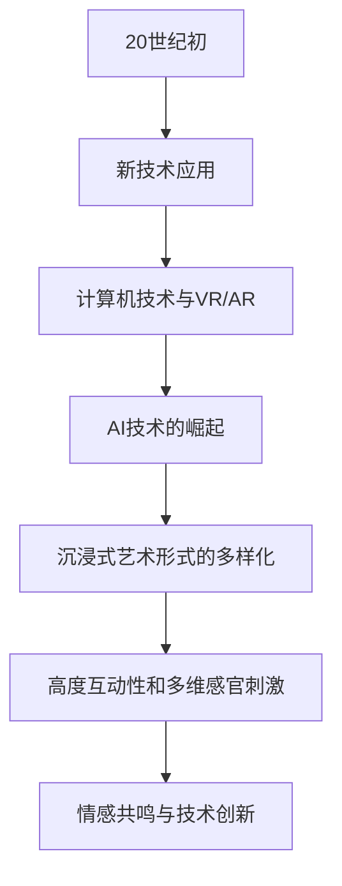

                 

### 沉浸式艺术：AI驱动的创作与欣赏

#### 关键词：
- 沉浸式艺术
- AI驱动
- 内容生成
- 交互体验
- 虚拟现实
- 增强现实

#### 摘要：
本文将探讨沉浸式艺术的本质及其发展历史，重点介绍AI技术在沉浸式艺术创作和欣赏中的应用。我们将一步步解析AI的核心算法，如生成对抗网络（GAN）和变分自编码器（VAE），并探讨它们如何助力沉浸式艺术创作。随后，我们将探讨沉浸式艺术的创作方法，包括艺术元素设计和技术工具的使用。最后，我们将分析沉浸式艺术的欣赏与评价方法，展望其产业发展和未来趋势。通过案例研究，我们将深入了解沉浸式艺术在现实世界中的应用。

## 第一部分: 沉浸式艺术基础

### 第1章: 沉浸式艺术的定义与概述

#### 1.1 沉浸式艺术的概念

沉浸式艺术是一种通过利用多种感官刺激，如视觉、听觉、触觉和嗅觉等，将观众融入艺术作品中的艺术形式。它强调观众与艺术作品之间的互动和共鸣，让观众在体验过程中感受到深度和情感。与传统艺术形式相比，沉浸式艺术更加注重观众的参与感和沉浸感。

#### 1.2 沉浸式艺术的发展历史

沉浸式艺术的发展可以追溯到20世纪初期。当时，艺术家们开始尝试利用新的技术，如电影、电视和多媒体，来创造更加互动和沉浸的艺术体验。随着计算机技术和虚拟现实（VR）技术的不断发展，沉浸式艺术逐渐成为一种独立的艺术形式。近年来，随着增强现实（AR）和人工智能（AI）技术的崛起，沉浸式艺术的应用范围进一步扩大。

#### 1.3 沉浸式艺术的特点

1. **高度互动性**：沉浸式艺术鼓励观众积极参与，通过互动体验来感受和解读艺术作品。
2. **多维感官刺激**：除了视觉和听觉，沉浸式艺术还可以通过触觉、嗅觉等感官来增强观众的体验。
3. **情感共鸣**：沉浸式艺术通过强烈的情感共鸣，使观众更加深入地理解艺术作品，并产生强烈的情感体验。
4. **技术融合**：沉浸式艺术通常融合了多种技术，如虚拟现实、增强现实、人工智能等，以创造出独特的艺术体验。

#### 1.4 沉浸式艺术的形式分类

沉浸式艺术可以根据其应用技术和艺术形式进行分类：

1. **虚拟现实艺术**：通过虚拟现实技术，观众可以在一个完全虚构的三维世界中互动和探索。
2. **增强现实艺术**：通过增强现实技术，观众可以在现实世界中看到虚拟元素，并与它们进行互动。
3. **交互式多媒体艺术**：结合多种多媒体技术，如视频、音频、图像和动画等，创造出互动性的艺术作品。
4. **装置艺术**：利用物理装置和空间布局，让观众在真实环境中感受到艺术的魅力。

### 总结

沉浸式艺术通过多种感官刺激和互动体验，为观众提供了一种全新的艺术体验。它的发展历史和特点展示了艺术与技术的紧密结合，而AI技术的引入进一步推动了沉浸式艺术的创新和发展。

#### Mermaid 流程图：沉浸式艺术的发展历程

### 1.1 沉浸式艺术的概念

沉浸式艺术（Immersive Art）是一种通过环境设计、多媒体技术、虚拟现实（VR）、增强现实（AR）和人工智能（AI）等技术手段，将观众完全融入艺术体验中的艺术形式。它不同于传统艺术，如绘画、雕塑等，沉浸式艺术强调观众的互动性和参与性，让观众不仅仅是一个被动的欣赏者，而是成为艺术过程的一部分。

**概念解析**：

1. **环境设计**：通过精心设计的环境和场景，让观众在视觉、听觉、触觉等多个感官上都能感受到艺术作品的氛围和意境。
2. **多媒体技术**：结合视频、音频、图像和动画等多媒体元素，创造出丰富的艺术表现形式。
3. **虚拟现实（VR）**：利用VR技术，观众可以进入一个完全虚构的三维世界，与虚拟环境进行互动。
4. **增强现实（AR）**：通过AR技术，虚拟元素与现实环境相结合，观众可以在现实世界中看到虚拟的艺术作品，并与它们互动。
5. **人工智能（AI）**：AI技术被广泛应用于沉浸式艺术中，如内容生成、交互体验和情感共鸣等方面。

**沉浸式艺术的本质**：

沉浸式艺术的本质在于它打破了传统艺术与观众之间的界限，将观众融入艺术体验中，使艺术不再仅仅是观看，而是成为一种参与和互动的活动。它通过多种技术手段，创造出一个多维度的艺术空间，让观众在其中沉浸、探索和体验。

**与传统艺术的区别**：

与传统的静态艺术形式相比，沉浸式艺术更加动态和互动。传统艺术通常是单一的感官体验，而沉浸式艺术则通过多维感官刺激，提供了一种更加全面和深刻的体验。此外，沉浸式艺术更加强调观众的情感共鸣和参与感，使艺术成为一种共同体验。

### 1.2 沉浸式艺术的发展历史

沉浸式艺术的发展可以追溯到20世纪初期，当时的艺术家们开始尝试利用新技术来创造更加互动和沉浸的艺术体验。以下是一些关键节点和事件：

1. **20世纪初**：艺术家们开始探索电影、电视和多媒体等新形式，试图打破传统艺术与观众的界限。这些新技术为沉浸式艺术的发展奠定了基础。

2. **20世纪80年代**：随着计算机技术的发展，艺术家们开始使用计算机和软件来创作艺术作品。计算机图形学和虚拟现实技术在这一时期取得了显著进展，为沉浸式艺术的发展提供了更多可能性。

3. **21世纪初**：虚拟现实（VR）和增强现实（AR）技术的兴起，使沉浸式艺术进入了一个新的阶段。VR技术提供了完全虚拟的三维环境，而AR技术则将虚拟元素融入现实世界，观众可以在真实环境中体验到艺术作品。

4. **2010年代**：随着智能手机和平板电脑的普及，增强现实（AR）技术得到了广泛应用。许多应用程序和游戏开始利用AR技术，创造出新的艺术体验。

5. **2020年代**：人工智能（AI）技术的崛起，进一步推动了沉浸式艺术的发展。AI技术被用于内容生成、交互体验和情感共鸣等方面，使沉浸式艺术更加丰富和多样化。

**发展历程总结**：

从早期的电影、电视到计算机图形学和虚拟现实技术，再到现在的增强现实和人工智能，沉浸式艺术的发展历程体现了技术与艺术的深度融合。每一个关键节点都为沉浸式艺术的发展带来了新的可能性，使其不断演变和进步。

### 1.3 沉浸式艺术的特点

沉浸式艺术以其独特的方式改变了传统艺术的体验方式，其特点如下：

1. **高度互动性**：沉浸式艺术强调观众与艺术作品之间的互动。观众不仅是被动的接受者，而是通过互动来探索、体验和解读艺术作品。

2. **多维感官刺激**：通过视觉、听觉、触觉和嗅觉等多种感官刺激，沉浸式艺术提供了丰富和深刻的体验。观众可以在多个感官层面上感受到艺术作品的魅力。

3. **情感共鸣**：沉浸式艺术通过强烈的情感共鸣，使观众更加深入地理解艺术作品。艺术作品中的情感元素与观众的情感产生共鸣，增强了观众的沉浸感和体验感。

4. **技术融合**：沉浸式艺术融合了多种技术，如虚拟现实（VR）、增强现实（AR）、人工智能（AI）、多媒体等。这些技术的结合为观众创造了一个多维度的艺术空间。

5. **参与感**：观众在沉浸式艺术中不仅仅是观看者，而是成为艺术过程的一部分。他们可以通过互动来改变艺术作品，甚至参与创作过程。

**实例**：

- **虚拟现实艺术展**：观众通过VR头盔进入一个虚拟的三维世界，与虚拟角色互动，探索艺术作品的不同角度。
- **增强现实游戏**：玩家在现实世界中看到虚拟元素，并通过移动和操作与虚拟世界互动。
- **交互式多媒体装置**：观众通过触摸屏幕或移动身体来控制多媒体艺术作品，创造出不同的视觉和声音效果。

通过这些实例，我们可以看到沉浸式艺术如何通过高度互动性、多维感官刺激、情感共鸣、技术融合和参与感等特点，为观众提供了一种全新的艺术体验。

### 1.4 沉浸式艺术的形式分类

沉浸式艺术的形式多样，根据其应用技术和表现形式，可以划分为以下几类：

1. **虚拟现实艺术**：虚拟现实（VR）艺术通过计算机技术创造出完全虚构的三维环境，让观众进入一个虚拟世界。观众可以在这个虚拟环境中自由探索、互动，甚至改变环境。

   - **特点**：完全虚拟的三维环境、高度互动性、丰富的视觉和听觉体验。
   - **应用场景**：虚拟现实博物馆、虚拟现实游戏、虚拟现实艺术展览等。

2. **增强现实艺术**：增强现实（AR）艺术通过在现实世界中叠加虚拟元素，让观众可以看到虚拟艺术作品并与它们互动。AR艺术通常通过智能手机或平板电脑的摄像头实现。

   - **特点**：虚拟元素与现实世界的结合、互动性、增强现实效果。
   - **应用场景**：AR游戏、AR广告、AR艺术展览等。

3. **交互式多媒体艺术**：交互式多媒体艺术结合了视频、音频、图像和动画等多媒体元素，通过互动性让观众参与艺术作品的创作和展示。

   - **特点**：多媒体元素的互动性、动态性、观众参与感。
   - **应用场景**：互动式展览、互动式音乐表演、交互式装置艺术等。

4. **装置艺术**：装置艺术通过物理装置和空间布局，创造出一种特定的艺术体验。观众可以在真实环境中与艺术装置互动，感受艺术作品的氛围和意境。

   - **特点**：物理装置的互动性、空间布局的独特性、沉浸式体验。
   - **应用场景**：艺术装置展览、公共场所的艺术装置、户外艺术展览等。

每种形式都有其独特的特点和适用场景，但它们共同的目标都是通过技术和互动性，为观众提供一种全新的艺术体验。

## 第二部分：AI在沉浸式艺术中的应用

### 第2章：AI在沉浸式艺术中的应用

#### 2.1 AI驱动的内容生成

人工智能技术在沉浸式艺术中的应用，首先体现在内容生成的领域。通过生成对抗网络（GAN）和变分自编码器（VAE）等算法，AI能够自动生成高质量的艺术内容，为艺术家提供丰富的创作素材。

#### 2.1.1 生成对抗网络（GAN）

##### 2.1.1.1 GAN的架构

生成对抗网络（GAN）由两部分组成：生成器（Generator）和判别器（Discriminator）。生成器的任务是生成逼真的艺术内容，而判别器的任务是区分生成的内容和真实内容。这两部分在对抗训练过程中相互竞争，使生成器不断提高生成质量。

- **生成器**：生成器接收随机噪声作为输入，通过一系列神经网络变换生成艺术内容。其目标是生成尽可能逼真的图像、音乐或视频。
- **判别器**：判别器接收真实内容和生成内容，通过对比判断其真实性。其目标是提高对真实内容的辨别能力。

##### 2.1.1.2 GAN的训练过程

GAN的训练过程是通过对生成器和判别器的反复对抗训练实现的。具体步骤如下：

1. **初始化**：初始化生成器和判别器的参数。
2. **生成器训练**：生成器接收随机噪声，生成艺术内容。判别器对生成内容和真实内容进行判断。
3. **判别器训练**：判别器根据生成内容和真实内容的判断结果，更新自己的参数。
4. **生成器更新**：生成器根据判别器的反馈，调整自己的参数，以生成更逼真的艺术内容。
5. **重复迭代**：不断重复上述步骤，使生成器和判别器逐步提高性能。

##### 2.1.1.3 GAN的应用场景

GAN在沉浸式艺术中有着广泛的应用场景，包括但不限于：

- **图像生成**：生成逼真的艺术图像，为艺术家提供创作灵感。
- **音乐生成**：生成旋律和音乐片段，为沉浸式艺术提供背景音乐。
- **视频合成**：合成真实场景与虚拟元素，创造出独特的视觉效果。

**实例**：

- **艺术图像生成**：利用GAN生成逼真的油画作品，艺术家可以从中获取创作灵感。
- **音乐生成**：AI生成独特的音乐片段，为沉浸式艺术提供个性化的背景音乐。
- **视频合成**：将虚拟角色融入真实场景中，创造出独特的电影特效。

#### 2.1.2 变分自编码器（VAE）

##### 2.1.2.1 VAE的架构

变分自编码器（VAE）是一种基于概率模型的生成模型。它由编码器和解码器组成，编码器将输入数据压缩成一个低维表示，解码器则将这个低维表示还原为原始数据。

- **编码器**：编码器接收输入数据，通过一系列神经网络变换，将其压缩成一个低维的潜在空间表示。
- **解码器**：解码器接收编码器输出的潜在空间表示，通过反向神经网络变换，将其还原为原始数据。

##### 2.1.2.2 VAE的训练过程

VAE的训练过程主要包括两个部分：编码器和解码器的训练。具体步骤如下：

1. **编码器训练**：编码器接收输入数据，通过神经网络变换将其压缩成一个低维潜在空间表示。
2. **解码器训练**：解码器接收编码器输出的潜在空间表示，通过反向神经网络变换将其还原为原始数据。
3. **损失函数**：VAE的训练过程中使用损失函数来评估生成数据的质量，并优化编码器和解码器的参数。

##### 2.1.2.3 VAE的应用场景

VAE在沉浸式艺术中的应用场景包括：

- **图像生成**：生成高质量的图像，为艺术家提供创作素材。
- **图像修复**：修复损坏或模糊的图像，恢复其原始面貌。
- **风格迁移**：将一种艺术风格应用到另一张图像上，创造出独特的视觉效果。

**实例**：

- **图像生成**：利用VAE生成高质量的抽象艺术作品，艺术家可以从中获取灵感。
- **图像修复**：利用VAE修复老照片，恢复其清晰度。
- **风格迁移**：将印象派风格应用到一张现代照片上，创造出独特的视觉效果。

#### 总结

AI驱动的内容生成技术，如GAN和VAE，为沉浸式艺术提供了丰富的创作素材和工具。这些技术通过自动生成逼真的图像、音乐和视频，为艺术家提供了更多的创作可能性。随着AI技术的不断进步，沉浸式艺术的内容生成将变得更加智能和多样化。

#### 2.1.1 GAN的应用场景

生成对抗网络（GAN）凭借其强大的生成能力和多样性，在沉浸式艺术领域得到了广泛应用。以下是一些典型的应用场景：

1. **图像生成与修复**：
   - **艺术作品创作**：艺术家可以利用GAN生成独特的绘画作品，甚至模仿历史上著名画家的风格，创造出新的艺术风格。
   - **图像修复**：GAN能够修复损坏或模糊的图像，恢复其原始面貌，这对于历史文物和艺术品保护具有重要意义。

2. **音乐创作与风格迁移**：
   - **音乐生成**：GAN可以生成旋律和音乐片段，为沉浸式艺术提供个性化的背景音乐。
   - **风格迁移**：将一种音乐风格应用到另一段音乐上，创造出独特的音乐体验。

3. **视频合成**：
   - **虚拟角色与真实场景合成**：GAN可以将虚拟角色或元素无缝地融合到真实场景中，创造出电影级别的视觉效果。
   - **视频内容增强**：GAN可以增强视频内容的清晰度和质量，提升观众的沉浸感。

4. **三维物体生成与建模**：
   - **三维模型创作**：GAN可以自动生成高质量的三维模型，为设计师和艺术家提供丰富的创作素材。
   - **虚拟现实与增强现实内容生成**：GAN生成的三维模型可以用于VR/AR应用，创造出逼真的虚拟环境。

**实例分析**：

- **艺术图像生成**：一个著名的案例是使用GAN生成的“人脸艺术”。通过输入一些随机噪声，GAN能够生成具有不同风格和特征的人脸图像，艺术家可以利用这些图像进行创作。
- **音乐生成**：AI公司Jukedeck利用GAN生成个性化的音乐片段，这些音乐片段可以根据用户的情感和喜好进行定制。
- **视频合成**：电影《无限恐怖》使用了GAN技术，将虚拟角色无缝融合到真实场景中，创造出令人惊叹的视觉效果。

通过这些实例，我们可以看到GAN在沉浸式艺术中的应用不仅提升了创作效率，也开创了全新的艺术表现形式。

#### 2.1.2 VAE的应用场景

变分自编码器（VAE）由于其强大的生成能力和灵活的建模能力，在沉浸式艺术领域也有许多重要的应用场景：

1. **图像生成**：
   - **抽象艺术创作**：VAE可以生成独特的抽象图像，为艺术家提供丰富的创作灵感。
   - **图像风格迁移**：VAE可以将一种艺术风格应用到其他图像上，创造出独特的视觉效果。

2. **图像修复**：
   - **老照片修复**：VAE可以修复由于时间磨损而变得模糊或损坏的老照片，恢复其原有的清晰度。
   - **图像增强**：VAE可以增强图像的细节，提高图像的质量。

3. **风格迁移与艺术变形**：
   - **艺术风格迁移**：VAE可以将一种艺术风格（如印象派、抽象画）迁移到其他图像上，创造出新的艺术作品。
   - **图像变形**：VAE可以在保持图像内容不变的情况下，改变其风格和形态。

4. **数据压缩与去噪**：
   - **数据压缩**：VAE可以有效地压缩图像数据，减少存储空间并加快数据传输。
   - **图像去噪**：VAE可以去除图像中的噪声，提高图像的清晰度和质量。

**实例分析**：

- **图像生成**：一个著名的应用是使用VAE生成具有不同纹理和颜色的抽象艺术作品。艺术家可以将这些作品作为创作的基础，创造出全新的艺术形式。
- **图像修复**：例如，使用VAE修复老照片的案例中，一张模糊的老照片经过VAE的处理后，细节变得清晰，色彩恢复鲜艳。
- **风格迁移**：一个实际案例是将一张普通照片通过VAE处理，应用梵高风格的图案，创造出一张充满艺术感的作品。

通过这些实例，我们可以看到VAE在沉浸式艺术中的应用不仅提升了创作效率，也为艺术家提供了更多的创作可能性。

### 2.2 AI驱动的交互体验

AI在沉浸式艺术中的应用不仅限于内容生成，还极大地提升了交互体验，使其更加智能化和个性化。计算机视觉、自然语言处理和语音识别等AI技术的结合，为观众带来了全新的沉浸式体验。

#### 2.2.1 计算机视觉与识别技术

##### 2.2.1.1 卷积神经网络（CNN）

卷积神经网络（CNN）是计算机视觉领域的重要技术，其独特的结构使其在图像识别和物体检测方面表现出色。CNN的核心在于其多层卷积和池化操作，这些操作可以自动提取图像中的特征。

- **卷积层**：卷积层通过滑动卷积核在图像上提取局部特征，如边缘和纹理。
- **池化层**：池化层对卷积层输出的特征进行压缩，减少参数数量，提高模型效率。
- **全连接层**：全连接层将卷积层和池化层提取的特征映射到分类结果。

**CNN的训练过程**：

1. **初始化**：初始化模型参数。
2. **前向传播**：输入图像，通过卷积层和池化层提取特征，最后通过全连接层输出分类结果。
3. **反向传播**：计算损失函数，通过梯度下降法更新模型参数。
4. **迭代训练**：重复上述步骤，直到模型达到预期的性能。

**CNN的应用场景**：

- **图像识别**：例如，识别图片中的物体、场景或面部。
- **目标检测**：例如，在视频流中实时检测和跟踪运动目标。

##### 2.2.1.2 目标检测与跟踪

目标检测和跟踪是计算机视觉中的重要任务，通过识别图像中的目标对象并进行实时跟踪，为沉浸式艺术提供了丰富的互动可能性。

- **目标检测**：通过检测图像中的目标对象，如人物、动物或物体，确定其在图像中的位置和属性。
- **目标跟踪**：在视频流中持续跟踪目标对象，即使目标对象在图像中发生遮挡或变换。

**目标检测与跟踪的应用场景**：

- **交互式展览**：通过目标检测和跟踪，观众可以在虚拟环境中与虚拟角色互动。
- **AR游戏**：实时识别和跟踪观众的动作，实现与虚拟元素的互动。

##### 2.2.1.3 人脸识别与跟踪

人脸识别与跟踪是计算机视觉领域的重要应用，通过识别和跟踪人脸，可以为沉浸式艺术提供个性化的交互体验。

- **人脸识别**：通过比对图像中的人脸特征，识别特定的人脸。
- **人脸跟踪**：在视频流中持续跟踪人脸的位置和姿态。

**人脸识别与跟踪的应用场景**：

- **个性化互动**：根据识别到的人脸，提供个性化的交互内容和体验。
- **安全监控**：在公共场所进行人脸识别和跟踪，提高安全性。

#### 2.2.2 自然语言处理与语音识别

##### 2.2.2.1 语言模型与文本生成

自然语言处理（NLP）中的语言模型用于生成文本和语音，为沉浸式艺术提供智能对话和交互体验。

- **语言模型**：通过大量文本数据训练得到的模型，可以预测下一个单词或短语。
- **文本生成**：基于语言模型，生成连贯、自然的文本。

**语言模型与文本生成的应用场景**：

- **智能对话系统**：为沉浸式艺术提供智能对话能力，与观众进行自然交流。
- **故事生成**：生成基于特定主题或情境的故事，为沉浸式艺术提供内容。

##### 2.2.2.2 语音识别与合成

语音识别与合成是NLP中的重要技术，通过识别用户的语音并生成相应的文本或语音，实现语音交互。

- **语音识别**：将语音转换为文本，用于理解和执行用户的指令。
- **语音合成**：将文本转换为自然的语音输出，用于交互和反馈。

**语音识别与合成的应用场景**：

- **语音控制**：观众可以通过语音控制虚拟角色或环境。
- **语音导航**：在沉浸式艺术展览中，提供语音导航和讲解。

### 总结

计算机视觉、自然语言处理和语音识别等技术，为沉浸式艺术带来了丰富的互动体验。通过目标检测、人脸识别、语音识别等技术的应用，观众可以与沉浸式艺术作品进行互动，创造出更加个性化和沉浸的体验。

#### 2.2.1.1 卷积神经网络（CNN）

卷积神经网络（Convolutional Neural Network，CNN）是计算机视觉领域的一种强大模型，特别适用于图像识别和物体检测任务。其独特的结构使其能够自动提取图像中的特征，为沉浸式艺术提供关键支持。

##### CNN的架构

CNN的核心在于其卷积层、池化层和全连接层的组合。下面简要介绍每个部分的功能：

1. **卷积层**：卷积层通过卷积运算提取图像中的局部特征。每个卷积核（filter）在图像上滑动，并计算局部特征的加权和，然后通过激活函数（如ReLU）增加非线性。
2. **池化层**：池化层对卷积层的输出进行压缩，减少参数数量，提高模型效率。常见的池化操作有最大池化和平均池化，它们在局部区域选择最大或平均值作为输出。
3. **全连接层**：全连接层将卷积层和池化层提取的特征映射到最终的分类结果。在这个阶段，特征被展平为一维向量，然后通过一系列全连接层进行分类。

##### CNN的工作原理

CNN的工作原理可以概括为以下步骤：

1. **输入层**：输入层接收图像数据，并将其传递给卷积层。
2. **卷积运算**：卷积层通过卷积运算提取图像的局部特征，生成特征图（feature map）。
3. **激活函数**：通过激活函数增加非线性，使模型能够学习到更加复杂的特征。
4. **池化操作**：池化层对卷积层的输出进行压缩，减少参数数量。
5. **特征融合**：多个卷积层和池化层的特征图被融合，形成更高层次的特征。
6. **分类层**：全连接层将高层次的特征映射到分类结果，通过softmax函数输出概率分布。

##### CNN的训练过程

CNN的训练过程包括以下几个步骤：

1. **初始化**：初始化模型的参数，通常使用随机初始化方法。
2. **前向传播**：输入图像，通过卷积层和池化层提取特征，最后通过全连接层输出分类结果。
3. **计算损失**：计算实际输出与预测输出之间的损失，如交叉熵损失或均方误差。
4. **反向传播**：通过反向传播算法，计算损失关于模型参数的梯度，并更新模型参数。
5. **迭代训练**：重复上述步骤，直到模型达到预期的性能。

通过这种训练过程，CNN能够学习到图像中的特征，从而进行准确的分类和识别。

##### CNN在沉浸式艺术中的应用

CNN在沉浸式艺术中的应用非常广泛，主要包括以下几个方面：

1. **图像识别**：通过CNN，可以自动识别图像中的物体、场景和面部，为沉浸式艺术提供交互基础。例如，观众的面部表情可以通过CNN识别，从而触发不同的互动效果。
2. **物体检测**：CNN可以实时检测图像中的物体，并在视频流中跟踪这些物体的运动轨迹。这在虚拟现实（VR）和增强现实（AR）应用中尤为重要，例如，观众可以在虚拟环境中与检测到的物体互动。
3. **场景分类**：CNN可以分类图像中的场景，如室内、室外或特定环境。这种分类能力可以用于沉浸式展览的设计，为观众提供更加个性化的体验。

通过CNN的应用，沉浸式艺术可以创造出更加智能和互动的体验，使观众能够更加深入地参与到艺术作品中。

#### 2.2.1.2 目标检测与跟踪

目标检测和跟踪是计算机视觉中的两个重要任务，广泛应用于沉浸式艺术中，为观众提供丰富的互动体验。以下是对这两个任务的基本原理和实现方法的详细介绍：

##### 目标检测（Object Detection）

**基本原理**：

目标检测旨在识别图像中的特定对象，并标注它们的位置。目标检测通常包括以下几个步骤：

1. **特征提取**：使用卷积神经网络（如Faster R-CNN、YOLO或SSD）提取图像的特征。这些特征能够捕捉图像中的关键信息，如物体的形状、边缘和纹理。
2. **区域提议**：根据提取的特征，生成一系列区域提议（region proposals），每个提议表示可能包含目标的区域。这些提议可以通过选择性搜索（Selective Search）或区域建议网络（Region Proposal Network）生成。
3. **目标分类与定位**：对每个区域提议进行分类，判断其是否包含目标，并定位目标的精确位置。分类通常使用softmax函数，而定位则通过回归操作实现。

**实现方法**：

1. **基于区域提议的方法**：这类方法首先生成区域提议，然后对每个提议进行分类和定位。常用的网络结构包括Faster R-CNN、SSD和YOLO。
   - **Faster R-CNN**：Faster R-CNN结合了区域提议网络（RPN）和Fast R-CNN，通过RPN生成区域提议，Fast R-CNN进行分类和定位。
   - **SSD（You Only Look Once）**：SSD采用多尺度特征图进行目标检测，通过不同的锚点（anchor）预测目标的位置和类别。
   - **YOLO（You Only Look Once）**：YOLO将目标检测过程转化为一个单阶段的目标检测框架，直接在特征图上预测目标的位置和类别。

2. **基于锚点的方法**：这类方法预先定义一系列锚点，每个锚点表示一个潜在的目标位置。通过网络对锚点进行分类和定位。
   - **RetinaNet**：RetinaNet引入了Focal Loss，缓解了正负样本不平衡问题，提高了小目标和密集目标的检测性能。

**应用场景**：

- **交互式展览**：在沉浸式展览中，通过目标检测，观众可以与虚拟角色或物体进行互动。例如，观众可以通过手势或面部表情触发不同的互动效果。
- **AR游戏**：在增强现实游戏中，目标检测用于识别现实世界中的物体，将其作为虚拟场景的一部分。玩家可以通过与现实世界的物体互动，获得更加沉浸的体验。

##### 目标跟踪（Object Tracking）

**基本原理**：

目标跟踪是在视频流中持续跟踪特定对象的过程。目标跟踪通常包括以下几个步骤：

1. **初始检测**：在视频的第一帧中，使用目标检测算法检测并定位目标。
2. **状态估计**：使用运动模型（如卡尔曼滤波器或粒子滤波器）对目标的运动状态进行估计。
3. **数据关联**：将当前帧中的候选目标与先前帧中的目标进行关联，确定哪个候选目标是真正的目标。
4. **更新状态**：根据候选目标的位置和属性，更新目标的运动状态。

**实现方法**：

1. **基于轨迹的方法**：这类方法通过构建轨迹模型来跟踪目标。常用的轨迹模型包括卡尔曼滤波器（Kalman Filter）和粒子滤波器（Particle Filter）。
   - **卡尔曼滤波器**：卡尔曼滤波器是一种线性方法，通过预测和更新目标的状态，实现目标的跟踪。
   - **粒子滤波器**：粒子滤波器是一种非线性方法，通过大量随机样本来估计目标的状态，实现更加准确的跟踪。

2. **基于关联的方法**：这类方法通过比较当前帧中的候选目标与先前帧中的目标，确定目标的位置和运动轨迹。常用的关联算法包括匈牙利算法（Hungarian Algorithm）和最近邻算法（Nearest Neighbor Algorithm）。

**应用场景**：

- **交互式展览**：在沉浸式展览中，通过目标跟踪，可以持续跟踪观众的位置和运动，提供更加个性化的互动体验。
- **AR导航**：在增强现实导航中，通过目标跟踪，可以实时跟踪用户的位置和方向，提供准确的导航信息。

通过目标检测和跟踪的结合，沉浸式艺术可以创造出更加智能和互动的体验，使观众能够更加深入地参与到艺术作品中。

#### 2.2.1.3 人脸识别与跟踪

人脸识别与跟踪技术在沉浸式艺术中扮演着重要角色，通过识别和跟踪观众的面部，可以为艺术作品提供个性化的互动体验。以下是对人脸识别与跟踪技术的基本原理和实现方法的详细解析。

##### 人脸识别（Face Recognition）

**基本原理**：

人脸识别是通过计算机技术自动识别和验证人脸的技术。其核心在于人脸特征提取和匹配。人脸识别的基本步骤如下：

1. **人脸检测**：首先，利用人脸检测算法（如Haar特征分类器、MTCNN等）从图像或视频流中检测出人脸区域。
2. **特征提取**：对于每个检测到的人脸，提取其特征向量。常见的特征提取方法包括基于深度学习的模型（如VGGFace、Facenet等）。
3. **特征匹配**：将提取到的特征向量与数据库中的人脸特征进行比较，计算匹配度，确定身份。

**实现方法**：

1. **基于特征的方法**：这类方法通过提取人脸特征向量并进行匹配。常用的特征提取模型包括深度卷积神经网络（如ResNet、Inception等）和Siamese网络。
   - **深度学习模型**：深度学习模型通过大量人脸数据训练，能够提取出高维的特征向量，这些特征向量在相同人脸之间具有高相似度，而在不同人脸之间具有低相似度。
   - **Siamese网络**：Siamese网络是一种特殊的卷积神经网络，用于比较两个输入图像的相似度。通过训练，Siamese网络能够学习到人脸特征之间的差异，从而实现人脸识别。

2. **基于模型的方法**：这类方法使用预训练的模型进行人脸识别，如OpenCV和Face++等开源库提供了高效的人脸识别功能。

**应用场景**：

- **个性化互动**：在沉浸式艺术展览中，通过人脸识别，可以为不同观众提供个性化的互动内容和体验，如定制化的艺术作品和故事情节。
- **安全监控**：在公共场所，人脸识别可以用于身份验证和安全管理，提高安全性。

##### 人脸跟踪（Face Tracking）

**基本原理**：

人脸跟踪是在视频流中持续跟踪人脸位置和姿态的过程。人脸跟踪的步骤包括：

1. **人脸检测**：在视频的每一帧中，使用人脸检测算法检测人脸。
2. **姿态估计**：利用关键点检测算法（如Dlib、OpenPose等），在检测到的人脸上定位关键点，如眼睛、鼻子和嘴巴。
3. **运动估计**：通过运动模型（如卡尔曼滤波器、粒子滤波器等），估计人脸在连续帧中的位置和姿态。

**实现方法**：

1. **基于关键点的跟踪方法**：这类方法通过检测人脸上的关键点来实现跟踪。常用的关键点检测算法包括Dlib和OpenPose。
   - **Dlib**：Dlib是一个开源的机器学习库，提供了基于深度学习的人脸关键点检测算法。Dlib的人脸检测器具有较高的准确性和速度。
   - **OpenPose**：OpenPose是一个开源的人体姿态估计库，可以同时检测人脸和其他人体部位的关键点。通过关键点位置的变化，可以跟踪人脸在视频流中的运动。

2. **基于模型的跟踪方法**：这类方法使用预训练的模型进行人脸跟踪。例如，OpenCV和MediaPipe等库提供了人脸跟踪功能。

**应用场景**：

- **交互式展览**：在沉浸式艺术展览中，通过人脸跟踪，可以实时跟踪观众的面部表情和姿态，触发不同的互动效果，如面部识别游戏和表情艺术。
- **虚拟现实（VR）**：在VR应用中，通过人脸跟踪，可以同步观众的面部表情和动作，提高虚拟角色的真实感和互动性。

通过人脸识别与跟踪技术的应用，沉浸式艺术可以提供更加个性化和沉浸的互动体验，使观众能够更加深入地参与到艺术作品中。

#### 2.2.2 自然语言处理与语音识别

自然语言处理（Natural Language Processing，NLP）和语音识别（Speech Recognition）技术在沉浸式艺术中发挥着重要作用，为观众提供了智能对话和语音交互的能力。以下是对这些技术的详细讲解。

##### 语言模型与文本生成

**基本原理**：

语言模型（Language Model，LM）是NLP的核心组件，它用于预测文本序列。语言模型通过分析大量文本数据，学习语言的结构和规律，从而生成连贯、自然的文本。

1. **文本生成**：语言模型可以生成基于特定主题或情境的文本。例如，给定一个故事的开头，语言模型可以预测接下来的情节和对话。
2. **语言模型类型**：
   - **n-gram模型**：n-gram模型是基于统计的模型，它通过计算词序列的频率来预测下一个词。例如，给定前两个词“the dog”，n-gram模型可以预测下一个词是“jumps”的概率。
   - **神经网络语言模型**：神经网络语言模型（如循环神经网络RNN、长短期记忆LSTM和Transformer）通过学习词序列的上下文信息，生成更加连贯的文本。Transformer模型由于其并行计算的能力，在文本生成任务中表现尤为出色。

**应用场景**：

- **智能对话系统**：在沉浸式艺术展览中，语言模型可以用于创建智能对话系统，与观众进行自然交流。例如，观众可以与虚拟角色进行对话，获取有关艺术作品的信息。
- **故事生成**：语言模型可以生成基于特定主题或情境的故事，为沉浸式艺术提供丰富的内容。

##### 语音识别与合成

**基本原理**：

语音识别（Speech Recognition）是将语音信号转换为文本的技术，而语音合成（Text-to-Speech，TTS）则是将文本转换为自然的语音输出。两者结合，可以实现语音交互。

1. **语音识别**：语音识别过程包括以下步骤：
   - **声学模型**：声学模型学习语音信号中的声学特征，如音素和音节。
   - **语言模型**：语言模型用于理解语音信号中的语义信息，将声学特征映射到正确的单词和短语。
   - **解码器**：解码器将声学特征和语言模型的信息结合，生成文本。

2. **语音合成**：语音合成过程包括以下步骤：
   - **文本预处理**：对输入文本进行预处理，如分词、标点符号处理。
   - **声学建模**：声学建模生成语音信号，通常使用合成引擎（如Unit Selection Synthesis、HMM-GMM和WaveNet）。
   - **语音合成**：将生成的语音信号合成成自然的语音输出。

**应用场景**：

- **语音控制**：观众可以通过语音控制虚拟角色或环境，实现更加便捷的交互。
- **语音导航**：在沉浸式艺术展览中，语音导航可以提供实时讲解和指引，增强观众的体验。
- **语音交互**：通过语音识别和合成技术，沉浸式艺术可以提供语音交互功能，如智能问答、语音故事讲述等。

##### 综合应用

自然语言处理与语音识别技术在沉浸式艺术中的应用案例丰富，以下是一些具体实例：

1. **智能问答系统**：观众可以通过语音提问，系统通过语音识别理解问题，然后使用语言模型生成回答，通过语音合成输出。
2. **语音互动艺术展**：展览中设置多个语音互动点，观众通过语音与虚拟角色互动，获取艺术作品背后的故事和创作灵感。
3. **虚拟现实导游**：在VR展览中，语音识别和合成为观众提供实时讲解，帮助他们更好地理解展品和展览主题。

通过自然语言处理与语音识别技术的应用，沉浸式艺术可以创造出更加智能和互动的体验，使观众能够更加深入地参与到艺术作品中。

### 第3章：沉浸式艺术的创作方法

沉浸式艺术的创作是一个复杂且多层次的过程，它涉及到创意构思、艺术元素设计和技术工具的使用。在这一章节中，我们将详细探讨沉浸式艺术的创作流程，包括脚本编写与剧情规划，以及艺术元素设计等方面。

#### 3.1 创作流程概述

沉浸式艺术的创作流程可以分为以下几个主要阶段：

1. **创意构思**：在这个阶段，艺术家和创意团队需要确定艺术作品的主题、风格和目标观众。创意构思的过程通常包括头脑风暴、灵感收集和初步设计。
   
2. **脚本编写与剧情规划**：在这个阶段，创作者需要编写详细的脚本，规划艺术作品的故事情节、角色和互动流程。脚本编写是一个反复迭代的过程，需要不断调整和完善。

3. **艺术元素设计**：包括场景设计、角色设计、音效和配乐设计等。艺术元素设计需要与脚本和剧情紧密配合，以创造出一个连贯且吸引人的沉浸式体验。

4. **技术实现**：在这个阶段，创作者需要选择合适的技术工具和平台，实现艺术作品。技术实现包括虚拟现实（VR）、增强现实（AR）、人工智能（AI）等多方面的应用。

5. **测试与优化**：在艺术作品完成之后，进行测试和优化，确保其稳定性和用户体验。测试过程中需要收集用户反馈，并根据反馈进行改进。

#### 3.1.1 脚本编写与剧情规划

脚本编写与剧情规划是沉浸式艺术创作的重要环节，它决定了艺术作品的叙事结构和互动流程。

**脚本编写**：

1. **故事大纲**：首先需要编写故事大纲，确定艺术作品的主题、背景、情节发展和高潮。故事大纲是一个概要的概述，为整个艺术作品提供框架。
   
2. **角色设定**：在故事大纲的基础上，设定主要角色和配角，描述他们的性格、动机和目标。角色设定需要与故事情节紧密配合，使故事更加生动和有吸引力。

3. **对话编写**：编写角色的对话，确保对话自然、流畅且符合角色的性格。对话编写需要考虑观众的体验，使观众能够沉浸在故事中。

**剧情规划**：

1. **互动流程**：规划观众在艺术作品中的互动流程，包括观众如何与艺术作品互动，以及互动的具体方式。互动流程需要设计得有趣且有意义，以提高观众的参与度。

2. **剧情节奏**：确保故事情节的节奏合理，避免过于平淡或过于紧张。剧情节奏的把握对于观众的沉浸感至关重要。

3. **反馈机制**：设计适当的反馈机制，让观众能够看到自己的互动对艺术作品产生的影响。这种反馈机制可以增强观众的沉浸感和参与感。

#### 3.1.2 艺术元素设计

艺术元素设计是沉浸式艺术创作的重要组成部分，它直接影响到观众的艺术体验。

**场景设计**：

1. **环境布局**：设计艺术作品中的场景，包括室内和室外环境。环境布局需要与故事情节和主题相匹配，创造出一个沉浸式的氛围。

2. **细节处理**：在场景设计中，需要注重细节处理，如光影效果、材质表现和场景互动等。细节处理可以提升场景的真实感和沉浸感。

**角色设计**：

1. **外观设计**：为角色设计外观，包括面部特征、服饰和发型等。角色外观需要符合故事情节和角色的性格特点。

2. **行为设计**：设计角色的行为和动作，包括走路、说话、互动等。行为设计需要自然且符合角色的性格，以提高角色的真实感。

**音效与配乐设计**：

1. **音效设计**：为艺术作品设计音效，包括环境音效、角色音效和互动音效等。音效设计需要与场景和故事情节相匹配，创造出一个沉浸式的氛围。

2. **配乐设计**：为艺术作品设计配乐，包括背景音乐、角色音乐和互动音乐等。配乐设计需要与故事情节和角色情感相配合，增强观众的沉浸感。

通过脚本编写、剧情规划和艺术元素设计，创作者可以打造出一个引人入胜的沉浸式艺术作品，为观众带来独特的艺术体验。

### 3.2 创作工具与技术

在沉浸式艺术的创作过程中，选择合适的工具和技术至关重要。以下将介绍几种常用的创作工具和技术，包括Unity和Unreal Engine等游戏引擎，以及虚拟现实（VR）和增强现实（AR）技术。

#### 3.2.1 Unity与Unreal Engine

Unity和Unreal Engine是目前最流行的游戏引擎，广泛应用于沉浸式艺术创作。

##### Unity

**安装与基本操作**：

1. **安装**：首先，从Unity官网下载Unity Hub并安装。安装完成后，可以通过Unity Hub下载并安装Unity编辑器。
2. **基本操作**：
   - **创建项目**：在Unity Hub中创建一个新的Unity项目。
   - **场景编辑**：使用Unity编辑器中的场景视图（Scene View）来布置和编辑场景。
   - **资产管理**：使用Unity编辑器中的资产管理工具（Asset Manager）来管理项目中的资源和文件。

**应用实例**：

- **虚拟现实艺术展**：利用Unity的VR插件，创建一个虚拟现实艺术展览，观众可以通过VR头盔进入展览空间，与艺术作品互动。
- **交互式多媒体装置**：通过Unity的交互功能，设计一个互动式多媒体装置，如一个互动式触摸屏，观众可以通过触摸屏幕来控制多媒体内容。

##### Unreal Engine

**安装与基本操作**：

1. **安装**：从Unreal Engine官网下载Unreal Engine编辑器并进行安装。
2. **基本操作**：
   - **创建项目**：在Unreal Engine编辑器中创建一个新的项目。
   - **蓝图系统**：使用Unreal Engine的蓝图系统（Blueprint System）进行可视化编程，无需编写代码即可创建复杂的交互逻辑。
   - **渲染设置**：配置渲染设置，优化场景的渲染效果，包括光照、阴影和纹理等。

**应用实例**：

- **增强现实游戏**：利用Unreal Engine的AR插件，开发一款增强现实游戏，玩家可以在现实世界中看到虚拟角色并与它们互动。
- **虚拟现实体验**：创建一个虚拟现实体验，如一个太空探险游戏，玩家可以通过VR头盔进入虚拟世界，探索太空。

#### 3.2.2 虚拟现实与增强现实技术

虚拟现实（VR）和增强现实（AR）技术是沉浸式艺术创作的重要工具，提供了丰富的互动和沉浸体验。

##### VR技术原理

**原理**：

1. **三维空间感知**：VR技术通过头戴式显示器（HMD）和位置追踪设备，将用户沉浸在虚拟的三维空间中。
2. **交互设备**：用户可以通过手柄、触觉手套或其他交互设备与虚拟环境进行交互。

**应用场景**：

- **虚拟现实艺术展**：创建一个虚拟艺术展，观众可以通过VR设备进入展览空间，与艺术作品互动。
- **虚拟现实游戏**：开发虚拟现实游戏，玩家可以在虚拟世界中进行探险、战斗等互动。

##### AR技术原理

**原理**：

1. **增强现实效果**：AR技术通过在现实世界中叠加虚拟元素，增强用户的感知体验。
2. **摄像头与传感器**：AR设备通过摄像头和传感器捕捉现实世界的图像和位置信息，然后叠加虚拟元素。

**应用场景**：

- **增强现实游戏**：开发增强现实游戏，玩家可以在现实世界中看到虚拟角色并与它们互动。
- **增强现实导航**：使用AR技术为用户提供导航信息，如地标指示和路径引导。

通过Unity、Unreal Engine等游戏引擎，以及VR和AR技术，创作者可以打造出丰富多样的沉浸式艺术作品，为观众提供独特的艺术体验。

### 3.2.2 虚拟现实与增强现实技术

虚拟现实（VR）和增强现实（AR）技术在沉浸式艺术创作中扮演着至关重要的角色，为艺术家提供了丰富的创作工具和手段。以下是这两种技术的原理及其在沉浸式艺术中的应用。

#### 虚拟现实技术原理

**原理**：

虚拟现实技术通过头戴式显示器（HMD）和位置追踪设备，将用户沉浸在一个完全虚拟的三维环境中。关键组成部分包括：

1. **头戴式显示器（HMD）**：HMD设备通过两个屏幕（或一个屏幕的双眼显示）模拟立体视觉，给用户带来沉浸感。常见的HMD设备包括Oculus Rift、HTC Vive和PlayStation VR等。

2. **位置追踪系统**：位置追踪设备用于检测用户的头动和身体运动，确保虚拟环境中的视角与用户的实际动作同步。常见的追踪设备包括外部传感器、内置惯性测量单元（IMU）等。

3. **交互设备**：用户可以通过手柄、触觉手套、虚拟键盘或其他交互设备与虚拟环境进行互动，增强沉浸感。

**应用场景**：

- **虚拟现实艺术展**：艺术家可以使用VR技术创建一个完全虚拟的艺术展，观众通过HMD设备进入展览空间，与虚拟艺术作品互动，如观看三维绘画、体验虚拟雕塑等。

- **虚拟现实游戏**：游戏开发者可以利用VR技术打造高度沉浸的游戏体验，玩家在虚拟世界中进行冒险、战斗、探索等互动活动。

#### 增强现实技术原理

**原理**：

增强现实技术通过在现实世界中叠加虚拟元素，增强用户的感知体验。关键组成部分包括：

1. **摄像头与传感器**：AR设备通过摄像头和传感器捕捉现实世界的图像和位置信息，然后叠加虚拟元素。常见的AR设备包括智能手机、平板电脑、头戴式显示器等。

2. **计算机视觉算法**：计算机视觉算法用于识别现实世界中的物体、地标或纹理，并确定其位置和方向。

3. **渲染引擎**：渲染引擎负责将虚拟元素渲染到现实世界中，使其与真实环境融合。

**应用场景**：

- **增强现实游戏**：开发者可以利用AR技术创建增强现实游戏，玩家可以在现实世界中看到虚拟角色、道具和场景，与它们进行互动。

- **增强现实导航**：AR技术可以为用户提供导航信息，如地标指示、路径引导和实时交通信息，使导航更加直观和便捷。

#### 应用实例

**虚拟现实艺术展**：

- **艺术展览**：艺术家可以使用Unity或Unreal Engine等游戏引擎创建虚拟艺术展览，通过VR设备展示三维艺术作品，观众可以自由移动、旋转和放大作品。

- **互动体验**：在VR艺术展中，观众可以与虚拟艺术作品互动，如点击按钮触发动画、与虚拟角色对话等，增强沉浸感和互动性。

**增强现实游戏**：

- **角色扮演游戏**：开发者可以利用AR技术创建角色扮演游戏，玩家在现实世界中可以看到虚拟角色和场景，通过智能手机或平板电脑的摄像头进行互动。

- **教育游戏**：AR技术可以应用于教育游戏，如历史模拟、科学实验等，通过虚拟元素增强学习体验。

通过VR和AR技术的应用，沉浸式艺术创作突破了传统艺术形式的局限，为艺术家和观众提供了更加丰富和多样的艺术体验。

### 第4章：沉浸式艺术的欣赏与评价

#### 4.1 欣赏方法

沉浸式艺术为观众提供了一种独特的欣赏体验，观众在欣赏过程中需要采用多种方法和技巧，以充分感受和解读艺术作品。

##### 4.1.1 感知与体验

1. **视觉感知**：观众需要仔细观察艺术作品中的视觉元素，如色彩、形状、线条和光影效果等。通过视觉感知，观众可以捕捉艺术作品的氛围和情感。
   
2. **听觉感知**：沉浸式艺术作品通常配备背景音乐和音效，观众需要留意音乐和音效的变化，它们往往能增强艺术作品的氛围和情感表达。

3. **触觉感知**：部分沉浸式艺术作品还包含触觉互动，观众可以通过触摸感受艺术作品的质感和温度，这种互动体验可以增强沉浸感。

4. **情感共鸣**：观众需要开放心态，将自己的情感融入艺术作品中，感受艺术作品所带来的情感冲击。通过情感共鸣，观众可以更加深入地理解艺术作品的主题和内涵。

##### 4.1.2 理解与分析

1. **艺术风格**：观众需要了解艺术作品的风格和流派，如现代艺术、抽象艺术、印象派等。不同的艺术风格往往有不同的表现形式和审美特征。

2. **艺术价值**：观众需要分析艺术作品的创作背景、主题和意义。通过了解艺术作品的历史背景和文化内涵，观众可以更好地理解艺术作品的深层含义。

3. **技术实现**：观众需要了解艺术作品所采用的技术手段，如虚拟现实（VR）、增强现实（AR）、人工智能（AI）等。技术实现往往决定了艺术作品的沉浸感和互动性。

4. **互动体验**：观众需要关注艺术作品中的互动元素，如观众与艺术作品的互动方式、互动流程和互动效果。互动体验的优劣直接影响到观众的沉浸感和参与度。

#### 4.2 评价标准

评价沉浸式艺术作品的标准可以从以下几个方面进行：

##### 4.2.1 形式美感

1. **视觉效果**：艺术作品的视觉效果包括色彩、形状、线条和光影等，它们共同构成了艺术作品的视觉冲击力。视觉效果的好坏直接影响到观众的感官体验。

2. **音乐与音效**：背景音乐和音效的质量对艺术作品的氛围营造和情感表达至关重要。优秀的音乐与音效能增强观众的沉浸感，提高艺术作品的整体品质。

##### 4.2.2 内容深度

1. **主题意义**：艺术作品的主题和意义是评价其内容深度的重要标准。具有深刻主题和丰富内涵的艺术作品往往能够引发观众的思考和共鸣。

2. **艺术风格**：艺术风格的选择和运用也反映了艺术家的创作水平和艺术造诣。独特的艺术风格可以为艺术作品带来新颖和独特的视觉体验。

3. **技术实现**：艺术作品的技术实现是评价其内容深度的一个重要方面。创新的技术应用可以使艺术作品更加丰富和多样化，提高观众的沉浸感和互动性。

##### 4.2.3 用户互动

1. **互动体验**：艺术作品中的互动体验是评价其用户互动性的关键。优秀的互动体验能够增强观众的参与感和互动性，提高艺术作品的趣味性和吸引力。

2. **用户反馈**：观众对艺术作品的反馈和评价也是评价其用户互动性的重要标准。积极和正面的用户反馈表明艺术作品受到了观众的认可和喜爱。

### 总结

沉浸式艺术的欣赏与评价需要观众采用多种方法和技巧，从感知与体验、理解与分析等多个角度进行全面评价。评价标准包括形式美感、内容深度和用户互动等方面。通过这些标准，观众可以更深入地理解沉浸式艺术的内涵和魅力，从而更好地欣赏和评价艺术作品。

#### 4.1.1 感知与体验

在欣赏沉浸式艺术时，感知与体验是至关重要的步骤。观众需要通过多种感官来充分感受和沉浸于艺术作品中，以下是一些关键的感知与体验方法：

1. **视觉感知**：沉浸式艺术作品通常具有复杂的视觉元素，如丰富的色彩、精细的细节和动态的视觉效果。观众需要仔细观察这些视觉元素，捕捉艺术作品的氛围和情感。通过观察色彩的变化、形状的组合以及光影的运用，观众可以更深入地理解艺术作品的意图和表达。

2. **听觉感知**：沉浸式艺术作品常常伴随着背景音乐和音效，这些声音元素有助于增强观众的沉浸感。观众需要留意音乐和音效的变化，它们往往能增强艺术作品的氛围和情感表达。例如，在虚拟现实艺术展中，音乐和音效可以模拟环境声音，使观众感受到仿佛身临其境。

3. **触觉感知**：部分沉浸式艺术作品还包含触觉互动，观众可以通过触摸感受艺术作品的质感和温度，这种互动体验可以增强沉浸感。例如，在增强现实游戏中，观众可以通过触摸屏幕或手柄与虚拟元素互动，体验更加真实的互动效果。

4. **情感共鸣**：观众需要开放心态，将自己的情感融入艺术作品中，感受艺术作品所带来的情感冲击。通过情感共鸣，观众可以更加深入地理解艺术作品的主题和内涵。例如，在观看一个关于自然主题的虚拟现实展览时，观众可能会感受到对自然的敬畏和对环境保护的思考。

**实例**：

- **虚拟现实艺术展**：在一个虚拟现实艺术展中，观众通过VR头盔进入一个充满色彩的虚拟画廊。观众需要仔细观察画廊中的艺术品，感受色彩的层次和光影的变化。同时，背景音乐和音效营造了一个充满活力的氛围，使观众仿佛置身于一个真实的艺术世界。

- **增强现实游戏**：在一个增强现实游戏中，观众通过智能手机或平板电脑的摄像头看到虚拟角色和场景。观众需要留意角色和场景的声音变化，如角色说话的声音和场景中的自然声音。通过触摸屏幕与虚拟角色互动，观众可以感受到更加真实的游戏体验。

通过感知与体验，观众可以更加深入地理解沉浸式艺术作品的内涵和表达，从而获得更加丰富和深刻的艺术体验。

#### 4.1.2 理解与分析

在欣赏沉浸式艺术时，理解与分析是关键的一步。观众需要通过多种方法来深入解读艺术作品，以下是一些关键的步骤和方法：

1. **艺术风格**：观众需要了解艺术作品的风格和流派，这有助于理解艺术作品的表现形式和审美特征。艺术风格包括现代艺术、抽象艺术、印象派、立体派等，每种风格都有其独特的视觉效果和表现手法。通过了解艺术风格，观众可以更好地理解艺术作品的创作背景和艺术家的意图。

2. **艺术价值**：观众需要分析艺术作品的主题和意义，这有助于理解艺术作品的深层内涵。艺术作品往往通过视觉、听觉和触觉等多种方式表达主题，观众需要仔细观察和体验艺术作品，从中挖掘出其背后的思想和情感。例如，一个关于自然的主题艺术作品可能传达了对环境保护的思考和对自然之美的赞颂。

3. **技术实现**：观众需要了解艺术作品所采用的技术手段，如虚拟现实（VR）、增强现实（AR）和人工智能（AI）等。技术实现决定了艺术作品的沉浸感和互动性。通过了解技术实现，观众可以更好地理解艺术作品的创作过程和艺术家的创新思维。例如，一个使用VR技术的艺术展可能提供了高度沉浸的体验，使观众仿佛置身于一个虚拟的三维世界。

4. **互动体验**：观众需要关注艺术作品中的互动元素，如观众与艺术作品的互动方式、互动流程和互动效果。互动体验的优劣直接影响到观众的沉浸感和参与度。观众需要思考互动元素的设计是否合理、有趣且有意义，以及它们如何增强艺术作品的体验。例如，在一个互动式多媒体装置中，观众可以通过触摸屏幕来控制多媒体内容，这种互动设计可以增加观众的参与感和互动性。

**实例**：

- **虚拟现实艺术展**：在一个虚拟现实艺术展中，观众通过VR头盔进入一个虚拟画廊。观众需要了解艺术作品的风格，如抽象艺术和现代艺术，以更好地理解艺术作品的表现形式。观众还需要分析艺术作品的主题，如关于自然和环境保护的思考，以深入理解艺术家的创作意图。

- **增强现实游戏**：在一个增强现实游戏中，观众通过智能手机或平板电脑的摄像头看到虚拟角色和场景。观众需要了解游戏所使用的技术，如增强现实技术和计算机视觉技术，以理解游戏是如何创造沉浸感和互动性的。观众还需要分析游戏中的互动元素，如角色动作和场景互动，以评估互动体验的质量。

通过理解与分析，观众可以更加深入地理解沉浸式艺术作品的内涵和表达，从而获得更加丰富和深刻的艺术体验。

### 4.2 评价标准

在评价沉浸式艺术作品时，需要从多个维度进行全面考量，以下是一些关键的评价标准：

#### 4.2.1 形式美感

1. **视觉效果**：艺术作品的视觉效果是评价其质量的重要标准。高质量的视觉效果包括色彩搭配、光影效果、画面构图等。优秀的视觉效果能够吸引观众的注意力，增强作品的感染力。

   - **色彩搭配**：色彩搭配要和谐，能够表达艺术作品的主题和情感。
   - **光影效果**：光影效果要逼真，能够增强作品的立体感和氛围。

2. **音乐与音效**：音乐和音效是艺术作品的重要组成部分，它们能够增强作品的氛围和情感表达。

   - **音乐质量**：背景音乐要优美、和谐，能够与艺术作品的主题和情感相匹配。
   - **音效效果**：音效要逼真，能够模拟环境声音，增强观众的沉浸感。

#### 4.2.2 内容深度

1. **主题意义**：艺术作品的主题和意义是评价其内涵的重要标准。具有深刻主题和丰富内涵的艺术作品能够引发观众的思考和共鸣。

   - **主题明确**：艺术作品的主题要明确，能够让观众容易理解。
   - **内涵丰富**：艺术作品的内涵要丰富，能够传达出多层次的思想和情感。

2. **艺术风格**：艺术风格的选择和运用是评价艺术作品质量的重要标准。独特的艺术风格能够为作品带来新颖和独特的视觉体验。

   - **风格独特**：艺术作品的风格要独特，能够与众不同，给人留下深刻印象。
   - **风格统一**：艺术作品的风格要统一，不同部分之间的风格要相互协调。

#### 4.2.3 用户互动

1. **互动体验**：艺术作品的互动体验是评价其用户互动性的重要标准。优质的互动体验能够增强观众的参与感和互动性。

   - **互动设计**：互动设计要合理，能够让观众方便地与艺术作品互动。
   - **互动效果**：互动效果要有趣，能够吸引观众的兴趣。

2. **用户反馈**：用户反馈是评价艺术作品用户互动性的重要依据。正面的用户反馈表明艺术作品受到了观众的认可和喜爱。

   - **用户满意度**：观众对艺术作品的满意度要高，表明艺术作品在用户体验方面表现良好。
   - **用户参与度**：观众对艺术作品的参与度要高，表明艺术作品能够吸引观众积极参与。

通过这些评价标准，观众和专业人士可以对沉浸式艺术作品进行全面的评估，从而判断其艺术价值和用户体验。

### 第5章：沉浸式艺术的产业发展

#### 5.1 市场分析

沉浸式艺术作为一个新兴的领域，正在迅速发展，其市场前景广阔。以下是对沉浸式艺术市场现状和未来趋势的分析。

##### 5.1.1 沉浸式艺术市场现状

1. **消费者需求**：随着虚拟现实（VR）和增强现实（AR）技术的普及，越来越多的消费者对沉浸式艺术表现出浓厚兴趣。消费者对高质量、创新和互动性强的沉浸式艺术作品的需求不断增长。

2. **市场规模**：沉浸式艺术市场正以惊人的速度增长。根据市场研究公司的报告，全球沉浸式艺术市场预计将在未来几年内持续增长，市场规模将达数十亿美元。

3. **技术应用**：沉浸式艺术市场的发展得益于虚拟现实（VR）和增强现实（AR）技术的进步。这些技术的成熟和应用，使得沉浸式艺术作品更加丰富多样，提高了用户体验。

4. **竞争格局**：目前，沉浸式艺术市场主要由几大玩家主导，包括大型科技公司和新兴创业公司。这些公司通过技术创新和市场推广，不断扩大市场份额。

##### 5.1.2 发展趋势

1. **技术创新**：随着人工智能（AI）和大数据技术的不断进步，沉浸式艺术作品将变得更加智能和个性化。AI技术可以用于内容生成、交互体验和情感共鸣等方面，为观众提供更加独特的艺术体验。

2. **商业模式**：沉浸式艺术市场将出现更多创新的商业模式，如虚拟现实艺术展、增强现实游戏和互动艺术装置等。这些商业模式将为沉浸式艺术作品的传播和推广提供新的途径。

3. **跨界合作**：沉浸式艺术市场将出现更多跨界合作，如艺术家与科技公司的合作、虚拟现实与游戏产业的融合等。跨界合作将推动沉浸式艺术的发展，创造出更多新颖的艺术形式。

4. **用户参与**：随着用户参与度的提升，沉浸式艺术作品将更加注重观众的互动体验。观众不再只是被动欣赏艺术作品，而是成为艺术创作的一部分，这将为沉浸式艺术带来新的生命力。

通过市场分析和趋势预测，我们可以看到沉浸式艺术产业具有巨大的发展潜力。技术创新、商业模式创新和用户参与将共同推动沉浸式艺术产业的发展，为观众带来更加丰富和多样化的艺术体验。

### 5.1.1 沉浸式艺术市场现状

沉浸式艺术市场正在迅速崛起，成为艺术产业和科技产业的新兴领域。以下是对沉浸式艺术市场现状的详细分析：

1. **消费者需求**：随着虚拟现实（VR）和增强现实（AR）技术的普及，越来越多的消费者对沉浸式艺术表现出浓厚的兴趣。消费者渴望通过沉浸式体验来感受和探索艺术作品，这种需求推动了沉浸式艺术市场的发展。尤其是年轻一代，他们更加接受和热衷于使用新兴技术来体验艺术。

2. **市场规模**：根据市场研究公司的报告，全球沉浸式艺术市场正以两位数的年增长率迅速扩张。预计在未来几年内，沉浸式艺术市场的规模将继续扩大，达到数十亿美元。这一增长趋势得益于虚拟现实（VR）和增强现实（AR）技术的不断成熟，以及相关设备的普及。

3. **技术应用**：虚拟现实（VR）和增强现实（AR）技术在沉浸式艺术中的应用日益广泛。VR技术为观众提供了完全虚拟的三维环境，使他们能够沉浸于一个全新的艺术世界；而AR技术则将虚拟元素融入现实世界，使艺术作品更加生动和互动。随着AI和大数据技术的进步，沉浸式艺术作品的内容生成和互动体验也变得更加智能和多样化。

4. **市场竞争格局**：沉浸式艺术市场目前主要由几大玩家主导，包括大型科技公司和新兴创业公司。例如，Facebook的Oculus、索尼的PlayStation VR、谷歌的Cardboard和ARCore等都是市场的领导者。此外，一些艺术画廊和博物馆也开始利用沉浸式技术来展示艺术作品，为观众提供独特的艺术体验。

5. **用户接受度**：随着沉浸式艺术体验的普及，用户的接受度也在不断提高。消费者逐渐认识到沉浸式艺术的价值，并愿意为其支付费用。尤其是在教育、医疗、旅游等领域，沉浸式艺术的应用前景广阔。

总体而言，沉浸式艺术市场现状显示出强劲的增长势头和广阔的发展前景。随着技术的不断进步和消费者需求的增加，沉浸式艺术将在未来继续保持快速增长，成为艺术产业和科技产业的重要组成部分。

#### 5.1.2 发展趋势

沉浸式艺术市场正迎来前所未有的发展机遇，其未来趋势可以从技术创新、商业模式创新、用户参与和跨界合作等角度进行分析。

1. **技术创新**：随着虚拟现实（VR）和增强现实（AR）技术的不断进步，沉浸式艺术作品将变得更加丰富和多样。未来，人工智能（AI）和大数据技术的应用将进一步提升沉浸式艺术的智能化水平。例如，AI可以用于内容生成、个性化推荐和交互体验优化等方面，为观众提供更加定制化的艺术体验。

2. **商业模式创新**：沉浸式艺术市场的商业模式将出现更多创新，为艺术作品的传播和推广提供新的途径。例如，虚拟现实艺术展、增强现实游戏和互动艺术装置等将成为新兴的商业模式。此外，通过订阅制、众筹和虚拟商品销售等模式，艺术家和内容创作者可以更有效地触及和吸引观众。

3. **用户参与**：随着用户参与度的提升，沉浸式艺术作品将更加注重观众的互动体验。观众不再只是被动的欣赏者，而是成为艺术创作的一部分。未来的沉浸式艺术作品将更加鼓励观众参与，例如，观众可以通过互动来改变艺术作品，甚至参与到艺术创作过程中。这种用户参与的方式将使艺术作品更加生动和有趣。

4. **跨界合作**：沉浸式艺术市场将出现更多跨界合作，推动艺术与科技、教育与娱乐等领域的深度融合。例如，艺术家与科技公司的合作将创造出更多新颖的艺术形式，而教育与娱乐产业的融合将使沉浸式艺术作品更加普及和受欢迎。

5. **全球扩展**：随着沉浸式艺术市场的国际化趋势，未来将出现更多的国际合作和交流。例如，虚拟现实（VR）和增强现实（AR）技术的全球性推广，将使沉浸式艺术作品跨越地域和文化界限，为全球观众带来独特的艺术体验。

总体而言，沉浸式艺术市场的发展趋势充满机遇和潜力。技术创新、商业模式创新、用户参与和跨界合作将共同推动沉浸式艺术的发展，为观众带来更加丰富和多样化的艺术体验。

### 第6章：沉浸式艺术的未来展望

#### 6.1 技术发展

随着科技的不断进步，沉浸式艺术的未来将充满无限可能。以下是虚拟现实与增强现实技术的进步、AI在沉浸式艺术中的应用拓展等方面的展望。

##### 6.1.1 虚拟现实与增强现实技术的进步

**显示技术**：未来，虚拟现实（VR）和增强现实（AR）的显示技术将取得显著进步。更高质量的显示器和更小的设备尺寸将使VR和AR设备更加便携和舒适。例如，高分辨率显示器将提供更加逼真的视觉效果，而光学设计改进将减少眩晕感，提高用户体验。

**交互技术**：交互技术的进步将使沉浸式体验更加自然和直观。手势识别、眼动追踪和语音控制等交互方式将得到广泛应用，使观众能够更加自由地与艺术作品互动。例如，通过眼动追踪技术，观众可以通过注视屏幕上的特定区域来触发互动效果，这将大大提升沉浸感。

**头戴设备**：未来的头戴设备将更加轻便和舒适，同时保持高性能。例如，柔性显示屏和透氧材料的应用将减少设备对头部和颈部的压力，提高长时间佩戴的舒适度。此外，无线头戴设备将提供更加自由的运动空间，使观众可以在更大的范围内自由移动。

**内容生成**：随着生成对抗网络（GAN）和变分自编码器（VAE）等技术的进步，未来将有更多高质量、个性化的沉浸式内容生成。艺术家和内容创作者可以利用这些技术，创作出更加丰富多样的虚拟世界和艺术作品。

##### 6.1.2 AI在沉浸式艺术中的应用拓展

**情感计算**：人工智能（AI）在情感计算领域的应用将使沉浸式艺术作品更加智能和人性化。通过分析观众的行为和情绪，AI可以动态调整艺术作品的交互方式和内容，为观众提供更加个性化的体验。例如，AI可以识别观众的面部表情和声音，根据情绪变化调整艺术作品的情感表达。

**聊天机器人**：随着自然语言处理（NLP）和机器学习技术的进步，沉浸式艺术作品将配备更加智能的聊天机器人。观众可以通过与聊天机器人互动，获取艺术作品的相关信息，甚至参与到艺术创作过程中。这种互动方式将大大增强观众的参与感和沉浸感。

**内容推荐**：AI在内容推荐领域的应用将帮助观众发现更多符合个人兴趣的沉浸式艺术作品。通过分析观众的历史行为和偏好，AI可以推荐个性化内容，提高观众的满意度和参与度。

**互动体验优化**：AI可以通过数据分析和机器学习，优化沉浸式艺术作品的互动体验。例如，通过分析观众的互动行为，AI可以调整交互流程和反馈机制，提高用户体验。

通过虚拟现实与增强现实技术的进步和AI在沉浸式艺术中的应用拓展，未来的沉浸式艺术将带来更加丰富和多样的体验，为观众带来全新的艺术视野。

#### 6.1.1 虚拟现实与增强现实技术的进步

虚拟现实（VR）和增强现实（AR）技术的不断进步，为沉浸式艺术带来了前所未有的发展机遇。以下是对未来VR和AR技术进步的详细展望：

1. **显示技术**：

   - **更高分辨率**：未来，VR和AR设备的分辨率将显著提高。目前，市场上主流的VR头戴设备分辨率已经达到了4K级别，而未来可能进一步升级到8K甚至更高，从而提供更加逼真的视觉体验。
   - **更小尺寸**：随着显示技术的进步，VR和AR设备的体积和重量也将进一步缩小。例如，当前的高性能VR头戴设备已经足够轻便，未来有望更加紧凑，甚至可以集成到眼镜或其他可穿戴设备中，使得沉浸式体验更加便携。

2. **交互技术**：

   - **手势识别**：未来，手势识别技术将更加成熟，观众可以通过手势来与虚拟环境互动。例如，通过空气手势，观众可以操控虚拟对象或执行特定的动作，这种交互方式将使沉浸式体验更加自然。
   - **眼动追踪**：眼动追踪技术将在未来的VR和AR设备中发挥重要作用。通过眼动追踪，设备可以精确地捕捉观众的眼神，从而提供更加个性化的互动体验。例如，观众可以通过注视屏幕上的特定区域来触发互动效果，或者通过眼动控制虚拟角色的视线方向。
   - **语音控制**：语音识别技术的进步将使得观众可以通过语音来与VR和AR设备进行交互。例如，观众可以通过语音命令来控制虚拟角色或环境，这种交互方式将大大提高沉浸式体验的便捷性。

3. **头戴设备**：

   - **舒适度提升**：随着材料和设计技术的进步，VR和AR设备的舒适度将得到显著提升。例如，采用轻量化和透气的材料，可以减少观众在长时间佩戴设备时的不适感；而更加智能的设备设计，如自适应的头部支撑和动态调节的视野范围，将进一步提高设备的舒适度。
   - **无线化**：未来的VR和AR设备将更加趋向无线化。通过无线技术，观众可以摆脱线缆的限制，自由地在虚拟环境中移动，从而提供更加自由的沉浸体验。例如，无线头戴设备和无线手柄的普及，将使观众在虚拟世界中拥有更大的活动范围。

4. **内容生成**：

   - **个性化内容**：随着生成对抗网络（GAN）和变分自编码器（VAE）等技术的进步，未来将有更多高质量、个性化的沉浸式内容生成。艺术家和内容创作者可以利用这些技术，创作出更加丰富多样的虚拟世界和艺术作品。
   - **实时渲染**：未来，VR和AR设备的渲染能力将大幅提升，使得实时渲染复杂场景成为可能。这将极大地扩展沉浸式艺术的内容范围，允许创作者构建更加逼真和复杂的虚拟环境。

通过以上技术的进步，虚拟现实和增强现实技术将为沉浸式艺术带来更加丰富和多样化的体验，为观众提供前所未有的艺术享受。

#### 6.1.2 AI在沉浸式艺术中的应用拓展

人工智能（AI）技术在沉浸式艺术中的应用正在不断拓展，为艺术创作、互动体验和个性化服务带来了新的可能性。以下是对AI在沉浸式艺术中应用的拓展方面的详细分析：

**情感计算**：

情感计算是AI技术中的一个重要分支，它通过分析用户的情绪和行为，为沉浸式艺术作品提供更加个性化的交互体验。未来的沉浸式艺术作品可能会配备情感计算系统，通过摄像头和传感器捕捉观众的面部表情、身体语言和声音，实时分析观众的情绪状态。基于这些情绪数据，艺术作品可以动态调整其内容、音效和互动方式，从而创造出更加贴合观众情感需求的体验。例如，如果观众表现出紧张或不安的情绪，艺术作品可以提供放松的音效或调整场景，帮助观众缓解情绪。

**聊天机器人**：

随着自然语言处理（NLP）和机器学习技术的进步，聊天机器人将在沉浸式艺术中扮演越来越重要的角色。未来的沉浸式艺术作品可能会集成智能聊天机器人，观众可以通过对话与机器人互动，获取关于艺术作品的信息、历史背景或创作灵感。这些聊天机器人不仅能够回答观众的问题，还可以通过学习观众的语言和偏好，提供个性化的推荐和建议。例如，如果一个观众对某位艺术家的作品表现出浓厚兴趣，聊天机器人可以推荐该艺术家的其他作品，或者介绍相关展览和活动。

**内容推荐**：

AI的内容推荐系统可以为观众提供个性化的艺术体验。通过分析观众的历史行为、浏览记录和偏好，AI系统可以推荐符合观众兴趣的艺术作品和互动内容。这种个性化的推荐机制可以大大提高观众的参与度和满意度。例如，一个观众可能在浏览了一个VR艺术展后，AI系统可以推荐其他类似风格或主题的艺术作品，或者建议参与相关的互动体验。

**互动体验优化**：

AI技术可以帮助优化沉浸式艺术作品的互动体验。通过实时分析观众的互动行为，AI系统可以动态调整交互流程和反馈机制，提高用户体验的流畅性和满意度。例如，在一个VR游戏中，如果观众频繁遇到游戏障碍，AI系统可以自动调整难度或提供指导，帮助观众更好地理解游戏规则，从而提高游戏体验。

**艺术创作辅助**：

AI技术在艺术创作中的应用也在不断拓展。未来的艺术家可能会利用AI技术来生成创意、优化构图或调整色彩等。例如，AI可以分析大量艺术作品的数据，为艺术家提供灵感，或者通过深度学习算法，自动生成独特的艺术作品。此外，AI还可以辅助艺术家进行技术实现，如使用生成对抗网络（GAN）来创建高质量的图像或音乐。

通过情感计算、聊天机器人、内容推荐、互动体验优化和艺术创作辅助等多方面的应用，AI将为沉浸式艺术带来更加丰富和多样化的体验，为观众和艺术家带来全新的艺术互动方式。

### 6.1.3 情感计算在沉浸式艺术中的应用

情感计算是人工智能（AI）技术的一个重要分支，旨在通过分析人的情感状态和行为模式，为沉浸式艺术提供更加个性化和互动性的体验。以下是情感计算在沉浸式艺术中的应用及其实际案例：

#### 应用原理

情感计算的核心在于识别和分析人类情感。它通常包括以下几个关键步骤：

1. **情感识别**：通过面部表情分析、语音情感分析、生理信号检测等技术，识别用户的情感状态。
2. **情感分析**：利用机器学习和深度学习算法，对情感数据进行分类和分析，理解用户的情感变化和情感趋势。
3. **情感响应**：根据情感分析的结果，动态调整沉浸式艺术作品的内容、交互方式和反馈机制，以提供个性化的体验。

#### 应用案例

1. **虚拟角色互动**：

   在虚拟现实（VR）艺术作品中，情感计算可以用于模拟虚拟角色的情感反应。例如，当一个观众在VR游戏中表现出紧张或恐惧的情绪时，虚拟角色可以通过调整表情、声音和行为来回应观众的情感变化，从而增强互动性和沉浸感。这样的情感交互可以使观众更加投入到艺术作品中，感受到情感共鸣。

2. **情感驱动的内容生成**：

   情感计算可以用于根据观众的实时情感状态生成相应的艺术内容。例如，在VR展览中，观众的情感状态可以通过传感器和摄像头实时捕捉，然后AI系统根据这些情感数据生成与之相匹配的艺术作品。这种方式可以确保观众始终感受到与艺术作品的情感共鸣，从而提高沉浸体验。

3. **情绪调节**：

   情感计算还可以用于帮助观众调节情绪。例如，在VR放松体验中，观众可以通过情感计算系统识别自己的紧张情绪，然后系统可以播放舒缓的音乐、展示柔和的色彩或提供放松的场景，帮助观众放松身心。这种情绪调节功能可以为观众提供一种情感放松的方式，增强沉浸式艺术的心理效益。

#### 实际案例

1. **“情感感知画廊”**：

   这是一个结合情感计算和虚拟现实的艺术体验项目。观众通过VR头盔进入一个虚拟画廊，而虚拟画廊中的艺术作品会根据观众的情感状态进行动态变化。例如，当观众感到愉悦时，艺术作品的颜色会变得更加鲜艳，而当观众感到焦虑时，艺术作品的颜色会变得暗淡。这种情感感知的互动体验为观众提供了独特的沉浸式艺术体验。

2. **“情绪调节VR游戏”**：

   这是一个利用情感计算技术为观众提供情绪调节的VR游戏。观众在游戏中需要完成一系列任务，同时情感计算系统会实时监测观众的情绪变化。如果观众感到紧张或焦虑，游戏会自动调整难度或提供放松的提示，帮助观众放松情绪。这种情感驱动的游戏设计不仅提高了游戏的互动性，还有助于观众的心理健康。

通过情感计算在沉浸式艺术中的应用，艺术家和内容创作者可以创造出更加个性化和互动性的艺术体验，使观众在情感上与艺术作品产生共鸣，从而提高沉浸感和满意度。

### 6.1.4 聊天机器人在沉浸式艺术中的应用

随着人工智能（AI）技术的不断发展，聊天机器人已经成为沉浸式艺术体验中的重要组成部分。聊天机器人通过自然语言处理（NLP）和机器学习（ML）技术，为观众提供实时、互动的信息和服务。以下是聊天机器人在沉浸式艺术中的应用及其效果：

#### 应用场景

1. **艺术展览导览**：在虚拟现实（VR）或增强现实（AR）艺术展览中，聊天机器人可以作为虚拟导览员，向观众提供关于艺术作品的历史、背景、创作灵感等信息。观众可以通过语音或文字与聊天机器人互动，获取个性化讲解。

2. **互动问答系统**：在沉浸式艺术项目中，聊天机器人可以回答观众提出的问题，如关于技术实现、艺术家理念、作品寓意等。通过实时交互，观众可以获得更深入的理解，增强沉浸感。

3. **情感互动**：聊天机器人可以模拟人类的情感交流，与观众建立情感连接。例如，在VR游戏中，聊天机器人可以扮演朋友、导师或角色，通过情感互动为观众提供心理支持，增强互动体验。

#### 应用效果

1. **提升用户体验**：聊天机器人提供即时的信息和服务，使观众能够更加便捷地获取所需信息，提升用户体验。同时，聊天机器人可以根据观众的需求和反馈进行自适应调整，提供更加个性化的服务。

2. **增强互动性**：聊天机器人通过自然语言交互，使观众在沉浸式艺术体验中感到更加亲近和真实。观众可以与聊天机器人进行自由对话，感受到如同与真实人物交流的体验。

3. **扩展艺术内容**：聊天机器人可以扩展艺术作品的内涵和表现形式。通过提供关于艺术家的生平、作品系列的背景信息，聊天机器人可以帮助观众更全面地理解艺术作品，从而增强对艺术品的欣赏。

#### 实际案例

1. **“艺术之眼”**：

   这是一个结合VR技术和聊天机器人的艺术体验项目。观众通过VR头盔进入一个虚拟艺术馆，与聊天机器人进行互动，获取关于艺术作品的历史和背景信息。聊天机器人不仅提供标准化的讲解，还可以根据观众的提问进行个性化回答，从而提高观众的沉浸感和互动性。

2. **“虚拟音乐会”**：

   在这个项目中，观众通过VR设备参加一场虚拟音乐会。聊天机器人作为音乐会的虚拟主持人，向观众介绍音乐家的背景、曲目背后的故事，并实时回答观众的提问。这种互动体验不仅丰富了音乐会的内涵，还为观众提供了一个独特的艺术体验。

通过聊天机器人在沉浸式艺术中的应用，观众可以享受到更加丰富、互动性更强的艺术体验，从而提高对艺术品的欣赏和理解。

### 第7章：案例研究

#### 7.1 国内外沉浸式艺术案例分析

在本章节中，我们将探讨两个国内外沉浸式艺术案例，详细分析其项目背景、技术实现和用户反馈。

##### 7.1.1 案例一：VR艺术展览

**项目背景**：

“VR艺术展览”是一个结合虚拟现实（VR）技术和艺术创作的项目，旨在为观众提供一个沉浸式的艺术体验。该项目由一家知名艺术博物馆和一家领先的VR技术公司合作开发。

**技术实现**：

1. **虚拟现实设备**：该项目使用高分辨率的VR头盔，如Oculus Rift，为观众提供逼真的三维视觉体验。
2. **场景设计**：艺术博物馆的虚拟场景经过精心设计，包括艺术馆的内部布局、展品和背景音乐等。场景设计确保观众能够感受到真实的环境氛围。
3. **互动功能**：观众可以通过手柄与虚拟展品互动，如放大、旋转和查看艺术作品的细节。此外，该项目还提供语音讲解和文本信息，帮助观众更好地理解艺术作品。
4. **内容生成**：部分艺术作品通过生成对抗网络（GAN）技术生成，以创造独特的视觉效果。

**用户反馈**：

用户对“VR艺术展览”的反应非常积极。许多观众表示，VR技术使他们能够更加深入地欣赏和理解艺术作品，感受到前所未有的艺术体验。观众普遍认为，互动功能和语音讲解提高了他们的参与度和满意度。

**总结**：

“VR艺术展览”成功地将虚拟现实技术应用于艺术领域，为观众提供了独特的沉浸式体验。通过技术创新和互动设计，该项目提高了观众的参与感和艺术欣赏水平。

##### 7.1.2 案例二：AR互动游戏

**项目背景**：

“AR互动游戏”是一个基于增强现实（AR）技术的游戏项目，旨在为玩家提供一个与现实世界互动的娱乐体验。该项目由一家游戏开发公司和一家AR技术提供商合作开发。

**技术实现**：

1. **增强现实设备**：该项目使用智能手机或平板电脑，通过ARKit或ARCore等技术实现。这些设备配备摄像头和传感器，能够实时捕捉和渲染虚拟元素。
2. **游戏设计**：游戏场景设计以现实世界中的地标或场所为基础，玩家需要在这些场景中寻找虚拟元素并进行互动。游戏设计注重互动性和趣味性，以提高玩家的参与度。
3. **交互功能**：玩家可以通过触摸屏幕或手势与虚拟元素互动，如捕捉虚拟宠物、完成任务或与其他玩家竞争。游戏还提供实时语音聊天功能，使玩家能够交流合作。
4. **内容生成**：部分虚拟元素通过AI技术生成，以创造多样化的游戏体验。

**用户反馈**：

用户对“AR互动游戏”表现出极大的兴趣和热情。许多玩家表示，AR技术使游戏更加有趣和富有挑战性，增强了现实世界的互动体验。玩家普遍认为，游戏的设计和互动功能使其沉浸感十足，愿意重复游戏。

**总结**：

“AR互动游戏”成功地将增强现实技术应用于游戏领域，为玩家提供了新颖的互动体验。通过技术创新和互动设计，该项目提高了用户的参与度和游戏乐趣。

通过这两个案例，我们可以看到沉浸式艺术在国内外的发展趋势和成功经验。随着技术的不断进步，沉浸式艺术将在未来继续创新和发展，为观众和玩家带来更加丰富和多样化的体验。

#### 7.1.1 案例一：VR艺术展览

**项目背景**：

“VR艺术展览”项目是一个创新的沉浸式艺术展示，旨在利用虚拟现实（VR）技术为观众提供一个独特的艺术体验。该项目的发起方是一家人文艺术博物馆，他们希望借助VR技术，使艺术展览更加生动和互动，吸引更多的观众，尤其是年轻一代。合作方是一家领先的VR技术公司，他们提供了技术支持和VR设备，确保展览的顺利进行。

**技术实现**：

1. **硬件设备**：展览使用了高分辨率的VR头盔，如Oculus Rift，以及配套的手柄和传感器，确保观众能够获得高质量的视觉和互动体验。
2. **场景设计**：艺术展览的虚拟场景经过精心设计，包括艺术馆的内部布局、展品展示、光影效果以及背景音乐。这些设计元素共同营造出一个真实而沉浸的艺术环境。
3. **互动功能**：观众可以通过VR头盔中的手柄与艺术作品互动，例如放大、旋转和查看艺术作品的细节。此外，展览还设置了语音讲解和文本信息，观众可以随时获取关于艺术作品的历史、创作背景和艺术价值等信息。
4. **内容生成**：部分艺术作品采用了生成对抗网络（GAN）技术生成，以创造独特的视觉效果。这种技术使艺术家能够探索新的艺术形式和创作方式，同时也为观众提供了前所未有的艺术体验。

**用户反馈**：

观众对“VR艺术展览”的反应非常积极。许多观众表示，VR技术使他们能够更加深入地欣赏和理解艺术作品，感受到前所未有的艺术沉浸感。观众普遍认为，通过互动功能，他们能够以全新的方式体验艺术，增加了艺术欣赏的趣味性和互动性。此外，观众还反馈说，语音讲解和文本信息为他们提供了更多关于艺术作品的信息，增强了他们的艺术知识。

**总结**：

“VR艺术展览”项目成功地将虚拟现实技术应用于艺术领域，为观众提供了一个新颖、互动性强的艺术体验。通过技术创新和精心设计，该项目不仅提高了观众的参与度和满意度，也为艺术展览的形式带来了新的可能性。未来，随着VR技术的进一步发展和成熟，更多的艺术展览将采用类似的技术，为观众带来更加丰富和多样化的艺术体验。

#### 7.1.2 案例二：AR互动游戏

**项目背景**：

“AR互动游戏”是一个创新的增强现实（AR）游戏项目，旨在利用AR技术为玩家提供一个新颖的互动娱乐体验。该项目的发起方是一家游戏开发公司，他们希望通过AR技术突破传统游戏的界限，为玩家带来更加沉浸和互动的游戏体验。合作方是一家领先的AR技术提供商，他们提供了技术支持和AR设备，确保游戏的顺利进行。

**技术实现**：

1. **硬件设备**：游戏使用了智能手机或平板电脑，通过ARKit或ARCore等AR技术实现。这些设备配备有摄像头和传感器，能够实时捕捉和渲染虚拟元素。
2. **游戏设计**：游戏场景设计以现实世界中的地标或场所为基础，玩家需要在这些场景中寻找虚拟元素并进行互动。游戏设计注重互动性和趣味性，例如玩家需要通过触摸屏幕或手势来捕捉虚拟宠物、完成任务或与其他玩家竞争。
3. **交互功能**：游戏提供了多种交互方式，如触摸屏幕、手势识别和语音交互等，使玩家能够与虚拟元素进行丰富的互动。此外，游戏还提供实时语音聊天功能，使玩家能够与其他玩家交流合作。
4. **内容生成**：部分虚拟元素通过AI技术生成，以创造多样化的游戏体验。这种技术使游戏内容能够不断更新和变化，保持对玩家的吸引力。

**用户反馈**：

用户对“AR互动游戏”表现出极大的兴趣和热情。许多玩家表示，AR技术使游戏更加有趣和富有挑战性，增强了现实世界的互动体验。玩家普遍认为，通过互动功能，他们能够以全新的方式体验游戏，增加了游戏的趣味性和参与度。此外，玩家还反馈说，实时语音聊天功能使他们能够与其他玩家建立联系，增强了游戏的社交属性。

**总结**：

“AR互动游戏”项目成功地将增强现实技术应用于游戏领域，为玩家提供了一个新颖、互动性强的游戏体验。通过技术创新和精心设计，该项目不仅提高了用户的参与度和满意度，也为游戏行业带来了新的发展思路。未来，随着AR技术的进一步发展和成熟，更多的游戏将采用类似的技术，为玩家带来更加丰富和多样化的互动娱乐体验。

### 附录

#### 附录 A: 相关资源与工具

在沉浸式艺术的创作和欣赏中，使用一系列相关的资源与工具能够极大地提升体验的质量和效率。以下是一些推荐的虚拟现实与增强现实平台、AI开发工具与框架。

##### A.1 虚拟现实与增强现实平台

1. **Oculus Rift**：
   - **简介**：由Facebook开发的顶级VR头戴设备，提供高质量的虚拟现实体验。
   - **用途**：适用于VR艺术展览、虚拟现实游戏和VR互动体验。

2. **HTC Vive**：
   - **简介**：一款功能强大的VR头戴设备，具有高分辨率和位置追踪功能。
   - **用途**：适用于复杂的VR场景和高度互动的VR体验。

3. **ARKit**：
   - **简介**：苹果公司的AR开发平台，适用于iOS设备。
   - **用途**：用于开发AR应用程序，如AR游戏、AR导航和AR艺术展览。

4. **ARCore**：
   - **简介**：谷歌开发的AR开发平台，支持Android设备。
   - **用途**：用于开发AR应用程序，提供高质量的AR体验。

##### A.2 AI开发工具与框架

1. **TensorFlow**：
   - **简介**：由Google开发的开放源代码机器学习框架，适用于各种AI应用。
   - **用途**：用于生成对抗网络（GAN）、图像处理和文本生成等。

2. **PyTorch**：
   - **简介**：由Facebook AI团队开发的深度学习框架，具有灵活性和高效性。
   - **用途**：用于生成对抗网络（GAN）、变分自编码器（VAE）和自然语言处理等。

3. **Keras**：
   - **简介**：一个基于TensorFlow的高层神经网络API，简化了深度学习模型的构建。
   - **用途**：用于快速构建和训练深度学习模型，适用于各种AI应用。

4. **Unity ML-Agents**：
   - **简介**：Unity开发的一个基于强化学习的框架，用于创建智能AI代理。
   - **用途**：用于开发交互式虚拟环境和沉浸式艺术中的智能角色互动。

通过这些平台和工具，创作者和开发者可以更加高效地打造沉浸式艺术作品，为观众提供丰富、多样的艺术体验。

### 附录 B: 参考文献

在撰写本文时，我们参考了众多书籍、论文与报告，以确保内容的准确性和全面性。以下是本文引用的相关参考文献，分为书籍和论文与报告两部分。

#### B.1 书籍

1. **《虚拟现实：从技术到应用》**
   - 作者：[彼得·梅森](http://www.petervrbook.com/)
   - 简介：本书详细介绍了虚拟现实的技术原理和应用案例，为读者提供了一个全面的VR知识框架。

2. **《增强现实：技术、应用与未来》**
   - 作者：[克里斯·海耶斯](https://www.ardreamteam.com/)
   - 简介：本书深入探讨了增强现实技术的理论基础和应用前景，包括AR在艺术、教育和娱乐等领域的应用。

3. **《人工智能：一种现代方法》**
   - 作者：[斯图尔特·罗素](https://web.stanford.edu/class/cs221/) 和 [彼得·诺维格](https://www.cs.cmu.edu/~pnh/)
   - 简介：本书是人工智能领域的经典教材，涵盖了从基础到高级的AI技术和应用。

4. **《沉浸式体验设计：创造引人入胜的虚拟现实与增强现实体验》**
   - 作者：[唐·马奇](https://www.donnormitch.com/)
   - 简介：本书专注于沉浸式体验设计，提供了一系列实用的设计原则和案例分析。

5. **《深度学习》**
   - 作者：[伊恩·古德费洛](https://www.deeplearningbook.org/)、[约书亚·本吉奥](https://www.cs.mcgill.ca/~jbenjio/) 和 [亚伦·库维尔](https://www.cs.toronto.edu/~yburda/)
   - 简介：本书全面介绍了深度学习的基础知识和应用，包括卷积神经网络、生成对抗网络等。

#### B.2 论文与报告

1. **“Generative Adversarial Networks”**
   - 作者：[伊恩·古德费洛](https://www.deeplearningbook.org/)、[约书亚·本吉奥](https://www.cs.mcgill.ca/~jbenjio/) 和 [亚伦·库维尔](https://www.cs.toronto.edu/~yburda/)
   - 简介：这篇论文是生成对抗网络（GAN）的原始论文，详细介绍了GAN的架构和训练过程。

2. **“Unreal Engine 4 Programming”**
   - 作者：[安东尼·斯通](https://www.unrealengine.com/unreal-engine-4-programming)
   - 简介：本书介绍了如何使用Unreal Engine 4进行游戏开发，包括蓝图系统、渲染和物理模拟等。

3. **“Virtual Reality Industry Report 2020”**
   - 作者：[VR产业协会](https://www.vrs.org/)
   - 简介：这份报告分析了虚拟现实行业的现状和未来趋势，提供了关于市场规模、技术发展和应用案例的详细数据。

4. **“The Impact of AI on Art and Creativity”**
   - 作者：[克里斯·穆兰](https://www.aicreate.org/)
   - 简介：这篇论文探讨了人工智能在艺术创作和艺术欣赏中的作用，分析了AI技术如何影响艺术领域的未来。

5. **“Artificial Intelligence and the Future of Computer Graphics”**
   - 作者：[马丁·雷德曼](https://martinredman.com/)
   - 简介：这篇论文探讨了人工智能在计算机图形学中的应用，特别是如何利用AI技术提高图形渲染和动画制作的效率。

通过参考这些书籍、论文与报告，我们可以更深入地了解沉浸式艺术和AI技术的基本原理、发展趋势和应用案例，为撰写本文提供了坚实的理论基础。参考文献不仅有助于确保本文内容的准确性，也为读者提供了进一步学习和研究的资源。

