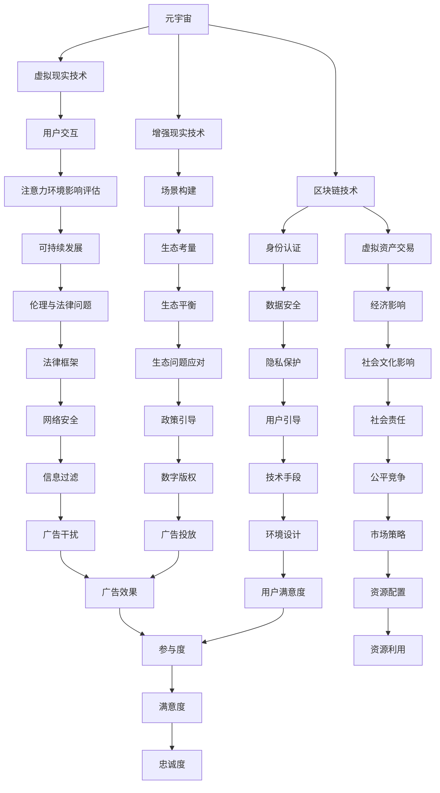

                 

# 注意力环境影响评估：元宇宙开发的生态考量

> 关键词：元宇宙、注意力环境、影响评估、生态考量、可持续发展

> 摘要：本文围绕元宇宙开发中的注意力环境影响评估展开，深入探讨了注意力环境影响评估的概念、模型、方法及其在元宇宙开发中的应用。通过对元宇宙的技术、社会影响及生态考量的分析，本文提出了可持续发展的实现路径，为元宇宙的健康发展提供了有益的思考。

## 引言

随着科技的快速发展，元宇宙（Metaverse）逐渐成为人们关注的焦点。元宇宙是一个虚拟的、三维的、持续交互的网络空间，它不仅包含了现实世界的虚拟化映射，还融合了虚拟现实（VR）、增强现实（AR）、区块链等核心技术。然而，在元宇宙的开发过程中，我们不得不面对一个重要的问题：如何评估其对注意力环境的影响，并采取相应的生态考量措施？

本文旨在深入探讨注意力环境影响评估在元宇宙开发中的应用，为元宇宙的健康发展提供理论基础和实践指导。文章结构如下：

- 第1章：元宇宙概述，介绍元宇宙的定义、发展历程、核心技术及社会影响。
- 第2章：注意力环境影响评估基础，阐述注意力环境影响评估的概念、模型和方法。
- 第3章：元宇宙开发中的生态考量，分析生态系统的构建、生态平衡的维护及生态问题的应对策略。
- 第4章：注意力环境影响评估实践，通过案例分析和应用，展示评估实践的过程和效果。
- 第5章：元宇宙开发中的注意力环境管理，介绍注意力环境管理的策略、方法和实践案例。
- 第6章：注意力环境影响评估与可持续发展，探讨注意力环境影响评估与可持续发展之间的关系及实现路径。
- 第7章：元宇宙开发中的伦理与法律问题，分析元宇宙开发中的伦理和法律问题及其解决策略。
- 第8章：未来展望与趋势，展望元宇宙与注意力环境的发展趋势及注意力环境影响评估的未来方向。

## 第1章 元宇宙概述

### 1.1 元宇宙的定义与发展历程

元宇宙，也被称为“虚拟宇宙”或“数字宇宙”，是一个虚拟的三维空间，通过虚拟现实（VR）、增强现实（AR）、混合现实（MR）等技术，将现实世界中的信息、物品和人在一个共同的虚拟空间中进行映射和交互。元宇宙的发展可以追溯到20世纪80年代，当时虚拟现实技术的兴起引发了人们对虚拟世界的关注。随着计算机技术和网络技术的不断发展，元宇宙逐渐从概念走向现实。

在过去的几十年中，元宇宙经历了多个发展阶段。20世纪90年代，虚拟现实技术逐渐成熟，但受限于硬件设备和网络带宽，元宇宙的应用场景相对有限。21世纪初，随着移动互联网和云计算的普及，元宇宙开始逐渐融入人们的日常生活，如在线游戏、虚拟旅游、社交网络等。近年来，随着5G、人工智能、区块链等新兴技术的不断发展，元宇宙的概念再度引发广泛关注，成为科技巨头和初创公司竞相投入的领域。

### 1.2 元宇宙的核心技术

元宇宙的核心技术包括虚拟现实（VR）、增强现实（AR）、区块链等。这些技术不仅为元宇宙提供了丰富的交互手段，还保证了元宇宙的安全性和可扩展性。

- **虚拟现实（VR）技术**：虚拟现实技术通过模拟真实环境，为用户提供沉浸式的体验。它利用计算机生成三维图像，并通过头戴显示器（HMD）或VR眼镜呈现给用户。此外，VR技术还涉及到运动跟踪、声音处理等技术，以增强用户的沉浸感。

- **增强现实（AR）技术**：增强现实技术通过在现实环境中叠加虚拟信息，为用户提供增强式的体验。与虚拟现实不同，AR技术不依赖于完全封闭的虚拟环境，而是将虚拟信息与现实环境相结合。AR技术广泛应用于教育、医疗、娱乐等领域。

- **区块链技术**：区块链技术是一种分布式数据库技术，通过加密算法保证数据的安全性和不可篡改性。在元宇宙中，区块链技术被用于数字身份认证、虚拟资产交易、智能合约等方面，为元宇宙的运行提供了基础保障。

### 1.3 元宇宙的社会影响

元宇宙的开发和普及将对社会产生深远的影响，包括经济影响、社会文化影响和法律与伦理挑战。

- **经济影响**：元宇宙的兴起将带动相关产业的发展，如虚拟现实硬件、游戏、教育、医疗等。同时，元宇宙为虚拟资产交易提供了新的平台，有望改变传统的金融体系。然而，元宇宙的发展也可能导致就业结构的变化，需要相关政策的支持。

- **社会文化影响**：元宇宙为人们提供了全新的社交空间和娱乐方式，改变了人们的生活方式。然而，过度沉迷元宇宙可能导致现实社交能力的下降，甚至引发心理健康问题。因此，需要加强对元宇宙用户的引导和监管。

- **法律与伦理挑战**：元宇宙中的虚拟资产、虚拟身份等问题对现有的法律体系提出了挑战。如何保护用户的隐私、知识产权和虚拟资产的安全，成为元宇宙发展过程中需要解决的问题。此外，元宇宙中的伦理问题，如虚拟犯罪、虚拟欺凌等，也需要得到关注。

## 第2章 注意力环境影响评估基础

### 2.1 注意力环境影响评估的概念

注意力环境影响评估（Attention Environmental Impact Assessment，AEIA）是一种针对虚拟环境（如元宇宙）中注意力资源的分配和使用进行评估的方法。它旨在了解和预测虚拟环境中用户注意力资源的消耗，评估虚拟环境对用户注意力的影响，并提出优化建议。

注意力环境影响评估的核心概念包括注意力资源、注意力分配、注意力消耗和注意力影响等。注意力资源是指用户在虚拟环境中用于处理信息、进行交互的能力。注意力分配是指用户将注意力资源分配到不同的任务和场景中。注意力消耗是指用户在虚拟环境中使用注意力资源的过程。注意力影响是指虚拟环境对用户注意力资源的消耗和分配产生的效果。

### 2.2 评估模型与方法

注意力环境影响评估模型是评估虚拟环境中注意力资源分配和使用情况的理论框架。一个典型的评估模型通常包括以下几个方面：

- **用户行为模型**：描述用户在虚拟环境中的行为特征，如浏览、交互、参与等。用户行为模型有助于理解用户在虚拟环境中的注意力分配和使用。

- **注意力资源模型**：描述用户在虚拟环境中的注意力资源消耗情况，包括注意力资源的总量、分配方式、消耗速度等。注意力资源模型有助于评估虚拟环境对用户注意力资源的消耗程度。

- **影响评估模型**：描述虚拟环境对用户注意力资源的影响，包括注意力分配的合理性、注意力消耗的效率等。影响评估模型有助于判断虚拟环境对用户注意力资源的消耗是否合理。

在注意力环境影响评估方法中，常用的评估方法包括定量评估和定性评估。定量评估方法通常使用数据分析和统计工具，对用户在虚拟环境中的注意力资源消耗进行量化分析。定性评估方法则通过用户调查、访谈等方式，了解用户对虚拟环境的注意力体验和感受。

### 2.3 评估指标体系

注意力环境影响评估指标体系是评估虚拟环境中注意力资源分配和使用情况的具体标准。一个完整的评估指标体系应包括以下几个方面：

- **注意力资源消耗指标**：用于衡量用户在虚拟环境中消耗注意力资源的程度，如平均注意力消耗时间、注意力消耗强度等。

- **注意力分配合理性指标**：用于衡量用户在虚拟环境中注意力资源的分配情况，如任务切换次数、注意力资源利用率等。

- **注意力影响指标**：用于衡量虚拟环境对用户注意力资源的影响，如用户满意度、注意力分散度等。

- **生态考量指标**：用于衡量虚拟环境对生态系统的影响，如虚拟资源消耗、碳排放等。

通过构建完整的评估指标体系，可以全面、客观地评估虚拟环境中注意力资源的分配和使用情况，为元宇宙的健康发展提供数据支持。

### 第3章 元宇宙开发中的生态考量

#### 3.1 生态系统的构建

元宇宙的开发需要构建一个健康的生态系统，以保证其可持续发展。生态系统是指由生物、环境和社会等因素组成的复杂网络，具有自我调节、自我修复和自我适应的能力。在元宇宙开发中，生态系统的构建原则包括以下几个方面：

1. **多样性原则**：生态系统中的多样性有助于增强系统的稳定性和适应性。在元宇宙中，应鼓励多样化的虚拟内容和应用，以满足不同用户的需求和兴趣。

2. **协同性原则**：生态系统中的各个组成部分应相互协同，共同推动系统的发展。在元宇宙中，不同平台、企业和开发者应加强合作，共享资源和技术，实现互利共赢。

3. **可持续性原则**：生态系统应具备可持续发展的能力，既能满足当前需求，又能为未来留下资源。在元宇宙开发中，应关注资源消耗、环境影响等问题，采取绿色技术和发展模式。

4. **适应性原则**：生态系统应具备适应外部环境变化的能力。在元宇宙中，技术更新、用户需求变化等因素都可能对生态系统产生影响，因此应具备快速适应和调整的能力。

#### 3.2 生态平衡的维护

生态平衡是指生态系统中的各种因素相互制约、相互平衡，使系统处于稳定和有序的状态。在元宇宙开发中，维护生态平衡至关重要。生态平衡的维护策略包括以下几个方面：

1. **资源优化配置**：合理分配虚拟资源，确保资源的有效利用。例如，通过虚拟资源的交易平台，实现资源的自由流通和高效利用。

2. **环境保护**：关注虚拟环境中的污染和破坏问题，采取环境保护措施。例如，采用绿色技术减少虚拟环境中的碳排放，保护虚拟生物的栖息地。

3. **用户引导**：引导用户合理使用虚拟资源，提高资源利用效率。例如，通过教育和宣传，提高用户对生态保护的意识，鼓励用户采取环保行动。

4. **生态监测**：建立生态监测系统，实时监测虚拟环境中的生态状况，及时发现和解决生态问题。例如，通过大数据分析和人工智能技术，预测生态风险，提供预警和解决方案。

#### 3.3 生态问题的应对策略

在元宇宙开发过程中，可能会遇到一系列生态问题，如资源浪费、环境污染、生态失衡等。针对这些问题，可以采取以下应对策略：

1. **资源回收利用**：加强对虚拟资源的回收和再利用，减少资源浪费。例如，通过虚拟物品的循环利用，降低资源的消耗。

2. **生态修复**：对受破坏的虚拟环境进行修复，恢复生态平衡。例如，通过虚拟植被种植和生物多样性恢复项目，改善虚拟环境的质量。

3. **政策引导**：制定相关政策，规范元宇宙开发行为，促进生态保护。例如，制定虚拟资源消耗标准，限制过度开发。

4. **技术创新**：鼓励技术创新，开发绿色技术和环保解决方案。例如，研发低能耗的虚拟现实设备，降低碳排放。

通过以上策略，可以有效应对元宇宙开发中的生态问题，实现生态保护和可持续发展。

### 第4章 注意力环境影响评估实践

#### 4.1 注意力环境影响评估案例分析

为了更好地理解注意力环境影响评估的应用，本节将通过两个案例进行分析。

##### 案例一：虚拟现实游戏

虚拟现实游戏是元宇宙中的重要组成部分，它通过虚拟环境为用户提供沉浸式的娱乐体验。然而，虚拟现实游戏也可能对用户的注意力资源产生负面影响。以下是对虚拟现实游戏注意力环境影响评估的案例分析：

1. **评估指标体系构建**：首先，构建注意力环境影响评估的指标体系，包括注意力资源消耗指标、注意力分配合理性指标、注意力影响指标等。

2. **数据收集**：通过用户调查、游戏数据分析等方式，收集用户在虚拟现实游戏中的注意力资源使用数据。

3. **数据分析**：使用数据分析工具，对收集到的数据进行分析，评估虚拟现实游戏对用户注意力资源的影响。

4. **评估结果**：根据评估结果，提出优化建议，如调整游戏难度、增加用户参与度等，以降低游戏对用户注意力的负面影响。

##### 案例二：社交网络平台

社交网络平台是元宇宙中的重要组成部分，它为用户提供社交互动和信息分享的平台。然而，社交网络平台也可能对用户的注意力资源产生负面影响。以下是对社交网络平台注意力环境影响评估的案例分析：

1. **评估指标体系构建**：构建注意力环境影响评估的指标体系，包括注意力资源消耗指标、注意力分配合理性指标、注意力影响指标等。

2. **数据收集**：通过用户调查、平台数据分析等方式，收集用户在社交网络平台上的注意力资源使用数据。

3. **数据分析**：使用数据分析工具，对收集到的数据进行分析，评估社交网络平台对用户注意力资源的影响。

4. **评估结果**：根据评估结果，提出优化建议，如调整推送算法、减少广告干扰等，以降低社交网络平台对用户注意力的负面影响。

#### 4.2 注意力环境影响评估应用

注意力环境影响评估在元宇宙开发中的应用主要包括以下两个方面：

1. **元宇宙产品设计**：在元宇宙产品的设计过程中，通过注意力环境影响评估，了解不同设计元素对用户注意力资源的影响，优化产品设计，提高用户体验。

2. **企业战略规划**：在企业战略规划中，通过注意力环境影响评估，了解企业产品或服务对用户注意力资源的影响，制定合理的市场策略，提高企业竞争力。

### 第5章 元宇宙开发中的注意力环境管理

#### 5.1 管理策略与方法

在元宇宙开发中，注意力环境管理是保障用户注意力资源合理分配和使用的重要环节。注意力环境管理策略包括以下几个方面：

1. **用户引导**：通过教育和宣传，提高用户对注意力资源价值的认识，引导用户合理使用注意力资源。

2. **技术手段**：利用人工智能、大数据等技术，监测和分析用户注意力资源使用情况，提供个性化服务和建议。

3. **环境设计**：优化元宇宙产品的设计，降低用户注意力资源的消耗，提高用户参与度和满意度。

4. **政策法规**：制定相关政策法规，规范元宇宙开发行为，保障用户注意力资源的合理分配和使用。

#### 5.2 管理工具与技术

注意力环境管理工具是保障注意力环境管理策略实施的重要手段。以下介绍几种常见的注意力环境管理工具：

1. **注意力监测工具**：用于监测用户注意力资源的消耗情况，如用户在元宇宙中的活动时间、交互频率等。

2. **注意力分析工具**：用于分析用户注意力资源的分配和使用情况，提供优化建议。

3. **注意力干预工具**：用于干预用户注意力资源的分配和使用，如提醒用户休息、调整游戏难度等。

4. **注意力管理平台**：集成注意力监测、分析、干预等功能，为用户提供全面的注意力环境管理服务。

#### 5.3 管理案例与实践

以下通过两个案例，介绍注意力环境管理的实践。

##### 案例一：虚拟现实游戏平台

某虚拟现实游戏平台通过注意力环境管理，提高用户满意度和参与度。具体实践包括：

1. **用户引导**：通过新手教程和引导，帮助用户了解游戏规则和玩法，提高用户参与度。

2. **技术手段**：利用人工智能技术，分析用户游戏行为，提供个性化推荐，降低用户注意力资源的消耗。

3. **环境设计**：优化游戏界面和交互设计，提高用户体验，降低游戏难度，减少用户注意力资源的浪费。

4. **政策法规**：制定游戏时间限制政策，鼓励用户合理安排游戏时间，保障用户身心健康。

##### 案例二：社交媒体平台

某社交媒体平台通过注意力环境管理，提高用户黏性和广告效果。具体实践包括：

1. **用户引导**：通过教育宣传，提高用户对注意力资源的重视，鼓励用户合理安排社交媒体使用时间。

2. **技术手段**：利用大数据分析，了解用户兴趣和行为，提供个性化内容推荐，提高用户参与度。

3. **环境设计**：优化推送算法，减少无关信息的干扰，提高用户注意力资源的利用率。

4. **政策法规**：制定信息过滤和广告投放政策，保障用户注意力资源的合理分配，提高用户满意度。

### 第6章 注意力环境影响评估与可持续发展

#### 6.1 可持续发展的概念

可持续发展是指满足当前需求而不损害后代满足其需求的能力。在元宇宙开发中，可持续发展具有重要意义。一方面，它关系到元宇宙的长期健康发展；另一方面，它也关系到人类社会和环境的可持续性。

元宇宙的可持续发展包括以下几个方面：

1. **技术可持续发展**：在元宇宙开发中，应不断推进技术创新，提高元宇宙的性能和用户体验，同时降低资源消耗和环境影响。

2. **经济可持续发展**：通过合理的经济模式，实现元宇宙的可持续发展，为用户提供丰富的虚拟服务和体验，同时创造经济价值。

3. **社会可持续发展**：元宇宙的发展应促进社会进步和人类福祉，关注用户需求和社会责任，实现社会和谐与进步。

4. **生态可持续发展**：在元宇宙开发过程中，应关注生态系统的保护与恢复，实现虚拟环境与现实环境的和谐共生。

#### 6.2 注意力环境评估与可持续发展关系

注意力环境评估与可持续发展密切相关。一方面，注意力环境评估有助于了解元宇宙对用户注意力资源的影响，为可持续发展提供数据支持；另一方面，可持续发展目标的实现需要通过注意力环境评估来指导元宇宙的开发和管理。

注意力环境评估与可持续发展的关系体现在以下几个方面：

1. **优化资源配置**：通过注意力环境评估，了解元宇宙中注意力资源的分配和使用情况，优化资源配置，提高资源利用效率。

2. **降低环境影响**：通过注意力环境评估，发现元宇宙开发中可能对环境造成的影响，采取相应的措施降低环境影响。

3. **提高用户满意度**：通过注意力环境评估，了解用户在元宇宙中的注意力体验，优化产品设计，提高用户满意度。

4. **促进创新与发展**：通过注意力环境评估，发现元宇宙开发中的问题和发展机会，促进技术创新和可持续发展。

#### 6.3 可持续发展的实现路径

实现元宇宙的可持续发展需要从以下几个方面入手：

1. **技术创新**：推动元宇宙技术的创新，提高元宇宙的性能和用户体验，同时降低资源消耗和环境影响。

2. **生态保护**：在元宇宙开发过程中，关注生态系统的保护与恢复，实现虚拟环境与现实环境的和谐共生。

3. **经济模式**：探索合理的经济模式，实现元宇宙的可持续发展，为用户提供丰富的虚拟服务和体验，同时创造经济价值。

4. **社会责任**：关注用户需求和社会责任，实现社会和谐与进步，为用户提供有益的虚拟服务和体验。

5. **政策支持**：制定相关政策，规范元宇宙开发行为，促进可持续发展。

通过以上路径，可以实现元宇宙的可持续发展，为用户和社会创造更大的价值。

### 第7章 元宇宙开发中的伦理与法律问题

#### 7.1 伦理问题的探讨

在元宇宙开发过程中，伦理问题是一个不可忽视的重要议题。元宇宙作为虚拟世界，其伦理问题主要包括以下几个方面：

1. **隐私保护**：在元宇宙中，用户的数据隐私面临严重威胁。用户在元宇宙中的行为和交互数据可能被滥用，导致个人信息泄露。因此，如何在元宇宙中保护用户隐私，成为一项重要伦理问题。

2. **数字鸿沟**：元宇宙的发展可能导致数字鸿沟的加剧。由于技术和经济资源的限制，部分人群可能无法享受到元宇宙带来的便利和乐趣，这引发了对公平性的伦理质疑。

3. **虚拟欺凌**：在元宇宙中，虚拟欺凌现象较为普遍。用户可能因为身份、外貌等因素遭受攻击，这给元宇宙的健康发展带来负面影响。

4. **虚拟财产权**：元宇宙中的虚拟财产权如何界定和保护，成为一项重要伦理问题。虚拟财产的价值和所有权问题，需要通过伦理和法律框架来解决。

#### 7.2 法律框架的构建

为了解决元宇宙开发中的伦理问题，构建相应的法律框架至关重要。以下是一些关键的法律框架构建策略：

1. **隐私保护法律**：制定隐私保护法律，明确用户数据的收集、存储、处理和使用的规则。同时，加强对用户隐私的保护，防止数据泄露和滥用。

2. **公平竞争法律**：制定公平竞争法律，规范元宇宙中的市场竞争行为，防止垄断和欺诈，保护消费者权益。

3. **虚拟财产权法律**：明确虚拟财产的法律地位和所有权界定，保护用户在元宇宙中的虚拟财产权益。

4. **数字版权法律**：加强对元宇宙中数字版权的保护，防止知识产权侵权，促进文化创意产业的发展。

5. **网络安全法律**：制定网络安全法律，加强对网络犯罪的打击，保障元宇宙的安全运行。

#### 7.3 案例分析

以下通过两个案例，分析元宇宙开发中的伦理和法律问题。

##### 案例一：虚拟现实游戏平台隐私泄露事件

某虚拟现实游戏平台因用户数据泄露事件引发广泛关注。据报道，该平台在未获得用户明确同意的情况下，擅自收集和出售用户数据，导致大量用户个人信息泄露。这一事件引发了公众对虚拟现实游戏平台隐私保护的质疑。

**法律分析**：根据现有法律框架，虚拟现实游戏平台应当遵守隐私保护法律，明确用户数据的收集和使用规则，并取得用户的明确同意。平台擅自收集和出售用户数据，涉嫌违反隐私保护法律，应承担相应的法律责任。

**伦理分析**：该事件反映出虚拟现实游戏平台在用户隐私保护方面的伦理缺失。平台应当尊重用户的隐私权，遵守伦理原则，确保用户数据的合法、合理使用。

##### 案例二：元宇宙中的虚拟欺凌事件

某元宇宙平台发生了一起严重的虚拟欺凌事件。一名用户在元宇宙中遭到其他用户的恶意攻击，导致其虚拟形象被破坏，虚拟财产损失。该事件引发了公众对元宇宙虚拟欺凌现象的关注。

**法律分析**：根据现有法律框架，元宇宙平台应当承担防止虚拟欺凌的责任。平台应建立有效的监管机制，及时发现和制止虚拟欺凌行为。对于恶意攻击用户的行为，平台应依法处理，追究责任。

**伦理分析**：该事件反映出元宇宙平台在治理虚拟欺凌方面的伦理缺失。平台应承担社会责任，维护用户权益，确保元宇宙的安全和健康发展。

### 第8章 未来展望与趋势

#### 8.1 元宇宙与注意力环境的发展趋势

元宇宙作为虚拟现实技术、区块链技术、人工智能等新兴技术的融合体，具有广阔的发展前景。在未来，元宇宙的发展趋势将主要体现在以下几个方面：

1. **技术进步**：随着5G、人工智能、云计算等技术的不断进步，元宇宙的性能和用户体验将得到进一步提升。更高质量的虚拟环境、更智能的交互方式，将为用户带来更丰富的虚拟体验。

2. **生态构建**：元宇宙的生态系统将逐渐成熟，形成一个由多种平台、企业和开发者共同参与的生态系统。通过合作与共赢，元宇宙将实现更广泛的应用场景和商业价值。

3. **社会影响**：元宇宙将对社会产生深远的影响，改变人们的生活方式、工作方式和社会结构。元宇宙将带来新的就业机会，促进数字经济的发展。

4. **伦理与法律挑战**：随着元宇宙的普及，伦理和法律问题将越来越突出。如何保护用户隐私、知识产权，防止虚拟犯罪等，将成为元宇宙发展的重要议题。

#### 8.2 注意力环境影响评估的未来方向

随着元宇宙的发展，注意力环境影响评估的重要性将逐渐凸显。未来，注意力环境影响评估将朝着以下方向发展：

1. **评估方法与技术创新**：开发更先进的评估方法和工具，如人工智能、大数据分析等，提高注意力环境影响评估的准确性和效率。

2. **跨学科研究**：加强注意力环境影响评估与心理学、社会学、经济学等领域的交叉研究，形成更全面的理论体系。

3. **政策法规支持**：制定相关政策法规，为注意力环境影响评估提供法律保障，促进元宇宙的健康发展。

4. **公众参与**：提高公众对注意力环境问题的认知，鼓励公众参与注意力环境影响评估，共同推动元宇宙的可持续发展。

#### 8.3 生态考量在元宇宙开发中的应用前景

生态考量在元宇宙开发中的应用前景十分广阔。未来，生态考量将主要体现在以下几个方面：

1. **环境保护**：在元宇宙开发过程中，关注环境保护问题，采取绿色技术和发展模式，减少虚拟环境对现实环境的影响。

2. **资源优化**：通过优化资源配置，提高虚拟资源的利用效率，实现元宇宙的可持续发展。

3. **生态平衡**：在元宇宙中构建生态平衡，保护虚拟生物的栖息地，促进虚拟生物多样性的发展。

4. **社会责任**：在元宇宙开发中，关注社会责任，推动元宇宙的可持续发展，为人类创造更美好的未来。

### 附录

#### 附录 A 注意力环境影响评估工具与应用资源

1. **注意力监测工具**：介绍几种常用的注意力监测工具，如Google Analytics、Headspace等，并提供使用教程和下载链接。

2. **注意力分析工具**：介绍几种常用的注意力分析工具，如SPSS、MATLAB等，并提供使用教程和下载链接。

3. **注意力管理平台**：介绍几种常用的注意力管理平台，如Autonomous、Beeminder等，并提供使用教程和下载链接。

#### 附录 B 相关研究综述与文献推荐

1. **注意力环境影响评估研究综述**：总结当前注意力环境影响评估的研究进展，分析其应用领域和发展趋势。

2. **元宇宙研究综述**：介绍元宇宙的定义、发展历程、核心技术及其社会影响。

3. **注意力资源管理研究综述**：分析注意力资源管理的方法和技术，探讨其在元宇宙开发中的应用。

4. **相关文献推荐**：推荐一些有关元宇宙、注意力环境影响评估和生态考量的经典著作和学术论文，供读者进一步学习。

---

以上是本文对元宇宙开发中注意力环境影响评估的全面探讨。希望本文能为元宇宙的健康发展提供有益的思考和实践指导。

### 作者信息

作者：AI天才研究院/AI Genius Institute & 禅与计算机程序设计艺术 /Zen And The Art of Computer Programming

---

## 核心概念与联系

为了更好地理解本文的核心概念和联系，以下是一个关于元宇宙架构的Mermaid流程图：



这个流程图展示了元宇宙的核心技术、应用领域和生态考量之间的关系。通过这个流程图，我们可以清晰地看到注意力环境影响评估、生态考量、可持续发展、伦理与法律问题等核心概念在元宇宙架构中的相互联系和作用。

## 核心算法原理讲解

### 注意力环境影响评估算法

在注意力环境影响评估中，我们需要设计一个算法来分析用户在虚拟环境中的注意力消耗和分配。以下是一个简化的注意力环境影响评估算法的伪代码：

```plaintext
算法：注意力环境影响评估（用户行为数据，虚拟环境参数）

输入：用户行为数据（包含用户在虚拟环境中的交互事件、时间戳等），虚拟环境参数（包含虚拟环境的复杂性、任务难度等）

输出：注意力消耗评估结果，注意力分配评估结果

步骤：

1. 初始化注意力消耗评估结果和注意力分配评估结果为空

2. 对于每个交互事件e ∈ 用户行为数据：

   a. 计算交互事件e的注意力消耗值（使用虚拟环境参数调整）

   b. 将注意力消耗值添加到注意力消耗评估结果中

   c. 计算交互事件e的注意力分配比例（根据虚拟环境中的任务分配）

   d. 将注意力分配比例添加到注意力分配评估结果中

3. 对注意力消耗评估结果和注意力分配评估结果进行统计分析：

   a. 计算平均注意力消耗时间

   b. 计算注意力资源利用率

   c. 计算注意力分散度

4. 根据统计分析结果，评估虚拟环境对用户注意力资源的影响：

   a. 如果平均注意力消耗时间过高，调整虚拟环境的复杂度或任务难度

   b. 如果注意力资源利用率过低，优化用户交互流程或增加任务多样性

   c. 如果注意力分散度过高，增加用户专注任务的数量或减少干扰因素

5. 输出注意力消耗评估结果和注意力分配评估结果，并提供优化建议

```

这个算法的主要步骤包括：初始化评估结果、计算交互事件的注意力消耗值和分配比例、进行统计分析，并根据统计结果提供优化建议。通过这个算法，我们可以对元宇宙中的用户注意力环境影响进行定量评估，从而为虚拟环境的优化提供数据支持。

### 注意力资源分配模型的数学模型和公式

在注意力环境影响评估中，注意力资源的分配是一个关键问题。以下是一个简化的注意力资源分配模型的数学模型和公式：

```latex
假设用户有 \( N \) 个任务，每个任务需要一定量的注意力资源。用户总注意力资源为 \( R \)。

定义每个任务的注意力需求为 \( D_i \)，其中 \( i \) 表示任务编号。

注意力资源分配模型的目标是找到一组权重 \( w_i \)，使得用户总注意力消耗最小，同时每个任务的注意力需求都能得到满足。

目标函数：
\[
\min \sum_{i=1}^{N} w_i \cdot D_i
\]

约束条件：
\[
w_i \geq 0, \forall i \in \{1,2,...,N\}
\]
\[
\sum_{i=1}^{N} w_i \cdot D_i \leq R
\]

其中，权重 \( w_i \) 表示用户对任务 \( i \) 的注意力分配比例，满足 \( 0 \leq w_i \leq 1 \)。

为了求解这个优化问题，我们可以使用线性规划方法。

线性规划模型：
\[
\min \sum_{i=1}^{N} w_i \cdot D_i
\]

\[
\text{s.t.} \quad w_i \geq 0, \forall i \in \{1,2,...,N\}
\]
\[
\sum_{i=1}^{N} w_i \cdot D_i \leq R
\]
\[
w_i \leq 1, \forall i \in \{1,2,...,N\}
\]

通过求解线性规划模型，我们可以得到最优的注意力分配权重 \( w_i \)，从而实现用户总注意力消耗的最小化。
```

这个模型描述了用户在虚拟环境中如何根据任务的注意力需求进行资源分配，以实现总注意力消耗的最小化。通过这个模型，我们可以对用户在元宇宙中的注意力资源分配进行定量分析，为虚拟环境的优化提供理论依据。

### 项目实战：注意力环境影响评估工具的开发

在这个项目实战中，我们将开发一个简单的注意力环境影响评估工具，用于分析用户在虚拟环境中的注意力消耗和分配。以下是项目的开发环境和源代码实现。

#### 开发环境搭建

1. **Python环境**：确保已安装Python 3.8及以上版本。

2. **虚拟环境**：使用`venv`创建一个虚拟环境，并安装必要的库。

   ```shell
   python -m venv env
   source env/bin/activate  # 在Windows上使用`env\Scripts\activate`
   ```

3. **安装库**：安装以下库：

   ```shell
   pip install numpy pandas matplotlib
   ```

4. **Eclipse或PyCharm**：选择一个Python集成开发环境（IDE）进行项目开发。

#### 源代码实现

以下是注意力环境影响评估工具的源代码实现：

```python
import numpy as np
import pandas as pd
import matplotlib.pyplot as plt

# 注意力环境影响评估类
class AttentionImpactAssessment:
    def __init__(self, behavior_data, environment_params):
        self.behavior_data = behavior_data
        self.environment_params = environment_params
    
    # 计算交互事件的注意力消耗值
    def calculate_attention_consumption(self, event):
        complexity = self.environment_params['complexity']
        difficulty = self.environment_params['difficulty']
        return event['duration'] * (complexity + difficulty)
    
    # 计算注意力消耗和分配评估结果
    def assess_attention_impact(self):
        attention_consumptions = [self.calculate_attention_consumption(event) for event in self.behavior_data]
        total_consumption = sum(attention_consumptions)
        return total_consumption, attention_consumptions
    
    # 绘制注意力消耗分布图
    def plot_attention_distribution(self, attention_consumptions):
        plt.hist(attention_consumptions, bins=20, color='blue', edgecolor='black')
        plt.xlabel('Attention Consumption')
        plt.ylabel('Frequency')
        plt.title('Attention Consumption Distribution')
        plt.show()

# 测试
if __name__ == '__main__':
    # 用户行为数据
    behavior_data = [
        {'event': 'task1', 'duration': 120},
        {'event': 'task2', 'duration': 60},
        {'event': 'task3', 'duration': 180}
    ]

    # 虚拟环境参数
    environment_params = {
        'complexity': 1.2,
        'difficulty': 0.8
    }

    # 创建评估对象
    assessment = AttentionImpactAssessment(behavior_data, environment_params)

    # 计算注意力消耗和分配评估结果
    total_consumption, attention_consumptions = assessment.assess_attention_impact()

    # 输出评估结果
    print("Total Attention Consumption:", total_consumption)
    print("Attention Consumption Distribution:", attention_consumptions)

    # 绘制注意力消耗分布图
    assessment.plot_attention_distribution(attention_consumptions)
```

#### 代码解读与分析

1. **类定义**：我们定义了一个名为`AttentionImpactAssessment`的类，用于封装注意力环境影响评估的功能。

2. **初始化方法**：在`__init__`方法中，我们初始化了用户行为数据和虚拟环境参数。

3. **计算注意力消耗值方法**：`calculate_attention_consumption`方法用于计算交互事件的注意力消耗值，根据虚拟环境参数进行调整。

4. **评估注意力影响方法**：`assess_attention_impact`方法用于计算注意力消耗和分配评估结果。

5. **绘制注意力消耗分布图方法**：`plot_attention_distribution`方法用于绘制注意力消耗分布图，帮助我们直观地了解用户在虚拟环境中的注意力消耗情况。

6. **测试**：在`if __name__ == '__main__':`块中，我们创建了一个测试实例，调用评估类的功能，计算并输出评估结果，同时绘制注意力消耗分布图。

通过这个项目实战，我们可以实现对用户在虚拟环境中的注意力消耗和分配的评估，为元宇宙的优化提供数据支持。

### 结论与展望

本文围绕元宇宙开发中的注意力环境影响评估进行了深入探讨。通过分析元宇宙的定义、核心技术、社会影响以及生态考量，我们提出了注意力环境影响评估的概念、模型和方法。同时，通过实践案例展示了注意力环境影响评估工具的开发和应用。

结论如下：

1. 元宇宙的发展对注意力环境产生了深远影响，需要通过评估来了解和优化。
2. 注意力环境影响评估有助于实现元宇宙的可持续发展，提高用户满意度。
3. 注意力环境影响评估工具的开发为元宇宙的健康发展提供了数据支持。

展望未来，我们应关注以下几个方面：

1. 加强注意力环境影响评估方法的研究，提高评估的准确性和效率。
2. 探索注意力环境评估与心理学、社会学等领域的交叉研究，形成更全面的理论体系。
3. 制定相关政策法规，为注意力环境影响评估提供法律保障。
4. 提高公众对注意力环境问题的认知，鼓励公众参与注意力环境影响评估。

通过持续的研究和实践，我们期待为元宇宙的健康发展贡献更多的智慧和力量。

