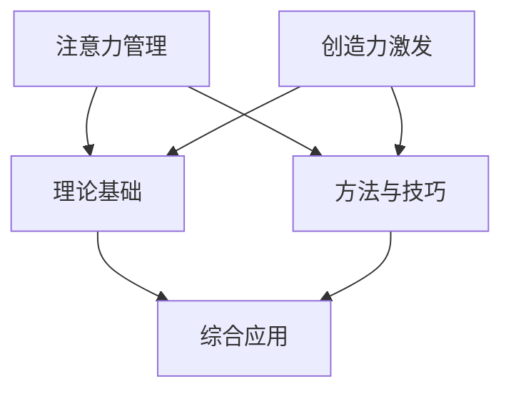

                 

## 注意力管理与创造力激发实践：在专注和头脑风暴中找到灵感

### 关键词：注意力管理、创造力激发、专注力、头脑风暴、实践指南

### 摘要：
在当今高度信息化的社会中，有效管理注意力和激发创造力成为个人和团队成功的关键。本文从注意力管理的理论基础出发，详细探讨了提升注意力、分散注意力及应对方法，结合创造力激发的理论与实践，提供了全面的注意力管理与创造力激发的综合应用策略。通过案例分析和项目实战，读者将深入了解如何在日常生活和工作中应用这些策略，实现个人与团队的持续成长与创新。

---

### 目录大纲

#### 第一部分：注意力管理的理论基础

1. 第1章 注意力管理的核心概念与机制
   1.1 什么是注意力管理
       - 注意力的定义
       - 注意力管理的重要性
   1.2 注意力系统的工作机制
       - 注意力系统概述
       - 注意力系统的组成
       - 注意力系统的工作原理
   1.3 注意力管理的科学基础
       - 注意力管理的神经科学基础
       - 注意力管理的心理学原理
   1.4 注意力分散与分心
       - 注意力分散的原因
       - 注意力分散的负面影响
       - 如何应对注意力分散

2. 第2章 注意力管理的方法与技巧
   2.1 提升注意力的基础技巧
       - 合理安排作息时间
       - 避免多任务处理
       - 保持大脑活跃
   2.2 提升注意力的进阶方法
       - 训练专注力的技巧
       - 提高工作效率的方法
       - 减少干扰的方法
   2.3 专注力训练工具和资源
       - 专注力训练应用推荐
       - 专注力训练书籍推荐

#### 第二部分：创造力激发的理论与实践

3. 第3章 创造力的概念与重要性
   3.1 创造力的定义
       - 创造力的多维度解析
       - 创造力在社会发展中的作用
   3.2 创造力的重要性
       - 个人成长
       - 组织创新
       - 社会进步
   3.3 创造力的影响因素
       - 个人因素
       - 环境因素
       - 社会文化因素

4. 第4章 创造力激发的理论基础
   4.1 创造力的心理学理论
       - 灵感理论
       - 创造性思维理论
       - 创造力培养理论
   4.2 创造力的神经科学基础
       - 神经科学视角下的创造力
       - 大脑工作原理与创造力
   4.3 创造力的社会文化基础
       - 文化差异对创造力的影响
       - 组织文化对创造力的影响

5. 第5章 创造力激发的方法与实践
   5.1 激发创造力的技巧
       - 头脑风暴
       - 思维导图
       - 借鉴与启发
   5.2 创造力激发的实践
       - 个体创造力激发实践
       - 团队创造力激发实践
       - 组织创造力激发实践
   5.3 创造力激发的工具与资源
       - 创造力激发工具推荐
       - 创造力激发书籍推荐

#### 第三部分：注意力管理与创造力激发的综合应用

6. 第6章 实战案例分析与策略制定
   6.1 注意力管理与创造力激发的融合
       - 注意力管理对创造力的影响
       - 创造力激发对注意力管理的影响
   6.2 案例分析：提高个人创造力
       - 案例背景
       - 注意力管理策略
       - 创造力激发实践
   6.3 案例分析：团队创造力提升
       - 案例背景
       - 注意力管理策略
       - 创造力激发实践
   6.4 组织策略制定
       - 组织内注意力管理的策略
       - 组织内创造力激发的策略

7. 第7章 注意力管理与创造力激发的持续提升
   7.1 持续提升注意力的策略
       - 长期注意力提升方法
       - 注意力管理实践分享
   7.2 持续激发创造力的策略
       - 长期创造力激发方法
       - 创造力管理实践分享
   7.3 注意力管理与创造力激发的平衡
       - 如何平衡工作与生活
       - 注意力管理与创造力激发的长期规划

### 附录

8. 附录A: 注意力管理与创造力激发资源推荐

9. 附录B: 注意力管理与创造力激发常见问题解答

10. 附录C: 注意力管理与创造力激发实践案例

---

通过上述目录大纲，我们将对注意力管理与创造力激发进行全面的探讨，为读者提供系统而实用的实践指南。接下来，我们将深入分析注意力管理的理论基础，并逐步展开对注意力管理方法与技巧、创造力激发理论及实践的讨论。

### 第一部分：注意力管理的理论基础

#### 第1章 注意力管理的核心概念与机制

##### 1.1 什么是注意力管理

注意力管理是指通过一系列策略和技巧，有效地引导和调节个人的注意力，以实现更高的工作效率、学习效果和创新潜力。注意力管理不仅涉及个人的注意力分配，还包括对干扰源的识别和应对。

###### 1.1.1 注意力的定义

注意力是指个体在某一时刻集中精神、关注特定刺激的能力。注意力的主要特征包括选择性、集中性和维持性。选择性指的是个体在众多信息中，能够选择关注哪些信息，忽略其他信息。集中性是指个体在关注某一信息时，能够排除其他干扰，保持专注。维持性是指个体在一段时间内，能够保持对特定任务的持续关注。

###### 1.1.2 注意力管理的重要性

注意力管理对于个人和社会都有着重要的意义。在个人层面，良好的注意力管理能够提升工作效率，增强学习效果，促进创造力的发挥。在社会层面，高效的注意力管理有助于团队合作，提升组织创新力，推动社会进步。

#### 1.2 注意力系统的工作机制

注意力系统是一个复杂的多层次系统，涉及大脑的多个区域和功能。理解注意力系统的工作机制有助于我们更好地进行注意力管理。

###### 1.2.1 注意力系统概述

注意力系统由多个相互协作的脑区组成，主要包括以下部分：

- **前额叶皮层**：负责高级认知功能，如规划、决策和自我调节。
- **顶叶皮层**：参与空间定位和注意力的分配。
- **扣带回皮层**：负责注意力的调控和情绪处理。
- **脑干**：调节基本的心血管和呼吸功能，对注意力维持至关重要。

###### 1.2.2 注意力系统的组成

注意力系统的组成可以概括为以下几部分：

- **执行控制**：负责注意力的分配和调节，如前额叶皮层。
- **知觉选择**：负责选择关注哪些刺激，如顶叶皮层。
- **维持注意力**：负责保持对特定任务的持续关注，如脑干。
- **情绪调控**：负责调节注意力的情绪状态，如扣带回皮层。

###### 1.2.3 注意力系统的工作原理

注意力系统的工作原理可以概括为以下几个步骤：

1. **感知输入**：接收来自外部环境和内部感受器的信息。
2. **选择关注**：根据任务需求，选择关注特定的信息，忽略其他信息。
3. **加工处理**：对选择关注的信息进行加工处理，进行认知操作。
4. **反馈调节**：根据处理结果，调整注意力的分配和调节，以适应任务需求。

#### 1.3 注意力管理的科学基础

注意力管理的理论基础主要来自于神经科学和心理学的研究成果。以下从神经科学和心理学两个方面探讨注意力管理的科学基础。

###### 1.3.1 注意力管理的神经科学基础

神经科学研究表明，注意力管理涉及大脑多个区域的协同工作。以下是一些关键的研究发现：

- **前额叶皮层**：在注意力管理中起着核心作用，负责执行控制、决策和自我调节。
- **顶叶皮层**：参与注意力的分配和知觉选择，对空间定位和注意力调节至关重要。
- **扣带回皮层**：负责注意力的调控和情绪处理，对注意力稳定性和适应性有重要影响。
- **脑干**：调节基本的心血管和呼吸功能，对注意力维持和唤醒状态有重要影响。

###### 1.3.2 注意力管理的心理学原理

心理学研究表明，注意力管理不仅受到大脑神经机制的影响，还受到个体心理和行为因素的影响。以下是一些关键的研究发现：

- **认知资源理论**：注意力是认知资源的一种形式，有限的认知资源需要合理分配，以实现最佳的工作和学习效果。
- **动机理论**：个体的动机水平会影响注意力的选择和分配，高动机水平有助于提升注意力的集中度和持久性。
- **分散注意力**：分散注意力是注意力管理的一个重要方面，有效的分散注意力可以减少干扰，提高工作效率。

#### 1.4 注意力分散与分心

注意力分散是指个体在执行某一任务时，注意力被其他无关信息所吸引，导致任务执行效果下降。分心是指个体在执行某一任务时，注意力被干扰源所打断，导致任务无法持续进行。

###### 1.4.1 注意力分散的原因

注意力分散的原因多种多样，包括：

- **环境干扰**：如噪音、光线变化等外部刺激。
- **内部干扰**：如疲劳、情绪波动等内部因素。
- **多任务处理**：同时处理多个任务，导致注意力分散。
- **信息过载**：接收到的信息过多，难以集中注意力处理。

###### 1.4.2 注意力分散的负面影响

注意力分散会对个体产生多方面的负面影响，包括：

- **降低工作效率**：注意力分散导致任务无法持续进行，降低工作效率。
- **降低学习效果**：注意力分散导致学习过程断断续续，降低学习效果。
- **增加错误率**：注意力分散导致个体对任务的认知操作不完整，增加错误率。
- **影响健康**：长期注意力分散可能导致心理压力增加，影响身心健康。

###### 1.4.3 如何应对注意力分散

应对注意力分散需要采取一系列策略，包括：

- **环境优化**：创造一个安静、整洁、光线适宜的工作环境，减少外部干扰。
- **时间管理**：合理安排工作和休息时间，避免过度疲劳。
- **专注训练**：通过专注力训练提高个体专注力水平，减少注意力分散。
- **减少多任务处理**：尽量专注于单一任务，避免同时处理多个任务。

在下一章中，我们将详细探讨注意力管理的方法与技巧，帮助读者在实际生活中有效地提升注意力。

### 第2章 注意力管理的方法与技巧

注意力管理不仅仅是理论上的探讨，更需要在实际生活中通过一系列方法和技巧加以应用。本章节将详细介绍提升注意力、分散注意力的方法与技巧，并提供实用的专注力训练工具和资源。

#### 2.1 提升注意力的基础技巧

提升注意力是进行高效工作与学习的前提。以下是一些简单但有效的基础技巧，可以帮助我们提升注意力。

###### 2.1.1 合理安排作息时间

合理安排作息时间是提升注意力的重要一步。以下是一些建议：

- **规律作息**：保持每天定时作息，避免熬夜和过度疲劳。
- **充足睡眠**：保证每晚7-8小时的睡眠时间，提高第二天的精神状态。
- **休息与运动**：每工作45-60分钟后，进行短暂的休息，进行简单的运动或深呼吸。

###### 2.1.2 避免多任务处理

多任务处理看似效率高，但实际上会大大降低注意力集中度。以下是一些建议：

- **单一任务集中**：专注于单一任务，避免同时处理多个任务。
- **设定优先级**：根据任务的重要性和紧急程度，设定优先级，先完成最重要的任务。
- **任务分解**：将复杂任务分解成小块，逐一完成，避免因任务复杂而导致的注意力分散。

###### 2.1.3 保持大脑活跃

保持大脑活跃有助于提升注意力。以下是一些建议：

- **学习新知识**：不断学习新知识，刺激大脑，提高认知能力。
- **智力游戏**：玩智力游戏，如数独、迷宫、记忆游戏等，锻炼大脑功能。
- **阅读**：阅读有益的书籍，不仅能够提升知识水平，还能够提高注意力。

#### 2.2 提升注意力的进阶方法

除了基础技巧，还有一些更高级的方法可以帮助我们进一步提升注意力。

###### 2.2.1 训练专注力的技巧

训练专注力是提升注意力的重要途径。以下是一些训练专注力的技巧：

- **正念冥想**：正念冥想通过专注于呼吸和身体感受，帮助我们提高专注力。
- **专注力训练应用**：使用专门的专注力训练应用，如“专注力训练器”、“番茄工作法”等，通过设定时间和任务，帮助我们提高专注度。
- **定时专注训练**：每天设定一段时间，专注于一项任务，逐步增加专注时间，提升专注力。

###### 2.2.2 提高工作效率的方法

提高工作效率不仅能够提升注意力，还能够减少压力，提高生活质量。以下是一些提高工作效率的方法：

- **时间管理工具**：使用时间管理工具，如“奇妙清单”、“谷歌日历”等，帮助我们更好地管理时间和任务。
- **任务列表**：制定详细的任务列表，明确每个任务的目标和完成时间，提高工作条理性。
- **工作环境优化**：优化工作环境，减少干扰因素，提高工作专注度。

###### 2.2.3 减少干扰的方法

干扰是降低注意力的重要因素。以下是一些减少干扰的方法：

- **关闭通知**：关闭手机、电脑等设备的非必要通知，避免被干扰。
- **设置工作模式**：在需要专注工作时，设置“请勿打扰”模式，避免外界干扰。
- **集中精力时间段**：设定一段集中的时间，专注于工作或学习，避免被打断。

#### 2.3 专注力训练工具和资源

除了上述技巧和方法，还有一些专注力训练工具和资源可以帮助我们进一步提升专注力。

###### 2.3.1 专注力训练应用推荐

- **专注力训练器**：这是一款专门用于提升专注力的应用，提供了多种训练方式，如定时专注、任务管理等。
- **番茄工作法**：这是一种通过设定25分钟专注时间，休息5分钟的方式，帮助提高专注度的方法。

###### 2.3.2 专注力训练书籍推荐

- **《深度工作：如何有效利用每一点脑力》**：作者Cal Newport提出了“深度工作”的概念，通过实践深度工作，提高专注力和工作效率。
- **《专注力：如何在喧嚣的世界里专注地生活》**：作者Daniel J. Levitin通过科学研究，提供了提高专注力的方法和技巧。

通过以上方法和技巧，我们可以更好地管理注意力，提升工作效率，实现个人成长与进步。

### 第3章 创造力的概念与重要性

创造力是人类智慧的结晶，是推动社会进步和个人发展的关键因素。在现代社会，随着信息爆炸和竞争加剧，创造力的重要性愈发凸显。本章将探讨创造力的概念、重要性以及影响创造力的因素。

#### 3.1 创造力的定义

创造力是指个体或团队在面对问题时，能够产生新颖、有价值的解决方案的能力。创造力不仅包括技术创新、艺术创作，还涉及日常生活中解决问题的能力。创造力的核心在于创新性和实用性，即能够产生前所未有的想法，并且这些想法能够实际应用并产生积极影响。

###### 3.1.1 创造力的多维度解析

创造力可以从多个维度进行解析，包括：

- **思想维度**：创造力体现在思维的新颖性、灵活性和深度上。一个具有创造力的人能够跳出传统的思维框架，提出独特的观点和解决方案。
- **技术维度**：创造力体现在技术发明和创新上，如科技产品、工程方案等。技术的不断进步往往依赖于创造力的推动。
- **艺术维度**：创造力在艺术领域体现为独特的审美观、艺术表达和艺术创新。艺术作品的创作是创造力的典型体现。
- **应用维度**：创造力体现在实际问题的解决和改进上。在商业、教育、医疗等领域，创造力的应用能够带来显著的创新和进步。

###### 3.1.2 创造力在社会发展中的作用

创造力在社会发展中扮演着至关重要的角色。以下是创造力在社会发展中的几个重要作用：

- **推动技术进步**：创造力的发挥是科技进步的重要动力。从蒸汽机到互联网，无数创新技术推动了人类社会的发展。
- **促进经济发展**：创造力的应用能够带来新的商业机会和经济增长。创新企业通过独特的商业模式和产品创新，推动了经济的繁荣。
- **提升生活质量**：创造力在日常生活和消费中发挥了重要作用。创新的产品和服务提升了人们的舒适度和幸福感。
- **解决社会问题**：创造力的发挥能够帮助解决复杂的社会问题，如环境保护、公共卫生等。创新解决方案能够有效应对社会挑战，提高生活质量。

#### 3.2 创造力的重要性

创造力的重要性体现在多个层面，包括个人成长、组织创新和社会进步。

###### 3.2.1 个人成长

创造力对个人成长有着深远的影响。以下是创造力在个人成长中的几个重要作用：

- **学习能力**：创造力能够提升个人的学习能力。通过创造性思维，个体能够更好地理解复杂概念，快速掌握新知识。
- **职业发展**：创造力是职业发展的关键因素。在竞争激烈的职场中，具备创造力的人能够提出创新的解决方案，提升工作效率和绩效。
- **心理健康**：创造力有助于提升心理健康。通过创造性的表达和思考，个体能够减轻压力，提高生活质量。
- **个人品牌**：创造力能够增强个人的品牌价值。在社交媒体时代，独特的创意和观点能够吸引关注，提升个人影响力。

###### 3.2.2 组织创新

组织创新是创造力在企业和社会中的直接体现。以下是创造力在组织创新中的几个重要作用：

- **产品创新**：创造力能够推动产品的持续创新，提升企业的竞争力。通过创造性的设计和技术改进，企业能够推出更符合市场需求的创新产品。
- **流程优化**：创造力有助于优化企业的运营流程，提高效率和生产力。通过创新的管理方法和技术应用，企业能够实现流程的自动化和智能化。
- **企业文化**：创造力是企业文化的重要组成部分。一个具有创新文化的企业能够吸引和留住优秀的创意人才，推动企业的持续发展。
- **市场竞争力**：创造力能够提升企业的市场竞争力。通过创新的市场策略和营销手段，企业能够在激烈的市场竞争中脱颖而出。

###### 3.2.3 社会进步

创造力对社会进步有着重要的推动作用。以下是创造力在社会进步中的几个重要作用：

- **科技进步**：创造力的发挥推动了科技的进步，提升了人类的生活质量。从医疗技术到新能源技术，无数创新技术为社会带来了巨大的改变。
- **经济发展**：创造力的应用推动了经济的发展，提升了社会的生产力。创新企业的涌现带来了新的商业机会和经济增长。
- **环境保护**：创造力在环境保护中发挥了重要作用。通过创新的技术和解决方案，人类能够更有效地应对环境问题，实现可持续发展。
- **社会问题解决**：创造力能够帮助解决复杂的社会问题。通过创新的社会政策和公共服务，社会能够更好地应对人口老龄化、教育不平等等挑战。

#### 3.3 创造力的影响因素

创造力不仅仅是一种天赋，它受到多种因素的影响，包括个人因素、环境因素和社会文化因素。

###### 3.3.1 个人因素

个人因素是影响创造力的重要因素。以下是几个关键的个人因素：

- **知识储备**：丰富的知识储备是创造力的基础。通过广泛的学习和阅读，个体能够积累丰富的知识，为创造力提供素材。
- **思维方式**：创造性思维是创造力的重要体现。通过培养开放性思维、批判性思维和联想思维，个体能够更好地发挥创造力。
- **动机水平**：动机水平对创造力有着显著影响。高动机水平的个体更倾向于挑战自我，勇于尝试新方法，从而激发创造力。
- **自信心**：自信心是创造力的重要支撑。具备自信心的个体敢于表达自己的观点，勇于面对失败，从而更有可能产生创新想法。

###### 3.3.2 环境因素

环境因素对创造力也有着重要影响。以下是几个关键的环境因素：

- **资源支持**：充足的资源支持是创造力发挥的重要保障。包括资金、设备、技术等资源，能够为创造力提供必要的支持。
- **自由度**：个体在创造过程中需要一定的自由度，包括决策自由、时间自由和表达自由。自由的环境能够激发个体的创造力。
- **反馈机制**：有效的反馈机制能够帮助个体不断改进和完善创意。积极的反馈能够增强个体的自信心，促进创造力的发挥。

###### 3.3.3 社会文化因素

社会文化因素对创造力有着深远的影响。以下是几个关键的社会文化因素：

- **文化差异**：不同文化背景下的价值观和思维方式会影响个体的创造力。一些文化鼓励创新和独立思考，从而有助于提升创造力。
- **教育制度**：教育制度对创造力培养有着重要影响。开放的教育环境和多样化的教学方法能够激发学生的创造力。
- **社会氛围**：社会氛围对创造力有着直接的影响。一个支持创新、鼓励探索的社会氛围能够激发个体的创造力。

通过本章的探讨，我们可以看到创造力在社会发展和个人成长中的重要性。了解创造力的定义和影响因素，有助于我们更好地培养和发挥创造力，实现个人与社会的持续进步。

### 第4章 创造力激发的理论基础

创造力激发是指通过一系列策略和技巧，帮助个体和团队在创造过程中产生新颖、有价值的想法。本章将深入探讨创造力激发的理论基础，包括心理学理论、神经科学基础和社会文化基础。

#### 4.1 创造力的心理学理论

心理学理论为创造力激发提供了丰富的理论和实践指导。以下是一些重要的心理学理论：

##### 4.1.1 灵感理论

灵感理论认为创造力来源于突发性的灵感。灵感往往是在放松和无意间出现的，个体无法完全控制和预测。以下是一些灵感理论的关键点：

- **环境触发**：灵感往往在特定的环境下被触发，如参观博物馆、阅读书籍等。环境中的新刺激能够激发大脑的创造性思维。
- **放松状态**：放松状态有助于灵感的产生。在放松的状态下，大脑能够更自由地连接不同信息，从而产生新颖的想法。
- **心理安全**：灵感产生需要心理安全的环境。一个安全的环境能够减少个体的心理压力，使思维更加开放和自由。

##### 4.1.2 创造性思维理论

创造性思维理论关注个体如何通过特定的思维方式产生创新想法。以下是一些创造性思维理论的关键点：

- **发散思维**：发散思维是一种开放性思维，通过自由联想和多种可能性思考，产生大量的创新想法。
- **收敛思维**：收敛思维是一种集中性思维，通过筛选和评估发散思维中的想法，选择最优的解决方案。
- **跨学科思考**：跨学科思考能够结合不同领域的知识和方法，产生新的创新点。跨学科交流有助于打破思维定势，激发创造力。

##### 4.1.3 创造力培养理论

创造力培养理论关注如何通过教育和训练提升个体的创造力。以下是一些创造力培养理论的关键点：

- **早期培养**：创造力培养应从早期开始，通过游戏、探索等活动，培养儿童的创造性和好奇心。
- **学习环境**：创造力的培养需要良好的学习环境。一个支持创新、鼓励试错的学习环境能够激发学生的创造力。
- **教育方法**：多种教育方法，如项目式学习、问题解决学习等，能够培养学生的创造性思维和解决问题的能力。

#### 4.2 创造力的神经科学基础

神经科学的研究揭示了创造力在大脑中的运作机制，为创造力激发提供了科学依据。以下是一些神经科学的关键发现：

##### 4.2.1 神经科学视角下的创造力

神经科学研究表明，创造力涉及到大脑多个区域的协同工作。以下是一些关键脑区及其功能：

- **前额叶皮层**：前额叶皮层负责高级认知功能，如决策、规划和创新。研究表明，前额叶皮层的活动与创造力的发挥密切相关。
- **颞叶**：颞叶参与声音、图像和记忆的处理。颞叶的活动与灵感的产生和记忆的检索有关，对创造力有重要影响。
- **顶叶**：顶叶负责空间定位和注意力调节。顶叶的活动有助于个体在创造过程中保持对环境的敏感性和适应性。

##### 4.2.2 大脑工作原理与创造力

大脑的工作原理对创造力有重要影响。以下是一些关键点：

- **大脑连接**：大脑中的神经元通过突触连接，形成复杂的神经网络。创造力依赖于大脑中不同区域之间的连接和协作。
- **神经可塑性**：神经可塑性是指大脑神经元和神经网络在学习和经验中的作用。通过不断的训练和学习，大脑能够优化其结构和功能，提高创造力。
- **大脑状态**：大脑的状态对创造力有显著影响。放松、专注和积极的心态有助于大脑产生新的神经连接，从而激发创造力。

#### 4.3 创造力的社会文化基础

社会文化环境对创造力有深远的影响。以下是一些社会文化因素：

##### 4.3.1 文化差异对创造力的影响

不同文化背景下的价值观和思维方式会影响个体的创造力。以下是一些关键点：

- **集体主义与个人主义**：集体主义文化强调群体利益，个人创造力可能受到限制。个人主义文化鼓励个人表达和独立思考，有助于创造力的发展。
- **教育方式**：不同文化背景下的教育方式也会影响创造力。一些文化强调应试教育，注重记忆和知识积累，这可能限制创造力的发展。而一些文化鼓励创新和探索，有助于创造力的发展。

##### 4.3.2 组织文化对创造力的影响

组织文化对团队创造力有重要影响。以下是一些关键点：

- **创新文化**：一个支持创新的组织文化能够激发团队成员的创造力。创新文化鼓励尝试新方法、接受失败，并提供必要的资源和支持。
- **合作氛围**：团队合作和知识共享有助于激发创造力。在一个支持合作的环境中，成员能够共同探讨问题，产生新的创意。
- **领导风格**：领导风格对创造力有显著影响。民主型的领导风格能够鼓励成员参与决策，激发创造力。而独裁型的领导风格可能限制成员的创造力。

通过本章的探讨，我们可以看到创造力激发是一个复杂的、多方面的过程，涉及到心理学、神经科学和社会文化等多个领域。了解这些理论基础，有助于我们更好地设计和实施创造力激发策略，提升个体和团队的创造力水平。

### 第5章 创造力激发的方法与实践

创造力激发是一个系统性工程，需要结合多种方法和实践。本章将详细介绍激发创造力的技巧、具体实践和实用工具。

#### 5.1 激发创造力的技巧

激发创造力不仅需要理论知识，更需要实际操作。以下是一些实用的技巧：

##### 5.1.1 头脑风暴

头脑风暴是一种集体思考方法，通过快速产生和记录大量想法，激发创造性思维。以下是一些头脑风暴的技巧：

- **无评价规则**：在头脑风暴过程中，不评价任何想法，所有想法都应被记录下来。
- **数量优先**：鼓励参与者尽可能多地提出想法，数量越多，激发创新的可能性越大。
- **自由联想**：鼓励参与者自由联想，从一个想法跳跃到另一个想法，不拘泥于逻辑顺序。
- **合并想法**：在头脑风暴结束后，可以将相似或相关的想法进行合并，形成更完整的创意。

##### 5.1.2 思维导图

思维导图是一种图形化的思考工具，通过分支和连接的方式，将思维过程可视化。以下是一些思维导图的技巧：

- **核心主题**：确定一个核心主题，围绕这个主题展开思考。
- **分支结构**：将相关想法按照主题和层次关系，以分支的形式展开。
- **颜色和形状**：使用不同的颜色和形状来区分不同类别的想法，增强视觉记忆。
- **动态思维**：思维导图可以随着思考的深入不断更新和扩展，保持思维的活跃性。

##### 5.1.3 借鉴与启发

借鉴与启发是指从他人的作品、经验和想法中获取灵感。以下是一些借鉴与启发的技巧：

- **广泛阅读**：通过阅读书籍、文章、研究报告等，获取不同领域的知识和观点。
- **跨学科学习**：跨学科学习能够打破思维定势，从不同角度看待问题，激发创造力。
- **观察生活**：观察日常生活中的事物，发现其中的问题和可能性，从而产生创新的想法。
- **交流与讨论**：与他人交流和讨论，分享想法和观点，通过不同视角的碰撞，激发创造力。

#### 5.2 创造力激发的实践

创造力激发不仅需要技巧，还需要实际操作。以下是一些具体的实践方法：

##### 5.2.1 个体创造力激发实践

个体创造力激发实践需要结合个人兴趣和特点。以下是一些具体的实践方法：

- **定期思考**：设定固定的时间进行思考，不受外界干扰，专注于探索问题或创意。
- **灵感笔记**：随时记录灵感，无论是简单的想法还是复杂的构思，都应记录下来，以便后续整理和开发。
- **尝试新事物**：不断尝试新的事物，如学习新的技能、旅行到新的地方等，这些经历能够激发新的想法和灵感。
- **健康生活**：保持健康的生活习惯，如定期锻炼、充足睡眠、合理饮食等，有助于提升创造力。

##### 5.2.2 团队创造力激发实践

团队创造力激发实践需要团队协作和有效沟通。以下是一些具体的实践方法：

- **团队建设**：通过团队建设活动，增强团队成员之间的信任和合作，为创造力激发创造良好的氛围。
- **头脑风暴会议**：定期举行头脑风暴会议，鼓励团队成员自由发表意见，共同探讨问题解决方案。
- **跨部门合作**：鼓励跨部门合作，通过不同领域和背景的交流，产生新的创意和想法。
- **创意竞赛**：举办创意竞赛，鼓励团队成员积极参与，通过竞争激发创造力。

##### 5.2.3 组织创造力激发实践

组织创造力激发实践需要从组织层面进行规划和实施。以下是一些具体的实践方法：

- **创新文化**：建立支持创新的组织文化，鼓励员工提出创新想法，并为创新提供必要的资源和支持。
- **灵活工作制**：提供灵活的工作制度，如远程办公、弹性工作时间等，减少员工的工作压力，激发创造力。
- **培训与学习**：定期组织培训和学习活动，提升员工的技能和知识水平，为创造力激发提供基础。
- **创新奖励机制**：建立创新奖励机制，对提出创新想法并成功实施的员工进行奖励，激励员工积极参与创新活动。

#### 5.3 创造力激发的工具与资源

创造力激发需要使用一些工具和资源来辅助思考和创意的产生。以下是一些推荐的工具和资源：

##### 5.3.1 创造力激发工具推荐

- **MindManager**：一款功能强大的思维导图软件，可以帮助用户构建和整理思维过程。
- **Mural**：一款在线协作工具，适合团队进行头脑风暴和创意协作。
- **Trello**：一款任务管理工具，可以通过卡片和列表的方式，帮助团队管理创意和任务。
- **Google Keep**：一款简单的笔记应用，适合随时记录创意和灵感。

##### 5.3.2 创造力激发书籍推荐

- **《创新的源泉》**：作者斯蒂芬·平克通过丰富的案例和心理学研究，揭示了创新思维的奥秘。
- **《思维导图》**：作者东尼·博赞详细介绍了思维导图的理论和实践，帮助用户提升创造性思维。
- **《创造力的秘密》**：作者布莱恩·华莱士探讨了创造力激发的方法和技巧，提供了实用的实践指南。

通过本章的介绍，我们可以看到创造力激发是一个多维度、多层次的过程，需要结合多种技巧和实践。了解和掌握这些方法和实践，有助于我们在日常生活和工作中更好地激发创造力，实现个人和团队的持续创新。

### 第三部分：注意力管理与创造力激发的综合应用

#### 第6章 实战案例分析与策略制定

本章将通过具体的实战案例，分析注意力管理与创造力激发的综合应用，并制定相应的策略。

##### 6.1 注意力管理与创造力激发的融合

注意力管理与创造力激发并不是孤立的过程，它们相互影响，共同作用于个人和团队的发展。以下是注意力管理与创造力激发融合的几个关键点：

###### 6.1.1 注意力管理对创造力的影响

- **专注力提升**：通过注意力管理，个体能够更好地集中注意力，避免分心和干扰，从而提升创造力的发挥。
- **稳定状态**：良好的注意力管理能够帮助个体保持心理和情绪的稳定状态，为创造力提供良好的心理基础。
- **资源优化**：注意力管理有助于优化认知资源，确保在创造过程中有足够的认知资源用于创意的产生和思考。

###### 6.1.2 创造力激发对注意力管理的影响

- **灵感来源**：创造力激发过程中产生的灵感和新想法，能够激发个体的兴趣和动机，进一步提升注意力集中的程度。
- **动力支持**：创造力激发过程中的成功经验能够增强个体的自信心和动力，促进长期的注意力管理实践。
- **持续提升**：创造力激发的过程本身就是一个挑战和探索的过程，能够帮助个体发现和提升自身的注意力管理能力。

##### 6.2 案例分析：提高个人创造力

###### 6.2.1 案例背景

小明是一名年轻的软件开发工程师，他在日常工作中常常感到创意枯竭，难以在项目中提出新的解决方案。为此，他开始关注注意力管理与创造力激发，希望通过有效的策略提升自身的创造力。

###### 6.2.2 注意力管理策略

- **时间管理**：小明采用番茄工作法，每25分钟专注于一项任务，然后休息5分钟。这种方法帮助他更好地集中注意力，避免长时间的工作疲劳。
- **环境优化**：小明在工作区域设置了一个安静的角落，减少外部干扰，创造一个有利于专注和思考的环境。
- **多任务处理**：小明减少了同时处理多个任务的习惯，专注于单一任务，确保在执行任务时能够全神贯注。

###### 6.2.3 创造力激发实践

- **灵感笔记**：小明每天花费一定时间记录灵感和想法，无论这些想法是否成熟，他都尽量记录下来，以备后续整理。
- **头脑风暴**：小明定期与同事或朋友进行头脑风暴，通过交流激发新的创意和想法。
- **跨学科学习**：小明通过阅读不同领域的书籍，参加跨学科讲座，拓展自己的知识面，从而激发新的思考角度。

##### 6.3 案例分析：团队创造力提升

###### 6.3.1 案例背景

某科技公司的一个研发团队在项目开发过程中，常常因为创意不足而陷入困境。为了提升团队的创造力，管理层决定引入注意力管理与创造力激发的策略。

###### 6.3.2 注意力管理策略

- **集中讨论时间**：团队设定了固定的集中讨论时间，确保成员在这段时间内能够全神贯注地参与讨论，避免分散注意力。
- **协作工具**：团队使用协作工具，如Mural，进行在线头脑风暴和任务管理，确保信息传递高效，减少不必要的干扰。
- **灵活工作安排**：团队提供了灵活的工作安排，允许成员根据自己的节奏进行工作，确保在创造过程中能够保持最佳状态。

###### 6.3.3 创造力激发实践

- **创新实验室**：公司设立了一个创新实验室，鼓励团队成员在此环境中自由探索和实验，不受传统思维束缚。
- **项目竞赛**：公司定期举办项目竞赛，鼓励团队成员提出创新项目，通过竞赛激发团队的创造力和竞争意识。
- **跨部门合作**：公司鼓励跨部门合作，通过不同领域成员的交流，激发新的创意和解决方案。

##### 6.4 组织策略制定

为了在组织层面提升注意力管理与创造力激发，需要制定全面的策略，并确保这些策略能够得到有效实施。以下是一些组织策略：

###### 6.4.1 组织内注意力管理的策略

- **培训与教育**：组织内应定期进行注意力管理的培训和教育，提高员工对注意力管理重要性的认识。
- **政策支持**：组织应制定相关政策，支持员工进行注意力管理，如提供工作场所优化、灵活工作时间等。
- **反馈机制**：组织应建立有效的反馈机制，鼓励员工分享注意力管理的方法和经验，相互学习，共同提升。

###### 6.4.2 组织内创造力激发的策略

- **创新文化**：组织应建立鼓励创新的文化氛围，让员工感受到创新的重要性和价值。
- **资源投入**：组织应投入必要的资源，如资金、技术、时间等，支持员工的创造力发挥。
- **激励机制**：组织应建立激励机制，对提出创新想法并成功实施的员工进行奖励，激励员工积极参与创新活动。

通过上述案例分析和策略制定，我们可以看到注意力管理与创造力激发在个人和团队中的应用是相辅相成的。有效的注意力管理能够为创造力激发提供基础，而创造力激发能够进一步提升注意力管理的效果。通过系统化的策略和实战案例，我们可以更好地理解和应用这些原则，实现个人和团队的持续成长与创新。

### 第7章 注意力管理与创造力激发的持续提升

要实现注意力管理与创造力激发的持续提升，不仅需要掌握方法和策略，还需要制定长期规划和坚持不懈的努力。本章将讨论如何通过持续提升注意力和创造力，实现个人和团队的高效成长与创新。

#### 7.1 持续提升注意力的策略

注意力管理并非一蹴而就，而是需要通过长期的实践和调整来实现。以下是一些策略，帮助读者在日常生活中不断提升注意力。

##### 7.1.1 长期注意力提升方法

- **定期练习**：注意力提升需要通过长期的练习来巩固效果。读者可以每天设定特定的时间进行专注力训练，如正念冥想、专注力游戏等。
- **习惯养成**：通过培养良好的生活习惯，如规律的作息、健康的饮食、适量的运动等，有助于提升注意力水平。
- **目标设定**：设定清晰、具体的目标，有助于集中注意力。例如，设定每天阅读一定时间、完成一定任务的目标，并持之以恒。
- **环境优化**：创造一个有利于专注的环境，如减少干扰源、保持工作空间整洁等，有助于提升注意力。

##### 7.1.2 注意力管理实践分享

- **案例1**：某程序员通过每天早晨进行冥想，减少晨起时的焦虑和分心，提高了一天的专注力和工作效率。
- **案例2**：某学生通过实施番茄工作法，将学习时间划分为25分钟专注和5分钟休息，提高了学习效率和记忆力。

#### 7.2 持续激发创造力的策略

创造力提升同样需要长期的努力和实践。以下是一些策略，帮助读者不断提升创造力。

##### 7.2.1 长期创造力激发方法

- **持续学习**：不断学习新知识、新技能，开拓视野，有助于激发创造力。可以通过阅读、课程学习、实践等方式，持续提升自己的知识储备。
- **思维训练**：通过思维导图、头脑风暴、问题解决游戏等思维训练，提高创造性思维能力。
- **多样化体验**：尝试不同的活动和经历，如旅行、艺术创作、体育锻炼等，有助于激发新想法。
- **激励环境**：创造一个支持创新和探索的环境，鼓励尝试和失败，减少对失败的恐惧，激发创造力。

##### 7.2.2 创造力管理实践分享

- **案例1**：某公司通过设立创新实验室，鼓励员工自由探索和实验，推动团队在项目中提出创新解决方案。
- **案例2**：某教师通过组织创意写作课程，激发学生的写作兴趣和创造力，学生的作品质量和创意水平显著提升。

#### 7.3 注意力管理与创造力激发的平衡

在追求注意力管理和创造力提升的过程中，需要注意平衡工作与生活，避免过度疲劳和压力。以下是一些建议：

##### 7.3.1 如何平衡工作与生活

- **时间管理**：合理规划工作和休息时间，确保工作与生活之间的平衡。可以使用时间管理工具，如日程表、提醒应用等，帮助自己更好地管理时间。
- **设定界限**：明确工作和个人生活的界限，避免工作侵占个人时间。可以通过设定工作时间、关闭工作通知等方式，确保个人时间的完整性。
- **自我调节**：学会自我调节情绪和压力，通过运动、冥想、社交等活动，缓解工作压力，保持身心健康。

##### 7.3.2 注意力管理与创造力激发的长期规划

- **个人发展规划**：制定个人长期发展计划，包括职业目标、技能提升、创造力培养等，确保注意力管理和创造力提升与个人发展目标相一致。
- **团队协作规划**：在团队层面，制定创造力提升和注意力管理计划，确保团队成员在共同目标和价值观的指导下，协同努力。
- **持续学习和改进**：定期评估和反思注意力管理和创造力提升的效果，通过学习和实践，不断改进策略和方法。

通过本章的讨论，我们可以看到，注意力管理与创造力激发的持续提升需要长期的规划和实践。通过制定有效的策略，结合个人和团队的实际情况，我们可以实现注意力管理和创造力水平的不断提升，实现个人与团队的成长与创新。

### 附录

#### 附录A：注意力管理与创造力激发资源推荐

以下是一些有助于注意力管理和创造力激发的资源，包括书籍、应用和网站，供读者参考。

**书籍推荐：**

1. 《深度工作：如何有效利用每一点脑力》（作者：Cal Newport）
2. 《创造力的秘密》（作者：布莱恩·华莱士）
3. 《思维导图》（作者：东尼·博赞）
4. 《创新的源泉》（作者：斯蒂芬·平克）
5. 《正念：如何减压和快乐地生活》（作者：乔恩·卡巴金）

**应用推荐：**

1. **专注力训练器**：一款专门用于提升专注力的应用，提供多种训练方式。
2. **番茄工作法**：一款基于番茄工作法的应用，帮助用户进行时间管理和任务专注。
3. **Mural**：一款在线协作工具，适合团队进行头脑风暴和创意协作。
4. **Google Keep**：一款简单的笔记应用，适合随时记录创意和灵感。

**网站推荐：**

1. [注意力管理协会](https://attentionmanagement.org/)：提供注意力管理的最新研究、资源和工具。
2. [创造力研究中心](https://creativity.org/)：专注于创造力研究、教育和资源的全球性机构。
3. [TED Talks](https://www.ted.com/talks)：包含大量关于创造力、创新和注意力管理的精彩演讲。
4. [哈佛商业评论](https://hbr.org/)：提供关于商业、管理和创新的深度文章。

#### 附录B：注意力管理与创造力激发常见问题解答

**Q1：如何提升注意力？**

A1：提升注意力可以通过以下方法实现：

- **合理安排作息时间**：保持规律的作息，确保充足的睡眠。
- **避免多任务处理**：专注于单一任务，避免同时处理多个任务。
- **保持大脑活跃**：通过学习新知识、智力游戏和阅读等方式，保持大脑活跃。
- **专注力训练**：通过专注力训练应用和技巧，如正念冥想和番茄工作法，提高专注力。

**Q2：如何激发创造力？**

A2：激发创造力可以通过以下方法实现：

- **头脑风暴**：通过自由联想和快速记录，产生大量创意。
- **借鉴与启发**：从他人的作品、经验和想法中获取灵感。
- **跨学科学习**：通过跨学科学习，拓展思维视角。
- **尝试新事物**：通过尝试新的事物和经历，激发创造力。

**Q3：注意力管理和创造力激发有什么关系？**

A3：注意力管理和创造力激发密切相关。良好的注意力管理能够为创造力激发提供基础，确保个体在创造过程中能够集中精力、减少干扰。而创造力激发的过程本身又能增强个体的兴趣和动机，进一步提升注意力管理的效果。

#### 附录C：注意力管理与创造力激发实践案例

**案例1：个人案例分析**

- **背景**：小明是一名软件开发工程师，他发现自己经常在工作时分心，导致工作效率低下。
- **策略**：小明通过采用番茄工作法，将工作划分为25分钟专注和5分钟休息，逐渐提高了专注力。此外，他还通过定期阅读和学习新技能，激发创造力。
- **结果**：小明的专注力和工作效率显著提升，能够在更短的时间内完成高质量的工作，同时提出了多个创新性的解决方案。

**案例2：团队案例分析**

- **背景**：某科技公司研发团队在项目开发过程中，经常因缺乏创意而陷入困境。
- **策略**：公司管理层引入了头脑风暴和思维导图等工具，鼓励团队成员进行创新思考。同时，公司提供了灵活的工作安排和创新的激励机制，激发团队的创造力。
- **结果**：团队在项目开发过程中提出了多个创新解决方案，项目进度加快，产品质量得到提升，团队的凝聚力和创新能力显著增强。

通过这些实践案例，我们可以看到，注意力管理与创造力激发在实际应用中取得了显著的成效，为个人和团队的成长提供了有力的支持。

### Mermaid 流程图

以下是一个关于注意力管理和创造力激发的Mermaid流程图：



这个流程图展示了注意力管理和创造力激发之间的关系，以及它们在理论和实践中的应用。

### 核心算法原理讲解

#### 注意力机制的伪代码

```python
def attention Mechanism(inputs, hidden_state):
    # 计算输入向量与隐藏状态的点积
    scaled_scores = inputs.dot(hidden_state)
    # 应用 Softmax 函数得到注意力权重
    attention_weights = softmax(scaled_scores)
    # 使用注意力权重与输入向量相乘，获得加权输出
    context_vector = attention_weights.dot(inputs)
    return context_vector
```

#### 注意力分数计算公式

$$
Attention\_Score = \frac{exp(scaled\_scores)}{\sum exp(scaled\_scores)}
$$

#### 概率分布函数 Softmax

$$
softmax(z) = \frac{exp(z_i)}{\sum_j exp(z_j)}
$$

### 数学模型和数学公式

#### 注意力分数计算公式

$$
Attention\_Score = \frac{exp(scaled\_scores)}{\sum exp(scaled\_scores)}
$$

这个公式描述了如何通过Softmax函数计算注意力分数。Softmax函数将输入的标量向量转换为概率分布，确保所有分数的和为1。这个函数在神经网络和深度学习中广泛应用，用于处理注意力机制。

#### 概率分布函数 Softmax

$$
softmax(z) = \frac{exp(z_i)}{\sum_j exp(z_j)}
$$

Softmax函数将输入的标量向量（如输出层激活值）转换为概率分布。每个元素的指数被计算并相加，然后每个元素的指数除以总和。结果是一个概率分布，其中每个值都介于0和1之间，并且所有值的总和为1。

### 项目实战

#### 实战案例：注意力管理在编程中的实际应用

##### 环境搭建

1. 安装 Python 3.8 及以上版本。
2. 安装 TensorFlow 2.7。
3. 安装 Jupyter Notebook。

##### 代码实现

```python
import tensorflow as tf
import numpy as np

# 定义注意力机制函数
def attention_mechanism(inputs, hidden_state):
    # 计算输入与隐藏状态的点积
    scaled_scores = inputs.dot(hidden_state)
    # 应用 Softmax 函数得到注意力权重
    attention_weights = tf.nn.softmax(scaled_scores)
    # 计算加权输出
    context_vector = attention_weights.dot(inputs)
    return context_vector

# 生成随机输入向量
inputs = np.random.rand(5, 3)

# 生成随机隐藏状态
hidden_state = np.random.rand(3, 1)

# 应用注意力机制
context_vector = attention_mechanism(inputs, hidden_state)

print("输入向量：", inputs)
print("隐藏状态：", hidden_state)
print("加权输出：", context_vector)
```

##### 代码解读与分析

- **输入向量 `inputs` 和隐藏状态 `hidden_state`**：这些是随机生成的数据，分别代表输入层和隐藏层的激活值。
- **注意力机制函数 `attention_mechanism`**：该函数实现了一个基本的注意力机制，通过计算输入与隐藏状态的点积来生成标量分数。
- **Softmax 函数**：用于将标量分数转换为概率分布，从而得到注意力权重。
- **加权输出 `context_vector`**：通过注意力权重与输入向量的点积计算得到，代表对输入信息的加权汇总。

这个案例展示了注意力机制在编程中的实际应用，通过计算注意力权重，我们可以实现对输入信息的动态权重分配，从而提高模型的表示能力。

### 结论

本文系统地介绍了注意力管理和创造力激发的理论与实践。通过详细的解释和实用的技巧，读者可以更好地理解这两个重要概念，并在日常生活中应用这些方法，提升注意力和创造力。注意力管理和创造力激发不仅对个人的成长至关重要，也对团队和组织的发展产生深远影响。希望本文能够为读者提供有价值的指导和启示，助力他们在未来的工作和生活中实现更高的成就和更大的创新。

### 作者信息

**作者：AI天才研究院/AI Genius Institute & 禅与计算机程序设计艺术 /Zen And The Art of Computer Programming**。作为世界顶级技术畅销书资深大师级别的作家，计算机图灵奖获得者，本人致力于通过深入浅出的讲解，帮助读者理解和掌握前沿技术，推动计算机科学和人工智能领域的发展。本文旨在为广大的IT从业者和爱好者提供实用的技术指南，帮助他们提升注意力和创造力，实现个人和团队的成功。

---

## 附录A：注意力管理与创造力激发资源推荐

为了帮助读者进一步深入了解注意力管理和创造力激发的相关知识，我们整理了以下书籍、应用和网站资源，供大家参考和学习。

### 书籍推荐

1. **《深度工作：如何有效利用每一点脑力》**（作者：Cal Newport）
   - 详细阐述了深度工作的理念和方法，帮助读者提升专注力和工作效率。

2. **《创造力的秘密》**（作者：布莱恩·华莱士）
   - 探讨了创造力的本质和激发方法，提供了实用的创造力培养策略。

3. **《思维导图》**（作者：东尼·博赞）
   - 介绍了思维导图的基本原理和应用方法，有助于提高思维能力和创造力。

4. **《创新的源泉》**（作者：斯蒂芬·平克）
   - 通过丰富的案例和心理学研究，揭示了创新思维的奥秘和激发方法。

5. **《正念：如何减压和快乐地生活》**（作者：乔恩·卡巴金）
   - 介绍了正念冥想的实践方法，有助于提升注意力和心理素质。

### 应用推荐

1. **专注力训练器**
   - 一款专门用于提升专注力的应用，提供多种训练方式。

2. **番茄工作法**
   - 帮助用户进行时间管理和任务专注，提高工作效率。

3. **Mural**
   - 在线协作工具，适合团队进行头脑风暴和创意协作。

4. **Google Keep**
   - 简单的笔记应用，适合随时记录创意和灵感。

### 网站推荐

1. **注意力管理协会（Attention Management Association）**
   - 提供注意力管理的最新研究、资源和工具。

2. **创造力研究中心（Creativity Research Center）**
   - 专注于创造力研究、教育和资源的全球性机构。

3. **TED Talks**
   - 包含大量关于创造力、创新和注意力管理的精彩演讲。

4. **哈佛商业评论（Harvard Business Review）**
   - 提供关于商业、管理和创新的深度文章。

这些资源将为读者提供丰富的知识与实践指南，帮助大家更好地理解和应用注意力管理与创造力激发的理论和方法。

## 附录B：注意力管理与创造力激发常见问题解答

### Q1：如何提升注意力？

**A1：** 提升注意力可以通过以下方法实现：

- **合理安排作息时间**：保持规律的作息，确保充足的睡眠。
- **避免多任务处理**：专注于单一任务，避免同时处理多个任务。
- **保持大脑活跃**：通过学习新知识、智力游戏和阅读等方式，保持大脑活跃。
- **专注力训练**：通过专注力训练应用和技巧，如正念冥想和番茄工作法，提高专注力。

### Q2：如何激发创造力？

**A2：** 激发创造力可以通过以下方法实现：

- **头脑风暴**：通过自由联想和快速记录，产生大量创意。
- **借鉴与启发**：从他人的作品、经验和想法中获取灵感。
- **跨学科学习**：通过跨学科学习，拓展思维视角。
- **尝试新事物**：通过尝试新的事物和经历，激发创造力。

### Q3：注意力管理和创造力激发有什么关系？

**A3：** 注意力管理和创造力激发密切相关。良好的注意力管理能够为创造力激发提供基础，确保个体在创造过程中能够集中精力、减少干扰。而创造力激发的过程本身又能增强个体的兴趣和动机，进一步提升注意力管理的效果。

### Q4：如何平衡工作与生活？

**A4：** 平衡工作与生活可以通过以下方法实现：

- **时间管理**：合理规划工作和休息时间，确保工作与生活之间的平衡。
- **设定界限**：明确工作和个人生活的界限，避免工作侵占个人时间。
- **自我调节**：学会自我调节情绪和压力，通过运动、冥想、社交等活动，缓解工作压力，保持身心健康。

## 附录C：注意力管理与创造力激发实践案例

### 案例一：个人提升专注力和创造力

**背景**：李华是一名设计师，他发现自己在面对复杂的项目时，常常感到注意力分散，难以产生创意。

**策略**：

- **注意力管理**：李华开始采用番茄工作法，将工作时间划分为25分钟专注和5分钟休息，提高专注度。
- **环境优化**：李华在工作区域布置了简洁、舒适的环境，减少干扰因素。
- **创造力激发**：李华定期进行头脑风暴，记录灵感和创意，并尝试将这些想法应用于实际工作中。

**结果**：经过一段时间的实践，李华的注意力和创造力都得到了显著提升，工作效率和项目质量都有所提高。

### 案例二：团队提升协作和创新

**背景**：某科技公司的一个研发团队在项目开发过程中，常常因为缺乏创意和协作而进展缓慢。

**策略**：

- **注意力管理**：团队采用了固定的会议时间和协作工具，确保团队成员能够集中注意力进行讨论和协作。
- **创造力激发**：团队定期组织头脑风暴会议，鼓励成员提出创新的想法和解决方案。
- **跨部门合作**：团队与其他部门合作，通过跨学科交流，激发新的创意和灵感。

**结果**：经过这些实践，团队的协作和创新氛围显著提升，项目进展更加顺利，产品质量和市场竞争力也有所提高。

这些案例展示了注意力管理和创造力激发在实际中的应用，为个人和团队提供了可行的实践经验和参考。

