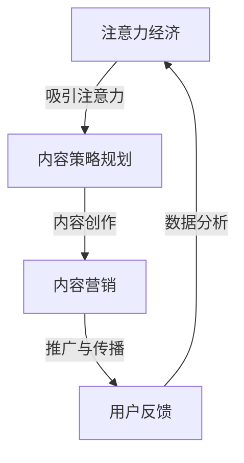

                 

# 注意力经济与内容策略规划

## 概述

在当今数字化的时代，注意力经济成为了一个至关重要的概念。注意力经济，简单来说，是指在一个信息过载的环境中，受众的注意力资源变得稀缺，从而成为一种新的经济资源。在这种背景下，内容策略规划显得尤为重要，因为它涉及到如何有效地利用注意力资源，以创造和推广有价值的内容，从而吸引并留住受众。

### 核心概念与联系

注意力经济与内容策略规划之间的联系在于，内容策略规划的核心在于理解受众的注意力分配，并利用这种理解来创造、推广和优化内容。注意力经济的基本原理表明，受众的注意力是有限的，因此如何吸引并保持他们的注意力成为了一个关键问题。

为了更好地理解这一概念，我们可以使用Mermaid流程图来描绘注意力经济与内容策略规划之间的互动关系：



在这个流程图中，我们可以看到，注意力经济通过吸引注意力这一过程与内容策略规划相连，而内容策略规划又通过内容创作、推广与传播、用户反馈等环节不断循环，以优化内容策略。

### 核心算法原理讲解

在内容策略规划中，核心算法主要涉及数据分析与用户行为分析。以下是用户行为分析的伪代码：

```python
# 用户行为分析伪代码

# 定义用户行为数据
user_behavior = {
    "clicks": 100,
    "views": 200,
    "shares": 50,
    "comments": 30
}

# 计算用户行为得分
def calculate_user_score(behavior):
    score = 0
    for action, count in behavior.items():
        if action == "clicks":
            score += count * 10
        elif action == "views":
            score += count * 5
        elif action == "shares":
            score += count * 20
        elif action == "comments":
            score += count * 15
    return score

# 获取用户得分
user_score = calculate_user_score(user_behavior)

# 输出用户得分
print("User Score:", user_score)
```

在这个例子中，我们定义了一个用户行为数据字典，然后通过一个函数计算用户的得分。点击、观看、分享和评论的不同行为赋予不同的权重，以综合评估用户的行为得分。

### 数学模型与公式详细讲解

在内容策略规划中，常用的数学模型包括用户参与度模型和内容推荐模型。以下是用户参与度模型的公式：

$$
User\ Activity\ Score = f(click\ rate, view\ rate, share\ rate, comment\ rate)
$$

其中，点击率（Click Rate），观看率（View Rate），分享率（Share Rate），评论率（Comment Rate）均为0到1之间的比例。

举例说明，假设某用户的内容行为如下：

- 点击次数：100次
- 浏览次数：200次
- 分享次数：50次
- 评论次数：30次

根据用户行为得分计算公式，我们可以计算出该用户的参与度得分：

$$
User\ Activity\ Score = 100 \times 0.1 + 200 \times 0.05 + 50 \times 0.2 + 30 \times 0.15 = 17.5
$$

### 项目实战

#### 内容策略实战案例：创建并推广一篇博客文章

**目标**：撰写并推广一篇关于“注意力经济与内容策略”的博客文章，吸引新受众并提高文章的阅读量。

**环境搭建**：
1. 选择博客平台（例如WordPress）
2. 安装并配置SEO插件（例如Yoast SEO）
3. 准备内容创作工具（例如Google Docs）

**内容创作**：
1. 确定文章主题和标题（例如：“注意力经济：理解内容策略的关键”）
2. 进行市场研究，收集相关数据和案例
3. 撰写文章初稿，确保内容具有可读性和专业性
4. 审核并优化文章，确保SEO最佳化

**内容推广**：
1. 在社交媒体平台（例如Twitter，LinkedIn）分享文章
2. 使用相关关键词进行SEO优化，提高搜索引擎排名
3. 与行业内的博客和论坛合作，进行内容互换和推荐
4. 定期跟踪和分析文章的阅读量和用户反馈

**代码解读与分析**：
1. 使用Python进行数据分析，生成文章的阅读量和用户参与度报告
   ```python
   # Python代码示例：分析文章阅读量和用户参与度

   # 假设已有文章阅读数据
   readings = {
       "article1": 500,
       "article2": 200,
       "article3": 300
   }

   # 计算每篇文章的阅读量占比
   total_readings = sum(readings.values())
   for article, count in readings.items():
       print(f"{article} Reading Rate: {count / total_readings * 100:.2f}%")

   # 分析用户参与度
   user_actions = {
       "article1": {"likes": 50, "shares": 20, "comments": 10},
       "article2": {"likes": 30, "shares": 10, "comments": 5},
       "article3": {"likes": 40, "shares": 15, "comments": 8}
   }

   for article, actions in user_actions.items():
       total_actions = sum(actions.values())
       print(f"{article} User Activity Rate: {total_actions / total_readings * 100:.2f}%")
   ```

通过上述案例，我们可以看到如何利用注意力经济原理进行内容策略规划，并通过实际案例展示了整个过程的实施和效果分析。这不仅有助于提高内容的吸引力，还能帮助企业和个人更好地理解受众需求，优化内容策略。

### 总结

注意力经济与内容策略规划是现代数字化营销中不可或缺的两个概念。通过理解注意力经济的原理，我们可以更有效地规划内容策略，从而创造和推广有价值的内容。本文通过核心概念讲解、算法原理分析、数学模型阐述以及实际项目案例，详细介绍了如何应用注意力经济原理进行内容策略规划。希望读者能够从中获得启发，为自己的内容营销之路提供指导。

## 作者信息

作者：AI天才研究院/AI Genius Institute & 禅与计算机程序设计艺术 /Zen And The Art of Computer Programming

