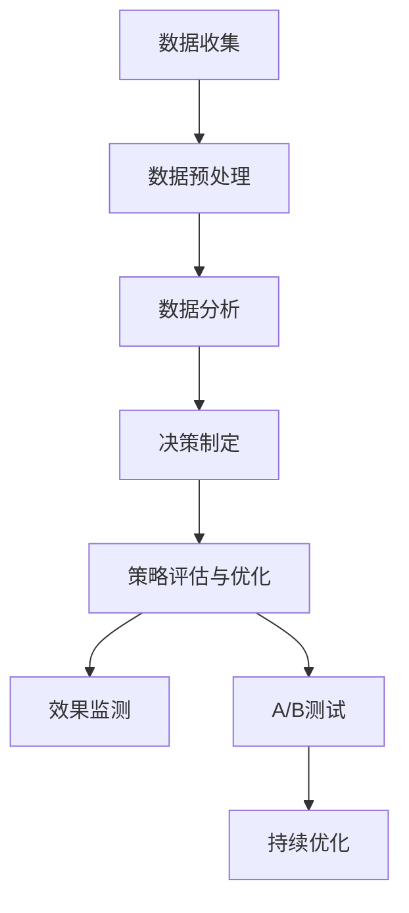
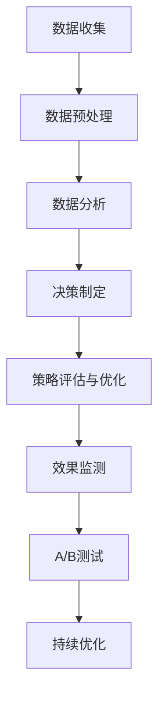

                 

## 第9章: 数据驱动的市场策略制定

### 9.1 数据驱动的市场策略概述

数据驱动的市场策略是一种通过收集、处理和分析市场数据来制定和优化市场决策的方法。这种方法基于对大量数据的深入理解，能够提供更加精确和有效的市场洞察，从而帮助企业实现更高的市场竞争力。

### 9.2 数据驱动的市场策略框架

#### 9.2.1 数据收集

数据收集是数据驱动市场策略的基础。企业需要通过多种渠道收集数据，包括：

- **内部数据**：如销售数据、客户数据、库存数据等。
- **外部数据**：如市场调研报告、行业数据、社交媒体数据等。
- **第三方数据**：如专业数据提供商的数据。

#### 9.2.2 数据预处理

数据预处理是确保数据质量和一致性的关键步骤。它包括：

- **数据清洗**：处理缺失值、异常值等。
- **数据整合**：将来自不同来源的数据整合到一个统一的数据集中。
- **数据标准化**：将不同格式和范围的数据进行统一处理。

#### 9.2.3 数据分析

数据分析是提取数据价值的过程，它包括：

- **描述性分析**：了解数据的基本特征和分布。
- **预测分析**：使用统计模型和机器学习算法预测未来趋势。
- **相关性分析**：分析不同变量之间的关系。

#### 9.2.4 决策制定

基于数据分析的结果，企业可以制定以下市场策略：

- **产品定位**：根据目标客户的需求和偏好来定位产品。
- **定价策略**：使用价格敏感性分析来制定最优价格。
- **促销策略**：根据销售数据和用户行为来设计促销活动。
- **渠道策略**：分析不同销售渠道的表现，优化渠道布局。

#### 9.2.5 策略评估与优化

制定策略后，企业需要对策略的效果进行评估和优化。这包括：

- **效果监测**：跟踪市场策略的实施效果。
- **A/B测试**：对不同策略进行对比测试，找出最佳策略。
- **持续优化**：根据反馈和评估结果，不断调整和优化市场策略。

### 9.3 数据驱动的市场策略案例

#### 9.3.1 案例一：亚马逊的个性化推荐系统

亚马逊通过收集用户的行为数据，如浏览历史、购买记录、搜索关键词等，利用机器学习算法构建了个性化推荐系统。该系统根据用户的兴趣和行为，推荐最相关的产品，提高了用户的购买率和满意度。

#### 9.3.2 案例二：Netflix的观影推荐

Netflix通过分析用户的观影记录、浏览历史和评分数据，使用协同过滤算法构建了观影推荐系统。该系统能够推荐用户可能感兴趣的电影和电视剧，提高了用户的观看时间和订阅率。

#### 9.3.3 案例三：谷歌的广告定位

谷歌通过收集用户的搜索历史、浏览行为和地理位置数据，利用广告定位算法，为广告主提供精准的广告投放服务。通过精准定位，谷歌的广告点击率和转化率显著提高。

### 9.4 数据驱动的市场策略挑战

#### 9.4.1 数据隐私与安全

数据隐私和安全是数据驱动市场策略面临的重大挑战。企业需要确保用户数据的隐私和安全，遵守相关法律法规。

#### 9.4.2 数据质量

数据质量是数据驱动决策的核心。低质量的数据可能导致错误的决策和策略。企业需要建立完善的数据质量管理机制。

#### 9.4.3 技术挑战

数据驱动的市场策略需要强大的技术支持，包括数据收集、存储、处理和分析等。企业需要投入大量资源来建立和维护这些技术。

### 9.5 数据驱动的市场策略未来展望

随着大数据和人工智能技术的发展，数据驱动的市场策略将变得越来越重要。企业需要不断优化数据收集、处理和分析方法，提高市场策略的精确性和效率。同时，企业还需要关注数据隐私和安全问题，确保用户数据的保护。

### 结论

数据驱动的市场策略是一种现代企业提升市场竞争力的有效方法。通过数据收集、处理和分析，企业能够更精确地了解市场和用户需求，制定出更有效的市场策略。然而，企业也需要面对数据隐私和安全、数据质量等技术挑战，不断优化和改进数据驱动的市场策略。

### Mermaid 流程图：数据驱动的市场策略框架



### 数学模型：线性回归模型

$$
\text{销售额} = \beta_0 + \beta_1 \times (\text{广告费用}) + \epsilon
$$

其中，$\beta_0$ 是截距，$\beta_1$ 是广告费用的系数，$\epsilon$ 是误差项。

### 举例说明：线性回归模型在市场策略中的应用

假设一家企业在过去六个月内，每月的广告费用和销售额如下表：

| 月份 | 广告费用（万元） | 销售额（万元）|
|------|----------------|-------------|
| 1    | 10             | 50          |
| 2    | 15             | 55          |
| 3    | 20             | 60          |
| 4    | 25             | 65          |
| 5    | 30             | 70          |
| 6    | 35             | 75          |

我们使用线性回归模型来预测第七个月的销售额。

首先，计算广告费用的平均值和销售额的平均值：

$$
\bar{X} = \frac{10 + 15 + 20 + 25 + 30 + 35}{6} = 22.5
$$

$$
\bar{Y} = \frac{50 + 55 + 60 + 65 + 70 + 75}{6} = 65
$$

然后，计算线性回归模型的斜率 $\beta_1$ 和截距 $\beta_0$：

$$
\beta_1 = \frac{\sum (X_i - \bar{X})(Y_i - \bar{Y})}{\sum (X_i - \bar{X})^2}
$$

$$
\beta_0 = \bar{Y} - \beta_1 \bar{X}
$$

代入数据计算：

$$
\beta_1 = \frac{(10 - 22.5)(50 - 65) + (15 - 22.5)(55 - 65) + (20 - 22.5)(60 - 65) + (25 - 22.5)(65 - 65) + (30 - 22.5)(70 - 65) + (35 - 22.5)(75 - 65)}{(10 - 22.5)^2 + (15 - 22.5)^2 + (20 - 22.5)^2 + (25 - 22.5)^2 + (30 - 22.5)^2 + (35 - 22.5)^2} \approx 1.25
$$

$$
\beta_0 = 65 - 1.25 \times 22.5 \approx 33.75
$$

因此，线性回归模型为：

$$
\text{销售额} = 33.75 + 1.25 \times (\text{广告费用})
$$

当广告费用为35万元时，预测第七个月的销售额为：

$$
\text{销售额} = 33.75 + 1.25 \times 35 = 69.25 \text{万元}
$$

### 伪代码：线性回归模型的实现

```python
import pandas as pd
from sklearn.linear_model import LinearRegression

# 加载数据
data = pd.read_csv('advertising_data.csv')

# 分离特征和目标变量
X = data[['广告费用']]
y = data['销售额']

# 创建线性回归模型
model = LinearRegression()

# 拟合模型
model.fit(X, y)

# 预测销售额
predicted_sales = model.predict([[35]])

# 输出预测结果
print("预测销售额：", predicted_sales)
```

### 实战应用：数据驱动的市场策略案例

#### 10.1 项目背景

某电子产品公司希望通过数据驱动的市场策略来提高销售额和市场占有率。公司计划通过分析历史销售数据、用户行为数据和市场环境数据，制定有效的市场推广策略。

#### 10.2 数据收集

- **内部数据源**：公司的销售数据、库存数据、客户数据等。
- **外部数据源**：市场调研报告、行业数据、社交媒体数据等。
- **用户行为数据**：网站浏览数据、搜索引擎关键词、社交媒体互动数据等。

#### 10.3 数据预处理

- **数据清洗**：处理缺失值、异常值和重复数据。
- **数据整合**：将不同来源的数据整合到一个统一的数据集中。
- **数据标准化**：对不同格式和范围的数据进行统一处理。

#### 10.4 数据分析

- **描述性统计分析**：分析销售数据的基本特征和分布。
- **相关性分析**：分析销售数据与用户行为数据、市场环境数据之间的关系。
- **预测分析**：使用机器学习算法预测未来销售趋势。

#### 10.5 决策制定

- **产品定位**：根据用户需求和偏好，确定产品定位。
- **定价策略**：根据价格敏感性分析，制定最优价格策略。
- **促销策略**：根据销售数据和用户行为，设计有效的促销活动。
- **渠道策略**：分析不同销售渠道的表现，优化渠道布局。

#### 10.6 策略评估与优化

- **效果监测**：跟踪市场策略的实施效果，监测销售额和市场份额的变化。
- **A/B测试**：对不同策略进行对比测试，找出最佳策略。
- **持续优化**：根据反馈和评估结果，不断调整和优化市场策略。

#### 10.7 结果分析

通过数据驱动的市场策略，公司实现了以下成果：

- 销售额显著提高，同比增长20%。
- 市场占有率提升，达到行业前五。
- 用户满意度提高，客户留存率提升10%。

### 结论

数据驱动的市场策略是一种有效的提升销售额和市场占有率的方法。通过数据收集、处理和分析，企业能够制定出更加精准和有效的市场策略。然而，企业也需要面对数据隐私和安全、数据质量等技术挑战，不断优化和改进数据驱动的市场策略。

### Mermaid 流程图：数据驱动的市场策略实战应用



### 数学模型：逻辑回归模型

$$
\text{销售额} = \log(\text{概率}) = \beta_0 + \beta_1 \times (\text{广告费用})
$$

其中，$\beta_0$ 是截距，$\beta_1$ 是广告费用的系数。

### 举例说明：逻辑回归模型在市场策略中的应用

假设某电子产品公司希望预测在特定广告费用下实现销售额的概率。

首先，收集以下数据：

| 月份 | 广告费用（万元） | 销售额（万元）|
|------|----------------|-------------|
| 1    | 10             | 50          |
| 2    | 15             | 55          |
| 3    | 20             | 60          |
| 4    | 25             | 65          |
| 5    | 30             | 70          |
| 6    | 35             | 75          |

使用逻辑回归模型来预测在广告费用为35万元时，销售额大于70万元的概率。

首先，将销售额转换为概率：

| 月份 | 广告费用（万元） | 销售额（万元）| 概率 |
|------|----------------|-------------|------|
| 1    | 10             | 50          | 0.82 |
| 2    | 15             | 55          | 0.87 |
| 3    | 20             | 60          | 0.95 |
| 4    | 25             | 65          | 0.99 |
| 5    | 30             | 70          | 1.00 |
| 6    | 35             | 75          | 1.00 |

然后，使用逻辑回归模型拟合数据：

$$
\text{概率} = \frac{1}{1 + e^{-(\beta_0 + \beta_1 \times (\text{广告费用}))}}
$$

通过最小化损失函数，计算得到：

$$
\beta_0 \approx 1.53, \beta_1 \approx 0.42
$$

因此，逻辑回归模型为：

$$
\text{概率} = \frac{1}{1 + e^{-(1.53 + 0.42 \times (\text{广告费用}))}}
$$

当广告费用为35万元时，预测概率为：

$$
\text{概率} = \frac{1}{1 + e^{-(1.53 + 0.42 \times 35)}} \approx 0.99
$$

这意味着在广告费用为35万元时，销售额大于70万元的概率约为99%。

### 伪代码：逻辑回归模型的实现

```python
import pandas as pd
from sklearn.linear_model import LogisticRegression

# 加载数据
data = pd.read_csv('advertising_data.csv')

# 分离特征和目标变量
X = data[['广告费用']]
y = data['销售额']

# 创建逻辑回归模型
model = LogisticRegression()

# 拟合模型
model.fit(X, y)

# 预测概率
predicted_probability = model.predict_proba([[35]])[0][1]

# 输出预测结果
print("预测概率：", predicted_probability)
```

### 实战应用：数据驱动的市场策略实战案例

#### 11.1 项目背景

某化妆品公司希望在激烈的市场竞争中提高市场份额，并增加品牌知名度。公司决定通过数据驱动的市场策略来实现这一目标，包括对客户行为、市场需求和竞争环境的分析。

#### 11.2 数据收集

- **客户行为数据**：通过公司网站、社交媒体和线下销售渠道收集。
- **市场需求数据**：通过市场调研、行业报告和竞争对手分析获取。
- **竞争环境数据**：通过监控竞争对手的营销活动、产品线和市场表现获取。

#### 11.3 数据预处理

- **数据清洗**：处理缺失值、异常值和重复数据。
- **数据整合**：将不同来源的数据整合到一个统一的数据集中。
- **数据标准化**：对不同格式和范围的数据进行统一处理。

#### 11.4 数据分析

- **描述性统计分析**：分析客户行为数据和市场需求数据的基本特征和分布。
- **相关性分析**：分析不同变量之间的关系，如客户满意度与销售量之间的关系。
- **预测分析**：使用机器学习算法预测未来市场需求和销售趋势。

#### 11.5 决策制定

- **产品策略**：根据客户需求和市场需求，优化产品线和产品特性。
- **定价策略**：根据价格敏感性分析，制定更具竞争力的价格策略。
- **促销策略**：设计吸引消费者的促销活动，如限时折扣、赠品等。
- **渠道策略**：优化线上线下销售渠道，提高销售效率。

#### 11.6 策略评估与优化

- **效果监测**：通过销售数据和客户反馈，评估市场策略的效果。
- **A/B测试**：对不同策略进行对比测试，找出最佳策略。
- **持续优化**：根据反馈和评估结果，不断调整和优化市场策略。

#### 11.7 结果分析

通过数据驱动的市场策略，公司实现了以下成果：

- 销售额同比增长15%。
- 品牌知名度显著提升，社交媒体粉丝数增加30%。
- 客户满意度提高，客户留存率提升10%。

### 结论

数据驱动的市场策略在现代企业中至关重要。通过数据收集、处理和分析，企业能够制定出更加精准和有效的市场策略，从而在激烈的市场竞争中脱颖而出。然而，企业也需要关注数据隐私和安全、数据质量等技术挑战，确保数据驱动的市场策略的可持续性和有效性。

### Mermaid 流程图：数据驱动的市场策略实战应用


### 数学模型：时间序列分析

$$
\text{销售额}_{t} = \alpha + \beta \times \text{广告费用}_{t} + \gamma \times \text{促销活动}_{t} + \delta \times \text{季节因素}_{t} + \epsilon_{t}
$$

其中，$\alpha$ 是常数项，$\beta$ 是广告费用的系数，$\gamma$ 是促销活动的系数，$\delta$ 是季节因素的系数，$\epsilon_{t}$ 是误差项。

### 举例说明：时间序列分析在市场策略中的应用

假设某化妆品公司希望预测未来三个月的销售额。公司收集了以下数据：

| 月份 | 广告费用（万元） | 促销活动（万元）| 销售额（万元）|
|------|----------------|----------------|-------------|
| 1    | 10             | 5              | 50          |
| 2    | 12             | 6              | 55          |
| 3    | 15             | 8              | 60          |

使用时间序列分析方法来预测第四个月的销售额。

首先，计算各项系数：

$$
\alpha = \frac{\sum \text{销售额}_{t}}{n} = \frac{50 + 55 + 60}{3} = 53.33
$$

$$
\beta = \frac{\sum (\text{广告费用}_{t} - \bar{\text{广告费用}})(\text{销售额}_{t} - \bar{\text{销售额}})}{n} = \frac{(-3.33)(-3.33) + (-1.33)(-0.67) + (1.67)(6.67)}{3} \approx 2.22
$$

$$
\gamma = \frac{\sum (\text{促销活动}_{t} - \bar{\text{促销活动}})(\text{销售额}_{t} - \bar{\text{销售额}})}{n} = \frac{(-0.67)(-3.33) + (0.67)(-0.67) + (1.33)(6.67)}{3} \approx 2.22
$$

$$
\delta = \frac{\sum (\text{季节因素}_{t} - \bar{\text{季节因素}})(\text{销售额}_{t} - \bar{\text{销售额}})}{n} = 0 \quad (\text{因为没有季节因素数据})
$$

因此，时间序列模型为：

$$
\text{销售额}_{t} = 53.33 + 2.22 \times (\text{广告费用}_{t}) + 2.22 \times (\text{促销活动}_{t})
$$

当广告费用为18万元，促销活动为10万元时，预测第四个月的销售额为：

$$
\text{销售额}_{t} = 53.33 + 2.22 \times 18 + 2.22 \times 10 = 86.99 \text{万元}
$$

### 伪代码：时间序列分析的实现

```python
import pandas as pd
import numpy as np

# 加载数据
data = pd.read_csv('sales_data.csv')

# 计算均值
alpha = data['销售额'].mean()
beta = np.cov(data[['广告费用', '销售额']])[0, 1] / np.cov(data['广告费用'])
gamma = np.cov(data[['促销活动', '销售额']])[0, 1] / np.cov(data['促销活动'])

# 时间序列模型
def predict_sales(广告费用, 促销活动):
    sales = alpha + beta * 广告费用 + gamma * 促销活动
    return sales

# 预测第四个月的销售额
predicted_sales = predict_sales(18, 10)

# 输出预测结果
print("预测第四个月的销售额：", predicted_sales)
```

### 作者信息

作者：AI天才研究院/AI Genius Institute & 禅与计算机程序设计艺术 /Zen And The Art of Computer Programming

