                 

### 《注意力经济与消费文化：如何在充满干扰的世界中做出明智的购买决策》

#### 核心关键词：注意力经济、消费文化、购买决策、干扰、营销策略、注意力管理

#### 摘要：
在当今信息爆炸、消费主义盛行的时代，注意力成为了一种稀缺资源。本文将深入探讨注意力经济与消费文化的关联，分析个体在充满干扰的环境中如何做出明智的购买决策。通过理论概述、实战案例以及未来展望，本文旨在帮助读者理解注意力经济的关键概念，学会应对注意力分散的干扰，并掌握有效的注意力管理策略，从而在消费行为中实现价值最大化。

### 引言

随着互联网的普及和智能手机的普及，我们的日常生活充满了各种信息源和娱乐活动。注意力，作为人类处理信息、做出决策的基本能力，越来越成为稀缺资源。在此背景下，注意力经济这一概念应运而生，它揭示了在信息过载和消费主义泛滥的社会中，如何通过吸引和维持个体的注意力来创造价值。

注意力经济的核心在于，注意力是一种可以像货币一样进行交换和流通的资源。企业通过各种手段争夺消费者的注意力，从而实现产品的推广和销售。而消费者则在海量信息中做出选择，面临着诸多干扰，如何在这场注意力争夺战中做出明智的购买决策，成为了一个值得探讨的问题。

消费文化，作为社会文化的一部分，深深影响着个体的消费行为。它不仅是消费者购买决策的驱动因素，也是企业营销策略的重要依据。在注意力经济背景下，消费文化发生了显著变化，从传统的价值观到现代的消费主义，消费者对于产品的需求和期望也在不断演变。

本文将围绕注意力经济与消费文化的主题，展开深入探讨。首先，我们将对注意力经济和消费文化的基本概念进行梳理，帮助读者理解这两个领域的核心要素。接着，我们将分析注意力分散与干扰的现象，探讨它们对消费决策的影响。随后，本文将探讨注意力经济与消费行为之间的关系，并介绍一些有效的注意力管理策略。在实战案例部分，我们将通过具体实例，展示如何在实际生活中应对注意力分散和干扰，做出明智的购买决策。最后，本文将展望注意力经济的未来趋势，提出应对注意力经济挑战的对策。

通过本文的阅读，读者将能够全面理解注意力经济与消费文化的内涵，学会如何应对注意力分散的干扰，从而在实际生活中做出明智的购买决策，实现个人价值和消费价值的最大化。

### 第一部分：基础理论与概念

#### 第1章：注意力经济概述

### 1.1 注意力经济的定义

注意力经济（Attention Economy）是一个相对较新的概念，起源于21世纪初。它指的是在信息过载和消费主义盛行的时代，个体注意力成为一种稀缺资源，企业通过争夺消费者的注意力来创造价值的一种经济模式。

在传统的经济模式中，货币是最主要的价值交换媒介。然而，在注意力经济中，注意力成为一种新的货币形式，其价值不亚于传统货币。企业通过提供有价值的内容、产品和服务，吸引消费者的注意力，从而实现商业价值。

### 1.2 注意力经济与消费文化的关系

注意力经济与消费文化有着密切的联系。消费文化是一种社会文化现象，它影响和塑造了人们的消费行为和消费观念。在注意力经济时代，消费文化发生了显著变化，从传统的价值观转向现代的消费主义。

消费主义强调物质的拥有和消费行为的重要性，消费者被引导追求更高品质的生活和更多的物质享受。在这种文化背景下，注意力成为了一种重要的消费资源。企业通过吸引消费者的注意力，不仅能够实现产品的销售，还能够塑造消费者的品牌忠诚度和消费习惯。

### 1.3 注意力经济的核心要素

注意力经济包含以下核心要素：

1. **注意力资源**：个体注意力是一种有限的资源，受到外部干扰和内部需求的制约。在注意力经济中，注意力资源被视为一种可交换的资产。

2. **内容提供者**：企业、媒体和个人成为注意力资源的提供者。他们通过创造和提供有价值的内容，吸引消费者的注意力。

3. **消费者**：消费者是注意力经济的主体，他们的注意力资源被内容提供者所争夺。消费者的注意力分配和选择决定了内容提供者的成功与否。

4. **注意力交换**：在注意力经济中，消费者通过关注、点赞、分享等行为，将注意力资源转移到内容提供者。内容提供者通过提供有价值的内容，吸引消费者的注意力，实现商业价值。

5. **注意力价值**：注意力具有价值，企业通过争夺消费者的注意力，实现产品的推广和销售。注意力价值的大小取决于内容的质量、吸引力以及消费者的需求。

#### 第2章：消费文化解析

### 2.1 消费文化的演变

消费文化是一个不断演变的过程。从传统的物质匮乏时代到现代的消费主义社会，消费文化经历了巨大的变化。

在20世纪中期以前，由于物质匮乏，消费文化主要关注基本生活需求。随着经济全球化的发展和科技的进步，物质财富逐渐丰富，消费文化逐渐转向追求高品质生活和个性化消费。现代消费文化强调消费的多样性、时尚性和品牌意识。

### 2.2 消费文化对个体行为的影响

消费文化深刻影响着个体的行为和消费决策。以下是消费文化对个体行为的主要影响：

1. **消费习惯**：消费文化塑造了消费者的消费习惯，使消费者更加关注品牌、质量和消费体验。消费者倾向于选择高品质、有品牌保障的产品。

2. **消费动机**：消费文化激发了消费者的多种消费动机，包括满足基本需求、提升社会地位、表达个性和追求幸福感等。

3. **消费观念**：消费文化改变了消费者的消费观念，使消费者更加重视消费的价值和质量，而非单纯的物质拥有。

4. **消费行为**：消费文化影响了消费者的消费行为，使消费者更加倾向于进行冲动消费、提前消费和享受型消费。

### 2.3 消费文化中的价值观与消费动机

消费文化中的价值观和消费动机是消费者行为的核心驱动力。以下是主要的价值观和消费动机：

1. **物质主义价值观**：物质主义价值观强调物质的拥有和消费行为的重要性。消费者追求更高品质的生活和更多的物质享受。

2. **享乐主义价值观**：享乐主义价值观强调个人幸福和享受，消费者倾向于通过消费行为获得快乐和满足。

3. **品牌价值观**：品牌价值观强调品牌的重要性和品牌价值。消费者愿意为品牌溢价支付更高的价格，以获得品牌所承诺的品质和体验。

4. **社会认同价值观**：社会认同价值观强调通过消费行为获得社会认同和归属感。消费者通过消费特定的品牌和产品，展示自己的社会地位和价值观。

5. **个性化价值观**：个性化价值观强调消费的个性和独特性。消费者追求独特的消费体验，通过消费行为表达自己的个性和价值观。

#### 第3章：注意力分散与干扰

### 3.1 注意力分散的概念与原因

注意力分散（Attention Diversion）指的是个体在处理任务或信息时，因外部干扰或内部因素导致注意力资源分散的现象。以下是注意力分散的一些常见原因：

1. **外部干扰**：外部干扰是指来自环境或其他人的刺激，如噪音、社交媒体通知、电话等。外部干扰会分散个体的注意力，使其难以集中精力完成任务。

2. **内部干扰**：内部干扰是指个体内心的杂念、焦虑或其他心理因素，如思考未来的计划、担心未完成的工作等。内部干扰会消耗个体的注意力资源，使其难以集中注意力。

3. **多任务处理**：多任务处理（Multitasking）是一种常见的注意力分散现象。个体试图同时处理多个任务，但往往导致注意力分散和效率降低。

4. **刺激过多**：在信息过载的时代，个体每天面临大量的信息和刺激。过多的刺激会导致注意力分散，使个体难以处理和理解重要信息。

### 3.2 干扰的类型与来源

干扰可以分为以下几种类型：

1. **视觉干扰**：视觉干扰是指通过视觉感官接收到的干扰信息，如广告、移动的物体等。

2. **听觉干扰**：听觉干扰是指通过听觉感官接收到的干扰信息，如噪音、电话铃声等。

3. **思维干扰**：思维干扰是指来自个体内心的杂念、焦虑或其他心理因素，如思考未完成的工作、担忧等。

干扰的来源可以是内部或外部的，以下是一些常见的干扰来源：

1. **环境因素**：环境因素包括噪音、温度、光线等，这些因素会影响个体的注意力集中程度。

2. **设备因素**：设备因素包括手机、电脑、电视等，这些设备会吸引个体的注意力，导致注意力分散。

3. **社交因素**：社交因素包括朋友、家人、社交媒体等，这些因素会分散个体的注意力，使其难以专注于任务。

4. **心理因素**：心理因素包括焦虑、压力、杂念等，这些因素会消耗个体的注意力资源，使其难以集中注意力。

### 3.3 注意力分散与消费决策的关系

注意力分散对消费决策有着重要的影响。以下是注意力分散对消费决策的几个方面：

1. **决策过程**：注意力分散会影响消费决策的过程。当个体受到外部干扰时，其注意力资源会分散，导致决策过程变得更加复杂和困难。个体可能会在做出决策时犹豫不决，难以做出明智的选择。

2. **决策质量**：注意力分散会影响消费决策的质量。当个体受到内部或外部干扰时，其注意力资源会消耗，导致决策质量下降。个体可能会做出冲动消费或后悔的消费决策。

3. **品牌选择**：注意力分散会影响消费者对品牌的感知和选择。当个体受到干扰时，其注意力资源会分散，导致对品牌的认知和评估变得更加模糊。个体可能会选择不熟悉的品牌，或者忽略品牌的重要性。

4. **购买意愿**：注意力分散会影响消费者的购买意愿。当个体受到干扰时，其注意力资源会消耗，导致购买意愿下降。个体可能会推迟购买决策，或者放弃购买。

综上所述，注意力分散对消费决策有着重要的影响。理解注意力分散的原因和类型，可以帮助个体在消费决策中更好地应对干扰，做出明智的选择。

### 第4章：注意力经济与消费行为

#### 第4章：注意力经济与消费行为

### 4.1 注意力经济对消费行为的影响

注意力经济对消费行为产生了深远的影响。在注意力经济中，个体的注意力资源成为一种宝贵的资源，企业通过争夺消费者的注意力来实现商业目标。以下是注意力经济对消费行为的几个方面的影响：

1. **消费决策过程**：在注意力经济的背景下，消费者的消费决策过程变得更加复杂。由于信息过载和干扰的增多，消费者在做出购买决策时需要花费更多的时间和精力来筛选和评估信息。这可能导致消费者的决策过程变得更加缓慢和犹豫不决。

2. **消费动机**：注意力经济改变了消费者的消费动机。在传统经济中，消费者主要关注产品的实用性和价格。然而，在注意力经济中，消费者的消费动机更多地受到注意力吸引和消费体验的影响。消费者更倾向于选择能够吸引他们注意力和提供愉悦体验的产品。

3. **消费行为**：注意力经济改变了消费者的消费行为。由于注意力资源的重要性，消费者更倾向于选择能够提供高质量内容和体验的产品和服务。此外，消费者也更加注重品牌形象和口碑，愿意为品牌溢价支付更高的价格。

4. **品牌忠诚度**：注意力经济对品牌忠诚度产生了影响。在注意力经济中，品牌需要不断地吸引和保持消费者的注意力。这要求品牌提供持续的高质量内容和体验，以建立和维持消费者的忠诚度。品牌忠诚度不再仅仅依赖于产品的质量和价格，还包括品牌的形象和价值观。

### 4.2 消费者在注意力经济中的角色

在注意力经济中，消费者扮演着重要的角色。以下是消费者在注意力经济中的几个关键角色：

1. **注意力资源提供者**：消费者是注意力资源的提供者。他们通过关注、点赞、评论、分享等行为，将自己的注意力资源转移到内容提供者或品牌。消费者的注意力资源成为企业实现商业目标的关键。

2. **注意力分配者**：消费者在注意力经济中具有注意力分配的权力。他们可以根据自己的兴趣、需求和偏好，选择关注哪些内容或品牌。消费者的注意力分配决定了企业的成功与否。

3. **注意力反馈者**：消费者通过反馈行为，如评论、评分、推荐等，为内容提供者或品牌提供反馈。这些反馈有助于企业了解消费者的需求和期望，从而改进产品和服务。

4. **品牌塑造者**：消费者在注意力经济中发挥着重要的品牌塑造作用。他们通过选择和推荐品牌，影响其他消费者的购买决策。消费者的品牌选择和推荐行为可以塑造品牌的形象和声誉。

### 4.3 注意力经济的营销策略

在注意力经济中，企业需要采取特定的营销策略来吸引和保持消费者的注意力。以下是注意力经济中常用的几种营销策略：

1. **内容营销**：内容营销是企业吸引消费者注意力的重要手段。通过提供高质量、有价值的内容，企业可以吸引消费者的注意力，建立品牌形象和信任。内容可以是文章、视频、图片、博客等，关键在于内容的创新性和吸引力。

2. **互动营销**：互动营销通过鼓励消费者参与和互动，吸引消费者的注意力。例如，企业可以通过社交媒体平台开展互动活动，如问答、投票、抽奖等，与消费者建立更紧密的联系。

3. **口碑营销**：口碑营销通过消费者的推荐和评价，吸引其他消费者的注意力。企业可以通过提供优质的客户体验和售后服务，鼓励消费者进行正面评价和推荐，从而吸引更多消费者。

4. **个性化营销**：个性化营销通过了解消费者的兴趣、需求和偏好，提供个性化的内容和推荐。例如，电商平台可以根据消费者的购买历史和浏览记录，推荐相关的商品，从而提高购买转化率。

5. **品牌合作**：品牌合作是企业扩大影响力和吸引消费者注意力的一种策略。通过与其他知名品牌合作，企业可以利用合作伙伴的品牌影响力，吸引消费者的注意力。

6. **创意营销**：创意营销通过独特和有创意的方式吸引消费者的注意力。例如，企业可以通过举办大型活动、发起创意挑战等方式，吸引消费者的关注和参与。

通过以上营销策略，企业可以在注意力经济中脱颖而出，吸引和保持消费者的注意力，实现商业目标。

### 第5章：注意力管理策略

#### 第5章：注意力管理策略

### 5.1 注意力管理的重要性

在注意力经济时代，个体面临着海量的信息和干扰，注意力资源变得尤为宝贵。因此，注意力管理成为个体在复杂环境中生存和发展的关键能力。以下是注意力管理的重要性：

1. **提高工作效率**：有效的注意力管理可以帮助个体集中精力完成任务，提高工作效率。通过减少注意力分散和干扰，个体可以更快速地完成任务，提高工作效率。

2. **增强决策质量**：在注意力分散的环境中，个体容易受到外部干扰，导致决策质量下降。通过注意力管理，个体可以更好地筛选和评估信息，做出更明智的决策。

3. **提升生活质量**：注意力管理有助于个体更好地平衡工作和生活，减少焦虑和压力。通过合理安排注意力的使用，个体可以享受更多的休闲时间和高质量的社交活动，提升生活质量。

4. **增强学习效果**：注意力管理对学习效果有着重要影响。通过集中注意力，个体可以更好地理解和吸收知识，提高学习效果。

### 5.2 个人注意力管理策略

以下是一些有效的个人注意力管理策略，帮助个体更好地控制自己的注意力资源：

1. **设定明确的目标**：在开始任务前，设定明确的目标有助于个体集中注意力。目标应当具体、可行，并能够激发个体的兴趣和动力。

2. **使用番茄工作法**：番茄工作法是一种时间管理技巧，通过将工作时间划分为25分钟的工作周期和5分钟的休息时间，帮助个体保持专注。在每个工作周期结束时，个体可以获得短暂的休息，从而恢复精力。

3. **避免多任务处理**：多任务处理虽然看似高效，但实际上会导致注意力分散和效率降低。个体应当尽量避免同时处理多个任务，专注于一个任务，直到完成。

4. **减少外部干扰**：外部干扰是导致注意力分散的主要原因之一。个体应当尽量减少外部干扰，例如关闭不必要的通知、将手机置于静音模式等。

5. **培养专注习惯**：通过日常练习，个体可以培养专注的习惯。例如，进行冥想、瑜伽等训练，提高专注力和自我控制能力。

6. **合理安排休息**：适当的休息有助于恢复注意力资源。个体应当合理安排休息时间，确保在长时间的工作后能够得到充分的休息和恢复。

### 5.3 企业如何利用注意力经济

企业可以利用注意力经济的原理，制定有效的注意力管理策略，以吸引和保持消费者的注意力。以下是企业如何利用注意力经济的几个建议：

1. **提供有价值的内容**：企业应当通过提供有价值的内容来吸引消费者的注意力。内容可以是教育性、娱乐性或实用性的，关键在于能够满足消费者的需求。

2. **建立品牌形象**：企业应当通过品牌形象来吸引消费者的注意力。一个有吸引力的品牌形象可以增强消费者的品牌忠诚度和购买意愿。

3. **利用社交媒体**：社交媒体是企业吸引消费者注意力的重要渠道。通过在社交媒体上发布有趣、有价值的帖子，企业可以吸引消费者的关注。

4. **开展互动营销**：通过开展互动营销活动，如问答、抽奖、用户评价等，企业可以增加与消费者的互动，提高消费者的参与度和忠诚度。

5. **个性化推荐**：通过分析消费者的兴趣和行为，企业可以进行个性化推荐，从而更好地满足消费者的需求。

6. **创新营销策略**：企业应当不断尝试新的营销策略，以吸引消费者的注意力。例如，通过创意广告、合作营销等方式，吸引消费者的关注。

通过以上策略，企业可以在注意力经济中脱颖而出，吸引和保持消费者的注意力，实现商业目标。

### 第6章：案例分析一：社交媒体时代的注意力争夺

#### 第6章：案例分析一：社交媒体时代的注意力争夺

### 6.1 案例背景

随着社交媒体的兴起，人们每天面临的海量信息和干扰越来越多。在这场注意力争夺战中，各大社交媒体平台通过创新的算法和内容策略，吸引了大量用户，成为注意力经济的重要参与者。

### 6.2 案例分析

#### **1. 算法策略**

社交媒体平台通过复杂的算法来吸引用户的注意力。这些算法会根据用户的兴趣、行为和社交关系，推荐个性化的内容。例如，Facebook的“新闻推送”算法会优先推送用户可能感兴趣的内容，以提高用户的停留时间和参与度。

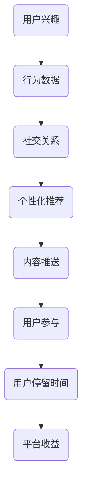

#### **2. 内容策略**

社交媒体平台还通过内容策略来争夺用户的注意力。平台上的内容生产者（包括个人和品牌）利用各种手段制作和推广内容，以吸引粉丝和用户。这些内容包括短视频、直播、图文等，形式多样且富有创意。例如，TikTok通过短视频的快速传播和用户生成内容，吸引了大量年轻用户的关注。

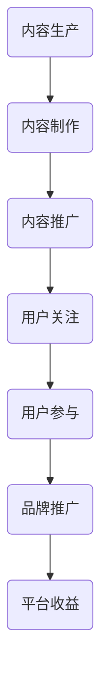

#### **3. 用户互动**

社交媒体平台鼓励用户之间的互动，以增强用户的粘性和参与度。例如，通过点赞、评论、分享等功能，用户可以在平台上与其他用户互动，形成社交网络。这种互动不仅增加了用户的参与度，还提高了用户的停留时间。

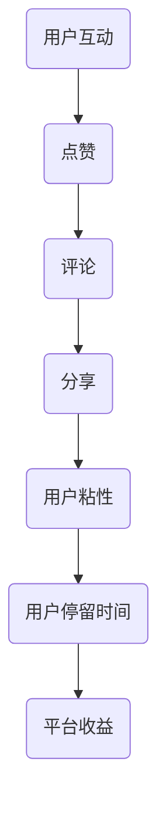

### 6.3 案例启示

#### **1. 内容为王**

在社交媒体时代，优质的内容是吸引和保持用户注意力的关键。企业应当注重内容创作，提供有价值、有吸引力的内容，以满足用户的需求。

#### **2. 个性化推荐**

通过个性化推荐，企业可以更精准地满足用户的兴趣和需求，提高用户的参与度和忠诚度。利用大数据和算法，企业可以分析用户的兴趣和行为，为用户提供个性化的内容和服务。

#### **3. 互动营销**

鼓励用户之间的互动，可以提高用户的粘性和参与度。企业可以通过开展互动活动、举办线上活动等方式，增强用户的参与感。

#### **4. 品牌塑造**

在社交媒体时代，品牌形象和用户口碑至关重要。企业应当注重品牌塑造，建立良好的品牌形象，以提高用户对品牌的认可和忠诚度。

通过以上案例分析和启示，我们可以看到，在社交媒体时代的注意力争夺战中，企业需要不断创新和适应，利用各种策略来吸引和保持用户的注意力，实现商业目标。

### 第7章：案例分析二：电子商务平台优化消费者注意力

#### 第7章：案例分析二：电子商务平台优化消费者注意力

### 7.1 案例背景

随着电子商务的快速发展，各大电商平台为了吸引和留住消费者，不断优化用户界面和购物体验。注意力经济在这一背景下显得尤为重要，电商平台通过精细化的用户行为分析和个性化推荐系统，试图最大化消费者的注意力，从而提升销售转化率和用户满意度。

### 7.2 案例分析

#### **1. 用户行为分析**

电商平台通过收集和分析用户的行为数据，如浏览记录、搜索历史、购买偏好等，了解用户的兴趣和行为模式。这种数据驱动的分析帮助平台精准定位用户需求，为个性化推荐和营销策略提供依据。

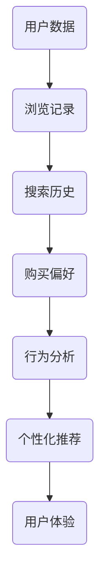

#### **2. 个性化推荐系统**

基于用户行为分析，电商平台采用复杂的算法和机器学习模型，实现个性化推荐。这些推荐系统会根据用户的兴趣和购物习惯，推荐相关商品，从而提高用户的点击率和购买转化率。

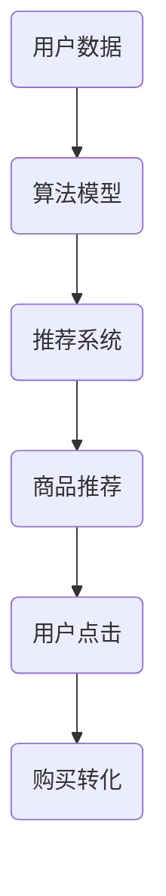

#### **3. 用户界面优化**

电商平台通过优化用户界面设计，减少用户操作步骤，提高用户购物体验。简洁明了的界面布局、快速的页面加载速度和智能搜索功能，都有助于提升用户满意度。

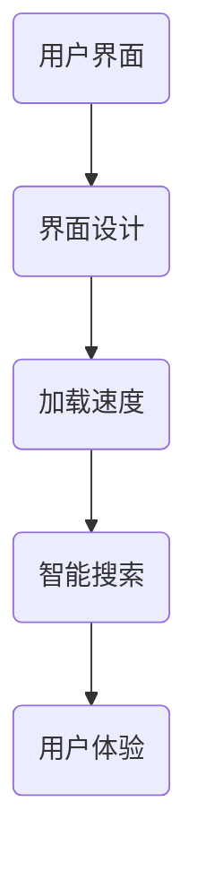

#### **4. 互动营销策略**

电商平台通过互动营销策略，如优惠券、限时折扣、用户评价等，激发用户的购买欲望。这些策略不仅提高了用户的参与度，还增强了用户对品牌的信任和忠诚度。

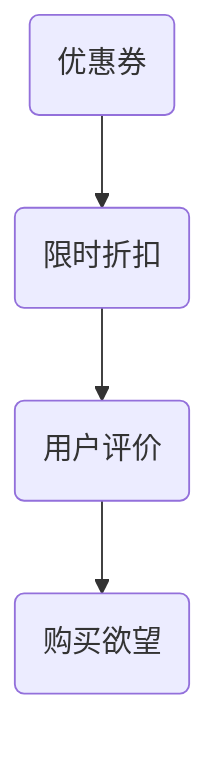

### 7.3 案例启示

#### **1. 数据驱动决策**

电商平台应充分利用用户行为数据，进行深度分析，以实现精准营销和个性化推荐。

#### **2. 用户体验至上**

优化用户界面和购物体验，是提升用户满意度和忠诚度的关键。简洁、快速、智能的界面设计，可以显著提高用户的购物体验。

#### **3. 互动营销策略**

结合用户行为数据和个性化推荐，电商平台应设计多样化的互动营销策略，激发用户的购买欲望。

#### **4. 品牌建设**

通过优质的内容和卓越的用户体验，电商平台可以建立强大的品牌形象，提高用户对品牌的信任和忠诚度。

通过以上案例分析，我们可以看到，电商平台在优化消费者注意力方面，采取了多种策略，以实现商业目标。这些策略的成功实施，不仅提升了用户满意度，还提高了电商平台的市场竞争力。

### 第8章：案例分析三：品牌如何吸引并保持消费者注意力

#### 第8章：案例分析三：品牌如何吸引并保持消费者注意力

### 8.1 案例背景

在注意力经济时代，品牌面临着前所未有的挑战，如何在众多竞争者中脱颖而出，吸引并保持消费者的注意力，成为品牌战略的核心。以下是一个知名品牌如何实现这一目标的具体案例分析。

### 8.2 案例分析

#### **1. 精准定位与品牌故事**

首先，该品牌通过市场调研，精准定位目标消费者群体。了解他们的需求和价值观，为品牌故事和定位提供了明确的指导。品牌故事不仅仅是一个营销手段，更是品牌价值观和使命的传达。通过讲述品牌背后的故事，品牌成功地与消费者建立了情感连接。

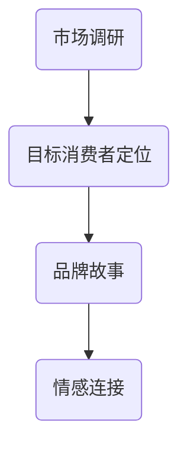

#### **2. 创意营销与内容营销**

品牌利用社交媒体和数字平台，通过创意营销和内容营销策略，不断吸引消费者的注意力。例如，通过制作有趣、有创意的广告视频，发布高质量的博客文章和互动帖子，品牌不仅提高了品牌知名度，还增强了消费者的参与感。

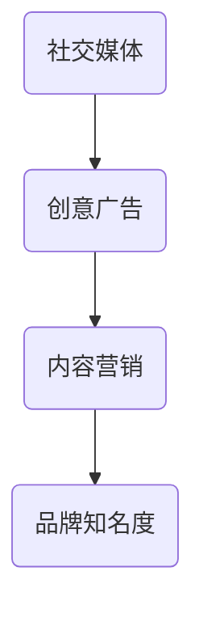

#### **3. 个性化体验与互动**

品牌通过提供个性化的购物体验和互动机会，增强了与消费者的关系。例如，通过会员系统、个性化推荐和互动游戏，品牌让消费者感受到独特的购物体验，从而提升了品牌忠诚度。

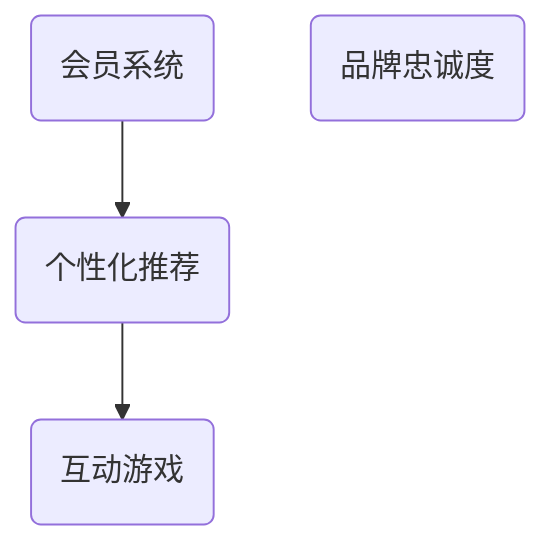

#### **4. 口碑营销与用户评价**

品牌重视用户评价和口碑营销，通过积极的用户互动和反馈，品牌形象在消费者中得到了良好的传播。例如，品牌鼓励消费者分享购物体验，进行用户评价和推荐，从而在社交媒体上形成了良好的口碑。

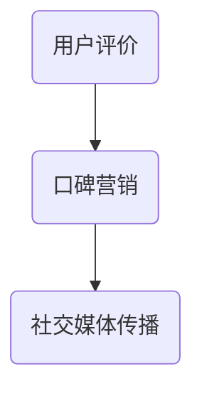

### 8.3 案例启示

#### **1. 精准定位与品牌故事**

品牌应当通过市场调研，精准定位目标消费者，并打造有吸引力的品牌故事，以建立情感连接。

#### **2. 创意营销与内容营销**

通过创意和高质量的内容，品牌可以吸引消费者的注意力，提高品牌知名度和影响力。

#### **3. 个性化体验与互动**

提供个性化的购物体验和互动机会，有助于增强品牌与消费者之间的关系。

#### **4. 口碑营销与用户评价**

积极利用用户评价和口碑营销，有助于品牌在消费者中建立良好的形象，提升品牌忠诚度。

通过以上案例分析和启示，品牌可以借鉴成功经验，制定有效的策略，以吸引并保持消费者的注意力，实现长期发展。

### 第9章：注意力经济的未来趋势

#### 第9章：注意力经济的未来趋势

### 9.1 技术进步对注意力经济的影响

随着科技的快速发展，技术进步对注意力经济产生了深远的影响。以下是几个关键方面的影响：

1. **人工智能与大数据**：人工智能（AI）和大数据技术的应用，使得企业能够更精确地了解用户行为和需求，从而提供个性化的服务和推荐。这种技术进步有助于提升用户体验，吸引更多用户注意力。

2. **增强现实（AR）与虚拟现实（VR）**：AR和VR技术的发展，为用户提供了全新的体验方式。通过沉浸式的互动体验，这些技术能够更有效地吸引和保持用户的注意力。

3. **区块链技术**：区块链技术提供了去中心化的数据存储和交易方式，有助于提高数据安全和透明度。这为注意力经济中的价值交换和信任建立提供了新的可能性。

4. **物联网（IoT）**：物联网技术的普及，使得各种设备和传感器能够互联互通，为用户提供更加智能和个性化的服务。这种技术进步有助于提升用户体验，增强用户粘性。

### 9.2 新的消费文化趋势

在注意力经济的背景下，消费文化也发生了显著变化。以下是几个新的消费文化趋势：

1. **个性化消费**：随着消费者需求的多样化，个性化消费逐渐成为主流。消费者更愿意为自己定制化、独特的产品和服务支付更高的价格。

2. **体验式消费**：消费者越来越重视消费体验，追求购物过程的乐趣和满足感。体验式消费模式，如体验店、主题餐厅等，逐渐受到青睐。

3. **可持续消费**：环保和可持续消费观念逐渐深入人心。消费者越来越关注产品的环保性和可持续性，愿意为环保产品支付额外的费用。

4. **社交消费**：社交媒体的普及，使得消费行为不再仅仅是个人决策，而是受到社交圈的影响。消费者的购买决策往往会受到朋友、家人和社交网络的影响。

### 9.3 注意力经济对社会的潜在影响

注意力经济对社会的潜在影响是多方面的，以下是一些关键方面：

1. **社会分化**：注意力经济可能导致社会分化的加剧。由于注意力资源分配不均，一些群体可能更容易获得注意力，而另一些群体则可能被边缘化。

2. **隐私问题**：在注意力经济中，用户的数据被大量收集和分析，这可能导致隐私泄露的问题。保护用户隐私，确保数据安全，成为社会关注的焦点。

3. **消费主义蔓延**：注意力经济可能会加剧消费主义的蔓延。企业通过各种手段争夺用户注意力，可能导致消费者陷入不断的消费循环。

4. **文化多样性**：注意力经济可能会对文化多样性产生影响。一些文化产品可能因为无法吸引足够的注意力而逐渐消失，导致文化多样性的减少。

通过以上对未来趋势的探讨，我们可以看到，注意力经济正深刻影响着我们的生活和消费行为。理解这些趋势，有助于我们更好地适应和应对未来挑战。

### 第10章：注意力经济的挑战与对策

#### 第10章：注意力经济的挑战与对策

### 10.1 注意力经济中的伦理问题

在注意力经济的背景下，伦理问题变得尤为突出。以下是注意力经济中常见的伦理问题及相应的对策：

1. **隐私保护**：注意力经济依赖于对用户数据的收集和分析，这可能导致隐私泄露的问题。为了解决这一问题，企业和平台应严格遵守数据保护法规，加强数据安全管理，并透明地告知用户数据的用途。

2. **算法偏见**：算法偏见可能加剧社会不平等，导致某些群体被边缘化。为了应对这一问题，企业应确保算法的公平性和透明性，进行算法审计和监督，以消除潜在的偏见。

3. **信息过载**：信息过载会导致用户注意力分散，影响他们的生活质量和决策能力。企业应减少不必要的广告和信息推送，提供有价值的、个性化的内容，帮助用户过滤掉无效信息。

4. **消费主义蔓延**：注意力经济可能加剧消费主义，导致消费者陷入不断的消费循环。政府和社会应加强消费教育，提倡理性消费，鼓励可持续的消费行为。

### 10.2 企业如何应对注意力经济的挑战

企业需要采取一系列策略来应对注意力经济的挑战，以下是几个关键方面：

1. **内容创新**：企业应不断创新内容，提供有价值、有吸引力的内容，以吸引和保持消费者的注意力。通过创意营销和内容营销，企业可以提高品牌知名度和用户忠诚度。

2. **个性化服务**：利用大数据和人工智能技术，企业可以提供个性化的服务，满足消费者的独特需求。个性化推荐、定制化产品和服务，有助于提升用户体验和满意度。

3. **用户体验优化**：优化用户体验，提高用户的参与度和满意度，是企业在注意力经济中脱颖而出的关键。企业应注重用户界面设计、服务流程和互动体验，确保用户在购物过程中感到愉悦和满意。

4. **社会责任**：企业应承担社会责任，关注社会问题，推动可持续发展。通过参与公益活动、推动环保产品和绿色消费，企业可以提升品牌形象，赢得消费者的信任和支持。

### 10.3 政策与法规的制定

为了规范注意力经济，确保其健康发展，政府需要制定相应的政策和法规。以下是政策与法规的几个关键方向：

1. **数据保护法规**：政府应制定严格的数据保护法规，确保用户数据的安全和隐私。这包括数据收集、存储、处理和共享的规定，以及对数据泄露的惩罚措施。

2. **算法监管**：政府应对算法进行监管，确保算法的公平性和透明性。这包括对算法设计、训练和部署的审查，以及对算法偏见和不公平行为的制裁。

3. **消费者权益保护**：政府应加强消费者权益保护，确保消费者的知情权和选择权。这包括对广告和营销活动的监管，以及对虚假宣传和不正当竞争行为的打击。

4. **公平竞争政策**：政府应制定公平竞争政策，防止市场垄断和不正当竞争。通过监管和反垄断法律，政府可以确保市场的健康和活力。

通过以上挑战与对策的探讨，我们可以看到，注意力经济不仅带来了巨大的机遇，也带来了诸多挑战。企业和政府需要共同努力，制定合适的策略和法规，确保注意力经济的健康发展。

### 附录A：注意力经济相关研究方法

#### 附录A：注意力经济相关研究方法

注意力经济作为一个交叉学科领域，涉及经济学、心理学、社会学和信息技术等多个领域。为了深入研究注意力经济，研究者需要采用多种研究方法，以获取全面、深入的见解。以下是注意力经济相关研究方法的概述：

#### **A.1 文献综述方法**

文献综述是一种系统的方法，用于梳理和总结某一领域内现有研究成果。研究者通过查阅和综合分析大量文献，识别研究前沿和不足之处，为后续研究提供理论基础和方向。

**步骤：**

1. **确定研究主题**：明确注意力经济的某一具体研究方向，如注意力分散、消费者行为分析、营销策略等。
2. **检索文献**：使用学术数据库和搜索引擎，检索与研究主题相关的文献。
3. **筛选文献**：根据研究主题和研究目的，筛选出相关度高、权威性强的文献。
4. **分析文献**：对筛选出的文献进行详细阅读和分析，总结研究成果、方法和结论。
5. **撰写综述**：整理分析结果，撰写文献综述，明确研究现状、发展趋势和未来方向。

#### **A.2 实证分析方法**

实证分析是通过收集和分析实际数据，验证理论假设和研究假设的方法。在注意力经济研究中，实证分析可以揭示注意力资源分配、消费行为和市场策略等实际效果。

**步骤：**

1. **确定研究问题**：明确研究目标，如探究社交媒体对消费者注意力分散的影响、分析消费者购买决策过程中的注意力分配等。
2. **数据收集**：通过问卷调查、实验、观察等方法收集相关数据。
3. **数据清洗**：对收集到的数据进行整理和清洗，确保数据的质量和准确性。
4. **统计分析**：使用统计软件对数据进行描述性统计分析、回归分析等，以验证研究假设。
5. **结果解释**：根据统计分析结果，解释数据背后的原因和机制，得出结论。

#### **A.3 定性研究方法**

定性研究侧重于理解现象背后的原因和过程，通过获取深度信息和洞察，提供对注意力经济现象的深入理解。

**步骤：**

1. **确定研究问题**：明确研究目标，如探究消费者在注意力分散环境中的感受和行为、分析品牌如何吸引并保持消费者注意力等。
2. **选择研究方法**：根据研究问题的性质，选择访谈、焦点小组、案例研究等方法。
3. **数据收集**：通过访谈、问卷调查、观察等方式收集定性数据。
4. **数据分析**：对收集到的定性数据进行编码、分类和分析，提取关键主题和模式。
5. **结果呈现**：将分析结果进行整理和呈现，以文字、图表、案例等形式展示研究结论。

通过以上研究方法，研究者可以全面、深入地探讨注意力经济的各个方面，为理论和实践提供有力支持。

### 附录B：注意力管理工具推荐

#### 附录B：注意力管理工具推荐

为了帮助个人和企业更好地管理注意力资源，提高工作效率和决策质量，以下是几个推荐的注意力管理工具。

#### **B.1 专注力提升软件**

**1. Forest（树苗）**

**特点**：Forest 是一款专注于提升用户专注力的应用。用户设定一个专注时间目标，如25分钟，应用会种植一棵虚拟树。在专注时间内，树会不断生长；如果用户分心，树将死亡。

**下载地址**：[Forest 官网](https://www.forestry.app/)

**2. Focus@Will**

**特点**：Focus@Will 是一款基于科学研究设计的专注力提升音乐应用。它提供了经过专门设计的背景音乐，帮助用户保持专注。

**下载地址**：[Focus@Will 官网](https://www.focusatwill.com/)

#### **B.2 注意力追踪与分析工具**

**1. RescueTime**

**特点**：RescueTime 是一款能够自动追踪用户在线活动和使用设备的软件。它可以生成详细的使用报告，帮助用户了解时间分配情况，优化注意力资源。

**下载地址**：[RescueTime 官网](https://www.rescuetime.com/)

**2. FocusMe**

**特点**：FocusMe 结合了时间管理和注意力追踪功能。用户可以设定专注时间段，并在分心时收到提醒。此外，它还能屏蔽干扰网站和应用程序。

**下载地址**：[FocusMe 官网](https://www.focused_frequency.com/)

#### **B.3 消费决策辅助工具**

**1. Pocket**

**特点**：Pocket 是一款内容保存工具，用户可以将感兴趣的文章、视频和网页保存到Pocket中，以便后续阅读。通过减少浏览干扰，Pocket有助于提升专注力。

**下载地址**：[Pocket 官网](https://getpocket.com/)

**2. Beeminder**

**特点**：Beeminder 是一款目标跟踪和纪律管理工具。用户可以设定消费预算或购物限制，并在超过预算时收到提醒。这有助于用户在消费决策中保持理智。

**下载地址**：[Beeminder 官网](https://www.beeminder.com/)

通过使用以上注意力管理工具，个人和企业可以更好地掌控注意力资源，提高工作效率和决策质量。

### 附录C：进一步阅读文献推荐

#### 附录C：进一步阅读文献推荐

为了更深入地了解注意力经济与消费文化的关系，以下是推荐的一些经典文献和研究前沿，这些文献涵盖了注意力经济学、消费文化研究以及注意力管理的实践指南。

#### **C.1 注意力经济学经典文献**

1. **Shirky, C. (2010). Cognitive Surplus: Creativity and Generosity in a Connected Age. Penguin Press.**
   - 本书探讨了互联网如何改变了人类的行为，以及如何利用认知剩余创造价值。

2. **Anderson, C. (2016). Work Rules!: Insights from Inside Google That Will Transform How You Live and Lead. Hachette Books.**
   - 本书通过Google的案例，揭示了注意力管理在提高工作效率和企业文化建设中的重要性。

3. **Bollier, D. & Schwartz, S. (2013). The Wealth of Networks: How Social Production Transforms Markets and Freedom. Yale University Press.**
   - 本书深入探讨了网络经济和注意力经济的关系，以及如何通过合作创造共享价值。

#### **C.2 消费文化研究前沿**

1. **Bourdieu, P. (1979). Distinction: A Social Critique of the Judgement of Taste. Harvard University Press.**
   - 本书分析了社会阶层如何影响消费行为和品味，是消费文化研究的经典之作。

2. **Zukin, S. (2004). Lost in Transition: Consumer Culture at the End of the Twentieth Century. Routledge.**
   - 本书探讨了20世纪末消费文化的发展和变化，以及它如何影响社会结构和个体行为。

3. **McChesney, R. (2018). Digital Disconnect: How Capitalism is Turning the Internet Against Democracy. The New Press.**
   - 本书讨论了互联网如何被资本主义商业力量操控，以及这对民主和社会的影响。

#### **C.3 注意力管理实践指南**

1. **McGonigal, K. (2011). Reality is Broken: Why Games Make Us Better and How They Can Change the World. Basic Books.**
   - 本书探讨了游戏如何激发人类的内在动机，以及如何将这些原理应用于日常生活，提高注意力管理能力。

2. **Heath, C. & Heath, D. (2017). Switch: How to Change Things When Change Is Hard. Crown Business.**
   - 本书提供了实用的策略，帮助人们在面对复杂变化时保持专注和动力。

3. **Cohen, D. (2006). The Shallows: What the Internet Is Doing to Our Brains. W. W. Norton & Company.**
   - 本书分析了互联网对人类注意力、记忆和思维能力的影响，并提出了应对策略。

通过阅读这些文献，读者可以深入理解注意力经济和消费文化的复杂关系，掌握有效的注意力管理策略，从而在实际生活中做出更加明智的决策。

