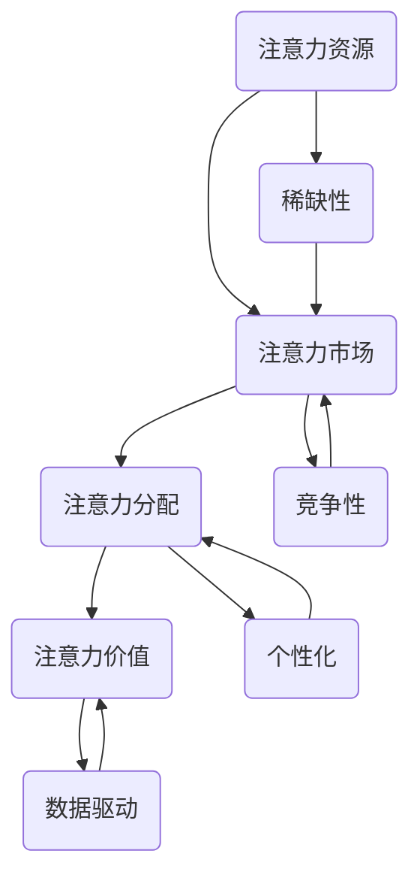

                 

# 注意力经济对语言学习方式的改变

## 关键词：注意力经济、语言学习、个性化教育、技术赋能、未来趋势

### 摘要

随着注意力经济的崛起，语言学习方式正在发生深刻变革。本文首先介绍了注意力经济的基本概念、特征及其对社会的深远影响。接着，本文深入探讨了注意力经济对语言学习的影响，包括传统语言学习方法的局限、基于注意力经济的语言学习新趋势，以及注意力经济对语言学习工具的改变。随后，本文通过具体案例分析展示了注意力经济在语言学习中的成功实践。最后，本文展望了注意力经济对语言学习未来的影响，提出了个人、教育机构和企业在注意力经济下的语言学习策略。本文旨在为读者提供一份全面、深入的注意力经济与语言学习交融的分析报告。

### 目录大纲

#### 第一部分：注意力经济概述

1. **第1章：注意力经济引论**
    1.1 **注意力经济概念**
    1.2 **注意力经济的特征与影响**
    1.3 **注意力经济与数字经济的关系**

2. **第2章：注意力经济对语言学习的改变**
    2.1 **注意力经济对语言学习的影响**
    2.2 **注意力经济下的语言学习新方式**
    2.3 **注意力经济对语言教育产业的变革**

3. **第3章：注意力经济案例分析**
    3.1 **案例一：Duolingo平台**
    3.2 **案例二：人工智能语言教师**
    3.3 **案例三：多语种社交媒体**

4. **第4章：注意力经济对语言学习的未来影响**
    4.1 **注意力经济与语言学习发展趋势**
    4.2 **注意力经济下的语言学习策略**
    4.3 **注意力经济与跨语言沟通的未来**

### 第一部分：注意力经济概述

## 第1章：注意力经济引论

### 1.1 注意力经济概念

### 1.1.1 注意力经济的起源

注意力经济这一概念最早由美国学者理查德·萨勒（Richard Salter）于2000年提出。他在《注意力经济学：注意力分配的规则、市场和制度》一书中首次系统地阐述了注意力经济的基本理论和框架。注意力经济的核心观点是，在信息爆炸的时代，人们的注意力成为一种稀缺资源，而谁能够吸引并保留用户的注意力，谁就拥有了商业价值和市场竞争力。

### 1.1.2 注意力经济的核心要素

注意力经济包含以下几个核心要素：

- **注意力资源**：指人们用于感知、处理信息的心理和生理资源。
- **注意力市场**：在市场中，各种信息和服务争夺用户的注意力，形成一种供求关系。
- **注意力分配**：用户将注意力资源分配给不同的信息和服务，受市场机制和个体偏好影响。
- **注意力价值**：用户的注意力被视为一种可以交换和创造价值的资源。

### 1.1.3 注意力经济的时代背景

注意力经济的兴起有其深刻的时代背景：

- **数字化时代**：互联网和数字技术的快速发展，使得信息传播速度和覆盖范围大幅提升。
- **信息过载**：随着信息量的爆炸性增长，用户面临选择困境，注意力资源变得稀缺。
- **个性化需求**：消费者越来越注重个性化体验，追求满足自身需求的优质内容。
- **商业竞争**：企业纷纷通过创新手段争夺用户注意力，提高市场份额。

### 1.2 注意力经济的特征与影响

#### 1.2.1 注意力经济的特征

注意力经济具有以下几个显著特征：

- **稀缺性**：注意力资源有限，用户如何高效分配注意力成为关键问题。
- **竞争性**：信息和服务之间争夺用户注意力，形成激烈的竞争态势。
- **个性化**：用户偏好多样化，个性化内容和服务成为吸引注意力的关键。
- **数据驱动**：通过对用户行为数据的分析，企业能够精准定位目标用户，提高营销效果。

#### 1.2.2 注意力经济对社会的深远影响

注意力经济对社会产生了广泛而深远的影响：

- **媒体变革**：媒体行业从内容导向转向用户导向，注重提供个性化内容。
- **商业策略**：企业通过创新营销手段和产品形态，争夺用户注意力，提高品牌影响力。
- **教育变革**：注意力经济促使教育行业向个性化、互动式教学方向发展。
- **社会心理**：用户在注意力资源稀缺的背景下，容易产生焦虑和注意力不足等心理问题。

#### 1.2.3 注意力经济与数字经济的关系

注意力经济是数字经济的重要组成部分，二者密切相关：

- **数据来源**：注意力经济通过用户行为数据为数字经济提供关键信息资源。
- **商业模式**：注意力经济推动了广告、电商、内容付费等新型商业模式的兴起。
- **发展动力**：注意力经济激发了数字化创新的活力，推动数字经济持续增长。
- **政策导向**：政府通过政策引导和规范，促进注意力经济的健康发展，助力数字经济升级。

### 1.3 注意力经济的核心要素及其相互关系

注意力经济的核心要素包括注意力资源、注意力市场、注意力分配和注意力价值。这些要素之间存在着密切的相互关系：

- **注意力资源**：是用户用于感知、处理信息的心理和生理资源，是注意力经济的基础。
- **注意力市场**：在市场中，各种信息和服务争夺用户的注意力，形成一种供求关系。
- **注意力分配**：用户将注意力资源分配给不同的信息和服务，受市场机制和个体偏好影响。
- **注意力价值**：用户的注意力被视为一种可以交换和创造价值的资源，驱动市场行为。

注意力资源的稀缺性和竞争性决定了注意力市场的需求和供给，用户根据个人偏好和市场反馈进行注意力分配，从而实现注意力价值的创造和转移。注意力经济通过这一循环机制，促进了数字经济的繁荣发展。

### 1.4 注意力经济的演变过程

注意力经济的演变过程可以分为以下几个阶段：

1. **初步阶段**（2000-2010年）：注意力经济概念提出，学术界和业界开始关注注意力资源的重要性。
2. **发展初期**（2010-2015年）：互联网和移动互联网的普及，注意力经济理论逐渐应用于商业实践。
3. **快速发展**（2015-2020年）：随着大数据和人工智能技术的应用，注意力经济进入高速发展期，个性化推荐、精准营销等成为主流。
4. **成熟阶段**（2020年至今）：注意力经济成为数字经济的重要组成部分，其影响力和应用范围不断扩大。

### 1.5 注意力经济的案例解析

以下通过两个案例来解析注意力经济的实际应用：

#### 案例1：社交媒体平台

以Facebook为例，该平台通过个性化推荐算法和用户行为分析，精准推送用户感兴趣的内容，提高用户粘性，从而实现广告收益的最大化。

1. **注意力资源**：用户的时间和注意力。
2. **注意力市场**：用户在众多内容中挑选感兴趣的信息。
3. **注意力分配**：用户点击、点赞、评论等行为表明其注意力分配。
4. **注意力价值**：通过广告收入实现注意力价值的转换。

#### 案例2：在线教育平台

以Coursera为例，该平台通过数据分析和算法优化，为用户提供个性化的学习路径，提高学习效果和用户满意度。

1. **注意力资源**：用户的学习时间和注意力。
2. **注意力市场**：用户在各类在线课程中挑选合适的学习内容。
3. **注意力分配**：用户根据学习进度和兴趣进行课程选择。
4. **注意力价值**：通过提高学习效果，实现用户对平台的持续关注和付费意愿。

### 1.6 结论

注意力经济作为一种新兴的经济模式，正深刻改变着我们的生活和工作方式。理解注意力经济的概念、特征和影响，有助于我们更好地应对数字化时代的挑战，实现个人和社会的可持续发展。在接下来的章节中，我们将进一步探讨注意力经济对语言学习的具体影响和变革。

### 1.7 核心概念与联系

为了更好地理解注意力经济的核心概念，我们可以使用Mermaid流程图来展示其各个要素之间的关系：

通过这个流程图，我们可以清晰地看到注意力经济中的各个核心要素及其相互关联。注意力资源作为基础，通过市场机制和用户偏好进行分配，最终实现价值创造。这种循环机制使得注意力经济在数字化时代具有强大的生命力和广泛的应用前景。

### 1.8 注意力经济与数字经济的相互关系

注意力经济与数字经济密切相关，二者相互促进，共同发展。我们可以通过以下数学模型来解释这种关系：

设 \( A \) 为注意力资源的总量，\( M \) 为注意力市场的规模，\( D \) 为数字经济中的交易总量，\( P \) 为商品或服务的价格，\( r \) 为注意力经济的转化率，则有：

\[ D = P \times M \times r \]

其中，\( r \) 表示注意力资源转化为数字经济的效率。当 \( r \) 增大时，意味着注意力资源能够更有效地转化为数字经济中的交易总量，从而推动数字经济的发展。

此外，我们可以引入用户参与度 \( U \) 来衡量用户对注意力资源的利用情况，则有：

\[ U = \frac{A}{A_0} \]

其中，\( A_0 \) 为用户初始注意力资源。用户参与度越高，表明用户对注意力资源的利用越充分，从而有助于提升数字经济的整体效益。

通过上述数学模型，我们可以看到注意力经济在推动数字经济发展的过程中起到了关键作用。在接下来的章节中，我们将进一步探讨注意力经济对语言学习的影响和变革。

### 1.9 注意力经济对语言学习的潜在影响

注意力经济的兴起不仅改变了媒体的运营模式，也对语言学习产生了深远的影响。以下是注意力经济对语言学习的潜在影响的详细分析：

#### 个性化学习体验

在注意力经济下，教育平台能够通过用户数据分析和个性化推荐算法，为每个用户量身定制学习计划。这种个性化学习体验不仅能够提高学习效果，还能增强用户的参与感和满意度。例如，基于用户的学习历史和兴趣，平台可以推荐适合的语言学习资源，如视频课程、电子书、在线练习等。

#### 精准营销策略

注意力经济促使教育机构和企业采用精准营销策略，以提高用户参与度和转化率。通过对用户行为数据的分析，教育平台可以识别潜在用户的需求，制定有针对性的营销活动，如推送优惠课程、举办线上讲座、发布学习挑战等。这些策略有助于吸引更多用户，提升市场竞争力。

#### 数据驱动决策

注意力经济强调数据的重要性，教育机构可以基于用户数据做出更加科学的决策。例如，通过分析用户的学习进度、考试成绩和参与度等数据，教育机构可以优化课程内容和教学方法，提高教学质量。此外，企业也可以通过用户数据分析，制定个性化的培训计划，提高员工的语言能力。

#### 教育创新

注意力经济推动了教育创新，促使教育机构采用更多互动式、沉浸式的教学方法。例如，虚拟现实（VR）和增强现实（AR）技术可以模拟真实语言环境，提供更加生动的学习体验。同时，基于人工智能的语言学习工具可以实时纠正用户的发音和语法错误，提供个性化的反馈和建议。

#### 跨语言交流

注意力经济促进了跨语言交流的发展，特别是在多语种社交媒体平台上。用户可以通过发布内容、参与讨论、观看视频等方式，提高自己的语言能力。这种跨语言交流不仅有助于用户掌握多种语言，还能促进不同文化之间的交流和理解。

#### 教育公平性

注意力经济在一定程度上有助于提高教育公平性。通过在线教育平台，用户可以随时随地学习，不受地理位置和时间的限制。尤其是对于贫困地区和偏远地区的学生，在线教育平台提供了获取优质教育资源的机会，有助于缩小教育差距。

综上所述，注意力经济对语言学习产生了多方面的影响，从个性化学习体验、精准营销策略到数据驱动决策、教育创新和跨语言交流，都在不断推动语言学习方式的变革。在接下来的章节中，我们将详细探讨注意力经济对语言学习具体方式的改变。

### 1.10 注意力经济对语言学习方式的改变

注意力经济的崛起对语言学习方式带来了显著改变，主要表现在以下几个方面：

#### 1. 短视频教学

短视频成为语言学习的重要载体，因其高效、便捷的特点受到广泛欢迎。教育平台和内容创作者通过制作短视频课程，将语言学习内容拆分成短小精悍的片段，使学习者可以在短时间内掌握核心知识点。这种形式不仅提高了学习效率，还使学习过程更加有趣和互动。

#### 2. 互动式学习

注意力经济推动教育平台采用更多互动式学习工具，如在线讨论区、即时问答、角色扮演等。这些工具能够增强学习者的参与感和互动性，促进语言交流和应用能力的提升。互动式学习方式不仅有助于学习者更好地理解和记忆语言知识，还能培养其语言表达能力。

#### 3. 个性化推荐

基于用户行为数据，教育平台能够为学习者提供个性化推荐，推荐适合其水平和兴趣的学习资源。这种个性化学习路径有助于学习者更高效地提升语言能力。同时，个性化推荐还可以根据学习者的反馈动态调整推荐策略，提供更精准的学习支持。

#### 4. 人工智能辅助教学

人工智能技术的应用使得语言学习更加智能化和个性化。通过语音识别、自然语言处理等技术，人工智能可以实时纠正学习者的发音和语法错误，提供个性化反馈。此外，人工智能还可以根据学习者的学习进度和需求，自动生成学习计划，提供个性化的学习资源。

#### 5. 社交化学习

多语种社交媒体平台成为语言学习的新阵地，用户可以通过发布内容、参与讨论、观看视频等方式，提高自己的语言能力。社交化学习不仅有助于学习者巩固所学知识，还能促进跨语言交流和文化理解。同时，社交化学习还能够激发学习者的学习兴趣和动力。

#### 6. 数据驱动教学

注意力经济强调数据的重要性，教育平台通过收集和分析用户学习数据，可以更好地了解学习者的学习需求和效果。基于这些数据，教育平台可以优化课程内容、教学方法，提供更有针对性的教学支持。例如，通过分析学习进度和考试结果，平台可以识别学习难点，提供针对性的辅导和练习。

#### 7. 线上语言考试

注意力经济推动了线上语言考试的发展，学习者可以通过在线平台参加各类语言考试，如托福、雅思等。线上考试不仅提供了便捷的考试环境，还能够实现考试过程的实时监控和数据分析。这种考试方式有助于提高考试效率和公平性，减少考试成本。

总之，注意力经济对语言学习方式产生了深远影响，从短视频教学、互动式学习到人工智能辅助教学、社交化学习等，都在不断推动语言学习方式的变革。在接下来的章节中，我们将进一步探讨注意力经济对语言教育产业的变革。

### 1.11 注意力经济对语言教育产业的变革

注意力经济的兴起对语言教育产业带来了深刻的变革，主要体现在以下几个方面：

#### 1. 教育机构转型

在注意力经济下，传统的语言教育机构面临巨大的挑战。为了适应市场变化，许多教育机构开始进行数字化转型，通过建立线上学习平台，提供灵活多样的学习方式，满足不同用户的需求。例如，一些知名语言培训机构推出了在线课程，采用互动式教学和个性化推荐，提升学习效果和用户满意度。

#### 2. 教育内容创新

注意力经济推动了教育内容的创新。教育机构开始注重内容的质量和用户参与度，通过短视频、直播、互动游戏等多种形式，使学习过程更加生动有趣。同时，教育机构还积极引入人工智能技术，开发智能辅导系统和个性化学习路径，为用户提供更加精准和高效的教学服务。

#### 3. 营销策略优化

在注意力经济时代，教育机构的营销策略也需要与时俱进。通过数据分析和用户行为研究，教育机构可以了解目标用户的需求和偏好，制定有针对性的营销策略。例如，通过社交媒体广告、内容营销、网红推广等手段，教育机构能够更有效地吸引潜在用户，提高品牌知名度和市场占有率。

#### 4. 学习资源共享

注意力经济促进了学习资源的共享。在线教育平台和内容创作者可以轻松地将优质学习资源发布到互联网上，供全球用户免费或付费学习。这种资源共享不仅打破了地域限制，还降低了学习成本，使更多人能够接触到优质的教育资源。

#### 5. 跨学科合作

注意力经济推动了跨学科合作，教育机构开始与其他领域的企业、研究机构合作，共同开发创新的教育产品和服务。例如，语言培训机构可以与人工智能公司合作，开发智能语言学习系统；还可以与文化机构合作，推出结合语言学习与文学、艺术等内容的综合课程。

#### 6. 教育公平性提升

注意力经济在一定程度上有助于提升教育公平性。通过在线教育平台，偏远地区和贫困家庭的学生也能享受到优质的教育资源，缩小与城市和富裕家庭学生的教育差距。同时，在线教育平台为学习者提供了更多的选择，可以根据自己的需求和条件选择合适的学习时间和方式。

#### 7. 教育监管和规范

随着注意力经济在语言教育产业的广泛应用，教育监管和规范成为必然趋势。政府和教育部门需要加强对在线教育平台和教学内容的管理，确保教育质量和公平性。同时，教育机构也需要建立完善的用户隐私保护机制，保护学习者的个人信息和权益。

总之，注意力经济对语言教育产业带来了深刻的变革，从教育机构转型、教育内容创新、营销策略优化到资源共享、跨学科合作和教育公平性提升等方面，都在推动语言教育产业的持续发展和变革。在接下来的章节中，我们将通过具体案例来展示注意力经济在语言学习中的成功实践。

### 第2章：注意力经济对语言学习的改变

### 2.1 注意力经济对语言学习的影响

注意力经济对语言学习产生了深远的影响，这些影响不仅体现在学习方式的改变上，还体现在学习工具的革新、学习体验的提升以及学习效果的评价等方面。

#### 2.1.1 传统语言学习方法的局限

在注意力经济之前，传统的语言学习方法主要依赖于课堂教学和教材。然而，这种模式存在一些局限性：

1. **固定的时间和地点**：传统课堂学习需要固定的上课时间和地点，限制了学习者的自由选择。
2. **教学内容的单一性**：教材和课程通常按照固定的进度和内容进行，难以满足个性化学习需求。
3. **学习效果的滞后性**：传统教学方法依赖于定期考试和评估，无法实时反馈学习效果，导致学习效率不高。
4. **学习资源的匮乏**：尤其是在偏远地区，优质语言教育资源相对匮乏，学习者难以接触到多元化的学习材料。

#### 2.1.2 注意力经济下的语言学习趋势

注意力经济的兴起改变了传统语言学习的方式，呈现出以下趋势：

1. **个性化学习**：基于用户行为数据，注意力经济促使教育平台提供个性化学习路径，满足不同学习者的需求。例如，通过分析学习历史和兴趣，平台可以为学习者推荐适合的教材、课程和练习。
   
2. **互动性增强**：注意力经济推动了互动式学习的普及。在线教育平台利用视频、直播、即时问答等功能，增加了学习过程中的互动性，提高了学习者的参与度和学习效果。

3. **多元化内容**：注意力经济使得学习内容更加丰富和多元化。教育平台不仅提供传统的教材和课程，还引入了短视频、互动游戏、虚拟现实等多种形式，使学习过程更加有趣和生动。

4. **数据驱动**：注意力经济强调数据的重要性，教育平台通过收集和分析学习数据，可以实时了解学习者的学习状况，为学习者提供精准的反馈和指导。

5. **全球化学习**：注意力经济促进了跨语言交流的发展，使学习者可以更容易地接触到不同国家的语言和文化。在线教育平台提供了丰富的国际教育资源，学习者可以通过远程交流提高自己的语言能力。

#### 2.1.3 注意力经济对语言学习工具的改变

注意力经济对语言学习工具也产生了深刻影响，主要体现在以下几个方面：

1. **人工智能辅助工具**：人工智能技术的发展使得智能语言学习工具逐渐普及。这些工具能够通过语音识别、自然语言处理等技术，实时纠正学习者的发音和语法错误，提供个性化的学习建议。

2. **在线学习平台**：注意力经济推动了在线学习平台的发展，这些平台提供了丰富的学习资源和灵活的学习方式。例如，通过在线课程、直播教学、在线讨论等，学习者可以随时随地学习。

3. **移动学习应用**：随着智能手机的普及，移动学习应用成为语言学习的重要工具。学习者可以通过手机应用进行单词背诵、听力练习、口语训练等，使学习更加便捷。

4. **虚拟现实（VR）和增强现实（AR）**：虚拟现实和增强现实技术为语言学习提供了新的体验。通过模拟真实语言环境，学习者可以更加直观地感受语言的使用场景，提高语言应用能力。

#### 2.1.4 注意力经济下的学习体验提升

注意力经济通过以下几个方面提升了学习体验：

1. **实时反馈**：通过智能工具和在线平台，学习者可以实时收到学习反馈，及时发现和纠正错误，提高学习效率。

2. **个性化指导**：基于用户数据分析，教育平台可以提供个性化指导，帮助学习者制定合理的学习计划，提高学习效果。

3. **互动性增强**：通过互动式学习工具，学习者可以与其他学习者交流，分享学习心得，增强学习动力。

4. **多样化学习资源**：注意力经济提供了丰富的学习资源，包括视频、音频、书籍等多种形式，满足不同学习者的需求。

5. **全球化视角**：通过在线交流和国际化课程，学习者可以接触到不同国家和文化的语言和文化，拓宽视野。

### 2.2 注意力经济下的语言学习新方式

注意力经济的兴起催生了多种新的语言学习方式，这些方式不仅提高了学习效率，还改变了学习者的学习习惯和思维方式。

#### 1. 线上学习

线上学习是注意力经济下最典型的学习方式之一。通过在线教育平台，学习者可以随时随地访问学习资源，根据自己的需求和进度进行学习。线上学习具有以下优势：

- **灵活便捷**：学习者不受时间和地点的限制，可以根据自己的时间安排进行学习。
- **个性化学习**：在线教育平台通过数据分析和个性化推荐，为学习者提供定制化的学习内容。
- **互动性**：通过在线讨论区、即时问答等功能，学习者可以与其他学习者交流，分享学习经验。

#### 2. 互动式学习

互动式学习是注意力经济下另一种重要的学习方式。通过互动式学习工具，学习者可以在虚拟环境中进行语言实践，与其他学习者互动，提高语言应用能力。互动式学习具有以下特点：

- **情境模拟**：通过虚拟现实（VR）和增强现实（AR）技术，模拟真实的语言使用场景，提高学习者的语言实践能力。
- **实时反馈**：通过语音识别和自然语言处理技术，及时纠正学习者的发音和语法错误，提供个性化反馈。
- **协作学习**：学习者可以分组进行语言练习，通过合作完成任务，提高学习效果。

#### 3. 游戏化学习

游戏化学习将游戏元素引入语言学习过程，使学习变得更加有趣和互动。通过游戏化学习，学习者可以在轻松愉快的氛围中提高语言能力。游戏化学习具有以下特点：

- **奖励机制**：通过积分、等级、徽章等激励机制，提高学习者的学习动力。
- **任务驱动**：通过设定学习任务，引导学习者主动参与学习过程，培养自主学习能力。
- **即时反馈**：通过即时反馈，学习者可以迅速了解自己的学习进度和成果，调整学习策略。

#### 4. 社交化学习

社交化学习利用社交媒体平台和在线社区，促进学习者之间的互动和交流。通过社交化学习，学习者可以分享学习经验、讨论学习问题，提高语言能力。社交化学习具有以下优势：

- **资源共享**：学习者可以在社交媒体上分享学习资源，实现知识的共享和传播。
- **互动交流**：通过在线讨论、问答等方式，学习者可以与其他学习者交流，互相学习。
- **文化体验**：通过社交化学习，学习者可以接触到不同国家和文化的语言和文化，拓宽视野。

### 2.3 注意力经济对语言教育机构的挑战与机遇

注意力经济不仅改变了语言学习的模式，也对语言教育机构提出了新的挑战和机遇。

#### 挑战

1. **竞争加剧**：在线教育平台和数字学习工具的普及，使学习者有更多的选择，语言教育机构面临更大的竞争压力。
2. **技术挑战**：语言教育机构需要不断更新技术和教学工具，以适应注意力经济的要求。
3. **用户需求变化**：随着用户对个性化、互动性和多样化学习资源的追求，语言教育机构需要不断创新，满足用户需求。
4. **监管合规**：在线教育市场的监管日益严格，语言教育机构需要遵守相关法律法规，确保教育质量和用户权益。

#### 机遇

1. **市场拓展**：注意力经济为语言教育机构提供了更广阔的市场空间，可以拓展国际市场和不同年龄层次的用户。
2. **收入多元化**：通过在线课程、定制化培训、学习工具销售等多元化收入模式，语言教育机构可以提升盈利能力。
3. **教学创新**：注意力经济推动了教学模式的创新，语言教育机构可以采用更多互动性、智能化和情境化的教学方法。
4. **品牌建设**：通过提供优质的教育服务和用户体验，语言教育机构可以提升品牌知名度和市场影响力。

总之，注意力经济对语言学习方式产生了深刻的影响，推动了语言学习工具的革新和学习体验的提升。同时，也为语言教育机构带来了新的挑战和机遇。在接下来的章节中，我们将通过具体案例分析注意力经济在语言学习中的成功实践。

### 第3章：注意力经济下的成功语言学习案例解析

在注意力经济的背景下，多个语言学习平台和工具通过创新的策略和先进的技术，成功吸引了大量用户，提升了学习效果和用户满意度。以下将分析几个典型的成功案例，探讨它们在注意力经济下的运作模式和优势。

#### 案例一：Duolingo平台

**1. Duolingo平台介绍**

Duolingo是一款全球领先的免费语言学习平台，用户可以通过手机应用或网站学习多种语言。该平台于2012年上线，迅速获得了数百万用户，成为语言学习领域的重要玩家。

**2. Duolingo平台的注意力经济策略**

- **互动性学习**：Duolingo通过互动性学习模式，使学习过程更加有趣。用户可以通过游戏化的练习、测试和挑战来学习语言，这种互动性能够提高用户的参与度和学习动力。

- **个性化推荐**：Duolingo利用大数据和机器学习技术，为每个用户量身定制学习路径。根据用户的学习历史和兴趣，平台推荐适合的语言课程和学习资源，提高了学习效率。

- **社交化学习**：Duolingo鼓励用户与其他学习者互动，通过社区讨论和挑战朋友来学习。这种社交化学习模式不仅增强了用户之间的互动，还提高了学习的趣味性和动力。

- **数据驱动**：Duolingo通过收集和分析用户的学习数据，不断优化学习内容和体验。例如，通过分析用户的错误类型和学习习惯，平台能够识别学习难点，提供更有针对性的辅导。

**3. Duolingo平台对语言学习的改变**

- **碎片化学习**：Duolingo将语言学习分解成短小的练习，用户可以在碎片时间内进行学习，提高了学习灵活性。

- **游戏化学习**：通过游戏化的学习模式，Duolingo使得学习过程更加有趣和互动，提高了学习效果。

- **个性化学习**：个性化推荐和学习路径，使得每个用户都能根据自己的需求和兴趣进行学习，提升了学习效果。

- **跨语言交流**：通过社交化学习功能，用户可以接触到来自不同国家的学习者，提高了跨语言交流的能力。

#### 案例二：人工智能语言教师

**1. 人工智能语言教师的概念**

人工智能语言教师是一种利用人工智能技术进行语言教学的工具。通过语音识别、自然语言处理和机器学习等技术，这些教师能够实时纠正学习者的发音和语法错误，提供个性化的学习建议。

**2. 人工智能语言教师的工作原理**

- **语音识别**：人工智能语言教师首先通过语音识别技术捕捉学习者的发音，将语音转化为文字。

- **错误分析**：系统会分析学习者的发音和语法，识别出错误并给出相应的纠正建议。

- **反馈机制**：系统会根据学习者的反馈，调整纠正策略，提供更加个性化的学习支持。

- **学习路径**：通过分析学习者的学习进度和需求，人工智能语言教师可以生成个性化的学习路径，帮助学习者更高效地学习。

**3. 人工智能语言教师对语言学习的贡献**

- **个性化辅导**：人工智能语言教师能够根据学习者的发音错误和语法问题，提供有针对性的辅导，提高了学习效果。

- **实时反馈**：通过实时反馈，学习者可以立即了解自己的发音和语法错误，并及时进行调整。

- **学习激励**：人工智能语言教师通过游戏化元素和奖励机制，提高了学习者的学习动力。

- **跨语言交流**：人工智能语言教师可以帮助学习者提高口语和听力能力，使其更加自信地参与跨语言交流。

#### 案例三：多语种社交媒体

**1. 多语种社交媒体的兴起**

随着全球化和互联网的普及，多语种社交媒体平台如Facebook、Twitter、Instagram等迅速崛起。这些平台不仅提供了跨语言交流的场所，还成为了语言学习的重要工具。

**2. 多语种社交媒体对语言学习的促进**

- **语言实践**：用户可以通过发布内容、参与讨论、观看视频等方式，提高自己的语言能力。

- **文化体验**：通过参与多语种社交媒体，用户可以接触到不同国家和文化的语言和文化，拓宽视野。

- **社交互动**：多语种社交媒体为用户提供了与来自不同国家的朋友交流的平台，促进了跨语言沟通和文化交流。

- **学习资源**：许多多语种社交媒体平台上有大量的语言学习资源，如教程、练习题、词汇表等，用户可以免费获取。

**3. 多语种社交媒体的注意力经济分析**

- **用户粘性**：通过提供丰富多样的内容和学习资源，多语种社交媒体平台能够提高用户的粘性，增加用户停留时间。

- **广告收益**：多语种社交媒体平台通过投放广告，实现了可观的广告收益。广告主可以根据用户的语言和学习需求，精准投放广告。

- **数据价值**：多语种社交媒体平台通过收集和分析用户数据，可以了解用户的需求和偏好，为用户提供更加个性化的服务和推荐。

### 结论

通过以上案例分析，我们可以看到注意力经济在语言学习中的应用取得了显著成效。Duolingo平台通过互动性学习和个性化推荐，提高了学习效果和用户满意度；人工智能语言教师通过实时反馈和个性化辅导，提高了学习者的学习体验；多语种社交媒体则通过语言实践和文化体验，促进了跨语言沟通和语言学习。这些案例不仅展示了注意力经济在语言学习中的成功实践，也为其他语言学习平台和工具提供了有益的参考。

### 第4章：注意力经济对语言学习的未来影响

随着注意力经济的不断发展，其对语言学习的未来影响也将愈发显著。本章节将从发展趋势、策略探讨以及跨语言沟通的未来前景三个方面进行详细分析。

#### 4.1 注意力经济与语言学习发展趋势

1. **个性化学习**：注意力经济将继续推动个性化学习的发展。随着大数据和人工智能技术的进步，教育平台将能够更加精准地分析用户的学习习惯、兴趣和需求，从而提供更加个性化的学习内容和路径。个性化学习不仅能够提高学习效果，还能够增加用户的满意度和参与度。

2. **互动性学习**：互动性学习将成为未来语言学习的重要趋势。通过实时互动、在线讨论、虚拟现实（VR）和增强现实（AR）技术，学习者将能够在更真实的语言环境中进行学习和实践。这种互动性学习模式有助于提高语言应用能力和沟通能力。

3. **智能化学习**：智能化学习工具将继续在语言学习中发挥重要作用。人工智能技术将进一步提升语言学习工具的智能化水平，如智能语音识别、自然语言处理和个性化辅导等。这些工具将为学习者提供更加智能化的学习体验，帮助其更好地掌握语言知识和技能。

4. **全球化学习**：全球化背景下的语言学习需求将持续增长。随着国际交流和合作的加深，越来越多的学习者将需要掌握多种语言。在线教育平台和国际化课程将提供更多丰富的语言学习资源，满足全球化背景下的语言学习需求。

#### 4.2 注意力经济下的语言学习策略

1. **数据驱动的教学策略**：教育机构和平台应充分利用数据驱动的教学方法，通过收集和分析学习数据，了解用户的学习习惯、需求和效果，从而优化教学策略和资源分配。数据驱动的教学策略有助于提高学习效果和教学质量。

2. **个性化学习路径**：为学习者提供个性化的学习路径是未来语言学习的重要策略。通过分析学习者的学习历史、兴趣和需求，教育平台可以为其推荐合适的学习资源、课程和练习，帮助其更高效地学习。

3. **互动性教学**：互动性教学策略应贯穿整个语言学习过程。教育机构可以通过在线讨论区、实时问答、角色扮演等方式，增加学习过程中的互动性，提高学习者的参与度和学习效果。

4. **智能化工具应用**：教育机构和平台应积极采用智能化学习工具，如智能语音识别、自然语言处理和个性化辅导系统等。这些工具能够实时纠正学习者的发音和语法错误，提供个性化的学习建议，提高学习效率。

#### 4.3 注意力经济与跨语言沟通的未来前景

1. **多元化语言环境的发展**：随着全球化进程的加快，多元化语言环境将不断发展。人们将更加重视跨语言沟通的能力，学习多种语言将成为普遍需求。在线教育平台和国际化课程将为学习者提供更多跨语言沟通的机会和资源。

2. **注意力经济对语言政策的推动**：注意力经济将推动各国政府制定更加开放和灵活的语言政策，鼓励国民学习多种语言。政府将通过政策支持和资源投入，推动语言教育的普及和发展，提高国民的跨语言沟通能力。

3. **全球化背景下跨语言沟通的重要性**：在全球化和数字化时代，跨语言沟通的重要性愈发凸显。跨语言沟通不仅有助于国际交流和合作，还能够促进文化理解和经济繁荣。未来，跨语言沟通将成为全球化和数字化时代不可或缺的重要技能。

4. **注意力经济与跨语言沟通策略**：在注意力经济下，教育机构和平台应采取以下策略，促进跨语言沟通：

- **多语言环境创设**：通过多语言课程和国际化资源，为学习者提供丰富的语言学习环境，培养其跨语言沟通能力。
- **互动性跨语言交流**：通过在线讨论、视频通话和跨语言协作项目，增加学习者之间的互动，提高跨语言沟通能力。
- **智能化跨语言工具**：利用智能语音识别、翻译和辅导系统，为学习者提供实时、准确的跨语言沟通支持。
- **文化理解与交流**：通过跨文化交流活动和文化体验课程，增强学习者的文化理解和跨语言沟通能力。

总之，注意力经济对语言学习的未来影响将体现在个性化学习、互动性学习和智能化学习等方面的发展趋势，以及对跨语言沟通的推动。未来，语言学习将更加注重个性化、互动性和智能化，为学习者提供更加丰富和高效的语言学习体验。同时，跨语言沟通将成为全球化背景下不可或缺的重要技能，推动国际交流和合作的发展。

### 4.4 个人语言学习策略

在注意力经济的影响下，个人语言学习策略需要更加灵活、科学和个性化。以下是一些建议，帮助个人制定有效的语言学习策略：

1. **制定学习目标**：明确自己的学习目标，例如掌握口语交流能力、通过语言考试或了解特定领域的专业术语。明确的目标有助于集中精力，提高学习效率。

2. **利用在线资源**：充分利用在线教育平台、语言学习应用程序和在线图书馆等资源。这些平台通常提供丰富的学习资料、视频课程和互动练习，有助于提升学习效果。

3. **定期评估进度**：定期进行自我评估，检查自己的学习进度和效果。通过测试和模拟考试，了解自己在词汇、语法和口语等方面的掌握情况，及时调整学习计划。

4. **多样化学习方法**：结合不同的学习方法，如听、说、读、写和视听说等，提高语言综合能力。例如，通过观看外语电影和电视剧，提高听力理解和口语表达能力；通过阅读外语书籍和报纸，扩大词汇量和阅读理解能力。

5. **互动性学习**：积极参与在线讨论区、语言学习社区和语言角，与其他学习者互动。通过与他人的交流和讨论，提高语言应用能力和沟通技巧。

6. **个性化学习路径**：根据自己的学习习惯和偏好，制定个性化的学习路径。例如，如果喜欢视觉学习，可以更多地使用图表、图像和视频资源；如果喜欢听觉学习，可以更多地听外语音频和播客。

7. **智能工具应用**：利用智能语音识别、翻译和辅导系统，如智能语言学习应用程序和智能音箱等，实时纠正发音和语法错误，提供个性化学习建议。

8. **持续学习**：保持持续学习的态度，将语言学习融入日常生活。例如，每天安排一定时间进行语言学习，坚持练习口语和写作，参加语言角或在线讨论。

通过以上策略，个人可以更好地适应注意力经济下的语言学习环境，提高学习效果和语言能力。

### 4.5 教育机构语言学习策略

在注意力经济的背景下，教育机构需要采用新的语言学习策略，以提升教学效果和竞争力。以下是一些建议，帮助教育机构制定有效的语言学习策略：

1. **个性化教学**：利用大数据和人工智能技术，为每个学生量身定制学习计划和课程内容。通过分析学生的学习数据，教育机构可以识别其优势和薄弱环节，提供有针对性的辅导和练习。

2. **互动式教学**：采用互动性教学工具，如在线讨论区、实时问答、虚拟现实（VR）和增强现实（AR）等，增加学习过程的互动性和趣味性。这种教学模式有助于提高学生的参与度和学习效果。

3. **多元化学习资源**：提供丰富的学习资源，包括视频课程、电子书、音频资料和互动练习等。这些资源应涵盖不同学习风格和需求，满足学生的个性化学习需求。

4. **智能工具应用**：采用智能语言学习工具，如智能语音识别、自然语言处理和个性化辅导系统，实时纠正学生的发音和语法错误，提供个性化学习建议。

5. **在线学习平台**：建立线上学习平台，提供灵活的学习时间和地点，使学生能够随时随地进行学习。在线平台应具备互动性、多样化和个性化特点，以提高学生的学习体验。

6. **跨学科合作**：与其他学科和教育机构合作，开发综合性的语言学习课程，如结合语言学习与文化、艺术、科技等领域的课程。这种跨学科合作有助于提高学生的学习兴趣和综合能力。

7. **教师培训**：定期对教师进行培训，提高其使用新技术和教学方法的能力。教师应具备数字化教学技能，能够灵活运用智能工具和互动式教学方法，提高教学效果。

8. **社区建设**：建立学习社区，鼓励学生之间的互动和交流。通过在线讨论区、学习小组和语言角等形式，增强学生的语言实践和沟通能力。

通过以上策略，教育机构可以更好地适应注意力经济下的语言学习环境，提升教学效果和竞争力，为学生提供高质量的语言教育。

### 4.6 企业语言学习策略

在全球化背景下，企业需要不断提升员工的跨语言沟通能力，以适应国际市场的需求。以下是一些建议，帮助企业管理者制定有效的企业语言学习策略：

1. **明确学习目标**：企业应根据业务需求和员工岗位特点，明确语言学习目标。例如，对于从事国际业务和市场推广的员工，应重点提高其商务英语和跨文化沟通能力；对于技术支持人员，应加强其技术术语和英语表达能力。

2. **定制化课程**：根据不同员工的岗位和需求，定制化设计语言学习课程。这些课程应涵盖基础语言能力、专业术语和跨文化沟通技巧。例如，可以采用多媒体教学资源、模拟商务场景和跨文化互动活动，提高学习效果。

3. **在线学习平台**：建立企业在线学习平台，提供灵活的学习时间和地点。企业可以通过在线课程、直播教学和互动练习等形式，满足员工多样化的学习需求。

4. **智能化工具应用**：采用智能语言学习工具，如智能语音识别、自然语言处理和翻译辅助系统，实时纠正员工的发音和语法错误，提供个性化学习建议。

5. **员工参与度提升**：通过游戏化学习、积分奖励和团队竞赛等激励机制，提高员工的学习参与度和积极性。例如，可以设置学习进度排行榜，鼓励员工互相竞争，共同进步。

6. **外部资源整合**：与专业语言培训机构合作，提供专业的语言培训服务。企业可以邀请专业教师进行线下培训，或组织员工参加在线语言学习平台，获得更高质量的学习资源。

7. **内部交流平台**：建立企业内部交流平台，鼓励员工在日常工作中使用目标语言进行交流。例如，可以设置语言角、小组讨论和跨部门项目，提高员工的实际语言应用能力。

8. **持续学习与评估**：制定持续学习计划，定期对员工的语言能力进行评估。通过定期的评估，企业可以了解员工的学习进展和效果，及时调整培训策略，确保员工的语言能力持续提升。

通过以上策略，企业可以有效地提升员工的跨语言沟通能力，增强国际竞争力，为企业的全球化发展提供有力支持。

### 4.7 注意力经济与跨语言沟通的未来

#### 4.7.1 跨语言沟通的障碍与机遇

在全球化背景下，跨语言沟通面临着诸多障碍，同时也迎来了新的机遇。以下是对这些障碍和机遇的详细分析：

1. **语言障碍**：不同语言之间的差异是跨语言沟通的主要障碍。语言的不同不仅体现在词汇和语法上，还包括文化、习俗和表达方式的差异。这些差异使得跨语言沟通变得复杂和困难。

2. **技术障碍**：虽然现代技术如智能语音识别、翻译软件和机器学习算法在一定程度上解决了语言障碍，但这些技术的准确性和实时性仍存在局限。尤其是在处理复杂语言环境、地方方言和特定领域术语时，现有技术仍面临挑战。

3. **文化障碍**：文化差异是跨语言沟通的另一个重要障碍。不同文化背景下，人们的行为方式、沟通习惯和价值观念可能存在显著差异。这些文化差异可能导致误解和沟通障碍。

然而，注意力经济为跨语言沟通带来了新的机遇：

1. **技术进步**：随着人工智能和大数据技术的发展，跨语言沟通技术将得到进一步提升。智能语音识别、自然语言处理和机器翻译等技术将更加精准和高效，有助于消除语言障碍。

2. **全球化教育**：注意力经济推动了全球化教育的发展。在线教育平台和国际化课程提供了丰富的语言学习资源，使更多人能够掌握多种语言，提高跨语言沟通能力。

3. **多元化交流**：注意力经济促进了多元化交流的发展。多语种社交媒体和国际交流活动为人们提供了更多跨语言沟通的机会，增强了不同文化之间的理解和交流。

4. **数据驱动**：注意力经济强调数据的重要性，通过数据分析和用户行为研究，可以更好地了解跨语言沟通的需求和效果。这有助于教育机构和企业制定更加科学的跨语言沟通策略，提高沟通效率。

#### 4.7.2 注意力经济下的跨语言沟通策略

为了在注意力经济下更好地实现跨语言沟通，以下是一些建议：

1. **技术赋能**：充分利用智能语音识别、翻译软件和自然语言处理等技术，提高跨语言沟通的准确性和效率。这些技术可以帮助人们克服语言障碍，实现实时、精准的跨语言沟通。

2. **数据驱动**：通过数据分析和用户行为研究，了解跨语言沟通的需求和效果。教育机构和企业可以基于这些数据制定个性化的跨语言沟通策略，提高沟通效率。

3. **多元化交流**：积极参与多语种社交媒体和国际交流活动，增加跨语言沟通的机会。通过参与多元化的交流，人们可以更好地理解不同文化，提高跨语言沟通的能力。

4. **文化理解**：加强跨文化教育，提高人们对不同文化的理解和尊重。通过学习不同文化的行为规范和价值观念，人们可以更好地应对跨语言沟通中的文化障碍。

5. **人才培养**：培养具备跨语言沟通能力的人才。企业和教育机构可以通过培训和学习项目，提高员工的跨语言沟通能力，为企业的全球化发展提供有力支持。

#### 4.7.3 跨语言沟通的未来前景

随着注意力经济的不断发展，跨语言沟通的未来前景充满希望：

1. **技术进步**：人工智能和大数据技术的进步将使跨语言沟通技术更加精准和高效，为全球沟通提供更多可能性。

2. **全球化教育**：全球化教育的发展将使更多人掌握多种语言，提高全球沟通的能力。

3. **多元化交流**：多元化交流的增加将促进不同文化之间的理解和融合，推动全球化和多元化的发展。

4. **文化理解**：随着人们对不同文化的理解和尊重的加深，跨语言沟通中的文化障碍将逐渐消除。

5. **人才培养**：具备跨语言沟通能力的人才将越来越多，为全球沟通和合作提供更多支持。

总之，注意力经济为跨语言沟通带来了新的机遇和挑战。通过技术赋能、数据驱动、多元化交流和人才培养，跨语言沟通将朝着更加精准、高效和多元的方向发展，为全球沟通和合作提供有力支持。

### 附录

#### 附录A：注意力经济相关概念详解

为了更好地理解注意力经济，以下对注意力经济的核心概念进行详细解释。

1. **注意力资源**：注意力资源是指人们在感知、处理信息时所拥有的心理和生理资源。这些资源包括视觉注意力、听觉注意力、认知注意力和情感注意力等。在注意力经济中，注意力资源被视为一种稀缺资源，因为人们在同一时间只能专注于有限的信息。

2. **注意力市场**：注意力市场是指各种信息和服务争夺用户注意力的市场。在注意力市场中，信息和服务提供者通过创造吸引人的内容、创新的服务和有效的推广策略，试图获得用户的注意力。用户则根据自身的兴趣和需求，在众多信息和服务中做出选择。

3. **注意力分配**：注意力分配是指用户如何将注意力资源分配给不同的信息和服务。用户的注意力分配受市场机制和个体偏好影响。在注意力经济中，用户倾向于选择那些能够提供高价值、个性化内容和服务的平台或产品。

4. **注意力价值**：注意力价值是指用户的注意力被视为一种可以交换和创造价值的资源。在注意力市场中，提供者通过吸引和保留用户的注意力，实现商业价值的创造和转移。注意力价值的实现形式包括广告收入、付费订阅、商品销售和品牌推广等。

#### 附录B：注意力经济在语言学习中的应用实例

1. **Duolingo平台**：Duolingo是一款流行的免费语言学习应用，通过游戏化的学习方式吸引用户。用户在平台上完成各种语言练习，Duolingo会根据用户的表现和进度推荐合适的练习内容。这种个性化推荐机制不仅提高了用户的学习效果，也增加了用户在平台上的停留时间，从而创造了广告收入。

2. **多语种社交媒体**：如Facebook、Twitter和Instagram等社交媒体平台，提供了跨语言交流的机会。用户可以通过发布内容、参与讨论和观看视频等方式，提高自己的语言能力。这些平台通过投放广告和付费服务，实现了商业模式的创新。

3. **在线语言学校**：一些在线语言学校，如Rosetta Stone和Babbel，通过提供个性化学习路径和互动式学习体验，吸引了大量用户。这些平台通过订阅模式实现盈利，同时提供多种语言课程，满足不同用户的需求。

4. **智能语言学习工具**：如Google Translate和Duolingo的智能语音识别功能，通过技术赋能，帮助用户解决语言障碍。这些工具不仅提高了学习效率，还为平台带来了大量的用户数据，进一步优化了学习体验。

通过以上实例，我们可以看到注意力经济在语言学习中的应用，不仅改变了传统的学习方式，也为平台和工具提供商创造了新的商业机会。随着注意力经济的进一步发展，未来将有更多的创新应用出现，推动语言学习的变革。

### 附录C：注意力经济对语言教育的未来影响

注意力经济对语言教育的未来影响将是深远且多方面的，主要体现在以下几个方面：

1. **个性化教育**：随着注意力经济的发展，教育平台将能够更精准地了解每个学习者的需求和兴趣，从而提供更加个性化的学习内容和路径。这种个性化教育将有助于提高学习效果和用户满意度。

2. **教育资源公平性**：在线教育平台和数字工具的普及，使得优质教育资源能够更广泛地传播到偏远地区和贫困家庭。这有助于缩小教育差距，实现教育资源的公平分配。

3. **教育创新**：注意力经济推动了教育领域的创新，促使教育机构采用更多互动性、智能化和情境化的教学方法。例如，虚拟现实（VR）和增强现实（AR）技术将提供更加沉浸式的学习体验，人工智能技术将提供更加智能化的学习支持和反馈。

4. **商业模式变革**：注意力经济将带来教育商业模式的变革，从传统的收费模式转向基于用户注意力的广告收入、付费订阅和增值服务。这将为教育机构提供更多盈利途径，同时提高用户的参与度和忠诚度。

5. **教育监管和规范**：随着在线教育和数字工具的普及，教育监管和规范将变得越来越重要。政府和教育部门需要加强对在线教育和数字工具的管理，确保教育质量和用户权益。

6. **教育全球化**：注意力经济将推动教育全球化的发展。在线教育平台和国际化课程将提供更多跨语言、跨文化的教育资源，促进全球范围内的语言学习和文化交流。

7. **教育公平性提升**：通过在线教育和数字工具，学习者可以随时随地获取教育资源，不受地理位置和时间的限制。这有助于提升教育公平性，使更多人能够享受到优质的教育服务。

总之，注意力经济将对语言教育的未来产生深远影响，推动教育个性化、公平性提升和全球化发展。教育机构和平台需要积极适应这一趋势，不断创新和改进，以应对未来的挑战和机遇。

