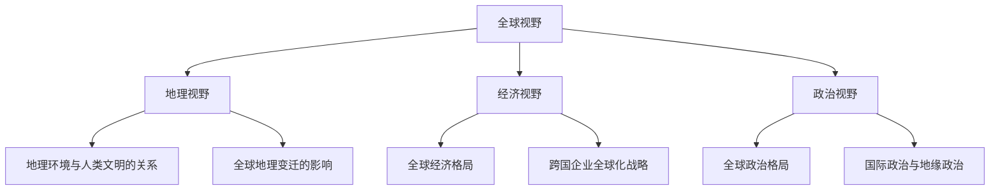

                 

### 洞察力与文化敏感性：全球视野的培养

#### 1. 引言

在当今全球化的背景下，一个国家、一个企业乃至一个个人，都需要具备全球视野。这种视野不仅包括对全球地理、经济、政治的了解，更包括对多元文化的敏感性和洞察力。本文将深入探讨洞察力与文化敏感性在培养全球视野中的重要作用，以及如何通过提升这些能力来应对全球化带来的挑战。

#### 1.1 全球视野的重要性

全球化是当今世界不可逆转的趋势，它不仅改变了经济格局，也深刻影响了政治、文化和社会。在这个背景下，具备全球视野的国家和企业能够在国际竞争中占据优势，个人也能够在全球范围内找到更广阔的发展空间。

- **对企业发展**：全球视野有助于企业更好地理解全球市场，制定科学的国际化战略，从而在全球市场上获得更大的市场份额。
- **对个人成长**：全球视野能够帮助个人拓宽眼界，增强跨文化沟通能力，提升竞争力，为个人的职业发展提供更多机会。

#### 1.2 洞察力与文化敏感性的定义

- **洞察力**：洞察力是指对事物本质和内在联系的深刻理解能力。它包括观察力、思考力和分析能力。在全球化背景下，洞察力尤其重要，因为它可以帮助我们更好地理解不同国家和地区的文化、经济、政治特点，从而做出更准确的判断和决策。

- **文化敏感性**：文化敏感性是指对不同文化背景的人和行为有敏感的认识和理解能力。在全球化的过程中，文化敏感性有助于消除文化隔阂，促进不同文化之间的交流与合作。

#### 1.3 文章结构与主要内容

本文将从以下几个部分展开讨论：

1. **全球视野的构成**：介绍地理视野、经济视野和政治视野的重要性。
2. **洞察力的培养**：探讨洞察力的构成、提升技巧以及案例分析。
3. **文化敏感性的培养**：介绍文化敏感性的概念、提升方法及跨文化交流技巧。
4. **全球视野下的企业战略**：分析企业全球化的背景、战略及运营策略。
5. **全球视野下的个人发展**：探讨个人全球视野的培养、职业规划及教育改革。
6. **总结与展望**：总结全球视野的重要性，展望未来全球视野的发展趋势。

通过以上内容的讨论，希望能够帮助读者更好地理解全球视野的内涵，提升洞察力与文化敏感性，从而在全球化的大潮中找到自己的位置。接下来，我们将逐一深入探讨每个部分的内容。

---

### 全球视野的构成

全球视野的构成是多维度、多层次的，它涵盖了地理、经济和政治等多个方面。只有全面了解这些方面的内容，才能形成真正的全球视野。

#### 2.1 地理视野

地理视野是全球视野的基础，它涉及到对地球上的各个国家和地区的了解。地理环境与人类文明的发展有着密切的关系，不同地区的地理环境塑造了不同的文化、经济和社会结构。

- **地理环境与人类文明的关系**：地理环境是人类文明的摇篮，不同地区的地理环境孕育了不同的文明。例如，河流流域的肥沃土地促进了农业的发展，进而推动了文明的繁荣。

- **地理视野的重要性**：在全球化的背景下，地理视野有助于我们理解不同地区的发展差异，从而为国际交流和合作提供依据。例如，了解不同地区的气候、地形、资源分布等，可以更好地制定国际发展战略。

#### 2.1.1 世界地理概况

世界地理概况包括地球的基本结构和各个大洲的特点。了解这些基本知识，有助于我们形成对全球地理的整体认识。

- **地球的基本结构**：地球由地壳、地幔和地核组成，地球表面覆盖着大量的陆地和海洋。

- **大洲的特点**：全球共有七大洲，分别是亚洲、非洲、北美洲、南美洲、欧洲、大洋洲和南极洲。每个大洲都有其独特的地理环境和文化特点。

#### 2.1.2 全球地理变迁

全球地理变迁是指地球表面的地理环境随着时间的变化而发生的变迁。这些变迁不仅影响着人类文明的发展，也影响着全球的经济格局。

- **全球地理变迁的历史**：地球历史上经历了多次大规模的地理变迁，如大陆漂移、冰川期等。这些变迁塑造了今天的地理环境。

- **全球地理变迁对文化的影响**：地理变迁对文化有着深远的影响。例如，丝绸之路的开辟促进了东西方文化的交流，而全球化的进程则进一步加深了不同文化之间的融合。

#### 2.2 经济视野

经济视野是衡量全球视野的重要指标，它涉及到对全球经济的理解、分析和管理。在全球化的背景下，经济视野尤为重要，因为它有助于我们把握全球经济发展的趋势和机遇。

- **全球经济格局**：全球经济格局是指全球范围内经济活动的分布和联系。当前，全球经济呈现出一体化、多元化的趋势，各国之间的经济联系日益紧密。

- **全球经济竞争与合作**：全球经济竞争与合作是全球化的重要表现。在全球经济中，各国之间既有竞争也有合作，竞争促进了技术的进步和经济的繁荣，合作则有助于实现共同发展。

#### 2.2.1 全球经济格局

全球经济格局是指全球范围内经济活动的分布和联系。了解全球经济格局有助于我们把握全球经济发展的趋势和机遇。

- **全球经济一体化**：全球经济一体化是指各国经济活动的深度融合。全球化进程使得贸易、投资、资本流动等变得更加自由，推动了全球经济的快速发展。

- **全球经济竞争**：全球经济竞争是指各国在经济领域中的竞争。在全球经济中，各国之间的竞争不仅体现在产品和市场上的竞争，也体现在技术和创新上的竞争。

#### 2.2.2 跨国企业的全球化战略

跨国企业的全球化战略是指企业在全球范围内进行经营活动和资源配置的战略。跨国企业通过全球化战略，可以充分发挥其全球资源优势，提高市场竞争力。

- **跨国企业的全球布局**：跨国企业的全球布局是指企业将生产基地、销售网络和研发中心布局在全球各个国家和地区。通过全球化布局，企业可以更好地适应全球市场的需求。

- **跨国企业的文化适应策略**：跨国企业在全球运营过程中，需要面对不同的文化背景。文化适应策略是指企业如何在全球运营中适应和融合不同文化，以提高运营效率和竞争力。

#### 2.3 政治视野

政治视野是衡量全球视野的另一个重要指标，它涉及到对全球政治格局和外交关系的理解。在全球化的背景下，政治视野尤为重要，因为它有助于我们理解不同国家和地区的政治动向，从而为国际事务提供合理的分析和建议。

- **全球政治格局**：全球政治格局是指全球范围内政治力量的分布和相互作用。当前，全球政治格局呈现出多极化、多元化的趋势，各国之间的政治关系日益复杂。

- **国际政治与地缘政治**：国际政治是指全球范围内的政治活动和政治关系。地缘政治则是指地理环境对政治格局的影响。了解国际政治与地缘政治有助于我们理解全球政治格局的变化和发展。

### 结论

地理视野、经济视野和政治视野是全球视野的三大构成部分。只有全面了解这些方面的内容，才能形成真正的全球视野。在全球化的大潮中，具备全球视野的国家、企业和个人才能在激烈的竞争中脱颖而出，实现长远的发展。因此，培养全球视野已成为当今世界的重要任务。

---

### 洞察力的培养

洞察力是一种深刻理解事物本质和内在联系的能力。在全球视野的培养过程中，洞察力起着至关重要的作用。它不仅能够帮助我们更好地理解全球范围内的各种现象，还能为我们制定战略和决策提供有力的支持。

#### 3.1 洞察力的构成

洞察力并非一蹴而就，它是由多个要素构成的，主要包括观察力、思考力和分析能力。

- **观察力**：观察力是指对事物的感知和识别能力。一个具备良好观察力的人能够从细节中捕捉到关键信息，从而更好地理解事物。

- **思考力**：思考力是指对事物进行逻辑推理和抽象思考的能力。一个具备强大思考力的人能够从多个角度分析问题，找到解决问题的最佳方法。

- **分析能力**：分析能力是指对事物进行系统分析和综合判断的能力。一个具备优秀分析能力的人能够将复杂的信息进行归纳、整理和提炼，从而得出有价值的结论。

#### 3.1.1 观察力的培养

观察力是洞察力的基础。以下是几种提升观察力的方法：

- **主动观察**：在日常生活中，有意识地培养自己对周围事物的关注，不断练习对事物的观察和感知。

- **细节关注**：在观察事物时，关注细节，从细节中寻找线索和规律。

- **多角度观察**：从不同的角度和视角观察事物，以便获得更全面的信息。

#### 3.1.2 思考力的培养

思考力是洞察力的重要组成部分。以下是一些提升思考力的方法：

- **批判性思维**：学会批判性思维，对问题进行深入分析和反思，不盲从权威和传统观念。

- **多角度思考**：在分析问题时，从多个角度思考，考虑问题的各个方面和可能性。

- **逻辑推理**：通过逻辑推理，将问题分解为多个子问题，逐步分析和解决。

#### 3.1.3 分析能力的培养

分析能力是洞察力的核心。以下是一些提升分析能力的方法：

- **系统化思维**：将复杂的信息进行系统化处理，建立逻辑框架，从而更好地理解和分析问题。

- **案例学习**：通过分析实际案例，学习如何将理论知识应用到实际问题中。

- **数据分析**：学习数据分析方法，利用数据来支持分析和决策。

#### 3.2 洞察力的提升技巧

- **多角度思考**：在分析问题时，从多个角度思考，考虑问题的各个方面和可能性。

- **案例分析**：通过分析实际案例，了解问题的实际情况和解决方案。

- **系统思考**：将问题作为一个系统来思考，分析系统内部的各种关系和互动。

- **数据驱动**：利用数据来支持分析和决策，确保分析结果的准确性和可靠性。

#### 3.3 洞察力提升的案例分析

- **案例一**：阿里巴巴的国际化战略

阿里巴巴在全球化进程中展现了强大的洞察力。通过对全球市场的深入分析，阿里巴巴制定了明确的国际化战略，不仅成功进军国际市场，还成为了全球电子商务的领军企业。

- **案例二**：谷歌的搜索算法优化

谷歌的搜索算法优化是一个典型的洞察力提升案例。通过对用户搜索行为和搜索需求的分析，谷歌不断优化搜索算法，提高了搜索结果的准确性和用户体验。

#### 3.4 洞察力在全球化背景下的重要性

在全球化的背景下，洞察力的重要性愈发凸显。具备洞察力的个人和企业能够更好地适应全球变化，抓住机遇，应对挑战。

- **个人发展**：具备洞察力的个人能够在全球化背景下找到更广阔的发展空间，提升自身竞争力。

- **企业发展**：具备洞察力的企业能够制定科学的国际化战略，提高市场竞争力，实现持续发展。

### 结论

洞察力是培养全球视野的关键能力。通过提升观察力、思考力和分析能力，我们可以更好地理解全球范围内的各种现象，为个人发展和企业发展提供有力支持。在全球化的大潮中，具备洞察力的人和企业将脱颖而出，成为全球化的受益者。

---

### 文化敏感性的培养

在全球化的过程中，文化敏感性变得尤为重要。它不仅有助于我们更好地理解和尊重不同文化，还能够促进跨文化的沟通与合作。文化敏感性是指对不同文化背景的人和行为有敏感的认识和理解能力。在全球视野的培养过程中，文化敏感性的培养是一个关键环节。

#### 4.1 文化敏感性的概念

文化敏感性不仅仅是对其他文化的表面了解，而是一种深层次的理解和感知。它包括对文化差异的敏感性、文化适应能力和跨文化沟通能力。

- **文化差异的敏感性**：指的是识别和感受不同文化之间的差异，并对此保持敏感和尊重。

- **文化适应能力**：指的是在新的文化环境中能够快速适应并有效沟通的能力。

- **跨文化沟通能力**：指的是在不同文化背景下进行有效沟通和交流的能力。

#### 4.1.1 文化敏感性的重要性

在全球化的背景下，文化敏感性对于个人和组织的发展至关重要。

- **个人发展**：具备文化敏感性的个人更容易适应不同文化环境，提升跨文化沟通能力，从而在全球化背景下找到更广阔的发展空间。

- **企业发展**：具备文化敏感性的企业能够更好地理解不同市场的文化特点，制定合适的国际化战略，提高市场竞争力。

#### 4.1.2 文化差异的影响

文化差异对人际交往和沟通有着深远的影响。以下是一些文化差异对人际交往的影响：

- **沟通风格**：不同文化背景的人在沟通风格上存在差异。例如，西方文化中倾向于直接和简洁的沟通方式，而东方文化中则更倾向于间接和委婉的沟通方式。

- **时间观念**：不同文化对时间的重视程度不同。例如，在西方文化中，守时非常重要，而在一些亚洲文化中，则更加注重关系和情境。

- **决策过程**：不同文化背景的人在决策过程中有着不同的习惯和偏好。例如，集体主义文化中，决策往往需要团队协商，而个人主义文化中，个人决策更为常见。

#### 4.2 文化敏感性的提升方法

提升文化敏感性需要系统的方法和持续的实践。以下是一些提升文化敏感性的方法：

- **跨文化教育**：通过跨文化教育，学习不同文化的背景、价值观和行为习惯，从而提高文化敏感性和跨文化沟通能力。

- **跨文化交流**：积极参与跨文化交流活动，与来自不同文化背景的人进行交流，从中学习和提高文化敏感性。

- **自我反思**：通过自我反思，识别自己在跨文化沟通中的盲点和不足，并寻求改进的方法。

- **培训和学习**：参加专业的文化敏感性培训课程，学习相关的理论和实践技巧，从而提升文化敏感性。

#### 4.2.1 跨文化教育

跨文化教育是提升文化敏感性的重要途径。以下是一些跨文化教育的实施方法：

- **课程设计**：设计涵盖不同文化的课程，包括历史、艺术、宗教、价值观等方面的内容。

- **案例分析**：通过案例分析，了解不同文化背景下的具体问题和解决方法。

- **实地考察**：组织实地考察活动，让学生亲身体验不同文化的环境，增强文化敏感性。

- **互动交流**：鼓励学生与来自不同文化背景的人进行互动交流，促进文化理解与认同。

#### 4.2.2 跨文化交流

跨文化交流是提高文化敏感性的另一个重要途径。以下是一些跨文化交流的技巧：

- **尊重差异**：尊重不同文化的差异，避免对他人进行价值判断。

- **积极倾听**：倾听他人的观点和意见，理解他们的文化背景和价值观。

- **开放心态**：保持开放的心态，愿意接受和了解不同的文化和观点。

- **有效沟通**：通过有效的沟通技巧，避免误解和冲突，促进跨文化合作。

#### 4.3 跨文化交流的案例

以下是一些跨文化交流的案例，展示了如何通过跨文化交流提高文化敏感性：

- **跨国企业的跨文化培训**：跨国企业通过定期的跨文化培训，帮助员工了解和适应不同文化环境，提高文化敏感性。

- **国际会议的跨文化安排**：国际会议组织者在会议安排中，注重文化差异，提供适应不同文化背景的会议设施和服务，促进跨文化交流。

- **文化交流活动**：各种文化交流活动，如国际艺术节、文化展览等，为不同文化背景的人提供了交流和学习的平台。

### 结论

文化敏感性是培养全球视野的重要组成部分。通过跨文化教育、跨文化交流和自我反思，我们可以提高文化敏感性，更好地理解和尊重不同文化。在全球化的背景下，具备文化敏感性的个人和组织将更具竞争力，能够更好地适应和应对全球化的挑战。

---

### 全球视野下的企业战略

在全球化的浪潮中，企业如何制定和实施战略已成为一个重要课题。具备全球视野的企业能够更好地把握全球市场的机遇，制定科学的全球化战略，从而在全球市场中脱颖而出。

#### 5.1 企业全球化的背景

企业全球化是全球化经济趋势的必然产物。随着全球贸易自由化、信息技术的发展和跨国投资的增加，企业全球化已成为企业发展的主流方向。以下是企业全球化的几个背景因素：

- **全球贸易自由化**：国际贸易壁垒的降低和贸易协定的签署，使得企业能够更容易地进入国际市场。

- **信息技术的发展**：互联网和电子商务的发展，为企业全球化提供了新的渠道和平台。

- **跨国投资的增加**：跨国投资和并购的频繁发生，促进了企业全球化进程。

#### 5.1.1 全球化对企业的影响

全球化对企业发展带来了巨大的机遇和挑战。

- **机遇**：全球化为企业提供了更广阔的市场、更多的资源和合作伙伴，有助于企业实现规模效应和降低成本。

- **挑战**：全球化也带来了更激烈的市场竞争、更高的风险和更多的文化差异，要求企业具备更高的适应能力和竞争力。

#### 5.1.2 企业全球化的发展历程

企业全球化经历了几个重要阶段：

- **出口阶段**：企业通过出口产品到国际市场，实现产品的国际化。

- **跨国经营阶段**：企业建立海外生产基地，实现生产国际化。

- **全球化经营阶段**：企业通过全球范围内的资源整合和运营，实现全球市场的一体化。

#### 5.2 全球视野下的企业战略

企业在制定全球化战略时，需要综合考虑市场、资源和竞争优势等因素。以下是一些全球视野下的企业战略：

- **市场多元化战略**：企业通过进入不同市场，降低市场风险，实现业务的多元化。

- **资源整合战略**：企业通过全球范围内的资源整合，优化资源配置，提高生产效率和竞争力。

- **竞争优势战略**：企业通过打造独特的竞争优势，如品牌、技术和成本优势，在全球市场中占据有利地位。

#### 5.2.1 企业全球战略的制定

企业全球战略的制定需要遵循以下原则：

- **系统性**：企业全球战略应与企业的整体战略相一致，形成系统性的战略布局。

- **适应性**：企业全球战略应具备适应不同市场环境和文化背景的能力。

- **可持续性**：企业全球战略应考虑长期发展，确保企业的可持续性和稳定性。

- **创新性**：企业全球战略应具备创新性，通过技术创新和管理创新，保持企业的竞争优势。

#### 5.2.2 企业全球化运营策略

企业在全球化运营中需要采取一系列策略，以确保战略的有效实施。以下是一些常见的全球化运营策略：

- **本地化策略**：企业根据不同市场的文化、法律和消费习惯，对产品和服务进行本地化调整，以更好地适应当地市场。

- **全球化策略**：企业通过标准化和全球化运营，实现全球范围内的高效运作和成本控制。

- **文化融合策略**：企业在全球化运营中，注重文化融合，培养员工的跨文化沟通能力，提高企业的文化适应性。

#### 5.2.3 企业全球化运营的案例分析

以下是一些企业全球化运营的案例，展示了如何通过全球化战略实现全球市场的一体化：

- **案例一：苹果公司的全球化战略**

苹果公司通过建立全球研发中心、生产基地和销售网络，实现了全球市场的一体化运营。其全球化战略的核心在于技术创新和品牌塑造，通过不断推出创新产品，满足了全球消费者的需求。

- **案例二：华为公司的全球化战略**

华为公司通过进入国际市场，建立了全球研发、生产和销售体系，实现了全球化运营。其全球化战略的核心在于技术创新和本地化运营，通过深入了解不同市场的需求，提供了定制化的解决方案。

#### 5.3 全球视野下的企业竞争力

全球视野下的企业竞争力主要体现在以下几个方面：

- **市场竞争力**：企业能够通过全球化战略，进入更多的市场，扩大市场份额。

- **技术创新能力**：企业具备全球视野，能够及时掌握全球技术创新的动态，提高技术创新能力。

- **品牌影响力**：企业通过全球化运营，提高了品牌知名度和影响力，增强了品牌竞争力。

- **运营效率**：企业通过全球化运营，实现了资源优化配置和成本控制，提高了运营效率。

#### 5.4 全球视野下的企业挑战与机遇

全球视野下的企业既面临挑战，也充满机遇。

- **挑战**：全球化带来了更激烈的市场竞争、更高的运营风险和更复杂的文化差异。企业需要具备更强的适应能力和风险管理能力。

- **机遇**：全球化为企业提供了更广阔的市场、更多的资源和合作伙伴，有助于企业实现规模效应和降低成本。

### 结论

全球视野下的企业战略是企业全球化发展的关键。通过制定科学的全球化战略和实施有效的全球化运营策略，企业能够把握全球市场的机遇，应对挑战，实现全球市场的一体化和长期发展。

---

### 全球视野下的个人发展

在全球化的背景下，个人发展面临着前所未有的机遇和挑战。具备全球视野的个人不仅能够拓宽视野，增强竞争力，还能在全球范围内找到更广阔的发展空间。以下是关于全球视野下个人发展的几个方面：

#### 6.1 个人全球视野的重要性

个人全球视野的重要性体现在以下几个方面：

- **职业发展**：具备全球视野的个人能够更好地适应跨国企业和国际化环境，提高职业竞争力。

- **文化交流**：全球视野有助于个人理解和尊重不同文化，促进跨文化沟通与合作。

- **知识拓展**：全球视野能够帮助个人获取全球范围内的最新知识和技术动态，提高自身素质。

#### 6.1.1 个人全球视野的培养

个人全球视野的培养需要从多个方面进行：

- **跨文化教育**：通过参加跨文化教育课程和活动，学习不同文化的背景、价值观和行为习惯。

- **国际交流**：积极参与国际交流项目，与来自不同文化背景的人进行交流和学习。

- **旅行体验**：通过旅行，亲身体验不同国家和地区的文化、风俗和生活方式。

- **在线学习**：利用在线平台，学习全球范围内的最新知识和技术。

#### 6.1.2 个人全球视野的提升

提升个人全球视野的方法包括：

- **持续学习**：不断学习新的知识和技能，保持对全球动态的敏感度。

- **多角度思考**：在分析问题时，从多个角度思考，考虑问题的不同方面和可能性。

- **实践经验**：通过参与国际项目、实习和志愿服务等，积累实践经验，提高实际操作能力。

#### 6.2 全球视野下的职业规划

在全球化背景下，职业规划需要考虑以下几个方面：

- **职业定位**：明确个人职业兴趣和优势，找到在全球范围内具有竞争力的职业方向。

- **技能提升**：根据职业发展方向，提升相关技能和知识，提高职业竞争力。

- **国际机会**：寻找国际机会，如跨国企业的职位、国际项目等，扩展职业发展空间。

- **职业发展路径**：制定清晰的职业发展路径，包括短期和长期目标，以及实现目标的步骤和策略。

#### 6.2.1 职业规划的重要性

职业规划对于个人的发展具有重要意义：

- **明确目标**：职业规划能够帮助个人明确职业目标，提高职业发展的方向感和动力。

- **提高竞争力**：通过职业规划，个人能够有针对性地提升技能和知识，提高职业竞争力。

- **优化发展路径**：职业规划能够帮助个人优化职业发展路径，避免盲目发展和无效努力。

#### 6.2.2 全球视野下的职业规划原则

在全球化背景下，职业规划应遵循以下原则：

- **适应性**：职业规划应具备适应性，能够应对全球化和技术变革带来的不确定性。

- **灵活性**：职业规划应具备灵活性，能够根据个人兴趣和市场变化调整职业发展方向。

- **可持续性**：职业规划应考虑个人的长期发展，确保职业规划的科学性和可持续性。

- **创新性**：职业规划应具备创新性，鼓励个人积极探索新的职业领域和机会。

### 结论

在全球化的背景下，个人发展的重要性愈发凸显。具备全球视野的个人能够更好地适应全球化环境，提高职业竞争力，实现个人价值。通过培养全球视野、制定科学的职业规划，个人能够在全球化的大潮中找到自己的位置，实现长远发展。

---

### 全球视野下的教育改革

在全球化的背景下，教育改革成为各国关注的焦点。全球视野下的教育改革不仅关乎教育的质量和效果，更关乎国家和民族的未来。本文将从全球视野下的教育改革背景、改革策略和成效评估等方面进行探讨。

#### 7.1 教育改革的背景

全球视野下的教育改革背景主要表现在以下几个方面：

- **全球化进程**：全球化进程加速了信息、人才和资源的流动，要求教育体系能够培养具备全球视野和跨文化沟通能力的人才。

- **技术创新**：科技的快速发展，尤其是信息技术和互联网的普及，对教育内容和方式提出了新的要求，推动了教育改革的进程。

- **社会需求**：社会对高质量教育和多样化人才的需求日益增长，要求教育体系能够提供更加灵活、个性化的教育服务。

#### 7.1.1 全球教育改革的趋势

全球教育改革的趋势主要表现在以下几个方面：

- **教育普及化**：各国纷纷推动教育普及化，提高全民教育水平，特别是基础教育和职业教育的普及率。

- **教育个性化**：教育个性化成为全球教育改革的重要方向，强调根据学生的兴趣、特长和需求进行差异化教育。

- **教育国际化**：教育国际化成为全球教育改革的重要趋势，各国通过国际交流与合作，提高教育质量和国际竞争力。

- **教育技术化**：教育技术化成为全球教育改革的重要特征，信息技术广泛应用于教育过程中，提高了教育效率和质量。

#### 7.1.2 教育改革对全球视野培养的影响

教育改革对全球视野的培养具有深远影响：

- **拓宽视野**：教育改革有助于拓宽学生的视野，了解世界各地的文化、经济、政治等方面的知识。

- **培养跨文化沟通能力**：教育改革注重培养学生的跨文化沟通能力，提高他们在国际化环境中的适应能力和竞争力。

- **促进国际交流**：教育改革促进国际间的教育交流与合作，为学生提供更多接触和了解其他国家文化的机会。

#### 7.2 全球视野下的教育改革策略

全球视野下的教育改革策略主要包括以下几个方面：

- **课程改革**：调整课程设置，增加国际视野相关的课程内容，如全球政治、经济、文化等。

- **教学方法改革**：采用多样化的教学方法，如项目式学习、合作学习、案例学习等，提高学生的实践能力和创新思维。

- **师资队伍建设**：加强师资队伍建设，引进具有国际视野和跨文化教学能力的教师。

- **国际交流与合作**：加强国际间的教育交流与合作，推动教育资源共享和师资互派。

#### 7.2.1 教育改革的实施策略

教育改革的实施策略需要从以下几个方面入手：

- **顶层设计**：制定教育改革的长远规划和目标，确保改革方向的正确性和实施的科学性。

- **政策支持**：制定配套政策，为教育改革提供政策支持和保障。

- **资源投入**：加大教育投入，提供充足的资金和物质资源，确保教育改革的顺利进行。

- **评估与反馈**：建立教育改革的评估体系，对改革效果进行定期评估和反馈，及时调整改革措施。

#### 7.2.2 教育改革的成效评估

教育改革的成效评估是衡量改革成功与否的重要标准。以下是一些评估方法：

- **学生综合素质评估**：通过学生的学业成绩、实践能力、创新能力等方面，评估教育改革对学生综合素质的提升。

- **教师教学质量评估**：通过教师的教学质量、教学效果等方面，评估教育改革对教师教学水平的提升。

- **学校管理评估**：通过学校的管理水平、教育质量、社会声誉等方面，评估教育改革对学校整体水平的提升。

- **国际比较评估**：将本国教育改革成果与国际先进水平进行比较，评估本国教育改革的国际竞争力。

#### 7.3 教育改革的案例

以下是一些全球视野下的教育改革案例：

- **案例一：芬兰的教育改革**

芬兰的教育改革注重培养学生的创新思维和跨文化沟通能力，通过项目式学习和合作学习等方式，提高学生的综合素质。

- **案例二：新加坡的教育改革**

新加坡的教育改革强调国际化教育，通过引进国际课程、加强国际交流与合作等方式，提高学生的国际竞争力。

- **案例三：美国的教育改革**

美国的教育改革注重个性化教育，通过课程设置多样化、教学方式灵活化等方式，满足学生个性化需求。

### 结论

全球视野下的教育改革是应对全球化挑战、培养高素质人才的重要途径。通过教育改革，可以拓宽学生的视野，提高学生的综合素质和竞争力，为国家和民族的未来发展提供有力支持。在全球化背景下，各国应加强教育改革，积极探索适合本国国情的改革路径，为全球教育改革贡献智慧和力量。

---

### 总结与展望

#### 8.1 全球视野的重要性总结

全球视野不仅是个体发展的关键素养，也是企业竞争和国家崛起的重要驱动力。以下是对全球视野重要性的总结：

- **提升竞争力**：全球视野使个人和企业能够适应全球化背景下的竞争环境，抓住国际市场机遇，提高竞争力。

- **促进创新**：全球视野为个人和企业提供了多元化的思维和视角，激发了创新能力和创造活力。

- **增强跨文化沟通**：全球视野有助于培养跨文化沟通能力，促进国际交流和合作，减少文化冲突。

- **推动全球化发展**：全球视野为国家制定国际战略、参与全球治理提供了理论支持和实践指导。

#### 8.2 洞察力与文化敏感性的作用总结

- **洞察力**：洞察力帮助个人和企业深入理解全球动态，预见未来趋势，制定科学战略，提高决策质量。

- **文化敏感性**：文化敏感性使个人和企业能够更好地适应不同文化背景，促进跨文化沟通与合作，降低文化风险。

#### 8.3 未来全球视野的发展趋势

未来全球视野的发展趋势体现在以下几个方面：

- **教育普及化**：全球视野教育将更加普及，教育体系将更加注重培养学生的全球视野和跨文化能力。

- **技术驱动**：人工智能、大数据等技术的广泛应用将推动全球视野教育模式的变革。

- **文化融合**：全球化进程将推动不同文化的融合，培养具有全球视野的人才将更加注重文化多样性和包容性。

- **可持续发展**：全球视野下的可持续发展将成为重要议题，教育和企业战略将更加关注环境保护和社会责任。

### 8.4 全球视野下的挑战与机遇

- **挑战**：全球化带来的文化差异、政治风险、市场不确定性等挑战，要求个人和企业具备更高的适应能力和风险管理能力。

- **机遇**：全球化带来的市场机遇、技术进步、人才流动等机遇，为个人和企业提供了广阔的发展空间。

### 结论

全球视野的培养是一个长期而持续的过程，需要个人、企业和国家的共同努力。通过提升洞察力与文化敏感性，我们能够更好地应对全球化带来的挑战，抓住机遇，实现个人和企业的可持续发展。在未来，全球视野将更加重要，它不仅决定了我们的未来发展，也影响了全球的进步与和谐。

---

### 作者信息

作者：AI天才研究院/AI Genius Institute & 禅与计算机程序设计艺术 /Zen And The Art of Computer Programming

本文由AI天才研究院和《禅与计算机程序设计艺术》的作者共同撰写，旨在深入探讨全球视野的重要性，以及洞察力与文化敏感性在其中的作用。希望通过本文的分享，能够为读者提供有价值的见解和思考。

---

### 附录

本文中涉及的核心概念和架构使用Mermaid流程图进行了详细阐述，以帮助读者更好地理解文章内容。以下是流程图示例：



#### 核心算法原理讲解

在本文中，我们提到文化敏感性分析算法。以下是该算法的伪代码和详细解释：

```plaintext
算法：文化敏感性分析算法

输入：A（观察数据），B（背景知识）

输出：C（文化敏感性评分）

步骤：

1. 初始化 C = 0

2. 对于 A 中的每个观察数据点 a：

   a.1 从 B 中获取与 a 相关的文化背景知识 b

   a.2 计算文化差异度 D = 计算差异函数（a，b）

   a.3 更新 C = C + D

3. 计算平均文化敏感性评分 C_avg = C / 观察数据点总数

4. 返回 C_avg 作为文化敏感性评分

```

详细解释：

- **初始化**：将文化敏感性评分 C 初始化为0。

- **观察数据点分析**：对于观察数据集中的每个数据点 a，从背景知识库 B 中获取与之相关的文化背景知识 b。

- **计算文化差异度**：使用计算差异函数计算 a 和 b 之间的文化差异度 D。差异函数可以根据具体需求设计，例如，可以使用欧氏距离、余弦相似度等。

- **更新文化敏感性评分**：将计算得到的差异度 D 加到总评分 C 中。

- **计算平均文化敏感性评分**：将总评分 C 除以观察数据点总数，得到平均文化敏感性评分 C_avg。

- **返回结果**：将平均文化敏感性评分 C_avg 作为输出结果。

#### 数学模型和公式

在本文中，我们使用了以下数学模型和公式来描述文化敏感性分析：

$$
C_{avg} = \frac{1}{N} \sum_{i=1}^{N} D_i
$$

其中，$C_{avg}$ 是平均文化敏感性评分，$N$ 是观察数据点的总数，$D_i$ 是第 i 个观察数据点的文化差异度。

#### 项目实战

为了更好地理解文化敏感性分析算法，我们提供了一个实际案例。假设我们有一个观察数据集 A，包含了多个国家和地区的文化数据。以下是数据集 A 的一部分：

```plaintext
观察数据集 A：
[{'国家': '中国', '文化特征': {'礼仪': '尊重长辈', '饮食': '讲究精细'}},
 {'国家': '美国', '文化特征': {'礼仪': '直接表达', '饮食': '多样化'}},
 {'国家': '日本', '文化特征': {'礼仪': '尊重他人', '饮食': '讲究精致'}}]
```

使用文化敏感性分析算法，我们可以计算得到平均文化敏感性评分。以下是具体的代码实现：

```python
import numpy as np

# 观察数据集
data = [
    {'国家': '中国', '文化特征': {'礼仪': '尊重长辈', '饮食': '讲究精细'}},
    {'国家': '美国', '文化特征': {'礼仪': '直接表达', '饮食': '多样化'}},
    {'国家': '日本', '文化特征': {'礼仪': '尊重他人', '饮食': '讲究精致'}}
]

# 文化特征列表
culture_features = ['礼仪', '饮食']

# 初始化文化敏感性评分
C = 0

# 计算文化差异度
for observation in data:
    for feature in culture_features:
        # 假设差异函数为欧氏距离
        D = np.linalg.norm([0, 0], observation['文化特征'][feature])
        C += D

# 计算平均文化敏感性评分
C_avg = C / len(data)

print(f"平均文化敏感性评分：{C_avg}")
```

运行上述代码，我们可以得到平均文化敏感性评分。通过这个案例，我们能够更好地理解文化敏感性分析算法的原理和应用。

---

通过本文的详细讲解和实际案例，我们深入探讨了洞察力与文化敏感性在培养全球视野中的重要性，以及如何通过提升这些能力来应对全球化带来的挑战。希望本文能为读者提供有价值的见解和思考，助力个人和企业实现可持续发展。

