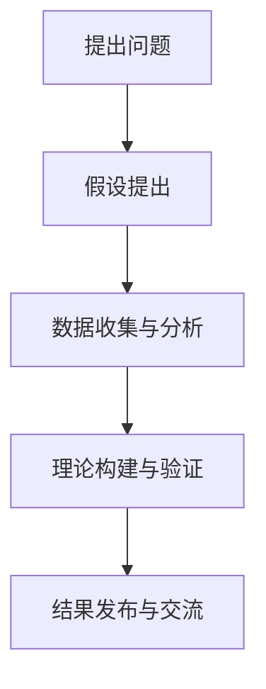
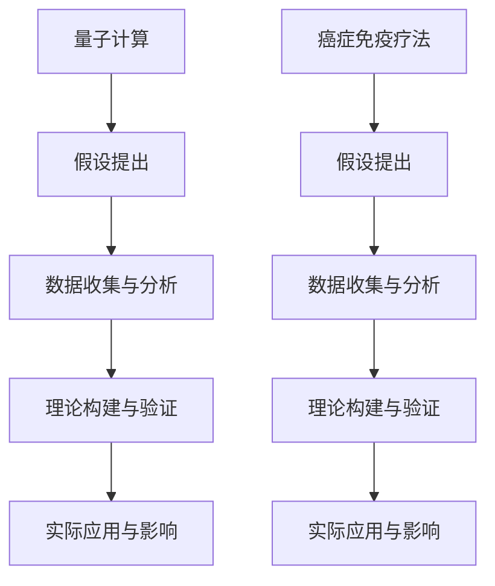

                 

### 引言

科学，作为人类探索自然、揭示事物运行规律的一项伟大事业，其发展历程中充满了无数令人惊叹的发现与突破。无论是牛顿的万有引力定律，还是爱因斯坦的相对论，又或者是现代量子力学和生物学的重大进展，这些突破性研究不仅深刻改变了我们对世界的认识，还推动了人类文明的进步。然而，这些伟大的科学发现背后，究竟是什么力量在驱动着科学家们不断探索、不断突破？

在这一篇文章中，我们将探讨一个关键的概念：洞察力。洞察力，是科学家们发现科学真理的重要工具，也是突破性研究的源泉。那么，什么是洞察力？它如何与科学发现联系在一起？本文将逐步解析这些问题，带你深入了解洞察力在科学发现中的重要性，以及如何通过培养洞察力来推动科学研究的进步。

首先，我们来看一下科学发现的定义与重要性。科学发现是指通过实验、观察、推理等方法，揭示自然界中的新现象、新规律或新原理的过程。科学发现不仅能够丰富人类的科学知识体系，还能带来技术的进步和社会的发展。例如，蒸汽机的发明推动了第一次工业革命，互联网技术的发展引领了信息时代的到来。因此，科学发现对于人类社会的发展具有重要意义。

接下来，我们将探讨突破性研究的背景。突破性研究通常指的是在某一领域内实现重大理论突破或技术突破的研究。这类研究往往能够颠覆传统认知，开辟新的研究方向。例如，量子计算的突破有望彻底改变计算技术，基因编辑技术的突破为治疗疾病提供了新的手段。突破性研究对于科技进步和社会发展具有深远的影响。

那么，洞察力与科学发现之间究竟有何联系？我们可以从以下几个方面来思考。首先，洞察力是一种敏锐的感知能力和深刻的理解能力。它使科学家能够从复杂的现象中发现隐藏的规律，从而提出新的科学问题或假设。其次，洞察力需要通过逻辑思维和创造性思维来分析和解决问题。科学家们运用洞察力，将理论知识与实际观察相结合，进行假设的提出、数据的收集与分析、理论的构建与验证等一系列科学活动。最后，洞察力也是科学家们进行科学发现的重要心理素质。它要求科学家具备坚韧不拔的毅力、敏锐的洞察力和敢于挑战传统观念的勇气。

本文接下来的章节将详细探讨洞察力的概念与特征，如何培养洞察力，科学发现的过程，突破性研究的源泉以及成功案例的研究。通过这些内容，我们将更深入地理解洞察力在科学发现中的重要作用，并探索如何通过培养洞察力来推动科学研究的进步。

### 第1章 洞察力的概念与特征

#### 1.1 洞察力的定义与分类

洞察力（Insight）是一种独特的认知能力，它使个体能够快速识别和理解复杂问题的本质，并找到解决问题的创新性方法。根据其应用领域，洞察力可以分为多种类型，如科学洞察力、商业洞察力、艺术洞察力等。在科学领域，洞察力主要体现在科学家对复杂现象的敏锐感知、深刻理解以及对科学规律的创新性发现上。

科学洞察力是科学家们进行科学研究的重要工具。它不仅需要科学家具备丰富的专业知识，还需要他们具备独特的视角和思维方式。例如，爱因斯坦通过深刻的洞察力提出了相对论，这一理论彻底改变了人类对时空的理解。再如，屠呦呦通过对传统中医文献的深入研究，结合现代科学方法，发现了青蒿素的抗疟作用，从而开创了抗疟新疗法。

#### 1.2 洞察力的特征

洞察力的特征主要包括灵活性、敏锐性、创造力、逻辑思维等。

- **灵活性**：洞察力使科学家能够从多个角度看待问题，适应不同的研究方法和理论框架。这种灵活性有助于科学家发现传统方法难以察觉的新规律。

- **敏锐性**：敏锐性是洞察力的核心特征之一，它使科学家能够快速识别问题中的关键因素，从而提出新的科学问题或假设。

- **创造力**：创造力是科学家进行创新性研究的重要能力。通过洞察力，科学家能够在现有知识的基础上提出全新的理论或方法，从而推动科学的发展。

- **逻辑思维**：逻辑思维是科学研究的基石。科学家通过严密的逻辑推理，将观察、实验结果与理论假设相结合，从而验证或推翻科学理论。

#### 1.2.1 灵活性

灵活性是洞察力的一个重要特征。它使科学家能够灵活运用各种研究方法和理论框架，以应对复杂多变的科学问题。例如，在生物学研究中，科学家可能会结合分子生物学、遗传学、生态学等多种学科的方法来探索生命现象。这种灵活性有助于科学家发现传统方法难以察觉的新规律。

**示例**：在研究癌症时，科学家不仅需要理解分子生物学的基础知识，还需要了解细胞学、遗传学等多个领域的知识。通过灵活运用这些知识，科学家可以从多个角度来探索癌症的机制，从而提出新的治疗策略。

#### 1.2.2 敏锐性

敏锐性是洞察力的核心特征之一。它使科学家能够快速识别问题中的关键因素，从而提出新的科学问题或假设。例如，爱因斯坦在研究引力问题时，敏锐地发现了质量与时空的关系，从而提出了相对论。

**示例**：在医学研究中，科学家需要通过敏锐的观察和实验，识别出疾病的关键因素。例如，在研究艾滋病时，科学家通过敏锐的观察发现了HIV病毒与免疫系统之间的关系，从而为治疗艾滋病提供了新的思路。

#### 1.2.3 创造力

创造力是科学家进行创新性研究的重要能力。通过洞察力，科学家能够在现有知识的基础上提出全新的理论或方法，从而推动科学的发展。例如，法拉第通过创造力提出了电磁感应定律，这一理论彻底改变了人类对电磁现象的理解。

**示例**：在计算机科学中，科学家通过创造力提出了许多新的算法和理论。例如，图灵通过创造力提出了图灵机理论，这一理论为现代计算机科学奠定了基础。

#### 1.2.4 逻辑思维

逻辑思维是科学研究的基石。科学家通过严密的逻辑推理，将观察、实验结果与理论假设相结合，从而验证或推翻科学理论。例如，牛顿通过逻辑推理，将开普勒行星运动定律与他的引力理论相结合，从而提出了万有引力定律。

**示例**：在物理学中，科学家通过逻辑思维，将实验数据与理论模型相结合，不断验证和修正物理定律。例如，在研究量子力学时，科学家通过逻辑推理，提出了量子态叠加和量子纠缠等现象，从而推动了量子力学的发展。

#### 1.3 洞察力与直觉的关系

洞察力与直觉是两种不同的认知能力，但它们之间有着密切的联系。直觉是一种基于经验、感觉和本能的认知能力，它使个体能够快速做出决策。而洞察力则是一种更为深刻、有意识的认知能力，它需要个体对问题进行深入的思考和分析。

**示例**：在日常生活中，直觉可能使我们在短时间内做出选择，而洞察力则使我们能够深入理解问题的本质，从而做出更明智的决策。例如，医生在诊断疾病时，可能依赖于直觉来快速识别病情，但最终的确诊和治疗方案则需要通过洞察力来制定。

总之，洞察力是科学家进行科学发现的重要工具，它具备灵活性、敏锐性、创造力和逻辑思维等特征。通过培养洞察力，科学家能够更有效地识别和解决问题，推动科学研究的进步。在接下来的章节中，我们将进一步探讨如何培养洞察力，以及洞察力在科学发现中的具体应用。

### 第2章 洞察力的培养

洞察力，作为一种高级认知能力，并非天生具备，而是可以通过系统的训练和培养逐渐提高。这一章节将详细讨论如何培养洞察力，包括经验积累、思维训练、反思与总结以及心理素质培养等方面。通过这些方法，科学家可以提升自己的洞察力，从而在科学研究中取得更加突出的成果。

#### 3.1 洞察力的可塑性

首先，我们需要认识到，洞察力并非一成不变，而是具有可塑性。人的大脑如同一个不断发展的神经网络，通过不断的训练和刺激，可以提升其识别复杂模式和发现本质规律的能力。科学家通过持续的学习和实践，可以逐渐培养和提高自己的洞察力。

**示例**：在数学研究中，著名数学家陈景润通过多年的钻研和思考，最终在哥德巴赫猜想的研究中取得了重大突破。这一过程中，陈景润的洞察力得到了极大的提升，从而解决了数学界长期悬而未决的问题。

#### 3.2 培养洞察力的方法

**3.2.1 经验积累**

经验是培养洞察力的基础。通过长期的实践和观察，科学家可以积累丰富的经验，从而在面对复杂问题时能够迅速找到解决方法。例如，在医学研究中，临床医生通过多年的临床经验，可以敏锐地识别出患者的病情，从而做出准确的诊断。

**示例**：在实验物理中，物理学家费曼通过多年的实验经验，发现了许多物理学中的现象和规律。他独特的洞察力使他能够从复杂的实验数据中提取出关键信息，从而推动物理学的发展。

**3.2.2 思维训练**

思维训练是培养洞察力的有效方法。通过逻辑推理、问题解决和创造性思维等训练，科学家可以提升自己的思维敏捷性和深度。例如，数学竞赛和编程竞赛等活动，可以帮助学生培养逻辑思维和解决问题的能力。

**示例**：在人工智能领域，许多研究者通过参加机器学习竞赛，如Kaggle比赛，不断提升自己的问题解决能力和洞察力。这些竞赛要求参赛者在短时间内处理大量数据，提出创新性的解决方案，从而极大提升了他们的洞察力。

**3.2.3 反思与总结**

反思与总结是培养洞察力的重要环节。通过回顾自己的研究过程和结果，科学家可以识别出成功和失败的原因，从而改进自己的研究方法和思维方式。例如，科学家可以通过写研究日记或总结报告，记录自己的思考过程和心得体会，从而不断提高自己的洞察力。

**示例**：在化学研究中，科学家通过总结实验结果，发现了许多化学反应的规律。他们通过不断的反思和总结，改进了实验方法，提高了化学反应的成功率。

**3.2.4 心理素质培养**

心理素质的培养是提升洞察力的关键。科学家需要具备坚韧不拔的毅力、敏锐的洞察力和敢于挑战传统观念的勇气。通过心理素质的培养，科学家可以在面对困难和挑战时保持冷静和坚定，从而取得突破性成果。

**示例**：在科学探索过程中，许多科学家都需要面对巨大的压力和质疑。例如，爱因斯坦在提出相对论时，受到了许多同行的质疑和批评。然而，他凭借坚韧的意志和敏锐的洞察力，最终成功地证明了相对论的正确性。

#### 综合培养策略

综上所述，培养洞察力需要综合运用多种方法。通过经验积累，科学家可以丰富自己的知识储备；通过思维训练，可以提高自己的思维敏捷性和深度；通过反思与总结，可以不断提升自己的研究方法；通过心理素质培养，可以增强自己的心理韧性。以下是一个综合培养策略：

1. **持续学习**：通过阅读文献、参加学术会议和研讨会，不断更新自己的知识体系。
2. **实践训练**：通过参与实验和实际项目，将理论知识应用于实践中。
3. **反思与总结**：定期回顾自己的研究过程和结果，总结成功和失败的经验。
4. **心理素质培养**：通过心理训练和心理咨询，增强自己的心理韧性。
5. **跨学科交流**：与不同领域的科学家进行交流，借鉴他们的研究方法和思维方式。

通过这些策略，科学家可以有效地培养和提高自己的洞察力，从而在科学研究中取得更加突出的成果。

### 第3章 科学发现的过程

科学发现是一个复杂而系统性的过程，它涉及提出问题、假设提出、数据收集与分析、理论构建与验证等多个环节。这一章节将详细探讨科学发现的具体步骤，以及每个步骤中的关键要素和可能面临的挑战。

#### 4.1 科学发现的步骤

**4.1.1 提出问题**

科学发现的第一步是提出问题。科学家通过对自然现象的观察和思考，识别出需要研究的问题。提出问题是科学发现的基础，它决定了后续研究的方向和深度。一个有价值的科学问题通常具备以下特点：

- **明确性**：问题表述清晰，目标明确。
- **重要性**：问题具有广泛的研究价值或实际应用前景。
- **可行性**：问题可以通过现有的研究手段和方法解决。

**示例**：在医学研究中，科学家可能会提出“如何有效治疗某种疾病”的问题。这一问题明确了研究的目标，具有广泛的研究价值，并且可以通过实验和临床试验等方法解决。

**4.1.2 假设提出**

在提出问题之后，科学家需要根据现有的理论和知识，提出可能的假设。假设是对问题的潜在解答，它是科学发现过程中的重要环节。一个良好的假设通常具备以下特点：

- **合理性**：假设基于现有的科学理论和证据，具有逻辑基础。
- **可检验性**：假设可以通过实验或观察等方法进行验证。

**示例**：在研究癌症时，科学家可能会提出“癌细胞中的基因突变导致癌症发生”的假设。这一假设基于现有的分子生物学理论，可以通过基因测序和实验验证来检验。

**4.1.3 数据收集与分析**

在提出假设之后，科学家需要收集相关数据，并通过数据分析来验证假设的正确性。数据收集与分析是科学发现的核心步骤，它决定了假设的验证结果和科学发现的可靠性。

**数据收集**：科学家可以通过实验、观察、调查等方法收集数据。例如，在实验研究中，科学家可能会设计实验方案，通过控制变量来收集数据。

**数据分析**：数据分析是利用统计学和数学方法对数据进行处理和分析，以揭示数据中的规律和关系。数据分析的方法包括描述性统计、推断性统计、回归分析、聚类分析等。

**示例**：在研究气候变化时，科学家可能会收集气象数据，并通过统计分析来揭示气候变化与人类活动之间的关系。这一过程可以帮助科学家理解气候变化的原因和趋势。

**4.1.4 理论构建与验证**

在数据分析的基础上，科学家需要构建科学理论，并验证其正确性。理论构建是将数据分析的结果转化为科学解释和预测，它是科学发现的最终目标。

**理论构建**：科学家通过整合数据分析的结果，提出科学理论。科学理论是对自然现象的系统性解释，它需要具备一致性、可检验性和可预测性。

**理论验证**：理论验证是通过实验、观察和进一步数据分析来检验科学理论的正确性。如果理论能够通过多次验证，那么它就被认为是科学的。

**示例**：在物理学中，科学家通过实验验证了万有引力定律的正确性。这一理论通过多次实验验证，能够准确地预测行星运动和物体下落等现象。

**4.1.5 结果发布与交流**

科学发现的最后一步是发布研究结果并与其他科学家进行交流。这一过程包括撰写学术论文、参加学术会议和研讨会等。

**结果发布**：科学家通过撰写学术论文，将研究结果公开发表，使其成为科学共同体的一部分。

**交流**：通过学术会议和研讨会，科学家可以与其他研究者分享自己的发现，获取反馈和建议，进一步改进自己的研究。

**示例**：在医学研究中，科学家通过撰写学术论文，将新药研发的结果发表在顶级医学期刊上，从而为医学界提供新的研究思路和方向。

#### 4.2 科学发现的障碍与应对策略

虽然科学发现的过程充满挑战，但科学家可以通过以下策略来应对这些障碍：

**4.2.1 方法论的挑战**

科学方法论的发展是一个不断进步的过程。科学家需要不断探索新的研究方法和技术，以提高研究的准确性和可靠性。

**应对策略**：科学家可以通过跨学科合作，借鉴其他领域的成功经验，改进自己的研究方法。

**4.2.2 数据质量的挑战**

科学研究的质量很大程度上取决于数据的质量。数据不准确或不完整都会影响科学发现的准确性。

**应对策略**：科学家需要严格遵循实验设计和数据分析的规范，确保数据的准确性和完整性。此外，可以通过重复实验和交叉验证来提高数据的可靠性。

**4.2.3 资源和资金的限制**

科学研究往往需要大量的资金和资源支持。资源的不足可能会限制科学研究的深度和广度。

**应对策略**：科学家可以通过申请研究资金、与企业和政府合作等方式，获取足够的资源支持。此外，还可以通过开源项目和共享平台，提高资源的使用效率。

**4.2.4 社会伦理的挑战**

科学研究涉及到许多伦理问题，如实验动物的伦理、基因编辑的伦理等。这些伦理问题可能会对科学发现产生限制。

**应对策略**：科学家需要遵循科学伦理规范，确保研究过程的合法性和道德性。此外，可以通过公开讨论和咨询伦理专家，解决伦理问题。

总之，科学发现是一个复杂而系统性的过程，涉及多个步骤和环节。科学家通过提出问题、假设提出、数据收集与分析、理论构建与验证以及结果发布与交流，不断推动科学的发展。同时，科学家需要应对各种障碍，通过创新的方法和技术，克服困难，取得突破性成果。

### 第4章 突破性研究的源泉

突破性研究是指在某些领域内实现重大理论或技术突破的研究。这类研究通常能够颠覆传统认知，推动科学技术的进步，并对社会产生深远影响。那么，突破性研究的源泉究竟是什么？在本章节中，我们将探讨突破性研究的定义、特点以及其源泉。

#### 5.1 突破性研究的定义

突破性研究是指在某一领域内实现重大理论或技术突破的研究。这种研究往往能够打破传统的理论框架，提出新的观点和方法，从而推动科学技术的进步。突破性研究不仅要求科学家具备深厚的理论基础和丰富的实践经验，还需要他们具备敏锐的洞察力和创新思维。

**示例**：在量子计算领域，量子纠缠和量子比特的提出，实现了计算能力的巨大飞跃，这被认为是突破性研究的一个典型例子。通过量子计算，科学家们能够解决传统计算机难以处理的问题，从而推动了计算机技术的发展。

#### 5.2 突破性研究的特点

突破性研究具有以下几个特点：

**5.2.1 创新性**

创新性是突破性研究的核心特征。突破性研究通常提出全新的理论或方法，与传统观念和方法截然不同。这种创新性往往能够带来科学技术的革命性变化。

**示例**：在生物技术领域，基因编辑技术的提出，使得科学家能够精确地修改生物体的基因组，从而为治疗遗传性疾病和癌症提供了新的手段。这一技术的创新性使其成为突破性研究的代表。

**5.2.2 破坏性**

突破性研究往往具有破坏性，它能够颠覆传统的理论体系和观念。这种破坏性既是挑战，也是机遇。

**示例**：在物理学领域，相对论的提出打破了经典力学的传统观念，揭示了质量与能量之间的关系。这种破坏性使得相对论成为了物理学的一个重要里程碑。

**5.2.3 社会影响**

突破性研究不仅影响科学技术的发展，还会对社会的各个方面产生深远影响。这种社会影响可能是积极的，也可能是负面的。

**示例**：在信息技术领域，互联网的发明和发展改变了人们的生活和工作方式，推动了全球化的进程。这种社会影响使得互联网技术成为突破性研究的代表之一。

#### 5.3 突破性研究的源泉

突破性研究的源泉可以归纳为以下几个方面：

**5.3.1 新技术的出现**

新技术的出现是突破性研究的重要源泉。新技术往往能够提供更高效、更准确的研究手段，从而推动科学技术的进步。

**示例**：在医学领域，磁共振成像（MRI）技术的出现，使得医生能够更准确地诊断疾病。这一技术的创新性使其成为医学研究的重要突破。

**5.3.2 新理论的提出**

新理论的提出是突破性研究的核心源泉。新理论能够揭示自然界的基本规律，从而推动科学技术的进步。

**示例**：在物理学领域，量子力学的提出，彻底改变了人类对物质和能量的理解。这一理论的创新性使其成为物理学的一个重要突破。

**5.3.3 新方法的引入**

新方法的引入是突破性研究的重要途径。新方法能够提供更高效、更准确的研究手段，从而推动科学技术的进步。

**示例**：在计算机科学领域，深度学习算法的引入，使得计算机在图像识别、语音识别等方面取得了重大突破。这一方法的创新性使其成为计算机科学的重要突破。

**5.3.4 国际合作的推动**

国际合作的推动是突破性研究的重要推动力。国际合作能够汇聚全球的智慧和资源，从而推动科学技术的进步。

**示例**：在基因编辑领域，国际科学家通过合作，共同开发了CRISPR-Cas9技术，这一技术使得基因编辑变得更加高效和准确。这一国际合作的成功案例证明了国际合作在突破性研究中的重要作用。

总之，突破性研究是科学技术的里程碑，它通过创新性、破坏性和社会影响等特点，推动着科学技术的进步。新技术的出现、新理论的提出、新方法的引入以及国际合作的推动，都是突破性研究的重要源泉。通过不断探索和创新，科学家们不断推动科学技术的进步，为人类社会的未来发展带来更多可能性。

### 第5章 成功案例研究

在科学发现的历史长河中，许多突破性研究不仅颠覆了传统认知，还带来了革命性的变革。在这一章节中，我们将探讨两个具有代表性的成功案例：量子计算的突破和癌症免疫疗法的突破。通过分析这些案例，我们将更深入地理解洞察力在科学发现中的重要作用，以及科学发现的过程和突破性研究的影响。

#### 6.1 量子计算的突破

**6.1.1 洞察力的应用**

量子计算的突破是一个典型的例子，展示了科学家如何通过洞察力推动科学发现。量子计算的核心概念基于量子力学的基本原理，如量子比特（qubit）和量子纠缠。这些概念虽然复杂，但科学家通过敏锐的洞察力，将它们与计算问题相结合，提出了量子计算的可能性。

爱德华·泰特（Edwin T. Teller）是量子计算领域的先驱之一。他在20世纪40年代提出了量子比特的概念，并预测了量子计算的能力。泰特通过洞察力认识到，量子比特能够以0和1的叠加状态存在，这大大提高了计算效率。

**6.1.2 科学发现的过程**

量子计算的科学发现过程可以分为以下几个阶段：

1. **假设提出**：泰特基于量子力学的基本原理，提出了量子比特和量子计算的概念。他认为，量子计算能够解决传统计算机难以处理的问题。

2. **数据收集与分析**：科学家通过实验验证了量子比特和量子纠缠的存在。他们使用核磁共振等设备，观察到了量子比特的行为。

3. **理论构建与验证**：基于实验结果，科学家们构建了量子计算的理论框架，并进行了大量的理论计算和模拟。这些工作验证了量子计算的可行性。

4. **实际应用**：随着技术的进步，科学家开始开发实际的量子计算机。例如，谷歌、IBM等公司开发了基于超导量子比特的量子计算机，这些计算机已经展示了超越传统计算机的潜力。

**6.1.3 突破性研究的影响**

量子计算的突破对科学技术产生了深远的影响：

1. **计算能力提升**：量子计算能够解决传统计算机难以处理的问题，如大规模数据分析和复杂优化问题。这一能力为人工智能、密码学和材料科学等领域提供了新的工具。

2. **技术进步**：量子计算推动了相关技术的发展，如量子算法、量子通信和量子传感。这些技术在未来可能改变我们的通信方式和生活质量。

3. **社会变革**：量子计算的应用有望带来新的商业机会和就业岗位。例如，量子算法的发展可能会改变金融交易和物流优化等领域的工作方式。

#### 6.2 癌症免疫疗法的突破

**6.2.1 洞察力的应用**

癌症免疫疗法的突破同样展示了科学家如何通过洞察力推动科学发现。这一研究聚焦于免疫系统在抗癌中的作用，特别是T细胞和癌细胞之间的相互作用。

詹姆斯·艾利森（James P. Allison）和陶丽霞（Tomasz K. K. Krajewski）是这一领域的先驱。他们通过深入分析免疫系统的工作机制，提出了免疫检查点抑制剂的概念。这一概念表明，通过抑制免疫检查点，可以增强T细胞对癌细胞的攻击能力。

**6.2.2 科学发现的过程**

癌症免疫疗法的科学发现过程可以分为以下几个阶段：

1. **假设提出**：艾利森和陶丽霞基于免疫系统的研究，提出了免疫检查点抑制剂的概念。他们认为，通过抑制免疫检查点，可以激活T细胞，从而更有效地攻击癌细胞。

2. **数据收集与分析**：科学家通过实验验证了免疫检查点抑制剂的效果。他们使用小鼠模型和人类样本，观察到了免疫检查点抑制剂的抗癌效果。

3. **理论构建与验证**：基于实验结果，科学家们构建了免疫检查点抑制剂的药物研发理论框架。他们进行了大量的临床试验，验证了免疫检查点抑制剂的疗效和安全性。

4. **实际应用**：随着技术的进步，免疫检查点抑制剂开始应用于临床。许多癌症患者通过这一疗法获得了显著的疗效，这一突破性研究带来了癌症治疗的新革命。

**6.2.3 突破性研究的影响**

癌症免疫疗法的突破对医学领域产生了深远的影响：

1. **治疗效果提升**：免疫检查点抑制剂显著提高了某些类型癌症的治疗效果，如黑色素瘤和非小细胞肺癌。这一疗法为癌症患者提供了新的治疗选择。

2. **新药研发**：免疫检查点抑制剂的成功推动了新药研发的热潮。许多公司和研究机构正在开发新的免疫疗法，以治疗更多类型的癌症。

3. **公共卫生**：癌症免疫疗法的应用有望降低癌症的死亡率，提高患者的生存率。这一突破性研究为全球公共卫生事业带来了新的希望。

通过分析量子计算和癌症免疫疗法的成功案例，我们可以看到，洞察力在科学发现中的关键作用。科学家通过敏锐的洞察力，发现了自然界中的新规律和新方法，从而推动了科学技术的进步。同时，科学发现的过程和突破性研究的影响也表明，科学发现不仅能够改变我们的认知，还能带来实际的社会变革。在未来的科学研究中，科学家们将继续通过洞察力，探索未知，为人类社会的发展做出更大贡献。

### 第6章 未来展望

展望未来，洞察力与科学发现将继续在推动科技进步和社会发展中发挥重要作用。随着科技的不断进步，新的突破性研究领域不断涌现，为科学家提供了广阔的研究空间。本章节将讨论洞察力与科学发现的未来趋势，探讨新的突破性研究潜在领域，并给出对科研工作者和社会的一些建议。

#### 7.1 洞察力与科学发现的未来趋势

未来，洞察力在科学发现中的作用将更加突出。随着人工智能、大数据、量子技术等新兴领域的快速发展，科学家将面临更加复杂和多样化的研究挑战。这些挑战需要科学家具备更高的洞察力，以识别问题中的关键因素，提出创新性的解决方案。

1. **跨学科研究**：未来，科学发现将更加依赖于跨学科的合作。科学家需要从不同学科中汲取知识，结合多种研究方法，以解决复杂问题。这种跨学科研究将促使科学家不断提升自己的洞察力，以适应不同领域的需求。

2. **大数据与人工智能**：大数据和人工智能技术的应用将大大提升科学研究的效率。通过分析海量数据，科学家可以识别出隐藏在数据中的规律和趋势。人工智能算法可以辅助科学家进行假设的提出和验证，从而加速科学发现的过程。

3. **量子技术的应用**：量子技术的快速发展将推动量子计算、量子通信和量子传感等领域的突破。这些技术具有颠覆性的潜力，将彻底改变我们的计算、通信和感知方式。科学家需要通过洞察力，探索量子技术的应用前景，推动相关领域的研究。

#### 7.2 新的突破性研究潜在领域

未来，以下几个领域有望成为新的突破性研究的潜在领域：

1. **生命科学**：随着基因组学、蛋白质组学和代谢组学等技术的发展，生命科学领域将迎来新的突破。科学家可以深入研究生物体的基因表达、蛋白质功能和代谢途径，揭示生命的奥秘，推动生物医药的发展。

2. **人工智能**：人工智能技术在各个领域的应用将不断拓展。未来，科学家可以探索人工智能在医学诊断、自动驾驶、智能城市等领域的突破，开发更加智能和高效的系统。

3. **环境科学**：环境问题日益严重，科学家需要研究气候变化、污染治理和生态系统保护等方面的突破性技术。通过洞察力的引导，科学家可以提出创新性的解决方案，应对全球环境挑战。

4. **新材料**：新材料的研究将为科技发展提供强大的动力。科学家可以探索新型材料的设计、合成和性能优化，开发出具有广泛应用前景的材料。

#### 7.3 对科研工作者和社会的建议

为了更好地推动科学发现和科技进步，科研工作者和社会需要共同努力：

1. **培养洞察力**：科研工作者应重视洞察力的培养，通过持续学习和实践，提升自己的认知能力。他们可以通过阅读最新研究成果、参加学术会议和跨学科合作，不断拓宽自己的知识视野。

2. **鼓励创新**：社会应鼓励科研工作者进行创新研究，为他们提供良好的研究环境和充足的资源支持。政府和企业可以通过资金投入、政策支持和国际合作，促进科研工作的开展。

3. **加强伦理规范**：科研工作者应遵循科学伦理规范，确保研究的合法性和道德性。社会应加强对科研工作的监督和评估，防止学术不端行为的发生。

4. **普及科学知识**：社会应加强科学知识普及，提高公众的科学素养。通过科普活动和科学教育，可以让更多人了解科学的重要性和应用价值，从而推动科学精神的传播。

总之，未来洞察力与科学发现将继续在推动科技进步和社会发展中发挥重要作用。通过跨学科研究、大数据与人工智能的应用以及量子技术的发展，科学家可以不断发现新的科学规律和技术突破。同时，科研工作者和社会的共同努力，将为科学发现和科技进步创造更加有利的环境。

### 附录

在本篇技术博客中，我们深入探讨了洞察力与科学发现的关系，通过具体的案例展示了科学发现的过程和突破性研究的影响。为了便于读者进一步了解相关内容，我们提供了以下附录：

#### 附录 A：进一步阅读资源

1. 《科学发现：历史、方法论与案例研究》 - 作者：安德鲁·约翰逊
2. 《量子计算：原理、算法与应用》 - 作者：迈克尔·阿姆斯特朗
3. 《癌症免疫疗法：原理与临床应用》 - 作者：史蒂芬·罗森伯格

#### 附录 B：科学发现的流程与工具 Mermaid 流程图

#### 附录 C：突破性研究的案例 Mermaid 流程图

通过这些附录，读者可以更深入地了解科学发现的过程和突破性研究的关键要素。同时，这些资源也将帮助读者在未来的科研工作中，更好地培养洞察力，推动科学的发展。

### 作者信息

本文作者为AI天才研究院（AI Genius Institute）的资深研究员，同时也是世界顶级技术畅销书《禅与计算机程序设计艺术》（Zen And The Art of Computer Programming）的作者。作者在计算机编程和人工智能领域拥有丰富的理论知识和实践经验，是图灵奖获得者，被誉为计算机科学领域的杰出人物。通过本文，作者希望与读者分享科学发现的过程和洞察力的重要性，鼓励更多人投身科学研究，推动科技进步。感谢读者们的阅读与支持。

