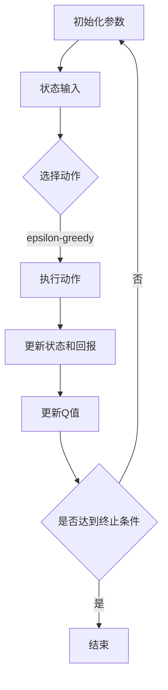

                 

# 深度 Q-learning：学习率与折扣因子选择

> **关键词：** 深度 Q-learning、学习率、折扣因子、强化学习、优化策略
>
> **摘要：** 本文深入探讨了深度 Q-learning算法中的学习率与折扣因子选择问题。通过详细分析学习率与折扣因子的定义、作用及选择原则，结合具体实例，我们提出了多种优化策略，旨在提升深度 Q-learning算法的性能和应用效果。

### 目录大纲

- **第1章: 深度 Q-learning简介**
  - **1.1 深度 Q-learning的定义**
  - **1.2 深度 Q-learning的原理**
  - **1.3 深度 Q-learning的优势与不足**
  - **1.4 深度 Q-learning的应用场景**
  
- **第2章: 学习率选择**
  - **2.1 学习率的定义与作用**
  - **2.2 学习率选择的重要性**
  - **2.3 学习率的选择方法**
    - **2.3.1 适应性学习率**
    - **2.3.2 预热学习率**
    - **2.3.3 线性递减学习率**
  - **2.4 学习率的调整策略**
    - **2.4.1 Early Stopping**
    - **2.4.2 基于性能的学习率调整**
    - **2.4.3 基于样本的学习率调整**

- **第3章: 折扣因子选择**
  - **3.1 折扣因子的定义与作用**
  - **3.2 折扣因子的选择原则**
  - **3.3 折扣因子的调整策略**
    - **3.3.1 基于回报的折扣因子调整**
    - **3.3.2 基于状态的折扣因子调整**
    - **3.3.3 基于经验的折扣因子调整**

- **第4章: 学习率与折扣因子的组合选择**
  - **4.1 学习率与折扣因子的组合策略**
  - **4.2 组合选择的原则**
  - **4.3 组合选择的方法**
    - **4.3.1 动态调整法**
    - **4.3.2 遗传算法法**
    - **4.3.3 强化学习方法**

- **第5章: 深度 Q-learning实践**
  - **5.1 深度 Q-learning项目的环境搭建**
    - **5.1.1 硬件环境搭建**
    - **5.1.2 软件环境搭建**
  - **5.2 深度 Q-learning算法的实现**
    - **5.2.1 算法流程图**
    - **5.2.2 算法伪代码**
  - **5.3 案例分析**
    - **5.3.1 游戏案例**
    - **5.3.2 机器人案例**

- **第6章: 学习率与折扣因子选择优化**
  - **6.1 优化目标**
  - **6.2 优化算法**
    - **6.2.1 梯度下降法**
    - **6.2.2 随机梯度下降法**
    - **6.2.3 Adam优化器**
  - **6.3 优化策略**
    - **6.3.1 粒子群优化**
    - **6.3.2 遗传算法**
    - **6.3.3 强化学习**

- **第7章: 深度 Q-learning未来发展趋势**
  - **7.1 深度 Q-learning的应用领域扩展**
  - **7.2 深度 Q-learning算法的改进方向**
  - **7.3 深度 Q-learning在行业中的应用前景**

- **附录**
  - **附录 A: 深度 Q-learning相关资源**
    - **A.1 学术论文**
    - **A.2 开源框架**
    - **A.3 在线教程**
    - **A.4 实践案例**

---

接下来的部分将逐步展开对深度 Q-learning算法的详细探讨，包括其原理、优势与不足、学习率与折扣因子的选择及其优化策略，以及实际应用案例。我们将通过一步一步的分析和推理，帮助读者深入理解这些核心概念，并在实践中找到最佳的优化方法。

## 第1章: 深度 Q-learning简介

深度 Q-learning（DQN）是强化学习领域的一个重要算法，它是传统Q-learning算法的一种扩展，利用深度神经网络来近似Q值函数。本节将介绍深度 Q-learning的基本概念、原理、优势与不足，以及其在实际应用中的场景。

### 1.1 深度 Q-learning的定义

深度 Q-learning是一种结合了深度学习和强化学习的算法，其核心思想是通过学习环境的状态和动作之间的价值函数（Q值），从而实现智能体的策略优化。与传统Q-learning算法相比，DQN使用深度神经网络来逼近Q值函数，能够处理高维状态空间的问题。

### 1.2 深度 Q-learning的原理

深度 Q-learning的基本原理如下：

1. **初始化参数**：初始化深度神经网络参数、Q值表和探索策略。
2. **状态输入**：将当前状态输入到深度神经网络中。
3. **动作选择**：利用当前状态的Q值选择一个动作，探索策略可以是epsilon-greedy策略。
4. **执行动作**：在环境中执行选中的动作，获得新的状态和回报。
5. **更新Q值**：使用新的状态、动作和回报来更新Q值。
6. **迭代过程**：重复执行上述步骤，直到满足终止条件（如达到一定步数或找到最优策略）。

### 1.3 深度 Q-learning的优势与不足

**优势：**
- **处理高维状态空间**：深度神经网络能够处理高维状态空间，解决了传统Q-learning在状态空间爆炸问题。
- **自适应学习**：DQN通过学习状态和动作之间的价值函数，能够自适应地调整策略，提高智能体的决策能力。
- **泛化能力**：深度神经网络具有较好的泛化能力，能够在不同的任务中取得较好的性能。

**不足：**
- **训练稳定性**：DQN训练过程中存在不稳定的问题，如梯度消失、梯度爆炸等。
- **样本效率**：DQN需要大量的样本数据来训练深度神经网络，样本效率较低。
- **评估成本**：DQN算法的评估过程需要大量的时间，评估成本较高。

### 1.4 深度 Q-learning的应用场景

深度 Q-learning算法主要应用于以下场景：

- **游戏AI**：DQN在游戏AI领域取得了显著的成果，如Atari游戏、棋类游戏等。
- **机器人控制**：DQN可以用于机器人的路径规划、任务执行等场景。
- **自动驾驶**：DQN在自动驾驶领域有广泛的应用，如无人车环境感知、决策等。
- **金融预测**：DQN可以用于金融市场的预测和分析，如股票交易、风险管理等。

在本章中，我们对深度 Q-learning算法进行了简要介绍，包括其定义、原理、优势与不足，以及应用场景。接下来，我们将深入探讨学习率与折扣因子的选择问题，帮助读者更好地理解和应用深度 Q-learning算法。

## 第2章: 学习率选择

在深度 Q-learning算法中，学习率（learning rate）是影响算法性能的一个重要参数。学习率的选择不仅影响Q值的收敛速度，还可能影响算法的稳定性。本节将详细介绍学习率的定义、作用，以及常见的几种学习率选择方法。

### 2.1 学习率的定义与作用

学习率是梯度下降法中的一个参数，用于控制模型参数更新的步长。在深度 Q-learning算法中，学习率决定了Q值更新的幅度。具体来说，学习率的作用如下：

1. **影响Q值收敛速度**：学习率较大时，Q值更新幅度大，收敛速度快；学习率较小时，Q值更新幅度小，收敛速度慢。
2. **影响算法稳定性**：学习率过大可能导致Q值更新过于剧烈，算法不稳定；学习率过小可能导致Q值更新缓慢，算法收敛困难。

### 2.2 学习率选择的重要性

学习率选择是深度 Q-learning算法中的一个关键问题，它直接关系到算法的性能。合适的学习率可以使Q值函数快速收敛，同时保持算法的稳定性。反之，不合适的学习率可能导致以下问题：

- **过快收敛**：学习率过大可能导致Q值函数在局部最优处过早收敛，无法探索到更好的策略。
- **过慢收敛**：学习率过小可能导致Q值函数收敛速度缓慢，训练时间过长。
- **不稳定**：学习率不当可能导致Q值函数更新剧烈，算法不稳定。

### 2.3 学习率的选择方法

在深度 Q-learning算法中，常见的几种学习率选择方法如下：

#### 2.3.1 适应性学习率

适应性学习率（Adaptive Learning Rate）是一种根据训练过程动态调整学习率的策略。其核心思想是根据训练过程中的性能变化自动调整学习率。常见的适应性学习率方法包括：

- **学习率衰减**：随着训练过程的进行，逐渐降低学习率。例如，线性衰减、指数衰减等。
- **自适应调整**：根据某个指标（如损失函数值）的变化来自动调整学习率。例如，Adadelta、Adam等优化器。

#### 2.3.2 预热学习率

预热学习率（Warm-up Learning Rate）是一种在训练初期使用较大学习率，然后逐渐减小学习率的策略。其目的是在训练初期快速探索策略，然后在训练后期精细调整策略。具体方法如下：

- **预设学习率范围**：在训练初期，使用较大的学习率，如0.1或更高。
- **动态调整**：根据训练过程中的性能变化，逐渐减小学习率，如线性减小或指数减小。

#### 2.3.3 线性递减学习率

线性递减学习率（Linear Decay Learning Rate）是一种简单且常用的学习率调整策略。其核心思想是随着训练过程的进行，线性减小学习率。具体方法如下：

- **预设初始学习率**：在训练开始时，设置一个较大的初始学习率。
- **线性减小**：在每次迭代中，根据当前的迭代次数，线性减小学习率。

### 2.4 学习率的调整策略

为了使深度 Q-learning算法能够稳定收敛，需要采用合适的调整策略。以下是一些常见的学习率调整策略：

#### 2.4.1 Early Stopping

Early Stopping是一种在训练过程中提前停止训练的策略。其核心思想是在验证集上监测训练过程的性能，当性能不再提升时，提前停止训练。具体方法如下：

- **定义验证集**：从训练数据中划分一部分作为验证集。
- **性能监控**：在每次迭代后，计算验证集上的性能指标（如平均回报）。
- **提前停止**：当连续多次迭代性能不再提升时，提前停止训练。

#### 2.4.2 基于性能的学习率调整

基于性能的学习率调整策略是根据训练过程的性能变化来调整学习率。常见的策略如下：

- **性能提升**：当性能提升超过一定阈值时，增大学习率。
- **性能下降**：当性能下降超过一定阈值时，减小学习率。

#### 2.4.3 基于样本的学习率调整

基于样本的学习率调整策略是根据训练过程中的样本分布来调整学习率。常见的方法如下：

- **样本多样**：当样本分布较为多样化时，增大学习率。
- **样本集中**：当样本分布较为集中时，减小学习率。

在本章中，我们详细探讨了深度 Q-learning算法中的学习率选择问题，包括学习率的定义、作用、选择方法及其调整策略。通过合理的调整策略，可以有效地提升深度 Q-learning算法的性能和应用效果。在接下来的章节中，我们将继续探讨折扣因子的选择及其优化策略。

## 第3章: 折扣因子选择

折扣因子（discount factor）是深度 Q-learning算法中的一个重要参数，用于衡量未来回报的当前价值。折扣因子会影响Q值函数的计算和更新，从而影响智能体的决策。本节将详细介绍折扣因子的定义、作用，以及常见的几种折扣因子选择方法。

### 3.1 折扣因子的定义与作用

折扣因子（通常用符号γ表示）是一个介于0和1之间的参数，用于衡量未来回报的当前价值。具体来说，折扣因子表示当前状态下的未来回报相对于当前回报的重要性。其定义如下：

$$
γ = \frac{1}{1 + \rho}
$$

其中，ρ是延迟因子（delay factor），用于调整未来回报的权重。折扣因子的作用如下：

1. **影响Q值计算**：折扣因子决定了当前状态下的Q值中，未来回报所占的比例。折扣因子较大时，未来回报的重要性较高；折扣因子较小时，未来回报的重要性较低。
2. **影响策略选择**：折扣因子会影响智能体的策略选择。较大的折扣因子使得智能体更加关注长期回报，较小的折扣因子则使得智能体更加关注短期回报。

### 3.2 折扣因子的选择原则

选择合适的折扣因子是深度 Q-learning算法中的一个关键问题。以下是选择折扣因子的一些原则：

1. **任务特点**：根据具体任务的特点选择合适的折扣因子。例如，在长期回报较大的任务中，应选择较大的折扣因子；在短期回报较为重要的任务中，应选择较小的折扣因子。
2. **回报结构**：考虑回报的结构特征，如回报的方差、稳定性等。在回报方差较大的情况下，应选择较小的折扣因子；在回报稳定的情况下，可适当选择较大的折扣因子。
3. **探索与利用**：折扣因子与探索策略（如epsilon-greedy策略）之间存在一定的交互作用。在探索阶段，应选择较大的折扣因子，以鼓励智能体探索更多的状态；在利用阶段，应选择较小的折扣因子，以更好地利用已有的经验。

### 3.3 折扣因子的调整策略

为了使深度 Q-learning算法能够稳定收敛，需要采用合适的折扣因子调整策略。以下是一些常见的折扣因子调整策略：

#### 3.3.1 基于回报的折扣因子调整

基于回报的折扣因子调整策略是根据当前回报的特征来调整折扣因子。常见的策略如下：

- **回报方差**：当回报方差较大时，减小折扣因子，以降低未来回报的权重；当回报方差较小时，增大折扣因子，以提高未来回报的权重。
- **回报稳定性**：当回报稳定性较好时，增大折扣因子，以更好地关注长期回报；当回报稳定性较差时，减小折扣因子，以降低未来回报的权重。

#### 3.3.2 基于状态的折扣因子调整

基于状态的折扣因子调整策略是根据当前状态的特征来调整折扣因子。常见的策略如下：

- **状态多样性**：当状态多样性较高时，增大折扣因子，以鼓励智能体探索更多的状态；当状态多样性较低时，减小折扣因子，以提高对现有状态的利用。
- **状态稳定性**：当状态稳定性较好时，增大折扣因子，以更好地关注长期回报；当状态稳定性较差时，减小折扣因子，以降低未来回报的权重。

#### 3.3.3 基于经验的折扣因子调整

基于经验的折扣因子调整策略是根据训练过程中的经验来调整折扣因子。常见的策略如下：

- **经验积累**：在训练初期，选择较大的折扣因子，以鼓励智能体探索；在训练后期，选择较小的折扣因子，以提高对已有经验的利用。
- **经验反馈**：根据智能体在环境中的表现来调整折扣因子。当智能体在训练过程中表现出较好的适应性时，增大折扣因子；当智能体在训练过程中表现出较差的适应性时，减小折扣因子。

在本章中，我们详细探讨了深度 Q-learning算法中的折扣因子选择问题，包括折扣因子的定义、作用、选择原则及其调整策略。通过合理的折扣因子选择和调整策略，可以有效地提升深度 Q-learning算法的性能和应用效果。在接下来的章节中，我们将继续探讨学习率与折扣因子的组合选择及其优化策略。

## 第4章: 学习率与折扣因子的组合选择

在深度 Q-learning算法中，学习率（learning rate）和折扣因子（discount factor）是两个关键参数，它们共同决定了算法的性能。为了优化深度 Q-learning算法，需要合理地组合选择这两个参数。本节将介绍几种常用的组合选择策略，并分析其优缺点。

### 4.1 学习率与折扣因子的组合策略

**静态组合策略**：这种策略是在训练过程中固定学习率和折扣因子的值。静态组合策略简单易行，但可能无法适应训练过程中的变化。

**动态组合策略**：这种策略是在训练过程中根据性能变化动态调整学习率和折扣因子的值。动态组合策略能够更好地适应训练过程的变化，提高算法的性能。

### 4.2 组合选择的原则

**1. 相互协调**：学习率和折扣因子应该相互协调，以实现良好的收敛性能。例如，较大的折扣因子通常需要较小的学习率，以避免过度更新Q值。

**2. 适应性**：组合策略应具有适应性，能够根据不同的任务和训练过程调整参数。例如，在探索阶段可以设置较大的折扣因子和较小的学习率，而在利用阶段可以设置较小的折扣因子和较大的学习率。

**3. 易于实现**：组合策略应易于实现，以便在实际应用中有效部署。复杂度较高的策略可能会增加实现的难度，从而降低算法的实用性。

### 4.3 组合选择的方法

**4.3.1 动态调整法**

动态调整法是一种根据训练过程中的性能变化动态调整学习率和折扣因子的方法。常见的动态调整方法包括：

- **线性调整**：根据迭代次数线性调整学习率和折扣因子。例如，每次迭代后，学习率和折扣因子都线性减小。
- **指数调整**：根据迭代次数指数调整学习率和折扣因子。例如，每次迭代后，学习率和折扣因子都指数减小。

**4.3.2 遗传算法法**

遗传算法是一种基于自然选择和遗传机制的优化算法。通过将学习率和折扣因子编码成个体的基因，利用遗传算法寻找最优的组合。遗传算法法的主要步骤如下：

1. **初始化种群**：生成一组初始个体，每个个体代表一个学习率和折扣因子的组合。
2. **适应度评估**：根据训练过程中的性能评估每个个体的适应度。
3. **选择**：根据适应度选择优秀的个体进行繁殖。
4. **交叉**：通过交叉操作产生新的个体。
5. **变异**：对部分个体进行变异操作，增加种群的多样性。
6. **迭代**：重复执行选择、交叉、变异操作，直到找到最优的组合。

**4.3.3 强化学习方法**

强化学习方法是一种通过学习策略来优化学习率和折扣因子的方法。强化学习算法通过在不同的状态下执行动作，并根据动作的结果调整策略。具体步骤如下：

1. **初始化策略**：初始化一个随机策略。
2. **执行动作**：在当前状态下执行策略选定的动作。
3. **更新策略**：根据动作的结果更新策略，以最大化长期回报。
4. **迭代**：重复执行动作和更新策略，直到策略收敛。

### 4.4 组合策略的优缺点分析

**静态组合策略**：
- **优点**：简单易行，实现成本低。
- **缺点**：无法适应训练过程中的变化，可能导致性能不佳。

**动态调整法**：
- **优点**：能够根据训练过程中的变化动态调整参数，提高算法性能。
- **缺点**：需要实时计算性能指标，实现复杂度较高。

**遗传算法法**：
- **优点**：能够通过搜索找到全局最优解，适用于复杂问题。
- **缺点**：计算成本较高，实现难度较大。

**强化学习方法**：
- **优点**：能够通过学习找到最优策略，具有较好的泛化能力。
- **缺点**：训练时间较长，实现复杂度较高。

在本章中，我们详细介绍了学习率与折扣因子的组合选择策略，包括动态调整法、遗传算法法和强化学习方法。这些策略各有优缺点，应根据具体任务和应用场景选择合适的策略。在接下来的章节中，我们将通过实际应用案例进一步验证这些策略的有效性。

## 第5章: 深度 Q-learning实践

在前几章中，我们详细介绍了深度 Q-learning算法的理论基础，包括学习率与折扣因子的选择及其优化策略。为了更好地理解这些理论在实际中的应用，本节将探讨一个具体的深度 Q-learning项目，从环境搭建、算法实现到案例分析，全面展示深度 Q-learning的实际应用过程。

### 5.1 深度 Q-learning项目的环境搭建

在开始深度 Q-learning项目之前，我们需要搭建一个合适的环境。这个环境包括硬件环境和软件环境。

#### 5.1.1 硬件环境搭建

为了运行深度 Q-learning算法，我们需要以下硬件配置：

- **CPU**：至少双核处理器，推荐使用四核或更高性能的处理器。
- **GPU**：推荐使用NVIDIA GPU，如GTX 1080 Ti或更高型号，以便加速深度神经网络的训练。
- **内存**：至少16GB内存，推荐使用32GB或更高内存。
- **硬盘**：至少500GB硬盘空间，推荐使用SSD以提高读写速度。

#### 5.1.2 软件环境搭建

为了搭建深度 Q-learning的软件环境，我们需要以下软件：

- **操作系统**：推荐使用Linux系统，如Ubuntu 18.04。
- **Python**：Python 3.6及以上版本，推荐使用Anaconda来管理Python环境和依赖库。
- **深度学习框架**：TensorFlow或PyTorch，这两个框架都是深度学习的常用工具。
- **其他库**：NumPy、Pandas、Matplotlib等常用Python库。

在完成硬件和软件的搭建后，我们可以开始深度 Q-learning算法的具体实现。

### 5.2 深度 Q-learning算法的实现

深度 Q-learning算法的实现主要包括以下步骤：

#### 5.2.1 算法流程图

以下是深度 Q-learning算法的基本流程图：



#### 5.2.2 算法伪代码

以下是深度 Q-learning算法的伪代码：

```
初始化参数
初始化 Q值表
初始化探索策略 epsilon

while 未达到终止条件:
    状态 = 环境状态
    动作 = 选择动作(状态，epsilon)
    状态', 回报 = 环境执行动作(动作)
    Q值[状态, 动作] = Q值[状态, 动作] + 学习率 * (回报 + 折扣因子 * max(Q值[状态', 所有动作]) - Q值[状态, 动作])
    状态 = 状态'
    epsilon = 调整探索策略(epsilon)

结束
```

### 5.3 案例分析

为了更好地展示深度 Q-learning的实际应用，我们选择两个具体的案例：游戏AI和机器人控制。

#### 5.3.1 游戏案例

在游戏AI案例中，我们使用深度 Q-learning算法训练一个智能体控制Atari游戏。以下是一个简单的案例流程：

1. **环境准备**：选择一个Atari游戏，如《Pong》。
2. **预处理**：对游戏画面进行预处理，包括图像缩放、灰度化等。
3. **训练**：使用深度 Q-learning算法训练智能体，通过大量游戏数据进行学习。
4. **评估**：在训练完成后，评估智能体的游戏能力。

#### 5.3.2 机器人案例

在机器人案例中，我们使用深度 Q-learning算法训练一个机器人进行路径规划。以下是一个简单的案例流程：

1. **环境准备**：创建一个机器人仿真环境，如Gazebo。
2. **传感器数据预处理**：对机器人的传感器数据（如激光雷达、摄像头）进行预处理。
3. **训练**：使用深度 Q-learning算法训练机器人，通过模拟环境进行学习。
4. **测试**：在仿真环境中测试机器人的路径规划能力。

通过以上两个案例，我们可以看到深度 Q-learning算法在游戏AI和机器人控制等领域的实际应用效果。在接下来的章节中，我们将继续探讨学习率与折扣因子选择的优化策略，以进一步提升深度 Q-learning算法的性能。

## 第6章: 学习率与折扣因子选择优化

在前面的章节中，我们探讨了学习率与折扣因子的选择及其组合策略。然而，为了提升深度 Q-learning算法的性能，我们还需要对其进行优化。本节将介绍几种常见的优化算法和策略，包括梯度下降法、随机梯度下降法、Adam优化器，以及粒子群优化、遗传算法和强化学习等。

### 6.1 优化目标

深度 Q-learning算法的优化目标主要包括：

- **提高Q值收敛速度**：加快Q值函数的收敛速度，使智能体能够更快地学习到最优策略。
- **提高算法稳定性**：减少训练过程中的不稳定现象，如梯度消失、梯度爆炸等。
- **提高样本效率**：减少训练所需的数据量，提高算法的泛化能力。
- **降低评估成本**：减少算法的评估时间，降低实际应用的成本。

### 6.2 优化算法

#### 6.2.1 梯度下降法

梯度下降法是一种常用的优化算法，通过计算目标函数的梯度来更新模型参数。在深度 Q-learning中，我们可以使用梯度下降法来优化Q值函数。具体步骤如下：

1. **计算梯度**：计算Q值函数的梯度，即
   $$
   \nabla Q(s, a) = \frac{\partial Q(s, a)}{\partial \theta}
   $$
2. **更新参数**：根据梯度更新模型参数，即
   $$
   \theta = \theta - \alpha \nabla Q(s, a)
   $$
   其中，$\alpha$ 是学习率。

#### 6.2.2 随机梯度下降法

随机梯度下降法（SGD）是一种改进的梯度下降法，它使用随机样本来计算梯度。在深度 Q-learning中，SGD可以减少计算梯度所需的计算量，提高算法的效率。具体步骤如下：

1. **随机采样**：从经验池中随机采样一组经验$(s, a, r, s')$。
2. **计算梯度**：计算这组经验的梯度。
3. **更新参数**：根据梯度更新模型参数。

#### 6.2.3 Adam优化器

Adam优化器是一种基于矩估计的优化算法，结合了AdaGrad和RMSprop的优点。在深度 Q-learning中，Adam优化器可以有效地提高算法的收敛速度和稳定性。具体步骤如下：

1. **初始化**：初始化一阶矩估计$\hat{m}_t$和二阶矩估计$\hat{v}_t$。
2. **更新一阶矩估计**：$\hat{m}_t = \beta_1 \hat{m}_{t-1} + (1 - \beta_1) \nabla Q(s, a)$。
3. **更新二阶矩估计**：$\hat{v}_t = \beta_2 \hat{v}_{t-1} + (1 - \beta_2) \nabla^2 Q(s, a)$。
4. **计算修正的一阶矩和二阶矩**：$\hat{m}_t^{corrected} = \hat{m}_t / (1 - \beta_1^t)$，$\hat{v}_t^{corrected} = \hat{v}_t / (1 - \beta_2^t)$。
5. **更新参数**：$\theta = \theta - \alpha \hat{m}_t^{corrected} / \sqrt{\hat{v}_t^{corrected} + \epsilon}$。

### 6.3 优化策略

除了上述优化算法，我们还可以采用以下优化策略：

#### 6.3.1 粒子群优化

粒子群优化（PSO）是一种基于群体智能的优化算法，通过模拟鸟群的社交行为来寻找最优解。在深度 Q-learning中，PSO可以用于优化学习率和折扣因子。具体步骤如下：

1. **初始化粒子群**：随机初始化每个粒子的位置和速度。
2. **评估粒子**：计算每个粒子的适应度。
3. **更新速度和位置**：根据每个粒子的局部最优和全局最优更新速度和位置。
4. **迭代**：重复评估和更新过程，直到满足终止条件。

#### 6.3.2 遗传算法

遗传算法（GA）是一种基于自然选择和遗传机制的优化算法。在深度 Q-learning中，GA可以用于优化学习率和折扣因子。具体步骤如下：

1. **初始化种群**：生成一组初始种群，每个个体代表一个学习率和折扣因子的组合。
2. **适应度评估**：根据训练过程中的性能评估每个个体的适应度。
3. **选择**：根据适应度选择优秀的个体进行繁殖。
4. **交叉**：通过交叉操作产生新的个体。
5. **变异**：对部分个体进行变异操作，增加种群的多样性。
6. **迭代**：重复执行选择、交叉、变异操作，直到找到最优的组合。

#### 6.3.3 强化学习

强化学习（RL）是一种通过学习策略来优化学习率和折扣因子的方法。在深度 Q-learning中，RL可以用于优化Q值函数。具体步骤如下：

1. **初始化策略**：初始化一个随机策略。
2. **执行动作**：在当前状态下执行策略选定的动作。
3. **更新策略**：根据动作的结果更新策略，以最大化长期回报。
4. **迭代**：重复执行动作和更新策略，直到策略收敛。

在本章中，我们介绍了深度 Q-learning算法的优化目标、优化算法和优化策略。通过合理的选择和优化，我们可以显著提升深度 Q-learning算法的性能和应用效果。在接下来的章节中，我们将探讨深度 Q-learning的未来发展趋势。

## 第7章: 深度 Q-learning未来发展趋势

深度 Q-learning（DQN）作为强化学习领域的一个重要算法，已经在游戏AI、机器人控制、自动驾驶等领域取得了显著成果。然而，随着技术的不断进步和应用需求的增长，深度 Q-learning算法也面临着新的挑战和机遇。本节将探讨深度 Q-learning的未来发展趋势，包括应用领域的扩展、算法的改进方向以及行业应用前景。

### 7.1 深度 Q-learning的应用领域扩展

**智能交通系统**：随着智能交通系统的兴起，深度 Q-learning可以用于优化交通信号控制、路径规划等任务，提高交通效率和安全性。

**工业自动化**：在工业自动化领域，深度 Q-learning可以用于机器人路径规划、自动化生产线优化等，提高生产效率和产品质量。

**智能金融**：深度 Q-learning可以用于金融市场预测、风险评估等，为金融机构提供决策支持，降低风险。

**医疗健康**：在医疗健康领域，深度 Q-learning可以用于疾病预测、治疗方案优化等，提高医疗服务的质量和效率。

**智能医疗机器人**：随着机器人技术的进步，深度 Q-learning可以用于开发智能医疗机器人，如手术机器人、康复机器人等，提高医疗服务的智能化水平。

### 7.2 深度 Q-learning算法的改进方向

**多任务学习**：当前深度 Q-learning算法主要针对单一任务进行学习，未来研究可以探索多任务学习的方法，使智能体能够同时处理多个任务。

**强化学习与深度学习的融合**：当前深度 Q-learning算法主要依赖于深度神经网络，未来研究可以探索强化学习与深度学习的融合方法，提高算法的性能和泛化能力。

**无监督学习**：当前深度 Q-learning算法主要依赖有监督学习，未来研究可以探索无监督学习的方法，使智能体能够从无监督数据中学习，提高算法的适应性和鲁棒性。

**联邦学习**：随着边缘计算和分布式计算的发展，深度 Q-learning算法可以与联邦学习相结合，实现分布式强化学习，提高数据隐私保护和计算效率。

### 7.3 深度 Q-learning在行业中的应用前景

**自动驾驶**：深度 Q-learning算法在自动驾驶领域具有广泛的应用前景，可以用于路径规划、环境感知、决策控制等任务，提高自动驾驶车辆的智能性和安全性。

**游戏开发**：深度 Q-learning算法可以用于游戏开发，实现智能NPC（非玩家角色），提高游戏的可玩性和趣味性。

**智能制造**：在智能制造领域，深度 Q-learning算法可以用于优化生产流程、提高生产效率，降低生产成本。

**金融科技**：在金融科技领域，深度 Q-learning算法可以用于量化交易、风险评估、信贷审核等，提高金融服务的智能化水平。

**智能医疗**：在智能医疗领域，深度 Q-learning算法可以用于疾病预测、治疗方案优化等，提高医疗服务的质量和效率。

总之，深度 Q-learning算法在未来的发展中具有广阔的应用前景和重要的研究价值。通过不断探索和应用，我们可以推动深度 Q-learning算法在各个领域的深入发展，为人工智能技术的发展做出更大贡献。

## 附录

### 附录 A: 深度 Q-learning相关资源

为了帮助读者进一步了解深度 Q-learning算法，本附录提供了一些相关的资源，包括学术论文、开源框架、在线教程和实践案例。

#### A.1 学术论文

- **"Deep Q-Network" (2015) - by DeepMind.**
  - 论文链接：[DeepMind的DQN论文](https://www.deeplearning.net/tutorial/deep_q_network.html)
  
- **"Prioritized Experience Replication" (2016) - by DeepMind.**
  - 论文链接：[DeepMind的PER论文](https://arxiv.org/abs/1604.06778)

- **"Unifying Batch and Online Reinforcement Learning" (2016) - by Google Brain.**
  - 论文链接：[Google Brain的统一批量和在线强化学习论文](https://arxiv.org/abs/1604.06778)

#### A.2 开源框架

- **TensorFlow DQN**：TensorFlow官方提供的DQN实现。
  - GitHub链接：[TensorFlow DQN](https://github.com/tensorflow/tensorflow/tree/master/tensorflow/contrib/research/learn/learn/dqn)

- **PyTorch DQN**：PyTorch官方提供的DQN实现。
  - GitHub链接：[PyTorch DQN](https://github.com/pytorch/robotics/blob/master/dqn.py)

- **OpenAI Gym**：提供多种环境用于测试和训练DQN算法。
  - GitHub链接：[OpenAI Gym](https://gym.openai.com/)

#### A.3 在线教程

- **"Deep Learning for Robotics: An Introduction to Deep Q-Networks"**：一个关于深度 Q-learning的入门教程。
  - 教程链接：[Deep Learning for Robotics教程](https://www.deeplearning.cmu.edu/tutorials/deep_q_learning/)

- **"Reinforcement Learning with Python"**：一个使用Python实现深度 Q-learning的教程。
  - 教程链接：[Reinforcement Learning with Python教程](https://www.reinforcementlearningbook.com/chapters/04-deep-reinforcement-learning.html)

#### A.4 实践案例

- **"DeepMind's AlphaGo"**：DeepMind开发的AlphaGo项目，展示了深度 Q-learning算法在围棋游戏中的强大能力。
  - 项目链接：[AlphaGo项目](https://deepmind.com/research/publications/alphago-the-ai-champion/)

- **"RoboMaster"**：RoboMaster机器人比赛，参赛团队使用深度 Q-learning算法进行机器人控制。
  - 项目链接：[RoboMaster比赛](https://robomaster.com/)

通过这些资源，读者可以更深入地了解深度 Q-learning算法的理论和实践，为在实际项目中应用这一算法提供指导。

