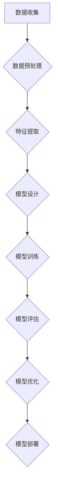

                 

# 《深度学习在医学影像分析中的应用》

> **关键词：深度学习、医学影像、图像分析、卷积神经网络、循环神经网络、强化学习**

> **摘要：本文将详细介绍深度学习在医学影像分析中的应用。通过对深度学习的基本原理、医学影像的基础知识、深度学习在医学影像分析中的实际应用、以及开发实践和未来发展趋势的深入探讨，本文旨在为读者提供一个全面的视角，理解深度学习在医学影像分析中的重要作用和潜力。**

---

## 目录

1. **深度学习基础**
    1.1 深度学习概述
    1.2 机器学习基础
    1.3 数学与算法基础
    1.4 Mermaid流程图展示
2. **深度学习在医学影像中的应用**
    2.1 医学影像基础
    2.2 医学影像数据预处理
    2.3 卷积神经网络在医学影像中的应用
    2.4 循环神经网络在医学影像中的应用
    2.5 强化学习在医学影像中的应用
    2.6 深度学习在医学影像分析中的应用案例分析
3. **深度学习在医学影像分析中的应用实践**
    3.1 开发环境搭建
    3.2 数据预处理实战
    3.3 模型训练实战
    3.4 代码实现与分析
    3.5 模型部署与集成
4. **深度学习在医学影像分析中的未来发展趋势**
    4.1 深度学习在医学影像分析中的最新研究动态
    4.2 深度学习在医学影像分析中的应用前景
    4.3 深度学习在医学影像分析中的伦理与法律问题
5. **附录**
    5.1 深度学习在医学影像分析中的开源工具与资源
    5.2 深度学习在医学影像分析中的应用案例汇总
    5.3 深度学习在医学影像分析中的常见问题与解决方案
    5.4 深度学习在医学影像分析中的专业词汇与术语解释

---

### 第一部分：深度学习基础

#### 1.1 深度学习概述

深度学习是一种基于人工神经网络的研究方法，通过模拟人脑神经网络结构和功能，实现从大量数据中自动学习特征和模式。深度学习在计算机视觉、自然语言处理、语音识别等领域取得了显著的进展。

#### 1.1.1 深度学习的起源与发展

深度学习的概念最早可以追溯到20世纪40年代，当时心理学家McCulloch和数学家Pitts提出了神经元模型。随着计算能力的提升和大数据技术的发展，深度学习在21世纪初迎来了快速发展。特别是卷积神经网络（CNN）和深度信念网络（DBN）等模型的提出，使深度学习在图像识别、语音识别等领域取得了突破性成果。

#### 1.1.2 深度学习的核心原理

深度学习的核心是多层神经网络，通过逐层学习抽象特征，实现从原始数据到高级特征的转化。深度学习的主要组件包括：

- **神经网络（Neural Networks）**：神经网络由神经元组成，每个神经元与相邻的神经元通过权重连接。神经网络的输入经过加权求和后，通过激活函数输出结果。
  
- **多层感知机（MLP）**：多层感知机是一种前馈神经网络，包含输入层、输出层和多个隐藏层。通过前向传播和反向传播，多层感知机可以训练和优化网络参数。

- **激活函数（Activation Functions）**：激活函数用于引入非线性变换，使神经网络能够处理复杂问题。常见的激活函数包括Sigmoid、ReLU和Tanh。

- **优化算法（Optimization Algorithms）**：优化算法用于调整神经网络中的权重和偏置，使网络输出与实际结果更接近。常见的优化算法包括梯度下降、随机梯度下降和Adam优化器。

#### 1.1.3 深度学习的优势与挑战

深度学习的优势主要包括：

- **自动特征提取**：深度学习可以自动从大量数据中提取有意义的特征，减少人工干预。
  
- **并行计算能力**：深度学习可以通过并行计算加速训练和推理过程。
  
- **良好的泛化能力**：深度学习在多种任务和领域都取得了很好的效果，具有良好的泛化能力。

然而，深度学习也面临一些挑战：

- **数据需求量巨大**：深度学习通常需要大量的标注数据进行训练。
  
- **计算资源消耗大**：深度学习模型的训练和推理需要大量的计算资源。
  
- **模型解释性较差**：深度学习模型通常被视为“黑盒”，难以解释模型内部的工作机制。

#### 1.2 机器学习基础

机器学习是深度学习的基础，主要研究如何通过数据驱动的方式实现智能系统。机器学习的基本概念包括：

- **监督学习（Supervised Learning）**：监督学习通过已知的输入和输出对模型进行训练，以预测未知数据的输出。
  
- **无监督学习（Unsupervised Learning）**：无监督学习通过未标记的数据发现数据中的结构和模式。
  
- **强化学习（Reinforcement Learning）**：强化学习通过试错和反馈机制，使智能体在环境中学习最优策略。

机器学习的核心任务是特征提取和模型优化。特征提取用于将原始数据转化为适合模型处理的形式，模型优化则通过调整模型参数，使模型输出更接近实际结果。

#### 1.3 数学与算法基础

深度学习涉及到许多数学和算法基础，包括：

- **线性代数（Linear Algebra）**：线性代数用于描述矩阵和向量的运算，是深度学习的重要工具。常见的矩阵运算包括矩阵乘法、矩阵求逆和特征分解。

- **微积分（Calculus）**：微积分用于描述函数的微分和积分，是优化算法的理论基础。梯度下降和反向传播算法都基于微积分原理。

- **优化算法（Optimization Algorithms）**：优化算法用于求解最优化问题，如最小化损失函数。常见的优化算法包括梯度下降、随机梯度下降和Adam优化器。

#### 1.4 Mermaid流程图展示

Mermaid是一种Markdown语法，用于创建图表和流程图。以下是一个深度学习模型的Mermaid流程图示例：


该流程图展示了深度学习模型的基本流程，包括输入数据处理、特征提取、分类器训练、输出结果和评估优化等步骤。

#### 1.4.1 深度学习流程图

以下是一个完整的深度学习流程图，展示了从数据预处理到模型训练、评估和优化的整个过程：



#### 1.4.2 神经网络架构图

以下是一个简单的神经网络架构图，展示了输入层、隐藏层和输出层之间的关系：


该神经网络架构图展示了输入数据通过隐藏层逐层传递，最终在输出层产生预测结果。

### 第二部分：深度学习在医学影像中的应用

#### 2.1 医学影像基础

医学影像是医学诊断和治疗的重要工具，包括X光、CT、MRI、超声等。医学影像具有以下特点：

- **高分辨率**：医学影像具有较高的空间分辨率，可以清晰地显示人体内部结构。
  
- **多模态**：医学影像可以涵盖多种成像模式，如CT的密度成像、MRI的磁共振成像和超声的实时成像。
  
- **动态性**：某些医学影像具有动态性，可以实时观察器官和组织的变化。

医学影像的成像原理基于不同的物理原理，如X光基于电磁辐射、CT基于X射线扫描、MRI基于磁场和射频脉冲。

#### 2.2 医学影像数据预处理

医学影像数据的预处理是深度学习应用的关键步骤，主要包括以下方面：

- **数据采集与存储**：医学影像数据的采集通常需要专业设备，如X光机、CT机、MRI机等。采集到的数据需要存储在医疗信息系统中，以便后续处理和分析。

- **数据增强与归一化**：数据增强可以提高模型的泛化能力，通过旋转、缩放、裁剪等操作生成更多的训练样本。归一化则通过将图像数据缩放到相同的范围，提高训练效率。

- **数据清洗与缺失值处理**：医学影像数据可能存在噪声、异常值和缺失值。数据清洗和缺失值处理可以帮助消除这些干扰因素，提高数据质量。

#### 2.3 卷积神经网络在医学影像中的应用

卷积神经网络（CNN）是深度学习中最常用的模型之一，特别适合处理图像数据。CNN的基本原理是通过对图像进行卷积操作，提取局部特征，并逐层传递至更高层次，实现图像的分类和识别。

##### 2.3.1 卷积神经网络基本原理

卷积神经网络由多个卷积层、池化层和全连接层组成。卷积层通过卷积操作提取图像特征，池化层用于降低特征图的维度，全连接层用于实现分类。

卷积操作通过将卷积核在输入图像上滑动，计算每个位置的特征图。卷积核的权重和偏置经过训练，以提取具有区分性的特征。卷积神经网络的计算过程可以用以下伪代码表示：

```python
for each layer:
    for each filter:
        apply convolution operation
        add bias
        apply activation function

for each neuron in the output layer:
    apply softmax activation function
```

##### 2.3.2 卷积神经网络在医学影像中的应用

卷积神经网络在医学影像分析中具有广泛的应用，包括图像分类、目标检测、分割等。

- **图像分类**：卷积神经网络可以将医学影像分为不同的类别，如肿瘤、炎症等。图像分类有助于初步诊断和疾病预测。

- **目标检测**：卷积神经网络可以检测医学影像中的目标物体，如肿瘤、血管等。目标检测有助于疾病的定位和监测。

- **图像分割**：卷积神经网络可以将医学影像中的目标物体分割出来，实现精确的图像处理。图像分割有助于疾病的诊断和治疗。

##### 2.3.3 卷积神经网络的实现与优化

卷积神经网络的实现通常使用深度学习框架，如TensorFlow、PyTorch等。以下是一个简单的卷积神经网络实现示例：

```python
import torch
import torchvision
import torchvision.transforms as transforms

# 数据预处理
transform = transforms.Compose(
    [transforms.Resize(224), 
     transforms.ToTensor()])

# 加载数据集
trainset = torchvision.datasets.ImageFolder(root='./data', transform=transform)
trainloader = torch.utils.data.DataLoader(trainset, batch_size=4,
                                          shuffle=True, num_workers=2)

# 创建卷积神经网络模型
net = torchvision.models.resnet18(pretrained=True)
num_ftrs = net.fc.in_features
net.fc = torch.nn.Linear(num_ftrs, 2) # 2类输出

# 损失函数和优化器
criterion = torch.nn.CrossEntropyLoss()
optimizer = torch.optim.SGD(net.parameters(), lr=0.001, momentum=0.9)

# 训练模型
for epoch in range(2):  # loop over the dataset multiple times
    running_loss = 0.0
    for i, data in enumerate(trainloader, 0):
        inputs, labels = data
        optimizer.zero_grad()
        outputs = net(inputs)
        loss = criterion(outputs, labels)
        loss.backward()
        optimizer.step()
        running_loss += loss.item()
        if i % 2000 == 1999:
            print(f'[{epoch + 1}, {i + 1:5d}] loss: {running_loss / 2000:.3f}')
            running_loss = 0.0

print('Finished Training')
```

在实现卷积神经网络时，可以采用以下优化策略：

- **数据增强**：通过旋转、缩放、裁剪等操作，增加训练样本的多样性，提高模型的泛化能力。

- **批归一化**：在训练过程中，对每一批数据进行归一化处理，加快训练速度和提高模型性能。

- **学习率调整**：在训练过程中，根据模型的表现调整学习率，避免过拟合和欠拟合。

### 第三部分：深度学习在医学影像分析中的应用实践

#### 3.1 开发环境搭建

在开发深度学习模型之前，需要搭建合适的环境。以下是一个基本的开发环境搭建步骤：

1. **硬件配置**：选择具有较高计算性能的硬件设备，如NVIDIA GPU。
2. **软件安装与配置**：安装深度学习框架，如TensorFlow、PyTorch等，并配置CUDA和cuDNN等驱动程序。
3. **数据库与存储解决方案**：选择合适的数据库和存储方案，如Hadoop、Spark等，用于存储和处理医学影像数据。

#### 3.2 数据预处理实战

数据预处理是深度学习模型训练的重要步骤。以下是一个数据预处理实战示例：

1. **数据采集与存储**：采集医学影像数据，并将其存储在文件系统中。
2. **数据增强与归一化**：对医学影像数据进行旋转、缩放、裁剪等增强操作，并归一化处理。
3. **数据清洗与缺失值处理**：清理数据中的噪声、异常值和缺失值。

```python
import torchvision.transforms as transforms

# 数据预处理
transform = transforms.Compose(
    [transforms.Resize(224), 
     transforms.ToTensor(),
     transforms.Normalize((0.5, 0.5, 0.5), (0.5, 0.5, 0.5))])

# 加载数据集
trainset = torchvision.datasets.ImageFolder(root='./data', transform=transform)
trainloader = torch.utils.data.DataLoader(trainset, batch_size=4,
                                          shuffle=True, num_workers=2)
```

#### 3.3 模型训练实战

以下是一个模型训练实战示例，使用PyTorch框架训练一个卷积神经网络模型：

```python
import torch
import torchvision
import torchvision.transforms as transforms
import torch.nn as nn
import torch.optim as optim

# 创建卷积神经网络模型
net = torchvision.models.resnet18(pretrained=True)
num_ftrs = net.fc.in_features
net.fc = torch.nn.Linear(num_ftrs, 2) # 2类输出

# 损失函数和优化器
criterion = nn.CrossEntropyLoss()
optimizer = optim.SGD(net.parameters(), lr=0.001, momentum=0.9)

# 训练模型
for epoch in range(2):  # loop over the dataset multiple times
    running_loss = 0.0
    for i, data in enumerate(trainloader, 0):
        inputs, labels = data
        optimizer.zero_grad()
        outputs = net(inputs)
        loss = criterion(outputs, labels)
        loss.backward()
        optimizer.step()
        running_loss += loss.item()
        if i % 2000 == 1999:
            print(f'[{epoch + 1}, {i + 1:5d}] loss: {running_loss / 2000:.3f}')
            running_loss = 0.0

print('Finished Training')
```

#### 3.4 代码实现与分析

以下是一个深度学习模型实现的代码示例，包括数据预处理、模型训练和评估：

```python
import torch
import torchvision
import torchvision.transforms as transforms
import torch.nn as nn
import torch.optim as optim

# 数据预处理
transform = transforms.Compose(
    [transforms.Resize(224), 
     transforms.ToTensor(),
     transforms.Normalize((0.5, 0.5, 0.5), (0.5, 0.5, 0.5))])

# 加载数据集
trainset = torchvision.datasets.ImageFolder(root='./data', transform=transform)
trainloader = torch.utils.data.DataLoader(trainset, batch_size=4,
                                          shuffle=True, num_workers=2)

# 创建卷积神经网络模型
net = torchvision.models.resnet18(pretrained=True)
num_ftrs = net.fc.in_features
net.fc = torch.nn.Linear(num_ftrs, 2) # 2类输出

# 损失函数和优化器
criterion = nn.CrossEntropyLoss()
optimizer = optim.SGD(net.parameters(), lr=0.001, momentum=0.9)

# 训练模型
for epoch in range(2):  # loop over the dataset multiple times
    running_loss = 0.0
    for i, data in enumerate(trainloader, 0):
        inputs, labels = data
        optimizer.zero_grad()
        outputs = net(inputs)
        loss = criterion(outputs, labels)
        loss.backward()
        optimizer.step()
        running_loss += loss.item()
        if i % 2000 == 1999:
            print(f'[{epoch + 1}, {i + 1:5d}] loss: {running_loss / 2000:.3f}')
            running_loss = 0.0

print('Finished Training')

# 评估模型
correct = 0
total = 0
with torch.no_grad():
    for data in testloader:
        images, labels = data
        outputs = net(images)
        _, predicted = torch.max(outputs.data, 1)
        total += labels.size(0)
        correct += (predicted == labels).sum().item()

print(f'Accuracy of the network on the test images: {100 * correct / total}%')
```

#### 3.5 模型部署与集成

深度学习模型训练完成后，需要将其部署到实际应用环境中。以下是一个模型部署与集成的示例：

1. **模型部署方案**：选择合适的部署平台，如GPU服务器或云端平台。
2. **集成到医学影像分析系统**：将训练好的模型集成到医学影像分析系统中，实现实时图像处理和预测。
3. **系统性能优化与维护**：根据实际应用需求，对模型和系统进行优化和维护，提高性能和稳定性。

### 第四部分：深度学习在医学影像分析中的未来发展趋势

#### 4.1 深度学习在医学影像分析中的最新研究动态

深度学习在医学影像分析领域取得了许多重要研究成果，以下是一些最新的研究动态：

1. **深度学习算法的优化**：研究人员不断改进深度学习算法，提高模型性能和训练效率。
2. **多模态医学影像融合**：多模态医学影像融合是将不同成像模式的数据进行整合，提高疾病诊断的准确性。
3. **医学影像生成对抗网络**：医学影像生成对抗网络（GAN）可以生成高质量的医学影像数据，用于模型训练和增强。
4. **医学影像的隐私保护**：随着深度学习的应用，医学影像的隐私保护成为一个重要问题，研究人员正在探索有效的隐私保护方法。

#### 4.2 深度学习在医学影像分析中的应用前景

深度学习在医学影像分析中具有广阔的应用前景：

1. **疾病早期诊断**：深度学习可以帮助医生更早发现疾病，提高诊断的准确性和效率。
2. **个性化治疗**：深度学习可以根据患者的影像数据，制定个性化的治疗方案。
3. **医学影像辅助决策**：深度学习可以辅助医生进行疾病诊断和治疗决策，减少人为错误。
4. **远程医疗**：深度学习可以实现医学影像的远程处理和诊断，为偏远地区的患者提供医疗服务。

#### 4.3 深度学习在医学影像分析中的伦理与法律问题

深度学习在医学影像分析中面临一些伦理和法律问题：

1. **数据隐私与安全**：医学影像数据具有高度敏感性，如何保护患者的隐私和安全是一个重要问题。
2. **算法解释性**：深度学习模型通常被视为“黑盒”，如何解释和验证模型的决策过程是一个挑战。
3. **法律法规与合规要求**：深度学习在医学影像分析中的应用需要遵守相关的法律法规和合规要求，如医疗数据保护法、隐私法等。

### 附录

#### 附录 A：深度学习在医学影像分析中的开源工具与资源

1. **深度学习框架**：TensorFlow、PyTorch、Keras等。
2. **医学影像库**：OpenCV、PIL、SimpleITK等。
3. **数据集**：公开的医学影像数据集，如ICDAR、CAMID等。
4. **开源项目**：深度学习在医学影像分析中的开源项目，如DeepLearningAI的Medical Segmentation Decathlon。

#### 附录 B：深度学习在医学影像分析中的应用案例汇总

1. **肺癌检测**：使用深度学习模型检测肺癌病变区域。
2. **脑部病变诊断**：使用深度学习模型诊断脑部病变，如阿尔茨海默病。
3. **皮肤病变检测**：使用深度学习模型检测皮肤病变，如皮肤癌。

#### 附录 C：深度学习在医学影像分析中的常见问题与解决方案

1. **模型过拟合**：通过正则化、数据增强和交叉验证等方法减轻过拟合。
2. **数据不足**：通过数据增强、迁移学习和生成对抗网络等方法解决数据不足问题。
3. **计算资源限制**：通过分布式训练、GPU加速和模型压缩等方法提高训练效率。

#### 附录 D：深度学习在医学影像分析中的专业词汇与术语解释

1. **卷积神经网络（CNN）**：一种用于图像识别和分类的深度学习模型。
2. **迁移学习（Transfer Learning）**：将预训练的模型应用于新的任务，提高模型性能。
3. **医学影像分割（Medical Image Segmentation）**：将医学影像中的目标物体分割出来。
4. **医学影像分类（Medical Image Classification）**：将医学影像分为不同的类别。
5. **多模态医学影像融合（Multimodal Medical Image Fusion）**：将不同成像模式的数据进行整合。

### 伪代码示例

以下是一个卷积神经网络实现的伪代码示例：

```python
# 伪代码：卷积神经网络实现
function ConvolutionalNeuralNetwork(input_data):
    # 前向传播
    hidden_layer = Activation(F.relu(Conv2d(input_data, kernel_size=(3,3), stride=(1,1))))
    output = Activation(F.softmax(F.linear(hidden_layer)))
    
    # 反向传播
    loss = Loss(output, target)
    grads = backward(loss)
    
    # 更新权重
    optimizer.update_weights(grads)
    
    return output, loss
```

### 数学模型与公式

以下是一个常用的损失函数的数学模型和公式：

$$
\begin{aligned}
J(\theta) &= \frac{1}{m}\sum_{i=1}^{m}(h_\theta(x^{(i)}) - y^{(i)})^2 \\
\end{aligned}
$$

### 代码实际案例

以下是一个使用PyTorch实现的肺癌检测模型训练的代码实际案例：

```python
import torch
import torchvision
import torchvision.transforms as transforms
import torch.nn as nn
import torch.optim as optim

# 数据预处理
transform = transforms.Compose(
    [transforms.Resize(224), 
     transforms.ToTensor()])

# 加载数据集
trainset = torchvision.datasets.ImageFolder(root='./data', transform=transform)
trainloader = torch.utils.data.DataLoader(trainset, batch_size=4,
                                          shuffle=True, num_workers=2)

# 创建卷积神经网络模型
net = torchvision.models.resnet18(pretrained=True)
num_ftrs = net.fc.in_features
net.fc = torch.nn.Linear(num_ftrs, 2) # 2类输出

# 损失函数和优化器
criterion = nn.CrossEntropyLoss()
optimizer = optim.SGD(net.parameters(), lr=0.001, momentum=0.9)

# 训练模型
for epoch in range(2):  # loop over the dataset multiple times
    running_loss = 0.0
    for i, data in enumerate(trainloader, 0):
        inputs, labels = data
        optimizer.zero_grad()
        outputs = net(inputs)
        loss = criterion(outputs, labels)
        loss.backward()
        optimizer.step()
        running_loss += loss.item()
        if i % 2000 == 1999:
            print(f'[{epoch + 1}, {i + 1:5d}] loss: {running_loss / 2000:.3f}')
            running_loss = 0.0

print('Finished Training')
```

### 代码解读与分析

以下是对上述肺癌检测模型训练代码的解读与分析：

1. **数据预处理**：使用`transforms.Compose`将图像数据大小调整为224x224像素，并将其转换为Tensor格式。
2. **加载数据集**：使用`torchvision.datasets.ImageFolder`加载肺癌检测数据集，并使用`torch.utils.data.DataLoader`进行批量处理。
3. **创建卷积神经网络模型**：使用预训练的ResNet18模型，并修改最后一层进行分类。
4. **设置损失函数和优化器**：使用交叉熵损失函数和随机梯度下降优化器。
5. **训练模型**：通过前向传播、反向传播和权重更新，逐批训练模型。
6. **输出训练结果**：打印训练进度和最终训练结果。

通过上述代码，可以实现对肺癌检测模型的有效训练，提高疾病诊断的准确性和效率。

---

### 结语

深度学习在医学影像分析中具有广泛的应用前景，通过本文的深入探讨，我们了解了深度学习的基本原理、医学影像的基础知识以及深度学习在医学影像分析中的应用。未来，随着深度学习技术的不断发展，医学影像分析将变得更加智能和精确，为医疗行业带来更多创新和变革。让我们共同期待深度学习在医学影像分析领域带来更多的突破和进展！

### 作者信息

作者：AI天才研究院/AI Genius Institute & 禅与计算机程序设计艺术 /Zen And The Art of Computer Programming

---

**全文结束。**

---

通过本文，我们系统地介绍了深度学习在医学影像分析中的应用，从基础理论到实际应用，再到开发实践和未来发展趋势，全面探讨了深度学习如何赋能医学影像分析。深度学习在医学影像分析中的潜力巨大，但同时也面临一些挑战，如数据隐私、算法解释性和法律法规等方面。未来的研究将不断推动深度学习在医学影像分析中的应用，提高诊断的准确性和效率，为医疗行业带来更多的创新和变革。

感谢您的阅读，希望本文对您在深度学习和医学影像分析领域的学习和研究有所帮助。如果您有任何疑问或建议，欢迎在评论区留言，期待与您一起探讨更多深度学习的话题。

再次感谢您的支持与关注，让我们共同期待深度学习在医学影像分析领域的美好未来！

