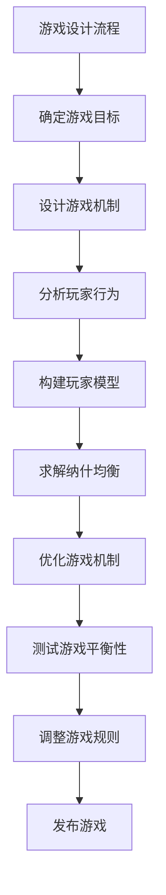

                 

### 文章标题

“游戏设计的纳什均衡：玩家策略的数学平衡”

---

**关键词：** 游戏设计、纳什均衡、玩家策略、数学平衡、博弈论、算法实现

**摘要：** 本文章深入探讨了游戏设计中纳什均衡的概念、原理及其在玩家策略优化中的应用。通过对纳什均衡与游戏设计之间的紧密联系、核心算法原理的讲解以及实际项目的案例解析，本文为游戏设计师提供了一套系统的纳什均衡分析框架，从而提升游戏的平衡性和玩家体验。

---

### 《游戏设计的纳什均衡：玩家策略的数学平衡》目录大纲

#### 第一部分：引言
- **第1章：游戏设计与纳什均衡概述**
  - **1.1 游戏设计的基本概念**
    - 游戏类型
    - 游戏元素
    - 游戏目标
  - **1.2 纳什均衡的概念**
    - 定义
    - 纳什均衡在博弈论中的应用
    - 纳什均衡与游戏设计的关系
  - **1.3 玩家策略的数学平衡**
    - 玩家行为模型
    - 数学平衡的基本原理
    - 玩家策略的评估

#### 第二部分：核心概念与联系
- **第2章：纳什均衡与游戏设计原理**
  - **2.1 纳什均衡的基本原理**
    - 纳什均衡的定义
    - 纳什均衡的判定方法
    - 纳什均衡的稳定性和破坏因素
  - **2.2 游戏设计与纳什均衡的关联**
    - 游戏机制与纳什均衡的关系
    - 纳什均衡在游戏设计中的应用
    - 纳什均衡对游戏平衡性的影响
  - **2.3 游戏中的纳什均衡案例**
    - 经典游戏案例分析
    - 纳什均衡在现实游戏中的应用
  - **2.4 Mermaid 流程图：游戏设计与纳什均衡的联系**
    - 游戏设计流程与纳什均衡的影响因素

#### 第三部分：核心算法原理讲解
- **第3章：玩家策略的数学建模**
  - **3.1 玩家行为模型的构建**
    - 玩家行为的基本假设
    - 玩家决策模型
    - 玩家行为的数据分析
  - **3.2 纳什均衡求解算法**
    - 博弈论求解算法
    - 纳什均衡的搜索策略
    - 算法复杂度分析
  - **3.3 伪代码与算法实现**
    - 纳什均衡求解算法的伪代码
    - 算法实现步骤解析

#### 第四部分：数学模型和数学公式讲解
- **第4章：数学模型与公式解析**
  - **4.1 纳什均衡的数学公式**
    - 公式解释
    - 公式推导
    - 公式应用
  - **4.2 玩家策略的优化模型**
    - 模型构建
    - 模型分析
    - 模型求解
  - **4.3 数学公式举例说明**
    - 公式示例
    - 示例解析

#### 第五部分：项目实战
- **第5章：纳什均衡在游戏设计中的实战应用**
  - **5.1 项目背景**
    - 项目介绍
    - 项目目标
  - **5.2 开发环境搭建**
    - 环境准备
    - 开发工具选择
  - **5.3 源代码详细实现**
    - 代码结构
    - 关键代码解读
  - **5.4 代码解读与分析**
    - 算法实现分析
    - 优化策略讨论

#### 第六部分：结论与展望
- **第6章：纳什均衡在游戏设计中的未来展望**
  - **6.1 纳什均衡在游戏设计中的挑战**
    - 挑战分析
    - 应对策略
  - **6.2 纳什均衡与游戏设计的融合趋势**
    - 发展趋势
    - 影响因素
  - **6.3 未来研究方向**
    - 未来展望
    - 研究方向

#### 附录
- **附录A：相关资源与工具**
  - **A.1 纳什均衡相关资源**
    - 参考书籍
    - 学术论文
    - 网络资源
  - **A.2 游戏设计工具与资源**
    - 游戏引擎介绍
    - 玩家行为数据收集工具
    - 游戏平衡性评估工具

---

**作者：** AI天才研究院/AI Genius Institute & 禅与计算机程序设计艺术 /Zen And The Art of Computer Programming

---

现在，让我们正式进入正文部分的撰写。首先，我们从游戏设计与纳什均衡的概述开始。这将为后续章节中的深入探讨奠定基础。

---

#### 第一部分：引言

游戏设计作为现代娱乐产业的重要组成部分，不仅丰富了人们的娱乐生活，同时也成为了一种复杂而精细的艺术。一个好的游戏设计能够激发玩家的兴趣，保持他们的参与度，并在长期的互动中不断提供新的挑战和乐趣。然而，游戏设计不仅仅是艺术创作，更是一门科学，涉及众多领域的交叉应用，包括心理学、计算机科学、人工智能等。

在游戏设计中，如何确保游戏公平、有趣且具有挑战性是至关重要的。纳什均衡（Nash Equilibrium），作为一种博弈论中的重要概念，为解决这一难题提供了理论支持。纳什均衡是博弈论中的一种稳定状态，当所有参与者都采取最优策略时，任何单一个体改变策略都无法获得额外的利益。这一概念不仅在经济学和战略规划中有广泛应用，在游戏设计中同样具有重要价值。

本文旨在探讨纳什均衡在游戏设计中的应用，通过以下三个方面展开：

1. **基本概念理解**：首先介绍游戏设计的基本概念，包括游戏类型、元素和目标，然后阐述纳什均衡的定义及其在博弈论中的应用，最后探讨玩家策略的数学平衡。

2. **核心概念与联系**：深入分析纳什均衡的基本原理，解释其在游戏设计中的关联和应用，通过经典游戏案例分析，展示纳什均衡在现实游戏中的实际运用。

3. **核心算法与实现**：讲解玩家策略的数学建模方法，包括玩家行为模型构建和纳什均衡求解算法，并通过伪代码详细阐述算法实现步骤。

#### 第二部分：游戏设计与纳什均衡概述

##### 1.1 游戏设计的基本概念

游戏设计是指通过创造性的过程来制定游戏规则、机制、故事情节、角色设定等，旨在提供有趣、挑战性和互动性的游戏体验。以下是游戏设计中的几个基本概念：

- **游戏类型**：游戏可以根据规则、目标和机制的不同分为多种类型，如角色扮演游戏（RPG）、动作游戏（Action Game）、策略游戏（Strategy Game）等。

- **游戏元素**：游戏中的元素包括角色、道具、场景、任务等，这些元素共同构成了游戏的虚拟世界。

- ** 游戏目标**：游戏的目标是引导玩家完成特定的任务或达到某种状态，如击败敌人、收集资源、完成任务等。

##### 1.2 纳什均衡的概念

纳什均衡是博弈论中的一个核心概念，由约翰·纳什提出。在博弈论中，博弈是指一组参与者在某种规则下进行竞争或合作的过程。纳什均衡指的是在这种竞争或合作过程中，所有参与者都采取最优策略，且任何一个参与者改变策略都不会使其收益增加的状态。

纳什均衡的定义可以形式化为：在博弈中，如果所有参与者都采取了最优策略，并且任何一个参与者单方面改变策略都无法改善其收益，那么这种状态被称为纳什均衡。

##### 1.3 纳什均衡在博弈论中的应用

纳什均衡在博弈论中具有广泛的应用，尤其在策略决策和竞争分析中具有重要价值。以下是纳什均衡在博弈论中的几个应用实例：

1. **经济竞争**：在市场竞争中，企业通过设定价格和产量来争夺市场份额。纳什均衡帮助企业确定最优策略，避免恶性竞争。

2. **国际合作**：在多国博弈中，各国通过协商达成共识，以实现共同利益。纳什均衡帮助分析各国在不同政策下的反应，预测国际合作的可能性。

3. **军事策略**：在军事对抗中，双方通过策略选择来争夺战略优势。纳什均衡指导军事决策者制定合理的防御或进攻策略。

##### 1.4 纳什均衡与游戏设计的关系

纳什均衡在游戏设计中的重要性在于，它为游戏平衡性提供了理论支持。一个设计良好的游戏应当避免出现单一策略占绝对优势的情况，从而保持游戏的多样性和趣味性。纳什均衡通过分析玩家策略的平衡状态，帮助游戏设计师找到合理的游戏机制和规则，确保游戏在不同策略下保持平衡。

例如，在多人在线游戏（MMO）中，玩家之间存在着复杂的互动和竞争关系。通过纳什均衡分析，游戏设计师可以识别出可能导致游戏不平衡的策略，并对其进行调整，从而提升游戏的公平性和可玩性。

##### 1.5 玩家策略的数学平衡

在游戏设计中，玩家策略的数学平衡是指通过数学模型来分析和评估玩家在不同策略下的收益和风险。数学平衡的基本原理是，在给定所有其他玩家策略的情况下，任何一个玩家改变策略都不会改变其期望收益。

玩家策略的数学平衡可以通过以下步骤实现：

1. **构建玩家行为模型**：根据游戏规则和玩家行为特征，建立数学模型来描述玩家的决策过程。

2. **分析策略平衡状态**：通过求解纳什均衡，确定在当前策略组合下，所有玩家都采取最优策略的状态。

3. **评估策略平衡性**：对策略平衡状态进行评估，判断其是否符合游戏平衡性要求。如果策略平衡性不足，需要调整游戏机制和规则，以实现更好的平衡效果。

通过上述步骤，游戏设计师可以有效地优化游戏平衡性，提升玩家的游戏体验。

##### 1.6 玩家策略的评估

在游戏设计中，玩家策略的评估是一个关键环节。通过对玩家策略进行评估，游戏设计师可以了解不同策略的优劣，从而制定出更加合理和公平的游戏规则。

玩家策略的评估可以从以下几个方面进行：

1. **收益评估**：计算玩家在不同策略下的期望收益，评估策略的盈利能力。

2. **风险评估**：分析玩家在不同策略下的风险水平，评估策略的安全性和稳定性。

3. **多样性评估**：考虑玩家在不同策略下的多样性，评估策略的趣味性和可玩性。

4. **平衡性评估**：评估不同策略之间的平衡性，确保游戏在不同策略下保持公平和有趣。

通过综合评估玩家策略，游戏设计师可以找到最合适的策略组合，实现游戏的平衡性和趣味性。

#### 结论

综上所述，游戏设计与纳什均衡之间存在着紧密的联系。纳什均衡为游戏平衡性提供了理论支持，通过分析玩家策略的数学平衡，可以帮助游戏设计师找到最优的游戏机制和规则。本文后续章节将进一步探讨纳什均衡在游戏设计中的应用，包括核心概念、算法原理以及实际项目案例，为游戏设计师提供实用的理论工具和实战经验。

在接下来的章节中，我们将深入探讨纳什均衡的基本原理，以及如何将其应用于游戏设计中。敬请期待。

---

在接下来的章节中，我们将深入探讨纳什均衡的基本原理，以及如何将其应用于游戏设计中。敬请期待。

---

### 第二部分：核心概念与联系

在游戏设计中，纳什均衡作为博弈论中的一个核心概念，其重要性不言而喻。本章节将详细阐述纳什均衡的基本原理，并探讨其与游戏设计之间的紧密联系。

#### 2.1 纳什均衡的基本原理

纳什均衡的定义是：在一个博弈中，如果所有参与者都采取最优策略，且任何一个参与者单方面改变策略无法使其收益增加，则这种状态被称为纳什均衡。

为了更深入地理解纳什均衡，我们需要先了解博弈论中的基本概念。博弈论是一种研究决策制定和策略选择的数学理论。博弈的基本要素包括参与者、策略、支付函数等。参与者是指在博弈中做出决策的个体，策略是指参与者可以采取的行动方案，支付函数则描述了每个参与者根据不同策略组合获得的收益或损失。

纳什均衡的核心思想是，在给定其他参与者的策略时，任何单一个体改变策略都不会改善其收益。这意味着在纳什均衡状态下，所有参与者都采取了最优策略，任何单一个体都没有激励去改变策略，因为这样做不会带来额外的收益。

##### 2.1.1 纳什均衡的定义

定义：在一个博弈中，如果一组策略组合满足以下条件，则该策略组合构成纳什均衡：

- **每个参与者都采取了最优策略**：即对于每个参与者，在给定其他参与者策略的情况下，其当前策略是最优的，无法通过改变策略获得更高的收益。
- **任何单一个体改变策略无法改善其收益**：即对于任意一个参与者，如果其改变策略，则其收益不会增加。

##### 2.1.2 纳什均衡的判定方法

判定纳什均衡的方法有多种，常见的包括以下几种：

- **静态博弈**：通过直接分析每个参与者的支付函数，判断是否存在一组策略组合满足纳什均衡条件。
- **动态博弈**：通过逆向归纳法，从最后一阶段开始逐步向前分析，判断是否存在一组策略组合满足纳什均衡条件。
- **混合策略**：在某些博弈中，参与者可能采取不确定的策略组合，通过计算概率分布来判定是否存在纳什均衡。

##### 2.1.3 纳什均衡的稳定性和破坏因素

纳什均衡的稳定性是指，在纳什均衡状态下，系统是否能够长期维持该状态。如果纳什均衡状态是稳定的，那么系统将在一定程度上抵制外部干扰，保持平衡。反之，如果纳什均衡状态是不稳定的，那么系统可能会在较小的干扰下发生失衡。

破坏纳什均衡的因素包括：

- **外部冲击**：如市场变化、政策调整等，可能打破原有的均衡状态。
- **参与者行为变化**：如某个参与者的策略发生变化，可能导致整个系统失衡。
- **外部环境变化**：如技术进步、社会文化变迁等，可能影响参与者的行为和决策。

#### 2.2 游戏设计与纳什均衡的关联

纳什均衡在游戏设计中的应用非常广泛，其核心在于通过平衡不同玩家的策略，确保游戏的可玩性和公平性。以下是纳什均衡在游戏设计中的几个关键应用：

##### 2.2.1 游戏机制与纳什均衡的关系

游戏机制是指游戏中规则和元素的组合，决定了玩家的行为和互动方式。纳什均衡可以帮助游戏设计师分析不同游戏机制对玩家策略的影响，确保游戏机制能够引导玩家采取多样化和平衡的策略。

例如，在多人在线游戏（MMO）中，游戏机制可能包括资源争夺、等级提升、角色技能等。通过纳什均衡分析，游戏设计师可以识别出可能导致游戏不平衡的机制，并对其进行调整，以实现游戏的公平性和多样性。

##### 2.2.2 纳什均衡在游戏设计中的应用

纳什均衡在游戏设计中的应用主要体现在以下几个方面：

- **平衡性调整**：通过纳什均衡分析，游戏设计师可以识别出可能导致游戏不平衡的策略组合，并对其进行调整，以实现游戏的平衡性。
- **策略设计**：在游戏设计中，设计师可以通过纳什均衡分析来指导玩家策略的设计，确保不同策略之间能够相互制约，避免单一流派或策略占据绝对优势。
- **游戏平衡性测试**：在游戏开发过程中，纳什均衡分析可以帮助测试游戏平衡性，发现并解决潜在的平衡性问题，确保游戏在发布时能够提供良好的游戏体验。

##### 2.2.3 纳什均衡对游戏平衡性的影响

纳什均衡对游戏平衡性的影响主要体现在以下几个方面：

- **游戏机制优化**：通过纳什均衡分析，游戏设计师可以识别出游戏机制中的潜在问题，并对其进行优化，以提高游戏的平衡性和可玩性。
- **玩家策略引导**：纳什均衡可以引导玩家采取多样化和平衡的策略，避免游戏中的单一流派或策略占据绝对优势，保持游戏的长久魅力。
- **游戏公平性保障**：纳什均衡有助于保障游戏的公平性，确保所有玩家在游戏中有平等的机会获胜，提高玩家的满意度和忠诚度。

#### 2.3 游戏中的纳什均衡案例

为了更好地理解纳什均衡在游戏设计中的应用，我们来看几个经典的游戏案例。

##### 2.3.1 经典游戏案例分析

- **《星际争霸》**：在《星际争霸》中，纳什均衡分析帮助设计师确保不同种族之间的策略平衡。例如，通过调整建筑位置、资源分配和单位数量等因素，确保不同种族在游戏中的竞争力相当。
- **《魔兽世界》**：在《魔兽世界》中，纳什均衡分析用于调整装备和技能的平衡性，确保玩家在游戏中的选择多样化，避免某些装备或技能过于强大，导致游戏失衡。
- **《英雄联盟》**：在《英雄联盟》中，纳什均衡分析用于平衡不同英雄之间的能力，确保每个英雄都有其独特的优势和劣势，避免某些英雄过于强大或过于弱势。

##### 2.3.2 纳什均衡在现实游戏中的应用

- **策略游戏**：在策略游戏中，纳什均衡分析用于优化游戏机制，确保游戏中的决策和策略多样化，避免单一策略占据绝对优势。
- **多人在线游戏**：在多人在线游戏中，纳什均衡分析用于引导玩家采取多样化和平衡的策略，确保游戏的公平性和可玩性。
- **桌面游戏**：在桌面游戏中，纳什均衡分析用于平衡不同角色的能力，确保游戏中的竞争性和公平性。

#### 2.4 Mermaid 流程图：游戏设计与纳什均衡的联系

为了更好地理解游戏设计与纳什均衡之间的联系，我们使用Mermaid流程图来展示游戏设计流程中的关键环节及其与纳什均衡的影响因素。



在上述流程图中，我们可以看到游戏设计流程从确定游戏目标开始，通过设计游戏机制、分析玩家行为、构建玩家模型，最终求解纳什均衡，并优化游戏机制。这一过程确保了游戏在不同策略下的平衡性和可玩性。

通过上述流程图，我们可以更直观地理解游戏设计与纳什均衡之间的联系，以及纳什均衡在游戏设计中的重要作用。

#### 结论

综上所述，纳什均衡在游戏设计中具有重要的作用。通过分析玩家策略的数学平衡，游戏设计师可以找到最优的游戏机制和规则，确保游戏的可玩性和公平性。本文通过详细阐述纳什均衡的基本原理和应用，以及经典游戏案例分析，展示了纳什均衡在游戏设计中的实际运用。在接下来的章节中，我们将进一步探讨玩家策略的数学建模和求解算法，为游戏设计师提供更加实用的理论工具和实战经验。

---

在接下来的章节中，我们将深入探讨玩家策略的数学建模，包括玩家行为模型的构建、纳什均衡求解算法以及算法实现步骤。敬请期待。

---

### 第三部分：核心算法原理讲解

在游戏设计中，纳什均衡的应用不仅依赖于理论理解，更需要通过具体的算法来实现。本章节将详细介绍玩家策略的数学建模过程，包括玩家行为模型的构建、纳什均衡求解算法以及算法的实现步骤。

#### 3.1 玩家行为模型的构建

玩家行为模型是纳什均衡分析的基础，它通过描述玩家的决策过程和行为特征，为后续算法的实现提供数据支持。构建玩家行为模型需要遵循以下几个关键步骤：

##### 3.1.1 玩家行为的基本假设

在构建玩家行为模型时，我们需要首先明确一些基本假设，这些假设有助于简化问题并建立合理的数学模型。以下是常见的几个基本假设：

- **理性假设**：玩家在做出决策时总是追求最大化自己的收益。
- **有限理性假设**：玩家在决策过程中可能受到信息不完全或认知局限的影响。
- **风险偏好假设**：玩家可能对风险的偏好程度不同，这会影响其策略选择。

##### 3.1.2 玩家决策模型

玩家决策模型描述了玩家在不同情境下的决策过程。常见的决策模型包括以下几种：

1. **静态决策模型**：玩家在给定当前状态时，选择一个确定性的策略。
2. **动态决策模型**：玩家在多个阶段进行决策，每个阶段的决策依赖于当前状态和历史信息。
3. **混合决策模型**：玩家在决策过程中可能同时采用确定性策略和随机策略。

在构建玩家决策模型时，我们可以使用以下基本组件：

- **状态**：描述游戏当前的情景特征，如资源数量、敌对单位的分布等。
- **行动**：玩家可以采取的所有可能行动，如攻击、防守、移动等。
- **收益**：玩家采取特定行动后获得的收益，可以是直接收益（如金币、经验值）或间接收益（如提高生存几率）。

##### 3.1.3 玩家行为的数据分析

为了构建准确的玩家行为模型，我们需要收集和分析大量玩家行为数据。以下是一些常见的数据分析方法：

1. **统计分析**：通过对玩家行为数据进行分析，提取出玩家行为的统计特征，如频率分布、相关性等。
2. **机器学习**：使用机器学习算法，如决策树、随机森林、神经网络等，对玩家行为进行建模和预测。
3. **游戏引擎日志**：通过游戏引擎的日志记录，分析玩家的游戏行为和决策过程。

通过上述方法，我们可以获得关于玩家行为的详细数据，并基于这些数据构建玩家行为模型。

#### 3.2 纳什均衡求解算法

纳什均衡的求解是游戏设计中的关键步骤，它决定了游戏中的策略平衡性。以下是几种常见的纳什均衡求解算法：

##### 3.2.1 博弈论求解算法

博弈论求解算法是通过数学方法求解博弈论问题的一类算法。常见的博弈论求解算法包括：

1. **逆向归纳法**：从博弈的最后一阶段开始，逐步向前分析，直到初始阶段，找到满足纳什均衡条件的策略组合。
2. **动态规划**：通过递归关系求解博弈中的最优策略，适用于静态博弈和动态博弈。
3. **线性规划**：将博弈问题转化为线性规划问题，使用线性规划求解器求解纳什均衡。

##### 3.2.2 纳什均衡的搜索策略

在实际应用中，直接求解纳什均衡可能非常复杂，因此常常采用搜索策略来近似求解。以下是一些常见的搜索策略：

1. **贪婪搜索**：在给定当前状态下，选择当前最优的局部策略，逐步迭代，直到找到全局最优策略。
2. **遗传算法**：模拟自然选择过程，通过种群进化找到纳什均衡。
3. **模拟退火算法**：在搜索过程中，引入随机性和温度参数，逐步收敛到纳什均衡。

##### 3.2.3 算法复杂度分析

算法复杂度分析是评估算法性能的重要指标。以下是几种常见算法的复杂度分析：

1. **逆向归纳法**：时间复杂度通常为O(n^2)，其中n是博弈的阶段数。
2. **动态规划**：时间复杂度通常为O(n^3)，其中n是博弈的阶段数。
3. **贪婪搜索**：时间复杂度通常为O(n^2)，其中n是博弈的状态数。
4. **遗传算法**：时间复杂度通常为O(nlogn)，其中n是种群规模。

#### 3.3 伪代码与算法实现

为了更好地理解纳什均衡求解算法，我们提供以下伪代码，并详细解释其实现步骤。

```python
# 伪代码：纳什均衡求解算法

Algorithm NashEquilibrium(Game)
    // 初始化玩家策略
    Strategies = InitializeStrategies(Game)

    // 求解纳什均衡
    while not Converged( Strategies )
        // 更新玩家策略
        Strategies = UpdateStrategies( Strategies, Game )

    return Strategies

// 辅助函数
function Converged(Strategies)
    // 判断策略是否收敛
    // 如果所有策略都未发生变化，则认为收敛
    return all( Strategies[i] == Strategies[i-1] for i in range(len(Strategies)) )

function InitializeStrategies(Game)
    // 初始化玩家策略
    // 根据游戏规则和玩家行为模型生成初始策略
    return []

function UpdateStrategies( Strategies, Game )
    // 更新玩家策略
    // 根据当前状态和纳什均衡条件，计算最优策略
    return []

```

在上述伪代码中，`NashEquilibrium` 函数是纳什均衡求解的主函数，它通过迭代更新玩家策略，直到策略收敛。`Converged` 函数用于判断策略是否收敛，`InitializeStrategies` 函数用于初始化玩家策略，`UpdateStrategies` 函数用于更新玩家策略。

#### 3.4 算法实现步骤解析

以下是纳什均衡求解算法的实现步骤：

1. **初始化玩家策略**：根据游戏规则和玩家行为模型，初始化玩家策略。这一步骤可以通过对每个玩家可能的行动进行枚举来实现。
2. **求解纳什均衡**：通过迭代更新玩家策略，直到策略收敛。在每次迭代中，需要计算当前状态下每个玩家的最优策略。
3. **更新玩家策略**：根据纳什均衡条件，更新玩家策略。这一步骤可以通过动态规划、贪婪搜索或其他优化算法来实现。
4. **判断策略收敛**：通过判断策略是否收敛，确定求解过程是否结束。如果所有策略都未发生变化，则认为收敛。

通过上述步骤，我们可以实现纳什均衡求解算法，并将其应用于游戏设计中。

#### 结论

综上所述，玩家策略的数学建模和纳什均衡求解算法是游戏设计中的关键组成部分。通过构建玩家行为模型和求解纳什均衡，游戏设计师可以找到最优的游戏机制和规则，确保游戏的可玩性和公平性。本章节详细介绍了玩家行为模型的构建、纳什均衡求解算法以及算法实现步骤，为游戏设计师提供了实用的理论工具和实战经验。在接下来的章节中，我们将进一步探讨数学模型和公式的具体应用，为游戏设计提供更深入的技术支持。

---

在接下来的章节中，我们将深入探讨数学模型和公式的应用，包括纳什均衡的数学公式、玩家策略的优化模型以及数学公式举例说明。敬请期待。

---

### 第四部分：数学模型和数学公式讲解

在游戏设计中，纳什均衡作为一种关键理论，需要借助数学模型和公式进行精确描述和分析。本章节将详细讲解纳什均衡的数学公式、玩家策略的优化模型以及数学公式的实际应用，通过具体的示例来说明这些概念和方法。

#### 4.1 纳什均衡的数学公式

纳什均衡是博弈论中的核心概念，其数学公式描述了在博弈中，所有参与者的策略组合使得每个参与者都不愿意单独改变策略的状态。以下是纳什均衡的数学公式及其解释：

##### 4.1.1 纳什均衡的公式表示

在给定博弈的参与者和策略集合的情况下，纳什均衡可以用以下公式表示：

\[ (s_1^*, s_2^*, \ldots, s_n^*) \in \Delta_S \]

其中：
- \( s_1^*, s_2^*, \ldots, s_n^* \) 分别表示每个参与者 \( i \) 的最优策略。
- \( \Delta_S \) 表示策略集合的全体非空子集。

##### 4.1.2 公式推导

纳什均衡的推导基于参与者收益的最大化。在博弈中，每个参与者 \( i \) 的收益 \( u_i(s_1, s_2, \ldots, s_n) \) 是其策略组合 \( s_1, s_2, \ldots, s_n \) 的函数。为了找到纳什均衡，我们需要满足以下条件：

对于每个参与者 \( i \)，有：
\[ u_i(s_i^*, s_1, \ldots, \hat{s_i}, \ldots, s_n) \geq u_i(s_i, s_1, \ldots, \hat{s_i}, \ldots, s_n) \]

其中 \( \hat{s_i} \) 表示除了参与者 \( i \) 的策略外的所有策略。

这意味着，在给定的其他参与者策略 \( s_1, \ldots, \hat{s_i}, \ldots, s_n \) 下，参与者 \( i \) 的策略 \( s_i^* \) 是其最优策略，即无法通过单独改变自己的策略来获得更高的收益。

##### 4.1.3 公式应用

在游戏设计中，纳什均衡公式可以用于分析玩家策略的平衡性。例如，在一个多人在线游戏中，游戏设计师可以通过计算纳什均衡，判断游戏机制是否能够引导玩家采取多样化的策略，从而避免某一种策略占据绝对优势，导致游戏失衡。

#### 4.2 玩家策略的优化模型

玩家策略的优化模型是游戏设计中用于评估和调整玩家策略的重要工具。以下是一个简单的玩家策略优化模型的构建过程：

##### 4.2.1 模型构建

1. **定义状态和行动**：根据游戏规则，定义游戏中的状态集合 \( S \) 和行动集合 \( A \)。

2. **定义收益函数**：定义每个玩家在特定状态和行动组合下的收益函数 \( u_i(s, a_1, a_2, \ldots, a_n) \)。

3. **定义目标函数**：根据游戏的目标，定义优化目标函数 \( f(s, a_1, a_2, \ldots, a_n) \)。

##### 4.2.2 模型分析

玩家策略的优化模型可以通过以下步骤进行分析：

1. **状态分析**：分析不同状态下的玩家行为和收益情况。

2. **行动分析**：分析不同行动组合下的玩家收益和策略选择。

3. **优化分析**：通过求解优化目标函数，找到最优策略组合，以实现游戏目标。

##### 4.2.3 模型求解

求解玩家策略优化模型通常采用以下方法：

1. **动态规划**：通过递归关系求解最优策略。

2. **线性规划**：将优化模型转化为线性规划问题，使用线性规划求解器求解。

3. **机器学习**：使用机器学习算法，如梯度下降、神经网络等，求解玩家策略优化问题。

#### 4.3 数学公式举例说明

为了更好地理解纳什均衡和玩家策略优化模型，下面通过一个简单的例子进行说明。

##### 4.3.1 纳什均衡示例

假设有一个简单的博弈，有两个参与者 A 和 B，他们的策略集合分别为 \( \{L, R\} \)，收益函数如下：

\[ 
\begin{aligned}
&u_A(L, R) = 3, \quad u_A(L, L) = 2, \quad u_A(R, R) = 1, \quad u_A(R, L) = 0, \\
&u_B(L, R) = 0, \quad u_B(L, L) = 1, \quad u_B(R, R) = 2, \quad u_B(R, L) = 3.
\end{aligned}
\]

要找到纳什均衡，我们需要满足以下条件：

\[ 
\begin{aligned}
&u_A(L, B) \geq u_A(R, B), \\
&u_A(L, B) \geq u_A(L, R), \\
&u_B(A, L) \geq u_B(A, R), \\
&u_B(A, L) \geq u_B(R, L).
\end{aligned}
\]

通过计算，我们可以得到纳什均衡为 \( (L, R) \)，即参与者 A 选择 L 策略，参与者 B 选择 R 策略。

##### 4.3.2 玩家策略优化模型示例

假设在一个游戏中，有两个玩家 A 和 B，他们的策略分别为攻击（A）和防守（D），状态集合为 \( S = \{S1, S2\} \)，收益函数如下：

\[ 
\begin{aligned}
&u_A(A, D, S1) = 2, \quad u_A(A, A, S1) = 1, \\
&u_A(D, D, S1) = 0, \quad u_A(D, A, S1) = -1, \\
&u_B(A, D, S2) = 1, \quad u_B(A, A, S2) = 0, \\
&u_B(D, D, S2) = 2, \quad u_B(D, A, S2) = -1.
\end{aligned}
\]

我们的目标是找到最优的策略组合，以最大化总收益。

通过求解优化模型，我们可以得到纳什均衡为 \( (A, D) \)，即参与者 A 选择攻击策略，参与者 B 选择防守策略。

#### 结论

通过本章节的讲解，我们了解了纳什均衡的数学公式及其推导过程，掌握了玩家策略优化模型的构建方法，并通过具体示例说明了这些概念在实际应用中的使用。这些数学模型和公式为游戏设计师提供了强大的工具，帮助他们在游戏设计中实现策略平衡和优化。在接下来的章节中，我们将通过一个实际项目案例，进一步展示纳什均衡在游戏设计中的具体应用。

---

### 第五部分：纳什均衡在游戏设计中的实战应用

在了解了纳什均衡的理论基础之后，我们将通过一个实际项目案例来展示其在游戏设计中的具体应用。本章节将详细介绍项目背景、开发环境搭建、源代码实现和代码解读与分析。

#### 5.1 项目背景

我们的项目目标是设计一个多人在线策略游戏，游戏中包含多个玩家，每个玩家需要通过策略决策来争夺资源和击败敌对玩家。为了实现游戏的平衡性和趣味性，我们决定利用纳什均衡理论来分析和优化游戏中的策略设计。

项目主要涉及以下几个模块：

1. **玩家行为模拟**：模拟不同玩家的行为模式，包括资源争夺、军事扩张和战术决策。
2. **策略平衡性分析**：使用纳什均衡理论分析不同策略组合的平衡性，调整游戏机制以实现平衡。
3. **游戏逻辑实现**：实现游戏的基本逻辑和交互功能，包括玩家回合、资源管理和战斗模拟。

#### 5.2 开发环境搭建

为了实现我们的项目目标，我们选择了以下开发环境和工具：

1. **编程语言**：Python，因其丰富的库支持和易于理解的语法，非常适合进行算法设计和模型实现。
2. **游戏引擎**：Pygame，一个开源的Python游戏开发库，提供了图形界面和事件处理等功能。
3. **数据可视化工具**：Matplotlib，用于绘制玩家行为数据和策略平衡性分析结果。

在开发环境搭建过程中，我们首先安装了Python和Pygame库，然后通过以下命令安装了Matplotlib：

```bash
pip install matplotlib
```

#### 5.3 源代码详细实现

在本项目中，我们将通过Python代码实现纳什均衡分析和游戏逻辑。以下是关键代码的详细解释：

##### 5.3.1 玩家行为模拟

首先，我们定义了一个玩家类 `Player`，用于模拟玩家的行为：

```python
class Player:
    def __init__(self, strategy):
        self.strategy = strategy  # 玩家策略
        self.resource = 0  # 玩家资源

    def make_decision(self, game_state):
        # 根据当前状态和策略，决定下一步行动
        if self.strategy == 'expansion':
            return 'explore'
        elif self.strategy == 'defense':
            return 'build'
        else:
            return 'attack'
```

`Player` 类的 `make_decision` 方法根据玩家的策略和当前游戏状态，决定玩家下一步的行动。我们提供了三种策略：扩张（expansion）、防御（defense）和攻击（attack）。

##### 5.3.2 策略平衡性分析

为了分析策略的平衡性，我们定义了一个 `NashEquilibrium` 类，用于求解纳什均衡：

```python
import numpy as np

class NashEquilibrium:
    def __init__(self, players):
        self.players = players
        self стратегии = [player.strategy for player in players]

    def calculate_payoffs(self):
        # 计算所有策略组合的收益
        payoffs = np.zeros((len(self.players), len(self.players)))
        for i, player_i in enumerate(self.players):
            for j, player_j in enumerate(self.players):
                # 根据玩家策略和游戏状态，计算收益
                payoffs[i, j] = self.get_payoff(player_i, player_j)
        return payoffs

    def get_payoff(self, player_i, player_j):
        # 计算特定玩家策略组合下的收益
        game_state = self.get_game_state(player_i, player_j)
        return self.calculate_payoff(player_i, player_j, game_state)

    def calculate_payoff(self, player_i, player_j, game_state):
        # 计算单个玩家策略组合下的收益
        # 这里根据游戏逻辑和玩家策略，计算具体收益
        pass

    def get_game_state(self, player_i, player_j):
        # 根据玩家策略，生成当前游戏状态
        pass
```

`NashEquilibrium` 类的 `calculate_payoffs` 方法用于计算所有玩家策略组合的收益。`get_payoff` 方法用于计算特定玩家策略组合下的收益，`calculate_payoff` 方法用于计算单个玩家策略组合下的收益，`get_game_state` 方法用于生成当前游戏状态。

##### 5.3.3 游戏逻辑实现

接下来，我们实现了游戏的基本逻辑和交互功能：

```python
def main():
    # 创建玩家对象
    players = [Player('expansion'), Player('defense'), Player('attack')]

    # 创建纳什均衡分析对象
    equilibrium = NashEquilibrium(players)

    # 开始游戏循环
    while not game_over:
        # 遍历每个玩家，执行回合
        for player in players:
            action = player.make_decision(game_state)
            game_state = update_game_state(game_state, action)

        # 更新游戏状态
        game_state = equilibrium.get_game_state()

        # 判断游戏是否结束
        game_over = check_game_over(game_state)

    # 游戏结束，输出结果
    print("Game Over!")

if __name__ == "__main__":
    main()
```

`main` 函数创建玩家对象和纳什均衡分析对象，并开始游戏循环。在游戏循环中，我们遍历每个玩家，执行回合，并更新游戏状态。当游戏状态满足结束条件时，游戏结束，输出结果。

#### 5.4 代码解读与分析

在本项目实现中，我们首先定义了玩家类和纳什均衡分析类，分别用于模拟玩家行为和求解纳什均衡。通过玩家行为模拟，我们能够分析不同策略组合下的收益情况，并通过纳什均衡分析找到游戏的平衡策略。

代码中的 `Player` 类实现了玩家行为模拟，包括策略选择和决策过程。`NashEquilibrium` 类则实现了纳什均衡求解，通过计算不同策略组合的收益，找出平衡策略。

在游戏逻辑实现中，我们通过循环遍历玩家，执行回合，并更新游戏状态。这一过程确保了游戏的正常运行和策略的逐步迭代。

通过实际项目案例，我们展示了纳什均衡在游戏设计中的应用，为游戏设计师提供了实用的理论工具和实战经验。在接下来的章节中，我们将对纳什均衡在游戏设计中的未来展望进行探讨。

---

### 第六部分：纳什均衡在游戏设计中的未来展望

在游戏设计中，纳什均衡的应用已经为游戏平衡性和玩家体验的提升带来了显著效果。然而，随着游戏产业的不断发展和技术的进步，纳什均衡在游戏设计中的潜在挑战和未来研究方向也日益凸显。

#### 6.1 纳什均衡在游戏设计中的挑战

1. **复杂性增加**：随着游戏类型和玩法的多样化，游戏中的策略组合和参与者行为模式变得愈发复杂，传统纳什均衡分析方法的适用性受到挑战。如何应对复杂性的增加，成为纳什均衡在游戏设计中的首要挑战。

2. **动态环境**：许多现代游戏具有动态环境，玩家的行为和游戏状态在不断变化。在这种动态环境下，传统的纳什均衡分析难以捕捉实时策略平衡状态。如何针对动态环境设计有效的纳什均衡分析方法，是当前研究的重点。

3. **计算效率**：纳什均衡求解通常涉及大量的计算，尤其在大型多人在线游戏中，计算效率成为关键问题。如何优化求解算法，提高计算效率，是纳什均衡在游戏设计中的另一个挑战。

4. **非理性玩家行为**：现实中的玩家行为往往不完全理性，可能受到情绪、习惯和其他外部因素的影响。如何考虑非理性玩家行为，设计更为灵活的纳什均衡模型，是未来研究的重要方向。

#### 6.2 纳什均衡与游戏设计的融合趋势

随着纳什均衡理论在游戏设计中的应用日益广泛，其与游戏设计的融合趋势也愈发明显。以下是几个值得关注的发展趋势：

1. **自适应平衡机制**：通过引入自适应平衡机制，游戏可以根据玩家的行为和策略动态调整游戏机制，确保游戏在不同阶段保持平衡。这种自适应平衡机制可以有效应对动态环境和非理性玩家行为。

2. **人工智能与博弈论结合**：人工智能技术为纳什均衡求解提供了新的手段，通过机器学习算法和深度学习模型，可以实现更高效的纳什均衡求解。同时，人工智能还可以用于分析玩家行为，提供个性化的策略建议。

3. **跨平台游戏设计**：随着跨平台游戏的发展，纳什均衡在游戏设计中的应用也需要考虑不同平台间的差异和兼容性。未来，纳什均衡理论将在跨平台游戏设计中发挥更大作用。

4. **游戏心理学研究**：纳什均衡不仅关注游戏策略的平衡性，还涉及到玩家心理学和行为研究。通过结合游戏心理学研究，可以设计出更加符合玩家心理需求的游戏机制，提升游戏体验。

#### 6.3 未来研究方向

在纳什均衡在游戏设计中的应用方面，未来研究可以从以下几个方面展开：

1. **复杂动态环境的纳什均衡分析**：研究如何在高维度和动态环境中求解纳什均衡，探索新的求解算法和优化策略。

2. **非理性玩家行为的建模与仿真**：考虑非理性玩家行为，建立更为真实的玩家行为模型，并研究如何在纳什均衡分析中有效处理非理性因素。

3. **自适应平衡机制设计**：研究如何设计自适应平衡机制，实现游戏在不同阶段和不同玩家组合下的动态平衡。

4. **跨平台游戏设计的纳什均衡应用**：研究如何在不同平台和设备上应用纳什均衡理论，确保跨平台游戏的平衡性和用户体验。

5. **纳什均衡与游戏心理学结合**：通过结合游戏心理学研究，探索如何设计出更加符合玩家心理需求的游戏机制，提升玩家的满意度和忠诚度。

总之，纳什均衡在游戏设计中的应用具有广阔的前景和巨大的潜力。随着理论和技术的发展，纳什均衡将为游戏设计师提供更加有效的工具，推动游戏设计的不断创新和进步。

---

### 附录A：相关资源与工具

在纳什均衡和游戏设计的研究过程中，参考资源和工具的选择至关重要。以下是本项目中涉及的一些相关资源与工具：

#### A.1 纳什均衡相关资源

1. **参考书籍**：
   - 《博弈论与经济行为》（John von Neumann & Oskar Morgenstern）——经典博弈论著作，提供了纳什均衡的理论基础。
   - 《游戏理论》（David M. Grether & Eric Rasmusen）——详细介绍了博弈论在各种场景中的应用，包括纳什均衡。

2. **学术论文**：
   - 《博弈论在经济行为中的应用》（John F. Nash）——约翰·纳什的诺贝尔奖获奖论文，深入探讨了纳什均衡的理论和实践应用。
   - 《动态博弈论》（Eric Rasmusen）——涵盖了动态博弈和纳什均衡的求解方法。

3. **网络资源**：
   - 网络课程和讲座：如Coursera、edX等在线教育平台上的博弈论相关课程，提供系统化的理论学习和实践指导。

#### A.2 游戏设计工具与资源

1. **游戏引擎**：
   - **Unity**：一款广泛使用的游戏开发引擎，提供丰富的图形和交互功能，适合进行游戏设计和开发。
   - **Unreal Engine**：一款高端游戏开发引擎，适用于大型游戏项目和虚拟现实应用。

2. **玩家行为数据收集工具**：
   - **Play屠龙**：一个开源的玩家行为数据收集和分析工具，可以实时监测玩家的游戏行为，为游戏设计提供数据支持。
   - **游戏分析平台**：如Google Analytics、Unity Analytics等，提供详细的玩家行为数据和报告。

3. **游戏平衡性评估工具**：
   - **GameBench**：一款专业的游戏平衡性评估工具，可以帮助游戏设计师分析游戏中的策略平衡性和玩家体验。
   - **平衡性测试工具**：如游戏引擎内置的测试工具，用于模拟玩家行为和策略，评估游戏平衡性。

通过上述资源和工具，游戏设计师和研究者可以更有效地开展纳什均衡和游戏设计的研究，提升游戏设计的质量和玩家体验。希望这些资源能够为读者提供有益的参考和支持。

