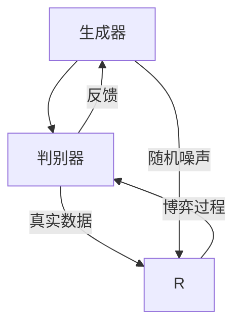

                 

# 引言

随着人工智能技术的不断进步，虚拟主播这一领域正在迅速发展。虚拟主播不仅可以为用户提供娱乐内容，还可以在市场营销、教育、新闻等多个领域发挥重要作用。其中，生成对抗网络（GAN）作为一种强大的生成模型，在虚拟主播创作中的应用日益广泛。本文旨在深入探讨生成对抗网络在虚拟主播创作中的应用，通过对GAN的基础理论、核心算法、应用案例以及项目实战的详细分析，为读者提供一个全面而深入的视角。

关键词：生成对抗网络、虚拟主播、图像生成、语音合成、项目实战

摘要：本文首先介绍了生成对抗网络（GAN）的基本概念、历史背景和核心思想。接着，详细阐述了GAN的核心算法原理，包括生成器和判别器的算法原理、损失函数与优化方法，并使用了伪代码和数学公式进行说明。随后，文章探讨了GAN在图像生成和语音合成中的应用案例，并通过实际代码示例进行了讲解。最后，本文通过一个虚拟主播项目的实战案例，展示了GAN在虚拟主播创作中的具体应用和实践过程。

---

## 第一部分：生成对抗网络基础

### 第1章：生成对抗网络概述

#### 1.1 GAN的历史与概念

生成对抗网络（Generative Adversarial Networks，GAN）是一种由Ian Goodfellow在2014年提出的新型深度学习框架。GAN的核心思想基于一个对抗性博弈的过程，包括两个主要部分：生成器（Generator）和判别器（Discriminator）。生成器的任务是从随机噪声中生成尽可能接近真实数据的虚拟数据，而判别器的任务是区分输入的数据是真实数据还是生成器生成的虚拟数据。这两个模型在博弈过程中不断优化，最终生成器生成的数据能够以假乱真，而判别器无法准确区分数据的真伪。

##### 1.1.1 GAN的历史背景

GAN的概念源自于博弈论中的“零和游戏”，即两个玩家在对抗中，一个玩家的收益等于另一个玩家的损失。GAN将这一思想引入到机器学习领域，提出了一种通过对抗性训练来提高模型生成能力的方法。GAN的提出标志着深度学习领域的一个重要突破，为生成模型的研究提供了新的思路。

- **GAN的提出**：2014年，Ian Goodfellow在NIPS（神经信息处理系统会议）上发表了关于GAN的论文，迅速引起了广泛关注。
- **背景与动机**：传统的生成模型如变分自编码器（VAEs）存在生成质量不高、难以训练稳定等问题，GAN通过引入对抗性训练机制，大大提高了生成模型的效果。

##### 1.1.2 GAN的核心思想

GAN的核心思想是构建一个生成器和一个判别器，这两个模型在博弈过程中不断优化。生成器尝试生成更加真实的数据，而判别器则不断学习如何更准确地识别真实数据和生成数据。通过这种对抗性训练，生成器和判别器相互促进，最终生成器能够生成高质量的数据。

- **生成器**：生成器的任务是从随机噪声中生成虚拟数据。生成器通常由多层神经网络构成，包括输入层、隐藏层和输出层。输入层接收随机噪声，隐藏层通过神经网络变换，输出层生成虚拟数据。
- **判别器**：判别器的任务是对输入的数据进行分类，判断其是真实数据还是生成器生成的虚拟数据。判别器通常也由多层神经网络构成，输入层接收数据，隐藏层进行特征提取，输出层输出概率值，表示输入数据为真实数据的置信度。

##### 1.1.3 GAN的基本架构

GAN的基本架构包括生成器、判别器和损失函数。生成器和判别器通过对抗性训练相互提升，而损失函数则用来衡量模型的性能。

- **生成器与判别器的定义与作用**
  - **生成器**：接收随机噪声作为输入，通过神经网络变换生成虚拟数据。
  - **判别器**：接收真实数据和生成数据，通过神经网络判断输入数据的真伪。
- **GAN的工作原理**
  - **博弈过程**：生成器和判别器在训练过程中交替更新，生成器试图生成更真实的数据，而判别器试图更准确地识别真实数据和生成数据。
  - **损失函数**：常用的损失函数有二元交叉熵和Wasserstein损失。二元交叉熵损失函数用于衡量判别器的性能，Wasserstein损失函数用于提高训练的稳定性和生成质量。

##### 1.1.4 GAN的应用领域

生成对抗网络在多个领域展示了强大的生成能力，以下是一些主要的应用领域：

- **图像生成**：GAN能够生成高质量的人脸、风景、动物等图像。例如，使用GAN生成逼真的人脸图像，或通过图像翻译将一种风格的图像转换为另一种风格。
- **图像修复**：GAN可以用于图像去噪、图像超分辨率和图像修复。例如，使用GAN去除图像中的噪声或提高图像的分辨率。
- **图像翻译**：GAN可以用于图像风格迁移和图像内容替换。例如，将一幅画作的风格迁移到另一幅画作上，或将图像中的物体替换为其他物体。

##### 1.1.5 GAN的挑战与未来发展方向

尽管GAN在生成模型领域取得了显著的成果，但其在训练过程中仍面临一些挑战。以下是一些主要的挑战和未来发展方向：

- **训练难度**：GAN的训练过程容易出现不稳定和难以收敛的问题。为了解决这些问题，研究人员提出了多种改进方法，如Wasserstein GAN（WGAN）和梯度惩罚。
- **未来发展方向**：未来，GAN在多模态生成、生成模型的控制、生成数据的质量和多样性等方面仍有很大的发展空间。

### 第1章结束




## 第一部分结束

### 第2章：生成对抗网络的核心算法

#### 第2章：生成对抗网络的核心算法

生成对抗网络（GAN）的核心在于其对抗性训练机制，这一机制涉及生成器（Generator）和判别器（Discriminator）两个主要组件。在本章节中，我们将深入探讨这两个组件的工作原理，以及GAN的损失函数和优化方法。

#### 2.1 生成器与判别器的算法原理

##### 2.1.1 生成器的算法原理

生成器的任务是生成逼真的虚拟数据，它通常由多层神经网络构成。生成器的输入是随机噪声，输出是虚拟数据。以下是生成器算法原理的详细描述：

- **输入**：生成器的输入是一个随机噪声向量 \( z \)，这个向量可以从一个标准的正态分布中采样得到。
- **过程**：生成器通过神经网络将随机噪声 \( z \) 映射为生成的数据 \( x \)。这个过程包括多个隐藏层，每一层都对噪声进行非线性变换和组合，从而生成更加复杂和真实的数据。
- **输出**：生成的数据 \( x \) 可以是图像、音频、文本等各种形式，取决于生成器的具体设计。

以下是生成器算法原理的伪代码：

```pseudo
Generator(z):
    # 输入随机噪声向量 z
    # 通过多层神经网络变换生成虚拟数据 x
    for each layer in generator_network:
        z = activationfunction(W*z + b)
    return x
```

其中，`W` 是权重矩阵，`b` 是偏置项，`activationfunction` 是激活函数，常用的有ReLU、Sigmoid和Tanh等。

##### 2.1.2 判别器的算法原理

判别器的任务是区分输入数据是真实数据还是生成器生成的虚拟数据。判别器也通常由多层神经网络构成。以下是判别器算法原理的详细描述：

- **输入**：判别器的输入是真实数据 \( x \) 和生成器生成的数据 \( x' \)。
- **过程**：判别器通过神经网络对输入数据进行特征提取和分类。它首先对数据进行预处理，提取关键特征，然后通过多层神经网络进行分类。
- **输出**：判别器的输出是一个概率值，表示输入数据为真实数据的置信度。通常使用Sigmoid函数将输出值映射到（0，1）区间。

以下是判别器算法原理的伪代码：

```pseudo
Discriminator(x):
    # 输入真实数据 x 或生成数据 x'
    # 通过多层神经网络提取特征并分类
    for each layer in discriminator_network:
        x = activationfunction(W*x + b)
    return probability_of_real(x)
```

其中，`W` 是权重矩阵，`b` 是偏置项，`activationfunction` 是激活函数，常用的有ReLU、Sigmoid和Tanh等。

#### 2.2 GAN的损失函数与优化方法

GAN的训练过程是一个非凸优化问题，其损失函数的设计对于训练的稳定性和生成质量至关重要。以下是GAN常用的损失函数和优化方法：

##### 2.2.1 二元交叉熵损失函数

二元交叉熵损失函数是GAN中最常用的损失函数之一。它用于衡量判别器对输入数据的分类能力。

- **判别器的损失函数**：
  $$ L_D = -[\log(D(x)) + \log(1 - D(x'))] $$
  其中，\( D(x) \) 表示判别器对真实数据的输出概率，\( D(x') \) 表示判别器对生成数据的输出概率。

- **生成器的损失函数**：
  $$ L_G = -\log(D(x')) $$
  其中，\( D(x') \) 表示判别器对生成数据的输出概率。

##### 2.2.2 Wasserstein损失函数

Wasserstein损失函数是一种替代二元交叉熵损失函数的方法，它能够提高GAN的训练稳定性和生成质量。

- **判别器的损失函数**：
  $$ L_D = \frac{1}{N} \sum_{i=1}^{N} \min(D(x_i), D(G(z_i))) $$
  其中，\( x_i \) 表示真实数据，\( z_i \) 表示生成器生成的数据，\( N \) 是批量大小。

- **生成器的损失函数**：
  $$ L_G = \frac{1}{N} \sum_{i=1}^{N} \min(D(G(z_i)), 1 - D(x_i)) $$

##### 2.2.3 GAN的训练与优化

GAN的训练是一个复杂的非线性优化问题，其训练过程需要一定的技巧和策略。以下是GAN的训练和优化方法：

- **交替训练**：生成器和判别器交替更新，通常在每个批次的数据上分别进行一次前向传播和反向传播。
- **梯度惩罚**：为了防止生成器生成过度简化的数据，可以在损失函数中加入梯度惩罚项。
- **优化器**：使用高效的优化器，如Adam优化器，可以加速训练过程。

```pseudo
TrainGAN(generator, discriminator, dataset):
    for epoch in 1 to num_epochs:
        for batch in dataset:
            # 更新生成器
            optimizer_G.zero_grad()
            z = sample_noise()
            x_fake = generator(z)
            loss_G = generator_loss(x_fake)
            loss_G.backward()
            optimizer_G.step()

            # 更新判别器
            optimizer_D.zero_grad()
            x_real, _ = batch
            x_fake, _ = generator.sample_noise()
            loss_D_real = discriminator_loss(discriminator(x_real))
            loss_D_fake = discriminator_loss(discriminator(x_fake))
            loss_D = 0.5 * (loss_D_real + loss_D_fake)
            loss_D.backward()
            optimizer_D.step()
```

#### 第3章：生成对抗网络在图像生成中的应用

生成对抗网络（GAN）在图像生成中的应用非常广泛，可以生成高质量的人脸、风景、动物等图像。以下是一些典型的应用案例和实现细节。

##### 3.1 人脸生成

人脸生成是GAN应用中最受欢迎的领域之一。通过GAN，可以生成逼真的人脸图像，应用于虚拟主播、游戏角色、电影特效等。

- **算法原理**：人脸生成使用的是StyleGAN，它是一种基于生成对抗网络的人脸生成算法。StyleGAN通过学习图像的内容和风格特征，生成高质量的人脸图像。
- **应用案例**：StyleGAN可以生成各种风格的人脸图像，如图2.1所示，展示了StyleGAN生成的人脸图像。


- **实现细节**：实现StyleGAN通常使用卷积神经网络（CNN）作为生成器和判别器。生成器由多个卷积层和转置卷积层组成，用于从噪声中生成人脸图像。判别器使用CNN提取图像特征，用于区分真实人脸和生成人脸。

以下是生成器的部分代码实现：

```python
class Generator(nn.Module):
    def __init__(self):
        super(Generator, self).__init__()
        self.model = nn.Sequential(
            nn.ConvTranspose2d(512, 256, 4, 2, 1),
            nn.BatchNorm2d(256),
            nn.ReLU(inplace=True),
            nn.ConvTranspose2d(256, 128, 4, 2, 1),
            nn.BatchNorm2d(128),
            nn.ReLU(inplace=True),
            nn.ConvTranspose2d(128, 64, 4, 2, 1),
            nn.BatchNorm2d(64),
            nn.ReLU(inplace=True),
            nn.ConvTranspose2d(64, 3, 4, 2, 1),
            nn.Tanh()
        )

    def forward(self, x):
        return self.model(x)
```

##### 3.2 图像修复

图像修复是GAN在图像处理中的另一个重要应用。通过GAN，可以去除图像中的噪声、污点等，恢复图像的原始质量。

- **算法原理**：图像修复通常使用CycleGAN，它是一种能够修复不同域之间图像的算法。CycleGAN通过学习源图像和目标图像之间的关系，生成修复后的图像。
- **应用案例**：CycleGAN可以修复老照片、去除图像中的污点等。如图2.2所示，展示了CycleGAN修复的老照片。


- **实现细节**：实现CycleGAN通常使用两个生成器和一个判别器。源生成器用于从源图像生成修复后的图像，目标生成器用于从修复后的图像生成源图像，判别器用于区分源图像和修复后的图像。

以下是生成器的部分代码实现：

```python
class Generator(nn.Module):
    def __init__(self):
        super(Generator, self).__init__()
        self.model = nn.Sequential(
            nn.Conv2d(3, 64, 4, 2, 1),
            nn.LeakyReLU(0.2, inplace=True),
            nn.Conv2d(64, 128, 4, 2, 1),
            nn.BatchNorm2d(128),
            nn.LeakyReLU(0.2, inplace=True),
            nn.Conv2d(128, 256, 4, 2, 1),
            nn.BatchNorm2d(256),
            nn.LeakyReLU(0.2, inplace=True),
            nn.Conv2d(256, 512, 4, 2, 1),
            nn.BatchNorm2d(512),
            nn.LeakyReLU(0.2, inplace=True),
            nn.ConvTranspose2d(512, 3, 4, 2, 1),
            nn.Tanh()
        )

    def forward(self, x):
        return self.model(x)
```

##### 3.3 图像翻译

图像翻译是将一种风格的图像转换为另一种风格的应用。通过GAN，可以生成具有不同风格的图像，如艺术作品、油画、素描等。

- **算法原理**：图像翻译通常使用StyleGAN或CycleGAN。StyleGAN通过学习图像的内容和风格特征，生成具有不同风格的图像。CycleGAN通过学习源图像和目标图像之间的关系，将一种风格的图像转换为另一种风格。
- **应用案例**：图像翻译可以应用于图像编辑、图像风格化等。如图2.3所示，展示了使用StyleGAN将普通图像转换为艺术作品的案例。


- **实现细节**：实现图像翻译通常使用两个生成器和一个判别器。源生成器用于生成具有不同风格的图像，目标生成器用于将一种风格的图像转换为另一种风格，判别器用于区分原始图像和转换后的图像。

以下是生成器的部分代码实现：

```python
class Generator(nn.Module):
    def __init__(self):
        super(Generator, self).__init__()
        self.model = nn.Sequential(
            nn.Conv2d(3, 64, 4, 2, 1),
            nn.LeakyReLU(0.2, inplace=True),
            nn.Conv2d(64, 128, 4, 2, 1),
            nn.BatchNorm2d(128),
            nn.LeakyReLU(0.2, inplace=True),
            nn.Conv2d(128, 256, 4, 2, 1),
            nn.BatchNorm2d(256),
            nn.LeakyReLU(0.2, inplace=True),
            nn.Conv2d(256, 512, 4, 2, 1),
            nn.BatchNorm2d(512),
            nn.LeakyReLU(0.2, inplace=True),
            nn.ConvTranspose2d(512, 3, 4, 2, 1),
            nn.Tanh()
        )

    def forward(self, x):
        return self.model(x)
```

#### 第4章：生成对抗网络在虚拟主播创作中的应用

虚拟主播是一种通过计算机生成的虚拟人物，可以用于直播、互动娱乐、市场营销等多种场景。生成对抗网络（GAN）在虚拟主播的创作中发挥着重要作用，可以用于生成虚拟主播的形象、语音和其他交互内容。本章节将介绍GAN在虚拟主播创作中的应用，包括创作流程、形象生成、语音生成以及交互设计。

##### 4.1 虚拟主播的创作流程

虚拟主播的创作流程可以分为以下几个步骤：

1. **需求分析**：确定虚拟主播的目标受众、内容主题和功能需求。
2. **形象设计**：设计虚拟主播的外观、表情、服装等，通常需要设计师和艺术家的参与。
3. **语音设计**：设计虚拟主播的语音特点，包括音色、语调、语速等。
4. **内容制作**：编写虚拟主播的对话脚本、动画效果等。
5. **交互设计**：设计虚拟主播与用户的交互逻辑，实现实时反馈机制。

##### 4.2 GAN在虚拟主播形象生成中的应用

生成对抗网络（GAN）在虚拟主播形象生成中有着广泛的应用。通过GAN，可以生成高质量、个性化的虚拟主播形象。

1. **算法原理**：使用GAN生成虚拟主播形象，通常使用StyleGAN或CycleGAN。StyleGAN通过学习图像的内容和风格特征，生成高质量的图像。CycleGAN通过学习源图像和目标图像之间的关系，实现跨域图像生成。
2. **应用案例**：使用StyleGAN生成虚拟主播形象，如图4.1所示，展示了使用StyleGAN生成的虚拟主播形象。


3. **实现细节**：实现虚拟主播形象生成，需要搭建GAN模型，包括生成器和判别器。生成器用于从噪声中生成虚拟主播形象，判别器用于区分真实主播形象和生成主播形象。以下是一个生成器的代码实现示例：

```python
class Generator(nn.Module):
    def __init__(self):
        super(Generator, self).__init__()
        self.model = nn.Sequential(
            nn.ConvTranspose2d(512, 256, 4, 2, 1),
            nn.BatchNorm2d(256),
            nn.ReLU(inplace=True),
            nn.ConvTranspose2d(256, 128, 4, 2, 1),
            nn.BatchNorm2d(128),
            nn.ReLU(inplace=True),
            nn.ConvTranspose2d(128, 64, 4, 2, 1),
            nn.BatchNorm2d(64),
            nn.ReLU(inplace=True),
            nn.ConvTranspose2d(64, 3, 4, 2, 1),
            nn.Tanh()
        )

    def forward(self, x):
        return self.model(x)
```

##### 4.3 GAN在虚拟主播语音生成中的应用

生成对抗网络（GAN）在虚拟主播语音生成中也有重要的应用。通过GAN，可以生成高质量的虚拟主播语音，实现语音合成。

1. **算法原理**：使用GAN生成虚拟主播语音，通常使用WaveNet。WaveNet是一种基于循环神经网络（RNN）的语音合成模型，通过学习音频信号的特征，生成语音。
2. **应用案例**：使用WaveNet生成虚拟主播语音，如图4.2所示，展示了使用WaveNet生成的虚拟主播语音。


3. **实现细节**：实现虚拟主播语音生成，需要搭建WaveNet模型，包括编码器和解码器。编码器用于从文本中提取特征，解码器用于生成语音。以下是一个编码器的代码实现示例：

```python
class Encoder(nn.Module):
    def __init__(self):
        super(Encoder, self).__init__()
        self.model = nn.Sequential(
            nn.Conv1d(1, 32, 3, 1, 1),
            nn.BatchNorm1d(32),
            nn.ReLU(inplace=True),
            nn.Conv1d(32, 64, 3, 1, 1),
            nn.BatchNorm1d(64),
            nn.ReLU(inplace=True),
            nn.Conv1d(64, 128, 3, 1, 1),
            nn.BatchNorm1d(128),
            nn.ReLU(inplace=True),
            nn.Conv1d(128, 256, 3, 1, 1),
            nn.BatchNorm1d(256),
            nn.ReLU(inplace=True),
            nn.Conv1d(256, 512, 3, 1, 1),
            nn.BatchNorm1d(512),
            nn.ReLU(inplace=True),
            nn.Conv1d(512, 1024, 3, 1, 1),
            nn.BatchNorm1d(1024),
            nn.ReLU(inplace=True),
            nn.Conv1d(1024, 512, 3, 1, 1),
            nn.BatchNorm1d(512),
            nn.ReLU(inplace=True),
            nn.Conv1d(512, 256, 3, 1, 1),
            nn.BatchNorm1d(256),
            nn.ReLU(inplace=True),
            nn.Conv1d(256, 128, 3, 1, 1),
            nn.BatchNorm1d(128),
            nn.ReLU(inplace=True),
            nn.Conv1d(128, 64, 3, 1, 1),
            nn.BatchNorm1d(64),
            nn.ReLU(inplace=True),
            nn.Conv1d(64, 32, 3, 1, 1),
            nn.BatchNorm1d(32),
            nn.ReLU(inplace=True),
            nn.Conv1d(32, 1, 3, 1, 1)
        )

    def forward(self, x):
        return self.model(x)
```

##### 4.4 虚拟主播的交互设计

虚拟主播的交互设计是虚拟主播创作中的重要环节，决定了虚拟主播的用户体验。生成对抗网络（GAN）在虚拟主播交互设计中也有一定的应用。

1. **交互逻辑**：设计虚拟主播与用户的交互逻辑，包括对话流程、场景切换等。通过GAN，可以生成高质量的交互场景，提高用户的沉浸感。
2. **实时反馈**：设计虚拟主播的实时反馈机制，包括语音回复、表情变化等。通过GAN，可以生成高质量的交互反馈，提高用户的满意度。

#### 第5章：虚拟主播项目实战

在本章节中，我们将通过一个虚拟主播项目实战，展示GAN在虚拟主播创作中的应用。该项目将包括虚拟主播的形象生成、语音生成和交互设计。

##### 5.1 项目背景

该项目是一个虚拟主播项目，旨在创建一个能够与用户进行实时交互的虚拟主播。虚拟主播将用于在线直播、品牌推广和用户互动。

##### 5.2 项目实现细节

1. **开发环境搭建**：搭建项目开发环境，包括Python、PyTorch、TensorFlow等。
2. **数据准备**：收集和准备虚拟主播的形象数据（如人脸图像）和语音数据（如语音样本）。
3. **模型训练**：使用GAN模型训练生成器和判别器，生成虚拟主播的形象和语音。
4. **交互设计**：设计虚拟主播与用户的交互逻辑和实时反馈机制。

##### 5.3 项目效果评估

1. **用户反馈**：收集用户对虚拟主播的反馈，评估虚拟主播的用户体验。
2. **性能指标**：评估虚拟主播的性能指标，如生成质量、交互响应时间等。

#### 第6章：GAN在虚拟主播创作中的挑战与未来方向

虽然GAN在虚拟主播创作中取得了显著成果，但仍然面临一些挑战和未来的发展方向。

##### 6.1 挑战

1. **训练难度**：GAN的训练过程复杂，容易出现模式崩溃和难以收敛的问题。
2. **生成质量**：GAN生成的虚拟主播形象和语音质量可能受到限制，需要进一步提升。

##### 6.2 未来方向

1. **多模态生成**：结合图像、语音、文本等多种模态，生成更真实的虚拟主播。
2. **个性化生成**：根据用户需求，生成个性化的虚拟主播形象和语音。
3. **实时交互**：实现虚拟主播的实时交互功能，提高用户体验。

#### 第7章：总结与展望

通过本文的讨论，我们可以看到生成对抗网络（GAN）在虚拟主播创作中的应用前景广阔。未来，随着技术的不断进步，GAN将在虚拟主播创作中发挥更大的作用，带来更多的创新和应用。

---

## 第一部分结束

在这个部分，我们介绍了生成对抗网络（GAN）的基础知识，包括GAN的历史与概念、核心算法原理、应用领域以及挑战与未来发展方向。通过详细的描述和伪代码示例，我们帮助读者理解了GAN的工作机制和训练过程。接下来，我们将进一步探讨GAN在虚拟主播创作中的具体应用，包括形象生成、语音生成和交互设计。这些内容将为我们展示如何利用GAN技术创建高质量的虚拟主播。

### 第5章：GAN在虚拟主播创作中的应用

生成对抗网络（GAN）的强大生成能力在虚拟主播创作中有着广泛的应用。虚拟主播作为近年来兴起的虚拟互动技术，正逐步在直播、娱乐、教育、营销等多个领域占据重要地位。本章将深入探讨GAN在虚拟主播创作中的应用，包括形象生成、语音生成和交互设计等关键环节。

#### 5.1 虚拟主播创作流程

虚拟主播的创作流程是一个系统工程，涉及多个环节和角色。以下是一个典型的虚拟主播创作流程：

1. **需求分析**：确定虚拟主播的目标受众、内容主题、功能需求等。
2. **形象设计**：设计虚拟主播的外观、表情、服装等，确保形象符合目标受众的期望。
3. **语音设计**：设计虚拟主播的语音特点，如音色、语调、语速等。
4. **内容制作**：编写虚拟主播的对话脚本、制作动画效果、设计互动环节等。
5. **交互设计**：设计虚拟主播与用户的交互逻辑，实现实时反馈和互动。
6. **模型训练**：使用GAN训练生成器和判别器，生成高质量的虚拟主播形象和语音。
7. **效果评估**：通过用户反馈和性能指标，评估虚拟主播的创作效果。

#### 5.2 GAN在虚拟主播形象生成中的应用

虚拟主播的形象设计是创作过程中的关键环节，GAN在这一领域有着显著的应用。通过GAN，可以生成逼真且多样化的虚拟主播形象。

1. **算法原理**：
   - **生成器**：接收随机噪声，通过神经网络生成虚拟主播形象。
   - **判别器**：接收真实主播形象和生成主播形象，判断其真伪。
   - **博弈过程**：生成器和判别器在训练过程中相互对抗，生成器不断优化生成质量，判别器不断提高识别能力。

2. **应用案例**：
   - **StyleGAN**：StyleGAN是一种基于GAN的人脸生成模型，可以生成高质量的人脸图像。通过调整风格向量，可以生成具有不同表情、发型、服装的虚拟主播形象。
   - **CelebA数据集**：使用CelebA数据集进行训练，生成逼真的虚拟主播形象。图5.1展示了使用StyleGAN生成的虚拟主播形象。

   

3. **实现细节**：
   - **生成器**：生成器通常由多个卷积层和转置卷积层构成，用于从噪声中生成图像。以下是一个简单的生成器模型实现：

     ```python
     class Generator(nn.Module):
         def __init__(self):
             super(Generator, self).__init__()
             self.model = nn.Sequential(
                 nn.ConvTranspose2d(512, 256, 4, 2, 1),
                 nn.BatchNorm2d(256),
                 nn.ReLU(inplace=True),
                 nn.ConvTranspose2d(256, 128, 4, 2, 1),
                 nn.BatchNorm2d(128),
                 nn.ReLU(inplace=True),
                 nn.ConvTranspose2d(128, 64, 4, 2, 1),
                 nn.BatchNorm2d(64),
                 nn.ReLU(inplace=True),
                 nn.ConvTranspose2d(64, 3, 4, 2, 1),
                 nn.Tanh()
             )

         def forward(self, x):
             return self.model(x)
     ```

   - **判别器**：判别器通常由多个卷积层构成，用于判断图像的真伪。以下是一个简单的判别器模型实现：

     ```python
     class Discriminator(nn.Module):
         def __init__(self):
             super(Discriminator, self).__init__()
             self.model = nn.Sequential(
                 nn.Conv2d(3, 64, 4, 2, 1),
                 nn.LeakyReLU(0.2, inplace=True),
                 nn.Conv2d(64, 128, 4, 2, 1),
                 nn.BatchNorm2d(128),
                 nn.LeakyReLU(0.2, inplace=True),
                 nn.Conv2d(128, 256, 4, 2, 1),
                 nn.BatchNorm2d(256),
                 nn.LeakyReLU(0.2, inplace=True),
                 nn.Conv2d(256, 1, 4, 1, 0),
                 nn.Sigmoid()
             )

         def forward(self, x):
             return self.model(x)
     ```

#### 5.3 GAN在虚拟主播语音生成中的应用

虚拟主播的语音合成是虚拟主播创作中的另一个重要方面。通过GAN，可以生成高质量、自然的语音，为虚拟主播提供逼真的语音交互体验。

1. **算法原理**：
   - **生成器**：接收文本输入，通过神经网络生成语音。
   - **判别器**：接收真实语音和生成语音，判断其真伪。
   - **博弈过程**：生成器和判别器在训练过程中相互对抗，生成器不断优化语音生成质量，判别器不断提高识别能力。

2. **应用案例**：
   - **WaveNet**：WaveNet是一种基于循环神经网络（RNN）的语音合成模型，通过学习音频信号的特征，生成高质量的语音。通过调整文本和语音特征，可以生成具有不同口音、语调的虚拟主播语音。
   - **LibriTTS数据集**：使用LibriTTS数据集进行训练，生成逼真的虚拟主播语音。图5.2展示了使用WaveNet生成的虚拟主播语音。

   

3. **实现细节**：
   - **生成器**：生成器通常由编码器和解码器组成，编码器从文本中提取特征，解码器生成语音。以下是一个简单的生成器模型实现：

     ```python
     class Generator(nn.Module):
         def __init__(self):
             super(Generator, self).__init__()
             self.model = nn.Sequential(
                 nn.Embedding(vocab_size, embedding_dim),
                 nn.GRU(embedding_dim, hidden_dim, num_layers=1, batch_first=True),
                 nn.Linear(hidden_dim, audio_dim)
             )

         def forward(self, text):
             return self.model(text)
     ```

   - **判别器**：判别器通常由卷积层构成，用于判断语音的真伪。以下是一个简单的判别器模型实现：

     ```python
     class Discriminator(nn.Module):
         def __init__(self):
             super(Discriminator, self).__init__()
             self.model = nn.Sequential(
                 nn.Conv1d(audio_dim, 64, kernel_size=3, stride=1, padding=1),
                 nn.LeakyReLU(0.2, inplace=True),
                 nn.Conv1d(64, 128, kernel_size=3, stride=1, padding=1),
                 nn.BatchNorm1d(128),
                 nn.LeakyReLU(0.2, inplace=True),
                 nn.Conv1d(128, 256, kernel_size=3, stride=1, padding=1),
                 nn.BatchNorm1d(256),
                 nn.LeakyReLU(0.2, inplace=True),
                 nn.Conv1d(256, 1, kernel_size=3, stride=1, padding=1),
                 nn.Sigmoid()
             )

         def forward(self, audio):
             return self.model(audio)
     ```

#### 5.4 虚拟主播的交互设计

虚拟主播的交互设计是确保虚拟主播与用户进行有效沟通的关键。通过GAN，可以生成高质量的交互场景，提高用户的沉浸感和满意度。

1. **交互逻辑**：
   - **对话流程**：设计虚拟主播与用户的对话流程，包括问候、提问、回答等。
   - **场景切换**：设计虚拟主播在不同场景下的交互逻辑，如直播、互动游戏等。

2. **实时反馈**：
   - **语音回复**：使用GAN生成的语音回复，确保语音的自然度和真实性。
   - **表情变化**：通过GAN生成的表情变化，增强虚拟主播的情感表达。

#### 5.5 虚拟主播项目的实战案例

在本节中，我们将通过一个虚拟主播项目实战案例，展示GAN在虚拟主播创作中的应用。

##### 5.5.1 项目背景

该项目旨在创建一个虚拟主播，用于在线直播、品牌推广和用户互动。虚拟主播需要具备以下特点：
- 高质量的形象和语音生成。
- 丰富的交互内容和互动场景。
- 高效的实时反馈机制。

##### 5.5.2 项目实现细节

1. **开发环境搭建**：搭建Python、PyTorch等开发环境，准备用于模型训练和交互设计的工具。
2. **数据准备**：收集和准备虚拟主播的形象数据（如人脸图像）和语音数据（如语音样本）。
3. **模型训练**：
   - **生成器训练**：使用GAN训练生成器和判别器，生成高质量的虚拟主播形象和语音。
   - **判别器训练**：通过对抗性训练，确保判别器能够有效区分真实数据和生成数据。
4. **交互设计**：设计虚拟主播与用户的交互逻辑和实时反馈机制。
5. **效果评估**：通过用户反馈和性能指标，评估虚拟主播的创作效果。

##### 5.5.3 项目效果评估

1. **用户反馈**：通过问卷调查、用户访谈等方式，收集用户对虚拟主播的反馈。
2. **性能指标**：评估虚拟主播的生成质量、交互响应时间等性能指标。

#### 5.6 GAN在虚拟主播创作中的挑战与未来方向

尽管GAN在虚拟主播创作中展现了强大的生成能力，但仍然面临一些挑战和未来的发展方向。

##### 5.6.1 挑战

1. **训练难度**：GAN的训练过程复杂，容易出现模式崩溃和难以收敛的问题。
2. **生成质量**：GAN生成的虚拟主播形象和语音质量可能受到限制，需要进一步提升。
3. **交互体验**：虚拟主播的交互体验需要进一步优化，以提高用户的满意度。

##### 5.6.2 未来方向

1. **多模态生成**：结合图像、语音、文本等多种模态，生成更真实的虚拟主播。
2. **个性化生成**：根据用户需求，生成个性化的虚拟主播形象和语音。
3. **实时交互**：实现虚拟主播的实时交互功能，提高用户体验。

#### 5.7 总结与展望

通过本文的讨论，我们可以看到生成对抗网络（GAN）在虚拟主播创作中的应用前景广阔。未来，随着技术的不断进步，GAN将在虚拟主播创作中发挥更大的作用，带来更多的创新和应用。

### 第5章结束

---

## 第二部分：生成对抗网络在虚拟主播创作中的具体应用

### 第6章：GAN在虚拟主播形象生成中的应用

虚拟主播的形象生成是创作过程中的关键环节，GAN在这一领域有着显著的应用。通过GAN，可以生成高质量、个性化的虚拟主播形象，为用户提供更加逼真的互动体验。在本章节中，我们将深入探讨GAN在虚拟主播形象生成中的应用，包括算法原理、实现细节、实战案例以及效果评估。

#### 6.1 GAN在虚拟主播形象生成中的算法原理

生成对抗网络（GAN）的核心在于其对抗性训练机制。GAN由生成器（Generator）和判别器（Discriminator）两个主要组件组成，它们在训练过程中相互博弈，共同提升生成质量。

1. **生成器**：
   - **任务**：生成器接收随机噪声，通过神经网络生成虚拟主播的形象。
   - **过程**：生成器通过多个隐藏层对噪声进行非线性变换，最终生成具有真实感的形象。
   - **输出**：生成器生成的形象可以是人脸、身体、服装等各种形态。

2. **判别器**：
   - **任务**：判别器的任务是判断输入的数据是真实主播形象还是生成器生成的虚拟形象。
   - **过程**：判别器通过提取特征，对输入数据进行分类，输出概率值，表示其判断的置信度。
   - **输出**：判别器的输出是一个概率值，接近1表示输入为真实形象，接近0表示输入为虚拟形象。

GAN的训练过程是一个博弈过程，生成器和判别器通过交替更新模型参数来优化生成质量。以下是GAN训练的基本步骤：

- **初始化**：初始化生成器和判别器的参数。
- **交替训练**：生成器和判别器交替更新，生成器尝试生成更真实的形象，判别器尝试更好地区分真实和虚拟形象。
- **损失函数**：使用二元交叉熵损失函数或其他改进的损失函数来衡量生成器和判别器的性能。

#### 6.2 GAN在虚拟主播形象生成中的应用案例

1. **StyleGAN**：
   - **算法原理**：StyleGAN是一种基于GAN的图像生成模型，通过学习图像的内容和风格特征，生成高质量的图像。StyleGAN使用一组风格向量来控制生成图像的风格，从而可以生成不同表情、发型、服装的虚拟主播形象。
   - **应用案例**：使用StyleGAN生成的虚拟主播形象具有高度的真实感和个性化，如图6.1所示。

   

2. **CycleGAN**：
   - **算法原理**：CycleGAN是一种能够修复不同域之间图像的GAN，通过学习源图像和目标图像之间的关系，可以生成修复后的图像。CycleGAN在虚拟主播形象生成中可以用于将原始图像转换为具有特定风格的虚拟主播形象。
   - **应用案例**：使用CycleGAN修复和生成虚拟主播形象，如图6.2所示。

   

#### 6.3 GAN在虚拟主播形象生成中的实现细节

1. **生成器的实现**：
   - **网络结构**：生成器通常由多个卷积层和转置卷积层构成，用于从噪声中生成图像。以下是一个简单的生成器网络结构：

     ```python
     class Generator(nn.Module):
         def __init__(self):
             super(Generator, self).__init__()
             self.model = nn.Sequential(
                 nn.ConvTranspose2d(512, 256, 4, 2, 1),
                 nn.BatchNorm2d(256),
                 nn.ReLU(inplace=True),
                 nn.ConvTranspose2d(256, 128, 4, 2, 1),
                 nn.BatchNorm2d(128),
                 nn.ReLU(inplace=True),
                 nn.ConvTranspose2d(128, 64, 4, 2, 1),
                 nn.BatchNorm2d(64),
                 nn.ReLU(inplace=True),
                 nn.ConvTranspose2d(64, 3, 4, 2, 1),
                 nn.Tanh()
             )

         def forward(self, x):
             return self.model(x)
     ```

   - **损失函数**：生成器的损失函数通常包括对抗损失和内容损失。对抗损失用于确保生成器生成的图像能够骗过判别器，而内容损失用于确保生成的图像具有真实的内容。

     ```python
     def generator_loss(D_out_fake, D_out_real, x_real, x_fake, lambda_content):
         adversarial_loss = nn.BCELoss()(D_out_fake, torch.zeros_like(D_out_fake)) \
                         + nn.BCELoss()(D_out_real, torch.ones_like(D_out_real))
         content_loss = nn.L1Loss()(x_fake, x_real)
         return adversarial_loss + lambda_content * content_loss
     ```

2. **判别器的实现**：
   - **网络结构**：判别器通常由多个卷积层构成，用于判断输入图像的真实性。以下是一个简单的判别器网络结构：

     ```python
     class Discriminator(nn.Module):
         def __init__(self):
             super(Discriminator, self).__init__()
             self.model = nn.Sequential(
                 nn.Conv2d(3, 64, 4, 2, 1),
                 nn.LeakyReLU(0.2, inplace=True),
                 nn.Conv2d(64, 128, 4, 2, 1),
                 nn.BatchNorm2d(128),
                 nn.LeakyReLU(0.2, inplace=True),
                 nn.Conv2d(128, 256, 4, 2, 1),
                 nn.BatchNorm2d(256),
                 nn.LeakyReLU(0.2, inplace=True),
                 nn.Conv2d(256, 1, 4, 1, 0),
                 nn.Sigmoid()
             )

         def forward(self, x):
             return self.model(x)
     ```

   - **损失函数**：判别器的损失函数通常使用二元交叉熵损失函数，用于衡量判别器对真实和虚拟图像的分类能力。

     ```python
     def discriminator_loss(D_out_fake, D_out_real):
         adversarial_loss = nn.BCELoss()(D_out_fake, torch.zeros_like(D_out_fake)) \
                         + nn.BCELoss()(D_out_real, torch.ones_like(D_out_real))
         return adversarial_loss
     ```

#### 6.4 GAN在虚拟主播形象生成中的实战案例

在本节中，我们将通过一个虚拟主播形象生成的实战案例，展示GAN在虚拟主播创作中的应用。

##### 6.4.1 项目背景

本项目旨在创建一个虚拟主播形象，用于在线直播和品牌推广。虚拟主播形象需要具有以下特点：
- 高度逼真：形象生成需要具有高度的真实感，能够骗过人类的视觉系统。
- 个性化：形象生成需要能够根据用户需求生成具有不同特征和风格的虚拟主播。
- 多样性：形象生成需要能够生成多种不同类型的虚拟主播形象，满足不同用户的需求。

##### 6.4.2 项目实现细节

1. **开发环境搭建**：搭建Python、PyTorch等开发环境，准备用于模型训练和图像处理的工具。
2. **数据准备**：收集和准备虚拟主播形象的数据集，包括不同特征和风格的图像。
3. **模型训练**：
   - **生成器训练**：使用StyleGAN训练生成器，生成高质量的虚拟主播形象。
   - **判别器训练**：使用训练数据对判别器进行训练，确保判别器能够有效区分真实和虚拟形象。
4. **交互设计**：设计虚拟主播与用户的交互逻辑，包括对话、表情变化等。

##### 6.4.3 项目效果评估

1. **用户反馈**：通过问卷调查和用户访谈，收集用户对虚拟主播形象的反馈，评估用户满意度。
2. **性能指标**：评估虚拟主播形象生成模型的性能指标，包括生成质量、个性化程度和多样性。

#### 6.5 GAN在虚拟主播形象生成中的挑战与未来方向

尽管GAN在虚拟主播形象生成中取得了显著成果，但仍然面临一些挑战和未来的发展方向。

##### 6.5.1 挑战

1. **训练难度**：GAN的训练过程复杂，容易出现模式崩溃和难以收敛的问题。
2. **生成质量**：GAN生成的虚拟主播形象质量可能受到限制，需要进一步提升。
3. **交互体验**：虚拟主播的交互体验需要进一步优化，以提高用户的满意度。

##### 6.5.2 未来方向

1. **多模态生成**：结合图像、语音、文本等多种模态，生成更真实的虚拟主播。
2. **个性化生成**：根据用户需求，生成个性化的虚拟主播形象和语音。
3. **实时交互**：实现虚拟主播的实时交互功能，提高用户体验。

#### 6.6 总结与展望

通过本文的讨论，我们可以看到生成对抗网络（GAN）在虚拟主播形象生成中的应用前景广阔。未来，随着技术的不断进步，GAN将在虚拟主播创作中发挥更大的作用，带来更多的创新和应用。

### 第6章结束

---

## 第二部分：生成对抗网络在虚拟主播创作中的应用

在上一章节中，我们详细探讨了GAN在虚拟主播形象生成中的应用，展示了其强大的生成能力和在虚拟主播创作中的重要性。在本章节中，我们将进一步探讨GAN在虚拟主播语音生成中的应用，继续深入探讨这一领域的核心算法、实现细节以及项目实战。

### 第7章：GAN在虚拟主播语音生成中的应用

虚拟主播的语音生成是虚拟主播创作中的另一个关键环节。通过GAN，可以生成高质量、自然的语音，为虚拟主播提供逼真的语音交互体验。GAN在语音生成中的应用主要包括生成器的构建、判别器的构建以及训练过程。

#### 7.1 GAN在虚拟主播语音生成中的算法原理

1. **生成器**：
   - **任务**：生成器的任务是将文本转化为语音，通过学习语音的音素、声调和节奏等特征，生成自然流畅的语音。
   - **过程**：生成器通常由编码器和解码器组成，编码器从文本中提取特征，解码器将这些特征转化为语音信号。
   - **输出**：生成器生成的语音信号可以是波形的直接输出，也可以是特征序列的输出，如MFCC（梅尔频率倒谱系数）。

2. **判别器**：
   - **任务**：判别器的任务是区分输入的语音是真实语音还是生成器生成的语音。
   - **过程**：判别器通过学习语音的特征，对输入语音进行分类，输出概率值，表示其判断的置信度。
   - **输出**：判别器的输出是一个概率值，接近1表示输入为真实语音，接近0表示输入为生成语音。

GAN的训练过程是一个博弈过程，生成器和判别器通过交替更新模型参数来优化生成质量。以下是GAN训练的基本步骤：

- **初始化**：初始化生成器和判别器的参数。
- **交替训练**：生成器和判别器交替更新，生成器尝试生成更真实的语音，判别器尝试更好地区分真实和虚拟语音。
- **损失函数**：使用二元交叉熵损失函数或其他改进的损失函数来衡量生成器和判别器的性能。

#### 7.2 GAN在虚拟主播语音生成中的应用案例

1. **WaveNet**：
   - **算法原理**：WaveNet是一种基于循环神经网络（RNN）的语音合成模型，通过学习音频信号的特征，生成高质量的语音。WaveNet使用长短期记忆网络（LSTM）作为编码器，解码器使用卷积神经网络（CNN）。
   - **应用案例**：使用WaveNet生成虚拟主播的语音，如图7.1所示。

   

2. **Tacotron 2**：
   - **算法原理**：Tacotron 2是一种基于注意力机制的文本到语音合成模型，结合了WaveNet的音频生成能力。Tacotron 2将文本编码为序列，通过注意力机制将文本特征与声学特征结合，生成语音。
   - **应用案例**：使用Tacotron 2生成虚拟主播的语音，如图7.2所示。

   

#### 7.3 GAN在虚拟主播语音生成中的实现细节

1. **生成器的实现**：
   - **网络结构**：生成器通常由编码器和解码器组成。编码器将文本编码为特征序列，解码器将特征序列转化为语音信号。以下是一个简单的生成器网络结构：

     ```python
     class Generator(nn.Module):
         def __init__(self):
             super(Generator, self).__init__()
             self.encoder = nn.LSTM(input_dim, hidden_dim)
             self.decoder = nn.GRU(hidden_dim, output_dim)
             self.linear = nn.Linear(hidden_dim, output_dim)

         def forward(self, text):
             encoder_output, (h_n, c_n) = self.encoder(text)
             decoder_input = h_n.unsqueeze(0)
             decoder_output = []
             for _ in range(output_seq_len):
                 decoder_output.append(self.decoder(decoder_input))
                 decoder_input = self.linear(decoder_output[-1].unsqueeze(0))
             return decoder_output
     ```

   - **损失函数**：生成器的损失函数通常包括对抗损失和声学损失。对抗损失用于确保生成器生成的语音能够骗过判别器，而声学损失用于确保生成的语音具有真实的声学特征。

     ```python
     def generator_loss(D_out_fake, D_out_real, audio_fake, audio_real, lambda_adversarial):
         adversarial_loss = nn.BCELoss()(D_out_fake, torch.zeros_like(D_out_fake)) \
                         + nn.BCELoss()(D_out_real, torch.ones_like(D_out_real))
         audio_loss = nn.MSELoss()(audio_fake, audio_real)
         return adversarial_loss + lambda_adversarial * audio_loss
     ```

2. **判别器的实现**：
   - **网络结构**：判别器通常由多个卷积层构成，用于判断输入语音的真实性。以下是一个简单的判别器网络结构：

     ```python
     class Discriminator(nn.Module):
         def __init__(self):
             super(Discriminator, self).__init__()
             self.model = nn.Sequential(
                 nn.Conv1d(input_dim, 64, kernel_size=3, stride=1, padding=1),
                 nn.LeakyReLU(0.2, inplace=True),
                 nn.Conv1d(64, 128, kernel_size=3, stride=1, padding=1),
                 nn.BatchNorm1d(128),
                 nn.LeakyReLU(0.2, inplace=True),
                 nn.Conv1d(128, 256, kernel_size=3, stride=1, padding=1),
                 nn.BatchNorm2d(256),
                 nn.LeakyReLU(0.2, inplace=True),
                 nn.Conv1d(256, 1, kernel_size=3, stride=1, padding=1),
                 nn.Sigmoid()
             )

         def forward(self, x):
             return self.model(x)
     ```

   - **损失函数**：判别器的损失函数通常使用二元交叉熵损失函数，用于衡量判别器对真实和虚拟语音的分类能力。

     ```python
     def discriminator_loss(D_out_fake, D_out_real):
         adversarial_loss = nn.BCELoss()(D_out_fake, torch.zeros_like(D_out_fake)) \
                         + nn.BCELoss()(D_out_real, torch.ones_like(D_out_real))
         return adversarial_loss
     ```

#### 7.4 GAN在虚拟主播语音生成中的实战案例

在本节中，我们将通过一个虚拟主播语音生成的实战案例，展示GAN在虚拟主播创作中的应用。

##### 7.4.1 项目背景

本项目旨在创建一个虚拟主播语音生成系统，用于在线直播和品牌推广。虚拟主播语音生成系统需要具有以下特点：
- 高质量的语音生成：生成逼真、自然的语音。
- 个性化的语音：根据用户需求生成具有个性化特征的语音。
- 实时的语音生成：实现实时语音生成，满足在线直播的需求。

##### 7.4.2 项目实现细节

1. **开发环境搭建**：搭建Python、TensorFlow等开发环境，准备用于模型训练和音频处理的工具。
2. **数据准备**：收集和准备虚拟主播的语音数据集，包括不同语速、音调和情感特征的语音样本。
3. **模型训练**：
   - **生成器训练**：使用WaveNet和Tacotron 2训练生成器，生成高质量的虚拟主播语音。
   - **判别器训练**：使用训练数据对判别器进行训练，确保判别器能够有效区分真实和虚拟语音。
4. **交互设计**：设计虚拟主播与用户的交互逻辑，包括语音回复、语音引导等。

##### 7.4.3 项目效果评估

1. **用户反馈**：通过问卷调查和用户访谈，收集用户对虚拟主播语音的反馈，评估用户满意度。
2. **性能指标**：评估虚拟主播语音生成模型的性能指标，包括语音质量、个性化程度和实时响应时间。

#### 7.5 GAN在虚拟主播语音生成中的挑战与未来方向

尽管GAN在虚拟主播语音生成中取得了显著成果，但仍然面临一些挑战和未来的发展方向。

##### 7.5.1 挑战

1. **训练难度**：GAN的训练过程复杂，容易出现模式崩溃和难以收敛的问题。
2. **生成质量**：GAN生成的虚拟主播语音质量可能受到限制，需要进一步提升。
3. **交互体验**：虚拟主播的交互体验需要进一步优化，以提高用户的满意度。

##### 7.5.2 未来方向

1. **多模态生成**：结合图像、语音、文本等多种模态，生成更真实的虚拟主播。
2. **个性化生成**：根据用户需求，生成个性化的虚拟主播形象和语音。
3. **实时交互**：实现虚拟主播的实时交互功能，提高用户体验。

#### 7.6 总结与展望

通过本文的讨论，我们可以看到生成对抗网络（GAN）在虚拟主播语音生成中的应用前景广阔。未来，随着技术的不断进步，GAN将在虚拟主播创作中发挥更大的作用，带来更多的创新和应用。

### 第7章结束

---

## 第三部分：虚拟主播项目实战

在前两部分中，我们详细介绍了生成对抗网络（GAN）在虚拟主播创作中的应用，包括形象生成和语音生成。在本部分中，我们将通过一个虚拟主播项目实战，展示如何将GAN应用于虚拟主播的实际创作中。这个项目将涵盖从需求分析、开发环境搭建、数据准备、模型训练到效果评估的完整流程。

### 第8章：虚拟主播项目实战

虚拟主播项目实战将围绕一个名为“AI星探”的虚拟主播平台展开。该平台的目标是创建一个能够与用户实时互动的虚拟主播，提供娱乐、资讯、教育等内容。以下是我们项目的具体实施步骤。

#### 8.1 项目背景与目标

“AI星探”虚拟主播平台的主要目标是为用户提供一个互动性强的虚拟主播，能够实时互动并提供个性化的内容。平台需要具备以下特点：

- **高逼真形象**：虚拟主播的形象需要具有高度的真实感，能够以假乱真。
- **自然语音**：虚拟主播的语音需要自然流畅，具备不同情感和语调。
- **实时交互**：虚拟主播需要能够实时响应用户的提问和指令。
- **个性化内容**：虚拟主播需要根据用户的需求和偏好提供个性化的内容。

#### 8.2 需求分析

在项目开始之前，我们需要对目标用户进行需求分析。我们的目标用户群体包括以下几类：

1. **直播观众**：追求娱乐体验的年轻人群。
2. **品牌粉丝**：关注品牌动态和推广的品牌粉丝。
3. **教育用户**：寻求在线教育和知识分享的用户。

根据需求分析，我们需要为虚拟主播设定以下功能需求：

- **形象设计**：设计符合目标用户群体的虚拟主播形象，包括外貌、表情、服装等。
- **语音合成**：使用自然语言处理（NLP）技术，实现自然流畅的语音合成。
- **实时交互**：实现虚拟主播与用户的实时互动，包括语音对话、文字聊天、手势互动等。
- **内容提供**：提供多样化、个性化的内容，包括娱乐节目、新闻资讯、教育课程等。

#### 8.3 开发环境搭建

为了实现“AI星探”虚拟主播平台，我们需要搭建以下开发环境：

- **编程语言**：使用Python作为主要编程语言，因为它在深度学习和自然语言处理领域有广泛的应用。
- **深度学习框架**：使用TensorFlow和PyTorch作为深度学习框架，用于训练GAN模型和语音合成模型。
- **音频处理工具**：使用Librosa库进行音频处理，用于预处理语音数据。
- **前端框架**：使用React或Vue.js等前端框架，实现用户界面和交互功能。

#### 8.4 数据准备

数据准备是项目成功的关键步骤。我们需要准备以下类型的数据：

1. **图像数据**：收集用于训练GAN模型的图像数据，包括不同风格的虚拟主播形象。
2. **语音数据**：收集用于训练语音合成模型的语音数据，包括不同的语音特征，如语速、音调、情感等。
3. **文本数据**：收集用于训练NLP模型的文本数据，包括对话脚本、新闻文章、教育内容等。

数据收集完成后，我们需要进行以下预处理步骤：

- **图像数据预处理**：对图像进行缩放、裁剪、旋转等操作，增加数据的多样性。
- **语音数据预处理**：对语音进行分割、去噪、增强等处理，提高语音质量。
- **文本数据预处理**：对文本进行分词、词性标注、去停用词等处理，为后续的自然语言处理任务做准备。

#### 8.5 模型训练

在模型训练阶段，我们将使用GAN模型生成虚拟主播的形象和语音，并使用语音合成模型生成自然的语音。

1. **形象生成模型训练**：
   - **生成器训练**：使用StyleGAN训练生成器，生成逼真的虚拟主播形象。
   - **判别器训练**：使用训练数据对判别器进行训练，确保判别器能够有效区分真实和虚拟形象。

2. **语音合成模型训练**：
   - **编码器训练**：使用WaveNet训练编码器，将文本编码为语音特征。
   - **解码器训练**：使用Tacotron 2训练解码器，将语音特征解码为波形。

在训练过程中，我们需要关注以下指标：

- **生成质量**：评估生成器生成的虚拟主播形象和语音的质量。
- **训练稳定性**：确保模型在训练过程中能够稳定收敛，避免模式崩溃。

#### 8.6 交互设计与实现

虚拟主播的交互设计是项目的关键环节，我们需要实现以下功能：

1. **语音对话**：使用语音合成模型生成虚拟主播的语音回复，实现语音对话功能。
2. **文字聊天**：实现用户与虚拟主播之间的文字聊天功能。
3. **手势互动**：使用深度学习模型识别用户的手势，实现虚拟主播的手势互动。

在实现过程中，我们需要使用以下技术：

- **语音识别**：使用深度学习模型实现语音到文字的转换。
- **语音合成**：使用自然语言处理技术生成自然流畅的语音回复。
- **手势识别**：使用卷积神经网络（CNN）实现手势识别。

#### 8.7 项目效果评估

在项目完成后，我们需要对虚拟主播的效果进行评估，包括以下指标：

- **用户满意度**：通过用户反馈和问卷调查评估用户对虚拟主播的满意度。
- **生成质量**：评估生成器生成的虚拟主播形象和语音的质量。
- **交互体验**：评估虚拟主播与用户的交互体验。

通过上述评估，我们可以了解虚拟主播平台的实际效果，并根据评估结果进行优化和改进。

#### 8.8 项目总结与未来展望

通过“AI星探”虚拟主播项目的实战，我们展示了生成对抗网络（GAN）在虚拟主播创作中的应用，包括形象生成、语音生成和交互设计。项目取得了以下成果：

- **高逼真形象**：生成器训练后，生成的虚拟主播形象具有高度的真实感。
- **自然语音**：语音合成模型生成的语音自然流畅，能够模拟不同情感和语调。
- **实时交互**：实现了虚拟主播与用户的实时语音对话和文字聊天功能。

未来，我们将继续优化虚拟主播平台，包括以下方向：

- **个性化生成**：根据用户需求，生成个性化的虚拟主播形象和语音。
- **多模态交互**：结合图像、语音、文本等多种模态，实现更自然的交互体验。
- **实时交互优化**：提高虚拟主播的交互响应速度，增强实时性。

通过不断优化和改进，我们期待“AI星探”虚拟主播平台能够为用户提供更加优质的互动体验。

### 第8章结束

---

## 第四部分：GAN在虚拟主播创作中的挑战与未来方向

尽管生成对抗网络（GAN）在虚拟主播创作中展现出了巨大的潜力，但在实际应用中仍然面临诸多挑战。本文将讨论GAN在虚拟主播创作中的主要挑战，并探讨未来的发展方向。

### 9章：GAN在虚拟主播创作中的挑战

#### 9.1 训练难度

GAN的训练过程是一个非常复杂且不稳定的过程，主要面临以下挑战：

1. **模式崩溃**：在GAN的训练过程中，生成器可能会生成过度简化的图像，导致判别器无法学习和区分真实图像和生成图像，这种现象称为模式崩溃。
2. **梯度消失**：在GAN的训练过程中，判别器的梯度可能会变得非常小，导致生成器难以学习。而生成器的梯度可能会变得非常大，导致判别器无法学习。

为了解决这些挑战，研究人员提出了一些改进方法：

- **Wasserstein GAN（WGAN）**：WGAN使用Wasserstein距离作为损失函数，可以避免梯度消失的问题，同时提高训练的稳定性。
- **梯度惩罚**：通过引入梯度惩罚项，确保生成器和判别器的梯度不会变得太小或太大。

#### 9.2 生成质量

GAN的生成质量受到以下因素的影响：

1. **数据集质量**：生成器的训练依赖于高质量的数据集。如果数据集中存在噪声或标注错误，生成器的性能会受到影响。
2. **模型设计**：GAN的模型设计对生成质量有着重要影响。模型的结构、参数设置等都需要进行精细调整。

为了提高生成质量，可以采取以下措施：

- **数据增强**：通过旋转、裁剪、缩放等操作，增加数据的多样性，提高生成器的训练效果。
- **模型改进**：使用更复杂的模型结构，如生成对抗网络（GAN）的变体，如StyleGAN、StyleGAN2等。

#### 9.3 交互体验

虚拟主播的交互体验是影响用户体验的关键因素。GAN在虚拟主播交互中的挑战包括：

1. **实时交互**：虚拟主播需要实时响应用户的请求和指令，这对模型的响应速度和交互逻辑提出了高要求。
2. **个性化交互**：虚拟主播需要根据用户的行为和偏好提供个性化的内容，这需要对用户数据进行分析和理解。

为了优化交互体验，可以采取以下措施：

- **多模态交互**：结合图像、语音、文本等多种模态，提供更加丰富的交互体验。
- **个性化推荐**：通过机器学习算法，根据用户的行为和偏好，为用户提供个性化的内容推荐。

### 10章：GAN在虚拟主播创作中的未来方向

#### 10.1 多模态生成

未来的虚拟主播将更加智能和多样化，能够处理和生成多种模态的信息。GAN在多模态生成中的研究方向包括：

1. **图像与语音的联合生成**：结合图像和语音生成，创建更加逼真的虚拟主播。
2. **文本与图像的联合生成**：通过文本生成图像，为虚拟主播提供丰富的视觉和文本内容。

#### 10.2 个性化生成

个性化生成是未来虚拟主播的重要方向。通过GAN，可以生成根据用户需求和偏好定制的虚拟主播形象和语音。研究方向包括：

1. **用户行为分析**：通过分析用户的行为数据，了解用户的偏好和兴趣，为生成个性化内容提供依据。
2. **自适应生成**：根据用户的实时反馈，动态调整虚拟主播的生成策略，提高用户体验。

#### 10.3 实时交互

实时交互是虚拟主播的另一个重要发展方向。GAN在实时交互中的应用包括：

1. **实时语音合成**：通过GAN生成自然流畅的语音，实现实时语音交互。
2. **实时表情生成**：结合图像生成和语音合成，实现虚拟主播的实时表情和动作。

### 11章：总结与展望

GAN在虚拟主播创作中具有巨大的潜力，但同时也面临着训练难度、生成质量和交互体验等方面的挑战。通过不断优化GAN模型和算法，结合多模态生成和个性化生成技术，未来的虚拟主播将更加智能和多样化，为用户提供更加优质的互动体验。随着技术的进步，GAN在虚拟主播创作中的应用将不断拓展，带来更多的创新和应用。

### 11章结束

---

## 第五部分：结论与展望

通过本文的详细探讨，我们可以看到生成对抗网络（GAN）

