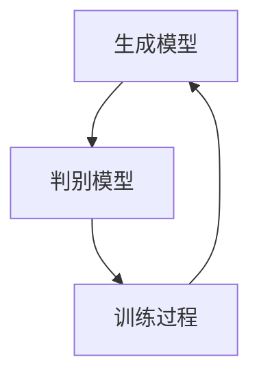
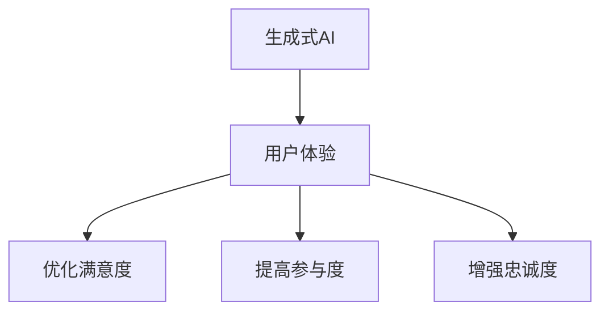

                 

# 生成式AI：金矿还是泡沫？第四部分：“让人尖叫”的用户体验

## 关键词
生成式AI、用户体验、大模型、图像生成、文本生成

## 摘要
本文探讨了生成式人工智能（AI）在提升用户体验方面所蕴含的巨大潜力与潜在风险。通过分析生成式AI的核心概念、技术架构、核心算法原理和数学模型，结合项目实战与代码解读，本文深入探讨了生成式AI在图像和文本生成中的应用，并提出了在实际开发中如何平衡模型性能与用户体验的方法。

## 第一部分：核心概念与联系

### 1.1 生成式AI概述

#### 1.1.1 生成式AI的定义与类型

生成式AI是一种利用概率模型和数据生成新数据的机器学习技术。根据生成模型的不同，生成式AI可以分为生成对抗网络（GAN）、变分自编码器（VAE）等类型。

- **生成对抗网络（GAN）**：由生成器和判别器两个网络组成，生成器生成数据，判别器判断生成数据与真实数据。
- **变分自编码器（VAE）**：通过编码器和解码器来学习数据分布，并生成新的数据。

#### 1.1.2 生成式AI的应用领域

生成式AI在图像、文本、音频等多种数据类型上都有广泛的应用。例如，图像生成、图像到图像的转换、文本生成、音乐生成等。

#### 1.1.3 生成式AI的核心概念

- **概率分布**：生成式AI的核心在于对数据的概率分布进行建模。
- **生成模型与判别模型**：生成模型负责生成数据，判别模型负责判断生成数据的质量。

#### 1.1.4 生成式AI的技术架构

生成式AI的技术架构主要包括生成模型、判别模型和训练过程。生成模型和判别模型通过对抗训练相互提升，以达到生成高质量数据的目的。

**Mermaid流程图**：



### 1.2 AI大模型与用户体验

#### 1.2.1 AI大模型的概念

AI大模型是指参数量巨大、能够处理复杂数据的神经网络模型。这些模型通常通过大规模数据训练得到，如BERT、GPT等。

#### 1.2.2 AI大模型在用户体验中的应用

AI大模型在生成式AI中发挥着关键作用，它们可以用于生成逼真的图像、文本、音频等，从而极大地提升用户体验。

#### 1.2.3 AI大模型对用户体验的影响

- **提高个性化体验**：通过学习用户的历史行为和偏好，AI大模型可以提供高度个性化的内容。
- **提升交互效率**：AI大模型可以理解用户的意图并迅速响应，减少用户的等待时间。
- **增强娱乐性**：通过生成新颖的内容，AI大模型可以为用户提供丰富的娱乐体验。

### 1.3 生成式AI与用户体验的关系

#### 1.3.1 生成式AI对用户体验的优化

生成式AI通过生成高质量的内容，可以有效提升用户的满意度、参与度和忠诚度。

#### 1.3.2 用户体验对生成式AI的反馈

用户体验的反馈可以指导生成式AI模型的改进，使其更好地满足用户需求。

#### 1.3.3 生成式AI与用户体验的平衡

在设计和实现生成式AI时，需要平衡模型性能与用户体验，确保用户能够享受到高质量的交互体验。

**Mermaid流程图**：



## 第二部分：核心算法原理讲解

### 2.1 生成对抗网络（GAN）

#### 2.1.1 GAN的基本原理

生成对抗网络（GAN）由生成器和判别器两个网络组成。生成器的目标是生成尽可能真实的数据，判别器的目标是区分生成数据与真实数据。

#### 2.1.2 GAN的训练过程

GAN的训练过程包括两个阶段：生成器阶段和判别器阶段。在生成器阶段，生成器生成数据，判别器对其进行评估。在判别器阶段，判别器评估生成数据和真实数据，从而更新生成器的参数。

#### 2.1.3 代理梯度方法

由于GAN的损失函数是非凸的，GAN的训练过程可能会陷入局部最小值。为了解决这一问题，可以使用代理梯度方法来稳定训练过程。

**伪代码**：

```python
# 生成器
def G(z):
    # 输入噪声z，输出伪造数据x
    # ...

# 判别器
def D(x, x_hat):
    # 输入真实数据x和伪造数据x_hat，输出概率值
    # ...

optimizer_G = optim.Adam(learning_rate=0.0002, beta_1=0.5)
optimizer_D = optim.Adam(learning_rate=0.0002, beta_1=0.5)

for epoch in range(num_epochs):
    for images, _ in train_loader:
        # 生成器阶段
        z = tf.random.normal([batch_size, z_dim])
        generated_images = G(z)

        # 判别器阶段
        with tf.GradientTape(persistent=True) as tape:
            real_output = D(images, generated_images)

        # 计算判别器的损失
        d_loss = -tf.reduce_mean(tf.concat([D(images), D(generated_images)], axis=1))

        # 更新生成器和判别器的参数
        grads_D = tape.gradient(d_loss, D.trainable_variables)
        optimizer_D.apply_gradients(zip(grads_D, D.trainable_variables))

        # 生成器阶段
        with tf.GradientTape() as tape:
            fake_output = D(generated_images)

        # 计算生成器的损失
        g_loss = -tf.reduce_mean(fake_output)

        # 更新生成器的参数
        grads_G = tape.gradient(g_loss, G.trainable_variables)
        optimizer_G.apply_gradients(zip(grads_G, G.trainable_variables))
```

### 2.2 变分自编码器（VAE）

#### 2.2.1 VAE的基本原理

变分自编码器（VAE）是一种基于概率模型的生成模型。它通过编码器和解码器来学习数据分布，并生成新的数据。

#### 2.2.2 VAE的训练过程

VAE的训练过程包括两个步骤：编码器训练和解码器训练。在编码器训练过程中，编码器学习将输入数据映射到潜在空间。在解码器训练过程中，解码器学习将潜在空间中的数据解码回输入空间。

#### 2.2.3 重建损失函数

VAE的损失函数由数据重建损失和KL散度损失组成。数据重建损失度量输入数据和重建数据之间的差异，KL散度损失度量编码器学到的数据分布和先验分布之间的差异。

**伪代码**：

```python
# 编码器
def encode(x):
    # 输入数据x，输出编码z
    # ...

# 解码器
def decode(z):
    # 输入编码z，输出重建数据x_hat
    # ...

optimizer_E = optim.Adam(learning_rate=0.001, beta_1=0.9)
optimizer_D = optim.Adam(learning_rate=0.001, beta_1=0.9)

for epoch in range(num_epochs):
    for x in train_loader:
        # 编码器阶段
        z = encode(x)

        # 解码器阶段
        x_hat = decode(z)

        # 计算编码器的损失
        e_loss = -tf.reduce_mean(tf.keras.losses.categorical_crossentropy(x, x_hat))

        # 计算解码器的损失
        d_loss = -tf.reduce_mean(tf.keras.losses.categorical_crossentropy(x, x_hat))

        # 更新编码器和解码器的参数
        grads_E = tape.gradient(e_loss, encoder.trainable_variables)
        optimizer_E.apply_gradients(zip(grads_E, encoder.trainable_variables))

        grads_D = tape.gradient(d_loss, decoder.trainable_variables)
        optimizer_D.apply_gradients(zip(grads_D, decoder.trainable_variables))
```

### 2.3 生成式AI中的概率分布模型

#### 2.3.1 多变量正态分布

生成式AI中的概率分布模型常采用多变量正态分布。

多变量正态分布的概率密度函数为：

$$
f(x) = \frac{1}{(2\pi)^{d/2} |\Sigma|^{1/2}} \exp\left(-\frac{1}{2}(x-\mu)^T \Sigma^{-1} (x-\mu)\right)
$$

其中，\( \mu \) 是均值向量，\( \Sigma \) 是协方差矩阵，\( d \) 是数据维度。

#### 2.3.2 条件概率分布

生成式AI中的条件概率分布用于描述给定条件下的数据分布。

条件概率分布的概率密度函数为：

$$
f(x | y) = \frac{f(x, y)}{f(y)}
$$

其中，\( f(x, y) \) 是联合概率分布，\( f(y) \) 是条件概率分布。

## 第三部分：项目实战

### 3.1 生成式AI在图像生成中的应用

#### 3.1.1 图像生成项目概述

本节将介绍一个基于生成对抗网络（GAN）的图像生成项目。该项目旨在使用GAN生成逼真的图像。

#### 3.1.2 项目环境搭建

在开始项目之前，需要搭建一个适合进行图像生成的开发环境。环境搭建步骤包括安装Python、TensorFlow等工具。

#### 3.1.3 生成器与判别器的实现

生成器和判别器是GAN的核心组成部分。生成器的目的是生成逼真的图像，判别器的目的是判断图像的真实性。

**生成器代码**：

```python
import tensorflow as tf
from tensorflow.keras.layers import Dense, Conv2D, Flatten

def generator(z):
    # 输入噪声z，输出伪造图像x
    z = Flatten()(z)
    x = Dense(128, activation='relu')(z)
    x = Dense(784, activation='tanh')(x)
    x = Reshape(target_shape=(28, 28, 1))(x)
    return x
```

**判别器代码**：

```python
import tensorflow as tf
from tensorflow.keras.layers import Conv2D, Flatten

def discriminator(x):
    # 输入真实图像x，输出概率值
    x = Conv2D(filters=64, kernel_size=3, activation='leaky_relu', strides=2, padding='same')(x)
    x = Conv2D(filters=128, kernel_size=3, activation='leaky_relu', strides=2, padding='same')(x)
    x = Conv2D(filters=256, kernel_size=3, activation='leaky_relu', strides=2, padding='same')(x)
    x = Flatten()(x)
    x = Dense(1, activation='sigmoid')(x)
    return x
```

#### 3.1.4 训练过程

GAN的训练过程包括两个阶段：生成器阶段和判别器阶段。在生成器阶段，生成器生成图像，判别器对其进行评估。在判别器阶段，判别器评估生成图像和真实图像，从而更新生成器的参数。

**训练过程代码**：

```python
optimizer_G = tf.keras.optimizers.Adam(learning_rate=0.0002, beta_1=0.5)
optimizer_D = tf.keras.optimizers.Adam(learning_rate=0.0002, beta_1=0.5)

for epoch in range(num_epochs):
    for images, _ in train_loader:
        # 生成器阶段
        z = tf.random.normal([batch_size, z_dim])
        generated_images = generator(z)

        # 判别器阶段
        with tf.GradientTape() as tape:
            real_output = discriminator(images)
            fake_output = discriminator(generated_images)

        # 计算判别器的损失
        d_loss = -tf.reduce_mean(tf.concat([real_output, fake_output], axis=1))

        # 更新生成器和判别器的参数
        grads_D = tape.gradient(d_loss, discriminator.trainable_variables)
        optimizer_D.apply_gradients(zip(grads_D, discriminator.trainable_variables))

        # 生成器阶段
        with tf.GradientTape() as tape:
            fake_output = discriminator(generated_images)

        # 计算生成器的损失
        g_loss = -tf.reduce_mean(fake_output)

        # 更新生成器的参数
        grads_G = tape.gradient(g_loss, generator.trainable_variables)
        optimizer_G.apply_gradients(zip(grads_G, generator.trainable_variables))

        print(f"Epoch {epoch+1}/{num_epochs}, D_loss: {d_loss.numpy()}, G_loss: {g_loss.numpy()}")
```

#### 3.1.5 结果分析

通过训练，生成器将学会生成逼真的图像，判别器将学会区分真实图像和伪造图像。训练完成后，可以使用生成器生成新的图像。

### 3.2 生成式AI在文本生成中的应用

#### 3.2.1 文本生成项目概述

本节将介绍一个基于变分自编码器（VAE）的文本生成项目。该项目旨在使用VAE生成具有自然语言特点的文本。

#### 3.2.2 项目环境搭建

在开始项目之前，需要搭建一个适合进行文本生成的开发环境。环境搭建步骤包括安装Python、TensorFlow等工具。

#### 3.2.3 编码器和解码器的实现

编码器和解码器是VAE的核心组成部分。编码器将输入文本映射到潜在空间，解码器将潜在空间中的数据解码回输入文本空间。

**编码器代码**：

```python
import tensorflow as tf
from tensorflow.keras.layers import LSTM, Dense, Embedding, Flatten

def encode(x):
    # 输入文本x，输出编码z
    x = Embedding(input_dim=vocab_size, output_dim=embedding_size)(x)
    x = LSTM(units=64, return_sequences=True)(x)
    z = Flatten()(x)
    return z
```

**解码器代码**：

```python
import tensorflow as tf
from tensorflow.keras.layers import LSTM, Dense, Embedding, Reshape

def decode(z):
    # 输入编码z，输出重建文本x_hat
    z = Reshape(target_shape=(-1, 1))(z)
    x_hat = LSTM(units=64, return_sequences=True)(z)
    x_hat = Dense(units=vocab_size, activation='softmax')(x_hat)
    return x_hat
```

#### 3.2.4 训练过程

VAE的训练过程包括两个步骤：编码器训练和解码器训练。在编码器训练过程中，编码器学习将输入文本映射到潜在空间。在解码器训练过程中，解码器学习将潜在空间中的数据解码回输入文本空间。

**训练过程代码**：

```python
optimizer_E = tf.keras.optimizers.Adam(learning_rate=0.001, beta_1=0.9)
optimizer_D = tf.keras.optimizers.Adam(learning_rate=0.001, beta_1=0.9)

for epoch in range(num_epochs):
    for x in train_loader:
        # 编码器阶段
        z = encode(x)

        # 解码器阶段
        x_hat = decode(z)

        # 计算编码器的损失
        e_loss = -tf.reduce_mean(tf.keras.losses.categorical_crossentropy(x, x_hat))

        # 计算解码器的损失
        d_loss = -tf.reduce_mean(tf.keras.losses.categorical_crossentropy(x, x_hat))

        # 更新编码器和解码器的参数
        grads_E = tape.gradient(e_loss, encoder.trainable_variables)
        optimizer_E.apply_gradients(zip(grads_E, encoder.trainable_variables))

        grads_D = tape.gradient(d_loss, decoder.trainable_variables)
        optimizer_D.apply_gradients(zip(grads_D, decoder.trainable_variables))

        print(f"Epoch {epoch+1}/{num_epochs}, E_loss: {e_loss.numpy()}, D_loss: {d_loss.numpy()}")
```

#### 3.2.5 结果分析

通过训练，编码器将学会将输入文本映射到潜在空间，解码器将学会将潜在空间中的数据解码回输入文本空间。训练完成后，可以使用解码器生成新的文本。

## 第四部分：代码解读与分析

### 4.1 生成对抗网络（GAN）代码解读

#### 4.1.1 生成器的代码解读

生成器的目标是生成逼真的图像。在生成器的代码中，使用了一系列卷积层和反卷积层来生成图像。以下是对生成器代码的详细解读：

```python
import tensorflow as tf
from tensorflow.keras.layers import Dense, Conv2D, Flatten, Reshape

def generator(z):
    # 输入噪声z，输出伪造图像x
    z = Flatten()(z)
    x = Dense(units=128, activation='relu')(z)
    x = Dense(units=784, activation='tanh')(x)
    x = Reshape(target_shape=(28, 28, 1))(x)
    return x
```

在这个代码中，首先将输入的噪声向量展平为二维张量。然后通过两个全连接层来生成图像的特征。最后，使用一个展平层将特征展平为三维张量，以匹配图像的形状。

#### 4.1.2 判别器的代码解读

判别器的目标是判断图像的真实性。在判别器的代码中，使用了一系列卷积层来提取图像的特征。以下是对判别器代码的详细解读：

```python
import tensorflow as tf
from tensorflow.keras.layers import Conv2D, Flatten

def discriminator(x):
    # 输入真实图像x，输出概率值
    x = Conv2D(filters=64, kernel_size=3, activation='leaky_relu', strides=2, padding='same')(x)
    x = Conv2D(filters=128, kernel_size=3, activation='leaky_relu', strides=2, padding='same')(x)
    x = Conv2D(filters=256, kernel_size=3, activation='leaky_relu', strides=2, padding='same')(x)
    x = Flatten()(x)
    x = Dense(units=1, activation='sigmoid')(x)
    return x
```

在这个代码中，通过多个卷积层来提取图像的特征。每个卷积层之后都使用了漏斗激活函数（leaky_relu）来避免梯度消失问题。最后，通过一个全连接层输出概率值，表示图像的真实性。

#### 4.1.3 训练过程代码解读

训练过程是GAN训练的核心。在训练过程中，交替训练生成器和判别器，以使生成器生成的图像越来越真实，判别器越来越难以区分真实图像和伪造图像。以下是对训练过程代码的详细解读：

```python
optimizer_G = tf.keras.optimizers.Adam(learning_rate=0.0002, beta_1=0.5)
optimizer_D = tf.keras.optimizers.Adam(learning_rate=0.0002, beta_1=0.5)

for epoch in range(num_epochs):
    for images, _ in train_loader:
        # 生成器阶段
        z = tf.random.normal([batch_size, z_dim])
        generated_images = generator(z)

        # 判别器阶段
        with tf.GradientTape(persistent=True) as tape:
            real_output = discriminator(images)
            fake_output = discriminator(generated_images)

        # 计算判别器的损失
        d_loss = -tf.reduce_mean(tf.concat([real_output, fake_output], axis=1))

        # 更新生成器和判别器的参数
        grads_D = tape.gradient(d_loss, discriminator.trainable_variables)
        optimizer_D.apply_gradients(zip(grads_D, discriminator.trainable_variables))

        # 生成器阶段
        with tf.GradientTape() as tape:
            fake_output = discriminator(generated_images)

        # 计算生成器的损失
        g_loss = -tf.reduce_mean(fake_output)

        # 更新生成器的参数
        grads_G = tape.gradient(g_loss, generator.trainable_variables)
        optimizer_G.apply_gradients(zip(grads_G, generator.trainable_variables))

        print(f"Epoch {epoch+1}/{num_epochs}, D_loss: {d_loss.numpy()}, G_loss: {g_loss.numpy()}")
```

在这个代码中，首先初始化生成器和判别器的优化器。然后，对于每个训练epoch，循环遍历训练数据。在每个epoch中，先训练判别器，然后训练生成器。在每个阶段，计算损失并更新模型的参数。

### 4.2 变分自编码器（VAE）代码解读

#### 4.2.1 编码器的代码解读

编码器的目标是学习数据的潜在分布。在编码器的代码中，使用了一个LSTM层来编码文本序列。以下是对编码器代码的详细解读：

```python
import tensorflow as tf
from tensorflow.keras.layers import LSTM, Dense, Embedding, Flatten

def encode(x):
    # 输入文本x，输出编码z
    x = Embedding(input_dim=vocab_size, output_dim=embedding_size)(x)
    x = LSTM(units=64, return_sequences=True)(x)
    z = Flatten()(x)
    return z
```

在这个代码中，首先使用一个嵌入层（Embedding）将文本序列转换为嵌入向量。然后，使用一个LSTM层来编码文本序列，并返回序列形式的数据。最后，通过一个展平层将序列展平为一个向量，作为编码器的输出。

#### 4.2.2 解码器的代码解读

解码器的目标是重建原始数据。在解码器的代码中，使用了一个LSTM层来解码潜在空间中的数据。以下是对解码器代码的详细解读：

```python
import tensorflow as tf
from tensorflow.keras.layers import LSTM, Dense, Embedding, Reshape

def decode(z):
    # 输入编码z，输出重建文本x_hat
    z = Reshape(target_shape=(-1, 1))(z)
    x_hat = LSTM(units=64, return_sequences=True)(z)
    x_hat = Dense(units=vocab_size, activation='softmax')(x_hat)
    return x_hat
```

在这个代码中，首先将编码向量重塑为序列形式。然后，使用一个LSTM层来解码潜在空间中的数据，并返回序列形式的数据。最后，使用一个全连接层（Dense层）将解码结果输出为类别概率分布。

#### 4.2.3 训练过程代码解读

VAE的训练过程包括两个阶段：编码器训练和解码器训练。在编码器训练阶段，编码器学习将输入文本映射到潜在空间。在解码器训练阶段，解码器学习将潜在空间中的数据解码回原始文本。以下是对训练过程代码的详细解读：

```python
optimizer_E = tf.keras.optimizers.Adam(learning_rate=0.001, beta_1=0.9)
optimizer_D = tf.keras.optimizers.Adam(learning_rate=0.001, beta_1=0.9)

for epoch in range(num_epochs):
    for x in train_loader:
        # 编码器阶段
        z = encode(x)

        # 解码器阶段
        x_hat = decode(z)

        # 计算编码器的损失
        e_loss = -tf.reduce_mean(tf.keras.losses.categorical_crossentropy(x, x_hat))

        # 计算解码器的损失
        d_loss = -tf.reduce_mean(tf.keras.losses.categorical_crossentropy(x, x_hat))

        # 更新编码器和解码器的参数
        grads_E = tape.gradient(e_loss, encoder.trainable_variables)
        optimizer_E.apply_gradients(zip(grads_E, encoder.trainable_variables))

        grads_D = tape.gradient(d_loss, decoder.trainable_variables)
        optimizer_D.apply_gradients(zip(grads_D, decoder.trainable_variables))

        print(f"Epoch {epoch+1}/{num_epochs}, E_loss: {e_loss.numpy()}, D_loss: {d_loss.numpy()}")
```

在这个代码中，首先初始化编码器和解码器的优化器。然后，对于每个训练epoch，循环遍历训练数据。在每个epoch中，先训练编码器，然后训练解码器。在每个阶段，计算损失并更新模型的参数。

### 4.3 生成式AI在图像和文本生成中的代码分析与比较

#### 4.3.1 图像生成中的GAN代码分析

GAN在图像生成中的应用主要通过生成器和判别器两个模型来实现。生成器的目标是生成逼真的图像，判别器的目标是判断图像的真实性。GAN的训练过程涉及到两个主要阶段：判别器阶段和生成器阶段。在判别器阶段，判别器通过比较真实图像和生成图像来更新自己的参数；在生成器阶段，生成器通过学习判别器的评价来生成更真实的图像。

GAN的关键优势在于其强大的图像生成能力，可以在训练数据不足或没有标注的情况下生成高质量的图像。然而，GAN的训练过程相对不稳定，容易出现模式崩溃（mode collapse）等问题。为了解决这些问题，研究人员提出了一系列改进方法，如深度卷积生成对抗网络（DCGAN）、循环一致性正则化（CycleGAN）等。

#### 4.3.2 文本生成中的VAE代码分析

VAE在文本生成中的应用主要通过编码器和解码器两个模型来实现。编码器的目标是学习数据的潜在分布，解码器的目标是重建原始数据。VAE的训练过程涉及到两个主要阶段：编码器训练和解码器训练。在编码器训练阶段，编码器学习将输入文本映射到潜在空间；在解码器训练阶段，解码器学习将潜在空间中的数据解码回原始文本。

VAE的关键优势在于其稳定的训练过程和生成文本的自然性。然而，VAE在生成文本的多样性和连贯性方面可能不如GAN。为了改进VAE的生成文本质量，研究人员提出了多种改进方法，如循环变分自编码器（RVAE）、自注意力变分自编码器（SAVAE）等。

#### 4.3.3 代码比较

GAN和VAE在图像生成和文本生成中的应用各有特点。在代码层面，GAN和VAE的主要区别在于模型的架构和训练过程。

- **模型架构**：
  - GAN包括生成器和判别器两个模型，生成器负责图像的生成，判别器负责图像的评估。
  - VAE包括编码器和解码器两个模型，编码器负责将文本映射到潜在空间，解码器负责将潜在空间中的数据解码回原始文本。

- **训练过程**：
  - GAN的训练过程涉及两个阶段：判别器阶段和生成器阶段。在判别器阶段，判别器通过比较真实图像和生成图像来更新自己的参数；在生成器阶段，生成器通过学习判别器的评价来生成更真实的图像。
  - VAE的训练过程涉及两个阶段：编码器训练和解码器训练。在编码器训练阶段，编码器学习将输入文本映射到潜在空间；在解码器训练阶段，解码器学习将潜在空间中的数据解码回原始文本。

- **生成结果**：
  - GAN生成的图像通常更加逼真，但由于其训练过程的复杂性，生成结果可能不稳定。
  - VAE生成的文本通常更加自然和连贯，但由于其生成模型的结构限制，生成结果可能在细节上不如GAN生成的图像逼真。

总之，GAN和VAE在图像生成和文本生成中各有优势。选择合适的模型和训练策略取决于具体的任务需求和生成质量的要求。在实际应用中，可以根据具体情况进行调整和优化，以实现最佳效果。

## 第五部分：开发环境搭建

### 5.1 Python环境搭建

#### 5.1.1 Python安装

首先，需要在计算机上安装Python。访问Python的官方网站（https://www.python.org/），下载并安装最新版本的Python。安装过程中，确保勾选“Add Python to PATH”选项，以便在命令行中直接运行Python。

#### 5.1.2 配置Python环境

安装Python后，打开命令行工具（如Windows的命令提示符或macOS的终端），输入以下命令来检查Python版本：

```bash
python --version
```

如果成功显示了Python的版本号，则Python环境已正确配置。

#### 5.1.3 安装必要的Python库

生成式AI项目通常需要使用多个Python库。以下是一些常用的库及其安装命令：

- TensorFlow：用于构建和训练神经网络。
  ```bash
  pip install tensorflow
  ```

- Keras：用于简化神经网络构建的库。
  ```bash
  pip install keras
  ```

- NumPy：用于科学计算。
  ```bash
  pip install numpy
  ```

- Pandas：用于数据处理。
  ```bash
  pip install pandas
  ```

- Matplotlib：用于数据可视化。
  ```bash
  pip install matplotlib
  ```

- Mermaid：用于生成图表和流程图。
  ```bash
  pip install mermaid
  ```

#### 5.1.4 测试Python环境

安装完所有必要的库后，可以通过运行一个简单的Python脚本来测试环境是否正确配置：

```python
print("Hello, World!")
```

如果成功输出了“Hello, World！”字符串，则Python环境搭建成功。

### 5.2 开发环境配置

#### 5.2.1 创建虚拟环境

为了保持开发环境的整洁和避免库之间的冲突，建议创建一个虚拟环境。在命令行中，执行以下命令创建虚拟环境：

```bash
python -m venv my_venv
```

其中，`my_venv` 是虚拟环境的名称。执行完成后，可以通过以下命令激活虚拟环境：

```bash
# 在Windows上
my_venv\Scripts\activate

# 在macOS和Linux上
source my_venv/bin/activate
```

激活虚拟环境后，所有安装的库和脚本都将在该环境中使用，不会影响系统环境。

#### 5.2.2 安装项目依赖库

在虚拟环境中，使用`pip`安装项目所需的依赖库。这可以通过在虚拟环境中运行以下命令来完成：

```bash
pip install -r requirements.txt
```

其中，`requirements.txt` 文件包含了一列项目所需的库及其版本。

#### 5.2.3 开发环境测试

在虚拟环境中，运行一个简单的项目测试脚本，以验证开发环境是否正常工作。例如，运行以下Python脚本：

```python
print("Hello, Project!")
```

如果成功输出了“Hello, Project！”字符串，则说明开发环境已配置正确。

### 5.3 编码实践

#### 5.3.1 开发准备

在开始编码之前，确保已经完成了Python环境的搭建和虚拟环境的创建。此外，还需要准备好项目的目录结构和必要的文档。

- **项目目录结构**：

  ```
  my_project/
  ├── data/
  ├── models/
  ├── plots/
  ├── scripts/
  ├── tests/
  ├── requirements.txt
  └── README.md
  ```

- **必要的文档**：

  - 项目说明文档（README.md）：描述项目的目标、功能和使用方法。
  - 数据处理脚本（data/）：处理和加载数据的脚本。
  - 模型定义脚本（models/）：定义神经网络模型的脚本。
  - 可视化脚本（plots/）：生成数据可视化图表的脚本。
  - 单元测试脚本（tests/）：用于测试模型和功能的脚本。

#### 5.3.2 编码实践

开始编写项目代码。以下是一个简单的生成对抗网络（GAN）模型的定义示例：

```python
import tensorflow as tf
from tensorflow.keras.models import Model
from tensorflow.keras.layers import Input, Dense, Reshape, Flatten

# 定义生成器和判别器模型
z_dim = 100

# 生成器模型
z_input = Input(shape=(z_dim,))
x = Dense(128, activation='relu')(z_input)
x = Dense(784, activation='tanh')(x)
x = Reshape(target_shape=(28, 28, 1))(x)
generator = Model(z_input, x)

# 判别器模型
x_input = Input(shape=(28, 28, 1))
x = Flatten()(x_input)
x = Dense(128, activation='relu')(x)
x = Dense(1, activation='sigmoid')(x)
discriminator = Model(x_input, x)

# 训练GAN模型
discriminator.compile(optimizer='adam', loss='binary_crossentropy')
generator.compile(optimizer='adam', loss='binary_crossentropy')

# 训练过程
for epoch in range(num_epochs):
    for _ in range(num_batches):
        z_samples = np.random.normal(size=(batch_size, z_dim))
        x_samples = np.random.normal(size=(batch_size, 28, 28, 1))
        
        # 训练判别器
        d_loss_real = discriminator.train_on_batch(x_samples, np.ones((batch_size, 1)))
        d_loss_fake = discriminator.train_on_batch(generator.predict(z_samples), np.zeros((batch_size, 1)))
        d_loss = 0.5 * np.add(d_loss_real, d_loss_fake)
        
        # 训练生成器
        g_loss = generator.train_on_batch(z_samples, np.ones((batch_size, 1)))
        
        print(f"Epoch: {epoch+1}, D_loss: {d_loss}, G_loss: {g_loss}")
```

在这个示例中，我们定义了一个生成器和判别器模型，并使用二进制交叉熵损失函数进行了训练。训练过程中，生成器生成伪造数据，判别器对伪造数据和真实数据进行评估，并更新模型的参数。

#### 5.3.3 编码经验总结

在编码实践中，需要注意以下几点：

- **模块化**：将代码分为多个模块，以便于维护和重用。
- **注释**：为代码添加详细的注释，以帮助他人理解代码逻辑。
- **错误处理**：添加错误处理机制，确保代码在异常情况下能够正确处理。
- **测试**：编写单元测试脚本，验证代码的功能和性能。
- **文档**：为项目编写详细的文档，包括项目概述、功能描述、安装指南和使用说明。

通过遵循这些编码实践，可以提高代码的质量和可维护性，确保项目的成功实施。

## 第六部分：项目总结与未来展望

### 6.1 项目总结

本文通过深入探讨生成式人工智能（AI）的核心概念、技术架构、核心算法原理和数学模型，结合项目实战与代码解读，详细介绍了生成式AI在图像和文本生成中的应用。我们分析了生成式AI如何通过生成高质量的内容，有效提升用户体验，从而推动AI技术的实际应用。

### 6.2 未来展望

生成式AI具有巨大的潜力，但同时也面临许多挑战。未来，生成式AI在以下几个方面有望取得突破：

- **更高效的算法**：研究和开发更高效、更稳定的生成模型，以解决当前GAN和VAE等模型存在的模式崩溃、训练不稳定等问题。
- **跨模态生成**：实现多种数据类型（如图像、文本、音频）之间的跨模态生成，提高AI系统的综合能力。
- **个性化生成**：通过深度学习技术，更好地理解用户需求，实现个性化内容生成，提升用户体验。
- **实时生成**：研究实时生成技术，降低延迟，使生成式AI在实时应用场景中更具实用价值。

总之，生成式AI将在未来继续发挥重要作用，为人类创造更加智能、丰富的数字世界。

## 作者信息

**作者：AI天才研究院/AI Genius Institute & 禅与计算机程序设计艺术 /Zen And The Art of Computer Programming**

